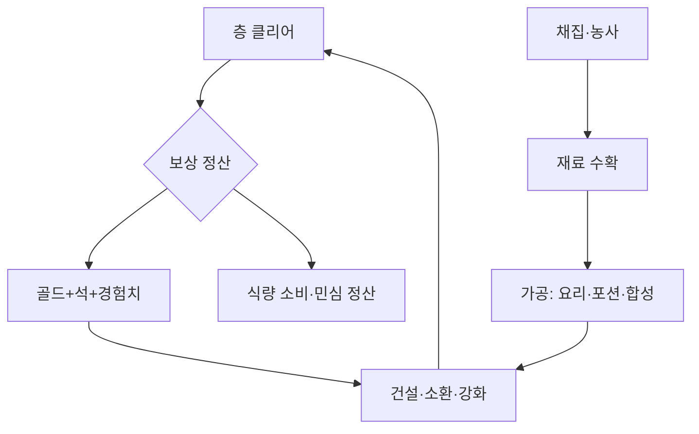

# 영지(공중섬 왕국) 시스템 v1.0 — base 확정

> [!info] 이 문서는?
> 공중섬 영지를 실제 국가처럼 굴리는 시스템. **상위 기준**: [[GDD_v8.0_00_확정사항]] #18.
> base + 업그레이드계(Lv7) + 통합収支 확정. 세부 수치 가안은 §6 후속.

---

## 1. 목적 & 범위

- **목적:** 자급자족 루프(채집·농사 → 가공 → 소환·전투 환원)로 50층 난이도 상승에 대비하는 제2 전선
- **범위 (in):** 시설 12종 · 인구 · 채집 · 농사 · 식량 · 민심 · 칙령 · 군사(파티)
- **비범위 (out):** 외교·무역(멀티섬 후속) · 징집(00 #3 교체불가와 충돌)

## 2. 설계 원칙

| # | 원칙 | 이유 |
|---|---|---|
| 1 | 단일 국고(골드) — 신화폐 없음 (**예외 1건: 전당의 은혜** — §3.12-2, 2026-09-15 확정) | 관리 피로 최소 (식량·재료·마석은 Consumable) |
| 2 | 영웅=주민 통합 — 파티는 영웅 5인만 · **주민 = 섬에 사는 사람 전체** (배치 주민 = 영웅 겸직 · 일반 주민 = 집계 개체) | 00 #3(사망 시 교체불가) 준수 · 징집 금지 · 배치 주민 기록은 HeroRecord 재사용 (00 #18) |
| 3 | 시설당 운영 1명 필수 — 미배치 시설 정지 | 인력이 곧 국력 (적성은 보너스, 필수 아님) |
| 4 | 점층 해금 — 층 게이트로 순차 개방 | 초반 과부하 방지, 목표 의식 부여 |
| 5 | 수치는 전부 가안 — 플탐에서 확정 | 00 미정B·F와 동일 취급 |

## 3. 규칙 & 수치

> [!warning] 수치 정합성
> 모든 수치는 [[GDD_v8.0_00_확정사항]] 및 부속 문서와 충돌 확인 필수.
> 아래 상수 뒤 (가안) 표시는 플탐 전 조정 예정.

### 3.1 시설 12종

| 시설 | 역할 | 해금 | 인력 |
|---|---|---|---|
| 소환제단 | 소환 실행 (130마석/회·최초 10회 무료) + 채집·농사 관리 | 1층 (초기) | 1 |
| 병원 | 부상 치료·Sanity 요양 (부활 없음) | 1층 (초기) | 1 |
| 전술소 | 전투 명령 연구/해금 | 4층 건설퀘 (1,000G) | 1 |
| 훈련장 | 경험치 획득 | 10층 | 1 |
| 식당 | 사기 회복·버프 요리 | 10층 | 1 |
| 숙소 | 스트레스 회복 + 자연증가 조건 | 10층 | 1 |
| 연구소 | 마스터 기술 연구 | 20층 | 1 |
| 연금술소 | 포션/버프 제작 | 20층 | 1 |
| 합성소 | 레벨/등급 강화·초월 (비용 — §3.1-2) | 30층 | 1 |
| 추출소 | 보유 영웅 → 영혼 결정 (자발 환원만 · 영원한 잠 — §3.1-2) | 30층 | 1 |
| 주택 | 침상 제공 (1동 +20) · 민심 +2/동 | 1층 (초기 3동) | — (패시브) |
| 영웅의 전당 | 전사자 셀렉·보관 · 100층 도달 시 부활 — 재화 '전당의 은혜' 1개/명 (§3.12-2 확정 · 용도 미정I) | 100층 | — (패시브) |

- **시설 운영 적성 (05 §6 7차 7티어 — 2026-09-15)**: 요리(식당)·간호(병원)·연구(연구소)·조제(연금술소)·대장(합성소) — 시설 5종과 1:1 대응 · `races.json` aptitude 연계 (하프링 요리++ · 노움 조제++/연구+ · 드워프 대장++ 등)
- **효율 공식 (가안)**: 시설 효율 = 기본 × 시설Lv배율(§3.10) × **운영자 티어배율** — 4 견습 ×1.10 · 5 숙련 ×1.30 · 6 장인 ×1.65 · 7 명장 ×2.30 · 티어 1~3(은닉권)은 ×1.00~1.06라 사실상 보정 없음 → **운영 슬롯엔 티어 4+ 배치 권장** (미만 배치 시 시설 기능은 작동, 효율 배율만 없음)
- **등급 게이트 (05 §6 7차)**: 명장(티어7)은 ★5+ 영웅만 보유 가능 — 소환산 명장은 극희소(30k 중 3명) · **주 확보 경로 = 숙련도 성장 (05 §6-2 확정 — 활동 기반)** · 은닉권(티어 1~3) 운영자도 활동 시 견습4로 성장해 효율 배율 획득
- 인력 = 배치 주민 (영웅 겸직 — 원칙 #2) · 표의 '1' = 겸직 영웅 1명
- 건설비는 해금 시점 누적 골드 대비 10~20%선 (가안) — 전술소 1,000G 확정, 나머지 플탐 전 확정

### 3.1-2 추출·승급 (영혼 결정 — 2026-09-15 2차 설계: 50층 ★5 파티 캘리브레이션)

> [!info] 이 서브섹션은?
> 추출소 산출물 = **영혼 결정**(승급 재료 — 소환 화폐는 '마석'으로 개명 2026-09-15, 혼동 해소). 합성소의 승급 재료·비용을 동시 정의 — §3.11 "합성강화"·§3.10 합성비 할인의 빈 참조 해소. 결정은 재료 분류 (원칙 #1 Consumable — 화폐 신설 아님).

- **영혼 결정**: 보유 영웅 추출로만 획득 (유일 수급처) · 합성소 영웅 승급 소모
- 추출 수확 (가안 — 미정G):

| 등급 | ★1 | ★2 | ★3 | ★4 | ★5 | ★6 |
|---|---|---|---|---|---|---|
| 영혼 결정 | 1 | 3 | 10 | 30 | 100 | 300 |

- 레벨 보정: ×(1+(Lv−1)×0.5%) — Lv100 ×1.50 (훈련 후 추출이 이득 — 훈련장 가치 연동 · Lv 상한 100 — 00 #14)
- 추출 규칙: 자발만 (강제 없음) · 배치·파티 편성 중 추출 불가 (해제 후 가능) · 추출 영웅 = **영원한 잠** — 동일 개체 재등장 불가 (이름 재추첨 05 §8 구조) · 영웅의 전당(전사자) 등재 대상 아님 · ★5+ 추출 시 2차 확인 팝업 (v7.12 승계) · **부산물 없음** — 결정 단일 산출 (기억 조각 삭제 2026-09-15 · 부산물은 플탐 후 필요 시 신설)
- 승급 비용 (합성소 — 가안 · 미정G):

| 승급 | 영혼 결정 | 골드 (합성비 — §3.10 할인 적용 대상) |
|---|---|---|
| ★1→★2 | 25 | 50 |
| ★2→★3 | 100 | 200 |
| ★3→★4 | 375 | 750 |
| ★4→★5 | 1,200 | 2,400 |
| ★5→★6 | 3,000 | 5,000 |
| ★6→★7 초월 | 미정C — 재료 미설계 (기억 조각 삭제됨 — 초월 재료 별도 설계) | 8,000 |

- **캘리브레이션 (50층 = ★5 파티 1개 — 00 미정B 연동)**: 50층 누적 소환 3,467회 → 추출 기대 결정 **11,252개** (★1 2,671 + ★2 2,288 + ★3 2,669 + ★4 3,317 + ★5 190 + ★6 115 — 레벨 보정 ×1.1 포함). ★1→★5 승급 = 1,700결정+3,400G/영웅 → 파티 5인 = **8,500결정 + 17,000G = 수급의 76%**. 뽑기 기대 ★5 1.73 + 승급 3.3명 → **50층에서 ★5 파티 1개 완성선** · 잔여 ≈2,752결정 = 예비 ★5 2.3명 — **영구사망 대응 여유 (의도된 설계 · 시뮬 2026-09-15)**: 현행 1,200 vs 엄격 1,700(수급 98% · 예비 0.2명) 비교 결과 현행 채택 — 전형 유저 기준 목표 달성 보장. 100층 누적 ≈75,865개 — ★6 파티 (15,000결정+25,000G) 여유 · 초월 추진 병행 가능. **★6 완성 시점은 설계 목표가 아님 (2026-09-15 사용자 결정)** — 100층 런 내 완성 가능하면 충분하며 의도적 지연·싱크 조정은 하지 않음
- 골드 규모: 승급 파티 17,000G = 50층 던전 누적 수입(127,500G)의 13% — **결정이 주 게이트, 골드는 부 게이트** (건설·업글·유지비와 경쟁)
- 소환→추출 순환 시 마석 0 반환 — 순환 루프 없음 (손실만) · **소환 = 풀 확장, 합성소 = 육성** 분업

### 3.2 인구 (00 미정E → 확정)

| 항목 | 수치 |
|---|---|
| 초기 | 30명 (배치 5 — 운영 1[제단]·채집 4 + 일반 주민 25) · 주택 3동 (침상 60) |
| 증가 | 게이트 구출 +25/게이트 · 자연증가 **인구×2%/층** (개발도상국 평균 성장율 기반 — 100층 만렙 근접) |
| 침상 | 주택 1동당 +20 (가안) · 유효 상한 = min(스테이지 상한, 침상수) · 자연증가는 빈 침상 있을 때만 |
| 상한 | 60 / 150 / 400 / 1300명 (섬 S1~S4 — §3.8) |
| 주민 세금 | 주민 1명당 층 클리어마다 +1G (가안 — 2026-09-15 재설계 · 구 '+1G×층' 폐지) |

- S1 상한 60은 10층 전후로 포화 — S2 해금이 인구 병목 해소 수단이 됨 (의도된 압박)
- 용어 통일 (2026-09-15): **주민 = 섬에 사는 사람 전체** — 배치 주민(영웅 겸직·HeroRecord 공유) + 일반 주민(비배치·집계 개체). 구 '유민' 표현 폐지 · 증가분(구출·자연증가)은 일반 주민으로 합류
- 세금 재설계 (2026-09-15): 구식 '+1G×층'은 후반 폭발 (주민 1,300·80층 = 10.4만G/클리어 = 던전 수입의 13배 — §3.11 모순) → 플랫 +1G/명 확정. 수지: 클리어당 던전 수입의 6~16% (S1 30~60G vs 500G · S4 1,300G vs 8,000G) · 런 누적 가안 ≈5만G (던전 총수입 50.5만G 대비 ~10% 보조). 단가 튜닝은 미정G
- 초기 배치 근거 (2026-09-15 정정): 초기 가동 시설 = 제단 1 (병원은 건설만 — 영웅 여유 시 배치) → 배치 5 = 운영 1 + 채집 4. 초기 영웅 수요 파티 5 + 배치 5 = **10 = 무료 소환 10회 (00 #17) 정확 일치**
- 배치 수요 상한 (§3.10 연동): 파티 5 + 운영 11 (제단·병원·전술소·훈련장·식당·숙소·연구소·연금술소·합성소·추출소 10종 + 전당 부활 셀렉 1) + 채집 20 (5팀×4) = **36 영웅** — 소환으로 충당 · 잉여는 추출소 환원 (§3.1)
- 소환 경제 정합 (2026-09-15 재계산 — 00 #19 재계산표 연동): 영웅 수요 36 = 4,680마석 = **18회 소환분** — S4 해금(50층) 누적 티켓 3,467회의 **0.5%**·100층 누적 23,376회의 **0.08%**. 소환은 등급 경쟁(★5~★6 추구)이 소비 주체 — 배치 수요는 소환 경제의 제약이 아님. 참고: E[★5] = 36×0.05% = 0.018장 — 소환 36회 전부 ★1~★3 기대, 배치 효율 +20%(적성 일치)는 적성 롤(05) 분포에 의존. 소환 소비·재화 설계와 무충돌

### 3.3 채집 (구 파견/원정 → 개편 2026-09-14)

- **원정(3층 귀환·파편) 폐지** — 파견대는 채집대로 전환. 층 진행이 리듬의 중심
- 편성: 1팀 4명 (배치 주민 = 파티 미편성 영웅 겸직 — 원칙 #2 통합 모델) · 제단 Lv으로 팀 확충 (최대 5팀)
- 대상: **이미 클리어한 층** 재입장 — 층당 수확 쿨 **24h (마지막 수확 시점 기준 · 갱신형)** · 동일 층 반복 수확 가능 (24h마다 1회)
  - 2026-09-14 재정의: 기존 "깬 시점부터 24h 내"는 미접속 시 수확 기회 영구 소멸 = 위장 FOMO — §3.13 (접속보너스 없음·FOMO 배제) 과 모순
  - 층 진행 유인은 여전히 성립: 수확 배율 ×(1+층/50) — 상위층이 하루 수확량 자체가 큼
- 전투·리스크 없음 (소탕 완료 층)
- 수확/회 (가안): 식량 150 · 약초 10 · 목재 8 · 광석 5 — 식량은 ×(1+층/50) · 계절 보정 (§3.13) · 층당 쿨 24h (§3.3 대상 항목 참조)
- **특성 효율** (배치 주민 = 영웅의 생성 적성 롤 + 종족 aptitude 연계 — 05 §6 7차): 채집·벌목·농부·목수·광부 — **7티어** · 1~3 은닉권(×1.00~1.06) · 4 견습 ×1.10 · 5 숙련 ×1.30 · 6 장인 ×1.65 · 7 명장 ×2.30
  - 채집(식량·약초) / 벌목(목재) / 광부(광석) 효율 = 티어 배율 적용 (가안)
  - **채굴(광석)은 광부 티어 4+ (견습) 보유자만 가능** (견습부터 카드 표시 — 은닉권은 사실상 없음 취급)
  - 목수: 건설·수리 시간 경감 — 티어 배율 적용 (가안)
- 영혼파편 폐지 — 마석은 던전(퇴장+게이트)에서만 수급 (§3.9)
- 광석 용도: 장비 강화 재료 (골드 강화비와 병행 — 01 §3 ③) · 수요 대비 수급은 채굴 특성 필수라 병목 가능 — 플탐에서 재고 확인 (미정G)

### 3.3-2 농사

- 필지: 주택 1동당 경작지 1 (가안) — 초기 3필지
- 작물: 곡물(식량 30/수확 · 성장 2일) · 약초(약초 3 · 3일) — 가안
- 성장: 현실시간 기준 (§3.13) · 계절 보정 (가을 수확 +10% · 겨울 파종 불가·수확 -30% — §3.13 원문 · 봄은 인구 자연증가 ×1.5)
- 농부 적성: 티어 배율 적용 — 4 견습 +10% · 5 숙련 +30% · 6 장인 +65% · 7 명장 +130% (05 §6 7차 · 가안)
- 수확은 층 클리어와 독립 — Hub 접속 시 정산

### 3.4 식량

| 항목 | 수치 |
|---|---|
| 소비 | 주민 1명당 층 클리어마다 1 (가안 — 영웅 겸직 포함 전 주민) |
| 생산 | 채집(§3.3) + 농사(§3.3-2) + 식당 가공 (운영자 요리 티어 배율 — 05 §6) |
| 부족 | 민심 -5/층 → 3층 지속 시 아사 (§3.14) |

### 3.5 민심 0~100 (50 시작)

- 상승: 게이트 승리·분배 칙령·식량 풍족 / 하락: 고세율·기아·도적 습격
- 효과: 전 생산 ±20% — 수치화 **(민심-50) ÷ 50 × 20%** (50 기준 0) / 20 미만 지속 시 파업 — 전 생산 정지 5층 (§3.14) (가안)
- 민심 = 섬 단위 지표 — 영웅 개인 사기(§3.6-2)와 별개 (혼동 주의)

### 3.6 군사

- 상비군 = 출격 파티 5인 (영웅). 예비·징집 없음 — 00 #3 준수
- 훈련장은 경험치 전용

### 3.6-2 영웅 상태 회복 (사기·스트레스·Sanity — 2026-09-14 신설)

> [!info] 이 서브섹션은?
> [[GDD_v8.0_01_등급_전투력]] §5 상태보정(C)의 **회복 경로** 정의 — 01 §5 "식당·추모·숙소 전까지 수동 설정" 갭 해소.
> 영지는 회복만 담당. 전투 중 감소(전투 참가 Sanity -5 · 아군 사망 목격 -10 등)는 01 §5 소관.

**공용 규칙**

- 정산 타이밍: Hub 귀환 시 자동 정산 (농사 정산 §3.3-2와 동일 타이밍) · 접속보너스 없음 (§3.13)
- 사기 = 영웅 개인 지표 — 섬 단위 민심(§3.5)과 별개 (혼동 주의)
- 운영자 미배치 시설의 회복은 정지 (원칙 #3)
- 식당·숙소 해금(10층) 전: 사기·스트레스는 01 §5 수동 설정값 유지
- 상태보정: C = clamp(1 + 사기 + 스트레스 + Sanity, 0.80, 1.10) — 01 §5

| 상태 | 담당 시설 | 회복 규칙 (가안) | 비고 |
|---|---|---|---|
| 사기 (낮음/보통/높음) | 식당 | 귀환 1식 → 1단계 회복 · 추모 보너스 §3.12와 중첩 · **요리 XP +1 (05 §6-2)** | 01 §5 보정 ±5% |
| 스트레스 (보통/높음/한계) | 숙소 | 귀환 시 1단계 회복 | 01 §5 보정 -5%/-10% |
| Sanity (0~100, 영웅별) | 병원 | 병상 요양 +10 (L1 기준) · +5/Lv (L7 +40 — §3.10) · **간호 XP +1/명 (05 §6-2)** | 병상 2~14 (§3.10) · 경고 <50 · 위험 <25 (01 §5) |

- 요양(병원) 적용 조건: 해당 영웅이 다음 출격 미편성일 때만 (가안) — 요양과 출격 동시 불가
- 버프 요리·재료 소모는 §3.1 기존 기능 — 회복과 별개 · 버프 강도는 운영자 요리 티어 배율 (×1.10/1.30/1.65/2.30 — 05 §6 7차)
- 회복 수치 전부 가안 — 미정G (플탐)

### 3.7 칙령 (10층 해금, 1슬롯 — 2026-09-14 리밸런스 · 2026-09-15 구조 확정)

> [!warning] 리밸런스 사유
> 기존안은 중상주의 지배적 — +30% 골드 대가가 민심 -10(생산 약 -4%)뿐이라 나머지 2종 쓸 이유 없음.
> 3종이 **서로 다른 자원을 올리고 내리는** 구조로 재조정. 수치 전부 가안 (미정G).

> [!success] 2026-09-15 사용자 결정
> **트레이드오프 구조(3종 자원 상충) 확정** — 우위 칙령 없음. 수치는 플탐(미정G)에서 확정, 이 문서 수치는 가안 유지.

| 칙령 | 올라가는 것 | 내려가는 것 | 니치 (언제 쓰나) |
|---|---|---|---|
| 중상주의 | 세금 +30% | 민심 -15 | 골드 급할 때 (확장·건설 저점) — 민심 여유 있을 때만 |
| 분배주의 | 민심 +15 · 자연증가 +50% (가안 신설 — §3.2 연동) | 세금 -20% | 민심 회복 · 인구 병목 해소 (S2~S3 포화 구간) |
| 채집장려 | 채집·농사 수확 +20% | 민심 -5 (공공 노역 강화) | 식량·재료 급할 때 (겨울 · 인구 급증기) |

- 기본 1슬롯 · **30층부터 2슬롯** (동시 발효 2개 — §3.10) · 변경 쿨다운 5층 (가안)
- 민심 생산 보정 수치화: **(민심-50) ÷ 50 × 20%** (§3.5 명시) — 중상주의 -15 ≈ 생산 -6% · 채집장려 -5 ≈ -2% · 분배주의 +15 ≈ +6%
- 조합 긴장 (2슬롯 — 30층, §3.10): 중상주의+채집장려 = 민심 -20 → 50 기준 30 · 기아(-5/층)·겨울(-5) 중첩 시 파업(20 미만) 권 — 의도된 트레이드오프
- 채집장려는 골드 수입 무관 — 골드가 필요하면 중상주의, 생존이 급하면 채집장려 (선택 기준 명확)

### 3.8 섬 스테이지

| 스테이지 | 조건 | 인구 상한 |
|---|---|---|
| S1 | 초기 | 60 |
| S2 | **12층** + 3,000G (가안 — 2026-09-15 사용자 결정 · 10층 파산점 완화 · 시뮬 fixB 검증: 최초 골드<0 지점 10→20층) | 150 |
| S3 | 25층 + 10,000G (가안) | 400 |
| S4 | 50층 + 30,000G (가안) | 1300 |

- 10층 시점 지출 밀집 주의: S2 확장 3,000G + 훈련장·식당·숙소 건설비 동시 도달 — **B안 채택으로 S2 해금 12층 지연 (2026-09-15 확정)** · 10층 잔고 +835로 전환 (시뮬 fixB — 충동형 최악 정책 기준 유일 흑자안) · §3.10 업글 Lv2는 15층으로 분산
- 20·25·50층에서도 동일 클러스터 패턴 반복 (해금 시점 강제 지출 > 구간 수입) — 근본 구조는 별도 과제 (미정G)

### 3.8-2 식민섬 개방 (방향 확정)

- 식민섬 9개는 **구름에 잠긴 상태** — 해금 장치(비행정·구름제거장치 등, 이름·형태 미정)로 하나씩 개방
- 개방 시점: 본섬 도달층 10·20·…·90층 게이트마다 1개씩 (가안)
- 식민섬의 인구·석 수급 규칙은 **멀티섬 확정 시 별도 설계** (미정) — 골드 배율(1+0.2×식민섬수)만 선반영

### 3.8-3 인구 렌더링 (1섬 1,300 · 총 13,000)

- **통계+대표 이중 표현**: 인구는 숫자로 관리하되, 3D로 보이는 건 섬당 **최대 500명의 대표 주민(군중)** (GPU Instancing — 1드로우콜 · 저폴리 500~2k 트라이 + 쿡드 애니 기준)
- 가시 규칙: 인구가 500 이하면 **전원 실시간 가시** · 500 초과분은 집 밝힘·인구 배지로 표현 — S3(400명)까지는 도시가 꽉 차 보임
- 나머지는 집 밝힘·굴뚝 연기·인구 배지로 존재감 표현 ("도시가 살아있다" 연출)
- 대표 주민(군중) 배회: 단순 웨이포인트 로직 (개별 AI 아님) · 새/구름과 동일한 배경 배우 취급 · 500개도 LOD로 원거리 퇴화
- 전투·적성·개별 심리는 **배치 주민(영웅 겸직) 전용** — 일반 주민은 집계 개체 (개별 기록·이름·대화 없음 · 3D 군중은 렌더링 전용)
- 확장: 특별 주민(군중 중 이름 있는 인물 1~3명/섬)만 이름·대화 보유 (연출용)

### 3.9 뽑기 쿼터·마석 수급 (피로도)

- 쿼터: 누적 뽑기 **공급 목표** = 2 × 총인구 상한 (하드캡 아님) — 단계 목표는 본섬 상한 기준 (S1 120·S2 300·S3 800·S4 2,600 = 00 #19) · 최종 목표 26,000회 = 2 × 전 섬 총인구 13,000 (00 #16)
- 수급: 던전(탑) 퇴장 시 마석 지급 — 컨셉 "탑이 영혼을 피로도처럼 뜯어감"
- 지급식 (가안): **퇴장 층수×30석 + 게이트잭팟 (게이트층²×75)** — 계수 75는 2026-09-14 재계산 (기존 1,000은 목표 대비 약 11배 초과 공급 — 아래 표)
- 기존 "3층당 1석" 룰 폐지 (본 룰로 대체)
- 무료 10회 유지 — 쿼터 초과분으로 흡수 (파편 폐지)
- 지급식 계수 튜닝은 미정G (플탐)

**수급 재계산표 (2026-09-14 — 티켓 130마석 기준)**

| 시점 | 퇴장 누적 (층×30) | 잭팟 누적 (층²×75) | 합계 (마석) | 티켓 환산 | 쿼터 목표 | 달성률 |
|---|---|---|---|---|---|---|
| S2 해금 (12층) | 2,340 | 7,500 | 9,840 | 75회 | 120 | 63% |
| S3 해금 (25층) | 9,750 | 37,500 | 47,250 | 363회 | 800 | 45% |
| S4 해금 (50층) | 38,250 | 412,500 | 450,750 | 3,467회 | 2,600 | 133% |
| 100층 완주 | 151,500 | 2,887,500 | 3,039,000 | 23,376회 | 26,000 (전 섬) | 90% |

- 100층 본섬 단일 수급 23,376회 = 최종 목표 26,000회의 90% — 잔여는 식민섬 수급(§3.8-2 미결) + 무료 10회로 보강
- 초반(S2·S3) 45~63% 미달 — 무료 10회·저등급 위주 소비로 흡수, 미정G에서 재검토 (S2 행 12층 기준 재계산 동기화)
- 미정B 연동: 50층 3,467회(E[★5] 1.73·E[★6] 0.35) · 100층 23,376회(E[★5] 11.7·E[★6] 2.3) — 00 미정B 표와 동기화

### 3.10 업그레이드계 (Lv1~7 · 만렙 L7)

| Lv | 1 | 2 | 3 | 4 | 5 | 6 | 7 |
|---|---|---|---|---|---|---|---|
| 해금층 (가안) | 1 | 15 | 35 | 45 | 60 | 75 | 90 |
| 비용 (가안) | — | 3천 | 8천 | 2만 | 4만 | 8만 | 15만G |

- 병상(병원): 2,4,6,8,10,12,14 · Sanity 회복 +10부터 +5/Lv (L7 +40)
- 침상(주택): 20,35,50,65,80,95,110 (+15/Lv) · 민심 +2부터 +1/Lv
- 채집팀(제단): +1/Lv, 5팀 상한 — L6+는 채집·농사 수확 +15%/Lv
- 명령(전술소): L1 이동·집중 / L2 방어 / L3 후퇴 / L4 쿨-30% / L5 게이지상한+50 / L6 효율+20% / L7 쿨-50%
- 배율형(훈련·연구·연금효율): ×(1+0.5×(Lv-1)) → L7 ×4.0 · **최종 효율 = 시설Lv배율 × 운영자 적성 티어배율(4/5/6/7 — 05 §6)** 곱연산
  - 예: 연구소 L4(×2.5) × 장인 운영자(×1.65) = ×4.13 · 명장이면 ×5.75 — L7+명장 조합은 ×9.2 (후반 연구 가속 설계)
  - 명장(티어7)은 ★5+ 영웅만 보유 — 소환 30k 중 3명 수준의 극희소 운영자 · **주 확보 경로 = 숙련도 (05 §6-2)**: 장인 운영자로 활동 누적 → XP 120 + 10,000G → 명장 (★5+ 게이트 유지)
- 합성비: -5×(Lv-1)% (L7 -30%) · 추출환원: +10×(Lv-1)% (L7 +60%)
- 특수: 연금 상위 L3/최상위 L5 · 합성 초월 L6 · 연구 최종기술 L7 · 숙소 자연증가 +5,+8,+12,+16,+20,+24,+28
- 칙령 2슬롯: 30층 해금 (동시 발효 2개)

### 3.11 통합収支 (경제↔영지)

| 재화 | 수입원 | 지출처 |
|---|---|---|
| 골드 | 던전 100×층×(1+0.2×식민섬수) · 주민 세금 · 재료 매각 | 건설·업글·섬확장·합성비 · **유지비** 10G×Lv/섬 하루 (§3.12) |
| 마석 | 던전 퇴장 층×30·게이트잭팟 · 무료 10회 | 소환 130마석/회(티켓) — 합성·승급은 영혼 결정·골드로 이관 (§3.1-2) |
| 식량 | 채집×tier · 농사 · 식당 가공 | 인구 1인1층 1 |
| 재료 | 채집·농사 · 추출소(영혼 결정) | 가공(요리·포션) · 영웅 승급(합성소 — §3.1-2) · 장비 강화(광석) · 매각 |

- 골드 (100층 누적 50만 vs 풀업 330만+확장): 전부 못 찍음 — 선택과집중 성립 · **유지비 총액 가안 ≈84만G** (12종×L7×10G — 100층 구간 환산) > 수입 50.5만G — 비용 체계 전반 미정G 재조정 대상 (2026-09-15 재기록 — §3.12-2 제안서 축소 시 유실분 복원)
- 마석 (본섬 단일): 100층 누적 3,039,000마석 = 티켓 23,376회 — 최종 목표 26,000회의 90% · S4 시점 133% — 수급 폐쇄 (§3.9 재계산표). 멀티섬분 수급은 미결 (§3.8-2)
- 본 표 상수는 전부 가안 — 플탐에서 확정 (미정G)

**식량 수지표 (2026-09-14 — 가안 · 미정G)**

> [!info] 가정
> 채집: 쿨 24h 갱신형 (§3.3) — 팀당 섬 하루 1회 수확 · 팀수 = 제단 Lv (L5=5팀 · L6/7 수확 +15/+30%) · 팀수 해금층 1/15/35/45/60 (§3.10) · 특성 티어 배율 미적용 기준 (견습+ 투입 시 상향 — §3.3)
> 농사: 필지 = 주택 동수 = 인구÷20 자동 스케일 · 곡물 15식량/일/필지 (30÷2일) · 약초 전용지 제외
> 식당 ×1.2 (10층+) · 민심 50 (보정 0) · 평시 계절 · 칙령 없음 기준
> 소비 = 인구 × 1/층 클리어 (§3.4) — 생산은 실시간, 소비는 클리어 속도 비례 → **손익분기 클리어율**이 핵심 지표

| 스테이지 | 대표 층 | 인구 | 팀수 | 채집/일 | 농사/일 | 합계/일 (식당 포함) | 소비/일 (1층 기준) | 수지 | 손익분기 |
|---|---|---|---|---|---|---|---|---|---|
| S1 | 5 | 30→60 | 1 | 165 | 45 | 210 (식당 전) | 30~60 | 흑자 ×3.5~7.0 | 3.5층/일 |
| S2 | 17 | 150 | 2 | 402 | 120 | 626 | 150 | 흑자 ×4.2 | 4.2층/일 |
| S3 | 40 | 400 | 3~4 | 810~1,140 | 300 | 1,332~1,728 | 400 | 흑자 ×3.3~4.3 | 3.3~4.3층/일 |
| S4 초반 | 55 | 1,300 | 4 | 1,260 | 975 | 2,670 | 1,300 | **최저 ×2.1** | **2.1층/일** |
| S4 중반 | 80 | 1,300 | 5 (L6) | 2,243 | 975 | 3,862 | 1,300 | ×3.0 | 3.0층/일 |
| S4 후반 | 95 | 1,300 | 5 (L7) | 2,828 | 975 | 4,563 | 1,300 | ×3.5 | 3.5층/일 |

- **결론: 전 구간 흑자 (×2.1~7.0)** — 쿨 24h 갱신형 전환(§3.3)으로 생산이 실시간 누적되면서 기존 우려(상한 인구 대비 생산 부족) 해소
- **진짜 리스크 = 클리어 속도**: S4 손익분기 2.1~3.5층/일 — 이보다 빠르게 밀면 적자. 겨울(식량 ×0.7) 중첩 시 1.5~2.4층/일로 하락 → 빠른 푸셔+겨울 = 의도된 압박 (칙령 채집장려 +20%·민심 +20%·식량 재고로 완화)
- **취약 구간: S4 초반 (45~60층)** — 팀수 4→5 전환 전 최저점 ×2.1. 인구 1,300 도달을 60층 이후로 유도됨 (S4 해금 50층 + 자연증가 시간) — 의도와 일치
- 변동 요인: 겨울 -30% · 가을 +10% · 민심 ±20% (§3.5 수치화식) · 칙령 채집장려 +20% · 도적(채집대 1팀 차출 = -20%) · 흉작 -30% (§3.12) — 최악 중첩 시 S4 적자 확정 → 재고 운영 필수
- 농지 자동 스케일: 인구↑ → 주택↑ → 필지↑ — 농지 별도 확장 룰 불필요 (약초 전환 시 식량 감소 트레이드오프만 존재)
- 플탐 확인 항목 (미정G): 실제 평균 클리어율 vs 손익분기 — S4 초반 2.1층/일이 너무 빠듯하면 제단 L5 해금 60→55층 완화 검토

**재화 흐름 시뮬 (2026-09-15 — `_tools/sim_economy.py` · 재실행 가능 · 가안)**

> [!info] 시뮬 가정
> 런 페이스: F1-10 ×3.0 · F11-25 ×2.5 · F26-80 ×2.0 · F81-100 ×1.5 (층/일) · 인구 = §3.11 수지표 행 보간 · 주민 세금 플랫 +1G/명·클리어 루프 반영 · 소환 버퍼 1만 마석 초과분 전량 소환 (무료 10회 포함·무료분도 추출) · 배치 36명 제외 전량 추출 (레벨 보정 ×1.1) · 승급 결정·골드 즉시 집행 · 건설비·업글비는 미정이라 수지표 정합 가안 (10층 3종 3,000 · 업글 3,000×2^(L-1)) · 미적용(의도적 제외): §3.10 합성비·추출환원 보너스 (상향 여유분) · 식민섬 · 사건/계절/칙령 · 전당의 은혜

| 시점 | 런 일차 | 골드 | 마석 | 영혼 결정 | 비고 |
|---|---|---|---|---|---|
| 10층 | 4 | **-2,165** | 50 | 142 | 확장+건설 3종 몰림 — 발견 1 참조 |
| 25층 | 9 | -3,687 | 10,070 | 842 | S3 확장 후 적자 구간 |
| 50층 | 22 | -21,735 | 10,050 | 5,799 | S4 확장 3만G 직후 최저 |
| 80층 | 37 | 20,365 | 10,000 | 8,223 | ★6 파티 완성 (참고값 — 설계 목표 아님) |
| 100층 | 50 | 11,365 | 10,000 | 43,411 | 풀업 미달 (평균 Lv5) — 선택과집중 성립 |

- 발견 1 — 10층 골드 파산점: 필수 지출(전술소 1,000 + 10층 시설 3종 + S2 확장 3,000) ≈1만G vs 던전 누적 수입 5,500G → 구조적 적자 (세금 반영 후에도 -2,165G) — **B안 S2 12층 지연으로 해결 (D-251 · 2026-09-15)**
- 발견 1-2 — 파산점 해결안 비교 (2026-09-15 시뮬 `fixA/B/C` — 충동 업글형 최악 정책 하):

| 안 | 10층 잔고 | 최초 골드<0 | 비고 |
|---|---|---|---|
| A 시작 골드 5,000 | -3,365 | 10층 | 여유분이 즉시 업글로 소진 — 단독으론 미해결 (저축형 플레이어에만 유효) |
| **B S2 확장 12층 지연** | **+835** | 20층 | **최악 정책 기준 유일 흑자** · 총지출·★5/★6 곡선 불변 (경제 왜곡 0) |
| C 10층 건설비 50% 감면 | -665 | 10층 | 적자 절반 — 그러나 미완 해결 + 특례 룰 복잡도 |

  **채택: B안 — S2 해금 12층 (D-251 확정 · §3.8 표 반영)** — 부작용은 S1 포화 2층 연장뿐. 13층 변형은 시뮬상 이점 없음 (파산 지점이 S3라 12층 이후 잔고 동일) — 기각. 보완 옵션: 소액 시작 골드 1,000~2,000 병행 시 저축형·충동형 모두 커버 (미정G · 플탐 판단)
- 발견 1-3 — 지출 클러스터 재설계안 비교 (2026-09-15 시뮬 `cluster_S1~S4` — 전부 D-251 기반): 근본 구조는 "해금 시점마다 강제 지출(확장+건설)이 구간 수입 초과" — 20·25·50층에서 반복

| 안 | 25층 잔고 | 50층 잔고 | 최초 <0 | 골드 최저 | 판정 |
|---|---|---|---|---|---|
| S1: S3 확장 28층 지연 | +3,313 | -21,735 | 20층 | -21,735 | 25층 해결 — 50층 그대로 (부분) |
| S2: 확장비 분할 50%+3층 | +1,313 | **-6,735** | 20층 | **-6,735** | **25·50층 동시 완화 — 최고 효율** |
| S3: 시작 골드 2,000 | -4,887 | -19,935 | 10층 | -19,935 | 충동형에 무력 (D-251 A안과 동일 결함) |
| S4: 분할 + 소액 조합 | +113 | -4,935 | 10층 | -7,775 | 골드 최저 개선 · 10층 재적자 (↑) |

  **추천: S2안 확장비 분할 (해금 시 50% + 3층 후 잔여 50%)** — 건설 2층 소요 룰(§3.12)과 정합 (미가동 구간이 이미 존재해 분할이 자연스러움) · 모든 확장 지점 잔고 최소 6,735 이상 확보 · S3 확장 28층 지연과 조합 가능 (25층 잔고 +3,313). 단, 최종 확정은 플탐(미정G) — 현재는 시뮬 근거 기록만
- 발견 2 — 유지비는 런 기간 함수: 유지비는 시간 비용·수입은 진행 비용이라 총액 비교가 런 기간 가정에 의존 — 50섬일(속공) ≈2.8만G · 700섬일(현실 ≈100일) ≈59만G · 상기 ≈84만G는 ≈1,000섬일(현실 ≈143일) 가정. 미정G 재조정 시 '예상 런 기간' 기준으로 재산정할 것
- 발견 3 — 결정 경제 동적 검증 통과: 런 획득 75,411 vs 정적 추정 75,865 (오차 0.6%) · ★5 파티 55층 완성 (목표 50 — 소환·추출 배분 탓 ±5층 내 허용) · ★6 파티 80층 관측 — **★6 완성 시점은 설계 목표 아님 (2026-09-15 사용자 결정): 100층 런 안에 완성만 되면 충분 · 싱크 조정·소모처 추가 검토 불필요 — 시뮬의 '목표 90' 표기는 관측 참고값으로 강등**
- 발견 4 — 식량 무아사: 전 구간 흑자로 100층 재고 6.4만 누적 → 흉작·겨울이 재고 보유자에겐 무력화 — 식량 소모처 확대 or 이벤트 강도 상향 검토 (미정G)
- 발견 5 — 마석 루프 없음 동적 확인: 추출 환원 0 — 수급 3,039,000 = 소비 정합 (§3.9표와 일치)

**스트레스 시나리오 (2026-09-15 — 같은 시뮬러 `stress` 모드 · 순수 최악 · 칙령·재고 완화 미적용)**

> [!warning] 조건 (전부 §3.5·§3.12·§3.13 가안 계수)
> 전 기간 겨울 ×0.70 · 흉작 10일 주기 ×0.70 · 도적 12일 주기 (금고 -10% + 채집팀 1팀 2일 차출) · 민심 25 (생산 ×0.90 — 파업 임계 20 직전) · 아사 룰 §3.14 (식량 0 3층 지속 → 인구 -2%/층)

- **결과: 무너지는 건 골드가 아니라 S1~S2 식량** — 최초 식량 0 도달 **2층**, 아사 누적 34층, 인구 **-40.9%** (S1 인구 30~60 구간이 생산 여유 ×3.5~7.0인데도 겨울×흉작×저민심 동시 적용 시 소진)
- **골드 붕괴 구간은 baseline과 동일** (10층·50층) — 도적 금고 피해 합계 ≈2,155G로 소액. 골드 문제의 본질은 건설·확장 타이밍 (발견 1·1-3)이지 사건이 아님
- **완화 장치 정량 비교 (2026-09-15 — `mitig_decree/stock/both`)**:

| 완화 장치 | 아사 층수 | 인구 손실 | 비고 |
|---|---|---|---|
| (없음 — stress) | 34 | -40.9% | 순수 최악 기준선 |
| 채집장려 칙령 (+20%) | 22 | **-27.6%** | 초기 2~10층은 여전히 무력 — 칙령 단독 불충분 |
| **재고 운영 (재고<500시 클리어 속도 절반)** | **6** | **-0.0%** | **단독으로 스트레스 전멸 방어 — '재고 운영 필수' 정량 입증** |
| 칙령+재고 조합 | 5 | -0.0% | 재고 단독과 유사 — 칙령은 보조 |

  **결론: 생존 열쇠는 칙령이 아니라 재고 운영** — 칙령은 생산량 증폭이라 초반 0 재고 구간엔 도움 안 되고, 재고 운영(속도 절제)은 최악 중첩도 완전 방어. §3.13 '재고 운영 필수' 문장의 정량 근거 확보. 플탐 체크: 재고 운영을 하지 않는 유저에게 스트레스 난이도가 과한지 별도 검토 (미정G)
- **승급 곡선은 사건에 강인** — ★5·★6 파티 완성 층수 불변 (55/80층). 결정 수급은 소환 기반이라 식량·민심 피해와 분리
- **플탐 체크 항목 (미정G)**: (1) 사건 주기·흉작 강도를 S1 상한 60 구간 기준으로 튜닝 — 최악 중첩 시 초반 생존 위기가 의도보다 과함 (2) '재고 운영 필수' 기존 문장의 정량 근거로 본 시나리오 활용 → 완료 (완화 장치 비교표 — 재고 운영 단독으로 전멸 방어 입증)
- 시뮬 한계: 단일 결정론적 러프 (사건 주기·민심 고정 가정) — 실제 플탐 분산은 이보다 큼. 방향성 검증용으로만 사용

### 3.12 추모·사건·건설운영

- 추모 (광장 비석 — 시설 아님): 전사 영웅 자동 안치 · 장례비 200G/명 (가안) · 추모 1명당 민심 +1 (최대 +10) · 파티 사기 +2%/명 (최대 +10%) (가안) · 100층 도달 시 영웅의 전당(§3.1)으로 이관·부활 가능 (재화 '전당의 은혜' — §3.12-2 확정) · 부활 후 용도는 미정I
- 사건·재해 (5층마다 30% — 가안): 역병(방치 인구-5% / 500G 격리 시 -1%) · 풍년·흉작(식량 +50%/-30%) · 폭풍(시설 1동 파괴 → 수리비는 건설비 50%) · 생존자 합류(+15명 or 거부 시 민심+3) · 도적(금고-10% or 채집대 1팀 차출 격퇴 — 초반 1팀 구간은 차출 시 수확 정지, 골드 지불 선택 유인) (가안)
- 건설운영: 건설 2층·업글 1층 소요 (그 사이 미가동) · 유지비 시설당 10G×Lv/**섬 하루** (가안 — 층 클리어 횟수와 무관, §3.13 섬 시간 기준 · 재입장 파밍 시 유지비 폭탄 방지 · 미정G)

### 3.12-2 부활 재화 — 확정: 신규 재화 "전당의 은혜" (2026-09-15, 사용자 결정 — 안 B 채택)

> [!success] 상태: 확정
> 원칙 #1(단일 국고)의 **명시적 예외** — 부활 가치를 골드 인플레(미정G 재조정)에서 격리하는 것이 예외 채택 사유.

- **재화**: 전당의 은혜 — 기존 재화 체계(골드·마석·식량·재료) 외 별도 신설 · 원칙 #1 예외 (2026-09-15 결정)
- **획득**: 100층 클리어 보상으로 N개 지급 — 획득 경로는 100층 도달뿐 (획득 시점 단일 통제 → 부활이 권리가 아닌 성취 · 00 #3 전력 영구감소 정신 유지)
- **소모**: 부활 1명 = 1개
- **성격**: 부활은 서사적 이벤트 — 반복 농사용 소모품 아님 (00 #3 승계)
- **잔여 미정**: 지급 개수 N은 미정I(부활 후 용도: 타 섬 대결 등) 설계와 연동 — 플탐 후 확정

### 3.13 시간 (24h·365d — 현실 연동 · ×7배속)

- 섬 시간 = 기기 현실 시간 × **7배속** (현실 1시간 = 섬 7시간) — 농사·채집 쿨이 현실 몇 시간 단위로 체감
- **게임플레이 배속 아님** — 전투·캐릭터 애니는 정상 속도. 시계·성장 타이머만 섬 시간 따름
- 낮밤·사계절은 섬 시간 기준 (계절 1바퀴 = 현실 약 52일)
- 계절 (월 기준 · 가안): 봄(3~5월) 자연증가 +50% · 여름(6~8월) 평시 · 가을(9~11월) 채집·농사 수확 +10% · 겨울(12~2월) 식량수확 -30%·민심 -5
- 낮/밤 (18~6시 야간): 연출のみ — 플레이 페널티 없음
- 접속보너스 없음 (일회성 구매 게임 — FOMO 배제)

### 3.14 엣지 룰 (가안)

- 상한 초과 구출분: 수용 불가 (버려짐) + 민심 -2/회
- 시설 파괴: Lv 유지 · 수리비 건설비 50% · 재가동 2층
- 민심 붕괴: 파업 후 식량흑자+무사건 시 +5/층 회복 (떠나는 개념 없음 — 뜬섬이라 갈 곳이 없음)
- 파견 전멸 개념 폐지 — 채집은 전투 없음 (사건·재해만 재해 대응)
- 채집 창구 경과: 패널티 없음 — 미접속 기간은 수확 공백일 뿐 (손실·적립 없음, §3.13 정합)
- 식량 0: 즉시 민심 -5/층 → 3층 지속 시 아사 (인구 -2%/층)

## 4. 로직 흐름

## 5. 구현 연동

- 데이터: `unity/Assets/Resources/Data/*.json` — 장래 `estate.json`(시설·인구·채집·농사 상태) 신설 시 스키마는 본 문서 §3 준수
- 적성: `races.json` aptitude + 영웅 생성 적성 롤 — **7티어 (05 §6 7차)** · 등급 게이트(명장=★5+ · 장인=★4+ · 숙련=★3+) · 시설 배치·채집 효율 판정에 사용 (티어 4+만 효율 배율 · 카드 표시도 4+만)
- 숙련도: 적성별 XP 누적 → 티어 성장 (05 §6-2 가안) · HeroRecord 확장 필드 · 시설 정산·수확 시 지급 · 보류 XP는 합성소 승급 시 반영
- 검증: `design-docs/_tools/check_docs.py` (exit 0 = 준수)

## 6. 미결정 & 리스크

- [ ] 멀티섬 (문서화 보류)
- [ ] 섬 방위전 (후속 — 탑의 역습 개념): 본섬+식민섬 9개=10섬 · 10~90층 게이트마다 해금 · 섬당 상한 1300 · 총 13,000 — 방향 논의됨, 확정 시 신규 서브섹션으로 문서화 (현 §3.9는 뽑기 쿼터 — 번호 무관)
- [ ] 수치 가안 확정 (플탐): 소비율·세율·건설비·수확·농사 계수 — 00 미정G
- [ ] 적성 티어 곡선 밸런스 (가안): ×1.10/×1.30/×1.65/×2.30 — 시설Lv배율과 곱연산 시 후반 폭발 여지 (L7×명장 ×9.2) → 플탐에서 상한 검토 · 명장 확보 경로는 숙련도 성장으로 해소 (05 §6-2)
- [ ] 리스크: S1 상한 60 포화가 너무 빠르면 초반 답답함 → S2 12층 지연(D-251)으로 완화 — 플탐 재검토
- [ ] 미결정 사항 → [[GDD_v8.0_00_확정사항]] 등록

---

## ✅ 작성 완료 체크리스트 (AGENTS.md §6)

- [x] ①~④ 프론트매터(`version`·`up`·`aliases` 포함) · 위키링크 · 콜아웃 · 머메이드
- [x] **⑤ README 등록** — 아래 관련 문서 표 + design-docs README 문서 목록 등록
- [x] **⑥ 결정로그 등록** — 00 #18 확정행 + 미정F·G 신설
- [x] **⑦ 상태 태그 = 상태/초안과 정합** — 본 문서에 업그레이드계 미결이 남아 Draft 유지
- [x] **검증 스크립트 실행** — `python3 design-docs/_tools/check_docs.py` (exit 0)
- [x] 🔗 관련 문서 표에 상호 링크

---

## 🔗 관련 문서

| 관계 | 문서 |
|---|---|
| 🏛 홈 | [[README]] |
| 📖 기준 | [[GDD_v8.0_00_확정사항]] #18 · 미정F·G |
| 📌 결정 | [[GDD_v8.0_00_확정사항]] |
| 🗺 계획 | [[GDD_v8.0_03_개발플랜]] P4-3 |

---

*템플릿: `_템플릿/시스템_설계서.md` — 작성 후 README 등록 · 관련 결정은 GDD_v8.0_00_확정사항에 반영 (AGENTS.md §6)*
