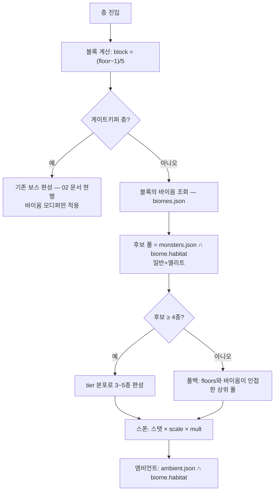

# 바이옴 시스템 v1.0 가안 (v8.0)

> [!info] 이 문서는?
> 100층을 **20개 바이옴(10+9+1)이 5층 블록 단위로 나눠 갖는** 지형·난이도·스폰 계층.
> **상위 기준**: [[GDD_v8.0_00_확정사항]] §23 (2026-09-14 사용자 승인 — B안: 편성까지 전환).

---

## 1. 목적 & 범위

- **목적:** 층마다 같은 전투가 반복되는 문제를 해소 — 5층마다 지형 테마·난이도 모디퍼·출현 몬스터 풀이 달라지게 하고, 96~100층은 모든 요소가 겹치는 최종 스테이지를 만든다.
- **범위 (in):** 20바이옴 정의 · 5층 블록 슬롯 배정 · 바이옴별 난이도 계수·모디퍼 · **바이옴 서식지 기반 일반 몬스터 편성(B안)** · 앰비언트 서식지 판정 · 검증 스크립트 확장
- **비범위 (out):** 게이트키퍼(5·10·15·20층) 편성 — 기존 방침 유지 · WFC 지형 실제 생성 알고리즘 — 구현 단계 · 보스 스케일식 — 02 문서 현행 유지 · 렌더링·아트 에셋

## 2. 설계 원칙

| # | 원칙 | 이유 |
|---|---|---|
| 1 | **데이터 단일 소스** — 바이옴 정의는 `biomes.json` 하나 | 02 문서 수기 표와 JSON이 어긋난 전례(층 밴드 공백) 재발 방지 |
| 2 | **habitat 코드 재사용** — monsters/ambient/ecology_codex의 기존 40코드를 바이옴에 매핑 | 신규 코드 0개로 전 몬스터가 자동으로 소속 바이옴을 갖는다 |
| 3 | **몬스터 데이터 무변경** — 편성 방식만 바뀌고 스탯·패턴·tier는 그대로 | 기존 밸런스 자산 승계, 리스크 최소화 |
| 4 | **게이트키퍼는 바이옴 밖** | 게이트는 성장 검증 지점 — 지형 난이도와 분리해야 측정 가능 |
| 5 | **난이도는 계수+모디퍼 2축** — 계수는 스탯, 모디퍼는 지형/규칙 | 숫자만 키우는 단조로움 방지, 지형이 전술을 바꾼다 |

## 3. 규칙 & 수치

> [!warning] 수치 정합성
> 계수·모디퍼는 전부 **가안** — [[GDD_v8.0_00_확정사항]] 미정G(영지 수치)와 함께 플탐에서 확정.
> 층 스케일식은 [[GDD_v8.0_01_등급_전투력]] 권장CP와 정합 확인 필수.

### 3.1 구조 — 10/9/1 그룹

| 그룹 | 바이옴 수 | 층 범위 | 블록 수 | 배정 |
|---|---|---|---|---|
| G1 하부 탑 | 10 | 1~50 | 10 | 그룹 내 랜덤 배정 |
| G2 중부 탑 | 9 | 51~95 | 9 | 그룹 내 랜덤 배정 |
| G3 정점 | 1 | 96~100 | 1 | 고정 (최종 스테이지) |

- **5층 = 1블록 = 슬롯 1개.** 블록 5층은 같은 바이옴 (층별 세부 변주는 지형 생성 몫).
- **배정 규칙:** 리셋 주기마다 그룹 내 슬롯을 섞는다(shuffle). 슬롯 시드는 [[#6. 미결정 & 리스크]] 참조.

### 3.2 난이도 — 계수 + 모디퍼

**층 스케일식 (가안 — 01 §2 몬스터 스케일 정합):**

```
G1: scale = 2.0 + floor × 0.03          (1층 2.0 → 50층 3.5)
G2: scale = 3.5 + (floor−50) × 0.04     (51층 3.5 → 95층 5.3)
G3: scale = 5.3 + (floor−95) × 0.10     (96층 5.4 → 100층 5.8)
적 스탯 = 기본 스탯 × scale × biome.difficulty.mult
```

- G2·G3 사다리꼴 곡선 — 전 구간 기하식 대비 후반 부담 완화 (계단식 급등 방지).
- FB-07 −15%는 계수 합산 후 최종 적용 (기존 방침 승계).
- 게이트키퍼 보스 스케일(HP·ATK × 배치층/bossScaleRefFloor)은 기존 02 문서 현행 — G3 구간 보스에는 `bossHp ×1.2` 모디퍼가 곱해진다.

**바이옴 계수 (biomes.json — 가안):**

| 그룹 | 바이옴 | mult | 핵심 모디퍼 |
|---|---|---|---|
| G1 | 초원 | 1.00 | — (기준) |
| G1 | 숲 | 1.05 | cover ×0.9 (지형 가림 다함) |
| G1 | 습지 | 1.10 | 이속 −15% · 독 확률 +10%p |
| G1 | 동굴 | 1.10 | 시야 −40% (조명) |
| G1 | 폐허 | 1.15 | 기습 +15%p |
| G1 | 묘지 | 1.15 | 언데드 1회 소생 |
| G1 | 산맥 | 1.15 | 고지대 타일 +15%p |
| G1 | 사막 | 1.10 | 은신 몬스터 +10%p |
| G1 | 화산 | 1.20 | 용암 타일 · 화염 오브젝트 |
| G1 | 연해 | 1.10 | 수역 타일 50% |
| G2 | 심해 | 1.00 | 수역 타일 70% (G2 기준) |
| G2 | 천공 | 1.05 | 낙하 타일 · 낙뢰 5% |
| G2 | 미궁도시 | 1.05 | 미로 · 함정 ×1.5 |
| G2 | 하수도 | 1.10 | 독 +15%p · 스폰 밀도 ×1.5 |
| G2 | 신전 | 1.10 | 어둠계 영웅 피해 −10% |
| G2 | 정글 | 1.15 | 기습 +20%p |
| G2 | 심연 | 1.15 | Sanity −2/전투 |
| G2 | 지옥 | 1.20 | 용암 타일 (화산 상위판) |
| G2 | 서고 (구 대도서관 — 07 §5.1 개명 · 데이터 코드 `biome_library` 유지) | 1.20 | 몬스터 MDEF +20% |
| G3 | 정점 | 1.30 | **allPrev** + 보스 HP ×1.2 + 휴식 없음 |

### 3.3 G3 정점 — 최종 스테이지

1. **allPrev:** G1·G2의 모든 모디퍼가 동시 활성 (수역·용암·낙하 타일 혼합, 기습·독·소생 전부 발동). 계수는 mult 1.30 하나로 합산 — 모디퍼 계수 누적 곱하지 않음 (과열 방지).
2. **보스 HP ×1.2** — 100층 최종 보스(leviathan)에 적용.
3. **휴식 없음** — 96~100층 구간에 회복 이벤트 0개. 5블록 연속 돌파 구조.
4. 층 스케일이 기하로 꺾이는 대신 **모디퍼 밀도**가 난이도를 담당 — 스탯경쟁이 아닌 대응력 시험.

### 3.4 편성 — B안 (바이옴 서식지 기반)



- **후보 풀:** `monster.ecology.habitat ∩ biome.habitat ≠ ∅`인 전투 몬스터. tier 분포(층 스케일에 맞는 tier 중심 + 1단계 아래/위 섞기)로 3~5종 편성.
- **폴백:** 후보 < 4종이면 해당 바이옴 층대 ±1블록의 바이옴 풀을 병합 (빈 편성 금지).
- **앰비언트:** 같은 방식으로 habitat 교집합 — 기존 층 밴드(floors)는 참고용.
- **monsters.json spawn.floors는 기록용 참조로 강등** — 삭제하지 않는다 (v7.12 흔적·디버그용).

### 3.5 온도(기후) 시스템 (가안 — 2026-09-15 사용자 요청)

각 바이옴은 `climate` 3필드를 갖는다 (`biomes.json`):

| 필드 | 뜻 | 예 (심연) |
|---|---|---|
| `ambient` | 현재 평균 기온(°C) — 층 진입 시 ±5 변동 | -20 |
| `base` | 연중 기준 기온 | -5 |
| `band` | 서식 가능 밴드 — 이 범위 밖 종은 스폰 불가 | -30~30 |

**규칙 (가안):**

1. **스폰 게이트 2중화** — habitat 교집합(§3.4) **and** `종 온도 내성(min~max) ∩ 바이옴 band ≠ ∅`. habitat이 1차 필터, 온도는 2차 필터.
2. **온도 면역 역할** — `elemental`(정령=환경 그 자체)·`guardian`(구조물)·`undead`(생체 아님)는 검증·스폰 게이트 제외. 교차 검증에서 유일한 면제 적용 종은 드레드노트(guardian).
3. **영웅 쾌적 범위 10~25°C (가안)** — 밴드 밖 전투마다 Sanity -1, 극한(band 바깥 ±20 이상) 시 -2. 화산·지옥은 휴식 구간에도 화염 오브젝트 활성. 방한구·열내복 계열 장비로 완화 (P3-3 장비 확장 후보).
4. **전투 모디퍼 3단계** — 쾌적(10~25) 보정 없음 / 불쾌(밴드 내·쾌적 밖) 이동속도 -5% / 극한(밴드 바깥) 이속 -10% + Sanity 드레인.
5. **검증** — `check_docs.py`가 종 데이터(`ecology.temperature`) × 20바이옴 내성∩band 교차 검사 (면역 역할 제외). 2026-09-15 위반 0건.

> [!warning] 가안 근거
> 기후 수치는 종 데이터(`ecology.temperature`)의 합리적 커버 범위에서 역산한 가안 — 산맥 -25~25 · 사막 15~50 · 화산 20~300 · 지옥 50~400. 계절 변동(마르코프 전환)은 미실장 — §6 리스크 참조.

## 4. 로직 흐름

위 3.4 머메이드 참조. 리셋 주기 흐름:

```
리셋(시즌/유저 요청) → G1 슬롯 shuffle → G2 슬롯 shuffle → 세이브에 배정표 기록
→ 이후 100층 진입마다 배정표 조회
```

## 5. 구현 연동

- **데이터:** `unity/Assets/Resources/Data/biomes.json` — 20종 정의 (groups→biomes 계층, habitat·slots·difficulty)
- **편성:** `WaveBuilder` 확장 — `BuildBiomeWave(floor, biome)` (P4-1 과제로 이동 — 아래 미결정 참조)
- **검증:** `check_docs.py` 확장 — ① biomes 20종 카운트 ② habitat 코드 40종 전부 매핑·중복 0 ③ ambient/codex floors와 habitat 정합 ④ groups 층 범위 합 = 1~100 (빈 곳·겹침 0)
- **몬스터 데이터:** 무변경 — `ecology.habitat`만 소비

## 6. 미결정 & 리스크

- [ ] **슬롯 시드/리셋 주기** — 유저별 고정(시즌제) vs 진입마다 랜덤 vs 요청 시 리셋. 구현은 시드 고정(결정적)으로 두고 [[GDD_v8.0_00_확정사항]] 미정 항목으로 등록.
- [ ] **P2-1 편성표 승계 처리** — 02 문서의 전투 편성 절(2026-09-14 승인)은 B안으로 사실상 폐기. 문서에 폐기 각주 유지 (역사 추적용). 03 개발플랜 P2-1도 B안 참조로 갱신.
- [ ] **폴백 편성 품질** — 후보 부족 바이옴(정글 1종·서고 1종·하수도 1종 — 구 대도서관 표기)은 폴백 빈도가 높음 — 플탐에서 체감 시 몬스터 habitat 보강.
- [ ] **지형 모디퍼 실장 의존** — 용암·낙하·시야 등 타일 모디퍼는 WFC 지형 생성(P4-1)과 세이브 계약이 필요. 수치는 JSON에 있으나 발동 로직은 미구현.
- [ ] **기후 변동 미실장** — §3.5는 고정 ambient 기준. 계절/시간대 기온 변동(마르코프 연쇄 전환)은 플탐 후 판단. 영웅 쾌적 범위·장비 완화 수치도 가안.
- [x] ~~신규 서식종 34종의 온도 내성 미정~~ — 해소: 1·2차 배치(T-07-1·2, 2026-09-15)에서 전종 소속 바이옴 band 내 정의 완료 — check_docs 교차 검증 0위반 (07 §6 참조).

---

## ✅ 작성 완료 체크리스트 (AGENTS.md §6)

- [x] ①~④ 프론트매터(`version`·`up`·`aliases` 포함) · 위키링크 · 콜아웃 · 머메이드
- [x] **⑤ README 등록** — [[README]] 문서 목록 등록
- [x] **⑥ 결정로그 등록** — [[GDD_v8.0_00_확정사항]] §23 등록
- [x] **⑦ 상태 태그 = status 필드와 정합** — Draft(상태/초안)
- [x] **검증 스크립트 실행** — `python3 design-docs/_tools/check_docs.py` (exit 0 = 준수 · 2026-09-14 통과)
- [x] 🔗 관련 문서 표에 상호 링크 (📌 결정 기록 행 포함)

---

## 🔗 관련 문서

| 관계 | 문서 |
|---|---|
| 🏛 홈 | [[README]] |
| 📖 기준 | [[GDD_v8.0_00_확정사항]] |
| 📖 생태 | [[GDD_v8.0_02_생태사전]] — 게이트키퍼·보스 스케일 현행 |
| 📖 전투력 | [[GDD_v8.0_01_등급_전투력]] — 층 스케일·몬스터 tier 정합 |
| 📌 결정 | [[GDD_v8.0_00_확정사항]] §23 |
