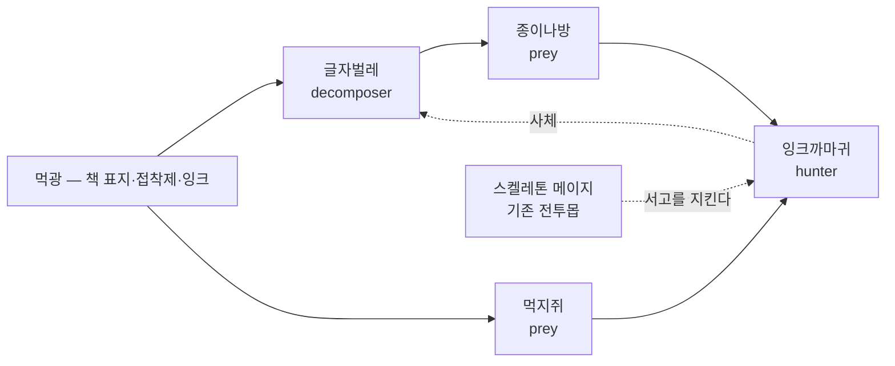

# 통합 생태계 v1.0 가안 (v8.0)

> [!info] 이 문서는?
> 20개 바이옴을 **각자 따로노는 배경이 아니라, 탑 전체가 하나로 도는 생태계**로 묶는 설계.
> 쉽게 말하면: **쥐가 있으니 뱀이 살고, 뱀이 있으니 매가 산맥에서 내려온다.** 모든 층이 이 줄로 이어진다.
> **상위 기준**: [[GDD_v8.0_00_확정사항]] §23 (바이옴) · [[GDD_v8.0_06_바이옴]] §3.4 (habitat 편성).

---

## 1. 목적 & 범위

- **목적:** 06 문서로 층마다 몬스터 편성은 달라졌지만, 바이옴 사이에 **생물이 이동·연결되는 흐름이 없다**. 이 문서는 (1) 생태계가 끊긴 지점을 데이터로 진단하고, (2) 신규 종 최소 추가로 20바이옴 전부를 생태 고리에 넣는다.
- **원칙 (한 줄):** **기존 종으로 바닥을 깔고, 부족한 곳에만 그 바이옴 고유의 새 종을 심는다.**
- **범위 (in):** 생태 완결 진단 · 신규 서식종 설계 (약 34종, 1차 배치 16종) · 인공 바이옴의 먹이 근원(근원자원) 규칙 · 검증 스크립트 확장 계획
- **비범위 (out):** 전투 몬스터 54종 변경 (무변경) · 스탯 밸런스 · 생태 시뮬레이션 실장 (Phase 5+ 후보 · [[GDD_v8.0_03_개발플랜]] P4-5 이후)

## 2. 진단 — 지금 생태계가 안 도는 이유 (2026-09-15 전수 측정)

**방법:** 각 바이옴의 habitat에 속한 종(앰비언트+전투몹)의 역할(role)을 합산해, 먹이(prey/swarm)·포식(predator/hunter/ambusher/apex)·분해(decomposer/scavenger/corruptor) 3역할이 모두 있는지 검사.

| # | 발견 | 내용 |
|---|---|---|
| D-1 | **20바이옴 중 15개 역할 결핍** | 완결은 초원·숲·습지·동굴·연해 5개뿐. 대도서관·신전·하수도·정글·천공은 **종 자체가 1~3개뿐** — 생태가 아니라 배경 |
| D-2 | **인공 바이옴에 먹을 것이 없다** | 신전·서고·하수도·천공·미궁도시는 앰비언트 0종. 포식자가 있어도 먹이가 없으니 사슬이 시작조차 안 됨 |
| D-3 | **연결은 이미 좋다** | 종 공유 통로 37개 · 탑 전체가 연결요소 1개 — G1의 쥐·까마귀·슬라임이 G2까지 이어줌. **문제는 연결이 아니라 각 방의 텅 빔** |
| D-4 | **심해·심연·지옥·정점도 먹이 없음** | 포식자만 있는 상층 — "누구를 잡아먹고 사나"가 데이터에 없음 |

> [!note] 판정
> 바이옴을 바꿀 필요는 없다. **각 바이옴에 없는 역할 1~2개를 채우는 종만 추가**하면 20개가 하나의 사슬로 묶인다.

## 3. 설계 — 3계층 종 전략

| 계층 | 뜻 | 범위 | 추가/변경 |
|---|---|---|---|
| ① **야생종** | 어디에나 붙어 다니는 기반 종. 사슬의 바닥 | 기존 앰비언트 19종 (쥐·까마귀·슬라임 등) | **0 변경** — 이미 37개 통로의 주인공 |
| ② **적응종** | 야생종이 다른 환경에 적응한 모습. **기존 종의 리스킨** (스탯·AI 동일, 서식지·속성·이름만 교체) | G1 결핍 바이옴 6곳 | 신규 8종 (리스킨이라 밸런스 리스크 0) |
| ③ **서식종** | 그 바이옴에만 사는 고유 종. 인공 바이옴의 생태를 **그 답게** 만드는 주인공 | G2+G3 전 바이옴 | 신규 26종 (1차 배치 16종) |

- **리스킨 방식:** 원본 종의 stats·aiDecision·pattern을 복사 → habitat를 [바이옴 코드]로, 이름·속성·diet만 교체. 예: 토끼(초원) → 흰쥐(신전) — "같은 동물, 다른 곳".
- **서식종 원칙:** habitat = [자기 바이옴 코드 1~2개]만. 타 바이옴으로 새지 않는다 (G1 야생종이 통로 역할 유지).
- **diet 금지 규칙:** 신규 종의 `prey`는 **전부 자기 바이옴의 근원자원 또는 이웃 종**. `diet: none + prey: []`인 종(산호초 패턴) 신규 추가 금지.

### 3.1 근원자원 — 인공 바이옴이 살아가는 이유

인공 바이옴(신전·서고·하수도·미궁도시·천공)에는 풀도 사슴도 없다. 대신 **건축이 흘려보내는 자원**을 먹고 산다:

| 바이옴 | 근원자원 | 그것을 먹는 자 |
|---|---|---|
| 서고 | **먹광** (잉크 빛·접착제·책 표지) | 글자벌레 → 종이나방 → 잉크까마귀 |
| 신전 | **성수 이슬** (제단에 맺히는 물) | 신전비둘기·성수이끼 → 가람뱀 |
| 하수도 | **슬러지** (버려진 음식물 찌꺼기) | 바퀴벌레 → 하수쥐 |
| 미궁도시 | **버려진 음식물** (시장 잔반) | 도시비둘기·바퀴벌레 → 골목생태 전체 |
| 천공 | **바람씨앗** (상승기류에 뜨는 씨앗) | 바람모종 → 폭풍꿀벌 → 폭풍매 |

- 이렇게 하면 "왜 60층 건물 안에 생물이 사나"가 **설정이 아니라 구조**로 해결된다 — 먹이가 층 자체에서 나온다.
- G3 정점은 allPrev처럼 **모든 근원자원이 합류하는 자리** — 아래 생태의 흘러내림이 정점에서 만난다는 설정 (별가루·아스트랄 이끼).

## 4. 20바이옴 생태 완결표 (가안)

> ✅ = 완결 (유지) · ② = 적응종(리스킨) · ③ = 서식종(신규)

| 바이옴 | 결핍 | 채우는 방법 | 추가 종 (역할) |
|---|---|---|---|
| 초원 | ✅ | — | — |
| 숲 | ✅ | — | — |
| 습지 | ✅ | — | — |
| 동굴 | ✅ | — | — |
| 폐허 | 먹이 | ② | **비둘기** (prey·토끼 리스킨) · **먼지벌레** (swarm·벌 리스킨) |
| 묘지 | 먹이·포식 | ② | **무덤벌레** (prey·딱정벌레 리스킨) · **어스름매** (hunter·매 리스킨) |
| 산맥 | 분해 | ② | **바위이끼** (decomposer·버섯 리스킨) |
| 사막 | 먹이·분해 | ② | **사막쥐** (prey·쥐 리스킨) · **썩고기갑충** (decomposer·딱정벌레 리스킨) |
| 화산 | 먹이 | ② | **화염벌레** (prey·박쥐나방 리스킨 — 열광맥 서식) |
| 연해 | ✅ | — | — |
| 심해 | 먹이 | ③ | **심해플랑크톤** (swarm) |
| 천공 | 전무 | ③ | **바람모종** (prey) · **폭풍꿀벌** (swarm) · **바람버섯** (decomposer — 상승기류를 뜨는 부유 균류) · **폭풍매** (hunter) |
| 미궁도시 | 전무 | ③ | **도시비둘기** (prey) · **바퀴벌레** (decomposer — 하수도와 공유) · **골목쥐** (prey·하수도와 공유) |
| 하수도 | 전무 | ③ | **하수뱀** (ambusher·뱀 리스킨) + **바퀴벌레·골목쥐 공유** — 도시 생태가 흘러드는 구조 |
| 신전 | 전무 | ③ | **신전비둘기** (prey) · **성수이끼** (decomposer) · **가람뱀** (ambusher·뱀 리스킨) |
| 정글 | 전무 | ③ | **원숭이** (prey) · **앵무떼** (swarm) · **부패균** (decomposer) — 포식자는 기존 유안티 (구 야안티, 2026-09-15 개명) |
| 심연 | 먹이 | ③ | **심연충** (prey) · **보이드이끼** (decomposer) |
| 지옥 | 먹이 | ③ | **유황파리** (swarm) · **불열매덩굴** (prey — 임프가 따먹는 열매) |
| 서고 (구 대도서관) | 전무 | ③ | **글자벌레** (decomposer) · **종이나방** (prey) · **잉크까마귀** (hunter·까마귀 리스킨) · **먹지쥐** (prey·쥐 리스킨) |
| 정점 | 먹이·분해 | ③ | **별가루** (swarm) · **구름이끼** (producer — 해충 대응 생산자) · **아스트랄 이끼** (decomposer) |

- **합계:** 신규 34종 (②적응종 8 + ③서식종 26) · 1차 배치 = **인공 바이옴 16종** (천공4·미궁도시3·하수도1+공유·신전3·서고4 + 심해1) · 2차 = G1 적응종 8종 + 나머지 10종
- **`ambient.json` 19종 → 약 53종.** 전투 몬스터·스탯은 0 변경. [[GDD_v8.0_02_생태사전]] · `ecology_codex.json`에 신규 종 등재.
- **완결 기준 (검증 규칙화):** 모든 바이옴에서 ① 먹이 1종 이상 ② 포식 1종 이상 ③ 분해 1종 이상 ④ 모든 종의 diet ≠ none.

## 5. 케이스 — 서고(구 대도서관)와 신전

### 5.1 대도서관 → 서고

사용자 지적(2026-09-15): "대도서관 같은 건 바른 걸로 바꿔야 하지 않냐" — 맞다. **대도서관은 공간 이름이지 생태가 아니다.** 실제 서고에는 해충이 산다:

- **먹광(墨光)** = 책의 잉크·표지가 희미하게 빛나는 탑의 마력 찌꺼기 — 근원자원.
- 글자벌레가 표지를 먹고, 종이나방이 글자벌레를 먹고, 잉크까마귀가 나방과 쥐를 잡는다. **3계층 4종이면 사슬이 닫힌다.**
- 몬스터 편성(스켈레톤 메이지)은 기존 그대로 — 생태는 배경에서 돌고, 전투는 별개. **"산 층"과 "싸우는 층"의 분리.**
- 개명: `biome_library` → `biome_archive` (이름 서고). 06 문서·biomes.json 표기 갱신 (몬스터 데이터의 `library` 코드는 유지 — 스키마 무변경).

### 5.2 신전

- 성수 이슬이 제단에 맺히면 이끼가 피고, 비둘기가 이끼 곁의 씨앗을 먹고, 가람뱀이 비둘기를 기다린다 — **그리스 신전의 실제 생태** (아크로폴리스에는 뱀·비둘기가 실존).
- 수호령·아아시마르(기존 guardian)는 사슬 위의 **수호자** — 먹지 않고 지킨다. guardian 역할은 사슬 밖 특수 역할로 취급 (포식 아님).

## 6. 작업 목록

| # | 작업 | 근거 | 시점 |
|---|---|---|---|
| T-07-1 | **1차 배치 ✅ 완료 (2026-09-15)** — 서식종 16종 `ambient.json`+`ecology_codex.json` 등재 (천공4·미궁도시2+공유1·하수도1+공유·신전3·서고4·심해1) · 리스킨 방식 · **온도 내성 = 소속 바이옴 band 내 정의** · 생성기 `_tools/gen_new_species.py` (멱등) | §4 · §5 | 완료 |
| T-07-2 | **2차 배치 ✅ 완료 (2026-09-15)** — G1 적응종 8종(폐허2·묘지2·산맥1·사막2·화산1) + 심연·지옥·정점·정글 10종 → ambient/codex **53종** · 온도 내성 = 소속 바이옴 band · codex group 필드 G1/G2/G3 자동 산출 | §4 | 완료 |
| T-07-3 | **근원자원 스키마** — biome에 `resource` 필드 추가 + 신규 종 diet 연결 (기존 prey flora/fauna 분리안과 합침) | §3.1 | P4-2 |
| T-07-4 | **검증 확장** — check_docs.py에 ① 바이옴별 3역할 완결 ② 신규 종 biome 고유성(habitat 단일) ③ diet none 금지 ④ ambient 개수 기대치 갱신(19→53) | §4 완결 기준 | T-07-1 완료 직후 |
| T-07-5 | **서고 개명** — biomes.json name/06 문서 표기 갱신 | §5.1 | T-07-1과 함께 |

- **개수 변동 사전 공지:** `check_docs.py` 현재 "ambient 19종" 고정 검사 → T-07-1에서 기대치 갱신 필수 (미갱신 시 검증 실패 — 의도된 안전장치).
- 미정 신설(00): **미정K — 인공 바이옴 생태 방식** (서고 개명·근원자원 명칭·1차 배치 후 플탐 체감 확인).

## 7. 미결정 & 리스크

- [x] ~~신규 서식종 온도 내성~~ — 1·2차 34종 전부 완료 (소속 바이옴 band 내 정의 — 06 §3.5 검증 통과, 107종 교차 0위반).
- [ ] **신규 34종의 밸런스** — 리스킨이라 원본과 동일하나, threatBase가 낮은 종이 많아 "사냥 감성"(처치 보상·재료)과의 접점 설계 필요 → P5 플탐.
- [ ] **02 생태사전 문서 분량** — 신규 33종 전부 수기 표 등재 시 문서 비대화 → 02는 대표 생태만 기술하고 전수 데이터는 JSON 정본 원칙 유지.
- [ ] **생태 시뮬레이션과의 접점** — v7.12의 밀도 가중치 승계안(P4-5 후보)과 이 문서의 종 풀을 합쳐야 "돌아가는" 체감 완성 — 실장은 Phase 5+.

---

## 8. 생태학 개념 매핑 — 시스템의 학문적 뼈대 (2026-09-15)

> [!note] 요약
> 시스템 수치 설계의 근거가 되는 생태학 개념 12개. 시각화는 **`design-docs/생태도감.html`** (생성기: `_tools/gen_ecology_codex.py` — 20바이옴 생태 카드 + 로지스틱·로트카-볼테라 인터랙티브 시뮬레이터).

| 개념 | 식 (요약) | 시스템 반영 |
|---|---|---|
| **로지스틱 성장** ★필수 | dN/dt = rN(1−N/K) | 바이옴별 개체수 상한 — 스폰 캡·사냥 개체수 조절의 기본식 (S자 곡선) |
| **수용력 (K)** | K = 자원 등급 × 공간 | 근원자원 풍요도 → 바이옴별 K — 사막(K 35) vs 정글(K 130) 체감 차이 |
| **로트카-볼테라** | dN = rN(1−N/K) − aNP | 포식-피식 개체수 주기 파동 — 시즌별 사냥감 많은 층/적은 층 변동 |
| **영양 단계 · 10% 법칙** | 먹이 10 → 포식 1 | 스폰 테이블 비율 — 최상위 포식자는 항상 소수 |
| **영양급위** | 상위 제거 → 하위 폭발 | 보스 처치 후 2~3시즌 하위종 폭증 이벤트 (후보) |
| **섬생물지리학** | 종수 ∝ 면적·연결 | 5층 블록 = 섬 — K가 면적, 생태 통로 37개가 거리 |
| **니치 분화 · 경쟁 배제** | 같은 자리·먹이 → 1종만 | 신규종 habitat 단일 원칙의 근거 — 역할 중복 금지 |
| **r/K 전략** | r전략 다산·소형 / K전략 대형·소수 | swarm은 사냥해도 금방 회복, apex는 한 번 잡으면 오래 비어 있다 — 사냥 경제 축 |
| **생태 천이** | 빈 땅 → 풀 → 덤불 → 숲 | 리셋 직후 바이옴 재생 단계 — 먹이종 먼저, 포식자는 나중 (미정J 연결) |
| **핵심종 · 지표종** | 핵심종 부재 = 생태 전체 변동 | 쥐 = 지표종(층 건강 게이지) · 정점 보스 = 핵심종 |
| **침입종** | 천적 없는 종의 폭발 | 과거 31~75층 데드존 사례 — 역할 검사가 방지 장치 |
| **영양물질 순환** | 사체 → 분해자 → 자원 | 처치 사체 → 분해자 부스트 (v7.12 검증 역학 승계안) |

- 시뮬레이터 기본식 — 포식 포함: `dN/dt = rN(1−N/K) − aNP`, `dP/dt = baNP − dP` (a 조우율·b 에너지 전환·d 사망률). 평형점 N* = d/(ba), P* = (r/a)(1−N*/K).
- **실데이터 시즌 시뮬레이터 (2026-09-15 구현)** — 도감 시뮬레이터 탭 하단. 35종 야생 + 전투 포식자를 바이옴 단위로 굽니다:
  - **파라미터 = 실측 필드**: r = `reproduction`, d = `food_need` 기반, 포식 강도 a = `aggression`, 최적온도 = 종별 `temperature` 밴드 중심 → φ 종별 계산.
  - **K 배분 = 10% 법칙**: 바이옴 K를 하위층 55% · 최상위 포식자 10%로 나눠 종수로 배분(포식자 최소 2 — 희소성 유지).
  - **마르코프 이상기후** — 한파·평년·폭엔 전이확률행렬(§8)로 시즌마다 φ·r·K·d 진폭. 0.05 미만 = 국소절멸, 시즌 경계 25% 확률 이주 재유입.
  - **검증된 거동**: 초원 10종 전생존 평형(토끼 4.2→5.8→2.5 냉파 파동), 사막 폭엔 3시즌에 독사 1.6→0.1 임계 근접 후 평년 회복 — 계절이 개체수 파동을 지배하는 구조 확인.
- **게임 적용은 Phase 5+** — 지금은 근거 문서화 단계. 실장 시 스폰 가중치·사냥 개체수·시즌 변동이 위 식을 따른다.
- **법칙 검수 (2026-09-15, `design-docs/_tools/audit_sim.py`)** — 시뮬레이터를 파이썬으로 1:1 포팅해 20바이옴 × 12시즌 전수 루프 검증. **22검사 전부 통과**:
  - 마르코프: 행 합=1 · 대각 우세(이상기후 지속성) · 몬테카를로 200회 실측 전이확률 오차 max 0.048
  - 로지스틱: 무섭식 종이 K에 수렴 (final 12.86 / K 13) · 열성능 φ: 60%+ 종이 계절 반응(밴드 넓은 내성종 둔감은 정상 속성)
  - 로트카-볼테라: 초원 10종 전체 진폭 ≥15% · 에너지 피라미드: 포식자 평균 1.79 < 피식자 9.54
  - 10% 법칙: 20바이옴 포식/먹이 K 총합 비율 0.03~0.45 밴드 내 (포식자 종수가 많은 바이옴은 상한에 붙는 것이 물리 한계 — K floor 때문)
  - 수치 위생: NaN·음수 0건 · 절멸 임계 흡수 누락 0건 · 동일 시드 결정론 확인
  - 검수기는 생성기 소스에서 법칙 식 8종(정규식)과 K 테이블(RESOURCES)을 직접 읽어 **JS↔검수기 드리프트를 자동 감지**한다.

---

## 10. 도감 UI/UX — 사전형 참조 설계 (2026-09-15)

> [!note] 요약
> `생태도감.html`을 **사전(dictionary)형 UI로 전면 개편** — 조사한 포켓몬 도감(번호·타입 필터·상세 뷰)·사전 앱(표제어 검색·가나다 색인·상호참조) 패턴을 게임 도감에 적용.

### 10.1 설계 원칙

| 원칙 | 적용 |
|---|---|
| **중요도 우선** | 기본 탭 = **종사전(107종)** — 유저가 가장 많이 찾는 단위. 바이옴·개념·시뮬레이터는 그 다음 |
| **사전식 검색** | 표제어 검색(이름·ID·설명) + **ㄱㄲㄴ 초성 색인**(결과에 존재하는 초성만 동적 표시) + 종류 필터(전투/야생/예정) + 정렬(중요도·가나다) |
| **항목 = 뜻풀이** | 카드 클릭 → 상세 팝업: 표제어·ID·배지(종류·역할·티어·속성)·정의문 ·서식/출현층/온도 내성 ·스탯표 |
| **상호참조** | 먹이·천적 칩 **클릭 시 해당 종 항목으로 이동**(사전의 ~참조) — 자원(diet flora)은 비링크 표기 |
| **기본 접힘** | 개념 카드 22장은 한 줄 요약만 기본 표시, ★핵심 2개(로지스틱·로트카-볼테라)만 펼침 |
| **단일 파일** | 인터넷·의존성 0 — 생성기 실행 1번으로 갱신 |

### 10.2 종사전 데이터 모델

- **107종 = 야생 35(ambient) + 전투 54(monsters) + 예정 18(07 §4)** — 몬스터의 ecology 블록을 도감이 처음으로 소비(기존 "데이터만 있고 소비자 0" 문제 해소).
- 중요도 정렬: 전투 티어 내림차순 > 야생 > 예정 — 보스급이 도감 앞줄.
- 상호참조는 `ecology.predators`/`prey`의 ID를 이름으로 해석 — 미등재 ID는 자원으로 표기.

### 10.3 먹이사슬 그래프 뷰 (2026-09-15 추가)

- **종 단위 force-directed 그래프** — 노드 = 종(색 = 영양 역할, 금 테두리 = 전투종, 회색 다이아 = 근원자원), 실선 = 데이터 명시 관계(predators/prey), 점선 = 같은 바이옴 내 역할 기반 추정 관계.
- **바이옴 필터** — 선택 바이옴의 종 + 그 종들이 직접 먹는 근원자원만 표시(초원 10종 · 29간선). 전체 뷰는 107종 · 283간선이라 헤어볼이므로 기본값 = 초원.
- **상호작용** — 노드 클릭 → 해당 종의 사전 항목 팝업(§10.1 상호참조와 동일 경로), 드래그로 노드 고정, ESC 닫힘.
- **게임 시사점** — 이 그래프가 곧 게임 내 "생태 네트워크" 화면의 원형. 유저가 사냥감 위치·천적 위협을 한눈에 파악하는 UX로 직결.

### 10.4 게임 내 도감 화면 시사점 (P5 후보)

1. 해금(unlock) 연동 — 처치/조우한 종만 표제어 활성, 미해금은 실루엣(포켓몬 도감 방식).
2. 먹이·천적 링크 = 게임 내에서도 탭 한 번에 관계 종 이동 — 사냥 대상 탐색 UX로 직결.
3. 초성 색인은 종 100종 이상 규모에서 필수 — 한국어 게임이면 표준 스펙.

---

## ✅ 작성 완료 체크리스트 (AGENTS.md §6)

- [x] ①~④ 프론트매터 · 위키링크 · 콜아웃 · 머메이드
- [x] **⑤ README 등록** — [[README]] 문서 목록 등록
- [x] **⑥ 결정로그 등록** — [[GDD_v8.0_00_확정사항]] §24 + 미정K
- [x] **⑦ 상태 태그 = status 필드와 정합** — Draft(상태/초안)
- [x] **검증 스크립트 실행** — `python3 design-docs/_tools/check_docs.py` (2026-09-15 통과)
- [x] 🔗 관련 문서 표에 상호 링크 (📌 결정 기록 행 포함)

---

## 🔗 관련 문서

| 관계 | 문서 |
|---|---|
| 🏛 홈 | [[README]] |
| 📖 기준 | [[GDD_v8.0_00_확정사항]] |
| 📖 바이옴 | [[GDD_v8.0_06_바이옴]] — 슬롯·난이도·habitat 편성 |
| 📖 생태 | [[GDD_v8.0_02_생태사전]] — 야생종 19종 본원 |
| 📌 결정 | [[GDD_v8.0_00_확정사항]] §24 · 미정K |
| 🖼 도감 UI | 본 문서 §10 — `design-docs/생태도감.html` (사전형) |
