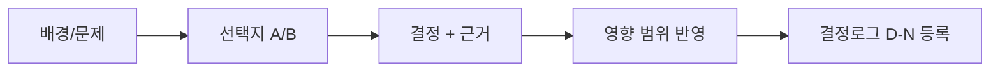

# 결정: {{title}}

> [!info] 상태
> ⬜ 미결정 / 🔄 검토 중 / ✅ 확정 / ❌ 대체

## 배경 (Context)

- 문제 상황 / 왜 결정이 필요한가

## 선택지 (Alternatives)

| 대안 | 장점 | 단점 |
|---|---|---|
| A.  |  |  |
| B.  |  |  |

## 결정 (Decision)

- **선택:** 
- **근거:**
- **영향 범위:** (어느 문서·수치·코드가 바뀌는지)

## 후속 조치 (AGENTS.md §6)

- [ ] **⑥ 결정로그 등록** — [[GDD_v8.0_00_확정사항]]에 등록 (상태 ✅ / ⬜ 이월)
- [ ] **⑤ README 등록** — 새 문서로 생성한 경우 [[README]] 문서 목록에 등록
- [ ] **⑦ 상태 태그 = status 필드와 정합** — 상태 변화 시 status와 `상태/xxx` 태그 함께 변경 (§9)
- [ ] 관련 문서 갱신 (수치·설계) — 변경 문서의 `updated`를 ISO 날짜로 갱신
- [ ] **검증 스크립트 실행** — `python3 design-docs/_tools/check_docs.py` (exit 0 = 준수)

---

## 🔗 관련 문서

| 문서 | 관계 |
|---|---|
| 📌 [[GDD_v8.0_00_확정사항]] | 결정 기록 (등록 대상) |
| 🛤 [[GDD_v8.0_03_개발플랜]] | 상위 — 세션 간 항법 |
| 🏛 [[README]] | 허브 — 문서 목록 |

---

*템플릿: `_템플릿/결정_로그.md` — 작성 후 README 등록 · 관련 결정은 GDD_v8.0_00_확정사항에 반영 (AGENTS.md §6)*
