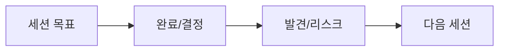

# 세션 로그 {{date:YYYY-MM-DD}}

> [!info] 세션 목표
> 이번 세션에서 달성하려는 것 (AGENTS.md '다음 세션 시작 방법' 기준)

---

## ✅ 완료

| 항목 | 상세 | 마일스톤 |
|---|---|---|
|  |  |  |

## 🔧 변경/수정

| 파일/문서 | 내용 |
|---|---|
|  |  |

## 📌 결정 (ADR)

> 결정을 내렸다면 [[GDD_v8.0_00_확정사항]]에 등록 후 여기에 요약

## ⚠️ 발견/리스크

| 발견 | 영향 | 처리 |
|---|---|---|
|  |  |  |

## 🔜 다음 세션

> 세션이 끝나면 [[GDD_v8.0_03_개발플랜]] 해당 페이즈의 진행상태를 이 내용으로 갱신하세요.

- [ ] 중단 지점: 
- [ ] 우선순위 1: 

---

## ✅ 세션 종료 체크리스트 (AGENTS.md §6)

- [ ] **⑤ README 등록** — 세션 로그를 [[README]] 문서 목록에 등록 (보관 시)
- [ ] **⑥ 결정로그 등록** — 이번 세션의 결정/확정 사항을 [[GDD_v8.0_00_확정사항]]에 등록
- [ ] **⑦ 상태 태그 = status 필드와 정합** — 상태 변화 시 status와 `상태/xxx` 태그 함께 변경 (§9)
- [ ] **검증 스크립트 실행** — `python3 design-docs/_tools/check_docs.py` (exit 0 = 준수)
- [ ] [[GDD_v8.0_03_개발플랜]] 해당 페이즈 진행상태 갱신

---

## 🔗 관련 문서

| 문서 | 관계 |
|---|---|
| 🛤 [[GDD_v8.0_03_개발플랜]] | 상위 — 세션 간 항법 |
| 📌 [[GDD_v8.0_00_확정사항]] | 결정 기록 |
| 🏛 [[README]] | 허브 — 문서 목록 |

---

*템플릿: `_템플릿/세션_로그.md` — 작성 후 README 등록 · 관련 결정은 GDD_v8.0_00_확정사항에 반영 (AGENTS.md §6)*
