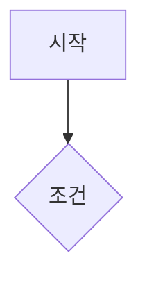

# {{title}}

> [!info] 이 문서는?
> 시스템 개요 1~2문장. **상위 기준**: [[GDD_v8.0_00_확정사항]] §절.

---

## 1. 목적 & 범위

- **목적:** 이 시스템이 게임에서 하는 역할
- **범위 (in):** 포함하는 것
- **비범위 (out):** 포함하지 않는 것 (스코프 명시)

## 2. 설계 원칙

| # | 원칙 | 이유 |
|---|---|---|
| 1 |  |  |

## 3. 규칙 & 수치

> [!warning] 수치 정합성
> 모든 수치는 [[GDD_v8.0_00_확정사항]] 및 부속 문서와 충돌 확인 필수
> (예시 — 작성 시 현행값으로 교체: 상한 SPD +10% · 스탯 합산 +15% · 행동력 30캡/처치+1 · 플레이어블 15종).

| 항목 | 수치 | 근거 |
|---|---|---|
|  |  |  |

## 4. 로직 흐름

## 5. 구현 연동

- 데이터: `docs/db/schema.sql` / `docs/data/*.json` — 테이블·필드
- 검증: `namegen-prototype/` 스크립트 — 시뮬레이션/테스트

## 6. 미결정 & 리스크

- [ ] 미결정 사항 → [[GDD_v8.0_00_확정사항]] 등록

---

## ✅ 작성 완료 체크리스트 (AGENTS.md §6)

- [ ] ①~④ 프론트매터(`version`·`up`·`aliases` 포함) · 위키링크 · 콜아웃 · 머메이드
- [ ] **⑤ README 등록** — [[README]] 문서 목록에 `[[새문서명]]` 형태로 등록 (버전·상태·설명 함께)
- [ ] **⑥ 결정로그 등록** — 설계 결정/확정 사항이 있으면 [[GDD_v8.0_00_확정사항]]에 등록
- [ ] **⑦ 상태 태그 = status 필드와 정합** — 생성 시 기본 `상태/초안`(Draft) — In Progress/Complete 전환 시 함께 변경 (§9)
- [ ] **검증 스크립트 실행** — `python3 design-docs/_tools/check_docs.py` (exit 0 = 준수)
- [ ] 🔗 관련 문서 표에 상호 링크 (📌 결정 기록 행 포함)

---

## 🔗 관련 문서

| 관계 | 문서 |
|---|---|
| 🏛 홈 | [[README]] |
| 📖 기준 | [[GDD_v8.0_00_확정사항]] |
| 📌 결정 | [[GDD_v8.0_00_확정사항]] |

---

*템플릿: `_템플릿/시스템_설계서.md` — 작성 후 README 등록 · 관련 결정은 GDD_v8.0_00_확정사항에 반영 (AGENTS.md §6)*
