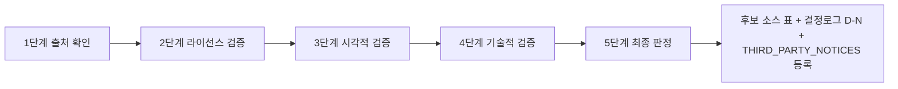

# 외부 에셋 검토: {{asset}}

> [!info] 상태
> ⬜ 미검토 / 🔄 검토 중 / ✅ 채택 / ⚠️ 조건부 채택 / ⬜ 후보 유지 / ⏸ 보류 / ❌ 폐기

## 외부 에셋 검토 기록

- **Asset:** {{asset_name}} (팩/개체)
- **Source:** {{출처 — itch.io / GitHub / OpenGameArt 등}}
- **Original URL:** {{URL}}

### 1. 출처 검증

- **결과:** {{원 출처 확인 · 공식 배포 페이지 · 실제 배포자 기록}}

### 2. 라이선스 검증

- **라이선스:** {{CC0 / CC-BY-SA / GPL / 상업 무료 등}}
- **원문 인용:** {{원문 문구 — "..."}}
- **대조일:** {{YYYY-MM-DD — 공식 페이지 실측 일자}}
- **상업적 이용:** {{Yes / No / 조건부}}
- **수정:** {{Yes / No / 조건부 (파생물 공개 의무 등)}}
- **재배포:** {{Yes / No — 재배포 금지면 소스 보관 불가 (추출물만 커밋)}}
- **Attribution:** {{필수 / 선택 / 불필요}}

### 3. 시각적 검증

- **실루엣:** {{형태 — 게임 내 기대 실루엣과 정합 여부 · 몬스터 식별성}}
- **색상:** {{팔레트 · 원본색 렌더 호환 · 색군 수}}
- **해상도:** {{Full 3D 저폴리 — 스펙은 GDD_v8.0_00_확정사항 #15}}
- **생동감/애니메이션:** {{정적 1장 vs 프레임 순환/숨쉬기 보유 (D-137 판정 축 — 생동감이 해상도보다 우선)}}
- **게임 적합성:** {{유럽 판타지 · 게이트키퍼 설정과 테마 정합 — 실루엣/색상/위협도}}

### 4. 기술적 검증

- **프레임:** {{수 · idle/run/hit/walk 등 상태별}}
- **Sprite 구조:** {{시트 크기 · 셀 배치 · 개별 프레임 추출 가능 여부}}
- **Unity 호환성:** {{임포트 설정(Point 필터 · PPU · pivot) · 32×32 파이프라인 호환 · 알파 처리}}

### 5. 최종 판정

- [ ] 채택
- [ ] 조건부 채택
- [ ] 후보 유지
- [ ] 보류
- [ ] 폐기

**Decision Log:** {{D-N — [[GDD_v8.0_00_확정사항]] 등록 번호}}
**Reviewer:** {{검토자}}

---

## 후속 조치 (AGENTS.md §6)

- [ ] **후보 소스 표 등록** — [[GDD_v8.0_00_확정사항]] #15 판정 기입 (채택/보류/부적합/후보)
- [ ] **⑥ 결정로그 등록** — [[GDD_v8.0_00_확정사항]]에 D-N 등록
- [ ] **THIRD_PARTY_NOTICES 등록** — 채택 시 `THIRD_PARTY_NOTICES.md` 기입 (Unity 프로젝트의 THIRD_PARTY_NOTICES.md)
- [ ] **⑤ README 등록** — 새 문서로 생성한 경우 [[README]] 문서 목록에 등록
- [ ] **⑦ 상태 태그 = status 필드와 정합** — 판정 확정 시 status와 `상태/xxx` 태그 함께 변경 (§9)
- [ ] **검증 스크립트 실행** — `python3 design-docs/_tools/check_docs.py` (exit 0 = 준수)

---

## 🔗 관련 문서

| 문서 | 관계 |
|---|---|
| [[GDD_v8.0_00_확정사항]] | 검토 절차 5단계 · 후보 소스 표 — 본 템플릿의 상위 정책 (등록처) |
| [[GDD_v8.0_00_확정사항]] | 판정 D-N 등록처 |
| [[GDD_v8.0_00_확정사항]] | 자산 유형별 임포트 방식 |
| [[README]] | 문서 맵 |
