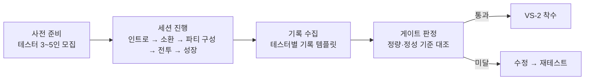

# 플레이테스트 체크리스트

> [!info] 이 문서는?
> **VS-1 외부 플레이테스트 진행 절차 + 관찰 체크리스트 + 게이트 합격 기준** (마스터 프롬프트 5.5/5.6).
> 테스터 3~5인 대상 소환→전투→성장 1사이클 재미 검증 (개발플랜 §3.1 VS-1 게이트).
> 테스터별 상세 기록은 `_템플릿/플레이테스트_기록.md` 템플릿으로 수집합니다.

---

## 1. 사전 준비

| 항목 | 내용 | 상태 |
|---|---|---|
| 테스터 모집 | 3~5인 (게임 미경험자 포함 — 지시 편향 방지) | [ ] |
| 빌드 | Unity 데모 실행 가능 (씬 재생성 확인) | [ ] |
| 세션 도구 | 화면 녹화 · 타이머 · 메모 — 관찰자 1명 | [ ] |
| 진행 스크립트 | 인트로(1분) → 자유 플레이 → 종료 인터뷰(5분) | [ ] |

## 2. 진행 절차 (1테스터 ≈ 30분)

1. **인트로 (1분)** — 게임 설명 최소화 ("탐색해 보세요")
2. **소환** — 자유 소환 → ★ 등급 획득 확인
3. **파티 구성** — 5인 선택·배치 (15종족 / 소환카탈로그 16종)
4. **층 선택 → 전투** — 층 진입(AP 소모) → 자동 전투 + 전술 명령·궁극기
5. **보상 → 성장** — 클리어 → 골드/경험치/영혼석 → 레벨업
6. **종료 인터뷰 (5분)** — `_템플릿/플레이테스트_기록.md` 질문

## 3. 관찰 체크리스트 (테스터별 — 기록 템플릿 §1~§9)

| 관찰 축 | 확인 포인트 |
|---|---|
| 소환 경험 | 소환 이해 · ★ 등급 반응 · 재소환 의향 |
| 파티 구성 | 5인 구성 난이도 · 진형 이해 |
| 전투 이해도 | 자동 전투 파악 · **명령(이동/집중공격/회복 등) 사용** · **궁극기 발동 시점** |
| **15층 보스 전투 (숙련도 축 — D-59)** | **예고 배너 → 「이동」 회피 성공/실패 여부** — 즉사기 등장 횟수별 성공률 기록 ('실패 1회 = 전멸' 클리프 · 밸런스 §7-1-3 숙련도 곡선 실전 검증) — **★D-79: Unity가 자동 계측** — 시전별 영웅별 성공/실패가 로그(`[SoulCommander 계측]`)와 CSV(`instant_death_metrics.csv`)로 기록됨 → 관찰자는 **로그/CSV 회수로 대체** 가능 (수동 기록은 미스 판정/혼란 지점 주석만) |
| **15층 잡기 (포박 CC — D-95/D-109)** | **① 잡기 대상이 수호자/지원가인가** — '전열 첫 수호자' 우선 가정 실전 확인 ② **예고 배너 → 「집중공격」으로 잡기 구조물(HP 90) 파괴·해제까지의 시간** — focus 대기/늦음 여부 (자연 해제 3초 vs 조기 해제 — D-95 'focus의 CC 단축 62%' 가치 실전 대조 · D-109 성장 반영 후 CC 단축 체감) ③ **CC 중 사망 발생 여부** — 잡힌 영웅이 드레인(초당 5% HP)·타 패턴으로 죽는지 (CC = 실질 비용 축 · 전투 로그/스크린 — 밸런스 §7-1-4 실전 CC 비용 1.6×드레인 대조) — **★D-95 플레이테스트 연동 항목 · `[SoulCommander 계측]` 로그·구조물 HP 표시로 보조** |
| **소환물 돌진 (D-78/D-96)** | **예고 배너 + 도착 지점 붉은 마커 → 「이동」 회피 성공/실패 여부** — 소환물 2마리 상태에서 돌진 예고마다 기록 (★D-96 모델 가설 '돌진 = 승률 무영향 0.0%p — 연출/전술 교란 축' 실전 대조 — 실전에서도 위협이 아닌지 · 회피 실패 시 강타(1.8×ATK) 피격 체감) — 관찰 축: ① 예고 인지 여부 ② 「이동」 사용 여부 ③ 회피 성공/실패 ④ 회피 실패 시 피해·사망 — **플레이테스트 관찰 항목 (D-96 — 밸런스 §7-1-5 연동)** |
| 성장 경험 | 보상·레벨업 가시성 · '더 강해짐' 체감 |
| 혼란 지점 | 멈춤/되묻기 — 위치·이유 기록 (반복 여부) |
| 재미 포인트 | 긍정 반응(웃음/몰입 발언) — 언급 요소 기록 |
| 불편 사항 | 조작·UI·속도 불편 |
| 버그 | 치명적(세션 중단) / 중대(진행 방해) / 경미 분류 |

## 4. 게이트 합격 기준 (임시 제안 — ⬜ 미확정, D-56 후보)

> [!warning] 결정 전 — 확정값 아님
> 아래 임시 기준은 마스터 프롬프트 5.6의 **제안안**입니다. 테스터 데이터 수집 후
> [[GDD_v8.0_00_확정사항]]에 **확정 등록 전까지는 참고값** (임의 확정 금지 — 재구축 원칙 3).

### 4-1. 정량 (5인 기준)

| 기준 | 임계값 | 판정 |
|---|---|---|
| 핵심 루프 완료율 | **≥ 80%** (5명 중 ≥4명 소환→전투→성장 1사이클 완료) | [ ] |
| 첫 사이클 완료 시간 | 중앙값 **≤ 15분** | [ ] |
| 재플레이 의향 | 평균 **≥ 4.0/5** (또는 긍정 비율 ≥ 80%) | [ ] |
| 치명적 버그 | **0건** (세션 중단·저장 불가·전멸 후 진행 불가) | [ ] |
| 혼란 지점 | 테스터당 **≤ 3건** | [ ] |
| **15층 즉사기 회피 성공률** | **≥ 98%** (D-59 실전 기준값 — 95%에서 승률 ≤28% · 98%+ 급상승 · 100% = 확정 — 밸런스 §7-1-3 · 예고→이동 성공 여부 관찰 + **★D-79 계측 CSV dodge_rate**로 산출) | [ ] |

### 4-2. 정성 (관찰자 판정)

| 기준 | 임계값 | 판정 |
|---|---|---|
| 전투 이해도 | 지시 없이 궁극기 발동 + 명령 사용 — 테스터 **≥ 60%** | [ ] |
| 공통 재미 포인트 | 같은 요소를 **≥ 3인** 언급 | [ ] |
| 혼란 반복 | 동일 혼란 지점 반복 **0회** | [ ] |

## 5. 결과 집계

| Tester ID | 루프 완료 | 클리어 층 | 재플레이 의향 | 치명적 버그 | 게이트 판정 |
|---|---|---|---|---|---|
|  |  |  |  |  |  |

---

## ✅ 작성 완료 체크리스트 (AGENTS.md §6)

- [ ] ①~④ 프론트매터(`version`·`up`·`aliases` 포함) · 위키링크 · 콜아웃 · 머메이드
- [ ] **⑤ README 등록** — [[README]] 문서 목록에 `[[새문서명]]` 형태로 등록 (버전·상태·설명 함께)
- [ ] **⑥ 결정로그 등록** — 게이트 기준 확정 시 [[GDD_v8.0_00_확정사항]] D-N 등록 (확정 전 미등록)
- [ ] **⑦ 상태 태그 = status 필드와 정합** — Draft ↔ `상태/초안` — 완료 시 전환 (§9)
- [ ] **검증 스크립트 실행** — `python3 design-docs/_tools/check_docs.py` (exit 0 = 준수)
- [ ] 테스터별 `_템플릿/플레이테스트_기록.md` N건 수집 → §5 집계

---

## 🔗 관련 문서

| 관계 | 문서 |
|---|---|
| 🏛 홈 | [[README]] |
| 🛤 상위 | [[GDD_v8.0_03_개발플랜]] |
| 📋 테스터 기록 | `_템플릿/플레이테스트_기록.md` |
| ⚔️ 검증 대상 | [[GDD_v8.0_00_확정사항]] · [[GDD_v8.0_01_등급_전투력]] |
| 📌 결정 | [[GDD_v8.0_00_확정사항]] |

---

*템플릿: `_템플릿/플레이테스트_체크리스트.md` — 작성 후 README 등록 · 관련 결정은 GDD_v8.0_00_확정사항에 반영 (AGENTS.md §6)*
