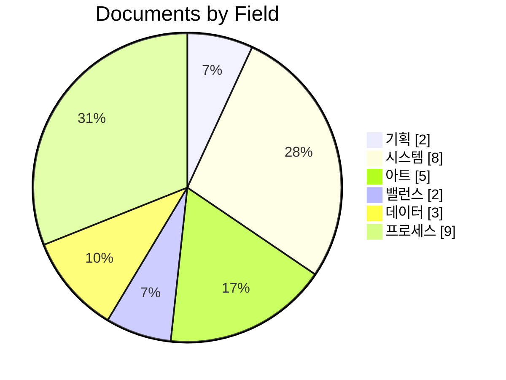

# 🏛 GDD 홈 — 《소울 커맨더》 문서 맵

> [!note] 이 문서는?
> 《소울 커맨더》의 모든 기획 문서를 연결하는 **맵(Map of Content)** 입니다.
> 옵시디언 **그래프 뷰(Graph View)** 에서 이 문서가 중심 허브가 됩니다.
> 문서가 추가되면 아래 표에 `[[위키링크]]`로 연결하세요.

> [!important] 현재 개발 기준 (2026-09-03 갱신)
> 엔진은 **Godot 4.7.2**로 확정하고 현재 프로젝트는 루트 단일 구조입니다 (★D-192 S0 A안 — `client_godot/` 소멸). 런타임 스폰 카탈로그의 공식 기준은 **74 ID**(`data/monsters.json` 정본 ↔ `docs/data/monsters.json` 미러)이며, 도감(Bestiary)의 **55 슬러그**는 설계·세계관 카탈로그로 런타임 스폰 목록과 별개입니다(두 집합의 교집합 23종 — 정본 정의: [`docs/DATA.md`](../../DATA.md) §0). Unity `client/` 구현 문서는 `docs/archive/gdd/`의 역사 자료로 취급합니다.

---

## 📁 볼트 구조 (★v2.0)

```text
docs/GDD/
├── 00_허브/        ← MOC·허브 (본 문서 · 문서 등록처)
├── 01_기획/        ← GDD 본문 · 밸런스
├── 02_시스템/      ← 전투 · 소환 · 도감 · 이름 생성
├── 03_아트/        ← 아트 규칙
├── 04_프로세스/    ← 개발 플랜 · 결정 로그 · 문서 규칙 · 캔버스
├── archive/gdd/ (구 05_아카이브)    ← 이전버전 (수정 금지)
├── _템플릿/        ← 새 문서 템플릿 7종 (시스템 설계서 · 세션 로그 · 결정 로그 · 도감 항목 · 외부 에셋 검토 · 플레이테스트 기록/체크리스트)
└── 04_프로세스/개발로드맵.canvas   ← 파이프라인 시각화
```

> [!tip] 새 문서 작성 순서
> ① `_템플릿/`에서 템플릿 선택 → ② 분류 폴더(00~04)에 생성 (**감사 자동 포함** — [[문서작업규칙_템플릿#1️⃣-1 본문 폴더 생성 = 감사 자동 포함 (★D-30 실습 확정)|§1️⃣-1]]) → ③ 아래 문서 목록에 등록 → ④ 결정/승인 사항은 [[결정로그_DecisionLog]]에 기록 → ⑤ `bash scripts/audit_docs.sh --quiet` 실행 (본문 자동 +1 · 대시보드 재생성 필요 시 `python3 art/tools/gen_home_dashboard.py`).
> 표준 상세: [[문서작업규칙_템플릿]] v2.2.

---

## 📄 문서 목록 (버전 흐름)

| 문서 | 버전 | 상태 | 설명 |
|---|---|---|---|
| [[SoulCommander_GDD_v7.12]] | v7.12 | ⭐ **최신 확정본** (★2026-09-03) | 현행 확정본 (v7.11 후속 — 종족·파티·밸런스 정합) |
| [[SoulCommander_GDD_v7.11]] | v7.11 | 이전 버전 (보존본) | 종족·파티·밸런스 통합판 (6대 계열, 5인 파티, 재추첨 무중복) — ★v7.12 확정으로 이관 완료 · 고치지 않음 |
| [[GDD_v7.12_개정안]] | v0.2 | 개정안 (DRAFT) | GDD v7.12 개정 제안 — 인디 전환 결함 수정 (결정 전) |
| [[GDD_§10.1_행동력_개정_초안]] | v0.1 | 초안 (확정 채택 — ★D-187) | §10.1 행동력 시스템 IndieStaminaSystem 개정 초안 — 문안 v7.12 §10.1에 채택 반영 (★D-D 확정 · ★D-187) |
| [[클래스위치보정_구현설계]] | v1.0 | 부속 문서 (초안) | 클래스 위치 보정 · 배후 조건부 배율 구현 설계 (multConditional — ★2026-09-03) |
| [[SoulCommander_GDD_v7.10]] | v7.10 | 이전 버전 | 모순 8건 해소 + P0 수치 확정 (아카이브) |
| [[SoulCommander_GDD_v7.9]] | v7.9 | 원본 | 최초 상업용 확정본 (아카이브) |
| [[검토의견서_v7.9]] | v7.9 | 검토 기록 (아카이브) | GDD v7.9 검토 의견서 — A절 모순 8건 · B~D 구체화 (★2026-08-09 아카이브 이동) |
| [[종족몬스터사전_Bestiary]] | **v3.1** | 부속 문서 (통합) | **설계 도감 / 종족 ★15 + 몬스터 55** (런타임 스폰은 74 ID — `docs/DATA.md` §0) — DCSS 타일셋 기준 · CRPG 레퍼런스 통합 · ★v3.1 (2026-09-03): 오크·뱀파이어 플레이어블 복귀 |
| [[플레이어블종족확장_설계]] | **v1.0** | 부속 문서 (★2026-09-03 D-180 신설) | 플레이어블 종족 **13→15 확장 설계** — 오크(전사)·뱀파이어(심연) 부분 복귀 · 신규 2종 전 스펙(스탯/패시브/아종) · 언데드 파티 예외 규칙 · 계보 공명 재검토 · 예비 확장 은행 · `data/races.json` |
| [[밸런스_5인전환_재계산]] | v1.0 | 부속 문서 | 4인→5인 전환 밸런스 재계산 (곡선·보스 기믹) |
| [[경제밸런스_시뮬레이터_설계서]] | v0.1 | 초안 | P1-⑩ 경제 밸런스 시뮬레이터 설계 — 소환 가격·성장 재화 흐름 검증 범위 + 입력값(파동판 공급량 포함) · ±20% 판정(14.4) |
| [[개발플랜_DevPlan]] | **v3.0** | 역사 참고 (항법 이관) | 세션 간 항법은 **통합안 v2.0(`开发-plans/`)** + `docs/STATUS.md`로 이관 — 본 문서는 VS-1~3 파이프라인 배경 참고 (2026-08-20 스냅샷) |
| [[세션로그_2026-08-11]] | v0.1 | 세션 기록 | 2026-08-11 세션 — VS-1 기능 완성 · 결정 D-23~D-29 · 발견/리스크 (파동판 상한 480 병목 · 보스 밸런스 4건) · 다음 세션 (플레이테스트 게이트 / VS-2) |
| [[bossWinrateSim_재현보고서]] | **v1.0** | 시뮬 기록 | bossWinrateSim 재현 보고서 — D-52/D-69/D-83 수치 대조 (runs 120) · 층 추가 시 9.7 곡선 시뮬 검증 규칙의 이관처 (★D-194 — 구 §14.4) |
| [[결정로그_DecisionLog]] | v1.0 | 📌 결정 기록 | **설계 결정 ADR** — 현재 확정·보류·미결정 항목을 함께 기록하는 단일 결정 로그 |
| [[게이트판정_GateReport]] | **v1.0** | 🚦 게이트 판정 | Phase 8.11 최종 보고 — **VS-1 기능 PASS · 게이트 ⬜ PENDING** (플레이테스트 대기) · **VS-2 READY** · Documentation/Economy/Combat/Simulation/CI/Obsidian Dashboard 축별 상태 + 블로커 3건 (★2026-08-12 D-68) |
| [[ADR-6_병원_부활과_영구사망]] | v1.0 | 부속 문서 (ADR · ★D-248) | 병원 부활 vs 영구 사망 모순 판결 — 병원 = 생존자 Sanity 요양 전용 확정 · 부활 분기 제거 인계 (구현은 병행 세션 안착 후) |
| [[소환카탈로그_설계영웅]] | **v1.2** | 부속 문서 | 아키타입 템플릿 16종 — ★v1.1 재배분 완료 (모르가나→정령족 등 6종) + **스킬 계수 시트 §8 통합** (16종 DPS 정합 — 스킬계수 문서 흡수) |
| [[이름생성시스템_NameGenerator]] | v1.0 | 부속 문서 | 등급 연동 판타지 이름 생성 (음절→희귀접사→신화 오마주) |
| [[Godot_전환_개발순서]] | **v1.0** | 초안 (AI 생성 — 2026-08-17) | Godot 4 현재 개발순서 — Phase G0~G3 · 절차 아이소메트릭 Node2D/2.5D 구현 · 루트 단일 구조 기준 (★D-192) |
| [[Unity_VS1_기능완료_기록]] | v1.0 | 아카이브 | Unity `client/` VS-1 완료 상태 보존 기록 (현재 구현 기준 아님) |
| [[전투시스템_BattleSystem]] | v1.0 | 부속 문서 | 전투 상세 — 8장 통합 (게이지·명령어·공식·AI·보스) |
| [[수중지형_수해적응_시스템]] | v0.1 | 초안 | 수중 지형 시스템 설계 — 휴면 패시브 '수해 적응'(크록 — 물가/수중 DEF +20%) 활성화 · 지형 3종 · 습지 층 배치 · 20층 정령왕 물 테마 연동 (★2026-08-12 D-94 신설) |
| [[문서작업규칙_템플릿]] | **v2.2** | 표준 규칙 | 옵시디언 문서 작성 표준 — ★v2.2: **템플릿 상태 태그 기본값 + 템플릿 자체 점검(--all 참고)** · ★v2.1: 제5·6 표준 승격(표준 9종) · 볼트 구조 · 원자적 노트 · 결정 로그(ADR) · 태그 체계 · 마일스톤 5요소 · **★D-36: §11 새 문서 생성 워크플로** (템플릿 → 상태 태그 → ⑤⑥⑦ 등록 → 감사 도구 Mermaid 흐름도) |
| [[아트규칙_2.5D]] | **v4.0** | 부속 문서 (통합) | 2.5D 탑다운 60° 규칙 + **LPC 파이프라인 §9 + 2.5D 전환 이력 §10 통합** — 카메라/캔버스 · 자산 임포트 §6.1 (DCSS 13종족+55몬스터) · 재구축 로드맵 · P7~P9 예정 · **★L8 §8: 후보 소스 표·검토 절차는 [[ASSET_IMPORT_POLICY]]로 분리 이관** |
| [[ASSET_IMPORT_POLICY]] | **v1.0** | 부속 문서 (★L8 §8 신설) | 자산 임포트 정책 단일 소스 — 후보 소스 표(13행) · 채택 4종 라이선스 원문 대조(L8 §5) · 해상도/색상/팔레트/리사이즈/애니메이션 정책 · 검토 절차 5단계 · 결정로그 연계 · 자동 감사 연동 (아트규칙 §6.1 역참조) |
| [[몬스터_재설계_스펙_Tier1]] | **v1.0** | 부속 문서 (★L8 §51·D-146 신설) | 몬스터·종족 재설계 스펙 — Tier 1 59종(몬스터 46 + 종족 13) 각각 목표 실루엣/색상/역할 표현/후보 소스 (D-145 채점 확정 기준 · 소싱 시 ASSET_IMPORT_POLICY §5 5단계 재사용) |
| [[몬스터_보정_가이드_Tier2]] | **v1.0** | 부속 문서 (★L8 §51·D-147 신설) | 몬스터 보정 가이드 — Tier 2 8종(고블린·오크·코볼드·스켈레톤·오거·홉고블린·에틴·리자드맨) 저점 축 분석 + 항목별 개선(위협도/이름 인식 공통 저점 · DCSS 원본색 전환 최소 비용 · 목표 25+ Tier 2 해제) |
| [[종족_재설계_소스조사]] | **v1.0** | 조사 문서 (★L8 §52·D-148 신설) | 종족 13종 재설계 소스 조사 — 원인 진단(파츠 중복: human=genasi=halfling · 엘프 4종 동일) → **경로 A 채택: LPC 미사용 파츠**(hair 70+ · horns · fins · long ears · hoofs — 같은 소스·라이선스 부담 0) vs **경로 B 보류**(신규 CC0 전투 스프라이트 부재) |

> [!tip] 구현 데이터 (JSON)
> 몬스터 데이터: `data/monsters.json` (74 ID — 미러 `docs/data/monsters.json`, [[종족몬스터사전_Bestiary#13. DB & JSON 스키마|통합 사전 §13]] 스키마) — DCSS 매핑은 `art/out/dcss_map.json` (종족 13/13 · 몬스터 55/55).
> 스킬 데이터: `data/skills.json` (16종 아키타입 — 미러 `docs/data/skills.json`), 로더 `scripts/data/game_data.gd`. Unity `SkillDatabase` 표기는 역사 자료입니다.

---

## 🗄 Unity 클라이언트 재구축 기록 (아카이브, 2026-08-08)

> [!warning] 현재 구현 아님
> 아래 내용은 Unity `client/`의 완료 기록입니다. 현재 작업은 루트 단일 구조(`scenes/`·`scripts/`)에서 진행하며 (★D-192 S0 A안), 상세 역사 자료는 [[Unity_VS1_기능완료_기록]]으로 분리했습니다.

> [!warning] 왜 재구축했나
> 수동 편집한 `Main.unity` YAML + 다중 런타임 스크립트 간섭으로 반복적 렌더링 미스터리(원거리 3D 메시 미렌더링 등)가 발생 → **전면 초기화**. 기존 클라이언트는 `client_old_20260808/` 백업 (불필요 시 삭제 가능).

### 원칙 (절대 유지)

| # | 원칙 | 이유 |
|---|---|---|
| 1 | `.unity` YAML **손편집 금지** — 씬은 코드(에디터 메뉴 스크립트)로만 생성 | 손편집 YAML이 모든 미스터리의 근원 |
| 2 | 자리표시는 전부 **스프라이트** | 탑다운 60° 카메라에서 원거리(약 15유닛+) 3D 메시 미렌더링을 실측 확인. 2.5D 픽셀 아트 방향과도 일치 |
| 3 | **단일 소스** — 런타임 스크립트 간 간섭 금지 | DemoSetup/DemoLighting 상호 덮어쓰기 사태 방지 |
| 4 | 한 스텝에 하나만 만들고 확인 | 회귀 최소화 |

### 새 프로젝트 구조 (`client/`)

```
client/                          ← Unity 2022.3.62f1 (ProjectVersion 고정)
├── ProjectSettings/ProjectVersion.txt   (2022.3.62f1)
├── Packages/manifest.json               (com.unity.ugui — 향후 uGUI UI용)
└── Assets/
    ├── Scenes/    ← 씬은 전부 코드 빌더로 생성 (스텝 2~)
    ├── Scripts/   ← 에디터 빌더 + 런타임 스크립트
    └── Resources/ ← 절차 생성 대체 (에셋 임포트 의존 최소화)
```

### 구축 로드맵 (스텝별)

| 스텝 | 내용 | 상태 |
|---|---|---|
| 1 | 프로젝트 초기화 (삭제 → 최소 프로젝트 재생성) | ✅ 완료 |
| 2 | 첫 씬 빌더 — `Tools → Soul Commander → Build Base Scene` (카메라 60°·ortho 6.2 + 절차 타일 바닥) | ✅ 완료 |
| 3 | parallax 배경 3레이어 (L1 0.15 / L2 0.35 / L3 0.7 + 드리프트) | ✅ 완료 |
| 4 | 5인 시작 배치 — 영웅 자리표시 5 (스프라이트) | ✅ 완료 |
| 5 | 전투 HUD (★GDD 검수 반영) — 전술 게이지 + 「이동」「집중 공격」 버튼 | ✅ 완료 |
| 6 | 실시간 자동전투 데모 (★GDD 검수 반영) — 몬스터 3(맵 밖 스폰→접근) + 17장 AI(광폭화) + 영웅 자동 공격 + HP 바 + 기본 진형(자동 전투) | ✅ 완료 |
| 7 | 「집중 공격」 타깃팅 — 버튼 → 몬스터 탭 → 5초 전원 집중 사격(×1.5) + 황금 마커 | ✅ 완료 |
| 8 | 감정 풍선(8.2) — 픽셀 이모티콘 + 초단문 (광폭화 😱 · 처치 😎, 최대 2개/1.5초) | ✅ 완료 |
| 9 | 웨이브 시스템 — 전멸 → 강화 웨이브 (수·HP·ATK 스케일 + 배너 + 힐 50%) | ✅ 완료 |
| 10 | 타격 이펙트·히트 플래시 — 피격 0.1초 흰색 플래시 + 별 이펙트 (팽창·페이드) | ✅ 완료 |
| 11 | 2.5D 깊이감 — 유닛 지면 그림자 + 바닥 잔디/돌 패치 (60° 경사 가시화) | ✅ 완료 |
| 12 | 전술 버튼 확장 — 전술소 Lv.2 4버튼: 「방어 태세」15(아군 3초 50% 감면)·「회복」25(잃은 체력 30%) | ✅ 완료 |
| 13 | 전술 이동 명령 — 6버튼 완성: 「이동」지면 탭 파티 이동 · 「후퇴」15(쿨 15초) · 「측면 기동」25(이속+30%·치명타 100%) | ✅ 완료 |
| 14 | 전술 이펙트 시각화 — 방어 태세 파란 방패 배지 + HP 바 파란 전환 · 회복 초록 십자 이펙트 | ✅ 완료 |
| 15 | ★2.5D P3 — **Anchor 통일** (전 스프라이트 pivot 하단 (0.5,0) + 유닛/환경 발 기준 y=0) | ✅ 완료 |
| 16 | ★2.5D P4 — **WorldObject 시스템** (나무·돌·풀·버섯 코드 생성기 + 개별 그림자 + 동적 z-order 6~39) | ✅ 완료 |
| 17 | ★2.5D P5 — **나무 3파츠 오클루전** (Shadow/Trunk/Canopy 분리 + 캐노피 오버행 — 뒤 유닛 가림) | ✅ 완료 |
| 18 | ★2.5D P6 — **카메라 줌** (`]`/`[` 키 ortho 4.5~8, 스무스 Lerp, UI 무영향 — 줌 수치 HUD 실증) | ✅ 완료 |
| 19 | ★2.5D P7 — **Body Bob** (이동 시 시각 오프셋 흔들림, 판정 불변) | ⬜ 예정 |
| 20 | ★2.5D P8 — **성능** (화면 밖 오브젝트 활성화 토글 — VisibilityCuller) | ⬜ 예정 |
| 21 | ★2.5D P9 — **전체 회귀 테스트** (전투·웨이브·전술·이펙트·줌 전부 확인) | ⬜ 예정 |

> [!tip] 2.5D 전환 Phase 상세
> P3~P9의 설계·구현·판정 체크리스트는 [[아트규칙_2.5D#10. 2.5D 전환 — Unity 적용 이력|아트규칙 §10 (2.5D 전환)]] 참조 — 재구축 로드맵 15~21은 해당 섹션의 Phase P3~P9와 1:1 대응.

> [!tip] 캠퍼스 기준
> 카메라 **(0, 11.5, -6.6)** · X+60° · Ortho 6.2 · 방향광 1.4 무그림자 — [[아트규칙_2.5D]] 기준 (★v3.10: 돈스타브식 상향 탑다운).

---

## 🔗 태그 모음 (그래프 필터링용)

#gdd — 전체 문서
#기획서 — GDD 본문
#부속문서 — GDD 부속 문서 (사전 · 밸런스 · 카탈로그 · 전투 · 이름 · 아트) — 🧭 대시보드 참조
#종족 — 종족/시너지 관련
#밸런스 — 수치/곡선/기믹 관련
#검토 — 리뷰/의견서
#이전버전 — 아카이브 문서

---

---

---

<!-- TODO:START -->

## ✅ 할 일 / 진행 중 (자동 생성)

> [!note] 실시간 작업 뷰 — **자동 생성 구간 (수동 편집 금지)**
> 결정로그 ⬜미결정 + 개발플랜 VS-1~3 미완료 항목에서 추출 — 갱신: `python3 art/tools/gen_home_dashboard.py` · 동기화 검증: `--check`.

### 📌 결정로그 미결정 ([[결정로그_DecisionLog]])

| 상태 | 항목 | 선택지 | 출처 |
|---|---|---|---|
| `⬜ 미결정` | D-178 2026-08-27 | **LPC Revised 팩 — 라이선스 등록 (OGA-BY 3.0) · 채택 여부 ⬜ PENDING** — 문서 단일 진실 소스 복구 세션 중 발견: `art/_source/lpc_revised/`(약 733MB)가 저장소에 있으나 THIRD_PARTY_NOTICES에 **미등록**이었고, `art/tools/audit_external_assets.py`가 이 팩을 `kind="internal"`(자체/절차 생성물)로 **오분류**해 라이선스 필드 검사를 통째로 건너뛰고 있었음 → 감사가 ✅로 통과. **조치:** ① THIRD_PARTY_NOTICES §12 신설 — 표준 필드 14종 전체 기재 ② 감사기 분류를 `internal` → `candidate`(D-178)로 정정해 등록 누락이 앞으로는 `UNREGISTERED_EXTERNAL_ASSET`으로 잡히게 함 ③ ASSET_IMPORT_POLICY §3 후보 소스 표에 행 추가 ④ `.gitignore`에 `art/_source/lpc_revised/` 추가(재다운로드 가능 업스트림) | [[결정로그_DecisionLog#⬜ 미결정 (다음 세션 이월)|⬜ 미결정]] |
| `⬜ 미결정` | D-179 2026-08-27 | **Flare: Empyrean Campaign 팩 — 라이선스 등록 (CC-BY-SA 3.0) · 채택 여부 ⬜ PENDING** — D-178과 동일 세션 발견: `art/_source/flare_hero/`(약 317MB)가 THIRD_PARTY_NOTICES **미등록**이었고, 감사기가 `kind="internal"`로 오분류했음. 해당 항목 주석이 *"Flare CC-BY-SA 소스 — 실험 보관"*이라고 스스로 외부·비CC0임을 명시하면서도 라이선스 검사 면제 분류를 달고 있던 **자기모순 상태**. **조치:** ① THIRD_PARTY_NOTICES §11 신설 — 표준 필드 14종 + ShareAlike 전파 경고 ② 감사기 분류 `internal` → `candidate`(D-179) ③ ASSET_IMPORT_POLICY §3 후보 표 행 추가 ④ `.gitignore` 추가 | [[결정로그_DecisionLog#⬜ 미결정 (다음 세션 이월)|⬜ 미결정]] |
| `⬜ 미결정` | D-184 2026-09-03 | **D-182 후속 완료 — GDD §8.9 클래스 위치 보정(암살자 배후 +50% · 궁수 측면 +20%) = 런타임 미구현 판정 · '미구현/후속' 표기 확정** — 사용자 요청('런타임 코드에서 클래스 보정이 실제 구현되어 있는지 확인')에 따른 전수 검증 결과 기록. **① 검증 대상 = git HEAD** `client_godot/`(전투 코드는 작업 트리에서 삭제 — HEAD에만 존재) **② 판정 — 미구현**: `position_system.gd`는 순수 위치 기하 판정만(FRONT 1.0 / SIDE 1.10 / BACK 1.25 / 고지대 1.15 / 커버 0.75 상수 + 각도 60°/120° 판정 + `get_position_multiplier(pos)`) — **클래스 인자·분기 0**. 데미지 경로 4곳(`battle_env_system.gd:79 get_spatial_damage_multiplier` → `battle_manager.gd:155` · `target_selector.gd:341` · `hero_combat_handler` · `enemy_entity`) 전부 위치·고지대·커버 배율만 균일 곱 — **공격자 클래스 참조 0**. 클래스 보정 키워드(배후 +50%/측면 +20% 등) .gd 전수 검색 **0건** **③ 데이터 계층 = 스킬 조건부만 존재(비활성)**: `client_godot/data/skills.json`(· `docs/data/` 사본) L134 '암습' `multConditional.behind: 3.0` · L210 '야수 습격' 2.8 — **`multConditional` .gd 소비처 0(코드 미배선)** · 궁수 패시브 '숲의 눈'(측면 +20%)은 effect 텍스트만. **§8.9의 '암살자 배후 +50%'는 데이터 대응조차 없음 = 설계 잔재** (스킬 조건부·치명타 패시브와 혼재된 v7.11 §8.9 L611 표기) **④ 조치**: §8.9 클래스 보정은 **설계 의도(미구현/후속)로 표기 확정** — v7.12 §8.9 ⚠️ 박스 반영. 실제 구현(`multConditional` 평가 배선 등)은 통합 플랜 S1(전투 수직 슬라이스) 이후 별도 판단 | [[결정로그_DecisionLog#⬜ 미결정 (다음 세션 이월)|⬜ 미결정]] |
| `⬜ 미결정` | D-185 2026-09-03 | **D-E3 근거 — 몬스터 M.DEF 분포 시뮬레이션 (마법학자 2세트 관통 p=10% 기대 효율 실측 · 74종 전수)** — 사용자 요청('관통 A안 채택 시 마법학자 2세트의 기대 효율을 몬스터 M.DEF 분포 기반으로 시뮬레이션')에 따른 실측 기록. **① 모집단·방법**: `data/monsters.json` **74종 전수** `stats.mdef`(프로젝트 유일 M.DEF 소스) · 층 스폰 범위 가중(스폰 층 수만큼 카운트) + 종 동일 가중 민감도 · 공식 `이득 = (1−DR(mdef×(1−p))) / (1−DR(mdef)) − 1`, `DR(x)=x/(x+200)` **② 분포 실측**: 티어별 mdef 중앙값 — T1(일반) 26종 **3** · T2(정예) 22종 **5** · T3(미니보스) 14종 **18~20** · T4(보스) 5종 **80** · T5(월드보스) 7종 **55** · **전체 중앙 5** · 평균 17.7 · 최대 80 · mdef=0 6종 — 대상별 DR: 대부분 1~7%, 보스 28%(80) **③ A안 기대 효율(층 가중)**: **p=10%(현행) — 일반 웨이브(T1~2) +0.11% · 미니보스/보스(T3~5) +1.76% · 전체 +0.48%** (종 동일 가중 +0.74%) · p=15% → +0.17/+2.67/+0.73% · p=20% → +0.23/+3.59/+0.98% · p=50% → +0.58/+9.62/+2.59% · 대상별: mdef 5 → +0.24% · 35 → +1.5% · 80 → +2.9% **④ +5% 평균 도달 필요 p**: T3~5 ≈ 27% · 전체 ≈ 89% · **T1~2는 도달 불가(p=99%에도 ~+1%)** **⑤ 판정 함의**: (a) **p=10% A안 세트는 실질 논보너스**(일반 +0.1% · 보스 +1.8%) — 종전 '+3~5%' 추정은 몬스터 M.DEF가 100~200대라는 낙관 가정 기반 (b) 15~20% 상향도 +0.2~3.6%로 미미 — **병목은 구조적**: 몬스터 M.DEF(중앙 5 · 상한 80)가 DR 상수(+200) 대비 과소 → %무시 메커닉 정체성 없음 (c) '고방어 보스 카운터' 정체성 실현 = **M.DEF 곡선 수 배 상향(T4~5: 80 → 200~400) 또는 메커닉 교체**(평면 마법 피해 % = B안 실질) (d) **추가 발견**: mdef는 런타임 전투 코드에 **전무** — 데미지 감소는 단일 `def`(`floor_encounter_system._scaled_instance`가 hp/atk/def만 생성 · mdef 참조 .gd 0건) → **M.DEF 배선(GDD §8.6 ④) 자체가 D-E3 선행 작업** | [[결정로그_DecisionLog#⬜ 미결정 (다음 세션 이월)|⬜ 미결정]] |
| `⬜ 미결정` | D-157 2026-08-14 | **종족 비율 문제 인식 + 대안(서큐스 인간형) 비교 프리뷰 (사용자 지적 '대가리 큼')** — 사용자 지적('인간형 캐릭터 비율 이상 · 대가리 왜케 커 · 다른 에셋 못 찾나 · 너무 못생김') — **① 원인 실측 — 지적 타당**: LPC 64×64 = 머리 y18~37(20px)/몸통 y18~63(46px) → **머리 43%** (chibi — LPC 고유 비율) · DCSS player/base 32×32 = 머리 5행/몸 12행 → **머리 ~30%** (실제 인간 비율 — ASCII 실측) **② 대안 실측 — DCSS 인간형 완비**: CC0 · D-06 채택 소스 · player/base에 human_male/elf_male/deep_elf_male/dwarf_male/gnome_male/halfling_male/merfolk_male/demonspawn_red_male/tengu_wingless_brown_male/orc_male/kenku_winged_male 전수 확인 — **felid/houndkin은 인간형 타일 부재 실측**(cat/dog 계열 검색 0건) → LPC 유지 **③ 비교 프리뷰**: `art/gen_race_proportion_compare.py` 신규 → `art/out/race_proportion_compare.html` — 종족별 **LPC(머리 43%) vs DCSS(머리 30%)** 실제 전투 크기(384px) 나란한 비교 · 13카드 · 24이미지 · felid/houndkin='대안 없음 — LPC 유지' | [[결정로그_DecisionLog#⬜ 미결정 (다음 세션 이월)|⬜ 미결정]] |
| `⬜ 미결정` | D-140 2026-08-14 | **0x72 v1.3 → v1.7 업그레이드 검토 (L8 §4 — 트랙 A) — 판정: ⬜ 보류 (조건부)**: ① **차이 실측 (itch.io 원문 2026-08-14)**: v1.4 bow and arrow · v1.5 dwarfs · v1.6 slugs · v1.7 autotiles (2024-03-11 devlog) · 추가 파일 pumpkin_dude/doc.png · v1.7 zip 406KB ② **가치 vs 비용** — 신규 몬스터(slugs·dwarfs)·무기(bow)는 L8 몬스터 29종 매핑(이미 v1.3으로 확정)에 직접 필요 없음 · autotiles는 Kenney 타일 파이프라인(D-115)과 중복 · 로컬 파이프라인(`frames/` 326장 추출 · `gen_ox72_monsters.py` · 29종 매핑·환경 소품)은 v1.3 시트 기준 — **v1.7로 전환 시 재추출·재매핑·픽셀 diff 재검증 필요 (migration 비용)** ③ **조건부 채택 트리거** — (a) 원거리 몬스터(고블린 아처류) 도입 시 v1.4 bow 부분 병합 (b) autotile 기반 지하 통로 층(테마) 도입 시 v1.7 autotiles 재검토 — CC0라 버전 무관 라이선스 동일 (D-120 기록 유지) | [[결정로그_DecisionLog#⬜ 미결정 (다음 세션 이월)|⬜ 미결정]] |
| `⬜ 미결정` | D-136 2026-08-14 | **Cainos 대체 CC0 팩 조사 — 화분·우물·묘비 (사용자 지시 — 'Cainos 팩 재배포 금지 때문에 소스 보관이 안 되는데, CC0이면서 같은 스타일(32×32 탑다운 화분·우물·묘비)의 대체 팩을 조사해줘')**: ① **Cainos 재배포 금지 재확인** — OGA 라이선스 필드 실측('재배포 금지' — 저장소 보관 불가 · D-124 화분 3·우물·묘비 3은 소스 미보관 상태) ② **OGA CC0 후보 4종 다운로드 + 픽셀 전수 실측**: **Mage City Arcanos(CC0 · 256×1450)** — 화분 ✅(나무 화분+잎 · 돌 urn+잎 · 통에 심은 나무 2종) · **우물 ✅(원형 나무 통 + 파란 물 — r5-6c13-14 갈색 링+파랑 중심 픽셀 검증 · 유일한 CC0 우물 후보)** · 묘비 ❌(회색 세로 셀 15개 전부 벽/건축) · **Zelda-like tilesets(ArMM1998 · CC0 · 16×16)** — 클래식 갈색 화분 ✅(objects r0c20-25 6종 · r4c0 화분+식물) · 묘비 ❌(Overworld 후보 5셀 전부 나무/등불 — ASCII 확인) · **Adventure Tileset(NaRNeRZz · CC0 · 32×32급)** — 버섯 0 · 화분/우물/묘비 부재(전수 스캔) · **SpiderDave Tombstones(CC0 · 1024×768)** — **묘비 실루엣 1024종(16×48 · 절차 생성) · 유일한 CC0 묘비 전용 소스** — 단색(어두운 회색) 실루엣이라 흰 실루엣 + sr.color 틴트(D-17/120 파이프라인)로 색 입히면 즉시 사용 가능 ③ **결론 — 단일 CC0 팩으로 3종 전부 충족하는 팩은 없음**: 화분 = Mage City 또는 **0x72 기존 채택분(r0c4-8 붉은 화분+초록 — 추가 라이선스 0)** · 우물 = Mage City(유일 CC0 후보) · 묘비 = SpiderDave(유일 CC0 전용) ④ 아트규칙 §6.1 후보 소스 표에 3행 추가 + 판정 요약 노트 — Cainos 자체는 **보류 유지**(D-124 미적용 유지) | [[결정로그_DecisionLog#⬜ 미결정 (다음 세션 이월)|⬜ 미결정]] |
| `⬜ 미결정` | D-134 2026-08-13 | **덫(floor_spikes) 실질 위험 지형 설계 검토 — ⬜ 결정 후보 (사용자 질문 — '덫을 순수 장식이 아니라 전투 중 몬스터가 밟으면 피해를 주는 실질 위험 지형으로 구현할지 설계 검토')**: ① **현황 실측** — D-126 순수 장식(0x72 floor_spikes 4프레임 IdleAnimator) · 배치 x=±2.2 · z=5.4(몬스터 스폰 경로상 — SpawnZ 9.5 → 영웅 직선 호밍) · 몬스터 Collider 없음(transform 이동) ② **★트랩 등가 시뮬레이션 실측 (bossWinrateSim ⑩-8 신규 — 10층 doc ×1.6 · focus+dodge+stance · 숙련 95% · 소환물 2마리 · runs 120)**: 트랩 무료 딜 = 몬스터 MaxHP % 제거와 등가 → **소환물 HP× 1.00→0.97(3% 감소) = 승률 43.3→63.3% (+20.0%p) · 0.90 = 93.3% (+50.0%p) · 0.80+ = 100%** — **돌진(D-96 0.0%p)과 달리 웨이브 난이도의 실질 하향 레버** (10층 승률이 소환물 HP에 극도로 민감 — D-111 'HP 절벽 레버'의 하향 방향 확증) ③ **커버리지 실측** — 스폰 x = 등간격(i−(count−1)/2)×1.4(5마리 ±2.8/±1.4/0) · 트랩 x=±2.2와 그리드 미정렬 → 우연 통과 0~2마리/웨이브 · 몬스터는 최근접 영웅 직선 호밍 → **「이동」으로 영웅을 x≈±2.2에 세우면 해당 열 몬스터가 트랩 통과 — 커버리지 = 플레이어 조절 가능한 유인 축** (유인 = 위험 지대 노출 트레이드오프) ④ **게임플레이 축**: 난이도(실질 하향 레버) · 전술(유인 판단 축 — D-112 돌진 철학 정합) · 하프링 '행운의 발걸음'(함정 회피 +10% — skills.json에 없음 · 미구현 — 몬스터 전용이면 무의미 · 양방향 전환 시에만 활성화) · 코볼드 함정 연계(몬스터 측 — 별개 축, 이번 범위 밖) ⑤ **밸런스 리스크 4건**: 공짜 하향(10층 성장 게이트 상쇄 필요) · 커버리지 불공정성(승률 분산) · 판정 방식 미지정(Collider 없음 — 반경 거리 · 쿨다운 · 피해 %) · 소환물 처치 시간 단축 → 집중공격 해제 가속(상성 축 중첩) ⑥ **2지선다**: ① 승격(몬스터 피해 지형 — 데모 정의 후보: 반경 0.7m · MaxHP 5% 이하 1회 · 쿨다운 2s · 밟을 때 스파이크 동기화 — 추정 +10~15%p) vs ② 현행 유지(순수 장식 — 절충: 밟음 반응 이펙트만) · **권장 ① 승격하되 '무료 딜'이 아닌 '유인 축'으로 설계** (피해 ≤5% + 커버리지를 「이동」 유인으로 조절 · 난이도는 소환물 스탯 레버 유지) — **피해 %·커버리지·판정은 시뮬레이션 trap 모델 + 플레이테스트 검증 후 확정 (재구축 원칙 3 — 임의 확정 금지)** | [[결정로그_DecisionLog#⬜ 미결정 (다음 세션 이월)|⬜ 미결정]] |
| `⬜ 미결정` | D-112 2026-08-12 | **돌진 '연출/전술 교란 축' 설계안 (사용자 지시 — '돌진을 연출/전술 교란 축으로 살리는 설계안(D-96 근거) — 예고→이동 리듬과 위협도 상호작용을 밸런스 문서에 추가')**: D-96 실측(돌진 = 승률 0.0%p 무영향)을 근거로 **난이도는 유지·전술 의미를 만드는 설계안 3종** — **A. 돌진 = 위협도 재배치 수단(추천)**: 도착 시 대상 위협도 ×0.3 리셋 → 17.2 재평가(2.5초)로 어그로 전환 — '회피 = 위협도 방어' 판단 축 (탱커 어그로 흔들기 · 힐러 위협 상승 리스크 · 도발/측면 기동 가치 상승) · **B. 후열 진입 연출**: 도착 지점 후열 연장 — 위치 보정(측면 +15%·배후 +30% — 8.9) 후열 가치 체감 (데미지 0) · **C. (보류) 현행 유지** — **권장 = A+B 병행** | [[결정로그_DecisionLog#⬜ 미결정 (다음 세션 이월)|⬜ 미결정]] |
| `⬜ 미결정` | D-108 2026-08-12 | **분할 로그인 리텐션 보너스 경제 영향 시뮬레이션 (사용자 지시 — '로그인 빈도 축(③)을 리텐션 전략으로 — 하루 2회 로그인 시 파동판 보너스의 경제 영향(② 하에서의 증분)')**: econSimFull §⑨ — **SPLIT_BONUS = 로그인일 파동판 +30**(자연 회복 3시간 상당 · 데모 정의) · 병행 세그먼트 5종(_sb — 2회차 로그인 시 파동판 전량 교환 후 보너스 AP 즉시 전환 = 실유저 행동 반영) · 계측 bonusGranted/bonusLost · 리포트 §5/콘솔 [5] | [[결정로그_DecisionLog#⬜ 미결정 (다음 세션 이월)|⬜ 미결정]] |
| `⬜ 미결정` | D-107 2026-08-12 | **층 10+ 영혼석(중) 수급 개시 vs Lv60 도달 선후 정합 검증 (사용자 지시 — '층 10+ 영혼석(중) 수급 조건이 Lv60 도달 전에 열리는지 세그먼트별 시점을 계측해 성장 페이스 제어 정합성 검증')**: econSimFull에 **floor10Day 계측 신설**(층 10 도달 = 골드 게이트 gold≥5,000×10 · 영혼석(중) 상시 수급 개시일 — 설계서 §10 '등급 강화 20/회는 10층+에서 검증 예정') · 리포트 §2-3/콘솔 [2-3] — Lv60 vs floor10 선후 전 세그먼트 판정 | [[결정로그_DecisionLog#⬜ 미결정 (다음 세션 이월)|⬜ 미결정]] |
| `⬜ 미결정` | D-106 2026-08-12 | **Lv60 조기 만렙 해소안 스윕 — 권장 성장 임계 (사용자 지시 — 'Lv60 조기 만렙 해소안(레벨 비용 곡선 상향 or 층별 경험치 감소)을 econSimFull로 스윕해 권장 성장 임계를 산출하고 결정 후보로 등록')**: econSimFull §⑧-1 스윕 신설 — 레버 3종(① 레벨 비용 곡선 상향 costMult · ② 층별 경험치 감소 xpMult · ★③ 영혼석(하) 강화 비용 상향 soulMult — 시뮬레이터 실측용) × F2P/월정액 · 몬테카를로 40회/조합 · **조건**: 해소 F2P Lv60>90일 · 조기 체감 F2P Lv10 2~14일(D-19) · 목표 Lv60≈180일(반년 만렙) | [[결정로그_DecisionLog#⬜ 미결정 (다음 세션 이월)|⬜ 미결정]] |
| `⬜ 미결정` | D-100 2026-08-12 | **결정 후보 등록 — 7일+ 로그인 주기 잔여 손실 완전 해소안 (P1-⑪ 후속 · D-89 ② 이후 잔여: P=7 연간 24,960 — 판캡 960 재병목)**: `plateLossSweep.ts` 개정(기준=D-89 확정 반영 · P=10/14 확장 · **회계차 0 불변식**)으로 **실측** — ① **기준(판 960·소비 1,200)**: P≤5 무손실 · **P=7 24,960** · P=10 43,200 · P=14 56,160 (D-89 기록 재현) ② **★완전 해소 대칭(판 1,680·소비 1,680)** — D-89 기록 후보: **P≤7 전 주기 0** · 연간 소비 62,640 → **87,600(완전 수급)** · P=10 25,680 · P=14 43,440 ③ **★최소 조합(판 1,440·소비 1,680) 신규 발견** — P≤7 동일 0 (판 = 6일 오버플로우 1,440 · 소비 = 7일 회복 1,680 — 로그인일 잔여 AP 240도 전량 소비) ④ **회계차 0 전 안·전 주기 위반 0건** (불변식: 소비+잔여+캡손실 = 365×240 = 87,600) | [[결정로그_DecisionLog#⬜ 미결정 (다음 세션 이월)|⬜ 미결정]] |
| `⬜ 미결정` | D-89 2026-08-12 | **P1-⑪ ② + D-52-② ① 확정 — 6중 동기화 (사용자 결정 — 마스터 프롬프트 §3.4/40.7)**: ① **P1-⑪ ② 일일 소비 상한 완화 → 840→1,200 확정** (판 960 유지 — B1 · v7.11 10.1 '자발적 소비 상한' 문구 추가 · DDL `stamina.daily_spend_cap` 게임 상수 1,200 · staminaSim `DAILY_SPEND_CAP` · econSimFull `dailySpendCap` · GDD_홈/게이트판정/밸런스/설계서 갱신) ② **D-52-② ① 현재 유지 (ATK 19) 확정** — 코드 변경 0 · bossWinrateSim ⑤-6 확정 반영. **재검증**: staminaSim 회계차 0 + ②+960 4일·5일 무손실(840 캐리오버 병목 제거) · econSimFull 4일 10,560→0 · bossWinrateSim --runs 120 회귀 없음 | [[결정로그_DecisionLog#⬜ 미결정 (다음 세션 이월)|⬜ 미결정]] |
| `⬜ 미결정` | D-86 2026-08-12 | **staminaSim 소수 주기·분할 로그인 시나리오 확장 + package.json 복구 (마스터 프롬프트 §3.1 필수 시나리오)**: `staminaSim.ts`에 **반나절 틱 모델**(0.5일 · 틱당 자연 회복 120 · 240 초과분 → 파동판 · 로그인 시 전량 교환 + 일일 소비 상한 840 내 소비 — 하루 2회 분할은 840 하루 공유)로 **신규 시나리오 3종 추가** — **2.5일 주기 · 3.5일 주기 · 4일 하루 2회 분할(매일 아침·저녁)** (기존 정수 주기 1/2/3/4/5/7일은 기존 일일 루프 유지 — 재현성 불변). **실측 (②+960 기준)**: 2.5일 **87,120 소비·손실 0** · 3.5일 87,360·0 · **4일 분할 87,600(=자연 회복 전량)·0** — **3종 전부 무손실** · 신규 **9조합(주기 3 × ①/②/②+960) 회계차 0** (최대 차 0.00e+0 · 자동 실패 규칙 적용) · ②(480캡)는 3.5일에서 12,600 손실(480캡 한계 — 960캡 필요 재확인). **★무손실 경계 확장 발견**: 정수 주기로는 ≤3일인 무손실 경계가 **로그인 빈도를 올리면 4일+ 구간도 무손실** — 4일 1회(연간 **10,560 손실 — D-54 실측 정확 재현**) vs 4일 하루 2회 분할(**0 손실**) — 분할 로그인이 캐리오버 축적 전에 파동판을 교환해 960 캡 초과를 원천 차단 · **로그인 빈도 축 = P1-⑪ ②(소비 상한 완화)와 직교하는 대안** (① 상한 재상향 2%만 개선 근거 보강) | [[결정로그_DecisionLog#⬜ 미결정 (다음 세션 이월)|⬜ 미결정]] |

### 🛤 개발플랜 마일스톤 ([[개발플랜_DevPlan]])

| 상태 | 마일스톤 | 남은 항목 |
|---|---|---|
| `🔴 진행 중` | **3.1 VS-1 — 코어 루프 버티컬 슬라이스 (다음 세션 착수)** | 게이트: 3~5인 외부 플레이테스트 — "소환→전투→성장" 1사이클이 재미있는지 검증 |
| `⬜ 대기` | **3.2 VS-2 — 실서버 연동 슬라이스** | 미완료 2건: 전투 WS 게이트웨이 + 10Hz 서버 루프 + 롤백/재접속 · `tb_battle_records` 재생 검증<br/>게이트: 200ms 지연 내 전투 재현성 테스트 통과 |
| `⬜ 대기` | **3.3 VS-3 — 콘텐츠 확장 슬라이스** | 미완료 6건: 종족 시너지·경제 밸런스 시뮬레이션 최종치 · 오마주 200종·★5 칭호 시트 · 몬스터 예외 규칙·용족 보스 패턴 시트 · 층별 몬스터 유형·웨이브 구성 시뮬레이션 · 2.5D 스프라이트 파츠 제작 (64×64) · Pre-Alpha 전투 시뮬레이터 스킬 계수 검증 (±20% 튜닝)<br/>게이트: 10층 연속 플레이 플레이테스트 — 난이도 곡선·성장 체감 검증 |


<!-- TODO:END -->


<!-- DASHBOARD:START -->

## 🧭 태그별 문서 대시보드 (분야 · 상태 · 성격)

> [!note] 정적 태그 인덱스 — **자동 생성 구간 (수동 편집 금지)**
> 본문 문서의 프론트매터 `tags`에서 추출 — 갱신: `python3 art/tools/gen_home_dashboard.py` · 동기화 검증: `--check`.

### 분야별

| 분야 | 문서 |
|---|---|
| `#기획` | [[SoulCommander_GDD_v7.12]] · [[밸런스_5인전환_재계산]] |
| `#시스템` | [[GDD_§10.1_행동력_개정_초안]] · [[소환카탈로그_설계영웅]] · [[수중지형_수해적응_시스템]] · [[이름생성시스템_NameGenerator]] · [[전투시스템_BattleSystem]] · [[종족몬스터사전_Bestiary]] · [[클래스위치보정_구현설계]] · [[플레이어블종족확장_설계]] |
| `#아트` | [[ASSET_IMPORT_POLICY]] · [[몬스터_보정_가이드_Tier2]] · [[몬스터_재설계_스펙_Tier1]] · [[아트규칙_2.5D]] · [[종족_재설계_소스조사]] |
| `#밸런스` | [[경제밸런스_시뮬레이터_설계서]] · [[밸런스_5인전환_재계산]] |
| `#데이터` | [[소환카탈로그_설계영웅]] · [[종족몬스터사전_Bestiary]] · [[플레이어블종족확장_설계]] |
| `#프로세스` | [[ADR-6_병원_부활과_영구사망]] · [[GDD_v7.12_개정안]] · [[Godot_전환_개발순서]] · [[bossWinrateSim_재현보고서]] · [[개발플랜_DevPlan]] · [[게이트판정_GateReport]] · [[결정로그_DecisionLog]] · [[문서작업규칙_템플릿]] · [[세션로그_2026-08-11]] |

### 상태별

| 상태 | 문서 (N) |
|---|---|
| `#상태/확정` (6) | [[ADR-6_병원_부활과_영구사망]] · [[GDD_홈]] · [[SoulCommander_GDD_v7.12]] · [[bossWinrateSim_재현보고서]] · [[문서작업규칙_템플릿]] · [[밸런스_5인전환_재계산]] |
| `#상태/작업중` (9) | [[개발플랜_DevPlan]] · [[게이트판정_GateReport]] · [[결정로그_DecisionLog]] · [[세션로그_2026-08-11]] · [[소환카탈로그_설계영웅]] · [[이름생성시스템_NameGenerator]] · [[전투시스템_BattleSystem]] · [[종족몬스터사전_Bestiary]] · [[플레이어블종족확장_설계]] |
| `#상태/초안` (11) | [[ASSET_IMPORT_POLICY]] · [[GDD_v7.12_개정안]] · [[GDD_§10.1_행동력_개정_초안]] · [[Godot_전환_개발순서]] · [[경제밸런스_시뮬레이터_설계서]] · [[몬스터_보정_가이드_Tier2]] · [[몬스터_재설계_스펙_Tier1]] · [[수중지형_수해적응_시스템]] · [[아트규칙_2.5D]] · [[종족_재설계_소스조사]] · [[클래스위치보정_구현설계]] |
| `#상태/아이디어` (0) | — |

### 성격별

| 성격 | 문서 (N) |
|---|---|
| `#gdd` (26) | [[ADR-6_병원_부활과_영구사망]] · [[ASSET_IMPORT_POLICY]] · [[GDD_v7.12_개정안]] · [[GDD_§10.1_행동력_개정_초안]] · [[GDD_홈]] · [[Godot_전환_개발순서]] · [[SoulCommander_GDD_v7.12]] · [[bossWinrateSim_재현보고서]] · [[개발플랜_DevPlan]] · [[게이트판정_GateReport]] · [[결정로그_DecisionLog]] · [[경제밸런스_시뮬레이터_설계서]] · [[몬스터_보정_가이드_Tier2]] · [[몬스터_재설계_스펙_Tier1]] · [[문서작업규칙_템플릿]] · [[밸런스_5인전환_재계산]] · [[세션로그_2026-08-11]] · [[소환카탈로그_설계영웅]] · [[수중지형_수해적응_시스템]] · [[아트규칙_2.5D]] · [[이름생성시스템_NameGenerator]] · [[전투시스템_BattleSystem]] · [[종족_재설계_소스조사]] · [[종족몬스터사전_Bestiary]] · [[클래스위치보정_구현설계]] · [[플레이어블종족확장_설계]] |
| `#부속문서` (11) | [[ADR-6_병원_부활과_영구사망]] · [[ASSET_IMPORT_POLICY]] · [[밸런스_5인전환_재계산]] · [[소환카탈로그_설계영웅]] · [[수중지형_수해적응_시스템]] · [[아트규칙_2.5D]] · [[이름생성시스템_NameGenerator]] · [[전투시스템_BattleSystem]] · [[종족몬스터사전_Bestiary]] · [[클래스위치보정_구현설계]] · [[플레이어블종족확장_설계]] |
| `#MOC` (1) | [[GDD_홈]] |
| `#가이드` (6) | [[ASSET_IMPORT_POLICY]] · [[Godot_전환_개발순서]] · [[개발플랜_DevPlan]] · [[몬스터_보정_가이드_Tier2]] · [[문서작업규칙_템플릿]] · [[아트규칙_2.5D]] |

### 📊 분포 차트 (Mermaid)

| 분야 | 문서 수 | 상태 | 문서 수 |
|---|---|---|---|
| `#기획` | 2 | `#상태/확정` | 6 |
| `#시스템` | 8 | `#상태/작업중` | 9 |
| `#아트` | 5 | `#상태/초안` | 11 |
| `#밸런스` | 2 | `#상태/아이디어` | 0 |
| `#데이터` | 3 | — | — |
| `#프로세스` | 9 | — | — |

#### 분야별 문서 수 (파이)



#### 상태 분포 (바)

```mermaid
xychart-beta
    title "Documents by Status"
    x-axis [확정, 작업중, 초안, 아이디어]
    y-axis "문서 수" 0 --> 12
    bar [6, 9, 11, 0]
```
> [!tip] xychart-beta 미지원 (Mermaid 10.8+ 구버전)에서도 보이는 대체 표시 — 아래 ▮ 막대 (수치 동일).

| 상태 | 문서 수 |
|---|---|
| `#상태/확정` | ▮▮▮▮▮▮ 6 |
| `#상태/작업중` | ▮▮▮▮▮▮▮▮▮ 9 |
| `#상태/초안` | ▮▮▮▮▮▮▮▮▮▮▮ 11 |
| `#상태/아이디어` |  0 |

### 🛡 폴더별 감사 커버리지 (표준 9종)

> [!note] 감사 리포트 집계 — **자동 생성 구간 (수동 편집 금지)** · 갱신: `bash scripts/audit_docs.sh` 후 재생성.

| 폴더 | 문서 | 통과율 | ①프론트 | ②위키 | ③콜아웃 | ④머메이드 | ⑤홈 | ⑥결정 | ⑦태그 | ⑧삭제 | ⑨구수치 |
|---|--:|---:|---|---|---|---|---|---|---|---|---|
| `00_허브` | 1 | 100% | 1/1 ✅ | 1/1 ✅ | 1/1 ✅ | 1/1 ✅ | 1/1 ✅ | 1/1 ✅ | 1/1 ✅ | 1/1 ✅ | 1/1 ✅ |
| `01_기획` | 3 | 100% | 3/3 ✅ | 3/3 ✅ | 3/3 ✅ | 3/3 ✅ | 3/3 ✅ | 3/3 ✅ | 3/3 ✅ | 3/3 ✅ | 3/3 ✅ |
| `02_시스템` | 7 | 100% | 7/7 ✅ | 7/7 ✅ | 7/7 ✅ | 7/7 ✅ | 7/7 ✅ | 7/7 ✅ | 7/7 ✅ | 7/7 ✅ | 7/7 ✅ |
| `03_아트` | 5 | 100% | 5/5 ✅ | 5/5 ✅ | 5/5 ✅ | 5/5 ✅ | 5/5 ✅ | 5/5 ✅ | 5/5 ✅ | 5/5 ✅ | 5/5 ✅ |
| `04_프로세스` | 10 | 100% | 10/10 ✅ | 10/10 ✅ | 10/10 ✅ | 10/10 ✅ | 10/10 ✅ | 10/10 ✅ | 10/10 ✅ | 10/10 ✅ | 10/10 ✅ |

#### 폴더별 문서 통과율 (바)

```mermaid
xychart-beta
    title "Audit Coverage by Folder"
    x-axis [00_허브, 01_기획, 02_시스템, 03_아트, 04_프로세스]
    y-axis "통과율(%)" 0 --> 100
    bar [100, 100, 100, 100, 100]
```

> [!tip] xychart-beta 미지원 환경 대체 표시 — 아래 ▮ 막대는 구버전 Obsidian에서도 렌더됩니다 (수치 동일).

| 폴더 | 통과율 |
|---|---|
| `00_허브` | ▮▮▮▮▮▮▮▮▮▮▮▮▮▮▮▮▮▮▮▮ 100% |
| `01_기획` | ▮▮▮▮▮▮▮▮▮▮▮▮▮▮▮▮▮▮▮▮ 100% |
| `02_시스템` | ▮▮▮▮▮▮▮▮▮▮▮▮▮▮▮▮▮▮▮▮ 100% |
| `03_아트` | ▮▮▮▮▮▮▮▮▮▮▮▮▮▮▮▮▮▮▮▮ 100% |
| `04_프로세스` | ▮▮▮▮▮▮▮▮▮▮▮▮▮▮▮▮▮▮▮▮ 100% |

#### 표준별 위반 문서 상세 (①~⑨)

| 표준 | 위반 문서 (클릭 가능) |
|---|---|
| ①프론트 | ✅ 전부 준수 |
| ②위키 | ✅ 전부 준수 |
| ③콜아웃 | ✅ 전부 준수 |
| ④머메이드 | ✅ 전부 준수 |
| ⑤홈 | ✅ 전부 준수 |
| ⑥결정 | ✅ 전부 준수 |
| ⑦태그 | ✅ 전부 준수 |
| ⑧삭제 | ✅ 전부 준수 |
| ⑨구수치 | ✅ 전부 준수 |

#### 📈 감사 이력 (Coverage Trend — 최근 10회)

> [!note] 감사 실행 후 대시보드 재생성 시마다 시점별 폴더 통과율을 `art/out/coverage_history.json`에 기록 — 개선 추이 확인 (최대 30회 보관).

## 🎨 자산 임포트 체크리스트 (자동 생성)

> [!note] **ASSET_IMPORT_POLICY.md §3 '후보 소스' 표(리서치 2026-08-12)에서 추출** (★L8 §8 — 아트규칙 §6.1에서 분리 이관) — **자동 생성 구간 (수동 편집 금지)** · 갱신: `python3 art/tools/gen_home_dashboard.py`.

**판정 요약:** ✅ 채택 3건 · ⬜ 보류 11건 · ❌ 부적합 2건 · ⬜ 후보 6건 ※ 표의 Kenney 행은 '캐릭터 팩' 보류 — 같은 팩의 타일/환경은 D-115/116/118 채택 (채택 합계 4) · 상세: [[ASSET_IMPORT_POLICY#후보 소스]]

| 소스 | 해상도 | 라이선스 | 판정 | 비고 (요약) |
|---|---|---|---|---|
| **LPC Universal** | 64×64 | CC-BY-SA 3.0 / GPL v3 (동의 완료) | ✅ 채택 — 영웅 파츠 (D-114 슬라이스 · D-117 합성 · D-119 팔레트 파싱 → 원본색) | 최고 해상도 + 유일한 파츠 시스템. L1~L4·L8 완료 (D-128 애니메이션 풀 — walk/slash) · L7 CREDITS 후속 |
| **DCSS** | 32×32 | CC0 | ✅ 채택 — 영웅/몬스터 폴백 ② (D-06 · D-120에서 29종만 0x72로 대체) | 라이선스 부담 0 · 범위 최대 — 유지(폴백 체인) |
| **Kenney Roguelike Characters** | 16×16 | CC0 | ⬜ 보류 — 해상도 16×16이 DCSS보다 낮음 (리서치 판정) | 캐릭터 전용 팩이지만 해상도 축에서 개선 여지 없음 — 같은 팩의 타일/환경은 이미 채택 (D-115/116/118) |
| **0x72 DungeonTileset II** | 16×16 | CC0 (출처 표기 선택) | ✅ 채택 — 몬스터 29종 원본색 (D-120) | 던전 테마 — 몬스터 아트 정돈 · 326 프레임 보관 (`art/_source/ox72/`) · ★16×16이지만 원본색 렌더로 채택 (아래 발견 ② 해소) |
| **Mushroom Pixel Art Pack (OGA)** | 32×32 | CC0 (크레딧 선택 — OGA 필드 실측) | ⬜ 채택 → ★D-137 철회 (0x72 유지 재결정) | ★실측 데이터 (2026-08-13 — 유일한 업그레이드 후보): 원본 32×32 · 바운딩 박스 18×19(Red)~26×25(Purple)px (0x72… |
| **Ninja Adventure (pixel-boy)** | 16×16 | CC0 | ⬜ 보류 — 테마 제약 (실측: 22종 중 14종 테마 중립 · 8종 닌자 고정) · 부분 활용 후보 (테마 중립 14종 · 애니메이션 참고 — L8) | 아트 퀄리티 최상 — ★실측 (2026-08-13): itch.io 원문 "released under the Creative Commons Zero (CC0)… |
| **Cainos Top-Down Basic** | 32×32 | 상업 무료 (크레딧 불필요 · 재배포 금지) | ⬜ 보류 — 환경/타일 위주 | 나무·잔디·돌 — D-116(Kenney 환경)과 중복 · ★실측(2026-08-13): 버섯 0개 — Props 48 + Plant 28 + Struct 2… |
| **Deepnight RPG Map 2** | 16×16 | 상업 무료 | ⬜ 보류 — 지도 제작용 | 맵 에디터 전제 — 본 게임은 실시간 전투 화면 |
| **Mage City Arcanos (OGA)** | 16×16 격자 (개체 32×32급) | CC0 | ⬜ 후보 — 화분·우물 (Cainos 재배포 금지 대체 — 2026-08-14 실측) | ★실측: 화분 ✅(나무 화분+잎 · 돌 화분/urn+잎 · 통에 심은 나무 2종) · 우물 ✅(원형 나무 통 + 파란 물 — r5-6c13-14 셀 갈색 링+… |
| **Zelda-like tilesets and sprites (ArMM1998)** | 16×16 | CC0 (fort-of-chains 크레딧 파일 실측) | ⬜ 후보 — 화분 (Cainos 대체 — 2026-08-14 실측) | ★실측: 클래식 갈색 화분 ✅(objects r0c20-25 — 6종 · r4c0 화분+식물) · 묘비 ❌(Overworld 후보 5셀 전부 나무/등불로 판정… |
| **SpiderDave Tombstones (OGA)** | 16×48 | CC0 (크레딧 선택) | ⬜ 후보 — 묘비 전용 (Cainos 대체 — 2026-08-14 실측) | ★실측: 묘비 실루엣 1024종 (절차 생성 — 크기·픽셀 변형) · 시트 1024×768 · 단색(어두운 회색) 실루엣 → 흰 실루엣 + sr.color 틴… |
| **Anokolisa Pixel Crawler Free Pack (사용자 제공)** | 16×16 (탑다운) | 자유 사용 — 상업 무료 (Terms.txt 원문 대조… | ⬜ 후보 — 스테이션·데코 (D-169 — 라이선스 통과 · 추가 후보 목록 확정) | ★실측 (D-169 — 2026-08-14): 몹 8종(Orc·Skeleton Crew × idle/run/death · 16×16 < DCSS 32×32 —… |
| **Quaternius Modular** | 3D 로우폴리 | CC0 | ❌ 부적합 — 2D 아님 | 3D 자산 — 2.5D 픽셀 파이프라인과 무관 |
| **Shattered Pixel Dungeon** | 16×16 | GPL | ❌ 부적합 — GPL | 게임 전체 공개 필요 — 라이선스 충돌 |
| **LPC Revised (DeathsDarling 외)** | 32×32 (3/4 탑다운) | ⚠️ OGA-BY 3.0 / CC-BY 3.0 — 표시… | ⬜ 후보 — 라이선스 등록만 완료 · 채택 미결 (D-178) | ★2026-08-27 실측: 기채택 LPC(Universal LPC Generator)와 별개 팩 — §2 항목으로 커버되지 않음. `Characters/`·… |
| **Flare: Empyrean Campaign (Clint Bellanger 외)** | 가변 (아바타 파츠·타일) | 🔴 CC-BY-SA 3.0 — 표시 + 동일조건변경허락… | ⬜ 후보 — 라이선스 등록만 완료 · 채택 미결 (D-179) | ★2026-08-27 실측: 아트·데이터 전체 CC-BY-SA 3.0(엔진은 GPL v3+ — 미사용). ShareAlike이므로 게임에 넣으면 파생 아트도… |

### 🧾 신규 에셋 검토 절차 (필수 — 재구축 원칙 2의 명시적 예외)

> [!example] 외부 자산 도입 시 반드시 **ASSET_IMPORT_POLICY.md §5 5단계**를 거쳐 후보 소스 표에 판정을 등록한다 — **미등록 외부 에셋 도입 금지** (아트규칙 §6.1 경고 콜아웃 연동).

1. **출처 확인** — 원 출처 · itch.io/GitHub/OGA 공식 배포 페이지 · 실제 배포자 기록
2. **라이선스 검증** — 원문에서 상업 사용·수정·재배포·attribution 확인 — GPL(게임 전체 공개)·재배포 금지(소스 보관 불가 — 추출물만 커밋)면 제약을 즉시 기록 · **★애니메이션/생동감 (D-137 보강)**: 정적 1장 vs 프레임 순환/숨쉬기 보유 비교 — 32×32 정적이 16×16 애니메이션보다 반드시 우위가 아님 (D-137: 환경 버섯 32×32 팩 → 0x72 16×16 + idle 숨쉬기 원복 — 생동감 축이 해상도 축을 상회)
3. **시각적 검증** — 픽셀 해상도 · 색상 팔레트 · 실루엣 · 몬스터 식별성 · 게임 설정(유럽 판타지 · 게이트키퍼)과 실루엣/테마 충돌 검토 (예: Ninja Adventure 닌자 테마 고정 = 보류 판정)
4. **기술적 검증** — 프레임 수 · sprite sheet 구조 · 엔진 임포트 가능 여부 · 색상/알파 처리 · 32×32 파이프라인 호환 + **애니메이션 프레임 유무·품질 실측** (D-121 버섯 · D-126 소품 · D-122 절차 품질 패턴 · ★D-137: 32×32 팩 애니 프레임 0개 실측 = 정적 판정 근거 — 프리뷰는 `art/out/*_preview.html`)
5. **최종 판정 및 등록** — 채택/조건부 채택/후보 유지/보류/폐기 → 후보 소스 표 + 채택 시 **THIRD_PARTY_NOTICES.md** + 결정로그 **D-N** 등록 (CC0만 소스 보관 · 재배포 금지는 추출물만)


<!-- DASHBOARD:END -->

---


> [!warning] 주의
> 신규 작업 시 **항상 [[SoulCommander_GDD_v7.12]]를 기준**으로 하세요. v7.9/v7.10/v7.11은 [[docs/archive/gdd/이전버전/SoulCommander_GDD_v7.11|아카이브 (이전버전)]]입니다.

> [!info] 세션 간 규칙 유지
> 프로젝트 루트의 **`AGENTS.md`** 에 전역 작업 규칙이 저장되어 있어, 다른 세션에서도 자동으로 적용됩니다. 상세 문서 표준은 [[문서작업규칙_템플릿]]을 참고하세요.

---

## 🕸 그래프 뷰 사용법

> [!tip] 그래프 뷰 (Ctrl/Cmd + G)
> 1. **허브 노드**: `GDD_홈`이 중심 노드 — 모든 문서가 연결됩니다
> 2. **계층 구조**: 각 문서 프론트매터의 `up:` 필드 → 상위 문서 (홈 또는 [[SoulCommander_GDD_v7.12]])
> 3. **섹션 앵커**: `[[문서#섹션]]` 형태로 섹션 단위까지 연결됨 (예: [[SoulCommander_GDD_v7.11#5.4 계보 공명 — ★v7.11 전면 재정의 (B-2/B-3 해소)|5.4 계보 공명]])
> 4. **태그 필터**: 좌측 패널에서 `#부속문서`, `#이전버전` 등으로 필터링
> 5. **그룹 색상**: 검색 조건에서 `path:docs/GDD → docs/archive/gdd` 으로 아카이브 그룹 분리

---

## 📝 문서 작업 규칙 (표준)

> [!tip] 모든 기획 문서에 적용
> 상세 규칙은 [[문서작업규칙_템플릿]] 참고. 핵심 4가지:

| 규칙 | 내용 | 예시 |
|---|---|---|
| 1. 프론트매터 | type / status / tags / created / updated 필수 | `type: GDD` `status: Complete` |
| 2. 위키링크 | 핵심 개념·시스템·문서는 `[[링크]]` 필수 | `[[기본 이동 시스템]]` |
| 3. 콜아웃 | [!NOTE]/[!WARNING]/[!TIP]/[!EXAMPLE] | `> [!warning] 주의` |
| 4. 시각화 | 수치는 표(Table), 로직은 Mermaid | ```mermaid flowchart``` |

---

## 🔗 관련 문서

| 관계 | 문서 |
|---|---|
| 🛤 세션 항법 | [[개발플랜_DevPlan]] (다른 세션에서 첫 번째로 읽기) |
| 📌 결정 기록 | [[결정로그_DecisionLog]] |
| 📖 기준 본문 | [[SoulCommander_GDD_v7.11]] |
| 📝 표준 | [[문서작업규칙_템플릿]] |

---

*이 문서는 Freebuff(버피)와 함께 작성한 GDD 프로젝트의 옵시디언 허브입니다.*
