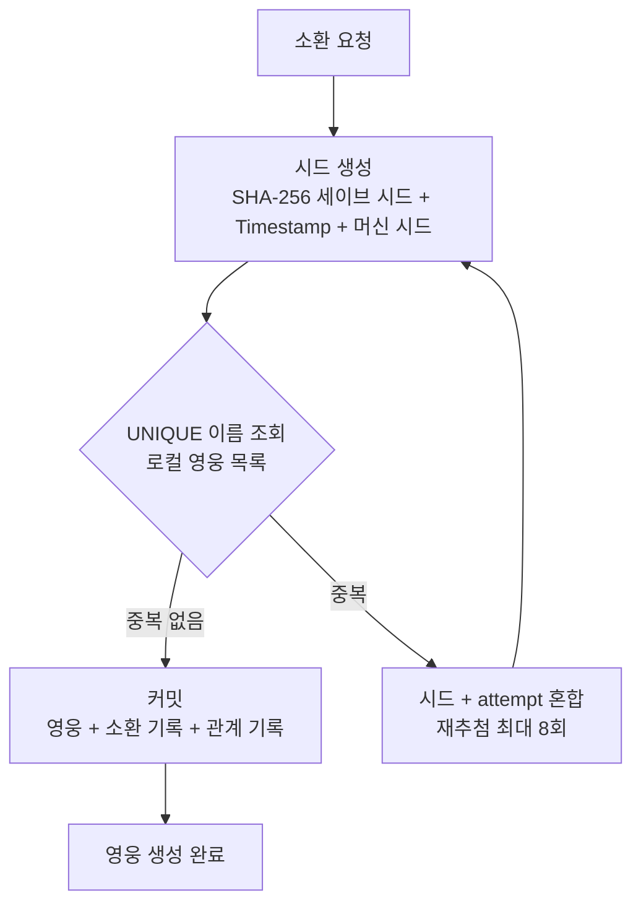
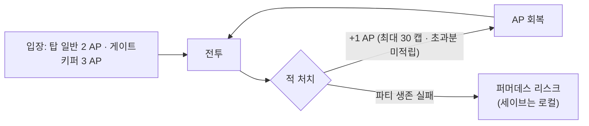
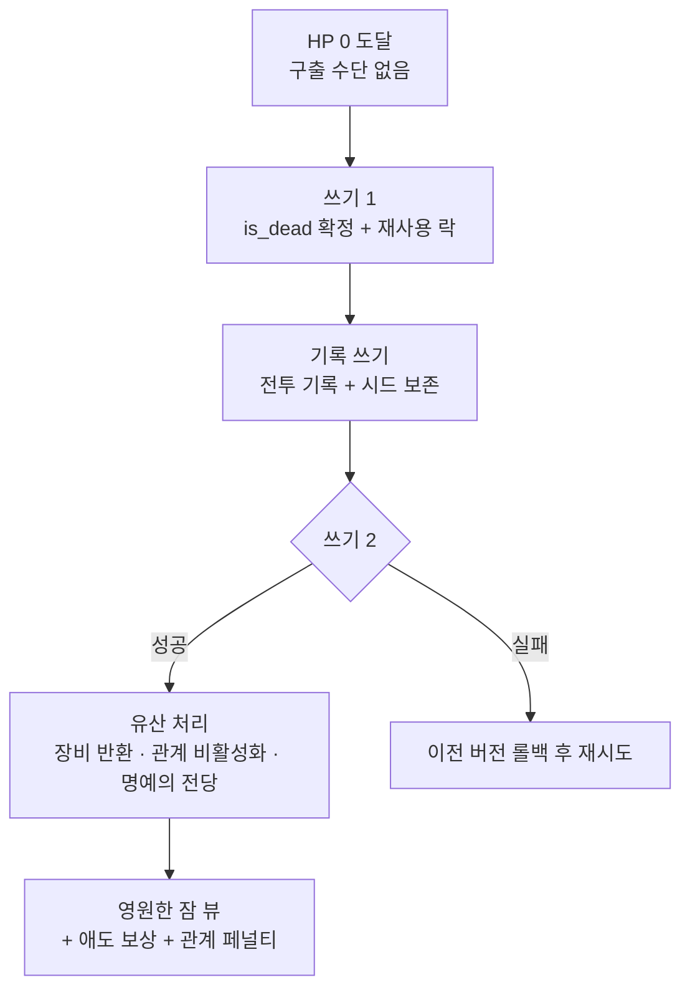

# 《소울 커맨더 (Soul Commander)》 최종 시스템 기획서

**버전:** GDD v7.12 (현행 확정본 — v7.11 + 2026-09-03 결함 확정 반영)
**작성 기준일:** 2026-09-03 (v7.11 승격)
**기반 문서:** GDD v7.11 + BALANCE_TUNING §4.2/§4.5 결정(D-181/D-182) + 개정안 `[[GDD_v7.12_개정안]]`

> [!important] 현재 구현 경계 (2026-09-06)
> 이 문서는 게임 규칙의 정본이다. 구현 여부는 `docs/STATUS.md`와 실제 루트 `scripts/`·`data/`를 따른다. 장비 드랍/장착/강화/전투 합산/사망 반환은 현재 런타임에 연결되어 있고 허브 패널 회귀(`equipment_panel_check`·`equipment_legacy_check`)도 2026-09-09 기준 통과했다. Legacy Core는 이번 출시 범위에서 제외한다. 플랫폼은 Mac/Windows 우선으로 확정했고 수익화는 미결정이다. 따라서 아래의 설계·준비 완료 표에서 `✅`는 **기획 완료**를 뜻할 수 있지만 **출시 구현 완료**를 뜻하지 않는다.

---

## v7.12 개정 특기사항 (v7.11 대비)

### ✅ 이번 개정으로 확정된 것

| # | 항목 | v7.11 | v7.12 | 확정 근거 |
|---|---|---|---|---|
| A-1 | 방어 관통 수식 | `×(1 - pen)` (부호 결함) | **감소율 완화** — `피해감소율 = (DEF×(1-pen)) / (DEF×(1-pen)+200)` | ✅ D-181 (2026-09-03) |
| A-2 | 위치 보정 | 문서 +15%/+30% vs 런타임 +10%/+25% (미확정) | **런타임 값 정본 채택** — 측면 +10% · 배후 +25% · 고지대 +15% · 커버 ×0.75 (§8.9 신설 규정) | ✅ D-182 (2026-09-03) |
| A-3 | 행동력(AP) | 명조식 240 · 1AP/6분 · 충전 · 파동판 · 일일 상한 | **인디 전환 확정** — 30 캡 · 적 처치 +1 · 탑 2/게이트키퍼 3 · 로컬 · 무제한 (§10.1 — `IndieStaminaSystem` 정본) | ✅ D-D → D-187 (2026-09-03 · B-13 해제) |
| B-3/4 | 계정·서버 | UID Snowflake · 일반/하드코어 서버+랭킹 | **로컬 프로필 단일 + 하드코어 모드 단일 규칙** (§4.1/§4.3) | ✅ D-194 (2026-09-03) |
| B-6 | 소환 시드 | 서버 UID 시드·서버 천장 | **로컬 시드** (§5.2) | ✅ D-194 |
| B-9/10 | 요일·탐험 | 요일 개방 3종 · 파견 탐험 | **층 고정 보스 보상 · 전투 직접 전리품** (§9.4/§9.5) | ✅ D-194 |
| B-12 | 재화 18종 | 다이아·PvP·길드·시즌 포함 | **인디 11종 재정의 제안** (§10 — D-B 확정 대기) | ★D-194 제안 |
| B-16 | §14 라이브 | 6주 사이클·100층 로드맵 | **챕터 제거** (검증 규칙은 §9.7로 이관) | ✅ D-194 |
| B-17 | 사망 플로우 | 서버 이중 커밋 | **로컬 트랜잭션** (§20.8) | ✅ D-194 |
| B-18 | DB 스키마 | 서버 `tb_*` 16+ | **로컬 세이브 스키마** (§20 — Lv.100·5스탯 정합) | ✅ D-194 |
| B-19 | 기술 제약 | 3,000 CCU·200ms·AES | **로컬 기준** (§21.3) | ✅ D-194 |
| B-20 | 최종 평가 | 가챠·서버 전제 | **인디 기준 재평가** (§22) | ✅ D-194 |

- §8.6/§8.9/§8.10/§18.2의 해당 문구를 정본으로 일괄 정정하고, 08-27 결함·미확정 박스는 제거했습니다.
- §10.1 행동력은 D-D 확정(★D-187)으로 초안 문안을 채택 — 본문 교체 · v7.11도 동일 문안으로 후속 반영(보존본). 잔여(결정값 아님): 회복률 S1 재검증 · 차원의 틈 S3 · 구식 코드 S0.
- Part B 🟦 11건은 본문 반영 완료 (★D-194) — 🟨 6건(D-A/D-B 기둥)은 `> [!warning] 결정 대기` 박스로 유지. 상세는 `[[GDD_v7.12_개정안]]` 참조.

---

## v7.11 개정 특기사항 (v7.10 대비)

### 🎯 핵심 확정 사항

| # | 항목 | v7.10 | v7.11 |
|---|---|---|---|
| B-1 | 파티 규모 | 출격 4명 + 예비 2명 | **출격 5명, 완전 자유 배치, 예비 없음** (8.10) |
| B-2 | 계보 정의 | '인간/엘프/드워프'와 '불의 계보' 혼용 (모순) | **6대 계열로 통일 확정** — 계보 = 종족 계열 (5.4) |
| B-3 | 계보 공명 판정 | 불명 (파티/보유 미정) | **보유 기준 재정의** — 3/5/7명은 보유한 동계열 영웅 수 (5.4) |
| B-4 | 종족 시스템 | 없음 (계보 3종만) | **6대 계열 × 플레이어블 13종족** 도입 (★2026-08-09 한정 — [[종족몬스터사전_Bestiary]] 참조) |
| B-5 | 무중복 방식 | 중복 출현 시 자동 추출 | **재추첨(Retry) 우선 + 자동 추출 안전망** (5.5) |
| B-6 | 소환 다양성 | - | **계보 지정 소환 + 부족 계보 보정** 신설 (5.6) |
| B-7 | 관계 생성 | 동반 전투/선물로만 생성 | **소환 시점 관계 생성** 신설 (5.7, 6.6) |
| B-8 | 몬스터 곡선 | 4인 기준 (HP 100×1.15^(N-1)) | **5인 기준 재튜닝** (HP 150×1.15^(N-1), ATK 12×1.12^(N-1)) (9.7) |
| B-9 | 보스 기믹 | 차원 균열 25초 / 반사 30% / 부위 10,000 | **차원 균열 20초 / 반사 20% / 부위 15,000** (19.2) |
| B-10 | 런칭 영웅 | 16종 (인간/엘프/드워프) | **아키타입 템플릿 16종 확정** — ★2026-08-09 플레이어블 한정 반영 시 4개 계열(인간/엘프/드워프/짐승) 배분 재조정 (12.1) |

### 📚 참조 부속 문서 (v7.11과 동일 버전)

| 문서 | 버전 | 담당 영역 |
|---|---|---|
| [[종족몬스터사전_Bestiary]] | v1.0 | ★종족+몬스터 통합 도감 (DCSS 타일셋 기준) — 플레이어블 13종 · 몬스터 55종 · 슬러그/틴트/스케일 · 시너지 · 위계·배치 (★종족사전/몬스터사전 병합 — 각 문서는 리다이렉트) |
| [[밸런스_5인전환_재계산]] | v1.0 | DPS/생존력 계산 · 곡선·기믹 수정 근거 |
| [[소환카탈로그_설계영웅]] | v1.0 | 아키타입 템플릿 16종 배분 · ★5 블라드 템플릿 |
| [[이름생성시스템_NameGenerator]] | v1.0 | 등급 연동 판타지 이름 생성 (신화 오마주) |
| [[전투시스템_BattleSystem]] | v1.0 | 전투 상세 — 8장·17장·19장 통합 구현 가이드 |
| [[종족몬스터사전_Bestiary]] | v1.1 (리다이렉트) | ★[[종족몬스터사전_Bestiary]]로 통합 — 몬스터 55종 상세 · DCSS 매핑 · 층별 배치 이관 |
| [[개발플랜_DevPlan#2. 📋 감사 결과]] | - | v7.9 기준 개선사항 8건 · P0~P3 구체화 목록 |
| [[문서작업규칙_템플릿]] | v1.0 | 옵시디언 문서 작성 표준 규칙 |

---

## 목차

1. Executive Summary (게임 개요)
2. 게임 개요 (상세)
3. 세계관 및 핵심 메커니즘
4. 계정 및 마스터 시스템
5. 소환 시스템 (무한 생성 파이프라인)
6. 영웅 시스템 (스탯/성장/적성/성격/정신/관계)
7. 영지 경영 시스템 (전술소 + 미니게임)
8. 전투 시스템 (실시간 + 자율전투 단계 + 전술소 연동)
9. 콘텐츠 시스템 (층별 난이도 + 게이트키퍼 + 부가 콘텐츠)
10. 재화 및 경제 시스템 (인디 11종 재정의 제안)
11. ~~과금(수익화) 구조~~ [인디 전환으로 일시 중단]
12. 개발 로드맵 및 MVP (런칭 1~20층)
13. 부록: 전체 시스템 통합 구조도
14. ~~라이브 서비스 운영 시스템~~ [인디 전환으로 제거 — ★D-194]
15. 후속 산출 문서 목차
16. 추가 추천 시스템
17. 몬스터 AI 시스템 (실시간)
18. 장비 시스템
19. 보스 설계 시스템 (실시간 전투 정합)
20. 데이터베이스 명세 (DB Schema)
21. Art & Audio Direction + Tech Constraints
22. 최종 평가 및 기획적 리스크 해결

---

## 1. Executive Summary (게임 개요)

> [!warning] 수익화 결정 대기
> 1차 타깃 플랫폼은 Mac/Windows 데스크톱으로 확정했다. 판매 방식(IAP·스토어·프리미엄)은 D-B로 관리하며, 확정 전 모바일 가챠·6주 업데이트·Steam 가격을 제품 사실처럼 사용하지 않는다.

| 항목 | 내용 |
|---|---|
| 게임 제목 | 《소울 커맨더 (Soul Commander)》 |
| 한 줄 콘셉트 | "죽으면 영원히 사라지는 영웅들의 영혼을 지휘하며, 100층 탑을 정복하는 하드코어 전략 RPG" |
| 핵심 재미 요소 | ① 영구 사망(Permadeath)의 긴장감 – 잃은 영웅은 영원히 돌아오지 않음 ② 영웅의 자아와 정신 상태 – 스트레스·Sanity에 따라 명령을 거부하거나 폭주 ③ 점진적 전술 숙달 – 1~3층은 자율 관전, 전술소 건설 후 단계적으로 강력한 명령어 해금 ④ 미니게임 제작 – 장비/포션 제작 시 마스터 직접 개입하여 품질 결정 |
| 타겟 플랫폼 | **Mac/Windows 데스크톱 우선** — 패키징·입력·해상도·성능 실기 검증 필요 |
| 비주얼 스타일 | 다크 판타지 + Godot Node3D 전투 좌표 + 픽셀 스프라이트 표현 |
| 현재 검증 범위 | 1층 일반 3웨이브 + 5/10/15/20층 게이트키퍼 전투, 로컬 코어 루프 |
| 출시 제공 범위 | **미결정** — 1~20층은 현재 vertical slice/MVP 검증 범위이며 출시 승인은 별도 게이트 |
| 업데이트 | 라이브 서비스 일정 없음. 후속 콘텐츠는 플랫폼·제품 범위 확정 후 별도 결정 |

---

## 2. 게임 개요 (상세)

### 2.1 장르 및 컨셉

> [!warning] ⬜ 결정 대기 — B-2 (인디 전환 미반영 · 상세: `[[GDD_v7.12_개정안]]` Part B)
> "2.5D **수집형** 전략 RPG"는 가챠 수집 중심 표현 — 퍼머데스 전략 RPG 중심 장르 재정의(D-B) 결정 대기.

- **장르:** 다크 판타지 전략 RPG + 영지 경영 + 퍼머데스 코어. ‘수집형/가챠’와 플랫폼 종속 표현은 D-A/D-B 확정 전 제품 정의로 사용하지 않는다.
- **핵심 슬로건:** "당신의 지휘 아래, 영웅들은 살아나거나 영원히 잠든다."

### 2.2 게임 목표

- **최종 목표:** 100층 탑의 최종 보스 '심연의 군주' 처치.
- **단기 목표:** 층 도전·영지 건설·영웅 육성·전투 보상 확보. ‘일일 퀘스트’와 오프라인 채집은 현재 런타임 기능이 아니므로 출시 기능으로 약속하지 않는다.

### 2.3 게임 진행 루프 (Main Loop)

> **1사이클 = 약 35~55분 (5인 전투 기준)**

| 단계 | 세부 행동 | 소요 시간 |
|---|---|---|
| 영지 관리 | 자원 수확·채집, 시설 업그레이드, 전술소 연구, 장비 수리/강화, 미니게임 제작 | 5~8분 |
| 영웅 육성/편성 | 신규 영웅 분석, 파티 조합 (계열 공명/종족 시너지/속성 고려) | 5~8분 |
| 실시간 전투 (5인) | 1~20층: 12~18분 / 21~60층: 18~28분 / 61~100층: 35~65분 | 12~35분 |
| 결과 정산 | 보상 분배, 사망자 처리, 스트레스/Sanity 재측정, 관계 affinity 정산 | 5~8분 |

> **일일 리듬:** ★인디 전환(D-D 확정 · ★D-187) — AP는 시간 회복이 아닌 **전투 기반(적 처치 +1) · 무제한**이며 일일 상한이 없습니다. 세션 반복은 AP가 아니라 **파티 생존 · 퍼머데스 리스크**가 조절합니다. (상세: 10.1)

---

## 3. 세계관 및 핵심 메커니즘

### 3.1 이중 구조 (표면 vs 실체)

| 구분 | 표면 (게임) | 실체 (세계관) |
|---|---|---|
| 영웅 | 2.5D 스프라이트 (전투 스탠딩 CG), 스탯 뭉치 | 살아있는 존재 (개인사, 기억, 두려움) |
| 소환 | 가챠 뽑기 | 차원문을 통한 강제 소환 |
| 사망 | 캐릭터 봉인 (영원한 잠) | 영혼의 완전한 소멸 (재소환 불가) |
| 마스터 | 플레이어 | '소울 커맨더' – 절대 권력을 가진 영혼의 지휘관 |

### 3.2 스토리 아크 구조 (5개 장)

| 아크 | 층수 | 아크명 | 핵심 스토리 테마 | 최종 보스 |
|---|---|---|---|---|
| Arc 1 | 1~20층 | 「각성의 장」 | 소울 커맨더로서의 첫 각성. 영웅들과의 첫 만남과 신뢰 형성. | 철퇴 거인 (15층), 불의 정령왕 (20층) |
| Arc 2 | 21~40층 | 「시련의 장」 | 진정한 지휘관으로 성장. 정신 상태(Sanity)의 위협을 처음 마주함. | 망자의 군주 (25층), 얼어붙은 심장 (30층), 폭군의 환영 (40층) |
| Arc 3 | 41~60층 | 「심연의 문턱」 | 50층 심연의 감시자를 돌파하며 '진짜 전쟁'의 시작을 알림. | 심연의 감시자 (50층), 대지의 분노 (60층) |
| Arc 4 | 61~80층 | 「파멸의 예언」 | 심연의 진정한 위협이 드러남. 타임 루프, 복합 기믹의 극한. | 시공간의 파수꾼 (65층), 파괴의 화신 (80층) |
| Arc 5 | 81~100층 | 「최종 결전」 | 모든 이야기의 종착지. 심연의 군주와의 최후의 전쟁. | 종말의 예언자 (90층), 심연의 군주 (100층) |

---

## 4. 계정 및 마스터 시스템

### 4.1 계정 구조

> [!success] ✅ B-3/B-4 반영 (★D-194 — 2026-09-03) — 로컬 프로필 단일 구조 · 하드코어 모드 단일 규칙.

- **프로필:** 로컬 단일 프로필 (`game_state` 단일 덤프 — 서버 UID·Snowflake 폐지). 기기당 1계정.
- **진행 척도:** ClearFloor (정수 0~100).

### 4.2 권한 해금 테이블 (런칭 1~20층 기준)

| 해금 요소 | 층수 | 비고 |
|---|---|---|
| 기본 소환, 자율 전투 시작 | 1층 | 튜토리얼 직후, 전술 명령어 없음 |
| 전술소 건설 퀘스트 | 3층 | 클리어 후 보스전 고전 연출 → "지휘 필요" 인식 |
| 전술소 건설 및 Lv.1 명령어 해금 | 4층 | 클리어 + 골드 1,000 「이동」, 「집중 공격」 사용 가능 |
| 계보 공명 시스템 | 5층 | 동계열 영웅 **3명 보유** 시 활성화 (보유 기준, 5.4) |
| 층 고정 보스 「성장의 전당」 | 5층 | 5층 고정 보상 (B-9 — 구 요일 던전 전환) |
| 층 고정 보스 「장비의 심연」 | 10층 | 10층 고정 보상 (B-9 — 구 요일 던전 전환) |
| 차원 소환 (히든) | 10층 | 낮은 확률로 심연 계열 등장 |
| 전술소 Lv.2 (방어/후퇴) | 11층 | 업그레이드 비용: 골드 5,000 + 목재 20 |
| 계보 지정 소환 (Pick-up) | 10층 | 선택 계열 확률 3배 (5.6 — 계약서 소모는 재화 재설계(D-B) 후 확정) |
| 차원의 틈 (주말 한정) | 전술소 Lv.2 | 게이트키퍼 모의 전장 (잔존 — S3 판단) |

### 4.3 하드코어 모드 (로컬 단일 규칙 — 서버 분리 제거)

- **단일 규칙:** 일반/하드코어 서버 분리·랭킹·전용 칭호/스킨 운영은 서버와 함께 폐지.
- **하드코어 모드:** 프로필 생성 시 선택 (이후 변경 불가). 재화 획득량 +50%, 퍼머데스 동일 적용. 별도 집계·랭킹 없음.

---

## 5. 소환 시스템 (Summon)

### 5.1 희귀도 및 확률표

> [!warning] ⬜ 결정 대기 — B-5~B-7 (인디 전환 미반영 · 상세: `[[GDD_v7.12_개정안]]` Part B)
> 가챠 확률·천장표는 §11 취소선과 달리 **현행 유지 상태** — 인디 프리미엄에서 유지/변경(D-B) 결정 대기. §5.2 서버 시드 → 로컬 시드, §5.6 계약서 소모는 재화 재설계 후 수정 예정.

| 등급 | 기본 확률 | 소프트 천장 | 하드 천장 |
|---|---|---|---|
| ★1 (Common) | 70.0% | - | - |
| ★2 (Uncommon) | 24.5% | - | - |
| ★3 (Rare) | 4.5% | - | - |
| ★4 (Epic) | 0.9% | 30연차부터 +0.5%p/연차 | 100연차 확정 |
| ★5 (Legendary) | 0.1% | 100연차부터 +0.2%p/연차 | 200연차 확정 |

> **주:** 위 확률표는 **1회 소환 기준**. 10연차는 10번째 자리에 ★3 이상 확정 보장 (11.2, ★3 위 상위 가중 — ★4 85% / ★5 15% 흐름). **★2026-09-13 개정: ★4→★3 완화 (사용자 결정)**. 일부 고위 종족은 최소 출현 등급 게이트 존재 ([[종족몬스터사전_Bestiary]] §10).

### 5.2 무한 생성 파이프라인 (15단계)

> [!success] ✅ B-6 반영 (★D-194 — 2026-09-03) — 로컬 시드 (서버 UID·서버 상태 천장 폐지).

- **시드 생성:** SHA-256(세이브 시드 + Timestamp + 머신 시드) 앞 64비트 사용. **재추첨 시 attempt를 시드에 혼합** (5.5).
- **재현성 보장:** 로컬 소환 기록 저장 (서버 분쟁 대응 폐지 — 로컬 로그만 유지).
- **중복 불가 원칙:** hero_uid(영웅 UUID)는 어떤 경우에도 중복 생성되지 않습니다. 파라미터의 무한 조합 + 재추첨으로 '동일 인물' 재소환을 원리적으로 차단합니다.

**15단계 파이프라인 (v7.11 갱신 — 종족/계열 반영):**

| 단계 | 파라미터 | 결정 근거 |
|---|---|---|
| 0 | 시드 생성 | SHA-256 앞 64비트 + attempt (로컬 시드) |
| 1 | 등급(★) | 5.1 확률 + 천장 보정 (로컬 천장 카운터) |
| 2 | **계열(6대)** | 가중치: 계열 지정 소환(5.6)·부족 보정 반영 |
| 3 | **종족 + 이름** | 종족별 음절 풀 조합 → 5.5 재추첨 로직 |
| 4 | 속성 | 5.3 6속성 + 종족-속성 어필리티 |
| 5 | 직업 | 종족별 직업 어필리티 (오크→전사 ↑ 등) |
| 6 | 성격 | personality_code 0~5 |
| 7 | 적성 | 6.3 테이블 + 종족 적성 보정 |
| 8 | 기본 스탯 | 직업 계수 × 등급계수 ± 변량 + 종족 보정 |
| 9 | 기억 슬롯 | memory 태그 풀 1~3개 |
| 10 | 외형 | 종족별 모듈러 파츠 (귀/꼬리/뿔/날개/비늘/키) |
| 11 | **관계 후보** | 소환 시점 관계 생성 (5.7) |
| 12 | 초기 정신 상태 | morale 50, stress 0~15, sanity 100 |
| 13 | 고유 UID | hero_uid = UUID v4 |
| 14 | 정합성 검증 | 등급 게이트, 종족-직업-속성 유효성 |
| 15 | 커밋 | 로컬 세이브 쓰기: 영웅 + 소환 기록 + 관계 기록 / 충돌 시 재추첨 |



### 5.3 속성 (Element)

속성은 6종이며, 전투 데미지의 속성 보정은 아래 매트릭스를 따릅니다.

| 공격 속성 ＼ 대상 속성 | 화염 | 수해(물) | 자연 | 대지 | 빛 | 어둠 |
|---|---|---|---|---|---|---|
| **화염** | 100% | **70%** | **150%** | 100% | 100% | 100% |
| **수해(물)** | **150%** | 100% | 100% | **70%** | 100% | 100% |
| **자연(nature)** | **70%** | 100% | 100% | **150%** | 100% | 100% |
| **대지** | 100% | **150%** | **70%** | 100% | 100% | 100% |
| **빛** | 100% | 100% | 100% | 100% | 100% | **150%** |
| **어둠** | 100% | 100% | 100% | 100% | **150%** | 100% |

- **순환 상성 (4속성):** 화염 → 자연 → 대지 → 수해 → 화염 (유리 150% / 불리 70%). 런타임 데이터 키는 `fire`, `water`, `nature`, `earth`이며 `wind`는 별도 속성이 아니다.
- **양극 상성:** 빛 ↔ 어둠 서로 150%
- **보스 고유 내성 규칙은 일반 상성보다 우선** (예: 20층 불의 정령왕 — 물 100% / 화염 50% / 기타 70%)
- 종족 보정 예외: 정령족은 유리 155% / 불리 65% ([[종족몬스터사전_Bestiary]] §3.1)

### 5.4 계보 공명 — ★v7.11 전면 재정의 (B-2/B-3 해소)

> **정의 확정:** '계보'는 **종족 계열 6종**(인간/엘프/드워프/짐승/전사/심연)을 의미합니다. (v7.10의 '불의 계보' 등 속성 혼용 표현은 폐기 — 속성은 5.3이 별도 담당)
> **판정 기준 확정:** 공명 티어는 **보유(소유)한 동계열 영웅 수** 기준입니다. (4.2 '3명 이상 모였을 때 활성화'와 정합. 5인 파티 한계와 무관하게 5명/7명 티어가 성립하는 유일한 해석)

| 공명 단계 | 조건 (보유) | 효과 |
|---|---|---|
| 3명 | 동계열 3명 보유 | 파티에 편성된 해당 계열 영웅 **전원 HP/ATK +5%** |
| 5명 | 동계열 5명 보유 | **계열 고유 패시브 해금** (아래 표) |
| 7명 | 동계열 7명 보유 | 해당 계열 영웅 **궁극기 피해량 +20%** |

**계열 고유 패시브 (5명 보유 시):**

| 계열 | 구성 종족 (예) | 패시브 | 테마 |
|---|---|---|---|
| 인간 | 인간, 정령족 ★플레이어블 한정 | 레벨업 경험치 +10% (비전투형 — 수집·육성 가속) | 적응력 |
| 엘프 | 하이/우드/다크/시 엘프 ★플레이어블 한정 | 궁극기 게이지 충전 +10% | 마력·감각 |
| 드워프 | 드워프, 노움, 하프링 ★플레이어블 한정 | 제작 품질 +10% (영지 시너지) | 기술·제련 |
| 짐승 | 묘인족, 견인족, 조인족, 리자드맨 ★플레이어블 한정 | SPD +5% | 감각·근력 |
| 전사 | **오크 ★2026-09-03 복귀 (1)** — 홉고블린·버그베어는 몬스터 유지 | ATK +5% | 근력·전투 |
| 심연 | **뱀파이어 ★2026-09-03 복귀 (1)** — 도플갱어 등은 몬스터 유지 | 적 처치 시 HP 2% 회복 | 차원·비정상 |

**판정 세부 규칙:**
1. 버프 적용 대상: **파티(출격)에 편성된 해당 계열 영웅** (보유는 판정, 적용은 출격 기준)
2. 전투 중 사망: 출격 멤버 기준으로 **재계산** (사망으로 공명 버프 인원이 줄면 해제) — Permadeath의 긴장감과 정합
3. 런칭 도달 가능성: 4개 계열(인간/엘프/드워프/짐승)이 각 3영웅 보유 → **3명 공명 즉시 달성 가능** (★2026-08-09 플레이어블 13종 한정 → **★2026-09-03 오크·뱀파이어 부분 복귀로 15종** — 전사/심연도 1종씩 보유. 전사·심연의 **3명 공명**은 카탈로그 템플릿 수급(오크 2~3템플릿 등) 이후 달성, 5명/7명 티어는 종족 확장(예비 은행) 시 목표 — [[플레이어블종족확장_설계]])
4. **종족 시너지와 병행:** 계열 공명(보유·집중 보상)과 종족 시너지(출격·이종족 보상)는 서로 다른 축. 동일 스탯 보정은 **+15% 상한 캡** ([[종족몬스터사전_Bestiary]] §7.1 — '엘프 회의' 등과 중첩 시 적용)
5. **5명 패시브 적용 대상:** 전투형 패시브(궁극기 충전/SPD/ATK/HP 회복)는 **출격 멤버**에게, 비전투형(경험치/제작 품질)은 **계정 전체**에 적용 (해금은 보유 5명 기준)

### 5.5 중복 출현 처리 — 재추첨(Retry) 우선 방식 ★v7.11 개정

> **원칙 변경:** '중복 나오면 자동 추출' → **'같은 이름이 나오면 시드를 섞어 다시 뽑는다'** (수학적으로 0 중복 보장)

```
소환 시도 (15단계 파이프라인)
  → 이름 생성 (종족별 음절 풀 조합, 종족당 약 10,000개 공간)
  → UNIQUE(master_uid, name) 조회 (tb_hero 인덱스)
  → 중복 없음  → 커밋 (영웅 생성)
  → 중복 발생  → 시드에 attempt를 혼합해 재추첨 (최대 8회)
  → 8회 모두 중복 (= 이름 공간 소진, 사실상 불가능) → 자동 추출 안전망 (아래)
```

- **재추첨 비용:** RNG 1회 + 인덱스 조회 1회 — 사실상 무료. (생일 역설 근거: 이름 공간 10,000개에서 100회 소환 시 순수 랜덤 충돌 확률 약 50% → 재추첨 필수)
- **안전망 (자동 추출):** 이름 공간이 실질적으로 소진된 극한 상황에서만 발동 — ★1: 영혼석(하) 1 / ★2: 영혼석(하) 3 / ★3: 영혼석(중) 2 / ★4: 영혼석(상) 1 / ★5: 영혼석(상) 3 + 기억 조각
- **계정 단위 유니크:** 다른 계정의 동명 영웅은 허용 (5.5 '이미 보유한 명칭' 기준과 일치)

### 5.6 계보 지정 소환 + 부족 계보 보정 ★v7.11 신규

**① 계보 지정 소환 (Pick-up Banner):** 플레이어가 계열을 선택해 소환 — 선택 계열 등장 확률 **3배** 가중. (10층 해금, 4.2)

> [!warning] ⬜ B-7 선택지 (D-B 결정 대기 — 결정 없이 병기, ★D-194)
> 지정 소환의 추가 소모 수단 — 계약서 재화의 유지/폐지가 D-B에 달려 있어 확정 불가:
> - **A. 계약서 유지** — 지정 소환 시 계약서 2배 소모 (구 18종 체계의 잔존 — 재화 목록에 계약서 복귀 필요)
> - **B. 계약서 폐지** — 대체 비용으로 일원화 (후보: 영혼석(중) 2배 또는 골드 2배 — §10 인디 목록 내 해결, 재화 추가 없음)
> 확률 3배 가중·10층 해금은 공통 유지. D-B 확정 시 1안 채택.

**② 부족 계보 보정 (Lineage Soft Pity):** 보유 분포가 치우치면 랜덤 소환에서 **가장 부족한 계열의 확률 자동 상향** — 부족 1명당 +20% 가중. (수동 조작 없이 수집이 균형을 찾아가는 구조 — "3번째 전사 계열만 나와!" 불만 방지)

```
계열 소환 가중치 = 1 + (최대 보유 계열 수 - 해당 계열 보유 수) × 0.2
```

### 5.7 소환 시점 관계 생성 ★v7.11 신규

> **원칙: "관계는 나중에 생기는 게 아니라, 소환 순간에 함께 태어난다."** 완전 랜덤 인물끼리 관계가 우연히 맺어지길 기대하지 않고, 새 영웅이 **기존 보유 영웅과의 관계를 갖고 태어나게** 합니다.

- 파이프라인 11단계에서 결정되며, 생성 확률은 [[종족몬스터사전_Bestiary]] §6(관계 성향 매트릭스)을 따름:
  - 가족 10% (**동일 종족**, ★3 이상; 같은 계열 하위 종족 간은 5%) / 친구 35% (상성 종족) / 원수 20~25% (앙숙 종족) / 스승 10% / 연인 (인간은 전 종족 대상)
- 생성 즉시 tb_relationships에 기록 (친밀도 0~10 시작)
- **효과:** 소환을 반복할수록 관계망이 자동 축적되어 파티 시너지 구성이 '운'이 아닌 '전략'이 됩니다.

---

## 6. 영웅 시스템 (Hero)

### 6.1 기본 속성 및 직업 계수 (★1 Lv.1 기준)

| 직업 | HP | ATK | DEF | SPD | 특성 |
|---|---|---|---|---|---|
| 전사 | 1.2 | 1.0 | 1.0 | 1.0 | 광역 스킬 |
| 수호자 | 1.8 | 0.7 | 1.5 | 0.8 | 도발/보호막 |
| 암살자 | 0.8 | 1.3 | 0.6 | 1.4 | 치명타/은신 |
| 궁수 | 0.9 | 1.1 | 0.7 | 1.2 | 원거리/측면 보정 |
| 마법사 | 0.7 | 1.2 (MAG) | 0.5 | 0.9 | 광역 마법 |
| 지원가 | 0.9 | 0.6 (MAG) | 0.8 | 1.1 | 힐/버프 |

> **종족 보정:** 위 계수에 종족 스탯 보정([[종족몬스터사전_Bestiary]] §3)이 가산됩니다. (예: 드워프 수호자 = DEF ×1.1, 하이 엘프 마법사 = MAG ×1.1)

### 6.2 경험치 곡선 및 레벨별 최대 상한

```
필요 경험치 = (현재 레벨)² × 10 + 20
```

- 최대 레벨: **Lv.100 (전 등급 공통)** — 소환은 항상 **Lv.1 시작** (★D-172 확정 — 기존 등급별 차등 상한 폐지)
- 레벨업 시 스탯 상승 공식:

```
상승량 = 기본계수 × 등급계수 × (레벨 × 0.5 + 2)
```

- 기본계수: 직업별 계수 / 등급계수: ★1=0.8, ★2=0.9, ★3=1.0, ★4=1.1, ★5=1.2

### 6.3 적성(Aptitude) 등급별 효과 및 부여 메커니즘

| 등급 | 생산 속도 보너스 | 품질 확률 보너스 | 노동 제한 |
|---|---|---|---|
| S | +50% | +30% | 없음 |
| A | +30% | +15% | 없음 |
| B | +15% | +5% | 없음 |
| C | +0% | +0% | 없음 |
| D | -15% | -5% | 없음 |
| F | -30% (참고치) | -10% (참고치) | **제작·생산 시설 투입 불가** |

> **v7.11 정합:** F 등급은 노동(제작·생산) 불가가 우선 규칙. 종족 적성 보정(예: 드워프 대장 ++)은 아래 확률에 가산됩니다.

**적성 부여 메커니즘:** 소환 시 영웅의 적성은 등급(★)에 따라 가중치가 적용된 랜덤으로 결정됩니다.

| 영웅 등급 | S 확률 | A 확률 | B 확률 | C 확률 | D 확률 | F 확률 |
|---|---|---|---|---|---|---|
| ★1 | 0% | 0% | 5% | 20% | 40% | 35% |
| ★2 | 0% | 5% | 15% | 35% | 30% | 15% |
| ★3 | 2% | 10% | 30% | 35% | 18% | 5% |
| ★4 | 5% | 20% | 40% | 25% | 8% | 2% |
| ★5 | 15% | 30% | 35% | 15% | 4% | 1% |

### 6.4 정신 상태 시스템 (실시간 전투 적용)

| 지표 | 영향 | 회복 방법 |
|---|---|---|
| 사기(Morale) | 실시간 전투 AI 효율, 명령 수용률 | 승리, 휴식, 칭찬 |
| 스트레스(Stress) | 명령 거부 확률, Sanity 손상 | 숙소 휴식, 병원 |
| Sanity | 30 이하 시 발광(아군 공격) | 병원 장기 요양 |

> **성격 코드표 (personality_code 0~5):** 0=충성(+15) / 1=순종(+10) / 2=대담(+5) / 3=소심(-5) / 4=오만(-10) / 5=완고(-15) — 8.5 수용률 수식의 성격보정.

> **명령 수용률 수식:** 수용률(%) = 60 + (사기 × 0.3) - (스트레스 × 0.2) + 성격보정, 범위 5~95% 클램프.

### 6.5 관계도 효과 (실시간 전투 적용) — 5종

| 관계 | 파티 편성 시 | 사망 시 페널티 |
|---|---|---|
| 연인 | 사기 +20, 궁극기 충전 +25% | 스트레스 +50, Sanity -20 |
| 친구 | 사기 +10 | 스트레스 +30, Sanity -10 |
| 가족 | 사기 +15, 피격 시 위협도 +20% (지키는 AI) | 스트레스 +60, Sanity -25 (최대 페널티) |
| 원수 | 사기 -15 | 스트레스 +10 (해방감), Sanity +5 |
| 스승 | 스킬 쿨타임 -10% (제자), 궁극기 충전 +10% | 스트레스 +40, Sanity -15 |

> **친밀도 레벨:** 6.5 수치는 '유대(75~100)' 기준값이며, 지인(0~24) 25% / 친분(25~49) 50% / 신뢰(50~74) 75% 배율 적용 ([[종족몬스터사전_Bestiary]] §6)

### 6.6 관계도 생성·해소 규칙 — 소환 시점 생성 병기

| 관계 | 생성 조건 | 친밀도(affinity) 변화 | 해소 |
|---|---|---|---|
| 친구 | **소환 시점 35%** 또는 동반 전투 10회 | 전투 1회 +1 / 패배 -2 | affinity 50 미만 시 해소 |
| 연인 | **소환 시점(인간 한정)** 또는 선물 3회 + 동반 5회 + affinity 70 | 선물 +5~15 / 동반 승리 +3 | 상대 사망 시 자동 해소 |
| 가족 | **소환 시점 10%** (**동일 종족**, ★3 이상; 같은 계열 하위 종족 간 5%) | - (고정) | 해소 불가 (원수 전환 가능) |
| 원수 | **소환 시점 20~25%** (앙숙 종족) / 성격 충돌 | 동반 전투 시 -3 (심화) | 화해 이벤트 (희귀) |
| 스승 | **소환 시점 10%** / 레벨 차이 5 이상 시 확률 | 제자 레벨업 +2 | 스승 사망 시 자동 해소 |

- 관계 생성 확률 상세: [[종족몬스터사전_Bestiary]] §6(관계 성향 매트릭스) — 종족 간 앙숙/우호 성향이 가중치를 결정
- **일반 관계(친구/연인/원수/스승)는 1명당 최대 3개**, 가족은 계보 기반 고정이라 수 제한 없음
- 관계는 파티에 함께 있을 때만 6.5 효과 적용
- 종족 간 시너지·특수 이벤트(금단의 사랑, 앙숙의 화해 등): [[종족몬스터사전_Bestiary]] §7·§9 참조

---

## 7. 영지 경영 시스템 (전술소 + 미니게임)

### 7.1 영지 시설 개요

| 시설 | 기능 | 필요 적성 |
|---|---|---|
| 대장간 | 장비 제작/강화 + 미니게임(망치질) **(장비 서비스·전투 합산은 구현; 대장간 제작/미니게임은 설계·제한 범위)** | 대장 적성 |
| 식당 | 사기 회복, 버프 | 요리 적성 |
| 숙소 | 스트레스 회복 | 없음 |
| 훈련장 | 경험치 획득 | 없음 |
| 병원 | 부상 치료, Sanity 요양 **(영구 사망 영웅 부활은 규칙상 금지; 현재 데모 경로 정리 필요)** | 간호 적성 |
| 연구소 | 마스터 기술 연구 | 연구 적성 |
| 전술소 | 마스터의 전투 명령어 연구/해금 | 연구 적성 |
| 연금술소 | 포션/버프 제작 + 미니게임(혼합) | 연금 적성 |
| **합성소** | 영혼석 소모 → 영웅 합성 (레벨/등급 강화) | 연구 적성 |
| **추출소** | 보유 영웅 → 영혼석 + 기억 조각 환원 (영혼 해방) | 없음 |

**합성소 상세 (영혼석 소모처 — 10장 '영웅 합성' 정합):**

| 합성 종류 | 재료 | 효과 | 해금 |
|---|---|---|---|
| 레벨 강화 | 영혼석(하) `5+⌊(Lv−10)/10⌋` + 골드 200 (★D-173 곡선화) | 영웅 레벨 +1 (D-172 상한 Lv.100 · 훈련장 경험치와 병행 가능) | 5층 |
| 등급 강화 | 영혼석(중) 20 + 골드 5,000 | ★n → ★n+1 승급 (등급계수 상승 — 레벨 상한은 D-172로 전 등급 Lv.100 공통) | 10층 |
| 초월 | 영혼석(상) 30 + 초월석 5 | **전용 특성 해금** (★D-175 확정 — 단독 보상 · B/C안은 Beta 재검토) | 40층 |

> [!success] ★초월 보상 — ✅ **D-175 확정 (2026-08-23 — 채택 A)**
> 초월 효과 = **전용 특성 해금 단독** (원문 구성 회귀 · 신규 수치 창작 0). '레벨 상한 +10'은 D-172로 영구 폐기.
> B(초월 전용 스킬 슬롯)·C(B+리더 버프 계수+3%)는 Beta 진입(초월 해금 40층은 런칭 스코프 밖) 시 재검토 후보로 보존.
> 등급 강화는 계수 ×1.15~1.20 + 스탯 등급계수 상승으로 자체 가치 유지 — 변경 없음.

**추출소 상세 (영혼석 수급처 — 10장 '영웅 추출' + 5.5 안전망 정합):**

| 추출 대상 | 획득 보상 | 비고 |
|---|---|---|
| ★1 | 영혼석(하) 1~3 + 기억 조각 1 | 5.5 안전망 보상과 동일 테이블 |
| ★2 | 영혼석(하) 5~8 + 기억 조각 2 | |
| ★3 | 영혼석(중) 3~5 + 기억 조각 3 | |
| ★4 | 영혼석(상) 2~3 + 기억 조각 5 | |
| ★5 | 영혼석(상) 10 + 기억 조각 20 | 희귀 — 추출 전 2차 확인 팝업 필수 |

> [!warning] 추출소와 Permadeath의 관계
> 추출(영혼 해방)은 **플레이어의 선택**으로만 가능하며, 전투 사망(6.5/20.8)과는 별개 경로입니다. 추출된 영웅은 '영원한 잠' 처리되어 재사용 불가 (영혼석은 재료로 환원). 세계관: "전장이 아닌, 의식의 제단에서 해방되는 영혼"

> **종족 × 영지 시너지:** 특정 종족 조합이 시설에 배치되면 추가 보너스 (드워프+노움 대장간 +20%, 하이 엘프+드워프 룬 각인 +10% 등 — [[종족몬스터사전_Bestiary]] §8)

### 7.2 전술소 건설 및 해금 조건

> [!warning] ⬜ 결정 대기 — B-8 (인디 전환 미반영 · 상세: `[[GDD_v7.12_개정안]]` Part B)
> 건설/업그레이드 비용 재화(심연결정 · 초월석 등)는 인디 재화 축소(D-B) 결정 대기.

| 단계 | 조건 | 마스터의 전투 개입 | 게임 내 연출 |
|---|---|---|---|
| Phase 0: 자율 작전 | 1~3층 | ❌ 전혀 없음 | 영웅들이 자율적으로 싸움 |
| Phase 0.5: 준비 | 4층 | ❌ (건설 중) | "전술소 건설이 시급합니다" 퀘스트 |
| Phase 1: 완성 | 4층 클리어 후 | ✅ Lv.1 (이동/집중공격) | "전술소 완성! 5층에 대비하세요" |

**5층 진입 시 전술소 건설 강제 플로우:**
5층 게이트키퍼 입장 버튼 클릭 시, 전술소 건설 여부를 체크합니다. 미건설 상태일 경우 "전술소가 건설되지 않았습니다. 지휘 없이 5층에 도전하시겠습니까? (권장: 전술소 건설 후 도전)" 경고 팝업이 표시됩니다. 선택 가능하나, 명령어 없이 5층을 깨는 것은 극도로 어렵습니다.

### 7.3 전술소 레벨별 해금 명령어

| 레벨 | 해금 명령어 | 세부 옵션 | 업그레이드 비용 |
|---|---|---|---|
| Lv.1 | 「집중 공격」, 「이동」 | 대상 지정, 드래그 이동 | 튜토리얼 지급 |
| Lv.2 | 「방어 태세」, 「후퇴」 | 받는 피해 -50%(3초), 후방 이동(쿨 15초) | 골드 5,000 + 목재 20 |
| Lv.3 | 「측면 기동」, 「스킬 봉인」 | 이동속도+30%, 치명타100% / 적 스킬 5초 차단 | 골드 20,000 + 철광석 30 |
| Lv.4 | 「전원 철수」, 「신속 재충전」 | 전투 이탈(일반전) / 궁극기 쿨 50% 단축 | 골드 50,000 + 심연결정 5 |
| Lv.5 | 「희생 돌파」, 「전술적 산개」 | HP50%소모→주변 적 300%피해 / 0.5초 무적+디버프해제 | 골드 200,000 + 초월석 10 |

### 7.4 제작 미니게임 시스템

| 제작 유형 | 미니게임명 | 설명 | 난이도 조절 |
|---|---|---|---|
| 장비 제작/강화 | 「대장간 망치질」 | 움직이는 게이지 중앙에 탭하여 망치질 (5회 점수 합산) | 장비 등급↑ = 게이지 속도↑ |
| 포션/버프 제작 | 「연금술 혼합」 | 3색 액체를 목표 비율(예: 3:1:2)로 드래그 혼합 | 고급일수록 비율 복잡+시간제한 |
| 룬 각인/유물 | 「룬 패턴 매칭」 | 3x3 격자에 표시된 룬 순서대로 터치 재현 | 문양 개수 증가(3→9개) |

**미니게임 결과 등급**

| 점수 | 결과 | 효과 |
|---|---|---|
| 90~100 (완벽) | 전설 등급 확정 + 추가 옵션 1개 | 최상품 |
| 70~89 (성공) | 희귀 등급 확정 | 기본품 |
| 40~69 (미흡) | 일반 등급 하락 (옵션 1개 손실) | 하급품 |
| 0~39 (실패) | 제작 실패 (재료 30% 반환) | 리스크 |

---

## 8. 전투 시스템 (Battle)

### 8.1 전투 방식 (단계별 구분)

| 구분 | Phase 0 (1~3층) | Phase 1~2 (4층 이상) |
|---|---|---|
| 진행 방식 | 완전 자동 관전형 | 실시간 자동전투 + 수동 전술 개입 |
| HUD | 하단 전술 명령어 버튼 없음 | 전술소 레벨에 따라 2~6개 버튼 표시 |
| 마스터 역할 | 구경꾼 (세계관 몰입) | 지휘관 (전술 게이지로 전황 뒤집음) |

### 8.2 초반 자율전투 튜토리얼 (1~3층)

- **선택형 영웅 스토리:** 게임 시작 시 전사/마법사/힐러 중 1명 선택. 1~3층은 선택한 영웅의 과거 회상 던전으로 구성.
- **실시간 감정 풍선:** 전투 중 영웅 머리 위에 아이콘(이모티콘) 위주 + 짧은 대사(3글자 내외)가 표시됩니다.
  - 예: 전사가 피격 시 😠 + "육탄!" / 힐러가 아군 치유 시 🫶 + "치료!" / 궁수가 치명타 적중 시 😏 + "명중!"
  - 최대 2개 동시 표시, 1.5초 후 자동 사라짐.
- **관전 보상:** 1~3층에서 특정 콤보 성공 시 '관전 포인트' 지급. 첫 소환 시 ★3 이상 등장 확률 +5%.

### 8.3 마스터 자원: 전술 게이지

- **최대치:** 100 (전투 시작 50) / **충전:** 초당 +2, 적 처치 시 +10
- **Phase 0 (1~3층):** 게이지 UI 자체가 표시되지 않음 / **Phase 1~:** 표시 및 충전 시작

### 8.4 명령어 게이지 소모량

| 명령어 | 게이지 소모 |
|---|---|
| 집중 공격 / 이동 | 10 |
| 방어 태세 / 후퇴 | 15 |
| 회복 ★데모 확장 | 25 |
| 측면 기동 / 스킬 봉인 | 25 |
| 전원 철수 / 재충전 | 40 |
| 희생 돌파 / 산개 | 60 |

> [!note] ★M2-① 데모 확장 — **「회복」**: 게이지 25 소모, 아군 전체가 잃은 체력의 30%를 회복한다. 원래 8.4 표에 없는 명령으로, 데모용으로 추가한 것. 상업용 최종본에는 「회복」을 정식 명령으로 편입할지 별도 결정 필요(수치 균형: 25 소모로 30% 회복은 시즌 초반 밸런스 관측 후 조정).

### 8.5 명령 수용률 (실시간 피드백)

- **수용:** 효과 발동 (버튼 빛남) / **거부:** 버튼 붉은 점멸, 영웅 제멋대로 행동, 게이지 소모 유지 (패널티)
- **수용률 수식:** 60 + (사기 × 0.3) - (스트레스 × 0.2) + 성격보정, 5~95% 클램프 (6.4)

### 8.6 데미지 공식 (DPS)

**① 물리 공격력 산출 (초당):**
```
초당 물리 데미지 (DPS) =
  (ATK × 스킬계수 × 속성보정) / (기본 공격 간격(초) / (1 + SPD/100))
```

**② 방어 감소율:**
```
물리 피해감소율(%) = DEF / (DEF + 200)
마법 피해감소율(%) = M.DEF / (M.DEF + 200)
```
- DEF 100 → 33% / 200 → 50% / 400 → 67%. 물리 공격은 DEF만, 마법 공격은 M.DEF만 적용.

**③ 최종 피해 (개별 공격/스킬):**
```
단일 피해 = (ATK × 스킬계수 × 속성보정) × (1 - 해당 피해감소율) × (1 ± 위치 보정)
초당 실질 DPS = ①의 DPS × (1 - 해당 피해감소율) × (1 ± 위치 보정)
```
- **위치 보정 (정본 — ★D-182 확정):** 측면 +10%, 배후 +25%, 고지대 +15%, 커버 시 피해 ×0.75 (8.9)
- **방어 관통 (정본 — ★D-181 확정):** 피해감소율 계산 시 방어력을 `×(1 - pen)` 한 값을 사용 —
  `피해감소율 = (방어력×(1-pen)) / (방어력×(1-pen)+200)` (마법학자 2세트 = 대상 M.DEF 관통 — 세트 수치는 ★D-185/§4.2-1 실측으로 **15~20% 상향 기록(★D-186)** · 정확 값은 M.DEF 곡선(§9.7 ★D-190) 개정 후 배선 시 확정)

> [!note] ✅ 방어 관통 수식 확정 (★D-181 — 2026-09-03)
> v7.11의 `×(1 - 방어 관통)`은 관통이 클수록 피해가 줄어드는 **부호 결함**이었으며,
> 수식 개정은 **감소율 완화(A안) 채택**으로 확정됐습니다. B안(부호 반전 `×(1+pen)`)은 반려.
> 배선(세트 실효 적용)은 D-E3에서 진행 — 현재 영향 0 유지. 상세: `BALANCE_TUNING.md` §4.2.

**④ 마법 공격:** 공식 ①·③에서 ATK → **MAG** 치환, 감소율은 대상 M.DEF 기준. (힐/버프는 감소율 미적용)

### 8.7 조작 체계 (실시간)

| 입력 | 동작 | 반응 |
|---|---|---|
| (자동) | 아군 자동 전투 — 기본 진형 유지 (**직접 조종/드래그 없음**) | 스킬·궁극기 자동 발동 (8.8) |
| 탭 (적 대상) | 공격 지정 | 「집중 공격」 실행 |
| 버튼 탭 | 전술 아이콘 클릭 | 해당 전술 즉시 발동 |
| 롱 프레스 (버튼) | 세부 옵션 팝업 | 세분화 선택 |

### 8.8 스킬 & 궁극기 시스템

- **일반 스킬:** 쿨타임 기반 (마나 소모 없음). 직업별 액티브 2종 + 패시브 특성 1종.
- **궁극기:** 전용 **궁극기 게이지(0~100)** 충전 후 사용. ('마나' 용어 전부 '궁극기 게이지'로 통일)
- **궁극기 게이지 충전:** 기본 공격 적중 +4 / 피격 +2 / 적 처치 +5 / 관계 보너스(연인 +25%, 스승 +10%).

**직업별 스킬 시트 (기본 계수, 등급/레벨에 따라 보정):**

| 직업 | 액티브 1 | 액티브 2 | 궁극기 | 특성(패시브) |
|---|---|---|---|---|
| 전사 | 선회 베기 — 1.2×ATK, 전방 3m 반원, 쿨 6초 | 파괴 강타 — 1.8×ATK, 2m 광역+경직, 쿨 10초 | 심연의 일격 — 4.0×ATK, 전방 직선 6m 관통 | 체력 30% 이하 시 공격력 +15% |
| 수호자 | 도발 — 5초 강제 타겟, 쿨 12초 | 수호의 벽 — 2초 피해 -50% 보호막, 쿨 8초 | 철벽의 영역 — 5초 전방 아군 피해 -60% | 피격 시 위협도 +30% |
| 암살자 | 은신 — 3초, 다음 공격 치명타 100%, 쿨 15초 | 암습 — 2.0×ATK (배후 시 3.0×ATK), 쿨 7초 | 그림자 열상 — 5연타 각 0.9×ATK (합계 4.5×ATK) | 치명타 피해 +20% |
| 궁수 | 연사 — 0.6×ATK ×3, 쿨 4초 | 관통 화살 — 1.6×ATK 직선 관통, 쿨 9초 | 폭풍의 화살비 — 10m 광역 3.5×ATK | 측면 공격 시 +20% 추가 |
| 마법사 | 화염구 — 1.5×MAG, 2m 광역, 쿨 5초 | 얼음 폭풍 — 1.2×MAG 4m 광역+이속 -30% 3초, 쿨 9초 | 메테오 — 5m 광역 4.5×MAG | 스킬 쿨타임 -10% |
| 지원가 | 치유의 빛 — 1.8×MAG 회복 단일, 쿨 6초 | 용기의 주문 — 5초 아군 전체 ATK +20%, 쿨 12초 | 대지의 축복 — 5초 아군 전체 지속 회복(초당 0.5×MAG) + 사기 +10 | 힐 효율 +15% |

> [!note] ★데모 구현 확장 (D-57 — 자율 스킬 + 전투 학습 · D-70~73)
> 데모(Unity)에서 액티브 2종은 **버튼 스킬이 아니라 '캐릭터가 스스로 판단해 쓰고 싸우며 배운다'**로 구현되었습니다 ([[전투시스템_BattleSystem]] §7.1 노트):
> ① **자율 사용** — SkillPriority 상황 판단(아군 저체력 시 힐 · 적 2+ 밀집 시 광역 · 저체력 시 은신) + **성격 코드(4.3) 연동**(D-72 — 완고/오만/소심 등 캐릭터별 판단 편향) ② **전투 학습** — 스킬 0개 시작 → 학습 포인트(써서/맞아서/보고/레벨업)로 템플릿 스킬 습득 → **합성 스킬 창작**(원소×효과 절차 생성) ③ **마스터리 진화** — 사용할수록 Lv 상승 → 계수 강화(D-73 — Lv마다 ×1.05 · Lv5 ×1.20 + 쿨 -10%) · 결과 화면 '이번 전투 학습' 표시(D-71). 학습/합성/마스터리 수치는 **데모 정의** — [[결정로그_DecisionLog]] D-57·D-70~73 참조, 밸런스 재검증 대상.

### 8.9 치명타 / 회피 / 위치 보정

```
치명타 확률(%) = 5 + CRI × 0.05        (기본 5%, CRI 100 = 10%)
치명타 피해 배율 = 150% (기본)          (18.2 '광전사' 세트로 확대)
회피율(%) = EVA × 0.05                 (기본 0%)
위치 보정 (★D-182 확정): 측면 +10% / 배후 +25% / 고지대 +15% / 커버 시 피해 ×0.75
  (클래스 보정: 암살자 배후 +50% · 궁수 측면 +20% — ⬜ 미구현 · 후속, 아래 참조)
```
- 치명타와 회피 동일 판정 시 회피 우선. (치명타 판정 → 회피 판정 순서)

> [!warning] ⬜ 위치 보정 클래스 보정(암살자 배후 +50% · 궁수 측면 +20%) 미구현 확인 (2026-09-03)
> GDD §8.9의 클래스별 추가 보정은 **런타임에 미구현**임을 확인했습니다 — `position_system.gd`에
> 클래스 분기 없음 · `skills.json`의 `multConditional.behind` 등 데이터만 존재(코드 미배선).
> **미구현/후속 표기로 유지 확정** (★D-184 — D-182 후속 완료 · 상세: `[[GDD_v7.12_개정안]]` A-2) — 실제 구현은 통합 플랜 S1(전투 수직 슬라이스) 이후 별도 판단.

### 8.10 파티 편성 규모 & 배치 — ★v7.11 확정 (B-1)

| 항목 | 규칙 |
|---|---|
| 출격 인원 | **5명** (**예비 없음** — 사망 시 교체 불가, 전력 영구 감소) |
| 배치 | **자유 파티 구성 + 자동 전투** — '자유'는 **전투 전 5인 구성 선택**을 뜻함. 전투는 기본 진형(후열 3·전열 2)에서 **자동 전투**로 진행되고, 플레이어는 **전술 버튼·적 탭만** 조작 (8.7) |
| 위치 보정 | 8.9의 측면 +10% / 배후 +25% 보정은 **상대 각도 기준**으로 유지 (★D-182) |
| 사망 처리 | 사망한 영웅은 교체되지 않음 — 남은 인원으로 전투 지속 (Permadeath 강조) |
| 기믹 대응 | '차원 균열'(5초 제거) 등은 예비로 커버 불가 → **파티 내 탱커 2인 편성** 등 구성 전략으로 대응 |

> **설계 근거:** 예비 제거로 '사망 = 즉각적인 전력 감소'로 Permadeath의 긴장감 강화. 자유 파티 구성은 기믹(차원 균열 등)에 대응하는 구성 전략(탱커 2인 편성 등)을 플레이어가 설계하도록 함. 위치 보정(8.9)은 상대 각도 기준이므로 자동 전투와 무관하게 동작(★D-182: 측면 +10% · 배후 +25% 정본). 몬스터 곡선·보스 기믹은 **밸런스 재계산 문서** 기준으로 재조정됨 (9.7, 19.2).

---

## 9. 콘텐츠 시스템 (층별 난이도 + 게이트키퍼 + 부가 콘텐츠)

### 9.1 난이도 존 재정의

| 존 | 층수 | 난이도 테마 | 웨이브 | 보스 페이즈 | 소요 시간 |
|---|---|---|---|---|---|
| 입문의 장 | 1~3층 | 자율 학습 + 스토리 | **설계: 2웨이브 / 현재 런타임: 3웨이브** | 없음 | 플레이테스트로 확정 필요 |
| 기초의 장 | 4~9층 | 지휘 입문 | 3웨이브 | 1페이즈 | 10~12분 |
| ▶5층 | - | 첫 번째 벽 | - | 1페이즈 (광역경고) | +5~10분 |
| 성장의 장 | 11~19층 | 전술 기본 | 3웨이브 | 1페이즈 | 12~15분 |
| ▶15층 | - | 패턴 학습 | - | 1페이즈 (즉사기) | +5~10분 |
| 도약의 장 | 21~29층 | 속성/DPS | 4웨이브 | 1페이즈 | 14~18분 |
| ▶25층 | - | DPS 체크 | - | 1페이즈 (소환) | +10~15분 |
| 중반 진입 | 31~39층 | 정신 관리 | 4웨이브 | 2페이즈 | 18~22분 |
| ▶35층 | - | 환경 생존 | - | 2페이즈 (독안개) | +10~15분 |

### 9.2 5의 배수 층 "게이트키퍼" 특별 규칙

**적용 대상:** 5, 10, 15, 20, 25, 30, 35, 40, 45, 50, 55, 60, 65, 70, 75, 80, 85, 90, 95, 100층

**공통 특성:**

1. **스탯 급등:** 게이트키퍼 층은 직전 층 대비 **일반 몬스터** HP/ATK +40%~+100% 추가 보정 (층간 기본 성장 15%/12%에 가산, 9.7 참조). **보스**는 9.7 곡선의 해당 층 일반 몬스터 대비 HP ×8~12 / ATK ×3~4 / DEF ×2
2. **전용 기믹 필수:** 해당 층만의 특수 패턴 등장 (해제하지 않으면 클리어 불가)
3. **보상 배율:** **미채택(현재 런타임은 일반 승리 보상 곡선과 동일 정산)**. 게이트키퍼 배율을 도입하려면 별도 ADR과 `defeat_economy_check` 회귀를 먼저 승인한다.
4. **UI 경고:** 입장 시 붉은 화면 점멸 + "위험! 게이트키퍼 층입니다"

### 9.3 게이트키퍼 기믹 상세 (런칭 1~20층)

| 층수 | 층 명칭 | 난이도 요소 | 대응 전략 | 전술소 필수 |
|---|---|---|---|---|
| 5층 | 숲의 수호자 (각성) | 첫 번째 게이트키퍼. 체력 5층 일반 몬스터 대비 10배 (9.7 기준). 광역 경고 패턴 발생. | Lv.1「집중공격」으로 광역기 적 우선 제거 / Lv.1「이동」으로 범위 회피. | Lv.1 |
| 10층 | 광신도 대제사장 | 출혈 중첩 (5스택) — 5인 분산 대응으로 **적중 시 2스택** 상향 | Lv.1「집중공격」으로 출혈 적 우선 제거 | Lv.1 |
| 15층 | 철퇴 거인 | 전방 180도 즉사기 (예고 1.5초) | Lv.1「이동」으로 범위 회피 (자유 배치 활용) | Lv.1 |
| 20층 | 불의 정령왕 | 물 100% · 화염 50% · 기타 70% (고유 내성표 — 5.3 · D-61 정정) | 물 속성 영웅 필수 편성 | Lv.1~2 |

> **20층 정령왕 내성 규칙:** 일반 상성 매트릭스보다 우선하는 고유 내성표 — 물 100% / 화염 50% / 기타 70%. 전략: 물 속성 영웅 필수 (15층 클리어 고정 보상으로 물 속성 ★3 확정 지급).

### 9.4 층 고정 보스 보상 (구 요일 던전 전환)

> [!success] ✅ B-9 반영 (★D-194 — 2026-09-03) — 요일 개방 폐지 → 특정 층 고정 보스 보상으로 전환.

| 보상처 | 위치 | 주요 보상 | 비고 |
|---|---|---|---|
| 「성장의 전당」 | 5층 고정 | **설계 목표:** 골드, 경험치 포션, 각성석 | 현재 런타임은 일반 전투 보상만 지급; 별도 보상 테이블 미구현 |
| 「장비의 심연」 | 10층 고정 | **설계 목표:** 강화석, 룬 파편, 장비 재료 | 장비 서비스·보상 연결 전까지 출시 기능 아님 |
| 「차원의 틈」 | 전술소 Lv.2 (조건 설계) | **설계 보류:** 소환권 조각, 장비, 심연결정 | 현재 코드 매핑·보상 경로 없음; 출시 범위 확정 후 별도 ADR |

### 9.5 전투 직접 전리품 (구 탐험 대체)

> [!warning] 설계와 구현의 경계 (2026-09-06)
> 파견 탐험을 폐지한다는 제품 방향은 확정했다. 현재 루트 런타임은 `battle_flow_controller.gd`에서 골드·영혼석·영웅 경험치·승리 AP·승리 장비 드랍을 정산한다. 식량·목재·철광석·룬 등 확장 전리품 테이블은 아직 구현되지 않았으며 출시 기능으로 약속하지 않는다.

| 항목 | 세부 내용 |
|---|---|
| 획득 경로 | 전투 승리 시 직접 드롭 (파견 슬롯·대기 시간 없음; 현재 장비 드랍부터 연결) |
| 전리품 표 | 일반층: 골드·식량·목재 · 정예: 철광석·강화석 · 게이트키퍼: 심연결정·희귀 룬 · 20층+: 초월석 파편 |
| 스트레스 연동 | 전투 피로로 대체 (파견 스트레스 규칙 폐지) |

### 9.6 소재 채집 시스템

| 채집 시설 | 생산 자원 | 생산 주기 | 확장 조건 |
|---|---|---|---|
| 농장 | 식량 (**기본: 감자** 🥔) | 1시간당 10개 | - |
| 벌목터 | 목재 | 2시간당 15개 | 고급 (20층): 희귀 목재 드랍 |
| 광산 | 철광석 | 2시간당 10개 | 고급 (40층): 수정 원석 드랍 |
| 심연 채굴장 (신규) | 심연결정 / 초월석 파편 | 4시간당 1~2개 | 60층 해금 |
| 마력 결정체 (신규) | 룬 제작 원석 | 6시간당 1개 | 80층 해금 |

### 9.7 층별 몬스터 밸런스 곡선 — ★v7.11 5인 기준 재튜닝 (B-8) · ★D-176 페이싱 배율

```
일반 몬스터 기본 스탯 (층수 N, 5인 파티 기준):
  HP  = 150 × 1.15^(N-1)     (기존 100 → 150, ×1.5: 파티 DPS +50% 대응)
  ATK = 12  × 1.12^(N-1)     (기존 10 → 12, ×1.2: 파티 생존력 +20% 대응)
  DEF = 5   × 1.10^(N-1)     (변경 없음)
  MDEF = 티어 중앙값 (★D-190 개정 — 마법학자 세트 카운터 성립용):

★D-176 런타임 페이싱 (2026-08-24 사용자 지시 — '1층부터 전투가 너무 길다'):
  일반 몬스터 HP 최종 = 위 곡선 × 0.6 (PACING_HP_MULT)
    · 체감 전투 시간 ~15-20초 → 8-10초 목표 (파티 DPS ~48/s 실측 기반)
    · 게이트키퍼/아크 보스는 미적용 — 보스 곡선(×8~12) 원래 강도 유지
  1~3층 등장 몬스터 수 = 2마리 고정 (기존 2~4 랜덤)
    · 밸런스 재검증(P1-⑩) 후 배율 확정 또는 곡선 흡수 예정

게이트키퍼 보스:
  HP  = 해당 층 일반 몬스터 HP × 8~12  (페이싱 미적용 기준 곡선)
  ATK = 해당 층 일반 몬스터 ATK × 3~4
  DEF = 해당 층 일반 몬스터 DEF × 2
```

> [!success] ✅ M.DEF 곡선 개정 (★D-190 — 2026-09-03) — T4~5 상향으로 마법학자 세트 정체성 성립.
> 층 단조 증가 (T5 중앙 55 < T4 80 역전 해소). 개별 12종 매핑은 `BALANCE_TUNING` §4.2-2 ①.

| 티어 | 출현 층대 | 개정 MDEF 중앙 | 현행 | 설계 의도 |
|---|---|---|---|---|
| T1 일반 | 1~10F | **3 (유지)** | 3 | 입문 — 마법 화력 보존 |
| T2 정예 | 10~25F | **5 (유지)** | 5 | 초반 마법 화력 보존 |
| T3 미니보스 | 20~40F | **40** | 19 | 마법 내성 입문 (DR 9%→17%) |
| T4 보스 | 46~50F | **260** | 80 | 고방어 보스 카운터 (DR 29%→57%) |
| T5 월드보스 | 36~100F | **320** | 55 | 최종 내성 (DR 22%→62%) |

**대표 값 (5인 기준):**

| 층 | 일반 HP(곡선) | 일반 HP(×0.6 런타임) | 일반 ATK | 일반 DEF | 게이트키퍼 보스 HP(×10) |
|---|---|---|---|---|---|
| 1 | 150 | 90 | 12 | 5 | - |
| 5 | 262 | 157 | 19 | 7 | 2,624 |
| 10 | 528 | 317 | 33 | 12 | 5,280 → **4,488** |
| 15 | 1,062 | 637 | 59 | 19 | 10,620 |
| 20 | 2,135 | 1,281 | 103 | 31 | 21,350 → **18,148** |

> **FB-07 A+B 조정 (2026-09-11 · docs/audit/19):** 10/20층 게이트키퍼 보스 HP −15% (×10 → ×8.5 — §9.2 배율 밴드 8~12 내 유지) — 0%-win 벽 실측 기반 밸런스 조정. 15층 스킬 게이트·5층 A-2 게이트는 변경 없음.

> **조정 근거:** 4인(딜러 2) → 5인(딜러 3) = 파티 DPS +50% → 몬스터 HP ×1.5. 파티 HP 풀 +19.6% (힐 밀도 -16% 상쇄) = 실질 생존 +15~20% → 몬스터 ATK ×1.2. 상세 계산: 밸런스_5인전환_재계산.md. Pre-Alpha 시뮬레이션에서 ±20% 범위 최종 보정 (14.4).

### 9.8 웨이브 구성 규칙

| 웨이브 | 구성 | 비고 |
|---|---|---|
| 1웨이브 | 일반 몬스터 3~5 | 입문 (원거리형 1 포함) |
| 2웨이브 | 일반 3 + 정예 1 | 정예 = HP 2.5배, ATK 1.5배 |
| 3웨이브 (보스층) | 정예 2 + 보스 | 5배수층만 보스 등장 |
| 4웨이브 (21층~) | 일반 4 + 정예 2 | 후반 존 전용 |

- 몬스터 유형 분배: 근접 50% / 원거리 25% / 마법 15% / 암살 10% (존별 가중치 변동).

---

## 10. 재화 및 경제 시스템 (인디 11종)

> [!note] ★B-12 반영 — 인디 재화 목록 재정의 **제안** (★D-194 — 2026-09-03 · D-B 확정 대기).
> 제거: 다이아·명예코인·길드코인·이벤트코인·시즌토큰·명성(PvP·길드·시즌·과금 체계와 함께 폐지).
> 계약서(§5.6 계보 지정 소환)는 B-7 🟨로 D-B 결정까지 유지 — 아래 목록에 미포함, 소환 규칙은 §5.6 참조.

| 번호 | 재화명 | 수급처 | 소모처 |
|---|---|---|---|
| 1 | 골드 | 던전, 영지 세금, 전투 전리품 | 장비 강화, 시설 건설, 전술소 업그레이드 |
| 2 | 영혼석 (하/중/상) | **추출소**(영웅 해방), 던전 보상, 5.5 중복 안전망 | **합성소**(레벨/등급 강화, 초월) |
| 3 | 식량 (기본: 감자 🥔) | 농장, 전투 전리품 | 사기 회복 |
| 4 | 목재 | 벌목터, 전투 전리품 | 시설 건설, 전술소 업그레이드 |
| 5 | 철광석 | 광산, 전투 전리품 | 시설 건설, 장비 제작 |
| 6 | 심연결정 | 고난이도 던전, 심연 채굴장, 차원의 틈 | 고급 합성, 전술소 Lv.4 업그레이드 |
| 7 | 초월석 | 심연 채굴장, 차원의 틈, 시련의 탑 | 영웅 초월(Transcendence) |
| 8 | 강화석 | 층 고정 보스(장비의 심연), 광산 | 장비 강화 |
| 9 | 룬 (파편/완성형) | 층 고정 보스(장비의 심연), 게이트키퍼 전리품 | 장비 옵션 조합(룬 각인) |
| 10 | 각성석 | 층 고정 보스(성장의 전당) | 영웅 각성(Awakening) |
| 11 | 행동력 | ★인디 전환 — **적 처치 시 +1 AP** (전투 기반 · 로컬) | 탑 층(2)/게이트키퍼(3)/층 고정 보스(2·3) 입장 (10.1 — D-D 확정 · ★D-187) |

- α 후보 (D-B에서 유지 여부): 제작도면(대장간 레시피) · 특성포인트(적성 강화) — 구 18종 중 인디에서도 기능하는 2종.

- **인플레이션 방지:** 일일 골드 획득량 100,000 제한은 **설계 목표이나 현재 런타임 코드에서 확인되지 않음**. 출시 전에는 상한을 구현하거나, 상한을 폐기하고 시간당/층당 경제 게이트로 대체하는 ADR이 필요하다.

### 10.1 행동력 시스템 — ★인디 전환 (전투 기반 · 로컬 · 무제한) (D-D 확정 · B-13 반영)

> [!success] ✅ 행동력 규칙 확정 — D-D (AP 최종 규칙 · ★D-187 — 2026-09-03 · B-13 해제)
> 라이브 서비스형 AP(시간 회복 240 · 다이아 충전 · 결정 파동판 · 일일 상한)를 **폐지**하고
> **전투 기반 회복 + 로컬 세이브 + 무제한 플레이**로 확정합니다 — 런타임 `IndieStaminaSystem`을 정본으로 채택.
> (확정 경로: `[[GDD_§10.1_행동력_개정_초안]]` · 상세: `[[GDD_v7.12_개정안]]` Part B-13 · 코드 잔재 정리는 통합 플랜 S0/S1)

| 항목 | 수치 |
|---|---|
| 최대치 | **30 AP** (시작 30) |
| 회복 | **승리 시에만** 누적 처치 수만큼 +1 AP (최대치 초과분은 적립되지 않음; 전멸 시 처치 환급 몰수) |
| 탑 일반 층 입장 | **2 AP** |
| 게이트키퍼 층 입장 | **3 AP** |
| 요일 던전 (초급 / 중급) | **폐지된 설계 경로** — 일반/게이트키퍼 비용만 현행 |
| 차원의 틈 | 코드 미매핑 → **기본 2 AP 폴백** (콘텐츠 잔존은 S3 판단) |
| 탐험 / 채집 / 영지 시설 | AP 소모 없음 (오프라인) |
| 시간-기반 회복 / 충전 / 오버플로우 | **없음** (라이브 요소 폐지) |
| 일일 소비 상한 | **없음** — 무제한 플레이 |
| 저장 | 로컬 세이브 (진행·통계 포함) |

**동작 원리:**
- AP는 "하루 로그인 리듬 강제"가 아니라 **전투 세션의 자원 흐름**으로 재정의됩니다.
  입장 시 소모(2~3) → 전투에서 적 처치로 회복(+1/마리) → 순환.
- 입장 비용이 회복량 대비 작아 AP는 사실상 파밍/도전을 막지 않으며, 플레이 지속성은
  **파티 생존 · 영웅 자원 · 퍼머데스 리스크**가 결정합니다 (세이브는 로컬).
- 통계 카운터(`total_ap_earned/spent` · `enemies_killed`)는 밸런스 검증에 사용합니다.



> [!note] 현행 정산 보충 (D-223 · 2026-09-06)
> 입장료는 `dungeon_select.gd`에서 1회만 청구한다. `battle_flow_controller.gd`는 전투 종료 후 승리일 때만 누적 처치 환급을 지급하며, 전멸 경로에서는 환급을 지급하지 않는다. 이 순서를 변경하면 G5를 다시 실행한다.

> [!warning] ⬜ 후속 — 회복률 튜닝 · 코드 잔재 정리 (D-D 잔여 · S0/S1 연동)
> ① **회복률(+1/처치)** 과 층/페이즈 시스템(페이스당 3~5마리)의 정합은 S1 전투 슬라이스 플레이테스트에서 재검증.
> ② **차원의 틈** — 요일 던전과 함께 인디 스코프 잔존 여부는 S3(콘텐츠 확장)에서 판단 (본 개정은 비용 규칙만 코드 정합).
> ③ 구식 참조 정리: `game_scene_manager.gd` `get_floor_ap_cost` 40/60 · `game_state max_ap 240` · `refresh_ap()` · `dungeon_select.gd` "40/60 AP" 표기 · `net/stamina_manager.gd` — 통합 플랜 S0 작업 항목 (`[[GDD_§10.1_행동력_개정_초안]]` §6).

---

> **[2026-08-28 인디 전환]** 이 섹션은 인디 게임 전환으로 인해 **일시적으로 중단**됩니다. 과금/수익화는 Steam $15~20 일회성 구매로 전환되며, 시즌 패스/다이아/성장 패키지는 더 이상 적용되지 않습니다.

<!-- INDIE_PIVOT: §11 과금/수익화 일시 중단 -->

## ~~11. 과금(수익화) 구조 (USD)~~ [인디 전환으로 일시 중단]

| 상품명 | 가격 | 내용물 |
|---|---|---|
| 월정액 | $9.99 | 매일 다이아 100개 (명조식 — 행동력 직접 지급 없음, 다이아로 충전 전환) |
| 시즌 패스 — 인사이더 채널 | $9.99 | **50레벨 2채널** (무료+유료) — 시즌 XP로 레벨업, 유료 보상 소급 지급. 핵심: ★4급(전설) 장비 선택 상자 + 결정 파동판 + 계약서 (명조 '선약 방송국' 정합, 상세: 11.1) |
| 시즌 패스 — 코노시에 채널 | $19.99 | 인사이더 보유 시 **+$10 업그레이드** — **10레벨 즉시 도약** + 시즌 한정 프로필 장식(시길) + 추가 계약서·결정 파동판 (가성비 낮음, 수집형 유저 대상) |
| 성장 패키지 | $29.99 | 5/10/15/20층 달성 시 각 1회 — 구간별 다이아 2,500 + 전설 장비 1종 (총 10,000) |
| 다이아 충전 | 99.99 | 100~12,000 다이아 (최초 구매 2배 보너스) |

- **절대 금지:** Permadeath 부활권, Sanity 완전 회복약 판매 금지.

### 11.1 시즌 패스 상세 (명조 '선약 방송국' 파이오니어 패스 정합)

> **설계 근거:** 명조 파이오니어 패스(Pioneer Podcast) 구조를 차용 — 무료 채널 + 유료 채널 2트랙, 시즌 XP(방송국 경험치)로 레벨업, 구매 시 이전 레벨 보상 소급 지급. 시즌 기간 6주(42일) = 14.1 업데이트 사이클과 일치.

**① 레벨/기간/해금:**

| 항목 | 수치 |
|---|---|
| 레벨 | **50레벨** (명조 70레벨 대비 6주 사이클에 맞게 축소) |
| 레벨당 XP | 3,500 |
| 만렙 총 XP | **175,000** |
| 시즌 기간 | 6주 (42일, 14.1 사이클과 동일) |
| 해금 조건 | 전술소 Lv.1 (4층) 도달 |
| 구매 시점 | 시즌 중 언제든 — **이전 레벨 유료 보상 전부 소급 지급** |

**② 시즌 XP 획득 (일일/주간/시즌):**

| 출처 | XP | 비고 |
|---|---|---|
| 일일 퀘스트 (4개 × 500) | 2,000/일 | 42일 × 2,000 = 84,000 |
| 주간 퀘스트 (5개 × 3,000) | 15,000/주 | 6주 × 15,000 = 90,000 (주간 캡 15,000) |
| 시즌 전용 퀘스트 | 20,000/시즌 | 보스 4종 클리어·50층 도달 등 — 놓친 주간 보충용 |
| **합계** | **194,000** | 만렙 175,000 대비 **여유 19,000** (일부 퀘스트 미완료 허용) |

**③ 보상 단계 (50레벨 요약표):**

| 레벨 | 무료 채널 | 유료 채널 (인사이더+) |
|---|---|---|
| 5 | 결정 파동판 ×20 | 다이아 ×100 |
| 10 | 계약서 ×1 | 계약서 ×1 + 결정 파동판 ×20 |
| 15 | 강화석 ×20 | 다이아 ×150 |
| 20 | 계약서 ×1 | 계약서 ×2 + 심연결정 ×5 |
| 25 | 룬 파편 ×30 | 결정 파동판 ×40 |
| 30 | ★4급(전설) 장비 선택 상자 | **★4급(전설) 장비 선택 상자 ×1 (핵심 보상)** + 다이아 ×200 |
| 35 | 결정 파동판 ×40 | 계약서 ×1 + 강화석 ×30 |
| 40 | 계약서 ×1 | 계약서 ×2 + 초월석 ×2 |
| 45 | 결정 파동판 ×60 | 다이아 ×300 + 룬 파편 ×40 |
| 50 | 계약서 ×1 + 시즌토큰 ×500 | **계약서 ×2 + 다이아 ×500 + 시즌 한정 프로필 장식** |

**④ 채널별 총 보상 합계 (50레벨 완주 기준):**

| 보상 | 무료 채널 | 유료 채널 (인사이더) | 합계 |
|---|---|---|---|
| 결정 파동판 (AP 1:1, 10.1) | 240 | 60 | 300 |
| 계약서 (소환권, 1장 = 다이아 300) | 5 | 7 | **12** |
| 다이아 | - | 1,250 | 1,250 |
| ★4급(전설) 장비 선택 상자 | - | 1 | 1 (30레벨) |
| 강화석/룬 파편/심연결정/초월석 | ✓ | ✓ | 재료 합계 |

**⑤ 결정 파동판과의 정합 (명조 '결정 용제' ↔ 우리 '결정 파동판'):**

> [!tip] 명조 파이오니어 패스는 레벨 보상에 **결정 용제(행동력 재충전 아이템)** 를 포함합니다.
> 소울 커맨더의 결정 파동판(10.1 — 1:1 행동력 교환, 최대 960 보관)이 동일 역할을 합니다.
> 무료 채널 240개 + 유료 60개 = **300 결정 파동판 = 행동력 300 AP** (충전 5회분 상당) — 소과금 유저의 일일 루프를 직접 지원합니다.

**⑥ 시즌토큰 (재화 17) 연동:**

- 50레벨 무료 보상으로 **시즌토큰 ×500** — 10장 재화 17의 "시즌 한정 스킨/소환권 교환"에 사용 (완주 보상임을 명시, 시즌 종료 시 소멸).
- 시즌토큰은 시즌 패스 미션 외 수급 불가 (재화 17 정의와 동일) — 무료 완주 유저도 시즌 한정 스킨 조각 교환 가능.

**⑦ 가격 정합 (11.3 경제 검증 연동):**

- 인사이더 $9.99 = 유료 보상 가치 (계약서 7장 = 2,100 + 다이아 1,250 + 장비 상자) **약 $30~35 가치** → **3배 이상 가성비** (명조 평가와 동일 — "월정액과 함께 가장 가성비 높은 과금 요소").
- 코노시에 $19.99 = 인사이더 + $10 업그레이드 (10레벨 도약 + 장식 + 재료 추가). 가성비 낮음을 명시 — 수집형 유저 타깃.
- **F2P 영향:** 무료 채널 계약서 5장/시즌 = 다이아 1,500 상당 추가 수급 → 11.3 F2P 월 2,000 다이아 추정치에 +25% (의도된 인센티브, 천장 $450 계산 불변).

### 11.2 소환 비용

| 항목 | 비용 |
|---|---|
| 1회 소환 | 다이아 300 (또는 계약서 1장) |
| 10연차 | 다이아 2,700 (10% 할인) + ★3 이상 1회 확정 (★2026-09-13 ★4→★3 완화 · 상위 가중 ★4 85%/★5 15% 흐름 유지) |
| 계열 지정 소환 | 계약서 **2배** (선택 계열 확률 3배) — 5.6 |
| 무료 소환 | 일일 1회 (★1~★3 가중치, 천장 누적 제외) |

### 11.3 경제 검증

- **★5 하드 천장 비용:** 200연차 = 20 × 2,700 = **54,000 다이아** = $450 (최초 구매 2배 보너스 1회 한정 — 천장 계산 제외, 실질 $400 수준).
- **판정:** 하드천장 $450는 서브컬처 수집형 RPG 통상 범위 내. 소프트천장(100연차, $225)이 사실상의 실질 천장.
- **F2P 다이아 수급:** 일일 퀘스트 다이아 50/일(1,500/월) + 업적·이벤트 500/월 = **월 약 2,000 다이아** + 무료 소환 30회/월 별도. → 소프트천장 도달: F2P 약 13.5개월 / 월정액 병행(월 5,000) 약 5.4개월.
- **기타:** 일일 골드 100,000 제한 / 전술소 Lv.5 골드 200,000 → 런칭 외 콘텐츠(61층~) 시점 자연 도달 규모 확인.

---

## 12. 개발 로드맵 및 MVP (런칭 1~20층)

### 12.1 런칭(시즌 1) 준비 완료 목록 — ★v7.11 아키타입 템플릿 16종 확정 (B-10)

**런칭 아키타입 템플릿 16종 배분안 (★2026-08-09 플레이어블 13종 한정 + ★v1.1 재배분 완료 반영 — 11종족 · 4개 계열):** — ★2026-09-03 D-180으로 플레이어블 **15종** 확장(오크·뱀파이어 복귀) — 배분 표의 갱신 여부는 [[플레이어블종족확장_설계]] (전사/심연 계열 템플릿 수급 계획 참조, 5.4)

| 계열 | 종족 (템플릿 수) | 공명 도달 |
|---|---|---|
| 인간 | 인간 2, 정령족 1 (3) — 모르가나 재배분 | ✅ 3명 |
| 엘프 | 하이 1, 우드 1, 다크 2 (4 — ★시 엘프 1은 해금 연동) | ✅ 3명 |
| 드워프 | 드워프 2, 노움 1, 하프링 1 (4) — 그라크 재배분 | ✅ 3명 |
| 짐승 | 묘인족 1, 리자드맨 1, 견인족 1 (3 — ★조인족 1은 해금 연동) | ✅ 3명 |
| **합계** | **11종족 · 16템플릿 (런칭 가용 14 — 시 엘프·조인족 2종 해금 연동)** | ✅ 전 계열 3명 공명 즉시 달성 |

> [!tip] ★v1.1 재배분 완료 (2026-08-09)
> 몬스터 전환 종족 6종의 템플릿(모르가나·드라코·그라크·마샬·래그·블라드)을 **플레이어블 13종족 내로 재배분**했습니다 — 모르가나→정령족 · 드라코→견인족 · 그라크→드워프 · 마샬→시 엘프 · 래그→조인족 · 블라드→다크 엘프(★5 유지). 전사/심연 계열이 해소되어 4개 계열 구조로 복원됐습니다. 마샬(시 엘프)·래그(조인족)은 종족 해금(업데이트 ②·③) 시 런칭 로스터에 합류합니다. 상세: [[소환카탈로그_설계영웅]] v1.1.

> [!warning] '16종' = 고정 로스터가 아님
> '16종'은 종족×직업 **아키타입 템플릿**(스킬 구성·스탯 베이스) 16개를 의미합니다. **개별 영웅은 모두 소환 시 무한 생성**되며(5.2), 템플릿은 생성되는 영웅의 '스탯·스킬 구성 틀'일 뿐입니다. (고정 캐릭터가 아니라 '템플릿 + 무한 파라미터' 구조) — 상세: [[소환카탈로그_설계영웅]]

**준비 완료 목록:**

| 항목 | 완성도 | 비고 |
|---|---|---|
| 메인 스토리 (1~20층) | ✅ 100% | Arc 1 완결 (약 20,000자) |
| 게이트키퍼 | ✅ 4개 (5/10/15/20층) | 각 층별 고유 기믹 포함 (패턴 시트: 19.4) |
| 영웅 아키타입 | ✅ 템플릿 16종 (★1~★4, ★5 1종 포함) | 4개 계열 · ★2026-08-09 플레이어블 13종 한정 — 전환 종족 템플릿 6종 v1.1 재배분 완료 ([[소환카탈로그_설계영웅]]) · ★2026-09-03 D-180으로 **15종** (오크·뱀파이어 복귀 — 배분 갱신은 12.1 노트/[[플레이어블종족확장_설계]] 참조) |
| 종족 시스템 | ✅ 6대 계열 | 계열 공명(보유 기준) + 종족 시너지 ([[종족몬스터사전_Bestiary]] 참조) |
| 전술소 | ✅ Lv.1~2 | 이동/집중공격/방어/후퇴 |
| 장비 시스템 | ✅ 런타임 연결 (실기 UX는 P1) | 드랍·가방·장착/해제·스폰 스탯·강화·사망 유산 서비스 구현 + 허브 패널 표준 회귀 통과 (2026-09-09) |
| 정신 상태 | ✅ | 스트레스/Sanity 전면 도입 + 수용률 수식 확정 |
| 관계도 | ✅ 기본 5종 + 소환 시점 생성 | 친구/연인/가족/원수/스승 (종족 관계 성향 반영) |
| 속성 시스템 | ✅ | 6속성 상성 매트릭스 (5.3) |
| 파티 시스템 | ✅ 5인 자유 배치 | 예비 없음 (8.10) |
| 전투 전리품 (구 탐험) | 🟡 부분 구현 | 골드·영혼석·경험치·AP·장비 드랍은 연결됐고 확장 소재 테이블은 미구현 |
| 층 고정 보스 | ⚠️ 전투는 4개 시트 검증, 보상 테이블은 미완료 | 5/10/15/20층 패턴·전투 검증 완료; 보상 배율/고정 보상 연결은 미정·미구현 |
| 채집 시스템 | ⚠️ 설계만 | 농장/벌목터/광산의 생산 주기·보상은 런타임 연결 전 |
| 행동력 시스템 | ✅ 코어 구현 | 30캡·입장 단일 청구·승리 처치 환급·전멸 몰수 (11번째 재화; 라이브 서비스형 일일 루프 아님) |
| 튜토리얼 | ✅ Phase 0~1 | 1~3층 자율 + 선택형 스토리 + 감정 풍선 |
| 물 속성 영웅 확보 | ✅ | 15층 클리어 고정 보상 물 속성 ★3 확정 지급 |
| 예상 플레이타임 | 약 15~18시간 | 영웅 풀 확장으로 인한 수집/육성 시간 증가 |

### 12.2 개발 일정 (역사적 초안 — 출시 일정 아님)

> [!warning] 출시 일정 미확정
> 아래 표는 v7.11 계보의 역사적 계획이며 현재 출시 약속이 아니다. 실제 우선순위·차단 조건은 `docs/STATUS.md`와 `docs/RELEASE_READINESS.md`를 따른다.

| 단계 | 기간 | 목표 | 핵심 기능 |
|---|---|---|---|
| Pre-Alpha | 1~3개월 | Tech Demo | 소환(재추첨 무중복), 1~3층 자율전투, Permadeath, 밸런스 시뮬레이션 |
| Alpha (MVP) | 4~6개월 | 플레이 테스트 | 1~20층 완성, 전술소 Lv.1~2, 탐험/채집 기본 |
| Beta (CBT) | 7~8개월 | 비공개 테스트 | 1~20층 + 미니게임 + 층 고정 보스 + 튜토리얼 완성 |
| 런칭 (시즌1) | 9~10개월 | 정식 오픈 | 1~20층 (Arc 1) + 모든 부가 콘텐츠 |

---

## 13. 부록: 전체 시스템 통합 구조도

> (생략 - v7.8과 동일)

---

> **[2026-08-28 인디 전환]** 이 섹션은 인디 게임 전환으로 인해 **일시적으로 중단**됩니다. 라이브 서비스 운영(업데이트 사이클, 시즌 콘텐츠, 로드맵)은 더 이상 적용되지 않습니다.

<!-- INDIE_PIVOT: §14 라이브 서비스 운영 일시 중단 -->

## ~~14. 라이브 서비스 운영 시스템~~ [인디 전환으로 제거 — ★D-194]

> [!note] ✅ B-16 반영 (★D-194 — 2026-09-03) — 챕터 제거. 6주 업데이트 사이클(14.1)·100층 로드맵(14.2)·전술소 업데이트 일정(14.3)은 라이브 전제라 본문에서 삭제 (아카이브 분리 예정 — 별도 문서로 보존하지 않고 본 결정로그 D-194가 대체 기록).
> 14.4의 "신규 층 추가 시 9.7 곡선·8.6 공식 시뮬레이션 검증" 규칙은 §9.7·`bossWinrateSim_재현보고서` §5로 이관되어 존속. 영웅 하향 보상 규칙(라이브 패치 전제)은 함께 폐지.

---

## 15. 후속 산출 문서 목차

> (v7.8과 동일) + **v7.11 추가** ①~⑦ · **v7.12 추가:** ⑧ 관통·위치보정 개정 반영(§8.6/§8.9/§8.10) · ⑨ §10.1 행동력 개정 초안 문안 채택 · ⑩ 인디 재화 목록 재정의 제안(§10 — D-B 확정 대기)

---

## 16. 추가 추천 시스템

> (생략 - v7.8과 동일)

---

## 17. 몬스터 AI 시스템 (실시간)

### 17.1 몬스터 행동 양식

| 유형 | 특성 | AI 우선순위 |
|---|---|---|
| 근접형 | 높은 체력 | 현 타겟 유지 → 최근접 아군 |
| 원거리형 | 낮은 체력, 높은 공격 | 최저 방어력 아군 → 지원가 우선 |
| 마법형 | 중간 체력, 광역 | 밀집 지역 → 마법 방어 낮은 적 |
| 암살형 | 낮은 체력, 극치명 | 최저 HP 아군 → 은신 후 기습 |

### 17.2 위협도(Threat) 공식

```
위협도 = (가한 피해량 × 0.4) + (치유량 × 0.3) + (0.5 - 현재 HP 비율) × 0.3 + (위치 보정)
```

- (0.5 - HP비율) 적용으로 저체력 영웅의 위협도가 높아져 몬스터가 저체력 대상을 마무리하는 감성과 일치.
- '최저 방어력 아군' 판정은 8.6 DEF 수치 기준. 가족 관계 영웅이 곁에 있으면 위협도 ×1.2 (6.5).

### 17.3 AI 의사결정 트리

```
[매초 판정]
1. HP 30% 이하? → 광폭화 (공격력 +30%)
2. 특수 패턴 쿨 완료? → 특수기 사용 80%
3. 주변 아군 3명 이상 밀집? → 광역 스킬
4. 기본 공격
```

---

## 18. 장비 시스템

### 18.1 장비 슬롯 및 등급

| 슬롯 | 설명 | 기본 능력치 |
|---|---|---|
| 무기 | 공격력/마법력 결정 | ATK or MAGIC |
| 방어구 | 물리/마법 방어력 결정 | DEF / M.DEF |
| 장신구 | 부가 능력치 | CRI / EVA / SPD |
| 유물 | 특수 패시브 효과 | 고유 옵션 |

- **등급:** 일반 → 고급 → 영웅 → 전설 → 신화

### 18.2 장비 세트 효과

| 세트명 | 2세트 | 4세트 | 6세트 |
|---|---|---|---|
| 광전사 | 치명타 확률 +10% | 치명타 피해 +30% | HP 30% 이하 시 공격력 +50% |
| 수호자 | 방어력 +15% | 받는 치유량 +20% | 아군 사망 시 3초 무적 |
| 마법학자 | 마법 관통 **15~20% 상향 기록** (★D-186 — §4.2-1 M.DEF 실측 기반 · 정확 값은 배선 시 확정 · 감소율 완화 8.6 ③) | 스킬 쿨타임 -15% | 궁극기 사용 시 궁극기 게이지 +25% |

### 18.3 강화 성공 확률표

| 강화 단계 | 성공 확률 | 실패 시 효과 | 필요 골드 |
|---|---|---|---|
| +1~+5 | 100% | - | 1,000 |
| +6~+10 | 80% | 단계 하락 (-1) | 5,000 |
| +11~+15 | 50% | 단계 하락 (-3) | 20,000 |
| +16~+20 | 30% | 단계 초기화 (+0) (파괴 아님) | 100,000 |

**설계 의도:** 장비 파괴는 Permadeath와 결합 시 과도한 스트레스 → 파괴 삭제, 단계 초기화로 완화. 인게임 재화 구매 가능한 「보호석」으로 실패 시 하락 방지 (과금 요소 아님).

### 18.4 내구도 시스템

- 기본 내구도 100/100, 전투 1회(10턴 이상) 당 -5. 내구도 0: 장비 효과 50%만 적용. 수리 비용: 내구도 1당 골드 100.

---

## 19. 보스 설계 시스템 (실시간 전투 정합)

### 19.1 페이즈 전환 구조

```
[페이즈 1] HP 100~70%: 기본 패턴 2종 + 경직 게이지
[페이즈 전환] HP 70%: 강제 넉백 + 보호막 재생성
[페이즈 2] HP 70~30%: 패턴 3~4종 + 환경 기믹
[페이즈 전환] HP 30%: 광폭화 (공격력/속도 2배) + 약점 노출
[파이널] HP 30~0%: 즉사기 + 부위 파괴 시 보너스
```

### 19.2 보스 기믹 유형 — ★v7.11 5인 기준 수정 (B-9)

| 기믹명 | 설명 (실시간) | 대응 전략 |
|---|---|---|
| 차원 균열 | HP 80% 활성화. 이후 **20초마다**(5인 기준) 무작위 영웅 1명을 5초간 전장에서 제거 | **탱커 2인 편성** 또는 제거 타이밍에 맞춰 방어 태세 (예비 없음 — 8.10). 제거 중 스트레스 +5 |
| 악의의 거울 | HP 60% 활성화. 받은 피해의 **20%** 즉시 아군 전체 반사 (10초) — 파티 DPS +50% 대응 감률 | 정밀 힐 타이밍, 반사 구간 약한 스킬로 버티기 |
| 정신 지배 | HP 40% 도달 시 및 이후 20초마다. 공격력 최고 영웅을 4초간 아군 공격 | Lv.3「스킬 봉인」으로 시전 차단 (후반층) |
| 부위 파괴 | 뿔/날개는 누적 데미지 **15,000**(5인 기준) 달성 시 파괴. 파괴 시 해당 스킬 봉인 | 특정 속성 집중 공격으로 부위 타격 |
| 환경 붕괴 | HP 50%/25% 시 필드 1/3 영역 2초 후 붕괴 (위치 영웅 즉사) | Lv.1「이동」으로 예고 영역 회피 (자유 배치 활용) |

### 19.3 보스 템플릿 (50층 '심연의 감시자')

- **속성:** 어둠 (빛 약점)
- **패턴 1:** 전방 2열 범위 타격 (쿨 8초). 방어구 내구도 5% 감소.
- **패턴 2 (기믹):** HP 70% 도달 시 '심연의 눈' 소환, 이후 35초마다 재소환. 눈 생존 시 보스 회피율 90% 증가.
- **광폭화 (HP 30%):** 매초 아군 전체 '공포(PTSD)' 디버프 1중첩 (중첩 시 Sanity -2/초).

### 19.4 게이트키퍼 패턴 시트: 런칭 1~20층

> 형식: 19.2 기믹 타임라인 + 실시간 패턴. 전술소 Lv.1~2 명령어만으로 대응 가능하도록 설계.

#### 19.4-1. 5층 「숲의 수호자」 (속성: 자연 / 체력: 5층 일반 몬스터 대비 10배, 9.7 기준)

| 페이즈 | 패턴명 | 트리거 / 쿨 | 판정·효과 | 경고 연출 | 대응 |
|---|---|---|---|---|---|
| P1 (100~70%) | 덩굴 채찍 | 6초 | 전방 원뿔 3m 1.5×ATK | 땅에 초록 경고선 | 「이동」 회피 |
| P1 | 수풀 은신 | 20초 후, 25초마다 | 일반 몬스터 2마리 소환 (은신) | 나무 뒤 연기 | 「집중공격」 우선 제거 |
| P2 (70% 진입) | 강제 넉백 + 보호막 | HP 70% | 아군 전체 넉백, 10초 보호막 | 화면 흔들림 | 보호막 동안 DPS 최소화 |
| P2 (70~30%) | 광역 원심 포효 | 12초 | 전방 180도 광역 2.0×ATK (경고 후 2초) | 붉은 경고선 점멸 | 「이동」 범위 이탈 |
| P2 | 뿌리 속박 | 18초 | 최후방 아군 1명 3초 속박 | 대상 발밑 초록 원 | 「집중공격」으로 뿌리 파괴 |
| 파이널 (30% 이하) | 격노 | 상시 | 공격력 +50%, 공격속도 +30% | 몸집 확대 연출 | 광폭화 타이밍 방어 태세 |

#### 19.4-2. 10층 「광신도 대제사장」 (속성: 어둠)

| 페이즈 | 패턴명 | 트리거 / 쿨 | 판정·효과 | 경고 연출 | 대응 |
|---|---|---|---|---|---|
| P1 (100~70%) | 어둠의 화살 | 5초 | 단일 1.2×MAG + 출혈 **2스택**(5인 분산 대응) | 보라색 화살 유도선 | 「집중공격」으로 시전자 제압 |
| P1 | 신도 소환 | 15초 | 광신도 2명 소환 (출혈 부여) | 제단 광휘 연출 | 출혈 스택 관리 (5스택 시 큰 피해) |
| P1 | 부정한 축복 | 25초 | 적 전체 공격력 +30% (10초) | 붉은 오라 | 「집중공격」으로 축복 차단 가능 |
| P2 (70~30%) | 출혈 심화 | HP 70% 이후 20초마다 | 아군 전체 출혈 2스택 | 화면 붉은 점멸 | 「방어 태세」 피해 감소 |
| P2 | 심판의 낙인 | 14초 | 최고 HP 아군 표시 후 3초 뒤 단일 2.5×MAG | 대상 보라 낙인 | 대상 「이동」으로 거리 유지 |
| 파이널 (30% 이하) | 대재앙의 기도 | 10초 | 전장 광역 3.0×MAG (3초 캐스팅) | 보라색 원 확장 | 캐스팅 중 「집중공격」으로 차단 |

#### 19.4-3. 15층 「철퇴 거인」 (속성: 대지)

| 페이즈 | 패턴명 | 트리거 / 쿨 | 판정·효과 | 경고 연출 | 대응 |
|---|---|---|---|---|---|
| P1 (100~70%) | 거대 철퇴 내려치기 | 7초 | 대상 2m 광역 1.8×ATK + 넉백 | 땅에 큰 원 경고 | 「이동」 회피 |
| P1 | 지진 충격파 | 12초 | 전방 직선 6m 1.5×ATK | 지면 균열 | 직선 이탈 |
| P2 (70% 진입) | 보호막 재생 | HP 70% | 10초 피해 면역 | 강제 넉백 | 회복 대기 |
| P2 (70~30%) | 전방 180도 즉사기 | 20초 | 전방 180도 **즉사** (예고 1.5초) | 빨간 경고선 + 경고음 | **「이동」 필수** (자유 배치 활용) |
| P2 | 잡기 | 22초 | 최근접 아군 3초 포박 + 초당 5% HP 흡수 | 거인 손 확대 | 「집중공격」으로 포박 해제 |
| 파이널 (30% 이하) | 격노의 연타 | 8초마다 3연타 | 3연속 1.2×ATK 광역 | 몸집 확대 | 방어 태세 + 「이동」 리듬 회피 |

#### 19.4-4. 20층 「불의 정령왕」 (속성: 화염 — 고유 내성표)

> **내성 규칙:** 물 100% / 화염 50% / 기타 70% (상성 매트릭스 무시).

| 페이즈 | 패턴명 | 트리거 / 쿨 | 판정·효과 | 경고 연출 | 대응 |
|---|---|---|---|---|---|
| P1 (100~70%) | 화염 낙인 | 6초 | 최고 HP 아군 3초 후 2.0×MAG | 대상 위 불꽃 낙인 | 「이동」으로 거리 유지 |
| P1 | 불기둥 | 10초 | 전장 3개 지점 2m 광역 1.8×MAG | 지면 화염 원 3곳 | 「이동」으로 지점 이탈 |
| P2 (70~30%) | 전장 화염 지대 | HP 70% 이후 상시 | 필드 1/3이 **20초간** 화염 지대 (초당 1.5% HP) | 지면 불꽃 확산 | 「이동」으로 안전구역 순환 |
| P2 | 용암 분출 | 15초 | 화염 지대 없는 구역 3m 광역 2.5×MAG | 지면 붉은 팽창 | 지대·분출 피해서 자리 선점 |
| 파이널 (30% 이하) | 광폭화 + 불사조 | HP 30% | 공격력/속도 2배, 10초마다 불사조 소환 | 몸집 확대 + 불꽃 폭발 | 물 속성 「집중공격」으로 불사조 제압 |

---

## 20. 로컬 세이브 스키마 (구 서버 DB — 레거시 참조)

> [!success] ✅ B-18 반영 (★D-194 — 2026-09-03) — `tb_*` 서버 DB 폐지 → 로컬 세이브 JSON 스키마. `tb_` 접두어는 레거시 참조용으로만 유지.
> §20.1 레벨·스탯 모델을 §6과 정합 (Lv.100 · HP/ATK/DEF/SPD/MAG).

### 20.1 영웅 레코드 (구 tb_hero) — ★v7.11 계열/종족 컬럼 + D-180 15종

| 컬럼명 | 타입 | 설명 |
|---|---|---|
| hero_uid | VARCHAR(64) | PK 영웅 UUID |
| name | VARCHAR(20) | 이름 (UNIQUE — 5.5 재추첨 판정, 계정 단일이라 master 기준 불필요) |
| lineage_code | TINYINT | **0~5 (6대 계열 — 계보 공명 판정 기준)** |
| race_code | TINYINT | **0~26 중 플레이어블 15종 (D-11 코드 유지 · D-180 복귀 반영)** |
| class_code | TINYINT | 0~5 (직업) |
| grade | TINYINT | 1~5 |
| element_code | TINYINT | 0~5 (속성) |
| level | SMALLINT | 1~100 (§6.2 — D-172) |
| hp / atk / def / spd / mag | INT | HP/ATK/DEF/SPD/MAG (§6.1 직업 계수 × 등급계수 — 구 STR/DEX/INT/CON 모델 폐기) |
| personality_code | TINYINT | 0~5 |
| stress / sanity / morale | TINYINT | 0~100 |
| memory_json | JSON | 기억 슬롯 |
| is_dead | BOOLEAN | 퍼머데스 (true 시 '영원한 잠', 20.8) |

### 20.2 전술소 테이블 (tb_tactical_center)

| 컬럼명 | 타입 | 설명 |
|---|---|---|
| master_uid | VARCHAR(64) | PK 계정 UID |
| level | TINYINT | 1~5 |
| unlocked_commands | JSON | 해금 명령어 리스트 |
| is_constructed | BOOLEAN | 건설 여부 (Phase 0/1) |

### 20.3 층 진행 테이블 (tb_floor_progress)

| 컬럼명 | 타입 | 설명 |
|---|---|---|
| master_uid | VARCHAR(64) | PK 계정 UID |
| current_floor | SMALLINT | 현재 도달 층수 |
| gatekeeper_cleared | JSON | 클리어한 게이트키퍼 리스트 |

### 20.4 탐험 테이블 (tb_expedition)

| 컬럼명 | 타입 | 설명 |
|---|---|---|
| expedition_uid | VARCHAR(64) | PK 탐험 ID |
| master_uid | VARCHAR(64) | FK 계정 UID |
| hero_uids | JSON | 파견 영웅 리스트 |
| region_code | TINYINT | 0~3 (초원/광산/심연/성소) |
| start_time / end_time | DATETIME | 시작/종료 예정 시간 |
| is_complete | BOOLEAN | 완료 여부 |
| stress_gain | TINYINT | 획득 스트레스 |

### 20.5 장비 테이블 (tb_equipment)

| 컬럼명 | 타입 | 설명 |
|---|---|---|
| eq_uid | VARCHAR(64) | PK 장비 UID |
| owner_uid | VARCHAR(64) | FK 소유 영웅 UID (사망 시 NULL → 인벤토리 반환, 20.8) |
| eq_type | TINYINT | 0~3 (무기/방어구/장신구/유물) |
| grade | TINYINT | 1~5 |
| enhance | TINYINT | 0~20 |
| option_json | JSON | 추가 옵션 |
| durability | TINYINT | 0~100 |
| set_id | TINYINT | 세트 효과 그룹핑 ID |

### 20.6 관계도 테이블 (tb_relationships)

| 컬럼명 | 타입 | 제약 | 설명 |
|---|---|---|---|
| rel_uid | VARCHAR(64) | PK | 관계 고유 ID |
| hero_uid_a | VARCHAR(64) | FK, INDEX | 영웅 A (관계의 주체) |
| hero_uid_b | VARCHAR(64) | FK, INDEX | 영웅 B (관계의 대상) |
| relation_type | TINYINT | NOT NULL | 0:친구, 1:연인, 2:가족, 3:원수, 4:스승 |
| affinity | INT | DEFAULT 0 | 친밀도 수치 (0~100) |
| is_active | BOOLEAN | DEFAULT TRUE | 관계 활성화 (사망 시 FALSE) |
| created_at | DATETIME | DEFAULT NOW() | 관계 생성 일시 (소환 시점 생성 기록 포함) |

### 20.7 기타 테이블

- **프로필:** Nickname, ClearFloor, 하드코어 여부 (단일 — 구 tb_accounts의 UID·ServerType 폐지)
- **~~tb_stamina~~ 제거:** 명조식 AP 체계는 D-187 인디 전환으로 폐지 — 현행은 §10.1 로컬 규칙 (30캡·처치+1)
- **인벤토리:** ItemUID, ItemType, Quantity (단일 소유주)
- **건물:** BaseLayout (JSON)
- **던전 기록:** 층 고정 보스 클리어 기록 (구 요일 던전 기록 전환 — B-9)
- **소환 기록:** SummonUID, Seed, HeroUID, Result(생성/재추첨/추출), Timestamp — 5.2 재현성 보장용
- **전투 기록:** BattleUID, Floor, HeroUIDs, Result, DeathList, Timestamp — 명예의 전당
- **천장 카운터:** BannerID, ★4Count, ★5Count (로컬 — 5.1)

### 20.8 사망 처리 플로우 (Permadeath 로컬 트랜잭션)

> [!warning] 구현 차이
> 현재 런타임은 memorial·에센스·애도 보상·편성 정리·장비 반환을 구현했다. Legacy Core는 이번 출시 범위에서 제외한다. 다만 `hub_scene.gd`의 병원 경로에는 사망자를 다시 `alive=true`로 만드는 데모 동작이 남아 있어 ‘영구 사망’ 규칙과 충돌한다. 출시 전에는 병원 부활을 제거하거나, 구조/구출 규칙으로 명시하는 별도 ADR이 필요하다. → **판결 완료: ADR-6 (D-248, 2026-09-09)** — 병원은 생존자 Sanity 요양 전용으로 확정, 부활 분기는 제거 대상(구현은 병행 세션 `hub_scene.gd` 안착 후 이행). 장비 허브 패널 표준 회귀도 통과해야 한다.

> [!success] ✅ B-17 반영 (★D-194 — 2026-09-03) — 서버 이중 커밋 → 로컬 세이브 트랜잭션 (쓰기 순서 + 버전).

**① 사망 확정 조건:** HP 0 도달 + 구출 수단 없음 (부활권/구출 스킬 절대 없음).

**② 처리 순서 (로컬 트랜잭션):**
1. **세이브 쓰기 1:** 영웅 `is_dead` 확정 + 재사용 플래그 잠금 (세이브 버전 증가)
2. **기록 쓰기:** 전투 기록에 사망 기록 + 소환 시드 보존 (재현성)
3. **세이브 쓰기 2:** 유산 처리 — ① 장비 전량 반환 (강화/룬/세트 보존) ② 관계 비활성화 (관계 페널티 즉시 적용) ③ 계열 공명 보유 수 감소 반영 ④ '명예의 전당' 기록 생성
4. **장애 시:** 쓰기 1 후 쓰기 2 실패 → 이전 버전으로 롤백 후 재시도

**③ 결과 처리:** '영원한 잠' 뷰로 이동 (기록 보존/재사용 불가) + 사망 연출 + 애도 보상 1회 (영혼석(하) 5 + 위로의 편지) + 6.5 관계 페널티 적용.

**④ 하드코어 모드:** 동일 플로우 (서버 전체 알림·랭킹 연동 폐지 — B-4).



---

## 21. Art & Audio Direction + Tech Constraints

### 21.1 비주얼 콘셉트 — ★2.5D 탑다운 60° 확정 (전투 3D 좌표 + 다크 픽셀 아트, ★v3.10 각도 45°→60°)

> [!warning] ★v7.11 아트 방향 결정 (B-11)
> **표현은 2.5D 탑다운 60° 뷰 + 다크 픽셀 아트, 설계는 3D 유지.** (★v3.10: 카메라 각도 45°→60° — 돈스타브식 상향 탑다운, 위치 (0, 11.5, -6.6)) 전투·위치 보정·측면 기동은 **3D 공간 좌표(x, y, z)** 로 그대로 동작하고, 화면은 **어두운 팔레트의 픽셀 아트 스프라이트 + 타일셋 바닥 중심 레이어드 배경**으로 렌더링합니다. 돈스타브의 *어두운 무드·컬러*는 계승하되, 손그림 대신 **픽셀**로 구현 — 솔로 개발·모바일 성능 대응 (아트 작업량 손그림 대비 60% 절감). 로직이 3D라서 추후 풀 3D 전환 시 화면 렌더링만 교체하면 됩니다. (상세 규격: [[아트규칙_2.5D]])

- **스타일:** 다크 판타지 **탑다운 60° (돈스타브식 상향 3/4 내려다보기 — ★v3.10: 45°→60°)** — **다크 픽셀 아트** (어두운 팔레트 + 명암 3~4단계 + 굵은 윤곽선) / **컬러:** 남색·흑회색 주조 + 칙칙한 흙빛, 속성별 포인트 색상 — 돈스타브의 어두운 분위기 계승
- **전투 표현:** 캐릭터는 3/4 탑다운 뷰 **64×64 픽셀 스프라이트**, 배경은 **16×16 타일셋 바닥 중심 parallax** — 5인 자유 배치(8.10)의 공간감은 **화면 상하(후열=위, 전열=아래) 그리드**로 표현, 위치 보정(8.9)은 실제 회전·이동으로 연출
- **종족 표현:** 픽셀 파츠 모듈러 — 기본 체형 4종(머리/몸통/팔/다리) + 귀/꼬리/뿔/날개/비늘 **픽셀 부위 파츠** + **색 인덱스 스왑**(팔레트 교체) — 플레이어블 15종족 (★2026-08-09 13종 한정 → ★2026-09-03 D-180) + 몬스터(웨이브 55종)를 리소스 폭발 없이 표현, 캐릭터당 최대 24색 팔레트 공유
- **UI:** 고딕 폰트, 다크 모드 + 희미한 발광 / **게이트키퍼 입장:** 붉은 연기 + 화면 흔들림
- **감정 풍선:** 2D 이모티콘 + 초단문 텍스트 (최대 2개, 1.5초)
- **상태 연출:** 스트레스/Sanity(6.4) 낮아지면 **픽셀 노이즈·디더링·화면 왜곡** (돈스타브 사니티 연출의 픽셀판)

### 21.2 사운드 방향

| 구간 | BGM 방향 |
|---|---|
| 영지 | 잔잔한 현악기 + 저음 드론 |
| 전투 (Phase 0) | 단순 타악기 + 발걸음 강조 |
| 전투 (Phase 1~) | 속도감 있는 전자음 + 명령어 효과음 |
| 게이트키퍼 | 심장 박동 + 저음 경고음 |
| 보스전 | 합창단 + 강렬한 베이스 드럼 |

### 21.3 기술 제약 (Tech Constraints)

> [!success] ✅ B-19 반영 (★D-194 — 2026-09-03) — 서버 제약 폐지 → 로컬 기준.

| 항목 | 목표 사양 |
|---|---|
| 프레임 | 30fps (저사양 기기 30 유지) |
| 세이브 | 로컬 단일 덤프 (`game_state` — 버전 관리 · 롤백 지원, 20.8) |
| 저장 용량 | 최초 2GB, 최대 5GB |
| 치트 대응 | 로컬 검증 (서버 권위·AES-256·이중 커밋 폐지) |

---

## 22. 최종 평가 및 기획적 리스크 해결

> [!success] ✅ B-20 반영 (★D-194 — 2026-09-03) — 가챠·서버 전제 제거 → 인디 기준 재평가 (플랫폼·수익화 수치는 D-A/D-B 확정 대기).

### 🏆 최종 종합 평가 (v7.12 인디 기준)

| 평가 항목 | 점수 | 비고 |
|---|---|---|
| 세계관 & 내러티브 | 10/10 | 6대 종족 계열이 세계관에 통합 |
| 시스템 연결성 | **부분 완료** | 소환·편성·전투·사망·장비 서비스는 연결됐지만 계보 공명·관계·확장 전리품·Legacy Core 일부는 데이터/설계 단계 |
| 실시간 전투 정합성 | 10/10 | 5인 자유 배치 + 위치 보정 + 보스 기믹 재조정 |
| 전투 공식 논리 | **부분 완료** | 방어·위치·속성·상태 경로는 검증; 치명타/회피 확률과 일부 클래스 보정은 미구현 |
| 데이터 완결성 | **부분 완료** | 런타임 몬스터 74 ID·스킬 16종·장비 100종은 감사/서비스 기준을 충족; 확장 재화·관계·Legacy 일부는 런타임 미연결 |
| 수집·시너지 정합성 | **판정 보류** | 6대 계열/종족 데이터와 설계 규칙은 있으나 런타임 공명·시너지 적용 범위를 별도 출시 게이트로 검증해야 함 |
| 초반 진입 장벽 | **판정 보류** | 20층 고유 내성 시트는 검증됐지만 물 속성 확정 보상·천장·전술소 전체 플로우는 런타임 미완료 |
| 장비 강화 스트레스 | **판정 보류** | 서비스·전투·세이브·패널 경로는 검증됐지만 실기 UX 검증이 남음 |
| 경제 정합성 | **코어 게이트 PASS / 출시 판정 보류** | G1~G5는 통과했으나 확장 재화·시설 생산·장비 시간당 경제는 출시 전 별도 검증 필요 |
| 개발 구현 가능성 | **판정 보류** | 코어 전투·사망·AP·장비(서비스+패널)는 검증됐지만 병원 규칙·저장 복구·플랫폼·플레이테스트 게이트가 남아 정량 점수를 출시 승인으로 사용할 수 없음 |

### ✅ v7.11 개정 반영 확인 (B-1 ~ B-10)

| # | 항목 | 상태 |
|---|---|---|
| B-1 | 파티 5명 자유 배치, 예비 없음 | ✅ 8.10 |
| B-2 | 계보 = 6대 종족 계열 (속성 혼용 해소) | ✅ 5.4 |
| B-3 | 계보 공명 보유 기준 (3/5/7명) | ✅ 5.4 |
| B-4 | 6대 계열 × 플레이어블 13종족 (★2026-08-09 한정 → ★2026-09-03 D-180으로 **15종**, 오크·뱀파이어 복귀) | ✅ 5.2/5.4 + 종족몬스터사전_Bestiary v3.1 |
| B-5 | 재추첨 우선 무중복 | ✅ 5.5 |
| B-6 | 계보 지정 소환 + 부족 보정 | ✅ 5.6 |
| B-7 | 소환 시점 관계 생성 | ✅ 5.7/6.6 |
| B-8 | 몬스터 곡선 5인 기준 (HP×1.5, ATK×1.2) | ✅ 9.7 |
| B-9 | 보스 기믹 수정 (20초/20%/15,000) | ✅ 19.2 |
| B-10 | 아키타입 템플릿 16종 (★플레이어블 13종 한정 — 전환 6종 재배분 완료 → ★2026-09-03 D-180 15종 확장) | ✅ 12.1 + 소환카탈로그 v1.1 |
| B-11 | 2.5D 아트 방향 (전투 3D 좌표 + 스프라이트 표현) | ✅ 21.1 |

### 📌 기획적 리스크 및 해결책 (최종)

| 리스크 | 해결책 |
|---|---|
| 1~3층 자율전투 지루함 | 선택형 영웅 스토리 + 아이콘 위주 감정 풍선 + 관전 보상(★3 확률 증가) |
| 런칭 후 콘텐츠 공백 (라이브 업데이트 폐지) | 층 고정 보스 보상 + 전투 전리품 + 채집 상시 성장 + 차원의 틈 (B-9/B-10 전환) |
| 완전 랜덤 소환으로 시너지 구성 불가 | ① 계보 지정 소환 ② 부족 계보 보정 ③ 소환 시점 관계 생성 ④ 확정 보상(15층 물 속성 등) — 시너지가 '운'이 아닌 '전략'이 됨 |
| 종족 다양성과 공명의 충돌 | 계보(공명·보유)와 종족(시너지·출격)을 2축 분리 + 스탯 보정 캡(+15%)으로 밸런스 통제 |
| 몬스터 곡선과 플레이어 성장 정합 | 9.7 5인 곡선은 Pre-Alpha 시뮬레이션에서 ±20% 최종 확정 (14.4) |

### 📌 최종 선언 (v7.12)

본 GDD v7.12는 《소울 커맨더 (Soul Commander)》의 현행 정합본입니다.

v7.11 대비 **관통 수식 정정(★D-181) · 위치 보정 런타임 정본 채택(★D-182) · 행동력 인디 전환 확정(★D-187) · 인디 전환 미반영 Part B 🟦 11건 본문 반영(★D-194)**를 확정했습니다 — 세부는 본문 최상단 'v7.12 개정 특기사항' 표 참조.

> **[이력] v7.11 최종 선언 (보존):** 본 GDD v7.11은 상업용 최종 정합본으로 선언되었다 — 아래 v7.10 대비 확정 목록은 그 이력으로 유지한다.

v7.10 대비 **파티 5인 자유 배치(예비 없음), 계보 공명 보유 기준 재정의, 6대 종족 계열화(★플레이어블 13종 한정 — 나머지 14종 몬스터 전환), 재추첨 무중복, 소환 시점 관계 생성, 몬스터 곡선·보스 기믹 5인 재튜닝, 아키타입 템플릿 16종**을 확정했습니다. 종족 사전(Race Index)과 밸런스 재계산 문서를 부속으로 갖춰 즉시 개발 착수에 필요한 수치가 모두 갖춰졌습니다.

**즉시 착수 가능 범위 (v7.12 기준):**
- 로컬 세이브(§20 스키마) 기반 코어 루프 구축 — `tb_*` 표기는 레거시 참조 (STATUS §5)
- Phase 0 자율 AI → Phase 1 전술 개입 코어 루프 (1~3층 자율전투 + 5층 게이트키퍼)
- 재추첨 무중복 소환 + 계열 공명/종족 시너지 시뮬레이터

**후속 필요 문서 (P1~P3):**
- 영웅 아키타입 스킬 계수 시트 (16종 템플릿) → [[소환카탈로그_설계영웅]]에서 계속
- [x] 실시간 전투 서버 동기화 설계 (200ms 지연 내 클라 예측) → [[개발플랜_DevPlan#2. 전투 서버 동기화 설계 (실시간 전투 — P0 ② 해소)|개발플랜 §5.2]] (P0 ② 해소)
- 경제 밸런스 시뮬레이션 최종치

---

## 🔗 관련 문서

| 관계 | 문서 |
|---|---|
| 🏛 홈 | [[GDD_홈]] |
| 👥 부속 문서 | [[종족몬스터사전_Bestiary]] · [[밸런스_5인전환_재계산]] · [[소환카탈로그_설계영웅]] · [[이름생성시스템_NameGenerator]] · [[개발플랜_DevPlan]] |
| ⚔️ 전투 | [[전투시스템_BattleSystem]] (8장 전투 · 17장 AI · 19장 보스) |
| 🎨 아트 | [[아트규칙_2.5D]] (21.1 비주얼 콘셉트 · 2.5D 규격) |
| 📖 이전 버전 | [[SoulCommander_GDD_v7.11]] (보존본) · [[SoulCommander_GDD_v7.10]] · [[SoulCommander_GDD_v7.9]] |
| 📋 검토 | [[개발플랜_DevPlan#2. 📋 감사 결과]] · [[문서작업규칙_템플릿]] |
| 📌 결정 기록 | [[결정로그_DecisionLog]] (D-01~D-23 확정 · P1-⑩ 미결정) |

> 당신의 지휘 아래, 영웅들은 살아나거나 영원히 잠듭니다. 100층의 정상에서 만납시다. 🚀
