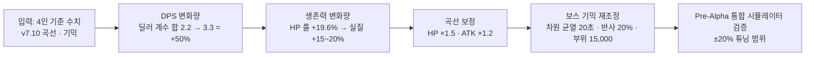

# 밸런스 재계산: 4인 → 5인 파티 전환

**문서 버전:** v1.0 (v7.11 반영 대기)
**적용 파티 스펙 (8.10 개정):** 출격 **5명**, **완전 자유 배치**, **예비 없음**
**대상 GDD 조항:** [[SoulCommander_GDD_v7.11#9.7 층별 몬스터 밸런스 곡선 — ★v7.11 5인 기준 재튜닝 (B-8)|9.7 몬스터 곡선]] · [[SoulCommander_GDD_v7.11#19.2 보스 기믹 유형 — ★v7.11 5인 기준 수정 (B-9)|19.2 보스 기믹]] · 19.4(보스 패턴 시트) · 9.2(게이트키퍼 규칙)
**기준 본문:** [[SoulCommander_GDD_v7.11]] (최신 확정본)
**연동 문서:** [[종족몬스터사전_Bestiary]] (§7 시너지 캡 · 종족/몬스터) · [[소환카탈로그_설계영웅]] (파티 구성)

> [!note] 이 문서의 역할
> GDD v7.11의 **4인 → 5인 파티 전환**에 따른 몬스터 곡선·보스 기믹 수치 재계산서입니다.
> 전환 원리: 파티 DPS +50% → 몬스터 HP **×1.5** · 파티 생존력 +15~20% → 몬스터 ATK **×1.2** (보수적 하한).
> 수치 기준은 항상 [[SoulCommander_GDD_v7.11]] 9.7 · 19.2 · 19.4를 따릅니다.



---

## 1. 요약 (결론 수치)

| 항목 | 4인 기준 (v7.10) | 5인 기준 (수정) |
|---|---|---|
| 몬스터 HP 곡선 | `100 × 1.15^(N-1)` | **`150 × 1.15^(N-1)` (×1.50)** |
| 몬스터 ATK 곡선 | `10 × 1.12^(N-1)` | **`12 × 1.12^(N-1)` (×1.20)** |
| 몬스터 DEF 곡선 | `5 × 1.10^(N-1)` | 변경 없음 |
| 게이트키퍼 보스 | HP ×8~12 / ATK ×3~4 / DEF ×2 | 배율 유지 (베이스 곡선 ×1.5가 자동 반영) |
| 차원 균열 (19.2) | 25초마다 1명 5초 제거 | **20초마다 1명 5초 제거** (손실율 동일) |
| 악의의 거울 | 받은 피해 30% 반사 (10초) | **반사율 20%** |
| 부위 파괴 | 누적 10,000 | **누적 15,000 (×1.5)** |
| 환경 붕괴 | 필드 1/3 붕괴 | 유지 (자유 배치로 회피 가능성 상승) |
| 정신 지배 | 공격력 최고 영웅 4초 | 유지 |

---

## 2. DPS 변화량 계산 (4인 → 5인)

**표준 구성 기준:**

| 구성 | 멤버 (직업 계수, 6.1) | 딜러 수 | 딜러 공격 계수 합 |
|---|---|---|---|
| 4인 | 전사(1.0) + 수호자(0.7) + 마법사(1.2) + 지원가(0.6) | 2 | 1.0 + 1.2 = **2.2** |
| 5인 | 전사(1.0) + 수호자(0.7) + 궁수(1.1) + 마법사(1.2) + 지원가(0.6) | 3 | 1.0 + 1.1 + 1.2 = **3.3** |

**파티 DPS 증가율 = 3.3 / 2.2 = 1.50 → +50%**

- 8.6 공식(개별 DPS)이 유닛당 동일하다고 가정 시, 파티 총 DPS는 딜러 수에 선형 비례.
- **추가 보정 (+5~10% 잠재):** 5인 파티는 계열 공명·종족 시너지(통합 사전 §7)의 조합 공간이 넓어져 실제 전투력은 +50~60%까지 상승 가능. → **몬스터 HP ×1.50은 보수적 하한 기준**이며, 시너지 활용 파티를 위한 튜닝 여지는 §7 참조.

---

## 3. 생존력 변화량 계산

**총 HP 풀 (직업 HP 계수 합):**

| 구성 | HP 계수 합 | 비고 |
|---|---|---|
| 4인 | 1.2 + 1.8 + 0.7 + 0.9 = **4.6** | 전사·수호자·마법사·지원가 |
| 5인 | 1.2 + 1.8 + 0.9 + 0.7 + 0.9 = **5.5** | +궁수 |

**총 HP 증가율 = 5.5 / 4.6 = 1.196 → +19.6%**

**상쇄 요인:**

| 요인 | 영향 |
|---|---|
| 힐 밀도 감소 (지원가 1명 고정) | 0.9/4.6 → 0.9/5.5 = **-16%** |
| 후열/원거리 추가로 피해 집중 분산 | **+생존 이점** |
| 예비 없음 — 사망 시 영구 전력 감소 | 리스크 증가 (치명도 설계에 반영) |
| 자유 배치 — 측면/배후 노출 최적화 | +생존 이점 (유저 스킬 의존) |

**실질 파티 생존력 증가 = 약 +15~20%** (HP +19.6%에서 힐 밀도 감소 일부 상쇄)

→ **몬스터 ATK ×1.20 적용** (보수적 중간값, 예비 없는 리스크 감안)

---

## 4. 9.7 몬스터 곡선 수정 (5인 기준)

**수정 공식:**
```
일반 몬스터 기본 스탯 (층수 N):
  HP  = 150 × 1.15^(N-1)     (기존 100 → 150, ×1.5)
  ATK = 12  × 1.12^(N-1)     (기존 10 → 12, ×1.2)
  DEF = 5   × 1.10^(N-1)     (변경 없음)

게이트키퍼 보스:
  HP  = 5인 곡선 HP × 8~12   (배율 유지)
  ATK = 5인 곡선 ATK × 3~4
  DEF = 5인 곡선 DEF × 2
```

**대표 값 비교표 (4인 vs 5인):**

| 층 | 일반 HP (4인) | 일반 HP (5인) | 일반 ATK (4인) | 일반 ATK (5인) | 게이트키퍼 보스 HP (5인, ×10) |
|---|---|---|---|---|---|
| 1 | 100 | 150 | 10 | 12 | - |
| 5 | 175 | 262 | 16 | 19 | 2,624 |
| 10 | 352 | 528 | 28 | 33 | 5,280 → **4,488** |
| 15 | 708 | 1,062 | 49 | 59 | 10,620 |
| 20 | 1,423 | 2,135 | 86 | 103 | 21,350 → **18,148** |

> **FB-07 A+B 조정 (2026-09-11 · docs/audit/19):** 10/20층 보스 HP만 −15% (×10 → ×8.5 — 위 배율 코드 '×8~12' 내) · 0%-win 벽 리뷰 기반 — 10층 성장 게이트 임계 ×1.5 승률 11.2→57.9% · 20층 ×1.4 100%(570.7s<tmax600). 5/15층·일반 몬스터 곡선·ATK는 무변경.

> **정합 체크:** 5층 보스 2,624 / 4층 일반(5인 기준 228) ≈ 11.5배 — 9.3 '4층 대비' 수치와 일관. 5층 일반 대비 ×10 배율 유지.

---

## 5. 게이트키퍼 규칙 (9.2) 정합

- "직전 층 대비 일반 몬스터 +40~100% 추가 보정" — 유지 (층간 성장 15%에 가산되는 별도 보정).
- 보스 배율 ×8~12 유지 — 베이스 곡선이 ×1.5로 증가하므로 보스 절대 HP도 ×1.5 자동 반영.
- **보상 2배 / UI 경고** 규칙은 변경 없음.

---

## 6. 19.2 보스 기믹 수정안 (5인 + 예비 없음)

### 6.1 차원 균열 (핵심 수정)

**기존 (4인 기준):** HP 80% 활성화, 이후 25초마다 무작위 영웅 1명을 5초간 제거
**손실율 계산:** (1명/4명) × (5초/25초) = 파티 전투력의 **5% 손실**

**5인 기준 손실율:** (1명/5명) × (5초/25초) = **4%** → 난이도 하락

**수정안 (선택지):**

| 안 | 내용 | 결과 손실율 | 평가 |
|---|---|---|---|
| **A (권장)** | 쿨 25초 → **20초** (1명 5초 유지) | (1/5)×(5/20) = **5%** | 4인과 동일 유지, 단순 명료 |
| B | 제거 시간 5초 → 6.5초 (쿨 유지) | (1/5)×(6.5/25) = 5.2% | 프레임 단위 미세 조정 |
| C | 제거 2명 5초 (후반층 전용) | (2/5)×(5/25) = 8% | 41층~ 고난도 기믹 |

- **채택: 안 A** (20초 쿨) + **안 C를 41층~ 콘텐츠로 예약** (단계적 난이도 확대).
- **예비 없는 상황 규칙:** 제거된 영웅은 5초 후 자동 복귀 (교체 없음). 제거 중 해당 영웅의 스트레스 +5 (정신 시스템 연동 — 고립감).
- **대응 전략 변경:** '서브 탱커 준비(예비)' → **탱커 2인 편성** 또는 제거 타이밍 맞춰 「방어 태세」(전술소 Lv.2).

### 6.2 기타 기믹 조정

| 기믹 | 4인 기준 | 5인 기준 수정 | 근거 |
|---|---|---|---|
| 악의의 거울 | 반사 30% (10초) | **반사 20%** | 파티 DPS +50% → 반사 총량 동일 유지 (30% × 2/3) |
| 정신 지배 | 공격력 최고 1명 4초 | 유지 | 단일 대상 — 파티 규모 무관 |
| 부위 파괴 | 누적 10,000 | **누적 15,000** | 파티 DPS +50% → 파괴 시간 동일 유지 |
| 환경 붕괴 | 필드 1/3 즉사 | 유지 | 자유 배치로 회피 가능성 상승 — 난이도 균형 |
| 15층 즉사기 | 전방 180도 | 유지 | 자유 배치로 회피 판정 명확 (배치 스킬) |

---

## 7. 19.4 보스 패턴 시트 영향

| 보스 | 영향 | 조정 |
|---|---|---|
| 5층 숲의 수호자 | 뿌리 속박 '최후방 아군' (진형 기준 → 배치 기준) | 문구 수정 완료 (v7.10 반영) |
| 10층 광신도 대제사장 | 출혈 5스택 — 5인 분산으로 스택 쌓기 어려움 | **출혈 적중률 상향 (패턴 적중 시 2스택)** — 7.2/7.3 참조 |
| 15층 철퇴 거인 | 즉사기 — 자유 배치로 회피 용이 | 유지 (배치 실력 요소로 설계) |
| 20층 불의 정령왕 | 화염 지대 — 자유 배치로 안전구역 순환 용이 | 화염 지대 지속 15초 → **20초** (강제 이동 압박) |

---

## 7-1. 게이트키퍼 4종 승률 시뮬레이션 검증 (bossWinrateSim v2.0 — 19.4 패턴 시트, ★D-52)

> [!note] 산출물
> `namegen-prototype/bossWinrateSim.py` (v2.0 — 19.4-1~4 패턴 스케줄러 일반화 · 밸런스 §4 수치 입력) ·
> 실행 `python3 namegen-prototype/bossWinrateSim.py [--runs N]` (기본 60회 · 약 41초) · 궁극기·치유 미포함 = 보수 하한.

### 7-1-1. 발견 3건 (성장 ×1.0~2.0 스윕 + 최적 플레이북)

| 층 | 발견 | 시뮬레이션 근거 |
|---|---|---|
| **10층 광신도** | **성장 게이트 ×1.6** — 출혈 스택 관리 + 「방어 태세」 필요 (집중공격으로 캐스팅 차단) | focus+dodge+stance: ×1.5 13% → **×1.6 50%** → ×2.0 100% |
| **15층 철퇴 거인** | **순수 스킬 게이트** — 「이동」만으로 100% · **0사망** (성장 불요 — 즉사기·충격파·연타 전부 회피) | dodge 100% (290.9s) · auto 0% (전멸) |
| **20층 정령왕** | **물 속성 2인 필수** — 고유 내성표(물 100%/화염 50%/기타 70%) 실증 | 수속성 0~1명 **0%** · 2명 100% (593.1s) · 3명 100% (535.6s) · **[FB-07 정정 2026-09-11]** 보스 HP −15%(B안) 적용 시트에서는 수속성 0~1명도 100%(523.8s) — 요건이 tmax 경계에 묶인 상태였음 — **[D-270 2026-09-12]** 20층 시뮬 tmax 600→660s 채택 (docs/audit/19 §7-2 · GDD ② 설계 규칙 자체는 런타임 기준 유지) |

- **5층 익스플로잇 재현**: 데모(HP 1,600·ATK 16) auto **100%** — 보스가 전열/후열 사이(HoldZ -1.5)에 서 후열은 dz<0으로 전방 패턴 면역 (A-2 기하 — **★D-60 확정 + Unity 구현 완료 — §7-1-2 미결정 ① 참조**) · **§7-1-3 = 15층 회피 숙련도 곡선**
- **5층 문서 수치**(2,624/57): auto 0% · focus/focus+dodge **100%** — 카운터(집중공격·이동) 필수 확인

### 7-1-2. 모델 가정 → **확정값** (★D-61 승격, 2026-08-12 — 시뮬레이터·Unity·결정로그·문서 4중 대조 일치)

| 확정값 | 값 | 근거 | Unity 반영 |
|---|---|---|---|
| 출혈 DoT | 스택당 초당 **0.3%** 최대 HP · 5스택 버스트 **10%** · **감쇠 1스택/5초** ('출혈 스택 관리') | 19.4-2 '5스택 시 큰 피해' — D-61 확정 | ✅ ApplyBleed/TickBleed (D-53) |
| 몬스터 MAG | **= ATK** (곡선에 MAG 없음) | '1.2×MAG' 등은 보스 ATK 배율로 사용 | ✅ WaveManager Mag=Atk |
| 15층 즉사기·충격파 | **진형 전체 판정** (보스가 진형 앞 — A-2 기하 원칙) | 전방 180도 · 직선 6m | ✅ HoldZ -0.5 (D-53) |
| 신도 | 10층 일반 몬스터 (HP **528** · ATK **33**) · 피격 시 출혈 1스택 | 19.4-2 — D-61 확정 | ✅ **drift 수정: 0.8× → 5.28/3.3 배율** (D-61) |
| 불사조 | HP **400** · ATK **40** (20층 일반 2135/103 대비 ×0.19/×0.39) · **물 속성 집중공격 ×1.5** | 19.4-4 — D-61 확정 | ✅ SpawnBossAdd ×4 (D-53) |
| 잡기 포박 구조물 | HP **90** · 「집중공격」 파괴 → 조기 해제 | 19.4-3 — D-61 확정 | ✅ **drift 수정: 구조물 구현** (RootBind 재사용 — D-61) |

> **★D-61 Unity drift 3건 수정**: ① 신도 배율 0.8× → **5.28/3.3** (기존 80/8 = 528/33과 불일치) ② 출혈 심화 +1 → **+2** (19.4-2 '아군 전체 2스택' — 문서 위반 수정) ③ 잡기 포박 **구조물 HP 90 구현** (RootBind 재사용 — 「집중공격」 파괴 시 조기 해제 · 보스 사망 시 정리). **표기 오류 3건 정정**: 시뮬레이터 docstring '출혈 1%' → 0.3% · 불사조 'HP×0.3/×0.5' → 400/40 (실측 ×0.19/×0.39) · v7.11 20층 요약 → 내성표 정합 (물 100/화염 50/기타 70).

> ⚠️ ~~미결정 (결정 전 확정 금지 — 결정로그 후보로 유지)~~ → **잔여 ② 해소 — D-89 확정**
> ① ~~5층 **A-2 기하**(HoldZ -5.5 · 후열 피격) 반영~~ — **★D-60 확정 (2026-08-12, 사용자 지시) + Unity 구현 완료**: BossAI 5층 보스 HoldZ -1.5→**-5.5**(진형 뒤 정지) · 포효/덩굴 **판정·경고 방향 반전**(dz<0 파티 쪽 5m) · EnterP2 **넉백 방향 반전**(+z) → **광역 포효가 후열까지 판정** (후열 안전지대 익스플로잇 폐쇄 — D-52 실측: A-2 auto 0% 전멸 · focus+dodge 100% 카운터)
> ② ~~데모 보스 **ATK ×1.5(24) vs ×2(32)**~~ — **★D-52-② ✅ 확정 (2026-08-12 — ① 현재 유지 ATK 19 채택, 변경 0)**: 결정 근거 — D-83 결정 가능 판정(A-2에서 후보 전 배율 16~38 승률·사망 전부 동일 — auto 0% · focus 0% · fd 100% · 사망 2.0 · 클리어는 HP에만 의존) + D-85 ⑤-4 정식 스윕(임계 35 = 구 익스플로잇 축 전용 → D-60에서 소멸) · ⑤-3/D-69 격자(데모 24/32는 임계 아래 — 어느 쪽을 골라도 5층 승률 동일) → **승률 축 무의미, 판단 축 = 문서 정합(밸런스 §4 '일반 ATK ×1.5 상한') + 최소 변경** → **① ATK 19 유지 확정** (D-89 동기화 — 결정로그·bossWinrateSim ⑤-6 반영)
> ③ ~~'840 = 플레이 시간 제한' 상충 검토~~ — **★D-90 조사 완료 (2026-08-12 — 분석 · D-89 ② 결정 유지 보강)**: v7.11 전수 조사 — 본문에 **'840'·'플레이 시간 제한'·'과몰입'·'서버 부하' 문구 0건** ('840 = 시간 제한'은 후속 문서의 파생 오인) · **840의 유일한 출처 = 경제밸런스 설계서 §3 산술 파생값**(자연 240 + 충전 360 + 파동판 교환 240 — D-23 기준, 독립 정책 상수 아님) · 실제 설계 근거 = v7.11 10.1 **'완충 24시간 = 하루 1회 로그인' 리듬** + 파동판 tip **'로그인 주기가 불규칙한 유저의 손실을 방지'** · **보호 기능 5종은 소비 상한과 전부 독립**: 자연 회복 1 AP/6분(무한 파밍 불가) · 충전 1일 6회+점진 비용(과금 게이트) · 일일 골드 100,000 캡(인플레이션 방지) · 파동판 960 캡 · 서버 3,000 CCU 오토스케일링(20.9 — CCU 기준, 소비 상한 무관) · **상충 정량화**: 840 = 탑 21회/일(게키 14회)≈전투 11분 vs 1,200 = 30회/일≈16분 — 이론 상한 **+9회/+5분(+43% 전투 요청)** · 단 **파동판 600 보유(4일+ 미접속 보정) 유저만** 도달 가능 — 평균 부하 영향 미미 · 일일 리듬(240: 탑 5회+요일 던전 1회) 불변 → **'시간 제한' 의도는 문서 오인 — ②가 제거하는 것은 이론 상한뿐, 보호 기능 전부 유지 → 결정 번복 근거 아님** (D-89 ② 소비 상한 1,200 유지 · '손실 0'은 v7.11 파동판 tip 설계 목적 완성)
> ④ ~~'평균 부하 영향 미미' 정성 → 정량화~~ — **★D-102 실측 (2026-08-12 — econSimFull §4 계측, 분석 · 결정 없음)**: 소비 상한 1,200 도달 유저 비율 + 가중 평균 부하 증가율을 세그먼트 8종(②+960 · 몬테카를로 200회)으로 실측 — **① 세그먼트별 로그인일 소비**: F2P/월정액 240 AP · 과금 420(충전) · 불규칙(2.5일) 598 · (3일) 716 · (3.5일) 834 — **840 미만 (상한 무관)** · **불규칙(4일) 952 AP (+14.2%) · (5일) 1,187 AP — 1,200 도달율 99% (+42.7%)** — 4일+ 미접속(P≥4)만 상한에 도달 ② **★가정 유저 분포(텔레메트리 부재 — 결정 후보)**: F2P 40% · 월정액 35% · 과금 5% · 불규칙 2.5/3/3.5일 6/6/4% · **4/5일 2/2% — P≥4 = 4%** ③ **가중 평균: 버스트 +1.45% (로그인일) · 연간 부하(클리어 수) +1.10%** — 840 캡의 생성 손실(P=4 10,950 · P=5 26,280 AP/년)이 클리어로 전환된 만큼만 증가 · **연간 소비 87,600 AP 보존 (회계차 0 — 상한은 총량이 아니라 '언제 소비하나'만 변경)** ④ **D-90 이론 상한(+43%) 재현·한정**: +43%는 상한 도달 유저의 로그인일 버스트에만 해당 → **유저 전체 평균 +1% 내외 = 서버 부하 영향 미미 실증 완료** (보호 기능 5종 무관 유지) → D-89 ② 결정 근거 보강 (결정 번복 없음)

### 7-1-3. 15층 즉사기 회피 숙련도 곡선 (bossWinrateSim ⑥ — ★D-59, 숙련도 축)

> [!note] 검증 대상
> 15층 철퇴 거인 즉사기·충격파(19.4-3)는 **'실패 1회 = 전멸'의 클리프 게이트** — 회피 성공률이 승률을 가른다.
> 시뮬레이터 파라미터 `dodge_success`(회피 성공률 = 1 − 회피 타이밍 실패율) — **예고 배너 → 「이동」 회피 성공 여부**.

| 회피 성공률 | 문서 승률 (ATK 177 · HP 10,620) | 데모 승률 (ATK 59 · HP 10,620) | 판정 |
|---|---|---|---|
| ≤ 90% | **≤ 0.8% (전멸급)** | **0%** | 사실상 패배 — 즉사기 쿨 20초 · 전투당 2~4회 등장 |
| 95% | 14.2% | 21.7% (dodge) / 28.3% (focus+dodge+stance) | 급경사 시작 구간 |
| **98%** | 50% | **61.7% / 66.7%** | **★실전 기준값 (D-59)** — 승률 급상승 구간 시작 |
| 100% | 100% | 100% | 숙련 완성 = 확정 클리어 |

- **해석**: 회피 성공률 **98% 미만은 사실상 패배**(95%에서도 승률 ≤28%) — '실패 1회 = 전멸' 클리프. 98%+에서 급상승, **100%에서만 확정 100%**. 데모(ATK 59)가 문서(ATK 177)보다 **완만한 곡선** — 같은 숙련도에서 데모가 더 관대 (D-59).
- **플레이테스트 연동 (D-59)**: D-56 '전투 이해도' 관찰 축(지시 없이 카운터 사용)의 **실전 회피 성공률 기준값 98%+** 로 사용 — `_템플릿/플레이테스트_체크리스트.md` **§3 관찰 항목 '예고→이동 성공 여부'** + **§4-1 게이트 정량 기준(≥ 98%)** 과 연동 (테스터 실전 데이터가 이 곡선의 어떤 지점에 있는지가 15층 난이도 판정 근거).
- **★자동 계측 (D-79)**: Unity가 즉사기 시전마다 **영웅별 회피 성공/실패를 자동 기록** (`BattleMetrics` — 로그 `[SoulCommander 계측]` + CSV `instant_death_metrics.csv` · 컬럼 `type,floor,battle,cast,eligible,survived,hit,dodge_rate,result`) — 플레이테스트 후 CSV 회수 → 전투별 `dodge_rate` 실측 → **이 곡선의 어떤 지점인지 + 승률 대조** (수동 관찰은 미스 판정/혼란 지점 주석만).
- **★플레이 경험 해석 축 (D-80)**: 실전 dodge_rate 대조 시 **고정 숙련도 곡선(본 표) 외에 학습 모델 곡선도 사용** — 첫 즉사기 시전만 70%로 저하 후 원래 숙련도(95%) 복귀 가정 → 승률 16.7~22.5%(데모) — **즉사기 전투의 33.3%가 첫 시전(학습 발휘 전)에서 전멸** (첫 경험 페널티가 승률 상한 결정 · D-80 시뮬레이션 실측 — 데모 정의 수치, 실전 대조 대상).
- **데모 정의**: `dodge_success`는 시뮬레이션 가정 — Unity는 확률 파라미터 없이 실시간 플레이하므로 **실전 데이터로 검증** (★D-79 계측 CSV가 그 데이터 — 회피 성공 = 판정 시점 전방 180도 밖 · eligible = 생존 영웅 · 부활해도 피격 = 실패 집계).

### 7-1-4. 15층 잡기의 실질 비용 — 포박 CC 정량화 (bossWinrateSim ⑩-4 — ★D-95)

> [!note] 발견 출처
> D-88 ⑩-3에서 **드레인이 승률에 무의미**(절약 54 HP = 보스 10,620의 0.5% 미만)하고 **실질 비용은 포박 CC**임을 관찰 — 이를 `grab_cc_total`(행동 불가 초) · `grab_cc_dps_loss`(CC × 잡힌 영웅 DPS = 잃은 보스 피해) 계측으로 정량화.
> 잡힌 영웅 = **토르빈 (전열 첫 수호자)** — DPS 10/1.20 ≈ 8.33 · 3초 CC ≈ 25 HP (드레인 16.2 HP와 같은 단위 비교).

| 지표 (demo15 · 숙련 98% · runs 90) | focus+dodge+stance (조기 해제) | dodge+stance (자연 해제 3초) | 비교 |
|---|---|---|---|
| 잡기 파괴율 | **98.0%** | 0% | — |
| **드레인** (보스 회복) | 9.5 HP/시전 · 77.4 HP/전투 | 16.2 HP/시전 · 131.6 HP/전투 | 6.7 HP/시전 절약 |
| **★CC 손실** (행동 불가 × 잡힌 영웅 DPS) | 1.80초/시전 · **15.2 HP/시전** · 124.7 HP/전투 | 3.08초/시전 · **26.1 HP/시전** · 212.0 HP/전투 | **10.9 HP/시전 절약** |
| 승률 | 66.7% | 69.2% | 무차이 (즉사기 게이트 지배) |

- **★정량화 — 잡기의 진짜 비용 = 포박 CC**: 자연 해제 시 CC 손실 **26.1 HP/시전** = 드레인(16.2)의 **1.6배** · 전투당 **212 HP ≈ 보스 HP(10,620)의 2.0%** (드레인 131.6 HP = 1.24% 초과) — 드레인은 '초당 5% HP 흡수'라는 수치적 위협처럼 보이지만 **실질은 잡힌 영웅의 행동 불가**다.
- **★focus의 가치 분해**: 집중공격은 드레인을 6.7 HP/시전 절약할 뿐 아니라 **CC를 3.08→1.80초로 단축해 10.9 HP/시전 추가 절약** — focus의 총 가치 17.6 HP/시전 중 **CC 단축(62%)이 드레인 절약(38%)보다 큼** → '잡기 = 포박 구조물 HP 90 파괴'(D-61)의 진짜 의미는 드레인 차단이 아니라 **CC 조기 종료**.
- **승률 무차이의 이유**: 15층 승률은 즉사기 회피(§7-1-3 스킬 게이트)가 지배 — 잡기 CC(전투당 ~2%)는 부차적 축. 즉 **잡기는 난이도 축이 아니라 전술 교란 축** (수호자 행동 불가 → 어그로/탱킹 공백 · 드레인으로 최대 HP 감소 위협은 부가).
- **플레이테스트 연동**: 관찰 항목 — ① 잡기 대상이 수호자/지원가인가 ② 예고 배너 → 「집중공격」 해제까지의 시간 ③ CC 중 사망 발생 여부 (전투 로그/스크린) — 실전에서 CC 비용이 모델(1.6×드레인)과 같은지 대조.
- **데모 정의**: CC 계측은 모델 내 행동 불가(bound_until — `_tick_heroes` continue) 기준 · 잡힌 영웅 DPS는 Lv1 템플릿 계수 — 성장/마스터리 반영 시 CC 손실이 커짐 (성장 후 재검증 대상). **결정 없음 — 문서화 (D-95).**

> [!note] ★D-109 보강 — 성장 × 마스터리 2축 스윕 (bossWinrateSim ⑩-6 · 2026-08-12)
> **D-95의 '성장 반영 시 CC 손실이 커짐' 가설을 실측으로 정정** — 성장·마스터리 모두 **CC 비용을 급감**시킨다 (마스터리 = D-73 데모 정의 focus 계수 ×1.05/Lv — 구조물 파괴 가속 · demo15 · 숙련 98% · focus+dodge+stance · runs 120).
>
> | growth | mastery | 파괴율 | 드레인/시전 | CC 초/시전 | CC 손실/시전 | CC/전투 | CC:드레인 비 |
> |---|---|---|---|---|---|---|---|
> | 1.0 | Lv0 | 98.0% | 9.5 HP | 1.80s | 15.2 HP | 124.7 HP | 1.6× |
> | 1.0 | Lv5 (×1.20) | 99.4% | 8.2 HP | 1.57s | 13.2 HP | 106.9 HP | 1.6× |
> | 1.3 | Lv0 | 99.9% | 10.4 HP | 1.52s | 16.7 HP | 108.1 HP | 1.6× |
> | 1.3 | Lv2+ | 99.7% | 7.5 HP | **1.09s** | 11.9 HP | 76.9 HP | 1.6× |
> | 1.6 | Lv0 | 99.8% | 8.5 HP | 1.01s | 13.5 HP | 74.9 HP | 1.6× |
> | 1.6 | Lv5 | 98.4% | 7.3 HP | 0.87s | 11.6 HP | 62.0 HP | 1.6× |
> | 2.0 | Lv0 | 100.0% | 7.7 HP | **0.74s** | 12.3 HP | **45.9 HP** | 1.6× |
> | 2.0 | Lv5 | 100.0% | 7.7 HP | 0.74s | 12.3 HP | 45.9 HP | 1.6× |
>
> **★핵심 발견 3건**: ① **CC 비용(초·HP)은 성장이 지배·마스터리가 보조** — growth ×2.0에서 CC 1.80→0.74초 (**-59%** · CC/전투 124.7→45.9 HP = 보스 HP의 1.17%→0.43%) · 마스터리 Lv5는 추가 -13~23% (성장 낮을수록 상대 효과 큼) ② **★CC:드레인 비 = 1.6× 전 구간 불변** — 두 비용 모두 파티 DPS에 비례해 동반 감소 (성장/마스터리가 '잡기 = CC 비용'의 상대 구조를 바꾸지 않음 — D-95 '1.6×드레인' 정량이 성장 후에도 유지) ③ **마스터리 임계(양자화)**: focus 타격 간격(iv)의 배수로 CC가 결정돼 Lv1~2 저성장 구간은 무영향(1.80s 유지) · 특정 조합(성장 1.3·Lv2+)에서 1.52→1.09s 급감 — **마스터리 가치는 '성장 구간별 임계 돌파'로 나타남**. **결정 없음 — 문서화 (D-109) · 성장 반영 시 잡기 CC는 난이도 축이 아니라 전술 교란 축으로만 남음 (D-95 결론 강화).**

### 7-1-5. 돌진 승률 임계 스윕 — ATK 배율 × 소환물 수 × 쿨타임 (bossWinrateSim ⑩-5 — ★D-96)

> [!note] 발견 출처
> D-88 ⑩-1이 돌진을 '웨이브 난이도의 주 축 아님'(10층 최적 -1.1%p)으로 결론 — **어느 조건에서 돌진이 승률을 가르는지** 3축 스윕 + 카운터 약화 축(숙련도·예고 OFF) 검증.
> 기준: 10층 doc ×1.6 · focus+dodge+stance · 숙련 95%(D-59) · runs 60~120.

| 축 | 스윕 범위 | 승률 (돌진 ON) | 돌진 OFF와 차이 | 판정 |
|---|---|---|---|---|
| **① 강타 ATK 배율** | 1.8 → 4.0 | 46.7% → 45.0% | **0.0%p 전 구간** | 무영향 |
| **② 소환물 수** | 1 / 2 / 3 / 4마리 | 100% / 46.7% / **0%** / 0% | **0.0%p 전 구간** | ★**2→3 붕괴 — 돌진 무관** |
| **③ 돌진 쿨타임** | 5 / 7 / 9 / 12 / 15초 | 46.7% 전부 (사망 3.3 고정) | 0.0%p | 무영향 |
| **④ 숙련도 × 배율** | 0.95→0.80 × 1.8/4.0 | 46.7% → 25.0% (배율 4.0) | **0.0%p 전 구간** | 무영향 (숙련도는 일반 공격 축) |
| **④ 예고 HUD OFF** | 회피 ×0.70 (telegraph=False) | 1.7% (배율 1.8/4.0 동일) | 0.0%p | 무영향 |

- **★핵심 발견 — 돌진은 어느 조건에서도 승률을 가르지 않는다**: 스윕 전 조건(ATK 배율 1.8~4.0 · 소환물 수 1~4 · 쿨타임 5~15초 · 숙련도 0.80~0.95 · 예고 HUD 유무)에서 **charge ON/OFF 차이 = 0.0%p 일관** — 돌진의 유일한 모델 비용(회피당 0.5초 DPS 손실 + 회피 실패 시 강타 피격)이 승률 축에 도달하지 못함. D-88 ⑩-1 '돌진 = 주 축 아님'을 **전 조건에서 확증**.
- **★웨이브 난이도의 실질 임계 = 소환물 수**: 2마리(현행) 46.7% → **3마리 0% (전멸급 · 사망 5.0)** — 이 붕괴는 **charge OFF에서도 동일**(0.0%p 차이)하므로 돌진이 아니라 **소환물 자체 DPS(일반 공격 + 신도 출혈 1스택)가 임계**. 웨이브 난이도 조정 레버는 돌진이 아니라 **소환물 수/스탯** (D-96 실측).
- **의미**: ① 돌진(D-78)은 연출/전술 교란(예고 → 「이동」 리듬) 축으로 유지 — 난이도 축 아님 ② 웨이브 난이도를 올리려면 소환물 수 3+ (단, 0% 전멸급은 과한 점프 — 2마리 유지 + 소환물 스탯 튜닝이 더 세밀한 레버) ③ 10층 대재앙/성장 게이트(§7-1-1)가 소환물 축보다 우위 — 소환물 수는 성장 게이트 개방 후의 추가 레버.
- **플레이테스트 연동**: 관찰 항목 — 소환물 2마리 상태에서 돌진 예고 → 「이동」 회피 성공/실패 (돌진이 실전에서도 무위협인지 — 모델 0.0%p 가설 대조).
- **데모 정의**: 스윕은 10층 doc ×1.6 고정 — 다른 층/성장 구간은 별도 스윕 필요. **결정 없음 — 문서화 (D-96).**

> [!note] ★D-111 보강 — 소환물 수 2 고정 · 스탯(HP×ATK) 스윕 (bossWinrateSim ⑩-7 · 2026-08-12)
> **D-96의 '2마리 유지 + 소환물 스탯 튜닝이 더 세밀한 레버' 결론을 실측으로 세밀화** — 10층 doc ×1.6 · focus+dodge+stance · 숙련 95% · 소환물 2마리 고정 · HP×ATK 2D 그리드 (runs 100).
>
> | HP× | ATK×0.5 | ATK×0.75 | **ATK×1.0** | ATK×1.5 | ATK×2.0 | ATK×3.0 |
> |---|---|---|---|---|---|---|
> | 0.5 | 100% | 100% | 100% | 100% | 100% | 100% |
> | 0.75 | 100% | 100% | 100% | 100% | 100% | **88%** |
> | **1.0** | 71% | 58% | **44% (⭐기준)** | 16% | 2% | 0% |
> | 1.5 | 0% | 0% | 0% | 0% | 0% | 0% |
> | 2.0+ | 0% (전멸) | 0% | 0% | 0% | 0% | 0% |
>
> **★핵심 발견 3건**: ① **ATK = 연속(세밀) 레버 · HP = 절벽 레버** — HP×1.0·ATK 0.5→2.0에서 승률이 **71→58→44→16→2%로 연속 감소**(사망 2.2→4.9 — 조절 가능)하지만 **HP×1.5부터는 ATK 무관 전멸 0%** (소환물 처치 시간(HP)이 집중공격 우선순위를 압도해 보스 딜 손실 누적 — 3마리 붕괴와 같은 축) ② **난이도 조정 권장 구간 = HP×1.0(시트 유지) + ATK 0.5~2.0**: 승률 71%→2% 연속 튜닝 — 웨이브 난이도를 '수 3마리(0% 전멸급)'처럼 급락 없이 조절 가능 ③ **하향도 가능**: ATK×0.5(71%)·HP×0.75(100% — 신도 제압이 여유) — 성장 게이트 개방 전 진입 장벽 조절에도 사용. **결정 없음 — 문서화 (D-111) · Unity 구현 레버: 10층 WaveManager 소환물 스탯 배율 (HP/ATK) — 플레이테스트 후 확정 예정.**

> [!note] ★D-112 설계안 — 돌진을 '연출/전술 교란 축'으로 살리기: 예고→이동 리듬 × 위협도 상호작용 (D-96 근거 · 2026-08-12)
> **문제**: D-96 실측 '돌진 = 승률 0.0%p 무영향' — 현재 돌진은 예고→이동이 성립하면 **손실 없는 연출** (회피당 0.5초 DPS 손실이 승률 축 미달). **목표**: 난이도(승률)는 바꾸지 않고 **전술적 의미 + 몰입 리듬**을 만든다 — v7.11 17.2 위협도 공식과 결합.
>
> **A. 돌진 = 위협도 재배치 수단 (추천 — 최소 변경 · 시스템 정합)**: 돌진 도착 시 소환물이 **위협도 최고 영웅을 강제 전환** — 돌진은 '데미지 축'이 아니라 **'탱커 어그로 흔들기' 축**:
>   - 발동: 기존 예고(배너+도착 마커) → 소환물이 위협도 최고 영웅에게 돌진 (17.2 대상 선택 재사용 — 위협도 기반 선택은 이미 MonsterAI에 구현)
>   - 효과: 도착 시 **대상 위협도 리셋(×0.3)** + 도착 지점 재조정 → 다음 17.2 재평가(2.5초)에서 저체력/지원가로 어그로 이동 가능
>   - 플레이어 반응: 예고를 보고 **「이동」으로 회피** (돌진 무효 — 어그로 유지) vs **회피 포기** (대상이 밀려남 — 힐러 위협 상승 리스크) — **'회피 = 위협도 방어'의 새로운 판단 축**
>   - 난이도 영향: 위협도 리셋은 17.2 재평가로 즉시 복구 가능(탱커 피해량·힐) — **승률 축 무영향 유지 (D-96 정합) · 위협도 관리 스킬(도발 12초 · 측면 기동 25전술) 가치 상승**
>
> **B. 돌진 = 후열 진입 위협 (연출 강화)**: 도착 지점을 대상 **후열 좌표로 연장** — '소환물이 후열까지 파고든다'의 위협 연출 (데미지 0 — 순수 연출·회피 리듬 강조). 위치 보정(측면 +15% · 배후 +30% — 8.9)의 후열 가치를 플레이어가 체감.
>
> **C. (보류) 위협도 상호작용 없이 순수 연출 유지** — 현행 유지 (D-96 결론 그대로 — 연출만).
>
> **권장: A + B 병행** — 돌진 = '어그로를 흔들고 후열을 위협하는 전술 교란' (예고→이동 리듬이 곧 위협도 방어 리듬). **검증 방법**: threatSim에 charge-리셋 시나리오 추가(어그로 전환 분포 · 힐러 표적률) · bossWinrateSim에 위협도 리셋을 난이도 중립 파라미터로 모델(승률 0.0%p 유지 확인) · 플레이테스트 관찰 항목(돌진 예고 → 「이동」 사용 여부 — D-96)과 교차. **⬜ 결정 후보 (설계안 — 플레이테스트/시뮬레이션 검증 후 확정 · 임의 구현 금지)**

---

### 7-1-6. 덫(floor_spikes) 실질 위험 지형 설계 검토 (★D-134 · 2026-08-13)

> [!note] 검토 출처
> 사용자 질문 — '덫(floor_spikes)을 순수 장식이 아니라 전투 중 몬스터가 밟으면 피해를 주는 실질 위험 지형으로 구현할지 설계 검토 (게임플레이 영향·밸런스)'.
> 현재 덫은 **순수 장식** (D-126 — 0x72 `floor_spikes` 4프레임 · IdleAnimator 재사용 · 게임플레이 영향 0) · 전투 구역 **앞 가장자리 x=±2.2 · z=5.4** (몬스터 스폰 경로상 — SpawnZ 9.5 → 영웅 진형 직선 호밍).

#### ① 트랩 등가 시뮬레이션 실측 — 승률 민감도 (bossWinrateSim ⑩-8 신규 · 2026-08-13)

> 트랩의 "무료 딜" = 해당 몬스터 MaxHP 일부 제거와 등가 → 10층 소환물 HP 배율 스윕으로 승률 민감도 실측
> (10층 doc ×1.6 · focus+dodge+stance · 숙련 95% · 소환물 2마리 · runs 120 — D-111 ⑩-7과 동일 조건 · ATK×1.0 고정).

| adds HP× | 승률 | Δ vs 기준 | 평균 사망 | 평균 클리어 |
|---|---|---|---|---|
| **1.00** | **43.3%** | ⭐기준 (D-111 44% 정합) | 3.4 | 127.9s |
| **0.97** | **63.3%** | **+20.0%p** | 2.0 | 98.6s |
| 0.95 | 66.7% | +23.4%p | 1.9 | 100.3s |
| 0.90 | 93.3% | +50.0%p | 0.8 | 101.9s |
| 0.85 | 98.3% | +55.0%p | 0.5 | 97.7s |
| 0.80~0.50 | 100% | +56.7%p | 0.4→0.0 | 95.6→83.1s |

- **★핵심 발견 — 트랩은 돌진(D-96 0.0%p)과 달리 웨이브 난이도의 실질 하향 레버**: **소환물 MaxHP 3%만 줄어도 승률 +20.0%p** (43.3→63.3%) · 10% 감소 = 93.3% — 10층 승률이 소환물 HP(처치 시간)에 극도로 민감(D-111 'HP = 절벽 레버'의 하향 방향 확증). 트랩 무료 딜은 "플레이어 판단 없이 승률을 올리는 공짜 하향"으로 작동.

#### ② 커버리지 실측 — 우연한 통과율은 낮음 · 유인 축 존재

- **스폰 x = 등간격** `(i−(count−1)/2)×1.4` (WaveManager L278) — 5마리 = ±2.8/±1.4/0 · 3마리 = ±1.4/0 — **트랩 x=±2.2와 그리드 미정렬 → 우연히 밟는 몬스터는 웨이브당 0~2마리** (x 근접 시)
- 몬스터는 **최근접 영웅 직선 호밍** (MonsterAI L137-166 — Collider 없음 · transform 이동) — **영웅을 「이동」으로 x≈±2.2에 세우면 해당 열 몬스터가 트랩 통과 → 트랩 커버리지 = 플레이어 조절 가능한 레버** (유인 축 — 이미 구현된 호밍 재사용 · 코드 변경 작음)
- 단, 유인 = 영웅을 위험 지대(z≈5.4 — 몬스터 통과 경로)에 노출하는 **트레이드오프** (탱커/후열 배치 판단)

#### ③ 게임플레이 축 분석

| 축 | 내용 | 판정 |
|---|---|---|
| **난이도** | 무료 딜 = 몬스터 MaxHP % — 10층 +20%p/3% 민감 (① 실측) | **실질 하향 레버** (돌진과 대조) |
| **전술** | 「이동」 유인 → 트랩 커버리지 조절 (②) — '유인 = 무료 딜의 대가로 진형 노출' 판단 축 | **유효한 재미 후보** (D-112 돌진 '판단 축' 철학과 정합) |
| **하프링 '행운의 발걸음'** | 종족몬스터사전 패시브 '함정 회피 +10%' — **skills.json에 없음 · 미구현 (휴면)** — 트랩이 몬스터 전용이면 여전히 무의미 · **양방향(플레이어도 밟음)일 때만 활성화** — 단, 현재 배치(z=5.4 스폰 지대)상 플레이어가 밟을 일이 없어 실질 몬스터 전용 | 트랩 승격 시 '함정 회피' 패시브 활성화 기회로만 의미 |
| **코볼드 함정 연계** | Bestiary 'GDD AI — 함정 오브젝트 생성' (몬스터 측 함정 · 경고판 1초) — **별개 축** | 이번 범위 밖 (후속 검토 후보) |

#### ④ 밸런스 리스크 (트랩 승격 시)

1. **공짜 하향**: 무료 딜이 플레이어 판단 없이 승률을 올림 — 10층 '성장 게이트'(§7-1-1)를 유지하려면 소환물 HP/ATK 보정(D-111 레버)으로 상쇄 필요
2. **커버리지 불공정성**: 밟는 몬스터 수가 웨이브마다 상이(스폰 x · 유인 여부) — 승률 분산 증가
3. **판정 방식 미지정**: 몬스터에 Collider 없음 — 반경 거리(transform) 판정 · 쿨다운(1회/밟기) · 피해 규모 결정 필요
4. **상호작용**: 트랩 피해로 소환물 처치 시간 단축 → 「집중공격」 해제 가속 → 10층 대재앙 차단(§7-1-1) 여유 증가 — 상성 축과 중첩

#### ⑤ 2지선다 + 권장

- **① 트랩 승격 — 몬스터 피해 지형 (플레이어 유리)**: 데모 정의 후보 — 반경 0.7m 거리 판정 · 몬스터 MaxHP **5% 이하 1회**(밟기 + 쿨다운 2s) · 몬스터 전용 · 밟을 때 스파이크 상승 프레임 동기화 이펙트. 추정 영향: 커버리지 1/3 × 5% ≈ **+10~15%p (10층)** — 하향 레버로 유효하되 과도하지 않게. **검증**: bossWinrateSim trap 모델(피해 % × 커버리지 → effective HP 등가) 스윕 후 % 확정 + 플레이테스트 관찰 항목(밟은 수 · 유인 여부) — **%는 임의 확정 금지 (재구축 원칙 3)**
- **② 현행 유지 — 순수 장식 (D-126)**: 변경 0 · 절충안 = 몬스터 밟음 **반응 이펙트만**(피해 0 — 연출 축, 분수/나무와 동급)
- **권장: ① 승격하되 '무료 딜'이 아니라 '유인 축'으로 설계** — 피해 규모 미미(≤5%) + 커버리지를 「이동」 유인으로 조절(D-112 돌진 전술 교란 철학과 정합 — 난이도는 소환물 스탯 레버로 유지 · 덫은 전술 판단 축) · 하프링 '함정 회피'는 양방향 전환 시에만 활성화(현재 배치상 실질 무의미 — 후속)

> [!warning] ★D-134 — **⬜ 결정 후보 (설계 검토 · 임의 구현 금지)**
> 트랩 승격(①)은 **10층 승률 +20%p/3% 민감도**(① 실측)로 밸런스 영향이 크므로 **피해 %·커버리지·판정 방식은 시뮬레이션 trap 모델 + 플레이테스트 검증 후 확정** — 사용자 결정 대기. 코볼드 함정 연계(몬스터 측)는 별개 축으로 후속 검토.

---

## 7-2. 레벨 상한 Lv.100 통일(D-172) 파급 검증 — levelCapSweep ★2026-08-23 실측

> [!note] 산출물
> `namegen-prototype/levelCapSweep.py` (§6.2 XP 곡선 × 카탈로그 §2 성장 브래킷 × §9.7 몬스터 곡선 대조 해석 스윕)
> econSimFull ★D-172 반영(LVL_CAP 전 등급 100 + lv100Day) 후 재실행 완료 · bossWinrateSim 회귀 재실행 — D-111 그리드 재현 (조기 게이트 5~20층은 D-172 영향 0 확인).

### 7-2-1. 성장 배율 실측 (스킬 최종 계수 = 시트 × 등급보정 × (1+cum))

| 레벨 | cum | 배율 | ★1 | ★3 | ★5 |
|---|---|---|---|---|---|
| 30 | 0.70 | 1.70 | 1.70 | 2.21 | 3.06 |
| 60 | 2.30 | 3.30 | 3.30 | 4.29 | 5.94 |
| 100 | 4.70 | **5.70** | 5.70 | 7.41 | **10.26** |

### 7-2-2. 상한 연장의 순수 증분과 층 상쇄력

| 등급 | 구상한→신상한 | 구계수→신계수 | 증분 | HP층 상쇄(×1.15/층) | ATK층 상쇄(×1.12/층) |
|---|---|---|---|---|---|
| ★1 | 30→100 | 1.70→5.70 | ×3.35 | 8.7층 | 10.7층 |
| ★2 | 40→100 | 2.53→6.55 | ×2.59 | 6.8층 | 8.4층 |
| ★3 | 50→100 | 3.51→7.41 | ×2.11 | 5.3층 | 6.6층 |
| ★4 | 60→100 | 4.95→8.55 | ×1.73 | 3.9층 | 4.8층 |
| ★5 | 60→100 | 5.94→10.26 | ×1.73 | 3.9층 | 4.8층 |

### 7-2-3. XP 페이스 (§6.2 `L²×10+20`)

- Lv.1→60 총 XP 739,300 · Lv.1→100 총 XP 3,385,500 — **61~100 구간이 전체 진행의 78.2%**
- Lv.99→100 한 레벨 = 98,030 XP (= Lv.1~10 총량의 24.2배)

### 7-2-4. 발견 3건

| # | 발견 | 근거 |
|---|---|---|
| ① | **Lv.60→100 연장의 순수 출력 증분 ≈ ×2.11(★5 기준 ×1.73) — 몬스터 HP 곡선 기준 약 3.9~5.4층 분량** → 심층(41층+) 정합은 레벨 단일 축으로 불가 — 등급·장비·각성 등 타 축 필수 | 7-2-2 · §9.7 |
| ② | **런칭 스코프(Arc 1 = 1~20층)에서는 여유분으로 긍정적** — 조기 만렙(D-91) 완화 방향 | 7-2-2 |
| ③ | **econSimFull D-172 실측: F2P Lv.100 도달 ~111일 / 과금 ~61일** — 영혼석(하) 레벨 강화 경로가 여전히 지배(D-106 재확인) → '반년 만렙' 목표 대비 조기 만렙 **재발** | art/out/econ_report.md §2 |

> [!success] ★만렙 페이스 — ✅ **D-173 확정 (2026-08-23 — 채택 A)**
> **레벨 강화 영혼석(하) 비용 곡선화**: `5 + floor((Lv−10)/10)`개 (Lv.10 이하 5 고정 · Lv.100에 14개) + 골드 200 유지.
> **확정 후 재실측 (econSimFull)**: F2P Lv.100 도달 111일 → **182일** (D-106 권장 목표 '반년 만렙 ≈180일' 안착) · 과금 61→102일 · Lv60 도달 44→66일.
> B안(XP 수입 연동)은 심층 콘텐츠 개방 시 재검토 여지로 보류. 코드 반영: econSimFull `lvlUpSoulCost` · GSM `lvl_up_soul_cost` · 합성소 UI.

---

## 8. 튜닝 정책

1. 위 수치는 **보수적 하한** 기준 — 종족 시너지·계열 공명을 활용한 최적 파티가 +50~60% DPS를 내는 경우, 몬스터 HP 보정을 최대 ×1.6까지 상향 가능.
2. **예비 없음의 리스크**는 곡선에 반영하지 않음 (유저 선택의 책임 영역) — 대신 '전멸 = 전 영웅 사망' 페널티의 서사적 무게로 설계.
3. 9.7 곡선과 8.6/6.2 공식은 Pre-Alpha **통합 시뮬레이터**로 검증하며, ±20% 범위 내에서 최종 확정 (14.4 밸런스 정합 규칙 유지).

---

## 9. v7.11 반영 체크리스트

- [ ] 8.10: 출격 5명 + 자유 배치 + 예비 없음 ✅ (v7.10 반영 완료)
- [ ] 9.7: 몬스터 곡선 `HP 150×1.15^(N-1)`, `ATK 12×1.12^(N-1)` 반영
- [ ] 9.2: 게이트키퍼 규칙 문구 (베이스 곡선 ×1.5 명시)
- [ ] 19.2: 차원 균열 20초 / 악의의 거울 20% / 부위 파괴 15,000 반영
- [ ] 19.4: 10층 출혈 2스택, 20층 화염 지대 20초 반영
- [ ] 19.4 4종 패턴 시트 승률 검증 ✅ (D-52 — bossWinrateSim v2.0: 10층 성장 게이트 ×1.6 · 15층 스킬 게이트 · 20층 물 2인 필수)
- [ ] 구 종족사전 6.1 → 통합 사전 §7.1: 시너지 발동 조건 '예비 제외' 문구 제거 ✅ (반영 완료)
- [ ] 2.3 메인 루프: 전투 소요 시간 표 갱신 (5인 기준)

---

## 🔗 관련 문서

| 관계 | 문서 |
|---|---|
| 🏛 홈 | [[GDD_홈]] |
| 📖 기준 본문 | [[SoulCommander_GDD_v7.11]] |
| 👥 종족·몬스터 | [[종족몬스터사전_Bestiary]] |
| 🦸 파티 구성 | [[소환카탈로그_설계영웅]] |
| 📌 결정 기록 | [[결정로그_DecisionLog]] (5인 재튜닝·곡선·기믹 관련 결정) |
