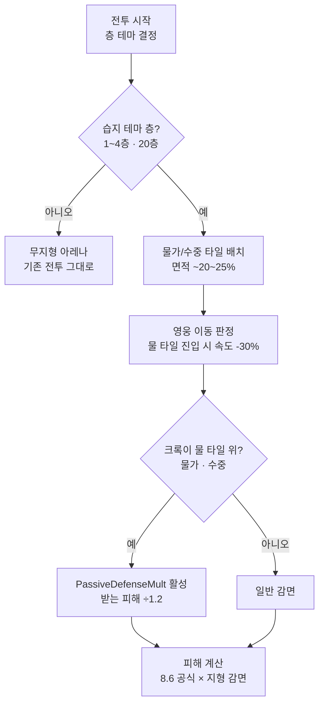

# 수중 지형 시스템 (수해 적응 활성화)

> [!info] 이 문서는?
> 전장(아레나)에 **수중/물가 지형 타일**을 도입해 휴면 패시브 **'수해 적응'**(크록 — 수중·물가 DEF +20%)을 활성화하는 시스템 설계서.
> **상위 기준**: [[전투시스템_BattleSystem]] §3(자유 배치) · §9.3(20층 정령왕 물 필수) · [[소환카탈로그_설계영웅]] §8.3.2(크록 계수 시트).

---

## 1. 목적 & 범위

- **목적:** ① 휴면 패시브 **'수해 적응'**(`AquaticDefMult` ×1.20 — D-87 훅은 활성, 수중 타일만 부재)을 실제 전투에 연결 ② 자유 배치 전장에 **지형이라는 공간 전술 축**을 추가 (기존 위치 보정 측면/배후와 직교) ③ 20층 불의 정령왕 '물 필수 편성' 테마에 수해 속성 영웅(크록·마샬)이 **발휘할 공간**을 부여
- **범위 (in):**
  - 지형 타일 2종 (물가·수중)의 정의 · 배치 규칙 · 이동/방어 효과
  - 크록 '수해 적응' 발동 조건 (물가·수중 위) · 수치
  - 습지 테마 층 (1~4층 · 20층 정령왕 아레나) 배치 규칙
  - Unity 구현 연동 (타일 데이터 · PassiveDefenseMult 트리거 · 2.5D 시각)
  - 검증 (passiveCheck 확장 · 전투 시뮬레이션)
- **비범위 (out):**
  - 연금술사(아이템 시스템) · 군단(고블린노이드 로스터) — **다른 휴면 패시브 2종은 이 문서에서 다루지 않음**
  - 수영/잠수 메커니즘 · 수중 전투 전체 전환 · 물 기반 기믹(수류 등) — 별도 후속
  - 전장 전체 리메이크 — **기본 층은 무지형 유지** (데모 회귀 보호)

## 2. 설계 원칙

| # | 원칙 | 이유 |
|---|---|---|
| 1 | **기본 층 무영향 (회귀 보호)** | 기존 5/10/15층 데모 전투·승률 시뮬레이션(bossWinrateSim) 결과를 바꾸지 않는다 — 지형은 습지 테마 층에만 |
| 2 | **훅 재사용 (재구축 금지)** | `CombatUnit.PassiveDefenseMult()` virtual 훅(D-87)을 그대로 사용 — 새 코드 없이 트리거 조건만 추가 |
| 3 | **위치 축과 직교** | 지형은 '어디에 서 있는가'(타일) — 기존 '상대 각도'(측면/배후)와 독립적으로 곱해진다 |
| 4 | **수해 속성 영웅의 공간** | 크록·마샬(수해 2인)이 물 타일에서만 우위 — 20층 정령왕 '물 필수 편성'을 공간 전술로 완성 |
| 5 | **스탯 상한과 별개 층** | 수해 적응은 '받는 피해 ÷1.2' (DEF 미적용 모델 환산) — v7.11 '스탯 합산 +15%' 상한의 대상이 아님 (D-87 구현 그대로) |

## 3. 규칙 & 수치

> [!warning] 수치 정합성
> 모든 수치는 [[SoulCommander_GDD_v7.11]] 및 부속 문서와 충돌 확인 필수
> (상한: SPD +10% · 스탯 합산 +15% · 행동력 240/6분 · 플레이어블 13종).

| 항목 | 수치 | 근거 |
|---|---|---|
| 지형 타일 | **일반 / 물가(얕은 물) / 수중(깊은 물)** 3종 | 크록 패시브 문구 '수중·물가' — 2단계로 발동 폭 확보 |
| '수해 적응' 발동 | **물가·수중 타일 위에서 받는 피해 ÷1.2** (DEF +20% 환산) | 소환카탈로그 §8.3.2 크록 특성 + D-87 `PassiveDefenseMult` |
| 물 타일 이동 패널티 | **이동 속도 -30%** (아군·몬스터 공통) | 데모 정의 — 자유 배치 「이동」의 공간 비용 |
| 습지 생물 면역 | 리자드맨 계열(늪지 리자드맨 아종 '수중 잠복' 시드 — 이동 +10% 상쇄 후 -20%) · 습지 몬스터(늪지 괴물류)는 패널티 -50%만 | 종족몬스터사전 §3.5 아종 '수중 잠복' — 데모 정의 |
| 습지 층 물 타일 비율 | 전장 면적의 **~20~25%** (2~3개 물가 패치 + 1개 수중 패치) | 데모 정의 — 포위·이탈 전술이 가능한 최소 밀도 |
| 적용 층 | **1~4층(습지 사냥터)·20층(정령왕 아레나)** — 5/10/15층 무지형 | 회귀 보호(원칙 1) + 20층 물 테마 |
| 위치 보정과의 관계 | 곱연산 (지형 DEF ÷1.2 × 측면/배후 +15%/30%) | 전투시스템 §3 — 독립 축 |
| 마샬(시엘프/수해) | 수해 적응 없음 — 물 타일 혜택은 크록 전용 (마샬은 20층 물 속성 편성 역할) | 종족 패시브는 종족 전용 — 계열 공유 없음 |

## 4. 로직 흐름

## 5. 구현 연동

- **데이터:** `docs/data/` 지형 정의 (신규 `terrain.json` — 타일 종류 · 층별 배치 좌표/비율) · `docs/db/schema.sql` — 지형은 런타임 절차 배치라 DDL 필드 추가 없음 (층 테마 메타만 문서화)
- **Unity:**
  - `ArenaTerrain.cs` (신규) — 층 테마별 물 타일 패치 절차 배치 (원형 반경 · 시드 고정) · 위치→타일 판정 쿼리 `TileAt(Vector3)`
  - `CombatUnit.PassiveDefenseMult()` — HeroCombat 오버라이드에서 **`ArenaTerrain.TileAt(transform.position)`이 물가/수중이면 ×1.2** (기존 DEF 미적용 모델 ÷1.2 그대로 — D-87 훅 재사용)
  - 이동 속도 — HeroCombat 이동 루틴에 타일 판정 (물 타일 ×0.7 · 늪지 리자드맨 아종 ×0.9 — 데모 정의)
  - 2.5D 시각 — 아트규칙 배경 파이프라인(art/gen_placeholder_bg.py) 스타일로 물 타일 스프라이트(반투명 청록 + 물결) 절차 생성 · Y-sorting/z-order는 기존 지면 레이어
- **검증:** `namegen-prototype/passiveCheck.py` — '수해 적응' 상태 **DORMANT → LIVE** 전환 + 타일 판정 시뮬레이션 (물가/수중/일반 3케이스 · 받는 피해 ÷1.2) · `npm run passive:check` 통합

## 6. 미결정 & 리스크

- [ ] **물 타일 이동 패널티가 몬스터에게도 적용되는가** — 공통(-30%) vs 습지 생물 면역 설계 (데모 정의 — 플레이테스트 D-56 관찰 항목 후 확정) → [[결정로그_DecisionLog]] 후보
- [ ] **수해 적응 DEF +20%가 '받는 피해 ÷1.2'인가 vs 실제 DEF 스탯 +20%인가** — 현재 DEF 미적용 모델이라 ÷1.2로 구현 (D-87) · DEF 도입 시 재계산 필요
- [ ] 물 타일 위 상태이상 상호작용 (화상이 물가에서 감소?) — 스코프 외 (별도 후속)
- [ ] 20층 정령왕 아레나 물 타일 배치가 보스 패턴(bossWinrateSim 20층 모델) 승률에 미치는 영향 — 구현 후 시뮬레이션 재검증 필요
- [ ] 늪지 리자드맨 아종은 서브레이스 시스템(§3.5 틴트/스케일 — 예정)과 함께 활성화

---

## ✅ 작성 완료 체크리스트 (표준 9종 — 문서작업규칙 v2.2)

- [x] ①~④ 프론트매터(`version`·`up`·`aliases` 포함) · 위키링크 · 콜아웃 · 머메이드
- [x] **⑤ GDD_홈 등록** — [[GDD_홈]] 문서 목록에 `[[위키링크]]` 등록 (버전·상태·설명 함께)
- [x] **⑥ 결정로그 등록** — 설계 결정/확정 사항이 있으면 [[결정로그_DecisionLog]]에 등록 (D-94 — 분석 · Draft)
- [x] **⑦ 상태 태그 = status 필드와 정합** — 생성 시 기본 `상태/초안`(Draft)
- [x] **감사 도구 실행** — `bash scripts/audit_docs.sh --quiet` (exit 0 = 준수 — **생성 직후 + 편집 후마다**)
- [x] 🔗 관련 문서 표에 상호 링크 (📌 결정 기록 행 포함)

---

## 🔗 관련 문서

| 관계 | 문서 |
|---|---|
| 🏛 홈 | [[GDD_홈]] |
| 📖 기준 | [[전투시스템_BattleSystem]] · [[SoulCommander_GDD_v7.11]] |
| 👥 종족 | [[종족몬스터사전_Bestiary]] (리자드맨 · 늪지 아종 '수중 잠복') |
| 🧙 영웅 | [[소환카탈로그_설계영웅]] (크록 §8.3.2 · 마샬 — 수해 2인) |
| 🎨 아트 | [[아트규칙_2.5D]] (배경 파이프라인 · 지면 레이어) |
| 📌 결정 | [[결정로그_DecisionLog]] (D-87 휴면 3종 · D-92 패시브 누적) |

---

*템플릿: `_템플릿/시스템_설계서.md` — 문서작업규칙 v2.2 표준 적용 (표준 9종 — ⑤GDD_홈 등록 · ⑥결정로그 등록) · 생성 순서: [[문서작업규칙_템플릿#1️⃣1️⃣ 새 문서 생성 워크플로 — 템플릿 → 등록 → 감사 (★D-36 신설)|§11 워크플로]]*
