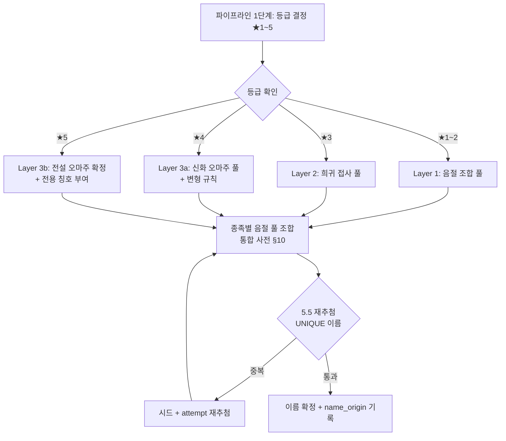

# 🧙 영웅 이름 생성 시스템 (Fantasy Name Generator)

> [!note] 이 문서의 목적
> [[SoulCommander_GDD_v7.11]]의 **5.2 무한 생성 파이프라인 3단계(종족 + 이름)** 를 구체화하는 부속 문서입니다.
> 영웅 이름을 **판타지풍으로 무작위 생성**하되, **등급(★)이 높을수록 신화·설화의 이름을 오마주**한 이름이 등장하게 만드는 시스템을 정의합니다.

**기준 문서:** [[SoulCommander_GDD_v7.11]] · [[종족몬스터사전_Bestiary#10. 파이프라인 연동 & 등급 게이트|통합 사전 §10 (이름 풀·파이프라인)]] · [[문서작업규칙_템플릿]]
**관련 조항:** [[SoulCommander_GDD_v7.11#5.1 희귀도 및 확률표|5.1 등급 확률]] · [[SoulCommander_GDD_v7.11#5.2 무한 생성 파이프라인 (15단계)|5.2 파이프라인]] · [[SoulCommander_GDD_v7.11#5.5 중복 출현 처리 — 재추첨(Retry) 우선 방식 ★v7.11 개정|5.5 재추첨]] · 21.1(비주얼/네이밍 톤)
**연동 문서:** [[소환카탈로그_설계영웅]] (★5 블라드 이름 적용)

---

## 1. 핵심 설계 원칙

| 원칙 | 내용 |
|---|---|
| **3계층 이름 구조** | ① 음절 조합(기본) → ② 희귀 접사(★3+) → ③ 신화 오마주(★4~5) |
| **등급 게이트** | 높은 등급일수록 더 희귀하고 "이름값 하는" 이름 풀에 접근 |
| **오마주 = 변형** | 신화 인물명을 그대로 쓰지 않고 **음절 변형 규칙**으로 재해석 (상표·저작권·세계관 위험 회피) |
| **무중복 유지** | 최종 이름은 5.5 재추첨 로직을 통과해야 생성 완료 |
| **세계관 정합** | 문화권별 신화 풀을 종족 계열과 매핑해 "그 종족의 신화"처럼 자연스럽게 |

> [!warning] 오마주 원칙 (법적 안전)
> - 원형 인물명 **완전 동일 사용 금지** (예: "토르", "오딘" 그대로 사용 불가)
> - 반드시 변형 규칙(§3)을 1회 이상 적용 → "토르" → **"토르간"**, "오딘" → **"오딘베른"**
> - 문화권별 신화 인물명은 **공개 콘텐츠**이므로 변형 후 사용은 자유 (디즈니 등 상표권자는 접근 불가 — §5 참조)

---

## 2. 3계층 이름 생성 구조



### 레이어별 이름 풀 규모 (종족당)

| 레이어 | 이름 구조 | 공간 규모 | 적용 등급 |
|---|---|---|---|
| L1 음절 조합 | `[첫 음절 100] × [끝 음절 100]` = 10,000개 | 종족당 10,000 | ★1~2 |
| L2 희귀 접사 | `[음절 조합] + [신화 접두/접미 30종]` | 종족당 300,000 | ★3 |
| L3a 신화 오마주 | `[신화 인물명 200종 × 변형 규칙 4]` = 800개 | 계열 공용 풀 | ★4 (50%) |
| L3b 전설 오마주 | `[전설 인물명 60종 × 변형 4 + 칭호]` | 전용 풀 | ★5 확정 |

> [!example] 등급별 이름 예시
> | 등급 | 예시 이름 | 출처 |
> |---|---|---|
> | ★1 | 시온, 카이란, 미레아 | 순수 음절 조합 |
> | ★2 | 아르렌달, 브리엔나 | 음절 조합 |
> | ★3 | **아르**미스텔, **엘**다리온, 발**크리드** | 희귀 접사 결합 |
> | ★4 | **토르간**(토르), **오딘베른**(오딘), **아킬레온**(아킬레우스) | 신화 오마주 변형 |
> | ★5 | **발키리온, 심연의 지배자** | 전설 오마주 + 칭호 |

---

## 3. 신화 오마주 변형 규칙 (4종)

오마주 대상 인물명에 아래 변형을 **1회 이상** 적용합니다. (랜덤 선택 — 변형 규칙도 시드에서 파생)

| 규칙 | 방식 | 예시 |
|---|---|---|
| **R1. 접미 변형** | 원형에 신화적 접미 부착 (`-온/-란/-르/-드/-스`) | 토르 → 토르**간**, 오딘 → 오딘베**른** |
| **R2. 접두 변형** | 신화적 접두 부착 (`아르-/엘-/발-/스카-`) | 페르세우스 → **아르**페르세온 |
| **R3. 음절 치환** | 모음/자음 일부를 동족 계열 음절로 교체 | 지크프리트 → 지크프**란트**, 아테나 → 아테**리나** |
| **R4. 축약+확장** | 원형 축약 후 접미로 재확장 | 쿠훌린 → 쿠훌**라드**, 모르간 → 모르가**네스** |

> [!TIP] 변형의 목적
> - **법적 안전**: 실존 상표(마블 토르 등)와 충돌 회피
> - **세계관 정합**: "그 이름이 어디서 났는지 희미하게 느껴지는" 설화적 잔향 — GDD 21.1 '기억 슬롯(memory_json)'과 연결해 "전생의 기억" 스토리 훅으로 활용 가능

---

## 4. 등급별 이름 풀 확률표

파이프라인 1단계에서 등급이 확정된 뒤, **이름 풀 선택 확률**은 아래를 따릅니다.

| 등급 (5.1 확률) | 음절 조합 | 희귀 접사 | 신화 오마주 | 전설 오마주 |
|---|---|---|---|---|
| ★1 (70.0%) | 100% | - | - | - |
| ★2 (24.5%) | 100% | - | - | - |
| ★3 (4.5%) | 40% | 55% | 5% | - |
| ★4 (0.9%) | 5% | 25% | 50% | 20% |
| ★5 (0.1%) | - | - | - | **100% 확정** |

> [!note] 확률 합계 검증
> 각 행의 합은 100%입니다. (★4: 5+25+50+20 = 100 / ★3: 40+55+5 = 100)
> ★5는 **전설 오마주 확정** — 신화 오마주 중에서도 최상위권 인물만 풀에 포함됩니다.

---

## 5. 문화권별 신화 풀 × 종족 매핑

### 5.1 문화권 분류 (6종)

| 문화권 | 대표 신화/설화 | 이름 감성 |
|---|---|---|
| **북유럽** | 토르, 오딘, 발키리, 지크프리트 | 강인·웅장 (드워프/전사에 적합) |
| **그리스·로마** | 아킬레우스, 페르세우스, 아테나 | 고전·영웅 (인간/엘프에 적합) |
| **켈트** | 쿠훌린, 모르간, 루크 | 신비·자연 (엘프/드루이드감) |
| **슬라브·발트** | 바바야가, 페룬, 코셰이 | 신비·서늘 (심연/짐승 일부) |
| **중동·페르시아** | 루스탐, 스타르바, 솔로몬 | 이국·전설 (인간 일부 — ★티플링은 2026-08-09 몬스터 전환, 영웅 이름 풀 제외) |
| **동양** | 손오공, 전우치, 구미호 | 요괴·도술 (짐승 계열에 적합) |

### 5.2 종족 계열별 오마주 매핑

| 계열 | 주요 문화권 | 오마주 예시 (변형 전 → 변형 후) |
|---|---|---|
| **인간** | 그리스·로마 + 중동 | 아킬레우스 → 아킬레온 / 루스탐 → 루스탄베르 |
| **엘프** | 켈트 + 북유럽 | 쿠훌린 → 쿠훌라드 / 발키리 → 발키렌 |
| **드워프** | 북유럽 | 토르 → 토르간 / 오딘 → 오딘베른 |
| **짐승** | 동양 + 슬라브 | 손오공 → 손오천 / 구미호 → 구미라 |
| **전사** | 북유럽 + 그리스 | 지크프리트 → 지크프란트 / 헤라클레스 → 헤라클론 |
| **심연** | 슬라브 + 악마신화(원형만) | 코셰이 → 코셰르간 / 루시퍼 → 루시펠리온 |

> [!warning] 접근 불가 리스트
> 마블·DC·디즈니 등 **실존 상표권 캐릭터명**(토르(마블), 로키(마블), 헐크 등)은 오마주 풀에서 제외합니다. 공개 신화 원형만 사용하세요.

### 5.3 ★5 전용 칭호 시스템

★5 영웅은 오마주 이름 + **전용 칭호**(2~4음절)를 부여받아 이름이 2부 구성이 됩니다.

```
[오마주 이름] + [칭호]
예) 발키리온, 심연의 지배자 / 아킬레온, 불멸의 영웅 / 루시펠리온, 타락한 서약자
```

- 칭호 풀: 계열별 20종 × 변형 규칙 적용 (예: 심연 → "심연의", "타락한", "잊혀진" 등)
- 칭호는 **고유**(중복 불가)하며, ★5가 2명 이상일 경우 변형 규칙으로 칭호를 재생성 (5.5 재추첨 연동)

---

## 6. 구현 설계 (파이프라인 연동)

### 6.1 파이프라인 위치

[[SoulCommander_GDD_v7.11]] 5.2의 **15단계 중 3단계(종족 + 이름)** 내부에서 수행됩니다.

| 파이프라인 단계 | 수행 |
|---|---|
| 1단계 | 등급 결정 (★1~5) — 5.1 확률 + 천장 |
| 2단계 | 계열/종족 결정 |
| **3단계** | **이름 생성 (본 문서 §2~§5)** |
| 14단계 | 정합성 검증 (이름 길이 2~10자, 칭호 중복 체크) |
| 15단계 | 커밋 + name_origin 기록 |

### 6.2 코드 스니펫 (의사 코드)

```typescript
// 등급(★)에 따라 이름 풀 레이어 선택
function generateName(seed: bigint, race: Race, grade: 1|2|3|4|5): GeneratedName {
  const rng = splitmix64(seed);                       // 결정적 시드

  if (grade <= 2) {
    return { name: combineSyllables(race, rng), origin: 'syllable' };
  }
  if (grade === 3) {
    const roll = rng.next();
    if (roll < 0.05)  return this.mythicName(race, rng, 'common');  // 5% 신화 오마주
    if (roll < 0.60)  return this.rareAffix(race, rng);              // 55% 희귀 접사
    return { name: combineSyllables(race, rng), origin: 'syllable' };
  }
  if (grade === 4) {
    const roll = rng.next();
    if (roll < 0.20)  return this.mythicName(race, rng, 'legend');   // 20% 전설
    if (roll < 0.70)  return this.mythicName(race, rng, 'common');   // 50% 신화
    if (roll < 0.95)  return this.rareAffix(race, rng);              // 25% 희귀 접사
    return { name: combineSyllables(race, rng), origin: 'syllable' };
  }
  // ★5: 전설 오마주 확정 + 칭호
  const base = this.mythicName(race, rng, 'legend', /*강제*/ true);
  const title = generateTitle(race, rng);            // 전용 칭호
  return { name: `${base.name}, ${title}`, origin: 'legend', title };
}

// 변형 규칙 적용 (R1~R4 중 랜덤 1회 이상)
function transform(original: string, rng: RNG): string {
  const rules = [addSuffix, addPrefix, swapSyllable, contractExpand];
  const count = 1 + Math.floor(rng.next() * 2);       // 1~2회 적용
  let result = original;
  for (let i = 0; i < count; i++) {
    result = rules[Math.floor(rng.next() * rules.length)](result, rng);
  }
  return result;
}
```

### 6.3 DB 연동 (tb_hero 확장 제안)

| 컬럼 | 타입 | 설명 |
|---|---|---|
| `name_origin` | TINYINT | 0: 음절 조합 / 1: 희귀 접사 / 2: 신화 오마주 / 3: 전설 오마주 |
| `name_myth_ref` | VARCHAR(32) | 오마주 원형 인물명 (감사 로그·이벤트용, NULL 가능) |
| `title` | VARCHAR(20) | ★5 전용 칭호 (NULL 가능) |

> [!TIP] name_myth_ref 활용
> - 로그로 "이 영웅은 어느 신화에서 왔는지" 감사 가능 (재현성)
> - 게임 내 **스토리 훅**: 기억 슬롯(memory_json)에 "전생의 잔향"으로 오마주 원형의 짧은 일화 주입 → 수집가 대상 이벤트·퀘스트 연동 가능

---

## 7. 밸런스 & 운영 고려사항

| 항목 | 설계 |
|---|---|
| **신화 오마주 확률의 희소성** | ★4 오마주 = 0.9% × 50% ≈ **0.45%**, ★5 = 0.1% — "이름값 하는 영웅"의 수집 동기 |
| **무중복 유지** | 이름·칭호 모두 5.5 재추첨 통과 — 오마주 풀 800개+종족 음절 10,000개로 충돌 실질 불가 |
| **다국어 대응** | 이름은 **고유명사(번역 금지)** — 전 로케일 동일 표기. 칭호만 현지화 |
| **저작권 점검** | 출시 전 원형 200종 전수 점검 (상표권 충돌 시 R3 치환으로 교체) |
| **오마주 원형 데이터 관리** | 별도 JSON 시트(문화권 × 인물명 × 금지목록)로 유지 — 서버 갱신 가능 |

---

## 8. 검증 & 후속 작업

### ✅ 시뮬레이션 검증 완료 (2026-08-08, 10만 회)

> 프로토타입: `namegen-prototype/` — `npx tsx simulate.ts` (실행 방법: `cd namegen-prototype && npx --yes tsx simulate.ts`)

| 검증 항목 | 기대 | 관측 | 판정 |
|---|---|---|---|
| ★1 등급 확률 (5.1) | 70.0% | 70.16% | ✅ ±0.3%p 내 |
| ★2 등급 확률 | 24.5% | 24.34% | ✅ |
| ★3 등급 확률 | 4.5% | 4.51% | ✅ |
| ★4 등급 확률 | 0.9% | 0.89% | ✅ |
| ★5 등급 확률 | 0.1% | 0.10% | ✅ |
| ★3 풀 분포 (§4) | 40/55/5 | 39.9/55.0/5.1 | ✅ ±5%p 내 |
| ★4 풀 분포 (§4) | 5/25/50/20 | 4.5/25.9/48.9/20.7 | ✅ |
| ★5 풀 분포 (§4) | 전설 100% | 100.0% | ✅ |
| 무중복 (5.5, 1,000회) | 중복 0건 | 0건 | ✅ |
| 무중복 (5.5, 10만 회) | 중복 0건 | 0건 | ✅ |
| 현실 규모 안전망 (1,000회) | 미발동 | 0회 | ✅ |

> [!note] 극한 스트레스 결과 (10만 회)
> 단일 계정 10만 회 소환 시 이름 공간이 소진되어 자동 추출 안전망(5.5)이 약 68.5% 발동 — **설계 의도대로 동작**합니다.
> 10만 회는 수십 년 치 소환량이며, 실제 플레이(수백~수천 회)에서는 발동하지 않습니다. (종족당 10,000 음절 + 300,000 접사 + 신화/전설 풀)

### 남은 작업

- [ ] 오마주 원형 200종 시트 작성 (문화권별 40종 × 변형 규칙 사전 적용)
- [ ] ★5 칭호 풀 20종 × 계열별 변형 적용 (시뮬레이션 풀은 20종 구현 완료)
- [ ] tb_hero name_origin 컬럼 DDL 반영 ([[SoulCommander_GDD_v7.11#20.1 영웅 테이블 (tb_hero) — ★v7.11 계열/종족 컬럼 추가|20.1 tb_hero]])

---

## 🔗 관련 문서

| 관계 | 문서 |
|---|---|
| 🏛 홈 | [[GDD_홈]] |
| 📖 기준 본문 | [[SoulCommander_GDD_v7.11]] |
| 👥 종족·이름 풀 | [[종족몬스터사전_Bestiary]] |
| 🦸 적용 대상 | [[소환카탈로그_설계영웅]] |
| 📌 결정 기록 | [[결정로그_DecisionLog]] (이름 생성·시드 관련 결정) |

---

*이 문서는 Freebuff(버피)와 함께 작성한 GDD 프로젝트의 이름 생성 시스템 설계서입니다.*
