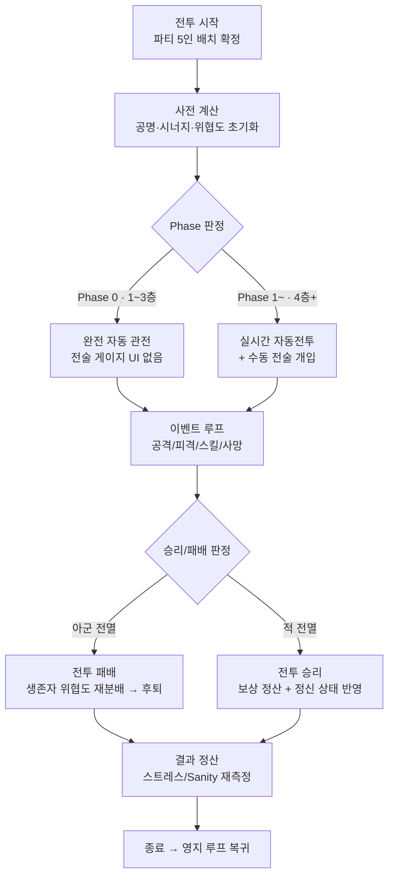
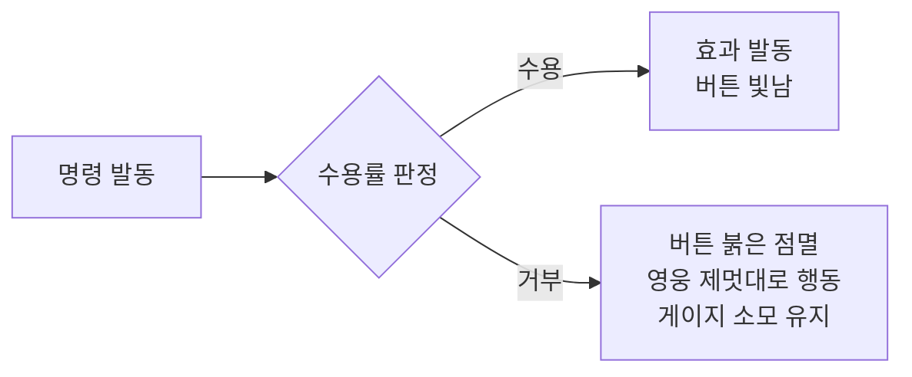
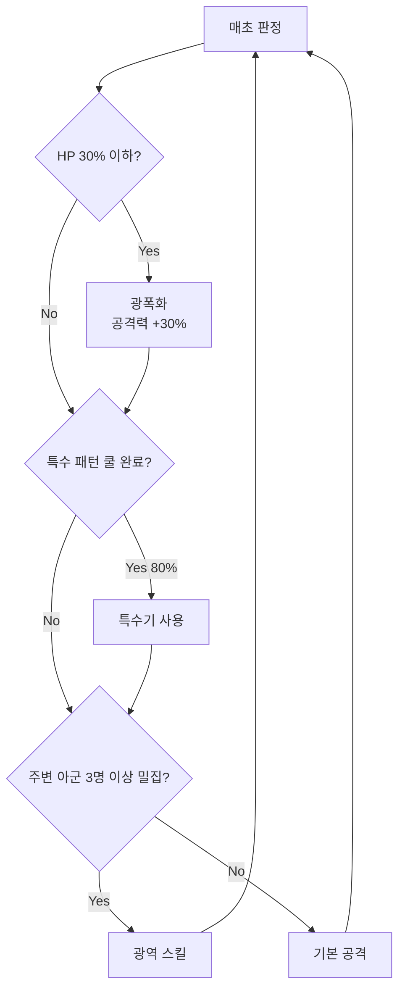
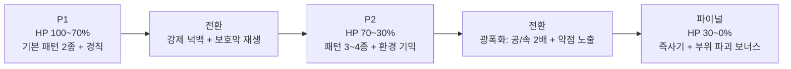
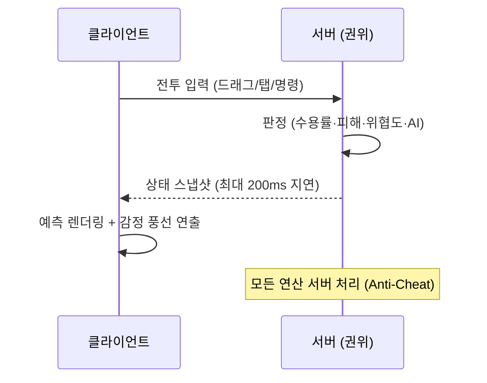

> [!note] 현재 구현 기준
> 본문의 Unity 체크리스트·완료 표기는 역사 자료입니다. 현재 전투 런타임은 Godot `client_godot/`이며 진행 상태는 [[개발플랜_DevPlan]]과 [[GDD_홈]]의 현재 기준을 따릅니다.

# ⚔️ 전투 시스템 상세 기획서 (Battle System)

> [!note] 이 문서의 목적
> [[SoulCommander_GDD_v7.11]] **8장(전투 시스템)** 의 실전 구현 상세입니다.
> 8장 본문 + [[SoulCommander_GDD_v7.11#6.4 정신 상태 시스템 (실시간 전투 적용)|6.4 정신 상태]] + 17장(몬스터 AI) + 19장(보스 설계)을 **하나의 전투 루프로 통합**해 기술합니다.

**기준 문서:** [[SoulCommander_GDD_v7.11]] · [[밸런스_5인전환_재계산]] · [[소환카탈로그_설계영웅]] · [[문서작업규칙_템플릿]]
**연동 시스템:** [[종족몬스터사전_Bestiary]] (계열 공명·종족 시너지·몬스터 상세) · [[이름생성시스템_NameGenerator]] (감정 풍선·대사)

---

## 1. 전투 루프 개요



> [!TIP] 핵심 설계 방향
> 전투의 모든 판정은 **서버에서 계산**됩니다 (v7.11 21.3 Anti-Cheat — 서버 권위주의, 최대 지연 200ms, 클라 예측).

---

## 2. 전투 진행 방식 (Phase 0 vs Phase 1~)

| 구분 | Phase 0 (1~3층) | Phase 1~2 (4층 이상) |
|---|---|---|
| 진행 방식 | 완전 자동 관전형 | 실시간 자동전투 + 수동 전술 개입 |
| HUD | 하단 전술 명령어 버튼 **없음** | 전술소 레벨에 따라 **2~6개** 버튼 표시 |
| 마스터 역할 | 구경꾼 (세계관 몰입) | 지휘관 (전술 게이지로 전황 뒤집음) |
| 전술 게이지 | UI 표시 없음 | 표시 및 충전 시작 (8.3) |

> [!example] Phase 0 관전 경험 (1~3층)
> - 선택형 영웅 스토리: 게임 시작 시 전사/마법사/힐러 중 1명 선택 → 1~3층은 그 영웅의 과거 회상 던전
> - 실시간 감정 풍선: 영웅 머리 위 아이콘(이모티콘) 위주 + 짧은 대사(3글자 내외) — 최대 2개 동시, 1.5초 후 자동 소멸
>   - 예: 피격 시 😠+"육탄!" / 치유 시 🫶+"치료!" / 치명타 시 😏+"명중!"
> - 관전 보상: 특정 콤보 성공 시 '관전 포인트' → 첫 소환 시 ★3 이상 확률 +5%

---

## 3. 파티 구성 & 배치 (★v7.12 정정 — 자동 전투)

[[SoulCommander_GDD_v7.11#8.10 파티 편성 규모 & 배치 — ★v7.11 확정 (B-1)|8.10 파티 편성]] 요약 (D-03 확정 — 실시간 자동전투 + 전술 버튼, 직접 조종 없음 · HeroDrag 폐기):

| 항목 | 규칙 |
|---|---|
| 출격 인원 | **5명** (**예비 없음** — 사망 시 교체 불가, 전력 영구 감소) |
| 파티 구성 | **자유 파티 구성 + 자동 전투** — '자유'는 **전투 전 5인 구성 선택**을 뜻함. 전투는 기본 진형(후열 3·전열 2)에서 **자동 전투**로 진행 |
| 플레이어 조작 | **전술 버튼·적 탭만** (직접 드래그/조종 없음) |
| 위치 보정 | 측면 +15% / 배후 +30% (상대 각도 기준) — 자동 전투와 무관하게 동작 ([[SoulCommander_GDD_v7.11#8.9 치명타 / 회피 / 위치 보정|8.9]]) |
| 사망 처리 | 교체 없이 남은 인원으로 전투 지속 (Permadeath 강조) |

> [!warning] '자유'의 함의
> 자유는 위치의 자유가 아니라 **구성의 자유**입니다. 탱커 2인 편성 등 기믹(차원 균열 등)에 대응하는
> 구성 전략이 플레이어의 핵심 의사결정이며, 전투 중 위치는 AI가 자동 운용합니다.
> 몬스터 AI의 위치 기반 판정(밀집 광역, 배후 치명타)은 자동 전투에서도 동일 적용됩니다.

---

## 4. 마스터 자원: 전술 게이지 & 명령어

### 4.1 전술 게이지 (8.3)

| 항목 | 수치 |
|---|---|
| 최대치 | 100 (전투 시작 50) |
| 충전 | 초당 +2, 적 처치 시 +10 |
| Phase 0 | 게이지 UI 표시 없음 |
| Phase 1~ | 게이지 표시 및 충전 시작 |

### 4.2 명령어 게이지 소모량 (8.4)

| 명령어 | 소모 | 전술소 레벨 | 효과 |
|---|---|---|---|
| 집중 공격 / 이동 | 10 | Lv.1 | 대상 지정 / 드래그 이동 |
| 방어 태세 / 후퇴 | 15 | Lv.2 | 피해 -50% (3초) / 후방 이동 (쿨 15초) |
| 측면 기동 / 스킬 봉인 | 25 | Lv.3 | 이속 +30%·치명타 100% / 적 스킬 5초 차단 |
| 전원 철수 / 재충전 | 40 | Lv.4 | 전투 이탈(일반전) / 궁극기 쿨 50% 단축 |
| 희생 돌파 / 산개 | 60 | Lv.5 | HP 50% 소모 → 주변 300% 피해 / 0.5초 무적 + 디버프 해제 |

> [!TIP] 게이지 운영 전략
> 시작 50으로 Lv.1 명령어(10)는 즉시 1회 사용 가능. 희생 돌파(60)는 전투 시작 5초 후부터 가능.
> 초당 +2 충전이므로 "적 처치 보너스 +10"이 게이지 확보의 핵심 — 처치 순서 설계가 전술.

### 4.3 명령 수용률 (8.5 + 6.4)



**수용률 수식:**
```
수용률(%) = 60 + (사기 × 0.3) - (스트레스 × 0.2) + 성격보정
범위: 5~95% 클램프
```

**성격 코드표 (personality_code 0~5):**

| 코드 | 성격 | 수용률 보정 | 코드 | 성격 | 수용률 보정 |
|---|---|---|---|---|---|
| 0 | 충성 | +15 | 3 | 소심 | -5 |
| 1 | 순종 | +10 | 4 | 오만 | -10 |
| 2 | 대담 | +5 | 5 | 완고 | -15 |

> [!example] 수용률 계산 예시
> 사기 70, 스트레스 20, 성격 충성(+15) 영웅 → 60 + 21 - 4 + 15 = **92%**
> 같은 조건에 스트레스 80이면 → 60 + 21 - 16 + 15 = 80% (스트레스 관리 중요성)

---

## 5. 정신 상태 시스템 연동 (6.4)

| 지표 | 전투 내 영향 | 회복 방법 |
|---|---|---|
| 사기 (Morale) | AI 효율, 명령 수용률 | 승리, 휴식, 칭찬 |
| 스트레스 (Stress) | 명령 거부 확률, Sanity 손상 | 숙소 휴식, 병원 |
| Sanity | **30 이하 → 발광 (아군 공격)** | 병원 장기 요양 |

> [!warning] Sanity 30 발광
> 발광 상태 영웅은 아군을 공격하므로, 전투 중 Sanity 하락이 즉각 위협이 됩니다.
> 관계도 페널티(연인 사망 시 Sanity -20 등)와 연쇄로 전투 붕괴가 가능 — 정신 관리가 전술 축 중 하나.

---

## 6. 데미지 공식 (8.6)

### 6.1 물리 DPS (초당)

```
초당 물리 데미지 (DPS) =
  (ATK × 스킬계수 × 속성보정) / (기본 공격 간격(초) / (1 + SPD/100))
```

### 6.2 방어 감소율

```
물리 피해감소율(%) = DEF / (DEF + 200)
마법 피해감소율(%) = M.DEF / (M.DEF + 200)
```

| DEF | 감소율 | DEF | 감소율 |
|---|---|---|---|
| 100 | 33% | 400 | 67% |
| 200 | 50% | 800 | 80% |

> [!note] 방어 적용 규칙
> 물리 공격은 **DEF만**, 마법 공격은 **M.DEF만** 적용 (혼합 적용 없음).

### 6.3 최종 피해 (개별 공격/스킬)

```
단일 피해 = (ATK × 스킬계수 × 속성보정) × (1 - 해당 피해감소율) × (1 ± 위치 보정) × (1 - 방어 관통)
초당 실질 DPS = DPS(①) × (1 - 해당 피해감소율) × (1 ± 위치 보정) × (1 - 방어 관통)
```

- **위치 보정:** 측면 +15%, 배후 +30% (암살자 배후 +50%, 궁수 측면 +20% — 8.9)
- **방어 관통:** 마법학자 2세트 = 대상 M.DEF 10% 무시 (18.2)

### 6.4 마법 공격

- 공식 ①·③에서 ATK → **MAG** 치환, 감소율은 대상 **M.DEF** 기준
- 힐/버프는 감소율 미적용

### 6.5 치명타 / 회피 / 위치 보정 (8.9)

```
치명타 확률(%) = 5 + CRI × 0.05        (기본 5%, CRI 100 = 10%)
치명타 피해 배율 = 150% (기본)           (광전사 세트로 확대)
회피율(%) = EVA × 0.05                  (기본 0%)
위치 보정: 측면 +15% / 배후 +30%
```

> [!warning] 판정 우선순위
> 치명타 판정 → 회피 판정 순서. **치명타와 회피 동시 성공 시 회피 우선** (치명타가 회피를 뚫지 못함).

---

## 7. 스킬 & 궁극기 시스템 (8.8)

### 7.1 기본 규칙

- **일반 스킬:** 쿨타임 기반 (마나 소모 없음) — 직업별 액티브 2종 + 패시브 특성 1종
- **궁극기:** 전용 **궁극기 게이지(0~100)** 충전 후 사용 ('마나' 용어 전부 '궁극기 게이지'로 통일)

> [!note] ★데모 구현 (D-57 확장 — 자율 스킬 + 전투 학습 · D-70~73)
> 액티브 2종은 데모에서 **버튼으로 누르는 스킬이 아니라 캐릭터가 스스로 판단해 사용**합니다 (HeroCombat.SkillPriority — 아군 저체력 시 힐 · 적 2+ 밀집 시 광역 · 저체력 시 은신 등 — 8.7 조작 최소화 정합). 판단은 **성격 코드(4.3) 연동**으로 캐릭터마다 다릅니다 (D-72 — 완고=힐 최대 지연 0.35 · 오만=공격 우선 · 소심=생존 지향).
> 스킬은 **0개에서 시작**해 전투 학습(SkillLearning — 써서/맞아서/보고 배움 + 레벨업=배움의 순간)으로 템플릿 스킬을 익히고, 전부 익히면 **합성 스킬 창작**(관찰한 원소×효과 절차 생성). 사용할수록 **마스터리 Lv**가 올라 **계수 진화**(D-73 — Lv마다 ×1.05 · Lv5 완성 ×1.20 + 쿨 -10%)하며 결과 화면에 표시됩니다 (D-71).
> 검증: [[결정로그_DecisionLog]] D-57(구현) · D-70(시뮬레이터 — 학습 속도/합성 계수 정합) · D-71(결과 화면) · D-72(성격 연동) · D-73(마스터리 진화). 학습 계수·합성 계수·마스터리 수치는 **데모 정의** — D-57 후속 조정 대상.

### 7.2 궁극기 게이지 충전

| 원천 | 충전량 |
|---|---|
| 기본 공격 적중 | +4 |
| 피격 | +2 |
| 적 처치 | +5 |
| 관계 보너스 | 연인 +25%, 스승 +10% (6.5) |
| 명령어 「재충전」 | 쿨 50% 단축 (Lv.4) |

### 7.3 직업별 스킬 시트

> [!note] 계수 기준
> 기본 계수이며 등급·레벨에 따라 보정됩니다. **개별 템플릿 수치화 완료: [[소환카탈로그_설계영웅]]** (P1 해소 — 16종 템플릿 스킬 계수·등급 보정·DPS 정합 검증 포함).

| 직업 | 액티브 1 | 액티브 2 | 궁극기 | 특성(패시브) |
|---|---|---|---|---|
| 전사 | 선회 베기 — 1.2×ATK, 전방 3m 반원, 쿨 6초 | 파괴 강타 — 1.8×ATK, 2m 광역+경직, 쿨 10초 | 심연의 일격 — 4.0×ATK, 전방 직선 6m 관통 | 체력 30% 이하 시 공격력 +15% |
| 수호자 | 도발 — 5초 강제 타겟, 쿨 12초 | 수호의 벽 — 2초 피해 -50% 보호막, 쿨 8초 | 철벽의 영역 — 5초 전방 아군 피해 -60% | 피격 시 위협도 +30% |
| 암살자 | 은신 — 3초, 다음 공격 치명타 100%, 쿨 15초 | 암습 — 2.0×ATK (배후 3.0×ATK), 쿨 7초 | 그림자 열상 — 5연타 각 0.9×ATK (합 4.5×ATK) | 치명타 피해 +20% |
| 궁수 | 연사 — 0.6×ATK ×3, 쿨 4초 | 관통 화살 — 1.6×ATK 직선 관통, 쿨 9초 | 폭풍의 화살비 — 10m 광역 3.5×ATK | 측면 공격 시 +20% 추가 |
| 마법사 | 화염구 — 1.5×MAG, 2m 광역, 쿨 5초 | 얼음 폭풍 — 1.2×MAG 4m 광역+이속 -30% 3초, 쿨 9초 | 메테오 — 5m 광역 4.5×MAG | 스킬 쿨타임 -10% |
| 지원가 | 치유의 빛 — 1.8×MAG 회복 단일, 쿨 6초 | 용기의 주문 — 5초 아군 전체 ATK +20%, 쿨 12초 | 대지의 축복 — 5초 아군 전체 지속 회복(초당 0.5×MAG) + 사기 +10 | 힐 효율 +15% |

> [!TIP] 직업 구성 팁
> 5인 파티는 6직업 중 5개를 고르므로 한 직업이 빠집니다. 계열 공명(3명) + 직업 다양성의 균형이 파티 설계 핵심.
> 예시: [[소환카탈로그_설계영웅#4. 계열 공명 파티 예시 (3명 공명 발동)|카탈로그 파티 예시]] 참고.

---

## 8. 몬스터 AI 연동 (17장)

### 8.1 몬스터 행동 양식

| 유형 | 특성 | AI 우선순위 |
|---|---|---|
| 근접형 | 높은 체력 | 현 타겟 유지 → 최근접 아군 |
| 원거리형 | 낮은 체력, 높은 공격 | 최저 방어력 아군 → 지원가 우선 |
| 마법형 | 중간 체력, 광역 | 밀집 지역 → 마법 방어 낮은 적 |
| 암살형 | 낮은 체력, 극치명 | 최저 HP 아군 → 은신 후 기습 |

### 8.2 위협도(Threat) 공식

```
위협도 = (가한 피해량 × 0.4) + (치유량 × 0.3) + (0.5 - 현재 HP 비율) × 0.3 + (위치 보정)
```

> [!warning] 저체력 우선 공격
> (0.5 - HP비율) 항목으로 저체력 영웅의 위협도가 상승 → 몬스터가 저체력 대상을 마무리하는 감성.
> 지원가는 치유량으로 위협도가 오르므로 위치·방어 태세 관리 필요. 가족 관계 영웅이 곁에 있으면 위협도 ×1.2 (6.5).

### 8.3 AI 의사결정 트리



---

## 9. 보스 전투 구조 (19장)

### 9.1 페이즈 전환



### 9.2 보스 기믹 유형 (5인 기준 — v7.11 B-9)

| 기믹명 | 설명 (실시간) | 대응 전략 |
|---|---|---|
| 차원 균열 | HP 80% 활성화, 이후 **20초마다** 무작위 영웅 1명 5초 제거 | 탱커 2인 편성 / 방어 태세 (예비 없음) |
| 악의의 거울 | HP 60% — 받은 피해 **20%** 즉시 반사 (10초) | 정밀 힐 타이밍, 반사 구간 약한 스킬 |
| 정신 지배 | HP 40% 및 20초마다 — 공격력 최고 영웅 4초 아군 공격 | Lv.3 「스킬 봉인」 차단 |
| 부위 파괴 | 뿔/날개 누적 **15,000** 피해 시 파괴 | 특정 속성 집중 공격 |
| 환경 붕괴 | HP 50%/25% — 필드 1/3 영역 2초 후 붕괴 (즉사) | 「이동」으로 예고 영역 회피 |

> [!note] 5인 재튜닝 반영
> 차원 균열 20초 / 반사 20% / 부위 15,000 수치는 [[밸런스_5인전환_재계산]] 4인→5인 계산 결과입니다.

> [!success] ★「이동」 의존 기믹 재정의 — ✅ **D-174 확정 (2026-08-23)**
> v7.12 정정(D-03 드래그 폐기)으로 판정 정의가 결핍했던 「이동」 의존 기믹 5곳(§4.2 명령어표 이동 행 · §9.x 환경 붕괴 회피 · 5층 뿌리 속박 · 15층 철퇴 거인 즉사기 · 몬스터 돌진 카운터 D-78)을 다음 체계로 통일한다.
> **확정: 「이동」 = 지휘 명령 기반 위치 회피** — ① 모든 회피 기믹 공용 텔레그래프 체계: `예고 시간 ≥1.2초 → 예고 영역 표시 → 판정 시점에 대상 영웅이 영역 밖이면 회피 성공` ② 명령 실행은 전술소 Lv.1 해금 전제(Phase 0 자율 구간에는 회피 수단 없음 · 1~3층에 회피 기믹 배치 금지 — §7.2 강제 플로우 정합) ③ bossWinrateSim dodge_success(D-59 숙련도 축)가 본 정의의 확률적 근사.
> **런타임 반영 ✅ (2026-08-23)** — `telegraph_judge.gd` 공용 판정기(make_zone/is_safe/resolve · MIN_TELEGRAPH_SEC=1.2) + MonsterPatternAI execute 시 위치 회피 판정 병기(safe_units/hit_units — 하위호환) + CommandIntent.move_target(MOVE 목표좌표) + 돌진 예고 0.8→**1.2초** 정합(D-78 모순 해소). 회귀: phase_q_telegraph_test 16/16. 잔여: enemy_entity 피해 적용부 소비 연결(아트 세션 병행 작업 중 — 커밋 후), BossAI/환경붕괴 확대 적용.

### 9.3 게이트키퍼 패턴 시트 (런칭 1~20층 — 19.4 요약)

| 층 | 보스 | 속성 | 핵심 기믹 | 대응 |
|---|---|---|---|---|
| 5층 | 숲의 수호자 | 자연 | 덩굴 채찍·광역 포효·뿌리 속박 | 「이동」 회피 + 「집중공격」 제압 |
| 10층 | 광신도 대제사장 | 어둠 | 출혈 2스택·신도 소환·심판 낙인 | 출혈 스택 관리 + 「방어 태세」 |
| 15층 | 철퇴 거인 | 대지 | **전방 180도 즉사기** (예고 1.5초) | 「이동」 필수 |
| 20층 | 불의 정령왕 | 화염 | 고유 내성: 물 100% / 화염 50% / 기타 70% | **물 속성 필수 편성** |

> [!warning] 20층 진입 장벽 해소
> 15층 클리어 보상으로 물 속성 ★3 고정 지급 (무중복 시스템이므로 신규 영웅). 물 속성 2인 편성 전략.

---

## 10. 조작 체계 (8.7 — ★v7.12 정정: 직접 조종/드래그 없음)

| 입력 | 동작 | 반응 |
|---|---|---|
| 탭 (적 대상) | 공격 지정 | 「집중 공격」 실행 |
| 버튼 탭 | 전술 아이콘 클릭 | 해당 전술 즉시 발동 |
| 롱 프레스 (버튼) | 세부 옵션 팝업 | 세분화 선택 |

> [!TIP] 모바일 최적화
> iOS/Android 기준 — 탭 중심 조작 (위치 이동은 AI 자동). 21.1 감정 풍선은 전투 중 가독성을 위해 아이콘 위주 + 초단문(3글자)로 제한.

---

## 11. 전투 데이터 흐름 (서버-클라이언트)



> [!warning] 200ms 지연 설계
> 서버 권위 판정 + 클라 예측 렌더링으로 체감 지연 최소화. 전술 명령은 즉시 전송되나 **판정은 서버에서 확정**.

---

## 12. 구현 체크리스트 & 후속 작업

### Pre-Alpha (Phase 0) 구현 범위
- [ ] 5인 파티 배치 + 위치 보정 (측면/배후) 시스템
- [x] 기본 공격·궁극기 게이지 루프 (★데모 2026-08-11 — 7.2 충전: 기본 공격 적중 +4 · 피격 +2 · 적 처치 +5 → 100% 시 키 1~5 발동 · 소환카탈로그 §8 skills.json 계수 연동 — HeroCombat·SkillDatabase. **★D-27 MAG 분리(6.4 — ult.stat MAG→Mag) · 속성 상성(5.3 — ElementSystem, element 선언 궁극기만) 추가. ★D-39 multi-hit 연타 — drea 5연타·miro 6연타·rag 4연타를 합계 1회가 아닌 **타격마다 TakeDamage**(히트 플래시·이펙트·피격 +2·처치 +5/+10이 각 타격에서 발생, 0.12s 간격 코루틴, 총합 유지). ★D-40 계열 공명 '엘프 회의' 트리오 궁충전 +15% — PartyRoster.IsElfCouncilActive(리안+실바+드레아)가 AddUltGauge에 ×1.15 적용. ★액티브 2종 → **자율 스킬(D-57)** · 상태이상 4종(D-55) · 계열 공명 HP/ATK·'분파의 갈등' MAG(D-65)는 **별도 항목으로 완료** — 아래 체크리스트 참조**)  
- [x] **자율 스킬 + 전투 학습 시스템 (8.8 확장 — D-18 '액티브 2종' 방향 전환)** — ✅ 2026-08-12 (D-57 — SkillDatabase가 skills.json 'skills' 파싱 · HeroCombat **상황 판단 자동 사용**(SkillPriority — 힐 80+/버프 60/은신 55/CC 40/피해 30 + 지터 0.9) · SkillLearning **전투 학습**(써서×0.02/맞아서×0.03/보고 +15 · 임계 30+30n → 템플릿 순차 습득 → **합성 스킬 창작** 원소×효과) · 전투 중 레벨업(처치 XP 6) — **★D-70 시뮬레이터 검증**(학습 속도: 첫 합성=웨이브 2 · 합성 계수 템플릿 범위 내 — 플래그 3건 조정 후보) · **★D-71 결과 화면 '이번 전투 학습' 표시** · **★D-72 성격 코드(4.3) 연동**(완고=힐 0.35 지연 · 오만=공격 우선 — 캐릭터별 플레이 스타일) · **★D-73 스킬 마스터리(진화)**(사용 +1 → Lv마다 계수 ×1.05 · Lv5 ×1.20+쿨 -10%) — SkillLearning·SkillDatabase·HeroCombat·ResultUI·WaveManager. 학습/합성/마스터리 수치는 **데모 정의**)  
- [x] **속성 상성 (5.3) + MAG 분리 (6.4)** — ✅ VS-1 D-27 (2026-08-11 — ElementSystem 6×6 매트릭스: 순환 4속성 유리 150%/불리 70% + 빛↔어둠 150% · 몬스터 id별 속성 배정(WaveManager — 트롤 자연·드래곤 화염·리치 어둠 등) · 마법 스킬은 Mag 스탯 사용 — HeroCombat·ElementSystem·WaveManager)
- [x] **위협도 공식 (17.2)** — 몬스터가 저체력/지원가 우선 공격 (✅ VS-1 2026-08-11 — 누적 피해×0.4·치유×0.3 + (0.5-HP비율)×0.3 저체력 보정 + 매초 5% 감쇠 · 현 타겟 유지 + 2.5초 주기 재평가 · HUD 위협 바 — HeroCombat·MonsterAI)
- [ ] 몬스터 AI 의사결정 트리 (17.3) — 광폭화 ✅ (기존) · **돌진 ✅ (D-78 — 예고 배너 + 도착 지점 마커 · 「이동」 카운터)** · 밀집 광역은 후속
- [x] **일반 몬스터 강력 패턴 예고 배너 (D-78)** — 보스뿐 아니라 몬스터의 광폭화/돌진도 BossWarnHUD 예고 — 광폭화 발동 시 배너(5초 스팸 방지) · 돌진 = 예고 1.2초 + 도착 지점 고정(「이동」으로 회피) → 1.8×ATK 강타 — MonsterAI 돌진 상태 머신 (데모 정의 수치 — 밸런스 재검증 대상)
- [ ] 전투 이벤트 로그 (tb_battle_records — 재현성)

### Phase 1~2 구현 범위
- [x] **전술 게이지 + 명령어 Lv.1~2 (이동/집중공격/방어태세/후퇴/측면 기동)** — ✅ (기존 M2-①/② — 8.3 게이지 50 시작·초당 +2·처치 +10 · 8.4 소모 10/15/25)
- [x] **명령 수용률 시스템 (6.4 성격 코드 연동)** — ✅ VS-1 2026-08-11 (4.3 수식 60+사기×0.3-스트레스×0.2+성격보정 · 5~95 클램프 · 이동/후퇴/방어/측면/회복/집중공격 명령 영웅별 거부 + 버튼 붉은 점멸 — 사기/스트레스 동적 변화는 정신 상태 시스템 후속)
- [x] 게이트키퍼 5층 '숲의 수호자' 패턴 시트 구현 — ✅ VS-1 2026-08-11 (`BossAI.cs` — 19.4-1 타임라인 전부 반영)

### 후속 필요 문서 (P1~P3)
- [x] 아키타입 스킬 계수 시트 (16종 템플릿 — [[소환카탈로그_설계영웅]])
- [x] 전투 서버 동기화 설계 상세 (200ms 예측 롤백) → [[개발플랜_DevPlan]] §2 (P0 ② 해소)
- [ ] 층별 몬스터 유형 분배 + 웨이브 구성 (9.8) 시뮬레이션

---

## 🔗 관련 문서

| 관계 | 문서 |
|---|---|
| 🏛 홈 | [[GDD_홈]] |
| 📖 기준 본문 | [[SoulCommander_GDD_v7.11]] (8장 · 17장 · 19장) |
| ⚖️ 밸런스 | [[밸런스_5인전환_재계산]] (5인 수치 근거) |
| 👥 종족·시너지 | [[종족몬스터사전_Bestiary]] (계열 공명·위협도 보정·몬스터 AI) |
| 🦸 파티 구성 | [[소환카탈로그_설계영웅]] (아키타입·파티 예시) |
| 🧙 감정 풍선 | [[이름생성시스템_NameGenerator]] (대사·이름) |
| 📋 작성 규칙 | [[문서작업규칙_템플릿]] |
| 📌 결정 기록 | [[결정로그_DecisionLog]] (전투·AI·보스 관련 결정) |

---

*이 문서는 Freebuff(버피)와 함께 작성한 GDD 프로젝트의 전투 시스템 상세 기획서입니다.*
