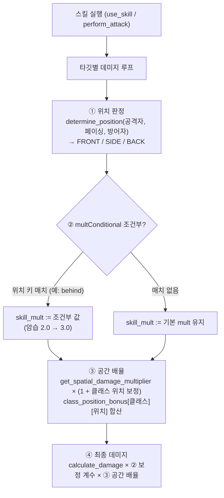

# 클래스 위치 보정 · 배후 조건부 배율 구현 설계 (D-184 후속)

> [!important] 요약 — D-182/D-184와의 관계
> - **D-182 (2026-09-03):** 위치 보정 정본 = 런타임 값(측면 +10% · 배후 +25% · 고지대 +15% · 커버 ×0.75) 채택.
> - **D-184 (2026-09-03):** GDD §8.9의 **클래스 위치 보정**(암살자 배후 +50% · 궁수 측면 +20%)과 스킬 데이터의 **`multConditional.behind` 백스탭 배율**(암습 3.0×ATK 등)은 **런타임 미구현**으로 판정 — 설계 의도로만 존재.
> - 본 문서는 D-184의 후속으로, 이 두 메커니즘을 **런타임에 실제로 배선하는 구현 설계**를 정의한다. 작업 항목은 통합 개발플랜 v2.0의 S1(전투 수직 슬라이스)에 등록.

## 🔗 관련 문서

| 문서 | 관계 |
|---|---|
| [[SoulCommander_GDD_v7.12]] §8.6/§8.9/§8.10 | 위치 보정 정본 (D-182 값 기준) · 클래스 보정 미구현 표기 (D-184) |
| [[결정로그_DecisionLog]] D-182 · D-184 | 위치 보정 정본 채택 · 클래스 보정 미구현 판정 근거 |
| [[GDD_v7.12_개정안]] A-2 | v7.12 개정 경로 — §8.9 문구 정리 연동 |
| [[전투시스템_BattleSystem]] | 전투 데미지 경로 · 위치 판정 참조 |
| 통합 개발플랜 v2.0 §S1 | 작업 항목 등록 (배선 · 검증) |

---

## 1. 구현 대상 (실측 근거)

### 1.1 클래스 위치 보정 — GDD §8.9

```text
위치 보정: 측면 +15% / 배후 +30%       (암살자 배후 +50%, 궁수 측면 +20%)   ← v7.11 §8.9 L611
```

- D-182 확정으로 위치 보정 기본값은 **측면 +10% · 배후 +25%**.
- 클래스 보정은 §8.9의 "상대 각도 기준" 위치 판정 **위에** 특정 클래스가 특정 위치에서 **추가 배율**을 받는 규칙이다.
- **데이터 대응이 전혀 없음** — 코드·JSON 어디에도 암살자/궁수 위치 보정값이 없다 (D-184 실측). 설계 데이터(§3)로 신규 정의해야 한다.

### 1.2 `multConditional` 배후 조건부 — skills.json 실측

| 템플릿 | 영웅 | 클래스 | 스킬 | 기본 mult | multConditional |
|---|---|---|---|---|---|
| `tpl_drea_06` | 드레아 | assassin | 암습 | 2.0 | `{ "behind": 3.0 }` |
| `tpl_miro_10` | 미로 | assassin | 야수 습격 | 1.9 | `{ "behind": 2.8 }` |

- 파일 위치: 작업 트리 `data/skills.json` L134/L210 · HEAD `client_godot/data/skills.json` 동일.
- **소비처 0건** — `.gd` 어디에서도 `multConditional`을 읽지 않는다 (D-184 실측, git grep 전수). 데이터만 존재하는 비활성 설계.
- 의미: **해당 스킬이 "배후" 위치에서 적중하면 기본 계수(mult)를 조건부 계수로 교체**(암습: 2.0 → 3.0×ATK). GDD §8.8 직업 스킬 시트의 "암습 — 2.0×ATK (배후 시 3.0×ATK)"과 정확히 일치한다.

### 1.3 연동 지점 실측 (HEAD `client_godot/scripts/`)

| 파일 | 함수 | 라인 | 역할 |
|---|---|---|---|
| `battle/position_system.gd` | `determine_position(attacker_pos, attacker_facing, defender_pos)` | 32 | 위치 판정 — FRONT/SIDE/BACK enum |
| `battle/position_system.gd` | `get_position_multiplier(pos)` | 49 | 위치별 배율 (FRONT 1.0/SIDE 1.10/BACK 1.25) |
| `battle/position_system.gd` | `calculate_position_bonus(attacker, defender, battle)` | 58 | 위치 배율 × 고지대 배율 합성 |
| `battle/battle_env_system.gd` | `get_spatial_damage_multiplier(attacker, defender, world)` | 79 | 고지대 × 커버 × 위치 종합 |
| `hero/hero_combat_handler.gd` | `use_skill(skill, target)` | 75 | 스킬 실행 진입 — `skill.get("mult", 1.0)` 읽음 |
| `hero/hero_combat_handler.gd` | `_execute_damage_skill(...)` | 164 | 실제 데미지 계산 루프 (L183에서 공간 배율 곱) |
| `hero/hero_entity.gd` | `hero_class` | 21 | 영웅 클래스 필드 (`"assassin"`/`"archer"`) |
| `hero/hero_entity.gd` | `perform_attack(target)` | ~280 | 기본 공격 (L300 공간 배율 곱) |
| `hero/hero_entity.gd` | `skill_pool`/`learned_skills` | — | 스킬 딕셔너리 보관 (JSON 원형 보존) |

---

## 2. 설계 원칙

1. **평가 위치는 런타임 데미지 경로의 단일 지점** — 멀티히트·AOE가 실제 데미지를 내는 순간(타깃별)에 위치 판정을 1회 수행하고, 그 결과를 ① 스킬 조건부 계수 ② 공간 배율 양쪽에 동일하게 적용한다.
2. **위치 판정은 기존 `determine_position`을 재사용** — 새 기하 로직을 만들지 않는다. 공격자 위치/방향(페이싱)과 방어자 위치만 있으면 되는 기존 API를 그대로 사용한다.
3. **값은 데이터로** — 클래스 보정 배율 테이블을 JSON에 신설하고, 런타임은 테이블에서 읽는다 (하드코딩 금지 — 밸런스 수정은 데이터만).
4. **결정 대기 사항과 구현 경계 분리** — 배율 *수치*의 최종 확정은 밸런스 검증(D-E 계열)에 남기되, *구조·배선 경로*는 본 설계로 확정한다.

---

## 3. 데이터 설계

### 3.1 신설: `data/class_position_bonus.json` (또는 skills.json `enums` 하위 확장)

클래스 × 위치 → 추가 배율 테이블. GDD §8.9의 두 값만 시작하고, 이후 클래스·위치 확장 가능.

```json
{
  "schemaVersion": "1.0",
  "gddRef": { "gdd": "SoulCommander_GDD_v7.12", "section": "8.9" },
  "positionBonus": {
    "assassin": { "behind": 0.50 },
    "archer":   { "side": 0.20 }
  }
}
```

- 값 의미: **위치 기본 배율에 합산(+)** 하는 추가 보정. 예: 암살자 배후 = `1.25 + 0.50 = 1.75`, 궁수 측면 = `1.10 + 0.20 = 1.30`.
  - ⚠️ 대안: 곱산(×)으로 정의할 수도 있다 (`1.25 × 1.50 = 1.875`). **수치 의미는 밸런스 결정 항목(§6)** — 구조는 동일하므로 합산(+, 편집 단순)을 기본안으로 둔다.
- GDD v7.11 §8.9의 "측면 +15%/배후 +30% (암살자 +50%, 궁수 +20%)" 표기는 v7.12에서 D-182 값(+10/+25) 기준으로 갱신되므로, 이 테이블의 값도 v7.12 문구와 함께 확정한다.
- 로드: `GameData`에 기존 `_load_json` 패턴(`_load_monsters`/`_load_skills`)을 재사용해 `class_position_bonus` 테이블을 로드하고 조회 API 제공.
  - 파일 위치 협의: 프로젝트 루트 `data/`가 신규 홈 — `data/class_position_bonus.json` 신설 (기존 `data/*.json` 10종과 동일 위치).

### 3.2 기존: skills.json `multConditional` (스키마 확장은 불필요)

- 이미 존재하는 필드이므로 **스키마 추가 없음**.
- 문서화만: 허용 키는 위치 키(`front`/`side`/`behind`) — 현재 데이터는 `behind`만 사용 중. 검증 로더(있다면)에서 위치 키 외 값이 들어오면 경고.
- 값 의미 재확인: **교체(replace)** — `multConditional.<pos>`가 있을 때 해당 위치에서 기본 `mult` 대신 조건부 값을 사용.

---

## 4. 구현 설계 — 평가 위치 & 데이터 흐름

### 4.1 데이터 흐름 (요약)



### 4.2 구체 수정 지점 (HEAD 기준 라인)

**A. `hero/hero_combat_handler.gd` — `use_skill` (L75~)**
- 현재: `var skill_mult: float = float(skill.get("mult", 1.0))` (L88) → 그대로 `_execute_damage_skill`로 전달.
- 수정: 타깃이 단일(single)이면 `use_skill`에서 타깃에 대한 위치를 판정해 skill_mult를 조건부 교체. AOE·멀티히트는 `_execute_damage_skill` **타깃별 루프 내부에서** 판정이 필요하므로, 조건부 해석을 헬퍼로 분리해 양쪽에서 호출:
  ```gdscript
  # position_system 또는 GameData에 추가할 헬퍼
  func resolve_conditional_mult(skill: Dictionary, position: int, base_mult: float) -> float:
      var cond: Dictionary = skill.get("multConditional", {})
      if cond.is_empty():
          return base_mult
      var key := PositionKey[position]   # FRONT→"front", SIDE→"side", BACK→"behind"
      return float(cond.get(key, base_mult))
  ```
- 적용 위치 예시 (기존 데미지 루프 안에서 위치 1회 판정):
  ```gdscript
  # _execute_damage_skill 내부 (기존 L176~183 부근)
  var pos := battle.position_system.determine_position(
      _hero.logical_position, _hero.facing_direction, target.logical_position)
  var eff_mult := resolve_conditional_mult(skill, pos, skill_mult)
  attacker_data["skill_mult"] = eff_mult
  ```

**B. `battle/position_system.gd` — 클래스 위치 보정 추가**
- `calculate_position_bonus` 또는 새 API에서, **공격자가 영웅**이면 클래스 보정을 합산:
  ```gdscript
  # 추가: 클래스 보정 (암살자 배후 +50% · 궁수 측면 +20%)
  func get_class_position_bonus(attacker_class: String, pos: int) -> float:
      var table: Dictionary = GameData.class_position_bonus  # §3.1 로드 데이터
      var bonus: float = table.get(attacker_class, {}).get(PositionKey[pos], 0.0)
      return 1.0 + bonus   # 기본 1.0 (클래스 보정 없으면 무변화)
  ```
- 합성: 공간 배율 계산 시 위치 배율에 클래스 보정을 곱하거나, `calculate_position_bonus` 반환값에 반영.

**C. 위치 판정 입력 — facing 방향 공급 (중요 ⚠️)**
- `determine_position`은 `attacker_facing`이 필요하다. 현재 `calculate_position_bonus`는 `attacker.get("facing_direction")` 폴백을 `Vector2.RIGHT`로 두고 있다 (position_system L58~62 부근 실측).
- **영웅이 실제로 "배후"를 만들 수 있어야** 이 메커니즘이 의미가 있다. 자동전투(AUTO)에서 영웅의 타깃 지향 페이싱(`facing_direction`)이 위치 판정 전에 갱신되는지 S1에서 검증 필요:
  - 이미 이동/타깃 추적 코드가 있다면 그 방향 벡터를 `facing_direction`에 반영.
  - 없다면 공격 시점에 `(타깃 위치 - 자기 위치)` 정규화 벡터를 판정 입력으로 사용하는 경로 추가.
  - (몬스터는 `_facing` int 좌/우만 존재 — 몬스터는 클래스 보정 대상이 아니므로 범위 외. 단, 몬스터 공격의 측면/배후 판정은 기존처럼 대상 각도 기준으로 동작.)

### 4.3 `target_selector.gd` (AI) 참고 — L341~342
- AI가 위치 배율을 타깃 스코어링에 이미 사용하므로, 클래스 보정을 공간 배율에 반영하면 **자동 전투 AI도 배후 우선 타깃팅을 자연스럽게 학습**한다. 별도 AI 로직 추가 불필요 (기존 공간 배율 경유).

---

## 5. 밸런스 영향 & 검증 계획

### 5.1 예상 영향 (수치 검증은 밸런스 단계)

| 항목 | 현재 | 구현 후 (기본안 합산 기준) |
|---|---|---|
| 암살자 기본 공격, 배후 | ×1.25 | ×1.75 (+50% 보정) |
| 암살자 "암습", 배후 | ×2.0 × 1.25 = 2.5 | ×3.0 × 1.75 = **5.25** (조건부+보정) |
| 궁수 기본 공격, 측면 | ×1.10 | ×1.30 (+20% 보정) |
| 몬스터/타 클래스 | 변화 없음 | 변화 없음 |

- ⚠️ 암습 배후 시 5.25×ATK는 단일 스킬로서 매우 강하다 — **스킬 조건부(3.0)와 클래스 보정(+50%)이 중첩**되기 때문. 밸런스에서 ① 조건부 배율 축소(암습 3.0 → 2.6 등) ② 클래스 보정 축소(배후 +50% → +30%) ③ 두 규칙의 상호작용 재정의 중 선택 필요 (통합 플랜 v2.0 §6 데브트·BALANCE_TUNING 연계).
- 검증: `bossWinrateSim.py` 복원판에 클래스 보정/조건부를 모델링해 승률 변화 확인 (D-52/D-69/D-83 기준 대비). 파티 DPS·게이트키퍼 승률 시뮬레이션이 유일한 정량 검증 수단 (S1 재가동 예정).

### 5.2 회귀 안전성
- 클래스 보정 테이블이 비어 있으면(기본) 모든 기존 값과 동일 — **기본 상태 = 회귀 0**.
- `multConditional`은 현재 데이터 2건(암습/야수 습격)만 존재하며 모두 assassin — 기존 밸런스 검증(암습 조건부 무시 상태) 대비 **암살자만 상향**되는 방향. 몬스터 곡선(§9.7)·게이트키퍼 승률과의 정합을 S1 게이트에서 확인.

---

## 6. 결정 대기 (밸런스/설계 — 구현 전 확정 권장)

| # | 항목 | 옵션 | 기본안 |
|---|---|---|---|
| D-포지션A | 클래스 보정 합산(+) vs 곱산(×) | +는 편집 단순 · ×는 D-182 위치 배율과 직관 정합 | **합산(+)** — 문서 "측면 +15%/+배후 +30%에 +50% 추가" 표현과 일치 |
| D-포지션B | 암습 조건부(3.0)와 클래스 보정(+50%) 중첩 허용 여부 | ① 중첩(최대 화력) ② 조건부만 적용 ③ 조건부 값을 보정 포함 값으로 재정의 | **① 중첩 후 밸런스 조정** (설계 단순·조정은 데이터) |
| D-포지션C | 몬스터도 위치 조건부/보정을 쓸지 | 사용(야수 습격류 몬스터 백스탭) vs 영웅 전용 | **v1은 영웅 전용** — 몬스터는 패턴 데미지(damage_mult) 경로와 분리 유지 |
| D-포지션D | 영웅 facing_direction 공급 방식 | 타깃 추적 벡터 vs 이동 방향 캐시 | S1 전투 복원에서 실측 후 확정 |

### 6.1 ★D-188 권장안 확정 (2026-09-03 — BALANCE §4.5-2 sim 근거)

| # | 권장안 | 근거 (sim · 실측) |
|---|---|---|
| D-포지션A | **합산(+) 유지** — `1.25+0.50=1.75` · `1.10+0.20=1.30` | GDD "배후 +50% 추가" 문구와 일치 · 곱산(×5.625)은 문구 초과 화력. 데이터만으로 조정 가능하므로 구조는 합산으로 고정 |
| D-포지션B | **① 중첩 허용 + 조건부 수치 하향으로 수습** — 암습 배후 ×5.25를 그대로 두지 않고 조건부 3.0 → **2.6** 하향 검토 (×2.6×1.75=×4.55) | §5.1 경고 + §4.5-2 ⑤: 중첩 자체는 구조 단순(분기 없음). 문제는 ×5.25 피크라서 조건부 수치로 조정 — 분기(②/③)는 구조 복잡도만 올림. 하향값 2.6은 S1 sim 게이트에서 확정 |
| D-포지션C | **v1 영웅 전용 유지** (야수 습격 2.8은 데이터만 보존) | 몬스터는 패턴 데미지 경로와 분리 유지 — 몬스터 백스탭은 밸런스 축 추가 없이 스코프만 확장하므로 v2 이후 |
| D-포지션D | **타깃 추적 벡터 우선** — 공격 시점 `(타깃−자기)` 정규화 벡터를 판정 입력으로 사용, 이동 방향 캐시는 폴백 | 자동전투에 '이동'이 없어 이동 캐시는 공란이 잦음. 공격 시점 벡터는 항상 존재 → 배후 판정 성립 보장. S1 T-6 로그로 발생 빈도 검증 후 확정 |

- 위 4건은 **★D-188로 결정로그에 기록** — B 하향값(2.6)·D 실측 확인만 S1 게이트 잔여.
  본 §6 표는 결정 검토 이력으로 유지하고, 구현은 §6.1 권장안을 따른다.

### 6.2 ★D-191 사전 검증 (2026-09-03 — S1/S3 게이트 전 자율 처리분)

#### B — 암습 2.6 희석 사전 검증 (analytic · sim S1 게이트 전)

- 배후 확률 0.15(§4.5-2 ③ 권장 분포) · 쿨 7s · 암살자 파티 비중 23% 가정:
  조건부 3.0 → 스킬 기댓값 ×2.150 (스킬-cast +7.5%) → 암살자 +1.51% → **파티 +0.35%** ·
  조건부 2.6 → ×2.090 (+4.5%) → 암살자 +0.91% → **파티 +0.21%**.
- **3.0→2.6의 파티 평균 차이는 0.14pt로 무시 가능** — 대신 단발 피크는 ×5.25→×4.55 (**−13.3%**).
- 결론: B 선택은 평균 DPS 문제가 아니라 **버스트 상한 문제**다. 2.6 하향은 평균 비용 ~0으로
  피크만 −13% 깎는 효율적 조정 → **2.6을 잠정 확정** (S1 sim 게이트는 형식 확인만).
  클래스 보정(+0.50 × 배후 0.15 → 파티 +1.7%)까지 합친 총 +1.9%는 §4.5-2 ① 민감도표의 +1~2.75% 밴드 안 —
  게이트 구간 +5~11pt 기여로 정합한다.

#### D — facing 공급 정적 실측 결과 (작업 트리 · S0 복원 전)

- 작업 트리 `.gd` 26종 전수 + `facing`/`determine_position`/`position_system` grep → **관련 코드 0건**.
  유일한 클래스 배선은 `game_data.gd`의 `hero_class` 부여(템플릿→영웅)뿐 — 방향 공급은 없음.
- 즉 D 실측은 **S0 복원 없이는 불가** (D-184 검증이 HEAD 기준이었던 것과 동일 사유).
  S1 착수 시 §6.1 권장안(타깃 추적 벡터 우선)대로 구현하고 T-6 로그로 검증한다 — 정적 사전 검증은 종결(불가 확정).

---

## 7. 작업 항목 체크리스트 (통합 플랜 v2.0 §S1 반영분)

- [ ] `data/class_position_bonus.json` 신설 + GameData 로드/조회 API (`class_position_bonus` 테이블)
- [ ] `position_system.gd`: 위치 키 매핑(`PositionKey`) + `resolve_conditional_mult`/`get_class_position_bonus` 헬퍼 추가
- [ ] `hero_combat_handler.gd`: `use_skill`/`_execute_damage_skill`에서 타깃별 위치 판정 → `multConditional` 조건부 계수 반영
- [ ] 공간 배율 경로(`position_system.calculate_position_bonus` 또는 `battle_env_system.get_spatial_damage_multiplier`)에 클래스 보정 합산
- [ ] 영웅 `facing_direction` 공급 검증/보강 (배후 판정이 실제로 성립하도록)
- [ ] `bossWinrateSim.py` 복원판에 클래스 보정·조건부 모델링 → 승률/파티 DPS 변화 측정 (D-52/69/83 기준 비교)
- [ ] GDD v7.12 §8.9 — 클래스 보정 수치 문구를 D-182 값 기준으로 정리 (v7.12 반영 시)
- [ ] 결정 대기 §6 (D-포지션A~D) 확정 후 BALANCE_TUNING §4.5 갱신

---

## 부록 A. 참조 실측 (D-184)

- `position_system.gd` — 클래스 인자 0 · `multConditional` 평가 0 (git grep 전수)
- `hero_combat_handler.gd:88` — `skill.get("mult", 1.0)`만 사용, 조건부 미참조
- `battle_env_system.gd:79` — 위치/고지대/커버만 합성, 클래스 항 없음
- `data/skills.json` L134(`tpl_drea_06` 암습) · L210(`tpl_miro_10` 야수 습격) — `multConditional.behind` 유일 존재 2건
- `target_selector.gd:341~342` — AI가 공간 배율을 타깃 점수에 사용 (클래스 보정 반영 시 자동 반영)
