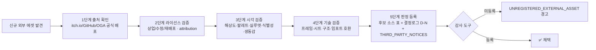

# 📦 자산 임포트 정책 (Asset Import Policy)

> [!note] 이 문서는?
> **L8 §8 분리 — 아트규칙 §6.1 '후보 소스' 표·외부 소싱 옵션·검토 절차 5단계를 별도 문서로 분리**한 자산 소싱 단일 소스입니다.
> 본 문서는 **후보 소스 · 채택 소스 · 라이선스 · 해상도 · 색상 정책 · 임포트 규칙 · 팔레트 정책 · 리사이즈 정책 ·
> 애니메이션 정책 · 검토 절차 5단계 · 결정로그 연계**를 모두 담습니다.
> **역참조:** [[아트규칙_2.5D#6.1 자산 임포트 정책 (유형별) — ★v3.14 신설|아트규칙 §6.1]] — 아트규칙은 자산 유형별 임포트 방식(영웅/몬스터/구조물)과 재구축 원칙 2의 명시적 예외를 유지하고, 소싱 결정은 본 문서를 참조합니다.

---

## 1. 채택 소스 (현재 사용 중)

| 소스 | 용도 | 해상도 | 라이선스 | 결정 |
|---|---|---|---|---|
| **LPC Universal** (Liberated Pixel Cup) | 영웅 파츠 모듈러 (무한 생성) + walk/slash/hurt 애니메이션 | 64×64 | CC-BY-SA 3.0 / GPL 3.0 / OGA-BY 3.0 (파츠별 — CREDITS.csv) | D-114/117/119/127/128 |
| **DCSS** (Dungeon Crawl Stone Soup) | 영웅/몬스터 폴백 ② (종족 13 · 몬스터 55) | 32×32 | **CC0 1.0** | D-06 |
| **Kenney Roguelike pack** | 배경 바닥 타일 3종 · 환경 오브젝트 10장 · 가구 12장 | 16×16 | **CC0 1.0** | D-115/116/118 |
| **0x72 DungeonTileset II** | 몬스터 29종 원본색 + idle/run/hit 애니 · 환경 소품(덫/분수/기둥/버섯) | 16×16 | **CC0 1.0** | D-120/121/125/126/128/131/132/137 |

> [!warning] copyleft 의무 (LPC)
> LPC 파츠에서 파생된 스프라이트는 **CC-BY-SA 3.0 또는 GPL 3.0으로 공개**해야 합니다 (선택 라이선스 — D-117 사용자 승인 2026-08-09).
> 게임 코드·배경·DCSS 캐릭터는 독립 자산이므로 공개 범위에서 제외. 실사용 파츠 목록은 `art/_source/lpc/CREDITS_src.json`에서 자동 집계.
> 💡 복수 라이선스 파츠는 **OGA-BY 3.0 선택 시 copyleft 없이 사용** 가능 — L3/L4에서 OGA-BY 파츠 한정 세트 검토 가능.

---

## 2. 채택 4종 라이선스 원문 대조 (L8 §5 — 2026-08-14 실측)

> [!note] 대조 절차
> 4개 소스 모두 itch.io/GitHub/OGA **공식 원문**을 실측·인용하고, 동봉 LICENSE/README 원문을 대조했다.
> 원문 대조일이 있는 행만 유효 — 미실측 소스는 도입 금지 (THIRD_PARTY_NOTICES 감사 `Original-text verification date` 필드).

| 항목 | LPC Universal | DCSS (Utumno) | Kenney Roguelike | 0x72 DungeonTileset II |
|---|---|---|---|---|
| **Source** | GitHub — LiberatedPixelCup/Universal-LPC-Spritesheet-Character-Generator | OpenGameArt — "Dungeon Crawl 32x32 tiles" | kenney.nl — Roguelike pack | itch.io — 0x72 |
| **Asset pack** | LPC 스프라이트시트 (파츠 분리 64×64) | Project Utumno 타일셋 (6,029 PNG) | Roguelike pack (1,700+ 타일) | 16x16 DungeonTileset II v1.3 (로컬) |
| **Original URL** | https://github.com/LiberatedPixelCup/Universal-LPC-Spritesheet-Character-Generator | https://opengameart.org/content/dungeon-crawl-32x32-tiles | https://kenney.nl/assets/roguelike-pack | https://0x72.itch.io/dungeontileset-ii |
| **License name** | CC-BY-SA 3.0 / GPL 3.0 / CC0 / CC-BY / OGA-BY (파츠별 복수) | **CC0 1.0** | **CC0 1.0** | **CC0 1.0 Universal** |
| **Original license text** | README "Licensing and Attribution (Credits)" — "Each piece of artwork distributed from this project is licensed under one or more of the following supported open license(s): CC0 / CC-BY-SA / CC-BY / OGA-BY / GPL" · "Must credit the authors... Must distribute any derivative artwork or modifications under CC-BY-SA 4.0 or later" / "GPL 3.0 or later" · 로컬 LICENSE = GPL 3.0 전문 | 로컬 LICENSE.txt 동봉 — CC0 전문 ("No Copyright — The person who associated a work with this document has dedicated the work to the Commons by waiving all of his or her rights...") | 로컬 License.txt 동봉 — "License (Creative Commons Zero, CC0) http://creativecommons.org/publicdomain/zero/1.0/" · "You may use these graphics in personal and commercial projects." | itch.io 공식 필드 **"Asset license: Creative Commons Zero v1.0 Universal"** (페이지 메타 실측) · 저자 본문 *"You can use this tileset for whatever you like (CC-0). Credit is not necessary..."* |
| **Attribution requirement** | **필수** (CC-BY-SA/CC-BY/OGA-BY/GPL — CREDITS.csv 배포 · CC0 파츠만 면제) | 불필요 (CC0) | 불필요 — "Credit (Kenney...) would be nice but is not mandatory" | 불필요 (CC0 — "Credit is not necessary") |
| **Commercial use** | ✅ Yes (파생물 라이선스 의무 — FAQ: "May I use this art in your commercial game? Yes, however you must follow all the terms") | ✅ Yes | ✅ Yes | ✅ Yes |
| **Modification** | ✅ Yes (파생물 공개 의무) | ✅ Yes | ✅ Yes | ✅ Yes |
| **Redistribution** | ✅ Yes (copyleft 조건부) | ✅ Yes | ✅ Yes | ✅ Yes |
| **Original-text verification date** | **2026-08-14** (GitHub README 실측 + 로컬 LICENSE 대조) | **2026-08-14** (로컬 LICENSE.txt 원문 대조) | **2026-08-14** (로컬 License.txt 원문 대조) | **2026-08-13/14** (itch.io 페이지 실측) |
| **Quoted evidence** | 위 원문 인용 · 로컬 `art/_source/lpc/LICENSE`(GPL 3.0 전문)·`CREDITS.csv` | 로컬 `art/_source/dcss_full/.../LICENSE.txt` (CC0 전문 + Human Readable) | 로컬 `art/_source/kenney_roguelike/License.txt` | itch.io 원문 · `art/_source/ox72/README.md` (수급 경로 기록) |
| **Internal decision** | ✅ 채택 — 영웅 파츠 (D-114/117/119/127/128) — 사용자 승인 (2026-08-09) | ✅ 채택 — 영웅/몬스터 폴백 (D-06) | ✅ 채택 — 타일/환경/가구 (D-115/116/118) | ✅ 채택 — 몬스터/환경 소품 (D-120~137) — 유지 재결정 (D-137/138) |
| **Reviewer** | LIMHAEJOON (사용자 승인) · Codebuff | LIMHAEJOON · Codebuff | LIMHAEJOON · Codebuff | LIMHAEJOON · Codebuff |

> [!note] CC0 크레딧
> CC0는 크레딧 표기를 요구하지 않지만, 원저작자 존중을 위해 출처 링크와 함께 크레딧을 유지합니다 (THIRD_PARTY_NOTICES.md).
> 상세 라이선스 원문: https://creativecommons.org/publicdomain/zero/1.0/

---

## 3. 후보 소스 (리서치 2026-08-12 — 전수 조사 현황 · ★L8 §8 분리 이관)

> [!example] 조사 배경 — 「캐릭터 이미지를 외부에서 가져올 수 있나?」 (사용자 질의 → 웹 리서치)
> 조사 시점 현재 채택: **LPC**(영웅 파츠 — D-114/117/119) · **DCSS**(영웅/몬스터 — D-06) · **Kenney**(바닥/환경/가구 — D-115/116/118) · **0x72**(몬스터 — D-120).
> 아래 표는 조사에서 확인한 **전체 후보** — 채택/보류/부적합 판정과 사유를 기록한다 (신규 에셋 검토 시 이 표를 기준으로 재사용).

| 소스 | 해상도 | 라이선스 | 영웅(파츠?) | 몬스터 | 판정 (2026-08-12) | 비고 |
|---|---|---|---|---|---|---|
| **LPC Universal** | **64×64** | CC-BY-SA 3.0 / GPL v3 (동의 완료) | ✅ **파츠 모듈러** (무한 생성 정합) | ✅ | ✅ **채택 — 영웅 파츠** (D-114 슬라이스 · D-117 합성 · **D-119 팔레트 파싱 → 원본색**) | 최고 해상도 + 유일한 파츠 시스템. **L1~L4·L8 완료** (D-128 애니메이션 풀 — walk/slash) · L7 CREDITS 후속 |
| **DCSS** | 32×32 | **CC0** | ✅ (완성형 1장 — 파츠 아님) | ✅ 55종 | ✅ **채택 — 영웅/몬스터 폴백 ②** (D-06 · D-120에서 29종만 0x72로 대체) | 라이선스 부담 0 · 범위 최대 — 유지(폴백 체인) |
| **Kenney Roguelike Characters** | 16×16 | **CC0** | 완성 스프라이트 450종 | ✅ | ⬜ **보류 — 해상도 16×16이 DCSS보다 낮음** (리서치 판정) | 캐릭터 전용 팩이지만 해상도 축에서 개선 여지 없음 — 같은 팩의 타일/환경은 이미 채택 (D-115/116/118) |
| **0x72 DungeonTileset II** | 16×16 | **CC0** (출처 표기 선택) | 완성 스프라이트 | ✅ 다수+애니메이션 | ✅ **채택 — 몬스터 29종 원본색** (**D-120**) | 던전 테마 — 몬스터 아트 정돈 · 326 프레임 보관 (`art/_source/ox72/`) · **★16×16이지만 원본색 렌더로 채택** (아래 발견 ② 해소) |
| **Mushroom Pixel Art Pack (OGA)** | **32×32** | **CC0** (크레딧 선택 — OGA 필드 실측) | ❌ (환경 전용) | ❌ | ⬜ **채택 → ★D-137 철회 (0x72 유지 재결정)** | **★실측 데이터 (2026-08-13 — 유일한 업그레이드 후보)**: 원본 32×32 · **바운딩 박스 18×19(Red)~26×25(Purple)px** (0x72 16×16 대비 **2배 해상도**) · 색군 **11~33개** · **3단 명암 + 하이라이트 + 아웃라인** (픽셀 분석 실측) · 파일 `mushroom_sprite_pack.zip` 14.3KB · **218회 다운로드** · OGA 라이선스 필드 **"License(s): CC0"** + 저자 *"Free to use... Credit appreciated but not required"* · **★D-123 채택(2026-08-13)** → **★D-137 철회(2026-08-14 — 0x72 유지 재결정)**: 환경 버섯 = 0x72 2종 + idle 숨쉬기 원복 (32×32 정적 대비 생동감 우위 · D-136 '0x72 유지' 판정의 환경 축 일관) · **소스·라이선스 보관 유지** (`art/_source/mushroom_pixel_art/` — CC0 재배포 허용 · THIRD_PARTY_NOTICES '사용 안 함' 표기) · **★재채택 후보 유지 — 용도 명시 (D-139)**: 계절/층별 갓 색 시스템 2축 설계(아트규칙 §4.6) — ①층 축(1~3 진홍·보라 · 5층 보스방 갈색 등 — 사용자 지정) ②계절 축(시즌 6주) — 6종 풀을 층별 선택 배치 (구현 경로 ① 재채택 vs ② 절차 팔레트 확장 — ⬜ 결정 후보) |
| **Ninja Adventure** (pixel-boy) | 16×16 | **CC0** | 완성 스프라이트 | ✅ | ⬜ **보류 — 테마 제약** (실측: 22종 중 **14종 테마 중립 · 8종 닌자 고정**) · **부분 활용 후보 (테마 중립 14종 · 애니메이션 참고 — L8)** | 아트 퀄리티 최상 — **★실측 (2026-08-13)**: itch.io 원문 **"released under the Creative Commons Zero (CC0)"** (크레딧 불필요) · GitHub 공식 미러(sparklinlabs)에서 **몬스터 22종** (16×16 · **4방향×4프레임 걷기**) · **테마 제약 실측**: 22종 중 **~40%(8종) = 사무라이/닌자 의상 실루엣**(갑옷·머리띠·칼) — 팔레트 틴트로 색을 바꿔도 실루엣이 일본 테마라 둔갑 불가 · **~64%(14종) = 테마 중립**(오크/슬라임/임프/골렘/토템/식물괴/설인/악마/새 — CC0라 틴트/팔레트 변형 자유) · ★전수 보정: '13종'은 추정치 — **색+실루엣 전수 실측 결과 14종 확정** (NA-03/04/06/07/09/11/12/13/14/16/17/18/21/22) · **0x72 유지 판정**(해상도 16×16 동일이지만 교체 수 22<29 · 대형 몬스터(오거 32×32·거인·구울) 표현 불가 · 테마 정합) — **실질 가치 = 애니메이션**: 4방향 걷기 프레임이 0x72 idle보다 풍부 → **L8 애니메이션 풀 착수 시 테마 중립 14종 걷기 프레임 참고 소스로 보류 유지** |
| **Cainos Top-Down Basic** | **32×32** | 상업 무료 (크레딧 불필요 · **재배포 금지**) | ❌ 데모 1종뿐 | ❌ | ⬜ **보류 — 환경/타일 위주** | 나무·잔디·돌 — D-116(Kenney 환경)과 중복 · **★실측(2026-08-13): 버섯 0개** — Props 48 + Plant 28 + Struct 22 이름 전수 + 붉은 픽셀 스캔(화분 꽃/배럴 장식/룬 글로우뿐 — ASCII 확인) · **재배포 금지 라이선스 → 소스 보관 불가**(Kenney/0x72 CC0과 달리 저장소에 팩 전체 복사 금지 — 사용 시 추출 스프라이트만) · **★L8 §3 고아 정리 (2026-08-14)**: D-124 추출 잔존 `env_pot_01/02`·`prop_grave_01~03`·`prop_well_01` **삭제** (SceneBuilder 미참조 실측 · 재배포 금지 팩 파생물 배포 리스크) |
| **Deepnight RPG Map 2** | 16×16 | 상업 무료 | ❌ 소수 | 일부 | ⬜ **보류 — 지도 제작용** | 맵 에디터 전제 — 본 게임은 실시간 전투 화면 |
| **Mage City Arcanos** (OGA) | 16×16 격자 (개체 32×32급) | **CC0** | ❌ | ❌ | ⬜ **후보 — 화분·우물** (Cainos 재배포 금지 대체 — **2026-08-14 실측**) | **★실측: 화분 ✅**(나무 화분+잎 · 돌 화분/urn+잎 · 통에 심은 나무 2종) · **우물 ✅**(원형 나무 통 + 파란 물 — r5-6c13-14 셀 갈색 링+파랑 중심 픽셀 검증) · **묘비 ❌**(전수 스캔 — 회색 세로 셀 15개 전부 벽/건축) · 시트 256×1450 · CC0 라이선스 필드 확인 — **Cainos(재배포 금지)와 달리 저장소 보관 가능** |
| **Zelda-like tilesets and sprites** (ArMM1998) | 16×16 | **CC0** (fort-of-chains 크레딧 파일 실측) | ❌ | ❌ | ⬜ **후보 — 화분** (Cainos 대체 — **2026-08-14 실측**) | **★실측: 클래식 갈색 화분 ✅**(objects r0c20-25 — 6종 · r4c0 화분+식물) · **묘비 ❌**(Overworld 후보 5셀 전부 나무/등불로 판정 — 픽셀 ASCII 확인) · 16×16 < 32×32(Cainos) — **해상도 하락** · LTTP 스타일 — 테마 정합 검토 필요 |
| **SpiderDave Tombstones** (OGA) | 16×48 | **CC0** (크레딧 선택) | ❌ | ❌ | ⬜ **후보 — 묘비 전용** (Cainos 대체 — **2026-08-14 실측**) | **★실측: 묘비 실루엣 1024종** (절차 생성 — 크기·픽셀 변형) · 시트 1024×768 · **단색(어두운 회색) 실루엣 → 흰 실루엣 + sr.color 틴트(아트규칙 D-17/120 파이프라인)로 색 입히면 즉시 사용 가능** · 16×48 세로형 — 2.5D 탑다운 묘비(발 기준)에 적합 · CC0 필드 확인 |
| **Anokolisa Pixel Crawler Free Pack** (사용자 제공) | 16×16 (탑다운) | **자유 사용 — 상업 무료** (Terms.txt 원문 대조 — D-169) | ❌ (탑다운 — 정면 LPC 대체 불가) | ❌ (몹 8종뿐 — DCSS 38종 커버 불가) | ⬜ **후보 — 스테이션·데코** (D-169 — 라이선스 통과 · 추가 후보 목록 확정) | **★실측 (D-169 — 2026-08-14)**: 몹 8종(Orc·Skeleton Crew × idle/run/death · 16×16 < DCSS 32×32 — 대체 불가) · 종족 탑다운(정면 LPC 대체 불가 — D-148 거부 전례) · **신규 추가 후보**: 스테이션(Workbench·Alchemy Table·Sawmill·Bonfire·Cooking — Kenney 탑다운 원근과 스타일 정합 · Bonfire 10프레임 불/연기 · Alchemy 3프레임 버블 — IdleAnimator 재생 가능) · 무기(Wood/Bone/Hands) · 프롭 가구·도구·던전 소품·팬(5프레임) · 출처 표기 불필요 · 팩 단독 판매 금지(게임 내 사용 무관) — `art/_source/anokolisa_pixel_crawler/` 보관 |
| **Quaternius Modular** | 3D 로우폴리 | CC0 | 파츠 모듈러 (3D) | ✅ | ❌ **부적합 — 2D 아님** | 3D 자산 — 2.5D 픽셀 파이프라인과 무관 |
| **Shattered Pixel Dungeon** | 16×16 | GPL | 완성 | ✅ | ❌ **부적합 — GPL** | 게임 전체 공개 필요 — 라이선스 충돌 |
| **LPC Revised** (DeathsDarling 외) | 32×32 (3/4 탑다운) | ⚠️ **OGA-BY 3.0 / CC-BY 3.0 — 표시 필수 (CC0 아님)** · `Credits.txt` 원문 대조 (2026-08-27 · D-178) | ✅ (32px 캐릭터 파츠 — Body/Hair/Clothing/Head) | ⚠️ 미검증 | ⬜ **후보 — 라이선스 등록만 완료 · 채택 미결** (D-178) | **★2026-08-27 실측**: 기채택 LPC(Universal LPC Generator)와 **별개 팩** — §2 항목으로 커버되지 않음. `Characters/`·`Terrain/`·`Objects/`·`Structure/`·`FX/`·`_ Palette/` 구성 · 약 170색 팔레트 · 시트별 `Credits.txt` 동봉. **`client_godot/`에 배포된 파생물 0건** — 채택 시 시트 단위 크레딧 표 신설 필요. `art/_source/lpc_revised/`(733MB · gitignore) 보관. ⚠️ 종전 `audit_external_assets.py`가 `internal`로 오분류해 라이선스 검사에서 누락되어 있었음 |
| **Flare: Empyrean Campaign** (Clint Bellanger 외) | 가변 (아바타 파츠·타일) | 🔴 **CC-BY-SA 3.0 — 표시 + 동일조건변경허락 (파생물에 전파)** · `LICENSE.txt`·`README.md` 원문 대조 (2026-08-27 · D-179) | ⚠️ 참고용 (비율·의상 실루엣) | ❌ | ⬜ **후보 — 라이선스 등록만 완료 · 채택 미결** (D-179) | **★2026-08-27 실측**: 아트·데이터 전체 CC-BY-SA 3.0(엔진은 GPL v3+ — 미사용). **ShareAlike이므로 게임에 넣으면 파생 아트도 CC-BY-SA 3.0 배포 의무 발생** — CC0 팩과 위험도가 근본적으로 다름. 현재 `scripts/art_pipeline/compare_hero_proportion*.py`·`compare_hero_style.py`의 **비율·스타일 비교 연구 전용**, `client_godot/`에 배포된 파생물 0건. `art/_source/flare_hero/`(317MB · gitignore) 보관. ⚠️ 종전 감사기가 `internal`로 오분류(주석은 "CC-BY-SA 소스"라고 적으면서 검사 면제) — 자기모순 상태였음 |

> [!note] ★리서치 핵심 발견 3건 (후속 결정의 근거)
> ① **고해상도 무료 팩의 희소성** — 퀄리티 좋은 무료 팩은 거의 다 16×16, 32×32 이상은 DCSS/LPC 외에 사실상 없음 → "더 예쁜 걸로 교체"는 해상도 축으로 개선 여지가 거의 없음.
> ② **★'못생김'의 진짜 원인 = 렌더링** — 기존 파이프라인이 **흰 실루엣 × 단일 틴트**(D-17 설계)로 색을 전부 지움 → 어떤 고퀄리티 팩을 가져와도 단색 실루엣으로 보임. → **해결: 원본색 렌더 전환** (D-119 영웅 팔레트 · D-120 몬스터 원본색 — 흰 트윈 스프라이트 스왑으로 히트 플래시 무결성 유지).
> ③ **몬스터 = 완성 스프라이트 정책상 OK** (아트규칙 §6.1) — 파츠 모듈러 제약이 없어 추가 도입 여지가 가장 큼 (후보: Ninja Adventure 등 테마 검토 시).
> - **판정 요약 (★D-138 재계산 — 대시보드 자동 집계와 정합)**: 채택 3 (LPC/DCSS/0x72 — 전부 사용 중 · Kenney는 캐릭터 팩 보류, 같은 팩 타일/환경은 D-115/116/118 채택) · 보류 8 (Kenney 캐릭터/Ninja/Cainos/Deepnight/**Mushroom 팩 — D-137 철회 후 후보** + **후보 3 — Mage City/Zelda-like/SpiderDave**) · 부적합 2 (Quaternius 3D · Shattered GPL).
> - **★0x72 유지 선택 (사용자 2026-08-13 · ★D-137 환경 축 확정 2026-08-14)**: 0x72(**몬스터 D-120 소스**)는 **교체 없이 유지** — 이번 조사에서 **32×32 Mushroom 팩이 유일한 업그레이드 후보**로 실측 확인(위 행 — 바운딩 박스 18×19~26×25px · 색군 11~33 · 3단 명암 수치) · 몬스터/캐릭터 교체 없음 · **환경 버섯도 D-137에서 0x72 유지 재결정** — D-123(32×32 팩 채택) 철회 · 0x72 버섯(D-121) + idle 숨쉬기(D-125) 원복 — **'0x72 유지'가 몬스터·환경 전 축 일관 적용** (Mushroom 팩은 재채택 후보로 보류 유지 — 계절/층별 색 시스템 등 6종 풀 활용 대비).
> - **★Ninja Adventure 실측 반영 (2026-08-13)**: itch.io 원문 CC0 확인 · GitHub 미러 **22종**(16×16 · 4방향×4프레임 걷기) · **테마 제약 실측 = 22종 중 8종만 닌자 고정(갑옷·머리띠·칼 — 둔갑 불가), 14종 테마 중립**(오크/슬라임/임프/골렘/토템/식물괴/설인/악마/새 — 틴트/팔레트 변형 자유) — ★전수 보정: 종수는 색+실루엣 전수 실측 기준 13→14종 · **실질 가치 = 애니메이션**(4방향 걷기 — 0x72 idle보다 풍부) → **판정: 보류 유지 + 부분 활용 후보(테마 중립 14종 · 애니메이션 참고 — L8 착수 시 참고 소스)** · 0x72 유지(교체 수 22<29 · 대형 몬스터 표현 불가 · 테마 정합).
> - **★Cainos 대체 CC0 조사 (2026-08-14)**: Cainos(재배포 금지 → 소스 보관 불가)의 화분·우물·묘비를 CC0로 대체할 팩 전수 조사. **결론 — 단일 팩으로 3종 전부 충족하는 CC0 팩은 없음**: ① **화분** = Mage City Arcanos(CC0 — 나무/돌 화분 2종 이상) 또는 **0x72 기존 채택분**(r0c4-8 붉은 화분+초록 — 추가 라이선스 0) ② **우물** = Mage City Arcanos(CC0 — 원형 나무 통+파란 물 · **유일한 CC0 우물 후보**) ③ **묘비** = SpiderDave Tombstones(CC0 — 1024종 실루엣 · **유일한 CC0 묘비 전용 소스** · 흰 실루엣+틴트 파이프라인으로 색 입힘). Cainos 자체는 기존 판정대로 **보류 유지**(버섯 0개 실측 등 — D-124 화분 3·우물·묘비 3은 소스 보관 불가로 **미적용 유지**).

---

## 4. 해상도 · 색상 · 임포트 · 팔레트 · 리사이즈 · 애니메이션 정책

### 4.1 해상도 정책 (L8 §10·§11 — 32×32 통일 지향)

| 대상 | 정책 | 비고 |
|---|---|---|
| 영웅 전투 스프라이트 | **64×64** (LPC 파츠) · PPU 32 | 아트규칙 §2.1 — 원본색 렌더 |
| 몬스터 | 32×32 (DCSS) / 16×16 (0x72 — **원본색 렌더로 채택**) | 0x72는 생동감(프레임) 축이 해상도 축을 상회 (D-137) |
| 환경 폴백 (절차 생성) | **32×32 + Outline K + 동일 픽셀 밀도** (버섯·나무·돌·관목 4종 — L8 §10) | `MakeRockTexture`/`MakeBushTexture`/`MakeMushroomTexture` — D-129 패턴 |
| Kenney 환경 PNG | 16×16 우선 로드 유지 — **32×32 업스케일은 시각 실측 후 판정** (L8 §11 — nearest-neighbor 품질이 나쁘면 유지) | 후보 소스로 등록 · 강제 업스케일 금지 |
| 배경 타일 | 16×16 (Kenney) | 시임리스 경계차 0 실측 |

### 4.2 색상/팔레트 정책

- **원본색 렌더 우선** (D-119/120 — 흰 실루엣 × 단일 틴트는 '못생김'의 원인, 리서치 발견 ②).
- 팔레트 스왑(색 인덱스) = 무한 변형 원리 (v7.11 §5.2) — 종족 틴트·위계 스케일로 체형 유사성 해소.
- 캐릭터당 최대 24색 (피부 4 + 머리 4 + 의복 12 + 부위 4) — 팔레트 공유로 스타일 통일 (아트규칙 §2.2).
- 버섯 갓 색 = **층 → 지역 테마 → 계절 → 변형률** 우선순위 (L8 §2.1 — D-139 설계: 1~3층 진홍·보라 · 중간층 자연 녹색/황색 · 고층 청색/암색 · 5층 보스방 갈색 — 단순 랜덤 금지).

### 4.3 임포트 규칙 (Unity)

- Texture Type: **Sprite (2D and UI)** / Compression: **ASTC 4×4** (모바일 빌드) / Mipmaps: **해제**
- Filter Mode: **Point (No Filter)** — 픽셀 아트 필수 (선형 보간으로 뭉개짐 방지)
- PPU: 영웅 32 · 몬스터 16(0x72)/32(DCSS) · 아이콘 32 · PPU = 높이/2 (원본색 2유닛 규격 — D-120)
- Pivot: 하단 중앙 (발 기준 — 2.5D 탑다운)
- atlas 패킹: 파츠·아이콘·이펙트는 Sprite Atlas로 묶어 드로우콜 1회 유지

### 4.4 리사이즈 정책

- **업스케일은 항상 실측 후 판정** — nearest-neighbor(픽셀 보존) 기준, 선명도가 나빠지면 원본 해상도 유지 (L8 §11).
- 절차 폴백 16×16 → 32×32 업그레이드 시 **2× 업스케일 + Outline K**(Lerp(본색, 흑, 0.6)) + 1px 디테일 — D-129 패턴.
- **텍스처 2배 → PPU 2배 — 월드 크기 동일** (크기 불변 원칙).

### 4.5 애니메이션 정책 (L8 §16·§21·§32)

- 정적 1장 < 프레임 순환/숨쉬기 — **생동감 축이 해상도 축보다 우선** (D-137 판정 축).
- 0x72 idle 4프레임 vs Ninja Adventure walk 4프레임 — 픽셀 단위 비교 후 채택 (L8 §21).
- DCSS 정적 26종 — 절차 걷기(`gen_monster_proc_walk.py`) + 트랜스폼 숨쉬기(D-135) 3단계 생동감 (L8 §26·§44).
- 환경 애니메이션 — `IdleAnimator`(프레임 순환) → `EnvAnimator` 통합(Frame Loop · Transform Shake · Scale Pulse · WindSway · Phase Offset) (L8 §32).
- 절차 애니메이션 파라미터는 **과한 랜덤 금지** — 결정적 위상(위치 기반 해시)로 씬 재생성 재현성 유지.

---

## 5. 신규 외부 에셋 검토 절차 5단계 (필수 — 재구축 원칙 2의 명시적 예외)

> [!example] 외부 자산 도입 시 반드시 아래 5단계를 거쳐 **본 문서 §3 후보 소스 표**에 판정을 등록한다 — **미등록 외부 에셋 도입 금지** (아트규칙 §6.1 경고 콜아웃 연동).

1. **출처 확인** — 원 출처 · itch.io/GitHub 등 공식 배포 페이지 · 실제 배포자 기록
2. **라이선스 검증** — 원문에서 상업 사용·수정·재배포·attribution 확인 — GPL(게임 전체 공개)·재배포 금지(소스 보관 불가 — 추출물만 커밋)면 제약을 즉시 기록 · **★애니메이션/생동감 축 포함**: 정적 1장 vs 프레임 순환/숨쉬기 보유 비교 (D-137 보강 — 32×32 정적이 16×16 애니메이션보다 반드시 우위가 아님)
3. **시각적 검증** — 픽셀 해상도 · 색상 팔레트 · 실루엣 · 몬스터 식별성 · 게임 설정(유럽 판타지 · 게이트키퍼)과 테마 정합 (예: Ninja Adventure 닌자 테마 고정 = 보류 판정)
4. **기술적 검증** — 프레임 수 · sprite sheet 구조 · 엔진 임포트 가능 여부 · 색상/알파 처리 · 32×32 파이프라인 호환 · **애니메이션 프레임 유무·품질 실측** (프리뷰는 `art/out/*_preview.html`)
5. **최종 판정 및 등록** — 채택/조건부 채택/후보 유지/보류/폐기 → 본 문서 §3 표 + **결정로그 D-N** + **THIRD_PARTY_NOTICES.md** 등록 (CC0만 소스 보관 · 재배포 금지는 추출물만)

> [!warning] 자동 감사 연동 (L8 §6·§7)
> - `python3 art/tools/audit_external_assets.py` — THIRD_PARTY_NOTICES 필드 누락 시 **`THIRD_PARTY_NOTICES_AUDIT_FAILED`** · `art/_source/` 미등록 팩 시 **`UNREGISTERED_EXTERNAL_ASSET`** 경고.
> - `python3 art/tools/audit_assets.py` — Resources/Art 고아 에셋 전수 감사 (삭제 가능/보존 필요/조사 필요).

---

## 6. 결정로그 연계

| 결정 | 내용 |
|---|---|
| D-06 | DCSS CC0 타일셋 채택 — 영웅 13종족 + 몬스터 55종 |
| D-114/117/119/127/128 | LPC 파츠 소싱·슬라이스·합성·원본색·애니메이션 풀 |
| D-115/116/118 | Kenney 타일/환경/가구 채택 |
| D-120~137 | 0x72 채택 · 버섯 idle · 소품 · hit 프레임 · 환경 버섯 유지 재결정 |
| D-124 | Cainos 화분·우물·묘비 — 재배포 금지로 미적용 |
| D-136 | Cainos 대체 CC0 후보 3종 (Mage City · Zelda-like · SpiderDave) |
| D-138 | 5단계 검토 절차 재점검 + 자동 집계 버그 수정 |
| D-139 | 버섯 갓 색 계절/층별 시스템 설계 |
| D-140+ | L8 §3 고아 정리 · §4 0x72 v1.7 검토 · §5 라이선스 대조 · §6 표준화 · §8 본 문서 분리 (본 세션) |

> [!tip] 적용 로드맵 (이관 유지 — 상세는 [[아트규칙_2.5D#6.1 자산 임포트 정책 (유형별) — ★v3.14 신설|아트규칙 §6.1]])
> ① 데모 눈맞춤: **CC0 완성 팩 드롭인** ✅ (DCSS 전면 — 플레이어블 종족 13/13 · 몬스터 55/55 검증) → ② **LPC 파츠** 64×64 파츠 모듈러 연동 ✅ (L6 — D-117) → ③ **원본색 전환** ✅ (L4 — D-119 · 런타임 D-127 · 애니메이션 풀 D-128).

---

## 🔗 관련 문서

| 문서 | 관계 |
|---|---|
| [[아트규칙_2.5D]] | 상위 규칙 — 자산 유형별 임포트 방식 · 재구축 원칙 2 예외 (역참조) |
| [[결정로그_DecisionLog]] | 소싱 판정 D-N 등록처 |
| [[GDD_홈]] | 문서 맵 — 자산 임포트 체크리스트(자동 생성) |
| `THIRD_PARTY_NOTICES.md` (저장소 루트) | 외부 에셋 라이선스 명세 (표준 필드 14종 — L8 §6) |
| `docs/GDD/_템플릿/외부_에셋_검토_기록.md` | 신규 에셋 검토 기록 템플릿 (L8 §9) |
