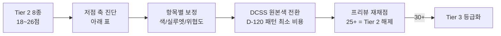

# 🔧 몬스터 보정 가이드 — Tier 2 (외형 보정)

> [!note] 이 문서는?
> **L8 §51 Tier 2(외형 보정) 8종** — 고블린 · 오크 · 코볼드 · 스켈레톤 · 오거 · 홉고블린 · 에틴 · 리자드맨의 **저점 축 분석 + 항목별 개선 가이드**입니다.
> 채점 기준: **D-145** (53번 점수표 7축 — 이름 인식 · 판타지 인식 · 실루엣 식별성 · 종족성 · 역할 인식 · 위협도 · 세계관 일관성, 각 /5 · 총 /35).
> **목표: 보정으로 25점 이상(부분 수정) 달성 → Tier 2 해제** — 기본 실루엣이 적합하므로 **교체가 아니라 보정** (§51 Tier 2 정의).
> 보정 실행 시 소싱/변환 절차는 [[ASSET_IMPORT_POLICY#5. 신규 외부 에셋 검토 절차 5단계 (필수 — 재구축 원칙 2의 명시적 예외)|ASSET_IMPORT_POLICY §5]] · [[몬스터_재설계_스펙_Tier1]] 참조.



---

## 1. 축별 점수 현황 (D-145 채점 원본)

| 몬스터 | 소스 | 이름 인식 | 판타지 | 실루엣 | 종족성 | 역할 | 위협도 | 세계관 | 총점 |
|---|---|---|---|---|---|---|---|---|---|
| **고블린** | 0x72 | 🟥 1 | 5 | 4 | 4 | 4 | 🟥 2 | 5 | 25 |
| **오크** | 0x72 | 🟥 2 | 5 | 4 | 4 | 4 | 🟥 2 | 5 | 26 |
| **코볼드** | 0x72 | 🟥 2 | 4 | 🟥 2 | 🟥 2 | 🟥 2 | 🟥 2 | 4 | 18 |
| **스켈레톤** | 0x72 | 3 | 3 | 🟥 2 | 3 | 🟥 2 | 🟥 1 | 4 | 18 |
| **오거** | 0x72 | 🟥 2 | 🟥 2 | 🟥 2 | 4 | 4 | 🟥 2 | 4 | 20 |
| **홉고블린 ★전환** | 0x72 | 🟥 2 | 🟥 2 | 4 | 3 | 4 | 🟥 2 | 4 | 21 |
| **에틴 (쌍두오거)** | DCSS | 4 | 4 | 4 | 4 | 3 | 3 | 🟥 1 | 23 |
| **리자드맨** | 0x72 | 4 | 4 | 4 | 4 | 3 | 🟥 1 | 4 | 24 |

> 🟥 = 저점 축 (보정 대상). **공통 패턴 2가지**:
> ① **위협도 저점 7/8종** — 0x72 16×16 프레임이 작고 단순해서 위압감이 안 섬 (1~2점).
> ② **이름 인식·실루엣 저점 6/8종** — 0x72 프레임이 RPG 관용 실루엣(고블린/오크/코볼드/오거)과 구분이 안 됨.
> 예외: **에틴**은 유일하게 세계관 일관성만 저점(DCSS 타일이 0x72 옆에서 톤 불일치) · **리자드맨**은 위협도만 저점.

---

## 2. 공통 보정 원칙

1. **교체 금지 — 보정만**: 기본 실루엣(4점)은 유지하고 저점 축만 올린다 (§51 Tier 2 = 외형 보정).
2. **최소 비용 = DCSS 원본색 전환**: 7/8종이 0x72인데, 같은 몬스터의 **DCSS 32×32 원본 타일이 이미 팩에 존재** — `LoadColorSprite`(D-120 패턴)로 전환하면 해상도·명암이 한 번에 개선 (흰 실루엣 × 틴트에서 원본색으로).
3. **위협도 = 덩치 + 무기 + 자세**: 작은 16×16에서 위압감은 **자세·무기 실루엣**이 결정 — 몽둥이/검/도끼를 명시.
4. **색 보정은 팔레트로**: 원본색 유지하면서 위계 틴트만 조정 (T1 진홍 고정이 아니라 몬스터별 보정색).
5. **세계관 = 톤 정합**: 에틴(DCSS)처럼 유일한 이질 소스는 팔레트 톤(채도/명도)을 0x72 16×16과 맞춤.

---

## 3. 몬스터별 개선 가이드

### 3.1 고블린 (25/35 → 목표 30+)

| 항목 | 현재 | 보정하면 | 실행 방법 |
|---|---|---|---|
| **이름 인식** 1 | 0x72 고블린 프레임이 "작고 못생긴 인간형" 전형에서 벗어남 | 4+ | **DCSS goblin_new 원본색 전환** — 초록 피부 + 뾰족 귀 + 어금니가 전형적 고블린 실루엣 (이미 팩 보유 · 최소 비용) |
| **위협도** 2 | 작고 단순해서 위압감 없음 | 4 | 몽둥이/단검 무기 실루엣 명시 + 공격 자세 프레임 선택 |
| (판타지 5 · 실루엣 4 · 종족성 4 · 역할 4 · 세계관 5) | — | — | 유지 |

> **예상**: 1→4 (+3) · 2→4 (+2) = **30점 (유지)** — Tier 2 해제 → Tier 3 등급.

### 3.2 오크 (26/35 → 목표 30+)

| 항목 | 현재 | 보정하면 | 실행 방법 |
|---|---|---|---|
| **이름 인식** 2 | 0x72 오크가 고블린과 실루엣 구분이 약함 | 4+ | **DCSS orc_new 원본색 전환** — 근육질 + 큰 어금니 + 전사 무장 (고블린보다 큰 덩치 실루엣) |
| **위협도** 2 | 고블린과 비슷한 크기감 | 4 | 도끼/철퇴 + 갑옷 숄더 실루엣 + 보폭 큰 자세 |

> **예상**: 2→4 (+2) · 2→4 (+2) = **30점 (유지)** — Tier 2 해제.

### 3.3 코볼드 (18/35 → 목표 25+)

| 항목 | 현재 | 보정하면 | 실행 방법 |
|---|---|---|---|
| **이름 인식** 2 | "개/도마뱀 인간형" 전형 실루엣이 없음 | 4 | **DCSS kobold_new 원본색 전환** — 뾰족 귀 + 긴 주둥이 + 꼬리 (개 코볼드 전형) |
| **실루엣 식별성** 2 | 고블린과 구분 안 됨 | 4 | 꼬리 + 긴 주둥이를 실루엣에 명시 (고블린 = 둥근 귀, 코볼드 = 뾰족 귀+꼬리) |
| **종족성** 2 | 종족 특징 없음 | 4 | 개코/비늘 피부 표현 (DCSS 타일) |
| **역할 인식** 2 | 무기/자세 단서 없음 | 4 | 곡괭이/단검 + 구부정한 자세 (작은 몬스터의 도구 사용) |
| **위협도** 2 | 가장 작은 몬스터 | 3 | 이빨 노출 + 공격 자세 (그래도 T1 최약체는 유지 — 위협도 3 목표) |

> **예상**: 2→4 ×4 (+8) · 2→3 (+1) = **27점 (부분 수정)** — Tier 2 해제.

### 3.4 스켈레톤 (18/35 → 목표 25+)

| 항목 | 현재 | 보정하면 | 실행 방법 |
|---|---|---|---|
| **위협도** 1 | 해골인데 위압감이 전혀 없음 (가장 시급) | 4 | **검/방패 무장 + 전투 자세** — "걸어오는 해골 병사" 실루엣 (DCSS skeleton 타일 + 무기) |
| **역할 인식** 2 | 무기/갑옷 단서 없음 | 4 | 무기(검/도끼) + 조각난 갑옷 표현 |
| **실루엣 식별성** 2 | 해골 실루엣(늑골+두개골)이 작아서 안 보임 | 4 | DCSS 32×32 원본색 — 늑골/두개골 명암이 16×16보다 선명 |

> **예상**: 1→4 (+3) · 2→4 (+2) · 2→4 (+2) = **25점 (부분 수정)** — Tier 2 해제.

### 3.5 오거 (20/35 → 목표 25+)

| 항목 | 현재 | 보정하면 | 실행 방법 |
|---|---|---|---|
| **이름 인식** 2 | "크고 뚱뚱한 인간형 + 곤봉" 전형이 안 보임 | 4 | **DCSS ogre_new 원본색 전환** — 큰 배 + 곤봉 + 뭉툭한 얼굴 (오거 전형 실루엣) |
| **판타지 인식** 2 | RPG 관용 오거와 다름 | 4 | 전형적 오거 색(회녹 피부) + 곤봉 무기 |
| **실루엣 식별성** 2 | 트롤/오크와 구분 안 됨 | 4 | **곤봉 + 둥근 배** 실루엣 — 트롤(마른 장신)과 대비 |
| **위협도** 2 | 덩치가 살지 않음 | 4 | 양손 곤봉 + 큰 체구 비율 (DCSS 32×32가 16×16보다 덩치 표현 우월) |

> **예상**: 2→4 ×4 (+8) = **28점 (부분 수정)** — Tier 2 해제.

### 3.6 홉고블린 (21/35 → 목표 25+)

| 항목 | 현재 | 보정하면 | 실행 방법 |
|---|---|---|---|
| **이름 인식** 2 | 고블린과 구분이 안 됨 (홉고블린 = 상위 고블린) | 4 | **DCSS hobgoblin_new 원본색 전환** — 고블린보다 큰 덩치 + 갑옷/무기 (정예 고블린 실루엣) |
| **판타지 인식** 2 | RPG 관용 홉고블린(큰 고블린 + 전사)과 다름 | 4 | 붉은 피부(홉고블린 전통색) + 전사 무장 |
| **위협도** 2 | 고블린과 같은 크기감 | 4 | 갑옷 + 도끼/검 + 위협적 자세 |

> **예상**: 2→4 ×3 (+6) = **27점 (부분 수정)** — Tier 2 해제.

### 3.7 에틴 (쌍두오거) (23/35 → 목표 25+)

| 항목 | 현재 | 보정하면 | 실행 방법 |
|---|---|---|---|
| **세계관 일관성** 1 | DCSS 타일이 0x72 16×16과 톤 불일치 (유일한 이질 소스) | 4 | **팔레트 톤 보정** — DCSS 32×32를 흰 실루엣×틴트 파이프라인(D-120 흰 트윈)으로 통일하거나, 0x72 오거 프레임 2개 병치로 재합성 |
| **역할 인식** 3 | 쌍두(두 머리)가 역할에 안 쓰임 | 4 | 두 머리에 각각 무기(철퇴+도끼) — "두 머리가 각자 싸운다" 역할 표현 |
| **위협도** 3 | 쌍두오거인데 위압감이 평범 | 4 | 양손 각각 무기 + 큰 체구 |

> **예상**: 1→4 (+3) · 3→4 (+1) · 3→4 (+1) = **28점 (부분 수정)** — Tier 2 해제.

### 3.8 리자드맨 (24/35 → 목표 25+)

| 항목 | 현재 | 보정하면 | 실행 방법 |
|---|---|---|---|
| **위협도** 1 | 비늘이 있어도 위압감 없음 (가장 시급) | 4 | **공격 자세 + 무기(도끼/창) + 이빨 노출** — DCSS giant_lizard → 리자드맨 전용 실루엣 변형 |
| **역할 인식** 3 | 역할 단서 약함 | 4 | 무기(창/도끼) + 비늘 갑옷 표현 (근접 전사) |

> **예상**: 1→4 (+3) · 3→4 (+1) = **28점 (부분 수정)** — Tier 2 해제.

---

## 4. 보정 우선순위 요약

| 순서 | 몬스터 | 현재 | 목표 | 보정 핵심 | 예상 비용 |
|---|---|---|---|---|---|
| 1 | **고블린** | 25 | 30 | DCSS 원본색 전환 (이름+위협) | 최소 (팩 보유) |
| 2 | **오크** | 26 | 30 | DCSS 원본색 전환 (이름+위협) | 최소 (팩 보유) |
| 3 | **에틴** | 23 | 28 | 톤 보정 + 쌍두 무기 | 최소 (팔레트만) |
| 4 | **리자드맨** | 24 | 28 | 무기/자세 + 위협 | 중간 (실루엣 변형) |
| 5 | **코볼드** | 18 | 27 | DCSS 전환 + 꼬리 실루엣 | 중간 (전환+보정) |
| 6 | **오거** | 20 | 28 | DCSS 전환 + 곤봉/배 | 중간 (전환+보정) |
| 7 | **홉고블린** | 21 | 27 | DCSS 전환 + 정예 무장 | 중간 (전환+보정) |
| 8 | **스켈레톤** | 18 | 25 | 무기 무장 + DCSS | 중간 (전환+보정) |

> **공통 실행 경로**: `gen_ox72_monsters.py` 패턴을 따라 DCSS 원본색 타일을 `mon_<slug>.png`로 교체 (D-120 LoadColorSprite) → `scoring_preview.html` 재생성 → 재채점 (D-145 도구 `classify_l8_scoring.py` 재실행).

---

## 5. 재채점 검증 절차 (2026-08-14 — 실행 완료 8종 전수)

**보정 8종 전수 완료** (DCSS 원본색 32×32 — `art/gen_dcss_color_monsters.py`): 고블린·오크·코볼드·오거·홉고블린·스켈레톤·에틴(쌍두 타일)·리자드맨. `mon_<slug>.png` 교체 · 0x72 애니 프레임 삭제(정적+숨쉬기 전환) · SceneBuilder `DcssColorMonsterIds` 8종 · 채점 프리뷰 소스 분류 `dcss_color` 반영 · Unity batchmode 검증 완료.

### 5.1 예상 점수 → 검증 기준

| 몬스터 | 기존 (D-145) | 예상 (가이드 §3) | 상향 축 기대 |
|---|---|---|---|
| 고블린 | 25 | **30** | 이름 인식 ≥4 · 위협도 ≥4 |
| 오크 | 26 | **30** | 이름 인식 ≥4 · 위협도 ≥4 |
| 에틴 | 23 | **28** | 세계관 일관성 ≥4 · 역할 인식 ≥4 · 위협도 ≥4 |
| 리자드맨 | 24 | **28** | 위협도 ≥4 · 역할 인식 ≥4 |
| 코볼드 | 18 | **27** | 이름/실루엣/종족/역할 ≥4 · 위협도 ≥3 |
| 오거 | 20 | **28** | 이름/판타지/실루엣/위협 ≥4 |
| 홉고블린 | 21 | **27** | 이름/판타지/위협 ≥4 |
| 스켈레톤 | 18 | **25** | 위협/역할/실루엣 ≥4 |

### 5.2 검증 절차 (4단계)

1. **재채점** — 프리뷰(`art/out/scoring_preview.html`)에서 Tier 2 8종 카드의 7축을 새 모습 기준으로 다시 채점 (보정 전 점수는 localStorage에 남아 있으니 **각 카드의 입력칸을 새 점수로 덮어쓰기**).
2. **내보내기** — 상단 **⬇️ JSON 내보내기** → `l8_scoring.json` 다운로드 → 프로젝트 루트로 이동.
3. **자동 검증** —
   ```bash
   python3 art/verify_tier2_rescore.py <l8_scoring.json 경로>
   ```
   → 몬스터별 ① 목표 총점 ② Tier 2 해제(≥25) ③ 축별 기대값 ④ 회귀 방지를 대조 · `art/out/tier2_rescore_report.md` 생성 · **exit 0 = 8종 전수 목표 달성**.
4. **확정** — 전수 통과 시 판정 갱신 (유지 30+ · 부분 수정 25~29) → Tier 2 해제 → 결정로그 등록. 미달 종은 축별 상세를 보고 보정 항목 재검토.

> **도구 검증 (2026-08-14)**: 원본 D-145 점수로 실행 → **0/8 미달** (exit 1 — 보정 전에는 당연히 미달) · 가이드 예상 점수 모의 입력 → **8/8 통과 · 축 24/24** (exit 0).

---

## 🔗 관련 문서

| 문서 | 관계 |
|---|---|
| [[몬스터_재설계_스펙_Tier1]] | Tier 1 스펙 (교체 대상) — 본 문서는 Tier 2 보정 |
| [[ASSET_IMPORT_POLICY]] | 소싱 절차 5단계 · 라이선스 (DCSS CC0 — 전환 시 라이선스 부담 0) |
| [[아트규칙_2.5D]] | 렌더 규칙 (원본색 · 흰 실루엣 × 틴트 · D-120 패턴) |
| [[종족몬스터사전_Bestiary]] | 몬스터 데이터 · DCSS 타일 매핑 (55종) |
| [[결정로그_DecisionLog]] | D-145 (채점) · D-147 (본 가이드) |
