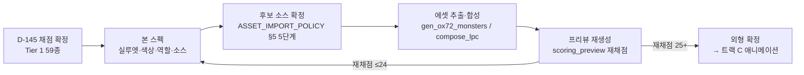

# 🎨 몬스터·종족 재설계 스펙 — Tier 1 (전면 교체)

> [!note] 이 문서는?
> **L8 §51 Tier 1(즉시 재설계) 59종 — 몬스터 46종 + 종족 13종**의 재설계 스펙입니다.
> 채점 기준: **D-145** (53번 점수표 7축 — 이름 인식 · 판타지 인식 · 실루엣 식별성 · 종족성 · 역할 인식 · 위협도 · 세계관 일관성, 각 /5 · 총 /35).
> **판정: 전면 교체(≤17) = Tier 1 — 보스/T5 ⭐ 우선.**
> 스펙의 각 항목(실루엣 · 색상 · 역할 표현 · 후보 소스)은 **외부 에셋 검토 절차 5단계([[ASSET_IMPORT_POLICY#5. 신규 외부 에셋 검토 절차 5단계 (필수 — 재구축 원칙 2의 명시적 예외)|ASSET_IMPORT_POLICY §5]])의 1~2단계 입력**입니다 — 소싱 확정 전 라이선스 원문 대조·판정 등록 필수.

**재설계 실행 흐름 (작업지시서 §54 순서):**

**재설계 공통 원칙 (모든 항목 적용 — §50.1 A~G):**
- **이름 인식**: 그림만 보고 이름이 떠오르는 전형적 실루엣
- **판타지 인식**: RPG 공용 관용 표현(관용 실루엣·색 관례) 준수
- **실루엣**: 16×16~32×32에서도 구분되는 외곽선 (색 의존 금지)
- **종족성**: 종족 고유 형질(귀/어금니/비늘/해골 등)을 실루엣에 포함
- **역할 표현**: 무기/복장/자세로 역할(탱커·마법사·근접·원거리·보스) 암시
- **위협도**: 덩치·무기·자세로 위압감
- **세계관 일관성**: 팔레트/아웃라인/픽셀 크기가 기존 소스(0x72 16×16 · DCSS 32×32)와 조화

---

## 1. 몬스터 Tier 1 — 46종 재설계 스펙

> 표기: **소스** = 현재 사용 중 (0x72 / DCSS) · **총점** = D-145 채점 · **우선순위** = ⭐보스/T5 · ★전환 = 플레이어블 제외→몬스터 전환 (D-06)
> **후보 소스 약어**: DCSS = 기존 팩 55종 타일 (CC0) · 0x72 v1.7 = 업그레이드 보류분 (CC0 — D-140) · NA = Ninja Adventure (CC0 — 테마 중립 14종) · Kenney Ch = Kenney Roguelike Characters (CC0 — 450종) · 절차 = 기존 절차 생성 파이프라인 (흰 실루엣+틴트)

> [!note] ★실행 현황 (2026-08-14 · PROMPT 1 Phase 4)
> **D-152로 §1.2 언데드 9 · §1.3 용족 7 · §1.4 신화 7 · §1.5 정령 7 = 30종 전환이 실행 완료** (DCSS 원본색 · `gen_dcss_color_monsters.py` MAPPING 38종) — 재채점 게이트는 `art/verify_tier1_rescore.py` (총점 ≥25 + 실루엣/위협도/세계관 ≥3)로 자동 판정.
> **잔여 16종 (실행 대기)**: §1.1 인류형 8 + §1.6 외계 8 — 우선순위 재정리는 §4 참조.

### 1.1 인류형 (8종)

| 몬스터 | 소스 | 총점 | 목표 실루엣 | 목표 색상 | 역할 표현 | 후보 소스 |
|---|---|---|---|---|---|---|
| **스톰 자이언트** ⭐ | 0x72 | 7/35 | 0x72 거인 프레임이 구분 불가 → **전신 번개 오라 + 양손 도끼**로 실루엣 확대 (T5 보스급) | 청회색 피부 + 번개 노랑 포인트 | 근접 딜러 + 광역 (번개) | DCSS stone_giant · 0x72 v1.7 dwarfs 참고 · 절차 (번개 오라 파츠) |
| **파이어 자이언트** | 0x72 | 7/35 | 화염 머리카락 + 큰 철퇴 — 거인 4종 실루엣 분화 | 붉은 피부 + 오렌지 화염 | 근접 딜러 (화염) | DCSS fire_giant_new |
| **프로스트 자이언트** | 0x72 | 7/35 | 서리 수염 + 얼음 도끼 — 거인 4종 실루엣 분화 | 시안 피부 + 백색 얼음 | 근접 탱커 (빙결) | DCSS frost_giant_new |
| **힐 자이언트** | 0x72 | 7/35 | 맨손 곤봉 + 거친 털 — 거인 4종 중 가장 투박 | 갈색 피부 + 어두운 털 | 근접 탱커 (물리) | DCSS hill_giant_new |
| **사이클롭스** | 0x72 | 7/35 | **외눈**을 실루엣에 명시 (얼굴 중앙 눈 + 측면 프로필) | 자주색/보라 피부 | 근접 딜러 | DCSS cyclops_new |
| **인어족 ★전환** | DCSS | 7/35 | 반인반어 — **물고기 꼬리 + 비늘 팔**을 실루엣에 | 청록 비늘 + 물 파랑 | 원거리/마법 (물) | DCSS merfolk_male (꼬리 강조 크롭) |
| **버그베어 ★전환** | 0x72 | 11/35 | 곰 같은 체구 + 큰 발톱 — **오거와 구분되는 곰 실루엣** | 갈색 털 + 어두운 발톱 | 근접 탱커 | NA (곰 계열) · DCSS ogre 변형 |
| **티플링 ★전환** | 0x72 | 15/35 | **뿔 + 꼬리**를 실루엣에 (사람과 구분) | 붉은/자주 피부 + 뿔 포인트 | 마법사/근접 혼합 | DCSS demonspawn_red_male |

### 1.2 언데드 (9종)

| 몬스터 | 소스 | 총점 | 목표 실루엣 | 목표 색상 | 역할 표현 | 후보 소스 |
|---|---|---|---|---|---|---|
| **리치** ⭐ | 0x72 | 9/35 | **해골 + 왕관 + 지팡이 + 로브** — 언데드 마법사 전형 | 뼈 흰색 + 암녹/보라 로브 | 마법 딜러 (T5) | DCSS lich · NA (임프류 참고) |
| **본 드래곤** ⭐ | DCSS | 7/35 | **해골 용** — 드래곤 실루엣 + 뼈 외곽 | 뼈 흰색 + 어두운 균열 | 보스 (근접+마법) | DCSS bone_dragon_new (원본색 전환) |
| **뱀파이어 ★전환** ⭐ | 0x72 | 13/35 | **날개 달린 망토 + 송곳니 + 창백한 얼굴** — 뱀파이어 전형 | 창백 피부 + 진홍 망토 | 암살자/근접 (T3~T5) | DCSS vampire_mage_new |
| **미라** | DCSS | 7/35 | **붕대 감긴 몸 + 왕관/장신구** — 미라 전형 | 황갈색 붕대 + 금 장신구 | 근접 탱커 (저주) | DCSS mummy (붕대 강조) |
| **듀라한** | DCSS | 7/35 | **투구 없는 갑옷 + 목 없음(머리 없음)** — 머리 없는 기사 | 어두운 철갑 + 푸른 영혼불 | 근접 탱커 | DCSS skeletal_warrior_old |
| **유령/렌시/스펙터** | 0x72 | 9/35 | **반투명 흐름 + 긴 옷자락** — 영체 실루엣 (발 없음) | 반투명 백색/청록 | 마법 딜러 (영혼) | DCSS ghost_new |
| **리버넌트** | 0x72 | 8/35 | **복수귀 — 칼 + 검은 로브 + 붉은 눈** | 검은 로브 + 붉은 포인트 | 암살자 | DCSS revenant |
| **좀비** | 0x72 | 10/35 | **팔 뻗은 자세 + 부패한 옷** — 좀비 전형 | 녹색 피부 + 갈색 옷 | 근접 (물리) | DCSS zombie_small |
| **구울** | 0x72 | 10/35 | **구부정한 자세 + 긴 손톱** — 좀비와 구분 | 회녹 피부 | 근접 (물리) | DCSS ghoul |

### 1.3 용족 (7종)

| 몬스터 | 소스 | 총점 | 목표 실루엣 | 목표 색상 | 역할 표현 | 후보 소스 |
|---|---|---|---|---|---|---|
| **드래곤** ⭐ | DCSS | 7/35 | **큰 날개 + 긴 목 + 꼬리** — 드래곤 전형 실루엣 | 비늘 색 + 배 아랫배 | 보스 (마법+근접) | DCSS dragon (원본색 전환) |
| **와이번** | DCSS | 6/35 | **두 발 + 날개 (앞다리 없음)** — 드래곤과 구분 | 초록/청록 비늘 | 근접 딜러 | DCSS wyvern_new |
| **드레이크** | DCSS | 6/35 | **작은 용 — 네 발 + 짧은 날개** | 붉은 비늘 | 근접 (화염) | DCSS death_drake |
| **히드라** | DCSS | 7/35 | **머리 여러 개** — 머리 수를 실루엣에 명시 (5개) | 녹색 비늘 | 근접+마법 (독) | DCSS hydra_5_new |
| **바실리스크** | DCSS | 6/35 | **도마뱀 + 돌 꼬리/몸** — 석화 능력 암시 | 회색 (석화) + 녹색 | 근접 (석화) | DCSS basilisk |
| **야안티 ★전환** | DCSS | 6/35 | **반인반사 — 뱀 하체 + 팔** | 비늘 + 독 녹색 | 근접/마법 (독) | DCSS naga_male |
| **드래곤본 ★전환** | 0x72 | 9/35 | **비늘 피부 + 뿔 + 용 꼬리** — 드래곤 혈통 명시 | 비늘 색 (붉은/청색) | 근접 탱커 | DCSS draconian_male |

### 1.4 신화 (7종)

| 몬스터 | 소스 | 총점 | 목표 실루엣 | 목표 색상 | 역할 표현 | 후보 소스 |
|---|---|---|---|---|---|---|
| **키메라** | DCSS | 7/35 | **사자 머리 + 염소 몸 + 뱀 꼬리** — 복합 괴물 실루엣 | 갈색 + 초록 | 근접 딜러 | DCSS abomination_large |
| **그리폰** | DCSS | 7/35 | **독수리 머리/날개 + 사자 몸** | 금색 + 갈색 | 근접 딜러 | DCSS griffon |
| **미노타우로스** | DCSS | 7/35 | **황소 머리 + 인간 몸 + 도끼** | 붉은 갈색 털 | 근접 탱커 | DCSS minotaur |
| **켄타우로스** | DCSS | 6/35 | **반인반마 — 말 하체 + 활** | 갈색 말 + 인간 상체 | 원거리 딜러 | DCSS centaur |
| **하피** | DCSS | 7/35 | **새 몸 + 여성 머리 + 큰 날개** | 회갈색 깃털 | 원거리 딜러 | DCSS harpy |
| **세이렌** | DCSS | 6/35 | **인어 + 새 — 물/노래 마법사 실루엣** | 청록 + 금색 | 마법 딜러 (노래) | DCSS siren_new |
| **스핑크스** | DCSS | 7/35 | **사자 몸 + 인간 머리 + 날개** | 사막 금색 | 마법 딜러 (수수께끼) | DCSS sphinx_new |

### 1.5 정령 (7종)

| 몬스터 | 소스 | 총점 | 목표 실루엣 | 목표 색상 | 역할 표현 | 후보 소스 |
|---|---|---|---|---|---|---|
| **공기 정령** | DCSS | 7/35 | **소용돌이 + 반투명 몸** — 바람의 흐름 실루엣 | 하늘색 반투명 | 마법 딜러 (바람) | DCSS air_elemental_new |
| **물 정령** | DCSS | 7/35 | **물 기둥 + 물방울 손** | 파란 물결 | 마법 딜러 (물) | DCSS water_elemental_new |
| **대지 정령** | 0x72 | 9/35 | **바위 덩어리 + 돌 팔** — 흙/돌 결 | 갈색 + 회색 | 근접 탱커 | DCSS earth_elemental |
| **화염 정령** | DCSS | 8/35 | **불꽃 + 불타는 눈** | 주황/붉은 불꽃 | 마법 딜러 (화염) | DCSS fire_elemental_new |
| **골렘** | 0x72 | 9/35 | **토기/점토 몸 + 무거운 보폭** — 골렘 전형 | 갈색 점토 | 근접 탱커 | DCSS clay_golem |
| **가고일** | DCSS | 7/35 | **석상 — 날개 달린 조각상 자세** | 회색 돌 | 근접 탱커 (비행) | DCSS gargoyle |
| **미믹** | DCSS | 7/35 | **상자 + 이빨/혀** — 미믹 전형 | 갈색 나무 + 붉은 입 | 암살자 (매복) | DCSS misc_box |

### 1.6 외계 (8종)

| 몬스터 | 소스 | 총점 | 목표 실루엣 | 목표 색상 | 역할 표현 | 후보 소스 |
|---|---|---|---|---|---|---|
| **비홀더** ⭐ | DCSS | 7/35 | **큰 눈 + 촉수 여러 개** — 비홀더 전형 | 보라 몸 + 붉은 눈 | 마법 딜러 (T4) | DCSS great_orb_of_eyes |
| **마인드 플레이어 ★전환** ⭐ | 0x72 | 9/35 | **두족류 머리 + 촉수 수염 + 로브** | 보라/분홍 | 마법 딜러 (정신) | DCSS giant_orange_brain |
| **슬라임** | 0x72 | 7/35 | **반투명 젤리 + 눈** — 슬라임 전형 | 녹색/파란 젤리 | 근접 (물리) | 0x72 유지 + 색 틴트 |
| **웨어울프** | DCSS | 7/35 | **두 발 늑대인간 — 털 + 송곳니** | 회갈색 털 | 근접 딜러 | DCSS wolf (인간형 변형) |
| **도펠갱어 ★전환** | DCSS | 7/35 | **형태 변환자 — 흐릿한 외곽 + 흉내내는 자세** | 회색/무채색 | 암살자 (변신) | DCSS shapeshifter |
| **라이칸슬로프 ★전환** | DCSS | 7/35 | **웨어울프와 구분 — 완전한 늑대형** | 어두운 털 | 근접 딜러 | DCSS wolf |
| **기스양키 ★전환** ⭐ | 0x72 | 9/35 | **갑옷 + 칼 + 뾰족 귀** — 전사 종족 | 은회색 갑옷 | 근접 탱커 (T5) | DCSS demonspawn 변형 |
| **아아시마르 ★전환** ⭐ | 0x72 | 9/35 | **날개 + 후광 + 금빛** — 천사형 종족 | 금색/흰색 | 마법 딜러 (빛, T5) | DCSS angel_new |

---

## 2. 종족 Tier 1 — 13종 재설계 스펙

> 채점: **종족 13종 전수 전면 교체 (7/35)** — LPC 원본색(`race_lpc_color_*`)이 이름·종족성·역할에서 전부 1점.
> **재설계 방향: LPC 파츠 재합성으로 종족 고유 형질(귀/머리/피부/체형)을 실루엣에 강화** — 파츠 교체는 LPC 파츠 파이프라인(D-117/119/127/128) 내에서 가능. 후보 소스 = LPC 파츠 재조합 + DCSS 원본색 참고.
> ⭐ = 파티 자주 노출 — 우선순위.

| 종족 | 계열 | 목표 실루엣 (현재 결함 → 목표) | 목표 색상 | 역할 표현 | 후보 소스 |
|---|---|---|---|---|---|
| **인간** ⭐ | 인간 | 범용 — 현재 LPC 기본형이 '이름 인식 1' → **전형적 인간형 (마법사/전사 변형 파츠)** | 밝은 피부 + 로브/갑옷 | 힐러/전사 (파티 핵심) | LPC 파츠 재조합 |
| **정령족** ⭐ | 인간 | **원소 정령 혈통 — 머리카락/피부에 원소 포인트 (불꽃/물결)** | 원소별 포인트 색 | 마법사 | LPC + 원소 파츠 |
| **하이 엘프** ⭐ | 엘프 | **긴 귀 + 날렵한 체형** — 현재 엘프 4종 구분 불가 | 금색 포인트 | 마법사 | LPC 엘프 귀 파츠 |
| **우드 엘프** | 엘프 | 긴 귀 + **숲색 로브/활** | 녹색 | 원거리 (궁수) | LPC 엘프 귀 + 숲 파츠 |
| **다크 엘프** | 엘프 | 긴 귀 + **어두운 피부/로브** | 보라/검정 | 마법사/암살자 | LPC 엘프 귀 + 다크 파츠 |
| **시 엘프** | 엘프 | 긴 귀 + **물빛 피부/비늘 포인트** | 청록 | 마법사 (물) | LPC 엘프 귀 + 물 파츠 |
| **드워프** ⭐ | 드워프 | **키 작은 + 수염 + 두꺼운 체형** — 현재 구분 불가 | 갈색/금색 수염 | 전사 탱커 | LPC 드워프 수염/체형 파츠 |
| **노움** | 드워프 | 키 작은 + **큰 코/모자** — 드워프와 구분 | 노랑/주황 | 마법사 (발명) | LPC 노움 파츠 |
| **하프링** | 드워프 | 키 작은 + **맨발 + 둥근 실루엣** | 밝은 피부 + 갈색 | 도적 | LPC 하프링 파츠 |
| **묘인족** ⭐ | 짐승 | **고양이 귀 + 꼬리 + 수염** | 주황/호박 | 도적 (민첩) | LPC 고양이 파츠 |
| **견인족** | 짐승 | **개 귀 + 꼬리 + 털** — 묘인족과 구분 | 갈색 털 | 근접 전사 | LPC 개 파츠 |
| **조인족** | 짐승 | **새 부리 + 날개 + 깃털** | 청색/흰 깃털 | 원거리 딜러 | LPC 새 파츠 |
| **리자드맨** | 짐승 | **비늘 + 꼬리 + 긴 혀** | 녹색 비늘 | 근접 전사 | LPC 도마뱀 파츠 |

---

## 3. 공통 후보 소스 정리

> 신규 소싱 시 **[[ASSET_IMPORT_POLICY#5. 신규 외부 에셋 검토 절차 5단계 (필수 — 재구축 원칙 2의 명시적 예외)|ASSET_IMPORT_POLICY §5 5단계]]** 필수 (라이선스 원문 대조 → 판정 등록 → THIRD_PARTY_NOTICES). 아래는 **판정이 이미 있는** 소스만.

| 소스 | 해상도 | 라이선스 | 판정 (기존) | Tier 1 활용 |
|---|---|---|---|---|
| **DCSS** | 32×32 | CC0 | ✅ 채택 (D-06) | 원본색 전환 (흰 실루엣 → 원본색 — D-120 패턴) — 언데드/용족/신화/정령 26종 |
| **LPC 파츠** | 64×64 | CC-BY-SA/GPL | ✅ 채택 (D-117/119) | 종족 13종 형질 파츠 재조합 |
| **0x72** | 16×16 | CC0 | ✅ 채택 (D-120) | 슬라임/골렘 등 유지 + 틴트 보정 |
| **0x72 v1.7** | 16×16 | CC0 | ⬜ 보류 (D-140 — 조건부) | dwarfs/bow 부분 병합 재검토 (자이언트/원거리) |
| **Ninja Adventure** | 16×16 | CC0 | ⬜ 보류 (부분 활용) | 테마 중립 14종 — 걷기 애니 참고 |
| **Kenney Ch** | 16×16 | CC0 | ⬜ 보류 (해상도) | 대형 몬스터 부적합 — 참고만 |

---

## 4. 우선순위 (보스/T5 먼저 — §51)

> [!note] ★실행 현황 (2026-08-14 · PROMPT 1 Phase 4 재정리)
> D-152 실행으로 우선순위 1·3의 **30종이 전환 완료** → 잔여 16종 + 종족 13종 기준으로 재정리.
> 재채점 시뮬레이션 (`art/out/ox72_conversion_scenario.json`) — 0x72 잔여 12종은 **전환만으로 §51(25점) 미달(18~21)** → 전환 + 역할/위협도 강화 병행 필요.

1. ⭐ **잔여 T5/보스**: 스톰 자이언트(0x72) · 아아시마르(0x72) · 기스양키(0x72) · 마인드 플레이어(0x72) · 비홀더(흰 실루엣)
2. **거인 4종 분화**: 파이어 · 프로스트 · 힐 · 스톰 자이언트 — 0x72 ogre 공용 프레임 → DCSS fire/frost/hill/stone_giant_new
3. **인류형 잔여**: 사이클롭스(외눈 실루엣) · 인어족(꼬리) · 버그베어(곰 실루엣) · 티플링(뿔+꼬리)
4. **외계 잔여**: 슬라임 · 웨어울프 · 도펠갱어 · 라이칸슬로프 — DCSS jelly/wolf/shapeshifter 타일
5. **종족 13종** (파티 자주 노출 — LPC 형질 파츠 재조합 완료 D-153 · 재채점 게이트 `art/verify_race_rescore.py`)

실행 순서는 별도 승인 후 — 각 전환은 `gen_dcss_color_monsters.py` MAPPING 추가 → 실행 → 재채점 게이트 통과 순.

---

## 🔗 관련 문서

| 문서 | 관계 |
|---|---|
| [[ASSET_IMPORT_POLICY]] | 소싱 절차·후보 소스 (재설계 소스 확정 시 5단계 재사용) |
| [[아트규칙_2.5D]] | 렌더 규칙 (원본색 · 흰 실루엣 × 틴트) |
| [[종족몬스터사전_Bestiary]] | 종족/몬스터 데이터 단일 소스 |
| [[결정로그_DecisionLog]] | D-145 (채점 확정) · D-146 (본 스펙) |
