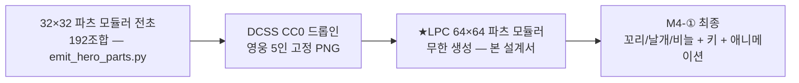
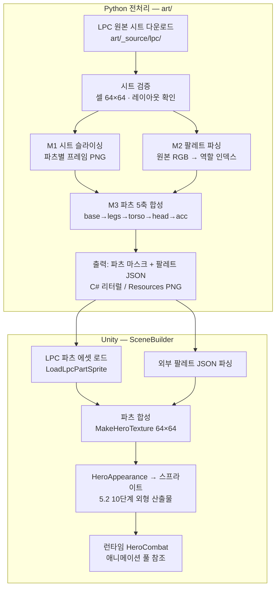
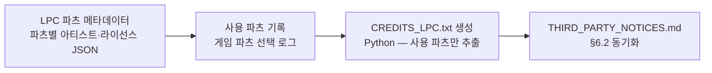
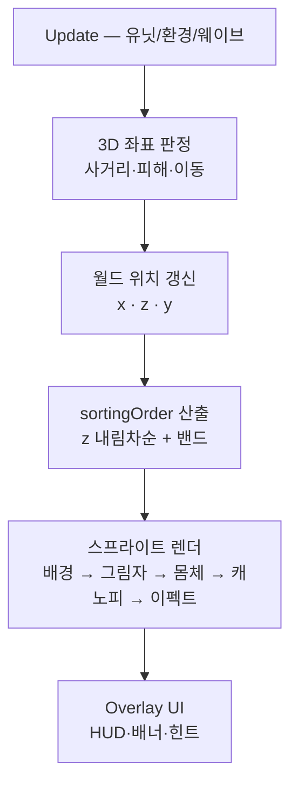

> [!note] 현재 구현 기준
> Unity 2.5D 전환 이력과 55종 아트 매핑은 레거시 참고 자료입니다. 현재 런타임 스폰 카탈로그는 **74 ID**(설계 도감 55 슬러그와는 별개 — `docs/DATA.md` §0)이며, 실제 구현은 루트 단일 구조의 절차 아이소메트릭 Node2D/2.5D 기준입니다 (★D-192 S0 A안).

# 🎨 2.5D 아트 규칙서 (Art Rules)

> [!note] 이 문서의 목적
> [[SoulCommander_GDD_v7.11]] 21.1의 **2.5D 결정(B-11)** — "전투는 3D 좌표 판정, 표현은 2D 스프라이트" — 을
> 실제 아트 제작·임포트 단위까지 구체화합니다. **아트 스타일은 다크 픽셀 아트** (솔로 개발 대응, v1.2 확정).
> 모든 규격은 **폰(아이폰/아이패드) 세로 화면 기준**이며, PC/맥은 동일 리소스를 확대·재배치로 대응합니다.

**기준 문서:** [[SoulCommander_GDD_v7.11]] (21.1 비주얼 · 21.3 기술 제약 · 8.9 위치 보정) · [[전투시스템_BattleSystem]] (3장 배치) · [[종족몬스터사전_Bestiary]] (플레이어블 13종 · 몬스터 55종 — DCSS 매핑)

---

## 1. 화면 기준 (폰 우선)

| 항목 | 수치 | 비고 |
|---|---|---|
| **기준 해상도** | **1080 × 1920 (세로, 9:16)** | 모든 아트의 캔버스 기준 |
| 대상 기기 | iPhone (1170×2532 대응) / iPad (2048×2732 대응) | Unity Canvas Scaler — **Scale With Screen Size (1080×1920)** |
| 안전 영역 | 상·하 **120px**, 좌·우 **60px** | 노치·홈 인디케이터 대응 (iPhone Dynamic Island 포함) |
| 프레임 | 30fps 유지 (저사양 기기 포함, 21.3) | 픽셀 아트라 달성 용이 |
| PPU (Pixels Per Unit) | **16** (픽셀 1 = 유닛 1/16) | 픽셀 아트 임포트 기준 — 픽셀 단위 배치 용이 |
| **픽셀 스케일** | **8× 확대** (1080×1920 = 가상 픽셀 **135×240**) | 모든 픽셀 아트는 이 그리드 기준 |
| 텍스처 형식 | PNG (압축 전) → **ASTC 4×4** (모바일 빌드) | 저장 용량 2GB 목표 (21.3) |

> [!warning] 세로 고정 원칙
> 21.1 게임플레이는 **세로 화면 전제**입니다. PC/맥은 세로 UI를 그대로 크게 표시하고
> (레터박스 불가 — 사이드에 영지/로그 패널 배치), 가로 재설계는 하지 않습니다.

---

## 2. 캐릭터 스프라이트 규격

### 2.1 크기 체계 (픽셀 단위)

| 용도 | 픽셀 크기 | 화면 크기 (8×) | 용량 목표 | 설명 |
|---|---|---|---|---|
| **스탠딩 CG** (소환·영웅 상세·대화) | 192×192 | 1536×1536 | ≤ 300KB | 픽셀 일러스트, 반신~전신 (정면) |
| **전투 스프라이트** (전장 배치) | **64×64** | 512×512 | ≤ 30KB | **3/4 탑다운 뷰** 픽셀, 30fps 애니메이션 |
| **몬스터 스프라이트** (전장) | 64×64 (보스 96×96) | 512×512 (768×768) | ≤ 30KB / ≤ 60KB | 위계 T1~T3 일반 / T4~T5 보스 |
| **미니 아이콘** (파티 UI·감정 풍선) | 32×32 | 256×256 | ≤ 5KB | UI 슬롯, 감정 이모티콘 |

> [!tip] 전투 스프라이트 작업 공간 (탑다운 60° 뷰 — ★v3.10)
> 캔버스 64×64 중 **캐릭터 실체는 중앙 56×64 영역**에 배치 (좌·우 4px 여백).
> 탑다운 뷰에서는 캐릭터가 **머리 위에서 보이므로** 상·하 여백보다 좌·우 여백이 중요합니다:
> ① 이동 방향 회전(4~8방향 전환) 시 여백 ② 스킬 이펙트 겹침 여지 ③ 피격 밀림 여백.
> **스타일:** 다크 픽셀 — 어두운 팔레트 + 명암 3~4단계 + 굵은 윤곽선. 돈스타브의 *어두운 무드*만 계승.

### 2.2 파츠 모듈러 규격 (픽셀 — B-11 플레이어블 13종족 리소스 절감)

| 파츠 | 픽셀 크기 | 변형 수 |
|---|---|---|
| 머리 (얼굴·헤어·수염 포함) | 32×32 | **12종** (플레이어블 4계열 × 3종 — ★13종족 재계산) |
| 몸통 (갑옷·의복) | 32×32 | **12종** (플레이어블 4계열 × 3종 — ★13종족 재계산) |
| 팔 (좌/우 각각) | 16×32 | 2종 (기본/장갑) |
| 다리 (좌/우 각각) | 16×32 | 2종 |
| **부위 파츠** (귀/꼬리/부리/날개/비늘) | 16×16 | **귀 3 · 꼬리 2 · 부리 1 · 날개 1 · 비늘 1 = 8종** (뿔 0 — ★13종족 재계산, 상세: 본서 §9.4.3.1) |
| 피부색/문신 | 팔레트 교체 (색 인덱스 스왑) | 피부 6색 + 털/비늘 4색 + 문신 3종 |

- **결합 규칙:** `머리 + 몸통 + 팔 + 다리 + [부위 파츠 0~2]` 로 1명 완성 — **플레이어블 13종족을 파츠 조합으로 표현** (★2026-08-09 한정 — 몬스터는 DCSS 완성 타일 사용)
- **픽셀 파츠 결합의 이점:** 같은 팔레트를 공유하므로 **색 인덱스 스왑**으로 무한 변형 가능 (픽셀 아트의 강점)
- **팔레트 규칙:** 캐릭터당 **최대 24색** (피부 4 + 머리 4 + 의복 12 + 부위 4) — 팔레트 공유로 스타일 통일
- **전용 일러스트 예외:** ★4~★5 영웅·게이트키퍼 4종·설계 영웅(블라드)은 **전용 스탠딩 CG + 전용 전투 스프라이트** 제작 (파츠 조합 아님)

### 2.3 애니메이션 규격 (픽셀 — 프레임 최소화)

| 상태 | 프레임 수 | 방식 | 설명 |
|---|---|---|---|
| 유휴 (Idle) | **4프레임** 루프 | 픽셀 시트 | 숨쉬기 (상하 2px 흔들림) |
| 이동 (Walk) | **6프레임** 루프 | 픽셀 시트 | 방향 4종 (좌/우/전/후) |
| 공격 (Attack) | **4프레임** 1회 | 픽셀 시트 | 스킬별 공유 가능 |
| 피격 (Hit) | 2프레임 1회 | 픽셀 시트 | 깜빡임 + 뒤로 밀림 |
| 사망 (Death) | 4프레임 1회 | 픽셀 시트 | 영원한 잠 연출 (퍼머데스 20.8) |
| 궁극기 (Ultimate) | 6프레임 1회 | 픽셀 시트 + 이펙트 | ★3 이상 전용 |

- 시트 구성: **한 시트 = 한 상태 × 한 캐릭터**, 64×64 셀 가로 배열 (셀 8개 = 512×64)
- **공용 애니메이션 풀:** 파츠 모듈러 캐릭터는 기본 체형 4종별 애니메이션을 **공유** (아트 80% 절감)
- **픽셀 애니메이션 원칙:** 4프레임으로 부족하면 *가감* (2프레임 추가) — 프레임당 픽셀 수정이라 비용 작음

---

## 3. 카메라 & 전열/후열 표현 — ★탑다운 60° 뷰 확정 (다크 픽셀, ★v3.10: 45°→60°)

> [!warning] ★v1.2 개정 — 탑다운 45° 뷰(★v3.10: 60° 상향 확정) + 다크 픽셀 아트
> **탑다운 45° (3/4 내려다보기) 뷰** + **픽셀 아트** 확정 (v1.1 손그림 → 픽셀 전환, 솔로 개발 대응). ★v3.10: **각도 45°→60°로 상향** (돈스타브식 — 상세는 아래 3.1 표).
> 돈스타브의 **어두운 무드·팔레트**는 계승하되, 손그림 대신 픽셀로 구현합니다.
> 바닥 경고선·영역 공격·환경 붕괴(19.2)의 지면 표시 가시성이 향상됩니다. **전투 로직은 3D 좌표 그대로** —
> 위치 보정(8.9 측면/배후)은 상대 각도 계산이라 뷰와 무관하게 동일 동작.

### 3.1 카메라 규칙

| 항목 | 수치 | 설명 |
|---|---|---|
| 투영 | **Orthographic** (직교) | 2.5D 표준 — 원근 왜곡 없음 |
| 크기 (Orthographic Size) | **6.2** (기준 1080×1920) | 세로 기준 화면 높이 12.4 유닛 — v1.6: 9:16 폰 프레임에서도 5인 포메이션 전체 수용 (기존 5.4는 가로 폭이 좁은 비율에서 양옆이 잘림) |
| 위치 | **(0, 11.5, -6.6)** 고정 | ★v3.10 (60° 동반 재계산) — 시선이 지면 z=0에 닿도록 **z = -y/tan60° = -11.5/1.732 = -6.64** (45°용 -11.5는 60°에서 시선이 z=0에서 벗어남). y=11.5 지면 위 상향 |
| 회전 | **X축 +60°** (돈스타브식 상향 탑다운 3/4 뷰) | ★v3.10 정정 (45°→**60°**) — 각도를 높여 캐릭터가 지면 위에 '서서' 보이는 **돈스타브 무드** 강화. Unity 부호 — 양수 X회전이 지면을 내려다봄 (v1.3: -45°는 하늘을 봄) |
| 필드 크기 | 지면 시야 z 약 **±7.2유닛** (9:16 기준) | ★v3.10 — 60°에서 세로 12.4유닛이 지면 z 14.3유닛(±7.2)에 투영 (45°의 ±8.8보다 좁음). 5인 배치 + 몬스터 영역 수용 |

### 3.2 전열/후열 배치 — 상하 그리드 (8.10 자유 배치의 화면 표현)

탑다운 뷰에서 전열/후열은 **화면 상하(위=멀리, 아래=가까이)** 로 표현됩니다.

| 깊이 | 스크린 Y 위치 | 스케일 (일정) | 감쇠 효과 |
|---|---|---|---|
| **후열 (멀리)** | 화면 **상단** 쪽 | 1.0× | 밝기 92%, 채도 95% |
| **중간 (기준)** | 중앙 | 1.0× | 100% |
| **전열 (가까이)** | 화면 **하단** 쪽 | 1.05× | 100% |
| 바닥 필드 | 전체 | - | 흐림/암처리 (테두리) |

> [!warning] 자유 배치와의 정합 (★v7.12 정정 반영)
> 8.10의 '자유'는 **전투 전 5인 파티 구성(선택)** 을 뜻하며, 전투는 기본 진형(후열 3·전열 2)에서
> **자동 전투**로 진행됩니다 (직접 조종/드래그 없음 — 8.7: 전술 버튼·적 탭만 조작).
> 파티는 하단, 몬스터는 **맵 밖(상단 밖)에서 등장해 접근**하는 세로 화면 레이아웃이 기본입니다.

- **겹침 처리:** 같은 Y대의 캐릭터가 겹치면 **sortingOrder = 로직 y 내림차순** (화면상 위에 있는 = 먼 쪽이 아래 레이어)
- **지면 그림자 (★v3.9 2.5D 깊이감):** 전투 유닛 전원(영웅·몬스터)이 몸체 아래에 **방사형 타원 그림자**를 깐다 — 캐릭터가 지면에 "서 있는" 깊이감 (돈스타브 무드 계승). 32×32 방사형 그라데이션(중앙 불투명→가장자리 투명, 검정 45%, **Bilinear** — 부드러운 그림자는 픽셀 스타일 불필요) · 지면에 눕힘(X축 -90°) · sortingOrder = 몸체 − 1 (영웅 7→6 · 몬스터 6→5, 배경 2/3/4 위) · localPosition은 부모 스케일 곱 주의 (y=-1.0 = 지면)
- **몬스터:** 파티보다 항상 화면 위쪽(상단)에 배치 — 위치 보정(8.9)은 실제 회전으로 표현 (아래 3.3)
- **바닥 경고선:** 몬스터 패턴·보스 기믹(19.2)의 경고 영역은 **바닥 텍스처 위에 직접 표시** (탑다운의 최대 장점)

### 3.3 위치 보정(8.9)의 시각 표현

| 보정 | 화면 연출 |
|---|---|
| 측면 +15% | 공격자 스프라이트가 대상 기준 **옆으로 90° 회전** 후 공격 |
| 배후 +30% | 공격자가 대상 **뒤쪽(화면 위쪽)으로 이동 후 공격** — 대상 피격 반응 확대 |
| 이동 중 | 스프라이트가 **이동 방향으로 회전** (돈스타브처럼 4~8방향 스프라이트 전환) |

---

## 4. 배경 Parallax 레이어 구성

> 폰 GPU 부담 없이 깊이감을 만드는 **3~4레이어 parallax** 방식. **탑다운 뷰에서는 바닥(필드) 레이어가 주역** —
> 캐릭터가 걷는 바닥 타일셋을 최고 품질로 제작하고, 원경은 화면 상단 테두리로 축소.

| 레이어 | 내용 | 이동 속도 (카메라 대비) | 어둠 처리 |
|---|---|---|---|
| **L1 상단 원경** | 하늘·산·성채 실루엣 (화면 상단 띠) | **0.15×** | 실루엣화 + 어둠 30% |
| **L2 중원경** | 숲·폐허·절벽 (상단 띠) | **0.35×** | 어둠 20% |
| **L3 바닥 지형** | 필드 바닥 타일·길·장애물·수풀 (탑다운 시야) | **0.7×** | 없음 |
| **L4 전투 필드** | 실제 배치 구역 바닥 — **경고선·영역 표시용 레이어** | **1.0×** | 없음 (바닥 기준) |

| 항목 | 수치 |
|---|---|
| 배경 해상도 | L1~L2: 96×64 픽셀 (상단 띠, 8× = 768×512) · **L3~L4: 타일 기반 무한 확장** |
| **타일셋** | **16×16 픽셀 타일** (8× = 128px) — 테마당 16~24종 (바위·풀·흙·물·계단 패턴) |
| 시퀀스 수 | **층 테마당 1세트** — 1~20층을 테마 6개로 묶음 (각성의 장/지하 통로/언데드/초원/무덤/화산) |
| 전환 연출 | 층 이동 시 바닥 페이드 + 상단 원경 슬라이드 0.5초 |
| 게이트키퍼 연출 | 상단 원경 교체 + 붉은 연기 파티클 + 화면 흔들림 (21.1) |

> [!example] ★자리표시 배경 파이프라인 (2026-08-09 구현 — ③ M4-① 최종 픽셀 아트 이전 임시)
> **`art/gen_placeholder_bg.py`** (외부 의존성 0 — zlib+struct)가 다크 픽셀 자리표시 PNG 4종을 생성한다:
> `bg_far_mountain`(L1 산·성채 실루엣 192×64) · `bg_mid_forest`(L2 숲 캐노피+폐허 기둥 192×64) · `tile_ground_01`(L3 시임리스 타일 16×16) · `bg_moon`(달 16×16) → `Assets/Resources/Art/Backgrounds/`.
> - **배치 규칙 (60° 눕힌 띠):** L1/L2는 지면에 눕혀(Euler(-90,0,0)) **깊이 4유닛** 띠로 (L1 z5.0·L2 z3.4 — 이미지 하단=먼 z=화면 위 원리로 실루엣이 화면 상단에 쌓임) · L3 타일은 z2.6에서 Tiled 60폭 · **달은 눕힌 띠로는 하늘 표현 불가 → 별도 세운 스프라이트**(z6.3, L1과 같은 parallax 계수 0.15). 하늘은 투명 → 카메라 배경색(어두운 남색)이 하늘 역할.
> - **SceneBuilder 연동:** `LoadBackgroundSprite()`가 PNG 바이트를 직접 읽어(`Texture2D.LoadImage` — 임포트 설정 의존 0) 스프라이트 에셋화, PNG가 없으면 절차 생성 폴백 (재구축 원칙 2).
> - **캐릭터 자리표시 — ★외부 캐릭터 PNG 우선 (DCSS CC0 팩, 2026-08-09):** `art/gen_characters.py`가 DCSS 타일셋에서 **영웅 5인**(성직자/전사/마법사/궁수/도적) + **몬스터 T1~T5**(고블린/오크/트롤/미노타우르스/드래곤) 32×32 스프라이트를 `Assets/Resources/Art/Sprites/Characters/`로 추출한다. **캐릭터는 전부 흰 실루엣 로드**(`LoadWhiteSprite()` — 명암 보존 그레이스케일, 배경과 동일 드롭인 패턴 + Point 필터 + 하단 중앙 pivot), **PNG가 없으면 절차 생성으로 폴백**: 영웅은 **파츠 모듈러 흰 실루엣**(`MakeHeroTexture(HeroAppearance)` — 머리 2·몸통 2·다리 2·팔 2·부위 3 × 팔레트 4 = **192조합**, 역할별 명도 합성, `art/emit_hero_parts.py`), 몬스터는 **흰 실루엣**(`MakeMonsterTexture()`). **색은 전부 sr.color 틴트**: 몬스터 `WaveManager.monsterTints`(T1~T5) · 영웅 `HeroTints`(팔레트 4종 — CreateHero가 AddComponent<HeroCombat> 전에 설정 → Awake가 BodyBaseColor 캡처) — **영웅·몬스터 전 유닛이 피격 시 순백 점멸** (리뷰 #2 히트 플래시 분리, 흰 로브 성직자는 플래시 가시성 위해 크림 보정). 파일명 유지한 채 PNG를 덮어쓰면 다음 Build에서 새 캐릭터 적용 (라이선스: THIRD_PARTY_NOTICES.md · 원본 LICENSE.txt/README.txt 동봉).
> - **★DCSS 전면 추출 확장 (2026-08-09):** `art/gen_characters.py`가 `map_dcss.py` 매핑을 **import해 단일 소스 유지** — 데모 10종 + **종족 13종(`race_<slug>.png`) + 몬스터 55종(`mon_<slug>.png`) 전부 추출** (91개 PNG + `characters_manifest.json`). **종족별 고유 틴트·스케일**(`RACE_LOOK` — 하이엘프 금색/우드엘프 녹색/다크엘프 보라/시엘프 청록 … 드워프 0.92/노움 0.85/하프링 0.88)을 부여해 **인간형 체형의 유사성 해소** — 같은 타일도 색·크기로 종족 구분 (엘프 4종은 서로 다른 DCSS 타일로도 분리). 틴트 적용 모습은 `race_*_tinted.png` 미리보기로 함께 저장. **★플레이어블 13종 한정 (2026-08-09 사용자 지시):** 파티 구성 가능 종족을 13종(⭐ 핵심 9 + 🐾 수인 4)으로 제한하고, 나머지 14종(티플링/아아시마르/인어족/드래곤본/야안티/라이칸슬로프/오크/홉고블린/버그베어/고블린/뱀파이어/도플갱어/마인드 플레이어/기스양키)은 **몬스터로 전환** — `map_dcss.py`에서 MONSTERS로 이동, `gen_characters.py`는 제외된 race_*.png(+.meta)를 stale 정리로 삭제. **SceneBuilder:** 영웅 5인을 종족 기반으로 배치 (인간 힐러·드워프 전사·하이엘프 마법사·우드엘프 궁수·묘인족 도적 — `race_<slug>` + 매니페스트 tint/scale) · 몬스터는 `mon_*` id 사전 주입 + 티어 풀(`TierMonsterPools`)에서 종족 선택 (WaveManager.monsterSpritesById/monsterNamesById).
> - **M4-① 최종(64×64 + 꼬리/날개/비늘 + 키 + 애니메이션)** 은 아래 2.2 규격 그대로 — 외부 파츠 도입 시 §6.1 소싱 옵션 참고.

---

## 5. 스킬 이펙트 (파티클) 방식

> 파티클은 **CPU 저부담 규칙** 강제 — 30fps 저사양 기기 대응 (21.3).

| 항목 | 규칙 |
|---|---|
| 파티클 시스템 | Unity Particle System (2D 모드, **Pixel Snap** 셰이더) |
| 최대 파티클 | **화면 동시 300개** (일반 스킬 150개 / 궁극기 250개 — 픽셀 아트는 적을수록 깔끔) |
| 이펙트 레이어 | UI 레이어 **바로 아래** (캐릭터 위, 배경 위) — Sorting Order 100~200 |
| 컬러 | 속성별 포인트 컬러 (5.3) — 화염 주황 / 수해 파랑 / 자연 초록 / 대지 갈색 / 빛 금색 / 어둠 보라 |
| 크기 | **16×16~32×32 픽셀** 이펙트 스프라이트 (8× = 128~256px) — 픽셀 스타일 일치 필수 |

### 5.1 속성별 이펙트 스타일

| 속성 | 이펙트 구성 |
|---|---|
| 화염 | 픽셀 불꽃 파티클 + 잔불 스파크 (16×16 픽셀 프레임 4장) |
| 수해(물) | 물방울 + 픽셀 파도 스프라이트 + 청백 하이라이트 |
| 자연(바람) | 바람 곡선 픽셀 + 낙엽 파티클 |
| 대지 | 바위 파편 + 먼지 구름 + 지면 균열 픽셀 |
| 빛 | 방사형 광선 + 황금 파티클 + 픽셀 플레어 |
| 어둠 | 보라 연기 + 어둠 스머지 + 눈 파티클 |

### 5.2 이펙트 예산 (스킬별)

| 스킬 등급 | 파티클 | 지속 | 사운드와 동기화 |
|---|---|---|---|
| 일반 스킬 | ≤ 150개 | 0.5~0.8초 | 발동 즉시 |
| ★3 스킬 | ≤ 200개 | 0.8~1.2초 | 발동 + 타격 2점 |
| 궁극기 | ≤ 300개 | 1.5~2.5초 | 3점 리듬 (차지/타격/여운) |
| 보스 브레스 | ≤ 400개 (일시) | 1.0~1.5초 | 경고음 → 발동 |

> [!warning] 이펙트 우선순위 (용량 절감)
> 전투 스프라이트(64×64)는 등장 빈도가 높아 **고품질**, 이펙트는 파티클 조합이라
> **재사용 텍스처 30종 한정** — 스킬마다 이펙트 원화를 새로 그리지 않습니다.
> (원화는 속성 6종 × 기본형만, 나머지는 스케일/속도/색상 변형)

---

## 6. 파일 & 폴더 규칙

```
Assets/Resources/
├── Art/Sprites/Characters/     ← 캐릭터 (파츠 모듈러 — 픽셀)
│   ├── Race/{race_code}/       ← 종족별 파츠 (머리/몸통/팔/다리/부위)
│   ├── Unique/{hero_uid}/      ← ★4~★5·설계 영웅 전용
│   └── Shared/Anim/            ← 공용 애니메이션 (체형 4종)
├── Art/Sprites/Monsters/       ← 몬스터 (몬스터사전 id 기준)
├── Art/Sprites/Effects/        ← 이펙트 (속성 6종 + 공용, 픽셀)
├── Art/Backgrounds/Tiles/      ← 타일셋 (테마 6종 × 16×16 타일)
├── Art/UI/                     ← UI 스프라이트 (32×32 아이콘 포함)
└── Art/StandingCG/             ← 스탠딩 CG (192×192 픽셀 일러스트)
```

**파일명 규칙:** `{분류}_{id}_{파츠/상태}_{변형}.png`
- 예: `race_01_head_elf01.png` / `unique_bladr_idle_01.png` / `mon_goblin_01_attack_01.png` / `tile_volcano_ground_01.png`

**임포트 규칙 (Unity):**
- Texture Type: **Sprite (2D and UI)** / Compression: **ASTC 4×4** / Generate Mipmaps: **해제** (2D는 불필요, 용량 절감)
- **Filter Mode: Point (No Filter)** ← 픽셀 아트 필수! (선형 보간으로 뭉개짐 방지)
- PPU: **16** / Max Size: 스탠딩 192 / 전투 64 / 아이콘 32 (위 2.1과 동일)
- **atlas 패킹:** 파츠·아이콘·이펙트는 **Sprite Atlas**로 묶어 드로우콜 1회 유지 (파티클은 별도)

### 6.1 자산 임포트 정책 (유형별) — ★v3.14 신설

> [!example] 설계 근거 — 「외부에서 이미지를 가져올 수 있나?」
> 답은 **자산 유형에 따라 갈린다** ([[SoulCommander_GDD_v7.11]] §5.2 무한 생성 · [[종족몬스터사전_Bestiary]] §2.1 위계):
> - **영웅**은 "무한 생성"(파이프라인 10단계 외형) 때문에 **완성 이미지 1장으로는 성립 불가** → 파츠 조합 + 팔레트 스왑이 유일한 정답.
> - **몬스터**는 도감 55 슬러그 + 위계(T1~T5) **재사용 원칙**('위계는 종족 고유값이 아니라 배치 규모')이라 외부 스프라이트 + 팔레트/스케일 변형이 정답.
> - **구조물/배경**은 단일 사용 에셋이라 변형이 필요 없음 → 외부 PNG 그대로가 정답.

| 자산 유형 | 임포트 방식 | 변형 메커니즘 | 현재 상태 (2026-08-09) |
|---|---|---|---|
| **영웅** (무한 생성) | **파츠 조합** (외부 완성 이미지 ❌) | 파츠 선택(머리/몸통/다리/팔/부위) + **색 인덱스 스왑 → sr.color 틴트** (`HeroTints` 4종 — 흰 실루엣 텍스처 × 틴트, 파이프라인 10단계와 직결) | ✅ 외부 PNG 우선(흰 실루엣 변환 — **DCSS CC0 플레이어블 13종족 매핑** — `art/map_dcss.py` 검증 ✅ 13/13, ★v3.17 플레이어블 한정) + 파츠 모듈러 흰 실루엣 폴백 192조합 · **히트 플래시 분리 완료** (`art/gen_characters.py` + `art/emit_hero_parts.py`) |
| **몬스터** (43종 — 세분 매핑 55) | 외부 스프라이트 ✅ | id별 원본 + **위계(T1~T5) 종 분화·스케일** — 종족몬스터사전 §5.1 재사용 | ✅ 외부 PNG 우선 (**DCSS CC0 55개 매핑 전부 검증** — 기존 46 + ★플레이어블 제외 종족 9종 전환: 홉고블린/버그베어/티플링/인어족/드래곤본/야안티/아아시마르/라이칸슬로프/기스양키 — 6대 카테고리) + 절차 흰 실루엣 폴백 · 스케일 0.8→1.8 · ★**D-120: 0x72 DungeonTileset II(CC0) 29종 원본색 교체** — `mon_*.png` 드롭인(29종 · `art/gen_ox72_monsters.py` — idle 프레임) + **원본색 렌더**(`LoadColorSprite` PPU=높이/2 2유닛 · `LoadWhiteTwin` 피격 스프라이트 스왑 플래시 — 히트 플래시 무결성 유지 · `MonsterColorTints` 원본색 보존 은은한 위계 · DCSS 유지 26종은 기존 흰 실루엣 × 포화 틴트 그대로) |
| **구조물/배경** | 외부 PNG ✅ | 불필요 (단일 사용) | ✅ 배경 PNG 파이프라인 (`gen_placeholder_bg.py` → `LoadBackgroundSprite`) · ★**D-115: L3 바닥 타일 = Kenney CC0 3종**(잔디/흙/돌 — 시임리스 경계차 0 실측 · `art/gen_kenney_tiles.py` — 절차 타일 대체 · THIRD_PARTY_NOTICES.md 등록) · ★**D-116: 환경 오브젝트(나무/돌/관목) = Kenney CC0 10장** (`env_*` — 나무 3변형 캐노피/트렁크 분리 · `LoadEnvSprite` 드롭인 · 절차 폴백 유지) · ★**D-123: 버섯 = Mushroom Pixel Art Pack 32×32 CC0 6종** (`env_mushroom_01~06` — Red/Purple/Orange/Maroon/Light Red/Dark Red — 0x72 2종(D-121)·idle(D-125) 대체 · 32×32 고해상도 원본색 · `art/_source/mushroom_pixel_art/` 보관 · 절차 폴백 유지) **→ ★D-137 철회: 0x72 2종 + idle 숨쉬기 원복** (2026-08-14 · 소스 보관 유지 — 재채택 후보) · ★**D-118: 가구/구조물 = Kenney CC0 12장** (`prop_*` — 문 3·화로 2·모루·상자·토치·배너 2·돌 2 · `WorldObject.Structure` — 전투 구역 밖 데코레이션) |
| **★4~★5 · 게이트키퍼 · 설계 영웅** | 외부 전용 일러스트 ✅ | 없음 (수제 — 파츠 조합 아님, 2.2 예외) | ⬜ 미착수 (M4-① 이후) |

> [!example] ★DCSS 전면 커버리지 검증 (2026-08-09 — 6,029 PNG 중 종족/몬스터 전수 매핑)
> `python3 art/map_dcss.py` → `art/out/dcss_map.json` · `dcss_map.md` — **종족 13/13 · 몬스터 55/55 커버 (100%)** (★v3.17 플레이어블 한정).
> ⚠️ **55 vs 43**: 55 = 매핑 변형 수(자이언트/정령 속성별 분화 + 플레이어블 제외 종족 전환 9 포함), 43 = 몬스터사전 종(species) 수 — 동일 데이터의 집계 단위 차이.
> - **플레이어블 종족 13:** ⭐ 인간/정령족 · 하이/우드/다크/시 엘프 · 드워프/노움/하프링 · 🐾 묘인족/견인족/조인족/리자드맨
> - **몬스터 6대 카테고리 + 전환 9종:** 인류형 16(홉고블린/버그베어/티플링/인어족 추가) · 언데드 10 · 용족 7(드래곤본/야안티 추가) · 신화 8(아아시마르 추가) · 정령 7 · 외계 7(라이칸슬로프/기스양키 추가) — 전부 DCSS 실제 파일 존재 확인.
> - **대체 매핑 원칙:** DCSS에 없는 콘셉트(버그베어→ogre, 키메라→abomination, 미믹→misc_box, 듀라한→skeletal_warrior 등)는 **시각적으로 가장 가까운 파일로 대체** 후 팔레트/스케일 변형 — 종족몬스터사전 §5.1 재사용 원칙과 정합.
> - **시각 확인:** `python3 art/dcss_preview.py` → `art/out/dcss_preview.html` (원본 → 흰 실루엣 → HeroTints/MonsterTints 틴트 렌더).
> - **★픽셀 정합 검증 (2026-08-09):** `python3 art/verify_tinted_preview.py` — race_*_tinted.png 미리보기 ↔ C# LoadWhiteSprite 렌더링을 **픽셀 단위로 대조** (Unity **Linear 컬러스페이스** — m_ActiveColorSpace:0 — 반영: final = encode_sRGB(lin(w) × lin(tint))). 검증 결과 **13/13 전 종족 maxΔ≤1** — 미리보기 = 실제 게임 렌더링. tint_px/to_white/tint_white는 모두 이 Linear 모델 + 흰 실루엣 0.62~1.0 스케일로 통일됨 (gen_characters.py · dcss_preview.py).

> [!warning] 재구축 원칙 2의 명시적 예외 (외부 아트)
> 재구축 원칙 2는 "외부 에셋 의존 없음"이다. 위 표에서 외부 PNG를 쓰는 **몬스터·구조물/배경·전용 일러스트**는
> **원칙 2의 명시적 예외**로 승인된 것 — `LoadBackgroundSprite` 패턴(PNG 바이트 직접 로드 + 절차 생성 폴백)이
> "어떤 환경에서도 동일 렌더"를 보장하므로 원칙의 취지를 유지한다. **신규 외부 자산 도입 시 반드시 이 표에 등록하고
> 라이선스를 명시한다.**

#### 외부 소싱 옵션 (오픈소스 픽셀 캐릭터 팩 — 상업 게임 라이선스 점검 필수)

| 소스 | 형태 | 라이선스 | 수정/무한 생성 | 비고 |
|---|---|---|---|---|
| **LPC** (Liberated Pixel Cup) | **부위별 파츠 분리**(머리/몸통/팔/다리/악세서리) 64×64 + 팔레트 스왑 | CC-BY-SA 3.0 / GPL v3 (기여 아티스트별 혼재) | ✅ **파츠 조합×팔레트 = 무한 변형** — 위 2.2 규격과 설계 동일 | 조합마다 기여자 수십 명 — CREDITS.txt 관리 + 파생물 copyleft 부담. **Universal LPC Spritesheet Generator** 툴 존재 — 구현 설계: [[아트규칙_2.5D]] |
| **DCSS** (Dungeon Crawl Stone Soup) | **종족 체형 + 몬스터 타일 32×32** (player 975 + monster 1,282 PNG — **6,029 PNG 전체**) | **CC0** (출처 표기 불필요, 상업 무제한 — LICENSE.txt 동봉) | ✅ **플레이어블 13종 × 체형/팔레트 변형 + 몬스터 55종 전부** — `art/map_dcss.py` 검증 완료 (★플레이어블 한정) | 라이선스 부담 0 + 범위 최대. 단 종족별 **완성형 1장** (파츠 모듈러 아님 — 무한 생성은 LPC 파츠로 승격 예정). 이미 로컬: `art/_source/dcss_full/` |
| **CC0 팩** (Kenney / OpenGameArt) | 완성 캐릭터 1장씩 | CC0 (출처 표기 불필요, 상업 무제한) | ❌ 조합형 아님 | 라이선스 부담 0 — 데모/자리표시에 최적 |

#### 후보 소스 (리서치 2026-08-12 — 전수 조사 현황) ★L8 §8 분리 이관

> [!example] ★L8 §8 — 후보 소스 표·채택 소스·라이선스 원문 대조·검토 절차 5단계·해상도/색상/팔레트/리사이즈/애니메이션 정책은
> **[[ASSET_IMPORT_POLICY]] (자산 임포트 정책 — 단일 소스)** 로 분리·이관했습니다. 신규 에셋 검토는 반드시 해당 문서를 기준으로 합니다.
> - 후보 소스 표 (13행 — 채택 3 · 보류 8 · 부적합 2 · 후보 3) → [[ASSET_IMPORT_POLICY#3. 후보 소스]]
> - 채택 4종 라이선스 원문 대조 (LPC/DCSS/Kenney/0x72 — L8 §5) → [[ASSET_IMPORT_POLICY#2. 채택 4종 라이선스 원문 대조]]
> - 신규 에셋 검토 절차 5단계 → [[ASSET_IMPORT_POLICY#5. 신규 외부 에셋 검토 절차 5단계]]
> - 자동 감사 (THIRD_PARTY_NOTICES_AUDIT_FAILED · UNREGISTERED_EXTERNAL_ASSET · 고아 에셋) → [[ASSET_IMPORT_POLICY#5. 신규 외부 에셋 검토 절차 5단계]] 경고 콜아웃

> [!tip] 적용 로드맵
> ① 데모 눈맞춤: **CC0 완성 팩 드롭인** ✅ (DCSS 전면 — 플레이어블 종족 13/13 · 몬스터 55/55 검증, ★SceneBuilder 종족 기반 영웅 + 몬스터 id 연동 완료, 배경 파이프라인과 동일 패턴) → ② 최종: **LPC 파츠**를 64×64 파츠 모듈러로 연동 ✅ (**L6 완료 — D-117: `compose_lpc_races.py`가 종족 13종을 파츠 합성 → 폴백 체인 ①LPC ②DCSS ③절차** — 팔레트 파싱(L4)은 후속). → ③ **원본색 전환** ✅ (**L4 완료 — D-119**: `parse_lpc_palette.py`(M2 — 역할 인덱스 매핑 100%) + `compose_lpc_color.py`(종족 팔레트 13종 원본색 → `race_lpc_color_*.png` — 무한 변형의 원본색 기반 · **★런타임 전환 완료 — D-127**: CreateHero 폴백 체인 ①`race_lpc_color`(LoadColorSprite · PPU 32) → ②`race_lpc`(흰 실루엣) → ③DCSS → ④절차 · 원본색이면 흰 트윈(LoadWhiteTwin) 피격 스왑 + sr.color 흰색(원본 보존) · HeroCombat `FlashHit` 트윈 스왑(D-120 패턴) · 🎨16+🤍16 로드 검증 · ★D-120 몬스터 원본색 렌더는 이미 연동 — **★애니메이션 풀 완료 — D-128(L8)**: `compose_lpc_anims.py`(종족 13종 walk 9·slash 6 — 390 PNG) + `UnitAnimator.cs`(idle→walk→slash 자동 전환 — 위치 감지 이동/공격 · 현재 프레임 흰 트윈 플래시) + 0x72 idle/run(29종 × 8 — 232 PNG) · **★직렬화 근본 수정**: Unity가 Dictionary를 직렬화하지 않아 런타임에 비어 있던 id 연동(D-06/D-120)을 병렬 배열 + Start 복원으로 해결 — 몬스터 id별 스프라이트·틴트·애니메이션이 실제 동작).

---

## 7. 용량 예산 (21.3 — 최초 2GB 목표, 픽셀은 훨씬 가벼움)

| 카테고리 | 예산 | 비고 |
|---|---|---|
| 캐릭터 스프라이트 (파츠 + 전용) | 150MB | 64×64 픽셀 — 손그림 대비 **60% 절감** |
| 몬스터 스프라이트 | 80MB | 56 ID (`monsters.json` 런타임 기준 · `docs/DATA.md` §0) |
| 스탠딩 CG | 120MB | 192×192 픽셀 일러스트 |
| 타일셋 (6테마) | 40MB | 16×16 타일 — 무한 확장 |
| 이펙트 (30종 한정) | 30MB | 픽셀 파티클 텍스처 |
| UI + 사운드 + 기타 | 400MB | 폰트·BGM·효과음 |
| **합계** | **~820MB** | 최초 2GB의 절반도 안 씀 — 여유 1.2GB (21.3 초과 여유) |

> [!tip] 추후 확장
> 신규 층(21~100층) 추가 시 **에셋 번들(AAB 분할)** 로 층 테마 묶음만 다운로드 —
> 최초 설치 용량을 1.7GB로 유지하면서 콘텐츠는 계속 늘릴 수 있습니다.

---

## 8. 구현 체크리스트

> [!example] v3.0 진행 기록 — 전면 재구축 (Rebuild) 완료
> **2026-08-08: 지난 삽질의 교훈을 반영해 `client/`를 전면 재구축** (구 프로젝트는 `client_old_20260808/`로 백업 이동).
> - **4대 원칙:** ① `.unity` YAML 손편집 금지 — 씬은 전부 코드로 생성 · ② 자리표시는 전부 스프라이트 (탑다운 60° 카메라에서 원거리 3D 메시 렌더링 실패 문제를 실측으로 확인) · ③ 단일 소스 (런타임 간섭 스크립트 금지 — 기존 `DemoSetup`/`DemoLighting` 사태) · ④ 한 스텝에 하나만, 확인 후 다음
> - **새 구조:** `SoulCommanderSceneBuilder.cs` (에디터 메뉴 `Tools → Soul Commander → Build Base Scene`)가 **유일한 씬 생성 소스**. **절차 생성 텍스처** 사용 → 임포트 설정(readable·wrapMode) 의존 제로.
> - **v1.x~v2.0 이전 기록 폐기:** 구 프로젝트의 `DemoBootstrap`·`DemoDebugOverlay`·`ParallaxBackground`·`HeroPlaceholder`·`DemoSetup`·`DemoLighting` 스크립트와 손편집 `Main.unity`는 전부 삭제됨. (이전의 3D 메시 원거리 미렌더링·그림자 거리 15 이슈는 재구축 후 절차 생성 스프라이트 방식으로 근본 해결)
>
> **재구축 로드맵:**
>
> | 단계 | 내용 | 상태 |
> |---|---|---|
> | 1. 프로젝트 초기화 | 2022.3.62f1 고정 + uGUI 패키지 + 빈 Assets | ✅ |
> | **2. 첫 씬 (기본기)** | 카메라 (60°·ortho 6.2 — ★v3.10: 45°→60° 정정) + 절차 생성 타일 바닥 (24×24) | ✅ v3.0 |
> | **3. parallax 배경 3레이어** | L1 0.15 / L2 0.35 / L3 0.7 + 자동 드리프트 | ✅ v3.1 |
> | **4. 파티 배치** | 슬롯 5 + 영웅 자리표시 5 (스프라이트) | ✅ v3.2 |
> | **5. 전투 HUD** | 전술 게이지(8.3) + 「이동」「집중 공격」(8.4) — GDD 검수 반영 | ✅ v3.3 |
> | **6. 실시간 자동전투 데모** | 몬스터 3(맵 밖 스폰→접근) + 17장 AI(광폭화) + 영웅 자동 공격 + HP 바 + 기본 진형(자동 전투) — GDD 검수 반영 | ✅ v3.4 |
> | **7. 집중 공격 타깃팅** | 「집중 공격」 버튼 → 몬스터 탭 → 5초 전원 집중 사격(×1.5) + 황금 마커 | ✅ v3.5 |
> | **8. 감정 풍선** | 아이콘(픽셀 이모티콘) + 초단문 — 광폭화 😱 · 처치 😎 (최대 2개, 1.5초) | ✅ v3.6 |
> | **9. 웨이브 시스템** | 몬스터 전멸 → 강화된 다음 웨이브 (수·HP·ATK 스케일 + 배너 + 힐) | ✅ v3.7 |
> | **10. 타격 이펙트·히트 플래시** | 피격 시 0.1초 흰색 플래시 + 별 타격 이펙트 (팽창·페이드) | ✅ v3.8 |
> | **11. 2.5D 깊이감** | 유닛 지면 그림자 + 바닥 잔디/돌 패치 (60° 경사 가시화 — ★v3.10) | ✅ v3.9 |
| **15. 통합 아트 적용** | 배경 PNG 파이프라인(② — L1/L2/L3/달) + 바닥 픽셀 밴딩 + **영웅 파츠 모듈러 전초(①+③ — 파츠 5축 합성 + 팔레트 4종, 192조합)** | ✅ 2026-08-09 |
> | **16. 외부 캐릭터 PNG 파이프라인** | **DCSS CC0 팩 드롭인** — 영웅 5인(성직자/전사/마법사/궁수/도적) + 몬스터 T1~T5(고블린~드래곤) 32×32, `LoadCharacterSprite` 로더 + 절차 생성 폴백 (재구축 원칙 2 예외, THIRD_PARTY_NOTICES.md) | ✅ 2026-08-09 |
> | **12. 전술 버튼 확장 (전술소 Lv.2)** | 4버튼 — 「이동」10·「방어 태세」15·「회복」25★데모·「집중 공격」10 (8.1 레벨 구조) | ✅ v3.11 |
> | **13. 전술 이동 명령 (M2-②)** | 6버튼 완성 — 「이동」지면 탭 파티 이동(진형 유지) · 「후퇴」15 쿨 15초 · 「측면 기동」25 이속+30%·치명타 100% · 방어 태세 3초 정합 | ✅ v3.12 |
> | **14. 전술 이펙트 시각화** | 방어 태세: 파란 방패 배지(머리 위) + HP 바 파란색 전환 · 회복: 초록 십자 이펙트(상승·팽창·페이드 0.5초) | ✅ v3.13 |

- [x] **스텝 1: 프로젝트 초기화** — 2022.3.62f1 · uGUI · 빈 Assets (구 프로젝트 `client_old_20260808/` 백업)
- [x] **스텝 2: 첫 씬** — `Tools → Soul Commander → Build Base Scene`: 카메라 (0, 11.5, -6.6) · X축 +60° · Ortho 6.2 · 방향광 1.4 (그림자 없음) · 절차 생성 타일 바닥 24×24 (16px / PPU 16 / Repeat / Point) — ★v3.10: 45°→60°·z -11.5→-6.6 정정
- [x] **스텝 3: parallax 배경 3레이어** — `ParallaxBackground.cs` (이동량 기준 공식: 카메라 현재−시작 위치 × factor) + 자동 드리프트 0.5 (데모용). L1 산(0.15)·L2 숲(0.35)·L3 지형(0.7) 띠 — 탑다운 45° 뷰에 맞춰 **지면에 눕힌 스프라이트**(Euler(-90,0,0))로 먼 z(6.3~8.2)에 배치. ★v3.10: **60° 카메라로 전환하며 띠를 z 5.2(L3)/6.0(L2)/6.8(L1)로 재배치** (60° 시야 상단 z≈+7.2 — 기존 6.3~8.2는 화면 밖) 바닥도 같은 방식으로 눕힘 (스프라이트 쿼드 기본 +Z 정면이라 회전 없으면 수직 벽). 절차 생성 텍스처는 **Assets/Generated/에 에셋으로 저장**(SaveGeneratedSprite — 씬 YAML 임베드로 인한 missing reference 방지)
- [x] **스텝 4: 파티 배치** — 슬롯 5(후열 3: z+2.6 · 전열 2: z−2.6) + 영웅 자리표시 5. 슬롯 = 지면에 누운 청색 마커(sortingOrder 5), 영웅 = 세운 웜화이트 카드 1.6×1.6(7). **Y+180° 회전으로 카드 정면을 카메라 쪽으로** (카메라가 −Z에서 +Z를 바라봄). **sortingOrder 체계: 배경 2/3/4 < 슬롯 5 < 영웅 7** — 배경이 파티를 덮지 않도록 배경을 파티보다 낮게
- [x] **스텝 5: 전투 HUD (★검수 반영 v7.11 3.2-1)** — 기존 "파티 슬롯 바"는 GDD 8.1과 모순(하단 = 전술 명령어 HUD) → 전환. `UI Canvas` (Overlay, sortingOrder 100) + CanvasScaler **1080×1920 매치 0.5** + GraphicRaycaster + EventSystem. **전술 게이지 바**(8.3: 최대 100·시작 50·초당 +2 — 황금색 Filled 이미지) + **「이동」「집중 공격」 버튼 2개**(8.4: 10 소모). `CombatHUD.cs`(런타임)가 충전·소모·로그 처리
- [x] **스텝 6: 실시간 자동전투 데모 (★검수 반영 v7.11 3.2-2/3)** — 기본 진형(후열 3·전열 2) 고정 + **영웅 자동 공격**(`HeroCombat.cs`: 8.8 사거리 내 최근접 적, 1.5초 주기 + 공격 펄스) + **몬스터 3마리 — 맵 밖(상단 z=9.5)에서 스폰해 접근**(`MonsterAI.cs`: 17.1 최근접 추적·공격, **17.3 광폭화** — HP 30% 미만 → ATK ×1.5·속도 ×1.3·붉은 틴트, **근접 사거리 2.2**) + **HP 바**(`CombatUnit.cs`: 런타임 절차 생성 — 씬 YAML 임베드 없음, 채움 바 pivot(1,0.5)·부모 Y+180 미러로 화면 좌측에서 감소, 사망 시 8.3 전술 게이지 **+10 연동**) · **바닥 = 단일 24×24 대지 스프라이트** (★체스판 수정: 타일 격자 제거) · sortingOrder: 배경 2/3/4 < 몬스터 6 < 영웅 7 < HP 바 20/21 · **HeroDrag 폐기** (8.10 정정: '자유' = 파티 구성 — 전장 직접 조종 없음)
- [x] **스텝 7: 집중 공격 타깃팅 (★8.7)** — `FocusTarget.cs`: 「집중 공격」 버튼(게이지 10 소모) → FocusRequested 이벤트 → **대기 모드**(힌트 "⚔️ 몬스터를 탭하세요!") → 몬스터 탭(뷰포트 내 120px) → **5초간 전원이 집중 대상 우선 공격(사거리 무관, 피해 ×1.5)** + **황금 다이아몬드 마커**(회전, sortingOrder 22). 대기 중 재탭 = 취소(비용 없음). `CombatHUD`에 힌트 텍스트 + `FocusTarget` 이벤트 구독
- [x] **스텝 8: 감정 풍선 (★8.2 v7.9 최적화: 아이콘(이모티콘) 위주 + 초단문)** — `EmotionBubble.cs`: 영웅 머리 위 **16×16 픽셀 이모티콘 + 초단문(TextMesh)** 풍선, **최대 2개 동시 · 1.5초 상승+페이드**. 트리거: 몬스터 **광폭화 목격 → 😱 "깜짝!"**(`MonsterAI.OnAnyEnraged` static 이벤트) · **적 처치 → 😎 "킬각!"**(HeroCombat 마무리 일격). 이모티콘은 **코드 픽셀 맵**으로 생성 — 폰트 이모지 의존 0. 둥근 배경 sortingOrder 25·이모티콘 26
- [x] **스텝 9: 웨이브 시스템** — `WaveManager.cs`: 웨이브 n = **수 3+n−1(최대 7) · HP ×(1+0.30(n−1)) · ATK ×(1+0.20(n−1))** · 스폰 지점 맵 밖(상단 z=9.5) · 전멸 감지(`CombatUnit.All`) → 2초 후 다음 웨이브 + **잃은 체력 50% 회복** + 상단 **"웨이브 n" 배너**(1.8초). `CombatUnit.ApplyWaveScale/HealMissing` 추가, 빌더의 `CreateMonster` 제거 (스폰은 WaveManager가 담당)
- [x] **스텝 10: 타격 이펙트·히트 플래시 (★9, 8.8 타격 피드백)** — `CombatUnit.TakeDamage` 연동: 피격 시 **0.1초 흰색 히트 플래시**(코루틴 — 원래 색으로 블렌드 복구, 광폭화 시 `BodyBaseColor` 동기화로 붉은 틴트 유지) + `ImpactFX.cs` **별 타격 이펙트**(16×16 픽셀 맵 절차 생성 — 폰트/에셋 의존 0, **월드 스폰**(피격 대상이 즉시 파괴돼도 끝까지 재생), 대상 회전 Y+180 전달로 카메라 정면, **0.25초 팽창 0.3→1.4유닛 + 알파 페이드**, sortingOrder 23)
- [x] **2.5D 깊이감 (v3.9)** — ① **유닛 지면 그림자**: `CombatUnit.BuildShadow()` — 자식 GO를 X축 -90°로 눕혀 몸체 아래 배치, **방사형 타원 그라데이션**(32×32, Bilinear, 검정 45%), sortingOrder = 몸체 − 1, localPosition y=-1.0(부모 스케일 0.8 곱 → 월드 y=0 — 리뷰로 부유 버그 수정). 영웅·몬스터(런타임 스폰 포함) 전원 자동 적용 ② **바닥 경사 가시화**: `MakeGroundTexture`에 **불규칙 잔디/돌 Perlin 패치**(grass>0.74 잔디 · rock>0.83 돌 — 규칙적 격자 아님, 체스판 느낌 없음) — 60° 탑다운 경사가 체감됨
- [x] **스텝 12: 전술 버튼 확장 (전술소 Lv.2 — ★8.1/8.4, M2-①)** — `CombatHUD.cs`에 **「방어 태세」(15)**: 아군 전체 **3초간 받는 피해 50% 감면**(`CombatUnit.ApplyDefense/DamageReduction/TickDefense` — 영웅·몬스터 Update에서 `TickDefense()` 호출로 타이머 감소, `TakeDamage`가 감면 적용) + **「회복」(25)★데모 확장**: 아군 전체 **잃은 체력 30% 회복**(`HealMissing`). 빌더 버튼 4개 한 줄 배치(±405/±135, 230폭) + **전술소 Lv.2 라벨**(게이지·버튼 사이). GDD 8.4 표에 「회복」★데모 확장 행 추가
- [x] **스텝 13: 전술 이동 명령 (전술소 Lv.2 6버튼 완성 — ★전투시스템 4.2, M2-②)** — `HeroCombat`에 **이동 목표(MoveTarget)** + 진형 유지 이동(`FormationSpeed 5`, 도착 시 해제) + **측면 기동 버프**(`FlankTimer` — 이속 ×1.3·치명타 ×1.5 100%). `MoveDirector.cs`(신규): 「이동」 후 **지면 탭** → 파티 전체 이동 (UI 클릭 무시, 경계 클램프). `CombatHUD`: 「이동」 실효화(탭 대기/취소) + **「후퇴」(15, 쿨 15초, z −2)** + **「측면 기동」(25, 이속+30%·치명타 100% 5초)** — 대상 0명 시 게이지 미소모. 빌더 **6버튼 2열×3**(Row1: 이동·방어·회복 / Row2: 후퇴·측면 기동·집중 공격, 200폭×15px 간격) + 이동 힌트(y 400)·집중 힌트(y 460) + Move Director 오브젝트. ★전투시스템 4.2 정합 수정: **방어 태세 5초→3초**
- [x] **스텝 14: 전술 이펙트 시각화 (8.4 효과 가시화 — ★v3.13)** — ① **방어 태세**: `CombatUnit`에 **파란 방패 배지**(16×16 픽셀 맵 절차 생성, 머리 위 y+1.4, sortingOrder 22 — HP 바 20/21 위, 집중 마커와 층은 같지만 마커는 몬스터 전용이라 충돌 없음) — `ApplyDefense` 시 표시·`TickDefense` 종료 시 숨김(알파 토글) + **HP 바를 파란 계열로 전환**(방어 중 시각 식별). ② **회복**: `ImpactFX.SpawnHeal` — **초록 십자**(16×16 픽셀 맵)가 **위로 상승하며 팽창 0.3→1.2유닛·페이드(0.5초)**, `CombatHUD.TryHeal`에서 회복 대상마다 월드 스폰
- [ ] Sprite Atlas 4종 (파츠/아이콘/이펙트/몬스터) 패킹 설정
- [ ] ASTC 4×4 압축 + Pixel Snap 셰이더 확인
- [ ] 파티클 예산 체크 툴 (스킬별 개수·지속시간 검증)

---


---

## 9. LPC 파츠 모듈러 파이프라인 (★통합 — LPC파이프라인_설계서 v1.2)

> 이전 별도 문서 **LPC파이프라인_설계서 → 본서 §9 통합 (2026-08-09)**. 64×64 파츠 모듈러 파이프라인의 소스 규격·모듈 설계·CREDITS·구현 로드맵.

> [!note] 이 섹션의 목적 (★통합 — LPC파이프라인_설계서)
> 본서 §2.2 파츠 모듈러 규격 + §6.1 외부 소싱 옵션의 **LPC (Liberated Pixel Cup)** 를
> 실제 게임 파이프라인으로 구현하기 위한 **설계서**입니다. M4-①(최종 픽셀 아트)의 핵심 축이며,
> 현재의 32×32 파츠 모듈러 전초(192조합) + DCSS CC0 드롭인을 **64×64 LPC 파츠 조합**으로 승격합니다.

**기준 문서:** 본서 (§2.2 파츠 규격 · §6.1 임포트 정책 · §8 로드맵 · §10 통합 아트) · [[SoulCommander_GDD_v7.11]] (§5.2 무한 생성 15단계 · §21.1 B-11)

---

### 1. 개요

#### 1.1 왜 LPC인가

| 관점 | 판단 |
|---|---|
| **무한 생성 정합** | 영웅은 "완성 이미지 1장"으로 성립 불가 (v7.11 §5.2 파이프라인 10단계 '외형') → **파츠 조합 × 팔레트 스왑**이 유일한 정답. LPC는 처음부터 이 구조로 설계됨 |
| **아트 품질** | 64×64 다크 픽셀 아트 — 아트규칙 §2.1 전투 스프라이트 규격(64×64)과 **정확히 일치** |
| **리소스 절감** | 파츠 5축 + 팔레트 → 무한 변형 (아트규칙 §2.2 — 플레이어블 13종족을 파츠 조합으로, ★2026-08-09 한정) |
| **애니메이션 풀** | LPC는 표준 시트에 walk/slash/spellcast/hurt 등 **애니메이션 프레임 포함** — 아트규칙 §2.3 '공용 애니메이션 풀'과 직결 (아트 80% 절감) |
| **솔로 개발 대응** | 수십 명 아티스트의 완성 픽셀 아트를 무료로 — 직접 그리는 대비 시간 절감 |

#### 1.2 현재 상태와의 관계



- **지금**: 영웅 = DCSS PNG 우선(5인 고정) → 폴백 32×32 파츠 모듈러. 몬스터 = DCSS 티어별.
- **목표**: 영웅 = LPC 파츠 조합(무한) → 폴백 DCSS PNG → 폴백 32×32 파츠. **폴백 체인을 유지**해 어떤 환경에서도 렌더 보장 (재구축 원칙 2 예외 패턴 유지).

---

### 2. LPC 소스 포맷 규격 (실측 확정 사항)

> [!note] ✅ 스펙 검증 완료 (L2 — 2026-08-09)
> 아래 수치는 실제 다운로드한 시트의 픽셀 분석(`art/verify_lpc_sheet.py` — **21/21 통과**)으로 확정했습니다.
> 검증 보고서: `art/_source/lpc/verify_report.json`.

#### 2.1 시트 레이아웃 (LPC 표준 템플릿 — 실측)

| 항목 | 수치 | 비고 |
|---|---|---|
| **셀 크기** | **64×64 픽셀** ✅ | 아트규칙 §2.1 전투 스프라이트와 동일 — 전 시트 셀 배수 확인 |
| **행 구성** | **방향 4행(아래/왼쪽/오른쪽/위)** × 액션 ✅ | walk/slash/spellcast = 4행 |
| **예외** | **hurt/climb 등 단방향 = 1행** ✅ | hurt = 6열×1행 — 방향 무관 단일 애니메이션 (LPC 표준) |
| **열 구성** | 액션별 프레임: walk 9열 · slash 6열 · hurt 6열 · spellcast 7열 | 실제 고유프레임은 시트마다 상이 (예: body walk 9, hair walk 2) |
| **프레임 수** | 액션별 상이 (walk 2~9 · slash 4~6 · hurt 6 · spellcast 1~5 — 시트별 고유프레임) | 반복 열 = 프레임 루프 — 슬라이서가 고유프레임만 추출 |
| **파츠별 시트** | 파츠 하나 = 시트 하나 ✅ | `spritesheets/{파츠}/{변형}/{성별}/{애니메이션}.png` |

#### 2.2 파츠(레이어) 구성 — 표준 합성 순서 (아래→위)

LPC 표준 레이어 순서 (Universal Generator가 파츠를 쌓는 순서):

| 순서 | 파츠 | 게임 역할 매핑 (아트규칙 §2.2) |
|---|---|---|
| 1 | **Base Body** (종족별 — human/elf/orc 등) | 피부·체형 (팔레트 피부 6색) |
| 2 | Eyes / Ears (얼굴 세부) | 머리 파츠의 일부 + 부위(귀) |
| 3 | Legs / Pants | 다리 |
| 4 | Feet / Shoes | 다리 하단(부츠) |
| 5 | Torso / Armor | 몸통 |
| 6 | Hands / Bracers | 팔(장갑) |
| 7 | Hair / Facial Hair | 머리(헤어) |
| 8 | Headwear / Helmets | 머리(후드/투구) |
| 9 | Accessories / Capes / Weapons | 부위(뿔/날개/비늘) + 무기 |

> [!warning] 합성 순서의 함정 (★리뷰 반영)
> 현재 C#의 순서(뒤→앞: **부위 → 다리 → 팔 → 몸통 → 머리**)는 **acc가 최하층**이어서 귀를 그 위치에 두면 머리에 가려진다 (32×32 뿔/귀 실루엣용 설계). LPC는 귀/눈이 **얼굴 위**, 악세서리/망토가 **최상층**이다.
> → §4.3에 acc를 **'머리 뒤 파츠'(뿔/날개/꼬리)** 와 **'최상층 파츠'(귀/모자 장식/악세서리)** 로 **분리하는 명시적 순서 매핑**이 필요. LPC 레이어를 5축으로 그룹핑하되 순서는 파츠 특성별로 재정의한다 (기존 `PaintMask`는 파츠 단위 순서 리스트만 바꾸면 재사용 가능).

#### 2.3 팔레트 스왑 메커니즘

- LPC 파츠는 색상이 **역할 단위**로 칠해져 있고 (피부 / 머리 / 의복 본색 / 음영 / 하이라이트), 팔레트 치환으로 리컬러링.
- Universal Generator는 파츠의 특정 색군(예: 피부, 셔츠)을 사용자 선택 색으로 치환 → **색 인덱스 스왑**과 동일 원리.
- 우리 파이프라인: LPC 원본 픽셀의 RGB → **역할 인덱스**(`skin/hair/robe/robeDark/...`) 매핑 테이블로 변환 후, 게임 팔레트(`HeroPalette` 구조 — 이미 32×32 전초에 구현됨)로 치환.

| 색군 | LPC 원본 예 | 게임 역할 인덱스 |
|---|---|---|
| 피부 (Skin) | `#ffc6ad` 계열 | `S` |
| 머리 (Hair) | 갈색/금발 계열 | `H` |
| 의복 본색 | 파츠별 메인색 | `R`/`A`/`P` |
| 의복 음영 | 본색 어두운 변형 | `D` |
| 하이라이트 | 본색 밝은 변형 | `W` |
| 가죽/금속 | 벨트·장식 | `L`/`G` |

> [!note] 음영 보존 원칙
> 단순 "본색→새 색" 치환이 아니라 **본색/음영/하이라이트 3색군을 함께 스왑**해 LPC 아티스트의 명암 구조를 보존한다 — 팔레트 파일 파싱의 핵심 요구사항.

#### 2.4 라이선스 (실측 확정)

| 항목 | 내용 |
|---|---|
| **라이선스** | 파츠별 **CC-BY 3.0 / CC-BY-SA 3.0 / GPL 3.0 / OGA-BY 3.0** 복수 (듀얼 아님 — 배포판 `CREDITS.csv`가 파츠별 라이선스 명시) |
| **의무** | ① 저작자 표시 (CREDITS) ② 파츠가 copyleft 라이선스(CC-BY-SA/GPL)만 제공하면 파생물 **동일 라이선스** 유지 |
| **상업 사용** | 무료 — 단, copyleft 파츠에서 파생된 스프라이트는 CC-BY-SA 3.0 또는 GPL 3.0로 공개 필요 |
| **★copyleft 회피 옵션** | 복수 라이선스 파츠는 **OGA-BY 3.0**(저작자 표기만, copyleft 없음)을 선택 가능 → OGA-BY만 제공하는 파츠로 선택 세트를 한정하면 **폐쇄 상용 유지 가능** (단, 전 파츠가 OGA-BY를 제공하지는 않음 — 선택 세트 검증 필요) |
| **실사용 파츠 아티스트** | 15명 — bluecarrot16 · JaidynReiman · Benjamin K. Smith (BenCreating) · Evert · Eliza Wyatt (ElizaWy) · TheraHedwig · MuffinElZangano · Durrani · Johannes Sjölund (wulax) · Stephen Challener (Redshrike) 등 (자세한 목록: `art/_source/lpc/CREDITS_src.json`) |
| **출처** | GitHub `LiberatedPixelCup/Universal-LPC-Spritesheet-Character-Generator` (master) — 원본 CREDITS.csv 13,854줄 |

> [!warning] copyleft 리스크 (사용자 승인 완료 ✅ · 회피 옵션 검토 가능)
> LPC 파생 스프라이트를 **CC-BY-SA 3.0 / GPL 3.0로 공개하는 데 사용자가 동의**했습니다 (2026-08-09).
> 게임 코드·밸런스·기획은 독립적으로 유지하고 **스프라이트 에셋만 별도 공개**하는 구조가 전제입니다.
> 💡 추가 옵션: 복수 라이선스 파츠는 **OGA-BY 3.0 선택 시 copyleft 회피**가 가능합니다 — 공개를 피하고 싶으면
> L3/L4 단계에서 **OGA-BY만 제공하는 파츠로 선택 세트를 한정**하는 방안을 검토할 수 있습니다.

---

### 3. 파이프라인 아키텍처



#### 3.1 폴백 체인 (재구축 원칙 2 유지)

| 우선순위 | 영웅 스프라이트 소스 | 조건 |
|---|---|---|
| ① | **LPC 파츠 조합** (64×64) | **필요 파츠 전부 존재** (파츠별 파일 검사 — 1개라도 없으면 ②로 폴백) |
| ② | DCSS PNG 드롭인 (5인 고정) | `Art/Sprites/Characters/hero_*.png` 존재 |
| ③ | 절차 파츠 모듈러 (32×32, 192조합) | 항상 동작 (현재 코드) |

> [!note] 파츠별 폴백 (★리뷰 반영)
> LPC 조합은 **파츠 단위 파일 존재 검사** — 합성에 필요한 파츠(체형/머리/몸통/다리/팔/부위)가 하나라도
> 없으면 전체 조합을 포기하고 ② DCSS PNG로 폴백한다. 부분 합성(일부만 LPC)은 스타일 혼재가 발생하므로 **불허**.

---

### 4. 모듈별 상세 설계

#### 4.1 M1 — 시트 슬라이싱 (64×64 셀 → 파츠 PNG)

- 입력: LPC 표준 시트 (파츠 1개 = 시트 1장, 64×64 셀 격자).
- 처리: `art/slice_lpc.py` — 시트 크기·셀 크기 분석 → 파츠·방향·프레임별 PNG 분리.
- **셀 오프셋 정규화**: LPC 시트는 캐릭터가 셀 중앙이 아닌 경우가 많음 → 각 파츠별 **pivot 기준 발 위치**를
  미리 계산해 저장 (`lpc_meta.json`) — 아트규칙 §2.2/§6.1 'pivot 하단 중앙 (0.5, 0)' 규칙과 정합.
- 출력: `Art/Sprites/LPC/{part}_{variant}/` — 프레임 PNG + `lpc_meta.json` (레이아웃·pivot·색군).

#### 4.2 M2 — 팔레트 파일 파싱 (원본 RGB → 역할 인덱스)

- 입력: ① LPC 원본 시트 픽셀 ② 색군 정의 JSON (피부/머리/의복 본색·음영·하이라이트의 **원본 대표 RGB + 허용 오차**).
- 처리: `art/parse_lpc_palette.py`
  1. 시트에서 사용된 고유 색 추출 (팔레트 자동 감지 — 인접 24색 규칙, 아트규칙 §2.2).
  2. 색군 매핑: 추출 색 → 역할 인덱스 (`S/H/R/D/W/A/P/L/G`) — **유클리드 거리 + 허용 오차**.
  3. 미매핑 색 = 아티스트 고유 장식색 → **고정 색으로 유지** (스왑 대상 아님 — 위험 신호로 기록).
- 출력: `lpc_palette_{파츠}.json` (역할 인덱스 → 게임 팔레트 인덱스 매핑) + 색군 매핑 리포트.
- **검증**: 전 매핑 완료율 ≥ 98%, 미매핑 색 수 ≤ 5 — 아니면 팔레트 정의 수정 반복.

#### 4.3 M3 — 파츠 5축 합성 (아트규칙 §2.2 정합)

기존 32×32 `PaintMask` 파이프라인을 **64×64로 승격**하되, **LPC 순서 매핑(★리뷰 반영)** 을 적용한다:

| 그룹 | LPC 레이어 | 게임 합성 위치 | 비고 |
|---|---|---|---|
| base | Base Body | 최하층 (체형·피부) | §4.3.1 체형 6종 |
| 다리 | Legs → Feet | base 위 | |
| 팔 | Hands (몸통 아래) | 다리 위 | |
| 몸통 | Torso/Armor | 팔 위 | |
| 머리 | Hair → Headwear | 몸통 위 | |
| **acc-뒤** | 뿔/날개/꼬리 | **머리 뒤** | 32×32의 기존 최하층 유지 |
| **acc-앞** | 귀/눈/악세서리/망토 | **최상층** | ★LPC 정합 — 귀가 얼굴을 가리지 않고 위에 쌓임 |

| 축 | 파츠 (LPC 그룹핑) | 역할 문자 | ★13종족 변형 수 (v1.2 재계산 — §4.3.1) |
|---|---|---|---|
| 머리 (head) | hair + facial hair + headwear | `H` | 12종 (4계열 × 3종) |
| 몸통 (torso) | torso/armor + hands/bracers | `A`/`R` | 12종 (4계열 × 3종) |
| 다리 (legs) | legs/pants + feet/shoes | `P`/`L` | 2종 |
| 팔 (arms) | hands (몸통에서 분리) | `S`/`G` | 2종 |
| 부위 (acc) | ears/tails/beak/wings/scales | `F`/`G` | 귀3·꼬리2·부리1·날개1·비늘1 (뿔 0) |
| 팔레트 | base body 피부 + 의복 색군 | `S`~`G` | 피부6 + 털/비늘4 + 문신3 · 캐릭터당 24색 |

- **합성 순서**: `base → 다리 → 팔 → 몸통 → acc-뒤(뿔/날개/꼬리) → 머리 → acc-앞(귀/악세서리)` —
  기존 `PaintMask` 재사용(파츠 순서 리스트만 교체), 캔버스만 64×64.
  (※ ★M3 구현 중 확정 — '머리 뒤'는 파츠 위치에 따라 해석이 달라야 한다: 뿔은 x축이 머리 바깥이라
  최하층이어도 보이지만, **날개/꼬리는 몸통/다리와 y축이 겹치므로 최하층이면 가려진다** →
  acc-뒤는 '몸 뒤 부착' 부위로 보고 **몸통 위·머리 아래**에 쌓는 것이 정답. LPC 표준 레이어
  (accessories = 최상층)와도 정합.)
- **체형 (★v1.2)**: base body 파츠 = **플레이어블 13종족 → LPC 표준 체형 6종** (human/elf/dwarf/gnome/halfling/lizard) — §2.3 공용 애니메이션 풀 대응. 상세 매핑: §4.3.1.

#### 4.3.1 ★플레이어블 13종족 파츠/팔레트 재계산 (v1.2 — 2026-08-09)

> [!warning] 소스 커버리지 갭 (실측 확인)
> 현재 다운로드한 LPC 시트 **21장 전부 = human male 기본형 1벌** (body 1 + head 4 + torso/plate 4 + legs/pants 4 + arms/gloves 4 + hair/balding 4 — 전부 `/male/`, `verify_report.json` 21/21).
> **13종족 표현에는 체형 5종·부위 파츠·의복 2벌·헤어 다수가 없어 추가 다운로드가 필수** — ③ 소스 보강 계획 참조.

##### ① 종족 → LPC 체형 매핑 (13종족)

| 종족 (13) | 계열 | LPC 체형 | 부위 파츠 | 구분 포인트 |
|---|---|---|---|---|
| 인간 | 인간 | human | — | 기준 |
| 정령족 | 인간 | human | — | 원소 문신 팔레트 |
| 하이엘프 | 엘프 | elf | 엘프 귀 | 금발 팔레트 |
| 우드엘프 | 엘프 | elf | 엘프 귀 | 숲 녹 팔레트 |
| 다크엘프 | 엘프 | elf | 엘프 귀 | 어두운 피부 팔레트 |
| 시엘프 | 엘프 | elf | 엘프 귀 | 청록 팔레트 |
| 드워프 | 드워프 | dwarf | — (수염은 머리 축 — facial hair) | 소형 체형 + 수염 |
| 노움 | 드워프 | gnome | — | 소형 체형 |
| 하프링 | 드워프 | halfling | — | 소형 체형 |
| 묘인족 | 짐승 | human | 고양이 귀 + 꼬리 | 수인 — 털 팔레트 |
| 견인족 | 짐승 | human | 개 귀 + 꼬리 | 수인 — 털 팔레트 |
| 조인족 | 짐승 | human | 부리 + 날개 | 수인 — 깃털 팔레트 |
| 리자드맨 | 짐승 | lizard | 비늘 (★팔레트 스왑용 별도 파츠 — lizard 체형에 비늘이 내장되어 있어 부위 파츠는 색 교체 목적) | 비늘 체형 |

→ **LPC 표준 체형 6종**(human/elf/dwarf/gnome/halfling/lizard)으로 13종족 전부 커버. 수인 3종은 human 체형 + 부위 파츠. (27종족 시절 '6대 계열 × 체형 4종 = 24' 개념 → **체형 6종으로 75% 절감**)

##### ② 파츠 · 팔레트 수 재계산

| 축 | 기존 (27종족 기준) | ★13종족 재계산 | 절감 |
|---|---|---|---|
| 머리 | 계열별 3~5종 | **12종** (4계열 × 3종) | — |
| 몸통 | 계열별 3~5종 | **12종** (4계열 × 3종) | — |
| 다리 | 2종 | 2종 | — |
| 팔 | 2종 | 2종 | — |
| 부위 | 귀5·꼬리5·뿔4·날개4·비늘3 = **21** | 귀3·꼬리2·부리1·날개1·비늘1 = **8** (뿔 0) | **-62%** — 뿔 종족(티플링/드래곤본) 몬스터 전환 |
| **파츠 합계** | — | **36종** | 부위 절감이 핵심 |
| 팔레트 | 피부6 · 문신3 | 피부 6 + 털/비늘 4 + 문신 3 = **13 그룹** (캐릭터당 24색 유지) | 수인 털·비늘 색군 추가 |

- **조합 공간:** 머리 12 × 몸통 12 × 다리 2 × 팔 2 × (부위 8종 중 0~2개 = 37) × 피부 6 ≈ **12.8만 조합** — v7.11 §5.2 무한 생성 정합 (32×32 전초 192조합 대비 600배+).

##### ③ 소스 보강 — ★D-114 실측 반영 (2026-08-12 — L3 완료 · 21장→71장)

> [!warning] 설계서 가정 vs 실제 저장소 drift (★D-114)
> 설계서 v1.2는 **elf/dwarf/gnome/halfling 체형(head)** 추가를 가정했으나, 실제 Universal-LPC 저장소
> (`head/heads/`)에는 해당 머리가 **없습니다** (human/lizard/wolf/... 만 존재). 실측 반영 대체 매핑:
> 엘프 4종 = human 머리 + **`head/ears/elven` 귀** · 수인(묘인/견인) = **`head/ears/{cat,wolf}` 귀** +
> **`body/tail/{cat,wolf}` 꼬리** · 조인족 = **`body/wings/feathered` 날개**(부리 미제공 — 자체 제작 후속) ·
> 드워프 = **`beards/beard/basic` 수염** · 리자드맨 = **`head/heads/lizard` 머리 + `body/tail/lizard` 꼬리** ·
> 소형종(노움/하프링) = human 머리 + 스케일(후속).

| 파츠군 | 실제 확보 (71장 — `art/_source/lpc/`) | 애니메이션 | 비고 |
|---|---|---|---|
| 귀 (ears) | **elven · cat · wolf 3종** (`head/ears/{종}/adult/bg/`) | walk/slash/spellcast (hurt **미제공 — walk 폴백**, LPC 표준) | 엘프 4종족 · 묘인 · 견인 |
| 머리 (head) | **human · lizard · wolf 3종** (`head/heads/{종}/male/`) | walk/slash/hurt/spellcast | 리자드맨 · 견인 대체 |
| 꼬리 (tail) | **cat · wolf · lizard 3종** (`body/tail/{종}/adult/bg/`) | walk/slash/hurt/spellcast (cat/wolf = black 색) | 수인 3종 |
| 날개 (wings) | **feathered 1종** (`body/wings/feathered/adult/bg/` — white) | walk/slash/hurt/spellcast | 조인족 · 부리 미제공 |
| 의복 | **plate + leather 2벌**(torso) · **pants + skirts(plain) 2종**(legs) | walk/slash/hurt/spellcast | |
| 수염 | **beard/basic 1종** | walk/slash/hurt/spellcast | 드워프 |
| 헤어 | **balding + bob 2종** | walk/slash/hurt/spellcast | |
| 체형 (base) | human 1종 (male) | walk | elf/dwarf/gnome 소형 체형 미제공 — 귀/수염/스케일로 구분 |
| **총 시트** | **71장** (기존 21 + 신규 50) | | 설계서 예상 69~77 **정합** |

> [!note] 다운로드·검증 결과 (D-114)
> - `art/fetch_lpc.py` — GitHub raw에서 52장 시도 → **50장 확보** (cat/wolf 귀 hurt 2장은 저장소에 없음 — LPC 표준 폴백)
> - `art/verify_lpc_sheet.py` — **71/71 L2 게이트 통과** (빈 패딩 행 제외 · 색상 변형 파일 부모 디렉토리 판정 보정)
> - `art/slice_lpc.py` (M1) — **914 프레임 PNG** 슬라이싱 + pivot(발 위치) 정규화 → `Resources/Art/Sprites/LPC/` + `lpc_meta.json`
> - CREDITS: `CREDITS_src.json` L3_manifest 병합 (credits_lookup 38 found / 12 missing — 나머지 §6.3 점검)
> - `beak`(조인족 부리) 미제공 — 근접 파츠 대체 또는 자체 제작 (L6/L7에서 결정)

#### 4.4 M4 — Unity 연동 (SceneBuilder)

- `LoadLpcPartSprite(resourceSubPath, ppu, assetName)` — `LoadSpritePng` 공통 헬퍼 재사용 (pivot 하단 중앙).
- `MakeHeroTexture(HeroAppearance)` — 32→64 승격: 합성 루프 동일, **파츠 소스를 절차 맵 대신 LPC 슬라이스 PNG 합성**으로 교체.
- `HeroAppearance` 구조체 확장: `bodyType`(체형 **6종** — §4.3.1① 매핑) 필드 추가 — **기존 enum/구조체와 하위 호환** (파이프라인 10단계 '외형' 산출물 확장).
- 팔레트: `HeroPalette` 4종 → LPC 팔레트 JSON 로드 (런타임 리소스) — `Resources/Art/Sprites/LPC/Palettes/*.json`.
- **애니메이션 (★리뷰 반영 — LPC 기본 에셋에는 idle/death가 없다)**: LPC 기본 애니메이션은 walk·slash·spellcast·thrust·shoot·hurt뿐. 아트규칙 §2.3 게임 상태 → LPC 프레임 **명시적 매핑** 필수:

| 게임 상태 (§2.3) | LPC 매핑 | 비고 |
|---|---|---|
| Idle 4 | walk 1프레임 활용 (또는 미제공 시 펄스 유지) | 4프레임 유휴는 자체 생성 필요 검토 |
| Walk 6 | walk (6~8프레임) | ✅ 직접 대응 |
| Attack 4 | slash (6프레임 → 4 재편성) | 스킬별 spellcast/thrust/shoot 재사용 |
| Hit 2 | hurt (6프레임 → 2 재편성) | ✅ |
| Death 4 | **LPC 기본에 없음** → ① 후퇴/페이드 연출 대체 ② 커뮤니티 add-on 파츠 확보 ③ 보류 | ⚠️ 설계 결정 필요 |

  렌더는 `Animator` 대신 **코드 프레임 교체**(SpriteRenderer.sprite = frame[i]) — 기존 공격 펄스·히트 플래시와 공존.

---

### 5. M4-① 정합표 (요구사항 대비)

| M4-① 요구사항 | 본 설계서 해결 | 상태 |
|---|---|---|
| 64×64 캔버스 | §4.1 슬라이싱 + §4.3 합성 (PaintMask 64 승격) — 셀 64×64 실측 확정 (L2 ✅) · 32 소스 2× 승격 구현 완료 (L5 🔨) | 🟡 구현 중 |
| 부위 파츠 꼬리/날개/비늘 | LPC accessories 파츠 그룹핑 (§4.3 acc 축) — 뿔/날개/꼬리(acc-뒤) + 귀/왕관(acc-앞) 분리 구현 완료 (L5 🔨) | 🟡 구현 중 |
| 키(높이) 변형 | base body 체형 6종 + 스케일 0.9~1.15 (키 보정) | 📝 설계 |
| 공용 애니메이션 풀 | LPC 표준 시트 프레임 + 체형 공유 (§4.4) | 📝 설계 |
| 플레이어블 13종족 대응 | **체형 6종 × 파츠 36종 × 팔레트 13그룹** — §4.3.1 재계산 (아트규칙 §2.2 — ★2026-08-09 한정, 몬스터는 DCSS 완성 타일) | 📝 설계 |
| 색 인덱스 스왑 | §4.2 팔레트 파싱 (음영 보존) — 기존 4팔레트 재사용 확인 (L5 🔨) | 🟡 구현 중 |
| 무한 생성 정합 | HeroAppearance = 파이프라인 10단계 산출물 (확장) | 📝 설계 |
| copyleft 리스크 | §6 CREDITS 관리 + 파생물 공개 범위 결정 | ⚠️ 사용자 확인 |

---

### 6. CREDITS 관리 방안

> [!warning] LPC의 최대 함정 — 기여 아티스트 수십 명
> 조합마다 사용된 파츠의 아티스트가 다르므로 **자동 크레딧 생성**이 필수입니다. 수동 관리는 누락 위험.

#### 6.1 자동 크레딧 파이프라인



1. **소스 메타데이터**: `art/_source/lpc/CREDITS_src.json` — LPC 배포판이 제공하는 파츠별 아티스트·라이선스 목록을 1회 정리.
2. **사용 파츠 기록**: 게임에서 선택된 파츠 조합(프리셋 + 소환 생성)이 로그 → 크레딧은 **실사용 파츠만**.
3. **자동 생성**: `art/gen_lpc_credits.py` — `CREDITS_LPC.txt` (파츠 → 아티스트 → 라이선스 표) + `THIRD_PARTY_NOTICES.md`의 LPC 섹션 갱신.
4. **배포 포함**: CREDITS 파일은 게임 배포 시 **뿌리(README/설정 화면)** 와 함께 동봉 — CC-BY-SA 의무.

#### 6.2 THIRD_PARTY_NOTICES.md LPC 섹션 (등록 규칙)

| 필드 | 내용 |
|---|---|
| 출처 | OpenGameArt LPC Base Assets · Universal Generator URL |
| 라이선스 | CC-BY-SA 3.0 / GPL v3 (파츠별 상이 — CREDITS_LPC.txt 참조) |
| 로컬 경로 | `art/_source/lpc/` (원본 보관) → `Assets/Resources/Art/Sprites/LPC/` |
| 사용 파츠 | 게임이 실제 사용하는 파츠 목록 (자동 갱신) |
| copyleft 고지 | 파생물 공개 범위 + 배포 시 CREDITS 동봉 명시 |

#### 6.3 정기 점검 규칙

- 파츠 1개라도 추가/변경 시 크레딧 재생성 (CI 훅 또는 빌드 전 `gen_lpc_credits.py` 실행 확인).
- 새 LPC 아티스트 팩 통합 시 `CREDITS_src.json` 먼저 병합 (중복 아티스트·라이선스 충돌 검사).

---

### 7. 라이선스 리스크와 완화

| 리스크 | 심각도 | 완화 |
|---|---|---|
| copyleft — LPC 파생 스프라이트 공개 의무 | 🔴 | ① 스프라이트 에셋만 별도 공개(게임 코드와 분리) ② 대안: 자체 제작 64×64 파츠로 대체 가능 (파이프라인 동일 — 파츠만 교체) |
| 아티스트별 라이선스 혼재 | 🟠 | `CREDITS_src.json` 1회 정밀 정리 + 파츠 선택 제한(GPL-only 파츠 배제 옵션) |
| 팔레트 치환 시 원본 색군 오판 | 🟠 | §4.2 미매핑 색 리포트 + 98% 완료 검증 |
| 시트 레이아웃 변형 (팩별 차이) | 🟡 | §9.1 스펙 시트 검증 게이트 — 검증 통과한 팩만 통합 |

---

### 8. 구현 로드맵 (단계별 — 한 스텝에 하나, 재구축 원칙 4)

| 단계 | 내용 | 산출물 | 검증 | 상태 |
|---|---|---|---|---|
| **L1** | LPC 소스 조사·다운로드 + 라이선스 사용자 확인 (copyleft 범위) | `art/_source/lpc/` (시트 21장 + CREDITS.csv + LICENSE) + `CREDITS_src.json` (실사용 21장·아티스트 14명 정확 매칭) + 승인 기록 | 라이선스 검토 | ✅ 완료 |
| **L2** | 스펙 시트 검증 — 셀 64×64·레이아웃·방향/프레임 파악 | `art/verify_lpc_sheet.py` + `verify_report.json` | 픽셀 분석 21/21 통과 | ✅ 완료 |
| **L3** | ★소스 보강 (§4.3.1③ — ★D-114 실측 반영: 귀 3·머리 3·꼬리 3·날개·의복 2벌·수염·헤어 2종, 21장→71장) + M1 시트 슬라이싱 — 파츠별 프레임 PNG + pivot 정규화 | `Art/Sprites/LPC/` (914 프레임) + `lpc_meta.json` + `art/out/lpc_slice_preview.html` | 슬라이스 프리뷰 ✅ · verify 71/71 · meta-파일 일치 914 | ✅ 완료 |
| **L4** | M2 팔레트 파싱 — 색군 매핑 + 음영 보존 | `lpc_palette_*.json` | 매핑 완료율 ≥98% | ⬜ 대기 |
| **L5** | M3 64×64 합성 — PaintMask 승격 + 5축 그룹핑 | `art/emit_hero_parts_64.py` (32 소스 2× 승격 + base/acc-앞·뒤 분리) + `art/out/hero_parts_64.html` (5인·순서 시연·32vs64) | 역변환 일치 100% + 시각 비교 | 🔨 진행 중 (파이썬 완료 — Unity 연동은 L6) |
| **L6** | M4 SceneBuilder 연동 — 폴백 체인 ①LPC ②DCSS ③절차 | `art/compose_lpc_races.py` (종족 13종 합성 → `race_lpc_*.png` 64×64 흰 실루엣) + `CreateHero` 체인 확장 (PPU 32 — DCSS와 동일 2유닛) | 씬 플레이 + 회귀 | ✅ 완료 (D-117 — 전방 미제공 파츠 d1/d2+반전 폴백: 귀/수염/꼬리/날개) |
| **L7** | CREDITS 자동 생성 + THIRD_PARTY_NOTICES 반영 | `CREDITS_LPC.txt` | 파츠→아티스트 추적 검증 | ⬜ 대기 |
| **L8** | 애니메이션 풀 (Idle/Walk/Attack/Hit/Death — §2.3) | `art/compose_lpc_anims.py` (종족 13종 walk 9·slash 6 — 390 PNG) + `UnitAnimator.cs` (idle→walk→slash 자동 전환 · 흰 트윈 플래시) + 0x72 idle/run (29종 × 8 — 232 PNG) + **★D-132: 0x72 hit 6종** (`mon_{aasimar,githyanki,lizardman,draconian,wraith,revenant}_hit_f0` — State.Hit 반동 포즈 0.1s → 이전 상태 복귀 · 나머지 23종은 흰 트윈 플래시 유지) | 씬 직렬화 522+ 스프라이트 참조 · UnitAnimator 16 컴포넌트 · monsterAnimList 6풀 Hit/WHit | ✅ 완료 (**D-128** — walk/slash · **D-132** — Hit 반동 포즈 — Death/부활 애니는 후속) |
| **L9** | 문서 정합 — 아트규칙 §2.2/§6.1·2.5D전환·GDD_홈 체크리스트 갱신 | 문서 | 위키링크 검증 | ⬜ 대기 |

> [!tip] 최소 시작 (MVP)
> L2~L5까지 **base body + torso + legs + head 4종 파츠 + 팔레트 4종**만으로 시작 —
> 5인 프리셋이 DCSS PNG에서 LPC 파츠 조합으로 전환되는 것만 확인하면 성공.

---

#### 8-1. L8 확장 — 정적 몬스터 걷기 연동 설계 (착수 준비 · 2026-08-13)

> [!note] 목적
> D-128(L8)로 0x72 교체 29종은 idle/run 애니 풀을 보유하지만, **DCSS 유지 26종은 단일 스프라이트 → 스프라이트 걷기 사이클 부재**로 전투 중 정적 렌더. 이 설계는 정적 몬스터에 **걷기 프레임을 연결하는 옵션·권장안·우선순위**를 확정 전 정리한다 (구현은 후속 — 결정 없음).

**① 현황 (실측)**

- D-128: 0x72 29종 = `mon_<slug>_idle/run_f0..3` 풀 보유 (이동 시 4프레임 달리기 재생).
- DCSS 유지 26종 = `mon_<slug>.png` 단일 프레임. Body Bob(P7 — CombatUnit 공용 transform 상하 흔들림)은 있어도 **스프라이트 자체는 불변** — 걷는 '느낌'만 있고 다리/몸통 움직임이 없다.
- **데모 실제 등장 정적 종 = 16종** (티어 풀 + 보스):

| 등장 위치 | 정적 종 | 애니 풀 보유 |
|---|---|---|
| T2 정예 | mummy · werewolf · harpy | ❌ |
| T3 미니보스 | minotaur · centaur · wyvern · lycanthrope · merfolk | ❌ |
| T4 보스 | griffon · sphinx · naga | ❌ |
| T5 월드보스 | **dragon · bone_dragon · hydra · beholder** | ❌ |
| **20층 보스 (불의 정령왕)** | **fire_elemental** | ❌ — 유일한 정적 보스 |

- 예비 10종 (데모 미등장 — 후속 층 대비): basilisk · chimera · drake · doppelganger · dullahan · ettin · gargoyle · siren · air_elemental · water_elemental.

**② 프레임 소스 옵션 (실측 비교)**

| 옵션 | 소스 | 실측 | 적용 범위 | 판정 |
|---|---|---|---|---|
| **A. 절차 걷기** | `art/gen_monster_proc_walk.py` — 정적 스프라이트 1장에서 4프레임 walk 생성 (squash/stretch + 수직 오프셋 + 기울임) | 자산 0 · 전 종 일괄 · D-128 풀 파이프라인 재사용 | **26종 전부 (16종 우선)** | ✅ **권장 (1단계)** |
| **B. 0x72 미사용 타일 2종** | `big_demon`(idle/run 4+4) · `swampy`(4+4) — D-120 매핑 미사용분 | 326 프레임 전수 확인 — 크리처 타일 2종만 잉여 | fire_elemental(20F) 후보 등 | ⚖️ 실측 매핑 후 판정 (2단계) |
| **C. NA 테마 중립 14종 걷기** | 4방향×4프레임 (CC0) — §6.1 보류 유지 | 16×16 < DCSS 32×32 — 해상도 하락 · 슬라임/골렘/토템 위주라 정적 26종(드래곤/히드라 등)과 시각 매칭 어려움 | 매칭 불가 대부분 | ❌ 직접 교체 부적합 — **프레임 리듬/파라미터 참고용** |
| **D. DCSS 자체** | 타일 단일 프레임 — walk 애니 없음 (실측) | — | — | ❌ 없음 |

**③ 권장 설계 — 단계별 (재구축 원칙 4 — 한 스텝에 하나)**

1. **L8-2-A (1단계 — 절차 걷기, 코드+생성기)**: 정적 스프라이트로 4프레임 walk 생성 → Walk 풀 주입 → `UnitAnimator`가 이동 시 자동 재생 (D-128 기존 상태 머신 — **Unity 코드 수정 0**). 흰 트윈도 동일 변형 파생 (피격 플래시 무결성 — D-120/127 원칙).
2. **L8-2-B (2단계 — 0x72 매핑)**: `big_demon`/`swampy` 실측 픽셀 검증 후 시각 최근접 정적 종 교체 (D-120 매핑 규칙 준수 — 원본색 보존 · 틴트는 은은한 위계만). 20F 불의 정령왕 후보.
3. **L8-2-C (3단계 — 참고 반영)**: NA 4프레임 걷기 리듬을 L8-2-A 생성기 파라미터 기준으로 실측 반영 (bob 주기·폭 — §6.1 행과 연동).

**④ L8-2-A 구현 시나리오 (데모 정의 후보 — 실측 검증 후 확정)**

| 항목 | 값 (후보) | 근거 |
|---|---|---|
| 프레임 수 | **4** (walk) — 0x72 idle/run과 동일 | D-128 프레임 수 정합 |
| y-squash | [0.97, 1.03] (스프라이트 중심 기준) | 착지/도약 느낌 — 과도 시 실루엣 왜곡 |
| 수직 오프셋 | ±1px (발 지면 접촉 유지) | pivot 하단 고정 (P3 정렬 원칙) |
| x-기울임 | ±1px lean (진행 방향) | 방향감 |
| 재생 속도 | 0.15s/프레임 (0.6s 사이클) | 0x72 run과 유사 리듬 |
| 흰 트윈 | 동일 변형 파생 (별도 파일 0) | 히트 플래시 무결성 |
| 우선순위 | **T5 4종 + 20F 보스 (5종)** → T4 3종 → T3 5종 → T2 3종 | 위압감·체감 우선 (게이트키퍼 근접) |

**⑤ 검증 계획**

- 생성기: 프레임 간 diff > 0 (픽셀 검증 — D-128 walk f0↔f4 661px 패턴) · 트윈 파생 일치.
- Unity: 배치모드 컴파일 + 씬 재생성 EXIT=0 · **정적 16종 전부 Walk 풀 직렬화** (monsterAnimList 스프라이트 참조 증가) · 정적 종 이동 시 walk 재생 로그.
- 시각: `art/out/monster_proc_walk_preview.html` — 정적 1프레임 vs 절차 4프레임 나란히.
- 문서: 감사 15/15 + 대시보드 동기화 · 결정 확정 시 결정로그 D-N 등록.

---

### 9. 검증 계획

#### 9.1 스펙 시트 검증 게이트 (L2 — 완료 ✅)

```
① 시트 크기가 64×64 셀의 정수 배인가?            → ✅ 전 시트 통과
② 방향 행이 존재하는가? (walk/slash/spellcast = 4행,
   hurt/climb 등 단방향 애니메이션 = 1행)        → ✅ LPC 표준 반영
③ 프레임 열 수가 기대 범위(1~13)인가?            → ✅ 통과
④ 파츠별 고유 색상 수 ≤ 32 (24색 규칙 + 여유)?    → ✅ 전 시트 5~10색
⑤ (L3에서) pivot 하단 중앙 정규화 후 발이 지면에 닿는가?
```
자동화: `python3 art/verify_lpc_sheet.py --json` — 보고서 `art/_source/lpc/verify_report.json`.
전부 통과한 팩만 통합 — 실패 시 보정 후 재검증. (검증 도구가 hurt 1행을 '미통과'로 잘못 판정하던 문제를 수정해 LPC 실제 규격 반영.)

#### 9.2 렌더 검증

- **시각 비교**: 같은 외형을 32×32 절차 / 64×64 LPC로 각각 렌더 → 해상도·명암·팔레트 일치 확인.
- **폴백 체인**: LPC 파츠 삭제 → DCSS PNG → 절차 파츠 순으로 렌더 정상 확인 (환경 무의존).
- **애니메이션**: 프레임 전환 끊김 없음 · 공격 펄스·히트 플래시·그림자·HP 바 정합.

#### 9.3 회귀

- 기존 전투(자동 전투·웨이브·전술 6버튼·이펙트·감정 풍선·줌) 전부 동작 확인 (2.5D전환 §7 판정 체크리스트).

---
---

## 10. 2.5D 전환 — Unity 적용 이력 (★통합 — 2.5D전환 프롬프트)

> 이전 별도 문서 **2.5D전환_프롬프트 → 본서 §10 통합 (2026-08-09)**. 2.5D 전환 프롬프트의 Unity 적용판 — P1~P6 완료 체크리스트·판정 체크리스트 포함.


> [!note] 이 섹션의 목적 (★통합 — 2.5D전환 프롬프트)
> 외부에서 유입된 **범용 2.5D 전환 프롬프트** (웹·Canvas·DOM·JS 전제 — worldX/worldY/z·Projection·Y-Sorting 등)를
> 《소울 커맨더》의 실제 구조 (**Unity 2022.3.62f1 · 고정 60° 직교 카메라 · 스프라이트 렌더링 · 3D 좌표 판정**)에 맞게
> **재해석·재작성**한 것입니다. 기존 구현을 삭제하지 않고, 이미 갖춘 시스템과 "연결"하는 방식으로만 적용합니다.

**기준:** [[SoulCommander_GDD_v7.11]] (21.1 B-11: 전투 3D 좌표 판정 + 표현 2D 스프라이트) · [[아트규칙_2.5D]] (카메라 3.1 · 스프라이트 2장 · parallax 4장) · [[GDD_홈]] (재구축 로드맵 스텝 2~14 완료)

---

### 0. 왜 재작성이 필요한가 (원본 프롬프트의 전제 차이)

| 원본 프롬프트 전제 | 《소울 커맨더》 실제 구조 |
|---|---|
| 웹 게임 (Canvas/DOM/SVG/WebGL) | **Unity 2022.3.62f1** — 네이티브 게임 엔진 |
| 화면 좌표 계산을 코드로 직접 (projection 함수) | **카메라가 곧 Projection** — 고정 60° 직교 카메라 (0, 11.5, -6.6) · Ortho 6.2 |
| worldX/worldY/z 수동 관리 | **Transform 3축** — x(가로)·z(깊이)·y(높이) |
| Y-Sorting을 배열 정렬로 | **SpriteRenderer.sortingOrder** (이미 밴드 체계 구축: 배경 2/3/4 < 슬롯 5 < 몬스터 6 < 영웅 7 < HP 20/21 < 마커 22 < 이펙트 23) |
| 그림자 시스템 신규 구축 | **이미 구현** — `CombatUnit.BuildShadow()` 방사형 타원 (2.5D 깊이감, v3.9) |
| UI를 월드와 분리 | **이미 분리** — Screen Space Overlay Canvas (sortingOrder 100) |
| 카메라 팔로우/줌 | 전투 씬은 **고정 카메라** (탑다운 전장 — 팔로우 불필요, 줌은 추후) |

> [!warning] 원칙
> 이 프로젝트에서 "2.5D 전환"은 **카메라 각도를 45°→60°로 올리고 그림자를 추가하는 데서 이미 완료된 상태**입니다 (아트규칙 v3.9/v3.10).
> 남은 작업은 프롬프트가 요구하는 **대형 오브젝트 분리(나무 캐노피)·환경 오브젝트 다양화·깊이감 보강**이며,
> 아래 §4~§7에서 Unity에 맞게 재구성합니다.

---

### 1. 최우선 개발 원칙 (원본 유지 + Unity 정정)

1. **기존 기능 삭제 금지** — 자동 전투·웨이브·전술 명령(이동/후퇴/측면 기동/방어 태세/회복/집중 공격)·이펙트·감정 풍선·HUD·parallax 전부 유지.
2. **기존 시스템과 연결** — 새 2.5D 시스템은 `SoulCommanderSceneBuilder`(씬 유일 생성원) + 런타임 스크립트에 **추가**만 한다 (재구축 원칙 3: 단일 소스).
3. **한 스텝에 하나만** 만들고 컴파일·플레이 확인 후 다음 (재구축 원칙 4).
4. **3D 좌표 판정 유지** — 렌더링만 바꾸고 판정(사거리·측면/배후 8.9·위협도)은 절대 화면 좌표로 옮기지 않는다.

---

### 2. 프로젝트 구조 분석 (원본 §2 → Unity 실측)

| 확인 항목 | 현재 상태 |
|---|---|
| 프레임워크 | Unity 2022.3.62f1 (client/) · uGUI · 스프라이트 렌더러 |
| 렌더링 방식 | SpriteRenderer + Screen Space Overlay Canvas (UI) |
| 게임 루프 | MonoBehaviour Update/FixedUpdate (HeroCombat·MonsterAI·WaveManager 등) |
| 플레이어 위치 | `transform.position` — XZ 평면 (y=0.8 지면 위) |
| 충돌 시스템 | 거리 판정 (XZ) — `FindNearest` 등. 렌더링과 완전 분리 ✓ |
| 카메라 | **고정** (0, 11.5, -6.6) · X+60° · Ortho 6.2 — 팔로우 없음 |
| 스프라이트 | 절차 생성 텍스처 (Assets/Generated/) — 픽셀 맵 → Sprite (PPU 16, Point) |
| 애니메이션 | 공격 펄스(스케일) · 히트 플래시 · 감정 풍선 — 시트 애니메이션은 아직 없음 |
| 맵 시스템 | 바닥 24×24 단일 스프라이트 + parallax 3레이어 (L1 0.15 / L2 0.35 / L3 0.7) |
| 상태 관리 | 런타임 컴포넌트 간 이벤트 (FocusTarget·MoveDirector·WaveManager) |
| 저장 시스템 | 아직 없음 (전투 데모 단계) |

---

### 3. 세계 좌표·투영·정렬 — Unity 매핑표 (원본 §3~§8 대응)

| 원본 개념 | Unity 대응 | 구현 상태 |
|---|---|---|
| worldX | `transform.position.x` (가로) | ✅ |
| worldY (깊이) | `transform.position.z` (**화면 상단 = 먼 z**) | ✅ |
| z (가상 높이) | `transform.position.y` (지면 0, 유닛 0.8) | ✅ |
| 2.5D Projection | **카메라가 전담** — 수동 수식 불필요 (60° 직교 = 공통 투영) | ✅ |
| Anchor (발 위치) | 스프라이트 **pivot 하단 (0.5, 0)** + 유닛/환경 y=0 (그림자는 y≈0) | ✅ P3 |
| Y-Sorting | `sortingOrder = 20 - round(z*2)` — 유닛·환경 동적 인터리빙 (6~39) | ✅ P4 |
| 대형 오브젝트 분리 | 나무 = **Shadow / Trunk / Canopy** 별도 SpriteRenderer (동일 Transform) | ✅ P5 |
| Occlusion | 캐노피가 뒤(먼) 유닛을 가리고, 앞(가까운) 유닛은 위로 통과 — 오버행 2 | ✅ P5 |


---

### 4. 적용 전환 규칙 — 원본 항목별 재작성

#### 4.1 가상 Z (원본 §5)
Unity의 `y`가 곧 가상 높이. 점프·낙하·고저는 y 증감으로 표현하고, **그림자는 항상 지면(y≈0)에 남긴다** — 현재 `BuildShadow`의 구조(localPosition y=-1.0 → 부모 스케일 곱 → 월드 y=0)가 이미 이 원칙을 지킴. 점프 구현 시 그림자 알파를 약간 낮추는 규칙 추가 가능.

#### 4.2 Anchor 시스템 (원본 §6) — ✅ P3 완료
- 캐릭터·몬스터·환경 오브젝트 전부 **발 위치를 기준점**으로 통일.
- `SaveGeneratedSprite(tex, name, pivot)`에 pivot 파라미터 추가 → 영웅/몬스터/환경 4종 전부 **하단 중앙 (0.5, 0)** (배경·바닥은 중앙 유지).
- 유닛 트랜스폼 y=0 (발이 지면) — `CreateHero`/`WaveManager.SpawnMonster`/`HeroCombat.SetMoveTarget`/`CombatHUD` 이동·후퇴 목표 y=0.
- 자식 요소 localPosition 보정: HP바 2.0(월드 1.6)·배지 2.4(1.92)·집중 마커 2.5(2.0)·감정 풍선 3.0(2.4)·피격/회복 이펙트 +0.8(몸체 중앙).

#### 4.3 Y-Sorting (원본 §7~§8) — ✅ P4/P5 완료
- **동적 z-order**: `WorldObject.SortOrderForZ(z) = clamp(20 - round(z*2), 6, 39)` — 카메라 기준 근경(z 작음)이 높은 order.
- **유닛도 동일 매핑 공유** (`CombatUnit.LateUpdate`가 몸체+그림자 order를 매 프레임 갱신) → 유닛이 나무 앞(z 작음)에 서면 앞 렌더, 뒤로 가면 나무가 가림.
- **UI 오버레이 밴드 상향**: HP바 50/51 · 배지/마커 52 · 이펙트 53 · 풍선 55/56 — 세계 밴드(6~39)와 완전 분리.
- **★P5 대형 오브젝트 분리 (Large Object Occlusion)**: 나무 = Shadow(트렁크−1) / Trunk(실제 깊이 order) / Canopy(트렁크+오버행 2) 3스프라이트.
  캐노피는 "높이 위쪽"을 order 오버행(≈1유닛 앞)으로 표현 — 뒤(먼) 유닛은 캐노피에 가려지고, 앞(가까운) 유닛은 캐노피 위로 통과. 원본 §8 충족.

#### 4.4 그림자 시스템 (원본 §11) — ✅ P4/P5 완료
이미 구현 완료 (v3.9): 방사형 타원 32×32 · Bilinear · 검정 45% · 몸체 order−1 · 지면 y.
- **환경 오브젝트(나무·돌·풀·버섯)에도 동일 그림자 적용**: `WorldObject.AttachShadow` — `CombatUnit.GetShadowSprite()` 공용 스프라이트 공유 (Sprite 캐시 — 매 호출 할당 방지).
- 그림자 localPosition y=0.02 (지면 살짝 위) · 타원 localScale 0.9×0.35 (부모 스케일에 연동).
- ★P5: 나무 그림자는 트렁크 order−1 (3파츠 중 최하층).

#### 4.5 카메라 (원본 §12~§13) — ✅ P6 완료
- 전투 씬: **고정 카메라 유지** (전장 5인+몬스터 전체 시야 — 팔로우 불필요).
- **줌 구현 완료**: `CameraZoom.cs` — `]` 확대 / `[` 축소 (관례 방향), orthographicSize **4.5~8** 클램프, 스무스 Lerp, 매직넘버 상수화.
- **UI 무영향 실증**: HUD/배너/힌트는 Screen Space Overlay Canvas(sortingOrder 100)라 카메라 줌과 완전 독립 — 줌을 바꿔도 UI는 화면 고정 크기 유지. 줌 수치를 HUD 우측 상단 텍스트(`Zoom Label`, y=1550)로 실시간 표시해 "UI는 그대로, 수치만 바뀜"을 눈으로 확인.
- 주의: 최소 줌 4.5에서 가로 반폭 ≈2.53 — 이동 클램프(x±2.8)보다 좁아 최대 확대 시 유닛이 화면 밖으로 갈 수 있음 (추후 줌 연동 클램프 검토 대상).
- 미래의 영지/탐험 씬에서는 SmoothDamp 팔로우를 별도 컴포넌트로.

#### 4.6 지면 & 환경 (원본 §14~§16) — ✅ P4/P5 완료
- 바닥: **픽셀 밴딩** — Perlin 명암을 5단계로 양자화(정규화 후 round(t×4)/4) — 픽셀 아트 특유의 층 느낌 (★리뷰 반영: round(v*6)/6은 v∈[0.13,0.24]에서 항상 1이 되어 상수가 되던 버그 수정) + 잔디/돌 패치.
- **환경 오브젝트 4종 완성**: `WorldObject.Create` (코드 생성기) — 나무 4 · 돌 3 · 풀 5 · 버섯 2 배치 (전투 구역 x±2.8 밖, 카메라 가시 영역 안).
- **16×16 픽셀 맵 텍스처**: `MakeTreeTrunkTexture`/`MakeTreeCanopyTexture`(★P5 분리)·`MakeRockTexture`/`MakeGrassTexture`/`MakeMushroomTexture` + 공통 `MakeMapTexture(map, s, colorOf)` 헬퍼. **★D-129: 돌/관목 절차 폴백 32×32로 업그레이드** — 16×16 소스를 2× 업스케일 + **아웃라인 K**(Lerp(본색,흑,0.6) — 32×32 팩 '3단 명암+아웃라인' 스타일) + 1px 디테일(돌 균열·관목 잎 하이라이트) · `MakeMapTexture(map, 32, …)` + 폴백 **PPU 32 = 1유닛** (텍스처 2배 → PPU 2배 — 월드 크기 동일 · ★당시 D-123 버섯 PNG PPU 32와 규격 통일 목적 — **★D-137: 버섯 0x72(16×16 · PPU 16) 원복으로 '규격 통일' 기준은 D-129 시점 기록** · 폴백 자체는 32×32 유지 — 화면 품질) · 맵 단일 소스 `art/gen_env_proc_maps.py` (`--cs` = C# 리터럴 · 프리뷰와 공유 — 드리프트 방지) · Kenney PNG(16×16)는 우선 로드 유지 — 폴백만 32×32.
- **★D-116 Kenney 드롭인 (2026-08-12)**: 환경 오브젝트도 외부 PNG 우선 — `art/gen_kenney_tiles.py`가 **나무 3변형(초록/가을/청록 — 캐노피 11행+트렁크 5행 분리, 재합성 무손실 검증) · 돌 2종 · 관목 2종**을 `Resources/Art/Sprites/Environment/`로 추출 → `LoadEnvSprite`(원본 색 · pivot 밑동)가 로드, 없으면 위 절차 생성 폴백. ★P5 나무 분리 구조는 그대로 유지(캐노피/트렁크 별도 PNG). 버섯은 **Kenney 팩 전체(1,700셀) + Micro Roguelike(8×8)에 타일이 없어** (형태 스캔 실측 — D-116/재검증) 절차 생성 유지했으나, **★D-121: 0x72 DungeonTileset II(CC0 — D-120 수급) 전체 시트에서 버섯 2종 실측 발견** — `env_mushroom_01`(row3 — 붉은 갓+흰 점 · Amanita형) · `env_mushroom_02`(row23 — 크림 갓+파란 점) 16×16 원본 추출 → `LoadEnvSprite` 드롭인(절차 `MakeMushroomTexture` 폴백 유지). **★D-123: 32×32 Mushroom Pixel Art Pack(CC0 — OGA · peterfield2006) 6종으로 교체** — `env_mushroom_01~06`(Red/Purple/Orange/Maroon/Light Red/Dark Red · 32×32 · PPU 32 = 1유닛 — 기존 0x72와 동일 규격 · `art/_source/mushroom_pixel_art/` 보관) · 0x72 2종·idle 프레임 대체 · 고해상도 원본색(3단 명암+아웃라인 — §2.3) — '못생김' 개선(D-119/120 원본색 전환)의 환경편. **★D-137: D-123 철회 — 0x72 유지 재결정** (2026-08-14) · `env_mushroom_03~06` 삭제 · 01/02 = 0x72 16×16 원복(D-121) + idle f1~f7 숨쉬기 복원(D-125 — IdleAnimator 0.33s/장 · 프레임 diff 실측 55/76px) · CreateEnvironmentObjects 시그니처 복원(2종 + idleFrames) · 배치 0.95/0.6 불변 · 32×32 팩은 소스·라이선스 보관 유지(재채택 후보 — 계절/층별 색 시스템 대비).
- **★D-118 가구/구조물 (2026-08-12)**: 같은 시트에서 **문 3·화로 2·모루·상자·토치·배너 2·돌 블록 2** (`prop_*.png` 12장) — `WorldObjectType.Structure` 신설, `CreateProps`가 **전투 구역(x±2.8 · z -6.2~5.8) 밖**(원경 폐허 문 · 좌측 대장간 코너 · 토치/배너/상자 산개 — x ±3.5~4.9 · z 5.2~7.0)에 배치 — 그림자/z-order/컬링은 WorldObject.Create가 자동 처리. 순수 장식이라 PNG 없으면 배치 생략 (절차 폴백 없음).
- **★D-135 IdleAnimator 일반화 — 몬스터 등장 페이드 + 숨쉬기 (2026-08-13)**: 기존 프레임 순환(D-125)에 **② SpawnFade(알파 0→기준 + 스케일 팝 0.6→1 · ease-out cubic · 1회) · ③ Breath(트랜스폼 스케일 진동 ±2.5% · 한 호흡 2.6s — D-125 실측 주기 · 부피 보존 x/y 반대상)** 합성 — `IdleAnimator.SetSpawnAnim` · `WaveManager.AttachSpawnAnim`이 **일반 몬스터/보스/소환물 3개 스폰 지점**에 부착 (스프라이트는 UnitAnimator 소유 — Frames 미사용) · 타이밍 안전 실측: sr.color(틴트)·localScale(위계) 선설정 → CombatUnit.Awake BodyBaseColor(알파 1) 캡처 먼저 → 페이드 후 정확 복구 · ApplyWaveScale은 스케일 불변 · 정적 몬스터(DCSS 26종 — L8-2 생동감 갭)에 트랜스폼 숨쉬기 부여 + 0x72 29종(idle 프레임 바운스)과 트랜스폼 축 병행 무충돌 · 환경 오브젝트(덫/분수) 프레임 순환 하위 호환 불변 · Unity 배치 검증 EXIT=0 · error CS 0 · 씬 IdleAnimator 3(환경 — 덫 2+분수 1) 유지.
- **★D-125 버섯 idle 애니메이션 (2026-08-13)**: 0x72 시트 **row3 col23~30(붉은) · row23 col23~29(크림) idle 프레임**을 `env_mushroom_0X_f1~fN`(15장)으로 추출 — 픽셀 diff 실측(흰 점 y평균 9.5→11.5→7.5→8.5 — 캡 본체 이동 = 숨쉬기 왕복) · 신규 **`IdleAnimator.cs`**가 프레임 배열을 0.33s/장 순환(한 호흡 ≈ 2.6s) · WorldObject `Create(…, idleFrames)` 오버로드(기존 시그니처 유지) · PNG 없는 절차 폴백은 1장 → 정적(기존 동작 불변) — 정적 환경에 최소한의 생동감. **★D-123: 32×32 팩 교체로 버섯 idle 종료** — 팩에 애니 프레임 없음(실측) → 버섯은 정적 전환. **★D-137: D-123 철회 — idle 숨쉬기 복원** (2026-08-14 · 0x72 유지 재결정) — 버섯 IdleAnimator 프레임 순환 재개 (f1~f7/f1~f6 · 0.33s/장 — 씬 직렬화 실측: 버섯 2 + 덫 2 + 분수 1 = 5개).
- **★D-139 버섯 갓 색 계절/층별 시스템 (설계 — 2026-08-14 · 순수 장식 — 게임플레이 영향 0)**: 전투 구역 버섯 갓 색이 **층(환경 테마) × 계절(시즌) 2축**으로 바뀌는 시스템 — **D-123 32×32 팩 6종 팔레트(Red=진홍 · Orange=주황 · Maroon=갈색 · Purple=보라 · Light Red=연한 빨강 · Dark Red=어두운 빨강) 활용** (`art/_source/mushroom_pixel_art/` 보관 — CC0 · D-137 재채택 후보의 명시적 용도).
  - **① 층 축 (환경 테마 정합 — v7.11 §9.1 존 구조)**: ★사용자 지정(2026-08-14): **1~3층(입문의 장) = 진홍·보라 · 5층 보스방 = 갈색** · 이하 데모 정의 후보: 4~9층(기초의 장) = 주황 · **10층(게이트키퍼 — 광신도 대제사장·어둠) = 어두운 빨강** · 11~19층(성장의 장) = 연한 빨강 · **15층(게이트키퍼 — 철퇴 거인·대지) = 갈색 우세(보라 혼합 — 5층과 배치 비율로 구분)** · **20층(게이트키퍼 — 불의 정령왕·화염) = 주황+진홍** — 6종 팔레트가 존·보스 속성(자연/어둠/대지/화염 — 전투시스템 5.3)과 자연 정합.
  - **② 계절(시즌) 축 (후속 — v7.11 §11.1 시즌 6주·42일 연동)**: 시즌 테마에 따라 팔레트 전체가 이동 — 예: 가을 시즌 = 갈색·주황 우세 · 겨울 = 보라·어두운 빨강 우세 (시즌 이벤트 콘텐츠와 같은 사이클).
  - **구현 경로 2축 (⬜ 결정 후보 — 5단계 검토 절차 D-138 적용)**: **① 재채택 (권장 — D-137 '재채택 후보' 명시 용도)**: 32×32 팩 6종 원본색을 층별 선택 배치 — §6.1 후보 표 판정 전환(⬜ 후보 → ✅ 채택) 필요 · **② 현행 유지(0x72 2종 — 원본색 고정이라 갓 색 변형 제한) + 절차 폴백 팔레트 확장**: `MakeMushroomTexture`(D-122 5색 진홍/보라/청록/갈색/주황)를 **D-123 6색으로 확장**해 층별 색 지원 — 단 0x72 PNG 우선 로드라 적용 시 우선순위 조정 필요.
  - **검증 계획**: 프리뷰 HTML(층별 갓 색 비교 — `art/out/*_preview.html` 패턴) · Unity 배치모드 컴파일 + 씬 재생성 · 감사 15/15 — **구현은 2지선다 선택 후 진행 (재구축 원칙 3 — 임의 구현 금지 · 결정로그 D-139 ⬜)**.
- **★D-126 0x72 환경 소품 (2026-08-13)**: 같은 소스(CC0 — D-120)에서 **덫 `floor_spikes` 4프레임(스파이크 상승 애니메이션 — D-125 IdleAnimator 재사용) · 기둥 3파츠 합성(16×48) · 분수 3파츠 합성(16×48 · 파란 물) · 해골 · 구멍** 추출 → `prop_*.png` 8장 · `CreateEnvProps`가 **전투 구역 데코레이션 7개** 배치(기둥 2 — 좌우 원경 랜드마크 · 분수 1 — 우측 근경 · 덫 2 — 전투 구역 앞 가장자리 위험 요소 · 해골/구멍 1 — 바닥 소품) — 상자 제외(D-118 Kenney 중복) · **0x72에 altar/제단 없음(실측)** — 기둥+분수가 폐허/제단 느낌 대체. 순수 장식 — PNG 없으면 생략(절차 폴백 없음, D-118과 동일). **★D-131: 분수 정적 합성 → 물 흐름 3프레임 애니메이션** — `wall_fountain_mid/basin_blue_anim_f0~f2`(물 위상 3종)로 합성 → `prop_fountain_f0/f1/f2` · `WorldObject.Create` frameDuration 파라미터 추가 + **IdleAnimator 0.15s/장**(물 리듬 — 숨쉬기 0.33s보다 빠름) · 프레임 diff 실측 32/21px — D-125 숨쉬기 · D-130 나무 바람과 함께 정적 환경 생동감 체계 (프레임 순환 2종 + 트랜스폼 1종).
- **★P5 나무 분리**: `WorldObject.CreateTree(trunkSpr, canopySpr, ...)` — 트렁크(하단 기둥)와 캐노피(상단 잎)가 같은 pivot·위치에 쌓여 원래 나무를 재구성, 캐노피만 오버행 order.
- **★D-130 나무 캐노피 바람 흔들림 (2026-08-13)**: Kenney 나무 타일은 단일 프레임(D-116 — 애니 없음 실측)이라 **트랜스폼 기반 절차 흔들림** — 신규 **`WindSway.cs`**: 캐노피 `localRotation` Z 사인(±2.5° — pivot=밑동=트렁크 상단 → 캐노피가 좌우로 휘는 연출) + 수평 밀림(±0.02유닛 — 절반 주파수) + **돌풍 게인 변조**(GustFrequency 0.13Hz — 사인이 진폭을 1±0.4배로 · 전 나무가 같은 '바람' 공유 — 불다 잠잠해지는 리듬) · **위치 기반 결정적 위상**(나무별 상이 → 일제 흔들림 없음 · 씬 재생성 재현성 — 재구축 원칙 2) · `CreateTree`에 부착(Target=Canopy) — **전 나무 4그루 자동 적용** · 순수 장식(게임플레이 영향 0) — D-125 버섯 숨쉬기(프레임)와 병행되는 트랜스폼 idle 체계.
- **변주 ±10%**: `GetVariationTint`(명도, 트렁크/캐노피 공용) + 스케일 ±10% + 회전 — 지나친 랜덤 금지 원칙 유지.
- `WorldObjectType` enum 확장만으로 신규 오브젝트가 자동으로 2.5D 시스템(발 pivot·그림자·z-order) 참여.

#### 4.10 통합 아트 적용 (2026-08-09 — ①+②+바닥+③전초) — ✅ 완료
아트규칙 결책의 **① 캐릭터 + ② 배경 PNG 파이프라인**을 SceneBuilder 하나로 통합하고, **③ M4-① 파츠 모듈러의 32×32 전초를 선반영**:
- **① 캐릭터 — ★외부 PNG 우선 + 절차 생성 폴백 (드롭인 교체)**:
  - **외부 캐릭터 PNG (DCSS CC0 팩, 2026-08-09)**: `art/gen_characters.py`가 DCSS 타일셋에서 **영웅 5인**(성직자/전사/마법사/궁수/도적) + **몬스터 T1~T5**(고블린/오크/트롤/미노타우르스/드래곤) 32×32 스프라이트를 `Assets/Resources/Art/Sprites/Characters/`로 추출. `LoadCharacterSprite()`(배경과 동일 드롭인 패턴 — PNG 바이트 직접 로드 + Point 필터 + 하단 중앙 pivot)가 로드, **PNG가 없으면 아래 절차 생성으로 폴백**. 파일명 유지한 채 PNG 덮어쓰기 = 새 캐릭터 교체 (라이선스: `THIRD_PARTY_NOTICES.md` + 폴더 내 LICENSE.txt/README.txt).
  - **폴백 — ★영웅 파츠 모듈러 (M4-① 전초)**: `MakeHeroTexture(HeroAppearance)` — 단일 실루엣 → **파츠 합성 + 흰 실루엣** (v7.11 §5.2 10단계 '외형' 구조와 1:1).
    - `HeroAppearance` = { 머리 2종(후드/머리) · 몸통 2종(로브/갑옷) · 다리 2종(스커트/바지) · 팔 2종(숨김/장갑) · 부위 3종(없음/뿔/귀) · 팔레트 4종 } — 조합 공간 **2×2×2×2×3×4 = 192가지**.
    - 합성 순서(뒤→앞): 부위 → 다리 → 팔 → 몸통 → 머리 (`PaintMask` 덮어쓰기) — 파츠는 32×32 풀캔버스 마스크 (11종, `art/emit_hero_parts.py`로 생성·대칭·행 길이 검증, C#과 바이트 일치 확인).
    - **색 인덱스 스왑 → sr.color 틴트**: 맵 문자(R/A/S/H...)는 역할(색 인덱스)이고 텍스처는 **역할별 명도 흰 실루엣**으로 합성, 실제 색은 `HeroTints` 4종(크림/남색/녹/진홍)이 sr.color로 결정 → 팔레트 교체만으로 같은 파츠도 무한 변형 + **히트 플래시 분리** (몬스터와 동일 패턴 — CreateHero가 AddComponent<HeroCombat> 전에 설정, Awake가 BodyBaseColor 캡처).
    - 5인 프리셋: 힐러(흰 로브) · 전사(뿔+갑옷+장갑) · 마법사(남색 로브) · 궁수(귀+녹 로브) · 도적(뿔+진홍) — `CreateHero`가 외형별 스프라이트 생성 (같은 외형은 에셋 재사용, 이전 `hero_placeholder` 고아 에셋은 빌드 시 정리).
  - **폴백 — 몬스터 ★흰 실루엣 + sr.color 틴트 (리뷰 #2 — 히트 플래시 분리)**: `MakeMonsterTexture()` — 흰 실루엣(`MonsterRoleMap`: 뿔/몸체/음영/눈 역할별 명도) 텍스처 + `WaveManager.monsterTints`(T1~T5 5종)가 sr.color 틴트로 위계 색을 결정 + `tierScale`(0.8→1.8) 크기 구분 (종족몬스터사전 §5.1 재사용 — 웨이브 기본 위계 + 마지막 정예). **비광폭화 유닛도 피격 시 흰색 점멸이 보인다** (기존: 색이 텍스처에 있어 플래시 무효 — 10 스텝 회귀 수정). 외부 DCSS PNG도 `LoadWhiteSprite`(명암 보존 그레이스케일)로 변환해 동일 파이프라인. 단일 소스 `art/emit_monster_tiers.py`.
  - **★리뷰 지적 #3 — 위계 정보 UX**: 웨이브 배너/로그에 티어 표기 — `"웨이브 3 — T2 정예 포함"` (정예=기본과 다를 때만, T5 이후 생략), 로그 `"기본 위계 T2 + 정예 T3"` — 몬스터 위계 기능이 플레이어에게 보인다.
  - ⬜ **M4-① 잔여 (최종)**: 64×64 캔버스 · 부위 파츠 꼬리/날개/비늘 추가 · 키(높이) · 공용 애니메이션 풀 — **구현 설계: [[아트규칙_2.5D]]** (LPC 64×64 시트 슬라이싱 + 팔레트 파싱 + 5축 합성 + CREDITS 관리).
- **② 배경**: `art/gen_placeholder_bg.py`가 다크 픽셀 PNG 4종 생성 (L1 산·성채 / L2 숲+폐허 / L3 타일 / 달) → `LoadBackgroundSprite`가 바이트 직접 로드(임포트 의존 0), PNG 없으면 절차 폴백.
  - **배치**: 눕힌 띠 depth **0.8→4.0** (기존은 화면에서 0.58유닛에 그쳐 실루엣이 거의 안 보였음 — 실루엣 ~40% 화면 점유로 해결) — L1 z5.0·L2 z3.4·L3 z2.6·달 세운 스프라이트 z6.3 (parallax 4레이어, 달 0.15).
  - **눕힌 띠의 한계 극복**: 이미지 하단=먼 z=화면 위 → ① 하늘(달)은 별도 세운 스프라이트로 분리 ② L2 폐허 기둥을 이미지 하단(먼 쪽)에 그려 숲 뒤로 솟게.
  - **카메라**: `clearFlags SolidColor` + 배경색 (0.055, 0.059, 0.094) — 투명 하늘이 카메라 배경색을 통과.
- **검증**: 60° 카메라 투영 시뮬레이션(`art/project_bg.py`)으로 레이어 위치(산 py 8~123 · 캐노피 124~177 · 기둥 80~121 · 달 15~34 · 영웅 하단) 픽셀 단위 확인 + `art/emit_hero_parts.py` 5인 합성 PNG/ASCII 검증.

#### 4.7 이동·애니메이션 (원본 §18~§19)
- 이동: 이미 MoveDirector(파티 이동) + 방향 회전 일부. **방향별 스프라이트 전환**(4방향)은 아트규칙 2.3의 Walk 시트와 맞물리는 후속 작업.
- Body Bob: 월드 좌표와 분리된 **시각 오프셋**(bobOffset.y = sin(time)×0.05) — 이동 중 부드러운 상하 흔들림 추가 가능. 판정 좌표는 불변.

#### 4.8 충돌과 렌더 분리 (원본 §20)
이미 분리 완료 ✓ — 사거리·집중 공격·측면 기동 전부 3D XZ 좌표 판정. 렌더링 변경 시 **이 원칙 유지가 최우선**.

#### 4.9 UI 분리 (원본 §21)
이미 분리 완료 ✓ — Screen Space Overlay (sortingOrder 100). 월드 투영·줌 영향 없음.

---

### 5. 적용 파이프라인 (원본 §22 ~ §23 → Unity)



**성능 (Unity 기준):** ① ✅ 화면 밖 오브젝트 활성화 토글 (P8 — `VisibilityCuller.cs`) ② 절차 텍스처 static 공유 (현재 `_solidTex`/`_shadowTex` 패턴 확장) ③ 스프라이트 재사용 — 새 스크립트마다 텍스처 재생성 금지 ④ Object Pool은 오브젝트 수가 적어 아직 불필요 (추후 웨이브 대량 스폰 시).

---

### 6. 구현 순서 (Phase — Unity 적용판)

> [!example] Phase별 검증 규칙 (원본 §30 유지)
> 각 Phase 후: ① 컴파일 (Unity 에디터) ② 씬 리빌드 (`Tools → Soul Commander → Build Base Scene`) ③ 플레이 확인 ④ 기존 기능 회귀 확인 ⑤ 렌더링 확인 → 다음 Phase.

| Phase | 내용 | 산출물 |
|---|---|---|
| **P1** | 현재 구조 분석 | ✅ (본 문서 §2) |
| **P2** | World Coordinate 재확인 — x/z/y 3축 일관성 점검 (유닛 y=0.8·그림자 y=0) | ✅ 기존 구조가 충족 |
| **P3** | **Anchor 통일** — 모든 절차 스프라이트 pivot 하단 중앙 (0.5, 0) + 발 기준 정렬 | ✅ 완료 — pivot 파라미터 · 유닛 y=0 · 자식 요소 보정 |
| **P4** | **WorldObject 시스템** — 나무·돌·풀·버섯 코드 생성기 (변주 ±10% + 그림자 + z-order) | ✅ 완료 — `WorldObject.cs` + 픽셀 맵 4종 + 동적 z-order · ★D-116: 나무/돌/관목 = Kenney CC0 PNG 드롭인 · ★D-121: 버섯 = 0x72 CC0 PNG 드롭인 (전부 절차 폴백) · ★D-122: 절차 버섯 갓 색 5종 변형 + 3색군 명암 · WorldObject 스케일 변주 ±10% · 버섯 전용 그림자(갓 오버행) · ★D-125: 버섯 idle 숨쉬기 애니메이션(`IdleAnimator.cs` — 0x72 col24~30 프레임 순환 ≈ 2.6s) · **★D-123: 버섯 = Mushroom Pixel Art Pack 32×32 CC0 6종 교체** (0x72·idle 대체 — 정적 · 절차 폴백 유지) → **★D-137: D-123 철회 — 0x72 2종 + idle 숨쉬기 원복** (2026-08-14 · 재채택 후보 유지) |
| **P5** | **대형 오브젝트 분리** — 나무 Shadow/Trunk/Canopy 3스프라이트 + Occlusion | ✅ 완료 — `WorldObject.CreateTree` + 텍스처 분리 + 오버행 2 |
| **P6** | **카메라 줌** — `]`/`[` 키로 orthographicSize 4.5~8 (UI 무관 확인 — 줌 수치 HUD) | ✅ 완료 — `CameraZoom.cs` + 빌더 연동 |
| **P7** | **Body Bob** — 이동 시 시각 오프셋 흔들림 (판정 불변) | ✅ 완료 — `CombatUnit` LateUpdate 밥 (|sin|×0.05 — 지면 관통 방지 · 판정 XZ 불변 · 그림자 지면 역보정 · 영웅/몬스터/보스 MovingVisual, 기절·속박 중 정지) |
| **P8** | **성능** — 화면 밖 오브젝트 활성화 토글 | ✅ 완료 — `VisibilityCuller.cs` (뷰포트+여백 0.25 판정 · **정적=GameObject 토글** · **유닛=렌더러만** — SetActive 금지: CombatUnit.All 해제 + AI 중단 → 전멸 감지 오류) |
| **P9** | **전체 회귀 테스트** — 전투·웨이브·전술·이펙트 전부 동작 확인 | ✅ 정적 검증 완료 (C# 균형 10파일 · 감사 11/11 · 판정 체크리스트 #8 갱신) — Unity 플레이 확인은 사용자 |

---

### 7. 판정 체크리스트 (Unity — 원본 §26 대응)

| # | 테스트 | 기대 결과 | 현재 |
|---|---|---|---|
| 1 | 나무 뒤 플레이어 | 캐노피가 플레이어 일부 가림 | ✅ P5 (Shadow/Trunk/Canopy 분리 — 캐노피 오버행) |
| 2 | 나무 앞 플레이어 | 플레이어가 나무보다 앞 렌더 | ✅ P4/P5 (동적 인터리빙 — 앞 1유닛 이상부터 캐노피 위 통과) |
| 3 | 좌우 이동 | 발이 바닥에 붙음 (pivot 하단) | ✅ P3 |
| 4 | 위아래 이동 | 환경과 전후 관계 자연스러움 (z-order) | ✅ P4 (동적 매핑) |
| 5 | 점프 | 캐릭터 ↑ / 그림자 ↓ (지면 유지) | 추후 |
| 6 | 카메라 | 고정 전장 — 이동 시 오브젝트가 화면을 벗어나도 정상 | ✅ |
| 7 | 줌 | orthographicSize 변경에도 공간 관계 유지, UI 불변 | ✅ P6 (줌 수치 HUD로 실증) |
| 8 | **기존 전투 기능** | 자동 전투·웨이브·전술 6버튼·이펙트 전부 정상 | ✅ P9 (회귀 필수 — Unity 플레이 확인) |

---

### 8. 절대 하지 않을 것 (원본 §28 — Unity판)

- ❌ 스프라이트에 CSS perspective / transform 회전 / box-shadow (Unity 아님, 불필요)
- ❌ 카메라 각도를 임의로 변경해 원근 왜곡 시뮬레이션 (원근 금지 — 60° 직교 고정)
- ❌ 판정을 화면 좌표로 옮기기 (8.9 위치 보정 포함)
- ❌ 기존 전투 시스템 삭제 후 새로 제작
- ❌ 실제 3D 메시/물리 엔진 도입 (스프라이트 2.5D 확정 — B-11)
- ❌ 씬 YAML 손편집 (재구축 원칙 1 — 빌더 코드로만)

---

### 9. 최종 목표 (원본 §29 — 재확인)

- ✅ 평면 2D 아님 — 60° 탑다운 깊이감
- ✅ 오브젝트 간 전후 관계 (z-order)
- ✅ 나무 뒤 플레이어 가림 (P5 — Shadow/Trunk/Canopy 3파츠 오클루전)
- ⬜ 건물 뒤 플레이어 가림 (나무는 P5 완료 — 건물은 향후)
- ✅ 발이 지면에 붙음 (P3 pivot 하단 + 그림자 시스템)
- ✅ 월드와 UI 분리 (Overlay Canvas + UI 밴드 50+)
- ✅ 기존 기능 유지 (회귀 테스트 필수)
- ✅ 향후 신규 오브젝트 자동 2.5D 참여 (WorldObject 표준화 — P4)
- ✅ 영웅 파츠 모듈러 (①+③전초 — `HeroAppearance` 파츠 5축 합성 + 팔레트 4종 스왑, 192조합 — v7.11 §5.2 10단계 정합)
- ✅ **외부 캐릭터 PNG 파이프라인 (DCSS CC0 팩 — 영웅 5인 + 몬스터 T1~T5, `gen_characters.py` → `LoadCharacterSprite`, 절차 생성 폴백 + THIRD_PARTY_NOTICES.md)**
- ✅ 배경 PNG 파이프라인 (② — L1/L2/L3/달, `gen_placeholder_bg.py` → `LoadBackgroundSprite`)
- ✅ 바닥 픽셀 밴딩 (명암 5단계 양자화)
- ⬜ ③ M4-① 최종 — 64×64 캔버스 + 부위 파츠 꼬리/날개/비늘 + 키 + 애니메이션 (플레이어블 13종족 대응 — ★2026-08-09 한정) — 설계: [[아트규칙_2.5D]]

---

---

## 🔗 관련 문서

| 관계 | 문서 |
|---|---|
| 🏛 홈 | [[GDD_홈]] |
| 📖 기준 본문 | [[SoulCommander_GDD_v7.11]] (21.1 2.5D B-11 · 21.3 기술 제약 · 8.9 위치 보정) |
| ⚔️ 전투 | [[전투시스템_BattleSystem]] (3장 배치 · 위치 보정 연동) |
| 👥 종족·몬스터 | [[종족몬스터사전_Bestiary]] (플레이어블 13종족 · 몬스터 55종 파츠 매핑 — DCSS 타일셋) |
| 👹 데이터 | [[종족몬스터사전_Bestiary]] (몬스터 id — 스프라이트 파일명 기준) |
| 🎮 2.5D 적용 | [[아트규칙_2.5D]] (범용 프롬프트 → Unity 재작성판) |
| 🧩 파츠 파이프라인 | [[아트규칙_2.5D]] (LPC 64×64 파츠 모듈러 — 시트 슬라이싱 · 팔레트 파싱 · 5축 합성 · CREDITS) |
| 📋 작성 규칙 | [[문서작업규칙_템플릿]] |
| 📌 결정 기록 | [[결정로그_DecisionLog]] (D-01 카메라 60° · D-06 DCSS 채택 등) |

---

*이 문서는 Freebuff(버피)와 함께 작성한 GDD 프로젝트의 아트 규칙서입니다.*
