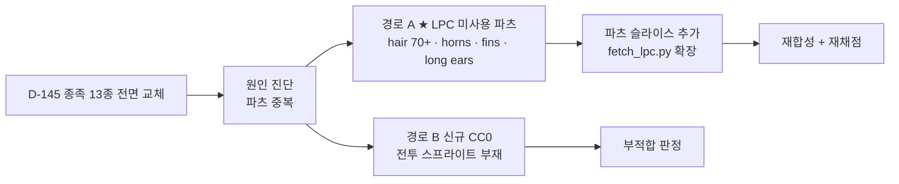

# 🔍 종족 재설계 후보 소스 조사 (13종 전면)

> [!note] 이 문서는?
> **L8 §52 종족 외형 전면 재검토** — D-145 채점에서 **종족 13종 전수가 전면 교체(7/35)** 판정 → 재설계할 후보 소스 조사 (트랙 B 3단계 · D-148).
> 결론 요약: **LPC 미사용 파츠 재합성이 최적 경로** — 같은 소스(GitHub)라 **추가 라이선스 부담 0** · 기존 파이프라인(compose_lpc_races/color) 재사용.

---

## 1. 원인 진단 — 왜 13종이 전부 1점인가

현재 합성 파츠 구성을 분석한 결과 **종족 간 실루엣 중복이 구조적**입니다 (`art/out/lpc_race_compose.json` 실측):

| 종족 | 현재 파츠 | 문제 |
|---|---|---|
| human · genasi · halfling | **완전 동일** (base/human + pants + gloves + leather + head/human + hair/bob) | 실루엣 구분 불가 — 틴트로만 구분 |
| highelf · woodelf · darkelf · seaelve | **완전 동일** (ears/elven만 추가) | 엘프 4종 구분 불가 |
| dwarf · gnome | balding + (dwarf만 beard/basic) | 수염 유무만 다름 |
| felid · houndkin | cat/wolf 귀+꼬리 | 구분 가능 (유일) |
| tengu | wings/feathered | 날개만 추가 |
| lizardman | head/lizard + tail/lizard | 구분 가능 |

> **핵심**: `compose_lpc_races.py`의 RACES 맵이 **미사용 LPC 파츠를 거의 활용하지 않음** — 슬라이스된 파츠가 귀 3종 · 머리카락 2종 · 수염 1종뿐이라 종족 형질(귀/뿔/지느러미/발굽)을 표현할 수단 자체가 없었습니다.

## 2. 경로 A (권장) — LPC 미사용 파츠 재합성

### 2.1 LPC 저장소에서 확인된 미사용 파츠 (GitHub 실측 2026-08-14)

| 파츠 | 미사용 변형 | 종족 활용 |
|---|---|---|
| **head/ears** | `long` (롱이어) · `dragon` (용귀) · `lykon` (늑대) · `big` · `medium` · `down` · `hang` | 시 엘프=long · 드래곤본=dragon · 견인족=lykon |
| **head/horns** | `curled` (말린 뿔) · `backwards` | 정령족(원소) · 악마계열 — **뿔 = 실루엣 즉시 확대** |
| **head/fins** | 지느러미 | 시 엘프 (물속성) |
| **head/faces** · nose · wrinkles | 얼굴 변형 | 종족 얼굴 차별화 |
| **feet** | `hoofs` (발굽) · `sandals` · `boots` · `shoes` · `slippers` · `socks` | 하프링=맨발/sandals · 사티르류=hoofs |
| **hair** | **70+ 종** (현재 bob/balding 2종만 사용) | 드워프=수염+braid · 엘프=long · 하프링=curly 등 |
| **beards** | (현재 basic 1종만) | 드워프 수염 다양화 |
| **facial** | earrings · glasses · monocle · masks · patches | 종족 장식 · 캐릭터성 |
| **shoulders · cape · hat · shield · quiver · tools · weapon** | 갑옷/무기 | **역할 인식 (E축) 해결** — 파티 진형 역할 표현 |

> [!note] 라이선스
> **같은 소스** — LPC Universal (GitHub LiberatedPixelCup) · **D-117 사용자 승인 + D-141 라이선스 원문 대조 완료** (CC-BY-SA/GPL/OGA-BY 파츠별). 추가 슬라이스는 **기존 CREDITS.csv · lpc_meta.json 확장**으로 처리 — 신규 외부 소스 아님 → ASSET_IMPORT_POLICY §5 5단계의 '신규' 절차 단순화 (동일 소스 확장 = 1·2단계 재검증만).

### 2.2 종족별 재합성 계획 (스펙 → 파츠)

| 종족 | 재설계 파츠 (신규 활용) | 해결 축 |
|---|---|---|
| **인간** | hair 다양화 + weapon (역할별) | 역할 인식 (E) |
| **정령족** | horns/curled + 원소 hair (fire/wave) | 종족성 (D) · 이름 인식 (A) |
| **하이 엘프** | ears/elven 유지 + long hair | 종족성 (D) |
| **우드 엘프** | ears/elven + hood/cape + green | 종족성 (D) · 역할 (E) |
| **다크 엘프** | ears/elven + dark robe + hood | 종족성 (D) |
| **시 엘프** | **ears/long + fins** + water blue | 종족성 (D) · 실루엣 (C) |
| **드워프** | beard 다양화 + braid + shoulders | 종족성 (D) · 실루엣 (C) |
| **노움** | big nose + hat (pointed) | 종족성 (D) · 실루엣 (C) |
| **하프링** | **feet/sandals (맨발)** + curly hair + 짧은 체형 | 종족성 (D) · 역할 (E) |
| **묘인족** | ears/cat + tail/cat 유지 + face | 유지 보강 |
| **견인족** | ears/lykon + tail/wolf + fur | 유지 보강 |
| **조인족** | wings/feathered + beak face | 종족성 (D) |
| **리자드맨** | head/lizard 유지 + tail/lizard + scales | 유지 보강 |

### 2.3 실행 경로

1. `fetch_lpc.py` 확장 — 필요한 파츠 시트만 추가 다운로드 (GitHub 저장소)
2. `slice_lpc.py` 확장 — 신규 파츠 슬라이스 (기존 lpc_meta.json 스키마)
3. `compose_lpc_races.py` RACES 맵 갱신 — 종족별 형질 파츠 배치
4. `compose_lpc_color.py` 재실행 — 원본색 13종 재생성
5. 프리뷰 재생성 + **재채점** (D-145 도구) — 종족성/실루엣 3점 이상 목표

## 3. 경로 B — 신규 CC0 소스 (조사 결과 · 부적합)

| 후보 | 해상도 | 라이선스 | 판정 |
|---|---|---|---|
| Top Down 2D JRPG 32×32 Characters (OGA) | 32×32 | **혼합** (수집 컬렉션 — 저자별 상이) | ❌ 전투 스프라이트 부재 · 라이선스 혼합 |
| Fantasy Portrait Pack (Ravenmore) | 64~256 | CC-BY | ❌ 초상화 전용 (게임 스프라이트 아님) |
| CC0 Portraits (OGA) | 다양 | CC0 | ❌ 초상화 전용 |
| CraftPix Fantasy Collection | 32×32 | **유료/크레딧** | ❌ 라이선스 불일치 |

> **결론**: 13종 전부를 완성 스프라이트로 제공하는 CC0 팩은 **조사 결과 부재** (ASSET_IMPORT_POLICY §3 리서치 핵심 발견 ①과 동일 — 고해상도 무료 팩 희소). **파츠 모듈러(LPC)가 유일한 실현 가능 경로**이며, 이는 §52 '종족 전면 재검토'의 해법이 '새 소스 도입'이 아니라 '**기존 소스의 파츠 확장**'임을 뜻합니다.

---

## 4. 판정 (D-148)

- **경로 A 채택 (권장)**: LPC 미사용 파츠 슬라이스 + 재합성 — 라이선스 부담 0 · 기존 파이프라인 재사용 · 종족 형질(귀/뿔/지느러미/발굽)이 실루엣 차별화 제공
- **경로 B 보류**: 신규 CC0 팩 조사 결과 전투 스프라이트 공급원 부재 — 추후 재검토 (조사 갱신 시)
- **실행**: fetch_lpc.py → slice_lpc.py → compose_lpc_races/color → 프리뷰 재채점 (25점 이상 목표)

---

## 🔗 관련 문서

| 문서 | 관계 |
|---|---|
| [[몬스터_재설계_스펙_Tier1]] | 종족 13종 재설계 스펙 (§2) |
| [[ASSET_IMPORT_POLICY]] | 소싱 절차 5단계 · 라이선스 (LPC D-117/141) |
| [[아트규칙_2.5D]] | LPC 파이프라인 §9 · 팔레트 스왑 §2.3 |
| [[결정로그_DecisionLog]] | D-145 (채점) · D-146 (스펙) · D-148 (본 조사) |
