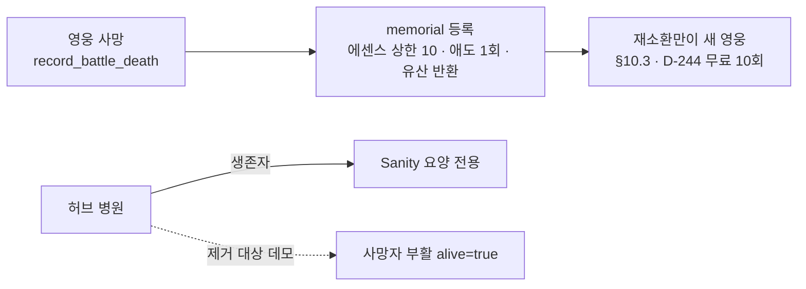

# ADR-6 — 병원 부활과 영구 사망 (Permadeath) 모순 해소 (D-248)

> [!important] 판결 요지 (D-248 · 2026-09-09)
> **병원은 생존 영웅의 정신 요양(Sanity 회복) 전용이다.** 사망자 부활 기능은
> 존재하지 않는 것이 정규이며, `hub_scene.gd`의 데모 부활 분기는 제거 대상이다.
> 구출/부활 규칙은 Legacy Core(D-236)와 동일하게 **출시 제외·확장 업데이트
> 후보**로 분류한다. 전체 판결은 [[결정로그_DecisionLog]] D-248 행.

## 1. 문제 (Context)

GDD v7.12 §7.1은 **"영웅 사망 = 영구 사망, 재소환 불가"**를 게임의 핵심 규칙으로
정본화했다(§1 핵심 재미 요소 ①「영구 사망의 긴장감」도 동일). 그러나 현재 런타임
`hub_scene.gd` `_handle_hospital()`은 데모 목적으로 작성된 부활 경로를 가진다:

- `hub_scene.gd:707-730` — 사망자가 존재하면 골드 500 지불 시 사망자 전원의
  `alive`를 `true`로 되돌린다 (`# 병원 — 부활/정신 치료 (§7.1 · 비용은 데모 정의`).
- `game_scene_manager.record_battle_death`는 memorial 등록·로스터 비활성화·
  편성 정리·에센스 환급(상한 10)·애도 보상(세이브 1회)까지 수행하는 **영구 사망
  트랜잭션**이다 (D-217/218, `defeat_cycle_check` 7/7 검증).

결과적으로 하나의 세이브 안에서 두 규칙이 충돌한다: 전투 사망은 영구 사망인데,
허브 병원에서 500골드로 전원 부활이 가능하다. 이는 ① 규칙 정본(§7.1) 위반,
② 사망 경제(D-217/218) 무력화 — 영혼석 유입의 유일한 소모처인 재소환(10)을
우회, ③ memorial·애도·환급 시스템과의 서사적 모순(부활한 영웅은 기록관에
죽은 영웅으로 남아 있음)을 낳는 **출시 차단(P0) 결함**이다.

RELEASE_READINESS §3 P0 및 GDD §20.8은 이 충돌에 대해 "병원 부활을 제거하거나,
구조/구출 규칙으로 명시하는 별도 ADR"을 요구해 왔다. 본 ADR이 그 요건을
충족한다. 판결 전체는 결정로그 [[결정로그_DecisionLog]] **D-248** 행으로 등록됐다.

## 2. 검토한 선택지 (Options)

| 선택지 | 내용 | 판정 |
|---|---|---|
| A. 데모 부활 제거 | 병원 = 생존자 Sanity 요양 전용 (§7.1 원문 준수) | **채택** |
| B. 구조/구출 규칙 신설 | 부활을 유료 구출로 정본화 (memorial 수정·환급 회수 등 별도 규칙 필요) | 기각 |
| C. 현상 유지 | 데모 경로를 출시까지 유지 | 기각 |

**B를 기각한 근거:** 구출 규칙은 단순한 `alive=true` 1줄이 아니라 memorial 기록의
진실성(죽었던 사실을 지워야 하는가), 애도 보상 1회 플래그(`mourning_paid`)의
회수 여부, 에센스 환급의 반환, 소셜 관계·기억 데이터의 정합까지 재정의해야 하는
신규 시스템이다. D-236(출시 범위 확정)이 Legacy Core를 "이번 출시 범위 제외"로
판결한 것과 같은 맥락에서, 사망 되돌리기는 **출시 후 확장 업데이트 후보**로
분류하는 것이 정확하다. 필요해지면 본 ADR을 대체하는 신규 ADR로 결정한다.

**C를 기각한 근거:** 부활은 승리/전멸 보상 설계(D-218 "승리 > 전멸")의 전제인
"잃으면 끝"을 무력화한다. 데모 코드가 정본 규칙을 덮는 상태는 출시 차단이다.

## 3. 결정 (Decision) — A 채택

1. **병원의 제품 규칙은 §7.1 그대로: 생존 영웅의 정신 요양(Sanity 회복) 전용.**
   사망자 부활 기능은 존재하지 않는다.
2. **`hub_scene.gd` `_handle_hospital()`의 부활 분기 제거**가 유일한 코드 변경이다.
   사망자 존재 시에도 `_handle_hospital_care()`(Sanity 요양)로 진입하도록
   통일한다. 비용 체계(요양 30골드 등 데모 정의값)는 본 ADR 범위 밖이며,
   §7.1 시설 수치 정본화 시 별도 결정으로 확정한다.
3. **사망 영웅의 유일한 후속은 기존 트랜잭션 그대로다:** memorial 등록 → 에센스
   환급(상한 10, D-217) → 애도 보상(세이브 1회, D-218) → 장비 유산 반환(D-237) →
   재소환만이 새 영웅을 얻는 길(§10.3, D-244 무료 10회 포함).
4. **확장 후보 분류:** "구출/부활 규칙"은 Legacy Core(D-236)와 동일하게
   출시 제외·확장 업데이트 후보로 기록한다. 구현 시 신규 ADR이 필요하다.

## 4. 구현 인계 (Handoff — 병행 세션 영역)

- **소유 파일:** `scripts/hub_scene.gd`는 병행 세션(Orca) 작업 중 — 본 ADR만으로는
  코드를 수정하지 않는다. 병행 세션의 현재 작업 트리가 안착된 뒤 본 ADR §3.2대로
  제거한다.
- **변경 사양 (약 3줄):** `_handle_hospital()`에서 `dead` 비어 있음 검사와 부활
  다이얼로그 블록(707~730)을 삭제하고, 함수 전체를 `_handle_hospital_care()`
  위임으로 단순화. `COPY.HOSPITAL_ASK`(부활 확인 문구)는 요양 문구로 교체 또는
  미사용 처리.
- **회귀 하네스 (신규, 본 ADR 요건):** `hospital_rule_check.gd` — ① 사망자 존재
  상태에서 병원 경로 호출 → 부활(`alive` 변화)이 발생하지 않음을 단정 ② 생존자
  Sanity 요양 경로 정상 동작 ③ memorial·로스터 비활성화 불변. headless PASS +
  `defeat_cycle_check` 7/7 회귀를 통과해야 한다.
- **문서 동기화:** 제거 후 GDD §20.8의 "구현 차이" 경고 박스를 "해소"로 갱신하고,
  `hub_facility_check`의 병원 케이스가 있다면 기대값을 갱신한다.

## 5. 게이트 (Verification Gates)

| 게이트 | 기준 |
|---|---|
| 신규 `hospital_rule_check` | 부활 0건 단정 + 요양 경로 PASS + SCRIPT ERROR 0 |
| `defeat_cycle_check` | 7/7 — 영구 사망 트랜잭션 회귀 없음 |
| `s2_death_check` | 21/21 — memorial·환급·애도 회귀 없음 |
| `hub_facility_check` | 기존 PASS 유지 (병원 케이스 갱신분 포함) |
| 실세이브 센티널 | 전 게이트 실행 전후 바이트 동일 |

## 6. 영향 (Consequences)

- **긍정:** §7.1 정본과 런타임이 일치 — 퍼머데스가 실제 규칙이 됨. 사망 경제
  (D-217/218)와 memorial/애도/유산(D-237) 시스템의 전제가 하나로 고정됨.
  RELEASE_READINESS P0 1건 소멸.
- **부정/수용:** 사망 복구 수단이 사라지므로 초반 난이도 체감 상승 → D-244 무료
  소환 10회·에센스 환급·애도가 완충 역할. 플레이테스트(외부 P1 게이트)에서
  전멸 스파이크 관찰 필요.
- **잔여:** 병원 요양 비용의 정본화(현재 데모값), 구출 규칙은 확장 후보로 유보.

## 🔗 관련 문서

| 관계 | 문서 |
|---|---|
| 📌 판결 등록 | [[결정로그_DecisionLog]] (D-248) |
| 📖 규칙 정본 | [[SoulCommander_GDD_v7.12]] §7.1 · §20.8 |
| 🚦 출시 게이트 | [[RELEASE_READINESS]] §3 P0 |
| 🔖 선례 | D-217(환급 상한) · D-218(애도 1회) · D-236(범위 제외 판결) · D-237(유산 반환) · D-244(무료 소환) |
