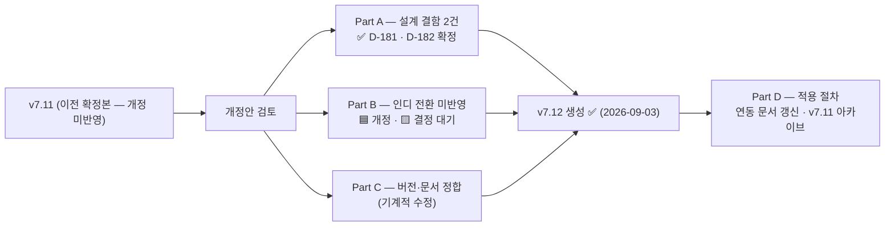

# GDD v7.12 개정안

> [!important] 상태 — v7.12 파일 생성 완료
> 🟢 **v7.12 파일 생성 완료 (2026-09-03)** — Part A 확정(D-181/D-182) + Part C 기계 정리 반영 · **Part B 🟦 11건 본문 반영 완료 (★D-194)** · 🟨 6건(D-A/D-B 기둥)은 결정 대기 박스 유지 — 사용자 결정 필요
> **기준 문서:** `docs/GDD/01_기획/SoulCommander_GDD_v7.11.md` (이전 확정본)
> **생성 파일:** `docs/GDD/01_기획/SoulCommander_GDD_v7.12.md` (현행 확정본)
> **정본 우선순위:** 런타임 코드 > GDD > `BALANCE_TUNING.md` (DRAFT)

## 🔗 관련 문서

| 문서 | 관계 |
|---|---|
| [[SoulCommander_GDD_v7.11]] | 이전 확정본 — 개정 기준 |
| [[SoulCommander_GDD_v7.12]] | 현행 확정본 — Part A~C 반영 완료 |
| [[결정로그_DecisionLog]] D-181 · D-182 · D-184 | Part A 확정 근거 · 클래스 보정 미구현 판정 |
| [[GDD_§10.1_행동력_개정_초안]] | Part B-13 연동 — AP 개정 초안 |
| [[클래스위치보정_구현설계]] | D-184 후속 — §8.9 클래스 보정 구현 설계 |
| `docs/BALANCE_TUNING.md` §4.2·§4.5·§6.5 | 밸런스 연동 (DRAFT) |
| 开发-plans/SOUL_COMMANDER_개발플랜_v2.0_통합안 | 통합 플랜 — D-D(AP) · D-A/D-B(플랫폼·수익화) |

## 1. 이 문서의 목적

v7.11이 "최신 확정본"이라는 지위를 유지하지 못하는 상태입니다 —
본문에 08-23~28 결정(D-172/175/176)과 08-27 결함 표시가 편입된 채 버전만 v7.11로 남아 있고,
2026-08-28 인디 전환(라이브 요소 제거)은 §11/§14 취소선 외에 반영되지 않았습니다.

이 개정안은 **v7.12로 승격할 때 고쳐야 할 항목**을 두 갈래로 정리합니다:

- **Part A — 확인된 설계 결함 2건** (✅ D-181/D-182로 확정 — 2026-09-03)
- **Part B — 인디 전환 미반영 항목** (제거/변경/결정 대기 분류)
- **Part C — 버전·문서 정합 정리**
- **Part D — 적용 절차**

---

## Part A. 확인된 설계 결함 (✅ 확정 — D-181 · D-182 · 2026-09-03 사용자 승인)

### A-1 🔴 방어 관통 수식 — 부호 결함 (`GDD §8.6` / §18.2 마법학자 세트)

| 항목 | 내용 |
|---|---|
| 현행 문구 (GDD §8.6 ③) | `단일 피해 = (ATK × 스킬계수 × 속성보정) × (1 - 해당 피해감소율) × (1 ± 위치 보정) × (1 - 방어 관통)` |
| 의도 (GDD §8.6 각주·§18.2) | "마법학자 2세트 = 대상 **M.DEF 10% 무시**" — 관통이 클수록 피해가 **늘어야** 함 |
| 실제 동작 | `×(1 - pen)` 이므로 관통이 커질수록 피해가 **감소** — 의도와 반대 |
| 코드 상태 | 문서 오타가 아님 — `client_godot/scripts/data/game_data.gd:288`도 동일 수식. 다만 호출부 6곳이 `penetration` 인자를 넘기지 않아 현재 **영향 0** (배선 전) |
| 원인 | "DEF 10% 무시"를 (1-pen) 곱셈으로 오해 → 실제로는 DEF **감소율 완화**여야 함 |

**수정안 (BALANCE_TUNING §4.2 — ✅ D-181 채택):**

| 안 | 수정 내용 | 영향 |
|---|---|---|
| **✅ A. 감소율 완화 (D-181 채택)** | `피해감소율 = (DEF × (1-pen)) / (DEF × (1-pen) + 200)` — 관통이 DEF를 실제로 깎음 | "M.DEF 10% 무시" 문구와 의미 일치. GDD L550 수식 문구 수정 필요 |
| ~~B. 곱셈 증폭~~ (반려) | `× (1 + penetration)` — 부호만 반전 | DEF 0 대상에도 +10% 균일 증뎀 = "무시"가 아니라 "피해 증폭" — 문구·세트 정체성과 불일치로 반려 |

**v7.12 반영 시 수정 위치:** §8.6 ③ 수식 + 각주("M.DEF 10% 무시" 설명), §18.2 마법학자 2세트 표.
**상태: ✅ 확정 (D-181 — 2026-09-03 사용자 승인 · A안 채택).** `penetration` 인자를 넘기는 코드 추가(배선)는 D-E3(마법학자 세트 실효 배선) 시점까지 보류. **★D-185/D-186 갱신 (2026-09-03):** 세트 관통 수치는 몬스터 M.DEF 실측(§4.2-1 — 중앙 5·상한 80)으로 p=10%는 논보너스(+0.1~1.8%) 확인 → **15~20% 상향 기록 확정(★D-186)** + 정체성 실현 축은 **M.DEF 곡선 상향(T4~5: 80→200~400대 — §9.7 ★D-190 반영)**. 정확 값은 곡선 개정 후 배선 시 확정.

### A-2 ⚠️ 위치 보정 — GDD vs 런타임 불일치 (`GDD §8.6 ③` / §8.9 / §8.10)

| 위치 | GDD v7.11 §8.9 | 런타임 `position_system.gd:11~15` |
|---|---|---|
| 전방 | 1.0 | 1.0 |
| 측면 | **1.15** (+15%) | **1.10** (+10%) |
| 배후 | **1.30** (+30%) | **1.25** (+25%) |
| 고지대 | (규정 없음) | 1.15 |
| 커버 | (규정 없음) | 피해 ×0.75 |

- §8.6 ③·§8.9·§8.10이 모두 "측면 +15% / 배후 +30%"를 가정해 서술됨 (8.10 "위치 보정은 상대 각도 기준으로 유지" 등).
- 런타임은 +10%/+25%로 동작한다.
- **★정정 (2026-09-03 — 시뮬 실측):** 종전 문구 ~~'게이트키퍼 승률 시뮬레이션(D-52·D-69·D-83)은 런타임 값 기준 · 임의 변경 시 전부 무효화'~~는 **부정확** — `bossWinrateSim.py`는 측면/배후 위치 배율을 **모델링하지 않으므로**(파티→보스 평면 ATK · 보스→파티 행 기반 + A-2 기하 토글) 위치값(+10/+25 vs +15/+30)과 **무관**하다. 위치값에 민감한 것은 **D-176 실플레이 페이싱(파티 DPS ~48/s — 위치 배율 간접 반영 · 파티 DPS +1.0~2.7% 델타)뿐**. (BALANCE_TUNING §4.5 · 결정로그 D-182 정정 반영)

**수정안 (✅ D-182 채택):**
1. **✅ 런타임 값(+10/+25)을 정본으로 채택** → GDD §8.6·§8.9·§8.10 문구 일괄 수정 (D-52/69/83 게이트키퍼 시뮬레이션은 위치 무관이라 영향 없음 · D-176 실플레이 페이싱 정합 보존 · 암살자 배후 +50%·궁수 측면 +20%의 상대 가중은 유지)
2. ~~문서 값(+15/+30)을 정본으로 채택~~ (반려 — ★정정: ~~기존 시뮬레이션 전부 무효화~~는 사실이 아님 · 반려 사유는 ① 정본 우선순위(런타임 > GDD) ② 자동전투에서 위치 보상 과대는 AI 배치 운 편차만 확대)

**v7.12 반영 시 수정 위치:** §8.6 ③ 수식의 "(1 ± 위치 보정)" 각주, §8.9 위치 보정 라인, §8.10 "위치 보정" 행, §8.6 ④ 및 암살자/궁수 특성 표기.
**상태: ✅ 확정 (D-182 — 런타임 값 정본 채택).** 측면 **+10%** · 배후 **+25%** 로 §8.6③·§8.9·§8.10 일괄 정정, **고지대 +15% · 커버 ×0.75는 §8.9에 신규 규정**으로 추가. **후속 ✅ 완료 (D-184 — 2026-09-03):** §8.9 클래스 보정(암살자 배후 +50% · 궁수 측면 +20%)은 **런타임 미구현 확인** → **'미구현/후속' 표기로 확정** (v7.12 §8.9 ⚠️ 박스 반영). 실측: `position_system.gd` 클래스 분기 0 · 데미지 경로 4곳 클래스 항 0 · `skills.json` `multConditional`(암습 배후 3.0 · 야수 습격 2.8) .gd 소비처 0 · '암살자 배후 +50%'는 데이터 대응조차 없음(설계 잔재). 실제 구현은 통합 플랜 S1(전투 수직 슬라이스) 이후 별도 판단.

---

## Part B. 인디 전환 미반영 항목 (2026-08-28 전환 기준)

> 전환 근거: AGENTS.md 인디 전환(2026-08-28) + 커밋 `a11f0f33`→`c8ac2e04` + `server/README.md` 중단 표기 + GDD §11/§14 취소선.
> 분류: 🟥 제거 · 🟦 변경(개정) · 🟨 방향 미정(결정 대기 — 통합안 D-A/D-B 연동) · ✅ 이미 반영

| # | GDD 위치 | 현행 문구 (요약) | 인디 전환 기준 | 개정 방향 |
|---|---|---|---|---|
| B-1 | §1 Executive Summary | 타겟 iOS/Android · 업데이트 6주마다 5층 | 플랫폼 미정(Steam 후보) · 라이브 업데이트 폐지 | 🟨 "런칭 1~20층/약 15~18시간" 유지, 플랫폼·업데이트 문구는 결정 후 수정 |
| B-2 | §2.1 장르 | "2.5D 수집형 전략 RPG" + 영지 + 로그라이크 | 가챠 수집 강조 약화 | 🟨 장르 재정의(퍼머데스 전략 RPG 중심) — D-B 결정 후 |
| B-3 | §4.1 계정 | UID Snowflake·서버 계정 구조, ClearFloor | 로컬 세이브 전환 | ✅ 로컬 프로필 구조로 개정(세이브 1계정 — `game_state` 단일 덤프) | (★D-194 본문 반영)
| B-4 | §4.3 서버 선택 | 일반/하드코어 서버 + 랭킹/칭호 | 서버·랭킹 폐지 | ✅ "하드코어 모드(로컬, 보상 +50%)" 단일 규칙으로 개정 — 서버 분리는 제거 | (★D-194 본문 반영)
| B-5 | §5.1 확률표/천장 | ★1 70% ~ ★5 0.1% · 소프트/하드 천장 | 인디 프리미엄에서 가챠 유지 여부 미정 | 🟨 §11(과금) 취소선과 별개로 §5는 **살아있음** — D-B에서 유지/변경 결정 |
| B-6 | §5.2 파이프라인 0/1단계 | "시드 SHA-256(UID+Timestamp+Salt) + 서버 상태 천장 보정" | 서버 없음 | ✅ 로컬 시드로 개정(세이브 시드·머신 시드), 15단계 구조 자체는 유지 | (★D-194 본문 반영)
| B-7 | §5.6 계보 지정 소환 | "계약서 2배 소모" | 계약서 재화 폐지 여부 미정 | 🟨 재화 재설계(D-B) 후 수정 |
| B-8 | §7.2/7.3 전술소 비용 | 골드+목재+철광석+심연결정+초월석 | 재화 축소 여부 미정 | 🟨 일부 재화(심연결정·초월석)는 유지 가능 — D-B 결정 |
| B-9 | §9.4 요일 던전 | 월~일 개방 3종 + 초/중/고급 | **WeeklyDungeon → 특정 층 고정 보스로 변경** (AGENTS) | ✅ "층 고정 보스 보상" 방식으로 전환 규정(또는 유지 시 D-B 결정) | (★D-194 본문 반영)
| B-10 | §9.5 탐험(Expedition) | 4층 해금 파견 2~4슬롯 | **Expedition → 전투에서 직접 전리품 획득** (AGENTS) | ✅ §9.5 삭제/대체 — 전리품 드롭 규칙 신설. (코드: 허브-탑 루프 재편) | (★D-194 본문 반영)
| B-11 | §9.6 소재 채집 | 농장/벌목터/광산/심연 채굴장/마력 결정체 | 유지 (오프라인, AP 무소모) | ✅ 유지 — 문구 점검만 |
| B-12 | §10 재화 18종 | 다이아·계약서·명성·명예코인(PvP)·길드코인·이벤트코인·시즌토큰 등 | PvP·길드·시즌 패스 폐지 | ✅ **인디 재화 목록 재정의**(예: 골드/영혼석/식량/목재/철광석/심연결정/초월석/강화석/룬/각성석 + α) — D-B 결정 | (★D-194 본문 반영)
| ~~B-13~~ | ~~§10.1 행동력~~ | ~~명조식 240/1AP 6분/다이아 충전 6회/결정 파동판 960/일일 상한 1,200~~ | **전투 기반 회복(적 처치 시 1AP)·무제한 플레이·로컬** (코드 `IndieStaminaSystem` 반영 완료) | ✅ **해제 (★D-187 — 2026-09-03): D-D 확정** — §10.1 본문을 초안 4장 문안으로 교체(v7.12 §10.1 ✅ 박스 · v7.11도 동일 반영 — 보존본). 잔여: 회복률 재검증(S1) · 차원의 틈 잔존(S3) · 구식 코드 정리(S0) |
| B-14 | §11 과금 구조 | 취소선 + "[일시 중단]" | $15~20 일회성 구매 (미확정) | 🟨 취소선을 유지하되 "폐지(아카이브 이동)"로 정리 or D-B 후 재작성 |
| B-15 | §12.2 개발 일정 | Pre-Alpha 1~3개월 ~ 런칭 9~10개월 (모바일) | 방향 미정 | 🟨 v7.12에서 **일정 표는 통합안(S0~S6) 참조로 교체**하거나 삭제 |
| B-16 | §14 라이브 운영 | 취소선 + "[일시 중단]" | 라이브 폐지 확정 | ✅ 챕터 **제거** — 내용은 아카이브 문서로 분리 | (★D-194 본문 반영)
| B-17 | §19/§20.8 보스·사망 | "서버, 이중 커밋" 플로우 | 로컬 세이브 | ✅ 로컬 트랜잭션(세이브 쓰기 순서 + 버전)으로 단순화 명시 | (★D-194 본문 반영)
| B-18 | §20 DB (tb_*) | MySQL 계정/행동력/관계 등 16+ 테이블 | 서버 DB 폐지 | ✅ "레거시 참조(서버 설계)" 표기 + 로컬 세이브 JSON 스키마로 대체 (아키텍처 문서와 정합) | (★D-194 본문 반영)
| B-19 | §21.3 기술 제약 | 30fps · 서버 3,000 CCU · 200ms · Anti-Cheat AES-256 | 서버 제약 폐지 | ✅ 로컬 기준으로 개정 (프레임/저장/기기 사양만 유지) | (★D-194 본문 반영)
| B-20 | §22 최종 평가 | "경제·과금 정합성 10/10", "서버 권위" 전제 문구 | 전환 후 재평가 필요 | ✅ 평가표 문구 개정 — 다이아·$450 천장 등 제거 | (★D-194 본문 반영)

> **참고 — 이미 반영된 것:** §9.7 (★D-176 페이싱 ×0.6 노트), §11/§14 취소선 자체, §10.1 일부 인디 주석("본 스코프 제외" 등)은 **부분 반영**. 반면 §10.1 본문 표(240/충전/파동판)는 **미반영** (B-13).

---

## Part C. 버전·문서 정합 정리 (결정 불필요 · 기계적 수정)

| # | 위치 | 문제 | v7.12 조치 |
|---|---|---|---|
| C-1 | frontmatter | `version: v7.11` · `updated: 2026-08-11` 이지만 본문에 08-23~28 편집 혼재 | **v7.12 + updated 갱신**, 개정 이력 표 추가 — ✅ v7.12 생성 시 반영 · updated 2026-09-05 재갱신 |
| C-2 | §8.7/§8.10 | 본문에 "★v7.12 정정" 인용 (자기보다 위 버전) | v7.12 통합 후 "정정" 표기는 이력으로 이동 — ✅ v7.12 생성 시 해소 실측 + 잔존 버전 태그 정리 (시너지 (v7.11)·최종 선언 (v7.11)·§15 · 2026-09-05) |
| C-3 | §8.6 ② | 08-27 결함 박스(`[!bug]` 관통) | ✅ A-1 확정(D-181) — 박스 제거 → 감소율 완화 정본 문구 |
| C-4 | §8.6/§8.9 | 08-27 경고 박스(위치 보정 미확정) | ✅ A-2 확정(D-182) — 박스 제거 → 런타임 값 정본 문구 |
| C-5 | §7.1 | "종족 × 영지 시너지" 문단 **2회 중복** | 중복 1건 제거 — ✅ v7.12 생성 시 이미 제거됨 실측(1건만 존재 · 수치 Bestiary §8 대조 정합) · '하이엘프→하이 엘프' 띄어씀 정리 (2026-09-05) |
| C-6 | §6.2 vs §20.1 | 레벨 상한: §6.2/D-172 = **Lv.100 전 등급 공통** vs `tb_hero.level 1~60` | §20 스키마를 Lv.100으로 정합 (또는 로컬 스키마 개정 시 일괄) |
| C-7 | §6.1/§20.1 | 스탯 모델: HP/ATK/DEF/SPD/MAG(§6.1) vs STR/DEX/INT/CON(§20.1) | 모델 단일화 명시 — §20 로컬 스키마 재정의에서 해소 |
| C-8 | §20.7 tb_stamina | GDD 표기(최대 240) vs DevPlan §1.2 DDL(CHECK 0~300, D-23) | 로컬 AP 규칙(B-13) 확정 후 §20.7 정합 |
| C-9 | 도감/데이터 수 | monsters: 설계 55종(도감) · INDEX 56 ID · **`data/monsters.json` 74** | "런타임 몬스터 74 ID = 현행 정본" 명시, 55/56은 역사 수치로 표기 |
| C-10 | §1/§21.3 등 모바일 전제 | 해상도·플랫폼 문구 — 실제 프로젝트는 1920×1080 가로 | 플랫폼 결정(D-A) 전 "미정" 표기 또는 문구 일반화 |

---

## Part D. 적용 절차 (제안)

1. **이 개정안 검토** — ~~Part A~~ **완료(D-181/D-182)** · Part B의 🟨 항목은 **사용자 결정 필요**.
2. **결정 로그 발급** — ✅ **A-1(D-181)·A-2(D-182) 발급 완료** (2026-09-03). **✅ B-13(AP) → ★D-187 (2026-09-03) 발급 완료** — §10.1 문안 확정 반영. 잔여: D-A/D-B(플랫폼·수익화) 등은 발급 후 v7.12에 반영.
3. ~~**v7.12 파일 생성** — v7.11을 복사 → Part A~C 적용 → frontmatter(v7.12)·개정 이력 작성.~~ **✅ 완료 (2026-09-03)**
   - ~~미결정 항목이 남은 상태로 생성할 경우 해당 항목에 `> [!warning] 결정 대기` 박스를 유지한다.~~ — 반영: Part B 대상 섹션 14곳(§1·§2.1·§4.1·§5.1·§7.2·§9.4·§9.5·§10·§10.1·§12.2·§20·§20.8·§21.3·§22)에 박스 삽입 완료. §11/§14는 기존 취소선+일시 중단 표기 유지.
4. **연동 문서 갱신** — `AGENTS.md`(기준 GDD 경로·플랫폼 문구), `docs/INDEX.md`, `BALANCE_TUNING.md`(DRAFT→결정 반영), 통합 개발플랜 v2.0 §6.
5. **기존 v7.11 보존** — `docs/GDD/` 내 아카이브 규칙에 따라 과거 버전 문서로 분리(현 트리에 아카이브 폴더 부재 — 배치 확정 필요).

---

## 부록 1. 연계 결정 대기 목록 (이 개정안 밖 · 참조)

| 항목 | 출처 | 상태 |
|---|---|---|
| 치명타/회피 확률 **미구현** (§8.9) | BALANCE_TUNING §4.3/§4.4 | ⬜ 제안 |
| 장비 D-E1~E3 (강화 스탯폭 · 세트 2/4/6 vs 슬롯 4 · 세트 실효 배선) | BALANCE_TUNING §6.5 | 🟡 결정 대기 (D-E3 수치축은 ★D-190 확정 — 배선·p값은 S1/S3) |
| 영지 시설 효과 배율(제안값) · 대장간 시설 부재 · 미니게임 미구현 | BALANCE_TUNING §8 | 🟡 결정 대기 |
| ~~AP 최종 규칙~~ | ~~통합안 D-D / Part B-13~~ | ✅ **확정 (★D-187 — 2026-09-03)** · 세부 수치(+1/처치)만 S1 플레이테스트 재검증 |

## 부록 2. 정본 우선순위 재확인

> 1. **런타임 코드**(루트 단일 구조 — ★D-192 S0 A안 · 전투 코드는 S1 신규 구현) · 2. **GDD v7.12(개정 후)** · 3. GDD v7.11(이전) · 4. `BALANCE_TUNING.md`(DRAFT)
> v7.11의 "확정본" 지위는 v7.12 승격으로 종료되며, 이 문서가 승격 체크리스트 역할을 합니다.
