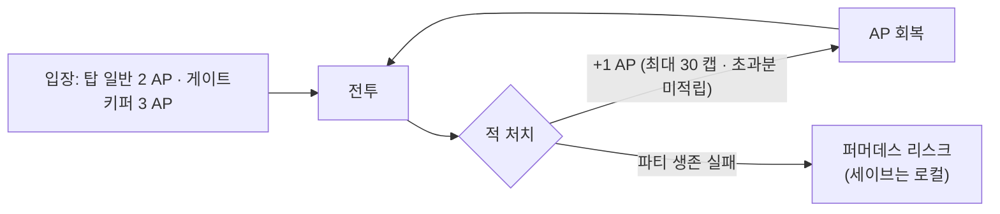

# GDD §10.1 행동력 시스템 — 개정 초안 (코드 정합)

> [!success] 상태 — ✅ 채택 확정 (★D-187 — 2026-09-03)
> **4장 문안이 D-D(AP 최종 규칙)로 확정** — v7.12 §10.1 본문에 반영 완료 (v7.11은 보존본으로 동일 문안 + 정본 링크).
> 잔여(결정값 아님 · 후속): 회복률 재검증 = S1 플레이테스트 · 차원의 틈/요일 던전 잔존 = S3 · 구식 코드 정리 = S0.
> **기준 코드:** `client_godot/scripts/world/indie_stamina_system.gd` (2026-08-28 인디 전환 · HEAD)
> **정본 우선순위:** 런타임 코드 > GDD(v7.12) > v7.11(보존) > `BALANCE_TUNING.md` (DRAFT)

## 🔗 관련 문서

| 문서 | 관계 |
|---|---|
| [[GDD_v7.12_개정안]] Part B-13 | AP 개정 경로 — v7.12 반영 연동 |
| [[SoulCommander_GDD_v7.11]] §10.1 · §10 재화 표 18행 · §1 일일 리듬(117행) | 개정 대상 — 명조식 AP 규정 (현행) |
| [[SoulCommander_GDD_v7.12]] §10.1 | 현행 확정본 — 초안 반영 대상 |
| [[결정로그_DecisionLog]] | D-D(AP 최종 규칙) 결정 연동 예정 |
| [[개발플랜_DevPlan]] | 통합 개발플랜 v2.0 D-D(AP 최종 규칙) |
| `net_deprecated.gd` · `server/README.md` | 코드 잔재 참조 (6장) |

## 1. 개정 이유

v7.11 §10.1은 **명조식 시간-기반 AP**(240/6분/다이아 충전/결정 파동판/일일 상한)를 규정하고 있으나,
2026-08-28 인디 전환으로 런타임이 **전투-기반 회복 · 로컬 · 무제한**으로 먼저 바뀌었습니다.
코드가 문서보다 앞선 대표 사례(B-13)이며, 문서를 코드에 맞춰 전면 개정합니다.

---

## 2. 코드 실측 (정본)

### 2.1 IndieStaminaSystem 동작 요약 (`indie_stamina_system.gd`)

| 항목 | 코드 값 | 비고 |
|---|---|---|
| 최대치 | `MAX_AP = 30` | |
| 시작치 | `INITIAL_AP = 30` | |
| 시간-기반 회복 | **없음** | 제거됨 |
| 회복 수단 | **적 처치 +1 AP** (`on_enemy_killed()`) | 상한 `MAX_AP` 캡 · 초과분 저장 없음 |
| 탑 일반 층 | `AP_COST_TOWER = 2` | |
| 게이트키퍼 층 | `AP_COST_GATEKEEPER = 3` | |
| 요일 던전 (초급/중급) | `dungeon_basic = 2` / `dungeon_mid = 3` | 매핑 키: `dungeon_basic`, `dungeon_mid` |
| 기타/미매핑 던전 | 기본값 `2` 폴백 | `DUNGEON_AP_COSTS.get(id, AP_COST_TOWER)` |
| 충전 | `recharge(amount=10)` — 캐시_shop 레거시 주석 | "인디 게임에서는 제한적" — 실배선 없음 |
| 일일 상한 | **없음** (무제한) | |
| 저장 | `save_data()/load_data()` | `current_ap` · `total_ap_earned` · `total_ap_spent` · `enemies_killed` |
| 시그널 | `stamina_changed(current, max_ap)` · `ap_recovered(amount, current)` | UI/상태 연동 |
| 계측 | `total_ap_earned/spent` · `enemies_killed` | 경제 검증·튜닝 근거용 카운터 |

### 2.2 연동 코드

- `game_scene_manager.gd`: `IndieStaminaSystem`을 `res://scripts/world/indie_stamina_system.gd`에서
  지연 생성 — `game_state["ap"]/["max_ap"]` 미러, `stamina_changed` 구독.
- `save_manager.gd`: 세이브에 `"stamina"` 키로 `save_data()` 결과 저장/복원.
- `net/stamina_manager.gd`·`server/src/staminaService.ts`: 서버형 레거시 — `net_deprecated.gd`에
  "IndieStaminaSystem으로 대체" 명시 · 인디 전환으로 중단.

---

## 3. §10.1 교체 대비 — 구(現행) vs 신(코드) 대조표

| 항목 | v7.11 §10.1 (구) | 개정 (코드 정합) | 처리 |
|---|---|---|---|
| 최대치 | 240 AP (완충 24시간) | **30 AP** | 🟦 변경 |
| 자연 회복 | 1 AP / 6분 | **없음 (시간-기반 폐지)** | 🟥 제거 |
| 회복 | — | **적 처치 시 +1 AP (로컬)** | 🟦 신설 |
| 탑 일반 층 | 40 AP | **2 AP** | 🟦 변경 |
| 게이트키퍼 층 | 60 AP | **3 AP** | 🟦 변경 |
| 요일 던전 초급/중급 | 40 / 60 AP | **2 / 3 AP** | 🟦 변경 |
| 차원의 틈 | 60 AP | 코드 미매핑 → 기본 2 폴백 | 🟨 결정 대기 (D-D) |
| 탐험/채집/영지 시설 | AP 소모 없음 | 유지 | ✅ 유지 |
| 다이아 충전 | +60 AP ×1일 6회 (점진 비용) | **폐지** | 🟥 제거 |
| 월정액 AP 경로 | §11 경유 | **폐지** (§11 인디 전환) | 🟥 제거 |
| 오버플로우(결정 파동판) | 12분당 2개 · 최대 960 | **폐지** — 캡 도달 시 초과 적립 없음 | 🟥 제거 |
| 일일 소비 상한 | 1,200 (D-89) | **없음 — 무제한 플레이** | 🟥 제거 |
| 서버 동기 | 계정/서버 상태 | **로컬 세이브 단일** | 🟦 변경 |

> 범례: 🟥 제거 · 🟦 변경(개정) · 🟨 결정 대기 · ✅ 유지

---

## 4. 개정 문안 (교체 초안)

### 10.1 행동력 시스템 — ★인디 전환 (전투 기반 · 로컬 · 무제한)

> **[2026-08-28 인디 전환]** 라이브 서비스형 AP(시간 회복 · 다이아 충전 · 결정 파동판 · 일일 상한)를
> 폐지하고, **전투 기반 회복 + 로컬 세이브 + 무제한 플레이**로 전환합니다.
> (기준 구현: `IndieStaminaSystem`)

| 항목 | 수치 |
|---|---|
| 최대치 | **30 AP** (시작 30) |
| 회복 | **적 1마리 처치 시 +1 AP** (최대치 초과분은 적립되지 않음) |
| 탑 일반 층 입장 | **2 AP** |
| 게이트키퍼 층 입장 | **3 AP** |
| 요일 던전 (초급 / 중급) | **2 / 3 AP** |
| 탐험 / 채집 / 영지 시설 | AP 소모 없음 (오프라인) |
| 시간-기반 회복 / 충전 / 오버플로우 | **없음** (라이브 요소 폐지) |
| 일일 소비 상한 | **없음** — 무제한 플레이 |
| 저장 | 로컬 세이브 (진행·통계 포함) |

**동작 원리:**
- AP는 "하루 로그인 리듬 강제"가 아니라 **전투 세션의 자원 흐름**으로 재정의됩니다.
  입장 시 소모(2~3) → 전투에서 적 처치로 회복(+1/마리) → 순환.
- 입장 비용이 회복량 대비 작아 AP는 사실상 파밍/도전을 막지 않으며, 플레이 지속성은
  **파티 생존 · 영웅 자원 · 퍼머데스 리스크**가 결정합니다 (세이브는 로컬).
- 통계 카운터(`total_ap_earned/spent` · `enemies_killed`)는 밸런스 검증에 사용합니다.

---

## 5. 함께 수정해야 할 GDD 참조 (드리프트 방지)

| # | 위치 | 현행 | 개정 |
|---|---|---|---|
| R-1 | §10 재화 표 18행 | "시간 경과(1AP/6분), 다이아 충전, 결정 파동판" | "전투 기반 회복(적 처치 +1), 로컬 — 무제한" |
| R-2 | §1 (117행) 일일 리듬 | "자연 회복 240AP… 3~5회" | 인디 AP 설명으로 교체 또는 문구 일반화 |
| R-3 | §10.1 내 D-89(1,200) 근거 노트 | 일일 상한 근거 | 상한 폐지로 문구 제거 (이력은 결정로그로) |
| R-4 | v7.12 개정안 B-13 | "🟦 전면 개정 필수" | ✅ **해제 (★D-187)** — 본 초안 4장 문안으로 §10.1 확정 반영 |

---

## 6. 코드 잔재 정리 대상 (본 초안 범위 밖 · S0/S1 연동)

현재 작업 트리는 재구성 중이라 아래 **구식 참조가 남아 있음** — 문서만 고치면 또 드리프트하므로
코드 정리 항목으로 함께 등록합니다 (통합안 S0/S1):

| 코드 위치 | 잔재 | 처리 |
|---|---|---|
| `scripts/game_scene_manager.gd` | ~~`get_floor_ap_cost` 40/60 · `max_ap 240` 기본값 · `refresh_ap()`(1AP/6분)~~ | ✅ **정리 완료 (★D-204 — 2026-09-04)**: 실측상 이미 2/3·30이었음 · `refresh_ap`/`next_ap_eta_sec`/`AP_REGEN_INTERVAL_SEC`/`ap_last_regen_ts` 삭제(시간 회복 폐지 정합) · ISS 시그널 시그니처 정합(`current, max_ap`) |
| `scripts/dungeon_select.gd` | ~~입장 버튼 "40/60 AP" 표기~~ | ✅ **정리 완료 (★D-204)**: `get_floor_ap_cost` 단일 소스(2/3) 반영 확인 · `refresh_ap` 호출 제거 |
| `scripts/net/` 4종 + `server/` 전체 | 서버 AP 스택 (stamina_manager 40/60 · api_client · REST 서버) | ✅ **아카이브 완료 (★D-206 — 2026-09-04)**: `docs/archive/net_server_ap/` · `docs/archive/server_rest_api/`로 이관 (git mv — 이력 보존) · `game_services.gd` 스텁도 Main.tscn 노드 제거와 함께 완전 삭제 (★D-207) |
| `res://scripts/world/indie_stamina_system.gd` | ~~작업 트리에 부재~~ (S0 `e5498b54`에서 client_godot 삭제 시 미이관) | ✅ **복구 완료 (★D-204 — 2026-09-04)**: blob `8082d515` 바이트 동일 복원 → `scripts/world/indie_stamina_system.gd` · GSM 지연 로드 재연결 |

---

## 7. 열린 결정 (D-D · 통합안 연동) — ★D-187 해소 현황

> **D-D 규칙 구조는 확정(★D-187 — 2026-09-03)**: 4장 문안 채택 · AP 역할은 4장 동작 원리로 명문화(세션 자원 흐름 · 게이트 = 파티 생존/퍼머데스).
> 아래 항목 중 결정값이 아닌 후속만 남습니다:

1. **차원의 틈·요일 던전 비용/존재** — 비용 규칙은 코드 정합으로 확정(차원의 틈 = 기본 2 폴백).
   **콘텐츠 잔존은 S3 판단으로 위임** (40~60층 해금 스코프와 함께).
2. **회복률 튜닝** — 킬당 +1 유지 · 층/페이즈 정합은 **S1 플레이테스트에서 재검증** (튜닝 전 확정 회피).
3. **`recharge()` 처리** — §10.1 규정은 '충전 없음'으로 확정. 코드 잔존분(캐시_shop 주석)은 **S0 정리 항목**으로 등록.
4. **AP의 난이도 역할** — ✅ 명문화 완료 (4장 동작 원리 — "무제한 플레이" · 게이트 = 파티 생존 · 퍼머데스 리스크).

---

## 8. 적용 절차 (제안)

1. **본 초안 검토** — 3장 대조표 · 4장 문안 확정.
2. **결정로그 발급** — D-D(AP 최종 규칙)에 본 초안 연동, 7장 미결 사항 정리.
3. **v7.12 생성 시 §10.1 본문 교체** + 5장 R-1~R-4 일괄 반영.
4. **코드 잔재 정리**(6장)는 통합안 S0/S1 작업 항목으로 등록 — 문서 선반영 후 코드 정합 추적.
5. v7.11 §10.1 구문은 아카이브로 이동(현행 v7.12 반영 시).
