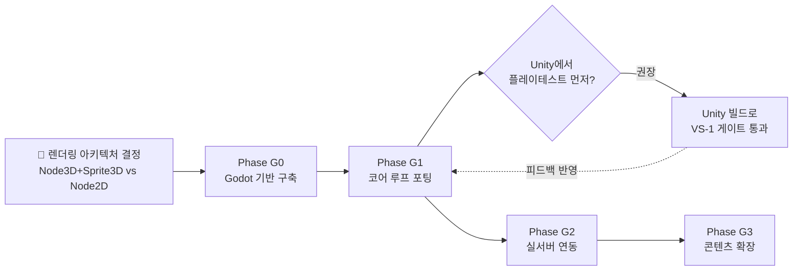

# 🛤 《소울 커맨더》 Godot 4 전환 개발순서

> 기준 입력: 개발플랜_DevPlan v3.0 · GDD v7.11 · 게이트판정_GateReport · 전투시스템_BattleSystem · 세션로그(2026-08-11) · ASSET_IMPORT_POLICY · monsters.json / skills.json
> 전제: Unity 전용 산출물(.unity 씬, .asset, SceneBuilder, 에셋 파이프라인 스크립트)은 폐기 — **로직·수치·데이터만 이관**. PNG 652개 + JSON 2종은 그대로 재사용.

---

## 0. 왜 이 순서인가 — 기존 VS 마일스톤과의 관계

> [!important] 현재 상태 (2026-08-20)
> 현재 상태는 **Godot G1 프로토타입이 실행되는 상태**입니다. Unity VS-1 완료 기록은 역사 자료로 보존하고, 실제 다음 순서는 현재 `client_godot/`의 데이터·AI·명령 연결을 기준으로 정합니다. 이 문서의 결정·개정 사항은 [[결정로그_DecisionLog]]에 기록하며, 진행 판정 기준은 [[게이트판정_GateReport]]을 참조합니다.

| 기존 (Unity) | Godot 재구성 | 성격 |
|---|---|---|
| (없음) | **Phase G0 — Godot 기반 구축** | 신규 — 엔진 전환 자체의 리스크를 여기서 소진 |
| VS-1 코어 루프 (기능 PASS, 게이트 PENDING) | **Phase G1 — 코어 루프 포팅** | 이식 — 신규 설계 없음, 그대로 옮기기 |
| VS-2 실서버 연동 (READY, 미구현) | **Phase G2 — 실서버 연동** | 이식 + 신규 혼합 — 서버는 그대로, 클라만 신규 |
| VS-3 콘텐츠 확장 (대기) | **Phase G3 — 콘텐츠 확장** | 엔진 무관 — 원안 그대로 진행 |

---

## 1. 🔴 가장 먼저 결정해야 하는 것 — 렌더링 아키텍처

> **현재 결정 (2026-08-20):** 사용자 확인에 따라 Godot 프로토타입은 **옵션 B(Node2D + Camera2D + Y-Sort + 절차 아이소메트릭 그리드)**로 진행한다. 아래의 옵션 A 권장은 Unity 수치 보존 관점의 역사적 검토안이며, 현재 작업 기준이 아니다. Node3D 전환은 별도 결정과 재검증 없이는 수행하지 않는다.

GDD 21.1에 따르면 이 게임은 "**로직은 3D 좌표, 표현은 2.5D 픽셀 스프라이트**"입니다 (측면 +15%/배후 +30% 위치 보정, 카메라 60° 틸트, parallax 배경 레이어가 전부 실제 3D 좌표 기반). 이건 Unity에서 3D 씬 + 스프라이트 렌더링으로 구현된 부분이라, Godot에서 그대로 가려면 **Node3D + Sprite3D(빌보드)** 로 가는 게 가장 손실이 적습니다.

| 옵션 | 방식 | 장단점 |
|---|---|---|
| **A. Node3D + Sprite3D (역사 검토안)** | 기존 3D 좌표·각도 계산을 그대로 이식하는 대안 | 현재 기준 아님 |
| B. Node2D + 수동 Y-Sort | x,z를 2D 평면으로 매핑, 높이(y)는 그림자 오프셋으로만 사용 | 2D 툴 익숙하면 빠름 · 측면/배후 각도·2.5D 오클루전 공식을 전부 재유도해야 함 (밸런스 재검증 리스크) |

현재 구현은 **옵션 B**를 기준으로 합니다. 2.5D 깊이감은 논리 그리드와 Y-sort, 발 기준 z-index로 유지하며 P7~P9 회귀 테스트에서 오클루전과 이동 판정을 검증합니다.

---

## 2. Phase G0 — Godot 프로젝트 기반 구축 (신규, 최우선)

> **목표:** 엔진 전환 자체의 불확실성을 먼저 없앤다. "빈 화면에 카메라 각도 재현 + 스프라이트 1개 렌더 + JSON 1개 로드"가 되는 순간이 이 Phase의 실질적 게이트.

### G0-1. 프로젝트 셋업
- Godot 4.x 프로젝트 생성 (모바일 export 프리셋: iOS / Android — GDD 21.3 30fps 저사양 유지 목표 반영)
- 폴더 구조 설계: `res://scenes/`, `res://scripts/`, `res://art/`, `res://data/`, `res://autoload/`
- Git 저장소 분리 여부 결정 (기존 Unity `client/` 와 별도 리포로 갈지, 같은 리포 내 `client_godot/` 로 병행할지 — 병행 권장: Unity 데모는 롤백 안전망으로 당분간 유지)

### G0-2. 렌더링 뼈대 재현
- Camera3D Orthogonal, 위치/각도 Unity 값 그대로 이식 — 기준값: `(0, 11.5, -6.6)` · X+60° · Ortho size 6.2
- 바닥 24×24 재현, parallax 배경 3레이어(L1 0.15/L2 0.35/L3 0.7, z 5.2/6.0/6.8) — Godot에서는 `ParallaxBackground`/`ParallaxLayer` 대신 3D 평면에 z-depth로 배치(기존 Unity 방식과 동일 원리)
- 카메라 줌(`]`/`[` 4.5~8) 입력 매핑 — Godot `Input` 액션맵으로 재등록

### G0-3. 에셋 파이프라인
- PNG 652개를 `res://art/`로 복사, import 설정: **Filter = Nearest, Mipmaps = Off** (Unity의 Point/No Filter, Mipmaps 해제와 동일 취지)
- Godot는 ASTC 압축을 플랫폼별 export 설정에서 관리(Unity처럼 텍스처별 개별 지정이 아님) — export_presets.cfg에서 모바일 압축 포맷 설정 필요
- Sprite Atlas 대응: Godot 4는 `AtlasTexture`(수동) 또는 `TextureAtlas` 임포터 사용 — 기존 Unity Sprite Atlas 그룹(파츠/아이콘/이펙트) 재구성
- Pivot(발 기준 하단 중앙) — Sprite3D의 `offset`/`centered` 속성으로 재현

### G0-4. 데이터 로더
- `monsters.json`, `skills.json` → `res://data/`로 복사 (수정 없이 그대로 이식 가능 — 전제조건 그대로 유효)
- GDScript `JSON.parse_string()` 기반 로더 Autoload 작성 (Unity `SkillDatabase`/`zod 검증` 로직 대응 — GDScript는 zod 같은 런타임 스키마 검증 라이브러리가 없으므로, 로드 시점에 필수 필드 존재 여부를 수동 assert하는 경량 검증 함수를 별도로 작성 필요)

### G0-5. Autoload(전역 매니저) 설계 — Unity Manager → Godot Autoload 매핑
| Unity (기존) | Godot Autoload (신규) |
|---|---|
| `PartyRoster` (싱글톤) | `PartyRoster.gd` |
| `StaminaWallet` (mock) | `StaminaWallet.gd` |
| `SkillDatabase` | `SkillDatabase.gd` |
| `PlayerProgress` | `PlayerProgress.gd` |
| `WaveManager` | 씬별 노드로 전환 권장 (전역이 아니라 전투 씬 하위) |

**완료 기준 (Exit Criteria):**
- [ ] Godot 프로젝트에서 카메라 앵글/구도가 Unity 데모와 스크린샷 비교로 동일
- [ ] 스프라이트 1종이 정상 렌더 (Point filter 확인 — 흐려짐 없음)
- [ ] `monsters.json`/`skills.json` 로드 후 콘솔에 파싱 결과 출력 확인
- [ ] Autoload 매니저 뼈대 스크립트(빈 함수라도) 5종 생성 완료
- **게이트:** 여기서 렌더링 아키텍처(§1) 선택이 확정되어야 다음 Phase 진행 가능 — 이 결정이 가장 큰 리스크 요인이므로 되도록 빨리 프로토타입으로 검증

---

## 3. Phase G1 — 코어 루프 포팅 (기존 VS-1 재현)

> **목표:** Unity VS-1의 완료 기준 7/7을 Godot에서 동일하게 재현. **새로 설계하는 게 아니라 그대로 옮기는 것**이므로, 기획 문서(전투시스템_BattleSystem)를 GDD 삼아 순서대로 구현.

이식 순서는 **의존성이 적은 것 → 많은 것** 순으로, 기존 Unity 개발 순서와 거의 동일하게 갑니다.

| 순서 | 시스템 | Unity 참조 | 완료 기준 |
|---|---|---|---|
| 1 | 파티 구성 UI | `PartyRoster`·`PartySelectUI` (16카드/5슬롯) | 소환카탈로그 16종 로드 → 5인 선택 → `BeginCombat` 게이트 통과 |
| 2 | 층 선택 + 행동력 게이트 | `FloorSelectUI`·`StaminaWallet` mock | 층 1~3 AP 40, 게이트키퍼 5층 AP 60 소모 확인 |
| 3 | 전투 씬 기본 배치 | `WaveManager`, `CombatUnit` | 5인 자유 배치 + 3D 좌표 기반 위치 보정(측면 +15%/배후 +30%) 재현 |
| 4 | 실시간 자동전투 루프 | `HeroCombat`, `MonsterAI` 기본 행동 | 기본 공격 자동 판정, HP 바, 웨이브 스케일링 |
| 5 | 전술 게이지 + 명령어 6종 | 8.3~8.4 (이동/집중공격/방어태세/후퇴/측면기동/스킬봉인 등) | 게이지 소모·충전(초당+2, 처치+10) 수식 그대로 |
| 6 | 명령 수용률 (성격 코드) | 4.3 수식 `60+사기×0.3-스트레스×0.2+성격보정` | 성격별 거부 확률 재현, 버튼 붉은 점멸 |
| 7 | 스킬/궁극기 게이지 루프 | `SkillDatabase`(skills.json 연동), 원소 상성 `ElementSystem` 6×6 | 충전(+4/+2/+5), 키 입력 발동, damage/heal/buff/기절 타입 처리 |
| 8 | 자율 스킬 + 전투 학습 | `SkillLearning`, `SkillPriority` | 상황 판단 자동 사용 + 전투 학습(0개 시작 → 습득 → 합성) 재현 |
| 9 | 위협도 시스템 | 17.2 공식 (`가한피해×0.4+치유×0.3+(0.5-HP비율)×0.3+위치보정`) | 저체력/지원가 우선 타겟팅 확인 |
| 10 | 보스 패턴 엔진 | `BossAI` — 5층 '숲의 수호자' 19.4-1 타임라인 | 덩굴 채찍·수풀 은신·강제 넉백·광역 포효·뿌리 속박·격노 전부 재현 |
| 11 | 승리→보상→성장 | `PlayerProgress`, `ResultUI` | 골드 100×층, 영혼석, 경험치 80×층, 레벨업 곡선 재현 |
| 12 | 2.5D 비주얼 폴리시 | Body Bob, WorldObject 오클루전, VisibilityCuller | 성능 컬링 + 이동 시 시각 오프셋 재현 |

**완료 기준 (Exit Criteria) — 기존 VS-1 §3.1 그대로:**
- [ ] 위 12개 항목 전부 Godot 빌드에서 동작
- [ ] 5층 보스 클리어까지 로컬 플레이 1사이클 완주 가능
- [ ] Unity 데모 대비 리그레션 없음(자체 플레이 확인)
- **게이트:** 3~5인 외부 플레이테스트 — "소환→전투→성장" 1사이클 재미 검증

> ⚠️ **전략적 판단 필요**: 기존 Unity VS-1은 이미 기능 PASS 상태이나 외부 플레이테스트가 아직 미실시입니다(게이트판정 §2). Godot 포팅을 먼저 끝내고 플레이테스트를 Godot 빌드로 받을지, Unity 빌드로 먼저 플레이테스트를 받고 그 피드백을 반영해서 포팅할지는 순서에 큰 영향을 줍니다. 후자가 "같은 걸 두 번 만들 위험"을 줄여줍니다 — Unity 빌드로 먼저 플레이테스트 게이트를 통과시키는 걸 권장합니다.

---

## 4. Phase G2 — 실서버 연동 (기존 VS-2 재현)

> **목표:** 서버(`server/` Node.js zero-dep)는 **엔진과 무관하므로 마이그레이션 대상이 아닙니다**. 이미 D-99로 구현·검증(30/30) 완료된 `/stamina` REST 4종은 그대로 재사용 — Godot 클라이언트만 새로 붙이면 됩니다.

| 순서 | 작업 | 상태 |
|---|---|---|
| 1 | Godot `HTTPRequest` 노드로 `/stamina` REST 4종 연동 (GET/consume/recharge/exchange-plate) | 서버 그대로 재사용 — 클라만 신규 |
| 2 | 전투 WS 게이트웨이 + 10Hz 서버 루프 | 서버·클라 모두 미구현 — Godot `WebSocketPeer`로 신규 구현 |
| 3 | 클라 예측 렌더링 (200ms 지연 허용) | Godot 신규 — Unity 설계(구현계획 §5.2)를 GDScript로 이식 |
| 4 | `tb_battle_records` 재생 검증 | 서버 로직 그대로, 클라 재생 뷰만 신규 |

**완료 기준:** 200ms 지연 내 전투 재현성 테스트 통과 (기존 VS-2 게이트 그대로)

---

## 5. Phase G3 — 콘텐츠 확장 (기존 VS-3, 엔진 무관)

이 Phase는 몬스터/보스 시트, 밸런스 시뮬레이션 최종치, 2.5D 스프라이트 파츠 제작 등 **엔진 선택과 무관한 콘텐츠 작업**입니다. Godot 포팅 완료 여부와 별개로 원안(개발플랜 §3.3) 그대로 진행하면 됩니다. 우선순위상 G1·G2보다 항상 뒤에 옵니다.

---

## 6. 우선순위 & 의존성

- **최우선·단독 실행 가능:** Phase G0 — 다른 어떤 것보다 먼저, 렌더링 아키텍처 결정과 함께
- **가장 리스크 큰 결정:** §1 렌더링 아키텍처 — 잘못 고르면 G1 전체를 다시 짜야 함
- **병행 가능:** Phase G3(콘텐츠 확장)는 엔진 무관이므로 G1/G2 진행 중에도 별도로 진행 가능
- **서버는 건드릴 필요 없음:** `server/`의 Node.js 코드는 그대로 유지 — Godot 클라이언트만 새로 개발

---

## 7. Unity → Godot 개념 매핑 (참고용)

| Unity 개념 | Godot 4 대응 | 비고 |
|---|---|---|
| MonoBehaviour + GameObject | Node + attached Script (.gd) | 컴포넌트 조합 방식은 Node 트리 구성으로 대체 |
| Prefab (`.prefab`) | Scene (`.tscn`) | 인스턴싱 방식(`PackedScene.instantiate()`)도 유사 |
| ScriptableObject | Resource (`.tres`) 또는 그냥 JSON 유지 | 이미 JSON 기반(skills.json)이라 큰 변경 불필요 |
| Coroutine (`IEnumerator`) | `await`/`Timer`/`Tween`, 또는 `_process` 상태머신 | 0.12초 간격 연타 코루틴류는 `await get_tree().create_timer()` 패턴으로 대체 |
| Singleton MonoBehaviour | Autoload(싱글톤) | §2.5 매핑표 참조 |
| Sprite Atlas | AtlasTexture / SpriteFrames | 드로우콜 절감 목적은 동일, 설정 방식만 다름 |
| Input (구/신 Input System) | Godot `Input` 액션맵 (`project.godot` InputMap) | 드래그/탭 처리는 `_input`/`_gui_input`으로 재구현 |
| ASTC 4×4 개별 텍스처 압축 | Export 프리셋 단위 압축 설정 | 텍스처별 세밀 제어가 아닌 플랫폼 단위 설정 |
| zod(WS 메시지 검증, TS 서버 쪽) | 서버는 그대로 TS 유지 — 변경 없음 | 클라(GDScript)에는 대응 라이브러리 없어 수동 검증 필요 |

---

## 8. 다음 세션 시작 방법

1. **현재 Node2D 아이소메트릭 프로토타입 검증** — 논리 좌표와 화면 투영, 자유 이동, Y-Sort 확인
2. G0-3/G0-4(에셋·데이터 파이프라인) 연결 — `client_godot/data/` 미러를 실제 로더에 연결
3. 스파이크가 통과하면 G0-3/G0-4(에셋·데이터 파이프라인)로 진행
4. Unity VS-1 외부 플레이테스트를 먼저 받을지 여부를 이 시점에 결정 (§3 경고 참고)

---

## 🔗 관련 문서

| 관계 | 원본 |
|---|---|
| 마일스톤 정의 | [[개발플랜_DevPlan]] v3.0 §3 |
| 전투 수식·보스 패턴 | [[전투시스템_BattleSystem]] |
| DB 스키마 | [[SoulCommander_GDD_v7.11]] §20 |
| 기술 제약 | [[SoulCommander_GDD_v7.11]] §21.3 |
| 에셋 라이선스 | [[ASSET_IMPORT_POLICY]] §1~2 |
| 현재 진척 판정 | [[게이트판정_GateReport]] |
