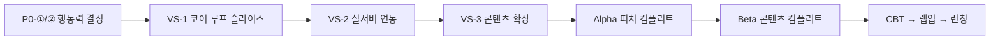
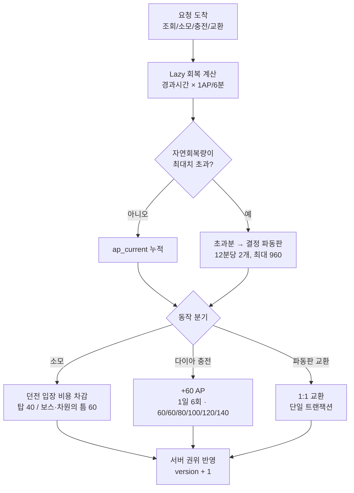
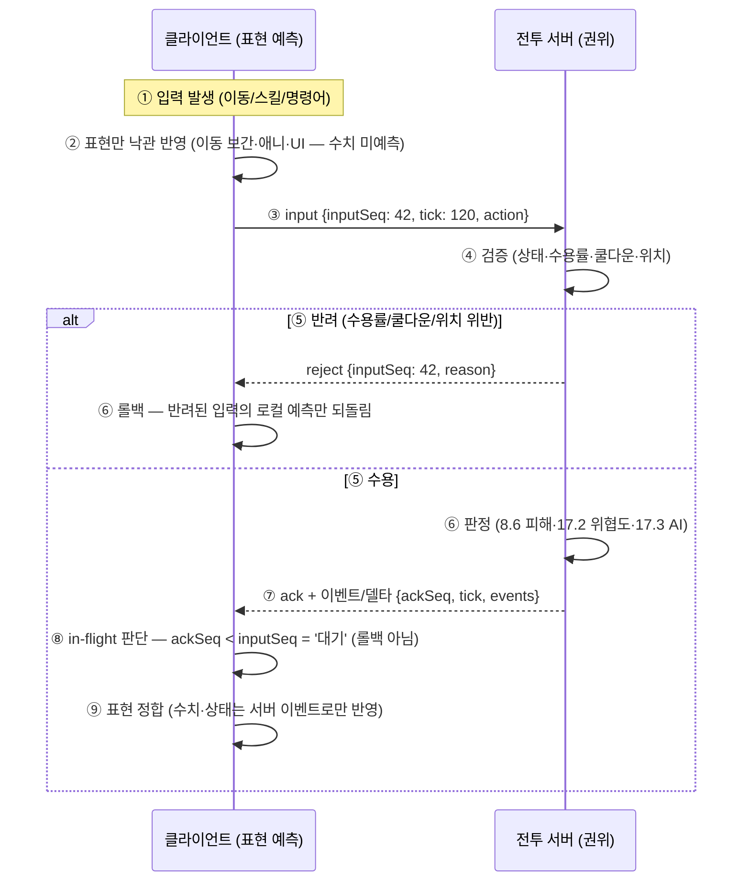
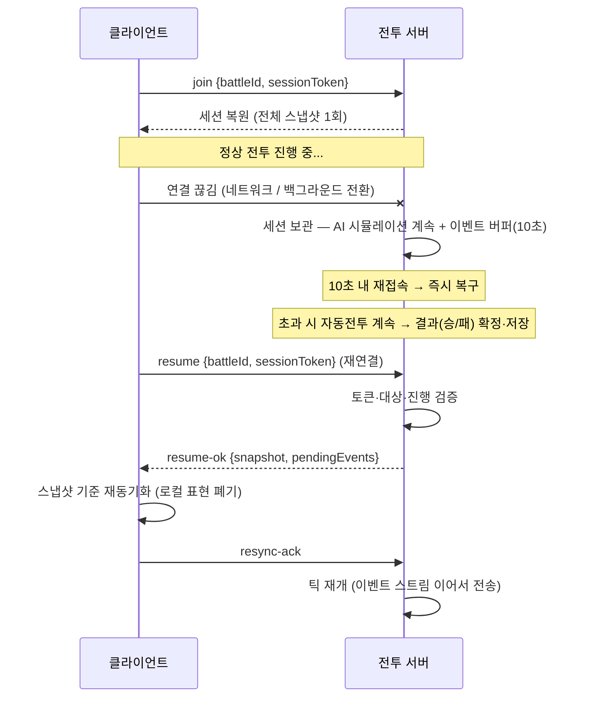

# 🛤 개발 플랜 (Dev Plan)

> [!warning] ⚠️ 2026-09-05 문서 정합 — **세션 항법은 통합안 v2.0으로 통합됨**
> Plan of Record = `开发-plans/SOUL_COMMANDER_개발플랜_v2.0_통합안.md` (S0~S6).
> 이 문서(v3.0)는 **역사·VS-1~3 파이프라인 배경 참고용**입니다. 새 세션 시작 시:
> 1. `docs/STATUS.md` §2 할 일 큐 → 2. `开发-plans/…_v2.0_통합안.md` → 3. `AGENTS.md` → 4. [[GDD_홈]] 순서로 읽고 작업을 이어가세요.
> 아래 본문 수치(56 ID · `client_godot/` · Godot G1)는 2026-08-20 스냅샷 — **현재 실측(74 ID · 루트 단일 구조 · ★D-192)과 다릅니다.**

**기준:** [[SoulCommander_GDD_v7.12]] (최신 확정 GDD) · `AGENTS.md` (전역 규칙) · 현재 엔진: **Godot 4.7.2 (루트 단일 구조 — ★D-192 S0 A안)** · 감사 시점: **2026-08-20 (스냅샷 — 현행은 통합안 v2.0)** · 결정 기록: [[결정로그_DecisionLog]]

> [!important] 엔진 기준 전환
> 현재 개발 순서는 Godot G1 기준입니다. 아래 Unity `client/` 표와 완료 수치는 **역사적 VS-1 참고 기록**이며 현재 런타임 기능 완료를 뜻하지 않습니다. 현재 런타임 스폰 카탈로그의 공식 기준은 `data/monsters.json` 정본 ↔ `docs/data/monsters.json` 미러의 **74 ID**입니다(설계 도감 55 슬러그와는 별개 — `docs/DATA.md` §0).

---

## 1. 현재 상태 스냅샷 (2026-08-10)

### 1.1 ✅ 현재 Godot 기준

- **Godot 프로젝트:** `client_godot/` (Godot 4.7.2), 절차 아이소메트릭 Node2D + Camera2D + Y-sort 기반 2.5D 렌더링
- **현재 연결:** `GameData` JSON 로더(스킬 16종·몬스터 56 ID), `AIManager`·`HeroAI`, `CommandManager`·`PlayerController`, `BattleSystem`·`WorldManager`
- **현재 검증:** Godot headless 에디터/플레이 실행 통과. 패시브 16종은 데이터 정합만 확인하고 전투 훅은 `DORMANT`로 기록
- **다음 순서:** P7 Body Bob → P8 가시성 최적화 → P9 회귀 테스트 → 실제 패시브 전투 훅 → 저장/성장 시스템

#### 1.1.1 ✅ 역사 자료 — 기획·데이터 기준

**기획 (GDD v7.11 확정)**
- GDD v7.11 통합본 (22장) · ★종족몬스터사전_Bestiary v2.0 (종족 13 + 몬스터 55 — DCSS 타일셋 + CRPG 레퍼런스: 패시브 13 · 서브레이스 30 · 크리처 타입) · 밸런스 5인 전환 재계산 v1.0 · 소환카탈로그 v1.2(아키타입 16종 + 스킬 계수 §8) · 이름생성 시스템 · 전투시스템 상세
- DB: `docs/db/schema.sql` (16개 테이블 + 몬스터 시드 **43종 — ⚠️ `docs/data/monsters.json` 56 ID보다 뒤처진 드리프트, `SYSTEM_BIBLE.md` §4 등록** + 스킬 skill_json) · 데이터: `docs/data/monsters.json`·`skills.json`
- 서버 설계: 행동력 명조식 (tb_stamina DDL·결정 파동판·REST 4종) + 전투 WS 동기화 (200ms·10Hz·롤백·재접속) + WS 메시지 스키마 (zod 검증 67건 통과)
- ★2026-08-09: **DCSS 전면 추출 + 플레이어블 13종 한정** + SceneBuilder 종족 연동 + WaveManager 몬스터 id 연동 (영웅 5인 = `race_*` + 틴트/스케일, 몬스터 = `mon_*` + T1~T5)
- ★2026-08-09: 소환카탈로그 v1.1 재배분 (6 템플릿 → 13종족 내) · GDD 문서 통합 17→10개
- ★2026-08-10: 볼트 폴더 분류 개편 (00_허브~05_아카이브) + 결정 로그·템플릿 도입 — [[문서작업규칙_템플릿]] v2.0

**Unity VS-1 역사 기록 (`client/` — 현재 구현 기준 아님, 카메라 60°)**
| 스텝 | 내용 | 상태 |
|---|---|---|
| 1 | 프로젝트 초기화 (2022.3.62f1) | ✅ |
| 2 | 첫 씬 빌더 (`Tools → Soul Commander → Build Base Scene`) — 카메라 (0,11.5,-6.6)·X+60°·Ortho 6.2 + 바닥 24×24 | ✅ |
| 3 | parallax 배경 3레이어 (L1 0.15/L2 0.35/L3 0.7, z 5.2/6.0/6.8) | ✅ |
| 4 | 영웅 5 자리표시 (기본 진형 후열3·전열2, 자동 전투) | ✅ |
| 5 | 전투 HUD — 전술 게이지(100/시작50/+2) + 「이동」「집중 공격」 | ✅ |
| 6 | 실시간 자동전투 — 몬스터 웨이브·17장 AI(광폭화)·HP 바 | ✅ |
| 7 | 「집중 공격」 타깃팅 (5초 전원 ×1.5 + 황금 마커) | ✅ |
| 8 | 감정 풍선 (😱/😎, 최대 2개·1.5초) | ✅ |
| 9 | 웨이브 시스템 (수·HP·ATK 스케일 + 배너 + 힐 50%) | ✅ |
| 10 | 타격 이펙트·히트 플래시 (0.1초 화이트 + 별 이펙트) | ✅ |
| 11 | 2.5D 깊이감 — 유닛 지면 그림자 + 바닥 잔디/돌 패치 | ✅ |
| 12 | 전술 버튼 확장 — 전술소 Lv.2 4버튼: 「방어 태세」15(3초 50% 감면)·「회복」25(잃은 체력 30%) | ✅ |
| 13 | 전술 이동 명령 — 6버튼 완성: 「이동」지면 탭 파티 이동·「후퇴」15(쿨 15초)·「측면 기동」25(이속+30%·치명타 100%) | ✅ |
| 14 | 전술 이펙트 시각화 — 방어 태세 파란 방패 배지 + HP 바 파란 전환 · 회복 초록 십자 이펙트 | ✅ |
| 15 | ★2.5D P3 — Anchor 통일 (전 스프라이트 pivot 하단) | ✅ |
| 16 | ★2.5D P4 — WorldObject (나무·돌·풀·버섯 + 그림자 + z-order) | ✅ |
| 17 | ★2.5D P5 — 나무 3파츠 오클루전 (Shadow/Trunk/Canopy) | ✅ |
| 18 | ★2.5D P6 — 카메라 줌 (`]`/`[` 키 4.5~8, UI 무영향) | ✅ |
| 19 | ★2.5D P7 — Body Bob (이동 시각 오프셋) | ✅ D-26 |
| 20 | ★2.5D P8 — 성능 (가시성 컬러) | ✅ D-26 |
| 21 | ★2.5D P9 — 전체 회귀 테스트 | ✅ D-26 (정적 검증 — Unity 플레이 확인은 사용자) |
| 22 | ★VS-1 — **전투 전 파티 구성 UI** (소환카탈로그 16종 연동 — PartyRoster·PartySelectUI·BeginCombat 게이트) | ✅ |
| 23 | ★VS-1 — **층 선택 + 행동력 소모 → 전투 진입** (층 1~3 AP 40 · 게이트키퍼 5층 60 — StaminaWallet mock · FloorSelectUI · 층 난이도·배너) | ✅ |
| 24 | ★VS-1 — **게이트키퍼 5층 보스 '숲의 수호자'** (19.4-1 패턴 엔진 — BossAI · WaveManager 층 5 분기 · HP ×10 · 승리 배너) | ✅ |
| 25 | ★VS-1 — **영웅 스킬·궁극기 게이지 루프** (전투시스템 7.2 충전 공격+4/피격+2/처치+5 → 키 1~5 발동 · 소환카탈로그 §8 **skills.json 연동** — SkillDatabase·HeroCombat 타입별 효과 해석 · **★D-27 확장: MAG 분리 6.4 + 속성 상성 5.3** — ElementSystem·Mag 스탯·몬스터 속성 배정) | ✅ D-27 |
| 26 | ★VS-1 — **승리 → 보상 → 영웅 성장** (골드 100×층 ★P1-⑩ 최종 승격 D-101 · 영혼석(하) 1/3 · 경험치 80×층 → 레벨업 6.2 곡선·§2.1 성장 — PlayerProgress·ResultUI · 일반층 3웨이브 승리 조건) | ✅ |

**검증 인프라**: `namegen-prototype/` — 이름 생성·행동력 시뮬레이션(10,000회)·battleMessages zod 테스트 · **보스 승률 시뮬레이션** (`bossWinrateSim.py` — 숲의 수호자 19.4-1 패턴 주기·보호막 90%·격노 모델, 데모 vs 밸런스 문서 수치 대조 — D-28) · **경제 밸런스 시뮬레이션** (`econSimFull.ts` — **★통합 Phase 2.3**: Layer 1 결정적 임계 검증(±20% 12/12 통과 — D-38 · 골드 400→100/층 권장 → **★D-101 최종 승격 반영 완료**) + Layer 2 전체 몬테카를로(세그먼트 **8종** — ★D-91 2.5/3.5일 소수 주기 추가 · × 파동판 3시나리오 — D-42/D-62 · ②+960 D-89 소비 상한 1,200으로 4/5일 무손실 · **Lv60 조기 도달 임계 §2-1**) · **`npm run econ:sim` 단일 명령** — 기존 econSim.ts 흡수·삭제, `econ:full`은 하위 호환 별칭)

### 1.2 ⏸ 진행 중 (중단됨 — 다음 세션에서 재개)

> [!note] **M2-① 전술 버튼 확장은 2026-08-08 완료** — 「방어 태세」(15)·「회복」(25) 4버튼 + `TickDefense()` 연동 + GDD 8.4 「회복」 추가 (아트규칙 v3.11, §1.1 표 12번). **현재 중단 항목 없음.**

### 1.3 🚀 다음 세션 시작 방법 (우선순위 순)

0. **세션 시작 체크리스트 (★D-49)** — 감사 · 대시보드 · 결정로그 상태를 한 번에 확인하고 감시 도구까지 켭니다:
   ```bash
   bash scripts/session_start.sh --watch   # ① 감사 상태 ② 대시보드 동기화 ③ 결정로그 상태 ④ §1.3 포인터 + watch_docs 백그라운드 자동 시작
   ```
   - `--watch` : watch_docs.sh 자동 시작 (없으면 ⑤에서 시작 명령 안내) · `--quiet` : 요약만 · exit 0 = 전부 준비 / 1 = 위반·drift.

   **문서 감시 백그라운드 실행 (세션 시작 시)** — 문서 표준 위반을 즉시 잡기 위해 감시 도구를 켜고 시작합니다:
   ```bash
   nohup bash scripts/watch_docs.sh > /tmp/watch_docs.log 2>&1 &
   tail -f /tmp/watch_docs.log   # "👀 [watch_docs] 감시 시작" 확인 후 Ctrl+C 로 보기만 종료 (감시는 유지)
   ```
   - 동작: `docs/GDD/`의 `.md`·`.canvas` + 감사 도구 변경을 **2초 폴링** → 편집 감지 시 1초 디바운스 후 **표준 9종 감사 자동 실행**, 위반 시 즉시 경고 (`art/out/docs_compliance.md` 참고).
   - 위반 피드백 (★D-29): **경고음 기본 ON** (macOS beep — `--no-bell`로 끔) · **`--open`** 플래그로 위반 시 리포트 자동 열기 (`nohup bash scripts/watch_docs.sh --open > /tmp/watch_docs.log 2>&1 &`).
   - 단계적 피드백 (★D-47): 연속 위반 **1회 = 경고음 · 2회 = ⚠️⚠️ 리포트 확인 안내 · 3회 연속 = 🚨 `--open`과 무관하게 리포트 자동 열기** — 위반이 계속되면 단계가 올라가고, 준수 1회가 나오면 카운터 초기화.
   - 카테고리별 경고음 (★D-48): 감사 리포트(JSON)에서 실패 표준을 파싱해 **표준별 다른 소리** — ①~④ 구조=Sosumi · ⑤홈=Ping · ⑥결정=Pop · ⑦태그=Tink · ⑧삭제=Basso · ⑨구수치=Glass · 템플릿=Frog · 위반 문구에 `(카테고리: ...)` 표시.
   - 색상 구분 로그 (★D-50): **위반=빨강 · 경고(2회)=노랑 · 정상=초록 · 정보=청록** — `tail -f /tmp/watch_docs.log`에서 색으로 즉시 구분 (`--no-color`로 끔).
   - 의존성 없음 (macOS/Linux bash) · 종료는 `pkill -f watch_docs.sh` (AGENTS.md '자동 실행 경로 ④'와 동일).
   - 감시 중이어도 **문서 편집 후에는** `bash scripts/audit_docs.sh --quiet` 1회 실행을 습관화 (즉시 확인).

1. ~~행동력 모순 A/B 결정~~ **✅ D-23 확정** (② 파동판 1:1 무손실 · ② 충전 CHECK 0~300 — §2 P0 · [[결정로그_DecisionLog]])
2. ~~VS-1 계속~~ **✅ VS-1 기능 완성 2026-08-11** (§3.1 — 파티 구성 ✅ → 층 진입 ✅ → 게이트키퍼 보스 ✅ → 영웅 스킬·궁극기 ✅ → 승리 보상·성장 ✅ → 명령 수용률·위협도 ✅ D-25 → 2.5D P7~P9 ✅ D-26) — **외부 플레이테스트 게이트 진입**
3. 이후 §3 마일스톤 순서대로 진행. **한 스텝에 하나만 만들고 확인** (재구축 원칙 4)

---

## 2. 📋 감사 결과 — 구체화 부족 & 결정 필요

> 감사 방법: GDD v7.11 + 부속 문서 10종 + AGENTS.md 전수 검토 (2026-08-08).
> 항목별 출처 문서를 병기했으므로 해당 문서의 체크리스트와 대조하면 됩니다.

### 2.1 🔴 P0 — 기획 결정 필요 (구현 막힘)

| # | 항목 | 상태 | 출처 |
|---|---|---|---|
| P0-① | **행동력 모순 A — 결정 파동판 적립률**: v7.11/AGENTS.md는 "12분당 1개"지만, 시뮬레이션상 1:1 무손실 적립은 **12분당 2개** (1시간 10개). → ①12분 1개 채택(교환 1:1에서 50% 손실, '손실 0'과 상충) ②1:1 적립 채택(문서 문구 수정) — **② 1:1 무손실 채택 (문서 '12분당 2개' 수정, D-23)** | ✅ 확정 | 구현계획 1.5절 |
| P0-② | **행동력 모순 B — 충전 상한**: v7.11 "충전은 최대치 규칙 무관"(오버캡 300 허용) vs `tb_stamina`의 `CHECK ap_current BETWEEN 0 AND 240`. → ①충전 240 클램프 ②CHECK 0~300 완화 — **② CHECK 0~300 완화 채택 (D-05 가드와 정합, D-23)** | ✅ 확정 | 구현계획 1.5절 |

### 2.2 🟡 P1 — 콘텐츠 구체화 (작성/확정 필요)

| # | 항목 | 출처 |
|---|---|---|
| P1-① | **종족 시너지 밸런스 시뮬레이션** — 5인 파티 기준 수치 튜닝 (v7.11 ±20% 범위 → 최종치 확정) | 통합 사전 §7 시너지 |
| P1-② | **관계 이벤트 트리거 조건·확률 확정** | 통합 사전 §9 이벤트 |
| P1-③ | **신화 오마주 원형 200종 시트** (문화권별 40종 × 변형 규칙) | 이름생성 8장 · 통합 사전 §14 |
| P1-④ | **★5 칭호 풀 20종 × 계열별 변형 시트** (시뮬레이션 풀 20종 구현 완료 → 시트화) | 이름생성 체크리스트 |
| P1-⑤ | **종족 보정 병기**: 6.1 직업 계수 표에 종족 보정 / 8.8 스킬 시트에 종족 특성(패시브) 1종씩 | 통합 사전 §3 종족 상세 |
| P1-⑥ | **소환카탈로그**: 개별 성격 코드·초기 정신 상태·기억 태그 / 전용 대사·감정 풍선 세트 / **15층 보상 '물 속성 ★3' 확정** | 소환카탈로그 7장 |
| P1-⑦ | **몬스터 예외 규칙**: 언데드 힐 역전·영체 물리 저항 구현 설계 / 용족(드래곤) 보스 패턴 시트 T4~T5 (19.4 형식) / 미믹·도펠갱어 '기만' 계열 + 9.5 탐험 연동 | 통합 사전 §4·§14 |
| P1-⑧ | **2.5D 스프라이트 파츠 목록 확정** — 기본 체형 4종 + 귀/꼬리/뿔/날개/비늘 2D 파츠 + 텍스처 (3D 모듈러의 2D 이식) | 통합 사전 §1·§10 · 아트규칙 2.2 |
| P1-⑨ | **14장 업데이트별 신규 종족·영웅 수량 확정** | 통합 사전 §11 로드맵 |
| P1-⑩ | **경제 밸런스 시뮬레이션 최종치** (소환 가격·성장 재화 흐름 검증) | GDD_홈 할 일 |

### 2.3 🟢 P2 — 문서 정합/체크리스트 정리

| # | 항목 | 출처 |
|---|---|---|
| P2-① | 밸런스 재계산 체크리스트 갱신 — **차원 균열 20초/악의의 거울 20%/부위 파괴 15,000은 이미 전투시스템에 반영됨** (체크리스트만 미갱신, 모순) | 밸런스 6.1 vs 전투시스템 9.2 |
| P2-② | 전투시스템 7.3 "기본 계수" 문구 → 스킬계수 시트 참조로 갱신 | 스킬계수 체크리스트 |
| P2-③ | 2.3 메인 루프 전투 소요 시간 표 갱신 (5인 기준) | 밸런스 체크리스트 |
| P2-④ | 아트 체크리스트: Sprite Atlas 4종 / ASTC 4×4 + Pixel Snap / 파티클 예산 툴 | 아트규칙 하단 |
| P2-⑤ | `tb_hero.name_origin` 컬럼 DDL 반영 (신화 오마주명 추적) | 이름생성 체크리스트 |

---

## 3. 🏗 개발 플랜 v3.0 — 산업 표준 파이프라인 (★2026-08-10 재편)

> [!tip] 왜 재편했나 (리서치 근거)
> 기존 M0~M4는 **시스템 순차(가로 슬라이스)** — 행동력 서버 → 전투 동기화 → 클라 → 콘텐츠 → 아트 순서로
> 시스템을 하나씩 완성하는 구조였습니다. 그러나 게임 산업 표준은 **재미 먼저(세로 슬라이스)**:
> **버티컬 슬라이스(Vertical Slice)** — '작은 완성 조각'(소환→전투→보상 1사이클)을 **완성도 높게** 만들어
> ① 코어 재미 검증 ② 아트/기술/설계 파이프라인 전 구간 검증 ③ 이후 스케일 비용 예측 을 달성합니다.
> 참고: Rami Ismail *Milestones* (리서치→VS→피처 컴플리트→콘텐츠 컴플리트→랩업) · GDKeys *Game Development Process* (컨셉→VS→알파→베타→폴리시).

### 3.0 파이프라인 단계 & 현재 위치

| 단계 (산업 표준) | 정의 | 우리 프로젝트 상태 |
|---|---|---|
| ① 리서치 (아이디어·프로토타입) | fail-fast — 재미 후보 검증 | ✅ 완료 — GDD v7.11 + 부속 문서 확정 |
| ② 프로토타입 (PoC) | 핵심 전투 재미·시스템 검증 | ✅ 대부분 완료 — Unity 자동전투 데모 (스텝 1~14 + 2.5D P3~P6) |
| ③ 프리프로덕션 → **버티컬 슬라이스** | 작은 완성 조각 + 파이프라인 검증 | 🔴 **현재 위치 — VS-1 착수** |
| ④ 프로덕션 — 피처 컴플리트 (알파) | 모든 핵심 기능 존재 (부족해도) | ⬜ |
| ⑤ 프로덕션 — 콘텐츠 컴플리트 (베타) | 모든 콘텐츠 존재 | ⬜ |
| ⑥ 랩업 — CBT → 릴리즈 후보 → 런칭 | 안정화·출시 | ⬜ |

> [!warning] 원칙: 한 스텝에 하나씩 (재구축 원칙 4)
> 각 슬라이스는 독립 세션 단위이며, **완료 기준(Exit Criteria)을 모두 채운 뒤** 다음 단계로 갑니다.

### 3.1 VS-1 — 코어 루프 버티컬 슬라이스 (다음 세션 착수)

> [!note] 정의
> **"소환 → 파티 구성 → 행동력 게이트 → 전투 → 보상 → 성장"** 코어 루프 1사이클을 **완성도 있게** 구현하는 슬라이스.
> 현재 Unity 데모(자동전투·전술 버튼·웨이브)를 **게임 루프로 연결**합니다. 서버는 mock(로컬) — 실서버는 VS-2.

- **목표:** 코어 루프의 재미·진행감 검증 + UI/데이터 파이프라인 검증
- **범위:** 1~3개 층 · 5인 파티 · 보스 1종(5층 '숲의 수호자') · 로컬 플레이
- **완료 기준 (Exit Criteria):**
  - [x] **파티 구성 선택 UI** (전투 전 5인 고르기 — 전투시스템 8.10 '자유 파티 구성') — ✅ 2026-08-11 (VS-1 착수 — 소환카탈로그 16종 → PartyRoster 단일 소스 · PartySelectUI 16카드/5슬롯 · WaveManager.BeginCombat 게이트 · 직업 주기·등급 보정·종족 스탯 보정 적용)
  - [x] **던전/층 진입 흐름** (층 선택 → 행동력 소모 40 → 전투) — ✅ 2026-08-11 (층 1~3 탑 일반 40 · 게이트키퍼 5층 60 — StaminaWallet 로컬 mock · FloorSelectUI 패널 · 층 난이도 배율 ×1.0~1.6 · 배너 층 표기 — 기존 M2-④)
  - [x] **게이트키퍼 5층 '숲의 수호자' 보스 1종** — ✅ 2026-08-11 (19.4-1 타임라인: 덩굴 채찍·수풀 은신·강제 넉백+보호막·광역 원심 포효·뿌리 속박·격노 — BossAI.cs 패턴 엔진 · WaveManager 층 5 분기 · HP = 5층 일반 ×10 · 승리 배너 · **뿌리 속박 「집중공격」 파괴 연동(D-24 — RootBind 구조물·HP 바·조기 해제)** — 기존 M2-④)
  - [x] **영웅 스킬 사용 (궁극기 게이지 루프 — 8.8 · skills.json 연동)** — ✅ 2026-08-11 (D-18 — SkillDatabase catalogNo 매칭 · 충전 7.2 +4/+2/+5 · 키 1~5 발동 · damage/heal/buff/기절 · **★D-27 — MAG 분리 6.4(마법 스킬 Mag 스탯) · 속성 상성 5.3(ElementSystem 6×6 — 몬스터 id별 속성·보스 자연)**) — 기존 M2-⑤
  - [x] **자율 스킬 + 전투 학습 (8.8 확장 — D-18 '액티브 2종' 방향 전환)** — ✅ 2026-08-12 (D-57 — 액티브 2종 **버튼 → 캐릭터 자율 판단 사용**(SkillPriority 상황 판단) + **전투 학습**(써서/맞아서/보고/레벨업 → 템플릿 습득 → 합성 스킬 창작) + 전투 중 레벨업 — **D-70 시뮬레이터 검증** · **D-71 결과 화면 '이번 전투 학습' 표시** · **D-72 성격 코드(4.3) 연동**(캐릭터별 판단 편향) · **D-73 스킬 마스터리 진화**(사용 → 계수 ×1.05/Lv · Lv5 ×1.20+쿨 -10%) — SkillLearning·SkillDatabase·HeroCombat·ResultUI)
  - [x] **명령 수용률 (6.4 성격 코드) + 위협도 공식 (17.2)** — ✅ 2026-08-11 (D-25 — 위협도 누적·저체력 우선 대상 선택 + 명령 수용률 4.3 수식·6개 명령 거부 — 기존 M2-⑥)
  - [x] **승리 → 보상 → 영웅 성장** — ✅ 2026-08-11 (PlayerProgress·ResultUI — 보상: 골드 **100×층 ★P1-⑩ 최종 승격 D-101** · 영혼석(하) 1(일반)/3(게이트키퍼) · 경험치 80×층 → 레벨업(v7.11 6.2 곡선 Lv²×10+20 · 소환카탈로그 §2.1 상한/성장률 누적) · 일반층 3웨이브 클리어 조건 · 「다음 층」/「파티 재구성」 루프 — 골드 400→100/층은 **D-38 권장 임계 최종 승격(D-101)**)
  - [x] **2.5D P7~P9 (Body Bob · 성능 컬러 · 전체 회귀 테스트)** — ✅ 2026-08-11 (D-26 — CombatUnit Bob · VisibilityCuller · 정적 회귀 검증)
- **산출물:** 플레이 가능 데모 빌드 + 플레이테스트 기록
- **게이트:** 3~5인 외부 플레이테스트 — "소환→전투→성장" 1사이클이 재미있는지 검증

### 3.2 VS-2 — 실서버 연동 슬라이스

> [!note] 정의
> VS-1의 로컬 루프를 **실서버**에 올립니다 — 행동력(명조식) + 전투 동기화(200ms).
> 설계는 구현 상세 §5에 완료되어 있어 **구현만** 남았습니다.

- **목표:** 서버 권위(21.3) 검증 — 행동력 회계 + 실시간 전투 판정
- **범위:** 행동력 REST 4종 + 전투 WS 게이트웨이 (P0-①/② 결정 후)
- **완료 기준:**
  - [x] P0-①/② 결정 (파동판 적립률 · 충전 상한) — ✅ **D-23 확정** (② 무손실 · ② CHECK 0~300): [[결정로그_DecisionLog]]
  - [x] **`tb_stamina` DDL + `/stamina` REST 4종 + 트랜잭션·락 검증** — ✅ 2026-08-12 (D-99 — `server/` 신규 zero-dep: REST 4종(GET /stamina · consume · recharge · exchange-plate) · Lazy 회복 · 파동판 1:1(D-23) · 일일 소비 상한 1,200(D-89 — tb_stamina spend_date/spent_today/chk_spend) · 배타 락 + version CAS · **검증 30/30** + ddl:check 17/17 + tsc strict 0 — 기존 M0-②③④)
  - [ ] 전투 WS 게이트웨이 + 10Hz 서버 루프 + 롤백/재접속 — 기존 M1-①~⑤
  - [ ] `tb_battle_records` 재생 검증 — 기존 M1-⑥
- **산출물:** 실서버 연동 빌드 · **게이트:** 200ms 지연 내 전투 재현성 테스트 통과

**기존 산출물 재사용**: `namegen-prototype/staminaSystem.ts`+`staminaSim.ts` (10,000회 검증) · `battleMessages.ts`+`battleMsgTest.ts` (zod 67건) — 그대로 재사용

### 3.3 VS-3 — 콘텐츠 확장 슬라이스

- **목표:** 슬라이스 스케일의 콘텐츠 생성 비용 검증 (버티컬 슬라이스의 본래 목적)
- **범위:** 층 확장(1~10층) + 몬스터·보스 시트 + 밸런스 최종치 + 아트 파츠
- **완료 기준:**
  - [ ] 종족 시너지·경제 밸런스 시뮬레이션 최종치 — 기존 M3-① (P1-①/⑩)
  - [ ] 오마주 200종·★5 칭호 시트 — 기존 M3-② (P1-③/④)
  - [ ] 몬스터 예외 규칙·용족 보스 패턴 시트 — 기존 M3-③ (P1-⑦)
  - [ ] 층별 몬스터 유형·웨이브 구성 시뮬레이션 — 기존 M3-④
  - [ ] 2.5D 스프라이트 파츠 제작 (64×64) — 기존 M4-① (P1-⑧)
  - [ ] Pre-Alpha 전투 시뮬레이터 스킬 계수 검증 (±20% 튜닝) — 기존 M3-⑤
- **게이트:** 10층 연속 플레이 플레이테스트 — 난이도 곡선·성장 체감 검증

### 3.4 Alpha — 피처 컴플리트 (모든 핵심 기능)

- **목표:** 게임의 모든 '동사(verbs)' 구현 — 부족해도 **존재**해야 함 (GDKeys: Feature Complete)
- **범위:** 소환·파티·전투·성장·영지 경영·행동력·던전 100층 구조·스토어·설정·튜토리얼
- **완료 기준:** 전체 루프를 지원 없이 플레이 가능 + 외부 플레이테스트 · **산출물:** CBT 전 알파 빌드

### 3.5 Beta — 콘텐츠 컴플리트

- **목표:** 100층 전체 콘텐츠·보상·난이도 완성 + 로컬라이제이션 대비
- **범위:** 전 층 몬스터/보스/보상 · 튜토리얼 완성 · M4-②③④ (Sprite Atlas · ASTC · 파티클 예산 · iOS/Android 빌드 파이프라인)
- **완료 기준:** 시작→엔드게임 플레이 가능 + 성능 체크 통과 · **산출물:** CBT 빌드

### 3.6 CBT → 랩업 → 런칭

- **범위:** CBT → 릴리즈 후보(RC) → 스토어 검수 → 런칭. **폴리시 6개월 버퍼** (GDKeys: 폴리시가 프로덕션 버퍼를 먹지 않게 — 콘텐츠를 줄여도 폴리시는 지킨다)
- **완료 기준:** RC1 안정 빌드 제출 · 출시 후 2주 내 포스트모템

### 3.7 기존 M0~M4 작업 재편 매핑

| 기존 (v2.0) | 신규 (v3.0) | 상태 |
|---|---|---|
| M0 행동력 서버 | VS-2 (행동력 REST) | 설계 완료 — 구현 대기 |
| M1 전투 동기화 | VS-2 (전투 WS) | 스키마 완료 — 구현 대기 |
| M2 클라 루프 (③~⑥) | VS-1 | 다음 세션 착수 |
| M3 콘텐츠·밸런스 | VS-3 | 대기 |
| M4 아트·빌드 | VS-3 (M4-①) · Beta (M4-②③④) | 대기 |

---

## 4. 🎯 우선순위 & 의존성



- **독립 가능**: VS-1은 서버와 무관 (현재 로컬 데모 연장) — **다음 세션 최우선**
- **P0-①/② 결정**: ✅ **D-23 확정** (2026-08-11 — 파동판 1:1 무손실 · CHECK 0~300 — [[결정로그_DecisionLog]]) — VS-2 착수 조건 충족
- **한 스텝 하나 원칙** (재구축 원칙 4) — 스텝마다 사용자 확인

---

## 5. 구현 상세 (★통합 — 구현계획_ImplementationRoadmap)

> 이전 별도 문서 **구현계획_ImplementationRoadmap → 본서 §5 통합 (2026-08-09)**. 행동력 시스템·전투 서버 동기화 설계·Unity 클라이언트 검수 상세.


> [!note] 이 문서의 목적
> GDD v7.11을 **실제 코드로 옮기기 위한 구현 설계서**입니다. 기획 수치(10.1 행동력, 5.2 소환, 20장 DB)를
> 서버 구현 관점에서 DDL·로직·API로 구체화합니다. 이 문서는 기획 문서가 아니라 **구현 지침**이므로,
> 기획 수치의 기준은 항상 [[SoulCommander_GDD_v7.11]]을 따릅니다.

**기준 문서:** [[SoulCommander_GDD_v7.11]] (10.1 행동력 · 20장 DB · 21.3 기술 제약) · [[전투시스템_BattleSystem]] (11절 데이터 흐름) · [[종족몬스터사전_Bestiary]] (종족/몬스터·JSON 스키마) · [[소환카탈로그_설계영웅]]

---

### 1. 행동력 시스템 구현 (명조식 — v7.11 10.1)

> [!warning] 수치 기준 (AGENTS.md 갱신 반영)
> 이 섹션의 모든 수치는 **명조(WuWa) 파도플레이트 정합 표준**입니다. 구수치(120 / 1AP 5분 / 288 / 충전 3회)를 사용하지 마세요.

| 항목 | 확정 수치 | 비고 |
|---|---|---|
| 최대치 | **240 AP** | 완충 24시간 = "하루 1회 로그인" 기준 |
| 자연 회복 | **1 AP / 6분** | 일일 240 AP |
| 충전 (다이아) | **+60 AP, 1일 6회** | 점진 비용 60/60/80/100/120/140 다이아 |
| 오버플로우 | **결정 파동판** | 최대치 초과 시 12분당 2개 적립 (1:1 무손실), 최대 960개 |
| 교환 | 결정 파동판 1개 → AP 1 | 보관분을 인벤토리에서 1:1 교환 |
| 소모처 | 탑 40 / 게이트키퍼·차원의 틈 60 | 요일 던전 초급 40 · 중급 60 |
| 월정액 | 행동력 직접 지급 없음 | 다이아 100/일 → 충전으로 전환 (11장) |

#### 1.1 구현 원칙 (서버 권위)

1. **모든 AP 계산은 서버가 수행** (클라 추측 금지 — 21.3 Anti-Cheat). 클라는 `GET /stamina` 응답값만 표시.
2. **Lazy 계산 (지연 산출):** 타이머 폴링 없이, 조회/소모 시점에 `last_updated_at` 경과 시간으로 회복량을 일괄 산출.
3. **결정 파동판 적립은 1초 단위 연속 누적** — 로그인 주기가 불규칙해도 손실 0. (6분 단위 틱이 아니라 시간×속도로 계산)
4. **오버플로우 우선순위:** 자연 회복으로 최대치(240)를 넘는 순간부터 파동판으로 전환. 다이아 충전은 즉시 반영(최대치 규칙 무관, 별도).
5. **교환/충전/소모는 단일 트랜잭션** (동시 요청 시 경합 방지 — `SELECT ... FOR UPDATE`).

#### 1.2 tb_stamina 테이블 DDL

```sql
-- ============================================================
-- tb_stamina — 행동력 (AP) 계정별 단일 행
-- 기준: GDD v7.11 10.1 (명조 파도플레이트 정합)
-- ============================================================
CREATE TABLE tb_stamina (
    master_uid          VARCHAR(64)  NOT NULL,           -- FK → tb_accounts.master_uid (계정 1행)
    ap_current          INT          NOT NULL DEFAULT 0, -- 현재 AP (0 ~ 300 — 충전 오버캡 허용, D-23)
    last_updated_at     DATETIME     NOT NULL,           -- 마지막 서버 연산 시각 (Lazy 회복 기준)
    recharge_count      TINYINT      NOT NULL DEFAULT 0, -- 오늘 다이아 충전 횟수 (0~6)
    recharge_date       DATE         NOT NULL,           -- 충전 횟수 리셋 기준일 (UTC, KST 아님)
    plate_count         INT          NOT NULL DEFAULT 0, -- 결정 파동판 보유량 (0 ~ 960)
    version             BIGINT       NOT NULL DEFAULT 0, -- 낙관적 락 (동시 요청 경합 방지)
    created_at          DATETIME     NOT NULL DEFAULT CURRENT_TIMESTAMP,
    updated_at          DATETIME     NOT NULL DEFAULT CURRENT_TIMESTAMP ON UPDATE CURRENT_TIMESTAMP,
    PRIMARY KEY (master_uid),
    CONSTRAINT chk_ap_cap        CHECK (ap_current  BETWEEN 0 AND 300),
    CONSTRAINT chk_plate_cap     CHECK (plate_count BETWEEN 0 AND 960),
    CONSTRAINT chk_recharge      CHECK (recharge_count BETWEEN 0 AND 6)
) ENGINE = InnoDB DEFAULT CHARSET = utf8mb4;
```

> [!note] 컬럼 설계 근거
> - **단일 행 (master_uid = PK):** 계정당 상태 1개. 조회·갱신 비용 최소화.
> - **`version` 낙관적 락:** 충전/교환/소모 동시 요청 시 `WHERE version = ?`로 경합 감지 후 재시도 (짧은 트랜잭션이라 낙관적 락이 적합).
> - **`recharge_date`(UTC):** 서버가 UTC 기준 일일 리셋(00:00 UTC) 적용. KST(UTC+9)는 리셋 시각이 09:00 — 운영 정책으로 확정 필요.
> - **CHECK 제약:** DB 레벨에서 240/960/6 상한을 강제 (클라 위변조 차단의 마지막 방어선).

**충전 비용 상수 (코드 레벨 — DB에 저장하지 않는 이유: 밸런스 패치가 잦은 값):**

```sql
-- tb_game_constants (키-값 설정 테이블, 14.4 밸런스 패치 반영)
INSERT INTO tb_game_constants (const_key, const_value, note) VALUES
('stamina.max_ap',          '240', '행동력 최대치'),
('stamina.regen_per_min',   '1/6', '분당 회복량 (1 AP / 6분)'),
('stamina.recharge_max',    '6',   '일일 충전 횟수'),
('stamina.recharge_cost',   '[60,60,80,100,120,140]', '충전 횟수별 다이아 비용 (1~6회)'),
('stamina.recharge_ap',     '60',  '충전 1회 AP 증가량'),
('stamina.plate_max',       '960', '결정 파동판 최대 보관'),
('stamina.plate_interval',  '12',  '파동판 적립 간격 (분)');
```

#### 1.3 결정 파동판 전환 로직

> [!tip] 명조 '결정 웨이브플레이트' 정합
> 최대치(240) 도달 후에도 행동력이 낭비되지 않고 **12분당 2개**(1:1 무손실)씩 '결정 파동판'으로 적립됩니다 (최대 960개).
> 인벤토리에서 1:1로 행동력에 교환해 사용 — 로그인 주기가 불규칙한 유저의 손실 방지 (v7.11 10.1).

**① 서버 Lazy 계산 (조회/소모 전 공통 호출):**

```text
입력: last_updated_at, ap_current, plate_count, now

경과분(분) = (now - last_updated_at) / 60            # 연속 시간 계산 (소수점 유지)

## 1) 자연 회복 AP 산출 (1 AP / 6분)
자연회복_AP = 경과분 / 6

## 2) 최대치 초과분 → 결정 파동판 전환
추가_AP = min(자연회복_AP, 240 - ap_current)        # 최대치까지 채움
추가_플레이트 = 자연회복_AP - 추가_AP                # 초과분 = 파동판 적립분
plate_count = min(plate_count + 추가_플레이트, 960)  # 보관 상한 적용
## (참고: 1:1 무손실 — 파동판 1개 = AP 1 = 6분 회복분, 12분 = 2개 — D-23)

## 3) 결과 반영
ap_current = ap_current + 추가_AP
last_updated_at = now
```

**② 결정 파동판 → AP 교환 (1:1):**

```text
조건: plate_count >= 1  AND  ap_current < 240
입력: 교환 수량 n (1~960)
판정: ap_current + n <= 240 ?  # 최대치를 넘는 교환은 거부 (먼저 소모 후 교환 유도)
수행: plate_count -= n  /  ap_current += n   # 단일 트랜잭션
```

**③ 다이아 충전 (1일 6회, 점진 비용):**

```text
조건: recharge_date != 오늘(UTC)  →  recharge_count = 0 초기화
판정: recharge_count < 6  AND  다이아 >= cost[recharge_count+1]
비용: cost = [60,60,80,100,120,140]  # 1~6회차 (v7.11 10.1)
수행: 다이아 차감 → ap_current += 60 → recharge_count += 1  (트랜잭션)
```

**④ 소모 (던전 입장):**

```text
입장 비용: 탑 일반 40 / 게이트키퍼·차원의 틈 60 / 요일 초급 40 · 중급 60
판정: ap_current >= cost
수행: ap_current -= cost  → 던전 입장 허용 (전투 시작 전 선차감 — 비매칭 보상)
```



#### 1.4 REST API 설계

| 메서드 | 엔드포인트 | 요청 | 응답 | 비고 |
|---|---|---|---|---|
| GET | `/stamina` | - | `{ ap, plate, rechargeCount, rechargeCosts, maxAp }` | Lazy 회복 선적용 후 반환 |
| POST | `/stamina/consume` | `{ dungeonId }` | `{ ap, result }` | 입장 전 차감 (비매칭) |
| POST | `/stamina/recharge` | - | `{ ap, diamond, rechargeCount }` | 1일 6회, 점진 비용 |
| POST | `/stamina/exchange-plate` | `{ count }` | `{ ap, plate }` | 파동판 1:1 교환 |

> [!warning] 구현 주의
> ① **클라는 AP를 계산하지 마세요** — 표시값도 서버 응답을 그대로 사용 (200ms 이내 반영, 21.3).
> ② **충전/교환/소모 동시 요청** → 낙관적 락(`version`) 재시도 3회 후 실패 응답.
> ③ **결제 연동 충전**은 서버 검증 후 `tb_stamina` 반영 (다이아 차감 → AP 증가 순서 고정).
> ④ **UTC 리셋 vs KST 사용자** — 리셋 시각은 운영 정책(09:00 KST = 00:00 UTC)으로 고정 권장, 패치 노트 공지.

#### 1.5 시뮬레이션 검증 결과 (M0 — 10,000회 통과) 및 발견된 모순 3건

> 구현: `namegen-prototype/staminaSystem.ts` (Lazy 코어) + `staminaSim.ts` (10,000회 랜덤 시뮬레이션)
> 실행: `cd namegen-prototype && npx tsx staminaSim.ts` — **체크 2,022,753건 전부 통과** (실패 0)

**검증 통과 항목:**
- ✅ 불변식: AP 0~240(충전 시 300 허용) · 파동판 0~960 · 충전 0~6회 · 다이아 음수 방지
- ✅ **Lazy 불변성**: 호출 간격과 무관한 결과 (1회 호출 == n회 분할 호출, 10,000 샘플)
- ✅ 회복 정확도: 24시간 대기 → 정확히 240 AP
- ✅ 무손실 회계: AP + 파동판가치 + 소모 + 손실 == 초기 + 회복 + 충전
- ✅ 충전: 6회 제한 · 비용 60/60/80/100/120/140 정확 · UTC 일일 리셋
- ✅ 교환/소모: 1:1 교환(상한 초과 거부) · 탑 40 / 보스 60 (ap ≥ cost 경계 정확)

> [!warning] 발견된 모순 3건 — A·B는 **결정 필요 (v7.11/구현계획 수정 대상)**, C는 **프로토타입에서 해소(가드 적용)**
> **모순 A — 파동판 적립률:** 1.3 의사코드 `추가_플레이트 = 자연회복_AP - 추가_AP`는 1:1 적립(무손실)이라
> 측정 결과 **오버플로우 1시간당 10개 = 12분당 2개**. 그러나 v7.11 10.1·AGENTS.md는 **"12분당 1개"**(1시간당 5개).
> → ① '12분당 1개'를 채택하면 교환 1:1에서 오버플로우의 50%가 손실("손실 0"과 상충) · ② 1:1 적립을 채택하면 문서 문구 수정 필요. **D-23 (2026-08-11): ② 1:1 무손실 적립 채택 — 문서 '12분당 2개'로 수정 완료.**
> **모순 B — 충전 상한:** v7.11 "충전은 최대치 규칙 무관"(시뮬레이션에서 41.75% 스텝이 AP 240 초과 관측)
> 그러나 `tb_stamina`의 `chk_ap_cap CHECK (ap_current BETWEEN 0 AND 240)`이 **240 초과 충전을 DB에서 거부**.
> → ① 충전을 240으로 클램프하거나 ② CHECK를 0~300으로 완화 — 둘 중 결정 필요.
> **모순 C — 충전 중첩 (의사코드 생략 → 프로토타입에서 가드 추가):** 1.3 ③ 의사코드 `판정: recharge_count < 6 AND 다이아 >= cost`에는
> **AP 상태 조건이 없어** 오버캡(300)에서 재충전 시 AP가 360→…→600까지 중첩 적립. v7.11 10.1 "하루 최대 소비 600 AP"는
> **소비 예산**(240 자연 + 360 충전)이지 적립 상한이 아니므로 상충. → `staminaSystem.ts` `recharge()`에
> **"AP > 240이면 충전 거부" 가드 적용** (240→300은 허용, 300→360 금지). 검증: 결정적 테스트 s14~16 + 랜덤 시뮬레이션에서 오버캡 거부 34,286회 정상 집계.
> 다음 세션 기준: AGENTS.md 행동력 항목에 가드 규칙 등록 완료.

---

### 2. 전투 서버 동기화 설계 (실시간 전투 — P0 ② 해소)

> [!note] 범위
> v7.11 21.3(최대 지연 200ms · 서버 권위주의) + [[전투시스템_BattleSystem]] 11절(데이터 흐름)의 **구현 상세**입니다.
> 전투의 모든 판정(8.6 데미지 · 8.5 수용률 · 17.2 위협도 · 17.3 AI)은 서버가 수행하고,
> 클라는 200ms 이내 예측 렌더링으로 체감 지연을 숨깁니다. (Anti-Cheat 21.3 — 클라 위변조 차단)

#### 2.1 설계 원칙

1. **서버 권위 (Authority):** 모든 판정은 서버 전용 시뮬레이션 루프(**10Hz 틱**)가 수행. 클라는 "렌더러 + 입력 수집기" 역할만.
2. **클라 예측 = 표현 예측 (Presentation Prediction):** 입력 발생 즉시 **이동 보간·애니메이션·UI 피드백만** 낙관 반영. **피해·위협도·AI 결정 같은 수치는 클라가 예측하지 않음** — 서버 이벤트로만 확정. (클라 판정 사본 불필요 → 21.3 '모든 연산 서버 처리' 유지, 치팅 표면 제거)
3. **단일 플레이어 특화 (탑 전투):** 상대는 몬스터 AI(17.1)뿐이므로 서버가 **연결 없이도 시뮬레이션을 계속 진행** 가능 → 끊겨도 자동전투가 이어지고, 재접속 시 "관전 기록 재생"으로 복구. PvP 대비 롤백·재동기화 부담이 훨씬 작음.
4. **멱등 입력:** 모든 입력은 `inputSeq`(클라 증가 카운터)와 `tick`(서버 틱 번호)을 담아 전송 → 중복·재전송이 판정을 두 번 만들지 않음 (재접속 후 재전송도 `battleId + inputSeq`로 중복 제거).
5. **재현성 로그:** 확정 이벤트는 `tb_battle_records`에 append-only 기록 (20.7) → 재접속 재생 + 사후 감사(치팅 탐지) 겸용.

#### 2.2 통신 구조

| 항목 | 값 | 비고 |
|---|---|---|
| 전송 | **WebSocket** (REST는 진입·결과 저장만) | 실시간 전투 전용 채널 |
| 서버 틱 | **10Hz (100ms)** | 200ms 지연 내 = 약 2틱 |
| 상태 전송 | 틱마다 **이벤트/델타** (피해·이동·위협도) | 전체 스냅샷은 join/resume 시에만 — 3,000 CCU(21.3) 대역폭 확보 |
| 예측 지연 | 최대 **200ms** (21.3) | 초과 시 클라 '동기화 중' 표시 |
| 입력 버퍼 | 클라 미확정 입력 큐 (최대 20개) | in-flight 확인용 (수치 재생 아님) |
| 끊김 복구 | 세션 토큰 + **10초** 이벤트 버퍼 | 초과 시 자동전투 계속 → 결과 확정 후 저장 |

#### 2.3 클라 입력 → 서버 판정 → 롤백 (핵심 플로우)



> [!warning] 롤백 판정 규칙
> - `ackSeq < inputSeq` = **in-flight (서버 처리 대기)** — 롤백 아님. 200ms 왕복 동안 상시 발생하는 정상 상태.
> - 롤백은 오직 **`reject {inputSeq, reason}`** 수신 시 — 반려된 입력의 로컬 **표현 예측만** 되돌림.
> - 반려 사유: 명령 수용률 미달(8.5) · 쿨다운 미도달(8.8) · 위치/대상 위반(8.9).
> - 피해·위협도·AI 결정은 **클라가 예측하지 않으므로 롤백 대상이 아님** (모든 연산 서버 처리 21.3).

#### 2.4 재접속 세션 복구



**복구 상세:**
1. 전투 진입 시 `sessionToken` 발급 — 재연결 시 `resume`로 즉시 복구 시도.
2. 서버는 끊김 순간부터 **AI 시뮬레이션을 계속 진행** (탑은 단독 전투 + 자동전투(전투시스템 2절)라 서버 독립 진행 가능).
3. 복구 페이로드 = 최신 전체 스냅샷 + 끊긴 동안의 확정 이벤트 스트림 → 클라가 1프레임 내 재구성.
4. **10초 초과** 시에도 강제 패배가 아니라 **자동전투를 계속 진행해 실제 결과(승/패)를 확정·저장** — 재접속 시 결과 화면 안내 (재도전 경로 19장). 세션 리소스는 전투 종료 후 5분 뒤 정리.
5. 재전송 입력은 `battleId + inputSeq`로 서버가 중복 제거 (2.1 멱등 원칙).

#### 2.5 WS 메시지 스키마

| 방향 | type | 핵심 필드 | 설명 |
|---|---|---|---|
| C→S | join | battleId, sessionToken | 전투 진입/세션 시작 |
| C→S | input | inputSeq, tick, action | 이동·스킬·명령어 (멱등) |
| C→S | resume | battleId, sessionToken | 재접속 복구 |
| C→S | ping | t | 왕복시간 측정 (200ms 모니터링) |
| S→C | ack | ackSeq, accepted | 입력 수용 확인 |
| S→C | reject | inputSeq, reason | 입력 반려 (롤백 트리거) |
| S→C | event | events[] | 틱마다 확정 델타 (피해/이동/위협도/버프) |
| S→C | snapshot | tick, state | 전체 상태 (join/resume 시에만) |
| S→C | resume-ok | snapshot, pendingEvents | 재동기화 페이로드 |
| S→C | battleEnd | result, rewards | 승리/패배 확정 |

```json
// C→S 입력 예시
{ "type": "input", "inputSeq": 42, "tick": 120,
  "action": { "kind": "move", "heroId": "h_001", "x": 3.2, "y": 4.1 } }
// S→C 반려 예시 (롤백 트리거)
{ "type": "reject", "inputSeq": 42, "reason": "수용률 미달 (8.5)" }
// S→C 틱 델타 예시
{ "type": "event", "tick": 121, "events": [
  { "kind": "damage", "target": "mon_goblin_01", "amount": 320 },
  { "kind": "move", "heroId": "h_001", "x": 3.1, "y": 4.2 } ] }
```

> [!tip] ✅ 구현 완료 (M1 — 스키마 검증)
> `namegen-prototype/battleMessages.ts` — **10종 메시지 TS 타입 + zod 스키마** (C→S 4종: join/input/resume/ping · S→C 6종: ack/reject/event/snapshot/resume-ok/battleEnd)
> - 서브 스키마: `Action`(move/skill/command — 전술소 명령 10종, 7.3) · `BattleEvent`(damage/move/threat/buff/death) · `BattleState`(5인 max·페이즈 p1/p2/final·rngSeed 재현성)
> - 판별 유니온 + 방향 구분(`MSG_DIRECTION`) + `isClientMessage`/`isServerMessage` 타입 가드 (게이트웨이 라우팅용)
> - 검증: `npx tsx battleMsgTest.ts` — **체크 67건 통과** (2.5절 예시 3건 · 10종 라운드트립+타입가드 방향 · 부정 23종: 음수 seq/미지원 kind/5인 초과/방향 위반/NaN 좌표/빈 reason/rngSeed 누락 등) + `npx tsc --noEmit` strict 통과

#### 2.6 DB 연동 (재현성)

- 확정 이벤트 전부 `tb_battle_records` append-only 기록 (20.7) — 재접속 재생·사후 감사·핵 탐지(21.3) 겸용.
- 전투 시작 시 `tb_dungeon_records`(일일 제한) + `tb_stamina` 소모(탑 40/보스 60)를 **원자적**으로 선차감 (1.4와 연동).
- 복구 데이터(스냅샷 버퍼)는 **Redis/인메모리** 10초 보관 — DB 영속화는 전투 종료 시 1회.

---

### 3. Unity 클라이언트 구축 — GDD 전면 검수 결과 (2026-08-08)

> [!warning] 검수 동기
> GDD v7.11 전체(22장)를 읽고 Unity 클라이언트 구축 진행 상황(스텝 1~5)과 대조 검수. 실시간 전투 여부(8.1), 배치 방식(8.10), HUD 구성(8.1/8.3)이 핵심 판정 지점이었음.

#### 3.1 ✅ 정합 확인 (스텝 1~4)

| 구현 | GDD 근거 | 판정 |
|---|---|---|
| 2.5D 탑다운 60° 카메라 (0, 11.5, -6.6 · Ortho 6.2) | 21.1 B-11 · 아트규칙 3.1 | ✅ |
| 5인 파티 (예비 없음) | 8.10 B-1 "출격 5명, 예비 없음" | ✅ |
| 절차 생성 스프라이트 자리표시 | 21.1 다크 픽셀 + 솔로 개발 대응 | ✅ |
| parallax 3레이어 | 21.1 타일셋 바닥 중심 parallax | ✅ |
| Canvas 1080×1920 | 아트규칙 1장 | ✅ |

#### 3.2 ❌ 모순 발견·수정 (스텝 5 방향 전환)

| # | 오류 구현 | GDD 요구 | 조치 |
|---|---|---|---|
| 1 | 하단 UI = "파티 슬롯 바 5칸" | 8.1: 하단은 **전술 명령어 HUD** (전술소 레벨별 2~6개 버튼) + 8.3 **전술 게이지**(100/시작 50/초당 +2/적 처치 +10) | 🔴 **스텝 5 재작성 → 전투 HUD** (전술 게이지 + 「이동」「집중 공격」 버튼) |
| 2 | 배치 = 슬롯 5개 고정 (후열3 z+2.6 / 전열2 z−2.6) | 8.10 정정(★v7.12): '자유' = **5인 파티 구성(선택)**, 전투는 **자동 전투 + 전술 버튼만 조작** (직접 조종 없음) | 🟡 슬롯 5개 = **기본 진형**으로 유지 — **드래그/직접 조종 제거** (HeroDrag 폐기) + 몬스터는 **맵 밖(상단) 스폰 후 접근** ✅ |
| 3 | 스텝 6 계획 "턴 진행" | 8.1 실시간 자동전투 + 17장 실시간 몬스터 AI (위협도 · 매초 판정) | 🔴 **스텝 6 = 실시간 자동전투 데모**로 재정의 |

> **정정 사항:** 아트규칙 3.2의 "후열=위, 전열=아래 그리드"는 21.1이 승인한 **화면 표현 방식**(8.10 자유 배치의 공간감 표현)이며 고정 슬롯을 의미하지 않음 — 표현 규칙은 정합.

#### 3.3 재구성된 스텝 (GDD 정합)

| 스텝 | 내용 | GDD 근거 |
|---|---|---|
| ✅ 1~4 | 프로젝트·첫 씬·parallax·5인 시작 배치 | 정합 |
| ✅ **5** | **전투 HUD 완료** (v3.3): 전술 게이지 바(100/시작 50/초당 +2 · 처치 +10) + 「이동」「집중 공격」 버튼 (10 소모) — `CombatHUD.cs` | 8.1/8.3/8.4/8.7 |
| ✅ **6** | **실시간 자동전투 데모 완료** (v3.4): 몬스터 3(맵 밖 스폰→접근) + 17장 AI(광폭화) + 영웅 자동 공격 + HP 바 + **기본 진형 고정(자동 전투)** — `MonsterAI/HeroCombat/CombatUnit.cs` (HeroDrag 폐기) | 17장/8.8/8.10 |
| ✅ **7** | **집중 공격 타깃팅 완료** (v3.5): 「집중 공격」 → 몬스터 탭 → 5초 전원 집중 사격(×1.5) + 황금 마커 — `FocusTarget.cs` | 8.7/8.4 |
| ✅ **8** | **감정 풍선 완료** (v3.6): 픽셀 이모티콘+초단문 — 광폭화 😱 "깜짝!" · 처치 😎 "킬각!" (최대 2개 동시, 1.5초) — `EmotionBubble.cs` | 8.2 |
| ✅ **9** | **웨이브 시스템 완료** (v3.7): 전멸 → 강화 웨이브 (수·HP·ATK 스케일 + 배너 + 힐 50%) — `WaveManager.cs` | 17장/9.7 |
| ✅ **10** | **타격 이펙트·히트 플래시 완료** (v3.8): 피격 0.1초 흰색 플래시(코루틴, 원색 복구·광폭화 틴트 동기화) + 별 이펙트 (0.25초 팽창·페이드, 월드 스폰) — `CombatUnit.FlashHit`/`ImpactFX.cs` | 8.8/21.1 |
| ✅ **11** | **2.5D 깊이감 완료** (v3.9): 유닛 지면 그림자(방사형 타원, Bilinear, sortingOrder 몸체−1) + 바닥 잔디/돌 Perlin 패치 (체스판 아님) — `CombatUnit.BuildShadow`/빌더 `MakeGroundTexture` | 21.1/3.2 |
| ✅ **12** | **전술 버튼 확장 완료** (v3.11, 전술소 Lv.2): 「방어 태세」(15 — 아군 3초 50% 감면, ★전투시스템 4.2 정합) + 「회복」(25★데모 — 잃은 체력 30%) — `CombatUnit.ApplyDefense/TickDefense` 연동, `CombatHUD.TryGuard/TryHeal`, 빌더 4버튼 배치 | 8.1/8.4 |
| ✅ **13** | **전술 이동 명령 완료** (v3.12, 전술소 Lv.2 6버튼): 「이동」지면 탭 파티 이동(진형 유지) + 「후퇴」(15, 쿨 15초) + 「측면 기동」(25, 이속+30%·치명타 100%) — `MoveDirector.cs`(신규)·`HeroCombat.MoveTarget/ApplyFlank`·빌더 2열×3 | 전투시스템 4.2/8.4 |
| ✅ **14** | **전술 이펙트 시각화 완료** (v3.13): 방어 태세 파란 방패 배지 + HP 바 파란 전환 · 회복 초록 십자 이펙트(상승·팽창·0.5초) — `CombatUnit.BuildGuardIcon/GetGuardSprite`·`ImpactFX.SpawnHeal` | 8.4/8.8 |

---

### 4. M0/M1 착수 체크리스트 (이 문서 시점)

#### M0 — 행동력 시스템 (1절)

- [ ] `tb_stamina` DDL 적용 (위 1.2 SQL)
- [ ] `tb_game_constants` 시드 등록 (위 1.2 INSERT)
- [x] 행동력 Lazy 계산 코어 유닛 테스트 (회복·오버플로우·상한·리셋 10,000회 랜덤 시뮬레이션 — `namegen-prototype/staminaSystem.ts` + `staminaSim.ts`, **2,022,753건 통과** · 모순 3건 발견: 파동판 적립률·충전 상한·충전 중첩 — C는 프로토타입 가드로 해소, 아래 1.5절)
- [ ] `/stamina` REST 4종 구현 + 트랜잭션/락 검증
- [ ] 결정 파동판 UI (인벤토리 아이템형 표시 ↔ `tb_stamina.plate_count` 동기화)

#### M1 — 전투 동기화 (2절)

- [x] WS 메시지 스키마 (2.5절 — 10종 TS 타입 + zod 검증: `namegen-prototype/battleMessages.ts` + `battleMsgTest.ts`, 67건 통과 + tsc strict 통과)
- [ ] 전투 WS 게이트웨이 (인증 + 세션 토큰 + battleId)
- [ ] 10Hz 서버 시뮬레이션 루프 (판정: 8.6/8.5/17.2/17.3)
- [ ] 클라 입력 버퍼 + 롤백 코어 (`inputSeq`/`ackSeq` 유닛 테스트 — 200ms 내 정합)
- [ ] 200ms 예측 렌더링 (로컬 예측 + 스냅샷 보간)
- [ ] 재접속 복구 (10초 버퍼 + `resume-ok` 재동기화)
- [ ] `tb_battle_records` 이벤트 로그 재생 검증 (재현성)

---

## 5.5 🎛 미조정 수치 대장 (TUNING Ledger — ★2026-08-25 신설)

> **목적:** GDD에 확정 수치가 없어 데모/임의로 넣은 값들을 한곳에 모은다. 밸런스 조정 시 이 표만 보면 된다.
> **규칙:** ① 코드·JSON의 임시값에는 `# TUNING:` 마커 또는 `_tuning_note`를 남긴다 ② 값이 GDD에 확정되면 이 표에서 제거(또는 ✅ 처리)한다.
> **단일 소스:** 건설 비용 등 시설 데이터 원본은 `client_godot/data/facilities.json` — 아래 표는 대장(요약+근거)이다.

| # | 항목 | 현재값 | 사용 위치 | 근거 | 상태 |
|---|---|---|---|---|---|
| T1 | 시설 공통 건설 비용 | 골드 500 (추출소·연구소 800 / 연금술소 1,200) | `facilities.json` build_cost | 데모 정의 — GDD 미명시 | 🔧 임시 |
| T2 | 성당 첫 건설 비용 | 골드 100 (`first_build_free: true` → 실질 무료) | `facilities.json` · `hub_scene.gd _confirm_build` | 진행 막힘 방지 튜토리얼 유도용 | 🔧 임시 |
| T3 | 전술소 업그레이드(Lv.2) 비용 | 골드 5,000 | `facilities.json` upgrade_cost | ✅ GDD §4.2 확정 (목재 20은 MVP 미추적) | ✅ 확정 |
| T4 | 숙소·식당 unlock_floor | 3층 / 5층 | `facilities.json` | 데모 정의 | 🔧 임시 |
| T5 | 추출소·연구소 unlock_floor | 10층 / 연금술소 15층 | `facilities.json` | 데모 정의 | 🔧 임시 |
| T6 | 추출소 환원 보상표 (영혼석·기억 조각) | ★1~★5 등급별 randi_range 표 | `hub_scene.gd _handle_extraction` | §7.1 방향성만 존재, 수치 미정 | 🔧 임시 |
| T7 | 훈련장 비용/효과 | 골드 200 → 파티 XP +160 | `hub_scene.gd _handle_training` | 데모 정의 | 🔧 임시 |
| T8 | 병원 부활 비용 | 골드 500 | `hub_scene.gd _handle_hospital` | 데모 정의 | 🔧 임시 |
| T9 | WFC 재시도 상한 / 통행성 임계 | 12회 / 보행면 55% | `wfc_dungeon_generator.gd` MAX_RETRIES·WALKABLE_RATIO_MIN | 신설(2026-08-25) — 안전장치 파라미터 | 🔧 임시 |
| T10 | WFC 층 스케일링 곡선 | t=(층-1)/30 캡 1.5 → 물+10t·석+8t·고지+5t | `wfc_dungeon_generator.gd _floor_weights` | 신설 — 밸런스 플레이 후 조정 | 🔧 임시 |
| T11 | 전투 앰비언트 틴트 구간 | 1~10 낮창광 / 11~20 황혼 / 21+ 심연밤 | `battle_ambient.gd TIER_TINTS` | Arc 1 구조 기반 임의 배치 | 🔧 임시 |
| T12 | 파랄럭스 시차 계수 | 달 .03 / 원산 .07 / 중경숲 .15 | `battle_ambient.gd PARALLAX_FACTORS` | 감각값 | 🔧 임시 |
| T13 | 게임 카피 말투 | A톤 명령체 ("~라"/"~한다") | `scripts/ui/copy.gd` 단일 소스 | 사용자 확정(2026-08-25) — 문구 조정은 이 파일만 | ✅ 방침 확정 / 문구 조정 가능 |
| T14 | 공중섬 성장 단계 | Stage1~4 — 플래토 반경 (170,105)→(320,206) · 확장비 0/1500/4000/8000G · 층 게이트 0/5/10/15 | `estate_island.gd STAGES` | 데모 정의 — 밸런스 플레이 후 조정 | 🔧 임시 |
| T15 | 건물 기본 발판(AABB) | 56×44px · 겹침 여유 8px | `estate_island.gd DEFAULT_FOOTPRINT·OVERLAP_TOLERANCE` | 스프라이트 32px 기반 감각값 | 🔧 임시 |
| T16 | 섬 부유 연출 | 진폭 ±4px · 주기 ~5.7s · 그림자 dy 150 | `estate_island.gd BOB_AMPLITUDE·SHADOW_DY` | 감각값 | 🔧 임시 |
| T17 | 드래그 판정 | 홀드 0.28초 lift · 탭 ≤0.3초/12px | `estate_island.gd HOLD_DRAG_SEC·TAP_*` | 조작감 튜닝 대상 | 🔧 임시 |
| T18 | 로딩 팁 로테이션 | 9종 · 주기 2.4s | `loading_screen.gd FLAVOR_TEXTS·TIP_INTERVAL` | 문구·주기 조정 대상 | 🔧 임시 |
| T19 | 건설 캐러셀 카드 규격 | 132×140px · 시트 높이 ~206px | `hub_scene.gd _make_building_card` | 감각값 | 🔧 임시 |
| T20 | 로딩 클릭 게이트 | 최소 연출 3.5s · 완료 후 ▶ 버튼 클릭 시에만 진입 | `loading_screen.gd MIN_DURATION·_on_enter_pressed` | 사용자 확정(자동 전환 폐지) | ✅ 방침 확정 |
| T21 | 로딩 탑·실시간 하늘 | 탑 10층×44px · 창 플리커 7Hz · 하늘 키 프레임 5종(5/8/13/18.5/22시) · 팔레트 갱신 2s | `tower_visual.gd` · `day_night_sky.gd` | 감각값 — 실제 시각대별 육안 조정 | 🔧 임시 |
| T22 | 플래토 절벽 형태 | 림+1행 · 컬럼 2+1.8·sinθ 행 · 테이퍼 -7%/행 · 드립 말단 | `estate_island.gd _build_cliff` | 실루엣 감각값 | 🔧 임시 |

---

---

## 6. 🔗 관련 문서

| 관계 | 문서 |
|---|---|
| 🏛 홈 | [[GDD_홈]] |
| 📖 기준 본문 | [[SoulCommander_GDD_v7.11]] (12.2 개발 일정 · 8장 전투 · 10.1 행동력) |
| 🛠 구현 설계 | 본서 §5 구현 상세 (행동력·전투 동기화·Unity 검수 — 통합) |
| 📌 결정 기록 | [[결정로그_DecisionLog]] (D-01~D-23 확정 · P1-⑩ 미결정) |
| ⚔️ 전투 | [[전투시스템_BattleSystem]] · [[소환카탈로그_설계영웅]] |
| 👥 종족·몬스터 | [[종족몬스터사전_Bestiary]] (통합 도감 — DCSS 타일셋) · [[이름생성시스템_NameGenerator]] · [[소환카탈로그_설계영웅]] · [[밸런스_5인전환_재계산]] |
| 🎨 아트 | [[아트규칙_2.5D]] |
| 📋 규칙 | [[문서작업규칙_템플릿]] (v2.1 — 옵시디언 표준 · 표준 9종) · `AGENTS.md` |

---

*이 문서는 Freebuff(버피)가 수행한 전체 문서 감사(2026-08-08) 결과를 바탕으로 작성한 세션 간 항법 문서입니다.*
