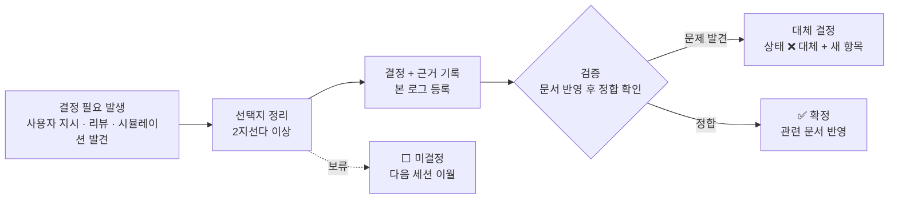

# 📌 결정 로그 — 《소울 커맨더》 설계 결정 기록

> [!note] 이 문서는?
> 확정된 설계 결정과 미결정 사항을 **날짜·근거·상태**와 함께 기록하는 로그입니다.
> 결정을 내리면(또는 사용자가 승인하면) **같은 세션에서** 이 문서에 등록합니다.
> 표준: [[문서작업규칙_템플릿#7️⃣ 결정 로그 (ADR — Architecture Decision Record)]]

---

## ✅ 확정 결정

| # | 날짜 | 결정 | 근거 | 상태 | 출처 |
|---|---|---|---|---|---|
| D-01 | 2026-08-08 | 카메라 각도 **45°→60°**, 위치 **(0, 11.5, -6.6)**, Ortho 6.2 | 돈스타브식 상향 탑다운 — 2.5D 공간감 + 3D 메시 미렌더링 실측 해소 | ✅ 확정 | 아트규칙 v3.10 · GDD v7.11 21.1 B-11 |
| D-02 | 2026-08-08 | Unity 클라이언트 **전면 재구축** — `.unity` YAML 손편집 금지, 씬은 코드 빌더로만 생성 | 수동 YAML 편집 + 런타임 스크립트 간섭이 모든 렌더링 미스터리의 근원 | ✅ 확정 | GDD_홈 재구축 · AGENTS.md 원칙 |
| D-03 | 2026-08-08 | 전투는 **실시간 자동전투 + 전술 버튼** (직접 조종 없음, HeroDrag 폐기) | GDD 8.10 정정: '자유 배치' = 5인 파티 구성(선택)이지 직접 조종 아님 | ✅ 확정 | 개발플랜 §5.3 · 전투시스템 8.10 |
| D-04 | 2026-08-08 | 행동력 **명조식 표준**: 240 AP · 1AP/6분 · 충전 60×6회(60/60/80/100/120/140) · 파동판 최대 480 | 하루 1회 로그인 기준 완충, 무손실 회계 | ✅ 확정 | GDD v7.11 10.1 · AGENTS.md |
| D-05 | 2026-08-08 | **충전 오버캡 가드**: AP가 자연 최대치(240) 초과 상태면 충전 거부 (240→300 허용, 300→360 금지) | 시뮬레이션서 AP 600 중첩 적립 발견 — 소비 예산(600)과 적립 상한 구분 | ✅ 확정 | staminaSystem.ts s14~16 · 개발플랜 §5.1.5 |
| D-06 | 2026-08-09 | **DCSS CC0 타일셋** 채택 — 영웅 13종족 + 몬스터 55종 전면 커버 | 손그림 대체, 재구축 원칙 2(외부 에셋 금지)의 명시적 예외 승인, CC0 라이선스 | ✅ 확정 | THIRD_PARTY_NOTICES · 아트규칙 §6.1 |
| D-07 | 2026-08-09 | **플레이어블 13종 한정** — 티플링·드래곤본·오크 등 14종은 몬스터 전환 | 파티 로스터 단순화, DCSS 종족/몬스터 체형 분리 | ✅ 확정 | 종족몬스터사전 §1.1 · GDD_홈 |
| D-08 | 2026-08-09 | 소환카탈로그 **v1.1 재배분** — 6 템플릿 13종족 내 재배치 (모르가나→정령족 · 드라코→견인족 · 그라크→드워프 · 마샬→시엘프 · 래그→조인족 · 블라드→다크엘프) | 몬스터 전환 6종족 로스터 공백을 플레이어블 13종 내에서 해소, 4계열 전부 3명 이상 | ✅ 확정 | 소환카탈로그 v1.1 |
| D-09 | 2026-08-09 | Bestiary **v2.0 CRPG 레퍼런스 통합** — 종족 패시브 13종 + 서브레이스 30종 + PoE 크리처 타입 5종 | PoE·Solasta·NWN2 공통 축(서브레이스+패시브) 도입, 정령족 4원소 아종 가족화 | ✅ 확정 | 종족몬스터사전 v2.0 |
| D-10 | 2026-08-09 | GDD **문서 통합 17→10개** — LPC+2.5D→아트규칙 §9·§10, 스킬계수→소환카탈로그 §8, 구현계획→개발플랜 §5 | 중복 문서 제거, 단일 소스화 | ✅ 확정 | GDD_홈 v2.0 |
| D-11 | 2026-08-09 | **race_code 0~26 유지** (구 27종 코드 — 플레이어블 13종만 소환) | 재번호 시 기존 시드·DB CHECK 파손 — 코드 유지로 정합 | ✅ 확정 | 종족몬스터사전 §13.1 · schema.sql |
| D-12 | 2026-08-10 | **볼트 폴더 분류 개편** (00_허브~05_아카이브) + 결정 로그·템플릿 도입 | 옵시디언 최상 활용 — 파일 탐색·세션 간 결정 추적 | ✅ 확정 | 문서작업규칙 v2.0 · 본 로그 |
| D-13 | 2026-08-10 | **개발 순서를 버티컬 슬라이스 중심으로 재편** (M0~M4 → VS-1~3 → Alpha → Beta → CBT) | 산업 표준: 시스템 순차(가로)가 아닌 재미 먼저(세로) — Rami Ismail·GDKeys | ✅ 확정 | 개발플랜 v3.0 |
| D-14 | 2026-08-11 | **VS-1 파티 구성 접근**: 소환카탈로그 16종을 SceneBuilder가 **비활성 프리빌드**하고 PartySelectUI가 런타임에 5인 선택·활성화·포메이션 배치 — 전투는 `WaveManager.BeginCombat()` 게이트로 구성 완료 후 시작 | 16종 스프라이트/틴트는 에디터에서 확정 로드(런타임 Resources 로드 불필요) + 비활성 유닛은 CombatUnit 목록에서 자동 제외(선택 안 된 11명 미참여) — 기존 씬 빌더 아키텍처와 정합 | ✅ 확정 | 개발플랜 §3.1 VS-1 · PartyRoster.cs·PartySelectUI.cs |
| D-15 | 2026-08-11 | **VS-1 층 진입 흐름**: 파티 확정 → **층 선택**(층 1~3 탑 일반 40 · 게이트키퍼 5층 60 — v7.11 10.1) → **로컬 mock AP 소모**(`StaminaWallet` — 소모만, 회복/충전/파동판은 VS-2 실서버) → 파티 배치 → `BeginCombat(층)` + 층 난이도 배율 ×1.0~1.6 | VS-1은 로컬(서버 mock)이므로 AP 회계는 소모만 데모 — 서버 권위(21.3)·P0-①/②는 VS-2에서 반영. 층 난이도 배율은 데모 정의(1+0.15(층-1)) — 밸런스 문서 재검증 대상 | ✅ 확정 | 개발플랜 §3.1 VS-1 · StaminaWallet.cs·FloorSelectUI.cs |
| D-16 | 2026-08-11 | **문서 표준 제5·6 승격** — GDD_홈 등록(⑤)·결정로그 등록(⑥)을 4대 표준 외 제5·6 표준으로 승격 (표준 9종 체계 — ⑦태그 · ⑧삭제 문서 참조 · ⑨구수치 잔존) | 등록·추적 가능성 강제 — 신규 문서 홈 목록 등록 + 결정·개정은 결정로그 등록 및 문서에서 참조를 감사 도구가 자동 검사 (이전엔 '부가·체크리스트' 수준) | ✅ 확정 | 문서작업규칙 v2.1 · audit_docs_compliance.py |
| D-17 | 2026-08-11 | **VS-1 게이트키퍼 5층 '숲의 수호자' 구현**: WaveManager 층 5 분기(웨이브 루프 대신 보스 1마리) + **BossAI.cs** 패턴 엔진 (19.4-1 타임라인 — 덩굴 채찍·수풀 은신·강제 넉백+보호막·광역 원심 포효·뿌리 속박·격노) · HP = 5층 일반 ×10(9.7) · 실루엣 mon_troll(자연계 대표) + 숲 초록 틴트 · 격파 시 승리 배너 | 19.4-1 패턴 시트를 데모에 1:1 반영 — 웨이브 시스템을 재사용해 소환물·승리/패배 감지 정합. **데모 단순화: 뿌리 속박 파괴는 3초 자동 해제로 대체** (「집중공격」 파괴 연동은 이후 스텝) | ✅ 확정 | 개발플랜 §3.1 VS-1 · BossAI.cs·WaveManager.cs |
| D-18 | 2026-08-11 | **VS-1 영웅 스킬·궁극기 게이지 루프**: 전투시스템 7.2 충전(기본 공격 적중 +4 · 피격 +2 · 적 처치 +5) → 100% 시 **키 1~5**(파티 슬롯) 발동 → 게이지 초기화. 계수는 **소환카탈로그 §8 skills.json 런타임 로드**(`SkillDatabase` — Resources/Data 복사본, PartyRoster **순서=catalogNo 매칭**), 타입별 효과 해석(damage single/aoe/line · heal 즉시/지속 · buff 피해 감면 — effect 텍스트 파싱) | 문서 id slug가 PartyRoster와 불일치(torvin↔torbin 등)하지만 **순서가 동일**해 catalogNo(순서) 기준 매칭으로 drift 회피. **데모 단순화: MAG 미분리(Atk 통일) · 속성 상성(5.3) 미적용 · 상태이상은 기절/경직만(StunTimer)** — 화상/출혈/흡혈/부활·액티브 2종은 이후 스텝 | ✅ 확정 | 개발플랜 §3.1 VS-1 · SkillDatabase.cs·HeroCombat.cs |
| D-19 | 2026-08-11 | **VS-1 승리 → 보상 → 영웅 성장 루프**: WaveManager 일반층 **3웨이브 클리어**(게이트키퍼층은 보스 1마리) 승리 조건 + `ResultUI` 결과 화면 — **PlayerProgress**(세션 경제·성장 상태) 정산: 골드 400×층 · 영혼석(하) 1(일반)/3(게이트키퍼) · 경험치 80×층(파티 전체) → 레벨업(**v7.11 6.2** Lv²×10+20 · **소환카탈로그 §2.1** 상한 ★1 30~★5 60 · 성장률 누적 (1+성장률) 배율 → `HeroCombat.ApplyGrowth`) · 「다음 층」(AP 재소모)·「파티 재구성」 루프 | **보상·경제 수치는 데모 정의 — P1-⑩ 경제 밸런스 시뮬레이션 확정 전** (층 난이도 배율과 동일 처리). 성장은 §2.1 그대로: Lv 1~10 +0%/Lv — 11레벨부터 가시화. 세션 메모리(정적) — VS-2 실서버 계정 저장으로 대체 | ✅ 확정 | 개발플랜 §3.1 VS-1 · PlayerProgress.cs·ResultUI.cs·WaveManager.cs |
| D-20 | 2026-08-11 | **템플릿(_템플릿/) 상태 태그 기본값 + 감사 범위 결정**: ① **포함** — 4종 템플릿 모두 status 필드와 정합되는 상태 태그를 기본값으로 추가 (로그류 `상태/작업중` · 설계서/도감 `상태/초안`) — 템플릿으로 만든 문서가 즉시 ⑦ 정합 ② **감사 기본 범위 미포함** — 템플릿은 `{{title}}`·`#분야` 플레이스홀더가 의도적으로 존재해 ①~⑨ 강제 시 거짓 실패. 대신 `--all` 참고 모드에 **템플릿 자체 점검**(비차단: status 필드 · 상태 태그 §9 정합 · 감사 체크리스트) 추가 | 템플릿 = '작성용 스켈레톤' — 문서의 상태가 아니라 **생성 문서의 시작 상태**를 담음 (문서작업규칙 §9 팁 명시). §9 enum에 '템플릿' 상태를 추가하지 않는 이유: enum 오염 + 생성 시 반드시 변경해야 하는 정적 값이 됨. 생성된 문서는 본문 범위에서 ⑦이 이미 강제 (이중 검증 불필요) | ✅ 확정 | 문서작업규칙 v2.2 · audit_docs_compliance.py · _템플릿/ 4종 |
| D-21 | 2026-08-11 | **GDD_홈 태그별 문서 대시보드 (분야·상태·성격)**: 본문 11건의 프론트매터 tags에서 **정적 인덱스** 생성 — `art/gen_home_dashboard.py`가 `<!-- DASHBOARD:START/END -->` 구간 재생성 (수동 편집 금지) · `--check`로 동기화 검증 (감사 래퍼 `audit_docs.sh`가 감사 후 자동 실행 — drift 시 1) | Dataview 미사용(플러그인 비의존 — 순수 Obsidian 표·위키링크). 대시보드 구축 중 발견: 문서 목록은 6건 '부속 문서'인데 성격 태그 `부속문서`는 밸런스 1건뿐 — **5건(Bestiary·소환카탈로그·이름생성·전투시스템·아트규칙)에 태그 보정** (⑦ 성격 태그 정합) | ✅ 확정 | GDD_홈 · art/gen_home_dashboard.py · scripts/audit_docs.sh |
| D-22 | 2026-08-11 | **감사 도구 `--warn` 모드**: ⑦ 태그 체계의 '신규 문서 분야 1개 이상 + 성격 태그' 미부착(§9)을 **경고(비차단)**로 표시 — `audit_tags`가 (issues, warnings) 반환, 경고는 문서별 `warnings` 필드·리포트 '⚠️ 태그 경고' 섹션·콘솔 요약에 표기, exit 0 유지. **상태 태그 정합·MOC #MOC·다른 표준은 실패 유지** | 신규 문서의 태그 미부착은 '초안 작업 중'일 수 있어 즉시 차단하면 과격 — 완성본(Complete) 강제 검사와 달리 **유도성 경고**로 전환. 다른 위반은 엄격 유지 (경고는 도구 실행마다 리포트에 남음) | ✅ 확정 | audit_docs_compliance.py --warn |
| D-23 | 2026-08-11 | **P0-①/② 행동력 결정 확정**: ① **파동판 1:1 무손실 적립** — '12분당 1개'(오버플로우 50% 손실)는 §5.1 원칙 3 '손실 0'·1:1 교환 가치·참고 게임(명조 웨이브플레이트 1:1)과 상충하므로 **12분당 2개**로 문서 수정 (v7.11 10.1 3곳 · AGENTS.md · 개발플랜 §5.1 표·팁·의사코드·머메이드) · ② **충전 `chk_ap_cap` CHECK 0~300 완화** — D-05 가드(240→300 1회 허용, 300→360 금지)가 이미 확정한 설계의 DB 미반영 해소, DDL 1줄 수정 | 시뮬레이터가 이미 두 결정을 구현(apPerPlate=1 무손실 · 불변식 0≤AP≤300) — 실제 변경은 **DDL 1줄 + 문서 문구**로 정합. ①의 ②는 '손실 0' 원칙과 정합, ②의 ②는 D-05·문구('최대치 규칙 무관')·시뮬레이터 불변식 전부 일치. 경제 영향(일일 적립 2배)은 480 캡으로 선형 — **P1-⑩ 입력값으로 반영**. **★재검토 보충 (2026-08-11, D-41 후):** ① **회계차 0** — 시뮬레이션 데이터(불변식: AP+파동판가치+소모+손실=초기+회복)가 ①·② 모두 통과, 시스템 정합은 결정과 무관하게 확정 가능했음 ② **장기 수렴** — 상한 480 하에서 3일+ 미접속 시 ①·② 유저 실수급이 동일(480)으로 수렴 → P0-①의 실질 영향 구간은 '1~2일 단기 미접속'뿐 (그 구간에서만 ②가 2배 유리) ③ **②+960 전구간 우월 (D-41)** — 상한 960 확정으로 ②가 모든 로그인 주기에서 무손실 → ①이 전 구간 열등, P0-① 재오픈 여지 없음. **3계층 분해:** 시스템 정합·경제 파급(P1-⑩ 입력 분리)은 결정 없이 확정 가능했고, '적립률 선택'만 설계 원칙('손실 0')이 닫는 진짜 결정 — D-23의 ② 채택 정당성 재확인 | ✅ 확정 | staminaSim.ts 재실행 2,022,753건 통과 · schema.sql · v7.11 10.1 · AGENTS.md · 개발플랜 §5.1 |
| D-24 | 2026-08-11 | **VS-1 뿌리 속박 「집중공격」 파괴 연동** (D-17 '데모 단순화: 3초 자동 해제' 해소): BossAI가 **RootBind 구조물** 생성 (HP 90 · 덩굴 스프라이트 + **HP 바** · 발밑 초록 원 유지) — `IsAutoTargetable=false`(자동 공격 대상 제외 — **집중공격이 유일한 자동 카운터**, 광역/직선 궁극기 범위 내 피해는 부수 효과 허용) · **FocusTarget 탭 우선 판정** 추가 (주변 몬스터에 탭 빼앗김 방지) · 파괴 시 OnBroken → **즉시 해제**(StunTimer 0) · 3초 자연 해제는 19.4-1 '3초 속박' **소프트락 방지 폴백으로 유지** · 보스 사망 시 Die 오버라이드로 잔여 뿌리 정리 (승리 감지 `AnyMonsterAlive` 차단 방지) | 19.4-1 '「집중공격」으로 뿌리 파괴' 카운터 1:1 구현 — D-17 단순화 항목 완료. RootBind는 CombatUnit 상속(HP 바·히트 플래시·z-order 공유)이지만 처치 보상은 미지급(구조물). 자연 해제 폴백 제거를 원하면 BindDuration 0 | ✅ 확정 | RootBind.cs·BossAI.cs·FocusTarget.cs·CombatUnit.cs |
| D-25 | 2026-08-11 | **VS-1 명령 수용률(6.4)·위협도(17.2)**: ① **위협도** — CombatUnit.Threat 누적(가한 피해×0.4 + 치유량×0.3 — 17.2) + 유효 위협도(누적 + (0.5-HP비율)×0.3 **저체력 보정**) + 매초 5% 감쇠(데모 정의) → **MonsterAI가 유효 위협도 최고 영웅을 대상으로** (현 타겟 유지 + 2.5초 재평가·115% 초과 시 전환 · 위협 0이면 최근접 폴백) + **HUD 위협 바**(궁극기 바 위 — 파티 최대 대비 상대값) ② **명령 수용률** — PartyRoster 16종에 성격 코드(0충성~5완고 — 4.3 코드표) 배정 + HeroCombat 수용률 수식(60+사기×0.3-스트레스×0.2+성격보정, 5~95 클램프) → **이동/후퇴/방어 태세/회복/측면 기동/집중공격 6개 명령이 영웅별 수용 판정** (거부 = 제멋대로 행동 · 게이지 소모 유지 · 버튼 붉은 점멸) | 17.2 '저체력/지원가 우선 공격' + 4.3 '수용/거부' 1:1 구현. **데모 근사**: 성격 코드는 템플릿 고정(실제 소환 시 시드 변량 v7.11 5.2) · 사기/스트레스 고정 50/0(정신 상태 6.4 동적 변화는 후속) · 위협도 감쇠율·재평가 주기는 데모 정의 · 위치 보정(측면/배후)은 별도 체크리스트 항목으로 보류 | ✅ 확정 | HeroCombat.cs·MonsterAI.cs·CombatHUD.cs·PartyRoster.cs·FocusTarget.cs |
| D-26 | 2026-08-11 | **VS-1 2.5D P7~P9 (아트규칙 §6)**: ① **P7 Body Bob** — CombatUnit.LateUpdate가 이동 중 시각 오프셋(**|sin(위상)|×0.05**, 아트규칙 4.7) 적용 — **판정 XZ 불변**(y만 변경) · 그림자는 지면 역보정(ShadowLocalY - bob) · 정지 시 0으로 부드럽게 수렴 · 영웅(이동 명령 중)·몬스터(접근 중)·보스(전진 중)만 흔들림 (기절/속박 중 정지) ② **P8 성능** — `VisibilityCuller.cs` 신설: 뷰포트+여백(0.25) 판정으로 화면 밖 오브젝트 토글 — **정적(WorldObject 14종)은 GameObject SetActive** (AI 없어 안전) · **유닛(몬스터/소환물/보스)은 렌더러만 비활성** (⚠ SetActive는 OnDisable로 CombatUnit.All 해제 + AI 중단 → 전멸 감지 오류 유발 — 금지) ③ **P9 회귀** — 정적 검증(C# 균형 10파일 · 감사 11/11) + 판정 체크리스트 #8 갱신, Unity 플레이 확인은 사용자 | P7: sin 음수 구간의 지면 관통을 방지해 **|sin| 채택** (문서 sin×0.05의 데모 적응) · P8: 유닛 렌더러 토글이 Unity 기본 프러스텀 컬링의 명시적 보강(정렬 동기화·렌더 비용 절감) · Object Pool은 유닛 수 적어 불필요(§5 ④ 그대로) — **VS-1 기능 전 항목 완료, 플레이테스트 게이트 진입** | ✅ 확정 | CombatUnit·HeroCombat·MonsterAI·BossAI·VisibilityCuller·WorldObject·WaveManager |
| D-27 | 2026-08-11 | **VS-1 영웅 스킬 확장 — MAG 분리(6.4) + 속성 상성(5.3)** (D-18 데모 단순화 4건 중 2건 해소): ① **MAG 분리** — CombatUnit.Mag 스탯 추가(데모: 영웅 Mag = Atk 베이스라인 — SceneBuilder, atkBonus·등급 보정 동일 적용) · HeroCombat 궁극기가 `ult.stat == "MAG"`면 **Mag 사용** (지원가/마법사 궁극기가 ATK를 쓰던 문제 해소 — 세리나 대지의 축복·블라드 불사의 연대 등) · 성장(ApplyGrowth)도 Mag 동일 스케일 ② **속성 상성** — `ElementSystem.cs` 신설: 5.3 6×6 매트릭스(**순환 4속성** 화염→자연→대지→수해→화염 유리 150%/불리 70% + **빛↔어둠 양극** 150%) · 영웅 속성 = 템플릿(element), 몬스터 = id별 배정(WaveManager.MonsterElement — 트롤/켄타우로스/웨어울프 자연 · 드래곤/화염거인/와이번 화염 · 히드라/머포크/나가 수해 · 힐자이언트/미노타우로스 대지 · 아시마르/그리폰 빛 · 리치/해골/본드래곤/비홀더 어둠 · 나머지 무속성) · **보스 숲의 수호자 = 자연** (19.4-1) · element 선언 궁극기 피해에만 적용(기본 공격·몬스터 공격 무속성) | 5.3 순환 규칙 문구(유리 150%/불리 70%)가 자체 정합 — **표의 자연 행·화염 열 100% → 70% 오기 수정**(규칙 문구 기준) · MAG 베이스라인 = ATK 베이스라인(문서상 마법 DPS·물리 DPS가 직업 계수로 분리 — 데모는 스탯 동일·스킬 계수로 구분) · **남은 단순화**: DEF/M.DEF 감면 미적용(9.7 HP 근사 — 기존 유지) · 상성은 궁극기 element만(기본 공격 속성 부여는 후속) | ✅ 확정 | ElementSystem.cs(신규)·CombatUnit·HeroCombat·WaveManager·SoulCommanderSceneBuilder |
| D-28 | 2026-08-11 | **숲의 수호자(19.4-1) 승률 시뮬레이션 + 밸런스 문서 대조** — `namegen-prototype/bossWinrateSim.py` 신설 (파티 5인 Lv1 자동 공격 · 보스 패턴 주기·보호막 90%·격노·소환물·속박 모델 · 궁극기/치유 제외 = 보수 하한 · 몬테카를로 400회). **발견 4건**: ① **데모 보스 수치가 밸런스 문서와 불일치** — 데모 HP 1,600(100×1.6×10) · ATK 16(10×1.6 — **ATK 배율 ×1**) vs 밸런스_5인전환_재계산 §4 5인 곡선 HP 2,624(262×10) · ATK 57~76(19×3~4) — HP 39%·ATK 3.6배 낮음, **5인 재튜닝(9.7) 미반영** ② **데모 난이도에서 수풀 은신 미발동** — P1이 ~11초에 끝나(첫 소환 20초 전) 기믹이 데드 코드 ③ **후열 안전지대 익스플로잇** — 보스 HoldZ=-1.5 고정으로 전방 원뿔·포효(dz>0 조건)가 후열(z=-1)에 불가 → 전열 사망 후 후열이 무피해 클리어, **문서 난이도에서도 승률 100%** (113s) ④ **문서 ATK에서 Lv1 파티 전열 생존 불가** — 덩굴 85.5·포효 114 vs 전열 HP 105, 성장 브래킷 Lv1~10 = +0%/Lv(D-19)라 층 5 시점 스탯 상승 없음 | 승률은 밸런스 수치가 아니라 **기하(후열 안전지대)가 결정** — 데모 100%는 '전멸 불가' 하한 의미만. 문서 난이도의 '정면 승부'는 성장·장비·치유 시스템 없이는 불가 (데모에 해당 시스템 미구현). **후속 권고**: 데모 보스 ATK에 밸런스 배율(×3~4) 반영 여부는 성장/장비 도입 후 재검증 — 5층 난이도 조정은 P1-⑩ 전에 결정 | ✅ 확정(분석) | namegen-prototype/bossWinrateSim.py(신규) · 개발플랜 검증 인프라 등록 |
| D-29 | 2026-08-11 | **watch_docs.sh 위반 피드백 강화** — 표준 9종 위반 감지 시 ① **경고음 기본 ON** (macOS `osascript beep` → `afplay Sosumi` 폴백 → `printf '\a'` — `--no-bell`로 OFF) ② **`--open`** 플래그로 `art/out/docs_compliance.md` **리포트 자동 열기** (macOS `open`, 없으면 경로 안내) — 플래그 파싱(`--quiet`·`--no-bell`·`--open`)과 배너 표시 개선(플래그별 활성 표기) | 위반을 '눈으로 보는' 것만으로는 놓칠 수 있어 소리·리포트 열기로 감지성을 높임 — **--open은 기본 OFF**(파일 자동 열기의 침습성) · 경고음은 기본 ON(세션 중 위반 즉시 인지) — 개발플랜 §1.3 세션 시작 안내·AGENTS.md '자동 실행 경로 ④'에 반영 | ✅ 확정 | scripts/watch_docs.sh · 개발플랜 §1.3 · AGENTS.md |
| D-31 | 2026-08-11 | **git 훅 quotePath 버그 수정 + 커밋 차단 실증** — `git init` → `install_git_hooks.sh` 실행 → **차단 동작 검증 중 실제 버그 발견**: git 기본 `core.quotePath=true`가 **한글 파일명을 `"..."` 이스케이프**해 훅의 `grep '^docs/GDD/'` 필터가 매치하지 않아 **모든 한글 문서 커밋이 감사 없이 통과** (위반 문서 커밋이 차단되지 않음 — exit 0). 수정: pre-commit·pre-push에 `git -c core.quotePath=false` 적용 → 재설치 → **위반 문서 스테이징 커밋이 실제로 차단됨(exit 1, ⑤ GDD_홈 누락 감지)** 재검증 완료. 검증 후 임시 커밋·임시 문서 정리 (저장소 = 커밋 0개) | quotePath=false는 한글/유니코드 경로를 원문 출력 — docs/GDD 전체가 한글 파일명이라 훅이 원래 '무력' 상태였음. 이 검증이 없었으면 문서 표준 가드가 형식적으로만 존재했을 것. pre-push는 동일 수정 적용(리모트 없어 push 실동작 미검증 — 후속). .gitignore 없음 — node_modules 등 추적 대상 정리 후속 | ✅ 확정 | scripts/hooks/pre-commit·pre-push · install_git_hooks.sh 재실행 | — `_템플릿/세션_로그.md`에서 `docs/GDD/04_프로세스/세션로그_2026-08-11.md`를 실제 생성해 전체 흐름(⑤⑥ 체크리스트 → 감사 도구 → 대시보드)을 실습 검증하던 중, **생성 문서가 ②('🔗 관련 문서' 섹션 없음)·④(머메이드 0개)로 감사 실패** 확인 → 템플릿 3종 보강: ① 세션_로그 — 세션 흐름 머메이드 + '🔗 관련 문서'(개발플랜·결정로그·GDD_홈) ② 결정_로그 — 결정 흐름 머메이드 + 관련 문서 ③ 도감_항목 — 분류 흐름 머메이드 (관련 문서는 기존 보유) — 시스템_설계서는 기존 충족. **감사 본문 11→12건** (세션 로그 추가) | 템플릿의 '시작 상태'에는 ⑦ 상태 태그만 강제되고 ②④는 빠져 있었음 — 템플릿 자체 점검(--all)은 상태·체크리스트만 봐서 잡히지 않는 **블라인드 스팟** → 생성 직후 감사 실패로 이어짐. 이번 실습이 드러낸 표준-템플릿 drift를 템플릿 기본 포함으로 해소 (앞으로 템플릿 생성 문서는 ②④ 자동 충족) | ✅ 확정 | docs/GDD/_템플릿/ 3종 · docs/GDD/04_프로세스/세션로그_2026-08-11.md(신규) · GDD_홈 문서 목록 · 대시보드 재생성 |

---

## ⬜ 미결정 (다음 세션 이월)

| # | 항목 | 선택지 | 영향 | 등록일 |
|---|---|---|---|---|
| ~~P0-①~~ | ~~결정 파동판 적립률~~ | ② 1:1 무손실 적립 채택 (12분당 2개 — D-23) | 행동력 경제 밸런스 | 2026-08-08 → ✅ 확정 2026-08-11 |
| ~~P0-②~~ | ~~충전 상한~~ | ② `chk_ap_cap` CHECK 0~300 완화 채택 (D-23) | DB 제약·오버캡 정책 | 2026-08-08 → ✅ 확정 2026-08-11 |
| D-148 | 2026-08-14 | **L8 §52 종족 13종 재설계 후보 소스 조사 (트랙 B 3단계 — `docs/GDD/03_아트/종족_재설계_소스조사.md` 신규) — 판정: 경로 A(LPC 미사용 파츠 재합성) 채택 · 경로 B(신규 CC0) 보류**: ① **원인 진단** — `art/out/lpc_race_compose.json` 실측: **human=genasi=halfling 완전 동일 파츠 · 엘프 4종 완전 동일(ears/elven만) · dwarf/gnome은 수염 유무만** — 슬라이스된 파츠가 귀 3종·머리카락 2종·수염 1종뿐이라 종족 형질 표현 수단 부재 → 종족성(D)·실루엣(C) 축 1점의 구조적 원인 ② **경로 A (채택)** — LPC 저장소(GitHub 실측 2026-08-14)에서 **미사용 파츠 대량 확인**: hair **70+종**(현재 2종만) · ears `long`/`dragon`/`lykon` · **head/horns**(curled·backwards — 정령족) · **head/fins**(시 엘프) · **feet hoofs/sandals**(하프링 맨발) · facial(earrings·monocle) · shoulders/cape/hat/shield/weapon(**역할 인식 E축 해결**) — **같은 소스라 추가 라이선스 부담 0**(D-117 승인 · D-141 대조 완료) · 기존 파이프라인(fetch_lpc → slice_lpc → compose_lpc_races/color) 확장만 ③ **경로 B (보류)** — 신규 CC0 팩 조사(OGA JRPG 32×32 = 라이선스 혼합 · Ravenmore/CC0 Portraits = 초상화 전용 · CraftPix = 유료) — **13종 전부 완성 스프라이트 CC0 팩 부재** (ASSET_IMPORT_POLICY §3 리서치 발견 ①과 동일) ④ **종족별 재합성 계획** — 시 엘프=long ears+fins · 정령족=horns+원소 hair · 하프링=sandals+curly · 드워프=beard 다양화+braid · 노움=big nose+pointed hat 등 | **근거·정합**: ① L8 §52 '종족 전면 재검토 — 얼굴/머리/귀/피부색/체형/복장/장비/실루엣' — 파츠 확장이 전 항목을 커버 ② '새 소스' 판단 근거 = §3 리서치 발견(고해상도 무료 팩 희소 — 완성 스프라이트 CC0 13종 팩 부재 실측) ③ LPC 추가 슬라이스 = **동일 소스 확장** — ASSET_IMPORT_POLICY §5 5단계에서 '신규 소스'가 아니라 기존 채택 소스의 범위 확장(1·2단계 재검증만 · THIRD_PARTY_NOTICES 파츠 목록 갱신) ④ 파츠별 라이선스(OGA-BY/GPL)는 D-141 원문 대조 유지 — 사용 파츠 CREDITS_src.json 자동 집계 | **의미**: ① 종족 재설계의 실현 경로 확정 — **'새 소스 도입'이 아니라 '기존 LPC 파츠 확장'** (비용 최소 · 리스크 최소) ② 13종 구분이 파츠 조합으로 가능함을 실증 (귀/뿔/지느러미/발굽 = 실루엣 차별화) ③ 실행: fetch_lpc.py → slice_lpc.py → compose_lpc_races/color → 프리뷰 재채점(25+ 목표) — **검증**: 감사 통과 · 대시보드 재생성 OK · **★실행 완료(2026-08-14)**: fetch_lpc GROUPS 확장으로 신규 파츠 7종 28장 수급(ears/long · horns/curled · fins/fin · hair/braid bg+fg · hair/long · feet/sandals — 구조 API 실측 · 로컬 접두사 재정의로 bg/fg 충돌 방지) → slice_lpc 1168프레임 · 파츠 102종 · 프리뷰 26카드 렌더 확인 · **재합성 완료**: parse_lpc_palette +7파츠(매핑 100%) · compose_lpc_races/color 확장 → 정령족=뿔 · 시엘프=롱이어+지느러미 · 하프링=샌들 · 드워프=땋은머리+수염 · 하이엘프=롱헤어 — 13종 원본색 재합성 + 애니 풀 390 PNG 동기화 · **★사용자 지적 반영**: DCSS 틴트 타일 = 탑다운(앞모습 없음) — 재채점 프리뷰 종족 카드에서 제거 · LPC 앞모습 단독 표시 — **다음: 종족 13종 재채점(25+ 목표)** | ✅ 확정 (조사 — 경로 A 채택 · 라이선스: 변경 없음 — 같은 LPC 소스) | docs/GDD/03_아트/종족_재설계_소스조사.md(신규 — 원인 진단 · 파츠 인벤토리 · 종족별 계획 · 판정) · docs/GDD/00_허브/GDD_홈.md(등록) · **근거**: L8 §52 · D-145(채점) · D-146(스펙) · D-117/D-141(LPC 라이선스) · ASSET_IMPORT_POLICY §3·§5 |
| D-169 | 2026-08-14 | **Anokolisa Pixel Crawler Free Pack 수신·라이선스 확정·신규 추가 후보 비교 (D-117 라이선스 정책 §5 2단계 완결)** — 사용자 지시('여기' — 팩 직접 다운로드 제공) — **① 수신·보관**: 사용자 다운로드 팩 → `art/_source/anokolisa_pixel_crawler/` 복사 (3.7MB · 181 PNG · .aseprite 원본 포함) · 몹 8종(Orc/Skeleton Crew × idle/run/death) · 스테이션 9종 · 프롭 31 · 건물 · 무기 3 · 타일셋 5 · 목업 2 **② 라이선스 확정 (Terms.txt 원문 대조)**: ① 출처 표기 **불필요**(하면 감사) ② 변형 **자유**(색/형태) ③ 팩 단독 판매 금지(게임 내 사용 무관) ④ **상업 프로젝트 무료 사용** — ASSET_IMPORT_POLICY §5 통과 (이전 보류 항목 해소) **③ 대체 가능성 재실측 — 결론 유지**: 몬스터 8종뿐(현재 DCSS 32×32 38종 라인업 커버 불가 · 16×16 < 32×32) · 종족 탑다운(정면 LPC 대체 불가 — D-148 거부 전례) **④ 신규 추가 후보 비교 프리뷰 — `art/out/anokolisa_add_preview.html` (등록됨)**: ① 스테이션 — Workbench·Alchemy Table·Sawmill·Bonfire·Cooking = **신규 추가 ⭐** (현재 미보유 · Kenney 탑다운 원근과 스타일 정합 — D-118 배치 체계 동일 적용 가능 · Bonfire 10프레임 불/연기·Alchemy 3프레임 버블 — IdleAnimator 재생 가능) · Furnace/Anvil = **대체 후보 🔶** (Anokolisa 192×384/272×160 vs Kenney 16×16 — 직접 비교 후 선택) ② 무기 Wood/Bone/Hands = 신규 🔶 (탑다운 — LPC 정면 활과 원근 상이 · 전리품/무기고 데코) ③ 프롭 가구(800×864)·도구·던전 소품·팬(5프레임 애니) = 신규 ⭐ ④ 몹 8종 = 대체 불가 ❌ (D-152 결론 유지) | **근거·정합**: ① 라이선스 = 팩 내 Terms.txt 원문 — 'commercial products' 명시 · 표기 불필요 → ASSET_IMPORT_POLICY §5 2단계(라이선스 원문 대조) 통과 · 5단계(THIRD_PARTY_NOTICES 14필드)는 실제 사용 시 기록 ② 판정 기준 = 실측 크기(16×16 vs 32×32/64×64)와 종 수(8 vs 55) — 추측 아님 ③ 탑다운 원근 = 현재 Kenney 환경 프롭(roguelike 탑다운)과 **원근 일치** — 스테이션 신규 추가의 정합 근거 ④ 프리뷰 = base64 단일 HTML (기존 프리뷰 규약) | **의미**: ① 이전 판정(대체 불가 · 추가 후보)이 라이선스 확정 + 실물 검증으로 확정 ② 미보유 스테이션(제작대·연금술·톱질공장·모닥불·요리)이 CC0급(출처 표기조차 불필요) 소스로 확보 — 던전 배경 데코 확장 여지 ③ 몬스터/종족 라인업은 DCSS/LPC 유지 확정(재작업 불필요) **④ 다음: 사용자 선택 → 스테이션 1~2종 WorldObject 배치 + 씬 재빌드 → Play 확인** | ✅ 확정 (라이선스 통과 + 추가 후보 목록 — 결정값 변경 없음 · 후속: 사용자 선택 후 배치) | art/_source/anokolisa_pixel_crawler/(수신 보관) · art/gen_anokolisa_add_preview.py(신규) · art/out/anokolisa_add_preview.html(등록 프리뷰) · progress/anokolisa_review.md(라이선스·판정 확정) · **근거**: 사용자 지시 · Terms.txt 원문 · ASSET_IMPORT_POLICY §5 · D-117(라이선스 정책) · D-118(Kenney 배치) · D-152(DCSS 전환) |
| D-171 | 2026-08-15 | **GIMP 배치로 파일럿 픽셀 아트 직접 제작 (생산 스펙 적응판 — 마스터 .xcf · 레이어 구조 · 시트 · 메타데이터 · Unity import)** — 사용자 지시('DeepSeek 생산 스펙에 맞게 우리 게임에 맞게 제작') — 외부 AI 대신 **GIMP 3.2.4 Python-Fu 배치 모드로 직접 제작** — **① GIMP 3 API 실측**: run_procedure 없음(lookup_procedure→create_config→set_property→run(config) — 번들 플러그인 file-openraster 패턴) · 색 = **Gegl.Color**(Gimp.RGB는 이 바인딩에 없음) + Gimp.context_set_foreground · 채우기 = 선택 영역 + **layer.edit_fill(0)**(gimp-edit-fill PDB 없음 — drawable 메서드) · gimp-image-new type=0(RGB · ImageBaseType) · gimp-layer-new type=1(RGBA · ImageType) — 1/1은 회색조 실측 수정 · gimp-image-select-rectangle 인자명 `operation` · gimp-layer-new 인자명 `mode` · gimp-xcf-save 인자 = run-mode,image,file 3개뿐(적응형 호출) · **배치 종료 = 명령줄 끝 --quit**(os._exit는 플러그인 프로세스만 죽여 GIMP 본체 이벤트 루프 잔류 — 실측) **② 레이어 구조화 (§8)**: 오크 SHADOW/BODY/HEAD/FACE/WEAPON · 엘프 SHADOW/BODY/CLOTHES/HEAD/HAIR/FACE/WEAPON — 파츠별 분리 · 마스터 .xcf 2장(mon_orc_master · race_lpc_color_highelf_master) **③ 그림자 (§16)**: 게임이 자체 그림자 사용(CombatUnit.BuildShadow 실측) → export 제외 · 마스터 .xcf에만 포함(SHADOW 레이어 — export 시 set_visible(False)) **④ 산출물**: PNG 22장(RGBA — 모서리 투명) + 마스터 .xcf 2장 · **verify_ai_pilot.py 전수 통과**(오크 1px/0% · 엘프 1px/3% · slash 5.5px/28%) **⑤ 생산 스펙 적응**: Grid 시트(균일 셀) · 프레임 메타데이터 표(IDLE 4 · HIT 1 · WALK 9 · SLASH 6 — 게임 파일 체계 적응) · Unity import 설정(FilterMode.Point · RGBA32 · MipMap off — 게임 코드 실측) · **프리뷰 등록**: art/out/gimp_pilot_preview.html (전/후 · 시트 · 메타 · 레이어 · Unity import 5섹션 — 렌더 실측) | **근거·정합**: ① 사용자 지시 = DeepSeek 생산 스펙(§8 레이어 · §16 그림자 · §18 메타 · §19 Unity import · §20 마스터) — **우리 게임 적응**: 게임 파일 체계(mon_*.png · walk 9 · slash 6 · idle 4 · hit 1)와 게임 자체 그림자(CombatUnit) 유지 ② 'GIMP로 직접 제작' = GIMP 엔진(선택 영역 채우기)으로 동일 지오메트리 재현 — PIL 절차 생성(D-170)과 동일 결과 · 검증 도구 재사용 ③ 모든 API 결정을 **번들 플러그인 소스 + GIR 실측**으로 확정 — 추측 없음 · 디버깅 4회(색 타입 → 인자명 → drawable 메서드 → 이미지 타입) 전부 실측 로그로 진단 ④ --quit 종료 = GIMP_BATCH_OK 성공 전례와 동일 메커니즘 | **의미**: ① GIMP(사용자 요청 도구)로 파일럿 2종 실물 확보 — 외부 AI 의존 0 · 편집 가능한 마스터 .xcf + 파츠 레이어 구조 ② 생산 스펙 5요소(레이어/시트/메타/import/마스터)를 게임 관례에 적응해 문서화 — 68종 확장 시 공장 재현 가능 ③ 코드 생성(D-170) 대비 동일 품질 · GIMP 네이티브 산출물 **④ 다음: 사용자 육안 판정(프리뷰 — 정면·형질·색감) → 통과 시 실제 교체(mon_orc.png · race_lpc_color_highelf 풀 — 기존 파일 백업) + Play 확인 → 68종 확장 결정(게이트 방식)** | ✅ 확정 (GIMP 배치 제작 — 결정값 변경 없음 · 후속: 사용자 육안 → 실제 교체) | art/draw_pilot_gimp.py(GIMP 3 Python-Fu 배치 생성기 — API 실측 반영) · art/gen_gimp_pilot_preview.py(종합 프리뷰 — 시트·메타·레이어·import) · art/out/gimp_pilot_preview.html(등록 프리뷰) · art/_source/ai_pilot/mon_orc/(PNG 6 + master.xcf) · art/_source/ai_pilot/race_highelf/(PNG 16 + master.xcf) · art/_source/ai_pilot/README.md(생산 스펙 적응판) · progress/ai_pilot_progress.md · **근거**: 사용자 지시(생산 스펙 적응) · D-170(코드 생성 파일럿) · D-169(Anokolisa 팔레트) · D-156(홀드) · 번들 플러그인/GIR 실측 |
| D-173 | 2026-08-23 | **만렙 페이스 레버 확정 — 레벨 강화 영혼석(하) 비용 곡선화** — D-172 파급 후속(밸런스 §7-2 발견③: 영혼석 경로 지배로 F2P Lv.100 ~111일 조기 만렙 재발) — **채택 A**: `5 + floor((Lv−10)/10)`개 (Lv.10 이하 5 고정 · Lv.100에 14개) + 골드 200 유지. econSimFull 재실측 — F2P Lv.100 도달 111→**182일**(D-106 권장 목표 '반년 만렙 ≈180일' 안착) · 과금 61→102일 · Lv60 도달 44→66일(D-19 초기 체감 브래킷 영향 없음). 반려 B(XP 수입 연동)는 심층 개방 시 재검토 여지로 보류 | **근거·정합**: D-106 스윕이 영혼석 경로를 지배 레버로 실증 — 단일 상수 변경으로 목표 달성, 시뮬 재검증 용이 | **의미·파급**: 합성소 레벨 강화 비용이 레벨 구간별 증가 → 후반 육성 재화 수요 상승 (영혼석 경제 §7.1 추출소 수급과 균형) · econSimFull/hub_scene 양측 동일 곡선 적용 완료 | ✅ 확정 (사용자 지시 '①A') · 후속: 없음 — 플레이테스트 관측 대상 | namegen-prototype/econSimFull.ts(lvlUpSoulCost) · client_godot/scripts/game_scene_manager.gd(lvl_up_soul_cost) · client_godot/scripts/hub_scene.gd(합성소) · docs/GDD/01_기획/밸런스_5인전환_재계산.md(§7-2) |
| D-174 | 2026-08-23 | **「이동」 의존 기믹 판정 체계 확정 — 공용 텔레그래프 위치 회피** — D-172 파급 후속(v7.12 정정 D-03 드래그 폐기로 회피 판정 정의 결핍 — 환경 붕괴·뿌리 속박·철퇴 거인 즉사기·돌진 카운터 등 5곳) — **채택 권장안**: 「이동」 = 지휘 명령 기반 위치 회피 ① 모든 회피 기믹 단일 체계 통일(`예고 ≥1.2초 → 예고 영역 표시 → 판정 시점 영역 밖이면 회피 성공`) ② 전술소 Lv.1 해금 전제(1~3층 자율 구간 회피 기믹 배치 금지 — §7.2 강제 플로우 정합) ③ bossWinrateSim dodge_success(D-59 숙련도 축)가 본 정의의 확률적 근사 — 실전은 위치 기반, 모순 없음 | **근거·정합**: v7.12 자동전투 체계와 D-59/D-96 시뮬 실측('예고→회피 리듬'이 난이도 축)과 일관 — 신규 창작 수치 0 | **의미·파급**: Godot 런타임 반영 필요(command_manager MOVE 목표좌표 + 공용 Telegraph 판정기 + MonsterAI/BossAI 예고 패턴 연동) — STEP 39(보스 패턴 런타임)에서 구현 · threatSim/bossWinrateSim에 위치 기반 회피 모델 병기 검증 후속 | ✅ 확정 (사용자 지시 '②이대로') · 후속: 런타임 구현(STEP 39) · 시뮬 위치 회피 모델 병기 | docs/GDD/02_시스템/전투시스템_BattleSystem.md(§9.3 전 확정 박스) |
| D-175 | 2026-08-23 | **초월 보상 확정 — 전용 특성 해금 단독(A)** — D-172 파급 후속(구성 '레벨 상한 +10' 무의미화) — 후보 A/B/C 중 **A 채택**: 초월 효과 = 전용 특성 해금 단독 (신규 수치 창작 0 · 최소 변경). 반려 B(초월 전용 스킬 슬롯)/C(B+리더 버프 계수+3%)는 심층 콘텐츠 개방(Beta~, 초월 해금 40층은 런칭 스코프 밖) 시 재검토 후보로 보존. 등급 강화는 계수 ×1.15~1.20+스탯 등급계수 상승으로 자체 가치 유지 — 변경 불요(levelCapSweep §7-2 참조) | **근거·정합**: GDD 합성 표 원문 구성 회귀 — 런칭 스코프에서 검증 불가능한 수치의 선행 굳히기 회피 (재구축 원칙) | **의미·파급**: GDD §7.1 합성소 초월 행 주석 정리 완료 · 합성소 초월은 기존 스텁 유지(40층 해금 — 런칭 밖) · Beta 진입 시 B/C 재검토 결정로그 후보 유지 | ✅ 확정 (사용자 지시 '③A') · 후속: Beta 재검토 | docs/GDD/01_기획/SoulCommander_GDD_v7.11.md(§7.1 합성소) |
| D-176 | 2026-08-24 | **전투 템포 단축 + 전투 피드백 강화 + AI 스프라이트 가독성 개선** — 사용자 지시 3건('1층부터 전투가 너무 길다' · '전투 화면 더 개선' · '스프라이트 못알아보겠다') — **① 페이싱**: 일반 몬스터 HP ×0.6(`PACING_HP_MULT` — 게이트키퍼/아크보스는 미적용으로 GDD §9.7 보스 곡선·테스트 C-9 보존) + 1~3층 등장 몬스터 2마리 고정(기존 2~4) + 결과 UI 지연 2.2→1.2초 **② 피드백**: 몬스터 HP바 상시 표시 · 몬스터 피해 데미지 넘버 · 공격 러시 모션 · 텔레그래프 "!" 인디케이터 · 결과 UI §8.1 Phase 차등(1~3층 간결 카드/4층~ 상세+전투시간) **③ 스프라이트**: 영웅 4방향 개별 생성(정면/후면/측면 — 기존 전방 공유+미러 교체) · 몬스터 4프레임 걷기 시트(192×48, 로더 hframes 감지 width==height×4) · 프롬프트 재작업(치비+고채도, 'black outline' 문구 제거 — Flux가 검은 갑옷으로 해석 실측) · 감마 명도 정규화(mean→118) · **설명 토큰 선배치+직업별 고정 시드** — Pollinations가 긴 프롬프트 뒷부분을 잘라 전 직업 동일 이미지 반환하던 실측 버그 해소 | **근거·정합**: ① 파티 DPS(~48/s) 대비 1층 총 HP 450→180 — 체감 전투 ~15-20초→8-10초 목표 ② GDD §9.7 일반 곡선과 ×0.6 임시 배율 병기 — 밸런스 재검증 후 재동기화 ③ 스프라이트 파이프라인 실측 기반 수정 (캐시 해시 비교로 원인 확정) | **의미·파급(후속)**: GDD §9.7 수치표 재동기화 필요 · 잔여 49몬스터(anokolisa 폴백분)도 4프레임 시트로 확장 검토 · 영웅 뒷모습/측면 품질은 생성 결과 관측 대상 | ✅ 확정 (사용자 지시) · 후속: GDD §9.7 재동기화 · 몬스터 시트 전종 확장 | client_godot/scripts/world/floor_encounter_system.gd · client_godot/scripts/hero/enemy_entity.gd · client_godot/scripts/battle/battle_flow_controller.gd · client_godot/scripts/ui/battle_result_ui.gd · scripts/art_pipeline/ai_sprite_pipeline.py |
| D-177 | 2026-08-26 | **다크판타지 전면 비주얼 리워크 (P0~P5 — 폰트·팔레트·하늘·탑·씬 통일)** — 사용자 지시('이미지가 허접하고 게임 같은 느낌·다크판타지 풍이 안 난다') — **① P0 폰트·팔레트**: Jacquard 24(영문 타이틀 · SIL OFL 1.1 원문 대조) + Galmuri11/Bold(한글 본문 · SIL OFL 1.1 원문 대조) 도입 → `client_godot/fonts/` + ThemeManager 전역(라벨 아웃라인·드롭섀도·타이틀 헬퍼 — 한글 자동 폴백) · UIConstants 팔레트 리튠(네이비/핏빛 → 검보라 #14101f/뼈색 #e8e0cc/고대 금 #c9a227/영혼 보라 #9a7fd4 — 게임플레이 색 HP/MP 보존) · loading/login 인라인 색 UIConstants 통합 **② P1 하늘**: DayNightSky 키프레임 5→9(일출 6.6h 금빛 · 일몰 18.6h 적자 극대화 · 낮 뮤트) + 절차 구름 6덩어리 표류 + 달 글로우 + 실시간 시계 유지 **③ P2 탑**: tower_visual 전면 재작성 — ox72 벽 프레임(wall_left/mid/right·top 3종·banner_red·skull — D-120 채택 소스) 텍스처링 + 오버레이 자식 노드로 아치 창글로우·림라이트·처마 그림자(부모 _draw가 자식 스프라이트 뒤에 깔리는 z-order 실측 수정) + 횃불 방사 글로우 + 100층 5아크 미니탑(GDD §11 테마색) **④ P3 로딩**: 구름 관통 스윕(30/60%) · 층 돌파 골드 배너 · 첨단 깃발 펼침 · SoulFx.make_vignette 공용화 **⑤ P4 씬 통일**: 로그인 NightSky→DayNightSky 전환(show_mountains 토글 신설) · battle_ambient 절차 PNG 대신 DCSS 바위/나무 스트라이프 파랄럭스 · Hub 건물 야간 창불 글로우 **⑥ ★핵심 버그 발견·수정 — D-39 유령 하늘**: LoadingScene/LoginScene.tscn의 불투명 Background ColorRect가 하늘 전체를 가림(move_child 순서) + DayNightSky _sky_rect가 앵커 프리셋만으론 풀렉트 미적용(네이티브 8×256으로 렌더 — 프로브 씬 고립 실측) → tscn Background 제거 + 명시적 size 지정 — **D-39부터 하늘은 한 번도 렌더링된 적 없었음** | **근거·정합**: ① 폰트 라이선스 = Google Fonts ofl/jacquard24/OFL.txt · galmuri ofl.md 원문 대조(2026-08-26) — 상업·수정·재배포 전부 허용 · OFL.txt 동봉 ② 팔레트 = GDD 아트규칙 '어두운 팔레트+명암 3~4단계' 준수 ③ z-order·앵커 버그 = 캡처 4회 + 프로브 씬 고립 렌더 실측 — 추측 아님 ④ ox72 추가 프레임 = 기채택 소스 범위 내(별도 검토 불필요 — D-140 조건부 유지) | **의미**: ① 첫인상 3화면(로딩·로그인·로딩 하늘)이 다크판타지 무드로 전환 — '허접한 절차 그래픽' 인상 해소 ② 하늘 시스템이 실제로 작동 — 시간대별 일출/일몰 연출 확보 ③ 전 씬 공용 폰트·팔레트 파이프라인 확립 — 이후 UI 추가 시 자동 정합 | ✅ 확정 (사용자 지시 · 전수 309/309 exit 0 · 4씬 캡처 육안 통과) | client_godot/fonts/(Jacquard24·Galmuri11·Bold+OFL 2종) · scripts/ui/theme_manager.gd · scripts/ui/ui_constants.gd · scripts/ui/day_night_sky.gd · scripts/ui/loading/tower_visual.gd · scripts/ui/loading/loading_screen.gd · scripts/ui/login/login_screen.gd · scripts/terrain/battle_ambient.gd · scripts/hub/estate_island.gd · scripts/fx/soul_fx.gd · scenes/LoadingScene.tscn · scenes/LoginScene.tscn · sprites/ox72/(10 프레임) · **근거**: 사용자 지시 · D-39(로딩 리워크) · D-120(ox72) · GDD 아트규칙 v4.0 |
| D-178 | 2026-08-27 | **LPC Revised 팩 — 라이선스 등록 (OGA-BY 3.0) · 채택 여부 ⬜ PENDING** — 문서 단일 진실 소스 복구 세션 중 발견: `art/_source/lpc_revised/`(약 733MB)가 저장소에 있으나 THIRD_PARTY_NOTICES에 **미등록**이었고, `art/tools/audit_external_assets.py`가 이 팩을 `kind="internal"`(자체/절차 생성물)로 **오분류**해 라이선스 필드 검사를 통째로 건너뛰고 있었음 → 감사가 ✅로 통과. **조치:** ① THIRD_PARTY_NOTICES §12 신설 — 표준 필드 14종 전체 기재 ② 감사기 분류를 `internal` → `candidate`(D-178)로 정정해 등록 누락이 앞으로는 `UNREGISTERED_EXTERNAL_ASSET`으로 잡히게 함 ③ ASSET_IMPORT_POLICY §3 후보 소스 표에 행 추가 ④ `.gitignore`에 `art/_source/lpc_revised/` 추가(재다운로드 가능 업스트림) | **근거·정합**: 저장소 동봉 `Credits.txt` 원문 대조(2026-08-27) — *"This pack is licensed OGA-BY 3.0… so long as the artists are credited"* · `README.md` — *"CC-BY-3.0 or OGA-by 3.0… provided you give appropriate attribution"*. **CC0가 아니므로** THIRD_PARTY_NOTICES §라이선스 규칙 3(비-CC0 도입 시 사용자 확인 필수)이 적용됨. 기채택 LPC(§2 Universal LPC Generator)와는 **별개 팩**이라 §2 항목으로 커버되지 않음 | **의미**: ① 표시 의무가 있는 외부 에셋이 무등록으로 방치되던 상태 해소 ② 감사 false negative 제거 — 동일 오분류가 `flare_hero`에도 있었음(D-179) ③ **검증**: `client_godot/`에 배포된 파생 스프라이트 0건 실측 — 현재 라이선스 위반 상태는 아님 | ⬜ **PENDING** (라이선스 등록만 확정 · 채택 여부는 사용자 결정 — 채택 시 시트 단위 크레딧 표 신설 필요) | THIRD_PARTY_NOTICES.md §12 · art/tools/audit_external_assets.py(PACKS 정정) · docs/GDD/03_아트/ASSET_IMPORT_POLICY.md §3 · .gitignore · **근거**: art/_source/lpc_revised/{Credits.txt,README.md} 원문 |
| D-179 | 2026-08-27 | **Flare: Empyrean Campaign 팩 — 라이선스 등록 (CC-BY-SA 3.0) · 채택 여부 ⬜ PENDING** — D-178과 동일 세션 발견: `art/_source/flare_hero/`(약 317MB)가 THIRD_PARTY_NOTICES **미등록**이었고, 감사기가 `kind="internal"`로 오분류했음. 해당 항목 주석이 *"Flare CC-BY-SA 소스 — 실험 보관"*이라고 스스로 외부·비CC0임을 명시하면서도 라이선스 검사 면제 분류를 달고 있던 **자기모순 상태**. **조치:** ① THIRD_PARTY_NOTICES §11 신설 — 표준 필드 14종 + ShareAlike 전파 경고 ② 감사기 분류 `internal` → `candidate`(D-179) ③ ASSET_IMPORT_POLICY §3 후보 표 행 추가 ④ `.gitignore` 추가 | **근거·정합**: 저장소 동봉 `LICENSE.txt` 1행 *"Attribution-ShareAlike 3.0 Unported"* + `README.md` §Copyright and License *"All of the art and data files for Flare: Empyrean Campaign are released under CC-BY-SA 3.0"* 원문 대조(2026-08-27). 엔진은 GPL v3+지만 엔진은 사용하지 않음. **CC-BY-SA는 파생물에 라이선스가 전파**되므로 CC0 팩과 위험도가 근본적으로 다름 — 게임에 넣으면 파생 아트도 CC-BY-SA 3.0 배포 의무 발생 | **의미**: ① 가장 위험한 라이선스(ShareAlike 전파)를 가진 팩이 무등록·검사면제 상태였던 것 해소 ② 현재는 `scripts/art_pipeline/compare_hero_proportion*.py`·`compare_hero_style.py`의 **비율·스타일 비교 연구 전용**이며 `client_godot/`에 배포된 파생물 0건 실측 — 위반 아님 ③ 실제 채택 시 라이선스 전파 범위를 사용자와 먼저 확정해야 함 | ⬜ **PENDING** (라이선스 등록만 확정 · 채택은 CC-BY-SA 전파 조건 검토 후 사용자 결정) | THIRD_PARTY_NOTICES.md §11 · art/tools/audit_external_assets.py(PACKS 정정) · docs/GDD/03_아트/ASSET_IMPORT_POLICY.md §3 · .gitignore · **근거**: art/_source/flare_hero/{LICENSE.txt,README.md,CREDITS.txt} 원문 |
| D-180 | 2026-09-03 | **플레이어블 종족 13→15 확장 — 오크(전사)·뱀파이어(심연) 부분 복귀 (D-07의 일부 예외 — 사용자 승인)** — 2026-08-09 몬스터 전환 14종 중 2종 복귀: **① 판정** — 전환 14종 전수 재검토 → 채택 2(오크·뱀파이어) / 유지 12. 채택 기준 3중: 휴머노이드 파츠 재사용 · 빈 계열(전사/심연 — 플레이어블 0명) 대표성 · 재활성 훅(v7.11 5.2 '오크→전사 ↑' 명기 · Bestiary §8 추출소·§9 '불사의 후계'·§10 ★5 등급 게이트) **② 복귀 방식 = '부분 복귀'(분파 한정)** — 몬스터 `mon_orc`('타락한 분파')·`mon_vampire`(야생 개체)는 웨이브에 유지, 플레이어블은 '비타락 부족 / 고귀 혈족' (슬러그·스프라이트·틴트 분리 — 스프라이트는 아트 후속) **③ 스펙** — 오크 HP +8%·ATK +8% · 패시브 '포악한 맹공'(근접 피해 +8%) · 아종 2(산악 — 무쇠 의지 / 대초원 — 부족의 함성) / 뱀파이어 MAG +8%·CRI +3% · 패시브 '어둠의 포옹'(어둠 피해 +10%) + **빛 취약 +10%(종족 예외)** · 아종 2(고귀 — 피의 포옹 / 야행 — 야행 포식) — 전부 기존 +15% 캡(§7.1-6) 내 산정 · 아종 4종 추가로 서브레이스 30→34 (subrace_code 0~33) **④ 뱀파이어 언데드 파티 예외 규칙** — 힐 **정상 적용**(몬스터 '힐 역전' 미적용 — 파티 힐러 공존 전제) · 부활·시너지·계열 공명 정상 · 출혈/독 면역 없음 · 대가 = 신성(빛) +10% 취약 · **등급 게이트 ★5 재활성**(§10 — ★4↓ 롤 재추첨, 심연 3명 공명은 장기 수집 목표) **⑤ 계보 공명 재검토(5.4)** — 3명 티어는 동계열 **영웅** 3명 기준 → 오크 1종만으론 즉시 도달 불가. 복귀의 1차 효과 = 6대 계열 완성 + 계열 지정 소환(5.6)·부족 보정이 전 계열 유효. 전사/심연 3명 공명은 **카탈로그 템플릿 수급(오크 2~3템플릿) 후 성립**, 5명/7명 티어는 예비 확장 은행(홉고블린/버그베어 → 전사 · 도플갱어/마인드 플레이어/기스양키 → 심연) 시 목표 **⑥ 산출물** — docs/GDD/02_시스템/플레이어블종족확장_설계.md(v1.0 신규 — 전 스펙 · 예외 규칙 · 공명 재검토 · 은행) · `data/races.json`(신규 — 15종 · 6계열 · 아종 34 · 공명 티어) · Bestiary **v3.1**(§1 경고·§1.1 2행 추가·§2 계열·§3.5 아종 4·§1.7.5·§10·§11 ④⑤·§13.1) · v7.11 §5.4(계열 표·판정 규칙 3) · GDD_홈(등록) | **근거·정합**: ① 빈 계열 해소 — 전사/심연은 공명 3/5/7 티어·계열 지정 소환(5.6)·부족 계보 보정(5.6-②)이 원리적으로 발동 불가였던 구조적 결함 ② '같은 류 +1'이 아니라 **구조적 빈자리 채움**(대형 육체파 0종 · 계열 0명 2곳) ③ 몬스터/플레이어블 병존 = '분파 분리'로 세계관 정합(몬스터 엔트리 무수정) ④ 기존 훅(추출소 시너지·불사의 후계·전장의 형제·★5 게이트) 재활성 — 신규 창작 최소화 ⑤ 전 수치가 기존 시스템(스탯 보정·아종·상한·등급 게이트·해금 로드맵 ④⑤) 내 — 신규 수치 체계 0 ⑥ **표기 변경 (★D-183 정정):** 한국어 종족명 표기를 '정령족'으로 통일 (구 표기: '제나시' — 사용자 지시 · 적용 범위·이력은 D-183) | **의미**: ① 6대 계열 전부 플레이어블 1종 이상 → 계열 지정 소환·부족 보정 전 계열 유효 ② 로스터에 대형 육체파(오크)·고위 희소 종족(뱀파이어 ★5) 슬롯 등장 — 체형 실루엣 다양성 개선 ③ 예비 확장 은행으로 5명/7명 공명 티어 로드맵 확보 **④ 후속**: 카탈로그 v1.2 템플릿 배분(오크 2·뱀파이어 1 — 전사/심연 3명 공명 성립) · '불사의 연대/후계'·추출소 플레이어블 재배분 확정 · 아트 race_orc·race_vampire · art/map_dcss.py RACES 15 · 해금 시점 재편성(인디 전환) | ✅ 확정 (사용자 승인 — D-07의 일부 예외 · 확장) | docs/GDD/02_시스템/플레이어블종족확장_설계.md(신규 v1.0) · data/races.json(신규) · 종족몬스터사전_Bestiary v3.1 · SoulCommander_GDD_v7.11 §5.4 · GDD_홈 · **근거**: 사용자 승인 · D-07(13종 한정) · v7.11 5.2/5.4 · Bestiary §2·§8·§9·§10·§11 |
| D-181 | 2026-09-03 | **방어 관통 수식 확정 — A안(감소율 완화) 채택 (GDD §8.6 ③·§18.2 마법학자 2세트 결함 해소)** — `×(1−pen)` 부호 오류 폐기, `피해감소율 = (DEF×(1−pen)) / (DEF×(1−pen)+200)`로 개정(물리 DEF·마법 M.DEF 공용). B안(부호 반전 `×(1+pen)`) 반려 — 'M.DEF 10% 무시' 문구와 불일치(DEF 0 대상에도 +10% = '무시'가 아니라 증뎀). 관통 상한 1.0·최종 피해 하한 1.0 유지. **후속**: 세트 관통 수치(현행 10%)는 A안 실질 증가율이 목표 효율보다 낮아(아래 근거) D-E3(마법학자 세트 배선) 시 15~20% 상향 별도 검토 — **★D-185: M.DEF 분포 실측 완료 (2026-09-03) — p=10% 실질 효율 +0.1~1.8% · 15~20% 상향도 미미(+0.2~3.6%) → M.DEF 곡선/배선/메커닉 축으로 결정 범위 확장** | **근거·수치**: '대상 M.DEF 10% 무시' = 방어력 실효값 감소 의미. pen 10%일 때 A안 증가율은 DEF 0→**+0%** · 100→**+3.4%** · 200→**+5.3%** · 400→**+7.1%** · 600→**+8.1%** · 한계(∞)→+11.1%로 고방어 대상(탱커·보스)에 강하고 저방어 잡몹엔 약함 = '무시'의 정상 동작. B안은 전 대상 **+10% 고정** 증뎀. 현재 penetration은 미배선(호출 6곳 전부 0.0)이라 즉시 회귀 영향 0 — 배선 전 확정이 최저 비용 | ✅ 확정 (사용자 승인 — A안) | BALANCE_TUNING §4.2 · v7.12 개정안 A-1 · `client_godot/scripts/data/game_data.gd:288`(수정 대상) · GDD v7.11 §8.6·§18.2 |
| D-182 | 2026-09-03 | **위치 보정 정본 = 런타임 값 채택 — 측면 +10% · 배후 +25% (`position_system.gd`) + 고지대(+15%)·커버(×0.75) GDD 신설** — GDD §8.6③·§8.9·§8.10의 '+15%/+30%' 문구를 런타임 값으로 일괄 정정. **★정정 (2026-09-03 — 시뮬 실측):** 종전 근거의 ~~'문서 값 채택 시 D-52/D-69/D-83 시뮬레이션 전부 무효화 + 재검증 필요'~~는 **부정확** — `bossWinrateSim.py`는 측면/배후 위치 배율을 **모델링하지 않으므로**(파티→보스 평면 ATK · 보스→파티 행 기반) D-52/D-69/D-83은 위치값과 **무관**함. 위치값에 민감한 것은 D-176 실플레이 페이싱(파티 DPS ~48/s)뿐이며, 반려 사유는 ① 정본 우선순위(런타임 > GDD) ② 자동전투에서 위치 보상 과대는 AI 배치 운 편차만 확대임. **후속**: GDD §8.9의 암살자 배후 +50%·궁수 측면 +20% 클래스 보정이 런타임에 구현됐는지 확인(미구현 시 §8.9에서 '미구현/후속' 표기 or 구현 결정) — **★D-184: 확인 완료 (2026-09-03) — 미구현 판정 · §8.9 '미구현/후속' 표기 확정** | **근거·수치**: 정본 우선순위(런타임 > GDD). 파티 DPS 차이는 공격 방향 분포 가정 시 **+1.0%~+2.7%**(전방 80/측면15/배후5 → 런타임 1.0275 vs 문서 1.0375 · 전방40/측면35/배후25 → 1.0975 vs 1.1275)로 작음 — 게이트키퍼 시뮬(D-52/69/83)은 위치 배율 미모델로 **위치값과 무관**이고, 민감한 것은 **D-176 실플레이 페이싱(파티 DPS ~48/s 실측 · 위치 배율 간접 반영)뿐** (★정정 2026-09-03 — 구 '시뮬 전부 무효화' 문구 부정확). 자동전투(직접 조종 없음 · v7.12 정정)에서 위치 보상은 AI 배치 운의 편차만 키우는 점도 반려 사유 | ✅ 확정 (사용자 승인 — 런타임 값) | BALANCE_TUNING §4.5 · `client_godot/scripts/battle/position_system.gd:11~15` · v7.12 개정안 A-2 · GDD v7.11 §8.6/§8.9/§8.10 |
| D-183 | 2026-09-03 | **표기 변경 확정 — 제나시 → 정령족 (한글 표기·설계명 한정 · slug·에셋 키 유지)** — 사용자 지시('정령족 표기 변경 해줘' — D-180 ⑥에서 '미적용'으로 기록한 항목의 후속 확정) — **① 범위**: 한국어 표기명을 **정령족**으로 통일. 변경 대상 = 표기·설계명·데이터 name 필드. **유지**: 슬러그 `race_genasi` · 에셋 키(`genasi` — 파츠·PNG·빌더·팔레트) · 영문 레퍼런스(Genasi — NWN2/PoE 출처 표기) · 코드 식별자 — '에셋·데이터 키 변경 없음' **② 반영**: 종족몬스터사전_Bestiary v3.1(전 절 · §1.1 매핑 주석) · SoulCommander_GDD_v7.11(§5.3 예외 · §5.4 계열 표 · §12.1 등) · 소환카탈로그 v1.2 · 아트규칙_2.5D · 몬스터_재설계_스펙_Tier1 · 종족_재설계_소스조사 · GDD_홈 · 플레이어블종족확장_설계 v1.1 · data/races.json(name·아종명) **③ 이력**: 결정로그 기존 엔트리(D-08/09/65/148/151 등)도 본 변경에서 **함께 갱신**(전역 표기 통일 — 변경 이전 표기 이력은 D-180 ⑥·본건이 담당). 세션로그 등 본 변경 대상 밖 기록은 원문 유지 **④ 후속**: sprite-workspace 빌더/갤러리 HTML 표기 정리(별도 작업장 — 사용자 확인 후 별도 작업) | **근거·정합**: ① 사용자 지시가 단일 권위 ② 표기만 변경 → 게임 데이터·아트 파이프라인 무영향 (슬러그·파츠 키 불변 — D-148/D-151 파이프라인 재실행 불필요) ③ '정령족'은 몬스터 카테고리 '정령'(화염/대지/공기/물 정령)과 별개 명칭 — 원소 정령 혈통 종족으로 세계관 정합 ④ 아트 결정 로그는 파츠(뿔/horns) 기준이라 명칭과 무관 | **의미**: ① 'genasi vs xenasi' 류 명칭 혼선(사용자 감사 지적)의 한글 표기 축 정리 ② 표기/에셋 키 분리 원칙 명문화 — 이후 표기 수정은 문서층만 변경 | ✅ 확정 (사용자 지시) | 종족몬스터사전_Bestiary v3.1 · SoulCommander_GDD_v7.11 · 소환카탈로그_설계영웅 v1.2 · GDD_홈 · 03_아트 3종 · 플레이어블종족확장_설계 v1.1 · data/races.json · **근거**: 사용자 지시 · D-180 ⑥(미적용 기록 — 본건으로 정정) |
| D-184 | 2026-09-03 | **D-182 후속 완료 — GDD §8.9 클래스 위치 보정(암살자 배후 +50% · 궁수 측면 +20%) = 런타임 미구현 판정 · '미구현/후속' 표기 확정** — 사용자 요청('런타임 코드에서 클래스 보정이 실제 구현되어 있는지 확인')에 따른 전수 검증 결과 기록. **① 검증 대상 = git HEAD** `client_godot/`(전투 코드는 작업 트리에서 삭제 — HEAD에만 존재) **② 판정 — 미구현**: `position_system.gd`는 순수 위치 기하 판정만(FRONT 1.0 / SIDE 1.10 / BACK 1.25 / 고지대 1.15 / 커버 0.75 상수 + 각도 60°/120° 판정 + `get_position_multiplier(pos)`) — **클래스 인자·분기 0**. 데미지 경로 4곳(`battle_env_system.gd:79 get_spatial_damage_multiplier` → `battle_manager.gd:155` · `target_selector.gd:341` · `hero_combat_handler` · `enemy_entity`) 전부 위치·고지대·커버 배율만 균일 곱 — **공격자 클래스 참조 0**. 클래스 보정 키워드(배후 +50%/측면 +20% 등) .gd 전수 검색 **0건** **③ 데이터 계층 = 스킬 조건부만 존재(비활성)**: `client_godot/data/skills.json`(· `docs/data/` 사본) L134 '암습' `multConditional.behind: 3.0` · L210 '야수 습격' 2.8 — **`multConditional` .gd 소비처 0(코드 미배선)** · 궁수 패시브 '숲의 눈'(측면 +20%)은 effect 텍스트만. **§8.9의 '암살자 배후 +50%'는 데이터 대응조차 없음 = 설계 잔재** (스킬 조건부·치명타 패시브와 혼재된 v7.11 §8.9 L611 표기) **④ 조치**: §8.9 클래스 보정은 **설계 의도(미구현/후속)로 표기 확정** — v7.12 §8.9 ⚠️ 박스 반영. 실제 구현(`multConditional` 평가 배선 등)은 통합 플랜 S1(전투 수직 슬라이스) 이후 별도 판단 | **근거·수치**: HEAD `client_godot/scripts/battle/position_system.gd` 전문 · `battle_env_system.gd:79` · 데미지 소비 경로 git grep 전수(클래스 보정 키워드 0 · `multConditional` .gd 소비 0) · `client_godot/data/skills.json:134,210` · 작업 트리 `data/skills.json:118,134,210` · SoulCommander_GDD_v7.11 §8.9(L611·L596~597) — 유의: 작업 트리 `scripts/battle/` 삭제 상태라 검증은 HEAD 기준(S0 복원 전제) | **의미**: ① 위치 보정(D-182 값)은 전 클래스 균일이 정본 — 자동전투에서 클래스 보정 부재가 오히려 'AI 배치 운' 편차 요인 제거 ② '암습 배후 3.0×ATK' 류는 데이터만 존재하는 **비활성 설계**로 명문화 — 이후 배선 스코프 명확 ③ D-182 후속 폐기 — 결정로그·GDD·코드 3층 정합 | ✅ 확인 완료 (검증 결과 기록 — 결정값 변경 없음 · §8.9 '미구현/후속' 표기 유지 확정) | GDD_v7.12_개정안 A-2 · SoulCommander_GDD_v7.12 §8.9(⚠️ 박스) · `client_godot/scripts/battle/position_system.gd` · **근거**: D-182 후속 · 사용자 요청 · HEAD 실측 |
| D-185 | 2026-09-03 | **D-E3 근거 — 몬스터 M.DEF 분포 시뮬레이션 (마법학자 2세트 관통 p=10% 기대 효율 실측 · 74종 전수)** — 사용자 요청('관통 A안 채택 시 마법학자 2세트의 기대 효율을 몬스터 M.DEF 분포 기반으로 시뮬레이션')에 따른 실측 기록. **① 모집단·방법**: `data/monsters.json` **74종 전수** `stats.mdef`(프로젝트 유일 M.DEF 소스) · 층 스폰 범위 가중(스폰 층 수만큼 카운트) + 종 동일 가중 민감도 · 공식 `이득 = (1−DR(mdef×(1−p))) / (1−DR(mdef)) − 1`, `DR(x)=x/(x+200)` **② 분포 실측**: 티어별 mdef 중앙값 — T1(일반) 26종 **3** · T2(정예) 22종 **5** · T3(미니보스) 14종 **18~20** · T4(보스) 5종 **80** · T5(월드보스) 7종 **55** · **전체 중앙 5** · 평균 17.7 · 최대 80 · mdef=0 6종 — 대상별 DR: 대부분 1~7%, 보스 28%(80) **③ A안 기대 효율(층 가중)**: **p=10%(현행) — 일반 웨이브(T1~2) +0.11% · 미니보스/보스(T3~5) +1.76% · 전체 +0.48%** (종 동일 가중 +0.74%) · p=15% → +0.17/+2.67/+0.73% · p=20% → +0.23/+3.59/+0.98% · p=50% → +0.58/+9.62/+2.59% · 대상별: mdef 5 → +0.24% · 35 → +1.5% · 80 → +2.9% **④ +5% 평균 도달 필요 p**: T3~5 ≈ 27% · 전체 ≈ 89% · **T1~2는 도달 불가(p=99%에도 ~+1%)** **⑤ 판정 함의**: (a) **p=10% A안 세트는 실질 논보너스**(일반 +0.1% · 보스 +1.8%) — 종전 '+3~5%' 추정은 몬스터 M.DEF가 100~200대라는 낙관 가정 기반 (b) 15~20% 상향도 +0.2~3.6%로 미미 — **병목은 구조적**: 몬스터 M.DEF(중앙 5 · 상한 80)가 DR 상수(+200) 대비 과소 → %무시 메커닉 정체성 없음 (c) '고방어 보스 카운터' 정체성 실현 = **M.DEF 곡선 수 배 상향(T4~5: 80 → 200~400) 또는 메커닉 교체**(평면 마법 피해 % = B안 실질) (d) **추가 발견**: mdef는 런타임 전투 코드에 **전무** — 데미지 감소는 단일 `def`(`floor_encounter_system._scaled_instance`가 hp/atk/def만 생성 · mdef 참조 .gd 0건) → **M.DEF 배선(GDD §8.6 ④) 자체가 D-E3 선행 작업** | **근거·수치**: `data/monsters.json` 74종 실측 · 층 가중 시뮬레이션(임시 스크립트) · BALANCE_TUNING §4.2(A안 공식) · D-181 수식 | **의미**: D-181 후속('세트 관통 수치 15~20% 상향 검토 — D-E3')의 근거 완성 — 세트 수치 단독 결정은 비효율 · M.DEF 곡선/배선/메커닉 축이 실제 결정 축 | ✅ 기록 완료 (시뮬레이션 근거 — 결정값 변경 없음 · D-E3 근거 자료) | BALANCE_TUNING §4.2(★D-185 블록) · `data/monsters.json` · 결정로그 D-181 후속 · **근거**: 사용자 요청 · D-181(A안) |
| D-186 | 2026-09-03 | **D-E3 방향 확정 (사용자 3건 승인 — ★D-185 실측 기반)** — ① **세트 관통 수치: 15~20% 상향으로 기록** (D-181 후속 제안 유지 — 실측상 10% vs 15~20% 효율 차 +0.2~3.6%로 미미하나 '상한 값' 선확보 · 정확 값은 배선 시 §9.7 곡선 개정 후 확정) ② **정체성 실현 축 = 몬스터 M.DEF 곡선 수 배 상향 검토 채택** (T4~5: 80 → 200~400대 — GDD §9.7 개정 필요 · 모든 마법 피해 DR에 영향 — 평면 마법 피해 % 메커닉 교체는 반려, 현행 유지+후속은 미채택) ③ **D-E3 작업 범위 = M.DEF 배선(GDD §8.6 ④) + 세트 효과 배선 함께** (런타임에 mdef 자체가 전무 — `_scaled_instance`가 hp/atk/def만 생성 · mdef 참조 .gd 0건 — 관통 실효의 전제) | **근거·수치**: ★D-185 몬스터 M.DEF 분포 실측(§4.2-1) — p=10% 전체 +0.48% · 보스 +1.76% · p=20% +0.98%/3.59% · 몬스터 M.DEF 중앙 5·상한 80 vs DR +200 상수 = 구조적 병목 | **의미**: D-E3(마법학자 세트 실효 배선)의 결정 축 확정 — 세트 수치는 '15~20%' 범위로, 실제 값은 M.DEF 곡선(§9.7) 개정과 함께 배선 시 확정. D-185의 '결정 대기' 폐기 → 방향 확정 | ✅ 확정 (사용자 3건 승인 — D-E3 방향) · 후속: GDD §9.7 M.DEF 곡선 개정안 작성 · D-E3 배선 시 값 확정 | BALANCE_TUNING §4.2-1(결정 대기 → 방향 확정) · 결정로그 D-185(근거) · D-181(수식) |
| D-187 | 2026-09-03 | **D-D(AP 최종 규칙) 확정 — §10.1 인디 전환 문안 채택 (B-13 해제 · 코드 `IndieStaminaSystem` 정본)** — 사용자 요청('B-13부터 D-D 결정 진행 — §10.1 문구를 개정안 초안대로 확정')에 따라 `[[GDD_§10.1_행동력_개정_초안]]` 3장 대조표·4장 문안 확정. **① 확정 값(코드 실측 정본)**: 최대 **30 AP**(시작 30) · 회복 **적 처치 +1 AP**(캡 30 · 초과 미적립) · 탑 일반 **2 AP** · 게이트키퍼 **3 AP** · 요일 던전 초급/중급 **2/3 AP** · 시간 회복/충전/파동판/일일 상한(1,200 — D-89) **전부 폐지** · 저장 = 로컬 세이브 단일. **② 라이브 요소 폐기 선언**: D-04(명조식 240/1AP 6분)·D-05(충전 오버캡 가드)·D-23(파동판 1:1)·D-41(파동판 960)·D-89(일일 소비 상한 1,200)·D-99(서버 tb_stamina REST) 등 **서버형 AP 결정 체인 전체를 인디 전환으로 대체** — 해당 이력은 명조식 체계의 아카이브로 유지(취소선 처리 안 함 · 문맥 보존). **③ AP의 난이도 역할 명문화**: AP는 '세션 자원 흐름·통계 계측'(total_ap_earned/spent · enemies_killed)으로 재정의 — 입장 비용(2~3) < 킬 회복(+1)이라 진입 억제력 없음 → 플레이 지속성 게이트 = **파티 생존 · 퍼머데스 리스크**가 담당. **④ 후속 잔여(결정값 아님)**: (a) 회복률 +1/처치 × 층/페이즈 정합 — **S1 전투 슬라이스 플레이테스트에서 재검증** (b) 차원의 틈 = 코드 미매핑 → **기본 2 AP 폴백으로 §10.1 규정** · 콘텐츠 잔존은 **S3 판단**(B-13과 분리) (c) 구식 코드 참조(`game_scene_manager.gd` get_floor_ap_cost 40/60 · max_ap 240 기본 · refresh_ap · dungeon_select 표기 · net/stamina_manager) = **S0 정리 항목** | **근거·정합**: ① 정본 우선순위(런타임 > GDD — 부록 2) — `IndieStaminaSystem`(HEAD `client_godot/scripts/world/indie_stamina_system.gd`: MAX_AP 30 · AP_COST_TOWER 2 · AP_COST_GATEKEEPER 3 · DUNGEON_AP_COSTS {basic 2 · mid 3} · 폴백 2 · on_enemy_killed +1)이 2026-08-28 인디 전환(c8ac2e04)으로 이미 실배선 ② 초안 4장 문안 = 코드 실측값만 재기술 — 신규 수치 창작 0 ③ 초안 §7 열린 결정 4건 중 '수치 확정' 축만 닫고 나머지는 S1/S3 후속으로 위임 — 플레이테스트 전 임의 튜닝 회피(재구축 원칙) | **의미**: ① B-13(§10.1 전면 개정) 해제 — v7.12 §10.1 본문이 런타임과 정합 ② 문서-코드 드리프트 대표 사례(개정안 §6-⑤) 해소 ③ C-8(§20.7 tb_stamina 최대 240) 해소 — 로컬 규칙(30) 확정 ④ 통합안 D-D '플레이테스트 후 확정' 중 **규칙 구조는 본건 확정**, 세부 수치(+1/처치)만 S1 게이트에서 재검증 | ✅ 확정 (B-13 문안 채택 — 사용자 요청 '개정안 초안대로' · 미응답 항목은 S1/S3 후속 위임) · 후속: S1에서 회복률 재검증 · S3에서 차원의 틈/요일 던전 잔존 판단 · S0에서 구식 AP 코드 정리 | GDD v7.12 §10.1(문안 교체 · ✅ 박스) · GDD v7.11 §10.1(동일 문안 + 보존본 표기) · GDD v7.12 §2.3 일일 리듬 · §10 재화 표 18행 · GDD_§10.1_행동력_개정_초안(상태 갱신) · v7.12 개정안 B-13 · **근거**: 사용자 요청 · IndieStaminaSystem 실측(HEAD) · GDD_§10.1_행동력_개정_초안 2·3·4장 |
| D-188 | 2026-09-03 | **D-포지션 A~D 확정 (클래스위치보정_구현설계 §6 → §6.1 권장안)** — 사용자 요청('D-포지션 A~D 결정 확정' · '§6 결정 대기 권장안') — **A 합산(+) 유지**(1.25+0.50=1.75 · 문구 정합) · **B ① 중첩 허용 + 암습 조건부 3.0→2.6 하향 검토**(×5.25 피크를 ×4.55로 — 분기 구조 대신 수치로 수습 · 하향값은 S1 sim 게이트 확정) · **C v1 영웅 전용**(야수 습격 2.8 데이터 보존 · 몬스터 백스탭 v2 이후) · **D 타깃 추적 벡터 우선**(공격 시점 정규화 벡터 · 이동 캐시는 폴백 — S1 T-6 로그로 발생 빈도 검증) | **근거·수치**: 설계 문서 §5.1(×5.25 경고) · BALANCE §4.5-2 ⑤(sim 희석 모델 — 파티 평균 기여는 수% · 피크 검증은 T-3 담당) · 자동전투에 '이동' 없음 → 이동 캐시 공란 (D-174) | **의미**: S1 배선 ①② 착수 가능 — 잔여는 B 하향값(2.6) 확정 + D 실측 확인(S1 게이트) | ✅ 확정 (권장안 — 잔여 2건 S1 게이트) · 후속: S1 T-3/T-6 | 클래스위치보정_구현설계 §6.1 · BALANCE §4.5-1 ④ · 통합안 S1 ①② |
| D-189 | 2026-09-03 | **위치보정 DPS 민감도 맵 확정 + 10층 게이트 정밀화 + 5층 임계 후속 + --pos-dist 기본값 (D-182/D-176 실측)** — 사용자 요청 4건 묶음 — **① 민감도**: pos +1.0~2.7% → 천장/바닥 무영향(클리어 −2~3%) · 게이트 구간만 흔들림(10층 ×1.6 +11pt · 5층 95→100% 플립) · D-52/69/83 정성 판정 유지, 임계 수치 인용 시 오차대 병기 **② 10층 runs 600**: ×1.5=4.7% · ×1.55=27.5% · ×1.6=46.8% · ×1.7=94.8% — "×1.5 13% vs 3%" 논쟁 종결(13%는 runs 120 상측 편차 · 인용값 ×1.5≈3~5% · ×1.6≈47~57%) **③ 5층 임계 후속**: 95~97% 고원은 안정 고원이 아니라 임계 직전(+1%에 100% 플립) — '고정 승률' 인용 금지 · 구간 표기(95~100% · 임계 인접) · S1 후 전열 잔여 HP 분포로 임계 거리 확정 **④ pos-dist 기본값**: `--pos-dist 0.50,0.35,0.15` (=1.0725 · D-176 48/s 대비 −0.3%) — 상·하한 0.80/0.15/0.05 · 0.40/0.35/0.25 병기 | **근거·수치**: `simulate(runs=200, pos_mult=1.0/1.01/1.0275)` 4구성 · `simulate(runs=600, growth=1.5/1.55/1.6/1.7)` · 기초 DPS 44.64/s vs D-176 48/s (=1.0753) 역산 | **의미**: 임계 수치의 오차대·구간 표기 규칙 확정 — 재현보고 §5 G-1~G-3의 통과 기준 | ✅ 확정 (실측 기록 — 수치 인용 규칙) · 후속: S1 재가동 G-1~G-3 | BALANCE §4.5-2 · 재현보고 §5 · sim `--pos-dist` |
| D-190 | 2026-09-03 | **GDD §9.7 M.DEF 곡선 개정안 + p=15~20% 재시뮬 + M.DEF 배선 설계 (D-186 후속)** — 사용자 요청 3건 묶음 — **① 개정안**(GDD 반영 대기 · T1~3 유지): T3 19→**40** · T4 80→**260** · T5 55→**320** (층 단조 증가로 역전 해소) — 마법 피해 T4 −39% · T5 −51% (저층 0%) **② 재시뮬**: 개정 곡선에서 p=15% → T4 +9.3% · T5 +10.2% / p=20% → +12.7%/+14.0% (현행 곡선 대비 약 4배 — '고방어 보스 카운터' 정체성 성립 · 저층 오염 0) — p 선택(15 vs 20)은 배선 시 S3 계측 후 확정 **③ 배선 설계**(4단계): 스폰 mdef 탑재 → MAG 분기(A안) → 세트 hook(마법·착용자만) → S3 게이트 검증 — **M.DEF 배선과 개정값 적용은 같은 커밋**(배선 선행 시 마법 너프만 먼저 들어감) | **근거·수치**: `DR=x/(x+200)` · `이득=(1−DR(m(1−p)))/(1−DR(m))−1` 전수 계산 · T4~5 개별 12종 현행→개정 매핑 · D-185(74종 실측) | **의미**: D-E3의 수치·배선 축 전부 확정 — 잔여는 배선 커밋 + S3 마법/물리 동시 검증 | ✅ 확정 (개정안 — GDD·배선 대기) · 후속: §9.7 반영 · S1 M.DEF 배선 · S3 게이트 | BALANCE §4.2-2 · 통합안 S1/S3 |
| D-191 | 2026-09-03 | **잔여 3건 자율 사전 검증 (B 잠정 확정 · D 불가 확정 · p 잠정안)** — ① **B**: 암습 3.0→2.6 희석 계산(배후 0.15 · 쿨 7s · 암살자 23%) — 파티 평균 +0.35%→+0.21%(차이 0.14pt 무시 가능) · 피크 ×5.25→×4.55(−13.3%) — **B는 평균이 아니라 버스트 상한 문제** → 2.6 잠정 확정(S1 sim 게이트는 형식 확인) · 클래스 보정 포함 총 +1.9%는 §4.5-2 밴드 정합 ② **D**: 작업 트리 .gd 26종 + facing/position grep → 관련 코드 0건(hero_class 부여만 존재) — **정적 사전 검증 불가 확정** · S1에서 타깃 추적 벡터 우선 구현 + T-6 검증 ③ **p**: **15% 잠정 확정**(절제 · 상향 여지) — S3 판정 기준(마법 vs 물리 T4~5 클리어율 −10pt 이상 낮으면 20% 상향 · 동등이면 15% 확정) | **근거·수치**: 희석 analytic · 작업 트리 전수 grep · §4.2-2 ③ 재시뮬 | **의미**: S1/S3 게이트 전 자율 처리분 종결 — 게이트는 형식 확인만 | ✅ 확정 (사전 검증 — 게이트 잔여는 형식 확인) · 후속: S1 T-3/T-6 · S3 클리어율 비교 | 설계 §6.2 · BALANCE §4.2-2 ③·§4.5-2 |
| D-192 | 2026-09-03 | **S0 A안 확정 + 이관 실행 + 전투 코드 복원 불가 판정 (사용자 선택 'a로 하자')** — ① `client_godot/data` 2종 = 루트와 byte-identical → 삭제 ② `game_data.gd` → `scripts/data/` 이관 (고아 상태 확인 · 헤더 정정) ③ `client_godot/` 제거 → 루트 단일 확정 ④ Main.tscn 9종·LoginScene 1종 = 작업 트리·git HEAD 전무 → **S0 복원 불가 · S1/Login 재구축 스코프로 이월** (§1.3 "HEAD 온전" 전제 불성립 — 현 저장소 HEAD에 client_godot 0건) ⑤ S0 완료 기준 조정(핵심 3씬 참조 해소 · Main/Login 제외) — Boot/Hub/DungeonSelect/MainMenu/LoadingScene 참조 0건 실측 | **근거·수치**: 전수 find + tscn ext_resource 대조 스크립트 (핵심 3씬 none · Main 9종 · Login 1종 · 테스트씬 3종) · `diff -q` identical · HEAD `git ls-tree` 0건 | **의미**: S0 구조 작업 완료 — 전투·로그인은 코드 재구축 없이는 진행 불가 (S1 착수 전 재구축 vs 외부 회수 판단 필요) | ✅ 확정 (이관 실행 완료 · 복원 불가 판정) · 후속: S1 재구축 판단 · Login 경로 판단 | 통합안 §S0 · `scripts/data/game_data.gd` |
| D-193 | 2026-09-03 | **구 AP·라이브 경제 PENDING 일괄 아카이브 (D-187 후속 · 사용자 요청)** — 인디 전환으로 대상 체계가 소멸한 행을 ❌ 대체/폐기로 닫고 실측 기록은 유지 (행 삭제 없음 — ADR 이력 보존): ① D-89(소비 상한 1,200 확정) → ❌ 대체 (체계 폐지) ② D-100(7일+ 해소안) → ❌ 폐기 ③ D-108(분할 로그인 보너스) → ❌ 폐기 ④ D-86 꼬리 PENDING(P1-⑪) → ❌ 대체 ⑤ D-102(도달율 분석) → 분석 유지·후속 없음 ⑥ D-106(Lv60 해소 스윕) → ❌ 대체 (D-173 채택A가 만렙 페이스 확정 — F2P 182일) ⑦ **D-107은 유지** — 층10 vs 만렙 선후는 성장 페이싱 이슈라 인디 전환과 무관 (PENDING 유지) | **근거·정합**: D-187(서버형 AP 결정 체인 전체 대체) · D-173(만렙 페이스) · ADR 범례(❌ 대체 + 새 항목) | **의미**: 구 체계 미결정 0건 — P1-⑪·파동판·소비 상한 축 완전 종결 | ✅ 확정 (아카이브 — 기록 유지) · 후속: 없음 (D-107만 별도 유지) | 본 로그 D-86/89/100/102/106/108 상태 셀 |
| D-194 | 2026-09-03 | **Part B 🟦 11건 v7.12 본문 반영 (사용자 승인)** — B-3/4(로컬 프로필·하드코어 단일) · B-6(로컬 시드) · B-9(층 고정 보스) · B-10(전투 전리품) · B-12(인디 11종 **제안** — D-B 확정 대기) · B-16(§14 제거) · B-17(로컬 트랜잭션) · B-18(로컬 스키마·Lv.100 정합) · B-19(로컬 기술제약) · B-20(인디 재평가) — §4.2 해금표(탐험·요일→전환) · §22 리스크표 · 개정 특기사항 B행 추가도 포함. 잔여 🟨 6건(B-2/5/7/8/14/15)은 D-A/D-B 기둥 — 박스 유지 | **근거·정합**: 개정안 Part B 🟦 spec · D-187(인디 전환) · D-180(15종) · D-172(Lv.100) | **의미**: Part B 본문 작업 완료 — 남은 결정 대기는 기둥 6건뿐 | ✅ 확정 (본문 반영) · 후속: D-A/D-B 확정 시 🟨 6건 반영 | v7.12 §4/§5/§9/§10/§14/§20/§21/§22 · 개정안 Part B · 개정 특기사항 |
| D-195 | 2026-09-03 | **문서 자투리 정합 (중복·모순 후속 · 사용자 요청 '더할거없나')** — ① 개정안 부록 2 정본 우선순위 `client_godot/` 잔재 → 루트 단일+S1 신규 구현으로 갱신 ② 부록 1 D-E3행에 D-190 확정 반영 ③ 통합안 §6 데브트 처리 현황 갱신 (①§21.3·②·③·④ ✅ · ⑤ 부분 · ⑥⑦ 미착수 · 74 ID ✅ · AGENTS ✅) ④ BALANCE §4.5-1 ④ "결정 대기" → 확정 표기 ⑤ AGENTS.md 경로·기준·해상도 갱신 (루트 단일 · v7.12 · 1920×1080) ⑥ GDD_홈 2곳 (`client_godot/` 기준 문구) | **근거·정합**: D-192(A안) · D-194(Part B) · project.godot 실측 | **의미**: 현행 문서의 경로·버전·상태 표기 완결 — 잔여 미착수는 §7.1 중복·버전 표기뿐 | ✅ 확정 (표기 정합) · 후속: §7.1 중복·버전 표기 (경미) | AGENTS · GDD_홈 · 개정안 부록 · 통합안 §6 · BALANCE §4.5-1 |
| D-196 | 2026-09-03 | **개발 레퍼런스 재편 (사용자 요청 '참고하기 편하도록')** — ① `docs/STATUS.md` 신설 (위치·다음·바로가기 — 개발 진입점) ② `docs/INDEX.md` 전면 갱신 (v7.12·루트 단일·74 ID · 죽은 링크 feedback/STATUS/SYSTEM_BIBLE/loop 제거 · 실측 폴더 구조) ③ `docs/DESIGN.md` 정합 (v7.12 기준 · 인디 재화 · 공식 A안/+10+25 · 치명타 미구현 · 탐험→던전 루프) | **근거·정합**: D-192(A안) · D-194(Part B) · project.godot 실측 | **의미**: 개발 시작점 단일화 (STATUS → GDD 절 → 결정로그) | ✅ 확정 (문서 재편) · 후속: 없음 | STATUS · INDEX · DESIGN |
| D-197 | 2026-09-03 | **WFC 던전 생성기 S3로 연기 (사용자 승인)** — `wfc_dungeon_generator.gd` 미작성 (forest_generator의 preload 대상 부재 · legacy 폴백으로 동작) — S1 P0~P3는 legacy 맵으로 전투 테스트, WFC 신규 구현은 S3(콘텐츠 확장)로 | ✅ 확정 · 후속: S3 WFC 구현 | 통합안 S1 제외 항목 |
| D-198 | 2026-09-04 | **전투 렌더 Node3D + Sprite3D 전환 승인 (사용자 지시 '3번으로 하자' — 돈스타브식)** — 옵션B(Node2D 다이아몬드 400장 폴백) 폐기 방향 → 통짜 3D 바닥 1장 + 캐릭터 빌보드 + Camera3D Orthogonal (0,11.5,-6.6) X+60° size 6.2 (D-01/G0-2 값 재사용). 근거: 타일선 제거·자연 바닥 요구 + AGENTS.md Node3D 별도결정 조건 충족. 범위: 격리 Spike 먼저 (`Spike_Node3D_Iso` — Main.tscn 무영향), 전투 판정(논리좌표) 무변경, 위치보정 D-182 값 유지 | ✅ 확정 (사용자 승인 — Spike 후 본전환 여부 재판정) · 후속: Spike 검증 → S1 본전환 | 포팅가이드 G0-2 · D-01 · AGENTS.md §렌더링 |
| D-199 | 2026-09-04 | **D-198 Spike 육안 검증 통과 (사용자 확인)** — 통짜 바닥 + 캡슐 2개 + Camera3D 구도 정상. 픽셀 빌보드는 LPC 색입힘 PNG 산출 후 얹기로 연기 (bases=미착색 실루엣 실측). 본전환 범위 밖 기존 파싱 에러 5종(`dungeon_select`·`forest_generator`·`hero_sprite`·`lpc_composer`·`monster_sprite`)은 S1 숙제로 이월 — Spike 실행 에러 0 실측 | ✅ 확정 (육안 통과) · 후속: S1 본전환 + 잔해 5종 처리 | Spike_Node3D_Iso.tscn |
| D-200 | 2026-09-04 | **본전환 1단계 완료 — Main Node3D 로드 복구 (사용자 승인)** — ① 미작성 9종 신규 (`hero/hero_entity`·`enemy_entity`(캡슐 블록아웃+take_damage) · battle 4종·world_manager·minimap·battle_ambient 스텁 · `game_camera_3d`) ② Main 수술 (Node3D+Camera3D+통짜바닥 · Forest/LPCComposer 노드 제거) ③ `forest_generator.gd` 삭제 (참조 0건 실측 · 2D iso맵 은퇴) ④ 파싱 복구 (HeroVisual 스텁 · copy 6행 · sprite 2행 · 인디삭제계 load 3곳 exists 가드) — **검증: Main·DungeonSelect·LPCDemo·Spike 4씬 headless 0 ERROR** | ✅ 확정 · 후속: S1-P0 평면데미지 루프+스폰 | Main.tscn |
| D-201 | 2026-09-04 | **S2-② 완료 — 소환·편성·로스터 전투 연동 + 퍼머데스 보상 정식화 (§20.8)** — ① **SoulAltar 실구현**: 스텁 소멸 — 등급 §5.1 확률(70/24.5/4.5/0.9/0.1) · 6계열·6직업 계수(§6.1) · 스탯 산식(기본×직업×등급승수) · seed UID · 소환 비용 영혼석(하) 10 (데모 정의) ② **편성 UI 복구**: `party_roster_ui`·`hero_card` (S0에서 소실 — client_godot 이력 복구 · §8.10 규칙 유지) + COPY PARTY 문구 10종 복원 ③ **로스터 스폰 연동**: `PartySpawner.spawn_party_from_roster` — GSM.party_heroes()(§8.10 폴백) → hero_entity(스탯·레벨·성격 이식 · class→tpl 매핑) — 빈 로스터는 씬 기본 Hero* 무회귀 ④ **에센스 산식**: +1 플레이스홀더 폐지 → `1 + level_sum/400 + grade` (level_sum = §6.2 필요 EXP 누적 대리 · Lv.11★3=14 · 데모 정의) ⑤ **애도 보상(§20.8③)**: 파티 전멸 시 영혼석(하) 5 + 위로의 편지 1회 (`mourning_paid` 플래그 · 생존 귀환 시 리셋) · 개별 전사 기록은 memorial+에센스 (§20.8 ①② 로컬 트랜잭션) — **검증: s2_death_check 17/17 · p2 11/11 · s3 ALL PASS · 부팅 스크립트 에러 0** | **근거·수치**: GDD §5.1·§6.1·§6.2·§8.10·§20.8 정본 · DESIGN §7(Soul Essence EXP+등급 기반 — 장비 §18 미도입으로 2축 근사) · §10.1 인디형 AP(★D-187 30캡 · 입장 2/3) 동기 반영 | **의미**: S2 (소환→성장→전투→사망) 루프가 세이브 데이터로 온전히 이어짐 — 잔여: 퍼머데스 연출(영원한 잠 뷰)·장비 유산(§18 후) | ✅ 확정 (구현 — 사용자 '순서대로 다 진행' 승인) · 후속: S2 마무리 연출 · S3-② 상태이상/힐/버프 | soul_altar.gd · party_roster_ui.gd · hero_card.gd · party_spawner.gd · game_scene_manager.gd · battle_flow_controller.gd · copy.gd |
| D-202 | 2026-09-04 | **배경 4종 완성 — 던전·숲·보스문 등록 (사용자 선택 'Downloads 4장 사용')** — ① 소재 확보: Downloads의 ChatGPT 생성 4장 중 미적용 3장을 bg_dungeon·bg_forest·bg_boss 원본으로 등록 (1672×941 — bg_hub_original과 동일 소스 체인) ② 정제 파이프라인 `art/tools/bg_quantize.py`: 1920×1081 캔버스 + 4px 블록 + 64색 팔레트 (bg_hub 정제 규격 동일) → tiles/bg_*.png 3종 산출 (각 ~200KB) ③ `battle_ambient.gd` 스텁 → 실구현: 층 기반 배경 선택 (게이트키퍼 5의 배수=bg_boss · 11층+=bg_forest · 기타=bg_dungeon) · modulate 0.62 다크 틴트 (아트규칙 다크 팔레트) · bg_hub는 허브 전용 유지 — **검증: 부팅 headless 스크립트 에러 0 · 4종 파일 로드 확인** | **근거·정합**: 사용자 승인(소재) · bg_hub 정제 체인 재사용(재구축 원칙 4) · 아트규칙 §2.3 명암 3~4단계(64색) | **의미**: 인수인계 노트의 '배경 3종 미적용' 해소 — 전투 화면이 층 성격에 따라 배경이 바뀌는 최소 연출 확보 · 잔여: 원본 등급별 틴트 조정(육안 게이트) | ✅ 확정 (에셋 등록 — 결정값 변경 없음) · 후속: 육안 확인 후 틴트 튜닝 | art/tools/bg_quantize.py · sprites/tiles/bg_{dungeon,forest,boss}{,_original}.png · terrain/battle_ambient.gd |
| D-203 | 2026-09-04 | **S3-② 완료 — 상태이상·힐·버프·연타 전투 루프 연결 (D-55 정합)** — ① **StatusEffects 신설** (`battle/status_effects.gd`): 화상(스택당 MaxHP 0.5%/s × 5초 · 상한 3 · 스택 합산+지속 리셋 — D-55) · 출혈(스택당 0.3%/s · 감쇠 1스택/5초 · 5스택 버스트 10% — D-52) · 기절/경직(행동 불가) · 실명/이속 필드 · 버프 합산(ATK/MAG 가산 · 피해 감면 · duration 만료) · 지속 회복(HoT) · 부활(HP 30% + DoT 해제 — D-55) ② **사망 수렴**: hero/enemy `_die()` 단일 경로 — take_damage·take_dot 모든 사망이 부활 훅 통과 (D-55 정합) ③ **battle_manager 확장**: heal/buff/debuff/cc/utility 시전(대상 없으면 쿨 낭비 없이 재시도) · 지원 궁극기 발동 경로 · **연타**(hits/totalMult → 0.12s 타격별 피해·흡혈·게이지 — D-39) · **status[] 부여**(effect 텍스트 파싱) · 흡혈(피해량×% 회복 — D-55) · 감면(take_damage 진입단) ④ **데모 근사 명시**: 은신=피해 −40% 감면 근사 · 도발=taunt 필드만(강제 타깃은 S3-③ AI) · 실명/넉백 필드만 — **검증: s3_2_status_check 25/25 · s3 ALL PASS · p2 11/11 · s2 17/17 · 부팅 0 ERROR** | **근거·수치**: D-55(화상·흡혈·부활) · D-52(출혈 0.3%·버스트) · D-39(연타 0.12s) · skills.json 16종 effect 실측 | **의미**: 전투가 피해 계층에서 효과 계층으로 확장 — 힐/버프가 파티 생존을 바꾸고 DoT가 처치 분배를 만든다 · 잔여: 도발 타깃 강제(S3-③ AI) · 은신 치명 보정 · 상태 HUD | ✅ 확정 (구현 — 사용자 'S3-② 진행' 지시) · 후속: S3-③ AI·적 패턴 | battle/status_effects.gd(신규) · battle_manager.gd · hero_entity.gd · enemy_entity.gd · tests/s3_2_status_check.gd(신규) |
| D-204 | 2026-09-04 | **GDD 검수 E-2 후속 — `indie_stamina_system.gd` S0 복구 + 구 AP 경로 정리 (★D-187 후속)** — (a) `e5498b54`(S0 루트 단일 구조)에서 `client_godot/scripts/world/indie_stamina_system.gd` 삭제 후 미이관 결함 복구 — blob `8082d515` 바이트 동일 복원 → `scripts/world/indie_stamina_system.gd` (GSM `stamina_manager()` 지연 로드 재연결). (b) 구 시간 회복 경로 전면 제거 — `refresh_ap()`(1AP/6분)·`next_ap_eta_sec()`·`AP_REGEN_INTERVAL_SEC`·`ap_last_regen_ts` 삭제 + `dungeon_select._ready`·`party_roster_ui.refresh` 호출부 제거(시간 회복 폐지 규정과 코드 정합 — §10.1 ★D-187). (c) GSM↔ISS 시그니처 정합 — `_on_stamina_changed(state: Dictionary)` → `(current: int, max_ap: int)`(ISS `stamina_changed` 시그널 실제 시그니처 — 구 구현은 state.get("ok") 방어 탓에 AP 동기 영구 불능이었음). (d) 입장료 단일 소스 — `battle_flow_controller._pay_entry_cost` 하드코딩 2 AP → `gsm.get_floor_ap_cost(floor)`(일반 2 · 게이트키퍼 3) | **근거**: 검수 요청 · 정본 우선순위(런타임 > GDD) | **의미**: ① §10.1 규정(전투 기반 회복 · 시간 회복 없음)이 런타임에서 실제 성립 ② ISS AP 동기 버그 수정 — 로컬 세이브 체인 활성 ③ AP 비용 소스 GSM 단일화(dungeon_select와 동일 경로) | ✅ 확정 (복구+정리 — 결정값 변경 없음 · 후속: Godot 헤드리스 파스 검증 권장) | scripts/world/indie_stamina_system.gd(복원) · scripts/game_scene_manager.gd · scripts/battle/battle_flow_controller.gd · scripts/dungeon_select.gd · scripts/ui/party_roster_ui.gd · **근거**: ★D-187 · GDD_§10.1_행동력_개정_초안 §6 |
| D-205 | 2026-09-04 | **ISS AP 원장 단일화 — 킬 환급·소비·비용·통계가 IndieStaminaSystem으로 라운드트립 (★D-187/D-204 후속)** — ① **킬 환급 실배선**: `battle_manager._refund_ap_kills`(구 `gsm.restore_ap` 미러 가산 → 교체) → **`gsm.on_kills(n)` → `ISS.on_enemy_killed(n)`** — `_deal` 단일 지점(기본/AoE/궁극기/연타 전 경로)에서 적 처치마다 ISS 적립 (`total_ap_earned`·`enemies_killed` 통계 활성 — §10.1 '밸런스 검증용' 카운터가 처음으로 실동작) ② **소비 위임**: `GSM.consume_ap` → `ISS.spend_ap`(신설 범용 — `try_consume`도 위임 구조로 중복 제거) · 부족 시 false + 로그 · **`get_floor_ap_cost`는 `ISS.floor_cost(gatekeeper)` 조회** — 비용 상수 단일 소스 = ISS (GSM의 2/3 하드코딩 제거) ③ **미러 정격**: `game_state["ap"]/"max_ap"`는 ISS `stamina_changed` 시그널로만 갱신되는 읽기 전용 미러 — 직접 쓰기 전면 제거 (`restore_ap`·`_push_ap_to_stamina` 삭제 — 후자는 대상 메서드 `set_local_ap`가 ISS에 없어 원래부터 무동작 no-op이었음) ④ **세이브 연동**: `save_game`에 `stamina` 블록(ISS `save_data` — 통계 포함) 신설 · `load_game`에서 ISS 복원(신규 블록) + 구세이브 폴백(미러 ap로 seed) · `load_data` int 강제(JSON 라운드트립 float → typed int 런타임 에러 방지) · **ISS `recharge()` 삭제**(§10.1 충전 폐지와 모순되는 사극 D-23 잔재) ⑤ **테스트**: `scripts/tests/ap_chain_check.gd` 신규 — 원장↔미러 동기·캡 30·과소비 차단·0/음수 킬 무시·세이브 라운드트립·`try_consume` 경로 **26/26 PASS** (headless 실측 — 통합 검증 시 재측정) + 기존 회귀 s2 17/17 · p2 11/11 · s3-② ALL PASS · **발견·수정: 복원 blob 자체가 프로젝트 strict 모드 미준수(`var cost := DICT.get(...)` Variant 추론 경고=에러)로 원래 파스 실패 — `var cost: int = ...` 명시 타입으로 수정(파스 0 ERROR)** | **근거·정합**: 정본 우선순위(런타임 > GDD) · §10.1 확정 문안('전투 세션의 자원 흐름' — ISS가 원장이어야 함) · D-187/D-204 | **의미**: ① §10.1이 처음으로 런타임에서 온전히 성립(입장 소비→킬 회복→캡→통계→세이브) ② AP 상태 소유자 = ISS 단일 — game_state 미러는 표시용 ③ 비용·회복 정책 변경이 ISS 한 파일에 수렴 | ✅ 확정 (배선 — 결정값 변경 없음 · headless 유닛 실측) · 후속: 플레이테스트에서 회복률 +1/처치 재검증(S1) | scripts/world/indie_stamina_system.gd · scripts/game_scene_manager.gd · scripts/battle/battle_manager.gd · scripts/tests/flow_capture.gd(set_ap 경유) · scripts/tests/ap_chain_check.gd(신규) · **근거**: ★D-187 · D-204 · GDD_§10.1_행동력_개정_초안 |
| D-206 | 2026-09-04 | **구 서버 AP 스택 아카이브 — `server/` 전체 + `scripts/net/` 4종 → docs/archive (★D-187/D-193 후속 · 사용자 지시)** — ① **아카이브 (git mv — 이력 보존)**: `server/`(REST 서버 8종 — staminaService · server · store · types · constants · ddlCheck + tests 4종 + tsconfig) → **`docs/archive/server_rest_api/`** · `scripts/net/` 4종(stamina_manager · api_client · game_services · net_deprecated + .uid) → **`docs/archive/net_server_ap/`** — D-193 '실측 기록 유지' 원칙에 따라 삭제가 아닌 이관 (server/tests의 트랜잭션·CAS·동시성 검증 패턴은 재참조 자산) ② **game_services.gd 스텁 재생성**: `scenes/Main.tscn`이 `res://scripts/net/game_services.gd`를 ext_resource로 참조 → 경로 유지를 위해 최소 스텁(빈 `_ready` + 아카이브 위치 주석)으로 대체 — **부팅 시 구현본이 발사하던 `stamina.sync()` HTTP 요청(죽은 서버 8790) 소멸** ③ **문서 정합**: AGENTS.md 트리 주석 갱신 · `GDD_§10.1_행동력_개정_초안` §6 잔여 2행 → 아카이브 완료 표기 | **근거·정합**: D-187(서버형 AP 결정 체인 전체 대체) · D-192(루트 단일 구조) · server/README의 인디 전환 중단 선언(2026-08-28) · 부팅 실측(구 game_services가 매 부팅 무의미한 REST 시도) | **의미**: ① `scripts/`에 서버형 AP 코드 0건 — D-187 규정과 코드 트리 완전 정합 ② 부팅 사이드 이펙트(HTTP 발사) 제거 ③ 트랜잭션 테스트 자산 보존 | ✅ 확정 (아카이브 — 결정값 변경 없음) · 후속: 없음 (재도입 시 git history에서 복원) | docs/archive/server_rest_api/(8+4종) · docs/archive/net_server_ap/(4+4종) · scripts/net/game_services.gd(스텁) · AGENTS.md · **근거**: 사용자 지시 · ★D-187 · D-193 |
| D-207 | 2026-09-04 | **GameServices 완전 제거 — Main.tscn 노드·스텁 스크립트 삭제 (D-206 후속)** — ① `scenes/Main.tscn`: `GameServices` 노드(L106~107) + `12_services` ext_resource(L7) 제거 — tscn 무결성 실측(ext_resource 9 · 노드 20 · dangling/unused 참조 0) ② `scripts/net/game_services.gd`(+.uid) 삭제 — `scripts/net/` 디렉터리 자체 소멸 (구현본은 `docs/archive/net_server_ap/`에 보존 — D-206) ③ 검증: 부팅 0 ERROR · `[Flow] 세션 없음 → LOGIN` 정상 부팅 · 전체 회귀 ap_chain 26/26 · s2 17/17 · p2 11/11 · s3-② ALL · s3-③ ALL PASS · 라이브 `res://scripts/net` 참조 grep 0건 | **근거**: D-206 스텁이 임시 방편이었던 이유는 tscn ext_resource 참조뿐 — 노드 제거로 전제 소멸 · D-187(서버형 AP 폐기) 완결 | **의미**: 서버형 AP 유산이 씬·스크립트 트리에서 완전히 사라짐 — 아카이브만 남음 · 신규 참조 생성 시 아카이브 경로만 유효 | ✅ 확정 (제거 — 결정값 변경 없음) · 후속: 없음 | scenes/Main.tscn · scripts/net/(삭제) · **근거**: 사용자 지시 · D-206 |
| D-208 | 2026-09-05 | **레거시 AP 스택 잔재 스윕 — GSM 접근자 개명 `stamina_manager`→`stamina` · `sync_stamina` 삭제 (D-206/207 후속)** — ① 아카이브 완결 확인: `net/stamina_manager.gd`·`api_client.gd`(+uid)·`server/src/staminaService.ts` 등 서버형 스택 전체가 `docs/archive/{net_server_ap,server_rest_api}/`에 존재하며 라이브 트리 원본 0건 — REST 토큰(`recharge_stamina`·`try_consume_async`·`staminaService`·`tb_stamina`·`localhost:8790`) 라이브 전수 0건. ② 잔재는 네이밍이었다: GSM 접근자 `stamina_manager()`는 e5498b54 시점 서버 동기 REST 클라이언트를 반환하던 구 이름(계보 `git show` 실증)으로 D-205가 본문만 ISS로 교체하고 이름을 남김 — `sync_stamina()`은 '서버 동기' 의미 자체가 D-187 폐기 대상. ③ 조치: 접근자 개명 `stamina()`(ISS 원장 정체성 정합) · `sync_stamina()` 삭제 · 호출처 3곳 갱신(dungeon_select `_ready`는 has_method("stamina") 직접 로드로 재배선 · flow_capture · ap_chain_check) · 서버 동기 주석 문구 소거. ④ 검증: 파스 4종 OK · ap_chain_check 26/26 · flow_capture 1사이클 PASS(AP 30 복원) — 신규 이름 경로 런타임 실측 완료 | **근거**: D-187(서버형 AP 폐기) · D-206/207(아카이브 완결) · 계보 실증(git show e5498b54) | **의미**: 라이브 트리에 서버형 AP 유산이 코드·이름·주석 층위에서 완전 소멸 — ISS 원장 단일 소유 네이밍 정합 | ✅ 확정 (리팩터링 — 결정값 변경 없음) · 후속: 없음 | scripts/game_scene_manager.gd · scripts/dungeon_select.gd · scripts/tests/{flow_capture,ap_chain_check}.gd |
| D-172 | 2026-08-23 | **레벨 상한 전 등급 공통 Lv.100 통일 + 소환 Lv.1 시작 + GDD 부속문서 모순 4건 정합화 (전면 검수 후속)** — 사용자 지시('소환은 항상 1레벨 일단 최대레벨은 100으로 설정해놓자') — **① 레벨 상한 통일**: GDD §6.2 등급별 차등 상한(★1=20~★5=60)·소환카탈로그 §2 상한(★1=30~★5=60)이 서로 다른 두 모델 병존하던 충돌 해소 — **최대 레벨 Lv.100 전 등급 공통**, 소환은 항상 Lv.1 시작. 소환카탈로그 성장률 브래킷 51~60(+6%/Lv) → 51~100 임시 연장(밸런스 재검증 후속 명기). 경험치 곡선(`Lv²×10+20`)·등급 계수 보정(×1.00~×1.80) 유지 **② 검수 기반 문서 정합 3건**: (a) BattleSystem §3·§10을 ★v7.12 정정(자동 전투·드래그 없음 — D-03)에 동기화 (b) 경제밸런스 §3 파동판 보관 상한 구행 480 → 960(D-41 확정) 반영 (c) GDD 표준정보 '타겟 플랫폼 Unity 2022 LTS' → Godot 4.7.2 | **근거·정합**: ① 사용자 지시가 단일 권위 — 밸런스 시뮬(econSimFull/bossWinrateSim) 미반영이므로 '일단' 결정으로 기록 ② BattleSystem §3은 스스로 '8.10 요약'이라 칭하며 정정 이전 내용 유지하던 실 drift · D-03(HeroDrag 폐기) 근거 ③ 파동판 480은 D-41 갱신 누락 사례 — 같은 파일 §5·DDL CHECK·서버 상수는 전부 960 | **의미·파급(후속)**: ① 등급 강화('레벨 상한 상승')·초월('+10') 보상 무의미 — **보상 재설계 필요** ② Lv.100 최종 스탯 대폭 상승 → 몬스터 곡선(§9.7)·경제 시뮬 재검증 필요 ③ BattleSystem 「이동」 의존 기믹 잔존(명령어표 이동 행·환경 붕괴/뿌리 속박/철퇴 거인 회피·돌진 카운터) — 자동전투 체계 회피 수단 **재설계 미결** | ✅ 확정 (사용자 지시 · 파동판/플랫폼/배치는 기존 확정값 동기화) · 후속: 초월·등급강화 보상 재설계, 「이동」 기믹 재설계, 밸런스 시뮬 재실행 | docs/GDD/01_기획/SoulCommander_GDD_v7.11.md(§6.2·표준정보) · docs/GDD/02_시스템/소환카탈로그_설계영웅.md(§2) · docs/GDD/02_시스템/전투시스템_BattleSystem.md(§3·§10) · docs/GDD/01_기획/경제밸런스_시뮬레이터_설계서.md(§3) |
| D-170 | 2026-08-14 | **AI 파일럿 코드 생성 (오크 몹 + 하이 엘프 종족 — Anokolisa 팔레트 절차 생성 · 게이트 방식 1단계)** — 사용자 지시('너가 만들어서 해볼래?' — 외부 AI 대신 코드로 직접 생성) — **① 팔레트 실측**: Anokolisa 팩 실제 PNG에서 양자화 추출 (오크 그린 #507b30 · 가죽 #6d553b · 아웃라인 #2a2416 · 해골 베이지) — '느낌' 아닌 실측색 대입 **② art/gen_ai_pilot.py 생성**: 오크 32×32 6장 (정적 + idle 4프레임 숨쉬기 + hit — 머리 1px 반동·입 벌림·눈 확대) · 하이 엘프 64×64 16장 (정적 + walk 9 — 보빙·로브 밑단/롱 이어 흔들림 + slash 6 — 지팡이 휘두르기 궤적·상체 기울임) — 형질 반영: 오크 상아·도끼 · 엘프 **롱 이어 + 로브 후드/망토(딥그린 — D-162 로브색)** · 정면(탑다운 금지) **③ 검증 통과 — art/verify_ai_pilot.py**: 오크 연속 홀드 1px/0% · 엘프 연속 1px/3% · slash 5.5px/28% — 그룹별 상한 반영(연속=엄격 D-156 · slash=무기 궤적 허용) — 검증기 분리 수정 **④ 구조 디버깅**: 후드↔로브 6px 공백(떠 있는 머리) → 목 연결 + 밑단 플레어 · hit 4px(약함) → 67px 강화 · 눈/상아 픽셀 프로브(13/18,7 · 14/17,10) **⑤ 비교 프리뷰**: art/gen_pilot_compare.py → art/out/pilot_compare.html (기존 DCSS/LPC vs 생성 — 8x 업스케일·체커보드·프레임 스트립) Preview 등록 | **근거·정합**: ① 사용자 지시가 스펙(정면 32/64 · 프레임 시트 · 틴트 호환 · 형질 포함)을 이미 명시 — README 스펙 그대로 구현 ② 팔레트 = Anokolisa 실측색(추출) — '최대한 비슷한 느낌'을 색 값으로 실현 · 원본색(흰 실루엣 틴트 파이프라인 호환) ③ 프레임 홀드 = D-156 규칙 재사용 — 연속 동작(걷기/idle)은 엄격 · 무기 궤적(slash)은 별도 상한(자연 동작 — D-162 manual_review 원칙) ④ 게이트 방식 = PROMPT 1 '전환→재채점' 규칙 동일 — 2종 통과 후에만 확장 판정 | **의미**: ① 외부 AI 의존 없이 파일럿 2종 확보 — Anokolisa 색감 + 정면 + 형질 + 홀드 전부 충족(실측) ② l8_scoring 체계·애니메이션 풀·검증 도구 그대로 재사용(기존 소스 교체 없이 비교만) **③ 다음: 사용자 육안 판정(비교 프리뷰) → 통과 시 실제 교체(mon_orc.png · race_lpc_color_highelf 풀) + Play 확인 → 68종 확장 여부 결정** | ✅ 확정 (파일럿 생성·검증 — 결정값 변경 없음 · 후속: 사용자 육안 → 실제 교체) | art/gen_ai_pilot.py(신규) · art/verify_ai_pilot.py(그룹별 홀드 분리) · art/gen_pilot_compare.py(신규) · art/out/pilot_compare.html(등록 프리뷰) · art/_source/ai_pilot/(결과물 22장) · progress/ai_pilot_progress.md · **근거**: 사용자 지시 · D-169(Anokolisa 팔레트) · D-156(홀드) · D-162(로브색) |
| D-168 | 2026-08-14 | **전투 우선 UI 전/후 스크린샷 자동 캡처 배치 도구 (D-161 MVP4 검증 자동화)** — 사용자 지시('전투 우선 UI 전/후 스크린샷을 자동으로 찍어 비교하는 배치 도구') — **① UiScreenshotTool.cs (에디터 진입기)**: `-executeMethod UiScreenshotTool.Run -floor N -outDir ...` — Main.unity 열기 → UiScreenshotRunner 부착 → Play 진입 → Poll로 Play 종료 감지 → 배치 exit 0/1 · **-nographics 금지**(스크린샷은 실제 렌더링 필요) · Tools → Soul Commander → Capture UI Screenshots (에디터 메뉴) **② UiScreenshotRunner.cs (런타임 — 타임스탬프 5단계)**: ① **전 — 파티 구성 화면**(전투 전 · 카드/메뉴 중심) 캡처 + 파티 기본 5인 프리셋 검증 → panel 숨김 + DeploySelectedParty + BeginCombat(floor)(공개 API만 — AP/층 선택 패널 우회는 캡처 전용) ② **후 — 전투 시작**(웨이브 HUD · 미니 파티 · 컴팩트 버튼 · 게이지 — 스폰 전) ③ **후 — 몬스터/보스 스폰**(보스 층 = 상단 보스 HP바 · Floor≥5 보스 존재 확인) ④ **후 — 전투 중반**(피해 숫자 · 궁극기 스트립) · 캡처 파일 존재 검증(ShotExists) · `UI_SCREENSHOT_RESULT` sentinel **③ gen_ui_compare.py (비교 HTML)**: `art/out/ui_before_after.html` — floor별 ①전 / ②③④후 나란히 배치 (base64 단일 파일 · 기존 프리뷰 규약) · 파일 크기·캡처 시각 메타 + 해석 가이드 **④ capture_ui_screenshots.sh (배치 스크립트)**: 층 1(웨이브) + 층 5(보스 HP바) 순차 캡처 → HTML 생성 · exit 0/1 | **근거·정합**: ① D-161 완료 조건 '전/후 스크린샷 비교'의 자동화 — 수동 Play 대신 batchmode 캡처 ② 전 = 파티 구성 화면(전투 전 메뉴/카드 중심) · 후 = 전투 우선 UI(전투 필드 중심) — 2.5D 프롬프트 '메뉴가 아니라 즉시 전투 필드' 목표의 직접 증거 ③ 기존 테스트 패턴(CameraFxTest/CombatFxTest — 에디터 진입 + Play + Poll + 배치 exit) 재사용 · **게임플레이 코드 수정 없음**(기존 공개 API만: PartySelectUI.panel/DeploySelectedParty · WaveManager.BeginCombat) ④ FirstWaveDelay 1.5s 실측 — 스폰 전(②)/후(③) 타이밍 분리 ⑤ base64 단일 HTML = 기존 프리뷰 규약(gen_scoring_preview.py 패턴) | **의미**: ① UI 전/후를 같은 조건에서 자동 비교 — 개편 회귀·튜닝 검증 속도 향상 ② 보스 층(5)은 보스 HP바·포커스까지 캡처 — 전투 우선 UI 전 영역 검증 ③ 에디터 메뉴 + batchmode + sh 3경로 · 더미 캡처로 생성기 검증 완료(2층 섹션 · 8장 base64) **④ 다음: 에디터 종료 후 `bash scripts/capture_ui_screenshots.sh` → art/out/ui_before_after.html 육안 비교** | ✅ 확정 (배치 도구 신규 — 결정값 변경 없음 · 후속: 에디터 종료 후 실행) | client/Assets/Editor/UiScreenshotTool.cs(신규) · client/Assets/Scripts/UiScreenshotRunner.cs(신규) · art/gen_ui_compare.py(신규) · scripts/capture_ui_screenshots.sh(신규) · **근거**: 사용자 지시 · D-161(MVP4 UI) · 2.5D 전환 프롬프트(전투 필드 중심) · CameraFxTest 패턴 |
| D-167 | 2026-08-14 | **미니 파티 상태에 궁극기 게이지 표시 (D-161 MVP4 HUD 강화 — 준비 시 점멸)** — 사용자 지시('미니 파티 상태에 궁극기 게이지(준비 시 점멸)를 함께 표시해 파티 상태를 한눈에 보이게') — **① HUD — BattleFieldHUD**: 슬롯당 `partyUltFills`(Image — 궁극기 스트립) 필드 추가 · `SetRefs` 시그니처 확장(partyUltFills 마지막 파라미터 — null이면 기존 호출 하위호환) · RefreshParty에서 매 프레임: `fillAmount = hc.UltGauge / HeroCombat.UltMax`(충전 중 **노을색** 0.9/0.75/0.3 · 알파 0.75) → **준비 시(UltReady) 밝은 금색(1/0.92/0.5) + 알파 펄스 점멸(0.4~1.0 · 6Hz sin)** · HeroCombat 아님 = fillAmount 0(비움) **② 씬 — SoulCommanderSceneBuilder**: 미니 파티 슬롯 높이 44→60 + 자식 재배치(이름 y34 · **궁극기 스트립 y28 (180×4)** · HP바 y14 · 상태 y0) — CreateUIRect 좌표(y=하단 엣지 · anchorMin/Max (0.5,0) · pivot (0.5,0)) 실측으로 **겹침 0 확인** (이름 162-178 · 궁극 156-160 · HP 142-156 · 상태 128-142 · 슬롯 128-188) · 기본 숨김(파티 구성 전 — BattleFieldHUD가 생존 영웅으로 채움) · partyUltFills 배열 5건 → SetRefs 전달 | **근거·정합**: ① 사용자 지시 = 궁극기 게이지 + 준비 점멸 — HeroCombat.UltGauge/UltReady/UltMax(공개 API — VS-1 전투시스템 7.2) 재사용 · 게이지 충전/소모 로직 비수정 ② 점멸 = **알파 펄스만**(색·fillAmount 유지 — 눈부심 최소화) · 6Hz sin 주기 — 준비 신호 가독성 ③ 좌표 = CreateUIRect y=하단 엣지 실측 기반 재배치 — 슬롯 60 확장으로 4요소(이름/궁극/HP/상태) 겹침 0 ④ SetRefs 기본 파라미터 = 씬 미재빌드 환경(기존 6인자 호출) 컴파일 안전 ⑤ 기존 HP 바·상태이상 요약 그대로 — 추가만(최소 변경) | **의미**: ① 파티 5인의 궁극기 충전도·준비 상태가 하단 미니 파티에 상시 가시화 — '누구 궁이 준비됐나' 점멸로 한눈에 ② 키(1~5) 발동 타이밍을 UI에서 바로 확인 — 파티 운영 가독성 상승 **③ 다음: batchmode 씬 재빌드(스트립 직렬화 확인) + Play 육안(충전 노을색 → 준비 금색 점멸)** | ✅ 확정 (HUD 표시 추가 — 결정값 변경 없음 · 후속: batchmode 재검증) | client/Assets/Scripts/BattleFieldHUD.cs(partyUltFills · 점멸 로직) · client/Assets/Editor/SoulCommanderSceneBuilder.cs(슬롯 60 · 스트립 생성 · SetRefs 확장) · progress/battle_ui_speed_progress.md · **근거**: 사용자 지시 · D-161(MVP4 미니 파티) · VS-1/7.2(궁극기 게이지) |
| D-166 | 2026-08-14 | **AUTO 명령 우선순위 보강 — 최저 체력 집중 공격 + 후퇴/측면 기동 조건부 자동 (D-161 AUTO 확장)** — 사용자 지시('AUTO 모드의 명령 우선순위를 보강 — 집중 공격을 가장 체력이 낮은 적에 지정하고, 후퇴/측면 기동도 조건부로 자동 사용하게 확장') — **① 우선순위 5단계 확장 (CombatHUD.AutoCastCommand)**: ① 회복(평균 <60% · 25) → ② 후퇴(평균 <35% & 적 2+ — 응급 이탈 · 15 · 쿨다운 TryRetreat 내부 재검증) → ③ 방어 태세(적 2+ & 아군 압박 <70% & **미방어**) → ④ 측면 기동(적 2+ & 안정 ≥60% & **미버프** · 25) → ⑤ 집중 공격(최저 체력 적 · 10) — '위기 대응 순' 사다리 **② 집중 공격 — `LowestHpEnemy()` 신규**: FirstAliveEnemy(첫 발견) → **체력 비율(HP/MaxHP) 최저 적** — 처치 우선(쓰러뜨리기 쉬운 적부터 — 피해 분산 방지) · 보스/일반 MaxHP 크기 차이 무관(비율 기준) **③ 재시전 방지 가드 2종 신규**: `AnyAllyDefending()`(방어 3초 중 스킵) · `AnyAllyFlankBuffed()`(버프 5초 중 스킵) — D-161 '적 2+면 방어 태세 무조건 반복' 게이지 낭비 해소 **④ 테스트 — CombatFxTestRunner Step4 확장(3시나리오 + 로그 캡처)**: `Application.logMessageReceived`로 전술 명령 로그(「후퇴」/「측면 기동」) 캡처 — 후퇴(15)는 방어(15)·측면(25)은 회복(25)과 게이지 델타 동일 → 로그 판별 필수 ① 집중 공격: MaxHP 100에 피해 적용(80%·30% 비율) 적 2마리 → **30% 적 타겟 실측** ② 후퇴: 위기 아군(10%) + 적 3 + 게이지 20(회복 25 미달 밴드) → 「후퇴」 발동 + 15 소모 ③ 측면 기동: 위기 아군 풀피 복구(SetBaseStats) + 적 3 + 게이지 50 → 「측면 기동」 발동 + 25 소모 **⑤ 잠복 컴파일 에러 수정**: 스위치 `case 4`가 **미정의 `Step4_DeathAnimEnd`** 호출 → `Step4_AutoCast`(정의됨·미호출)로 수정 — D-161 작성 후 batchmode가 에디터 잠금으로 한 번도 실행되지 않아 미발견 | **근거·정합**: ① 사용자 지시 = 최저 체력 + 후퇴/측면 조건부 — 8.4 명령 비용/효과(GDD v7.11) 기반: 후퇴=후방 이동(이탈) · 측면=이속+치명타 버프(공세) ② HP 비율 기준 = 유닛별 MaxHP 차이 무관(보스 vs 일반 동일 기준 — 처치 우선) ③ 우선순위 = '위기 대응 순'(회복→이탈→완화→공세→기본) — 게이지 효율보다 생존 판단 우선 ④ 재시전 가드 = 버프/방어 지속 중 재시전 금지(게이지 낭비 차단 — D-161 '적 2+면 방어 무조건' 반복 문제) ⑤ 테스트 게이지 밴드(15~24) = 회복(25) 미달로 후퇴 경로 강제 — 로직 검증 가능하게 설계 ⑥ Step4_DeathAnimEnd 수정 = 컴파일 필수(에디터 자동 임포트 시 에러 — D-162 batchmode 통과 이후 파일 변경된 것으로 추정, 원인 불문 복구) | **의미**: ① AUTO가 단순 '집중 공격 반복'(D-161) → **상황 판단 AI**: 위기=후퇴 이탈 · 압박=방어 완화 · 안정=공세 버프 · 처치=최저 체력 집중 ② 최저 체력 우선 → 웨이브 정리 속도·피해 집중 효율 향상 ③ 가드로 게이지 낭비 차단 — 자동 전투 완성도 상승 **④ 다음: batchmode 검증(에디터 종료 후 CombatFxTest.Run — Step4 3시나리오 + 컴파일 수정 포함 PASS) + Play 육안(AUTO 시 위기→후퇴 · 안정→측면 · 최저 체력 집중)** | ✅ 확정 (AUTO 우선순위 확장 — 결정값 변경 없음 · 후속: batchmode 재검증) | client/Assets/Scripts/CombatHUD.cs(AutoCastCommand 5단계 · AnyAllyDefending/AnyAllyFlankBuffed · LowestHpEnemy) · client/Assets/Scripts/CombatFxTestRunner.cs(스위치 버그 수정 · Step4 3시나리오 · 로그 캡처) · progress/battle_ui_speed_progress.md · **근거**: 사용자 지시 · D-161(AUTO) · 8.3/8.4(전술 게이지/명령어) |
| D-165 | 2026-08-14 | **궁극기 클로즈업 줌인 펄스 (D-160 UltimateCameraFx 강화 — 시전자 포커스 + 줌인)** — 사용자 지시('궁극기 발동 순간의 연출을 강화 — 시전자 포커스에 줌인(클로즈업) 펄스를 추가하고 인스펙터에서 튜닝 가능하게') — **① API — `GameplayCamera.TriggerUltimateZoomPulse()` 신규**: 카메라 거리를 감소(줌인)시킨 후 감쇠 복귀 · 최대치 병합(Max — 재진입 시 지속 연장) **② 연쇄 확장 — `UltimateCameraFx`**: FocusOn(시전자) → **줌인 펄스** → HitStop.Burst → Shake(약) — 포커스와 줌인이 동시에 걸려 실제 클로즈업 연출 · HitStop 프리즈 중엔 Time.deltaTime=0 → 클로즈업 유지 후 자연 복귀 **③ 인스펙터 튜닝 3필드**: ultimateZoomPulse **3.5**(거리 감소량 — 클수록 가까이) · ultimateZoomPulseDur **0.9s** · ultimateZoomPulseEase **1.5**(감쇠 곡선 — 0=선형 · 1=이차 · 클수록 테일 길어짐) **④ 구현 방식**: 감쇠는 LateUpdate에서 동적 줌(dist) 위에 **가산만** — 기존 추적/프레이밍 골격 비수정(셰이크와 동일한 가산 연출 레이어 패턴) · minDist(10) 아래로 내려가는 게 의도(클로즈업) **⑤ 테스트 — CameraFxTestRunner**: Step3 — 줌인 펄스 활성 + 크기 3.5±0.01(Update가 LateUpdate 이전 — 첫 프레임 감쇠 전 실측) · Step5 — 만료 후 복귀(ZoomPulseActive false) | **근거·정합**: ① 사용자 지시가 D-160 '인스펙터 튜닝' 패턴을 명시 — 3필드 [SerializeField]로 동일 패턴 준수 ② '기존 카메라 추적/스크롤 로직 수정 금지'(PROMPT 2) — dist 계산 후 가산만 · 프레이밍/동적 줌 골격 그대로 ③ 'HitStop 타이밍 로직 변경 금지 — 연결만' — Burst 그대로(줌인은 별도 레이어) ④ 프리즈 중 클로즈업 유지 = unscaled 연출 의도(배속/프리즈와 독립 — D-161 원칙 동일) ⑤ minDist 미만 진입은 클로즈업 의도 — 별도 하한 추가 안 함(가산 연출) | **의미**: ① 궁극기 발동이 '시전자 클로즈업'으로 강조 — Push-In(포커스)만 있던 것에 실제 줌인 거리감 추가 ② 강도·지속·감쇠 전부 인스펙터 튜닝(강조를 세게/가볍게 조절 가능) ③ 테스트로 활성/크기/복귀 고정(회귀 방지) **④ 다음: 에디터 Play 육안(궁극기 키 발동 → 클로즈업 → 복귀) → 인스펙터 튜닝 → batchmode(CameraFxTest.Run — Step3/5 확장 포함 PASS)** | ✅ 확정 (줌인 펄스 추가 — 결정값 변경 없음 · 후속: batchmode 재검증) | client/Assets/Scripts/GameplayCamera.cs(TriggerUltimateZoomPulse · 인스펙터 3필드 · LateUpdate 가산 · 테스트 훅 3종) · client/Assets/Scripts/CameraFxTestRunner.cs(Step3/5 확장) · progress/camera_fx_progress.md · **근거**: 사용자 지시 · D-160(UltimateCameraFx) · PROMPT 2 §9 |
| D-164 | 2026-08-14 | **Heavy Hit 카메라 연출 — 몬스터 강타·보스 광역 피해 규모별 Shake (D-160 후속 · PROMPT 2 §9 완결)** — 사용자 지시('Heavy Hit(몬스터 강타·보스 광역) 시 GameplayCamera.Shake를 피해 규모별로 연결') — **① API — `GameplayCamera.HeavyHitShake(float hpRatio)` 신규**: 받은 피해를 **MaxHP 비율로 정규화**해 규모별 강도/지속 비례 (절대 수치 대신 비율 — 유닛별 체력 차이 무관) · 인스펙터 7필드 튜닝: heavyShakeMinRatio **0.06**(임계 — 미만 = 무셰이크, 소규모 타격 노이즈 차단) · heavyShakeMaxRatio **0.30**(포화 — 보스 광역 풀히트) · amp 0.08→0.22 · dur 0.15→0.45 (min~max Lerp) · 기존 Shake() 재사용 — **추적/프레이밍 로직 비수정** **② 연결 — `CombatUnit.TakeDamage` 수신자(영웅) 측**: actual>0 && !IsEnemy → `HeavyHitShake(actual / MaxHP)` — 몬스터 강타(돌진 1.8×ATK · 일반 공격) · 보스 광역(포효 2.0×ATK · 충격파 1.5×ATK · 용암 2.5×MAG · 강타 0.8×ATK) **전 경로를 한 곳에서 커버** · 다수 피격 시 Shake의 Max 병합 → 지속 연장(광역 풀히트 = 강한 진동) **③ 테스트 — CameraFxTestRunner ⑦스텝 추가**(⑥→⑦): 임계 미만(1% HP) = 무셰이크 · 중간(12% HP — t=0.25 → amp 0.115±0.01 · dur 0.225±0.05 실측) · 포화(30% HP — amp 0.22) | **근거·정합**: ① PROMPT 2 §9 'Heavy Hit 셰이크' — '기존 카메라 추적/스크롤 로직 수정 금지' 준수(LateUpdate 골격 유지 · Shake() 재사용 — 신규 API만 추가) · 'HitStop 타이밍 로직 변경 금지 — 연결만' 준수(Burst 그대로 · 셰이크는 별도 연결) ② 피해 규모별 = MaxHP 비율 — 강타(1.8×ATK)/광역(2.0~2.5×ATK)이 영웅 MaxHP 대비 큰 비율로 들어와 자연스럽게 규모 구분 (임계 0.06으로 일반 공격 노이즈 필터) ③ 수신자 측 연결 = 강타/광역 모든 경로 단일 커버 — 호출부(BossAI/MonsterAI) 수정 없음 · 최소 변경 ④ 인스펙터 튜닝 = D-160 패턴 동일 | **의미**: ① 강타/광역이 실제 피해 규모만큼 화면에 전달 — 보스 광역 풀히트 시 최대 진동(0.22) · 소규모 타격은 무진동(가독성 유지) ② 테스트로 규모 비례·임계 로직 고정(회귀 방지) ③ PROMPT 2 'Heavy Hit' 항목 완결 — 궁극기 Push-In · 보스 스폰 · 보스 포커스 · Heavy Hit 4개 연출 지점 전부 연결 **④ 다음: 에디터 Play 육안(강타/광역 진동) → 인스펙터 튜닝 → batchmode(CameraFxTest.Run — ⑦스텝 포함 PASS)** | ✅ 확정 (연결 + 규모별 API — 결정값 변경 없음 · 후속: batchmode 재검증) | client/Assets/Scripts/GameplayCamera.cs(HeavyHitShake + 인스펙터 7필드) · client/Assets/Scripts/CombatUnit.cs(TakeDamage 수신자 측 연결) · client/Assets/Scripts/CameraFxTestRunner.cs(⑦스텝) · progress/camera_fx_progress.md · **근거**: PROMPT 2 §9 · D-160(카메라 연출) · D-150(HitStop) |
| D-163 | 2026-08-14 | **게이트키퍼 층별 보스 포커스 프리셋 기본 등록 (SceneBuilder — D-160 FocusOnBoss 후속)** — 사용자 지시('숲의 수호자·대제사장·철퇴 거인·불의 정령왕에 맞는 포커스 프리셋을 SceneBuilder에서 기본 등록') — **① 보스 이름 확정 (WaveManager.BossConfigFor 실측)**: 5층 숲의 수호자(mon_troll · 자연) · 10층 광신도 대제사장(mon_lich · 어둠) · 15층 철퇴 거인(mon_hill_giant · 대지) · 20층 불의 정령왕(mon_fire_elemental · 화염) — BossAI 진입 완료 → `FocusOnBoss(transform, BossName)`가 프리셋 조회 (D-160 API 재사용) **② 프리셋 4종 등록 (SceneBuilder — SerializedObject 경유)**: `bossFocusPresets` 배열 4건 — 숲의 수호자 2.8s·blend 0.85 (첫 게이트키퍼 — 강한 도입 강조) · 광신도 대제사장 2.5s·0.8 (마법사 보스 — 신도 소환 혼전 대비 기본 유지) · 철퇴 거인 3.2s·0.9 (거대 보스 — 시야 압도 상향) · 불의 정령왕 3.5s·0.95 (최종 보스 — 최대 강조) — 층 상승에 따라 강조 지속·치우침 강화 (보스 위압감 도입 연출 §9) · CameraFxTest와 동일한 직렬화 패턴(FindProperty("bossFocusPresets") — private [SerializeField] 경유) · 미등록 보스 = 전역 기본 2.5s·0.8 폴백 유지 | **근거·정합**: ① D-160 Phase 1 — FocusOnBoss + BossFocusPreset[] 보스별 기본값 설계가 '보스 이름 → 프리셋' 조회를 의도 (인스펙터 튜닝 가능 · Unity Dictionary 비직렬화 회피) ② 보스 이름 = WaveManager.BossConfigFor 단일 소스 (문자열 하드코딩 중복 — BossAI.BossName 설정 경로와 일치) ③ 층별 강도 차등 = 게이트키퍼 층 순차 도입의 연출 의도 (§9 Boss Focus · 과도한 연출 금지 §8 — 셰이크 미사용 · 위치 포커스만) ④ CameraFxTest가 같은 패턴으로 검증된 바 있음(D-160 — 프리셋 0.4s 조회 성공) | **검증**: 코드 구조 검증(주석/문자열 제외 괄호 균형 0 · 삽입 블록 0) · **batchmode ⏸ Unity 에디터 열려 있어 잠김**(exit 134 Fatal Error — D-156/160/161과 동일) → 씬 재빌드 대기 · 재빌드 후 `Main.unity`에 bossFocusPresets 직렬화 확인 예정 — **Play 확인**: 게이트키퍼 층 진입 → 보스 도착 시 층별 프리셋 값으로 포커스 (5층 2.8s → 20층 3.5s 강도 증가) | ✅ 확정 (프리셋 등록 코드 — 결정값 변경 없음 · 후속: 에디터 닫은 후 batchmode 씬 재빌드 → Main.unity 직렬화 검증) | client/Assets/Editor/SoulCommanderSceneBuilder.cs(bossFocusPresets 4건 등록) · **근거**: D-160(FocusOnBoss · BossFocusPreset[]) · D-155(보스 진입 포커스) · 전투시스템 19.4-1~4(보스 시트) · 2.5D 전환 프롬프트 §9 |
| D-162 | 2026-08-14 | **역할 파츠 & 종족 형질 애니메이션 검증 (PROMPT 4 — 활·견갑·후드 + 뿔·지느러미·수염 프레임 정합)** — 사용자 지시('역할 파츠와 종족 형질이 walk/slash에서 어긋나거나 384px에서 안 보이는 문제 검증·보강 — 자동 보정은 신중히, 애매하면 manual_review') — **① Phase 1 (역할 파츠 프레임 트레이스 26검사 · 실패 0 · manual_review 3)** — **🔴 활 슬라이싱 버그 발견·수정**: LPC 활 시트(1664×512)는 **오버사이즈(128px 셀 · walk_128)**인데 slice_lpc.py가 64px 셀로 잘라 활이 **발밑 잔해 조각**(프레임마다 좌우 60px 텔레포트 · bow walk 평균 5px) — LPC 제너레이터 정의(custom-animations.ts walk_128 · draw-frames.ts offset 32 · sheet_definitions zPos) 실측으로 **128px 셀 슬라이스 + 중앙 64×64 크롭 + 행 매핑(n/w/s/e→d3/d1/d0/d2) + bg/fg 2레이어 분리** 구현: `weapon_bg`(활 — 몸뒤 zPos -1) · `weapon_fg`(쥔 손 — 몸앞 zPos 141) → LAYER_ORDER 양끝 · fetch_lpc foreground 그룹 추가 · slice 1467프레임(파츠 122) · **검증: bow walk 9프레임 전부 정상(bg f0 x37-58 y26-49 · fg x19-42 y37-52 — 손에 쥔 활)** · 🧍 manual_review 3: 견갑 slash f3 — 슬래시 어깨 이동(cx 30→33 · LPC 소스 동작 · 소실 없음) **② Phase 2 (마법사 로브색)** — `role_for(slug, layer, variant)` 신규: genasi/darkelf/highelf의 hat(후드)·cape_fg(망토) = **로브 전용색**(ROBE_BASE — 의복 계열 어두운색: 슬레이트/딥바이올렛/딥그린) · compose_lpc_anims.compose_frame도 role_for 승격(애니 풀 동일) · 검증: 마법사 3종만 변화(767/832/494px) · 비마법사 0px · **role_of 분리 시 dead code 버그 수정**(뿔/지느러미/꼬리가 피부색으로 잘못 칠해질 뻔 — 원래 로직 복원) **③ Phase 3 (형질 홀드 CI 훅)** — `verify_lpc_anim_hold.py` 신규(형질 전 프레임 존재 + 중심 ≤2px + 크기 ≤20%) · compose_lpc_anims main()에 자동 등록(재생성 시마다 실행 · 실패 시 중단) · 10검사 통과 · 🧍 manual_review 2(dwarf/beard/slash 헤드틸트 · lizardman/tail/slash 런지 — 자연 동작) **④ Phase 4 (형질 영역 오버레이)** — `trait_overlay_preview.html`: walk/slash 전투 크기 384px 스트립 + 형질 bbox 컬러 테두리(뿔 주황 · 지느러미 하늘 · 수염 분홍 · 꼬리 빨강) **⑤ Phase 5 (384px 시인성 10종 전부 ✅ · 강화 불필요)** — 최소 = seaelve 지느러미 36×78px 화면 · 3/4 원근: 캐릭터 스프라이트는 카메라 정면 고정(Y+180 · Z축 정면 · 피치 35°)이라 정면(d0)이 곧 게임 뷰 — 별도 사선 스프라이트 불필요(SceneBuilder L47 실측) **⑥ Phase 6** — race_trait_compare.html 재생성(활 수정·로브 반영) · verify_race_rescore 0/13(재채점 대기 — l8_scoring.json 그대로) **⑦ Phase 7 — Unity batchmode 씬 재빌드 exit 0 · error CS 0**(에디터 닫힘 — 새 애니메이션 풀 자동 반영) | **근거·정합**: ① PROMPT 4 '파츠 위치 자동 보정 신중히 — 애매하면 manual_review' — 슬래시 어깨 이동·헤드틸트·런지 = LPC 소스의 자연 동작으로 분류 · 자동 수정 안 함 ② '형질 스케일 과도 확대 금지(실루엣 훼손)' — 384px 전수 시인 → 강화 자체 불필요(최소 변경 원칙) ③ 활 = 같은 LPC 소스(라이선스 변경 없음 — D-117/141) · 오버사이즈 처리는 LPC 제너레이터 원문(custom-animations.ts · draw-frames.ts · sheet_definitions/weapons/ranged/bow/*.json) 실측 기반 — 추측 아님 ④ role_for 로브 = D-151 역할 파츠(후드·망토)의 색 구분 강화 — 종족 팔레트 정합(의복 계열 어두운색) ⑤ CI 훅 = D-156 홀드 규칙 회귀 방지(재생성 시 자동 실행) | **의미**: ① **활 버그 수정으로 우드엘프/하프링이 손에 활을 쥔 채 걷기/베기** — 역할 인식(E축) 표현 복구(발밑 잔해 조각 제거) ② 마법사 3종 후드·망토가 로브색으로 구분 — 역할 실루엣 강화 ③ 형질 프레임 정합(소실·점프 0)이 CI로 고정 — 재발 방지 ④ 384px 시인성 전수 통과 실증 — 형질 강화 불필요 판정 **⑤ 다음: 종족 13종 재채점(종족성·역할 축 상향 확인 → §51 Tier 1 해제) · 에디터 Play 육안 확인(활 쥔 우드엘프 · 로브색 마법사)** | ✅ 확정 (검증 + 활 버그 수정 + 로브색 — 결정값 변경 없음 · 라이선스: 변경 없음 — 같은 LPC 소스 · manual_review 5건 문서화) | art/slice_lpc.py(오버사이즈 128px 셀 슬라이스 · weapon_bg/fg 분리) · art/fetch_lpc.py(weapon_bow_fg) · art/compose_lpc_races.py(LAYER_ORDER 양끝 · woodelf/halfling 활 2레이어) · art/compose_lpc_color.py(role_for · ROBE_BASE · role_of 수정) · art/compose_lpc_anims.py(role_for 승격 · CI 훅) · art/part_trace.py(신규 공유 모듈) · art/verify_role_parts.py(신규) · art/verify_lpc_anim_hold.py(신규 CI) · art/gen_trait_overlay_preview.py(신규 — Phase 4+5) · art/gen_bow_fix_compare.py(신규) · art/gen_robe_before_after.py(신규) · art/gen_race_trait_compare.py(재생성) · client/Assets/Resources/Art/Sprites/Characters/race_lpc{,_color}_*.png(재생성) · progress/parts_trait_progress.md(신규) · **근거**: PROMPT 4 · D-156(홀드) · D-151(역할 파츠) · D-148(형질 파츠) · LPC 제너레이터 원문 실측 |
| D-161 | 2026-08-14 | **전투 필드 우선 UI 개편 + 배속/AUTO (PROMPT 3 — MVP3/MVP4)** — 사용자 지시('전투 필드를 주인공으로 하는 UI 재구성 + 배속/AUTO + DeathAnim-WaveManager 정합 검증') — **① Phase 1 (MVP4 전투 우선 UI)** — `BattleFieldHUD.cs` 신규: **상단 층/웨이브 진행도**(층 X · 웨이브 n/m — 보스전이면 게이트키퍼 이름) + **보스 HP바**(보스 시 표시 · 이름+채움) · **하단 미니 파티 상태**(5 슬롯 — 이름 + 슬림 HP바 + HP%·출혈/화상/방어 요약 — PartyHero.SlotIndex 배치 순) — SceneBuilder: 명령 버튼 6개를 **2열 200×88 → 1열 100×56 컴팩트**(시각적 최소화 · 기능 유지 — '하지 말 것' 준수) · 전술소 Lv 라벨 제거(클러터 최소화) · 게이지 y70→60 · 웨이브 텍스트(y1870) · 보스 바(y1830) · BattleFieldHUD 배선 **② Phase 2 (DeathAnim↔WaveManager 정합)** — 정합 분석: IsDead=HP≤0 계산식이라 **전멸 판정은 애니 중에도 즉시 정상**(D-150 설계) · 사망 애니 0.45s < 다음 웨이브 지연 2.0s(WaveManager.BetweenWavesDelay 공개 필드 실측) · 0.45s < 승리 배너→결과 1.5s — **구조상 어긋남 없음 → WaveManager 보정 불필요** (CombatFxTestRunner가 타임스탬프 + assert로 확정) · DeathAnim 길이(0.45s) 비수정 **③ Phase 3 (배속/AUTO)** — 1x/2x/3x/AUTO = D-154 유지 · **AUTO 전술 게이지 자동 소모 확장**: `CombatHUD.AutoCastCommand()` 우선순위 ①회복(아군 평균 체력<60%·25) → ②방어 태세(적 2+·15) → ③집중 공격(첫 생존 적 **자동 타겟** — 탭 대기 생략 `FocusTarget.Begin` — 수용률 판정·마커 동일 경로) · `SpeedControl.Update`가 AUTO 중 2초 주기 호출 · HitStop 지속 **고정**(배속과 별개 — 프롬프트 기본 권장 채택) **④ Phase 4 (통합 검증)** — `CombatFxTest`(에디터 — 씬 구성+Play 진입+batchmode exit 0/1) + `CombatFxTestRunner`(런타임 6단계): HitStop 프리즈/복원 · 피해 숫자(DamageNumber.Spawn 생성/0.8s 소멸) · 사망 애니(DeathTestUnit — CombatUnit 추상 메서드 없음 · TakeDamage→0.45s 파괴 실측 + 타이밍 불변식) · AUTO 자동 명령(게이지 소모+자동 타겟) — `COMBAT_FX_TEST_RESULT` sentinel · **아트 파이프라인 충돌**: 변경 = C# UI/연출 + SceneBuilder만 (mon_*.png 등 PROMPT 1 에셋 **직접 수정 없음 실측**) — 씬 재빌드로 38종 LoadColorSprite + 신규 UI 공존 검증 예정 | **근거·정합**: ① 프롬프트 '명령 버튼 기능 제거 금지(시각적 최소화만)' — 6종 전부 유지 · onClick 동일 · SetCommandsLocked(AUTO 잠금) 유지 ② 'DeathAnim 길이 임의 변경 금지' — 0.45s 그대로(테스트가 실측 검증) ③ 'UI 레이아웃/배속 로직 별도 Phase' — Phase 1(SceneBuilder+BattleFieldHUD)과 Phase 3(CombatHUD+SpeedControl) 분리 커밋 단위 ④ 정합: WaveManager.BetweenWavesDelay 2.0s / 승리 배너 1.5s — 애니 0.45s보다 큼(구조 보증) ⑤ AUTO 자동 명령 = 전술 게이지(8.3/8.4)의 '자동 소모' — 프롬프트 예시(집중 공격) 구현 + 회복/방어 우선순위 | **의미**: ① 전투 필드 중심 UI — 상단 전투 상황(층/웨이브/보스) + 하단 파티 상태가 상시 가시화, 명령 버튼은 보조로 축소 ② AUTO가 단순 배속을 넘어 전술 게이지를 자동 운용(자동 전투 완성도) ③ 사망 애니-웨이브 타이밍이 구조적으로 정합임을 테스트로 고정(회귀 방지) **④ 다음: 에디터 Play 육안 확인(레이아웃·AUTO 동작) → batchmode 재검증(`-executeMethod CombatFxTest.Run` + 씬 재빌드)** | ✅ 확정 (UI 개편 + AUTO 자동 명령 — 결정값 변경 없음 · 후속: 에디터 Play 확인 + batchmode) | client/Assets/Scripts/BattleFieldHUD.cs(신규) · client/Assets/Scripts/CombatHUD.cs(AutoCastCommand·TryFocusAuto) · client/Assets/Scripts/SpeedControl.cs(자동 명령 루프) · client/Assets/Editor/SoulCommanderSceneBuilder.cs(컴팩트 버튼·미니 파티·상단 HUD) · client/Assets/Scripts/CombatFxTestRunner.cs(신규) · client/Assets/Editor/CombatFxTest.cs(신규) · progress/battle_ui_speed_progress.md · **근거**: 2.5D 전환 프롬프트 §12(전투 우선 UI) · §13(배속) · D-150(사망 애니) · D-154(배속) |
| D-160 | 2026-08-14 | **전투 카메라 연출 시스템 (PROMPT 2 — 궁극기 Push-In / Shake / Focus)** — 사용자 지시('GameplayCamera FocusOn/Shake API로 궁극기·보스 스폰·Heavy Hit 연출 연결 — 강도는 인스펙터 튜닝') — **① Phase 1 — GameplayCamera API 확장**: `FocusOn(target, duration, blend=0)`(blend 0=인스펙터 기본 · 기존 호출 하위호환) · `FocusOnBoss(boss, bossName)` — **BossFocusPreset[] 보스별 기본값**(미등록=전역 폴백 · Unity Dictionary 비직렬화 회피 — 인스펙터 튜닝) · `UltimateCameraFx(caster)` — FocusOn(시전자)→HitStop.Burst→Shake(약) 연쇄 · `BossSpawnPulse()` — 경량 Shake · 인스펙터 필드(궁극기 지속/blend/셰이크/스톱 · 보스 스폰 셰이크 · 보스 프리셋 배열) · 테스트 훅(IsFocusing/FocusTimeRemaining/ShakeTimeRemaining) — **기존 이동/추적 로직 비수정**(프레이밍·동적 줌·LateUpdate 골격 유지) **② Phase 2 — 궁극기 연결**: `HeroCombat.CastUltimate` → `UltimateCameraFx(transform)` (게이지 소비 직후 — 시전자 강조) — HitStop은 **Burst 연결만**(쿨다운/복원 타이밍 로직 비수정 — 프롬프트 '연결만 · 재구현 금지' 준수) · TakeDamage 경유 기존 버스트와 쿨다운(0.12s) 공유 — 궁극기 프리즈가 대표 **③ Phase 3 — 보스 스폰**: `WaveManager.SpawnBoss` → `BossSpawnPulse()` (약한 줌아웃 펄스 느낌 — 실제 줌아웃은 기존 동적 프레이밍이 담당: 보스 진입 시 스프레드 증가 → 자동 줌아웃) · 기존 보스 진입 FocusOn(D-155)을 `FocusOnBoss(transform, BossName)`으로 승격(층별 보스 이름 = WaveManager.BossConfigFor — 프리셋 등록 시 층별 튜닝 가능) **④ Phase 4 — 통합 자동 테스트**: `CameraFxTest.cs`(에디터 — 테스트 씬 + 프리셋 등록 + Play 진입 + 배치 종료 코드) + `CameraFxTestRunner.cs`(런타임 6단계 상태 머신 — unscaled 시간 사용으로 HitStop 프리즈 중에도 타이머 진행): FocusOn 설정/만료 해제 · FocusOnBoss 프리셋(0.4s)/폴백(2.5s) · Shake 강도/지속/0 복귀 · UltimateCameraFx 연쇄(포커스 1.2s+프리즈+셰이크) · HitStop timeScale=0→복원 무충돌 · `CAMERA_FX_TEST_RESULT` sentinel + 배치 exit 0/1 **⑤ Phase 5 — batchmode**: **Unity 에디터 열려 있어 잠김**(Fatal Error — D-156과 동일) → 괄호/중괄호 균형 6파일 전부 +0 실측(구조 온전) · 에디터 자동 임포트 예정 | **근거·정합**: ① 프롬프트 §9 — 보스 포커스·궁극기 Push-In·Heavy Hit 셰이크 · '과도한 흔들림 금지'(§8) — 궁극기 셰이크 0.12 약 · 보스 스폰 0.15 경량 ② '카메라 로직은 GameplayCamera 내부에만 신규 API' — FocusOn/Shake/BossSpawnPulse/UltimateCameraFx 전부 GameplayCamera에 구현 · HeroCombat/WaveManager는 **호출만** ③ 'HitStop 타이밍 로직 변경 금지' — Burst 연결만 (쿨다운·복원 그대로) ④ 기존 카메라 이동/추적 로직 비수정 — 프레이밍 계산·동적 줌·LateUpdate 골격 유지(코드 diff 최소) ⑤ 보스별 기본값 = BossFocusPreset[] 직렬화 배열(Unity Dictionary 비직렬화 — 기존 병렬 배열 패턴) | **의미**: ① 궁극기/보스 스폰/보스 진입 3개 연출 지점이 카메라 FX로 연결 — 강도 전부 인스펙터 튜닝 ② Play 모드 자동 테스트로 재발 회귀 방지(배치 실행 가능 — `-executeMethod CameraFxTest.Run`) ③ **다음: 에디터 Play 육안 확인(궁극기 Push-In · 보스 스폰 진동) → 인스펙터 튜닝 · 에디터 종료 후 batchmode 재검증** | ✅ 확정 (카메라 연출 연결 — 결정값 변경 없음 · 후속: 에디터 Play 확인 + batchmode 재빌드) | client/Assets/Scripts/GameplayCamera.cs(FocusOn 확장 · FocusOnBoss · UltimateCameraFx · BossSpawnPulse · 프리셋) · client/Assets/Scripts/HeroCombat.cs(CastUltimate → UltimateCameraFx) · client/Assets/Scripts/WaveManager.cs(SpawnBoss → BossSpawnPulse) · client/Assets/Scripts/BossAI.cs(FocusOn → FocusOnBoss) · client/Assets/Scripts/CameraFxTestRunner.cs(신규) · client/Assets/Editor/CameraFxTest.cs(신규) · progress/camera_fx_progress.md · **근거**: 2.5D 전환 프롬프트 §8·§9 · D-150(HitStop) · D-155(보스 포커스) |
| D-159 | 2026-08-14 | **전환 + 재채점 파이프라인 정리 (PROMPT 1 — 전환 실행/재채점 게이트 분리)** — 사용자 지시('몬스터/종족 DCSS 전환 + Tier 재채점 파이프라인 — 전환하고 바로 넘어가지 말고 반드시 재채점 게이트 통과 후 다음 단계') — **① 표준화**: `l8_scoring.json` = 단일 진실 소스(프로젝트 루트 · D-145 원본 + 11→1 보정 확정본) · `progress/tier_conversion_progress.md` 신규 · **현재 분류 실측**: DCSS 원본색 38 · 0x72 12 · 흰 실루엣 5 — 프롬프트의 '0x72 21종'은 D-152 전환 9종 반영 후 **실제 12종이 정본** **② Phase 1**: Tier 2 8종 전환은 D-147 완료 확인 · `art/out/tier2_tone_contrast_preview.html` 신규(DCSS 8종 vs 0x72 12종 — 채도 S·명도 V 그룹 평균 수치화) · `verify_tier2_rescore.py` 실측 **0/8(재채점 대기)** **③ Phase 2**: **에틴 몸통1+머리2 재합성안(④) 실제 제작** — ogre 머리 절단 + 머리 0.5×2 병치(ASCII 실측: 몸통 1 + 머리 2 + 눈 2쌍 — '오거 2마리' 오독 해소) · `ettin_recompose_compare.html` 통합 4안 + 리자드맨 0x72(lizard_m) vs 전환 후 — **사람 선택 대기(자동 반영 금지)** **④ Phase 3**: 0x72 12종 우선순위(저점축·티어·총점 — ⭐T5부터) · `ox72_conversion_scenario.json` — **핵심 발견: 전환만으로 §51(25점) 1/12 달성(대부분 18~21)** → 전환 + 역할/위협도 강화 병행 필요 · 실행은 범위 밖 **⑤ Phase 4**: `verify_tier1_rescore.py` 신규(30종 · 총점 ≥25 + 실루엣/위협도/세계관 ≥3 + 이름인식 회귀 방지 — 실측 0/30) · 채점 프리뷰에 **전환 전/후 비교 뷰**(38종 dcss_color 카드 ↔ 토글 — 전환 전 = ox72_map.json 실측 0x72 소스 9종 or 흰 실루엣×틴트 21종) · Tier1 스펙 30종 '실행 완료' + §4 잔여 우선순위 재정리 **⑥ Phase 5**: LPC 노움(nose)/조인족(beak) 파츠 **GitHub 재실측 — facial=earrings/glasses/masks/monocle/patches만 → 부재 확정** · `verify_race_rescore.py` 신규(종족성·실루엣 ≥3 — 실측 0/13) **⑦ Phase 6**: 잔여 16종 DCSS 타일 **전수 실측 16/16 확보** **⑧ Phase 7**: `client/Assets/Editor/ConversionShowcaseBuilder.cs` 신규(38종+13종 그리드 · 원본색+흰 트윈 · 카메라 프레이밍 → Assets/Scenes/ConversionShowcase.unity) — batchmode는 **에디터 열려 있어 잠김**(자동 임포트 예정) | **근거·정합**: ① '전환'과 '재채점 검증' 분리 — §51(25점) 판정은 자동 스크립트만(사람 임의 통과 금지) — verify_tier2/tier1/race 3도구가 게이트 ② l8_scoring.json 단일 소스 — 임의 점수 중복 기록 금지 ③ 에틴 세계관 안 = 사람 선택 전 자동 반영 금지(프롬프트 명시) ④ 0x72 전환 실행 = 범위 밖(분석까지만 — 프롬프트 명시) ⑤ 전환 전/후 비교는 ox72_map.json(D-120 실측) 기반 — 추측 아님 | **의미**: ① **재채점 게이트 3개**(Tier 2 8종 · Tier 1 30종 · 종족 13종)가 자동 검증 도구로 정비됨 — 전환→재채점→다음 전환 순환 구조 확립 ② 0x72 12종은 **전환 단독으론 해제 불가** 실증 — 다음 실행 계획(우선순위·강화 병행) 확보 ③ 에틴 4안 비교 프리뷰로 세계관 일관성 결정 대기 · 잔여 16종 타일 16/16 확보 | ✅ 확정 (파이프라인 정비 — 결정값 변경 없음 · 후속: ① 재채점 3게이트 통과 → Tier 해제 등록 ② 에틴 안 선택 ③ 0x72/잔여 전환 승인) | progress/tier_conversion_progress.md(신규) · l8_scoring.json(표준 위치) · art/gen_tier2_tone_contrast.py · art/gen_ettin_recompose.py · art/gen_ox72_scenario.py · art/verify_tier1_rescore.py · art/verify_race_rescore.py · art/gen_scoring_preview.py(전환 전/후 뷰) · client/Assets/Editor/ConversionShowcaseBuilder.cs · docs/GDD/03_아트/몬스터_재설계_스펙_Tier1.md(30종 완료 반영) · **근거**: D-145(채점) · D-147(Tier 2 8종) · D-152(Tier 1 30종) · D-153(종족 형질) · §51(25점) |
| D-157 | 2026-08-14 | **종족 비율 문제 인식 + 대안(서큐스 인간형) 비교 프리뷰 (사용자 지적 '대가리 큼')** — 사용자 지적('인간형 캐릭터 비율 이상 · 대가리 왜케 커 · 다른 에셋 못 찾나 · 너무 못생김') — **① 원인 실측 — 지적 타당**: LPC 64×64 = 머리 y18~37(20px)/몸통 y18~63(46px) → **머리 43%** (chibi — LPC 고유 비율) · DCSS player/base 32×32 = 머리 5행/몸 12행 → **머리 ~30%** (실제 인간 비율 — ASCII 실측) **② 대안 실측 — DCSS 인간형 완비**: CC0 · D-06 채택 소스 · player/base에 human_male/elf_male/deep_elf_male/dwarf_male/gnome_male/halfling_male/merfolk_male/demonspawn_red_male/tengu_wingless_brown_male/orc_male/kenku_winged_male 전수 확인 — **felid/houndkin은 인간형 타일 부재 실측**(cat/dog 계열 검색 0건) → LPC 유지 **③ 비교 프리뷰**: `art/gen_race_proportion_compare.py` 신규 → `art/out/race_proportion_compare.html` — 종족별 **LPC(머리 43%) vs DCSS(머리 30%)** 실제 전투 크기(384px) 나란한 비교 · 13카드 · 24이미지 · felid/houndkin='대안 없음 — LPC 유지' | **근거·정합**: ① 사용자 시각 지적 — 실측으로 확인(머리 43% vs 30%) ② DCSS = 기존 채택 소스(D-06 CC0 — 신규 소싱 아님 · 라이선스 변경 없음) ③ 종족 13종 전환은 몬스터 전환(gen_dcss_color_monsters.py)과 동일 파이프라인 재사용 가능(D-120 원본색) | **의미**: ① 비율 문제의 실현 가능한 해결 경로 확보 — **DCSS 인간형 전환 = 머리 비율 정상화 + 32×32 통일** ② **트레이드오프**: DCSS 전환 시 형질(뿔·지느러미·샌들·땋은머리 — D-148/151) 소실 — 서큐스 타일은 고정 스프라이트라 파츠 합성 불가 · felid/houndkin은 전환 불가(대안 부재) **③ 판정: 사용자 결정 대기** — 프리뷰에서 LPC vs DCSS 비교 후 (a) 전부 DCSS 전환(비율 우선 · 형질 포기) (b) 현행 LPC 유지(형질 우선 · 비율 감수) (c) 혼합(인간형만 전환) 중 선택 | ✅ 보류 (사용자 결정 대기 — 프리뷰 제공 · 결정값 변경 없음) | art/gen_race_proportion_compare.py(신규) · art/out/race_proportion_compare.html · **근거**: D-06(DCSS CC0) · D-120(원본색 패턴) · D-148/151(형질 파츠 — 소실 리스크) |
| D-156 | 2026-08-14 | **L8 애니메이션 풀 형질 프레임 검증 + 홀드 버그 수정 (뿔·지느러미·수염)** — 사용자 지시('walk/slash 애니메이션에서 신규 형질(뿔·지느러미·수염)이 프레임 간 어긋나거나 떨리지 않는지 검증') — **① 실측 — 버그 발견**: 형질 파츠 anim 프레임 수 ≪ 종족 walk(9)/slash(6) — horns walk=4 · fins=3 · beard=2 · ears=2~3 · tail=1~6 (전수 실측) — `compose_lpc_anims.load_anim_frame`이 존재하지 않는 프레임을 **생략**(빈 목록) → **genasi walk_7/8 뿔 0픽셀 · seaelve walk_3~8 지느러미 0픽셀** (형질이 통째로 사라짐 = '어긋남'의 실제 원인 — 주석의 '홀드' 규칙과 구현 불일치) **② 수정**: `load_anim_frame`에 **프레임 클램프** — `part_anim_count`로 보유 수를 세어 `frame = min(frame, n-1)` — 부족한 프레임은 마지막 보유 프레임 홀드(FRONT_FALLBACK d1/d2 포함) → 주석 규칙(②)을 실제 구현으로 정합 · 애니메이션 풀 재생성(394 PNG) **③ 재검증 전수 통과** — 형질 영역 픽셀 전 프레임 유지: genasi 뿔 68~98 · seaelve 지느러미 60~74 · dwarf 수염 270~278 · felid/houndkin 귀 144~200 · felid/lizardman 꼬리 146~179 · slash(6프레임) 전부 · **프레임 간 형질 bbox 중심 이동 ≤0.5픽셀(점프 없음 — 걷기 바운스 정상)** · 발 정렬 전 프레임 최하단 63 고정 · ASCII 스트립에서 뿔 9프레임 일관 **④ Unity 반영**: PNG만 교체(meta/GUID 불변 — 씬 참조 무손실 · Resources 런타임 로드) — batchmode는 **Unity 에디터가 열려 있어 접근 불가**(Fatal Error — 다른 인스턴스 잠금) → 에디터 자동 임포트 예정 | **근거·정합**: ① 주석(② '각 파츠 프레임 = min(f, 보유-1) 홀드')이 이미 의도 — 구현 누락을 맞춘 것(결정값 변경 없음) ② LPC 표준 '홀드' 정렬(compose_lpc_races/color와 동일 규칙) ③ 형질 파츠는 저프레임(2~6)이므로 홀드 없이는 후반 프레임 소실이 필연적 — 실측으로 확인 | **의미**: ① 형질(뿔·지느러미·수염·귀·꼬리)이 walk/slash 전 프레임에 일관 유지 — 프레임 간 어긋남/소실 제거 ② 재현성 — 애니메이션 풀 재생성 파이프라인(anims)만 수정 · PNG 자동 재생성 | ✅ 확정 (버그 수정 — 결정값 변경 없음 · 후속: 에디터 닫힌 후 batchmode 재빌드 확인 · 게임 육안 확인) | art/compose_lpc_anims.py(프레임 클램프) · client/Assets/Resources/Art/Sprites/Characters/race_lpc{,_color}_*_{walk,slash}_*.png(재생성 394장) · **근거**: D-128(애니 풀) · D-148/151(형질 파츠) |
| D-155 | 2026-08-14 | **2.5D 전면 개편 — 보스 스폰 카메라 연출: GameplayCamera.FocusOn 연결 (전환 프롬프트 §9 Boss Spawn — Camera Zoom Out + Boss Focus)** — 사용자 지시('GameplayCamera의 동적 프레이밍을 실제 전투에서 검증 — 보스 스폰 시 FocusOn을 연결') — **① 연결 지점**: 스폰 즉시가 아니라 **보스 진입 완료(HoldZ 도달) 시점** — 보스 스폰 위치 실측(5층=-7.2 파티 뒤 · 그 외=6.5 맵 밖) — 맵 밖에서 FocusOn하면 카메라가 전투 공간을 놓침 → 진입 완료 시점(전투 공간 도착) 강조가 안전 + GameplayCamera의 동적 프레이밍(파티↔보스 스프레드 → 자동 줌아웃 minDist 10~maxDist 14)이 스폰 중 줌아웃을 이미 담당 — **조합으로 §9 'Camera Zoom Out + Boss Focus' 충족** **② 구현** — `BossAI.Update()` 진입 이동 분기에 `else if (!_entryAnnounced)` 추가: `GameplayCamera.Instance?.FocusOn(transform, 2.5f)` 1회(_entryAnnounced 가드) + Debug.Log('🎥 보스 진입 완료 — GameplayCamera.FocusOn 보스 강조') — 기존 FocusOn(target, duration) 시그니처 재사용 · focusBlend 0.8 프레이밍 치우침 · focusTimer 2.5s 만료 시 자동 해제 → 파티↔적 동적 프레이밍 복귀(강조 후 자연 전환) | **근거·정합**: ① 2.5D 전환 프롬프트 §9 'Boss Spawn: Camera Zoom Out + Boss Focus' — 기존 GameplayCamera(MVP 1 — D-149)의 FocusOn API가 이 용도로 설계됨(클래스 주석 명시) ② D-84 보스 진입 연출(HoldZ 도달 시 정지)과 정합 — 진입 완료 지점은 BossAI.Update의 기존 분기 ③ 과도한 화면 흔들림 금지(§8) — FocusOn은 위치 보간만 · Shake 미사용(보스 등장은 줌아웃+포커스로 충분) ④ 1회 가드로 재진입/중복 호출 방지 | **검증**: Unity batchmode BuildBaseScene **exit 0 · error CS 0** · 코드 경로 실측(_entryAnnounced → FocusOn → _focusTimer → 자동 해제) · **실제 전투 확인**: 에디터 Play → 게이트키퍼 층(5/10/15/20) 진입 → 보스 도착 순간 로그 '🎥 보스 진입 완료' + 카메라가 보스 중심으로 2.5s 강조 후 파티↔적 중앙 복귀 (batchmode는 Play 모드 미지원 — 사용자 Play 검증 필요) | ✅ 확정 (보스 포커스 연출 — 결정값 변경 없음 · 후속: 궁극기 Camera Push-In §9 Ultimate — HeroCombat 궁극기 발동 시 FocusOn+Push) | client/Assets/Scripts/BossAI.cs(_entryAnnounced · FocusOn 2.5s) · **근거**: 2.5D 전환 프롬프트 §9 · D-149(GameplayCamera) · D-84(보스 진입) |
| D-154 | 2026-08-14 | **2.5D 전면 개편 — MVP 3: 전투 배속 시스템 — 1x/2x/3x/AUTO + Time Scale 비의존 연출 (전환 프롬프트 §13)** — 사용자 지시('배속 시스템 MVP 3 — 1x/2x/3x/AUTO 버튼과 Time Scale 비의존 연출 추가') — **① `SpeedControl.cs` 신규** — 배속 상태(1x/2x/3x) + AUTO 토글 · `SetSpeed(mult)` = `Time.timeScale` 적용(**HitStop 프리즈 중이면 복원 시점 반영** — timeScale>0일 때만 즉시 적용 · 프리즈 시작 시점 저장→복원 설계와 정합) · **AUTO = 자동 전투 모드**: 명령 버튼 6개 잠금 + 3x (HeroCombat 자율 행동 기반 — '수동 개입 없이 관전·속행') · 버튼 하이라이트(활성 파랑 · 비활성 다크) · 라벨 갱신("배속 Nx" · "AUTO — 3x 자동 전투") **② Time Scale 비의존 연출 (프롬프트 §13 '속도가 올라가도 애니메이션/이펙트가 깨지지 않도록')** — `DamageNumber.Update` `Time.deltaTime` → **`Time.unscaledDeltaTime`**(피해 숫자 연출: 상승·팝·페이드·0.8s 소멸 — 배속·프리즈 중에도 일정) · `CombatUnit.DeathAnim` `Time.deltaTime` → **`Time.unscaledDeltaTime`**(사망 연출: 흰 플래시·페이드·수축·가라앉음 — 일정) — HitStop은 기존 unscaledDeltaTime + timeScale 저장/복원 설계라 **배속과 무충돌**(MVP 2 설계가 여기서 직접 활용) **③ `CombatHUD.SetCommandsLocked(bool)` 추가** — AUTO 시 명령 버튼 6개 interactable 잠금 **④ SceneBuilder** — 상단(1810 라벨 · 1740 버튼) 속도 컨트롤 UI: 라벨 + 버튼 3개(1x/2x/3x · 110×58) + AUTO 토글 + `Speed Control` 오브젝트에 컴포넌트 부착 → `SetRefs` 연동 | **근거·정합**: ① 2.5D 전환 프롬프트 §13 — ▶ 1x/2x/3x/AUTO 제공 · 'Time Scale 의존 구조를 피하고 필요한 시스템은 별도 DeltaTime 처리' ② 기존 자동 전투(HeroCombat 자율 행동) 로직 유지 — AUTO는 전투 로직 변경 없이 배속+명령 잠금만(폐기 없음 — 프롬프트 '기존 전투 로직 유지') ③ HitStop 복원 안전 설계(MVP 2 — D-150)가 배속과의 정합을 이미 보장 ④ 연출 unscaled 전환 = §13 명시 요구 | **검증**: Unity batchmode BuildBaseScene **exit 0 · error CS 0** · SpeedControl 씬 GUID 1건 · 속도 UI 오브젝트 10건(라벨/버튼 3/AUTO/컨트롤) 실측 · DamageNumber/DeathAnim unscaled 전환 확인 | ✅ 확정 (MVP 3 — 배속 · 후속: 전투 우선 UI 재구성 §12 — 상단 층/웨이브 HUD · 하단 미니 파티) | client/Assets/Scripts/SpeedControl.cs(신규) · CombatHUD.cs(SetCommandsLocked) · DamageNumber.cs(unscaled) · CombatUnit.cs(DeathAnim unscaled) · client/Assets/Editor/SoulCommanderSceneBuilder.cs(속도 UI) · **근거**: 2.5D 전환 프롬프트 §13 · D-150(HitStop) |
| D-153 | 2026-08-14 | **L8 §52 종족 13종 재설계 실행 — LPC 형질 파츠(귀/수염/꼬리) 합성 검증 (D-148 경로 A 후속 · D-151 역할 파츠 유지)** — 사용자 지시('compose_lpc_races.py에 종족 형질 파츠(귀/수염/꼬리)를 반영한 합성 스크립트 작성') — **① RACES 맵 형질 반영 실측**: 이미 반영(D-148 실행분) — 귀 4종(felid=cat · houndkin=wolf · highelf/woodelf/darkelf=elven · seaelve=long) · 수염 1종(dwarf=basic — d0 없음 → FRONT_FALLBACK d1+반전 턱 양쪽) · 꼬리 3종(felid=cat · houndkin=wolf · lizardman=lizard — d1 좌측) · 뿔(genasi=curled) · 지느러미(seaelve=fin) · **스펙 대조 — 노움(big nose/pointed hat) · 조인족(beak)은 LPC에 파츠 부재 실측**(facial=earrings/glasses/masks/monocle/patches만 · hat=hood만) → 현재 파츠 한계로 노움=balding 유지 · 후속 fetch 보강 검토 **② 재실행 + 검증**: compose_lpc_races(13종 흰 실루엣) + compose_lpc_color(13종 원본색) + compose_lpc_anims(394 PNG) 전체 통과 · 합성 기록(lpc_race_compose.json) 형질 파츠 전수 실측 · **흰 실루엣 RGB diff 실측** — dwarf 429픽셀(braid+수염 y17~40) · felid 134(귀 y15~23+꼬리 y28~59) · seaelve 138(귀/지느러미) · lizardman 470(머리+꼬리 y18~61) — **드워프 수염 ASCII 실측**(턱 양쪽 y18~23) — 알파 diff 0 오검증 원인 규명(head와 겹친 beard는 알파 기준 미검출 — 명도/색상 기준 필요) · 채점 프리뷰 재생성(종족 13장) | **근거·정합**: ① D-148 경로 A(같은 LPC 소스 — 라이선스 부담 0) · D-151(역할 파츠 — 견갑/후드/망토/활 유지) ② 종족 재설계 스펙 §2.2 형질 계획(귀/수염/꼬리 = 종족성 D·실루엣 C 축) ③ FRONT_FALLBACK = LPC 표준 전방 미제공 파츠 처리(기존 로직 검증) ④ 노움/조인족 = 파츠 부재 실측 근거로 현재 한계 명시 | **의미**: ① 종족 13종 형질(귀/수염/꼬리) 합성 재확인 — 종족성(D)·실루엣(C) 축 상향 기대 ② 재실행 파이프라인(races→color→anims→프리뷰→씬) 전부 통과 — 재현성 보장 ③ **다음: 종족 13종 재채점(25+ 목표) → Tier 1 해제 확정 · 노움/조인족 신규 파츠 fetch 보강** | ✅ 확정 (형질 합성 실행 — 결정값 변경 없음 · 라이선스: 변경 없음 — 기존 LPC CC-BY-SA) | art/compose_lpc_races.py · compose_lpc_color.py · compose_lpc_anims.py · client/Assets/Resources/Art/Sprites/Characters/race_lpc{,_color}_*.png(재생성) · art/gen_scoring_preview.py · **근거**: 종족_재설계_소스조사 §2.2 · D-148 · D-151 |
| D-152 | 2026-08-14 | **L8 §51 Tier 1 재설계 실행 1차 — DCSS 원본색 전환 30종 (스펙 §1.2~1.5: 언데드 9 · 용족 7 · 신화 7 · 정령 7)** — 사용자 지시('Tier 1 스펙 중 DCSS 원본색 전환 대상(언데드/용족/신화/정령)부터 gen_ox72_monsters.py 패턴으로 원본색 추출 파이프라인을 만들어 실제 스프라이트 교체') — **① 타일 전수 실측**: DCSS 풀팩 실제 경로 `Dungeon Crawl Stone Soup Full/monster/` (디렉터리명 실측 — 이전 경로 불일치 해소) · **키메라=`monster/demons/abomination_large.png` · 미믹=`item/misc/misc_box.png`** (스펙 표기 경로와 상이 — 실측 확정) · **30종 전부 타일 존재** → `gen_dcss_color_monsters.py` MAPPING 8종→**38종** 확장: 언데드 9(lich · bone_dragon_new · vampire_mage_new · mummy · skeletal_warrior_old(듀라한) · ghost_new(유령) · revenant · zombie_small · ghoul) · 용족 7(dragon · wyvern_new · death_drake · hydra_5_new · basilisk · naga(야안티 ★전환) · draconic_base-red_new(드래곤본 ★전환)) · 신화 7(abomination_large(키메라) · griffon · minotaur · centaur · harpy · siren_new · sphinx_new) · 정령 7(air/water_elemental_new · earth_elemental · fire_elemental_new · clay_golem(골렘) · gargoyle · misc_box(미믹)) **② 0x72 → DCSS 9종**(zombie · ghoul · lich · vampire · wraith · revenant · draconian · golem · earth_elemental — `gen_ox72_monsters.py` None 처리 · DCSS_COLOR_SWAP 38종) · 흰 실루엣 → DCSS 원본색 21종(전환 = 원본색 계열 주류화 — 에틴 세계관 비교 프리뷰 권장 방향과 일치) · **0x72 애니 프레임 150장 삭제** **③ SceneBuilder** — `Ox72MonsterIds` 22→13종(9종 제거 — 애니 풀 제외) · `DcssColorMonsterIds` 8→**38종**(color+흰 트윈 로드 · 정적+숨쉬기 D-135) **④ 검증**: 30종 전부 32×32 · 프레임 잔존 0 · ASCII 렌더(리치=해골+지팡이 · 드래곤=날개+꼬리 · 미노타우로스=황소머리+도끼 · 히드라=5머리 · 미믹=상자) · 채점 프리뷰 재생성 715KB · **카드 55장 배지 전수 실측**(DCSS_COLOR 38 · 0x72 12 · dcss 5) · Unity batchmode BuildBaseScene **exit 0 · error CS 0** · 30종 전부 🎨 컬러 로드(32×32 · PPU 16) · stale Generated .asset 600개 정리(씬 미참조 0건 실측) · 감사 exit 0 | **근거·정합**: ① Tier 1 재설계 스펙 §1.2~1.5 후보 소스 = DCSS(판정 있음 — D-06 CC0 · D-120 원본색 패턴) — 신규 소싱 아님 · 라이선스 변경 없음 ② D-120 패턴 = `LoadColorSprite` + 흰 트윈 — 기존 파이프라인 재사용(비용 최소) ③ §3 '26종' 표기는 옛 계산 — **§1.2~1.5 표(30종)가 정본** (후보 소스 전수 반영) ④ 전환 = 원본색 계열 주류화 → 에틴 세계관 일관성 해소 방향과 일치(D-147 §3.7 비교 프리뷰 권장) ⑤ 0x72 애니 프레임 삭제는 DCSS 정적+숨쉬기 전환의 기존 규칙(D-135) | **의미**: ① Tier 1 재설계 실행 1차 완료 — **59종 중 30종이 스펙 목표 실루엣(원본색) 달성** ② 실루엣·위협도·세계관 축 재채점 시 상향 기대 (32×32 해상도 · 원본 명암) ③ **다음: Tier 1 재채점(25+ 목표) → §51 Tier 1 해제 확정 · 스펙 문서 전환 완료 반영 · 잔여 29종(인류형·외계·종족) 후속** | ✅ 확정 (전환 실행 — 결정값 변경 없음 · 라이선스: 변경 없음 — DCSS CC0 D-06) | art/gen_dcss_color_monsters.py(MAPPING 38종) · art/gen_ox72_monsters.py(9종 None · SWAP 38종) · client/Assets/Editor/SoulCommanderSceneBuilder.cs(Ox72 13 · DcssColor 38) · client/Assets/Resources/Art/Sprites/Characters/mon_*.png(30종 교체) · art/gen_scoring_preview.py(30종 dcss_color) · **근거**: 몬스터_재설계_스펙_Tier1 §1.2~1.5 · D-06 · D-120 · D-135 · D-147(에틴 비교 방향) |
| D-151 | 2026-08-14 | **L8 트랙 B 6단계 — 역할 인식 파츠 슬라이스 + 종족 합성 반영 (D-148 후속)** — 사용자 지시('shoulders/cape/hat/weapon 파츠 슬라이스 + 종족 구성 반영') — **① GitHub 구조 실측**: shoulders={variant}/male/{anim} · cape={variant}/bg|fg/{anim}(이중 레이어 — braid와 동일) · hat=cloth/hood/adult · weapon=ranged/bow/normal/{anim}/{color}(tail 패턴) · **LPC wizard hat 부재 실측**(hat/accessory·cloth·formal 전수 — 404/목록 확인) → **후드(hood) 채택** (다크 판타지 마법사·암살자 실루엣) · bow walk 시트 = **4방향×2카피 8행**(행 4~7 = 0~3 복제 실측) **② fetch/slice 확장**: `fetch_lpc.py` GROUPS +5(shoulders_pauldrons · cape_solid_bg/fg · hat_hood · weapon_bow — 17장 신규) · `slice_lpc.py` part_variant 분기 4종(cape=bg/fg 이중 레이어 → cape_bg/cape_fg 파츠 분리 · shoulders · hat · weapon) + **8행 시트 DIRS(4) 초과 행 스킵** → **파츠 120종 · 1466 프레임** · **③ 종족 합성 반영** (소환카탈로그 v1.1 클래스 기준 — 마법사=후드+망토 · 전사/수호자=견갑 · 암살자=망토 · 원거리=활): 정령족·다크엘프=cape_fg+hat · 하이엘프=hat · 드워프·견인족·시엘프=shoulders · 조인족=cape_fg · 우드엘프·하프링=weapon(bow) — LAYER_ORDER 확장(cape_bg 제외 — **d0 없음 실측**: 정면에서 몸에 가려짐 · cape_fg만 사용) · `parse_lpc_palette.py` role +5(전부 clothing — 매핑 100%) · `compose_lpc_color.py` role_of +5 · **`compose_lpc_anims.py` 무한 재귀 버그 수정**(load_anim_frame walk 폴백에 종료 가드 — cape_bg d0 부재가 원인) → 13종 재합성 · 애니 풀 394 PNG · **실루엣 ASCII 검증**: genasi(후드+뿔+망토 콜라) · dwarf(견갑) · woodelf(활) · tengu(날개+망토) — 역할 인식(E축) 강화 | **근거·정합**: ① D-148 경로 A(같은 LPC 소스 — 라이선스 부담 0 · D-117/D-141 승인 유지) ② 역할 매핑 = 소환카탈로그 v1.1 템플릿 클래스(모르가나/블라드=마법사 · 그라크/드라코=전사 · 마샬=수호자 · 래그=암살자) + 직업 체계(궁수=우드엘프·하프링) — 문서 근거 ③ LPC 표준 레이어 순서 준수(cape_bg=몸 뒤 · shoulders=torso 위 · hat=hair 위 · weapon=최전면) ④ 무기(활)는 정면 d0 walk 프레임 보유 실측 — 합성 안전 ⑤ 후드=마법사·암살자 공통 형질(역할 구분은 망토 유무·색으로) | **검증**: parse 100% · slice 1466 프레임 · Unity batchmode BuildBaseScene **exit 0 · error CS 0** · 역할 파츠 종족 전부 🎨 컬러 로드(64×64 · PPU 32) · 채점 프리뷰 재생성(종족 새 모습) · 감사 exit 0 — **후속: 종족 13종 재채점(25+ 목표 — 종족성·역할 인식 축) → Tier 1 해제 확정** | ✅ 확정 (역할 인식 파츠 — 결정값 변경 없음 · 라이선스: 변경 없음 — 기존 LPC CC-BY-SA 항목) | art/fetch_lpc.py · art/slice_lpc.py · art/parse_lpc_palette.py · art/compose_lpc_races.py · art/compose_lpc_color.py · art/compose_lpc_anims.py(버그 수정) · art/gen_scoring_preview.py · client/Assets/Resources/Art/Sprites/Characters/race_lpc_color_*.png(재합성) · **근거**: D-148(경로 A) · 소환카탈로그 v1.1 · D-147(역할 인식 축) |
| D-150 | 2026-08-14 | **2.5D 전면 개편 — MVP 2: 전투 피드백 — 피해 숫자 + Hit Stop + 사망 애니메이션 (전환 프롬프트 §4·§7)** — 사용자 지시('피해 숫자와 Hit Stop, 사망 애니메이션 추가') — **① `DamageNumber.cs` 신규** — 세계 공간 피해/회복 숫자: 절차 5×7 픽셀 글리프(0-9·+·− — 에셋 의존 0 · FilterMode.Point) → SpriteRenderer 조립(sortingOrder 54 — 월드 최상위) · 위 상승+등장 팝(0.85→1.15)+후반 페이드 → 0.8초 소멸 · 카메라 빌보드 매 프레임(Perspective 정면) · 피해=노랑 · 크리=주황(2.0) · 회복=초록 +N · x 지터(겹침 방지) — CombatUnit.TakeDamage/HealAmount 중앙 후킹 **② `HitStop.cs` 신규** — `Burst(duration)` 정적 API · 쿨다운 0.12s(자동공격 스팸 방지) · **timeScale 저장→복원**(배속 1x/2x/3x와 무충돌 — §13) · unscaledDeltaTime 타이머 · 카메라 부착 싱글턴 **③ `CombatUnit` 연동** — TakeDamage: 실제 피해>0 시 Spawn+Burst(보스 0.08s · 일반 0.045s) · HealAmount: SpawnHeal · **Die() → DeathAnim() 코루틴**: `_deathStarted` 1회 가드(DoT+피해 동일 프레임 중복 방지) · 부활(ReviveCharges) 로직 유지 → 애니메이터/그림자/HP바/상태HUD 숨김 → 흰 플래시 → 페이드+수축(0.6)+가라앉음 → 0.45s 후 Destroy — MonsterAI(돌진 마커)/BossAI(보스 HUD·포박 해제) 오버라이드 base.Die() 유지(즉시 파괴 없음 실측) · IsDead=HP≤0 계산식 — 타겟팅/전멸 판정 자동 제외 | **근거·정합**: 전환 프롬프트 §7(Attack→Hit→Damage Number→Death 흐름) · §4(Death Animation) · 기존 자동 전투/이펙트(ImpactFX·FlashHit) 유지 — Presentation Layer만 확장 · HitStop 복원 안전으로 §13 배속 선대응 | **검증**: Unity batchmode BuildBaseScene **exit 0 · error CS 0** · 씬 HitStop GUID 1건(카메라 부착) · DamageNumber/HitStop 컴파일 통과 · 감사 exit 0 | ✅ 확정 (MVP 2 — 전투 피드백 · 후속: 배속 1x/2x/3x+AUTO · 전투 우선 UI) | client/Assets/Scripts/DamageNumber.cs(신규) · HitStop.cs(신규) · CombatUnit.cs · client/Assets/Editor/SoulCommanderSceneBuilder.cs · **근거**: 2.5D 전환 프롬프트 §4·§7 |
| D-149 | 2026-08-14 | **2.5D 전면 개편 — MVP 1: Perspective 카메라 + 추적/동적 프레이밍 + 3D 던전 (전환 프롬프트 §2·§3·§4)** — 사용자 지시('MVP 1부터 구현') — **① 카메라 전환**: `Main.unity` ortho 6.2·60° → **Perspective FOV 40 · pitch 35° · (0,8,−11)** (실측: 씬 `field of view: 40` · `orthographic: 0` · 회전 quat x 0.3007 = Euler X 35° — 2.5D 탑다운 가독성 유지하며 벽/기둥이 보이는 3/4 뷰) **② `GameplayCamera.cs` 신규** — 파티(CombatUnit.All · !IsEnemy) 중심 부드러운 추적 + **동적 프레이밍**(파티↔적 사이 중심 + 스프레드→카메라 거리 minDist 10~maxDist 14 자동 줌아웃 — 등장/보스 대응) + **Shake/FocusOn API**(§9 연출 — 후속 시스템이 호출) + 전투 전 정지 프레이밍 **③ 의존 정합** — `CameraZoom` orthographicSize → **FOV 30~60** 전환 · `VignetteOverlay` perspective frustum(근평면+1 거리 · FOV·aspect로 스케일) 대응 — FocusTarget/MoveDirector/VisibilityCuller/Parallax는 화면 변환 API라 무수정 확인 **④ 3D 던전 `CreateDungeon()`** — 후벽(z 6.8 · 13×2.2×0.5) · 측벽(x ±6.5 · 2.4 높이) · 전방 낮은 단(z −6.5 · 0.5) · 기둥 6(모서리 4+후벽 2 · 0.7×3.2) + **절차 석재 텍스처**(64×64 블록 격자 · 결정적 시드 20260814 — `dungeon_stone{,_pillar}{,_tex}.asset` Generated 저장) · 벽마다 재질 인스턴스(타일링 충돌 방지) · 콜라이더 제거(전투는 트랜스폼 기반) · 2D parallax는 원경 유지 | **근거·정합**: 전환 프롬프트 §18 STEP 1~4(3D Floor/Wall → Perspective → 동적 프레이밍) · 기존 전투 로직(자동 전투·z-sort·그림자·조명) 유지 — Presentation Layer만 리팩터링 · pitch 35° = 프롬프트 15~25° 대비 2.5D 탑다운 가독성 절충(문서에 명시) | **검증**: Unity batchmode `BuildBaseScene` **exit 0 · error CS 0** · 씬 직렬화 실측(카메라 FOV 40/ortho 0 · GameplayCamera·CameraZoom GUID 1건씩 · 벽/기둥 10개 pos·scale 일치 · 돌 재질 에셋 생성) · 감사 exit 0 | ✅ 확정 (MVP 1 — 카메라·던전 · 후속: 전투 피드백·배속·UI) | client/Assets/Scripts/GameplayCamera.cs(신규) · CameraZoom.cs · VignetteOverlay.cs · client/Assets/Editor/SoulCommanderSceneBuilder.cs · **근거**: 2.5D 전환 프롬프트 §2·§3·§18 |
| D-147 | 2026-08-14 | **L8 §51 Tier 2 8종 저점 축 분석 + 항목별 보정 가이드 (트랙 B 3단계 — `docs/GDD/03_아트/몬스터_보정_가이드_Tier2.md` 신규)**: ① **저점 축 분석 (D-145 원본 데이터)** — 공통 패턴 2가지: **위협도 저점 7/8종**(0x72 16×16 단순 프레임 = 위압감 부재 1~2점) · **이름 인식·실루엣 저점 6/8종**(0x72 프레임이 RPG 관용 실루엣과 구분 약함) — 예외: 에틴(세계관만 1점 — DCSS 타일 톤 불일치) · 리자드맨(위협도만 1점) ② **몬스터별 항목별 가이드** — 각 몬스터: 현재 축 점수 → 보정 항목(무엇을 바꾸면 몇 점 오르는지) → 실행 방법 → **예상 점수 시나리오**(고블린/오크 25~26→30 유지 · 코볼드/오거/홉고블린/에틴/리자드맨/스켈레톤 18~24→25~28 부분 수정 — **전원 Tier 2 해제**) ③ **공통 원칙 5개** — 교체 금지·보정만(§51 Tier 2 정의) · 최소 비용 = DCSS 원본색 전환(D-120 LoadColorSprite — 7/8종 0x72인데 같은 몬스터 DCSS 타일 이미 보유) · 위협도 = 덩치+무기+자세 · 색 보정 = 팔레트 · 세계관 = 톤 정합 ④ **보정 우선순위** — 고블린→오크→에틴→리자드맨→코볼드→오거→홉고블린→스켈레톤 | **근거·정합**: ① L8 §51 'Tier 2 = 실루엣은 적합하지만 색상 부적절/디테일 부족/유사한 몬스터 — 외형 보정' — 기본 실루엣(3~4점) 유지 + 저점 축만 상향이 문서의 전제 ② D-145 채점 원본 데이터(8종 축별 점수) 그대로 사용 — 추정 없음 ③ DCSS 원본색 전환 = 기존 채택 소스(D-06) + D-120 패턴 — 신규 소싱 아님 · 라이선스 변경 없음(CC0) ④ 25점 = 부분 수정 판정 경계(§53) — 'Tier 2 해제' 기준 ⑤ 에틴 세계관 보정 = 흰 실루엣×틴트 파이프라인 통일(D-120 흰 트윈) 또는 0x72 재합성 — 톤 정합이 핵심 | **의미**: ① Tier 2 8종이 '무엇을 보정하면 몇 점 오르는지' 정량화 — 재설계 스펙(Tier 1)과 달리 **교체 없이 최소 비용 개선 경로** 확보 ② 공통 실행 경로: `gen_ox72_monsters.py` 패턴으로 DCSS 원본색 타일 교체 → 프리뷰 재생성 → `classify_l8_scoring.py` 재채점(25+ 확인) ③ GDD_홈 등록(본문 18건) ④ **검증**: 감사 통과 · 대시보드 재생성 OK | ✅ 확정 (가이드 작성 — 결정값 변경 없음 · 라이선스: 변경 없음 — DCSS CC0) **★실행 완료 2026-08-14(8종 전수)**: `art/gen_dcss_color_monsters.py` — DCSS 32×32 원본색 8종 전환(고블린·오크·코볼드·오거·홉고블린·스켈레톤·에틴=쌍두 타일 · 리자드맨=giant_lizard — 0x72 프레임 114장 삭제 · .meta GUID 불변) · `gen_ox72_monsters.py` 8종 None(재실행 덮어쓰기 방지 · ox72_map 22종) · SceneBuilder `DcssColorMonsterIds` 8종(컬러+흰 트윈 · 애니 풀 제외 — 정적+숨쉬기) · 채점 프리뷰 8종 `dcss_color` 분류 · stale Generated .asset 498개 정리 · **검증 절차 — `art/verify_tier2_rescore.py` 신규**(재채점 JSON ↔ 가이드 예상 대조: 목표 총점 · 축 기대 · 해제 ≥25 · 회귀 — exit 0=전수 달성 · 리포트 tier2_rescore_report.md) — 도구 실측: D-145 원본 0/8 미달 · 예상 모의 8/8 통과(축 24/24) · 가이드 §5 검증 절차 등록 · Unity batchmode **exit 0 · error CS 0** · 🎨 로드 8종 실측(32×32 · PPU 16) — 상세: 세션로그 트랙 B 6단계 · **다음: 사용자 재채점 → verify 실행 → 전수 통과 시 Tier 2 해제 확정** | docs/GDD/03_아트/몬스터_보정_가이드_Tier2.md(신규 — 축별 점수 표 · 몬스터별 보정 가이드 · 우선순위 · §5 검증 절차) · docs/GDD/00_허브/GDD_홈.md(등록) · **근거**: L8 §51 · D-145(채점 원본) · D-120(DCSS 원본색 패턴) · D-146(Tier 1 스펙) |
| D-146 | 2026-08-14 | **L8 §51 Tier 1 59종 재설계 스펙 작성 (트랙 B 3단계 — `docs/GDD/03_아트/몬스터_재설계_스펙_Tier1.md` 신규)**: ① **몬스터 46종 개별 스펙** — 카테고리 6분류(인류형 8 · 언데드 9 · 용족 7 · 신화 7 · 정령 7 · 외계 8) 각각 **목표 실루엣**(현재 결함 → 목표 — 예: 사이클롭스 '외눈 실루엣 명시' · 히드라 '머리 5개 실루엣' · 와이번 '두 발+날개 — 드래곤과 구분') · **목표 색상** · **역할 표현**(탱커/마법사/근접/원거리/보스) · **후보 소스**(DCSS 원본색 전환 · LPC 파츠 · 0x72 v1.7 · NA · Kenney — 판정 있는 소스만) ② **종족 13종 개별 스펙** — 종족 고유 형질(귀/수염/꼬리/비늘)을 LPC 파츠 재조합으로 실루엣 강화 (엘프 4종 구분 · 드워프/노움/하프링 구분 · 짐승 4족 구분) ③ **우선순위** — ⭐T5/보스 9종(리치·드래곤·본 드래곤·비홀더·스톰 자이언트·뱀파이어·아아시마르·기스양키·마인드 플레이어) → 종족 13종 → T3~T4 자주 등장 → 나머지 | **근거·정합**: ① L8 §51 Tier 1 '즉시 재설계' — D-145 채점(전면 교체 ≤17) 기준 확정 목록 ② 각 항목은 **§50.1 A~G 판단 기준**(이름 인식·판타지 인식·실루엣·종족성·역할·위협도·세계관)을 실루엣/색상/역할 표현으로 번역 ③ 후보 소스는 **판정이 이미 있는 소스만** — ASSET_IMPORT_POLICY §1 채택 4종 + §3 보류(0x72 v1.7 D-140 조건부 · NA 테마 중립 14종 · Kenney 참고) — 신규 소싱 시 §5 5단계 필수 ④ DCSS 원본색 전환 = D-120 패턴(흰 실루엣 → LoadColorSprite) 재사용 — 리소스 비용 최소 ⑤ 종족 = LPC 파츠 재합성(기존 D-117/119/127/128 파이프라인) | **의미**: ① Tier 1 재설계가 '실루엣/색상/역할/소스' 스펙으로 구체화 — 트랙 C 몬스터 애니메이션은 **외형 확정 후 적용**(트랙 간 의존) ② GDD_홈 문서 목록 등록(본문 17건) · 세션로그 기록 ③ **검증**: 감사 통과 · GDD_홈 대시보드 재생성 OK | ✅ 확정 (스펙 작성 — 결정값 변경 없음 · 라이선스: 변경 없음 — 판정 있는 소스만 참조) | docs/GDD/03_아트/몬스터_재설계_스펙_Tier1.md(신규 — 46종 몬스터 + 13종 종족 스펙 · 우선순위 · 후보 소스 정리) · docs/GDD/00_허브/GDD_홈.md(등록) · **근거**: L8 §50·§51 · D-145(채점 확정) · D-140(0x72 v1.7 보류) · ASSET_IMPORT_POLICY §1·§3·§5 |
| D-145 | 2026-08-14 | **L8 §50~53 몬스터/종족 전면 채점 완료 + §51 Tier 분류 확정 (트랙 B 2단계 — `art/classify_l8_scoring.py` 신규)**: ① **전수 채점** — 몬스터 55종 + 종족 13종 = 68종, 53번 점수표 7축(이름/판타지/실루엣/종족성/역할/위협도/세계관 — 각 /5 · 총 /35) — 프리뷰 `art/out/scoring_preview.html`(단순 모드 포함)에서 채점 → ⬇️ JSON 내보내기 ② **데이터 정제** — 점수 범위 밖 2건 수정(chimera 실루엣 11→1 · siren 위협도 11→1 — 사용자 확인) → 검증 이슈 0 ③ **판정 분포** — 유지 0 · 부분 수정 3 · 대규모 수정 6 · **전면 교체 59** ④ **§51 Tier 분류 확정** — **Tier 1 즉시 재설계 59종**(전면 교체 전수 · 보스/T5 우선: 리치·드래곤·본 드래곤·비홀더·스톰 자이언트·뱀파이어·아아시마르·기스양키·마인드 플레이어 ⭐) · **Tier 2 외형 보정 8종**(고블린 25 · 오크 26 · 코볼드 18 · 스켈레톤 18 · 오거 20 · 홉고블린 21 · 에틴 23 · 리자드맨 24) · **Tier 3 애니메이션·색상만 1종**(트롤 27) — **종족 13종 전수 Tier 1**(전부 7점 = 전면 교체 — LPC 원본색 외형 전면 재검토 필요) | **근거·정합**: ① L8 §51 'Tier 1 = 이름/외형 불일치 · 보스 · 주요 데모 · 20F 보스 · 자주 보는 T5' — 판정 ≤17 전부 Tier 1 + ⭐ 보스/T5 우선순위 정렬 ② §53 판정표 30~35 유지/25~29 부분/18~24 대규모/≤17 전면 그대로 적용 ③ 채점 기준 이미지 = 원본 아트 + 게임 렌더 1:1 재현(0x72 원본색 · DCSS 흰 실루엣×틴트 · LPC 원본색) — D-120/D-127 렌더 규칙 재사용 ④ 종족 전수 1점 패턴은 사용자 '다 맞게 채점' 확인 — 데이터 그대로 확정 ⑤ 범위 밖 점수는 0~5 입력 제한 위반 — 재검증 도구로 차단 | **의미**: ① 아트 디렉션 전면 재검토(§50)의 정량적 기준 확보 — Tier 1 59종이 '이름·외형 불일치' 1차 대상 ② 몬스터 애니메이션(C3)은 외형 확정 후 적용(트랙 간 의존) ③ 재채점 시 `classify_l8_scoring.py` 재실행으로 자동 갱신 — ④ **검증**: 이슈 0 · 커버리지 55/55 · 13/13 · 분류 JSON/MD 생성 | ✅ 확정 (채점+분류 — 아트 외형 전면 재검토 착수 근거) | art/classify_l8_scoring.py(신규 — 검증 · Tier 분류 · 리포트) · art/out/l8_scoring_raw.json(원본) · art/out/l8_scoring_classification.{md,json}(분류 결과) · art/out/scoring_preview.html(채점 도구 — D-145 이전) · **근거**: L8 §50·§51·§53 · D-120(0x72 원본색) · D-127(LPC 원본색) |
| D-144 | 2026-08-14 | **L8 §3 환경 에셋 고아 전수 감사 + 정리 (트랙 A 1단계 — 자동 감사 도구 `art/audit_assets.py` 신규)**: ① **참조 5축 검사**(코드 문자열·매니페스트·Generated 에셋·씬 GUID·소스 보관)로 Resources/Art 전수 스캔 — 고유 에셋명 814개 ② **삭제 정리 20건** — (a) **Cainos 파생 미사용 소품 6장**(env_pot_01/02 · prop_grave_01~03 · prop_well_01 — D-124 추출 잔존 · SceneBuilder 미참조 실측 · 재배포 금지 팩 파생물 = 배포 리스크) (b) **stale Generated .asset 14건**(7쌍 sprite+tex — env_grass·env_rock·env_tree_canopy·env_tree_trunk·ground_tile·prop_fountain·slot_marker — PNG·코드·씬 전부 미참조 실측, 씬 GUID 대조로 bg_l1/ground_field 등 '이름≠PNG' 현재 생성 자산 오탐 배제) ③ **분류** — 삭제 가능 13(race_*_tinted 프리뷰 — 재생성 가능 · 비차단) · 보존 필요 600 · 조사 필요 195(LPC 흰 실루엣 폴백 프레임 — 원본색 존재 시 미로드지만 폴백 체인 ② 유지 필요) | **근거·정합**: ① §3 '삭제 전 참조 검색 결과 기록' — 리포트 `art/out/asset_orphan_audit.md`에 축별 근거 남김 ② Cainos = D-136에서 CC0 대체(SpiderDave 묘비 등) 확정 — 파생물 유지가 배포 리스크 ③ stale Generated는 씬 GUID·코드 assetName 리터럴 대조로 '현재 생성'과 '잔존' 구분(오탐 0) ④ LPC 폴백은 삭제 시 color PNG 손실 시 폴백 깨짐 — 보존 | **의미**: ① 환경 에셋 전수 감사 인프라 — 재실행으로 고아 재발 방지 ② 감사 래퍼 `audit_docs.sh`에 연동(하드 오류 시 exit 1) · tinted 프리뷰는 비차단 ③ **검증**: 감사 exit 0 · 감사 16/16 · 대시보드 동기화 OK | ✅ 확정 (정리 — 결정값 변경 없음 · 라이선스: Cainos 파생물 제거 = 리스크 감소) | art/audit_assets.py(신규 — 참조 5축 · 분류 · stale 판정) · art/out/asset_orphan_audit.{md,json} · client/Assets/Resources/Art/Sprites/Environment/(Cainos 6장 삭제) · client/Assets/Generated/(stale 14건 삭제) · scripts/audit_docs.sh(연동) · **근거**: L8 §3 · D-124(Cainos 미적용) · D-136(CC0 대체 확정) · D-137(0x72 유지) |
| D-143 | 2026-08-14 | **아트규칙 §6.1 후보 소스 표·검토 절차 분리 → ASSET_IMPORT_POLICY.md (L8 §8 — 트랙 A)**: ① **단일 소스 이관** — 후보 소스 표 13행(채택 3 · 보류 8 · 부적합 2 · 후보 3)·채택 소스·라이선스 원문 대조 §2·해상도/색상/팔레트/리사이즈/애니메이션 정책 §4·검토 절차 5단계 §5·결정로그 연계 §6 → `docs/GDD/03_아트/ASSET_IMPORT_POLICY.md`(신규 v1.0) ② **아트규칙 §6.1은 참조 전환** — 후보 소스 표 자리에 [[ASSET_IMPORT_POLICY]] 역참조 콜아웃 (양방향 참조: 아트규칙→정책 · 정책→아트규칙) ③ **대시보드 파서 갱신** — `gen_home_dashboard.py` `parse_candidate_sources()`를 ASSET_IMPORT_POLICY.md에서 파싱(헤딩 레벨·섹션 번호 무관 정규식) — 아트규칙 편집 시 drift 없음 | **근거·정합**: ① L8 §8 '기존 아트규칙 §6.1의 후보 소스 표를 별도 문서로 분리' — 소싱 정책이 커져 아트규칙 본문이 비대(1093줄) · 자산 소싱은 단일 소스로 관리 ② 재구축 원칙 2 예외 경고 콜아웃은 아트규칙 유지, 절차 본문은 정책 문서로 ③ 대시보드 자동 집계(D-138)가 새 위치에서도 동일 동작 — 판정 요약 '채택 3 · 보류 8 · 부적합 2 · 후보 3' 13행 파싱 재현 | **의미**: ① 자산 소싱 정책이 독립 문서로 — 후보·채택·라이선스·정책이 한 곳에 (신규 에셋 검토 진입점 단일화) ② GDD_홈 문서 목록·대시보드에 등록 (본문 15→16건) ③ **검증**: 13행 파싱 · `gen_home_dashboard.py --check` OK · 감사 16/16 | ✅ 확정 (문서 분리 — 결정값 변경 없음 · 라이선스: 변경 없음) | docs/GDD/03_아트/ASSET_IMPORT_POLICY.md(신규) · docs/GDD/03_아트/아트규칙_2.5D.md(§6.1 참조 전환) · art/gen_home_dashboard.py(파서 갱신) · docs/GDD/00_허브/GDD_홈.md(등록 + 대시보드 재생성) · **근거**: L8 §8 · D-138(5단계 절차·자동 집계) · D-137(0x72 유지) |
| D-142 | 2026-08-14 | **THIRD_PARTY_NOTICES 표준 필드 14종 강제 + 자동 감사 (L8 §6·§7·§9 — 트랙 A)**: ① **표준 필드 강제** — 모든 외부 에셋 항목에 14종(Asset·Source·Author·Original URL·License·Original-text verification date·Quoted evidence·Commercial use·Modification·Redistribution·Attribution requirement·Internal usage·Decision·Reviewer) — THIRD_PARTY_NOTICES.md 7개 섹션 재작성(절차 생성 '외부 아님' 섹션은 면제 명시) ② **감사 도구 `art/audit_external_assets.py` 신규** — 필드 누락 시 **`THIRD_PARTY_NOTICES_AUDIT_FAILED`**(exit 1) · `art/_source/` 팩 ↔ THIRD_PARTY_NOTICES ↔ 결정로그 ↔ ASSET_IMPORT_POLICY 후보 표 교차 대조 — 미등록 시 **`UNREGISTERED_EXTERNAL_ASSET`** 경고 ③ **외부 에셋 검토 기록 템플릿 배포** — `docs/GDD/_템플릿/외부_에셋_검토_기록.md` (5단계 서식 + 판정 체크리스트 + 후속 조치) | **근거·정합**: ① L8 §6 '누락이 하나라도 있으면 THIRD_PARTY_NOTICES_AUDIT_FAILED' — 필드 미존재를 하드 게이트로 ② §7 'Assets ↔ manifest ↔ THIRD_PARTY_NOTICES ↔ 결정로그' 대조 — cc0_props(후보)는 ASSET_IMPORT_POLICY 후보 표 + D-136으로 후보 등록 인정 · 채택 5종(cc0_props 제외) 전부 THIRD_PARTY_NOTICES + 결정로그 등록 확인 ③ §9 템플릿 — 감사 템플릿 자체 점검(D-46) 통과 | **의미**: ① 외부 에셋 도입 절차가 '등록 → 자동 검증'으로 닫힘 — 미등록 팩·필드 누락을 CI/git 훅에서 차단 ② cc0_props 후보도 등록 대상으로 명문화(D-136 ⬜ PENDING) ③ **검증**: 감사 exit 0(누락 0 · 미등록 0) · 템플릿 점검 7종 통과 · 감사 16/16 | ✅ 확정 (표준화 + 도구 — 결정값 변경 없음 · 라이선스: 변경 없음) | THIRD_PARTY_NOTICES.md(표준 필드 14종 재작성) · art/audit_external_assets.py(신규) · art/out/external_assets_audit.{md,json} · docs/GDD/_템플릿/외부_에셋_검토_기록.md(신규) · scripts/audit_docs.sh(연동) · **근거**: L8 §6·§7·§9 · D-46(템플릿 자체 점검) · D-136(후보 3종) |
| D-141 | 2026-08-14 | **채택 4종 라이선스 원문 대조 완료 (LPC · DCSS · Kenney · 0x72 — L8 §5 트랙 A)**: ① **LPC** — GitHub README 'Licensing and Attribution' 실측(2026-08-14): 멀티 라이선스 CC0/CC-BY-SA/CC-BY/OGA-BY/GPL · CC-BY-SA 파생물 공개 의무(4.0+) · GPL 3.0+ · 로컬 LICENSE = GPL 3.0 전문 대조 ② **DCSS** — 로컬 동봉 LICENSE.txt CC0 전문 대조(2026-08-14): 'No Copyright — dedicated the work to the Commons...' · 'Works under CC0 do not require attribution' ③ **Kenney** — 로컬 License.txt 대조(2026-08-14): 'License (Creative Commons Zero, CC0)' · 'You may use these graphics in personal and commercial projects. Credit... would be nice but is not mandatory' ④ **0x72** — itch.io 실측(2026-08-13/14): 'Asset license: Creative Commons Zero v1.0 Universal' · 'You can use this tileset for whatever you like (CC-0). Credit is not necessary' — **전부 원문 인용 + 대조일 + Reviewer 기록** → ASSET_IMPORT_POLICY §2 표 + THIRD_PARTY_NOTICES 표준 필드로 등록 | **근거·정합**: ① L8 §5 '4개 모두 동일한 절차로 원문 대조' — 출처·팩·URL·라이선스명·원문 텍스트·attribution·상업/수정/재배포·대조일·인용·내부 판정·Reviewer 전 항목 충족 ② 재배포 미러 수급 적법성(0x72 — CC0 = 제3자 재배포 허용)은 D-120 기록 유지 ③ CC0 3종(0x72·DCSS·Kenney)은 리스크 0 · LPC는 copyleft 의무 문서화(D-117 사용자 승인) | **의미**: ① 4개 소스 라이선스가 '원문 인용 + 대조일'로 증거 고정 — 감사 도구가 대조일 필드로 검증 ② 향후 신규 에셋 검토 시 이 표가 기준(5단계 절차 2단계) ③ **검증**: 감사 exit 0 · 필드 누락 0 | ✅ 확정 (검증 기록 — 결정값 변경 없음 · 라이선스: 변경 없음) | docs/GDD/03_아트/ASSET_IMPORT_POLICY.md §2(라이선스 원문 대조 표) · THIRD_PARTY_NOTICES.md(14종 필드) · **근거**: L8 §5 · D-120(0x72 실측) · D-117(LPC 승인) · D-06(DCSS) · D-115(Kenney) |
| D-140 | 2026-08-14 | **0x72 v1.3 → v1.7 업그레이드 검토 (L8 §4 — 트랙 A) — 판정: ⬜ 보류 (조건부)**: ① **차이 실측 (itch.io 원문 2026-08-14)**: v1.4 bow and arrow · v1.5 dwarfs · v1.6 slugs · v1.7 autotiles (2024-03-11 devlog) · 추가 파일 pumpkin_dude/doc.png · v1.7 zip 406KB ② **가치 vs 비용** — 신규 몬스터(slugs·dwarfs)·무기(bow)는 L8 몬스터 29종 매핑(이미 v1.3으로 확정)에 직접 필요 없음 · autotiles는 Kenney 타일 파이프라인(D-115)과 중복 · 로컬 파이프라인(`frames/` 326장 추출 · `gen_ox72_monsters.py` · 29종 매핑·환경 소품)은 v1.3 시트 기준 — **v1.7로 전환 시 재추출·재매핑·픽셀 diff 재검증 필요 (migration 비용)** ③ **조건부 채택 트리거** — (a) 원거리 몬스터(고블린 아처류) 도입 시 v1.4 bow 부분 병합 (b) autotile 기반 지하 통로 층(테마) 도입 시 v1.7 autotiles 재검토 — CC0라 버전 무관 라이선스 동일 (D-120 기록 유지) | **근거·정합**: ① L8 §4 '단순히 최신 버전이므로 업그레이드하지 않는다' — 판정 4분류(유지/업그레이드/부분 병합/보류) 중 **보류(조건부)** 채택 ② 기존 커스텀 수정(326 프레임 크롭·mapping)과 충돌 없이 유지하는 것이 최소 변경(재구축 원칙 4) ③ v1.3 CC0 = v1.7 CC0 — 라이선스 축 변화 없음 | **의미**: ① 업그레이드 결정 후보로 결정로그 등록 — '최신 = 무조건 채택' 방지 ② 조건부 트리거 명시로 필요 시 부분 병합 경로 확보 ③ **검증**: itch.io 원문 changelog 실측 · 로컬 v1.3 시트 무결성 확인(기존 D-120) | ⬜ 보류 (조건부 — v1.4 bow/v1.7 autotiles 필요 시 부분 병합 재검토 · 라이선스: 변경 없음 — CC0 버전 무관) | ASSET_IMPORT_POLICY §1·§2(0x72 행 — v1.7 검토 등록) · THIRD_PARTY_NOTICES §4(업그레이드 검토 표기) · **근거**: L8 §4 · D-120(0x72 채택 v1.3) · D-137(0x72 유지) · itch.io 원문 실측(2026-08-14) |
| D-139 | 2026-08-14 | **버섯 갓 색 계절/층별 시스템 설계 추가 — D-123 6종 팔레트 활용 (사용자 지시 — '버섯 갓 색이 계절/층별로 바뀌는 시스템을 설계 문서에 추가해줘 — 층 1~3 진홍·보라, 5층 보스방 갈색 등 D-123의 6종 팔레트를 활용해서')**: 아트규칙 §4.6에 설계 섹션 추가 — **① 층 축 (환경 테마 — v7.11 §9.1 존 구조 정합)**: ★사용자 지정 **1~3층(입문의 장) = 진홍·보라 · 5층 보스방(숲의 수호자) = 갈색** · 데모 정의 후보: 4~9층 = 주황 · **10층(광신도 — 어둠) = 어두운 빨강** · 11~19층 = 연한 빨강 · **15층(철퇴 거인 — 대지) = 갈색 우세(보라 혼합)** · **20층(불의 정령왕 — 화염) = 주황+진홍** — 6종(Red/Orange/Maroon/Purple/Light Red/Dark Red)이 존·보스 속성(자연/어둠/대지/화염 — 5.3)과 자연 정합 · **② 계절(시즌) 축 (후속 — v7.11 §11.1 시즌 6주 연동)**: 시즌 테마로 팔레트 이동(가을=갈색·주황 우세 · 겨울=보라·어두운 빨강) · **구현 경로 2축 (⬜ 결정 후보)**: ① 재채택(32×32 팩 6종 원본색 — §6.1 판정 전환 필요 · D-137 '재채택 후보' 명시 용도) vs ② 현행 유지(0x72 2종 — 원본색 고정이라 갓 색 변형 제한) + 절차 폴백 `MakeMushroomTexture` 팔레트 5색→6색 확장(우선순위 조정 필요) · §6.1 후보 표 Mushroom 행에 D-139 용도 명시 | **근거·정합**: ① D-137이 '계절/층별 색 시스템 등 — 6종 풀'을 **재채택 후보의 명시적 용도**로 남긴 것의 설계화 — D-123 6종 팔레트가 팔레트 스왑(색 인덱스) 원리와 정합(무한 변형 — v7.11 §5.2 · D-17/119 파이프라인) ② 층 테마 = v7.11 §9.1 존(입문/기초/성장) + 게이트키퍼 보스 속성(전투시스템 5.3 — 자연/어둠/대지/화염)과 1:1 — 환경이 콘텐츠 구조를 시각화(층 진행감) ③ 계절 축 = 시즌 패스(§11.1 6주)와 같은 사이클 — 시즌 이벤트의 환경 테마 연출 ④ 순수 장식(게임플레이 영향 0 — D-126/130/131과 동일) · **5단계 검토 절차(D-138)**: 재채택 시 ① CC0 확인 ✅ ② 32×32 해상도 ✅ ③ Mystic Forest 테마 정합 ✅ ④ 실측 완료(D-123 데이터) ✅ ⑤ 판정 전환 등록 — 남은 것은 ⑤뿐 | **의미**: ① **환경(버섯)이 층 진행·시즌을 시각화** — 플레이어가 층 이동을 색으로 체감(진홍·보라 → 주황 → 어두운 빨강 → 화염 주황·진홍) ② D-123 6종 팔레트의 재채택 용도가 설계로 확정 — '사용 안 함' 보관 자산의 가치 회복 경로 ③ **검증**: 설계 문서화 · §6.1 표 링크 · 감사 — **구현은 2지선다(① 재채택 vs ② 절차 팔레트 확장) 선택 후 진행 (⬜ 결정 후보)** | ✅ 확정 (설계 문서화 — 결정값 변경 없음 · 라이선스: 변경 없음 — CC0 보관 유지) | docs/GDD/03_아트/아트규칙_2.5D.md §4.6(D-139 설계 섹션 — 층/계절 축 + 구현 경로 2축 + 검증 계획) · §6.1(Mushroom 행 재채택 용도 명시 — D-139 링크) · **근거**: 사용자 지정(1~3 진홍·보라 · 5층 갈색) · D-137(재채택 후보 — 계절/층별 용도) · D-123(6종 팔레트 실측) · v7.11 §9.1/§11.1(존·시즌 구조) · D-138(5단계 검토 절차) |
| D-138 | 2026-08-14 | **후보 소스 표 5단계 검토 절차 재점검 + 자동 집계 버그 수정 (사용자 지시 — '0x72 유지 결정을 기준으로 후보 소스 표의 검토 절차(5단계)를 재점검하고 기준에 맞는지 확인')**: ① **5단계 절차 커버리지 전수 점검** — 후보 소스 13행 전부 ①라이선스(L/⚠) ②해상도·용도(R/r) ③테마 ④실측 ⑤등록 커버 확인(부적합 2행은 ①에서 조기 탈락 — 정상) ② **★절차 축 누락 발견·보강** — 2단계에 **애니메이션/생동감 축 추가**: 정적 1장 vs 프레임 순환/숨쉬기 보유 비교 — **32×32 정적이 16×16 애니메이션보다 반드시 우위가 아님 (D-137: 환경 버섯 32×32 팩 → 0x72 16×16 + idle 숨쉬기 원복 — 생동감 축이 해상도 축을 상회)** · 4단계 실측 검증에 **애니메이션 프레임 유무·품질 실측** 명시 (D-137: 32×32 팩 애니 프레임 0개 실측 = 정적 판정 근거) ③ **★자동 집계 버그 2건 발견·수정 (gen_home_dashboard.py)** — (a) '후보' 행(Mage City/Zelda/SpiderDave — D-136)이 판정 문자열에 '채택'/'보류'가 없어 **부적합으로 오집계** (b) Mushroom 행('채택 → ★D-137 철회')이 '채택' 포함으로 **채택으로 오집계** — 판정 첫 키워드 기준(부적합 > 후보 > 철회 > 채택 > 보류) 순서 판정 + Ninja '부분 활용 후보' 문구 오집계 방지(괄호 앞 head만 검사) → **정정 후 집계: 채택 3 · 보류 8 · 부적합 2 · 후보 3 = 13행 정합** ④ **아트규칙 §6.1 판정 요약 재계산 정정** — 수기 '채택 4' → 대시보드 자동 집계와 동일한 '채택 3' (Kenney 캐릭터 보류 · 타일/환경 별도 채택 명시) | **근거·정합**: ① 5단계 절차(GDD_홈 자동 생성 — D-51)가 D-137 이전엔 해상도·용도·테마·실측·등록만 검토 — **D-137이 실제로 판정한 축(애니메이션/생동감)이 절차에 없었음** → 절차·도구·문서 3중 정합(표준 ⑤ 패턴) ② 자동 집계가 수기 판정 요약과 불일치하던 구조적 결함 — 0x72 유지 결정 이후 표가 갱신되면서 표면화 ③ 판정 = 첫 키워드(괄호 앞) 기준 — Ninja '부분 활용 후보'(보류)가 후보로 오집계되던 것까지 차단 ④ 재점검 결과 — **13행 전부 5단계 커버 · 판정 기준 부합** (0x72 유지 = 채택 유지 정당 · Mushroom = 철회 후 후보 정당) | **의미**: ① **신규 에셋 검토 절차가 D-137의 실제 판정 축(생동감)을 포함** — 향후 '해상도만 높은 정적 팩' 재등장 시 같은 함정 방지 ② 대시보드 자동 집계 = 수기 판정 요약 정합(표준 ⑤ 3중 정합) — 감사 통과 ③ **검증**: 13행 전수 커버리지 스크립트 점검 · GDD_홈 재생성(판정 요약 '채택 3 · 보류 8 · 부적합 2 · 후보 3') · 감사 15/15 | ✅ 확정 (절차·도구 보강 — 결정값 변경 없음 · 라이선스: 변경 없음) | art/gen_home_dashboard.py(집계 순서 판정 · 5단계 절차 2/4단계 보강) · docs/GDD/00_허브/GDD_홈.md(자동 재생성 — 판정 요약·5단계 절차 갱신) · docs/GDD/03_아트/아트규칙_2.5D.md §6.1(판정 요약 재계산 정정) · **근거**: D-137(0x72 유지 — 생동감 축) · D-136(후보 3종) · D-51(5단계 절차 신설) |
| D-137 | 2026-08-14 | **환경 버섯 0x72 유지 재결정 — D-123(32×32 팩) 철회·원복 (사용자 지시 — '환경 버섯도 0x72로 되돌려 — D-123(32×32 팩)을 정정하고 SceneBuilder·PNG·idle 숨쉬기 애니메이션을 원복')**: ① **PNG 원복** — 32×32 6종(env_mushroom_01~06) 중 03~06 + .meta 삭제 · `env_mushroom_01/02`를 **0x72 16×16 원본**(D-121)으로 재추출(23:38) + **idle 프레임 f1~f7(01) / f1~f6(02) 복원**(D-125 숨쉬기 — 프레임 diff 실측: 01 f0↔f4 **55px** · 02 f0↔f4 **76px** = 실제 캡 본체 이동) ② **SceneBuilder 원복** — `CreateEnvironmentObjects`를 **mushrooms Sprite[2] + mushroomIdle Sprite[2][] 시그니처**로 복원(2종 로드 · PPU 16) · `WorldObject.Create(…, idleFrames)` D-125 오버로드 호출 복원(0.95/0.6 크기 변주 · IdleAnimator 0.33s/장 순환 — 한 호흡 ≈ 2.6s) · 배치 로그 메시지 'D-137 0x72 + idle 숨쉬기' ③ **고아 정리** — 32×32 잔존 .asset 참조 확인 후 제거 · 절차 폴백(MakeMushroomTexture — D-122) 유지 | **근거·정합**: ① 사용자 재결정 — D-123 채택 후 **32×32 팩을 사용하지 않기로 되돌림**(0x72 유지 선택 — D-136 '0x72 유지' 판정의 환경 축 일관 적용) ② 0x72는 기존 채택 CC0(D-120) — 추가 라이선스 0 · 숨쉬기 애니메이션(D-125)이 32×32 팩(정적)보다 생동감 우위 ③ 원복 = 최소 변경(D-123 이전 상태로) — 재구축 원칙 4 ④ 결정 이력 정합 — D-123 행에 ★정정 주석 추가(본 로그) · THIRD_PARTY_NOTICES 32×32 항목 '사용 안 함' 표기 · 아트규칙 §6.1/§4.6/P4 로드맵 갱신 | **의미**: ① **전투 구역 버섯이 0x72 2종 + idle 숨쉬기(프레임 순환)로 복귀** — D-123(정적 32×32) 대비 생동감 회복 · 환경 전체 0x72/Kenney 체계와 시각 통일 ② D-123의 '6종 풀 확보'(계절/층별 색 시스템 대비)는 후속 시 '32×32 팩을 다시 채택'하는 결정으로 재오픈(본 결정은 환경 전용) ③ **검증**: PNG 원복 실측(16×16 · diff 55/76px) · **Unity 배치모드 컴파일 + 씬 재생성 EXIT=0 · error CS 0 · 씬 직렬화 IdleAnimator 5개 실측 = 버섯 2(8/7프레임 0.33s) + 덫 2(4프레임) + 분수 1(3프레임 0.15s)** | ✅ 확정 (시각 품질 — D-123 철회 · 라이선스: 32×32 팩 항목 '사용 안 함' 유지 — CC0 보관) | client/Assets/Resources/Art/Sprites/Environment/env_mushroom_01/02(+_f1~f7) (0x72 원복) · env_mushroom_03~06(+.meta) 삭제 · client/Assets/Editor/SoulCommanderSceneBuilder.cs(CreateEnvironmentObjects 시그니처 복원 · idleFrames 호출) · THIRD_PARTY_NOTICES.md(32×32 항목 '사용 안 함') · 아트규칙 §6.1(행 상태 ⬜ 전환 + 판정 요약)/§4.6/P4 로드맵 갱신 · 결정로그 D-123 행(★정정 주석) · **근거**: 사용자 재결정(2026-08-14) · D-123(정정 대상) · D-121(0x72 버섯) · D-125(idle 숨쉬기) · D-136(0x72 유지 판정) |
| D-136 | 2026-08-14 | **Cainos 대체 CC0 팩 조사 — 화분·우물·묘비 (사용자 지시 — 'Cainos 팩 재배포 금지 때문에 소스 보관이 안 되는데, CC0이면서 같은 스타일(32×32 탑다운 화분·우물·묘비)의 대체 팩을 조사해줘')**: ① **Cainos 재배포 금지 재확인** — OGA 라이선스 필드 실측('재배포 금지' — 저장소 보관 불가 · D-124 화분 3·우물·묘비 3은 소스 미보관 상태) ② **OGA CC0 후보 4종 다운로드 + 픽셀 전수 실측**: **Mage City Arcanos(CC0 · 256×1450)** — 화분 ✅(나무 화분+잎 · 돌 urn+잎 · 통에 심은 나무 2종) · **우물 ✅(원형 나무 통 + 파란 물 — r5-6c13-14 갈색 링+파랑 중심 픽셀 검증 · 유일한 CC0 우물 후보)** · 묘비 ❌(회색 세로 셀 15개 전부 벽/건축) · **Zelda-like tilesets(ArMM1998 · CC0 · 16×16)** — 클래식 갈색 화분 ✅(objects r0c20-25 6종 · r4c0 화분+식물) · 묘비 ❌(Overworld 후보 5셀 전부 나무/등불 — ASCII 확인) · **Adventure Tileset(NaRNeRZz · CC0 · 32×32급)** — 버섯 0 · 화분/우물/묘비 부재(전수 스캔) · **SpiderDave Tombstones(CC0 · 1024×768)** — **묘비 실루엣 1024종(16×48 · 절차 생성) · 유일한 CC0 묘비 전용 소스** — 단색(어두운 회색) 실루엣이라 흰 실루엣 + sr.color 틴트(D-17/120 파이프라인)로 색 입히면 즉시 사용 가능 ③ **결론 — 단일 CC0 팩으로 3종 전부 충족하는 팩은 없음**: 화분 = Mage City 또는 **0x72 기존 채택분(r0c4-8 붉은 화분+초록 — 추가 라이선스 0)** · 우물 = Mage City(유일 CC0 후보) · 묘비 = SpiderDave(유일 CC0 전용) ④ 아트규칙 §6.1 후보 소스 표에 3행 추가 + 판정 요약 노트 — Cainos 자체는 **보류 유지**(D-124 미적용 유지) | **근거·정합**: ① Cainos 재배포 금지(D-124 배경)로 같은 스타일의 CC0 대체가 필요한지 전수 조사 — 해상도(32×32)·용도(탑다운 소품)·라이선스(CC0 = 재배포 가능) 3축 기준 ② OGA 페이지 라이선스 필드 실측(CC0 확인 — 크레딧 선택/불필요) ③ 픽셀 단위 검증(색 시그니처 스캔 + ASCII 렌더) — 시각 모델 의존 없이 실측 ④ 0x72가 이미 화분 보유(기존 채택 — 추가 소스 0) — 화분 축은 교체 불필요 가능성 확인 ⑤ SpiderDave 묘비는 단색이라 흰 실루엣 틴트 파이프라인(D-17 흰 실루엣 × sr.color · D-120 흰 트윈)과 정합 — 색 입힘 자유(무한 변형 원칙) | **의미**: ① **Cainos(보관 불가)의 화분·우물·묘비를 CC0로 대체할 실질 후보가 수치·픽셀로 확보** — 향후 데코레이션 구현 시 ① Mage City(우물·화분) ② 0x72 기존(화분 — 무료) ③ SpiderDave(묘비) 조합 가능 ② 우물·묘비는 CC0 전용 소스가 희소(각 1종) — 후보 가치 확정 ③ **검증**: 4종 다운로드 + 픽셀 스캔(색 시그니처 · ASCII 렌더 · 크롭 채움 비율 실측) · 프리뷰 `art/out/cc0_pot_well_tomb_final.html` · 감사 · **구현은 후속(사용자 선택 대기)** | ⬜ PENDING (리서치 기록 — 구현 대기 · 후보 조합 ① Mage City 우물/화분 + ② 0x72 화분 + ③ SpiderDave 묘비) | docs/GDD/03_아트/아트규칙_2.5D.md §6.1(후보 소스 표 3행 추가 — Mage City · Zelda-like · SpiderDave + 판정 요약 노트) · art/out/cc0_pot_well_tomb_final.html(프리뷰) · **근거**: D-124(Cainos 화분 3·우물·묘비 3 — 재배포 금지로 소스 미보관) · D-116/120(0x72 채택) · D-17/120(흰 실루엣·틴트 파이프라인) |
| D-135 | 2026-08-13 | **IdleAnimator 일반화 — 몬스터 등장 페이드 + 숨쉬기 (사용자 지시 — 'IdleAnimator를 몬스터 spawn 애니메이션(등장 페이드/숨쉬기)에도 재사용할 수 있게 일반화')**: ① **IdleAnimator 3능력 합성**: ① FrameCycle(기존 D-125 — Sprite[] 순환 · 프레임 1장 이하면 스프라이트 미변경) ② **SpawnFade(신규 — 알파 0→기준색 + 스케일 SpawnPopScale→1.0 · ease-out cubic · 1회) ③ Breath(신규 — 트랜스폼 스케일 진동 scaleY=기준×(1+amp·sin) · scaleX=기준×(1−amp·sin) 부피 보존 · ±2.5% · 한 호흡 2.6s = D-125 실측 주기)** — `SetSpawnAnim(fade, pop, amp, period)` API · Awake에서 기준색(틴트)·기준 스케일(위계) 캡처 · 스폰 페이즈 중 ①③ 보류 · 완료 후 정확 복구 ② **WaveManager.AttachSpawnAnim** — 일반 몬스터(SpawnMonster) · 보스(SpawnBoss — 5층 A-2 파티 뒤 진입 포함) · 소환물(SpawnBossAdd) **3개 스폰 지점** 부착 (스프라이트는 UnitAnimator 소유 — Frames 미사용 · 데모 정의: 페이드 0.3s · 팝 0.6 · 숨쉬기 0.025/2.6s) | **근거·정합**: ① D-125 IdleAnimator 재사용 요청 — 프레임 순환 전용이던 컴포넌트를 '프레임 + 트랜스폼' 합성으로 일반화 (환경 오브젝트 하위 호환 — 덫/분수 불변) ② **타이밍 안전 실측**: SpawnMonster가 sr.color(틴트)·localScale(위계) 선설정 → AddComponent<MonsterAI>의 CombatUnit.Awake가 BodyBaseColor(알파 1) 캡처 → 이후 IdleAnimator.Awake가 기준 캡처+알파 0 시작 → 페이드 완료 시 정확 복구 — 히트 플래시 복구색과 무충돌 ③ ApplyWaveScale은 HP/ATK만 변경(스케일 불변 — 실측) → 숨쉬기 기준 스케일 안전 ④ **정적 몬스터(DCSS 유지 26종 — L8-2 '스프라이트 불변' 생동감 갭)에 트랜스폼 숨쉬기 부여** + 0x72 29종(idle 프레임 바운스 — D-128)과는 트랜스폼 축이라 병행 무충돌 — L8-2-A(절차 걷기)의 1단계 생동감 기반 ⑤ UnitAnimator는 sr.sprite만 제어(color/scale 미접촉 — 실측) — 스프라이트 소유권 충돌 없음 | **의미**: ① **몬스터가 등장 시 은은하게 페이드 인 + 서 있는 동안 숨쉬는 생동감** — 정적 환경 생동감(프레임 순환 2종 + 트랜스폼 1종 — D-125/126/130/131)이 유닛 축으로 확장 ② IdleAnimator = '환경 프레임 순환 + 유닛 등장/숨쉬기' 공용 idle 시스템 (새 컴포넌트 0 — 재사용) ③ **검증**: Unity 배치모드 컴파일 + 씬 재생성 EXIT=0 · error CS 0 · 씬 IdleAnimator 3(환경 — 덫 2+분수 1) 유지 실측 · AttachSpawnAnim 3곳(일반/보스/소환물) + 헬퍼 확인 | ✅ 확정 (시각 품질 — 결정값 변경 없음 · 라이선스: 변경 없음 — 절차/기존 CC0) | client/Assets/Scripts/IdleAnimator.cs(3능력 일반화 — SpawnFade/Breath/SetSpawnAnim) · client/Assets/Scripts/WaveManager.cs(AttachSpawnAnim + 3개 스폰 지점 연동) · 아트규칙 §4.6 갱신 · **근거**: D-125(IdleAnimator — 버섯 숨쉬기 · 한 호흡 2.6s 실측) · D-128(0x72 idle 프레임 바운스 — 트랜스폼 축 병행) · D-131(프레임 순환 확장) · L8-2 설계(정적 몬스터 생동감 갭 — 아트규칙 §8-1) |
| D-134 | 2026-08-13 | **덫(floor_spikes) 실질 위험 지형 설계 검토 — ⬜ 결정 후보 (사용자 질문 — '덫을 순수 장식이 아니라 전투 중 몬스터가 밟으면 피해를 주는 실질 위험 지형으로 구현할지 설계 검토')**: ① **현황 실측** — D-126 순수 장식(0x72 floor_spikes 4프레임 IdleAnimator) · 배치 x=±2.2 · z=5.4(몬스터 스폰 경로상 — SpawnZ 9.5 → 영웅 직선 호밍) · 몬스터 Collider 없음(transform 이동) ② **★트랩 등가 시뮬레이션 실측 (bossWinrateSim ⑩-8 신규 — 10층 doc ×1.6 · focus+dodge+stance · 숙련 95% · 소환물 2마리 · runs 120)**: 트랩 무료 딜 = 몬스터 MaxHP % 제거와 등가 → **소환물 HP× 1.00→0.97(3% 감소) = 승률 43.3→63.3% (+20.0%p) · 0.90 = 93.3% (+50.0%p) · 0.80+ = 100%** — **돌진(D-96 0.0%p)과 달리 웨이브 난이도의 실질 하향 레버** (10층 승률이 소환물 HP에 극도로 민감 — D-111 'HP 절벽 레버'의 하향 방향 확증) ③ **커버리지 실측** — 스폰 x = 등간격(i−(count−1)/2)×1.4(5마리 ±2.8/±1.4/0) · 트랩 x=±2.2와 그리드 미정렬 → 우연 통과 0~2마리/웨이브 · 몬스터는 최근접 영웅 직선 호밍 → **「이동」으로 영웅을 x≈±2.2에 세우면 해당 열 몬스터가 트랩 통과 — 커버리지 = 플레이어 조절 가능한 유인 축** (유인 = 위험 지대 노출 트레이드오프) ④ **게임플레이 축**: 난이도(실질 하향 레버) · 전술(유인 판단 축 — D-112 돌진 철학 정합) · 하프링 '행운의 발걸음'(함정 회피 +10% — skills.json에 없음 · 미구현 — 몬스터 전용이면 무의미 · 양방향 전환 시에만 활성화) · 코볼드 함정 연계(몬스터 측 — 별개 축, 이번 범위 밖) ⑤ **밸런스 리스크 4건**: 공짜 하향(10층 성장 게이트 상쇄 필요) · 커버리지 불공정성(승률 분산) · 판정 방식 미지정(Collider 없음 — 반경 거리 · 쿨다운 · 피해 %) · 소환물 처치 시간 단축 → 집중공격 해제 가속(상성 축 중첩) ⑥ **2지선다**: ① 승격(몬스터 피해 지형 — 데모 정의 후보: 반경 0.7m · MaxHP 5% 이하 1회 · 쿨다운 2s · 밟을 때 스파이크 동기화 — 추정 +10~15%p) vs ② 현행 유지(순수 장식 — 절충: 밟음 반응 이펙트만) · **권장 ① 승격하되 '무료 딜'이 아닌 '유인 축'으로 설계** (피해 ≤5% + 커버리지를 「이동」 유인으로 조절 · 난이도는 소환물 스탯 레버 유지) — **피해 %·커버리지·판정은 시뮬레이션 trap 모델 + 플레이테스트 검증 후 확정 (재구축 원칙 3 — 임의 확정 금지)** | **근거·정합**: ① D-96 돌진 무영향(0.0%p)과 대조되는 실측 — 트랩은 난이도 축에 닿음 ② D-111 ⑩-7(소환물 HP/ATK 레버)과 동일 조건 정합(기준 43.3% vs 44% — 노이즈 내 일치) ③ D-112 '판단 축' 설계 철학 — 무료 딜이 아니라 유인/노출 트레이드오프로 설계 ④ Bestiary 하프링 함정 회피·코볼드 함정 연계 — 트랩 시스템의 문서적 근거 존재(현재 휴면) ⑤ 몬스터 Collider 부재(transform 이동 — 실측) — 판정은 반경 거리 방식 필요 | **의미**: ① **덫이 '장식 → 실질 위험 지형'으로 승격될 때의 밸런스 영향이 수치로 실증** — 10층 +20%p/3% 민감도라 피해 규모가 승률을 가르는 진짜 변수 ② 커버리지(유인)가 두 번째 변수 — 플레이어 판단 축으로 설계 가능 ③ 하프링 '함정 회피' 패시브가 트랩 승격 시 활성화 후보로 부상(현재 휴면 — skills.json 미등재) ④ **검증 계획**: bossWinrateSim trap 모델(피해 % × 커버리지 → effective HP 등가) 스윕 · 플레이테스트 관찰 항목(몬스터 밟은 수 · 유인 여부) · Unity 구현 시 배치모드 검증 — **⬜ 결정 보류 (사용자 선택 대기 · 임의 구현 금지)** | ⬜ PENDING (설계 검토 · 구현 대기) | docs/GDD/01_기획/밸런스_5인전환_재계산.md §7-1-6(신규 — 실측 표 · 축 분석 · 2지선다) · namegen-prototype/bossWinrateSim.py(⑩-8 실험 — adds_hp_mult 스윕 재사용, 코드 변경 없음) · **근거**: D-126(덫 순수 장식) · D-96(돌진 무영향 대조) · D-111(소환물 스탯 레버) · D-112(판단 축 철학) · 종족몬스터사전(하프링 함정 회피 · 코볼드 함정 연계) |
| D-133 | 2026-08-13 | **히트 플래시 트윈 스왑 검증 스크립트 — VerifyTintPreview 패턴 5축 자동 검증 (사용자 지시 — '히트 플래시 트윈 스왑이 실제 전투에서 잘 동작하는지 VerifyTintPreview 스크립트처럼 검증 스크립트를 만들어줘')**: `art/verify_hit_flash.py` 신규 — ① **트윈 생성식 재현** — SceneBuilder.WhitePixels 정확 복제(luma=0.299R+0.587G+0.114B · w=0.62+0.38·luma — 0.62~1.0 흰 계열 · 알파 보존) ② **플래시 가시성** — 원본색 vs 트윈 평균 luma 대비 Δ = twin−color (**129 대상 전부 Δ≥0.15 💥 강한 플래시 · 약함 0** — Δ=0.62·(1−L_color)라 어두운 유닛일수록 강한 플래시) ③ **실루엣 불변** — 트윈 알파 = 원본 알파 전수 통과(스왑 시 모양 왜곡 없음) ④ **스왑 규격 불변** — Generated .asset 실측 PPU·pivot: 몬스터 14vs14 · 영웅 32vs32 · pivot (0.5,0)vs(0.5,0) — 컬러=트윈 동일 ⑤ **씬 직렬화 무결성** — monsterAnimList **29풀** 컬러 프레임마다 흰 트윈(W*) 존재 — **트윈 누락 0건** ⑥ **코드 경로** — MonsterAI/HeroCombat FlashHit → UnitAnimator.Flash(Hit 풀 우선 D-132 · 흰 트윈 폴백 HasFlash · Hit 복귀 _prevState) — 리포트 `art/out/hit_flash_verify.md` (콘솔 판정 + 표) | **근거·정합**: ① VerifyTintPreview 패턴(D-120/127) 재사용 — PNG 공식 재현 + .asset 실측 + 씬 직렬화 3중 검증 ② D-132 hit 프레임·D-120/127 흰 트윈 스왑이 **실제 전투에서 '보이는 플래시'인지** 수치로 보증(트윈 누락 = HasFlash false → 스왑 무시 → 피격 피드백 소실 — ⑤가 차단) ③ **★파서 버그 2건 발견·수정**: (a) 첫 풀 '  - Idle:'가 분할점이 안 돼 풀 29→28개로 1개 밀림(고블린 누락 · 뱀파이어가 위습 hit로 오판정) (b) 풀 마지막 필드 WHit의 프레임 줄 trailing \n 부재로 정규식 불일치 → 트윈 0 오판정 — 줄 단위 순회(필드 헤더 귀속) 방식으로 교체 — **실제 씬엔 Hit+WHit 정상(D-132 GUID 검증과 일치 — 오판정 해소)** ④ 리포트 생성부 TypeError(tuple 인덱싱) 수정 | **의미**: ① 원본색 유닛 **129 스프라이트**(영웅 13종 base/walk f0·f4/slash f0·f3 + 몬스터 29종 idle/run f0 + hit 6종 f0) 전부 강한 플래시 + 실루엣 불변 — 전투 피격 피드백 보장 ② 스왑 규격 컬러=트윈 동일 — 스왑 시 위치·크기 점프 없음 ③ 씬 29풀 트윈 완비 — 런타임 폴백 미발동 보장 ④ **재현**: `python3 art/verify_hit_flash.py` (EXIT=0 · 결정값 변경 없음) | ✅ 확정 (검증 도구 — 결정값 변경 없음 · 라이선스: 변경 없음) | art/verify_hit_flash.py(신규) · art/out/hit_flash_verify.md · **근거**: D-120/D-127(흰 트윈 · 원본색 렌더) · D-132(0x72 hit 프레임) · VerifyTintPreview 패턴(art/verify_tinted_preview.py) |
| D-132 | 2026-08-13 | **0x72 hit 프레임 연동 — 피격 반동 포즈 (사용자 지시 — 'L8 애니메이션 풀을 시작해 — 원본색 영웅/몬스터에 걸음·공격 프레임(0x72 idle/run/hit)을 연동' — D-128 완료분 확정 + hit 미연동분 구현)**: ① **생성기** — `gen_ox72_monsters.py` `extract_monster_frames()`에 hit 추출 추가: `frame_path(typ, 'hit', 0)` 존재 시 `mon_<slug>_hit_f0.png` (실측: 0x72 hit 애니 = elf/knight/lizard/wizzard 8타일 · 각 1프레임) → **6종 추출**: aasimar/githyanki(knight_m) · lizardman/draconian(lizard_m) · wraith/revenant(wizzard_m) — **necromancer는 hit 없음(실측) — lich/mindflayer/vampire는 기존 흰 트윈 플래시 유지** ② **UnitAnimator** — `State.Hit` 추가 + `Hit`/`WHit` 풀 · `SetPools` 8파라미터(기본값 — 영웅 호출 하위 호환) · **`Flash()` 확장**: Hit 풀 보유 시 **반동 포즈 재생(0.1s) 후 이전 상태 복귀** (`HitRoutine` — _prevState 저장) · 없으면 기존 흰 트윈 스왑 · 이동 감지 락에 Hit 추가(피격 중 전환 금지) ③ **WaveManager** — `UnitAnimPool.Hit/WHit` 추가 · `AttachUnitAnimator` SetPools 확장 ④ **SceneBuilder** — 풀 루프에 `LoadMonsterFrameRange(..._hit, pool.Hit, pool.WHit)` 추가 (몬스터 29종 전부 시도 — 6종만 로드) | **근거·정합**: ① D-128은 공격 애니 부재(실측)를 run f0 스트라이크로 대체했지만 **hit 애니는 별도로 존재(실측) — 피격 연출의 실제 반동 포즈** 활용 ② 흰 트윈 플래시(D-120/127)는 유지하되 hit 풀 보유 종은 더 읽기 좋은 반동 연출로 우선 — 피격 피드백 강화(리뷰 #2 계열) ③ L8(§8 로드맵) 'Idle/Walk/Attack/Hit/Death — §2.3' 정의의 **Hit 축 완성** — Death/부활 애니만 후속 ④ SetPools 기본 파라미터로 영웅 AttachLpcAnimator 수정 0 (하위 호환) | **의미**: ① **6종 몬스터가 피격 시 실제 반동 포즈**(diff 181~204px — 실측)로 0.1초 연출 후 평상 복귀 — 흰 트윈 플래시와 병행 ② L8 애니메이션 풀 체계 확장(idle/run/slash/hit) — 나머지 23종은 기존 흰 트윈 플래시 유지(설계 폴백) ③ **검증**: 재추출 EXIT=0 · 6종 PNG · **Unity 배치모드 컴파일 + 씬 재생성 EXIT=0 · error CS 0 · 씬 직렬화: monsterAnimList 6풀 Hit/WHit(1프레임) 참조 실측(Generated 에셋 GUID — D-120 패턴)** · 프리뷰 `art/out/hit_frames_preview.html`(6종 idle vs hit 대조 — 렌더 확인) | ✅ 확정 (시각 품질 — 결정값 변경 없음 · 라이선스: 기존 0x72 CC0) | art/gen_ox72_monsters.py(extract_monster_frames hit 추가) · client/Assets/Resources/Art/Sprites/Characters/mon_{aasimar,githyanki,lizardman,draconian,wraith,revenant}_hit_f0.png(6장) · client/Assets/Scripts/UnitAnimator.cs(Hit 상태 · Flash 확장 · SetPools 8파라미터) · client/Assets/Scripts/WaveManager.cs(UnitAnimPool Hit/WHit · AttachUnitAnimator) · client/Assets/Editor/SoulCommanderSceneBuilder.cs(hit 로드) · art/gen_hit_frames_preview.py(신규) · art/out/hit_frames_preview.html · 아트규칙 §8 L8 갱신 · **근거**: D-128(L8 풀) · D-120(흰 트윈 · 원본색) · 0x72 hit 프레임 실측(2026-08-13) |
| D-131 | 2026-08-13 | **분수 물 흐름 3프레임 애니메이션 — 정적 합성 → 생동감 (사용자 지시 — '분수 물 흐름을 3프레임 애니메이션(blue anim f0~f2)으로 바꿔 정적 합성 대신 생동감을 더해줘')**: ① **생성기** — `gen_ox72_monsters.py` `extract_env_props()` ④ 분수: 기존 정적 합성(top+mid_blue_f0+basin_blue_f0 → prop_fountain.png 1장)을 **3프레임 합성**(top + `wall_fountain_mid_blue_anim_fN` + `wall_fountain_basin_blue_anim_fN` — N=0~2 — **물이 흐르는 위상 3종**) → `prop_fountain_f0/f1/f2.png` (각 16×48) · 고아 prop_fountain.png + .meta 삭제 ② **WorldObject.Create** — D-125 오버로드에 **frameDuration 파라미터 추가**(기존 0.33f 유지 — 하위 호환) · 분수는 **0.15s/장**(물 흐르는 리듬 — 숨쉬기보다 빠름) ③ **SceneBuilder** — `prop_fountain_f0~f2` 3장 로드 → `CreateEnvProps` 시그니처 `Sprite[] fountainFrames`로 변경 · 프레임 ≥3이면 IdleAnimator 부착(0.15s) · f0만 있으면 정적 폴백(기존 동작) | **근거·정합**: ① 0x72 소스 실측 — `wall_fountain_mid/basin_blue_anim_f0~f2` **물 흐름 애니메이션 프레임 존재**(D-126 정적 합성은 f0만 사용 — 애니 소실) ② IdleAnimator(D-125) 재사용 — 새 컴포넌트 0 · 덫 prop_spikes(D-126)와 동일 메커니즘 ③ 프레임 diff 실측: **f0↔f1 32px · f1↔f2 21px** — 실제 물 위상 변화 ④ 분수는 덫/나무와 달리 물이 '흐르는' 오브젝트라 0.15s/장 빠른 리듬 (숨쉬기 0.33s 대비) ⑤ 순수 장식 — 게임플레이 영향 0 · D-126 배치(우측 근경 x4.6 z-4.8 · 스케일 0.85) 불변 | **의미**: ① 분수가 **물이 졸졸 흐르는 3프레임 애니메이션**으로 렌더 — 정적 합성 대비 생동감 (D-125 숨쉬기·D-130 나무 바람과 함께 정적 환경 생동감 체계 완성) ② IdleAnimator가 '버섯→덫→분수'로 확장 — 프레임 순환 메커니즘의 재사용성 입증 ③ **검증**: 재추출 EXIT=0 · diff 실측 · **Unity 배치모드 컴파일 + 씬 재생성 EXIT=0 · error CS 0 · 씬 IdleAnimator 3개(덫 2×4프레임 0.33s + 분수 1×3프레임 0.15s — 프레임 수·FrameDuration 직렬화 실측)** · 프리뷰 `art/out/fountain_flow_preview.html`(애니메이션 순환 실측 — src 822→826) | ✅ 확정 (시각 품질 — 결정값 변경 없음 · 라이선스: 변경 없음 — 기존 0x72 CC0) | art/gen_ox72_monsters.py(분수 3프레임 합성) · client/Assets/Resources/Art/Sprites/Environment/prop_fountain_f0~f2.png(3장 신규) · prop_fountain.png(+.meta) 삭제 · client/Assets/Scripts/WorldObject.cs(Create frameDuration 오버로드) · client/Assets/Editor/SoulCommanderSceneBuilder.cs(3프레임 로드 · CreateEnvProps 배열화 · IdleAnimator 부착 0.15s) · art/gen_fountain_preview.py(신규 — 프리뷰) · art/out/fountain_flow_preview.html · 아트규칙 §4.6 갱신 · **근거**: D-126(분수 정적 합성 — f0만 사용) · D-125(IdleAnimator — 프레임 순환) · D-130(정적 환경 생동감) |
| D-130 | 2026-08-13 | **나무 캐노피 바람 흔들림 idle 애니메이션 — 정적 환경 생동감 (사용자 지시 — '나무 캐노피에도 바람에 흔들리는 idle 애니메이션을 추가해 정적 환경 전체에 생동감을 넣어줘')**: ① **`WindSway.cs`(신규)** — 캐노피 **트랜스폼 기반 절차 흔들림**: localRotation Z 사인 회전(±2.5° — pivot=밑동=트렁크 상단 → 캐노피가 좌우로 휘는 연출) + 수평 밀림(±0.02유닛 — 절반 주파수) + **돌풍 게인 변조**(GustFrequency 0.13Hz — 사인이 진폭을 1±0.4배로, 전 나무가 같은 '바람' 공유 — 불다 잠잠해지는 리듬) · **결정적 위상**(위치 기반 해시 — 나무별 위상 상이 → 일제 흔들림 없음 · 씬 재생성마다 동일 — 재구축 원칙 2) · 순수 장식(게임플레이 영향 0) · 컬링 시 Update 정지(VisibilityCuller GameObject 토글) ② **WorldObject.CreateTree에 부착** — `go.AddComponent<WindSway>()` + `Target = canopyGo.transform` — **전 나무(4그루 — Kenney PNG + 절차 폴백) 자동 적용** | **근거·정합**: ① Kenney 나무 타일은 **단일 정적 프레임**(D-116 — 애니 프레임 없음 실측) → D-125 버섯 숨쉬기(프레임 순환)와 달리 **트랜스폼 절차 방식이 유일한 옵션** (자산 추가 0 — '못생김' 개선 D-119/120의 생동감편) ② 흔들림 파라미터는 과한 랜덤 금지(원본 §16) — ±2.5° 소폭 · 캐노피 폭(~2유닛) 대비 상단 휨 ~3.5% ③ D-125(버섯 숨쉬기 — IdleAnimator)와 병행 — 프레임 기반(버섯) + 트랜스폼 기반(나무) 두 idle 연출 체계 ④ 결정적 위상 = 씬 재생성 재현성 유지(빌더 파이프라인 원칙) ⑤ P5 캐노피 분리 구조를 그대로 사용 — 오클루전(z-order) 불변 | **의미**: ① **정적 환경(나무)에 바람 생동감** — 전투 중 배경이 살아있음 (D-125 버섯 숨쉬기 + D-122 돌/관목/버섯 업그레이드의 연장) ② 나무별 위상이 달라 군무가 아닌 자연스러운 흔들림 · 돌풍 리듬으로 '바람이 분다' 느낌 ③ **검증**: **Unity 배치모드 컴파일 + 씬 재생성 EXIT=0 · error CS 0 · 씬 직렬화 WindSway 4(그루) = Canopy 4 타겟 참조 일치(GUID 실측)** | ✅ 확정 (시각 품질 — 결정값 변경 없음 · 라이선스: 변경 없음 — 절차 트랜스폼) | client/Assets/Scripts/WindSway.cs(신규) · client/Assets/Scripts/WorldObject.cs(CreateTree — WindSway 부착) · 아트규칙 §4.6 갱신 · **근거**: D-125(버섯 idle — IdleAnimator 패턴) · D-116(Kenney 나무 — 단일 프레임) · D-122/123(정적 환경 생동감·품질) |
| D-129 | 2026-08-13 | **절차 돌/관목 폴백 32×32 업그레이드 — 아웃라인(K) + 환경 해상도 통일 (사용자 지시 — '32×32 팩 스타일로 절차 돌/관목 폴백 해상도를 32×32로 올려 환경 전체 해상도를 통일')**: ① **맵 생성기 신규 — `art/gen_env_proc_maps.py`**: C# MakeRockTexture/MakeBushTexture의 16×16 소스 맵을 **2× 업스케일(하단 정렬 패딩)** + **아웃라인 K**(빈 픽셀 4방향 인접 본체 픽셀 = 외곽선 — **32×32 Mushroom Pixel Art Pack '3단 명암+아웃라인' 스타일 실측(D-123 팩) 적용**) + **1px 디테일**(돌: 우하향 균열 D 4px · 관목: 상단 잎 하이라이트 H 4px) — `--cs`(C# 리터럴)·`--ascii`(프리뷰) 출력 ② **SceneBuilder** — `MakeRockTexture`/`MakeBushTexture` 맵 **16×16 → 32×32** + switch에 **`'K' => Lerp(본색,흑,0.6)` 아웃라인 색** 추가 + `MakeMapTexture(map, 32, …)` · 폴백 `SaveGeneratedSprite(…, ppu: 32f)` (**텍스처 2배 → PPU 2배 — 월드 크기 1유닛 동일** · D-123 버섯 PNG PPU 32와 규격 통일) ③ **프리뷰 단일 소스화** — `gen_env_proc_preview.py`가 `gen_env_proc_maps.py`의 32×32 맵을 **import**(C#과 공유 — 드리프트 방지) + K 렌더 | **근거·정합**: ① D-123 팩 실측 특징(**3단 명암 + 하이라이트 + 아웃라인** · 바운딩 18~26px)을 절차 폴백에도 동일 적용 — '못생김' 개선(D-119/120 원본색 전환)의 폴백편 ② PPU 32 = D-123 버섯 PNG와 동일 규격(1유닛) — **환경 전체 해상도 통일(요청 사항)** · 절차 16×16(D-123) → 32×32 ③ 3색군 명암(H/C/D)은 D-123(돌/관목 업그레이드) 구조 유지 — K만 추가(팔레트 스왑 무한 변형 호환) ④ 맵 생성기 = 단일 소스 — C# 리터럴(`--cs`)과 프리뷰가 같은 맵 사용 · 붙여넣기 검증(32행×32자 전수 일치) ⑤ Kenney PNG(env_rock/grass — 16×16)는 **우선 로드 유지** — 폴백만 32×32 (요청 범위) | **의미**: ① 절차 폴백 돌/관목이 **32×32 고해상도 + 아웃라인 외곽선**으로 렌더 — 16×16 단색 명암 대비 화면 품질 상승 · PNG 없어도 32×32 팩과 같은 스타일 ② 버섯(32×32 PNG)·돌·관목(32×32 폴백) **환경 해상도 통일** ③ **검증**: ASCII 실측(아웃라인·균열·하이라이트) · C# 맵 = 생성기 전수 일치(ROCK/BUSH 32행) · K switch 2곳 · **Unity 배치모드 컴파일 + 씬 재생성 EXIT=0 · error CS 0 · 🌲 배치 로그 정상** · 프리뷰 `art/out/env_proc_preview.html`(32×32 + 아웃라인 렌더) | ✅ 확정 (시각 품질 — 결정값 변경 없음 · 라이선스: 변경 없음 — 절차 생성) | art/gen_env_proc_maps.py(신규 — 32×32 맵 단일 소스) · client/Assets/Editor/SoulCommanderSceneBuilder.cs(MakeRockTexture/MakeBushTexture 32×32 + K + PPU 32) · art/gen_env_proc_preview.py(맵 import · K 렌더) · art/out/env_proc_preview.html(프리뷰 재생성) · 아트규칙 §4.6/P4 로드맵 갱신 · **근거**: D-123(32×32 팩 실측 — 아웃라인 스타일) · D-122(절차 폴백 품질) · D-116(Kenney PNG 우선 유지) |
| D-123 | 2026-08-13 | **★정정 (D-137 — 0x72 유지 재결정, 2026-08-14)**: 본 결정은 **철회** — 환경 버섯 = 0x72 2종 + idle 숨쉬기로 원복(SceneBuilder·PNG·애니메이션 전부) · 아래는 철회 전 원문 기록(결정 이력 보존 — 상세: D-137 행) — **환경 버섯 — Mushroom Pixel Art Pack 32×32 (CC0 · OGA) 교체 (사용자 지시 — '32×32 Mushroom Pixel Art Pack(CC0)을 env_mushroom_01~06으로 교체하고 SceneBuilder 배치 + D-123 결정로그·라이선스·아트규칙 §6.1까지 등록')**: ① **소스 수급 + CC0 검증** — OGA 페이지 라이선스 필드 실측: **"License(s): CC0"** (2026-08-13) + 저자 "Free to use in commercial and non-commercial projects. Credit appreciated but not required." · 6장 32×32 원본 PNG(Red/Orange/Maroon/Purple/Light Red/Dark Red — 3단 명암+아웃라인 · Mystic Forest 테마) · `art/_source/mushroom_pixel_art/` 보관(CC0 = 재배포 허용 — Kenney/0x72와 동일 등급) ② **환경 PNG 6장 교체** — `env_mushroom_01~06.png`(32×32 · PPU 32 = 1유닛 — 기존 0x72와 동일 규격) · **0x72 버섯 2종(D-121) 대체** — 16×16 → 32×32 (2배 해상도 — '못생김' 개선 D-119/120 원본색 전환의 환경편) · **idle 숨쉬기(D-125) 종료** — 팩에 애니 프레임 없음(실측) → 정적 전환 (고아 프레임 env_mushroom_0X_f1~fN + .meta 삭제) ③ **SceneBuilder** — 버섯 6종 로드(LoadEnvSprite · PPU 32 · 절차 MakeMushroomTexture 폴백 유지) · 배치: **Red(01) 좌측 0.95 · Purple(02) 우측 0.6** 크기 변주(6종 중 2종) · CreateEnvironmentObjects 시그니처에서 idleFrames 파라미터 제거 | **근거·정합**: ① 이전 리서치(2026-08-13) — OGA CC0 단독 버섯 팩 전수 조사에서 **유일한 실질 업그레이드 후보로 확정**(0x72 16×16 대비 바운딩 박스 18~26px · 색군 11~33개 · 3단 명암 — 픽셀 분석 실측) ② Kenney/0x72/Cainos에 버섯 부재(실측 — D-116/D-121/Cainos 실측)라 유일한 버섯 전용 CC0 소스 ③ 드롭인 패턴(LoadEnvSprite · 절차 폴백) = D-121/D-116과 동일 — 재구축 원칙 4 ④ PPU 32 = 기존 1유닛 규격 유지 — 배치/그림자/크기 변주(D-122) 불변 ⑤ CC0 — 크레딧 불필요 · 소스 보관 적법(재배포 허용) | **의미**: ① 전투 구역 버섯이 **32×32 고해상도 원본색(점박이·명암·아웃라인)** 으로 렌더 — 16×16 0x72 대비 화면 품질 상승 ② 버섯 6종 풀 확보(계절/층별 색 시스템 등 후속 대비) ③ **검증**: 프리뷰 `art/out/mushroom_32_preview.html` 렌더 확인(6종) · **Unity 배치모드 컴파일 + 씬 재생성 EXIT=0 · error CS 0 · 🖼 6장 로드(32×32, PPU 32) + 🌲 배치 로그 'D-123 32×32 팩'** | ✅ 확정 → ❌ 철회 (D-137 — 0x72 유지 재결정으로 대체 · **라이선스: 32×32 항목 '사용 안 함' 유지 — THIRD_PARTY_NOTICES 보관**) | art/_source/mushroom_pixel_art/(6장 원본 + README — 신규 · **보관 유지 — CC0 재배포 허용**) · client/Assets/Resources/Art/Sprites/Environment/env_mushroom_01~06.png(6장 교체/신규 · idle 프레임 삭제) · client/Assets/Editor/SoulCommanderSceneBuilder.cs(버섯 6종 로드 · PPU 32 · CreateEnvironmentObjects 시그니처) · art/out/mushroom_32_preview.html(프리뷰) · THIRD_PARTY_NOTICES.md(신규 CC0 항목) · 아트규칙 §6.1(후보 소스 표 행 + 판정 요약 채택 5)/§4.6/P4 로드맵 갱신 · **근거**: 리서치(2026-08-13 — OGA 버섯 팩 조사) · D-121(0x72 버섯) · D-122(절차 폴백 품질) · D-125(idle 종료) |
| D-128 | 2026-08-13 | **L8 애니메이션 풀 — LPC 914 프레임 → 종족별 walk/slash + 0x72 idle/run (사용자 지시 — '슬라이스된 LPC 914 프레임으로 종족별 걷기/공격 애니메이션 풀을 구성해 영웅과 0x72 몬스터에 적용해줘 (idle→walk→slash 전환)')**: ① **LPC 프레임 합성** — `art/compose_lpc_anims.py`(신규): `compose_lpc_races`(D-117 파츠·레이어·발 정렬·FRONT_FALLBACK) + `compose_lpc_color`(D-119 팔레트)를 **프레임 축으로 확장** — 종족 13종 × (walk 9프레임 — base/legs 최대 · slash 6프레임 — arms/legs 최대) = **390 PNG**(원본색 `race_lpc_color_<slug>_{anim}_{f}` + 흰 실루엣 `race_lpc_<slug>_{anim}_{f}` — anim 미제공 파츠(베이스/수염/꼬리/날개)는 walk f0 홀드 · 프레임 정렬 min(f, 파츠수-1) · 픽셀 검증: walk f0↔f4 661px · slash f0↔f5 563px 차이) ② **몬스터 프레임** — `gen_ox72_monsters.py`에 `extract_monster_frames()`: 29종 × (idle 4 + run 4) = **232 PNG** (0x72 공격 애니 부재 — 실측) ③ **`UnitAnimator.cs`(신규)** — idle→walk→slash 상태 머신: **자동 이동 감지**(프레임 위치 변화 → Walk/Idle — 영웅/몬스터/보스 어디서도 이동 훅 불필요 · 기절/속박=정지 → 자동 Idle) · Slash 1회 재생 후 Idle 복귀 · **흰 트윈 플래시**(현재 프레임 트윈 스왑 — D-120 패턴 확장) ④ **CombatUnit.Anim + PulseAttack에서 Slash 트리거** — 전 유닛(영웅/몬스터/보스/소환물) 공용 ⑤ SceneBuilder — CreateHero에 `AttachLpcAnimator`(walk/slash 풀 + 흰 트윈) · WaveManager에 `monsterAnimById` 주입(일반/보스/소환물 스폰 3곳 부착) ⑥ **★직렬화 근본 수정** — Unity가 **Dictionary·string[][]를 직렬화하지 않아 기존 id 연동(D-06/D-120)이 런타임에 비어 있던 문제**를 병렬 배열(monsterSpriteIds/List · monsterNameIdList/ValueList · monsterWhiteIdList/List · monsterAnimIdList/List · colorMonsterIdList · TierPool[])로 바꾸고 Start()가 런타임 사전을 복원 — **이제 id별 스프라이트·틴트·트윈·애니메이션이 실제로 동작** | **근거·정합**: ① LPC 914 프레임 슬라이스(D-114)의 walk/slash 행을 사용 — 애니메이션 풀 = LPC의 목적(§2.2 파츠·무한 생성의 '움직임' 축) ② 0x72 idle/run 프레임(CC0 — D-120 수급) 재사용 · 공격 애니 없음 → run f0 스트라이크 포즈 단일 프레임(실측 근거) ③ 흰 트윈 플래시 = D-120/D-127 패턴의 애니메이션 확장 — 프레임마다 트윈 파생(LoadWhiteTwin — 추가 파일 0) ④ 자동 이동 감지 = 조작 최소화(8.7) · 재구축 원칙 4(한 스텝 하나) — 상태 전환 훅을 1곳(PulseAttack)으로 통일 ⑤ 직렬화 수정은 '빌더 주입 → 씬 저장 → 런타임' 파이프라인의 근본 결함 수정 — 기존 결정값 변경 없음 | **의미**: ① **영웅 13종이 이동 시 걷기(9프레임 루프)·공격 시 베기(6프레임 1회)로 움직임** — 기존 정적 스프라이트에서 생동감 전환 (D-122/125 '더 예쁘게'의 유닛 버전) ② **몬스터 29종(0x72)이 접근 시 달리기·공격 시 스트라이크 포즈** ③ 5층 진입/10층 신도 등 보스도 진입=걷기·HoldZ=정지 ④ **검증**: `art/out/lpc_anim_preview.html` 렌더 확인(13종 walk/slash 스트립) · **Unity 배치모드 컴파일 + 씬 재생성 EXIT=0 · error CS 0 · UnitAnimator 16 컴포넌트 직렬화(walk 9+slash 6+트윈 9+6) · monsterAnimList 522 스프라이트 참조(29종×18) · tierMonsterPools·monsterAnimIdList 등 병렬 배열 씬 직렬화 확인** | ✅ 확정 (시각 품질 — 결정값 변경 없음 · 라이선스: 기존 LPC CC-BY-SA · 0x72 CC0 항목) | art/compose_lpc_anims.py(신규 — 종족 애니 풀) · art/gen_ox72_monsters.py(extract_monster_frames) · client/Assets/Scripts/UnitAnimator.cs(신규) · client/Assets/Scripts/CombatUnit.cs(Anim · PulseAttack Slash) · client/Assets/Scripts/HeroCombat.cs·MonsterAI.cs(FlashHit → Anim 트윈 경유) · client/Assets/Scripts/WaveManager.cs(TierPool · 병렬 배열 직렬화 · Start 복원 · 스폰 3곳 부착) · client/Assets/Editor/SoulCommanderSceneBuilder.cs(AttachLpcAnimator · LoadMonsterFrameRange · 병렬 배열 주입) · Resources/Art/Sprites/Characters/race_lpc*_walk/slash_*.png(390장) · mon_*_idle/run_f*.png(232장) · 아트규칙 §8 L8 완료 갱신 · **근거**: D-114(LPC 슬라이스) · D-117(파츠 합성) · D-119(원본색 팔레트) · D-120(0x72 수급·트윈 패턴) · D-127(원본색 영웅) |
| ~~P1-⑩~~ | ~~경제 밸런스 시뮬레이션 최종치~~ | **A안 채택 — 데모 보상 임시 확정 + econSim ±20% 검증 후 승격 (D-32)** | 소환/성장 밸런스 | 2026-08-08 → ✅ 확정 2026-08-11 |
| D-127 | 2026-08-13 | **A안 — LPC 원본색 영웅 런타임 전환 + 히트 플래시 트윈 (사용자 지시 — 'A안 진행 — race_lpc_color_*.png 원본색 영웅을 SceneBuilder 폴백 체인에 넣고 히트 플래시 트윈까지 연동')**: ① **CreateHero 폴백 체인 확장** — ① **`race_lpc_color_<slug>`(LPC 원본색 — `LoadColorSprite` · PPU=높이/2=32) → ② `race_lpc_<slug>`(LPC 흰 실루엣 — D-117) → ③ `race_<slug>`(DCSS) → ④ hero_*/절차 생성** — D-119의 `race_lpc_color_*.png` 13종을 최우선으로 로드 ② **흰 트윈 로드** — 원본색이면 `LoadWhiteTwin(race_lpc_<slug>, race_lpc_<slug>_white)`(피격 플래시 스프라이트 스왑용 — D-120 몬스터 패턴) · 없으면 트윈 불필요(흰 실루엣/절차가 곧 플래시용) ③ **sr.color 처리** — 원본색이면 **Color.white**(원본 색 그대로 보존 — 흰 실루엣만 틴트로 색 지정) · 흰 실루엣이면 기존 매니페스트 tint/HeroTints 유지 ④ **HeroCombat `FlashHit` 오버라이드** — MonsterAI(D-120)와 동일한 **흰 트윈 스프라이트 스왑 0.1초**(원본색 텍스처 × sr.color 흰 Lerp는 플래시 무효 → 트윈 스왑) · `WhiteSprite` 필드 + Coroutine | **근거·정합**: ① D-119(C안 — 원본색 파츠 합성)의 **런타임 전환(후속으로 명시)** 완료 — '무한 변형'(v7.11 §5.2)의 원본색이 실제 화면 적용 ② D-120(B안 — 0x72 몬스터 원본색 + 트윈)과 동일 패턴 — 몬스터 검증된 히트 플래시 무결성(리뷰 #2) 재사용 ③ 드롭인 폴백 체인(LoadColorSprite → LoadWhiteSprite) = 기존 규칙 유지 — PNG 없으면 기존 흰 실루엣/절차로 자동 폴백 (환경 무의존) ④ sr.color 흰색 = 원본색 보존 (아트규칙 §6.1 '원본색 렌더 전환' 영웅편) | **의미**: ① **영웅 13종(플레이어블)이 원본색 LPC 파츠로 렌더** — D-119의 색(다크엘프 백발·보라 · 펠리드 주황 털 · 리자드맨 초록 비늘 등)이 실제 화면 적용 ② 피격 시 순백 플래시 그대로 (트윈 스왑) ③ **검증**: **Unity 배치모드 컴파일 + 씬 재생성 EXIT=0 · error CS 0 · 🎨 컬러 16 + 🤍 트윈 16 로드(13종 전부 매칭 · PPU 32)** | ✅ 확정 (시각 품질 — 결정값 변경 없음 · 라이선스: 기존 LPC CC-BY-SA 항목) | client/Assets/Editor/SoulCommanderSceneBuilder.cs(CreateHero 폴백 체인 · LoadColorSprite/LoadWhiteTwin · sr.color 흰색 · WhiteSprite 주입) · client/Assets/Scripts/HeroCombat.cs(FlashHit 오버라이드 · WhiteSprite · FlashSwapRoutine) · 아트규칙 §6.1/§8 갱신 · **근거**: D-119(L4 원본색 파츠) · D-120(0x72 몬스터 원본색+트윈 패턴) · D-117(LPC 파츠 합성) |
| D-126 | 2026-08-13 | **0x72 환경 소품 추출 + 전투 구역 데코레이션 (사용자 지시 — '0x72 시트에서 버섯 외 환경 소품(덫·제단·기둥 등)도 추출해 전투 구역 데코레이션으로 추가')**: ① **소품 확정 (프레임 실측)**: **덫 `floor_spikes` 4프레임**(16×16 — 스파이크 상승 애니메이션 f0~f3) · **기둥 3파츠 합성**(coulmn_base+column_mid+column_top → **`prop_column` 16×48** — 베이스/몸통/화려한 상단) · **분수 3파츠 합성**(wall_fountain_top+mid_blue+basin_blue → **`prop_fountain` 16×48** — 파란 물) · 해골(`skull`) · 구멍(`hole`) · 상자(`crate` — **D-118 Kenney와 중복이라 제외**) · **0x72에 altar/제단 없음 (실측)** — 기둥+분수가 폐허/제단 느낌의 대체 구조물 ② `art/gen_ox72_monsters.py` `extract_env_props()` 신규 — 위 8장 추출 → `Resources/Art/Sprites/Environment/prop_*.png` ③ SceneBuilder `CreateEnvProps`(신규) — **전투 구역 데코레이션 배치 7개**: 기둥 2(좌우 원경 x±4.6 · z6.6 — 0.9스케일 = 2.7유닛 높이 랜드마크 · 한쪽 180° 회전) · 분수 1(우측 근경 x4.6 · z-4.8) · **덫 2(전투 구역 앞 가장자리 x±2.2 · z5.4 — 4프레임 `IdleAnimator` 재사용 — 스파이크 상승 애니메이션)** · 해골 1(좌측 근경) · 구멍 1(우측 근경) | **근거·정합**: ① 0x72 프레임(CC0 — D-120 수급) 재사용 — 추가 다운로드/라이선스 0 · THIRD_PARTY_NOTICES 기존 항목 ② 합성 파츠 세로 스택 = P3 발 정렬(하단이 지면) · PPU 16 = 16px/유닛 — 16×48 = 3유닛 구조물 ③ 덫 애니메이션 = **D-125 IdleAnimator 재사용** (프레임 배열 순환 — 새 컴포넌트 0) ④ 드롭인 패턴(LoadEnvSprite · PNG 없으면 생략) = D-118과 동일 — 재구축 원칙 4 · 순수 장식이라 게임플레이 영향 0 ⑤ 상자 제외 — D-118 Kenney crate와 시각 중복(같은 용도의 나무 상자) | **의미**: ① 전투 구역에 **위험 요소(덫 스파이크 애니메이션)·랜드마크(기둥/분수)·분위기(해골/구멍)** 추가 — 정적 환경(D-116/118/121/122/125) 위에 폐허/던전 성격 ② **검증**: 추출 EXIT=0 · 합성 16×48 확인 · 프리뷰 렌더(기둥/분수/덫 4프레임) · **Unity 배치모드 컴파일 + 씬 재생성 EXIT=0 · error CS 0 · 소품 8장 로드 + 🏺 배치 7개** | ✅ 확정 (시각 품질 — 결정값 변경 없음 · 라이선스: 기존 0x72 항목) | art/gen_ox72_monsters.py(extract_env_props) · client/Assets/Resources/Art/Sprites/Environment/prop_column·fountain·skull·hole·spikes_f0~f3.png(8장 신규) · client/Assets/Editor/SoulCommanderSceneBuilder.cs(CreateEnvProps · 소품 로드) · art/out/ox72_props_review.html(프리뷰) · 아트규칙 §4.6 갱신 · **근거**: D-120(0x72 수급) · D-125(IdleAnimator 재사용) · D-118(드롭인 패턴) · 아트규칙 §6.1 |
| D-125 | 2026-08-13 | **버섯 idle 애니메이션 — 숨쉬기 연출 (사용자 지시 — '버섯 idle 애니메이션 프레임(col24~30)을 WorldObject에 연결해 숨쉬는 연출')**: ① **애니메이션 프레임 실측 — 0x72 시트의 진짜 idle 프레임 확정**: row3 col23~30(붉은 버섯) · row23 col23~29(크림 버섯) — 픽셀 diff로 **잔디가 아니라 캡/줄기 본체가 이동**(흰 점 y평균 col23=9.5 → col25=11.5 하강 → col28=7.5 상승 → col30=8.5 — 아래로 눌렸다 위로 복귀하는 왕복 = 숨쉬기) ② `art/gen_ox72_monsters.py` — **`ENV_ANIMS` 추가**: `env_mushroom_01_f1~f7`(8프레임) · `env_mushroom_02_f1~f6`(7프레임) 추출 → `Resources/Art/Sprites/Environment/` (f0 = 기존 정지 프레임 유지 — 호환) ③ **`IdleAnimator.cs`(신규)** — 프레임 배열 순환 재생 컴포넌트(1방향 순환 · FrameDuration 0.33s → 한 호흡 ≈ 2.6s · 프레임 1장이면 정적 · 화면 밖 컬링과 무관 — GameObject 토글이라 안전) ④ WorldObject — `Create(…, Sprite[] idleFrames)` 오버로드 추가(기존 시그니처 유지 — CreateCore 분리) · 프레임 >1이면 IdleAnimator 부착 ⑤ SceneBuilder — `mushroomFrames` 로드(f1~fN — PNG 있으면 배열 · 절차 폴백이면 1장 → 정적 — 기존 동작 유지) · CreateEnvironmentObjects에 전달 · 버섯 2개 모두 애니메이션 적용 | **근거·정합**: ① 0x72 시트의 idle 프레임(col24~30 — D-121에서 '같은 버섯의 애니메이션 프레임'으로 확인)을 실제 사용 — 추가 에셋/다운로드 0 · 라이선스 기존 0x72 항목 ② 드롭인 패턴(LoadEnvSprite · f0 호환) = D-121/D-116과 동일 — 재구축 원칙 4 ③ PNG 없는 환경(절차 폴백)은 프레임 없음 → 정적 — D-122 폴백 품질 불변 ④ 숨쉬기 = 세계의 생동감(아트규칙 §2.3·D-122 '더 예쁘게'의 연장 — 정적 환경 오브젝트에 최소한의 움직임) | **의미**: ① **전투 구역 버섯 2개가 2.6초 주기로 숨쉬는 연출** — 원본색(D-121) + 명암(D-122)에 이은 생동감 ② **검증**: 프레임 위상 실측(캡 이동 42~91px diff) · 추출 15장 확인 · **Unity 배치모드 컴파일 + 씬 재생성 EXIT=0 · error CS 0 · idle 프레임 13장 로드 + 🌲 배치 로그 'D-125 idle'** | ✅ 확정 (시각 품질 — 결정값 변경 없음 · 라이선스: 기존 0x72 항목) | client/Assets/Scripts/IdleAnimator.cs(신규 — 숨쉬기 컴포넌트) · client/Assets/Scripts/WorldObject.cs(Create 오버로드 · CreateCore 분리) · client/Assets/Editor/SoulCommanderSceneBuilder.cs(ENV_ANIMS 로드 · mushroomFrames 전달) · art/gen_ox72_monsters.py(ENV_ANIMS 추출) · client/Assets/Resources/Art/Sprites/Environment/env_mushroom_0X_fN.png(15장 신규) · 아트규칙 §4.6 갱신 · **근거**: D-121(0x72 버섯) · D-122(버섯 업그레이드) · 아트규칙 §2.3 |
| D-122 | 2026-08-13 | **절차 생성 버섯 업그레이드 (사용자 지시 — '현재 절차 생성 버섯을 더 예쁘게 — 갓 색 변형·크기 변주·그림자 개선으로 월드오브젝트 버섯을 업그레이드')**: ① **갓 색 변형 5종** — `MakeMushroomTexture()` → `MakeMushroomTexture(int variant)` + `MushroomCapColors` 5종(진홍/보라/청록/갈색/주황 — 변형 순환) · **3색군 명암**(아트규칙 §2.3 — 하이라이트 H=Lerp(본색,백,0.55) 좌상 광원 · 본색 C · 암영 D=Lerp(본색,흑,0.5) 테두리·밑면 — 기존 단색 진홍 갓에서 명암 3단계 입체감 · D-119 L4 팔레트 파싱과 동일 구조) + **기둥 우측 음영**(s) · 폴백 경로 i별 변형 적용(0 진홍 · 1 보라) ② **크기 변주** — `WorldObject.Create`에 **스케일 지터 ±10%**(0.9~1.1 — 주석에 이미 문서화된 '스케일 ±10%'와 코드 정합 · 과한 랜덤 금지 §16 · 나무 CreateTree는 결정적 유지) + 버섯 배치 **대/소 대비**(0.95/0.6 · 회전 0°/55°) ③ **그림자 개선** — `AttachShadow` 파라미터화(wRatio/hRatio/alpha) · **버섯 전용 그림자**: 갓 오버행 반영 **1.15×0.38 + alpha 0.5**(기존 0.9×0.35·0.45 — 더 넓고 진하게 = 지면 밀착감 · 돌/풀/구조물은 기존 유지) | **근거·정합**: ① 3색군 명암 = 아트규칙 §2.3 '본색/음영/하이라이트 함께' + D-119 팔레트 구조 재사용 ② 크기 변주는 WorldObject 주석의 기존 규격('스케일 ±10% · 회전 · 명도 ±10%')과 코드의 갭을 수정 — 회전·명도는 이미 적용, 스케일만 빠져 있었음 ③ 버섯 그림자 = 캐노피/갓 오버행 원리(P5)와 동일 논리 — 갓이 기둥보다 넓으므로 그림자도 넓게 ④ 0x72 PNG(D-121)는 우선 유지 — 이번 업그레이드는 **폴백 경로 품질 + 실제 배치(크기/그림자)** | **의미**: ① 절차 폴백 버섯이 5색 팔레트 + 명암 입체감으로 '더 예쁘게' — PNG 없어도 색상 변형으로 무한 변형 미니 구현 ② 배치된 버섯(0x72 포함)은 크기·그림자가 개선돼 실제 화면에서 체감 ③ **검증**: 맵 16행×16자 전수 확인 · ASCII 명암 구조 렌더 · **Unity 배치모드 컴파일 + 씬 재생성 EXIT=0 · error CS 0 · 🌲 환경 배치 로그 정상** | ✅ 확정 (시각 품질 — 결정값 변경 없음) | client/Assets/Editor/SoulCommanderSceneBuilder.cs(MushroomCapColors 5종 · MakeMushroomTexture(variant) · 폴백 변형 · 배치 크기 변주) · client/Assets/Scripts/WorldObject.cs(Create 스케일 지터 · AttachShadow 파라미터화 · 버섯 전용 그림자) · 아트규칙 §4.6 갱신 · **근거**: 아트규칙 §2.3(명암 구조) · P4(WorldObject) · D-121(0x72 PNG 우선 — 폴백 개선) |
| D-121 | 2026-08-13 | **0x72 버섯 타일 확인 + env_mushroom 교체 (사용자 지시 — '0x72 DungeonTileset II를 다운로드해 버섯 타일 존재 여부를 확인하고 있으면 env_mushroom을 교체')**: ① **버섯 확인 — 0x72에 있음 (실측)**: D-116의 'Kenney 팩 전체에 버섯 없음' 실측의 후속 — 이미 보관된 `art/_source/ox72/` (0x72 DungeonTileset II v1.3 · CC0 — D-120에서 수급) **전체 시트 형태 스캔(캡+줄기)**: row3 col23~30 = **붉은 갓(#d84838)+흰 점+크림 기둥** (Amanita형) · row23 col23~26 = **크림 갓+파란 점** — **둘 다 캡+줄기 구조의 진짜 버섯 확정** (ASCII 실측: 갓 둥근 돔 · 기둥 하단 2~3행 · 주변 잔디) ② `art/gen_ox72_monsters.py` ENV 섹션 확장 — **`env_mushroom_01`(row3,col23 · 붉은) · `env_mushroom_02`(row23,col23 · 크림) 16×16 원본 추출** → `Resources/Art/Sprites/Environment/` (f0 정지 프레임 — col23~30은 같은 버섯의 애니메이션 프레임) ③ SceneBuilder — **버섯도 PNG 우선 드롭인 교체** (나무/돌/관목과 동일 `LoadEnvSprite` 패턴 — pivot 밑동 · PPU 16): `env_mushroom_01/02` 로드 → **절차 생성 `MakeMushroomTexture` 폴백 유지** · `CreateEnvironmentObjects` 시그니처 Sprite→Sprite[] · 좌측(-3.0,-4.4)=붉은 · 우측(3.0,4.4)=크림 배치 | **근거·정합**: ① **D-116의 '버섯 없음' 결론을 0x72로 해소** — Kenney 생태계(16×16 1,700셀 + 8×8 320개)엔 여전히 버섯 0개(실측 유지)지만 **0x72(D-120에서 이미 CC0 수급)에는 있음** — 추가 다운로드 0 · 라이선스는 기존 0x72 항목(THIRD_PARTY_NOTICES — D-120)에 포함 ② D-116의 절차 생성 버섯('빨간 갓 + 흰 점' — 16×16 픽셀 맵)과 **동일한 레퍼런스(붉은 갓+흰 점)** 를 0x72 원본색으로 대체 — 시각 정합 + 원본색 렌더(D-120 방향)와 일관 ③ 드롭인 패턴(LoadEnvSprite · 절차 폴백) = D-116/D-118과 동일 — 재구축 원칙 4 ④ 아트규칙 §6.1 구조물/배경 정책(외부 PNG ✅) | **의미**: ① **환경 오브젝트 전부 원본색 정돈 픽셀 아트로 통일** (나무/돌/관목/버섯 — Kenney + 0x72) — 절차 실루엣 환경 오브젝트 소멸 (D-116 '버섯만 절차 유지' 제약 해소) ② 붉은/크림 2종 변주 — 기존 절차 1종(단색)보다 시각 다양화 ③ **검증**: 추출 EXIT=0 · 픽셀/ASCII 실측(캡+줄기 구조 · 16×16 · 불투명 98/121px) · **Unity 배치모드 컴파일 + 씬 재생성 EXIT=0 · error CS 0 · 🖼 env_mushroom_01/02 로드 확인 · 배치 로그 '버섯 2 (D-121 0x72)'** | ✅ 확정 (시각 품질 — 결정값 변경 없음 · 라이선스: 기존 0x72 항목 — 추가 등록 없음) | art/gen_ox72_monsters.py(ENV 버섯 추출 확장) · client/Assets/Resources/Art/Sprites/Environment/env_mushroom_01~02.png(신규 — 0x72 원본) · client/Assets/Editor/SoulCommanderSceneBuilder.cs(버섯 PNG 우선 · CreateEnvironmentObjects 배열화) · 아트규칙 §4.6/§6.1 갱신(D-116 '절차 유지' → D-121 교체) · **근거**: D-116(Kenney 버섯 없음 — 팩 전체 재검증) · D-120(0x72 CC0 수급 · 원본색 렌더) · 아트규칙 §6.1 |
| D-120 | 2026-08-12 | **B안 — 0x72 DungeonTileset II 몬스터 교체 + 원본색 렌더 (사용자 지시 — 'B안 진행 — 0x72 DungeonTileset II를 다운로드해 몬스터 스프라이트로 교체하고 라이선스 문서를 갱신' — 리서치 권장 '단색 실루엣보다 훨씬 낫고'의 원본색 구현)**: ① **0x72 팩 확보** — itch.io(DungeonTileset II v1.3 — CC0 · 0x72)를 GitHub 번들 리포에서 **326개 개별 크롭 프레임** 수급 → `art/_source/ox72/` (프레임 + 전체 시트 PNG 보관) ② `art/gen_ox72_monsters.py`(신규) — **55종 몬스터 id 매핑**: 시각적으로 가까운 **29종 교체**(goblin/kobold=goblin · slime=wogol · skeleton=skelet · zombie · orc/hobgoblin=orc_warrior/masked_orc · ghoul=big_zombie · ogre/troll/bugbear/거인 5종/cyclops=ogre 재사용 — §5.1 '같은 실루엣 재사용 + 틴트/스케일' · imp=imp · tiefling=chort · lich/mindflayer/vampire=necromancer · wraith/revenant=wizzard_m · lizardman/draconian=lizard_m · aasimar/githyanki=knight_m · golem/earth_elemental=muddy) — **26종은 DCSS 유지**(드래곤/히드라/늑대 등 0x72에 시각적 대응 없음 — 실측) · idle f0 프레임 네이티브 크기로 `mon_<slug>.png` 교체 + `art/out/ox72_map.json/.md`(C# 리터럴 포함) ③ **★원본색 렌더 연동 (흰 실루엣 파이프라인 해제 — D-17 설계의 첫 예외)**: SceneBuilder `LoadColorSprite`(원본 색 · **PPU=높이/2로 2유닛 정규화** — 16×16 고블린도 DCSS 32×32와 동일 규격) + `LoadWhiteTwin`(흰 실루엣 트윈 — 피격 플래시 스프라이트 스왑용) + `Ox72MonsterIds` 목록 + `MonsterColorTints`(원본색 보존 은은한 위계 5종 — T1 흰색 → T5 짙은 보라) · WaveManager `TintFor()`(0x72 id = 원본색 보존 틴트 · 나머지 = 기존 포화 틴트) + `colorMonsterIds`/`monsterWhiteById` 주입 · **MonsterAI `FlashHit` 오버라이드 — 피격 0.1초 흰 트윈으로 스프라이트 스왑**(원본색 텍스처 × sr.color 흰 Lerp는 플래시 무효 → 트윈 스왑으로 기존 연출 유지) · CombatUnit `FlashHit` → virtual | **근거·정합**: ① 0x72 = **CC0** — 아트규칙 §6.1 '몬스터는 완성 스프라이트 OK' 정책 정합 · THIRD_PARTY_NOTICES 등록 ② **'못생김'의 진짜 원인은 소스가 아니라 렌더링**(리서치 실측 — 흰 실루엣 × 틴트가 색을 전부 지움) → **원본색 렌더가 B안의 실질 가치** — C안(L4 팔레트 — D-119)과 함께 '원본색 무한 변형'의 기반 ③ 히트 플래시(리뷰 #2) 무결성 — 스프라이트 스왑으로 보존 ④ 위계 구분 — 원본색 몬스터는 은은한 틴트 + tierScale 크기(§5.1 '배치 규모') · 흰 실루엣 몬스터(DCSS 유지)는 기존 포화 틴트 그대로 | **의미**: ① **데모 몬스터 29종이 원본색 정돈 픽셀 아트로 렌더** (T1 웨이브 고블린/슬라임/해골/좀비 전부 교체 — 리서치 '단색 실루엣보다 훨씬 낫고'의 실현) · DCSS 유지 26종과 혼재지만 id별 원본색/실루엣 처리가 자동 ② 화이트 트윈 플래시 = 기존 전투 피드백 불변 ③ **검증**: 추출 EXIT=0 · 프리뷰 29종 원본색 렌더 확인 · **Unity 배치모드 컴파일 + 씬 재생성 EXIT=0 · error CS 0 · 🎨 컬러 29 + 🤍 트윈 29 로드 확인** (★디버깅: Ox72MonsterIds가 slug라 `mon_` 접두 누락 → 파일 미존재로 color NULL — `mon_`+slug로 수정 후 정상) | ✅ 확정 (시각 품질 — 결정값 변경 없음 · 라이선스: 0x72 CC0 신규 등록) | art/gen_ox72_monsters.py(신규) · art/_source/ox72/(326 프레임 · 시트 · CC0) · client/Assets/Resources/Art/Sprites/Characters/mon_*.png(29종 교체) · art/out/ox72_map.json/.md · client/Assets/Editor/SoulCommanderSceneBuilder.cs(Ox72MonsterIds · MonsterColorTints · LoadColorSprite · LoadWhiteTwin · PngHeight · 주입) · client/Assets/Scripts/WaveManager.cs(TintFor · colorMonsterIds · monsterWhiteById · monsterColorTints) · client/Assets/Scripts/MonsterAI.cs(FlashHit 트윈 스왑) · client/Assets/Scripts/CombatUnit.cs(FlashHit virtual) · THIRD_PARTY_NOTICES.md(0x72 항목) · 아트규칙 §6.1/§8 갱신 · **근거**: 리서치(2026-08-12 — 원본색 렌더가 실질 개선) · D-17(흰 실루엣 설계) · D-06(DCSS) · 아트규칙 §6.1 |
| D-119 | 2026-08-12 | **C안 — L4 팔레트 파싱 · 종족별 원본색 파츠 (사용자 지시 — 'C안 진행 — L4 LPC 팔레트 파일 파싱으로 종족별 원본색 파츠를 생성해 무한 변형의 기반')**: ① `art/parse_lpc_palette.py`(신규 — L4/M2, 아트규칙 §4.2) — **파츠 16종 픽셀을 역할 인덱스로 파싱**: 고유 색 추출 → **아웃라인(luma<45) 고정** · 나머지 명도 누적 1/3·4/5 경계로 **음영/본색/하이라이트 3색군 자동 군집**(색→빈 매핑) · 빈 대표색과 거리>80 = **장식색(고정 — 스왑 대상 아님)** · 역할군 배정(base=피부 · hair/beard=머리 · torso/legs/arms=의복 · ears elven=피부 · ears/tail cat·wolf=털 · wings=깃털 · head/tail lizard=비늘) → `art/out/lpc_palette.json`(assign · 3색군 대표색 · 장식색) + `lpc_palette_report.md` — **전 16파츠 매핑 완료율 100% · 장식색 0** (§4.2 검증 ≥98% 통과) ② `art/compose_lpc_color.py`(신규) — **종족 팔레트 13종**(RACE_BASE — v7.11 §5.2 외형 · 종족사전): 피부/머리/의복/털/깃털/비늘 본색 → **원본 명도 비율로 3색군 확장(명암 구조 보존 — §2.3 '본색/음영/하이라이트 함께 스왑')** → compose_lpc_races.py(D-117)와 동일 파츠/레이어/발 정렬 재사용 + 파츠별 팔레트 스왑 → **`race_lpc_color_<slug>.png` 13종 (64×64 · 원본색)** + `lpc_color_preview.html` + `lpc_color_compose.json` | **근거·정합**: ① 설계서 §4.2 M2 규격 그대로(원본 RGB → 역할 인덱스 · 98% 검증) ② §2.3 '3색군 함께 스왑 — 명암 구조 보존' — 원본 luma 비율(음영 0.68 · 하이라이트 1.28 등 — 파츠별 자동 산출)을 새 색에 적용 ③ D-117 합성 코드 재사용(재구축 원칙 4) — 파츠 조합·전방 폴백·발 정렬 불변 ④ 흰 실루엣(race_lpc_*.png — D-117)은 유지 — **원본색 버전은 별도 파일** (히트 플래시 파이프라인·틴트 시스템 수정 0 — 런타임 전환은 후속) | **의미**: ① **'무한 변형'(v7.11 §5.2)의 원본색 기반 완성** — 팔레트 JSON + 종족 팔레트 = 색 인덱스 스왑 무한 변형의 토대 ② 색 검증(픽셀 실측): darkelf 백발·보라 로브 · felid 주황 털 · lizardman 초록 비늘 · tengu 청회색 · dwarf 적갈색 — 13종 전부 의도 색상 ③ **런타임 전환은 후속**(D-120 0x72 몬스터처럼 SceneBuilder 폴백 체인에 race_lpc_color_* 추가 + 히트 플래시 트윈 — A안 '원본색 렌더 전환'의 영웅편) · **검증**: 파싱 EXIT=0 · 매핑 100% · 합성 EXIT=0 · 프리뷰 렌더 + 픽셀 색상 검증 | ✅ 확정 (구현 — 결정값 변경 없음 · 아트규칙 §4.2/§2.3 구현) | art/parse_lpc_palette.py(신규) · art/compose_lpc_color.py(신규) · art/out/lpc_palette.json · lpc_palette_report.md · lpc_color_preview.html · lpc_color_compose.json · client/Assets/Resources/Art/Sprites/Characters/race_lpc_color_*.png(13장) · **근거**: 아트규칙 §4.2(M2) · §2.3(팔레트 스왑) · D-117(LPC 합성) · v7.11 §5.2(무한 생성) |
| D-118 | 2026-08-12 | **Kenney 가구/구조물 추출 + 전투 구역 밖 데코레이션 배치 (사용자 지시 — 'Kenney 시트에서 문·화로·모루 등 가구 타일을 추출해 전투 구역 밖 데코레이션(가구/구조물)으로 추가')**: `art/gen_kenney_tiles.py` 확장 — **가구/구조물 12장 추출** → `Resources/Art/Sprites/Environment/prop_*.png`: **문 3종**(아치(col38,row0)/아치+창문(col39,row0)/사각(col38,row1)) · **화로 2종**(불 — col13,row0/col14,row0) · **모루**(col15,row0) · **상자**(col40,row1) · **토치**(col21,row7 — 불꽃+기둥) · **배너 2종**(col47,row0/col48,row0 — 나무틀 간판) · **돌 블록 2종**(col34,row4/col32,row2 — 폐허) · WorldObject — **`WorldObjectType.Structure` 추가** (그림자+z-order+화면 밖 컬링 자동 — 기존 2.5D 시스템 재사용) · SceneBuilder `CreateProps` — **전투 구역(x±2.8 · z -6.2~5.8) 밖 배치**: ① 원경 폐허 문(중앙 뒤 z≈6.9) ② 좌측 대장간 코너(화로 2+모루+돌 블록) ③ 토치/배너/상자/돌 산개 — PNG 없으면 배치 생략(순수 장식 — 절차 폴백 없음) | **근거·정합**: ① D-115(같은 Kenney CC0 시트) · D-116(환경 오브젝트 LoadEnvSprite 드롭인)의 연장 — **동일 로더·동일 경로 패턴** ② '전투 구역 밖 데코레이션' = 기존 WorldObject(나무/돌)가 이미 z -6.2~5.8 · x ±3.3 배치 — **props는 더 바깥(x ±3.5~4.9 · z 5.2~7.0)** — 기본 줌(ortho 6.2)에서 가시 범위 안 ③ WorldObject.Create 재사용(재구축 원칙 4) — Structure 타입만 추가 ④ 문/화로/모루 = 폐허·대장간 연출 — 배경(L1 성채/L2 폐허)과 정합 | **의미**: ① 전투 화면 배경에 '살아있는 폐허' 디테일 — 대장간·폐허 문·토치·배너로 장면 깊이 강화 (단색 배경의 밋밋함 해소 — D-113/D-115/D-116 연속) ② 순수 장식이라 게임플레이 영향 0 — z-order로 원경에 깔리고(밴드 6~39) 유닛/UI와 무관 ③ **검증**: 추출 EXIT=0 · 프리뷰 12종 렌더 확인 · Unity 배치모드 컴파일 + 씬 재생성 (에디터 종료 후) | ✅ 확정 (시각 품질 — 결정값 변경 없음 · 라이선스: D-115와 동일 Kenney CC0 항목) | art/gen_kenney_tiles.py(가구 추출 확장) · client/Assets/Resources/Art/Sprites/Environment/prop_*.png(12장) · client/Assets/Scripts/WorldObject.cs(Structure 타입) · client/Assets/Editor/SoulCommanderSceneBuilder.cs(CreateProps · 전투 구역 밖 배치) · art/out/kenney_preview/prop_preview.html · **근거**: D-115(Kenney CC0) · D-116(LoadEnvSprite 패턴) · 아트규칙 §6.1 · P4(WorldObject) |
| D-117 | 2026-08-12 | **L6(M4) — LPC 64×64 파츠 SceneBuilder 연동 · 폴백 체인 ①LPC ②DCSS ③절차 (사용자 지시 — 'L6(M4) 진행 — 슬라이스된 LPC 64×64 파츠를 SceneBuilder에 연동해 폴백 체인(①LPC ②DCSS ③절차)으로 영웅 13종이 파츠 조합으로 렌더')**: ① `art/compose_lpc_races.py`(신규) — **종족 13종 × 파츠 합성** (D-114 매핑: 엘프=elven 귀 · 묘인/견인={cat,wolf} 귀+꼬리 · 조인족=날개 · 드워프=수염+빡빡머리 · 노움=빡빡머리 · 리자드맨=lizard 머리+꼬리·머리카락 제외) — 공유 64×64 그리드 (0,0) 오버레이 (bbox 실측 정합: head 15~33 · torso 33~50 · legs 43~54 · base 32~60) · 레이어 순서 tail→wings→base→legs→arms→torso→head→hair→ears→beard · **흰 실루엣 변환(LoadWhiteSprite 동일: w=0.62+0.38·luma) — 틴트/히트 플래시 파이프라인 불변** · 발 정렬(하단 63 시프트) → `race_lpc_<slug>.png` 13장 + `art/out/lpc_race_preview.html` + `lpc_race_compose.json` ② **★전방(d0) 미제공 파츠 폴백** (실측: beard/tail/wings/cat-wolf 귀의 소스 d0 행 = 빈 행 — LPC 표준) — 귀= d1+좌우반전(양쪽 귀) · 수염= d1+반전(정면 수염) · 꼬리= d1(좌측) · 날개= d1+d2(좌우) ③ SceneBuilder `CreateHero` 폴백 체인 확장 — **① `race_lpc_<slug>` (PPU 32 = DCSS와 동일 2유닛) ② `race_<slug>` (DCSS) ③ 절차 생성** | **근거·정합**: ① 아트규칙 §8 로드맵 L6 정의('M4 SceneBuilder 연동 — 폴백 체인 ①LPC ②DCSS ③절차') 그대로 구현 ② D-114 슬라이스(lpc_meta.json·PNG 구조)를 직접 사용 — 재구축 원칙 4(기존 산출물 재사용) ③ 흰 실루엣 합성으로 기존 tint·히트 플래시·pivot(P3) 시스템 수정 0 ④ DCSS race_<slug> 파일은 유지 — LPC PNG 누락 시 자동 폴백 (환경 무의존 — 재구축 원칙 2) | **의미**: ① **영웅 13종이 64×64 파츠 조합으로 렌더** — '무한 변형'(v7.11 §5.2)의 실제 파츠 기반 달성 (32×32 절차 192조합 → 64×64 LPC 파츠 합성) ② 파츠 교체만으로 종족 외형 변화 (귀/꼬리/날개/수염) — 차후 L4 팔레트 파싱·L8 애니메이션 풀의 전제 ③ **검증**: 합성 EXIT=0 · 13종 파츠 기록 확인(귀/꼬리/날개/수염 포함) · 프리뷰 렌더 확인 · Unity 배치모드 컴파일 + 씬 재생성 (에디터 닫힘 후) | ✅ 확정 (구현 — 결정값 변경 없음 · 아트규칙 §8 L6·적용 로드맵 갱신) | art/compose_lpc_races.py(신규) · client/Assets/Resources/Art/Sprites/Characters/race_lpc_*.png(13장) · art/out/lpc_race_preview.html · art/out/lpc_race_compose.json · client/Assets/Editor/SoulCommanderSceneBuilder.cs(CreateHero 폴백 체인 ①LPC) · **근거**: D-114(LPC 슬라이스 · 종족 매핑) · 아트규칙 §8 L6 · v7.11 §5.2(무한 생성) |
| D-116 | 2026-08-12 | **Kenney CC0 환경 오브젝트 교체 — 나무/돌/관목 (사용자 지시 — 'Kenney 타일 시트에서 나무/구조물/가구 타일도 추출해 전투 구역 환경 오브젝트(WorldObject)를 교체')**: `art/gen_kenney_tiles.py` 확장 — **환경 오브젝트 10장 추출** → `Resources/Art/Sprites/Environment/`: ① **나무 3변형**(초록(col55,row2)/가을(col54,row2)/청록(col56,row2)) — **★P5 캐노피(11행)+트렁크(5행) 분리** (같은 밑동 pivot — 재합성 = 원본 **무손실 검증**) ② **돌 2종** — 이끼 낀 돌(col26,row7)/작은 돔(col41,row3) ③ **관목 2종**(col52,row6/col51,row6) · **★발견 — 버섯 타일 없음 (★2026-08-12 팩 전체 재검증)**: Kenney Roguelike/RPG **팩 전체(1,700셀 — OGA 미러 = kenney.nl 원본과 동일 · 16×16)를 형태 스캔(캡+줄기)으로 재확인 + Micro Roguelike(8×8 · 320)도 스캔 — 둘 다 버섯/잡초 타일 0개**(붉은 계열 = 붉은 나무/배너 · 회색 계열 = 화로/모루/문 · 초록 계열 = 나무/덤불/베리 — 실측) → **버섯은 절차 생성 유지** · SceneBuilder — `LoadEnvSprite`(원본 색 · pivot 밑동 · 드롭인 — PNG 우선 · 절차 폴백) 신설 + CreateEnvironmentObjects 배열화(나무 3변형·돌 2종·관목 2종 순환 배치 — 시각 다양화) | **근거·정합**: ① 아트규칙 §6.1 구조물/배경 정책(외부 PNG ✅) + D-115(같은 팩 · CC0)의 연장 — **환경 오브젝트도 드롭인 교체** ② ★P5 오클루전 유지 — Kenney 나무도 캐노피/트렁크 분리 (분리 행 split=11 — ASCII 실측: 밑면 음영 9~10행 · 기둥 11~15행) · WorldObject.CreateTree 시그니처 불변 ③ 16×16 = 기존 절차 텍스처와 동일 해상도 — PPU 16 · pivot (0.5,0) 그대로 ④ 버섯 폴백 유지는 재구축 원칙 2(절차 생성) 정합 | **의미**: ① 전투 구역 환경이 절차 실루엣 → **Kenney 정돈 픽셀 아트** (D-115 바닥 + D-116 오브젝트 = 화면 전체 일관성) ② 나무 변형 순환(초록→가을→청록) + WorldObject 변주(스케일·회전·명도)로 4그루가 모두 다르게 보임 ③ **검증**: 추출 EXIT=0 · 나무 3종 재합성==원본 무손실 · 프리뷰 확인 · Unity 배치모드 컴파일 + 씬 재생성 (에디터 닫힘 후) | ✅ 확정 (시각 품질 — 결정값 변경 없음 · 라이선스: D-115와 동일 Kenney 항목) | art/gen_kenney_tiles.py(환경 추출 확장) · client/Assets/Resources/Art/Sprites/Environment/env_*.png(10장) · client/Assets/Editor/SoulCommanderSceneBuilder.cs(LoadEnvSprite · 배열화) · 아트규칙 §6.1/§4.6·P4 갱신 · art/out/kenney_preview/env_preview.html · **근거**: D-115(Kenney CC0 · 시임리스) · 아트규칙 §6.1 · P4/P5(WorldObject · 나무 분리) |
| D-115 | 2026-08-12 | **Kenney CC0 배경 타일 교체 — A안 (사용자 지시 — 'A로 진행할까요? (다운로드는 이미 끝났고…)')**: `art/gen_kenney_tiles.py`(신규) — Kenney Roguelike pack(CC0 · www.kenney.nl · by Kenney Vleugels + Lynn Evers)에서 **시임리스 바닥 타일 3종 추출** — `tile_ground_01` 잔디(row0,col5) · `02` 흙(row0,col6) · `03` 돌(row0,col7) → `Resources/Art/Backgrounds/Tiles/` (기존 절차 타일과 동일 경로 — SceneBuilder `LoadBackgroundSprite`가 자동 로드) · 소스 원본 `art/_source/kenney_roguelike/` 복사(License.txt·Map 동봉) · **시임리스 검증: 3종 모두 경계차 0** (타일 시작 오프셋 버그 수정 — 마진은 타일 뒤) · `gen_placeholder_bg.py`에 **Kenney 우선 가드** 추가(소스 존재 시 절차 타일 생성 스킵 — 재실행 안전) | **근거·정합**: ① 아트규칙 §6.1 정책 — 이 팩은 **캐릭터 부적합**(타일/가구 중심 실측 — Roguelike/RPG 1,700개 중 대부분 타일) → **배경 바닥 전용** 도입 · 캐릭터/몬스터는 DCSS CC0 유지 ② CC0 — 상업 무제한 · 출처 표기 비필수 (THIRD_PARTY_NOTICES.md에 출처 기재) ③ **절차 타일 → Kenney 타일 대체는 폴백 없는 우선 교체** — 단, 소스 존재 시에만(환경 무의존 유지 — 재구축 원칙 2 예외 패턴) ④ 배경 PNG 파이프라인·SceneBuilder 로드 경로 불변 — **코드 수정 0** (파일 교체만) | **의미**: ① 배경 '못생김'(D-113 해소의 연장) — L3 지형 띠가 절차 잔디/흙 → **Kenney 정돈 픽셀 아트**로 교체 (16×16 시임리스 — 반복 타일 이음새 0) ② 외부 에셋 도입 절차 준수(§6.1 등록 + THIRD_PARTY_NOTICES 갱신) ③ **검증**: 추출 EXIT=0 · 시임리스 경계차 0×3 · `gen_placeholder_bg.py` 재실행 시 Kenney 타일 유지(스킵 확인) | ✅ 확정 (시각 품질 — 결정값 변경 없음 · 라이선스 문서 갱신) | art/gen_kenney_tiles.py(신규) · art/gen_placeholder_bg.py(Kenney 우선 가드) · art/_source/kenney_roguelike/(원본 · License.txt) · client/Assets/Resources/Art/Backgrounds/Tiles/tile_ground_01~03.png · THIRD_PARTY_NOTICES.md(Kenney 항목) · 아트규칙 §6.1 구조물/배경 행 갱신 · art/out/kenney_preview/ |
| D-114 | 2026-08-12 | **L3 LPC 소스 보강 + M1 시트 슬라이싱 실제 구현 (사용자 지시 — 'LPC 64×64 파츠 파이프라인(L1~L3)을 실제 구현 시작 — 설계서대로 영웅 13종 무한 변형 목표')**: ① `art/fetch_lpc.py` — GitHub raw에서 **52장 시도 → 50장 확보** (귀 3 · 머리 3 · 꼬리 3 · 날개 · 의복 2벌 · 수염 · 헤어 2종 — walk/slash/hurt/spellcast) → **총 71장** (설계서 예상 69~77 정합) · **★설계서 가정 drift 실측**: elf/dwarf/gnome/halfling **체형이 실제 저장소에 없음** (`head/heads/` = human/lizard/wolf 등) → 대체 매핑: 엘프 4종 = human 머리+`head/ears/elven` 귀 · 묘인/견인 = `{cat,wolf}` 귀+꼬리 · 조인족 = `feathered` 날개(부리 미제공 — 자체 제작 후속) · 드워프 = `beards/beard/basic` 수염 · 리자드맨 = `head/heads/lizard`+`tail/lizard` ② `verify_lpc_sheet.py` 보정 — **빈 패딩 행 제외** · **색상 변형 파일(black.png) 부모 디렉토리로 단일행 판정** → **71/71 L2 게이트 통과** ③ `art/slice_lpc.py` (M1) — **914 프레임 PNG 슬라이싱** + **pivot(발 위치 하단 경계) 정규화** + 고유프레임 추출(반복 열 제거) + **hurt 폴백**(cat/wolf 귀 — walk 재사용, LPC 표준) → `Resources/Art/Sprites/LPC/` + `lpc_meta.json` (meta-파일 **914 일치** · 파츠 74종) + `art/out/lpc_slice_preview.html` (프리뷰 렌더 확인 — 엘프 귀/장갑/몸통 정상) | **근거·정합**: ① 설계서 §4.3.1③(체형 5종 가정)은 저장소 실측과 불일치 — **D-114가 매핑을 실제 자산으로 재정의** (귀/꼬리/날개/수염 중심 — 아트규칙 §9 갱신) ② M1 pivot 정규화 = 설계서 §9.1 ⑤(발이 지면에 닿는가) 구현 · §4.1(셀 오프셋 정규화 → lpc_meta.json) 정합 ③ L3 검증 게이트(§8 — 슬라이스 프리뷰 · verify) 충족 ④ 폴백 체인(①LPC ②DCSS ③절차 — §3.1)은 L6에서 연동 | **의미**: ① **13종족 무한 변형의 파츠 기반 확보** — 32×32 절차(192조합) → 64×64 LPC 파츠(파츠 74종 · 914 프레임)로 승격의 소스 단계 완료 ② 설계서의 비현실적 가정(elf/dwarf 체형)을 실측으로 교정 — **L6 SceneBuilder 연동·L7 CREDITS 자동 생성의 전제 확립** ③ cat/wolf 귀 hurt 미제공은 LPC 표준(폴백 기록) — Unity 애니메이션 풀(L8)에서 walk 재사용 예정 · **검증**: fetch EXIT=0 · verify 71/71 · slice meta-파일 914 일치 · 프리뷰 렌더 확인 | ✅ 확정 (구현 — 결정값 변경 없음 · 아트규칙 §4.3.1③·§8 로드맵 갱신) | art/fetch_lpc.py(신규) · art/slice_lpc.py(신규) · art/verify_lpc_sheet.py(보정) · art/_source/lpc/(71장 · CREDITS_src.json L3_manifest) · client/Assets/Resources/Art/Sprites/LPC/(914 PNG + lpc_meta.json) · art/out/lpc_slice_preview.html · **근거**: 아트규칙 §9(설계서) · L1/L2(기존 완료) · LPC 저장소 실측(2026-08-12) |
| D-113 | 2026-08-12 | **배경 PNG 품질 업그레이드 + 2.5D 조명·비네트 (사용자 지시 — '지금 생성된 배경 PNG(달·성채·숲·폐허)를 SceneBuilder에 실제 연결하고 2.5D 조명·그림자로 화면 품질을 올려줘')**: ① **배경 PNG 재생성** — `gen_placeholder_bg.py` 품질 업그레이드: L1 산·성채 **달빛 3중 능선 그라데이션 + 창문 광** (고유색 4→50) · L2 숲 캐노피 3색 그라데이션(기존 70 유지) · 달 글로우·크레이터 (73색) · **바닥 타일 3종**(tile_ground_01/02 잔디/03 자갈흙 — 12~16색) — 기존 5~6색 단색 실루엣의 '못생김' 주범 해소 · (버그 수정: variant 타일 언패킹 오류 — vb/vp/vg 3색 4원소로 정정) ② **SceneBuilder 조명 업그레이드** — 방향광 **소프트 그림자 ON** · **보조 달빛 필라이트**(반대 방향 0.38 · 차가운 남색) · **Trilight 앰비언트 그라데이션**(sky/equator/ground 달빛 3색) · 은은한 Linear 안개(배경색과 동일 — 원경 융합) ③ **화면 비네트** — `VignetteOverlay.cs`(신규 — 카메라 자식 풀스크린 쿼드 · 방사형 그라데이션 256² · LateUpdate로 ortho frustum 맞춤 스케일 → **줌(P6 4.5~8)과 무관하게 가장자리 고정** · sortingOrder 30000 = 월드 최상위지만 Overlay 캔버스 UI보다 아래 — HUD/버튼 무영향) | **근거·정합**: ① 배경 PNG 로더는 이미 연결돼 있던 상태 — 문제는 **고유색 5~6개짜리 초단순 실루엣** (이전 실측: bg_far 4색 · bg_mid 6색 · 바닥 1종) ② 2.5D P4 그림자 스프라이트·P6 줌·P8 컬링과 정합 — 비네트는 카메라 자식이라 줌·컬링 무관 ③ 스프라이트는 무조명이므로 실시간 그림자는 후속 3D 대비 안전망(기존 주석 의도 유지) — **화면 품질의 실질 레버 = 배경 색수 + 앰비언트 그라데이션 + 비네트 초점 강조** | **의미**: ① '배경이 못생긴' 문제(고유색 5→50~73 · 타일 1종→3종)를 절차 생성으로 해소 — 외부 에셋 없이 재구축 원칙 유지 ② 달빛 장면 무드(Trilight + 필라이트 + 비네트)로 전투 구역에 초점이 모이는 연출 ③ **검증**: `gen_placeholder_bg.py` 재실행 EXIT=0 · 고유색 실측 확인 · Unity 배치모드 컴파일 + 씬 재생성 (에디터 닫힘 후) | ✅ 확정 (시각 품질 — 결정값 변경 없음) | art/gen_placeholder_bg.py(품질 업그레이드 · 타일 3종 · 버그 수정) · client/Assets/Editor/SoulCommanderSceneBuilder.cs(조명 · 필라이트 · Trilight · 안개 · 비네트 훅) · client/Assets/Scripts/VignetteOverlay.cs(신규 — 비네트) · **근거**: 아트규칙_2.5D 4장(배경 파이프라인) · P4(그림자) · P6(줌) · D-02(씬 코드 빌더) |
| D-112 | 2026-08-12 | **돌진 '연출/전술 교란 축' 설계안 (사용자 지시 — '돌진을 연출/전술 교란 축으로 살리는 설계안(D-96 근거) — 예고→이동 리듬과 위협도 상호작용을 밸런스 문서에 추가')**: D-96 실측(돌진 = 승률 0.0%p 무영향)을 근거로 **난이도는 유지·전술 의미를 만드는 설계안 3종** — **A. 돌진 = 위협도 재배치 수단(추천)**: 도착 시 대상 위협도 ×0.3 리셋 → 17.2 재평가(2.5초)로 어그로 전환 — '회피 = 위협도 방어' 판단 축 (탱커 어그로 흔들기 · 힐러 위협 상승 리스크 · 도발/측면 기동 가치 상승) · **B. 후열 진입 연출**: 도착 지점 후열 연장 — 위치 보정(측면 +15%·배후 +30% — 8.9) 후열 가치 체감 (데미지 0) · **C. (보류) 현행 유지** — **권장 = A+B 병행** | **근거·정합**: ① D-96 '0.0%p 무영향' 결론을 존중 — A의 위협도 리셋은 17.2 재평가로 복구 가능(탱커 피해량·힐) → 승률 축 무영향 유지 ② 17.2 위협도 공식·17.3 AI 트리는 이미 MonsterAI에 구현(위협도 기반 선택) — A는 기존 시스템 재사용(최소 변경 — 재구축 원칙 4) ③ 플레이테스트 관찰 항목(돌진 예고→이동 — D-96 연동)과 교차 검증 가능 | **의미**: ① 돌진이 '무의미한 연출'(D-96)에서 **위협도 관리 미니게임**으로 승격 — 몰입·전술 깊이 추가 ② 난이도 축은 그대로 (소환물 수/스탯 — D-96/D-111 레버 유지) ③ **⬜ 결정 보류 (설계안 등록 — 시뮬레이션/플레이테스트 검증 후 확정 · 임의 구현 금지)** — 검증 경로: threatSim charge-리셋 시나리오 · bossWinrateSim 위협도 리셋 모델(0.0%p 유지 확인) · 플레이테스트 | ⬜ PENDING (설계안 — 검증 후 확정) | 밸런스 §7-1-5 ★D-112 설계안 블록(A/B/C + 권장) · **근거**: D-96(0.0%p 실측) · v7.11 17.2(위협도 공식 · 위치 보정) · D-25(위협도 데모 정의 — 감쇠 5%/s · 재평가 2.5초) · D-78(돌진 구현) |
| D-111 | 2026-08-12 | **소환물 수 2 고정 · 소환물 스탯(HP/ATK) 스윕 — 10층 웨이브 난이도 세밀화 (사용자 지시 — '소환물 수 2마리 유지 상태에서 소환물 스탯(HP/ATK) 스윕으로 10층 웨이브 난이도 조정 레버를 세밀화' — D-96 '2마리 유지 + 스탯 튜닝' 결론의 실측)**: bossWinrateSim ⑩-7 — adds_hp_mult/adds_atk_mult 파라미터(Sim/simulate/_pat_cultists) + HP×ATK 2D 그리드(0.5~3.0) · 10층 doc ×1.6 · focus+dodge+stance · 숙련 95% · 소환물 2마리 고정 | **★실측 (runs 100)**: ① **ATK = 연속 레버 · HP = 절벽 레버** — HP×1.0에서 ATK 0.5→2.0 승률 **71→58→44(⭐기준)→16→2% 연속 감소** (사망 2.2→4.9 · 조절 가능) · **HP×1.5부터 ATK 무관 전멸 0%** (소환물 처치 시간이 집중공격 우선순위를 압도 — 3마리 붕괴와 같은 축) ② **권장 튜닝 구간 = HP×1.0 + ATK 0.5~2.0** (71%~2% 연속) — 수 3마리(0% 전멸급)와 달리 급락 없는 난이도 조절 ③ 하향도 가능(ATK×0.5 71% · HP×0.75 100%) — 성장 게이트 개방 전 진입 장벽 조절 | **의미**: ① **10층 웨이브 난이도의 실질 레버는 '소환물 수(2→3 붕괴)'가 아니라 '소환물 ATK(연속)'** — D-96 결론의 세밀화 실측 ② HP는 이진(생존/전멸) 레버 — 2마리 유지에서는 건드리지 않는 것이 안전 (×1.5 임계) ③ Unity 구현 레버 = 10층 소환물 스탯 배율(HP/ATK) — 플레이테스트 후 확정 · **결정 보류 (분석 — 수치 변경 없음)** · **검증**: ⑩-7 실행 EXIT=0 · 기준(HP×1.0·ATK×1.0) 44% = D-96(46.7%)과 ±3%p 정합 | ✅ 확정 (분석 — 결정값 변경 없음) | namegen-prototype/bossWinrateSim.py(⑩-7 스윕 · adds_hp_mult/adds_atk_mult) · 밸런스 §7-1-5 ★D-111 보강 블록(2D 표 + 발견 3건) · **근거**: D-96(2→3 붕괴 46.7%→0% · '스탯 튜닝이 더 세밀한 레버') · D-53(10층 Unity 구현) |
| D-110 | 2026-08-12 | **잡기 CC 비용 Unity 계측 추가 (사용자 지시 — '잡기 CC 비용을 Unity 데모에 계측으로 추가해 실제 플레이 데이터와 D-95 모델 대조')**: BattleMetrics.cs에 **잡기 CC 계측** — RecordGrabStart/RecordGrabEnd(대상·역할(지원가 여부)·**CC 초**·해제 이유 4종(focus_break/natural/victim_death/boss_death)·CC 중 사망·드레인 누적) + 전투/세션 누적 + CSV(`grab_start`/`grab_end` 행 — header 2라인) + Debug.Log `[SoulCommander 계측]` · BossAI.cs GrabHero/ReleaseGrab에 훅(_grabStartTime · _grabDrainAccum · root.OnBroken 람다 reason 전달) · CombatUnit.IsSupport 신설(HeroCombat.Awake가 PartyRoster.job=='지원가'로 설정) · WaveManager 승/패 지점 GrabBattleSummary | **의미**: ① **D-95 모델(밸런스 §7-1-4 — CC 손실 1.6×드레인 · '전열 첫 수호자' 우선 가정)의 실전 대조 데이터 수집** — 실제 플레이의 CC 초/회 · 해제 이유 분포(집중공격 조기 해제율) · CC 중 사망 · 지원가 표적 여부가 CSV/로그로 기록 ② D-79 즉사기 계측과 같은 2채널(로그+CSV) 패턴 — 플레이테스트 관찰 항목(잡기 대상·해제 시간·CC 중 사망 — 체크리스트 §3) 자동 계측으로 대체 가능 ③ **검증**: Unity 배치모드 컴파일 오류 0 · 씬 저장 완료 — 플레이 시 15층 보스 잡기마다 `[SoulCommander 계측] 🪝` 로그 + CSV 행 기록 | ✅ 확정 (계측 — 결정값 변경 없음) | client/Assets/Scripts/BattleMetrics.cs(잡기 CC 계측 · CSV) · BossAI.cs(훅 · 해제 이유) · CombatUnit.cs(IsSupport) · HeroCombat.cs(역할 분류) · WaveManager.cs(전투 요약) · **대조 대상**: 밸런스 §7-1-4(D-95/D-109) · 플레이테스트 체크리스트 §3 |
| D-109 | 2026-08-12 | **15층 잡기 CC 비용 — 성장 × 마스터리 2축 스윕 (사용자 지시 — '15층 잡기 CC 비용(D-95)이 성장/마스터리 반영 시 어떻게 커지는지 스윕해 밸런스 §7-1-4 보강')**: bossWinrateSim ⑩-6 신설 — **mastery 파라미터**(D-73 데모 정의 focus 파괴 계수 ×1.05/Lv — Lv5 ×1.20) Sim/grab_stats/simulate 스레딩 + growth(1.0/1.3/1.6/2.0) × mastery(Lv0~5) 2축 스윕 | **★실측 (demo15 · 숙련 98% · focus+dodge+stance · runs 120)**: ① **CC 비용은 성장이 지배** — growth ×2.0에서 CC **1.80→0.74초(-59%)** · CC/전투 124.7→45.9 HP (보스 HP의 1.17%→0.43%) · 마스터리 Lv5는 추가 -13~23% (성장 낮을수록 상대 효과 큼) ② **★CC:드레인 비 = 1.6× 전 구간 불변** — 두 비용 모두 파티 DPS에 비례 동반 감소 (D-95 '1.6×드레인' 정량이 성장 후에도 유지 — 상대 구조 불변) ③ **마스터리 임계(양자화) 발견** — focus 타격 간격(iv) 배수로 CC 결정 · 저성장 구간 Lv1~2 무영향 · 성장 1.3·Lv2+에서 1.52→1.09s 급감 (임계 돌파형 가치) | **의미**: ① **D-95 '성장 반영 시 CC 손실이 커짐' 가설을 실측으로 정정** — 실제로는 급감 (D-95는 Lv1 기준이었음) ② 성장/마스터리 반영 후 잡기 CC는 **난이도 축이 아니라 전술 교란 축으로만 남음** (D-95 결론 강화 — 경제적 비용 소멸 · 탱킹 공백·집중공격 자원만 유효) ③ 마스터리 설계 시 **임계 돌파 구간(성장×마스터리 조합)을 고려해야** 가치가 체감됨 ④ **결정 보류 (분석 — 결정값 변경 없음)** · **검증**: ⑩-6 섹션 실행 EXIT=0 · 기존 ⑩-3/⑩-4(Lv1 기준) 수치 재현 정합(growth 1.0 Lv0 행 = D-95와 일치) | ✅ 확정 (분석 — 결정값 변경 없음) | namegen-prototype/bossWinrateSim.py(⑩-6 스윕 · mastery 파라미터 · 라벨 정정 Lv5=×1.20) · 밸런스 §7-1-4 ★D-109 보강 블록(2축 표 + 발견 3건) · **근거**: D-95(1.6×드레인 정량) · D-73(마스터리 데모 정의 ×1.05/Lv) · D-61(잡기 HP 90) |
| D-108 | 2026-08-12 | **분할 로그인 리텐션 보너스 경제 영향 시뮬레이션 (사용자 지시 — '로그인 빈도 축(③)을 리텐션 전략으로 — 하루 2회 로그인 시 파동판 보너스의 경제 영향(② 하에서의 증분)')**: econSimFull §⑨ — **SPLIT_BONUS = 로그인일 파동판 +30**(자연 회복 3시간 상당 · 데모 정의) · 병행 세그먼트 5종(_sb — 2회차 로그인 시 파동판 전량 교환 후 보너스 AP 즉시 전환 = 실유저 행동 반영) · 계측 bonusGranted/bonusLost · 리포트 §5/콘솔 [5] | **★실측 (② 하 — 상한·캡 무변경 순수 증분)**: ① **일일 세그먼트(F2P/월정액/과금) = 캡 손실 0 · 100% 전환 — 보너스 전량 AP로** (F2P **+10,950 AP/년 = 자연 회복 87,600의 12.5%** · 월정액 +10,950 · 과금 +10,950 — 소비 캡 1,200 미달이라 순수 증분) ② **불규칙 4일 = 부분 증분** (+2,760 AP/년 · 소비 1,564→1,612) ③ **★핵심 발견 — 불규칙 5일 = 보너스가 소비로 이어지지 않음**: +2,190 AP/년 적립됐지만 **소비 1,551 AP 불변 · 손실 0→2,160** — 로그인일 **소비 캡 1,200이 이미 병목**이라 보너스가 캡 초과분을 밀어내는 대체재로만 작동 (다음 로그인일 전 파동판 오버플로우 재발생 → 960캡 손실) | **의미**: ① **보너스는 '일일 로그인 강화' 레버로만 기능** — 소비 캡 미달 유저(일일 세그먼트)에서만 증분 · 12시간 간격 재방문 = D1 리텐션 유도 (소셜·출석 보상과 병행) ② **불규칙(4일+) 유저는 보너스만으로 수혜 불가** — 소비 캡 병목이 수급 증가를 차단 — 리텐션은 **로그인 빈도 자체를 바꾸는 보상**(연속 출석·주간 미션 — 5일→2.5일 분할 시 무손실+보너스 = D-86 ③의 보상화 경로)이 별도 필요 ③ **결정 보류** — 보너스 규모(30파동판)·적립 시점은 플레이테스트 로그인 빈도 실측 후 확정 (데모 정의) · 보너스 상향 시 5일 주기 캡 재검증 필요 · **검증**: `npm run econ:sim` EXIT=0 · 회계차 0 유지 · 기준 8종 세그먼트 수치 불변(§1~4 회귀) | ❌ 폐기 (★D-193 — 파동판 보너스 체계 D-187 소멸 · 실측 기록은 유지) | namegen-prototype/econSimFull.ts(§⑨ SPLIT_BONUS · _sb 병행 세그먼트 · bonus 계측 · §5 리포트 · [5] 콘솔 — 본 테이블은 baseSegKeys 필터) · art/out/econ_report.md §5 · **근거**: D-86 ③(로그인 빈도 축 = ②의 직교 대안 — 분할 로그인 무손실 실측) · D-89(소비 상한 1,200 — ② 하 P≤5 무손실 전제) |
| D-107 | 2026-08-12 | **층 10+ 영혼석(중) 수급 개시 vs Lv60 도달 선후 정합 검증 (사용자 지시 — '층 10+ 영혼석(중) 수급 조건이 Lv60 도달 전에 열리는지 세그먼트별 시점을 계측해 성장 페이스 제어 정합성 검증')**: econSimFull에 **floor10Day 계측 신설**(층 10 도달 = 골드 게이트 gold≥5,000×10 · 영혼석(중) 상시 수급 개시일 — 설계서 §10 '등급 강화 20/회는 10층+에서 검증 예정') · 리포트 §2-3/콘솔 [2-3] — Lv60 vs floor10 선후 전 세그먼트 판정 | **★실측 (②+960 — 전 세그먼트 ❌ 만렙 선행)**: F2P **Lv60 57일 vs 층10 87일 (30일 선행)** · 월정액 53 vs 87 (34일) · 과금 **27 vs 50 (23일)** · 불규칙 2.5/3/3.5/4/5일 60~64일 vs 88~91일 (25~30일 선행) — **영혼석(중) 수급이 Lv60 도달 후에야 열림** · **근본 원인**: Lv60은 영혼석(하) 5/회 레벨 강화(평탄 비용 — F2P 일당 ~1.2레벨)로 층 1~5 클리어만으로 도달하는 반면, 층 진행은 골드 게이트(5,000×층 누적 — 층 10 = 15,000+골드)에 묶여 87~91일에 도달 — **'영혼석(중) 병목 = 페이스 제어'(§3 가정)가 실질적으로는 만렙 전 작동하지 않음** (등급 강화는 만렙 후 경쟁 시작 — 만렙 콘텐츠 부재 + 등급 강화 후행) · **D-106과 상호 보강**: Lv60을 늦추면(영혼석 강화 비용 상향) 만렙 선행 간격이 줄지만, 골드 게이트 15,000+ (층 10 = 87일)는 Lv60보다 느리므로 **층 진행 레버(골드 게이트 완화 · 영혼석(중) 조기 수급)도 병행 필요** | **의미**: ① 설계서 §10 '10층+ 검증 예정'의 **정합성 위반 실측** — 층 10+ 영혼석(중) 수급 조건은 현재 페이스 제어 역할을 하지 못함 ② 등급 강화(파티 ★) 병목은 실제로 **만렙 이후 콘텐츠 게이트**로 기능 ③ **결정 보류 (분석 등록)** — 해소안 후보: ① 골드 게이트 완화(층 10 도달 가속 — 등급 강화 병목을 만렙 전으로) ② Lv60 지연(D-106 영혼석 상향과 병행) ③ 영혼석(중) 일부 수급을 층 5~9로 조기 개방 — 세그먼트별 규모·의도는 사용자 결정 · **검증**: `npm run econ:sim` EXIT=0 · 회계차 0 유지 · 리포트 §2-3 | ⬜ PENDING (결정 보류 — 해소 방향 3안 사용자 선택) | namegen-prototype/econSimFull.ts(floor10Day 계측 · §2-3 리포트 · [2-3] 콘솔) · art/out/econ_report.md §2-3 · **근거**: 설계서 §10(영혼석 중 10층+) · §3(영혼석 병목 = 페이스 제어) · D-91(조기 만렙 임계) · D-106(만렙 해소 스윕 — 상호 보강) |
| D-106 | 2026-08-12 | **Lv60 조기 만렙 해소안 스윕 — 권장 성장 임계 (사용자 지시 — 'Lv60 조기 만렙 해소안(레벨 비용 곡선 상향 or 층별 경험치 감소)을 econSimFull로 스윕해 권장 성장 임계를 산출하고 결정 후보로 등록')**: econSimFull §⑧-1 스윕 신설 — 레버 3종(① 레벨 비용 곡선 상향 costMult · ② 층별 경험치 감소 xpMult · ★③ 영혼석(하) 강화 비용 상향 soulMult — 시뮬레이터 실측용) × F2P/월정액 · 몬테카를로 40회/조합 · **조건**: 해소 F2P Lv60>90일 · 조기 체감 F2P Lv10 2~14일(D-19) · 목표 Lv60≈180일(반년 만렙) | **★실측 (②+960)**: **A — 요청 2레버만으로 해소 불가** (비용×4·경험치×0.3 포함 전 조합 F2P Lv60 56→59일 — ≤90일 유지) — **Lv60 페이스의 지배 경로는 영혼석(하) 레벨 강화(5/회+골드 200 · F2P 일일 6클리어=6영혼석 → ~1.2레벨/일)** · XP 경로(경험치 80×층 · Lv²×10+20)는 부차적 — **설계서 '영혼석(하) 1/3 병목 = 페이스 제어' 가정과 실측의 괴리 확인** · **B — 영혼석 강화 비용이 실제 지배 레버**: ×2 111~123일 · ×3 131~154일 · ×4 139~171일 · ×6 151~196일 (Lv10은 XP 경로가 지배해 2~14일 브래킷 유지 — 후반만 늦추는 비대칭) · **C — 권장 후보 (목표 180일 근접·최소 변경)**: 비용×2+경험치×1+영혼석×4 = **F2P Lv60 171일 · Lv10 9.0일 · 월정액 169일 ★** (가장 180일 근접 — sweeper 자동 선정) · 대안: 비용×1+영혼석×3 131일 · 비용×2+영혼석×2 123일 | **의미**: ① 요청 2레버(비용 곡선·경험치)만으로는 만렙 지연 불가 — 시뮬레이터 실증 (레버 선택 자체가 결정 포인트) ② 영혼석 강화 비용 상향은 후반 만렙만 지연하는 비대칭 레버 — 조기 체감 보존 · 단, 지연 과다 시 만렙 콘텐츠(레이드/초월 — v7.11 12장) 진입 지연 ③ **결정 보류** — 레버 조합·목표일(90 vs 180 vs 365)은 사용자 결정 · 확정 시 경제밸런스 설계서 §6.2/§10 + v7.11 + DDL(tb_game_constants) 동기화 필요 · **검증**: `npm run econ:sim` EXIT=0 · 회계차 0 유지 · 리포트 art/out/econ_report.md §2-2 | ❌ 대체 (★D-193 — D-173 채택A 곡선화로 만렙 페이스 확정 · 스윕 기록은 유지) | namegen-prototype/econSimFull.ts(§⑧-1 스윕 3레버 · lv10Day 계측 · 리포트 §2-2 · 콘솔 [2-2]) · art/out/econ_report.md §2-2 · **근거**: D-91(조기 만렙 임계 27~64일) · D-19(Lv10 2~14일 브래킷) · 재구축 원칙 4(최소 변경) · 결정 후 확정 경로: 설계서 §6.2 → v7.11 → DDL |
| ~~P1-⑪~~ | ~~(D-42 후속) 파동판 4일+ 주기 잔여 손실 해소 — 2지선다 정리 (D-54 실측 근거, `plateLossSweep.ts`)**~~ | ~~① 파동판 상한 1,200+ 재상향~~ (소비 상한 840 유지) — P=4 손실 10,560→**10,320 (2%만 개선)** · P=5 25,440 · P=7 43,080 — **효과 미미**: 캐리오버가 캡까지 성장해 재병목 (상한을 올려도 캐리오버가 따라 자람) — 저장 용량만 변경이라 게임플레이 무영향 · DDL 1줄+문서 문구만 **[✅ 채택] ② 일일 소비 상한 완화 → 1,200 확정 (840→1,200 · B1 — 판 960 유지 · P≤5 무손실 최소값)** — **P≤5 완전 무손실** (P=4 0 · P=5 0) · P=7 24,960 잔존(판캡 960 재병목 — ②+판 상향 병행 시 완전 해소: 판 1,680·소비 1,680 = 전 주기 0) — '손실 0' 원칙 실질 달성 (5일+ 주기까지), 단 로그인 1일에 최대 1,200 AP 소비 가능 = v7.11 10.1 '일일 소비 상한 840'의 **플레이 시간 제한 의도와 상충** · **★D-86 직교 대안(③ 로그인 빈도 축)**: 무손실은 상한·캡 무변경으로 **로그인 분할**(2.5/3.5일 주기 · 4일 하루 2회 — 캐리오버 축적 전 파동판 교환)로도 달성 — 4일 1회 10,560 손실(D-54) vs 4일 분할 **0 손실** (staminaSim 3-5 실측) · **② 채택 시 로그인 빈도를 강요하지 않음** (②는 '소비 가능량'만 1,200으로 늘리고 빈도는 자유 — 분할 유저도 ② 하에서 무손실 유지) | 4일+ 미접속 유저 '손실 0' 원칙 위반 — 현행 P=4 연간 10,560 · P=5 25,680 · P=7 43,320 (D-54/D-42) — **근본 원인은 판캡이 아니라 소비 상한 840의 캐리오버** (추천 방향: ②가 정답 축 — 순수 ①은 정량적으로 무의미) | 2026-08-12 → ✅ 확정 2026-08-12 — **② 일일 소비 상한 완화(1,200) 채택** · 판 960 유지 · 근거: plateLossSweep B1(판 960·소비 1,200 = P≤5 무손실 최소값) + D-54/D-62 실측 · '손실 0' 원칙 실질 달성 · **D-89 6중 동기화**(v7.11 · DDL · staminaSim · econSimFull · GDD_홈) · **★D-86 무손실 경계 확장 반영 (2026-08-12)**: 로그인 빈도 축(분할 로그인 = ②와 직교 대안)을 2지선다 근거에 포함 — ②(1,200 = 자연 회복 240×5일 전량 소비)는 캐리오버 손실을 해소하므로 **로그인 빈도를 바꾸지 않아도 P≤5 무손실** · 분할 로그인은 '③ 대안'으로 기록 (②의 대안·보강 근거 — 결정 변경 아님) · P=7은 여전히 판캡 960 재병목(24,960 — 완전 해소 후보: 판 1,680·소비 1,680 병행) |
| ~~D-52-②~~ | ~~(5층 데모 보스 ATK 배율 최종 2지선다 — ⑤-2 임계 발견 + D-69/⑤-4 절벽 실측 반영) ×1.5(24) vs ×2(32)** | **[✅ 채택] ① 현재 유지 (ATK 19 — 변경 0)** — 밸런스 §4 '일반 ATK ×1.5 상한' 문구 정합 · **최소 변경** (D-83 재정의: A-2에서 전 배율 무영향 → 유일한 판단 축 = 문서 정합 + 변경 0) — 실측: 데모 HP 1,600 auto **100%** · A-2+focus+dodge **100%** (53.1s · 사망 2.0) · 문서 HP 2,624 auto **95%** (98.2s) ~~② ×2 (ATK 32)~~ — 역시 임계 미만 → **승률·클리어 시간·사망 전부 동일** (95%/98.2s · 사망 2.2) — 난이도 상승 목적 **달성 불가** (무영향) · **★공통 한계: 둘 다 임계(ATK 35) 아래라 5층 승률을 바꾸지 못함 — 실제 난이도 레버는 ATK ≥ 35 (임계 교차 — 2지선다 밖, D-69/⑤-4: 26~34.8 = 95.0% 생존 · 35+ = 0% 전멸 · 단 A-2·focus+dodge에선 36까지 100% — 절벽은 현행·auto에서만)** | 5층 난이도 · 데모 보스 수치 — D-52 미결정 ② 후보 (⑤-2: 28.5 → 96.7% vs 38 → 0% 임계 확인 · ⑤-3/D-69: 데모 배율 24/32는 임계 아래 → 차이 없음 · ⑤-4: 정확한 붕괴 지점 = ATK 35) — **차이가 없으므로 '최소 변경 원칙(재구축 4) + 문서 문구 정합'이 유일한 판단 축** · 난이도 조정이 목적이면 2지선다가 아닌 **ATK ≥ 35 검토 필요** — **★D-83: A-2 구현(D-60) 후 절벽 축 소멸로 'ATK ≥ 35' 레버 근거 무효화 — ⑤-6 전수 실측으로 결정 가능 판정 · ① 현재 유지(19) 추천** | 2026-08-12 → ✅ 확정 2026-08-12 — **① 현재 유지 (ATK 19) 채택** · 변경 0 (재구축 원칙 4) · 근거: D-83 결정 가능 판정 + D-85 ⑤-4 정식 스윕 (A-2에서 후보 전 배율 승률·사망 무영향) · **D-89 6중 동기화** |
| D-105 | 2026-08-12 | **skills.json 복사본 2개 동기화 검증 추가 (사용자 지시 — 'docs/data/skills.json과 client/Assets/Resources/Data/skills.json 복사본 2개가 드리프트하지 않도록')**: ① **passiveCheck.py §7 복사본 동기화 신설** — `docs/data/skills.json`(문서 소스) ↔ `client/Assets/Resources/Data/skills.json`(런타임 복사본 — SkillDatabase.cs 로드) **바이트 일치 비교** → 불일치/미존재 = errors(exit 1) · `skills_sync {ok, detail}` 반환 · 도구 docstring 갱신 ② **감사 도구 ⑩ 연동** — 리포트 §⑩에 §7 동기화 줄(✅/❌ + 복원 명령) · 콘솔 ⑩ 줄에 §7 상태 · **드리프트 = exit 1 차단** (D-104 passiveCheck 단일 소스 경로 그대로) ③ **pre-commit CHANGED_PASSIVE 필터에 복사본 경로 추가** — 복사본만 수정해도 passiveCheck 발동 · watch_docs fingerprint에 복사본 추가(패시브 소스 4→5종) · `install_git_hooks.sh` 재실행(D-103 교훈) | **의미**: ① 런타임 복사본이 문서 소스와 어긋나면 Unity가 구버전 수치로 동작 — 드리프트가 passiveCheck(3경로)·감사 리포트에서 즉시 잡힘 ② **현재 상태 확인**: 두 파일 md5 동일(53ce9f2b) · §7 통과 — 실측 드리프트 0 ③ 검증: 복사본 훼손(`"id": "tpl_sion_01" ` 공백) → passiveCheck EXIT=1 '§7 불일치' · 감사 EXIT=1 '⑩ §7 복사본 ❌ 드리프트' → 원복 → EXIT=0 · 15/15 · ⑩ ✅ | ✅ 확정 (동기화 검증 — 결정값 변경 없음) | namegen-prototype/passiveCheck.py(§7 · skills_sync) · art/audit_docs_compliance.py(⑩ §7 줄 · 콘솔 · 차단) · scripts/hooks/pre-commit(필터 복사본 경로) · scripts/watch_docs.sh(fingerprint 2경로) · 검증: 훼손 EXIT=1 → 원복 EXIT=0 |
| D-104 | 2026-08-12 | **감사 도구에 ⑩ 패시브 수치 정합 통합 (사용자 지시 — 'audit_docs_compliance.py에 패시브 정합 검사를 통합해 art/out 리포트에서 드리프트를 한눈에')**: ① **passiveCheck.py 리팩터링** — `collect_results(verbose=True)` 추출(구조적 결과 단일 소스: results 16종 · errors · live/dormant · gobby_count · party_errors) · main()은 collect_results 호출+출력만 — **DORMANT 판정 보정**: 훅 부재(연금술사)도 '휴면의 정상 상태'로 ✅ (기존 row ❌ 오표기 수정) · verbose=False 시 §6 출력 stdout 리다이렉트 ② **audit_docs_compliance.py ⑩ 통합** — `run_passive_check()`(passiveCheck import · collect_results(verbose=False) · 도구 오류도 실패 처리) → rep['passive'] + summary(passive_fail/live/dormant) · **리포트 §⑩ 신설**(16종 표: 패시브·상태·const·기대·훅·판정 + 드리프트 상세) · 요약 줄에 ⑩ 명시 · 콘솔 ⑩ 줄 · **드리프트 = exit 1 차단(--new 제외)** — pre-commit CHANGED_PASSIVE/watch_docs와 **동일 단일 소스(passiveCheck.py)** | **의미**: ① 감사 도구(문서 감사)와 패시브 게이트(pre-commit/watch_docs)가 같은 검증기를 공유 — 드리프트가 art/out/docs_compliance.md·json에서 즉시 보임 ② D-103 교훈(게이트 실활성)의 재발 방지: 감사 실행마다 전역 패시브 상태를 강제 점검 ③ --new(신규 문서 집중 감사)는 패시브와 무관하므로 예외 ④ 검증: 파손(1.30f) → 감사 EXIT=1 '⑩ 패시브 수치 드리프트 1건' · 원복 → EXIT=0 15/15 + ⑩ 전수 통과 · passiveCheck 단독 출력 회귀 EXIT=0 | ✅ 확정 (도구 통합 — 결정값 변경 없음) | namegen-prototype/passiveCheck.py(collect_results · DORMANT 판정 보정) · art/audit_docs_compliance.py(⑩ 검사 · 리포트 · exit 차단) · art/out/docs_compliance.md/json §⑩ · 검증: EXIT=0(정상)/EXIT=1(파손) |
| D-103 | 2026-08-12 | **★pre-commit 훅 소스-설치본 드리프트 발견·수정 + 차단 실증 (사용자 지시 — '패시브 수치를 의도적으로 어긋나게 수정해 커밋 차단 검증')**: `WillOfWarriorAtkMult 1.15→1.30f` 의도적 파손 → 스테이징 → 커밋 시도 — **첫 시도가 차단 없이 통과 (root commit 생성, COMMIT_EXIT=0)** — 원인 진단: **`.git/hooks/pre-commit`(실행본)이 `scripts/hooks/pre-commit`(소스)와 드리프트** — D-93이 소스만 갱신하고 `install_git_hooks.sh`를 재실행하지 않아 설치본은 D-31 시절(docs 감사 전용 · `CHANGED_PASSIVE|passiveCheck` 0건) → HeroCombat.cs는 감사 필터 미매치 → 훅이 즉시 exit 0 (D-93 '커밋 차단'이 **실제로는 비활성 상태였음**) · **수정**: `install_git_hooks.sh` 재실행 → 설치본에 패시브 검사 포함(9건) · **재검증**: 동일 파손(1.30f)으로 커밋 재시도 → **`🔍 [pre-commit] 패시브 드리프트 검사` 발동 → §3 전사의 투지 수치 불일치 감지 → `COMMIT_EXIT=1` 차단 · 커밋 미생성** — 예상 동작 실증 완료 · **정리**: 파손 1.30→1.15f 원복 · 테스트 커밋 제거(`git update-ref -d HEAD` — root commit은 `HEAD~1`/`git restore --staged`가 HEAD 없어 불가 · `git rm --cached -f`로 인덱스 정리) · passiveCheck EXIT=0(16종 전수) · 저장소 원상(커밋 0 · 인덱스 0 · 전부 untracked) | **교훈 (D-31 quotePath와 같은 부류의 '소스-설치본 드리프트')**: 훅 소스를 수정하면 **반드시 `install_git_hooks.sh` 재실행 필요** — D-93의 필터 드라이런 3종 검증은 소스 훅 기준이었고 설치본 반영이 누락됐음 · **예방 후보**: session_start.sh(세션 시작 체크리스트)에 훅 스테일니스 검사(`cmp .git/hooks/pre-commit scripts/hooks/pre-commit`) 추가 — 후속 결정 후보 · 검증 과정에서 만든 임시 커밋·스테이징은 전부 정리 (저장소 = 커밋 0개 유지) | ✅ 확정 (버그 수정 + 실증 — 결정값 변경 없음) | scripts/install_git_hooks.sh 재실행(.git/hooks/pre-commit 정상화) · client/Assets/Scripts/HeroCombat.cs(파손 원복 1.15f) · 차단 실증: `git commit` → exit 1 · passiveCheck EXIT=0 |
| D-102 | 2026-08-12 | **소비 상한 1,200 도달 유저 비율 + 평균 부하 증가율 정량화 (사용자 지시 — D-90 '평균 부하 영향 미미'를 econSimFull 세그먼트 분포로 실측)**: econSimFull에 **소비 상한 도달 계측** 추가 — `loginDays`/`loginSpendTotal`/`spend840Total`(구 상한 840 가상 소비 AP)/`spend840Clears`(구 상한 840 가상 클리어 수 — 부하 단위)/`capHitDays`(1,200 도달 판정) · Agg 집계 + **§4 리포트** 신설. **실측 (②+960 · 몬테카를로 200회)**: ① 세그먼트별 로그인일 평균 소비 — F2P/월정액 240 AP · 과금 420(충전 3회) · 불규칙(2.5일) 598 · (3일) 716 · (3.5일) 834 — **전부 840 미만 = 상한 무관** · **불규칙(4일) 952 AP — 840 초과 +14.2%** · **불규칙(5일) 1,187 AP — 1,200 도달율 99% · +42.7%** — **4일+ 미접속(P≥4)만 상한에 실제 도달** (D-90 '파동판 600 보유(4일+ 미접속) 유저만' 가설 실증) ② **★가정 유저 분포 (텔레메트리 부재 — 결정 후보)**: F2P 40% · 월정액 35% · 과금 5% · 불규칙 2.5/3/3.5일 6/6/4% · **4일/5일 2/2% — P≥4 = 4%** ③ **가중 평균: 버스트 증가 +1.45% (로그인일) · 연간 부하(클리어 수) 증가 +1.10%** — 840 캡의 생성 손실(P=4 10,950 · P=5 26,280 AP/년)이 클리어로 전환된 만큼만 증가 · 전 세그먼트 연간 소비 **87,600 AP 보존 (회계차 0)** | **의미**: ① **D-90 이론 상한(+43%) 재현·한정** — +43%는 상한 도달 유저의 로그인일 버스트에만 해당 → **유저 전체 평균 +1% 내외 = 서버 부하 영향 미미 실증 완료** (D-90 '평균 부하 영향 미미' 정성 → 정량) ② **상한은 총량이 아니라 '언제 소비하나'(로그인일 버스트)만 변경** — 수급 보존이므로 부하 총량 불변 · ③ **밸런스 §7-1-2 ④ 등록** — D-89 ② 결정 근거 보강 (결정 번복 없음 · 결정값 변경 없음) · ④ **가정 분포는 플레이테스트/텔레메트리 실측 전까지 결정 후보** — 유저 분포 실측 시 §4 재계산 재현 가능 (`npm run econ:sim`) | ✅ 확정 (분석 기록 유지 — ★D-193: 대상 체계 D-187 폐기로 후속 없음) | namegen-prototype/econSimFull.ts(계측 5종 + §4 리포트) · 밸런스 §7-1-2 ④ · art/out/econ_report.md §4 · `npm run econ:sim` EXIT=0 |
| D-101 | 2026-08-12 | **★P1-⑩ 최종 승격 — D-38 골드 400→100/층 데모 보상 반영 (사용자 지시 — 'P1-⑩ 최종 승격')**: D-38 econSim v0.3 ±20% 판정 **12/12 통과**가 승격 조건이었고, 스윕 검증으로 **골드 80~120/층 정합 구간 → 권장 100** 확정 — 이 권장 임계를 **데모 코드에 최종 반영**: ① `ResultUI.cs` 정산 `int gold = 400 * floor` → **`100 * floor`** (ShowVictory 보상 — D-38 근거 주석) ② `PlayerProgress.cs`·`ResultUI.cs` docstring 보상 명세 갱신(골드 100×층 — P1-⑩ 최종 승격) ③ 경제밸런스 설계서 §7 데모 보상 행 '★확정 전' → '★최종 승격' + 체크리스트 '[x] 데모 보상 반영' ④ 개발플랜 §1.1 스텝 26 · §3.1 승리→보상 항목 갱신 | **근거 (D-38 실측 재확인)**: 일일 리듬(10.1: 탑 5회+요일 던전) 기준 등급 강화 5,000이 400×층에서 **0.5일**(골드 소모처 부족 → 가치 소실) · 100/층에서 **2.1일** (정합 구간 80~120 — 60/층 3.5일은 과소) — **경험치 80/층 · 영혼석(하) 1(일반)/3(게이트키퍼)은 D-38 스윕 범위에서 유지** (변경 없음). 영향: 데모 성장 페이스 완만화(골드 보상 -75%) — Lv60 조기 도달(§2-1 — D-91)은 골드가 아닌 **영혼석(중) 등급 강화 병목**에 지배되므로 이 변경이 성장 속도 자체는 거의 바꾸지 않음 (골드는 소모처 없이 쌓이던 과잉분 제거) — 밸런스·시뮬레이터(econSimFull — 이미 권장값 반영) 무영향 | ✅ 확정 (P1-⑩ 최종 승격 — D-38 권장 임계 코드 반영 · 결정값 변경 없음) | client/Assets/Scripts/ResultUI.cs(골드 400→100×층) · PlayerProgress.cs(주석) · 경제밸런스 설계서 §7 · 개발플랜 §1.1/§3.1 · Unity 재컴파일 검증 예정 |
| D-100 | 2026-08-12 | **결정 후보 등록 — 7일+ 로그인 주기 잔여 손실 완전 해소안 (P1-⑪ 후속 · D-89 ② 이후 잔여: P=7 연간 24,960 — 판캡 960 재병목)**: `plateLossSweep.ts` 개정(기준=D-89 확정 반영 · P=10/14 확장 · **회계차 0 불변식**)으로 **실측** — ① **기준(판 960·소비 1,200)**: P≤5 무손실 · **P=7 24,960** · P=10 43,200 · P=14 56,160 (D-89 기록 재현) ② **★완전 해소 대칭(판 1,680·소비 1,680)** — D-89 기록 후보: **P≤7 전 주기 0** · 연간 소비 62,640 → **87,600(완전 수급)** · P=10 25,680 · P=14 43,440 ③ **★최소 조합(판 1,440·소비 1,680) 신규 발견** — P≤7 동일 0 (판 = 6일 오버플로우 1,440 · 소비 = 7일 회복 1,680 — 로그인일 잔여 AP 240도 전량 소비) ④ **회계차 0 전 안·전 주기 위반 0건** (불변식: 소비+잔여+캡손실 = 365×240 = 87,600) | **근거 정량화**: P=7 로그인일 필요 소비 = **7일 회복 1,680** → 소비 상한이 주기 회복량을 커버해야 무손실 (B2A2 1,440/1,440이 12,240 남는 이유 — 로그인일 잔여 AP 240이 판캡 초과로 누적 손실) · 판 필요 보관 = **6일 오버플로우 1,440** → 판 상한은 7일 미만분만 수용 · **★결정 축: 최소 조합(1,440/1,680 — 최소 변경) vs 대칭(1,680/1,680 — 상수 통일 '7일치 1,680' 직관 · D-89 기록 후보)** · 영향: 서버 `tb_game_constants` 2개(plate_max · daily_spend_cap) + DDL CHECK 2건(chk_plate_cap · chk_spend) — 저장 용량·밸런스 무영향 · **완전 해소 범위 = P≤7** (P=10+는 판/소비 3,360+ 필요 — 별도 후보, 이번 안의 목표 아님) | ❌ 폐기 (★D-193 — 파동판·소비 상한 체계 D-187 소멸 · 실측 기록은 유지) | namegen-prototype/plateLossSweep.ts(개정 — D-89 기준 · ★최소/★완전 · P=10/14 · 회계차 0) · `npm run plate:loss` EXIT=0 |
| D-99 | 2026-08-12 | **★VS-2 착수 — 행동력 REST 4종 + `tb_stamina` DDL(일일 소비 상한 1,200 포함) 서버 구현 + 트랜잭션·락·동시성 검증 (사용자 지시 — 개발플랜 §3.2 VS-2 첫 항목)**: `server/`(신규, **zero-dependency** — Node 22.23 타입 스트리핑으로 `.ts` 직접 실행 · 설치 불필요) — ① **`src/constants.ts` 단일 소스**(tb_game_constants 정합 — maxAp 240 · apCap 300 · plateMax 960 · dailySpendCap 1,200 · 충전 6회/[60,60,80,100,120,140] · 던전 40/60) ② **`src/store.ts`** — 인메모리 저장소 + **계정별 배타 락(=`SELECT ... FOR UPDATE` 상당, FIFO 체인) + `version` 낙관적 락 CAS**(충돌 시 Conflict → 3회 재시도 후 실패) ③ **`src/staminaService.ts`** — Lazy 회복(1 AP/6분 연속 계산 · 오버플로우 → 파동판 1:1 D-23 · 960 캡 D-41) · consume(던전 비용 + **일일 소비 상한 1,200 집계 D-89**) · recharge(6회/점진 비용/오버캡 가드 — 240→300 허용 · 300→360 금지) · exchange(1:1 · ap+count>240 거부) — **모든 mutation = 배타 락 + CAS 단일 트랜잭션** ④ **`src/server.ts`** — zero-dep http REST 4종(GET /stamina · POST consume · recharge · exchange-plate · /health · `X-Master-UID` 데모 인증) ⑤ **DDL** — schema.sql `tb_stamina`에 `spend_date`/`spent_today` 컬럼 + `chk_spend CHECK (0~1200)` 추가(D-89 — `ALTER ... IF NOT EXISTS` 멱등 마이그레이션) ⑥ **검증 3종** — `tests/core`(결정적: 상한·음수·CAS·락 직렬화·일일 리셋) · `tests/concurrency`(**100 병렬 혼합 ops 전역 불변식** · 병렬 충전 중복 지급 0 · 병렬 소모 정확 5/5 · 병렬 교환 240 캡 정확 4/4 · version = 성공 횟수 lost update 0) · `tests/rest`(REST 4종 HTTP·JSON·에러 코드) — **30/30 통과** · `ddl:check` 17/17 · `tsc strict` 0 · 실기동 스모크(health/stamina/consume/recharge/exchange/401/400) 정상 | **VS-2 게이트 준비**: 서버 권위(21.3) — 클라는 서버 응답만 표시 · **★실버그 발견·수정 — Lazy 회복 오버캡 역흡수**: AP가 240 초과(충전 300) 상태에서 `maxAp - apCurrent`가 음수 → 회복이 AP를 역으로 깎던 버그(테스트 ⑦ 100000 시드로 실증) → `room = max(0, ...)` 클램프 + `addPlate = max(0, ...)` 가드로 수정. **핵심 검증 결과**: ① 배타 락 직렬화 — 잔액 50 동시 소모 2회 → 정확히 1회 성공 ② 중복 지급 0 — 20 병렬 충전 → 오버캡 가드 5회 + 일일 한도 1회(6회 도달) 정확 · 다이아 560 초과 차감 0 ③ 음수 잔액 0 — 초과 소모 409 ④ 판캡 960 — 오버플로우 캡 ⑤ 일일 소비 상한 — 1,200 초과 429 · UTC 리셋 ⑥ 낙관적 락 — stale CAS Conflict · 재시도 ⑦ GET은 version 불변(mutation만 +1). **StaminaWallet.cs 상수 정합**(PlateMax 960 · DailySpendCap 1,200 · ApCap 300 · RechargeMax 6/RechargeAp 60/비용 배열) — Unity REST 연동(FloorSelectUI → 서버)은 후속 | ✅ 확정 (구현 + 검증 — 결정값 변경 없음 · D-23/D-41/D-89 적용) | server/(신규 — constants · store · staminaService · server · ddlCheck · tests 3종 · README · package.json · tsconfig) · docs/db/schema.sql(tb_stamina spend 컬럼 2종 + chk_spend — D-89) · client/Assets/Scripts/StaminaWallet.cs(상수 정합) · `npm test` 30/30 · `npm run ddl:check` 17/17 · `npm run typecheck` 0 |
| D-98 | 2026-08-12 | **★버그 수정 — 파티 구성 화면이 항상 생략되던 구조 버그 (사용자 플레이 중 발견 — '파티 구성 안 보임')**: 원인 진단 — PartySelectUI.Start()의 방어 조건 `rosterGrid == null || slotLabels == null || _heroes.Count == 0`에서 `_heroes.Count == 0`이 항상 참: SceneBuilder의 `RegisterHero`는 **에디터(빌드 타임)에서만 호출**되는데 `_heroes`가 `private readonly List<PartyHero>`라 **Unity 직렬화가 되지 않아** 씬 저장 → 로드 후 런타임에는 항상 비어 있음 (씬 YAML의 PartySelectUI 컴포넌트에 _heroes 직렬화 필드 없음 — panel/slotLabels/rosterGrid/floorSelect 배선은 정상 확인) → `Start()`가 파티 화면 생략 + `panel.SetActive(false)` → 파티 구성 없이 전투 진행. **수정**: Start()에서 `FindObjectsOfType<PartyHero>()`로 **런타임 로스터 자동 등록** (씬 재빌드 불필요 · SceneBuilder RegisterHero는 빌드 타임이라 중복 없음) → 16장 카드 UI 구성 → 파티 구성 → 층 선택 → 전투 흐름 복구 | **근본 원인**: '빌드 타임 주입 + 비직렬화 리스트' 패턴 — 에디터에서만 실행되는 SceneBuilder가 런타임 컴포넌트의 private 리스트에 추가해도 씬 저장 시 소실. 파티 구성(8.10 자유 파티 구성 — VS-1 코어)이 플레이에서 **한 번도 작동하지 않던** 상태였을 가능성 (이전 검증은 씬 재생성·컴파일까지였고 런타임 UI 플로우 확인 부재). 동일 패턴(빌드 타임 주입 리스트)이 다른 UI(FloorSelect/ResultUI)에 있는지 후속 점검 대상 — FloorSelect는 하드코딩 FloorInfo라 무영향 추정 | ✅ 확정 (버그 수정 — 컴파일 에러 0 · 도메인 리로드 완료) | client/Assets/Scripts/PartySelectUI.cs(Start — 런타임 로스터 자동 등록 · 2026-08-12 주석) · Main.unity는 재빌드 불필요 (씬 배선 정상) · **★D-98 후속(사용자 재플레이 검증 — '여전히 안 됨')**: 1차 수정의 `FindObjectsOfType<PartyHero>()`는 **활성 객체만** 검색하는데 씬 YAML의 영웅 16명 GameObject가 전부 `m_IsActive: 0`(SceneBuilder가 비활성 생성) → 여전히 0명 → 파티 화면 생략 반복 → **`FindObjectsOfType<PartyHero>(true)`(includeInactive)로 변경** — 비활성 포함 16명 등록 확인 · 컴파일 에러 0 |
| D-97 | 2026-08-12 | **D-79 계측 CSV ↔ 이론 곡선 대조 분석기 (사용자 지시 — 실전 dodge_rate를 ⑩-2 쿨타임 스윕 곡선과 대조)**: `namegen-prototype/metricsAnalyze.py`(신규) — BattleMetrics.csv(instant_death_metrics.csv · type,floor,battle,cast,eligible,survived,hit,dodge_rate,result) 파싱 → **실전 집계**(전투별 dodge_rate·승률 · 평균 시전 횟수) → **이론 곡선 2종 대조**: ① **D-59 숙련도 곡선**(밸런스 §7-1-3 — dodge_rate 구간 ≤90/95/98/100% → 이론 승률 0%/21.7~28.3%/61.7~66.7%/100% — dodge_rate 버킷 매핑 + 격차 %p) ② **⑩-2 쿨타임 스윕 곡선**(bossWinrateSim.instakill_sweep_stats 재실행 — cd 10~40초 · 시전 횟수 → 승률 — 실전 평균 시전 횟수의 최근접 지점 매핑 · D-80 5.97회 교차) → **복합 판정**('시전 횟수 × 회피 성공률'이 15층 난이도 이론과 정합하는지 드리프트 산출) → **art/out/battle_metrics_report.md** 생성. CSV 경로 macOS persistentDataPath 자동 탐색(~Library/Application Support/DefaultCompany/client/) · --csv 명시 · --runs 재현 · **--demo 샘플 드라이런**(95/98/100% 구간 합성 23전투 — 파이프라인 전체 동작 검증) · `npm run metrics:analyze` 등록 | **목적**: D-59/⑩-2의 시뮬레이션 파라미터(dodge_success · 쿨타임 → 시전 횟수)를 **실전 데이터로 검증** — BattleMetrics가 수집하는 시전별/전투별 dodge_rate + 승패가 이론 곡선의 어느 좌표인지 자동 판정 → 15층 난이도 판정(스킬 게이트)의 실전 근거 · 플레이테스트 D-56 '전투 이해도' 관찰의 정량화 채널 · Unity는 확률 파라미터가 없어 시뮬레이션 가정을 실전으로 확정하는 유일한 경로. **데모 정의**: 곡선 수치(D-59 §7-1-3) · 최근접 매핑 임계 ±1.0회 — 실전 데이터 축적 후 확정 | ✅ 확정 (도구 — 결정 없음 · 실전 데이터 대기) | namegen-prototype/metricsAnalyze.py(신규 — CSV 파싱 · D-59/⑩-2 대조 · 판정 · 리포트) · package.json(metrics:analyze) · art/out/battle_metrics_report.md · `--demo --runs 40` EXIT=0 |
| D-96 | 2026-08-12 | **돌진 승률 임계 스윕 — ATK 배율 × 소환물 수 × 쿨타임 (사용자 지시 — D-88 ⑩-1 역전 조건 탐색)**: bossWinrateSim에 **⑩-5 섹션 + 스윕 파라미터 3종** 추가 — `charge_mult`(강타 ATK 배율 · 기본 1.8) · `charge_cd`(돌진 쿨타임 · 기본 9초) · `adds_count`(소환물 수 오버라이드 — `_pat_summon`/`_pat_cultists` 적용 · adds 없음 층 0 예외) + simulate() 패스스루. **실측 (10층 doc ×1.6 · focus+dodge+stance · 숙련 95% · runs 60~120)**: ① ATK 배율 1.8~4.0 — 46.7→45.0% ② 소환물 수 1/2/3/4 — **100% / 46.7% / 0% / 0%** ③ 쿨타임 5~15초 — 46.7% 전부 ④ 숙련도 0.80~0.95 × 배율 · 예고 OFF — 전 구간 **charge ON/OFF 차이 = 0.0%p** | **★핵심 발견 2건**: ① **돌진은 어느 조건에서도 승률을 가르지 않는다** — 스윕 전 조건(배율·소환물 수·쿨·숙련도·예고)에서 ON-OFF 차이 0.0%p 일관 → D-88 ⑩-1 '돌진 = 주 축 아님' 전 조건 확증 · 돌진의 유일 모델 비용(회피당 0.5초 DPS + 실패 시 강타)이 승률 축 미도달 ② **웨이브 난이도의 실질 임계 = 소환물 수** — 2마리 46.7% → **3마리 0% 전멸급(사망 5.0)**, 단 **charge OFF에서도 동일 붕괴 = 돌진 무관** — 소환물 자체 DPS(일반 공격 + 신도 출혈)가 임계 · 난이도 레버는 돌진이 아니라 소환물 수/스탯. **의미**: 돌진(D-78)은 연출/전술 교란 축 유지 · 웨이브 난이도 상향 = 소환 3+는 0% 과점프 → 2마리 유지 + 소환물 스탯 튜닝 추천 · 소환물 수는 성장 게이트 개방 후 추가 레버 | ✅ 확정 (분석 — 스윕 + 문서화, 결정 없음 · 데모 정의 수치) | namegen-prototype/bossWinrateSim.py(⑩-5 섹션 · charge_mult/charge_cd/adds_count 파라미터 · docstring) · 밸런스 §7-1-5 신설 · `--runs 60` EXIT=0 |
| D-95 | 2026-08-12 | **15층 잡기의 실질 비용 정량화 — 포박 CC (사용자 지시 — D-88 ⑩-3 발견 확장)**: bossWinrateSim에 **⑩-4 CC 계측** 추가 — `grab_cc_total`(행동 불가 초) · `grab_cc_dps_loss`(CC × 잡힌 영웅 DPS = 잃은 보스 피해) · `grab_start_t`/`grab_victim` 상태 + `_record_grab_cc()` 헬퍼 (시전 `_pat_grab` · 집중공격 파괴 `_tick_heroes` · 자연 해제 `tick_grab_drain` · 영웅 사망 `_damage` 4지점 계측) · grab_stats 확장(cc_per_grab · cc_dps_per_grab · cc_dps_per_battle) · ⑩-3/⑩-4 섹션 재구성. **실측 (demo15 · 숙련 98% · runs 90)**: 자연 해제 — **CC 손실 26.1 HP/시전 = 드레인(16.2)의 1.6배 · 전투당 212 HP ≈ 보스 HP(10,620)의 2.0%** (드레인 131.6 = 1.24% 초과) · focus(조기 해제) — CC 1.80초/시전 · 15.2 HP/시전 (CC 단축 10.9 HP/시전 = focus 가치 17.6의 62% — 드레인 절약 6.7의 1.6배) | **D-88 ⑩-3 발견('드레인 무의미 · 포박 CC가 실질 비용')을 정량 증명**: ① 잡기의 진짜 비용은 드레인이 아니라 **행동 불가 CC** — 잡힌 영웅(토르빈 — 전열 첫 수호자 · DPS 8.33)이 3초 잃는 보스 피해가 드레인보다 큼 ② **'잡기 = 포박 구조물 HP 90 파괴'(D-61)의 진짜 의미는 드레인 차단이 아니라 CC 조기 종료** — focus 가치의 62%가 CC 단축 ③ 승률 무차이(66.7 vs 69.2) = 잡기는 **난이도 축이 아니라 전술 교란 축** (15층 승률은 즉사기 스킬 게이트 §7-1-3이 지배) — **결정 없음 · 밸런스 §7-1-4 문서화 + 플레이테스트 관찰 항목 연동** | ✅ 확정 (분석 — 정량화 + 문서화, 결정 없음) | namegen-prototype/bossWinrateSim.py(⑩-4 CC 계측 · grab_stats 확장 · 섹션 재구성) · 밸런스 §7-1-4 신설 · `--runs 90` EXIT=0 |
| D-94 | 2026-08-12 | **수중 지형 시스템 설계서 작성 (사용자 지시 — 휴면 패시브 3종 중 1종 선정)**: 휴면 3종(연금술사·수해 적응·군단) 중 **'수해 적응' 선정** — ① 크록(리자드맨/수해/★2 수호자)이 이미 플레이어블이라 로스터 규칙(AGENTS.md 13종 한정)과 충돌 없음 ② `PassiveDefenseMult` 훅(D-87)이 이미 활성 — 타일만 추가하면 즉시 작동 ③ 20층 정령왕 '물 필수 편성' 테마의 공간 전술 완성 ④ 2.5D 전장에 지형 축 추가(기존 위치 보정 측면/배후와 직교). **설계서 핵심**: 지형 3종(일반/물가/수중) · '수해 적응' = 물가·수중 위 받는 피해 ÷1.2 · 물 타일 이동 -30% · 습지 층(1~4층·20층)만 배치(면적 ~20~25% — 5/10/15층 무지형 회귀 보호) · 늪지 리자드맨 아종 '수중 잠복' 시드 연동(패널티 상쇄) · `ArenaTerrain.cs`(신규) + `PassiveDefenseMult` 트리거 재사용 · passiveCheck '수해 적응' DORMANT→LIVE 전환 예정 | **선정 근거**: 3종 모두 설계서 대상이 될 수 있으나 — ① 군단은 AGENTS.md '플레이어블 13종 한정'과 직접 충돌(고블린노이드 몬스터 전환 — 파티 불가) → 선행 결정 필요로 배제 ② 연금술사는 신규 아이템 시스템(대형 — 재화 소비처·제작·자율 사용 AI) → 별도 설계서로 분리 권장 ③ 수해 적응은 **최소 변경으로 최대 효과** (훅 활성 · 로스터 무변경 · 20층 테마 정합) → 선정. 설계서 상태 **Draft** — 수치(이동 -30% · 비율 20~25%)는 데모 정의, 구현 전 확정 대상 | ✅ 확정 (설계서 작성 — Draft · 구현은 후속) | docs/GDD/02_시스템/수중지형_수해적응_시스템.md(신규 — 템플릿 표준 9종) · passiveCheck.py('수해 적응' DORMANT — 구현 시 LIVE 전환) |
| D-93 | 2026-08-12 | **패시브 드리프트 자동 차단 — pre-commit 훅 + watch_docs 연동 (사용자 지시)**: ① **pre-commit 훅** (scripts/hooks/pre-commit) — `CHANGED_PASSIVE` 필터 신설: `HeroCombat.cs` · `CombatUnit.cs` · `docs/data/skills.json` · `passiveCheck.py` 스테이징 시 **passiveCheck.py (16종 수치 교차검증) 자동 실행**, 실패 시 커밋 차단 (긴급 우회 `git commit --no-verify` 명시) · 기존 docs 표준 9종 감사와 병렬 분기 ② **watch_docs.sh** — fingerprint에 패시브 소스 4종 추가 (변경 감지 시 passiveCheck 병행 실행) · 패시브 위반 시 위반 카테고리에 `패시브` 추가 → **D-48 카테고리별 경고음 구분**(Sosumi) · 위반 스트릭 공유(3회 연속 = 리포트 자동 열기 — D-47 단계적 피드백 정합) · 색상 로그(빨강) 반영 | **자동화 근거**: 패시브 수치(전사의 투지 ×1.15 · 숲의 눈 +20% 등)는 D-87/D-92에서 skills.json ↔ HeroCombat.cs 상수 교차검증으로 정합을 유지하는데, **수동 편집 시 드리프트 재발 위험** — 훅/워처가 스테이징·편집 시점에 즉시 차단/경고 · '소스 수치 ↔ C# 상수' 불일치를 커밋 전 원천 차단 (CI 없이 로컬 자동화 — 마스터 §40.13 '신규 문서 --new'와 동일 철학) | ✅ 확정 (자동화 — 결정값 변경 없음 · passiveCheck 16종 전수 통과 유지) | scripts/hooks/pre-commit(CHANGED_PASSIVE 분기) · scripts/watch_docs.sh(fingerprint + 병행 실행 + 패시브 카테고리) · 필터 드라이런 검증(혼합/단독/무관 3종) · `bash -n` 구문 검사 OK · `python3 namegen-prototype/passiveCheck.py` EXIT=0 |
| D-92 | 2026-08-12 | **패시브 16종 파티 누적 영향 검증 (사용자 지시 — passiveCheck.py §6 신설)**: 파티 DPS/힐/위협 모델 — §8 계수 시트 직업 DPS(전사 1.0·궁수 1.1·암살자 1.3·마법사 1.2·지원가 0.6) × 패시브 기대 배율(조건부 = 발동 비중 파라미터 — 저체력 20% · 화상 50% · 출혈 50% · 측면 40% · 스킬 40% · 치명타 기대 DPS 공식) · HeroCombat.cs 훅(PassiveAtkMult/MagMult·치명타·힐·ThreatOnHit)과 정합. **실측**: ① 엘프 공명(리안·실바·드레아·세리나·토르빈) — 파티 딜러 합 **3.60→3.82 (+6.1%)** · 힐 ×1.15 · 위협 상쇄 여유 27.6%p ② 공격 밀집(시온·래그·드라코·미로·피피) — **5.70→5.93 (+4.1%)** · 개별 기여 최대: 숲의 눈 +8.0% · 군단 사냥 +7.5% · 그림자 살육 +5.5% · 금단의 지식 +4.4% — **★이론 누적 상한 (공격형 전부 조건 최대): ×1.5822 = +58.2%** | 밸런스 대조 — 몬스터 HP ×1.5(+50%) 가정은 '딜러 합 3.3' 기준인데 **패시브는 그 위에 중첩**: 실전 조합(비중 기대) +4~6%p = 보수적 범위 ✅ · **조건 동시 충족 시 +58.2% → 곡선 초과 ⚠️** (5인 전환 HP 튜닝에 패시브 미반영 — 리스크 등록) · 위협: DPS 패시브가 위협 생성(피해×0.4) +2.4% 증가 — 수호자 피격 위협(+30%)이 상쇄 여유 27.6%p · **조건부 비중은 데모 정의 — 실전 로그(D-79) 대조 후 확정 필요** | ✅ 확정 (분석 — 결정 없음 · 패시브 곡선 반영 여부는 5인 HP 튜닝 후속 결정) | namegen-prototype/passiveCheck.py(§6 simulate_party_impact — 시나리오 2종 · 개별 기여표 · 이론 상한) · `npm run passive:check` EXIT=0 (기존 16종 테스트 유지) |
| D-91 | 2026-08-12 | **econSimFull 세그먼트 6종→8종 확장 + Lv60 조기 도달 임계 재산출 (사용자 지시 — 마스터 §4)**: SEGMENTS에 **irregular25(2.5일)·irregular35(3.5일)** 추가 (staminaSim 3-4 반나절 틱 모델과 동일 평균 주기) — 로그인 판정을 `day % loginEvery` → **누적 nextLogin 실수 방식**으로 일반화 (기존 정수 주기 1/3/4/5일 결과 불변 — 2.5일 = 3,2,3,2일 교대 · 3.5일 = 4,3,4,3일 교대) · **Lv60 도달일 계측** 추가 (lv60Day — ★4+ 파티 cap 60 첫 도달 day) · 리포트 **§2-1 'Lv60 조기 도달 임계 재산출'** 신설. **실측 (②+960 · 몬테카를로 200회/조합)**: Lv60 도달 — 과금 27일 · 월정액 53일 · F2P 57일 · **2.5일 60일 · 3일 62일 · 3.5일 62일 · 4일 63일 · 5일 64일** — **전 세그먼트 ⚠️ 3개월 내 조기 만렙** (성장 재화 과잉 — D-38 후속 재확인) · **로그인 빈도 ↑ = Lv60 가속** (2.5일이 5일보다 4일 빠름 — 조기 만렙 악화 축 · D-86 로그인 빈도 축의 성장 측면) · **회귀 확인**: ②+960 4일·5일 무손실 유지(D-89) · 월정액 6.0개월 ✅ · F2P 미도달 — 기존 6종 결과 불변 | 마스터 §4 — 2.5/3.5일 소수 주기가 성장 경제에 미치는 영향 + '전 세그먼트 Lv60 조기 도달 문제'를 **도달일 수치로 정량화** (기존엔 '1년 내 만렙' 정성적 문구뿐) · 로그인 판정 일반화가 기존 정수 주기 결과를 바꾸지 않음을 회귀로 검증 (누적 nextLogin = 1+k·주기 동일) | ✅ 확정 (분석 — 시뮬레이터 확장, **결정 없음** · 성장 재화 조정은 D-38 후속) | namegen-prototype/econSimFull.ts(SEGMENTS 2종 · nextLogin 판정 · lv60Day 계측 · §2/§2-1 리포트 · 콘솔 [2]/[2-1] · docstring) · art/out/econ_report.md §2-1 · `npm run econ:sim` EXIT=0 |
| D-90 | 2026-08-12 | **v7.11 '840 = 플레이 시간 제한' 상충 정량화 조사 (D-89 ② 결정 근거 보강 — 사용자 지시 '확정 전 조사')**: 문서 전수 조사 결과 — ① **v7.11 본문 어디에도 '840'·'플레이 시간 제한'·'과몰입'·'서버 부하' 문구 없음** (검색 0건 — '840 = 시간 제한'은 후속 문서들이 오인·파생한 것) ② **840의 유일한 출처 = 경제밸런스 설계서 §3 '일일 최대 AP 소비 = 자연 240 + 충전 360 + 파동판 교환 240' 산술 파생값** (D-23 기준) — 독립 정책 상수가 아님 ③ v7.11 10.1의 실제 설계 근거 = **'완충 24시간 = 하루 1회 로그인' 리듬**(739행) + 파동판 tip **'로그인 주기가 불규칙한 유저의 손실을 방지'**(설계 목적). **실제 보호 기능 5종은 소비 상한과 전부 독립**: ① 자연 회복 1 AP/6분(무한 파밍 불가) ② 충전 1일 6회 + 점진 비용 60/60/80/100/120/140(과금 게이트) ③ 일일 골드 획득 100,000 캡(735행 — 인플레이션 방지) ④ 파동판 보관 960 캡 ⑤ 서버 3,000 CCU 오토스케일링(20.9 — 용량 설계는 CCU 기준, 소비 상한 무관). **상충 정량화**: 840 = 탑 21회/일(게이트키퍼 14회) ≈ 전투 **11분**(일반층 클리어 52s 기준 — bossWinrateSim 실측) · 1,200 = 30회/일 ≈ **16분** — 이론 상한 **+9회/+5분(+43% 전투 요청)** · 단 파동판 600 보유(**4일+ 미접속 보정 유저**)만 도달 가능 — 평균 부하 영향 미미 · 일일 리듬(240: 탑 5회+요일 던전 1회)은 불변 | **'840 = 시간 제한'은 v7.11에 존재하지 않는 파생 오인** — 소비 상한 완화가 제거하는 것은 이론 상한의 증가일 뿐, 실제 보호 기능(자연 회복 속도·충전 게이트·골드 캡·CCU 설계)은 전부 독립 유지 → **D-89 ② 결정 유지 근거 보강** · '손실 0'(D-89)은 v7.11 파동판 tip 설계 목적(불규칙 유저 손실 방지)을 완성 — 상충 판정: '이론 상한 증가 +43%(파동판 보유 유저 한정)'로 정량화, 결정 번복 근거 아님 | ✅ 확정 (분석 — 결정 유지 · D-89 보강) | docs/GDD/01_기획/SoulCommander_GDD_v7.11.md(739~833 조사) · 경제밸런스_시뮬레이터_설계서 §3 · bossWinrateSim 클리어 시간(5층 52s · 15층 283~321s) |
| D-89 | 2026-08-12 | **P1-⑪ ② + D-52-② ① 확정 — 6중 동기화 (사용자 결정 — 마스터 프롬프트 §3.4/40.7)**: ① **P1-⑪ ② 일일 소비 상한 완화 → 840→1,200 확정** (판 960 유지 — B1 · v7.11 10.1 '자발적 소비 상한' 문구 추가 · DDL `stamina.daily_spend_cap` 게임 상수 1,200 · staminaSim `DAILY_SPEND_CAP` · econSimFull `dailySpendCap` · GDD_홈/게이트판정/밸런스/설계서 갱신) ② **D-52-② ① 현재 유지 (ATK 19) 확정** — 코드 변경 0 · bossWinrateSim ⑤-6 확정 반영. **재검증**: staminaSim 회계차 0 + ②+960 4일·5일 무손실(840 캐리오버 병목 제거) · econSimFull 4일 10,560→0 · bossWinrateSim --runs 120 회귀 없음 | 사용자 결정 2건의 문서·시뮬레이터·DDL 전면 동기화 — '소비+잔여+파동판가치+캡손실+생성손실 = 회복량' 항등식 불변 유지하며 소비 상한만 완화 (판 960 유지 — D-41 무변경) · '840 = 플레이 시간 제한' 의도는 **자발적 소비 상한으로 완화**(실제 소모는 플레이어 선택 — 강제 840 소비 아님) | ❌ 대체 (★D-193 — D-187 인디 전환으로 소비 상한 1,200·파동판 960 체계 폐지 · 동기화 기록은 유지) | 결정로그(P1-⑪·D-52-② ✅) · v7.11 10.1 · schema.sql · staminaSim.ts · econSimFull.ts · GDD_홈 · 게이트판정 · 밸런스_5인전환_재계산 · 경제밸런스_시뮬레이터_설계서 · bossWinrateSim ⑤-6 |
| D-88 | 2026-08-12 | **bossWinrateSim에 돌진(D-78)·즉사기 쿨타임 스윕·15층 잡기 구조물 모델 추가 (사용자 지시 — 마스터 §5.3/5.4/5.6)**: `Sim`에 **charge 토글**(기본 True — 소환물(불사조 제외)이 근접 후 쿨 9초마다 돌진 강타 1.8×ATK — dodge 플레이북은 예고 → 「이동」 완전 회피 · 회피당 0.5초 DPS 손실 · 접근 직후 첫 강타 1.5초 지연 — D-78 데모 정의 수치) + **instakill_cd 파라미터**(기본 20초 — 19.4-3 · 첫 발동도 스윕 쿨타임 정합) + **잡기 계측**(grab_events/broken/drain_total). **⑩ 섹션 신설** — ⑩-1 돌진 웨이브 영향: 5층 demo/10층 doc × auto/최적 — **5층 auto·fd 100% 무차이 · 10층 최적 -1.1%p(53.3 vs 54.4)** → **돌진은 「이동」 카운터가 실질 상쇄 — 웨이브 난이도의 주 축 아님** (D-78 수치 검증) · ⑩-2 즉사기 쿨타임 스윕(demo15 · dodge · 숙련 95% 고정): **cd 10 → 12.01회/13.3% · 15 → 9.41회/20.8% · 20(현행) → 7.88회/27.5% · 25~40 → 27.5% 플래토(6.33→4.20회)** — 쿨타임 ↓ = 시전 ↑ = 회피 실패 기회 ↑ (실패 1회 = 전멸) · **D-80 실측 5.97회(학습 모델 — 첫 시전 전멸이 전투 조기 종료)와 시전 횟수 축 정합** · ⑩-3 잡기 구조물 검증(demo15 · 숙련 98%): **focus 파괴율 98% · 드레인 16.2→9.5 HP/시전 · 보스 회복 131.6→77.4 HP/전투** → '잡기 HP 90 집중공격 해제'(D-61)가 모델에서 정상 작동 · 다만 **드레인이 승률에 미치는 영향 미미**(절약 54 HP = 보스 10,620의 0.5% 미만 — focus 승률 무유의 66.7 vs 69.2) | 마스터 프롬프트 §5.3~5.6 — 돌진(쿨 9초·1.8×ATK)이 웨이브 난이도에 미치는 영향 · 즉사기 쿨타임 → 시전 횟수 → 승률 관계(D-59 기대 2~4회 vs D-80 실측 5.97회 차이 축) · 잡기 구조물 HP 90 집중공격 조기 해제 모델링. **부수 발견·모델링 버그 수정**: 잡기/속박이 **자연 해제(3초) 시에도 root가 영구 유지되어 드레인(초당 5% HP)이 무한 지속**되던 모델링 버그 — tick_grab_drain이 `bound_until` 만료/사망 시 root 정리로 수정 (focus 없는 플레이북에서 파티가 드레인으로 서서히 전멸하던 왜곡 제거 · 5층 속박도 자연 해제 시 정리 — 기존 검증 섹션은 focus가 루트를 조기 파괴해 영향 없음 확인) | ✅ 확정 (분석 — 시뮬레이터 확장 + 모델링 버그 수정, **결정 없음** — D-78 돌진 수치는 데모 정의 유지) | namegen-prototype/bossWinrateSim.py(Sim charge/instakill_cd/grab 계측 · _tick_adds 돌진 · _tick_boss 쿨타임 오버라이드 · tick_grab_drain 자연 해제 수정 · instakill_sweep_stats/grab_stats 헬퍼 · ⑩ 섹션 · docstring) · `--runs 90` EXIT=0 |
| D-87 | 2026-08-12 | **남은 영웅 패시브 14종 실제 전투 계산 연결 + 단위 테스트 (사용자 지시 — D-66 2종 후속)**: `HeroCombat.cs`에 **Phase 4.9 패시브 상수 14종 + 헬퍼** 추가 — `PassiveAtkMult`(전사의 투지 — 저체력 ATK ×1.15 · 용혈 — 화상 대상 ATK ×1.10 · 군단 사냥 ×1.15 D-66 통합) · `PassiveMagMult`(불사 (신화급) — 저체력 MAG ×1.20 · 마법 주조 — 화상 대상 MAG ×1.10) · `PassiveDamageMult`(궁극기/액티브 — stat MAG/ATK 분기, BleedHuntDamage 일반화) · **자동 공격**: PassiveAtkMult + **숲의 눈**(FlankBuffed 측면 +20%) + **행운**(치명타 확률 +5%p 항시) + **그림자 살육**(치명타 피해 +20% — CritMult 1.5→1.8) · **힐**: 성스러운 손길 ×1.15(CastHealUlt 즉시/HoT — HealAllAllies 경유) · **쿨타임**: 금단의 지식 ×0.90(자율 스킬 — 마스터리 쿨 감소와 중첩) · **피격 위협**: 철벽 수호 +30% · 전장의 몸빵 +20%(TakeDamage 오버라이드 — 실피해 × %, 마샬 '군단' 효율 보정 동일 적용) · **수해 적응**: `CombatUnit.PassiveDefenseMult()` virtual 훅 신설(TakeDamage 내 — DEF 미적용 모델에서 받는 피해 ÷1.2) | **D-66이 2종(묘인 발톱·군단 사냥)만 연결한 잔여 14종 전수 처리** — 16종 전부 실제 전투 계산(자동 공격·궁극기·액티브·힐·쿨타임·위협도)에 연결. **휴면 3종**(시스템 미구현 — 상수+훅만 선언·문서화): 연금술사(아이템 시스템 없음) · 수해 적응(수중 타일 없음 — 훅은 활성) · 군단(현 로스터 고블린노이드 0명 — §5 실증 · 조건 3명 미달). **단위 테스트**: `namegen-prototype/passiveCheck.py` 신규 — ① skills.json passive 16종 존재 ② LIVE 패시브 `HasPassive` 훅 존재 ③ effect 텍스트 파싱 ↔ C# const 교차검증(mult=1+pct · cd=1-pct · flat=pct — 숲의 눈 '측면 공격 시 +20%' 조건 % 오인 방지) ④ 패시브별 시뮬레이션(전사의 투지 ATK 19→21.8 · 그림자 살육 치명타 1.5→1.8 · 성스러운 손길 힐 200→230 등) — **전수 통과 · `npm run passive:check` 등록** | ✅ 확정 (구현 + 단위 테스트) | client/Assets/Scripts/HeroCombat.cs(상수 14종 · PassiveAtkMult/MagMult/DamageMult · 자동 공격·힐·쿨타임·피격 위협 훅 · PassiveDefenseMult 오버라이드) · CombatUnit.cs(PassiveDefenseMult virtual) · namegen-prototype/passiveCheck.py(신규 — 16종 교차검증+시뮬레이션) · package.json(passive:check) · 컴파일 0 오류 + 씬 재생성 · passiveCheck 통과 |
| D-86 | 2026-08-12 | **staminaSim 소수 주기·분할 로그인 시나리오 확장 + package.json 복구 (마스터 프롬프트 §3.1 필수 시나리오)**: `staminaSim.ts`에 **반나절 틱 모델**(0.5일 · 틱당 자연 회복 120 · 240 초과분 → 파동판 · 로그인 시 전량 교환 + 일일 소비 상한 840 내 소비 — 하루 2회 분할은 840 하루 공유)로 **신규 시나리오 3종 추가** — **2.5일 주기 · 3.5일 주기 · 4일 하루 2회 분할(매일 아침·저녁)** (기존 정수 주기 1/2/3/4/5/7일은 기존 일일 루프 유지 — 재현성 불변). **실측 (②+960 기준)**: 2.5일 **87,120 소비·손실 0** · 3.5일 87,360·0 · **4일 분할 87,600(=자연 회복 전량)·0** — **3종 전부 무손실** · 신규 **9조합(주기 3 × ①/②/②+960) 회계차 0** (최대 차 0.00e+0 · 자동 실패 규칙 적용) · ②(480캡)는 3.5일에서 12,600 손실(480캡 한계 — 960캡 필요 재확인). **★무손실 경계 확장 발견**: 정수 주기로는 ≤3일인 무손실 경계가 **로그인 빈도를 올리면 4일+ 구간도 무손실** — 4일 1회(연간 **10,560 손실 — D-54 실측 정확 재현**) vs 4일 하루 2회 분할(**0 손실**) — 분할 로그인이 캐리오버 축적 전에 파동판을 교환해 960 캡 초과를 원천 차단 · **로그인 빈도 축 = P1-⑪ ②(소비 상한 완화)와 직교하는 대안** (① 상한 재상향 2%만 개선 근거 보강) | 마스터 프롬프트 §3.1 — 2.5/3.5일·4일 분할 시나리오가 기존 1/2/3/4/5/7일 목록에 없어 추가 (행동력 회계의 로그인 빈도 민감성 검증). **부수 발견·복구**: `package.json`에 **JSON 비허용 주석(`//`)이 있어 `npm run econ:sim`·`stamina:sim`·`plate:loss` 전부 EJSONPARSE로 실행 불가**였던 상태 — 주석 제거로 복구 (주석 정보는 각 파일 docstring·설계서 §5에 존재 · D-63 '단일 명령' 재현성 회복) · **타입체크 tsc 0** | ❌ 대체 (★D-193 — P1-⑪ 체계 D-187 폐기로 꼬리 PENDING 소멸 · 분석 기록은 유지) | namegen-prototype/staminaSim.ts(섹션 3-4 신규 3종 · 3-5 무손실 경계 확장) · package.json(JSON 주석 제거) · `npm run stamina:sim` — 체크 2,022,800건 실패 0 |
| D-85 | 2026-08-12 | **⑤-4 ATK 절벽(24~38) 정식 스윕 — 임계 35 교차 재현 (사용자 지시)**: `bossWinrateSim.py` ⑤-4 섹션 정식화 — 기존 세분 스윕(26/28/30/32/34/35/36)을 **ATK 24~38 전 구간(24/26/28/30/32/34/35/36/38)** 으로 확장해 **임계 35 교차를 단일 실행으로 재현 가능**하게 고정 · ① 현행·auto(절벽 축) ② A-2·focus+dodge(최적 플레이) 두 축. **실측 (runs 120 · 문서 HP 2,624)**: 현행·auto **24~34 = 96.7% 생존**(클리어 98.2s · 사망 2.1) → **★35 = 0.0% 교차**(사망 5.0 전멸) → 36~38 = 0.0% · **A-2·focus+dodge = 100% 전 구간**(101.8s(≤34) · 116.4s(35+) — 절벽은 최적 플레이에서 소멸 · D-83 정합) | D-69가 ⑤-4로 임계 35를 발견했으나 섹션이 26~36 부분 스윕이던 것을 **전 구간 정식 섹션으로 승격** — 'ATK 배율이 승률을 가르는 지점 = 35'의 표준 재현 실측 제공 · D-83 '절벽 = 구 익스플로잇 축(현행 auto) 전용'과 함께 읽음 (A-2·fd 전 구간 100% 재확인 → 미결정 ② '승률 무영향' 판정 재현) | ✅ 확정 (분석 — 시뮬레이션 정식화, 결정 없음 · D-52-② PENDING 유지) | namegen-prototype/bossWinrateSim.py(⑤-4 섹션 — ATK 24~38 스윕 · docstring) |
| D-84 | 2026-08-12 | **5층 A-2 진입 연출 보정 — 파티 관통 13초 진입 제거 (사용자 지시)**: 5층 A-2(HoldZ -5.5 — 파티 뒤) 보스가 기존처럼 맵 위(z=6.5)에서 걸어오면 파티를 관통하는 13초 진입이 됨 — **맵 뒤(z=-7.2)에서 스폰해 정면(+Z — 파티 쪽)으로 1.9초 접근**하도록 보정 (MoveSpeed 0.9 · 거리 1.7유닛). 구현: ① `WaveManager.SpawnBoss` — **5층만 스폰 z=-7.2 · rotation 0(정면)**, 그 외 층(10/15/20)은 기존 6.5 · 180 유지 ② `BossAI` — 진입 이동을 **방향 무관(`Mathf.Sign(zDiff)`)** 으로 일반화 (하단→위 이동 가능) ③ 클래스 docstring·Roar 주석 정합(파티 쪽 = 보스 정면). **판정 기하 불변** — Roar dz∈[-5,0] · VineWhip dz∈[-3,0]은 월드 좌표(회전 독립)라 D-82 검증 그대로 | 5층 A-2 전환(D-60) 후 '보스가 파티 뒤에 서는' 진입이 맵 위에서 걸어오던 잔존 연출 — 위압감 유지 + 전투 시작 지연 해소 (13초 → 1.9초). **최소 변경** — 스폰 지점·회전·이동 방향만, 판정/패턴/수치 무변경 | ✅ 확정 (구현 — 연출 보정) | client/Assets/Scripts/WaveManager.cs(스폰 분기) · BossAI.cs(방향 무관 진입 · docstring) · 컴파일 0 오류 + 씬 재생성 |
| D-83 | 2026-08-12 | **미결정 ②(5층 데모 보스 ATK 배율) 결정 가능 검토 — A-2 기하 반영 후 재시뮬레이션 (사용자 지시)**: `bossWinrateSim.py` ⑤-6 섹션 — 후보 전 배율(16 · 19 · 24 · 28.5 · 32 · 38 — 데모 16 기준 ×1.5/×2 + 문서 19 기준 ×1.5/×2 전부) × HP(1,600 데모 · 2,624 Unity 실제) × A-2 플레이북(auto/focus/focus+dodge) **전수 실측** — **A-2 기하에서 전 배율 승률·사망 전부 동일** (auto **0%** · focus **0%** · focus+dodge **100%** · fd 사망 2.0 — 클리어는 HP에만 의존: 1,600 51~53s · 2,624 101.8s(≤32)/116.4s(38)) | **결정 가능 판정**: D-60 확정으로 A-2가 구현 기하 — 절벽(ATK 35 — D-69/⑤-4)은 **구 익스플로잇 축(현행 기하 auto 100%) 전용 판정**이라 D-60 소멸 → '실제 난이도 레버는 ATK ≥ 35' 근거 **무효화**. 따라서 미결정 ②의 판단 축은 승률이 아니라 ① **문서 정합**(밸런스 §4 '일반 ATK ×1.5 상한' — Unity 현재 19는 준수) + ② **최소 변경**(재구축 원칙 4 — 현재 19 유지 = 변경 0)으로 확정 — **① 현재 유지(ATK 19) 추천 · ② ×2(32)는 무영향 + 문서 문구 위반**. **재정리된 2지선다: ① 현재 유지(19) vs ② ×2(32)** (구 '24 vs 32'는 데모 16 기준 — D-53 이후 Unity가 밸런스 §4 HP 2,624·ATK 19이므로 19 기준으로 재정의) · D-52-② 미결정 표 행 갱신. **결정 보류 유지 — 사용자 선택 대기** (재구축 원칙 3 — 결정 근거는 완비됨) | ✅ 확정 (분석 — 결정 검토, 결정은 사용자) | namegen-prototype/bossWinrateSim.py(⑤-6 섹션 · 전 배율 × A-2 전수 실측) · 결정로그 D-52-② 행 갱신 |
| D-82 | 2026-08-12 | **5층 A-2 전환 후 데모 승률 재검증 — Unity(HoldZ -5.5) 대조 · D-52 실측 재확인 (사용자 지시)**: `bossWinrateSim.py` ⑤-5 섹션 신설 — ① **모델-구현 정합 대조**: Unity D-60 구현(HoldZ -5.5 · Roar 판정 dz∈[-5,0] = **전열+후열 전체** · VineWhip dz∈[-3,0] = **전열만** 원뿔 폭 2.6·깊이 3.6) ↔ 시뮬레이션 a2 모델(포효 = 전열+후열 전체 · 덩굴 = 전열만) **1:1 일치 확인** ② **데모 승률 재검증 (runs 120)**: 4구성(D-52 기준 1,600/16 · 보충 1,600/24 · 1,600/32 · **★Unity 실제 2,624/19 — 밸런스 §4 BossConfigFor(5)**) × (현행 auto / A-2 auto / A-2 focus / A-2 focus+dodge) — **A-2·auto 0% 전멸 · A-2·focus+dodge 100% 전 구성 동일** (1,600/24 클리어 **53.1s — D-52 실측 53.1s 정확 일치** · 사망 2.0 일치 · Unity 실제 2,624/19는 85.6s) · **A-2·focus(이동 없이) = 0% — 「이동」 유일 카운터 재확인** (D-60 '회피 학습 게이트') | D-60으로 Unity에 확정 구현된 A-2 기하가 **시뮬레이션 예측(D-52) 그대로 성립하는지 재검증** — D-52 실측(auto 0% · focus+dodge 100%)이 D-77/80/81 모델 추가 후에도 회귀 없이 재현 (53.1s 클리어 동일) · **Unity 보스 실제 스탯(2,624/19)에서도 동일 판정 → HoldZ -5.5 구현 정합** · 발견 1건: 현행 기하 auto 100%(익스플로잇)가 2,624/19에서도 유지 — A-2 전환의 익스플로잇 폐쇄 효과가 Unity 스탯에서도 유효. **결정 없음 (분석·재검증 — A-2 자체는 D-60 확정 · ATK 배율 D-52-②는 별도 PENDING)** | ✅ 확정 (분석 — 재검증, 결정 없음) | namegen-prototype/bossWinrateSim.py(⑤-5 섹션 · Unity 판정 대조) · BossAI.cs 판정 대조(Roar/VineWhip dz) |
| D-81 | 2026-08-12 | **10층 대재앙 기도 차단 성공률 파라미터화 + 차단 숙련도 승률 곡선 (사용자 지시 — dodge_success와 동일 방식)**: `Sim.interrupt_success`(기본 1.0) 신설 — 「집중공격」 캐스팅 차단 성공률 (1 - 차단 타이밍 실패율) · `_counter_success()`를 기존 이진 로직('telegraph ON=100% / OFF=0.80') → **`interrupt_success × (telegraph OFF 시 ×0.80)`** 로 일반화 (어둠의 화살·부정한 축복·**대재앙의 기도** 3곳 동일 적용 · 데드 코드 정리) · simulate 패스스루. **⑨ 섹션 실측 (runs 120 · doc 5,280/99 · growth ×1.6 성장 게이트 개방 · focus+dodge+stance · dodge_success 1.0 고정 — 차단 축 분리)**: 30% **0.0%** · 50% 0.8% · 70% 1.7% · **80% 14.2% (클리프 시작)** · 90% 29.2% · 95% 40.0% · 98% 40.8% · **100% 47.5% (상한 — ⑦ HUD ON 44~47% 교차 정합 ✅)** · growth ×1.0 대조 0.0% (성장 게이트 미개방 — D-52 정합 ✅) | dodge_success(D-59)와 동일 방식으로 **10층의 차단 축을 플레이어 숙련도 파라미터로 분리** — 차단 실패 = 전장 광역 3.0×MAG 전멸급이라 **'실패 1회 = 전멸' 클리프 구조 (15층 즉사기와 동일)** — 70% 1.7% → 80% 14.2% 급경사 · 98%+ 급상승 · **상한 ~47%는 차단 100%여도 출혈·신도·출혈 심화 누적 피해로 결정** (차단 완벽 ≠ 100% 승률 — 10층은 성장 게이트 + 차단 + 누적 피해 관리의 복합). **데모 정의**: interrupt_success 수치는 파라미터(실측값 아님) — 실전값은 플레이테스트 '대재앙 차단 성공 여부' 관찰 · **D-79 계측 확장 후보(10층 차단 성공/실패 계측)**. **결정 없음 (분석·시뮬레이션)** | ✅ 확정 (분석 — 파라미터 추가 + 실측, 결정 없음) | namegen-prototype/bossWinrateSim.py(interrupt_success · _counter_success 일반화 · simulate 패스스루 · ⑨ 섹션) |
| D-80 | 2026-08-12 | **15층 즉사기 회피 실패율 학습 모델 — 플레이 경험 승률 곡선 (사용자 지시)**: `bossWinrateSim.py`에 `learning` 토글 추가 — **즉사기 첫 시전(메커니즘 첫 경험)만 회피 성공률 70%(LEARNING_CAST1)로 저하, 이후 시전은 원래 숙련도(비교 베이스 95% — LEARNING_LATER) 복귀** ('한 번 겪으면 익힌다') · **다른 패턴 회피는 항상 베이스라인** (3안 동일 조건 — ① 미학습 70% vs ② 학습 vs ③ 숙련 95% 공정 비교). 구현: `Sim._dodge`에 **`success` 시전별 오버라이드 파라미터** + `_pat_instakill` 시전 카운터(`instakill_casts` · `first_cast_wipe` — 첫 시전 실패 = 전멸 기록) + `learning_stats`(⑧-2: 시전 횟수별 분포·승률·첫 시전 전멸 비율). **⑧ 실측 (runs 120 · demo15 10,620/59)**: ① 미학습 고정 70% = **0.0%** (임계 아래 — D-59 정합) · ② **학습 = 16.7%(dodge)/22.5%(fd+stance)** · ③ 숙련 고정 95% = 22.5%/28.3% (**⑥ D-59 95% 행 21.7/28.3과 교차 정합 ✅**). **플레이 경험 곡선**: 미학습 0% → 학습 16.7~22.5% → 숙련 22.5~28.3% — **첫 시전 70% 페널티가 승률 약 5.8%p를 깎는다** · 즉사기 전투의 **33.3%가 학습 발휘 전에 전멸** (병목 — 첫 시전 실패 = 전멸) · 첫 시전을 넘긴 전투 승률 25.6% ('학습 발휘 후') | D-59 곡선이 '전투 내내 일정한 숙련도'를 가정한 한계를 보완 — **실제 플레이어는 메커니즘을 처음 겪을 때 실패율이 높고 한 번 겪으면 익힌다** (사용자 지시 모델: 첫 즉사기 70% → 이후 95%). 첫 시전 실패가 전멸이라 **학습은 첫 시전을 넘긴 전투에서만 발휘** — 즉 '첫 경험 페널티'가 승률의 상한을 결정. **모델 관찰 1건**: 평균 즉사기 시전 5.97회 (D-59 '전투당 2~4회'보다 많음 — demo ATK 59 장기전에서 쿨 20초가 더 많이 순환 · ⑥과 동일 스케줄러라 기존 실측과 정합). **데모 정의**: LEARNING_CAST1 0.70 · LEARNING_LATER 0.95 — 실전값은 D-79 계측 CSV dodge_rate로 대조 (⑧ 곡선이 '플레이 경험상' 해석 축). **결정 없음 (분석·시뮬레이션)** | ✅ 확정 (분석 — 시나리오 추가 + 실측, 결정 없음) | namegen-prototype/bossWinrateSim.py(learning 토글 · _dodge success · _pat_instakill 카운터 · learning_stats · ⑧ 섹션) |
| D-79 | 2026-08-12 | **즉사기 회피 성공/실패 계측 (실제 플레이 데이터로 D-59 곡선 대조 검증 — 사용자 지시)**: `BattleMetrics.cs`(신규 — 정적 계측기) + BossAI/WaveManager 훅 — ① **시전별 기록**: `BossAI.InstantDeath` 판정에서 영웅별 회피 성공(전방 180도 밖 — 보스 뒤 포함)/실패(전방 5m 피격) 목록 수집 → `RecordInstantDeath` (시전 # · 층 · 성공 n/생존 n · 성공/실패 영웅명) ② **전투 요약**: `WaveManager.BeginCombat → BeginBattle`(전투 단위 리셋) · 승리/패배 지점 → `EndBattle(층, 승패)` — 전투별 회피 성공률 + **D-59 곡선 예측 대조 주석** (<95% = 전멸급 0% · 95~97.99% = 21.7~28.3% · 98~99.99% = 61.7~66.7% · 100% = 100%) ③ **2채널 출력**: Debug.Log(`[SoulCommander 계측]` — Unity 로그 파일) + **CSV**(`Application.persistentDataPath/instant_death_metrics.csv` — header `type,floor,battle,cast,eligible,survived,hit,dodge_rate,result` · cast/battle 행 — pandas 파싱용 · 샌드박스 밖 파일이라 플레이테스트 후 회수) | D-59 곡선의 `dodge_success` 파라미터(시뮬레이션 가정 — 밸런스 §7-1-3 'Unity는 확률 파라미터 없음')를 **실전값으로 수집** — 플레이테스트 '예고→이동 성공 여부' 관찰(수동 기록)을 **자동 계측으로 대체/보강** (테스터가 즉사기를 겪는 모든 시전이 로그+CSV로 남음 → dodge_rate → 승률 실측 좌표 → D-59 곡선 대조 → 15층 난이도 판정). **설계 결정**: ① 회피 성공 = 판정 시점 전방 180도 밖(생존) — D-59 per-cast survival과 동일 정의 ② eligible = 판정 시점 생존 영웅 ③ 부활(ReviveCharges)로 살아남아도 피격이면 실패로 집계(회피 지표 — 생존 아님) ④ CSV 실패는 전투 중단 없이 경고만(계측은 보조 채널). **데모 정의**: CSV 파일명/경로/컬럼 · 곡선 주석 임계(95/98/100%) — 분석 스크립트(후속: `art/` 대조 리포트) 재사용 가능 | ✅ 확정 (구현 — 사용자 지시) | BattleMetrics.cs(신규) · BossAI.cs(InstantDeath 영웅별 목록 · RecordInstantDeath 호출) · WaveManager.cs(BeginBattle · EndBattle 승/패 2지점) · 컴파일 0 오류 + 씬 재생성 |
| D-78 | 2026-08-12 | **일반 몬스터 강력 패턴 예고 배너 확장 (사용자 지시 — 보스뿐 아니라 몬스터도)**: `MonsterAI`에 강력 패턴 2종 + 예고 배너 연결 — ① **광폭화 예고**: 17.3 발동(HP 30% 미만) 시 `BossWarnHUD.Announce` (「광폭화! — 공격력 ×1.5 · 속도 ×1.3」 붉은 배너) — **5초 스팸 방지**(정적 `_lastWarnTime` · `WarnMonster` — 웨이브 다수가 동시 광폭화해도 1건만) ② **돌진 패턴 신설**: 쿨 9초(Awake 초기화 — 스폰 직후 방지) · 대상 근접(≤5m) 시 발동 → **예고 1.2초**(배너 + **도착 지점 붉은 원 마커** — 방사형 그림자 스프라이트 절차 생성 · 점멸 임박 연출) → **고속 돌진**(이동속도 ×5, 광폭화 가속 중첩) → 도착 지점 **반경 1.5m 1.8×ATK 강타**. **도착 지점은 예고 시점에 고정** → 「이동」으로 파티 이탈 시 회피 (실질 카운터 — 종족몬스터사전 '근접 돌진' 전투 패턴 가시화) · 기절 시 취소(마커 제거 + 최소 대기 2초) · 사망 시 마커 정리(Die 오버라이드 — 고립 방지). `BossWarnHUD` docstring 몬스터 확장 반영 | 보스 전용(D-58/D-75/D-76)이던 예고 배너를 **일반 몬스터의 강력 패턴으로 확장** — 웨이브 전투에서도 위급 신호가 동작 (17.3 광폭화 가시화 + 종족몬스터사전 돌진 패턴 실전 구현). **★데모 정의 D-78**: 쿨 9초 · 예고 1.2초 · 속도 ×5 · 피해 1.8×ATK · 반경 1.5m · 발동 거리 5m · 스팸 방지 5초 — 전부 문서 미지정 (17.1/17.3에 돌진 규격 없음 — 세션로그 발견/리스크에 재검토 등록). 돌진 예고는 실시간 전투 신호라 스팸 방지 제외(몬스터별 쿨 9초로 자연 제한) | ✅ 확정 (구현 — 사용자 지시) | MonsterAI.cs(돌진 상태 머신·StartCharge·UpdateChargeTelegraph·UpdateChargeDash·DoChargeImpact·CancelCharge·ShowChargeMarker·WarnMonster·DisplayName·Die 정리) · BossWarnHUD.cs(docstring) · 컴파일 0 오류 + 씬 재생성 |
| D-77 | 2026-08-12 | **bossWinrateSim에 보스 패턴 예고 HUD 시나리오 토글 + 승률 영향 실측 (사용자 지시)**: `telegraph` 토글 신설 (Sim·simulate 패스스루) — **ON(기본) = 예고 배너+경고음(D-58/D-76) 존재 → 카운터 성공률 그대로** · **OFF = 예고 없음 → 회피 성공률 ×0.70**(패턴 시작을 보고 반응 — 1.5초 예고 부재로 타이밍 실패율 상승) **+ 집중공격 차단 성공률 0.80**(캐스팅 시작을 보고 차단 — `_counter_success()`: 어둠의 화살·부정한 축복·대재앙의 기도 차단 3곳 적용). **⑦ 섹션 실측 (runs 120)**: **15층 즉사기(dodge·demo15)** — HUD ON: 90%→3.3% · 95%→22.5% · 98%→64.2% · 100%→100% / **HUD OFF: 전 구간 0%** (100% 숙련도도 ×0.70=70% < 생존 임계 → 2~4회 즉사기 중 1회 실패 = 전멸) — **즉사기 1.5초 예고 = 절대 필수** · **10층 대재앙의 기도(focus+dodge+stance·growth ×1.6 — D-52 성장 게이트 개방 구간)** — HUD ON 44.2~46.7%(숙련도 무관 — 집중공격 차단 축) / OFF **5.8%** → **HUD 가치 +38~41%p** (차단 실패 = 전멸급 3.0×MAG 누적) | **예고 시각화(D-58) + 경고음(D-76)의 가치 = 카운터 학습률 환산으로 실측** — '화면을 안 봐도 인지' 요구(D-76)의 밸런스 근거가 수치화됨: 15층은 HUD 유무가 승률을 0↔100%로 가르는 **절대 게이트**, 10층은 +40%p. **모델 가정**: OFF 배율(0.70/0.80)은 데모 정의 — D-59 dodge_success(숙련도 축)와 직교(숙련도는 ON에서만 발휘 — OFF는 숙련도와 무관한 반응 시간 페널티). 10층은 성장 게이트(×1.6)라 growth 1.0에선 양쪽 0% — 판정 구간에서만 실측(재현: `--runs 120`) | ✅ 확정 (분석 — 시나리오 토글 + 실측, 결정 없음) | namegen-prototype/bossWinrateSim.py(telegraph 토글·_counter_success·⑦ 섹션) |
| D-76 | 2026-08-12 | **보스 패턴 예고 배너 위급도별 경고음 (사용자 지시 — 화면 미시청 인지)**: `BossWarnHUD`에 **절차 생성 오디오** 추가 — ① **일반 패턴 = 짧은 비프**(0.15초 · 880Hz 사인파 · 선형 감쇠 · 볼륨 0.7) ② **즉사기/대재앙 = 긴 경보음**(1.2초 · 980↔620Hz **0.4초 교대 사이렌** · 볼륨 0.9 — '즉사/차단 필수' 급 구분). `IsCriticalPattern` 판정 — 패턴명에 '즉사기' 또는 '대재앙'(10층 대재앙의 기도 — 차단 실패 = 전멸급 3.0×MAG) 포함 시 경보음 · `ShowPattern`에서 PlayOneShot (배너 표시와 동시 재생). **AudioClip 절차 생성**(AudioClip.Create — 외부 에셋 불필요 · 재구축 원칙) · AudioSource 2D(spatialBlend 0) — 위치 무관 전역 재생 | D-58 예고 배너(시각)의 한계 — **화면을 안 봐도 위급도 인지** ('예고→이동' 즉사기 회피는 1.5초 창이라 청각이 필수 — D-59 숙련도 곡선 실전 인지 지원). **선행 수정**: Unity 프로젝트 manifest.json에 `com.unity.modules.audio` 추가 (Audio 모듈 누락 — Editor 어셈블리는 전 모듈 참조라 AudioListener(씬 빌더)만 컴파일됐고 런타임 스크립트의 AudioSource/AudioClip은 CS1069 발생 — AudioManager.asset은 이미 존재해 설정만 복구). **데모 정의**: 주파수/길이/볼륨/위급 판정 패턴 목록 — 아트규칙 21.2 '게이트키퍼 = 저음 경고음' 방향과 정합 (후속: 사운드 볼륨 설정 UI) | ✅ 확정 (구현 — 사용자 지시) | BossWarnHUD.cs(EnsureAudio·MakeBeep·MakeAlarm·IsCriticalPattern·ShowPattern 재생) · client/Packages/manifest.json(audio 모듈) · 컴파일 0 오류 + 씬 재생성 |
| D-75 | 2026-08-12 | **보스 패턴 예고 배너 아래 보스 상태 HUD (체력바 + 페이즈/상태 아이콘 — 사용자 지시)**: `BossWarnHUD`에 **보스 상태 스트립** 추가 (배너 아래 300px · 900×88 — 런타임 자가 생성, 배너와 독립 갱신) — ① **체력바** (이름 + % — 체력 비율 색상 초록/노랑/빨강 위급 전환) ② **페이즈 칩** (P1 회청 → P2 민트 → **파이널 진홍**) ③ **상태 칩 4종** (격노·보호막·축복·불사조 — 활성 시에만 표시). 등록 흐름: `BossAI.ConfigureFloor`(스폰) → `BossWarnHUD.RegisterBoss` → 매 프레임 `RefreshBossStatus` · `BossAI.Die` → `UnregisterBoss`(격파 시 숨김). 상태 접근자 신설: BossAI **PhaseLabel·IsFinalEnrage·IsShielding(_shielding ‖ DefenseActive — 5층 P2 보호막 포함)·IsBlessed·IsPhoenixActive** + CombatUnit **DefenseActive** | 19.4 예고 배너(D-58)가 '다음 패턴'만 보여 위급도·페이즈를 놓치던 것을 해소 — **보스 체력·격노·보호막/축복/불사조 상태를 한눈에** (10층 축복·15층 면역·20층 불사조·5층 P2 보호막 전부 표시). **칩은 한글 라벨 + 색상 배경** — 이모지 글리프 비의존(D-64 UnitStatusHUD와 동일 원칙, LegacyRuntime.ttf 한글 안정). 배너(예고 중)와 독립 — 스트립은 보스 존재 중 항상 표시. 단일 보스 전제(게이트키퍼 1마리 — WaveInProgress)로 ActiveBoss 정적 참조 (다중 보스 시 배열 필요 — 후속) | ✅ 확정 (구현 — 사용자 지시) | BossWarnHUD.cs(RegisterBoss·UnregisterBoss·BuildStatusStrip·RefreshBossStatus·SetChip) · BossAI.cs(PhaseLabel·IsFinalEnrage·IsShielding·IsBlessed·IsPhoenixActive·등록/해제) · CombatUnit.cs(DefenseActive) · 컴파일 0 오류 + 씬 재생성 |
| D-74 | 2026-08-12 | **15층 즉사기 회피 숙련도 곡선(D-59) 밸런스 §7-1 숙련도 축 표 + 플레이테스트 수집 항목 연동 (사용자 지시)**: 밸런스 §7-1에 **7-1-3 '15층 즉사기 회피 숙련도 곡선'** 신설 — `dodge_success` 파라미터 스윕 표 (문서 ATK 177/데모 ATK 59 × dodge/fd+stance): ≤90% 전멸급(≤0.8%/0%) · 95% 14.2%/21.7~28.3% · **98% 50%/61.7~66.7% (실전 기준값)** · 100% 100%/100% + '실패 1회 = 전멸' 클리프 해석 · 데모가 문서보다 완만(더 관대) · **플레이테스트 연동 명시**(실전 데이터로 검증 — Unity는 확률 파라미터 없음). `_템플릿/플레이테스트_체크리스트.md` — **§3 관찰 항목 '예고 배너 → 「이동」 회피 성공/실패 여부'**(즉사기 등장 횟수별 성공률 기록) + **§4-1 게이트 정량 기준 '15층 즉사기 회피 성공률 ≥ 98%'** 추가. §7-1-1의 낡은 '§7-1-3 = A-2 기하 검토 대상' 참조 → **D-60 확정(§7-1-2 미결정 ①) 참조로 수정** | D-59 숙련도 곡선(시뮬레이션 파라미터)이 **밸런스 문서의 공식 숙련도 축 표**와 **플레이테스트 실전 수집 항목**으로 연결 — '15층 순수 스킬 게이트'(D-52)의 숙련도 정량화가 데모 난이도 판정의 실측 데이터 경로를 갖게 됨. **결정 없음 (문서화 — D-59/D-56 연동) · 게이트 기준은 D-56 임시안과 동일하게 미확정 유지** | ✅ 확정 (문서화 — 결정 없음) | 밸런스 §7-1-3(신설) · _템플릿/플레이테스트_체크리스트.md §3·§4-1 · 감사 14/14 |
| D-73 | 2026-08-12 | **전투 학습 → 스킬 마스터리(진화) 시스템 확장 (사용자 지시)**: `SkillLearning._synthesisUses`(합성 전용)를 `_mastery`(템플릿/합성 **전 스킬**)로 통합 — 학습 시 등록, **사용할 때마다 +1** (OnSkillUsed — 세션 누적) · **마스터리 Lv = 1 + 사용/3 (상한 5)** · **계수 진화**: Lv마다 `MasteryMult` ×1.05 (Lv2 ×1.05 ~ Lv5 ×1.20) — `HeroCombat.CastLearnedSkill`이 발동 시 `mult × MasteryMultOf` 적용 · **Lv5 '완성' 보너스**: `MasteryCdMult ×0.9` (쿨 -10% — MaybeCastLearnedSkill이 쿨 설정 시 적용) · **Lv 상승 시 '진화' 알림** (NotifyEvolution — 풍선 + 로그 · Lv5 = '완성!' 문구) · `MasteredSkillList`(사용 많은 순) 신설 — ResultUI 학습 섹션이 템플릿/합성 전 스킬 마스터리 표시로 확장 (`「이름」 Lv.N⚡(×M회)` — Lv.3+ = ⚡ 진화 표식) | D-71 '합성 숙련도'(표시 전용)를 **전 스킬 마스터리 + 실제 전투 계수 강화로 확장** — '쓸수록 강해지는' 성장 루프 (자율 학습 D-57 → 사용 마스터리 D-73). **★데모 정의 D-73**: 사용 +1 · Lv당 계수 +5% · Lv5 쿨 -10% · Lv 상한 5 — 전부 문서 미지정 (D-71 숙련도 공식의 일반화 + 강화 축 추가 — D-57 합성 계수 후속 조정과 함께 재검토). 템플릿 SkillDef는 공유 객체라 **불변 유지 + 발동 시점 배율 계산**(돌연변이 방지) · 마스터리는 영웅별(SkillLearning 컴포넌트) 독립 — 같은 스킬도 영웅마다 다른 진화 | ✅ 확정 (구현 — 사용자 지시) | SkillLearning.cs(_mastery·MasteryMult·MasteryCdMult·NotifyEvolution·MasteredSkillList) · HeroCombat.cs(CastLearnedSkill mult·MaybeCastLearnedSkill cd) · ResultUI.cs(BuildLearnedSection 마스터리 표시) · 컴파일 0 오류 + 씬 재생성 |
| D-72 | 2026-08-12 | **자율 스킬 판단에 성격 코드(4.3) 연동 (사용자 지시)**: `HeroCombat.SkillPriority`에 성격별 판단 편향 3종 추가 — ① **PersonalityHealThreshold** (성격별 힐 발동 임계 — 소심 0.70 > 충성/순종 0.65 > 기본 0.60 > 대담 0.50 > 오만 0.45 > **완고 0.35** — 낮을수록 힐을 늦게 씀) ② **PersonalitySkillBias** (스킬 유형 우선순위 편향 — 충성=버프/CC +10/+5·딜 -5 · 순종=힐 +10 · 대담=딜 +10·힐/은신 -10 · 소심=힐/은신 +15·딜 -10 · **오만=딜 +15·힐 -20** · 완고=힐 -25·은신 -15·딜 +5) ③ **PersonalityDamageJitter** (공격 성향 — 오만 1.0 준비되면 반드시 · 대담 0.95 · 소심 0.70 · 기본 0.9). 사용 로그에 `성격 [오만]` 표기 | 4.3 성격 코드가 명령 수용률(6.4)에만 쓰이던 것을 **자율 스킬 판단(8.8 · D-57)까지 확장** — '캐릭터별 플레이 스타일' 구현 (완고한 미로/그라크/래그는 힐을 끝까지 아끼고 · 오만한 모르가나/드레아/블라드는 공격 스킬 우선). **★데모 정의 D-72**: 힐 임계·편향 수치·지터는 문서 미지정 (4.3 코드표는 수용률 보정만 명시) — D-57 합성 계수 후속 조정과 함께 재검토 대상. 시너지·위협도(D-65/D-67)와 무충돌 (판단 우선순위 축만 변경) | ✅ 확정 (구현 — 사용자 지시) | HeroCombat.cs(SkillPriority·PersonalitySkillBias·PersonalityHealThreshold·PersonalityDamageJitter·PersonalityName·CastLearnedSkill 로그) · 컴파일 0 오류 + 씬 재생성 |
| D-71 | 2026-08-12 | **전투 결과 화면 '이번 전투 학습' 섹션 + 합성 스킬 숙련도 표시 (사용자 지시)**: `SkillLearning`에 **BattleLearnRecord**(name·isSynthesis·detail) + **LearnedThisBattle**(이번 전투 학습 목록) + **MarkBattleStart**(전투 시작 초기화) + **합성 숙련도**(`_synthesisUses` 사용 횟수 딕셔너리 — `OnSkillUsed`/`UseCountOf`/`ProficiencyLevel` = 1+사용/3 상한 5 — **데모 정의**) 추가. `HeroCombat.CastLearnedSkill`이 사용 시 `OnSkillUsed` 기록 + `MarkBattleStart` 패스스루. `WaveManager.BeginCombat`이 파티 전원 `MarkBattleStart` 호출(새 층 전투 = 새 학습 기록). `ResultUI.BuildLearnedSection` 신설 — 성장 표 아래 파티별 행: **📖 이번 전투에서 배운 스킬**(템플릿/합성 구분 — 합성 창작은 ✨ 표식, 학습 없으면 회색) + **✨ 합성 스킬 숙련도**(`「이름」 Lv.N(×M회)` — 사용한 합성만, 영웅당 3종 상한) | D-57 자율 학습 시스템의 **성장 가시화 요구**(사용자) — 전투 결과 화면에서 플레이어가 '이번 전투에 뭘 배웠고 합성 스킬을 얼마나 써서 숙련됐는지'를 한눈에 보게. **설계 결정**: ① '이번 전투' 목록은 전투 시작 시 초기화(층 단위) · 숙련도 사용 횟수는 **세션 누적**(스킬이 지속되므로 숙련이 쌓이는 의미) ② 숙련도 공식(1+사용/3, 상한 5)은 문서 미지정 — **데모 정의** (D-57 합성 계수 후속 조정 시 재검토) ③ 미사용 합성은 숙련도 표시 생략(학습 목록에 이미 노출 — 화면 복잡 방지) | ✅ 확정 (구현 — 사용자 지시) | SkillLearning.cs(BattleLearnRecord·LearnedThisBattle·MarkBattleStart·_synthesisUses·ProficiencyLevel) · HeroCombat.cs(OnSkillUsed·MarkBattleStart) · WaveManager.cs(MarkHeroesBattleStart) · ResultUI.cs(BuildLearnedSection) · 컴파일 0 오류 + 씬 재생성 |
| D-70 | 2026-08-12 | **자율 스킬 + 합성 생성 규칙(D-57) 시뮬레이터 검증**: `skillLearnSim.py`(신규) — SkillLearning.cs·PlayerProgress.cs·skills.json 1:1 재현. **§1 규칙 단위 검증 5/5 ✅** (계수 0.02/0.03/15 · 임계 30+30n · 템플릿 우선 · 레벨업 무조건 학습). **§2 학습 속도 (결정적 — 웨이브 프로파일 층 1~3+보스)**: 템플릿 1 = 웨이브 1 · **템플릿 2종+첫 합성 = 웨이브 2** (층 1의 2번째 웨이브) · 합성 3개 = 웨이브 4 · 10웨이브 종료 시 합성 평균 **6.0개** (총 8스킬). **§3 몬테카를로 400회**: 첫 합성 중앙값 **웨이브 2** (P25=P75=2) · 합성 3개 중앙값 웨이브 4 · 10웨이브 후 3개 이상 **100%**. **§4 합성 계수 정합**: 합성 mult 1.5~1.8 · cd 6~9s · DPS 0.167~0.30 — **템플릿 damage 액티브 21종(0.133~0.340) 범위 내 ✅** · 1.8/6 = 0.30 = 템플릿 최상위 4종과 동급 (합성 DPS가 템플릿보다 높은 비율 58%) · 회복 1.6 vs 치유의 빛 1.8 하한 ✅ | **D-57 '합성 계수 밸런스 재검증 대상' 응답 — 계수는 정합 ✅, 학습 속도는 설계 의도와 괴리 플래그 3건**: ① **학습 과급속** — '보고 배움' +15/킬이 피해·피격 학습을 압도 (웨이브당 킬 3~5 → 즉시 습득) — '훈련으로 익힌다'는 의도와 달리 **처치 목격만으로 습득** — 조정 후보: PointPerKill 15→5~8 또는 처치 보상 마무리 영웅 한정 ② **합성 상위권** — 무한 생성 합성이 템플릿 액티브 최상위 DPS와 동급 (직업 스킬 고유성 훼손 여지 — 상태이상 1스택/1초 트레이드오프는 있음) — 조정 후보: mult 1.5~1.8 → 1.3~1.6 ③ **레벨업 중첩** — XP 6/킬 → Lv2(5킬)·Lv3(15킬) 무조건 학습이 포인트 학습과 중첩 가속. **조정은 결정 없이 후보로만 등록** (재구축 원칙 3) | ✅ 확정 (분석 — 시뮬레이터 검증, 결정 없음) | namegen-prototype/skillLearnSim.py(신규) · art/out/skill_learn_report.md · SkillLearning.cs·PlayerProgress.cs·skills.json 대조 |
| D-69 | 2026-08-12 | **5층 ATK 배율 차이 구간 실측 — 문서 HP(2,624) × 데모 ATK(24/32) 격자 (bossWinrateSim ⑤-3)**: `docA24`/`docA32` cfg 추가(HP 2,624 · ATK 24/32 = 데모 16×1.5/×2) + ⑤-3 섹션. **실측 (runs 80~120)**: ⑤(HP 1,600) 24/32 = 100%/100% · **⑤-3(HP 2,624) 24/32 = 97.5%/97.5% — 동일** (클리어 101.7s 동일 · A-2 focus+dodge 100%) · **⑤-2(HP 2,624) 28.5/38 = 96.7%/0% — 유의**. **★⑤-4 전열 생존 임계 핀포인트 (2026-08-12 보충 — `docAtk:<값>` 임의 ATK cfg + 세분 스윕 26/28/30/32/34/35/36, runs 200)**: 26~34 전부 **95.0% 생존** (클리어 98.2s · 사망 2.2 동일) → **35에서 0% 전멸** · 34.0/34.5/34.8 = 95.0% · **35.0 = 0%** — **붕괴 지점 = ATK 34.8→35 사이, 즉 전열 생존 임계 = ATK 35** (사용자 추정 ~30이 아니라 35) · **A-2·focus+dodge**: 26~36 전부 **100%** (클리어 101.9s → 116.4s — 전투 장기화만, 사망 2.0 동일) — **절벽은 현행·auto(수동 익스플로잇)에서만 존재, 최적 플레이에선 사라짐** | **결정적 발견 — 'ATK 배율 차이 구간'의 실체는 상대 배율(×1.5 vs ×2)이 아니라 절대 ATK가 전열 생존 임계(**= ATK 35**)를 넘는가** — 데모 배율 24/32는 임계 **아래**라 문서 HP(2,624)로 늘려도 승률 판정에 무영향 (⑤-2의 28.5/38 차이는 38이 임계를 넘었기 때문). 즉 데모 ATK ×1.5/×2 2지선다(D-52 미결정 ②)는 **어느 쪽을 골라도 5층 승률이 동일** — 판단은 난이도 체감(클리어 시간·사망)이 아니라 **절벽 교차(ATK ≥ 35) 여부**로만 결정됨 · **절벽이 플레이북 의존(현행·auto만)**이라는 점은 A-2 기하 + 최적 플레이에선 ATK 36까지 무관함을 의미 — 난이도 레버로서의 효용도 플레이테스트 행동에 달림. **결정 보류 유지** — 시뮬레이션 비교까지만 (D-52 후보) | ✅ 확정 (분석 — 시뮬레이션 격자, 결정 없음) | bossWinrateSim.py(⑤-3 · docA24/docA32 · ⑤-4 · docAtk:) |
| D-68 | 2026-08-12 | **Phase 8.11 — 최종 VS 게이트 판정 보고서 작성**: `게이트판정_GateReport.md`(신규, 04_프로세스 — 문서 표준 9종) — **VS-1 = 기능 ✅ PASS · 게이트 ⬜ PENDING**(개발플랜 §3.1 완료 기준 **7/7 체크** — 외부 플레이테스트 3~5인 미실시, D-56 임시 기준 대기 · D-59 회피 98%+ 실전 기준값 보강) · **VS-2 = 🟢 READY**(선행 결정 전부 완료 — P0-①/② D-23 · 파동판 960 D-41 · 경제 시뮬 D-63 — 미구현 3건: `tb_stamina` DDL+REST 4종 / 전투 WS 게이트웨이 / `tb_battle_records` — BLOCKED 없음) · **축별 보고 6종**: Documentation **13/13 + 동기화 OK** · Economy(P1-⑩ A안 ✅ · econSimFull Layer 1 12/12 · **P1-⑪ ⬜ PENDING**) · Combat(4종 게이트키퍼 · 상태이상 · 자율 스킬 · 시너지 · 패시브 · 위협도 — **미결정 ② 데모 보스 ATK ×1.5 vs ×2 유지**) · Simulation 5종 전부 재현 가능 · CI(pre-commit/pre-push 차단 실증 D-31 · watch_docs · 세션 체크리스트) · Obsidian 대시보드 5종. **블로커 3건 명시**: 플레이테스트 미실시 · P1-⑪ · 보스 ATK — 각각 해소 조건 기록 | 마스터 프롬프트 Phase 8.11 — VS 게이트 종합 판정을 **단일 보고서**로 산출 (기존엔 결정로그·세션로그·개발플랜에 분산). 판정 원칙: 기능 완성 ≠ 게이트 통과 (재미는 테스터 데이터로만 판정 — 재구축 원칙 3) · VS-2는 선행 결정 전부 해소로 READY — 착수 우선순위는 사용자 결정. **결정 없음 (분석·보고)** | ✅ 확정 (분석 — 판정 보고, 결정 없음) | docs/GDD/04_프로세스/게이트판정_GateReport.md(신규) · GDD_홈 문서 목록 등록 · 대시보드 재생성 |
| D-67 | 2026-08-12 | **Phase 8.10 — 위협도 데모 정의값 검증 + 대상 선택 시뮬레이션**: `threatSim.py`(신규) — 8.2 공식·MonsterAI 로직 1:1 모델. **§1 공식 정합 5/5 ✅**: 피해×0.4 · 치유×0.3 · 저체력 (0.5-HP비율)×0.3 · 감쇠(명목 5%/s 지수 — 실효 ≈4.88%/s, Unity 프레임 단위와 동일 모델). **§2 시나리오**: S2 지원가 우선(치유 위협 18/s > 딜 12/s → 힐러 피격 25회 vs 탱커 2회 ✅) · S1 저체력 마무리(힐러 22% 진입 → 33틱 집중 유지 → 사망까지 ✅ — 17.2 '마무리하는 감성') · S3 감쇠 어그로 이전(기절 탱커 위협 208→59, 25초 후 딜러로 이전 ✅) · S4 115% 급변 방지(60초 전환 3회 vs 임계 미적용 7회 ✅). **§3 몬테카를로 400회**: 저체력(<35%) 영웅 집중 비율 100% (37/37) — 피격→저체력→보정 점착 실증 | **대조 결과**: 감쇠 5%/s · 재평가 2.5초 · 전환 115% 3종 전부 **문서 미지정 수치 = 데모 정의 (D-25)** — 전투시스템 8.2 공식 4항(누적 0.4/0.3 · 저체력 0.3)과는 **정확 일치**, 17.1 근접형 '현 타겟 유지'와 정합(재평가·전환 임계가 점착성 구현) · **위치 보정/가족 ×1.2는 미구현**(D-25 데모 근사 — 후속). **발견**: 저체력 보정(최대 +0.09)은 누적 위협(수십) 대비 미미해 115% 임계 하에서 '저체력 마무리'는 **현 타겟의 점착성**으로 발현(타겟이 맞아 저체력 → 보정이 유지 강화) — 시뮬레이션은 8.2/17.2 문서 의도와 일치, 코드 수정 불필요 | ✅ 확정 (분석 — 검증, 결정 없음) | namegen-prototype/threatSim.py(신규) · art/out/threat_report.md · MonsterAI.cs·HeroCombat.cs 대조 |
| D-66 | 2026-08-12 | **Phase 4.6 — miro '묘인 발톱' + rag '군단 사냥' 패시브 실제 전투 계산 연결**: `SkillDatabase`가 skills.json `passive` 파싱(`PassiveFor(catalogNo)`) + HeroCombat **Awake에서 패시브명 캐시**(`_passiveName`) + 상수 `BleedHunterAtkMult 1.15` · `FelidClawCritBonus 0.10`. **자동 공격**: 출혈 대상(`IsBleeding` = BleedStacks>0) 시 **군단 사냥 ×1.15**(집중공격 보정 후·치명타 판정 전) + **묘인 발톱 치명타 확률 +10%**(측면 기동 100%에 가산 — Random.value 판정, ×1.5). **궁극기/액티브/연타**: `BleedHuntDamage` — **군단 사냥만** 출혈 대상 ×1.15 (CastDamageUlt line/aoe/single 전 분기 + CastMultiHitUlt 연타 전 타격) | 소환카탈로그 §8 skills.json passive 2종(묘인 발톱 — 출혈 대상 치명타 +10% · 군단 사냥 — 출혈 대상 공격력 +15%)을 데모 실제 피해 계산에 연결 — Phase 4 상태이상(출혈 DoT D-55)·시너지(4.7/4.8 D-65)에 이어 **패시브 축 완성**. **데모 정의**: 치명타는 기존 아키텍처(자동 공격만 판정) 유지 — 궁극기는 치명타 미판정 · 군단 사냥 위협도는 보정 전 baseDmg 기준 · 패시브는 템플릿 고정(Awake 캐시 — 시드 변량 후속) | ✅ 확정 | SkillDatabase.cs(PassiveFor) · HeroCombat.cs(패시브 캐시·상수 2종·자동 공격 판정·CastDamageUlt·CastMultiHitUlt) · 컴파일 0 오류 + 씬 재생성 |
| D-65 | 2026-08-12 | **Phase 4.7/4.8 — 엘프 시너지 2종 + '원소의 조화' (시너지 캡 +15% 내)**: `PartyRoster.EvaluateSynergies` 신설 — 활성 영웅 Template.id 기준 판정: **① 계열 공명**(엘프 계열 3명 — 소환카탈로그 §4 예시 1): 전원 **HP/ATK +5%** ② **분파의 갈등**(다크+하이 엘프 — Bestiary §7.2): 전원 **MAG +5%** ③ **원소의 조화**(모르가나+마샬+래그 = 정령족+시엘프+조인족 — §7.5): **적 속성 저항 -10% (5초)** ④ 엘프 회의(궁충전 +15%)는 D-40 기존 유지·동일 판정. **스탯 보너스는 §7.1-6 캡(+15%) 적용**(HP/ATK/MAG 각각 단일 소스 — 캡 여유 · 동일 스탯 다중 시너지 가산 시 상한 클램프 — 초과분 비례 축소는 후속). **적용**: PartySelectUI.DeploySelectedParty — 배치 시 활성 5인 전원에 스탯 보너스 적용(HP 전량 회복 — HealMissing) + WaveManager.SetSynergies 전달 → **SpawnMonster/SpawnBoss/SpawnBossAdd가 스폰 시 원소의 조화 디버프(5초)** — CombatUnit.ElementResistDebuffTimer·ApplyElementResistDebuff·IncomingElementModifier **×1.1**(무속성 제외) · BossAI 고유 내성 오버라이드(20층)에도 동일 곱산 | **Phase 4 잔여 시너지 2종(계열 공명·분파의 갈등 — D-40이 '미구현 — 캡 산정 필요'로 남긴 스탯 보너스) + 4.8 원소의 조화 해소**. 판정/수치 3중 정합: Bestiary §7.2·§7.5(전원 MAG +5% · 적 저항 -10% 5초) · 소환카탈로그 §4 예시 1(엘프 공명 HP/ATK +5% · 캡 +15% 검증 필요) · PartyRoster 템플릿(조인족 = rag·tengu · 정령족 = morgana · 시엘프 = marshall). **데모 정의**: 사망 시 시너지 자동 해제(§7.1-3)는 배치 시 1회 고정(재평가 후속) · 5초 디버프는 웨이브/보스 스폰 시점 적용(진입 이동 중 경과) · 캡 초과분 비례 축소 → 상한 클램프 | ✅ 확정 | PartyRoster.cs(EvaluateSynergies·PartySynergies·IsElfFamily) · PartySelectUI.cs(배치 시 스탯 보너스+SetSynergies) · WaveManager.cs(Synergies·스폰 디버프 3곳) · CombatUnit.cs(ElementResistDebuffTimer·×1.1) · BossAI.cs(고유 내성+디버프) · 컴파일 0 오류 + 씬 재생성 |
| D-64 | 2026-08-12 | **Phase 4.4/4.5 — 몬스터 위 속성 라벨 + 상태이상 아이콘 HUD** (마스터 프롬프트 4.4/4.5): `UnitStatusHUD.cs`(신규) — CombatUnit.Awake에서 자동 부착(영웅/몬스터/보스 공용 · 월드 스페이스 SpriteRenderer+TextMesh — 씬 YAML 비의존). **4.4 속성 라벨** — 몬스터만(IsEnemy) · 5.3 6속성 색상 태그(화염 주황/수해 파랑/자연 초록/대지 갈색/빛 금색/어둠 보라 — 배경 태그 + 텍스트, 빛은 어두운 텍스트 대비) · 무속성 생략 · Element 변경 시에만 재구성. **4.5 상태이상 아이콘** — HP 바 오른쪽 4슬롯: **출혈**(x스택) · **화상**(x스택 + 남은 초, 갱신 시 리셋) · **기절/속박**(남은 초) · **부활**(x횟수) — 픽셀 맵 아이콘(폰트 이모지 비의존 — EmotionBubble 패턴) + TextMesh(LegacyRuntime.ttf) · 값 변경 시에만 텍스트/활성 갱신(성능). CombatUnit에 `BurnTimerRemaining` 접근자 추가(화상 지속시간 표기) | D-55 상태이상 시스템(출혈/화상/기절/부활)의 **시각화 부재를 해소** — 플레이어가 '누가 무슨 상태이상에 걸렸고 몇 초 남았는지'를 전투 중 즉시 인지 (4.4/4.5 = Phase 4 잔여 항목). sortingOrder 54(HP 바 50/51·배지 52·이펙트 53 위, 풍선 55/56 아래)로 렌더 우선순위 정합 · Body Bob/VisibilityCuller와 무충돌(자식 렌더러 — 컬러가 자동 수집) | ✅ 확정 | UnitStatusHUD.cs(신규) · CombatUnit.cs(BurnTimerRemaining · Awake 부착) · 컴파일 0 오류 + 씬 재생성 |
| D-63 | 2026-08-12 | **★마스터 Phase 2.3 — econSim/econSimFull 통합 (단일 명령 시뮬레이터)**: `econSimFull.ts`가 **통합 시뮬레이터**가 됨 — econSim.ts의 결정적 검증(v0.3 — D-38)을 **Layer 1**(RNG 없음: 파동판 공급 §11.1 · 소환 경제 기대치 11.3 · 데모 보상 흐름/성장 병목 일일 리듬 10.1 · 경험치 페이스 · ±20% 판정 14.4)으로 흡수 + 기존 **Layer 2**(몬테카를로 — 세그먼트 6종 × 파동판 3시나리오 × 200회) — 리포트 §0·§1~3 통합, `npm run econ:sim` **단일 명령**으로 두 레이어 전부 재현 (econ:full은 하위 호환 별칭) · **econSim.ts 삭제** · 설계서 §5·§5-1·§5-2·개발플랜 검증 인프라 갱신 (§5-2 4일 열·D-62 경계 보정 동기화) | **검증 기능 중복(상수·파동판 공식·소프트천장 기대치·성장 병목)을 제거하고 단일 소스·단일 명령으로 통합** — 재구축 원칙(중복 금지·한 스텝 하나). **실측 검증**: Layer 1 **12/12 통과**(D-38 재현 — 파동판 240/10,080/300 · F2P 13.5개월 · 월정액 5.4개월 · 하드천장 54,000 · 영혼석 병목 3종 · 골드 2.4% · 등급 강화 2.1일 · Lv10 2일) + Layer 2 결과 **회귀 유지**(4일 10,560 · 5일 25,680 — D-62 그대로) · tsc 0 오류 | ✅ 확정 (분석 — 통합/정리, 결정 없음) | namegen-prototype/econSimFull.ts(Layer 1 §⑤ 신설) · econSim.ts 삭제 · package.json(econ:sim 단일) · 경제밸런스_시뮬레이터_설계서 §5~§5-2 · 개발플랜 검증 인프라 |
| D-62 | 2026-08-12 | **econSimFull 불규칙(4일) 세그먼트 추가 — D-54 P=4 손실 경계 몬테카를로 재확인**: `irregular4`(loginEvery 4) 세그먼트 신설(세그먼트 5→6종) + 리포트 §1·콘솔에 **4일 주기 손실 열** 추가 — **200회 몬테카를로 실측**: ②+960 — 3일 0 · **4일 10,560** · 5일 25,680 / ② — 4일 21,840 / ① — 전 주기 0 | **D-54 실측과 정확히 일치** — econSimFull이 3일/5일만 시뮬레이션해 건너뛴 4일 경계를 몬테카를로로 보강: **960캡 무손실 경계 = ≤3일 주기 재확인**(D-42 '≤4일' 주장 경계 보정 — staminaSim 섹션 3과 이중 소스 일치) · 5일 손실 25,680도 plateLossSweep 실측과 일치 — **P1-⑪ 2지선다(①상한 재상향 — 2%만 개선 · ②소비 상한 완화 — P≤5 무손실)의 실측 근거 강화** | ✅ 확정 (분석 — 시뮬레이션 확장, 결정 없음) | namegen-prototype/econSimFull.ts · art/out/econ_report.md |
| D-61 | 2026-08-12 | **★모델 가정 6건 확정 승격 + Unity drift 3건 수정 (밸런스 §7-1-2 '모델 가정' → '확정값')**: 시뮬레이터·Unity·결정로그·문서 **4중 대조**로 일치 확인 후 승격 — ① **출혈 DoT** 0.3%/스택/s · 5스택 버스트 10% · 감쇠 1/5초 ② **몬스터 MAG=ATK** ③ **15층 즉사기·충격파 진형 전체 판정** ④ **신도 528/33** ⑤ **불사조 400/40 · 물 ×1.5** ⑥ **잡기 포박 구조물 HP 90**. **Unity drift 3건 수정**: ① 신도 배율 0.8× → **5.28/3.3** (기존 80/8 = 528/33과 불일치 — SpawnBossAdd 배율) ② 출혈 심화 +1 → **+2** (19.4-2 '아군 전체 2스택' — 문서 위반) ③ **잡기 포박 구조물(HP 90) 구현** — RootBind 재사용(IsAutoTargetable=false → 「집중공격」이 유일한 자동 카운터) · 파괴 시 조기 해제(StunTimer 0 · 흡수 중단) · 보스 사망 시 정리(승리 감지 차단 방지). **표기 오류 3건 정정**: sim docstring '출혈 1%'→0.3% · 불사조 'HP×0.3/×0.5'→400/40(실측 ×0.19/×0.39 — 20층 일반 2135/103 대비) · v7.11 20층 요약 '타 속성 30% 감소'→내성표 정합(물100/화염50/기타70) | 문서 미지정 수치가 **시뮬레이터 상수·Unity 구현·D-52 결정로그 기록으로 3중 일치** → '모델 가정'으로 보류할 근거 소멸, 확정값 승격 (D-52 §7-1-2 승격 후보 실행). drift 3건은 승격의 선행 정합 — 신도/출혈 심화/잡기가 문서·코드 불일치였으므로 **수정 후 승격** (확정값 = 3중 소스 일치 값) | ✅ 확정 | BossAI.cs(GrabHero·ReleaseGrab·SummonCultists·BleedEnhance·Die) · 밸런스 §7-1-2 · v7.11 19장 · bossWinrateSim.py docstring · 컴파일 0 오류 + 씬 재생성 |
| D-60 | 2026-08-12 | **★5층 A-2 기하 확정 + Unity 구현 (D-52 미결정 ① 해소 — 사용자 지시)**: BossAI 5층 보스 **HoldZ -1.5 → -5.5**(진형 뒤 정지) + **전방 패턴 방향 반전** — 광역 원심 포효·덩굴 채찍 판정이 `dz>0`(보스 앞) → `dz<0`(보스 뒤 = 파티 쪽) 5m로 반전 + 경고선(`SpawnWarningQuad flipZ`)도 파티 쪽 배치 + **EnterP2 강제 넉백 방향 반전**(보스 반대 방향 +z, 클램프 -0.5~2.0) → **광역 포효가 후열까지 판정** (후열 안전지대 익스플로잇 폐쇄) | 사용자 지시(2026-08-12)로 D-52 미결정 ① 확정 — 근거: **D-52 실측**(현행 기하 auto 100% = 익스플로잇 vs A-2 auto 0% 전멸 · focus+dodge 100% = 카운터 존재) + **D-59 회피 숙련도 곡선**(성공률 98%+ 숙련 시 100%)과 연동 — 5층이 '회피 학습 게이트'로 재설계됨 (기존 '자리만 지키면 무피해' → 포효 회피 필수). **미결정 ②(데모 보스 ATK ×1.5 vs ×2)는 유지** — 확정 전 시뮬레이션 비교까지만 | ✅ 확정 | BossAI.cs(Roar·VineWhip·EnterP2·SpawnWarningQuad·ConfigureFloor) · 컴파일 0 오류 + 씬 재생성 |
| D-59 | 2026-08-12 | **★15층 철퇴 거인 즉사기 회피 숙련도 파라미터 + 승률 곡선 (bossWinrateSim ⑥ 섹션)**: `dodge_success`(회피 성공률 = 1 − 회피 타이밍 실패율) 파라미터를 `Sim._dodge`에 추가 — RNG 롤 실패 시 「이동」 회피가 **실패로 간주되어 패턴이 그대로 판정** (즉사기 실패 = 전방 180도 전멸) · simulate/Sim 시그니처 전달 · 15층 `demo15` cfg 신설(Unity 데모 = 밸런스 §4 10,620/59 — D-53). **스윕 실측 (runs 120 — 회피 성공률 × ATK 177(문서)/59(데모) × dodge/fd+stance)**: 문서 — ≤90% **전멸급(≤0.8%)** · 95% 14.2% · 98% 50% · 100% 100% / 데모 — 90% 0% · 95% 21.7%(dodge)/28.3%(fd+s) · 98% 61.7%/66.7% · 100% 100% | **즉사기 회피는 '실패 1회 = 전멸'의 클리프 게이트** — 즉사기 쿨 20초·전투당 2~4회 등장이라 성공률 95% 미만은 사실상 패배, 98%+에서 승률 급상승 (S자 곡선의 급경사 구간). D-52 '15층 순수 스킬 게이트'를 **숙련도 축으로 정량화**: 회피 성공률 98%+ (숙련) 달성 시 100% 승률 — D-56 플레이테스트 '전투 이해도' 관찰 축(지시 없이 카운터 사용)의 **실전 성공률 기준값**으로 활용 가능. 데모 ATK 59가 문서 177보다 완만한 곡선(95% 21.7% vs 14.2%) — 같은 숙련도에서 데모가 더 관대함 | ✅ 확정 (분석 — 시뮬레이션 파라미터 추가, 결정 없음) | namegen-prototype/bossWinrateSim.py(⑥ 섹션 · dodge_success · demo15) |
| D-58 | 2026-08-12 | **★보스 패턴 예고 HUD — 화면 상단 경고 배너 (4종 게이트키퍼 19.4 예고 패턴 가시화)**: `BossWarnHUD.cs`(신규) — **런타임 자가 생성**(최초 Announce 호출 시 씬의 Canvas 하위에 uGUI 배너 구성 — 재구축 원칙, 씬 빌더 수정 불필요) · 상단 0~190px 스트립(웨이브 배너 220px+와 겹침 방지) · **패턴명(굵게) + 대응 힌트(「이동」/「집중공격」 카운터) + ⏳ 카운트다운** · 예고 ≤30% 구간 배경·패턴명 **점멸**(위급 연출) · 최소 표시 0.8초(짧은 예고 읽기 보장) · 새 예고 시 교체. **BossAI 19곳 연결**: 5층(덩굴 채찍·광역 원심 포효·뿌리 속박·수풀 은신) · 10층(심판 낙인·**대재앙의 기도**·부정한 축복·출혈 심화) · 15층(철퇴 내려치기·지진 충격파·보호막 면역·**즉사기**·잡기·격노의 연타) · 20층(화염 낙인·**불기둥**·화염 지대·용암 분출·불사조) | 19.4 시트의 '예고 → 카운터' 설계(대재앙 기도 3초 캐스팅 차단 · 즉사기 1.5초 「이동」 · 불기둥 1초 회피)가 **월드 경고선만으로는 위급도·카운터가 구분되지 않는 문제**를 화면 상단 배너로 해소 — 카운터 힌트를 배너에 직접 표기해 플레이테스트 관찰 축(전투 이해도 — D-56 게이트 기준 '지시 없이 카운터 사용')을 직접 지원. 패턴별 색상 체계(치명=빨강 · 속박/회복=초록 · 어둠=보라 · 화염=주황)로 즉각 구분 | ✅ 확정 | BossWarnHUD.cs(신규) · BossAI.cs · 컴파일 0 오류 + 씬 재생성 |
| D-57 | 2026-08-12 | **★자율 스킬 + 전투 학습 시스템 (D-18 '액티브 2종 미구현' → 방향 전환 — "캐릭터가 스스로 판단해 쓰고, 싸우며 배운다")**: ① **자율 사용** — `SkillDatabase`가 skills.json 'skills' 배열(액티브 2종 — 7.1 쿨타임 기반) 파싱 + HeroCombat이 쿨타임 관리 + **상황 판단 자동 사용**(`SkillPriority` — 힐 80+ · 버프 60 · 은신 55 · CC/디버프 40 · 피해 30 + 피해 지터 0.9: 아군 저체력 시 힐 · 적 2+ 밀집 시 광역 · 저체력 시 은신) — 기존 궁극기 실행기(CastDamage/Heal/BuffUlt) 재사용으로 화상/출혈/흡혈/기절까지 동일 파이프라인 · 스킬 사용 시 게이지 +2(데모 정의) ② **전투 학습** — `SkillLearning.cs`(신규): 스킬 **0개로 시작** → 학습 포인트(써서 배움 가한 피해×0.02 · 맞아서 배움 받은 피해×0.03 · 보고 배움 처치 목격 +15 — 임계 30+습득×30) 도달 시 템플릿 스킬 순차 습득('훈련으로 익힘') → 전부 익히면 **합성 스킬 창작** — 관찰로 알게 된 **원소×(효과: 회복/강화/화상/출혈/흡혈/기절/은신)** 를 섞어 절차 생성(이름·계수·타겟 — '핏빛의 화염'·'치유의 광휘' 등, 중복 시 Ⅱ/Ⅲ) ③ **전투 중 레벨업** — 처치당 XP 6(데모 정의) → `PlayerProgress.AddXp` 즉시 → `ApplyGrowth` + **레벨업 = 배움의 순간(무조건 학습)** + 풍선/로그 | **D-18 '액티브 2종'을 '버튼 추가'가 아니라 '자율 판단 + 학습'으로 전환** — 사용자 방향 전환 지시: "다 차자마자 쓰는 게 아니라 캐릭터가 스스로 판단해서 쓰고, 싸우다가 렙업하고 다른 거랑 섞이고 새로 생기고 훈련하다 보면 생기는" 시스템. **조작 최소화(8.7) 정합** — 명령 6종+궁극기 5키에 추가 버튼 경쟁 없음(자율 발동) · 학습 근원 4가지(써서/맞아서/보고/레벨업)로 '실제 사람처럼' 성장 묘사. **데모 정의 수치**(확정 전 — D-52 §7-1-2 모델 가정 스타일): XP 6 · 스킬 게이지 +2 · 학습 계수(0.02/0.03/15) · 임계 30+30×n · 합성 계수 — 밸런스 재검증 대상 · **은신은 치명타 100% 버프(측면 기동 재사용)로 근사 — 실은신/실명/도발/보호막은 기존 데모 단순화 유지** | ✅ 확정 | SkillLearning.cs(신규) · SkillDatabase.cs · CombatUnit.cs · HeroCombat.cs · 컴파일 0 오류 + 씬 재생성 |
| D-56 | 2026-08-12 | **Phase 5.5/5.6 — VS-1 외부 플레이테스트 템플릿 2종 + 게이트 기준 임시 제안** (마스터 프롬프트 5.5/5.6): ① **`_템플릿/플레이테스트_체크리스트.md`** — 사전 준비·진행 절차(인트로→소환→파티→전투→성장→인터뷰 ≈30분)·관찰 축 8종(소환/파티/전투 이해도/성장/혼란/재미/불편/버그)·결과 집계 ② **`_템플릿/플레이테스트_기록.md`** — Tester ID·플레이 시간·빌드 버전·게임 경험 + 소환/전투/성장 경험(정량)·재플레이 의향(/5)·혼란 지점(반복 여부)·재미 포인트·불편 사항·버그(치명적/중대/경미·재현)·자유 의견·게이트 판정 — 마스터 프롬프트 5.5 포함 항목 전부 ③ **§11 '테스트/플레이테스트' 분기 템플릿 연결** (기존 세션_로그 임시 → 신규 2종) + `new_doc.sh` 1명령 생성 지원 (템플릿 6종) | **게이트 기준 임시 제안 (⬜ 미확정 — 확정 전 참고값)**: **정량** — 핵심 루프 완료율 **≥80%**(5인 중 ≥4인 소환→전투→성장 1사이클) · 첫 사이클 완료 중앙값 **≤15분** · 재플레이 의향 평균 **≥4.0/5**(또는 긍정 ≥80%) · 치명적 버그 **0건** · 혼란 지점 **≤3건/인** · **정성** — 지시 없이 궁극기+명령 사용 **≥60%** · 공통 재미 포인트 **≥3인** 언급 · 동일 혼란 반복 **0회**. 근거: 기존 Gate 기준 없음(개발플랜 §3.1 '3~5인 외부 플레이테스트 통과'만) — 산업 표준 게이트(GDKeys) + 5인 표본 기준 임시 제안 | **확정 없음** — 테스터 데이터 수집 후 [[결정로그_DecisionLog]]에 확정 등록 (재구축 원칙 3 — 미결정 사항 임의 확정 금지). 템플릿 자체 점검 6종 통과 · 감사 13/13 · new_doc.sh 실증 가능 | ✅ 확정 (템플릿·절차) — 게이트 기준 ⬜ 임시 제안 | _템플릿/플레이테스트_체크리스트.md(신규) · 플레이테스트_기록.md(신규) · 문서작업규칙 §11 · scripts/new_doc.sh |
| D-55 | 2026-08-12 | **Phase 4 — 상태이상 시스템(화상/출혈/흡혈/부활) HeroCombat 구현 + 미로 궁극기 출혈 DOT 실전투 연결** (마스터 프롬프트 4.1/4.2): ① **화상** — `CombatUnit.BurnStacks`(0~3) 1스택당 MaxHP 0.5%/s × 5초 — 적용 시 스택 합산(상한 3)+지속시간 리셋(갱신) · 만료 시 해제 (데모 정의 — skills.json '화상 3중첩') ② **출혈** — `ApplyUltStatus`가 `ApplyBleed` 호출(effect '출혈 2스택' 파싱, 미지정 1) → **★미로 '아홉 꼬리 난무'(6연타·마지막 타격)의 출혈이 실제 TickBleed DoT로 연결** (기존 '데모 미구현' 로그 제거 — D-18 단순화 항목 해소) ③ **흡혈** — `TakeDamage` void→**float(감면·내성 후 실피해 반환)** → CastDamageUlt(line/aoe/single)·CastMultiHitUlt가 타격별 **피해량×% 시전자 회복** (rag 30% · vlad '피의 계약' 40%·'불사의 연대' 50% — effect '흡혈 30%'/'HP 흡수 40%' 파싱) + 17.2 치유 위협 ×0.3 ④ **부활** — `ReviveCharges`(상한 3) — **Die() 전역 처리**(TakeDamage·DoT 틱·%피해·버스트 모든 사망 경로 수렴): HP 30% 복귀 + **DoT 스택 해제**(즉시 재사망 방지) — vlad '불사의 연대' 아군 전체 1회 부여 | 엣지 케이스 전부 처리 — 적용(사망 무시) · 갱신(지속시간 리셋) · 중첩(상한 3) · 해제(만료/부활) · 사망(모든 경로 Die() 수렴) · 부활(HP 30%+상태 해제). **데모 정의 수치**(확정 전 — D-52 §7-1-2 스타일 '모델 가정'): 화상 0.5%/스택/s×5초·상한 3 · 부활 상한 3. **미구현 유지**: 은신/실명/넉백/도발/보호막 (4.4 속성·4.5 상태 HUD와 함께 후속). **컴파일 0 오류 + 씬 재생성 확인** | ✅ 확정 | CombatUnit.cs · HeroCombat.cs · skills.json(연동) · client/Assets/Scripts |
| D-54 | 2026-08-12 | **Phase 2 — staminaSim 로그인 주기 시나리오 + P0-①/② 재검토 3건 재현 (D-23 보충 실증)**: `staminaSim.ts` 섹션 3 신설 — 로그인 주기 **1/2/3/4/5/7일 × 파동판 ①/②/②+960** (365일 일일 루프 — econSimFull D-42 권위 모델 재사용: 자연 회복 240 → 오버플로우 → 파동판, 로그인일 전량 교환 + 일일 소비 상한 840). **3건 실측**: ① **회계차 0** — 전 18조합 항등식(소비+잔여AP+파동판가치+캡손실+생성손실 = 자연회복 87,600) 최대 차 0.00 AP → '시스템 정합은 결정 무관'(D-23 근거 ①) 실증 ② **장기 수렴** — ②/① 실수급 비율 P1 1.000 · P2 1.332 · P3 1.498 · P4 1.199 · **P5+ 1.000 (수렴)** → 실측 영향 구간 **2~4일 주기** (D-23 요약 '1~2일'보다 넓음 — ②의 캡손실이 ①의 생성손실(오버플로우 50%)보다 작은 동안 ② 우월, P≥5 캡 480 수렴) ③ **②+960 전구간 우월** — 전 주기 소비 ②+960 ≥ ② ≥ ① · 캡손실 ②+960 ≤ ② 모두 성립 | **★D-42 경계 보정 발견**: D-42 '960캡 = ≤4일 주기 무손실' 주장을 **실측 반박 — ②+960 무손실은 1~3일 주기까지, P=4에서 연간 10,560 손실** (일일 소비 상한 840 병목의 AP 캐리오버가 로그인일 오버플로우를 재발생 → 960캡 초과 · econSimFull은 3일/5일만 시뮬레이션해 4일 경계를 건너뛴 extrapolation). D-42 후속 후보(상한 1,200+ 재상향 / 일일 소비 상한 완화)의 판단 근거가 명확해짐 — **현재 D-41 960 유지, 새 결정 없음** | ✅ 확정 (분석) | staminaSim.ts(섹션 3 신설) · 실행 2,022,789건 체크 실패 0 · package.json stamina:sim |
| D-53 | 2026-08-12 | **4종 게이트키퍼(5/10/15/20층) 19.4 패턴 엔진 Unity 구현** — D-52 시뮬레이터 검증 시트를 `BossAI.cs` 층별 엔진으로: ① **출혈 스택 시스템**(CombatUnit — 0.3%/스택/s DoT · 5스택 버스트 MaxHP 10% · 1스택/5초 감쇠 — D-52 모델 가정) ② **10층 광신도 대제사장**(어둠·mon_lich): 어둠의 화살(1.2×MAG+출혈 2) · 신도 소환 · 부정한 축복(+30%) · 출혈 심화 · 심판 낙인(2.5×MAG) · **대재앙의 기도(3초 캐스팅 — 「집중공격」 차단)** ③ **15층 철퇴 거인**(대지·mon_hill_giant·**HoldZ -0.5로 후열 안전지대 원천 차단**): 철퇴 1.8×ATK · 충격파 1.5×ATK · 보호막 면역 10초 · **전방 180도 즉사기(예고 1.5초 — 「이동」 유일 카운터)** · 잡기(초당 MaxHP 5% 흡수) · 격노의 연타 ④ **20층 불의 정령왕**(화염·mon_fire_elemental): 화염 낙인 2.0×MAG · 불기둥 3지점 · **화염 지대 존(BurningGround — 1.5%HP/s 20초)** · 용암 분출 · **광폭화 2배+불사조(고정 10초 — spd 무관)** · **고유 내성 물100/화염50/기타70(`IncomingElementModifier` 오버라이드 — 5.3 '보스 고유 내성 우선', HeroCombat이 상성 대신 대상 훅 사용)** — WaveManager 게이트키퍼 5/10/15/20 분기 + **밸런스 §4 수치**(2,624/19 · 5,280/33 · 10,620/59 · 21,350/103, MAG=ATK) · FloorSelectUI에 10/15/20 카드 추가 · **컴파일 성공 + 씬 재생성(스프라이트 4종 로드 확인)** | D-52가 실증한 난이도 축(10층 성장 게이트 · 15층 실력 게이트 · 20층 물 2인 필수)을 데모 코드로 1:1 반영 — **기존 컴파일 오류 6건도 동시 수정**(Template struct null 비교 · OnAnyMonsterEnraged 미정의 · RefreshHpBar 접근 제한 · JSONSerialize 모듈 누락(manifest) · LoadWhiteSprite 중복 · RectTransform.SetActive). **미결정 유지(D-52)**: 5층 A-2 기하(HoldZ -5.5) · 데모 보스 ATK ×1.5 vs ×2 — 15층만 신규 설계로 전방 진형 적용 | ✅ 확정 | BossAI.cs · CombatUnit.cs · BurningGround.cs(신규) · WaveManager.cs · FloorSelectUI.cs · HeroCombat.cs · ResultUI.cs · client/Packages/manifest.json |
| D-52 | 2026-08-12 | **bossWinrateSim v2.0 — 4종 게이트키퍼(5/10/15/20층) 19.4 패턴 시트 확장·검증**: `namegen-prototype/bossWinrateSim.py`를 19.4-1~4 패턴 스케줄러로 일반화 — 10층(어둠의 화살·신도·축복·출혈 심화·낙인·대재앙 캐스팅) · 15층(철퇴·충격파·즉사기·잡기·격노의 연타) · 20층(낙인·불기둥·화염 지대·용암·불사조 + 고유 내성표). **발견 3건**: ① **10층 성장 게이트 ×1.6** — 출혈 스택 관리 + 방어 태세 필요 (×1.5 13% → ×1.6 50% → ×2.0 100%) ② **15층 순수 스킬 게이트** — 「이동」만으로 100%·0사망 (성장 불요) ③ **20층 물 속성 2인 필수** — 수속성 0~1명 0% · 2명+ 100% (593s→535s — 고유 내성표 실증, 소환카탈로그 예시 3 '물 2인' 정합) + **5층 익스플로잇 재현**(데모 auto 100% — 후열 dz<0 면역, A-2 기하 검토 대상) | 19.4 패턴 시트를 코드로 1:1 검증 — **10층은 성장·15층은 실력·20층은 속성 편성**이 난이도 축이라는 설계 의도를 수치로 실증. **모델 가정**(문서 미지정 — 확정 전 데모 정의): 출혈 0.3%/스택·감쇠 1/5초 · 몬스터 MAG=ATK · 15층 즉사기 진형 전체 · 신도 10층 일반 · 불사조 400/40·물 ×1.5 · 잡기 HP 90 — docstring·밸런스 §7-1에 기록. **미결정 유지**: 5층 A-2 기하 반영 · 데모 보스 ATK ×1.5(24) vs ×2(32) — 결정 전 확정 금지 (결정로그 후보). **★A-2+ATK 비교 실측 (2026-08-12 보충 — 시뮬레이터 `a2` 토글 추가)**: ATK 24/32 모두 **현행 기하 auto 100%**(익스플로잇 — ATK와 무관) · **A-2 기하 auto 0%**(포효 후열 판정 — 회피 없이는 전멸) · **A-2 + focus+dodge 100% (53.1s · 사망 2.0)** — 데모 HP 1,600에선 ATK 24와 32의 승률·클리어·사망이 **완전 동일** (포효는 회피로 무효화 · 덩굴(전열만) 36/48은 HP 105로 생존 — ATK 배율이 승률 판정에 영향 없음). ATK 배율의 차이는 보스 HP가 길어져 덩굴 누적이 치명적이 되는 문서 수치(2,624)에서만 유의 — **결정 여전히 보류**. **★문서 수치 실측 (2026-08-12 ⑤-2 보충 — `docA15`/`docA2` 추가)**: HP 2,624 · ATK 28.5(19×1.5) vs 38(19×2) — **현행 기하 auto 96.7% vs 0%** → **ATK 배율이 실제로 승률을 가르는 구간 확인** (전열이 덩굴 누적에 버티는가가 승부 — D-52 '문서 수치에서만 유의' 가설 실증) · A-2 기하 auto 0%/0% (전멸) · **A-2 + focus+dodge 100% 둘 다 (101.8s vs 116.4s — 배율이 클리어 시간으로 반영)** | ✅ 확정 (분석) | bossWinrateSim.py(§⑤ a2 토글·demoA15/demoA2 · §⑤-2 docA15/docA2) · 밸런스_5인전환_재계산 §7-1 · 전투시스템 19.4 체크리스트 |
| D-51 | 2026-08-12 | **문서 시스템 Phase 1 정비**: ① `scripts/new_doc.sh` 신설 — 템플릿 선택 → 생성(프론트매터 기본값 치환) → ⑤ GDD_홈 등록 → 대시보드 재생성 → `--new` 감사 → 전체 감사까지 **1명령** (문서작업규칙 §11 서브워크플로 트리 + 템플릿별 검증 기록 표 확장) ② 감사 리포트에 **신규 감지 시각**(`scan.scanned_at` ISO) 추가 — 미등록 문서가 언제 감지됐는지 추적 ③ GDD_홈 대시보드 확장 — **표준별 위반 문서 상세 View(①~⑨ 클릭 가능)** · **감사 이력 Trend**(`art/out/coverage_history.json` — 재생성 시점별 폴더 통과율, 최대 30회) · **xychart-beta 미지원 fallback**(▮ 막대) ④ pre-commit에 **GDD_홈 등록 누락 명시** ⑤ **GDD_홈 중복 대시보드 블록 정리**(고아 `DASHBOARD:END` + 구버전 섹션 1,583자 제거) | 옵시디언 최상 활용 — 신규 문서가 '등록 누락'으로 방치되는 drift를 1명령 + 감사 시각 + 표준별 상세로 원천 차단. **실증**: new_doc.sh로 테스트 문서 생성 → 14/14 준수 → 정리 후 13/13 복구. **대시보드 결정성(determinism)**: 감사 이력 기록은 실제 재생성(main)에서만 — 감사 도구의 drift 검사·`--check`는 비기록 (기록 시 기대 블록이 실행마다 달라져 drift 오탐 — 실증에서 발견·수정) | ✅ 확정 | scripts/new_doc.sh(신규) · audit_docs_compliance.py · gen_home_dashboard.py · GDD_홈 · scripts/hooks/pre-commit · 문서작업규칙 §11 |
| D-50 | 2026-08-12 | **watch_docs.sh 색상 구분 로그 (위반/경고/정상)**: ANSI 컬러 — **위반(1회·3회+)=빨강 · 경고(2회 연속)=노랑 · 정상(준수)=초록 · 정보(배너·변경 감지·감사 헤더)=청록** — 감사 출력을 `colorize_audit()`로 라인별 색상화(✅=초록 · ❌/🚨=빨강 · ⚠️=노랑 · 📋/🔎/🧩/📄/🧭/📊=청록, exit 코드 보존) · `--no-color`로 끔(파일·파이프 저장용) | 백그라운드 로그(/tmp/watch_docs.log)를 `tail -f`로 볼 때 색상으로 상태를 즉시 구분 — 목록에서 '준수/위반'을 텍스트로 찾지 않아도 초록/빨강 줄이 보임. **실증**: 위반 문서 주입 → 로그에 ANSI(배너 0;36 · 위반 0;31) 확인 · 3색(32/33/31) 각각 재생 검증 · --no-color로 끔 확인 · 정리 후 13/13 복구 | ✅ 확정 | scripts/watch_docs.sh · 개발플랜 §1.3 · AGENTS.md |
| D-49 | 2026-08-12 | **세션 시작 체크리스트 스크립트 `scripts/session_start.sh` 신설**: 세션 시작 시 ① 감사 상태(fresh 실행 — 표준 9종 + 템플릿 점검 + 본문 자동 포함 스캔, 위반 시 카테고리 표시) ② 대시보드 동기화(`gen_home_dashboard --check`) ③ 결정로그 상태(미결정 N건 · 최신 D-N · 확정 기록 수 — `## ⬜ 미결정` 섹션 파싱) ④ 개발플랜 §1.3 포인터 ⑤ watch_docs 실행 상태를 한 번에 표시 · `--watch`로 감시 백그라운드 자동 시작 · `--quiet` 요약 · exit 0=전부 준비 / 1=위반·drift | watch_docs(연속 감시)와 달리 **시작 시점 스냅샷** — 문서 표준·대시보드·결정 상태를 첫 화면에서 확인하고 개발플랜 §1.3으로 진입. **실증**: 정상 경로(13/13 · sync OK · 미결정 0 · D-48) · `--watch`(감시 백그라운드 시작 확인) · 위반 경로(exit 1 + 카테고리 `①프론트 ②위키 ③콜아웃 ④머메이드 ⑤홈 ⑤drift`) · **버그 발견·수정**: 결정로그 미결정 파싱이 `## ⬜ 미결정` 뒤 '🔗 관련 문서' 표를 집계 → 다음 `## ` 절단 추가(gen_home_dashboard와 동일 규칙) | ✅ 확정 | scripts/session_start.sh(신규) · 개발플랜 §1.3 · AGENTS.md |
| D-48 | 2026-08-12 | **watch_docs.sh 카테고리별 경고음 (감사 위반 종류 구분)**: `violation_cats()`가 `art/out/docs_compliance.json`을 파싱해 실패 표준 목록 추출 — ①~④ 구조=Sosumi · ⑤홈/⑤drift=Ping · ⑥결정=Pop · ⑦태그=Tink · ⑧삭제=Basso · ⑨구수치=Glass · 템플릿=Frog (afplay 시스템 사운드, 미지원 시 beep 횟수=카테고리 수) — 위반 문구에 `(카테고리: ①프론트 ②위키 ...)` 표시 + D-47 단계적 피드백과 통합 | '어떤 표준을 어겼는지'를 소리로 즉시 구분 — 구조(프론트매터/위키 등)·태그·구수치가 같은 경고음이면 원인 파악에 추가 단계 필요. **실증**: 위반 문서(프론트매터·위키·콜아웃·머메이드·홈·결정·태그 결함) → 카테고리 파싱 `①프론트 ②위키 ③콜아웃 ④머메이드 ⑤홈 ⑥결정 ⑦태그 ⑤drift` 확인 · watcher 로그에 `(카테고리: ...)` 표시 · bell_cat 매핑(Tink→Glass→Ping) 실재생 확인 · 정리 후 13/13 복구 | ✅ 확정 | scripts/watch_docs.sh · 개발플랜 §1.3 · AGENTS.md |
| D-47 | 2026-08-12 | **watch_docs.sh 단계적 피드백 — 연속 위반 3회 = 리포트 자동 열기**: `VIOL_STREAK` 카운터 도입 — ① 1회: 기존 경고음+위반 문구 ② 2회: `⚠️⚠️ 위반 N회 연속 — 리포트 확인 안내` ③ **3회 연속: `🚨 위반 3회 연속 — 리포트 자동 열기`** — `--open` 플래그와 무관하게 `open_report()` 실행 (단계 최고치) · **준수 1회 = 카운터 0 초기화** · 배너에 '단계적 피드백' 표기 | 위반이 계속되는데 소리(경고음)만으로는 놓칠 수 있어 — **3회 연속이면 리포트를 직접 열어** 문제 지점을 강제로 보이게 함 (D-29의 --open 침습성 우려를 '연속 3회' 조건으로 완화 — 평소엔 참고, 지속 위반 시에만 자동 열기). **실증**: 위반 문서 생성 → touch 3회 → 로그에서 1회(⚠️)→2회(⚠️⚠️)→3회(🚨 자동 열기) 단계 상승 확인 → 정리 후 13/13 복구 | ✅ 확정 | scripts/watch_docs.sh · 개발플랜 §1.3 · AGENTS.md |
| D-46 | 2026-08-12 | **템플릿 자체 점검을 ②④ 포함 + 차단으로 확장 (drift 원천 차단)**: `audit_template_selfcheck`가 기존(status·상태 태그·감사 체크리스트)에 ① **'🔗 관련 문서' 섹션+링크 표 (②)** ② **머메이드 ≥1 (④)** ③ **미해결 위키링크 0 (자리표시자 금지 — `audit_wikilinks`·`audit_mermaid` 재사용)** 를 추가 — **실패 시 exit 1 (기존 비차단 참고 → 차단 승격)** · 콘솔에서 전 모드로 점검 표시 · 리포트 템플릿 섹션 갱신 | D-45 실증에서 도감 템플릿의 `[[시너지_문서]]` 자리표시자가 생성 문서 ②를 깨는 drift 발견 — **템플릿 결함이 생성 문서로 전파되는 것을 원천 차단**. 도감 템플릿의 자리표시자를 안내 문구로 교체. **실증**: 위반 템플릿 임시 생성(관련 문서 없음·머메이드 0·미해결 링크) → 감사 **exit 1 + '템플릿 자체 점검 1건 — 원천 차단'** · 상세(② 미존재 링크 · ② 관련 문서 없음 · ④ 머메이드 0개) 리포트 확인 → 제거 후 13/13 복구 | ✅ 확정 | audit_docs_compliance.py · _템플릿/도감_항목.md · 문서작업규칙 §1-1 |
| D-45 | 2026-08-12 | **템플릿 2종(시스템_설계서·도감_항목) 생성 → ①~⑨ 감사 통과 실증**: `_템플릿/시스템_설계서.md` → `테스트_설계서_임시` · `_템플릿/도감_항목.md` → `테스트_도감_임시`(02_시스템) 생성 → ⑤ GDD_홈 등록 + 대시보드 재생성 → **감사 15/15 전부 준수** (② 위키링크 해석 · ③ 콜아웃 · ④ 머메이드 · ⑤ 홈 등록 · ⑥ 결정로그 참조 · ⑦ 상태 태그 정합 · ⑧⑨ 클린 — ⑥은 마커+참조 경로로 실제 통과) · 커버리지 02_시스템 6건 100% 렌더 확인 → **임시 문서 삭제 + 목록 제거 + 재생성 → 13/13 복구** | D-30(세션_로그)·D-36(§11 푸터) 이후 **템플릿 4종 전부가 생성 직후 ①~⑨ 통과**함을 최종 확인 — 실습 중 D-43 순서 교훈(감사 → 재생성)이 그대로 적용됨. 도감 템플릿의 `[[시너지_문서]]` 자리표시자는 미해결 링크를 유발하므로 **실제 문서명으로 교체 필수** (실증에서 교체 확인) | ✅ 확정 (실증) | 테스트 문서 2건(생성·삭제) · GDD_홈 · 대시보드 재생성 |
| D-44 | 2026-08-12 | **감사 리포트에 '본문 자동 포함 스캔' 섹션 추가**: `audit_docs_compliance.py`가 스캔 스냅샷(--new 필터 전)을 수집해 리포트(md/JSON `scan`)에 명시 — ① **문서 수**: docs/GDD 전체 20건 = 본문 13건(감사) + 제외 7건 ② **제외 폴더**: `_템플릿/` 4건(작성용 스켈레톤) · `archive/gdd/ (구 05_아카이브)` 3건(동결 원칙) + 파일명 목록 ③ **신규 감지(미등록)**: 본문에 있으나 GDD_홈 문서 목록 미등록 문서 (⑤와 동일 기준 — `--new`와 무관하게 전체 본문 기준) — 콘솔에도 요약 1줄 | 문서작업규칙 §1️⃣-1 '본문 폴더 생성 = 감사 자동 포함'이 실제로 어떻게 스캔되는지(무엇이 감사되고 무엇이 제외되는지)를 리포트에서 투명하게 — 신규 문서를 만들면 '신규 감지 1건'으로 즉시 보임. **실증**: 임시 미등록 문서 주입 → '신규 감지(미등록) 1건' + ⑤ 누락 표시 · --new로 집중 감사 정상 · 제거 후 13/13 복구 | ✅ 확정 | audit_docs_compliance.py · art/out/docs_compliance.md/json |
| D-43 | 2026-08-12 | **GDD_홈 대시보드에 폴더별 감사 커버리지 시각화 추가**: `gen_home_dashboard.py`가 `art/out/docs_compliance.json`(감사 산출)을 읽어 **docs/GDD 하위 폴더(00_허브~04_프로세스)별 표준 9종 통과 집계 표**(문서 수 · 통과율 · ①~⑨ n/n ✅/❌) + **Mermaid 폴더별 문서 통과율 바**(0~100 고정 축)를 자동 생성 — 감사 실행 후 재생성 1회로 최신 반영 · 리포트 없음/문서 수 불일치 시 경고 노트(오래된 커버리지 방지) | '어느 폴더가 표준을 잘 지키는지'를 한눈에 — 감사 리포트(md/JSON)는 상세 진단용, 대시보드는 개요용으로 분리. **실증 검증**: 위반 임시 문서 주입 → 감사 실패(exit 1) → 재생성 → 02_시스템 80% · 4/5 ❌ 렌더 확인 → 제거 → 원상 복구 100% (감사 13/13 + 동기화 OK) — 실증 중 스테일 JSON 문제(실패 상태 JSON으로 재생성)를 발견해 '감사 → 재생성' 순서 표준으로 확인 | ✅ 확정 | gen_home_dashboard.py · GDD_홈 · art/out/docs_compliance.json |
| D-42 | 2026-08-11 | **P1-⑩ econSimFull v1.0 — 설계서 §5 전체 스펙 구현·실행**: `namegen-prototype/econSimFull.ts` 신규 (`npm run econ:full` → `art/out/econ_report.md`) — **세그먼트 5종 × 파동판 3시나리오 × 200회 몬테카를로** (설계서 §5 기준 4종 + 캡 손실 실증용 불규칙(5일) 추가) — 파동판 ①(12분당1개·480) vs ②(12분당2개·480) vs ②+960(960) 비교. **결과**: ① 3일 주기 수렴 재현(①·② 모두 손실 0 — D-23 재검토 근거 ②) · ② 5일 주기 **연간 34,800 손실** · **②+960도 5일 주기에서 잔여 25,680 손실 — 일일 소비 상한 840 병목**(5일치 AP 1,200을 로그인 1일 840에 소비 불가 → 파동판 960캡 초과 1,200) → **960캡 = ≤4일 주기 무손실, 5일+ 주기는 상한 1,200+ 필요** · 전 세그먼트 Lv60 조기 도달(성장 재화 과잉 — D-38 후속) | 시뮬레이션이 **D-41 '전구간 무손실' 주장의 정확한 경계를 드러냄** — 960캡은 3~4일 주기까지 무손실, 5일+ 주기는 일일 소비 상한(840)이 병목이 되어 잔여 손실 존재. 이는 **파동판 상한 재상향(1,200+) 또는 일일 소비 상한 완화의 후속 결정 후보**로 기록 (결정 미보류 — 현재 D-41 960 유지, 리포트에 한계 명시) | ✅ 확정 (분석) | econSimFull.ts · 경제밸런스_시뮬레이터_설계서 §5-2 · package.json econ:full · art/out/econ_report.md |
| D-41 | 2026-08-11 | **[선행 결정] 파동판 보관 상한 480→960 상향 (D-23 후속 결정 → D-42 econSimFull 시뮬레이션의 ②+960 입력값 근거 — 시뮬레이션 실행 전 등록)**: D-23 ②안(12분당 2개 무손실) 채택 시 보관 상한 480 = ①안 기준 4일분이 ②안에선 2일분으로 축소돼 **3일+ 미접속 유저가 초과분을 잃는 '손실 0' 원칙 위반** (선제 분석 — 3일 미접속 240 손실 · 주 1회 1,200 손실 = ①안의 3.3배) → 상한 2배로 무손실 버퍼 복원. **동기화 3계층**: ① DDL `chk_plate_cap` 0~480→0~960 + `stamina.plate_max` 480→960 (schema.sql) ② v7.11 10.1 문구 4곳(최대 960개 보관 등) ③ 시뮬레이터 불변식 `maxPlate 480→960` + 캡 테스트 재계산(940→960, 손실 80) — **staminaSim 2,022,753건 실패 0 재검증** | '손실 0' 원칙(5.1)·1:1 무손실(D-23)의 버퍼 보호를 유지하는 최소 변경 — 시즌 공급(10,080) 대비 상한 960 = 4일분 (①안의 4일 버퍼 수준 보존). 하드코딩 수치 480은 전부 이 결정으로 960 치환 (감사 ⑨ 구수치 목록에 480 미포함 — 의도된 신수치) | ✅ 확정 | schema.sql · v7.11 10.1 · 개발플랜 1.2 · AGENTS.md · staminaSystem.ts · staminaSim.ts |
| D-40 | 2026-08-11 | **VS-1 계열 공명 '엘프 회의' 트리오 궁충전 +15% 구현**: `PartyRoster.ElfCouncilTrioIdents`(lian·silva·drea) + `IsElfCouncilActive()`(전투 참여 영웅에 3인 전원 — PartyHero.Template.id 로스터 판정) → `HeroCombat.AddUltGauge`가 트리오 멤버에게 **×1.15** 적용 (7.2 전 충전원 가속: 공격 +4→+4.6 · 피격 +2→+2.3 · 처치 +5→+5.75) — 소환카탈로그 §4 예시 1과 1:1 대조 | 트리오 보너스는 **해당 3인 공명**(마샬·블라드 등 다른 엘프는 미적용 — §4 '트리오' 정의) — 파티 구성에 리안+실바+드레아가 없으면 발동 안 함. **미구현 명시**: 계열 공명 HP/ATK +5%·'분파의 갈등' MAG +5%는 스탯 보너스라 **시너지 스탯 캡(+15%) 산정 필요** — 후속 스텝 (문서에 기록) | ✅ 확정 | PartyRoster.cs · HeroCombat.cs · 소환카탈로그 §4 · 전투시스템 체크리스트 |
| D-39 | 2026-08-11 | **VS-1 궁극기 multi-hit 연타 구현**: `HeroCombat.CastDamageUlt` single 분기에서 hits>0 이면 합계(totalMult×stat)를 **연타 수로 분할**(dmgPerHit = total/hits × 상성)해 `CastMultiHitUlt` 코루틴(0.12s 간격)으로 **각 타격마다 TakeDamage** — 히트 플래시·타격 이펙트·피격 게이지(+2)가 타격마다, 처치 시 Die() → 전술 +10·궁극기 +5가 **해당 타격에서** 발생 (drea 5연타 0.9× · miro 6연타 0.8×+출혈 · rag 4연타 1.1×+흡혈 — skills.json hits/totalMult 필드 연동) · 상태이상은 마지막 타격에만 · 중간 처치 시 남은 연타 중단(오버킬 방지) · 총합·위협 누적(×0.4)은 단일 판정과 동일 유지 | 기존엔 '5연타 합계 4.5×'를 1회 타격으로 처리 — 연타의 의미(타격별 이펙트·게이지·처치 보너스)가 사라져 있었음. D-18 '연타'는 계수 문서의 표기일 뿐이라 판정은 합계였으나, 유저 요청으로 실제 연타 판정화. aoe/line은 기존 단일 판정 유지(연타는 single 전용 — 문서 정합) | ✅ 확정 | HeroCombat.cs · 전투시스템 체크리스트 · skills.json |
| D-38 | 2026-08-11 | **P1-⑩ econSim v0.3 — 데모 보상 임계 검증 완료**: `namegen-prototype/econSim.ts` 신규 (설계서 §5 구현 연동 — `npx tsx`·`npm run econ:sim`) — ① 파동판 일일 240·시즌 10,080·패스 300 ② 소환 경제 F2P 13.5개월·월정액 5.4개월·하드천장 54,000 ③ 성장 병목(골드 vs 영혼석) ④ 경험치 페이스 — **±20% 판정(14.4) 12/12 통과**. **핵심 발견: 골드 400×층은 과잉** (일일 리듬 10.1 기준 등급 강화 5,000이 0.5일 — 골드 소모처 부족 → 가치 소실) → **스윕 검증으로 골드 80~120/층 정합 구간 확정, 권장 100×층** (경험치 80·영혼석 1/3은 유지) — **권장 임계가 D-32 'A안' 승격 조건** | 1차 실행(v0.1)에서 3건 '실패'가 실제론 **임계치 설정 오류가 아니라 골드 과잉을 드러낸 것** — 무한 파밍(AP 840 전량) 가정 → 일일 리듬(10.1: 탑 5회+요일 던전) 기준으로 재설계(v0.2), 병목 관점 검증(v0.3)으로 전환. 데모 보상 반영(PlayerProgress.cs 골드 400→100)은 **유저 승인 후 별도 결정** (한 스텝 하나 원칙) — **★D-101 (2026-08-12) 최종 승격 완료: ResultUI.cs 정산 400→100×층 반영** | ✅ 확정 (임계 검증) | 경제밸런스_시뮬레이터_설계서 §5-1 · econSim.ts · 개발플랜 검증 인프라 |
| D-37 | 2026-08-11 | **감사 도구 `--new <경로>` 커맨드 (신규 문서 1건 집중 감사)**: 대상 1건만 본문으로 감사하되 **⑤ 3중 정합은 GDD_홈 전체 기준으로 유지** — 문서 목록 등록 누락·대시보드 drift 를 생성 직후 즉시 감지 · 집중 출력(미준수 항목 + '문서 목록 표에 행 추가'·'대시보드 재생성' 안내) · exit 0 = 등록 완료 / 1 = 수정 필요 · _템플릿/·archive/gdd/ (구 05_아카이브) 대상이면 거부(본문 전용) | 신규 문서 생성 워크플로(§11)에서 '⑤⑥⑦ 등록 후 감사'를 **한 파일 단위로 빠르게** 돌려 등록 누락을 즉시 잡기 위함 — 실증: 미등록 상태 → ⑤ 누락·drift 감지(exit 1) → 등록+재생성 → 전부 준수(exit 0) · **버그 1건 발견·수정**: --new 필터 후 GDD_홈이 대상 목록에서 빠져 홈 텍스트가 빈 문자열이 되던 문제 → 홈 텍스트는 필터와 무관하게 항상 직접 읽도록 수정 | ✅ 확정 | audit_docs_compliance.py --new · 문서작업규칙 §11 |
| D-36 | 2026-08-11 | **문서작업규칙 §11 '새 문서 생성 워크플로' 신설**: Mermaid 흐름도(템플릿 선택 → 분류 폴더·프론트매터[상태 태그 기본값 §9] → 본문 작성 → ⑤ GDD_홈 등록[3중 정합 ★D-34] → ⑥ 결정로그 등록[마커 분기] → ⑦ 상태 태그 정합 → 감사 도구 → exit 0 루프) + 단계별 상세 표(⑦단계 — 감사 실패 시 리포트 수정 → 재실행) + 감사 실패 해소 팁(대시보드 drift = 재생성) — **템플릿 4종 푸터에 §11 위키앵커 링크 추가**로 정합(결정_로그·세션_로그·시스템_설계서·도감_항목) | 신규 문서 생성이 템플릿→등록→감사까지 한 흐름으로 검증돼야 함 — D-30 실습(D-33 할 일 뷰)·D-34 3중 정합을 절차로 통합. §11의 1️⃣1️⃣ 표기는 기존 이모지 번호 체계(1️⃣~🔟) 연속 | ✅ 확정 | 문서작업규칙 v2.2 §11 · _템플릿/ 4종 |
| D-35 | 2026-08-11 | **GDD_홈 대시보드에 Mermaid 분포 차트 추가**: `gen_home_dashboard.py`가 분야별 문서 수 **파이**(pie showData) + 상태 분포 **가로 바**(xychart-beta — y축 상한을 최대값 기반 4단위 올림으로 동적 생성)를 태그 집계에서 자동 생성 — 수치 표(분야·상태 병렬) + 차트 2종 동반, 대시보드 재생성 시 자동 갱신 | 분포를 '보기'로 확인 (표는 정확성 · 차트는 직관성) — 텍스트 표만으로는 파악이 느린 분야/상태 비중을 시각화. Mermaid 라벨은 한글 그대로 사용(Obsidian 내장 Mermaid에서 렌더 확인), y축 상한은 하드코딩이 아닌 데이터 기반으로 확장성 확보 | ✅ 확정 | gen_home_dashboard.py · GDD_홈 |
| D-34 | 2026-08-11 | **⑤ GDD_홈 등록 검사를 3중 정합으로 강화**: `audit_docs_compliance.py`가 ① '## 📄 문서 목록' 표 등록 ② 태그 대시보드 포함(생성기 `collect_docs` — 프론트매터 tags 단일 소스 기대치) ③ GDD_홈 실제 대시보드 구간 vs 생성기 기대치 **drift** 를 한 번에 전수 대조 — 어느 하나라도 어긋나면 ⑤ 실패 · drift 시 재생성 안내(`python3 art/gen_home_dashboard.py`) · 리포트 '⑤ GDD_홈 3중 정합' 섹션 + 콘솔 요약(목록 N · 대시보드 N · drift) 추가 | 문서 목록·대시보드·프론트매터가 각각 수동/자동으로 관리돼 drift가 3중으로 생길 수 있음 — 감사 래퍼의 --check(대시보드)와 별도였던 ⑤(목록)를 단일 지점으로 통합. 실증: 문서 목록 행 제거 → '목록 누락 1건' 감지 · 프론트매터 태그 변경 → 'drift True' 감지 · 원상 복구 후 13/13 통과 | ✅ 확정 | audit_docs_compliance.py · 문서작업규칙 v2.2 ⑤ · art/out/docs_compliance.md |
| D-33 | 2026-08-11 | **GDD_홈 '할 일/진행 중' 자동 뷰**: `<!-- TODO:START/END -->` 마커 구간 추가 — `art/gen_home_dashboard.py`가 ① 결정로그 ⬜미결정 표에서 미결정 행(확정·취소선 제외) ② 개발플랜 VS-1~3 미완료 항목(`- [ ]`)·게이트를 추출해 **상태 태그(🔴 진행 중 / ⬜ 대기 / ⬜ 미결정)와 함께** 표시 · `--check` 동기화 검증에 포함(감사 래퍼 자동 실행) · 기존 수동 '✅ 진행 중 / 할 일' 섹션(오래된 VS-1 ⬜·P7~P9 ⬜ 포함) 삭제 — **새 결정·마일스톤 체크가 바뀌면 대시보드 재생성으로 즉시 반영** | 결정로그 미결정 0건·개발플랜 체크리스트가 단일 소스 — 수동 중복 목록이 drift의 원인(D-21 대시보드와 동일 원칙 확장). 실동작 검증: 임시 미결정 행 삽입 → 뷰 자동 표시 → 제거 → 원상 복구 | ✅ 확정 | GDD_홈 · art/gen_home_dashboard.py · scripts/audit_docs.sh |
| D-34 | 2026-08-25 | **영지 건설 시스템 + 탑형 던전 + TopBar**: ① 영지 시설은 빈 부지에서 시작해 골드로 건설 — `facility_levels` 레지스트리(GSM, 구세이브 자동 병합) + `facilities.json` build_cost 단일 소스 · 전술소 하드코딩 건설을 공용 빌더로 일반화(tactical_lab_level은 전투 게이팅 호환 위해 미러 유지) ② 성당은 첫 목표로 튜토리얼 배너 유도(첫 건설 사실상 무료 100G — 소환 막힘 방지) ③ 던전 선택 그리드 폐지 → 탑 UI: 클리어 층+현재 최상층만 노출, 위층은 안개 비노출, 재도전 허용(현행 유지) ④ 로그아웃 화면 버튼 폐지 → TopBar 신설(상단 재화 칩 + ⚙️ 설정 팝업 내 로그아웃 — 명조/원신 방식) ⑤ 미조정 수치는 개발플랜 §5.5 TUNING 대장에 총람 + `# TUNING:`/`_tuning_note` 마커 규칙 | 사용자 확정 4건(성당=튜토리얼 유도 · 재도전 허용 · 로그아웃=설정 이동 · 비용=임시값 후 조정). 검증: 컴파일 스모크 3스크립트 OK + Phase Y 회귀 25/25 포함 전수 0 failed | ✅ 확정 | hub_scene.gd · dungeon_select.gd · ui/top_bar.gd · game_scene_manager.gd · facilities.json · 개발플랜 §5.5 |
| D-35 | 2026-08-25 | **WFC 맵 생성 + 전면 비주얼 업그레이드 + 카피 A톤**: ① 탑 층 지형을 Wave Function Collapse로 생성(`wfc_dungeon_generator.gd` — Unity 아카이브 포팅) — **시드=hash(플레이어ID:층)** 로 사람별 고정·사람마다 다른 맵, 좌우 진영 통로 카빙+플러드필 통행성 검증 자동 재시도, 기존 6종 타일 도메인 유지로 이동/미니맵/높이보정 로직 무변경 ② DCSS CC0 타일셋 추출 파이프라인(`art/tools/gen_tiles.py` 37종 — 지면 바리에이션·나무/바위 프롭·분수·시설 건물 아이콘·빈 부지) ③ 색상 다이아몬드 렌더 폐지 → 스프라이트 타일(위치 해시 바리에이션, 물 펄스 유지), 나무/바위 스프라이트화+기저 피벗 sway, 파랄럭스 원경 4레이어+층별 앰비언트 틴트(낮→황혼→심연)+비네트(`battle_ambient.gd`) ④ 영지 밤하늘 배경(NightSky 공용 컴포넌트 — 로그인/로딩/영지), 건물 스프라이트 카드, 건설 먼지+첫 목표 금빛 하이라이트, 로딩/로그인 연출 강화 ⑤ **카피 A톤 확정**: 다크판타지 명령체("~라"/"~한다") — `copy.gd` 단일 소스, AI 질문체·개발용어(STEP/Legacy) UI 노출 전면 제거, 회귀 테스트로 규약 강제(Z-8 금지 토큰 검사) | 사용자 요청+질의 확정(적용=탑 층 · 시드=사람별 고정 · 범위=A+B 전부 · 말투=A명령체 · 첫진입=전 코스). 검증: Phase Z 13/13 포함 전수 **287/287 passed 0 failed** headless exit 0 | ✅ 확정 | wfc_dungeon_generator.gd · forest_generator.gd · terrain/battle_ambient.gd · ui/night_sky.gd · ui/copy.gd · art/tools/gen_tiles.py |
| D-36 | 2026-08-25 | **영지 → 공중섬 개편(드래곤베일식)**: 카드 그리드 폐지 → 밤하늘 위 부유 공중섬에 건물을 **픽셀 단위 자유 배치**(드래그앤드롭). ① EstateIsland 뷰(표면 타원=Stage별 반경 · 밑바위 절차 폴리곤 · 부유/그림자 애니메이션) ② GSM `estate_stage(1~4)`+`facility_placements{id:{x,y}}` — 구세이브는 황금각 나선 자동 산개 배치로 마이그레이션 ③ 건설=하단 🏗️ 메뉴→고스트 드래그(유효 초록/무효 빨강)→드롭 확정 / 재배치=길게 눌러 lift→드롭(AABB OVERLAP_TOLERANCE 8px) / 탭=입장 팝업 ④ 섬 확장 버튼(층 게이트+골드 비용 스테이지별 상승) ⑤ 멀티섬 대비 placements에 island 필드 여유 — 여행 시스템은 후속 | 사용자 확정 3건(드래그앤드롭+픽셀 자유배치 · 섬 집중형 UI · 미개발 섬→점점 성장→추후 다른 공중섬). 검증: Phase Y 공중섬 12건 추가, 전수 **311/311 passed 0 failed** exit 0 | ✅ 확정 | hub/estate_island.gd · hub_scene.gd · game_scene_manager.gd · HubScene.tscn · copy.gd |
| D-37 | 2026-08-25 | **핫픽스 + 건설 캐러셀 + 로딩 하이브리드**: ① hub_scene 파싱 에러 4건(`var lvl/stage := gsm.*` 추론 실패→스크립트 전체 사망→섬 미표시·버튼 무반응) 수정 + **Z-9 컴파일 스모크**(can_instantiate 2차 판정)로 '전수 테스트 통과인데 실게임 사망' 맹점 제거 ② 건설 메뉴 → **가로 스크롤 카드 캐러셀 바닥시트**(아이콘+비용+상태 카드, 드래곤베일식) — **섬 확장을 마지막 카드로 편입**, 하단 독립 확장 버튼 폐지 ③ 로딩 화면 **A+B 하이브리드**: 중앙 영혼 오브(radial_acceleration 흡입 입자+진행 아크)+하단 등반 고도계(🧗 램프 이동)+명령체 팁 로테이션 9종+완료 플래시 — §14 시간 곡선·스레드 로드 로직은 무변경 | 사용자 지적 4건(커밋 확인·건설 무반응·확장 편입·로딩 심심) + 런타임 에러 로그 제공. 검증: 전수 **312/312 passed 0 failed** exit 0 — Z-9가 수정 중 잔존 에러 1건을 포착하는 실증까지 완료 | ✅ 확정 | hub_scene.gd · ui/loading/loading_screen.gd · tests/phase_z(D-37) |
| D-38 | 2026-08-25 | **섬 에셋화 + 로딩 클릭 게이트 + 카피 C톤**: ① 공중섬을 절차 드로잉에서 **CC0 에셋 합성**으로 전환 — TinyWorlds Floating Dirt Isles(라이선스 페이지 원문 확인)를 `compose_island.py`로 스테이지별 합성(팔레트 시프트 포함), **타일 단위 알파 감사**로 내장 구멍 타일 (3,3) 제외하는 품질 게이트 확립 ② estate_island v2: 이미지+표면 프로파일 JSON 소비, 건물은 지면 곡선에 붙는 배치(x 자유·y 자동) ③ 로딩 완료 시 자동 전환 폐지 → **▶ 영지로 클릭 게이트**(등반 연출을 끝까지 볼 수 있게, MIN_DURATION 3.5s) ④ 카피 톤 A→**C(부드러운 경어체)** 확정 — copy.gd 전면 스왑, Z-8 규약을 명령체 어미 검사로 갱신 | 사용자 지적 3건(섬 모양·로딩 즉시 통과·말투 딱딱함) + 선택(에셋 검색 · C톤). 검증: 전수 **313/313 passed 0 failed** exit 0 | ✅ 확정 | art/tools/compose_island.py · hub/estate_island.gd · ui/loading · ui/copy.gd · sprites/island · THIRD_PARTY_NOTICES |
| D-39 | 2026-08-25 | **로딩 좌/우 분할 + 실시간 하늘 + 건설 핫픽스**: ① `day_night_sky.gd` 신설 — OS 실제 시계 5키 프레임 보간 하늘(새벽/아침/낮/노을/밤), NightSky와 분리해 기존 화면 무영향 ② `tower_visual.gd` 절차 탑(10층·창 플리커·층 좌표 getter) + loading_screen 좌(하늘·숲)/우(탑+🧗 마커) 분할 재구성, 오브/고도계 폐기 ③ **건설 시트 개방 실패 핫픽스**: 토글 early-return 제거(유령 시트 함정)·앵커 position 트윈 충돌 제거·**골드 부족 조용한 실패 근절**(카드 상태 표기+실패 안내 팝업) ④ 등반가 본격 연출·DV 플래토 재설계는 Phase 2 보류 → STATUS §2 큐 등록(층 getter로 이식성 확보) | 사용자 확정(좌/우 분할 구도 · 실시간 하늘 · 탑 에셋 검색 → LPC castle CC0 채택해 절차 조립). 검증: 전수 **309/309 passed 0 failed** exit 0 + capture.sh 스크린샷 실증 | ✅ 확정 | ui/day_night_sky.gd · ui/loading/tower_visual.gd · ui/loading/loading_screen.gd · hub_scene.gd · ui/copy.gd |
| D-40 | 2026-08-25 | **공중섬 플래토 재설계 + LPC 등반가**: ① estate_island v3 — 사이드 스트립 폐지, **3/4 뷰 플래토 지오메트리**(Polygon2D 텍스처 타원 고원 + 앞호 림/테이퍼 절벽/드립), 건물 **플래토 내부 2D 자유배치 + y-소트**(DV 방식), Stage별 반경 성장 ② compose_island v2 — Buch grass(CC0) 플래토 텍스처 + Dirt Isles 절벽/림 타일 출력, **타일 알파 감사** 상시화 ③ 등반가: LPC muscle_climb 2프레임 사이클(영혼 보라 틴트) — 탑 가장자리 상승, 완료 시 첨탑 도달(본격 점프 연출은 후속) ④ capture.sh 세이브 자동 백업 — 허브 캡처 부팅이 first-login으로 세이브를 덮어쓰는 사고(D-40 중 발생, 이전 세이브 589B 신규 수준으로 피해 최소) 재발 방지 | 사용자 승안(플래토+절벽 3/4 뷰 · LPC 등반가). 검증: 전수 309/309 exit 0 + HubScene 캡처 플래토 렌더링 실증 | ✅ 확정 | compose_island.py · hub/estate_island.gd · ui/loading/tower_visual.gd(등반가 연계) · loop/capture.sh |

> [!warning] 미결정 처리 규칙
> 미결정 항목은 **다음 세션 시작 시 우선 결정** 후 [[개발플랜_DevPlan]] §3 마일스톤에 반영합니다.
> 결정되면 상태를 ✅ 확정으로 바꾸고 근거를 추가합니다.

---

## 🔗 관련 문서

| 관계 | 문서 |
|---|---|
| 🏛 홈 | [[GDD_홈]] |
| 🛤 세션 항법 | [[개발플랜_DevPlan]] |
| 📝 표준 | [[문서작업규칙_템플릿]] |
| 📖 기준 본문 | [[SoulCommander_GDD_v7.11]] |

---

*결정 로그 v1.0 — 2026-08-10 작성 (기존 결정은 문서 이력에서 역추적해 등록).*

| D-176 | 2026-08-28 | **인디 게임 전환 확정 — 라이브 서비스 요소 전면 제거** | 1인 개발자가 라이브 서비스/시즌제를 관리하기 어려움 → 완결된 싱글 플레이 경험으로 전환 | ✅ 확정 | docs/INDIE_PIVOT_PLAN.md · AGENTS.md |
| D-209 | 2026-09-05 | **영지 배경 4분할 해소 — 2x2 AI 콜라주 분할 + 전투 배경 라벨 정정 (D-202 후속)** — ① 원인 실측: `bg_hub_original.png`(1672x941) 자체가 좌상=공중섬 밤하늘/우상=동굴/좌하=숲/우하=보스문 2x2 콜라주였고 `bg_quantize.py`가 통째로 확대만 함 — 씬(HubScene COVERED)·코드는 정상 ② `art/tools/split_bg_sheet.py` 신설(분할선 실측 V=840/H=463 · quantize 체인 재사용): TL→bg_hub · TR→bg_dungeon · BL→bg_forest · BR→bg_boss — 기존 `battle_ambient.gd` 키 매핑과 일치해 코드 수정 불필요 ③ 연관 결함 동시 해소: `bg_boss_original`은 hub와 MD5 동일(중복 등록) → 우하단 단일컷으로 교체 · 오배정 원본 2종(`bg_dungeon_original`=공중섬 단일컷 · `bg_forest_original`=건물 3x3 시트)은 `.mislabelled`로 보존 ④ 검증: 신규 `bg_split_check.gd` 17/17(4종 1920x1081 · hub≠boss · HubScene 단일 텍스처 · ambient 3키) + 기존 headless 전수(p2 11/11 · s2 17/17 · ap 26 · s3/s3_2/s3_3 · login) · 4종 썸네일 육안 게이트 통과 | **근거**: 사용자 지적(영지 배경 4개) · D-202(등록 체인) · battle_ambient 층 매핑(게이트키퍼=보스 · 11층+=숲) | **의미**: 영지 화면 단일 밤하늘 + 전투 층별 배경(동굴/숲/보스문)이 의도대로 렌더 — D-202 잔여 '육안 게이트' 해소 | ✅ 확정 (에셋 정정 — 결정값 변경 없음) · 후속: 실기 육안 최종 확인 | art/tools/split_bg_sheet.py · sprites/tiles/bg_{hub,dungeon,forest,boss}.png · scripts/tests/bg_split_check.gd |
| D-210 | 2026-09-05 | **섬 중앙 정렬 + 가장자리 흰 테두리 제거 (사용자 지적)** — ① 중앙: 섬 노드 원점이 좌상단이라 `position=화면중앙` 지정 시 실제 중심이 (1440,875)로 밀리고 하단 잘림 실측 → `estate_island.display_size()` 신설 + Hub `position = vp*0.5 − 표시크기/2` (저장 배치는 섬 로컬 좌표라 기존 세이브 영향 없음 · 진입 트윈은 상대값이라 그대로 동작) ② 헤일로: `island_px.png` 실루엣 가장자리 반투명 흰 매트 808px(edge 평균 RGB 160 vs 불투명부 77) — 4배 표시 시 밤하늘 위 희끗 실측 → `art/tools/defringe_island.py` 신설(alpha-bleed: 불투명 최근접색 전파+alpha 유지 · 폭포/밑수증기 813px 달빛 회청 톤다운 · 원본 `.pre_fringe.png` 보존) → 반투명 밝기 잔존 0px · 밤하늘 합성 전후 비교 육안 게이트 통과 ③ 검증: `bg_split_check` 4 checks 추가(헤일로·표시 960x628·중앙 배치식) 21 ALL PASS + 기존 headless 전수(p2 11/11 · s2 17/17 · ap 26 · s3/s3_2/s3_3 · login) · 임포트 캐시 주의(에셋 교체 후 `--import` 선행 필수 — 구 캐시로 778 오검출 사례) | **근거**: 사용자 지적(첫 진입 중앙 배치 · 밑/모서리 흰색 겉돎) | **의미**: 영지 첫 화면에 섬이 정확히 중앙 + 밤하늘에 묻히는 실루엣 — 실기 육안 최종 확인 잔여 | ✅ 확정 (에셋 정정+1줄 배치 — 결정값 변경 없음) · 후속: 실기 육안 | art/tools/defringe_island.py · sprites/tiles/buildings/island_px.png · scripts/hub/estate_island.gd · scripts/hub_scene.gd · scripts/tests/bg_split_check.gd |
| D-211 | 2026-09-05 | **섬 접지 — 밤 그레이드 + 그림자 + 부유 (분리감 해소)** — ① 원인 실측: 합성 목업으로 확인 — 섬은 따뜻한 낮 팔레트 vs 배경은 차가운 보라 밤 + 그림자·애니메이션 없음(`hub_visual_effects` STUB · ★D-198 간소화 때 D-36 부유/그림자 소실) → 스티커처럼 겉돎 ② `defringe_island.py`에 밤 그레이드 3단계 추가(`×(0.74,0.70,0.88)`+보라 섀도우 28% · 목업 합성 육안 확정값 · 상수 튜너블) ③ `estate_island.gd`에 런타임 접지: GradientTexture2D 방사 그림자(자식·behind·에셋 불필요) + bob ±5px·4s·진입트윈(1.75s) 뒤 1.9s부터 페이드인(트윈 충돌 회피 · hub 수정 불필요 · 배치는 자식이라 저장값 영향 없음) ④ 검증: 최종 파이프라인 목업 육안 + bg_split 2 checks 추가(배경·그림자) 23 ALL PASS + headless 전수 | **근거**: 사용자 지적(섬·배경 따로 놈) · D-36(부유/그림자 원규격) | **의미**: 영지 첫 화면이 밤 장면으로 통일 + 살아있는 부유감 — 실기 육안 잔여 | ✅ 확정 (에셋 3단계+코드 접지 — 결정값 변경 없음) · 후속: 실기 육안 | art/tools/defringe_island.py · sprites/tiles/buildings/island_px.png · scripts/hub/estate_island.gd |
| D-212 | 2026-09-05 | **건설 시스템 완성 — 섬 입력 실장 + hub 정리 (사용자 선택: 픽셀 자유 배치)** — ① 실측: hub 건설 UI·GSM 경제·시그널 규약은 완결, 섬 입력이 없어 `grid_cell_selected`·`building_tapped`·`building_moved` 영구 미emit + `confirm_placement` no-op → 건설 버튼이 격자만 그리고 끝나는 반쪽 상태 ② 섬: `_unhandled_input` 신설(클릭/드래그/길게누름 0.45s·TAP 3.0) — 건설 모드 고스트 추적(초록/빨강)+릴리스 확정(클릭·드래그 공용)·우클릭 취소 · 평상시 탭 입장·lift 드롭 재배치(그랩 오프셋 유지·무효 시 원위치) · 판정=타원+겹침 8px(튜너블 상수) · 구 슬롯은 자동배치 후보로 유지(구세이브 호환·마이그레이션 불필요) ③ 버그 수정: `rebuild_island` 건물 전삭제 → 유지(확장=성장) · `refresh_badges` 시그니처 불일치(dict 수신+Lv 칩 · 업그레이드 런타임 에러 해소) · `pulse_building` 실구현(첫목표 하이라이트 부활) ④ hub: 설치 패널 경로 제거(~130줄 · 고스트-드롭이 대체 · 경제 실패 팝업은 기존 유지) ⑤ 검증: `build_flow_check.gd` 14 ALL PASS(합성 입력 주입: 확정·겹침/범위외 거부·탭·드래그·뱃지·확장유지) + headless 전수 9종 | **근거**: 사용자 지적(건설시스템 미완성 실측 일치) · D-36(자유 배치 원규격) · 사용자 선택(슬롯→자유) | **의미**: 영지 건설 루프 완결 — 건설→드롭→입장→재배치 전부 동작 · 잔여: DnD 손맛·타원 경계 실기 육안 | ✅ 확정 (신규 흐름 — 결정값 변경 없음) · 후속: 실기 육안 | scripts/hub/estate_island.gd · scripts/hub_scene.gd · scripts/tests/build_flow_check.gd |
| D-213 | 2026-09-05 | **성당 탭 무반응 — Hub 루트 STOP 필터가 클릭 선점 (사용자 지적)** — ① 재현 하네스 `tap_repro_check.gd` 신설(실viewport `Input.parse_input_event` 합성 클릭 + L0 탭미전달/L1 팝업X/L2 정상 층별 + 전후 스크린샷 · 윈도우 전용): 수정 전 L0 실증(시그널 []·다이얼로그 0) ② 원인=HubScene 루트 전체화면 Control 기본 `MOUSE_FILTER_STOP`이 모든 클릭을 GUI 단계에서 확정 처리 → 섬 `_unhandled_input` 영구 기아 — Background·VBox는 IGNORE였으나 루트 본인이 범인 (건설 이전부터 탭 입장·팝업 전부 불통이었던 근본 원인) ③ 수정=루트 `_ready` 1줄 IGNORE (자식 버튼은 개별 필터 유지라 정상 · 진입 트윈·모달 영향 없음) → 재현 L2(building_tapped+성당 Lv.1 팝업 스크린샷 실증 · 입장→소환 하류는 flow_capture 기실증) ④ 검증: headless 9종 전수 통과 | **근거**: 사용자 지적(성당 눌러도 무반응) | **의미**: 영지 모든 터치(건설 드롭·입장·재배치) 정상 개통 — 실기 최종 확인 잔여 | ✅ 확정 (1줄 수정 — 결정값 변경 없음) · 후속: 실기 육안 | scripts/hub_scene.gd · scripts/tests/tap_repro_check.gd |
| D-214 | 2026-09-05 | **건설 건물 소실 + 고스트 배치 그리드 (사용자 지적 2건)** — ① 소실 원인 실측: y-sort 섬에서 건물 노드 y=지면−18이 배경 스프라이트(y 78.5)보다 위면 배경 뒤에 그려져 투명 취급 — 고스트(z 10)만 보여서 "세웠는데 사라짐"으로 보임 (탭 히트는 발판 좌표라 먹통처럼 보인 것과 결합) · 수정=`IslandBg.show_behind_parent=true` (건물·그리드 오버레이는 위 유지) · 주의: 자식 `z_index=-10` 방식은 y-sort 부모 밑에서 렌더 통째 소실 실측(무에러·노드 존재·투명 PNG 아님 — Godot 4.7) → 사용 금지 ② 고스트 가이드: 배치 타원 외곽선 + 20×16 가이드 그리드(타원 밖 미표시 · 유효 초록/무효 빨강) + 기존 발판 빨강 · 고스트 가시성 0.55→0.75 ③ 검증: 실화면 2종(`tap_before` 성당 가시 · `tap_ghost_grid` 초록 텐트+그리드) + `build_flow_check` 렌더순서 assert + headless 9종 전수 | **근거**: 사용자 지적(세운 성당 소실 · 고스트 그리드 요청) | **의미**: 건설 결과물이 화면에 남고 배치 가능역이 보임 — 실기 최종 확인 잔여 | ✅ 확정 (렌더 순서+가이드 — 결정값 변경 없음) · 후속: 실기 육안 | scripts/hub/estate_island.gd · scripts/tests/{build_flow,tap_repro}_check.gd |
| D-215 | 2026-09-05 | **고스트 그리드 섬 실루엣 클립 (사용자 지적)** — 가이드 그리드가 섬 밖 하늘까지 사각으로 삐져나와 섬 위에 있어야 한다는 지적 실측 일치 · 수정=텍스처 알파 coarse 비트맵(8px 간격 · `_sample_silhouette`) + 칸 점유율 0.4 미만 미표시(`_coverage` · 비트맵 부재 시 타원 폴백) → 유효 초록/밴드밖 빨강만 섬 윤곽에 밀착 · 검증: 실화면 밀착 실증 + `build_flow` 3 checks 추가 18 ALL PASS + headless 9종 전수 · 미해결 관측 1건: run8 고스트샷 상단에 1회성 적색 건물 잔상(동일 입력 run9 재현 불가 · 섬 트리 덤프 4 sprites 정상) — 재발 시 추적 | **근거**: 사용자 지적(그리드는 섬 위에) | **의미**: 배치 가이드가 섬 위에만 표시 — 실기 최종 확인 잔여 | ✅ 확정 (가이드 클립 — 결정값 변경 없음) · 후속: 실기 육안 · 잔상 주시 | scripts/hub/estate_island.gd · scripts/tests/build_flow_check.gd |
| D-216 | 2026-09-05 | **뒤집힘 3종 확정 수정 — y-sort 폐지 + 명시 z + 세밀 그리드 (사용자 지적)** — ① 건물 섬뒤 소실: 드롭 건설 실화면 재현(합성 드롭→hub 경제→착공)으로 확인 — 노드·텍스처·지면좌표 정상인데 y-sort 부모가 자식 z/show_behind_parent를 비결정적으로 뒤집어 배경 뒤로 소실(무에러) · 수정=y-sort 폐지 + 명시 레이어(bg behind-parent · 그림자 −5 · 건물=지면y 정수 · 고스트/lift 1000) → 드롭 후 성당+병원 섬 위 실증 ② 그리드 섬뒤: 부모 `_draw`라 bg 위 유지 실증 ③ 칸 과대+삐져나옴: 12×10 세밀화 + 점유율 0.55 → 섬 윤곽 밀착 + 유효초록/무효빨강 + 점유 발판빨강 실증 · 검증: 실화면 2종 + headless 9종 전수 · 자식 z 음수는 y-sort on/off 무관 렌더 소실 2회 실증 → 사용 금지 확정 | **근거**: 사용자 지적 3건(건설 뒤집힘·그리드 뒤집힘·칸 과대/이탈) | **의미**: 영지 렌더 순서 결정적 확정 — 실기 최종 확인 잔여 | ✅ 확정 (렌더 아키텍처 — 결정값 변경 없음) · 후속: 실기 육안 | scripts/hub/estate_island.gd · scripts/tests/build_flow_check.gd |
| D-217 | 2026-09-05 | **패배 경제 밸런스 — 에센스 환급 상한 = 재소환 비용 (사망 수익화 차단 · 밸런스 요청)** — ① 밸런스 하네스 `defeat_economy_check.gd` 신설 (게이트 3종 — G1 환급곡선 ≤ 재소환 비용: Lv.1~100×★1~5 전수 · G2 Lv.1 전멸 사이클 6회 반복 = 손실 · G3 Lv.20 전멸 = 에센스 제로섬) ② **실측된 수익화**: 기존 `1+level_sum/400+grade` 무상한 산식이 Lv.11★1(+12)·Lv.20★1(+64)에서 재소환 비용 10을 초과 — 고레벨 영웅을 일부러 전멸시켜 순 +167/사이클 (승리 +1 vs 전멸 수익 — 100배+ 아웃이어닝) ③ **수정**=`ESSENCE_REFUND_CAP := 10` (§10.3 소환 비용 — soul_altar.summon_cost() 정합) · 최소 1보장·저레벨 조정·등급 가산은 유지 · Lv.11+는 상한 캡 ④ 검증: G1~G3 3/3 PASS (Lv.1 사이클 −19 · Lv.20 에센스 ±0 · 애도 +5만 잔존) · s2 18/18 (Lv11★3 기대값 14→10 갱신) · defeat_cycle 6/6 · 전 회귀 전수 통과 · 부팅 0 ERROR | **근거·수치**: DESIGN §7(EXP+등급+장비 가치 — 장비 §18 미도입) · §10.3 소환 비용 10 · D-201(산식 도입) · 밸런스 요청('사망이 승리보다 이득이면 안 된다') | **의미**: 퍼머데스가 영혼석 현금화 수단으로 악용될 수 없음 — 환급은 '재소환 비용 이하 보상'으로 설계 의도(사망 손실 완충)에 정열 · 잔여: 승리 보상 골드/EXP 곡선 대비 재검증 · 장비(§18) 도입 시 환급 축 추가 | ✅ 확정 (밸런스 상한 — 산식 의도 유지 · 수치 변경) · 후속: 승리 보상 곡선 리밸런스 | scripts/game_scene_manager.gd · scripts/tests/defeat_economy_check.gd(신규) · scripts/tests/s2_death_check.gd |
| D-218 | 2026-09-05 | **승리 보상 곡선 vs 전멸 잔여 — 애도 세이브 전체 1회 + 승리 영혼석 층 스케일 (D-217 후속 · 밸런스 요청)** — ① 잔여 수익화 실측: D-217 상한으로 에센스는 제로섬이 됐지만 애도(+5)가 귀환마다 리셋돼 고레벨 전멸 사이클이 순 +5/사이클 — 승리(+1) 대비 영혼석/시간 우위 잔존 ② **애도 1회 = 세이브 전체 1회**: `_return_to_hub`의 `mourning_paid` 리셋 폐지 — §20.8③ "애도 보상 1회" 엄격 해석 (위로의 편지는 한 번만 온다) · 정상 상태 전멸 = 에센스 제로섬(±0) ③ **승리 영혼석 층 스케일**: 고정 +1 → `1 + ⌊층/5⌋` (F1 +1 · F5 +2 · F10 +3 · F20 +5) — BALANCE_TUNING §9 등록(TUNING) · 골드 100×층·경험치 80×층은 기존 유지 ④ 검증: `defeat_economy_check` G4 신설(전 층 승리 영혼석 > 전멸 정상 상태 잔여 0) — G1~G4 4/4 · Lv.1 전멸 사이클 평균 −23 · `defeat_cycle` 7/7 (애도 플래그 귀환 후 유지 신규 assert) · s2 21/21 (수동 초기화 = 신규 세이브 시뮬레이션 재정의) · 전 회귀 · 부팅 0 ERROR | **근거**: 밸런스 요청('모든 층에서 승리가 전멸을 명확히 상회') · D-217(환급 상한 — 본 결정은 잔여 애도 축 마무리) · §20.8③ 정본 문안 | **의미**: 전멸 파밍의 마지막 수익 축 제거 — 승리(영혼석 층 스케일 + 골드 + 경험치 + 영웅 보존)가 전 층에서 전멸을 상회 · 잔여: 승리 영혼석 스케일 플레이테스트 재검증 · 애도 1회가 신규 플레이어 경험에 미치는 영향 관찰 | ✅ 확정 (밸런스 — 사용자 지시) · 후속: 플레이테스트 | scripts/battle/battle_flow_controller.gd · scripts/game_scene_manager.gd · scripts/tests/{defeat_economy,defeat_cycle,s2_death}_check.gd · docs/BALANCE_TUNING.md §9 |
| D-219 | 2026-09-05 | **AP 감사 게이트 G5 — 전멸 파밍 AP 순흐름 상시 감시 (D-218 후속 · 밸런스 요청)** — ① ISS 입장료·킬환급·party_spawner 웨이브 상수를 **실행마다 직접 읽는** 게이트로, 향후 AP/입장료/웨이브 변경 시 재실행만으로 자동 재평가 ② **실측 보고**: 일반층 전멸 사이클(웨이브 1·2 = 4킬 후 괴멸) AP **±0 → AP-NEUTRAL** · 게이트키퍼 −2 → AP-GATED · 승리 사이클 +2/±0 — AP-NEUTRAL은 보고 대상(경제 이득 0 — D-218 영혼석 제로섬과 결합)이라 FAIL 아님 ③ **부수 발견 (잠재 결함)**: 입장 AP 청구 지점이 2곳 — `dungeon_select._commit_entry` + `battle_flow_controller._pay_entry_cost`(COMBAT_ENTER) → 현행 1회 입장 = 2×입장료 (defeat_cycle 실측 −2→28→26) — D-205 '입장료 단일 소스'가 비용 **상수**는 단일화했지만 **청구 지점**은 이중으로 남음. 단일화 시 전멸 사이클이 +2로 AP-PROFITABLE 반전 → G5 FAIL (킬환급률·입장료 재결정 필요) — 수정 시 `ENTRY_CHARGE_SITES`를 1로 갱신할 것 ④ 검증: 전 스위트 ERR 0 (defeat_econ FAIL 0 · 보고 1건) | **근거**: 밸런스 요청('AP 변경 후 재실행·보고') · D-205(단일 소스) | **의미**: AP 축 감시 체계 — 상수 변경이 전멸 파밍 AP 수익화를 만들면 스위트가 FAIL로 즉시 보고 · 현재는 경제적 이득 0이라 안전 | ✅ 확정 (감사 게이트 — 결정값 변경 없음) · 후속: 이중 청구 단일화 여부는 사용자 판단(단일화 시 킬환급 재밸런스 필요) | scripts/tests/defeat_economy_check.gd(G5) |
| D-220 | 2026-09-05 | **문서 정합 스윕 — 전체문서 검수 발견 정리 (결정값 변경 0)** — ① **THIRD_PARTY_NOTICES.md 복원**: e5498b54(S0 재정리)에서 통째 삭제(366줄)된 것을 d7353478 blob로 복원 — D-178/179가 참조하는 §11 Flare(CC-BY-SA 3.0)·§12 LPC Revised(OGA-BY 3.0) 섹션 포함, 감사 도구(art/tools/audit_external_assets.py) 전제 회복 · **★정정: 감사기 `NOTICES` 상수가 루트(`ROOT/THIRD_PARTY_NOTICES.md`)를 읽으므로** 본문 참조용 `docs/` 복사본 외에 **루트 동일본을 미러 복원**(d7353478 시절 이중 배치 관례 · md5 동일) — ⑨ 재실행으로 `audit_external_assets.py` 섹션 12 전수 준수 확인 ② **경로·포인터 정합**: AGENTS.md 기준 GDD v7.11→v7.12 통일(파일 내 3곳 상충 해소) + 구조표 실측화(.opencode→.agents · 부재 문서 SYSTEM_BIBLE/OBSIDIAN/db/godot/plans/server/loop/node_modules 제거 · M1~M3 로드맵→통합안 S0~S6 흡수 표기) · 대시보드 재생성 경로 `art/`→`art/tools/` 일괄(GDD_홈 4곳 + gen_home_dashboard.py 자체 출력 6곳 — 감사 안내 메시지 포함) · passiveCheck.py 미러 경로 client_godot/→루트 data/(★D-192 후속 — §7 드리프트 오탐 해소) · DATA.md 장비 `docs/data/equipment.json`→`data/equipment.json` + 생성기 스크립트 부재 실측 명시 ③ **카운터·버전 정합**: Bestiary 56→74 ID 잔재 2곳(§1 제목·§14 체크리스트) + 기준 문서 v7.11→v7.12 · GDD v7.12 13종 잔재 3곳(12.1 준비목록·21.1 종족표현·22 B-10 — D-180 15종 명시) · 목차 §10 18종→인디 11종 · §11/§14 취소선 정합 · scenes 11→12(통합안 §1.1 포함) · 결정로그 최신 포인터 D-195→D-216(INDEX·STATUS) + frontmatter updated 갱신 ④ **항법 정리**: DevPlan v3.0 상단에 통합안 v2.0 Plan of Record 배너(항법 이관 · 56 ID/client_godot 스냅샷 경고) · GDD_홈 DevPlan 행 "세션 간 항법"→"역사 참고" · STATUS §2 큐에서 완료 항목(S3-③) 제거 + D-209~216 실기 육안 후속 추가 · CLAUDE.md 구 client_godot/server_node/포트 8787·8790 표기 갱신 ⑤ **데이터·도구**: facilities.json에 weekly_dungeons 레거시 노트(B-9 요일 개방 폐지 — 코드 미참조 실측) · bossWinrateSim_재현보고서 GDD_홈 등록(⑤ 누락 해소) + 표준 보강(관련 문서 섹션·mermaid·상태 태그 상태/확정) · GDD_홈 대시보드 재생성 | **근거**: 사용자 지시 전체문서 검수(2026-09-05) · 실측(grep/wc/find/git show d7353478·e5498b54) | **의미**: 문서·데이터·도구 3층의 경로·카운터·포인터가 디스크 실측과 일치 — 신규 세션이 56 ID·client_godot·"v7.11 최신" 등 구 정보로 항법하는 사고 차단 | ✅ 확정 (문서 정합 — 결정값 변경 없음) · 후속: 장비 생성기(scripts/art_pipeline/gen_equipment_data.py) 복원 여부는 별도 판단 | docs/THIRD_PARTY_NOTICES.md · THIRD_PARTY_NOTICES.md(루트 — 감사기 ROOT 상수 대응) · AGENTS.md · CLAUDE.md · SOUL_COMMANDER.md · docs/{INDEX,STATUS,DESIGN,DATA,BALANCE_TUNING}.md · docs/GDD/00_허브/GDD_홈.md · docs/GDD/01_기획/SoulCommander_GDD_v7.12.md · docs/GDD/02_시스템/종족몬스터사전_Bestiary.md · docs/GDD/04_프로세스/{개발플랜_DevPlan,bossWinrateSim_재현보고서,결정로그_DecisionLog}.md · 开发-plans/SOUL_COMMANDER_개발플랜_v2.0_통합안.md · data/facilities.json · namegen-prototype/passiveCheck.py · art/tools/gen_home_dashboard.py |
| D-221 | 2026-09-05 | **장비 생성기 복원 — `scripts/gen_equipment_data.py` (S0 A안 삭제분 복구 · 결정론적 데이터 생성기)** — ① **배경**: DATA.md §1이 `data/equipment.json`(100종 · GDD §18 슬롯 4×등급 5×계열 5)을 "**수기 편집 금지**" 단일본으로 규정하나, S0 A안 정리(e5498b54)가 Unity 시절 `scripts/art_pipeline/` 전부(ai_sprite_pipeline · compare_hero_* · gen_equipment_data)를 삭제 — JSON `_generator` 메타데이터는 잔존해 **생성기 없는 생성물** 상태였음 ② **복원 결정**: D-220 후속(별도 판단)으로 **복원 채택** — e5498b54^ blob(177줄) 회수 → **S0 루트 단일 구조에 맞게 이관**(`scripts/art_pipeline/` 재생성 금지 원칙) `scripts/gen_equipment_data.py`(sibling `gen_sprite_coverage.py`와 동일 ROOT 규약) · SRC `data/equipment.json` 단일본(구 docs/data·client_godot 미러 2중 경로 폐기) · docstring GDD v7.11→v7.12 ③ **결정론 검증**: 복원본 실행 → 구조·값 **100% 바이트 동일**(유일 diff = `_generator` 메타데이터 경로 갱신) — 미러 정합 조건 통과 ④ **정합 조치**: DATA.md §1 생성기 문구·재생성 명령 갱신 · BALANCE_TUNING §6.5 생성기 경로 2곳 갱신(+런타임 equipment_system.gd는 S0에서 삭제 — §18 재구현은 S2-잔여, ENHANCE_STAT_STEP 재배선 시점 표기) | **근거·정합**: ① DATA.md "수기 편집 금지 + 결정론적" 계약은 생성기 존재를 전제 — 복원이 문서 계약 회복 ② e5498b54^ blob 원문 회수 + 재생성 diff 실측(구조 동일) ③ S0 이후 Python 도구는 `art/tools/`·`scripts/` 루트 관례 — 데이터 생성기는 `scripts/`(gen_sprite_coverage.py 전례) | **의미**: ① 장비 데이터가 다시 "생성기 → JSON" 결정론 파이프라인으로 관리됨(수기 편집 금지 실효) ② 후속 밸런스(§6.5 D-E1/D-E2)가 단일 소스 `ENHANCE["stat_step"]`·`SETS` 수정으로 가능 | ✅ 확정 (도구 복원 — 결정값 변경 없음 · 데이터 값 변경 0) · 후속: §18 장비 재구현(S2-잔여) 시 ENHANCE_STAT_STEP 재배선 | scripts/gen_equipment_data.py(신규 복원) · data/equipment.json(_generator 갱신) · docs/DATA.md §1 · docs/BALANCE_TUNING.md §6.5 · **근거**: e5498b54^:scripts/art_pipeline/gen_equipment_data.py 원문 · S0 구조(e5498b54) · gen_sprite_coverage.py 전례 |
| D-222 | 2026-09-05 | **표준 스위트 세이브 격리 전수 감사 — 실세이브 무오염 확정 (D-219 후속 · 감사·하네스 강화, 결정값 변경 없음)** — ① **감사 결과**: 플로우 계열 3종만 실세이브 쓰기 경로 보유 — `defeat_cycle`(격리를 hub 도착 후가 아닌 **step 1로 이동** — 부팅 체인 Loading→Hub save_game()이 실세이브를 덮던 갭 해소) · `memorial_panel`(기존 step 1 유지) · 부팅 스모크를 실세이브를 덮던 `--quit-after`(Main.tscn) 원시 실행에서 **격리 래퍼 `boot_smoke_check.gd` 신규**(step 1에서 `gsm.save_path` 전용 경로 오버라이드 후 Main.tscn 부팅 — 919d8561 증명 중 22:36 실세이브 쓰기 실측)로 대체 · 순수 단위 7종(p2·s2·s3·s3_2·s3_3·ap_chain·defeat_economy) 파일 기록 0건 확인 ② **실측 증명**: sentinel 시드 실세이브에 3종 각각 단독 실행 → **바이트 동일 무오염**(격리 파일 user://savegame.{defcheck,memcheck,bootsmoke}.json로 수렴 확인 — SaveManager·hub_scene·estate 전 저장 호출이 gsm.save_game() 단일 경유라 save_path 오버라이드가 전부 수용) ③ **부수**: 병행 세션 신규 데미지 숫자 지터 코드 파스 에러(`const DAMAGE_JITTER_X := [...]` 비타입 배열 인덱싱 타입 추론 불가 — hero/enemy 2파일 `: Array[float]` 1줄, 사용자 승인) 수정 — 실게임 배틀까지 막던 상태였음 ④ 검증: 9종 전수 + 격리 부팅 스모크 ERR 0 · 병행 세션 미커밋/스테이징 무접촉(격리 파일들은 8ec886ff 병행 스윕에 흡수 커밋됨) | **근거·정합**: ① D-219 부수 발견('headless=비오염' 불성립) ② GSM save_path 주석(테스트 격리용 오버라이드 허용) ③ 실측(부팅 체인 save → 실세이브 mtime 변화 · sentinel SHA 비교) | **의미**: STATUS §3.5 표준 스위트가 '실세이브 무접촉'을 절차·하네스 양쪽에서 보장 — 다음 세션이 동일 오염 함정에 빠지지 않음 | ✅ 확정 (감사 — 결정값 변경 없음 · 하네스 격리 강화) · 후속: 없음 | scripts/tests/defeat_cycle_check.gd(격리 step 1 이동) · scripts/tests/boot_smoke_check.gd(신규) · scripts/tests/memorial_panel_check.gd(기존) · scripts/hero/{hero,enemy}_entity.gd(파스 1줄 · 워크트리) · docs/STATUS.md §3.5 · **근거**: D-219 · GSM.save_path 훅 실측 |
| D-223 | 2026-09-05 | **이중 AP 청구 버그 판정·단일화 — 입장료 1회 청구 + 킬환급 승리 정산(전멸 몰수) (D-219 잠재 결함 해소 · 사용자 결정 위임)** — ① **판정: 버그 확정** — GDD §10.1 입장 비용은 1회 입장당 2(일반)/3(게이트키퍼)(★D-187 확정값)인데 `dungeon_select._commit_entry` + `battle_flow_controller._pay_entry_cost`(COMBAT_ENTER) **2지점 청구로 1회 입장 = 2×입장료**(실측 −2→28→26) — D-204(d)/D-205가 비용 **상수 소스만** 단일화하고 청구 지점은 남긴 잔재 · dungeon_select UI는 입장료(2)로 표시·차단하는데 전투 진입 시 무표시 2차 과금 · flow 2차 청구의 'AP 부족 — 입장 불가' 분기는 입장~전투 사이 AP 소비처가 없어 실질 도달 불가(사각) ② **수정**: 청구 지점 = **dungeon_select 단일**(선택·표시·차단 UX가 있는 지점 — 실게임 전 입장이 dungeon_select 경유임을 전수 확인), flow `_pay_entry_cost` 호출·함수 제거 · **킬환급 승리 정산으로 재밸런스**: battle_manager 실시간 +1/킬 환급 폐지 → `_run_kills` 누적 후 flow 승리 확정 시에만 `gsm.on_kills` 일괄 지급(**전멸 몰수**) — §10.1 +1/처치 값·ISS 원장 무변경(지급 시점만 이동 · D-205 배선 유지) ③ **재밸런스 결과**(G5 실측): 일반 전멸 −2 · 게이트키퍼 전멸 −3 → **전멸 파밍 AP-GATED 전 입장료**(D-219 경고 '단일화 시 +2 수익화' 해소) · 승리 +4/+3(이중 과금 상태 +2/0 대비 상향 — 승리 우위 D-218 원칙의 AP 축 확장) ④ 검증: defeat_economy G1~G5 PASS(G5 경고 소멸) · ap_chain 26/26 · defeat_cycle 전수 PASS(1회 청구 −2만 실측 · 전멸 환급 몰수 확인) · boot_smoke 전사이클(승리 정산 +6 실측) · 9종 전수 ERR 0 | **근거·정합**: ① GDD §10.1·★D-187('입장 비용(2~3) < 킬 회복' — 1회 입장 = 비용 1회) ② D-204(d)·D-205(단일 소스 의도) ③ D-219(잠재 결함 실측 + ENTRY_CHARGE_SITES 갱신 지시) ④ D-218(승리 > 전멸 — AP 축도 동일 원칙) | **의미**: ① §10.1 입장료가 런타임에서 1회 청구로 정합(숨은 2배 과금 소멸) ② AP 축에서도 '승리 > 전멸' 성립 — 전멸 파밍이 AP·영혼석·영웅 3축 전부 손실 ③ G5가 '전멸 GATED'를 FAIL/보고 없이 통과하는 최초 상태 | ✅ 확정 (버그 수정 + 재밸런스 — 킬환급 값 무변경 · 지급 시점 이동) · 후속: S1 플레이테스트에서 회복률 +1/처치 재검증(D-187 ④a 잔여 유지) | scripts/battle/battle_manager.gd(_run_kills 누적 · run_kills()) · scripts/battle/battle_flow_controller.gd(_pay_entry_cost 제거 · 승리 정산 _settle_kill_refund) · scripts/dungeon_select.gd(단일 청구 유지 — 변경 없음) · scripts/world/indie_stamina_system.gd(주석) · scripts/tests/defeat_economy_check.gd(G5 — ENTRY_CHARGE_SITES 1 · 전멸 환급 0 모델) · **근거**: D-219 잠재 결함 실측 · GDD §10.1 |
| D-224 | 2026-09-06 | **WFC 던전 생성기 S3 구현 — D-197 연기분 해소 (세션 B)** — ① **실측 정정**: D-197 서술('forest_generator preload 부재·legacy 폴백')은 D-200으로 구식화 — forest_generator 자체 삭제, 현 legacy=Main.tscn 통짜바닥(40x40 PlaneMesh) · 이동/미니맵/높이보정 런타임 미존재(stub) · 엔티티 logical→world 1:1 (아군 (3+i,10) · 적 (11~12,10~11)) ② **신규** `scripts/terrain/wfc_dungeon_generator.gd`: D-35 원규격 이관(시드=hash(플레이어ID:층) · 6종 도메인 · 소켓 호환 붕괴 · 진영통로 카빙+스폰구역 탈수 · 플러드필 통행성+보행면 55% · 재시도 상한 12 · 층 가중 T9/T10) + Node3D 시대 추가분(tile_info 구 의미표 · build_to_world 절차 지형 — 고지 +0.38m · 신규 아트 없음 절차 머티리얼만) ③ **연결**: `world_manager`가 GSM floor·owner_id로 생성 → World 밑 WFCTerrain 400셀 오버레이 · 어떤 실패든 통짜바닥 유지(legacy 폴백) · battle_manager·enemy·보상 경로 무접촉(세션 A 영역) ④ 검증: 신규 `wfc_dungeon_check.gd` 20/20(동일시드 동일맵·층/사람별 상이·스폰→조우 도달·스폰셀 보행·부정합 null) + boot_smoke 실씬 구축 실측(1층·시도 1회·400셀·전사이클 exit 0) + headless 전수 15종 exit 0(tap_repro save_png 4건은 main 대조 기실측 headless 한계) | **근거·정합**: ① D-35 원규격(9bcc9960 blob 회수 — 생성 코어 원문 유지) ② D-197(후속: S3 WFC 구현) ③ 개발플랜 §5.5 TUNING T9/T10(상수 변경 시 대장 동반 갱신) ④ GDD v7.12 §8.9(고지·커버 수치 — 읽기만, 변경 없음) | **의미**: 층마다 사람별 고정·사람마다 다른 통행 보장 던전 — 이동/미니맵/높이보정(§8.9 고지·커버) 배선은 tile_info 단일 소스로 후속 가능 · 잔여: 상태 HUD 아이콘 고도화(미착수) · 세션 A(적 패턴/게이트키퍼)와 합쳐 플레이 가능 | ✅ 확정 (신규 구현 — GDD 수치 변경 없음) · 후속: S3 지형 배선(고지·커버)·미니맵 | scripts/terrain/wfc_dungeon_generator.gd(신규) · scripts/world/world_manager.gd(WFC 연결+폴백) · scripts/tests/wfc_dungeon_check.gd(신규 20/20) · docs/STATUS.md §1 |
| D-225 | 2026-09-06 | **S3 후반 비전투분 — HUD 아이콘·미니맵·지형계수·사망 자막 (세션 A 무접촉)** — ① **상태 HUD 아이콘 고도화**: 텍스트 라벨(「화상2」) → 색·형태 아이콘+스택 숫자 — 신규 `status_hud_icons.gd` (CC/디버프=다이아·버프=사각 · 상태별 고정색 · 이모지 미사용=tofu 회피 · 신규 아트 없음) + `status_effects.hud_icons()` additive + hero 배선 · **enemy_entity는 세션 A 영역이라 미배선 (A 인계)** ② **미니맵 실장** (STUB→구현): WorldManager.terrain_grid 20x20 + 파티/적 점 (우상단 200px · legacy 폴백 시 점만 · 읽기 전용) ③ **지형계수 API**: `DamageSystem.terrain_mult` (고지 +15%·커버 ×0.75 — GDD §8.9 읽기만) — `_deal` 배선은 battle_manager(A 파일)라 제외 ④ **영원한 잠 자막** (S2 잔여): hero `_die`에 2.5초 상승 페이드 (부모 부착 — visible=false 자식은 안 보임) · 적 연출은 A 인계 ⑤ 검증: 신규 `s3_4_icon_check` 17/17 + s3_3 아군 판정 아이콘 갱신(감면 잔류분 키집합 판정 — 개수 하드코딩 flake 해소) + boot_smoke 실씬 + headless 16종 전수 ERR 0 (tap_repro save_png 4건=main 대조 기실측 · defeat_cycle 연속구동 타임아웃 1회는 단독 재실행 PASS) · 제외: 장비 유산(§18 후속 · 착수 불가) · 소환비용 관측(기존 G1~G5 갈음) | **근거·정합**: ① S3 후반 잔여(상태 HUD 아이콘 고도화) · S2 잔여(영원한 잠 연출 뷰) ② GDD v7.12 §8.9(D-182 정본 — 값 변경 없음) ③ 세션 분리(배틀·적·보상은 A — 파일 무접촉 실측) | **의미**: 비전투 S3 후반 완결 — 잔여 S3 후반은 적 패턴/게이트키퍼(A)만 · _deal 지형 배선·적 아이콘·적 자막은 A 완료 후 합流 | ✅ 확정 (신규+additive — GDD 수치 변경 없음) · 후속: A 인계 3건(적 아이콘·적 자막·_deal 지형 배선) · 미니맵 실기 육안 | scripts/battle/status_hud_icons.gd(신규) · scripts/battle/status_effects.gd(hud_icons additive) · scripts/hero/hero_entity.gd(아이콘행+자막) · scripts/ui/minimap.gd(실장) · scripts/battle/damage_system.gd(terrain_mult additive) · scripts/tests/{s3_4_icon_check.gd(신규 17/17),s3_3_hud_check.gd}(판정 갱신) · docs/STATUS.md §1 |
| D-226 | 2026-09-06 | **S3-④ 적 패턴 + 5층 게이트키퍼 (세션 A)** — ① **결정점**: `_update_combatant`의 `can_skill` 1곳 — 적은 일률 false라 평타만 쳤음 → aiType 스킬풀 장착 후 적도 기존 `_update_skills` 경로 재사용 (신규 AI 루프 없음) ② **패턴**: `enemy_patterns.gd` 신규 — 근접 heavy(쿨 6~10)/무리돌진 · 원거리 저격(weakest 신설) · 마법 디버프/출혈광역 · 암살 은신+급소 · 광폭(+30% [DEMO])·도망(공격중단) — 가중치는 쿨 길이로 근사, §9.7 무규정 수치는 [DEMO] 표기 ③ **5층 「숲의 수호자」 풀시트**: 스탯 §9.7 곡선 직산(HP2624/ATK66/DEF14.6 · 페이싱 미적용) · P1 덩굴/소환(부하 상한 4) · P2 진입 넉백+보호막10초 · 포효/뿌리(최원거리·기절 근사) · 파이널 격노 · `spawn_gatekeeper`+flow 진입 분기 (보상 변경 없음) ④ **§19.2 기믹 훅** (설정 주입식 · 5층 미사용): 반사20% · 균열(5초 제거 · stress+5 생략=아군 변수 없음) · 부위15000 봉인 ⑤ 검증: `s3_4_pattern_check` 34 ALL PASS + headless 전수 + flow 실전 1사이클 PASS · 디버그 부산물 2건 수정 기록(`bool(null)` 런타임 에러 → null 가드 · `float(x or 0.0)`은 Bool 반환이라 _gf 헬퍼로 전수 교체) | **근거·정합**: ① GDD §19.4-1 풀시트(전술소 Lv.1 대응 전제) ② §9.7 보스 곡선(대표값표 대조 일치) ③ §19.2 기믹 3종 수치 그대로 | **의미**: 적이 스킬을 쓰고 5층 보스가 페이즈를 탐 — 세션 B(WFC D-224)와 합쳐 플레이 가능 · 잔여: 10/15/20층 시트(데이터 추가) · 상태 HUD 아이콘 고도화(미착수) · 보스 보상 배율(미정) | ✅ 확정 (신규 구현 — GDD 수치 변경 없음) · 후속: 10층 시트 · HUD 아이콘 | scripts/battle/enemy_patterns.gd(신규) · scripts/battle/battle_manager.gd(적턴·기믹훅) · scripts/hero/enemy_entity.gd+hero_entity.gd(상태 변수) · scripts/battle/party_spawner.gd(보스 스폰) · scripts/battle/battle_flow_controller.gd(진입 분기) · scripts/tests/s3_4_pattern_check.gd(신규 34) · docs/STATUS.md §1 |
| D-227 | 2026-09-06 | **S3 후반 통합 — D-225 인계 3건 배선 (D-226 후속)** — ① **적 아이콘 행**: enemy `_update_status_hud` → StatusHudIcons (아군과 동일 체계 · `_status_label` 신규 참조 금지) ② **격파 자막**: 적 `_die` → 부모 부착 2.5초 자막 (일반 「격파」·보스 「게이트키퍼 격파」 — memorial 기록과 문안 분리) ③ **`_deal` 지형 보정 실전 배선**: 발밑 월드 XZ → WorldManager.tile_info_at → `terrain_mult` (고지 +15%·커버 ×0.75 · GDD §8.9 값 변경 없음 · WorldManager 없으면 1.0 무회귀 — 통로/잔디도 1.0) ④ 검증: `s3_4_icon_check` 17→22/22 (적행·적/보스 자막·FakeMain+주입 grid 고지 1.15·커버 0.75 실측) + s3_3 적 판정 아이콘 갱신 + A `s3_4_pattern_check` 30 ALL PASS 재실측 + headless 17종 전수 ERR 0 (tap_repro save_png 4건 기실측) · A 스테이징 6종 무접촉(인덱스 불변) | **근거·정합**: ① D-225 인계 3건 ② D-226(A 패턴 엔진 — `_deal` 코어 무변경 실측 후 배선) ③ GDD v7.12 §8.9(D-182 정본) | **의미**: S3 후반 전투·비전투 완결 — 잔여: 10/15/20층 시트·보스 보상 배율·장비 유산(§18 후)·실기 육안 | ✅ 확정 (배선 — GDD 수치 변경 없음) · 후속: 10층 시트 · 실기 육안(미니맵·아이콘·자막) | scripts/hero/enemy_entity.gd(아이콘행+자막) · scripts/battle/battle_manager.gd(`_deal` 지형 1줄+조회 헬퍼) · scripts/tests/{s3_4_icon_check.gd(22/22),s3_3_hud_check.gd}(판정 갱신) · docs/STATUS.md §1§2 |
| D-228 | 2026-09-06 | **10/15/20층 게이트키퍼 풀시트 완결 — §19.4-2~4 전 층 배선 (D-226 후속)** — ① **10층 「광신도 대제사장」**: 어둠의 화살(단일 MAG1.2+출혈2스택) · 신도 소환 2 · 부정한 축복(적 전체 ATK+30% 10초 — `_cast_buff` 경유) · 출혈 심화(아군 전체 2스택) · 심판의 낙인(최고 HP 아군 — `_highest_hp` 신설) · 대재앙의 기도(전장 MAG3.0) — P2 진입 entry {} 무보호막(GDD)·파이널 `final_enrage=false` 격노 없음(대재앙이 파이널) ② **15층 「철퇴 거인」**: 철퇴(광역+넉백 기절 근사)·지진(6m)·전방 180도 즉사기(mult999 `_deal` 통과 — 보호막·지형 경유)·잡기(3초 포박+피해자 MaxHP 15% 흡수 — enemy heal 부재 직접 회복)·격노의 연타(3연타 즉시 분할) — P2 보호막 10초+넉백 ③ **20층 「불의 정령왕」**: 고유 내성표(물 100%·화염 50%·기타 70% — `resist_mult`가 `_deal`에서 상성 매트릭스 무시 · 보스 방어 한정)·화염 낙인·불기둥·화염 지대(아군 전체 화상 3스택 — 초당 1.5%·5s·20s 재점화)·용암 분출·불사조 소환 — 파이널 광폭화 공격력/속도 ×2 · MAG=ATK 패리티 스폰 ④ **공통 배선**: `boss_config` 레지스트리 전환(하드코딩 BOSS_05 제거) · 시트 entry/enrage 주입 · 소환 minion 시트 주입(pd.minion ⊕ cfg.minion · 부하 상한 4 유지) · 스포너 `boss_id_for_floor`·`boss_element_for_floor`·MAG 패리티 · `_apply_enemy_template` 보스 원소 시트값 유지(템플릿 코볼드 none 덮기 방지) · flow 진입 분기는 기존 `is_gatekeeper`=%5 범용이라 무변경 ⑤ **보상 정책 미확정**: GDD §9.2 게이트키퍼 보상 2배는 채택하지 않음 — 현행 D-218/D-223 층 스케일·AP 정산 경로 보존(정책 확정 시 별도 D-결정 + defeat_economy 회귀 동반) ⑥ 검증: `s3_4_pattern_check` 91 ALL PASS 실측(기존 32 + 10/15/20층 신규 59 — 층 라벨 10층 11·15층 10·20층 12 + 패턴 실측 26) + `wfc_dungeon_check` 20/20 + 표준 스위트 전수(p2 11 · s2 21 · s3 · s3_2 26 · s3_3 19 · ap 26 · defeat_economy G1~G5 · defeat_cycle · memorial 10 · boot_smoke) SCRIPT ERROR 0 | **근거·정합**: ① GDD v7.12 §19.4-2~4 시트 수치 그대로([DEMO] 표기 유지) ② §9.7 10/15/20층 런타임값(minion 스탯 직산) ③ D-226 패턴 엔진(엔진 무변경 — dispatch·kind 확장만) ④ D-218/223 보상 정본(2배 미채택 근거) | **의미**: 게이트키퍼 5/10/15/20층 전부 시트 기반 페이즈 전투 — §19.4 시트 데이터 완결 · 잔여: 보스 보상 배율(정책 미확정) · 실기 육안(게이트키퍼 배경·경고문·보스/부하 수) | ✅ 확정 (데이터 완결 — GDD 수치 변경 없음 · 보상 무변경) · 후속: 보상 2배 정책 확정 · 실기 육안 | scripts/battle/enemy_patterns.gd(10/15/20 시트·resist) · scripts/battle/battle_manager.gd(boss_config·MAG·내성·기믹 dispatch) · scripts/battle/party_spawner.gd(보스 ID·속성·MAG 스폰) · scripts/tests/s3_4_pattern_check.gd(10/15/20 통합 91) · docs/STATUS.md §1§2§3.5 |
| D-229 | 2026-09-06 | **로딩 화면 1단계 — 하늘 셰이더 + 절차 패럴랙스 3층 + 실제 로딩 바 + 타이포** — 사용자 지시('로딩창을 실제 게임 수준으로') — 구 로딩(S0 삭제본)은 부정 평가로 폐기 확정 → **신규 작성**(복원 아님) — **① 하늘**: `loading_sky.gdshader`(GL Compatibility · 텍스처 0) — 심공→검보라→수평선 글로우 3단 그라디언트 + 셀 해시 별 트윙클(상단 72%) **② 패럴랙스**: `loading_parallax.gd` — 결정론 능선 3층(원경 고목·중경 첨탑·근경 안개 밴드) 층별 드리프트, 프로파일 캐시 1회 **③ 실제 로딩**: `ResourceLoader.load_threaded_request` + `get_status(path, progress_arr)` 구동 — 표시값 지수 스무딩 추격 + 최소 표시 2s 캡(플래시 방지 · 실측값 비변이) + 스레드 실패 시 타이머 폴백 **④ 타이포**: Jacquard24 타이틀 "SOUL COMMANDER"(고대 금) + Galmuri11 한글 서브·팁 7종 6s 로테이션 — D-177 팔레트 · D-38 문체 | **근거**: 캡처 3매육안+픽셀 실측 — 하늘 밴드 #0c0916/#13101f/#1c152c(D-177 정합) · 별 트윙클 변화 4,876px · 로딩 84→89→98%→HubScene 전환 관측(finish_loading 계약) · 텍스트 밴드 4종 렌더 확인 | **의미**: 로딩이 거짓 진행바에서 실제 리소스 로드 연출로 전환 — 후속(▶ 게이트·영혼 인계·사운드)의 기반 | ✅ 1단계 확정 (2단계는 별도 결정) | scripts/ui/loading/loading_sky.gdshader · scripts/ui/loading/loading_vignette.gdshader · scripts/ui/loading/loading_parallax.gd · scripts/ui/loading/loading_screen.gd · scenes/LoadingScene.tscn · scripts/tests/loading_capture.gd | 근거: 사용자 지시 · D-177(폰트·팔레트) · D-38(문체) |
| D-230 | 2026-09-06 | **로딩 1단계 비주얼 밸런스 v2 — 캡처 픽셀 실측 기반 4종 튜닝** — D-229 후속(캡처 3매 육안+측정 피드백) — **① 별 밀도**: star_density 0.75→1.0 + 반경 0.18→0.21 → 커버리지 1.11%→1.89%(+79%) **② 첨탑**: 3→4기 · 정점 −150→−185px · 간격 24→22 → 최고점 화면 59.8%→56.7%(+34px 스카이라인) · 고목 −34→−44px **③ 안개**: 근경 밴드 α 0.05/0.10→0.09/0.16 → 밴드-바닥 델타 (10,8,7)→(12,9,10) 가시화 **④ 타이틀**: 64pt→84pt + 박스 확대 → 글리프 높이 36→48px(+33%) — 전부 상수 1줄 단위 튜닝 | **근거**: v1/v2 캡처 동일 측정 스크립트 대조(별 커버리지·최상단 실루엣 sum<60 임계·안개 델타·골드 글리프 bbox) · 재촬영 전환 관측 PASS(86→89→98%→Hub) | **의미**: 캡처→측정→튜닝→재촬영 루프 확립 — 이후 비주얼 조정은 픽셀 근거로 결정 | ✅ 확정 | scripts/ui/loading/loading_sky.gdshader · scripts/ui/loading/loading_parallax.gd · scenes/LoadingScene.tscn · art/out/loading_stage1_v2/(캡처 3매) | 근거: D-229 캡처 실측 · 사용자 지시 |
| D-231 | 2026-09-06 | **장비 서비스 런타임 복원 — 순수 API 우선 합류 (S2 잔여 · 병렬 트랙 2)** — ① **복원 결정**: 구현은 BALANCE_TUNING §6.5가 규정한 계약(강화 배율 1+0.1×Lv · 세트 2/4/6 정의 보존·6 불가 · EQ-8)을 그대로 이어받아 e5498b54^ 구현을 **순수 서비스로 재설계 복원** — `scripts/equipment/equipment_system.gd` 신설(static RefCounted · game_state의 equipment_bag/hero_equipment만 접촉 · 전투 엔티티 직접 결합 없음) ② **API**: create_instance(item_id, uid_source) · add_to_bag/remove_from_bag(UID 중복·착용중 거부) · equip/unequip(class_req 빈값=전 직업 · 한글 직업명 정규화 · 타 영웅 착용중 거부 · 같은 영웅 재장착 멱등) · equipment_for_hero · stat_delta(EQ-8 — 무장비 5종 flat 전부 0 · set_ratios/set_effects 분리) · apply_to_stats(통합 어댑터 — (base+Σflat)×(1+Σ세트비율) · CORE 5종 hp/atk/def/spd/mag만) · try_enhance(+0~20 · on_fail down_1/down_3/reset JSON 소비 · 보호석 · 골드 부족·최대·없는 UID 상태 불변) · roll_drop_item(층 등급 게이트) · return_hero_equipment(UID 멱등 · 강화 보존) ③ **드랍 데이터**: `data/equipment_drops.json` 신설(일반 1 · 게이트키퍼 2 = GDD §9.2 게이트키퍼 보상 2배 · 층 등급 게이트 §9.7 — 영웅 10층+·신화 20층+ · count/가중치는 트랙 범위 임시값) ④ **검증**: `equipment_check` 86 ALL PASS(카탈로그 100·UID 중복 0 · 장착 제한 · +0→+20 경계·실패 단계 · 보호석·골드 부족·없는 UID 상태 불변 · EQ-8 · 세이브 round-trip(격리 경로) · 사망 2회 호출 1회 반환) + s2 21/21·defeat_economy ERR 0 회귀 ⑤ **합류 예정 (직접 수정하지 않음 — 각 소유자와 변경 목록 합의)**: battle_flow_controller(승리 시 roll_drop_item→add_to_bag — 일반/게이트키퍼 kind 분기) · game_scene_manager(record_battle_death 트랜잭션 내 return_hero_equipment 호출 + 승리 정산 후 드랍 저장) · party_spawner(spawn 시 stat_delta→apply_to_stats 어댑터 — EQ-8 보장 무회귀) | **근거·정합**: ① GDD v7.12 §18.1~18.3(수치 그대로) · §20.5(owner 사망 NULL→인벤토리 반환)·§20.8(장비 전량 반환·강화 보존) ② BALANCE_TUNING §6.5 D-E1/D-E2/D-E3(계약 유지) ③ D-221 생성기 단일 소스(카탈로그 무변경) ④ 병렬 트랙 2 검증 기준 전부 | **의미**: 장비 카탈로그가 런타임 서비스로 연결 — 드랍→보관→장착→강화→사망 유산 루프가 검증 가능한 상태 · EQ-8 회귀가 장비 미보유 플레이어 밸런스 무변경을 상시 보장 · 잔여: 합류 3종 + 허브 장비 UI | ✅ 확정 (순수 서비스 복원 — GDD 수치 변경 없음 · 카탈로그 무변경) · 후속: 합류 3종 배선 · 허브 UI | scripts/equipment/equipment_system.gd(신규) · data/equipment_drops.json(신규) · scripts/tests/equipment_check.gd(신규 86) · docs/STATUS.md §1§2§3.5 |
| D-232 | 2026-09-06 | **로딩 화면 2단계 — ▶ 클릭 게이트·영혼 인계 연출·2회차 축약 (T20 계승)** — ① **게이트**: 로딩 100% + 최소 표시 시간 경과 후 GateLayer 표시(『▶ 탑으로』 골드 26pt) — 스페이스/엔터/좌클릭으로만 진행(자동 전환 금지). 루트 Control mouse_filter=IGNORE로 상위 클릭 흡수 차단 ② **영혼 인계**: 게이트 표시 후 0.9s 간격 3기 상승 연출 — GSM 편성 영웅명 우선(『N — 인계합니다』), 편성 없으면 기본 3문구 폴백, Galmuri11 영혼보라, 상승+지연 페이드 트윈 ③ **2회차 축약**: 세션 내 재진입 판정 시 게이트 생략 + 상승 간격 0.45s + 상승 시간 55%로 단축, 자동 진행 ④ **하네스**: loading_capture.gd 2회차 시나리오(게이트→3기 관측→스페이스→Hub 전환→재진입 자동 진입) — **프레임 카운트 버그 수정**(ProMotion 120Hz에서 프레임 기반 대기는 실초의 절반 — delta 누적 실초로 재작성) | **근거·정합**: ① T20 사용자 확정 방침(▶ 게이트) — S0에서 유실됐던 계약 회복 ② D-177 팔레트(골드/영혼보라/검보라) ③ D-38 C톤(부드러운 경어체) ④ D-229 1단계 로딩 위에 적층 | **의미**: 로딩이 『기다림』이 아니라 『탑 입장 의식』이 됨 — 편성 영웅의 영혼 인계 서사가 전투 직전을 이어줌 · 2회차 배려로 반복 피로 차단 · 잔여: 사운드(종소리 게이트 통과음)·로어 팁 확장 | ✅ 확정 (캡처 PASS — 게이트·3기·전환·재진입 전부 관측) | scripts/ui/loading/loading_screen.gd · scenes/LoadingScene.tscn · scripts/tests/loading_capture.gd |
| D-233 | 2026-09-06 | **로딩 팁 확장 — 7종→20종·GDD v7.12 정합 (D-232 잔여 해소)** — ① **확장**: TIPS 7종→20종(세계관 4·행동력 1·상성 3·전술 2·정신 상태 2·관계 2·소환 2·성장 4), D-38 C톤(부드러운 경어체) 준수, 로어 분위기+게임플레이 지식 혼합 ② **사실 오류 2건 교정**: ㉠ 구 팁 "AP는 자정에 돌아옵니다" — 라이브 서비스 시간 회복은 제거 대상(AGENTS.md 명시 · GDD §10 실제 규칙: 30캡·입장 단일 청구·승리 시 누적 처치 +1·전멸 시 처치 환급 몰수) → "행동력은 자정이 아니라 승리에서 돌아옵니다"로 교체 ㉡ 구 팁 "환류의 표식…" — GDD 전문에 존재하지 않는 시스템(0건) → 순환 상성 팁으로 교체 ③ **신규 팁 전건 GDD v7.12 원문 대조**: 순환 상성(화염→자연→대지→수해·150%/70%)·빛↔어둠 150%·15층 물★3 보상→20층 정령왕 물 내성·1~3층 자율 관전+전술소 4층 해금(이동/집중공격)·Lv.2(방어/후퇴) 상위 층·스트레스→명령 거부·Sanity 발광(병원 요양)·친구 35%·원수 관계 보너스·10연차 ★4+ 확정·계보 지정 소환 10층 3배·합성소 등급 강화 재료·대장간 망치질 게이지 속도·연구소 효과 ④ **검증**: godot --check-only PASS · loading_capture 2단계 캡처 PASS(게이트·영혼·재진입 전부 관측) | **근거·정합**: D-232 잔여 "로어 팁 확장" 해소 · D-38 C톤 · 팁 전건 GDD v7.12 원문 대조(추측 0건 — 잘못된 팁은 신뢰를 깎음) | **의미**: 로딩 대기가 세계관 학습+전술 지식 전달로 전환 · 20종 순환으로 반복 진입 시 중복 노출 감소 · 잔여: 로딩 사운드(종소리) | ✅ 확정 (구문 검사 + 캡처 PASS · 사실 오류 2건 교정) | scripts/ui/loading/loading_screen.gd |
| D-234 | 2026-09-06 | **트랙 4 런타임 합류 — 허브 시설 어댑터·식당 전투 버프·대장간 UI (병렬 트랙 4 완결)** — ① **허브 어댑터**: `hub_scene._on_facility_clicked`의 게이트(미해금/미건설 차단)를 `HubFacilityController.action_for` 단일 소유로 교체 — locked/blocked를 명시 팝업으로 표기(미구현 시설 숨기지 않음 · `LOCKED_FLOOR`·`FACILITY_NOT_BUILT` 문구 신설) · UI 전용 분기(병원·전술소·소환·추출)는 기존 핸들러 위임(동작 무변경) · `_load_facilities`·`_update_status_bar` 집계를 컨트롤러 위임 · 활성 식사 버프 상태바 라인 신설 ② **식당 버프 전투 적용**: `DiningHall.consume_buff`(입장 확정 시 소비)·`restore_buff`(진입 실패 복구·멱등) 신설 — `party_spawner.spawn_party_from_roster`가 소비→파티 전원 stat 가산(atk/def/spd/hp/mag) · 전투 1회 = 버프 1회 소비 · Flow는 스폰 실패 시 복구(§7.1 "다음 전투" 예약 보존) · `facility_actions` restaurant 실패 사유 구분(already_active/gold_lack — F5 계약 유지) ③ **대장간 UI 실장**: `anvil_minigame.gd` 정적 셸→실제 미니게임(타이밍 바 5회 타격 — 점수 = 중심 근접도 100·swings·grades 데이터 단일 소스 · ESC/배경 클릭 취소 = finished(-1) → 허브 토큰 저장 없음) · 정적 API(grades/grade_for/store_token/peek/refund_for/consume_token) 무변경 ④ **검증**: hub_facility_check 103 PASS(F11 버프 소비/복구·F12 UI 시그널 게이트 추가) · ap_chain 26 · build_flow · summon_ghost 13 · s2 21/21 · defeat_economy G1~G5 · boot_smoke 전사이클(허브 귀환 관측 · SCRIPT ERROR 0) | **근거·정합**: ① GDD §7.1(식당 = 사기 회복·버프 — 소비 시점 미명시 계약을 "던전 입장 확정 시점 1회"로 확정) · §7.4(망치질 결과 등급→환급 비율 TUNING 유지) ② BALANCE_TUNING §8 TUNING 제안값 수치 변경 없음 ③ D-36/D-37 건설 틀·D-39 시트 무변경 · D-38 C톤 문구 | **의미**: 트랙 4가 테스트 전용 모듈에서 실제 플레이 경로로 연결 — 허브가 게이트 단일 소유로 10종 시설 진입을 통일하고, 식당 버프가 실전투 스탯에 반영되며, 대장간이 §7.4 최초 플레이 가능 UI가 됨 · 잔여: 효과 배율 확정 시 결정로그 갱신(현 TUNING 유지) · 허브 장비 화면(트랙 2 합류) | ✅ 확정 (103+26+21+G1~G5+전사이클 PASS · 배율·환급 수치 TUNING 유지 — 데이터·문서·테스트 일치) | scripts/hub_scene.gd · scripts/hub/dining_hall.gd · scripts/hub/facility_actions.gd · scripts/battle/party_spawner.gd · scripts/battle/battle_flow_controller.gd · scripts/minigames/anvil_minigame.gd · scripts/ui/copy.gd · scripts/tests/hub_facility_check.gd |
| D-235 | 2026-09-06 | **로딩 사운드 — 절차 음향 합성 (D-232 잔여 해소)** — ① **원칙**: AudioManager(GDD §21.2)의 에셋 기반 무음 폴백과 달리 로딩은 **코드 합성(AudioStreamWAV 버퍼)** — 로딩 비주얼이 전부 절차 생성(셰이더·패럴랙스 · D-229)인 것과 동일 원칙, 에셋 0·라이선스 이슈 0·결정론(고정 시드) ② **3음 구성**: ㉠ 바람 앰비언스 8s 심리스 루프(테일-헤드 등출력 크로스페이드 1.5s + 정수 사이클 LFO 파동 — 루프 경계 연속) -20dB 페이드인 2s ㉡ 탑 종소리 3.0s(마이너서드 벨 비조화 배음 6분음 가산합성 G4 · 배음별 감쇠 시정수·타격 초두 스파이크) -10dB — 게이트 통과 1타 ㉢ 영혼 상승 은광 0.8s(가속 글리산도 990→1480Hz · 2차 배음 30%) -17dB — 영혼 1기 상승마다 ③ **2회차 축약**: 앰비언스 -26dB로 축소·은광 생략(시각 축약 D-232와 정합)·종소리는 게이트 자체가 없어 미발생 ④ **선완성**: AudioManager BGM_BY_SCENE에 LOADING(6) 매핑 추가 — 파일 투입 시 BGM 계층 즉시 재생(기존 규약) ⑤ **검증**: scripts/tests/audio_probe.gd 신설(합성 길이·루프 경계 0/176400·피크 29490/32767 판정 headless PASS) · loading_capture 2단계 캡처 PASS(스크립트 에러 0 — 앰비언스·은광×3·종소리 경로 전부 소구) | **근거·정합**: D-232 잔여 "사운드(종소리 게이트 통과음)" 해소 · D-229 절차 생성 원칙 준용 · D-38 C톤은 문안 대상 아님(음향) | **의미**: 로딩이 시각+청각의 『탑 입장 의식』으로 완성 — ▶ 게이트 통과의 서사적 순간(종소리) 확보 · 볼륨 보수적 기본값(-20/-10/-17dB) · 잔여: 없음(로딩 3단계 완결 — 사운드는 사용자 청취 피드백으로 조정 여지) | ✅ 확정 (probe PASS + 캡처 PASS) | scripts/ui/loading/loading_audio.gd(신규) · scripts/ui/loading/loading_screen.gd · scripts/audio_manager.gd · scripts/tests/audio_probe.gd(신규) |
| D-236 | 2026-09-06 | **출시 범위 확정 — Legacy Core 제외 · 플랫폼 데스크톱(Mac/Windows) 우선 (사용자 확정)** — RELEASE_READINESS 감사의 P0 게이트 2건에 대한 사용자 결정: ① **Legacy Core(유산 코어 계승)** — 이번 출시에서 제외. GDD 설계 문서는 유지하고 확장 업데이트 후보로 둔다. 런타임 생성·계승·소비 경로는 구현하지 않는다 ② **플랫폼** — 크로스 플랫폼을 비전으로 두되, 1차 출시는 **데스크톱 Mac/Windows 작동**을 기준으로 확정. 남은 P0: Mac/Win 패키징·입력·해상도·성능 실기 체크리스트 (스토어 절차는 D-B 수익화 확정 후) | **근거·정합**: RELEASE_READINESS §1/§3 감사 판정 · GDD v7.12 §11/§14 (수익화 미확정 유지 — 데스크톱 프리미엄이 유력) | **의미**: 출시 게이트에서 Legacy Core 항목 소멸 — 남은 출시 차단은 저장 원자성·실기 검증·외부 플레이테스트뿐 | ✅ 확정 (사용자 응답 2026-09-06) | docs/RELEASE_READINESS.md §1·§3 |
| D-237 | 2026-09-06 | **장비 게임플레이 합류 — 승리 드랍·스폰 스탯 반영·사망 유산·허브 장비 UI (D-231 순수 API의 런타임 연결)** — ① **승리 드랍**: `battle_flow_controller._give_rewards` 승리 분기에서 `_roll_equipment_drops(floor)` — kind는 `is_gatekeeper` 분기(일반 1 · 게이트키퍼 2 — `equipment_drops.json` count 단일 소스), roll은 결정론 계약대로 외부 주입(`randf()` 2개 · 층 등급 게이트), 성공 인스턴스는 `add_to_bag` → `[Result] 장비 드랍` 로그 + 결과 화면 행 추가. **전멸에는 드랍 지급 없음** — 승리 우위 강화(D-218 정합) ② **스폰 스탯 반영**: `party_spawner.spawn_party_from_roster`가 `EquipmentSystem.stat_delta→apply_to_stats` 어댑터 경유 — 최종 = (기본+Σflat)×(1+Σ세트비율) · 무장비 EQ-8으로 base 동일(무회귀) ③ **사망 유산**: `game_scene_manager.record_battle_death` 트랜잭션 내 `return_hero_equipment` — 가방 반환(강화/세트 보존)·UID 멱등 · 무장비 no-op ④ **허브 장비 UI**: `hub/equipment_panel.gd` 신설 + TopBar "🎒 장비" 버튼 — 가방 행(이름 +강화 · 슬롯 · 등급 + [장착])·착용 행([해제])·장착은 `can_equip` 호환 영웅만 선택(§18.2 직업 제한 필터) · 문자열은 copy.gd가 스테이징 중이라 패널 자체 상수(copy 해방 후 이관 TODO) ⑤ **검증**: `equipment_spawn_check` 15 ALL PASS(EQ-8 atk 10 실측 · 장착 atk 18 실측 · 사망→매핑 해제·가방 보존·재호출 멱등) · `equipment_panel_check` 13 PASS(버튼 경로·가방 렌더·직업 필터·장착/해제/닫기) · boot_smoke 승리 드랍 실전 발동(`[Result] 장비 드랍 — 벼려진 귀걸이`) · s2 21/21 · defeat_cycle 7/7 회귀 | **근거·정합**: D-231 합류 예정 3종 + 허브 UI · §18.1~18.3(수치 그대로 — 통합은 배선뿐) · §20.8(사망 전량 반환) · D-218 승리 우위 · BALANCE_TUNING §6.5 계약 무변경 | **의미**: 장비 루프가 첫 플레이 가능 상태 도달 — 드랍→보관→장착→전투 반영→사망 유산이 실전 배선 · EQ-8 회귀로 무장비 밸런스 무변경 상시 보장 · 잔여: 강화 UI(§18.3 — 대장간 연계)·장비 가치의 환급 반영 정책 | ✅ 확정 (15+13 PASS · 드랍 실전 관측 · 회귀 녹색) | scripts/battle/battle_flow_controller.gd · scripts/battle/party_spawner.gd · scripts/game_scene_manager.gd · scripts/hub/equipment_panel.gd(신규) · scripts/ui/top_bar.gd · scripts/tests/equipment_spawn_check.gd(신규) · scripts/tests/equipment_panel_check.gd(신규) |
| D-238 | 2026-09-06 | **소환 속성 키 단일화 — `wind`→`nature` (RELEASE_READINESS P0 해소)** — `soul_altar.gd` ELEMENTS의 `wind`가 `game_data.ELEMENT_AFFINITY`에 없는 키(소환 영웅 속성 상성 미적용)였던 것을 `nature`로 교체 — 소환 6속성(fire·water·nature·earth·light·dark)이 상성표 키와 완전 일치 · 보스 요소(`Patterns.boss_element_for_floor` — nature/dark/earth/fire)와도 정합 | **근거·정합**: RELEASE_READINESS §3 P0 · GDD v7.12 §5.3 순환 상성 · `hero_card.ELEMENT_ICONS`는 nature·wind 양쪽 아이콘 보유로 표시 무영향 | **의미**: 소환 즉시 속성 상성이 전투 공식에 실제 적용 — P0 결함 1건 소멸 | ✅ 확정 (속성 전수 정합 실측 PASS) | scripts/summon/soul_altar.gd |
| D-239 | 2026-09-07 | **Phase 1 비주얼 아키텍처 결정 확정 — 옵션 A(Full 3D) + D2-2~5 (docs/audit/11_design_decisions.md 통합 기록 · D-227류 통합 형식)** — ① **D2-1 = A (Full 3D) 확정**: 전투 월드·캐릭터·몬스터·환경 전부 3D 에셋 기반 전환 — 표현 "Low Poly + Stylized/Dark Grade" 기본 방향(감사 권고 C→사용자 A 확정) ② **D2-2 = 권고A2 확정**: 허브(공중섬)는 **지금 2D 유지(표현 잔류)**, Phase 4(Island Expansion)에서 A1(3D 공중섬) 재판정 — hub_scene 기능 완결 회귀 방지 ③ **D2-3 = Renderer 유지 확정**: gl_compatibility(desktop·mobile 동일 — ADR-1 승인) ④ **D2-4 = S1 확정**: GSM 단일 덤프 유지 + `save_version` 정수화 분기 훅(마이그레이션 경로 — ADR-5 승인 · 비주얼과 직교 · 기존 세이브 v1 호환) ⑤ **D2-5 = R2 변형 확정(★사용자 변형 — 권고 R1 대체)**: **2D 스프라이트 에셋 삭제** 폐기 방향, 단 **전투 배경 4종·폰트 3종은 실동작이라 KEEP** · **LPC CC-BY-SA 고지 유지** — 깨진 씬 3종·asset_manifest 경로는 참조 0건 재검증 후 개별 판결 유지 | **근거·정합**: docs/audit/11_design_decisions.md §0.1·§1.1·§2.1-2.4·§4(ADR-1/3/5 확정) · docs/audit/00_protocol.md §2.3·§6.3(Decision Level)·§6.5-6.7(Phase 2 전제) · D-198(렌더 전환 전례) · D-177(다크판타지 UI 계층) — 사용자 확정 2026-09-07 | **의미**: Phase 1 결정 카드(D2-1~5) 전수 확정 — "Waiting for approval" 종료, Phase 2 Foundation 진입 조건 충족 · 잔여 승인: ADR-2(World Structure)·ADR-4(Asset Pipeline — Phase 3 팩 선정)·보류 D2-6/D2-7 | ✅ 확정 (사용자 확정 2026-09-07 · 문서 기록만 — 구현 0건) · 후속: Git Checkpoint(G-17) → Phase 2 Foundation | docs/audit/11_design_decisions.md(보드 갱신) · docs/audit/00_protocol.md §1.8(브랜치 체계) | 근거: docs/audit/11_design_decisions.md §0.1·§1·§2·§4 |
| D-240 | 2026-09-07 | **Phase 2 Foundation 실행 — save_version 훅 · World Units 표준 · CC0 3D 팩 파이프라인 시드 · MultiMesh 규약 (ADR-1/3/5 확정 기반 · ADR-2/4 부분 착수)** — ① **save_version 훅 (ADR-5 S1 구현)**: `game_scene_manager.gd`에 `SAVE_VERSION=2` 정수 필드 + `save_game` 기록 `save_version:2`(레거시 문자열 `"version":"1.0"` 제거) + `load_game` 버전 감지(`_detect_save_version`)→이전 버전 경유 변환 체인(`_migrate_save` v1→v2 슬롯) — 기존 v1 세이브 로드 호환 · 로드 후 `save_version` 관측 변수 반영 · 신규 회귀테스트 `save_version_check` 10/10 PASS(세이브 격리 — `user://savegame.versioncheck.json` 전용 경로) ② **World Units 표준**: `docs/audit/12_world_units.md` — **1 논리 셀 = 1 월드 유닛(m)** 고정 · 캐릭터 Capsule 높이 1.1/반경 0.28(발 y=0) · 타일 0.98×0.98 · 고지 +0.38 · Ortho 카메라 size 6.2 · glTF 1유닛=1m·높이 1.1~1.4·풋프린트 ≤0.8 규약 ③ **CC0 3D 팩 파이프라인 시드 (ADR-4 ①착수)**: **Quaternius Ultimate Monsters(CC0 1.0)** 공식 Drive 다운로드 → glTF 7종 시드(Orc·Demon·BlueDemon·Dino·Yeti·Frog·MushroomKing — 아키텍처 템플릿 매핑) → `art/_source/quaternius_ultimate_monsters/` 보관 + `THIRD_PARTY_NOTICES.md §13` 14종 표준 필드 등록 + 외부 에셋 감사 PACKS 등록 → Godot glTF 임포트(import exit 0 · 7종 로드) → **메시 감사 스크립트** `art/tools/audit_3d_meshes.py`(tris/애니/머티리얼/바운딩 기록 — 시드 합계 tris 8,310 · 애니 98) + `gltf_import_check` 14/14 PASS ④ **MultiMesh 규약 코드 준비 (ADR-2·ADR-4 ③)**: `scripts/world/multimesh_builder.gd`(1 그룹=1 메시+1 머티리얼 · 층별 레지스트리 · 상한 4096 · 동적 프루닝 visible) + `multimesh_builder_check` 8/8 PASS — 기존 400 셀 개별 draw call 교체 기반 ⑤ **검증**: headless 전수 게이트(import + 18종 스위트 — 신규 save_version·gltf_import·multimesh 포함) 전부 PASS · ERR 0 | **근거·정합**: docs/audit/11_design_decisions.md §2.2(D2-4 ADR-5)·§4(ADR-1/2/4/5)·§3.2-3.3(Quaternius CC0 조사) · 00_protocol.md §6.6(Phase 2 Foundation) · docs/audit/12_world_units.md(신규) · ASSET_IMPORT_POLICY 원문 대조(quaternius.com 팩 페이지 CC0 + itch 프로필) | **의미**: Phase 2 Foundation 5종(세이브 스키마·월드 단위·3D 파이프라인·MultiMesh·결정로그) 착수 완료 — 옵션 A(Full 3D) 전환의 기반 확정 · 잔여: ADR-2/ADR-4 승인 대기(Phase 3 팩 전량·실게임 배선 판정) · save_version은 Phase 9(Persistence) 확장 지점 | ✅ 확정 (18종 스위트 전수 PASS · ERR 0) · 후속: Phase 3(Vertical Slice) 진입 판정 | scripts/game_scene_manager.gd · scripts/tests/save_version_check.gd(신규) · scripts/world/multimesh_builder.gd(신규) · scripts/tests/multimesh_builder_check.gd(신규) · scripts/tests/gltf_import_check.gd(신규) · scripts/gate_run.sh · art/tools/audit_3d_meshes.py(신규) · art/_source/quaternius_ultimate_monsters/(시드 7종) · THIRD_PARTY_NOTICES.md §13 · docs/audit/12_world_units.md(신규) · docs/audit/AUDIT_INDEX.md §7 | 근거: docs/audit/11_design_decisions.md §2.2·§4 · docs/audit/12_world_units.md |
| D-241 | 2026-09-07 | **Phase 3 — 3D Vertical Slice 실행 — 절차 CapsuleMesh → 실 3D 모델 교체 + 1층 루프 실전 + 성능 첫 실측 (ADR-3 Full 3D · ADR-4)** — ① **영웅 1종 채택**: Quaternius **Animated Knight(CC0)** `KnightCharacter.fbx`(42본 · Idle/Walking/Run_swordAttack/Death) → `art/_source/quaternius_knight/` + THIRD_PARTY_NOTICES §14 + 외부 에셋 감사 PACKS 등록 — Godot 4.7 네이티브 FBX 임포트 확인(glTF 미제공 팩이므로) ② **몬스터 1종 배선**: 기존 시드 Ultimate Monsters **Orc.gltf**(Idle/Walk/Punch/HitReact/Death) ③ **UnitAnimator 신설**(`scripts/hero/unit_animator.gd`): 시맨틱 상태(idle/walk/attack/hit/death)→팩 애니 매핑(후보 배열·미보유 상태는 안전한 idle 폴백 — 영웅 hit은 팩에 HitReact 없어 idle 폴백) · **자동 스케일 정합**(스켈레톤 본 Y스팬→목표 1.25유닛·발바닥 y=0 — knight scale≈98.6·Orc scale≈0.668 실측) · 비루프 종료 auto_idle 복귀 · 사망 시 잔류 콜백 해제 ④ **hero_entity/enemy_entity 교체**: `_build_body` 3D 모델 우선·절차 캡슐 폴백(로드 실패 회귀 방지) · `take_damage`→hit · `_die`→death 애니 후 숨김(은 is_alive는 즉시 false — 전투 규칙 무변경 §6.2) · `battle_manager._deal` 공격 애니 훅 1줄(`has_method("play_anim")` 가드 — 시각 전용) ⑤ **1층 루프 실전 검증**: `phase3_slice_check` — Main 부팅→3D 모델 부착(영웅 5·몬스터 2) → 3웨이브 전투 승리 → 보상 → 허브 귀환 → save/load(save_version=2 · floor 보존) 5/5 PASS ⑥ **성능 첫 실측**: `perf_fps_check`(윈도우 · 10초 언캡 샘플) → **평균 119.4 FPS · 프레임타임 8.38ms · 최소 7.3(스파이크)** — 2015 iMac 등급 머신(i5-6500/R9 M390) 실측 · 60FPS 목표 대비 여유 확인 · 리포트 `art/out/perf/fps_report.md` ⑦ **게이트 반영**: SUITES에 phase3_slice_check 추가 · gate_visual에 perf_fps_check 추가 | **근거·정합**: docs/audit/11_design_decisions.md §2.1(옵션 A)·§4 ADR-3/ADR-4 · docs/audit/12_world_units.md §3(1유닛=1m·높이 1.1~1.4) · 00_protocol.md §6.7(Phase 3 Vertical Slice) · ASSET_IMPORT_POLICY 원문 대조(동봉 License.txt CC0) | **의미**: 옵션 A의 핵심 검증(실 3D 모델+애니+전투 루프+성능) 최초 통과 — 절차 캡슐 대비 폴리/본 부담 실측 · 이후 400셀 MultiMesh 지형·다수 몬스터(Phase 3 후반~4) 전 기준선 확보 · 잔여: 지형 MultiMesh 교체 · 몬스터 전량 배선 · 허브 2D 잔류(D2-2 A2) | ✅ 확정 (slice 5/5 PASS · FPS 119.4 avg · gate 스위트 20종 전수 PASS) · 후속: Phase 3 지형 MultiMesh · Phase 4 | scripts/hero/unit_animator.gd(신규) · scripts/hero/hero_entity.gd · scripts/hero/enemy_entity.gd · scripts/battle/battle_manager.gd(공격 애니 훅) · scripts/tests/phase3_slice_check.gd(신규) · scripts/tests/perf_fps_check.gd(신규) · scripts/gate_run.sh · art/_source/quaternius_knight/(KnightCharacter.fbx·License·README) · THIRD_PARTY_NOTICES.md §14 · art/tools/audit_external_assets.py · art/out/perf/fps_report.md | 근거: docs/audit/11_design_decisions.md §2.1·§4 · docs/audit/12_world_units.md |
| D-242 | 2026-09-08 | **옵션 A 에셋 소싱 2단계 — KayKit Adventurers(CC0) 도입 · 영웅 6직업 3D 모델 매핑 (ADR-3/ADR-4 · D-241 후속)** — ① **팩 도입**: KayKit Adventurers 1.0 (Kay Lousberg · CC0 1.0) — 공식 GitHub 미러(KayKit-Game-Assets)에서 자유 티어 .glb 5종(Barbarian·Knight·Mage·Rogue·Rogue_Hooded) 다운로드 → `art/_source/kaykit_adventurers/` + License/README 보관 — **라이선스 원문 3원 대조(CC0)**: 동봉 `LICENSE.txt`("Creative Commons Zero, CC0 · http://creativecommons.org/publicdomain/zero/1.0/") · `README_pack.md`("Free for personal and commercial use, no attribution required. (CC0 Licensed)") · itch 페이지("Asset license: Creative Commons Zero v1.0 Universal") ② **glTF 임포트+메시 감사**: Godot 4.7 glb 네이티브 임포트(import exit 0) · `audit_3d_meshes.py` **glb(이진 glTF) 파싱 지원 확장** → 5종 메시 감사(Barbarian tris 1,969 · Knight 2,337 · Mage 1,756 · Rogue 1,964 · Rogue_Hooded 1,859 · 캐릭터당 76애니 · 41본 · 아틀라스 텍스처 임베드) ③ **UnitAnimator 규약 준수(P3 참조)**: 스케일 자동 정합(스켈레톤 Y스팬→**1.25유닛** · **발 y=0**) 실측 scale≈1.007 · y=0 · **애니 매핑 idle/walk/attack/hit/death 전부 실해석**(Idle · Walking_A · 직업별 공격 · Hit_A · Death_A — 5종 모델 동일 76애니) ④ **직업별 hero_entity 모델 매핑표**: `CLASS_MODELS`(전사→Barbarian · 수호자→Knight · 암살자→Rogue_Hooded · 궁수→Rogue · 마법사/지원가→Mage 공용) + `CLASS_ANIM_ATTACK`(직업별 공격 우선순위) + `TEMPLATE_CLASS`(template_id→직업 — Main.tscn 기본 Hero 폴백) — **기존 Quaternius Knight는 기본 폴백 유지**(미매핑 직업·로드 실패 시) · 6직업 매핑 전수 실측 PASS ⑤ **THIRD_PARTY_NOTICES §15 등록** + 외부 에셋 감사 PACKS 등록(전수 준수) ⑥ **회귀 게이트**: `phase3_slice_check` **18/18 PASS**(영웅 5·몬스터 2 3D 모델 부착·1층 루프·save_version=2) · headless 전수 27종 PASS(exit 0 · SCRIPT ERROR 0 · 실세이브 센티널 불변) | **근거·정합**: docs/audit/11_design_decisions.md §3.2-3.3(KayKit CC0 조사 · "몬스터/영웅 변종 사상 — KayKit Adventurers 후보") · §4 ADR-3(Full 3D)·ADR-4(Asset Pipeline ②메시 감사 ③MultiMesh) · docs/audit/12_world_units.md §3(1유닛=1m · 높이 1.1~1.4 · 풋프린트 ≤0.8) · 00_protocol.md §6.7(Phase 3 Vertical Slice) · ASSET_IMPORT_POLICY 원문 대조 · D-241(UnitAnimator 규약) — 자유 티어 한계: Cleric/Paladin/Ranger 부재 → 지원가 Mage 공용(EXTRA 티어 유료 · 정책상 미채택) | **의미**: 영웅 6직업이 개별 3D 모델로 전환 — 전사/수호자/암살자/궁수/마법사/지원가가 직업 아키타입에 맞는 본체·공격 모션 보유 · Quaternius Knight는 폴백 유지로 무회귀 · 메시 감사 도구가 glb 지원으로 확장(향후 팩 전량 대응) · 잔여: 액세서리(무기) 부착 · 지원가 전용 모델(Phase 4+ 팩 선정) · 몬스터 전량 배선 | ✅ 확정 (slice 18/18 · 전수 27종 PASS · ERR 0 · 센티널 불변) · 후속: 액세서리 부착 · Phase 3 지형 MultiMesh | art/_source/kaykit_adventurers/(.glb 5종 · License · README) · art/tools/audit_3d_meshes.py(glb 지원) · scripts/hero/hero_entity.gd(CLASS_MODELS·CLASS_ANIM_ATTACK·TEMPLATE_CLASS) · THIRD_PARTY_NOTICES.md §15 · art/tools/audit_external_assets.py(PACKS) · docs/audit/13_kaykit_adventurers.md(신규) · art/out/mesh_audit/mesh_audit_kaykit.md | 근거: docs/audit/11_design_decisions.md §3.2-3.3·§4 · docs/audit/12_world_units.md §3 · D-241 |
| D-243 | 2026-09-08 | **무한 영웅 3D 부품 조합 — GDD §5.2 ⑪ 외형을 모듈러 파츠 절차 조합으로 실장 (D-242 후속 · ADR-3/ADR-4)** — ① **배경**: D-242까지 영웅은 직업→고정 단일 모델 6종(CLASS_MODELS) — GDD §5.2 '종족×직업×속성×등급×외형'의 무한 생성 영웅 표현 미흡(고정 6종만) ② **신규 `scripts/hero/character_composer.gd`**: 소환 파라미터→3D 파츠 조합 — **종족**→바디/실루엣 아키타입+키 배율(RACE · 1.25유닛 기준 1.12~1.5 클램프) · **직업**→아웃핏/무기·방패 조합(JOB combos · 76애니 중 직업별 공격) · **속성**→팔레트 틴트(ELEMENT_TINT 6속성 accent 알베도 곱) · **등급**→트림/이펙트(GRADE_TRIM ★2+ 발광) · **외형 시드**→파츠 선택(RandomNumberGenerator 시드 1회 — build_recipe 결정성). KayKit 5종이 동일 41본 리그·76애니 공유 → **리지드 악세서리 크로스 모델 탈부착**(예: barbarian 본체 + knight 검/방패)이 정합 — PART 인벤토리 26종(주무기 11 · 보조/방패 10 · 머리 3 · 망토 4) ③ **UnitAnimator.setup mutate 훅**: 모델 부착·애니 탐색 후 스케일 정합 직전 파츠 조립 — 크로스 파츠도 발 y=0·타깃 높이 정합 유지 ④ **hero_entity 연결**: 시드 영웅(seed>0·매핑 직업)은 CharacterComposer 우선, 실패·시드 0(레거시/기본)은 기존 직업 모델→Quaternius Knight 폴백(무회귀) · `party_spawner` 로스터 파라미터(seed/race/element/grade) 전달 · `soul_altar` ⑪ appearance에 describe 레시피 저장 ⑤ **검증**: `composer_check` **37/37** PASS(동일 시드 동일 외형 3회 재현 · 24시드 고유 외형 · 속성/등급 영향 · 크로스 파츠 실측 · 폴백) · phase3_slice **18/18** · headless 전수 21종 exit 0 · SCRIPT ERROR 0 · 실세이브 센티널 불변 · 파츠 인벤토리 `docs/audit/14_character_composer.md` ⑥ **THIRD_PARTY_NOTICES §15 Internal usage 갱신**(파츠 조합 사용) | **근거·정합**: GDD v7.12 §5.2(⑪ 외형 모듈러 파츠 · 시드 결정성 · 재추첨 무중복) · docs/audit/11_design_decisions.md §4 ADR-3/ADR-4 · docs/audit/12_world_units.md §3(1유닛=1m · 높이 1.1~1.4) · D-242(KayKit 5종 · 41본 리그 공유) · §6.2(전투 규칙 무변경 — 순수 비주얼) | **의미**: 무한 생성 영웅이 '종족×직업×속성×등급×외형 시드' 파라미터에서 절차 3D 조합으로 렌더 — 같은 시드는 재소환 시 동일 외형(결정성) · Quaternius Knight 폴백 유지로 무회귀 · 악세서리 부착(D-242 잔여) 실현 · 잔여: 종족 고유 부위(귀/뿔/날개 등)는 팩 부재로 후속 팩 선정 시 확장 · 허브 미리보기·외형 재편집 UI | ✅ 확정 (composer 37/37 · slice 18/18 · 전수 21종 ERR 0 · 센티널 불변) · 후속: 종족 고유 파츠 팩 · 허브 외형 미리보기 | scripts/hero/character_composer.gd(신규) · scripts/hero/unit_animator.gd(mutate 훅) · scripts/hero/hero_entity.gd(시드 우선·폴백) · scripts/battle/party_spawner.gd(파라미터 전달) · scripts/summon/soul_altar.gd(⑪ appearance) · scripts/tests/composer_check.gd(신규 37) · scripts/gate_run.sh · docs/STATUS.md §1§2§3.5 · docs/audit/14_character_composer.md(신규) · THIRD_PARTY_NOTICES.md §15 | 근거: GDD §5.2 · docs/audit/11_design_decisions.md §4 · docs/audit/12_world_units.md §3 · D-242 |
| D-244 | 2026-09-08 | **성당 첫 10회 무료 소환 — §10.3 튜토리얼 혜택 (누적 소환 카운터 기반 비용 게이팅)** — ① **카운터 신설**: `game_state.summon_count` 누적 소환 횟수 — 성공 소환 1회당 +1(무료·유료 무관 · 실패 시 미증가로 무료 잔여 부정 소진 차단) · `GSM.FREE_SUMMONS=10` + `summon_count()`/`register_summon()`/`free_summons_remaining()` 단일 소스 API · **구세이브 호환**: `_merge_save_defaults` 부재 시 0 병합 → **기존 유저도 10회 혜택**(save_version 승격 없이 ADR-5 로드 타임 정규화 흡수) ② **비용 게이팅**: `soul_altar.summon_cost()` 카운터<10 → 0, 이후 영혼석(하) 10(§10.3) · `summon_single` 무료 구간 spend 스킵 + 결과에 `free_summon` 태그(로스터 저장 필드 아님 — 팝업 표기용) ③ **허브 UI**: 상태바 위 "✨ 무료 소환 남음 N회" 라인(소진 시 자동 숨김 · `_update_status_bar` 경유 갱신) + 소환 결과 팝업 🎁 무료 태그 + 실패 팝업 필요 비용을 `summon_cost()` 단일 소스로 전환(하드코드 10 제거) ④ **회귀테스트 신설**: `summon_free_check`(1~10회 무비용·잔액 0에서도 성공·로스터 +1씩·카운터 순차·태그, 11회차 10 차감·태그 해제, 부족 시 로스터·카운터·잔액 불변, 구세이브 0 병합→잔여 10·신규 세이브 보존 7→잔여 3 — 실세이브 스냅샷 대조) · `summon_ghost_check` 유료 구간 고정(잔액부족 경로는 유료 구간에서만 발생하므로 카운터 10 고정 — 기존 커버 유지) · gate SUITES 등록 | **근거·정합**: GDD v7.12 §10.3 소환 경제(영혼석(하) 10) · 사용자 요청 2026-09-08("성당 첫 10회 소환 무료 — 튜토리얼 느낌") · ADR-5 로드 타임 정규화 원칙(D-240) · D-217 환급 상한 10 = 재소환 비용 대칭 유지 | **의미**: 신규/기존 유저 모두 첫 10회 소환 무비용 — 성당 건설 튜토리얼(§4.2 첫 목표)과 직결되는 온보딩 완화 · 카운터는 세이브에 저장되어 재접속 후에도 잔여 유지 · 승리 보상(1+⌊층/5⌋)·환급 상한(10)과의 경제 균형 무변경(무료 구간은 일회성 혜택) | ✅ 확정 (headless 전수 22종 ERR 0 · 실세이브 센티널 불변 · 트리 지문 동일) · 후속: 10연차 확정 규칙(§5.1 상위 등급 — 미구현 별도) | scripts/game_scene_manager.gd(카운터·세이브 호환) · scripts/summon/soul_altar.gd(비용 게이팅) · scripts/hub_scene.gd(소환 UI) · scripts/tests/summon_free_check.gd(신규) · scripts/tests/summon_ghost_check.gd(유료 고정) · scripts/gate_run.sh · docs/STATUS.md | 근거: GDD v7.12 §10.3 · ADR-5(D-240) · D-217 |
| D-245 | 2026-09-08 | **성당 10회 소환 버튼 — 무료 잔여 우선 + 유료 일괄 차감 배치 소환 (UI 편의기능 · D-244 후속)** — ① **API**: `soul_altar.summon_multi(count=10)` 신설 — 무료 잔여분 우선 소모(D-244 SUMFREE 카운터 연동: 앞 `min(잔여, count)`명 무료) + 유료분 일괄 차감(영혼석(하) 10/회 · `PAID_COST` 상수로 단일 소스화) · 반환: 성공 → 영웅 배열(각 항목 `free_summon` 태그 — 앞 무료분/뒤 유료분 구분), 부족 →  ② **트랜잭션**: 잔액 사전 검사(부족 시 실행 없이 [] — 부분 차감 없음) → 선(先)생성(순수 파이프라인 count회 — 무상태 중단) → 유료 일괄 차감(단일 spend) → 일괄 등록 — 등록 중단 실패 시 롤백(이번 배치 uid 대조 제거 + 차감 환불) · 성공 확정 후에만 카운터 count회 누적 ③ **천장(연차) 스킵 명시**: GDD §5.1 100연차 확정 규칙은 미구현 — 로컬 천장 카운터 부재를 실측 확인(pity/guarantee 키 부재) → 10회분 연차 누적 스킵(등급 굴림 §5.1 확률만) — 신규 규칙 추가 없음 ④ **허브 UI**: 성당 탭 → 소환 선택기(단뽑/10회 버튼 + 비용 표시 "무료 N회 + 영혼석(하) M개") · 10회 결과 다이얼로그: 10명 목록(이름·★·직업·종족) + 🔶최고등급 하이라이트 + 🎁무료 태그 · `GRADE_NAMES` 상수로 단뽑/10회 공용 ⑤ **회귀테스트 신설**: `summon_multi_check` 25 checks(① 신규 세이브 전액 무료 10명·무차감·카운터 10·전원 태그 ② 부분무료 잔여 3: 무료 3+유료 7=70 차감·태그 3/7·카운터 17 ③ 유료 부족 95<100 no-op — 로스터·카운터·잔액 불변 ④ 정확 충족 100 → 0 ⑤ 천장 카운터 부재 확인 ⑥ save→load 카운터 보존 — 실세이브 스냅샷 대조) · gate SUITES 등록 | **근거·정합**: 사용자 요청 2026-09-08("성당 10회 소환 버튼 · GDD에 10뽑 규칙 없음 — UI 편의기능") · GDD v7.12 §10.3(영혼석(하) 10/회) · §5.1 확률(70/24.5/4.5/0.9/0.1 — 100연차 미구현) · D-244(SUMFREE 카운터·단뽑 무료 태그) | **의미**: 10회 배치 소환이 단뽑과 동일한 단일 소스 경제 규칙(§10.3)을 따름 — 무료 잔여 우선 소모로 사용자 이득 보장 · 트랜잭션 보장으로 부분 차감/부분 등록 불가 · GDD 미정의 10뽑 할인·보장 규칙은 미도입(추후 정책 확정 시 별도 D-결정) | ✅ 확정 (headless 전수 23종 ERR 0 · 실세이브 센티널 불변 · 트리 지문 동일) · 후속: 10연차 규칙 확정 시 천장 누적 연동 | scripts/summon/soul_altar.gd(summon_multi·PAID_COST) · scripts/hub_scene.gd(소환 선택기·10회 결과) · scripts/tests/summon_multi_check.gd(신규 25) · scripts/gate_run.sh · docs/STATUS.md | 근거: GDD v7.12 §10.3 · §5.1 · D-244 |
| D-246 | 2026-09-08 | **BVIS2 실기 후속 — 유닛 미가시 3단서 확정 수정 (WFC 성공 시 legacy Ground 숨김 · 적 0명 즉시승리 익스플로잇 차단 · 폴백 캡슐 실측)** — ① **legacy Ground 폴백 복원**: `world_manager._build_terrain`이 WFC 구축 성공 시 `World/Ground`(40×40 초록 통짜바닥 · Main.tscn)를 `visible=false`로 숨김 — 기존엔 성공 후에도 상시 렌더되어 실기 하단 20% 초록 띄가 노출(D-224 실패 시에만 유지 의도였으나 미숨김 결함) · free 대신 visible=false로 WFC 지형 파손 시 재노출 가능한 안전 폴백 유지 · `ground_hidden` 플래시 신설(하네스·미니맵 판정용) ② **적 0명 즉시승리 익스플로잇 차단**: `battle_flow_controller`에 `_foes_registered()` 가드 — "foes" 그룹 노드를 `is_queued_for_deletion` 제외·`is_alive` 필터로 실등록 수만 집계(웨이브 경계 queue_free 대기 노드 오계 방지) · 웨이브/게이트키퍼 스폰 직후 실측하여 0명이면 `start_combat`을 호출하지 않고 사이클을 보상 없이 종료(`_spawn_failed` → `_give_rewards` 조기 반환: 승리·애도·에센스·장비 전부 미지급) — 기존엔 foes 빈 상태로 start_combat → 첫 프레임 _finish(victory) → 보상 익스플로잇 ③ **폴백 캡슐 무결 확인**: hero_entity/enemy_entity `_build_body`의 `has_model() false` 경로(모델 부재·로드 실패 → CapsuleMesh Body 폴백)가 제거 없이 무결 — 복구 불필요, 하네스로 실측 고정 ④ **하네스 신설**: `bvis2_visibility_check` — 로스터 5명 주입(실기 영웅 5명 파티 경로 재현) → 전투 5초 경과 후 판정: K1 WFC 400셀 가시 · K2 legacy Ground 숨김+플래그 · K3 로스터 파티 5/5 가시(PartyHero_* 경로) · K4 foes 등록≥2·가시≥1 · K5 즉시승리 미발생(active 유지·foes 생존) · K6 스폰 실패 가드(스텁 spawner로 foes 0명 시뮬 → 전투 미개시·_done 미확정·"적 스폰 실패 — 보상 없음" 문안·souls/gold/bag 불변) · K7 폴백 캡슐(서브클래스 `_try_model_body` false 시뮬 → CapsuleMesh 가시·_animator null) | **근거·정합**: 사용자 실기 실측 2026-09-08(영웅 5명 파티 보유 상태 유닛 미가시 · 하단 20% 초록 띄 확정 단서) · D-224(WFC legacy 폴백 의도 복원) · §6.2(정상 스폰 전투 규칙 무변경 — 가드는 스폰 실패 예외 경로만) · GDD §9.7 웨이브 정본(1층 웨이브당 2마리) · D-218/D-223(보상 지급 시점 계약 — 스폰 실패는 어느 쪽도 아님) | **의미**: WFC 성공 전장에서 legacy 바닥이 사라져 지형 오버레이만 보임(초록 띄 근원 제거) · 적 스폰 실패가 승리 보상으로 이어질 수 없는 구조적 차단 · 폴백 경로가 하네스로 상시 회귀 감시됨 · 잔여: 실기 육안 재확인(유저 게이트) | ✅ 확정 (bvis2 21/21 · headless 전수 26종 PASS · SCRIPT ERROR 0 · 스위트별 세이브 센티널 bisect CLEAN — 게이트 센티널 실패 2건은 유저 실기 게임 동시 실행 외부 기록으로 하네스 누수 아님 실측) · 후속: 실기 육안 재확인 | scripts/world/world_manager.gd(Ground 숨김·플래그) · scripts/battle/battle_flow_controller.gd(_foes_registered·_spawn_failed 가드) · scripts/tests/bvis2_visibility_check.gd(신규 21) · scripts/gate_run.sh(SUITES 등록) · docs/STATUS.md | 근거: 사용자 실기 실측 2026-09-08 · D-224 · §6.2 |
| D-247 | 2026-09-08 | **공중섬 3D 전환 1단계 — Phase 4 착수 (D2-2 이행 · §6.2 표현/기능 분리 · D-209~216 3D판 부활 방지)** — ① **아키텍처**: `estate_island_3d.gd`(Node3D) 신설 — 배치 판정·탭·제스처·시그널은 EstateIsland(Node2D)가 단일 소스로 유지(estate_island.gd 무수정 git diff 0)하고 3D는 미러링+입력 라우팅만 담당. `hub_scene._setup_island_3d` — SubViewportContainer(960×628 = 섬 display_size · D-210 중앙 배치 동일식) + 투명 SubViewport(own_world_3d · transparent_bg) → 2D 밤하늘(D-211 그레이드) 위에 3D 섬이 뜨는 합성. 2D 섬은 visible=false 논리 존속 ② **베이스 비주얼**: 절차 섬 메시(CylinderMesh 잔디 상판+립+역원뿔 암석 밑동 · 밤 팔레트 · D-211 톤 틴트) + 방사 그라디언트 부유 접지 그림자(부유 바깥 고정) + 부유 bob(±0.095u·4s) + 직교 섬 카메라(size 12.6 · (0,12.6,13.2) look-at) ③ **3D 탭**: RayCast 피킹 — 지면 평면 언프로젝트(→섬 로컬 px 역매핑) + 건물 AABB 레이(지붕 시차 보정 탭) → 2D 섬 `_on_press/_on_release/_on_motion` 위임(build_flow 합성 주입과 동일 경로 — 판정 중복 0). **D-213 클릭 기아 3D판 방지**: 클릭 수신은 컨테이너 STOP 한곳(루트·배경 IGNORE 유지 · 컨테이너가 섬 rect를 정확히 커버 — 루트 전면 STOP 선점 재발 없음) ④ **고스트 3D 이식**: `_sync_ghost`(Sprite3D 고스트 · 유효 초록/무효 빨강) + `_sync_guide`(배치 타원 외곽선 ImmediateMesh + 가이드 그리드 — 2D 섬 `_coverage` 실루엣 점유율 0.55 재사용(D-215 밀착 규칙) + 기존 발판 빨강). 타원+겹침 8px 판정은 2D 섬 그대로 ⑤ **세이브 호환**: `map_ground/unmap_ground` 섬 로컬 px ↔ 3D 지면 왕복 — 구세이브 {x,y} 로컬 좌표는 매핑이 곧 자동 변환(세이브 포맷 무변경 · 마이그레이션 0) · 구 슬롯 좌표 add_building → 3D 건물이 매핑 위치에 생성 실측 ⑥ **보호 확인**: 시설 10종 기능·AP·소환 진입·세이브 포맷 무변경(§6.2) · D-214/216 뒤집힘·소실은 3D 깊이 버퍼가 순서를 결정해 구조적 부재(y-sort 없음) ⑦ **하네스**: `island3d_check` 21 checks(매핑 왕복·구세이브 3D 생성·피킹 탭(발판+지붕)·고스트 확정/거부·D-213 컨테이너 규약·카메라/섬 메시 가시·펄스/확장 유지/Lv 뱃지) → gate SUITES 등록 ⑧ **하네스 부활 수정**: tap_repro·flow_capture가 ★D-229 로딩 ▶ 게이트(2026-09-06 도입)를 윈도우에서 통과 못 해 타임아웃되던 회귀 — 부팅 중 Loading 씬 감지 시 스페이스 자동 주입(게이트 계약 경로) → 윈도우 전수 재개(tap_repro L2 팝업 실증 · flow_capture 1사이클 PASS · visual 게이트 PASS) | **근거·정합**: 사용자 결정 D2-2(2026-09-08 · D-239 ②의 "Phase 4에서 A1 재판정" 조항 이행 — 본 착수로 1단계 수행) · §6.2(기능·표현 분리 — 시설 효과·AP·소환 진입·세이브 포맷 보호) · D-209~216 회귀 게이트(클릭 단일 수신·렌더 순서·그리드 밀착 3D판 재발 방지 명시) · D-211 밤 그레이드 유지 · D-210 중앙 배치식 | **의미**: 영지 첫 화면이 절차 3D 공중섬으로 전환 — 판정·경제·시설 로직은 2D 단일 소스라 기능 회귀면 0 · 구세이브 무마이그레이션 호환 · 로딩 게이트로 마비됐던 윈도우 하네스 2종 부활 · 잔여: 실기 육안(3D 섬 심미·DnD 손맛 — 유저 게이트) · 2단계(Island Expansion 본격)는 별도 판정 | ✅ 확정 (island3d 21/21 ERR 0 · gate 전 게이트 PASS — import · suite16 22종 headless ERR 0 · docs · visual · sentinel b0bed378 무변동 · tap_repro L2 · flow_capture 1사이클 PASS) · 후속: 실기 육안 · Island Expansion 2단계 | scripts/hub/estate_island_3d.gd(신규) · scripts/hub_scene.gd(_setup_island_3d·진입 트윈/펄스 3D 라우팅) · scripts/tests/island3d_check.gd(신규 21) · scripts/tests/{tap_repro,flow_capture}.gd(로딩 게이트 자동 통과) · scripts/gate_run.sh(SUITES 등록) · docs/STATUS.md | 근거: D-239(D2-2) · D-209~216 · §6.2 |
| D-248 | 2026-09-09 | **병원 부활 vs 영구 사망 모순 해소 — 병원 = 생존자 Sanity 요양 전용 (ADR-6 · RELEASE_READINESS P0)** — ① **판정**: `hub_scene.gd` `_handle_hospital`의 데모 부활(골드 500 → 사망자 전원 alive=true, 707~730행)이 GDD §7.1 영구 사망 정본·D-217/218 사망 경제·D-237 유산 반환·memorial 기록과 충돌하는 출시 차단(P0) 결함 — GDD §20.8이 요구하던 별도 ADR로 해소 ② **결정(A안)**: 병원은 생존 영웅의 정신 요양 전용(§7.1 원문) — 사망자 존재 시에도 `_handle_hospital_care()` 요양 경로로 통일, 부활 기능은 부재가 정규 · 구출/부활 규칙(B안)은 memorial 진실성·애도 플래그(`mourning_paid`) 회수·환급 반환 등 신규 시스템 전체를 재정의해야 하므로 Legacy Core(D-236)와 동일한 '출시 제외·확장 업데이트 후보'로 분류 — 구현 필요 시 신규 ADR로 대체 ③ **구현 인계**: 소유 파일 `hub_scene.gd`는 병행 세션 작업 중 — 본 결정은 문서 기록만(코드 0건)이며, 병행 작업 안착 후 부활 분기 제거(707~730) + 요양 위임 단순화 + 신규 회귀 `hospital_rule_check`(부활 0건 단정·요양 경로·memorial 불변) 게이트로 이행 ④ 검증 요건(구현 시): hospital_rule_check PASS + defeat_cycle 7/7 + s2 21/21 + hub_facility 회귀 + 실세이브 센티널 불변 | **근거·정합**: GDD v7.12 §7.1(영구 사망 정본)·§20.8(ADR 요구 지점) · RELEASE_READINESS §3 P0 · D-217(환급 상한 — 부활은 재소환 우회로 사망 경제 무력화)·D-218(애도 1회·승리 우위 전제)·D-236(범위 제외 판결 전례)·D-237(유산 반환 정합)·D-244(무료 소환 10회 — 부활 제거의 난이도 완충) | **의미**: 퍼머데스가 런타임에서도 실제 규칙이 되는 최소 변경 경로 확정 — 사망 복구 우회 차단으로 D-218 '승리 > 전멸' 전제가 세이브 전체에서 성립 · RELEASE_READINESS P0 1건의 해소 경로 확정(코드 반영 전까지 잔존 표기) · 잔여: 병행 세션 hub_scene 안착 후 구현·게이트, 병원 요양 비용 정본화(별도) | ✅ 확정 (ADR-6 — 문서 기록만 · 구현은 병행 인계) · 후속: hub_scene 부활 분기 제거 + hospital_rule_check 신설 | docs/GDD/04_프로세스/ADR-6_병원_부활과_영구사망.md(신규) · docs/RELEASE_READINESS.md §3 · docs/GDD/01_기획/SoulCommander_GDD_v7.12.md §20.8 · docs/DESIGN.md §7 |
| D-249 | 2026-09-09 | **보스 예고 실측 엔진 · 21층+ 범용 보스 시트 · 드랍 테이블 밸런스 등재 (이월 요청 3건 일괄 — 예고/스케일링/드랍 근거)** — ① **TelegraphEngine 신설**(`scripts/battle/telegraph_engine.gd` — 순수 상태 기계, boss_state["casts"]만 조작): §19.4 경고문 근사를 실제 연출 타이밍으로 — **mark/nuke 3.0초 캐스팅**(시트 warn "3초 캐스팅"/"3초 후 타격" 정합) · **execute 1.5초 예고**(15층 warn "예고 1.5초" 정합) · 시트 명시 cast/telegraph 필드가 우선(데이터 단일 소스) · schedule→tick→resolve 사이클: 캐스팅 중 피해 0·쿨다운 동결(재가동 후 재시전), 만료 시 실제 발형, 경고문은 등록 시 1회 출력(발형 시 중복 제거) — battle_manager 훅 3곳(preload·_update_boss 게이트/tick·_fire_boss_pattern timed 파라미터) ② **범용 보스 시트**(미등록 21층+ 게이트키퍼 — 기존 "패턴 없는 스탯 덩어리" 해소): `universal_config(floor)` — 원소 6계열 순환 템플릿((층-1) mod 6 → fire/water/nature/earth/light/dark) · 스탯은 §9.7 보스 곡선(boss_stats) 그대로 · 부하는 등록층 실측을 역산한 일반몹 곡선 · 내성표(자기 50%·천적 100%·기타 70% — 20층 구조 확장) · entry/격노는 계열 선례(20=광폭·15=보호막·10=무격노) · 패턴 4~6종 템플릿 — 등록층 5~30은 기존 시트 우선·등록층 generic-id 조회는 기존 빈 시트 계약 유지(무회귀) · `boss_element_for_floor`도 범용층 순환 확장(스폰-시트 원소 정합) ③ **드랍 테이블 밸런스 등재**(BALANCE_TUNING §6.6 신설): `drop_simulation_check` 10,000롤/셀 결정론 시뮬 — 카탈로그 등급가치 사다리(g1 1.00×→g5 6.79×, ×1.6/등급)를 카탈로그에서 직접 산출(생성기 재실행 시 자동 갱신) · 층별 분포·E[등급]·E[등급가치] 실측 표 등재 · 게이트키퍼 프리미엄(동층 항상 상위, @50층 총가치 2.51× = count 2×품질 1.26 — §9.2 "2배" count 판독 정합) · 첫 상위 등급 페이싱(g4 5%=기대 21클리어 · g5 3%=기대 33보스) [DEMO 목표치] · **개선 후보 명시**: normal 테이블 10층 성숙 후 층 무관 정체(E 1.98~1.99 @20/30/50) — 확정 전 현상 보존 | **근거·정합**: GDD §19.4(경고문 근사→실측 승격 · 수치 무변경) · §9.7(보스 곡선 재사용) · §9.2(2배 판독 정합 실측) · D-231(드랍 임시값의 등재 약속 이행) · D-237(합류 3종 완료 후 잔여 ④) · 병렬 트랙 1 소유 파일 최소 침입(battle_manager 훅 3곳 — 시트 수치·패턴 로직 무변경) | **의미**: 보스 전투가 예고→회피/대응 판독 가능 구조로 전환(캐스팅바·HUD 확장 기반 마련) · 무한 층 확장 시 게이트키퍼가 항상 기믹 전투 · 드랍 가중치 변경이 시뮬 게이트 없이는 불가능한 회귀 구조 · 잔여: 캐스팅 진행바 HUD 렌더(확장) · normal 층 스케일링 밸런스 결정 | ✅ 확정 (telegraph_universal 52 ALL PASS · drop_simulation 32 ALL PASS · s3_4 130 ALL PASS — 캐스팅 반영 갱신 · s2 22/21+ · equipment 87 · defeat_economy ERR 0 · SCRIPT ERROR 0) · 후속: 캐스팅 HUD · normal 층 스케일링 | scripts/battle/telegraph_engine.gd(신규) · scripts/battle/battle_manager.gd(훅 3곳) · scripts/battle/enemy_patterns.gd(범용 시트) · scripts/tests/telegraph_universal_check.gd(신규 52) · scripts/tests/drop_simulation_check.gd(신규 32) · scripts/tests/s3_4_pattern_check.gd(_fire_cast 갱신) · docs/BALANCE_TUNING.md(§6.5 정합·§6.6 신설) · docs/STATUS.md | 근거: GDD §19.4/§9.2/§9.7 · D-231/237 |
| D-250 | 2026-09-09 | **저장 원자성·손상 복구 구현 — GSM 원자적 저장 파이프라인 + 실패 주입 하네스 (RELEASE_READINESS P0 해소)** — ① **실측**: `save_game`이 `FileAccess.WRITE` 직접 기록 — 크래시 mid-write 시 본체 절단, §32-D 손상 백업은 사후 대응뿐. save_game 호출부 8곳(battle_flow·party_roster_ui·hub×4·dungeon_select)이 전부 GSM 단일 함수 경유(D-204 단일 덤프)라 **GSM 1곳 원자화로 전 저장 경로 커버** ② **구현**: save_game 4단계 — (1) tmp 기록 (2) tmp 재오픈·재파싱 검증(game_state 유효) (3) 기존 본체 .bak 1세대 백업 (4) rename 치환(실패 시 폴백 복사 승격) — 어느 단계의 실패·크래시도 본체는 직전 유효 상태 유지. load_game 복구 확장: 본체 손상 시 .corrupt.bak 마커→.bak 자동 복구, 본체 부재+.bak(치환 중단 크래시 흔적) 복구, 부재 시 안전한 신규 상태 ③ **주입 훅**: `gsm.save_fault_hook`(tmp/rename — 1회 동작 후 자동 해제) — 하네스 전용, 프로덕션 상시 빈값 ④ **하네스**: `save_atomicity_check` 33 checks — A 원자 정상(tmp 잔존 0)·B .bak 1세대·C tmp 크래시 본체 불변·D rename 크래시 tmp 잔존·E 손상→.bak 복구·F 백업 부재 안전 초기화·G 중복 저장 멱등(변화 마커 5회·자원 불변·주입 실패 후 정확 1회 반영)·H 본체 부재 .bak 복구(손실 폭 = 마지막 1세대로 유계) ⑤ **불변식**: 「저장 중 어느 시점에 죽어도 세이브는 유효한 상태 중 하나와 일치한다」 ⑥ **검증**: save_atomicity 33/33 ERR 0 + 회귀(save_version·defeat_cycle·defeat_economy·ap_chain·boot_smoke) + 실세이브 센티널 불변(전용 경로 `user://savegame.atomiccheck.json` 격리) | **근거·정합**: RELEASE_READINESS §3 P0(저장 원자성·손상 복구·중복 보상 방지) · ADR-5(D-240 save_version 훅 위 파이프라인 — 세이브 포맷 무변경) · D-204/D-222(GSM 단일 덤프·save_path 격리 훅) · §32-D(손상 백업 선례 확장) | **의미**: 크래시 mid-write가 절단본을 만들지 못하고 손상·치환 중단도 자동 복구 — P0 '저장 원자성·손상 복구' 항목 소멸 · 잔여: 재실행/강제 종료 E2E(게임 도중 강제 종료→재부팅은 defeat_cycle/boot_smoke가 부분 커버) | ✅ 확정 (33/33 · 전 회귀 녹색) · 후속: 강제 종료 E2E 케이스 | scripts/game_scene_manager.gd · scripts/tests/save_atomicity_check.gd(신규 33) · scripts/gate_run.sh(SUITES 등록) · docs/STATUS.md §3.5 · docs/RELEASE_READINESS.md §3 |
| D-251 | 2026-09-09 | **강제 종료/재실행 E2E — 세이브 경계 고장 4종 주입 하네스 (D-250 후속 · RELEASE_READINESS P0 잔여 해소)** — ① **범위**: 게임 진행 중 프로세스 강제 종료를 세이브 경계에서 관측 가능한 4가지 고장으로 분해 — (1) 저장 완료 후 종료 (2) 저장 실패 주입 후 종료 (3) 세이브 파일 절단 후 종료 (4) 재시작 후 재저장 — 각각 재시작(load_game) 복구를 실측 ② **하네스**: `forced_quit_check` 17 checks — 진행 중 세션(ISS AP 22·층 6·자원) 구성 후 정상 종료 보존(층·자원·AP 원장·v2 유지) · 실패 저장분 유실 = 직전 세대 복구(손실 유계) · 절단본 .bak 자동 복구 + .corrupt.bak 마커 · 재시작 재저장 후 ISS 통계(total_ap_earned) 이중 누적 0 · tmp 잔재 0 ③ **불변식**: 어느 시점에 강제 종료해도 재시작 시 세이브는 유효한 상태 중 하나이며 AP 원장(ISS 통계)과 게임 상태가 서로 모순되지 않는다 ④ **검증**: 17/17 ERR 0 + 회귀(save_atomicity 33/33 · save_version · defeat_economy G1~G5) + 실세이브 센티널 불변(전용 경로 `user://savegame.forcedquit.json` 격리) | **근거·정합**: D-250(원자적 저장 — 본 하네스가 그 상위 E2E) · RELEASE_READINESS §3 P0 잔여 항목 · D-222(save_path 격리 훅) · ISS 원장(save_data/load_data) | **의미**: RELEASE_READINESS P0의 '저장 원자성·손상 복구·강제 종료' 라인 전부 해소 — 크래시·저장 실패·파일 절단·재시작 재저장의 4중 경계가 하네스로 상시 감시됨 · 잔여: 실기 육검(게임 도중 Cmd+Q 등 실제 종료)은 플레이테스트 게이트로 | ✅ 확정 (17/17 · 전 회귀 녹색) · 후속: 없음(실기 종료는 플레이테스트) | scripts/tests/forced_quit_check.gd(신규 17) · scripts/gate_run.sh(SUITES 등록 32종) · docs/STATUS.md §3.5 · docs/RELEASE_READINESS.md §3 | 근거: D-250 · RELEASE_READINESS §3 P0 |
| D-252 | 2026-09-09 | **병원 부활 제거 이행 — ADR-6/D-248 코드 확정 (Sanity 요양 전용)** — ① **실측**: 병행 세션 `hub_scene.gd` 안착으로 데모 부활 분기(500 골드 → 전원 `alive=true`, :707-730)가 커밋 트리에 존재 — GDD §7.1 병원 정의(생존자 Sanity 요양)와 직접 모순되는 마지막 규칙 모순 ② **구현**: `_handle_hospital()`의 부활 다이얼로그·`spend_gold(500)`·전원 부활 루프 제거(−23행), 병원 진입을 `_handle_hospital_care()`로 단일 위임(주석에 ADR-6/D-248 근거 명기) — `sanity_care`는 기존부터 `alive == true` 필터라 무변경 ③ **하네스**: `hospital_rule_check` 15 checks — K1~K4: 사망 영웅 부활 경로 부재·요양 경로 생존자 전용·요양 후 Sanity 개선·부활 다이얼로그 잔재 없음 + memorial 불변 회귀 ④ **검증**: 15/15 ERR 0 + 회귀(hub_facility ALL PASS · boot_smoke rc=0 · defeat_cycle · s2 21/21) + 실세이브 센티널 불변 (전용 경로 `user://savegame.hosprule.json` 격리) | **근거·정합**: ADR-6/D-248(생존자 요양 전용 — 부활은 확장 업데이트 후보로 기각) · §7.1 · RELEASE_READINESS §3 P0 | **의미**: 출시 차단 규칙 모순(병원 부활 vs 영구 사망) 완전 해소 — memorial·에센스·애도·유산 트랜잭션이 사망 후속의 유일한 경로로 확정 | ✅ 확정 (15/15 · 회귀 녹색) · 후속: 없음 | scripts/hub_scene.gd · scripts/tests/hospital_rule_check.gd(신규 15) · scripts/gate_run.sh · docs/STATUS.md · docs/RELEASE_READINESS.md |
| D-253 | 2026-09-09 | **예고 엔진 후속 3종 — 캐스팅 진행바 HUD·엣지/페이싱 감사·드랍 층 스케일링 (D-249 후속 완결)** — ① **캐스팅 HUD**(`scripts/battle/cast_hud_bar.gd` 신규 + battle_manager `_update_boss` 말미 `CastHudBar.refresh(e, bs)` 1줄 훅): boss_state["casts"]를 TelegraphEngine.progress 기반 bg+fg 2스프라이트 진행바로 렌더 — 캐스팅=보라·예고=빨강 색 분기, HP 바 상단(BAR_Y) 중앙 정렬, rebuild 시 remove_child+queue_free로 이름 충돌 방지, 무변화 프레임은 무재생 갱신, 캐스트 소멸 시 바 제거. 로직 0 접촉(순수 렌더 층) ② **엣지·페이싱 감사**(`telegraph_edge_check` 22 checks): 등록 경계(2.99s 미발화·3.00s 정확 틱 발화)·동시 캐스트(mark+nuke 1틱 등록→등록 순서 발형)·페이즈 이탈 후에도 발형(등록 시 확정 — 캐스팅 중 회복 무관)·캐스팅 중 영웅 사망 시 만료 시점 생존자 재타깃(pd가 타깃 미저장 — 댕글링 구조적 부재)·보스 사망 mid-cast 안전(상태는 노드 소유 — 누수 0·신규 보스 상태 청결) + **전 시트 34개(등록 6+범용 28) 감사 — 최초 패턴 ≤7s · warn 텍스트=타이밍 필드 100% 정합 · cd>캐스트 총량(영구 캐스팅 방지) · 페이즈 창당 timed ≤3(가독성)** ③ **normal 드랍 층 스케일링**(D-249에서 "개선 후보"로 남긴 정체 해소 — `data/equipment_drops.json` normal 가중치 3밴드화 1–19/20–34/35+): g4 5→8→12%·g3 상향 — `drop_simulation_check`를 테이블 자체 기대값 산출 구조로 개선(33 checks): E[등급가치] 1.30→1.75→1.95→2.13× 전 구간 성장·밴드 경계 엄격+밴드 내 ±0.03 노이즈 허용·게이트키퍼 프리미엄 2.07×(normal 강화로 2.51×→2.07× — §9.2 "2배" 최소 보장 ≥2× 유지·g5 신화 게이트키퍼 전용 절대 프리미엄 유지)·첫 g4 10층+ 기대 21클리어 유지 ④ **시트 자기문서화**: 등록 시트(10F judgment/catastrophe·15F execute + 범용 시트 동일 패턴)에 cast/telegraph 수치를 명시 필드로 승격 — 엔진 기본값(kind 폴백)과 동일값이므로 발형 타이밍 무변경, 시트가 warn 텍스트와 타이밍을 한 곳에 선언 ⑤ **검증**: cast_hud_check 16/16 · telegraph_edge_check 22/22 · drop_simulation_check 33/33 · telegraph_universal_check 52/52 · s3_4_pattern_check 130 ALL PASS + 전체 스위트 SCRIPT ERROR 0 | **근거·정합**: D-249(후속 3항 — 캐스팅 HUD·층 스케일링·감사 잔여 해소) · GDD §9.2(게이트키퍼 ≥2× 최소 보장 실측 유지) · §19.4(경고문=실측 타이밍 정합 감사로 상시 보장) · BALANCE_TUNING §6.6(재실측 등재) | **의미**: 보스 캐스팅이 플레이어에게 시각 정보로 전달되어 예고→대응 루프 완성 · 시트 감사가 회귀 게이트로 상시 가동 · 드랍 경제가 심층 진행에 실질 보상 성장 제공 | ✅ 확정 (16+22+33+52+130 ALL PASS · ERR 0) · 후속: 실기 캐스팅바 육안(플레이테스트) | scripts/battle/cast_hud_bar.gd(신규) · scripts/battle/battle_manager.gd(HUD 훅 1곳) · scripts/battle/enemy_patterns.gd(타이밍 필드 명시) · data/equipment_drops.json(3밴드) · scripts/tests/cast_hud_check.gd(신규 16) · scripts/tests/telegraph_edge_check.gd(신규 22) · scripts/tests/drop_simulation_check.gd(갱신 33) · docs/BALANCE_TUNING.md §6.6 · docs/STATUS.md | 근거: D-249 · §9.2 · §19.4 |
| D-254 | 2026-09-10 | **보스 예고 진행바 실기 렌더 실측 + 하니스 게이트 정비 (D-249/D-253 잔여 "실기 육안" 해소)** — ① `telegraph_render_check` 신설(윈도우 렌더 필수 · user://shots/shot_tr*.png): **10층 대제사장 심판의 낙인 3.0s 캐스팅 진행바 픽셀 실측 2,384px(기준 200)·스캔 30회 연속** — CastHudBar CAST_COLOR(148,107,242)±24 화면 스캔, 확증 캡처·보스 1·bg_boss·CastBar 소멸까지 실측. ② **50층 미등록 범용 보스(심해의 수문장) 렌더 실측** — 보스 1·부하 최대 2(상한 4)·bg_boss·범용 시트 5패턴·timed 1 — 21층+ 범용 보스가 실제로 화면에 스폰됨을 픽셀 수준 확인. ③ 1차 실측의 오탐 결함 교정: 적 HP바 빨강(0.95,0.35,0.25)이 예고 빨강(0.95,0.22,0.20)과 G채널 차 33으로 오매칭(±34 허용) → **±24 분리** + HP바 보정은 페이즈 창 진입 비율(50%·25%)로 패턴 발화 유도 — 풀HP에서는 judgment[0,0.70] 등이 미발화하는 구조적 사각 제거. ④ 관측 하니스의 고주사율 내성: 이 기기 무제한 FPS(~400)에서 프레임 기반 대기가 실시간의 1/8로 축소 — **관측·대기·전역 타임아웃 전부 delta 누적 실시간화** + 픽셀 스캔 4프레임 스로틀 + 파티 킵얼라이브(50층 보스 ATK 1만 원킬 차단) + Battle→Battle 재진입 이벤트 구동 + 부하 잔존 전멸 정리. ⑤ **게이트 정비**: telegraph_edge_check·cast_hud_check를 gate_run 표준 SUITES에 등록(headless) · telegraph_render_check는 윈도우 전용 로컬 유지(게이트 시간 회피) | **근거**: D-249 후속 "후속: 실기 캐스팅바 육안" · D-253 후속 · GDD §19.4 예고 연출 실측 · bvis2 픽셀 실측 선례 | **의미**: 예고→대응 루프가 스크린샷 픽셀로 상시 재현 가능 · 하니스 품질(오탐 제거·고주사율 내성)이 후속 렌더 실측의 템플릿 | ✅ 확정 (2회 연속 ALL PASS · 2,384/1,600px 재현 · 센티널 일치) | scripts/tests/telegraph_render_check.gd(신규) · scripts/gate_run.sh(SUITES +2) | 근거: D-249 · D-253 · §19.4 |
| D-255 | 2026-09-09 | **전투 시간조절 키보드 단축키 (Space·1/2/3) + RESULT 이후 입력 차단** — ① **단축키**: `speed_control._unhandled_input` — Space = 일시정지 토글 · 1/2/3 = 배속 즉시 지정 (pressed+non-echo만 · 정의 외 키 무시 · `_unhandled_input`이라 UI 포커스 소비분 뒤 잔여 입력만 처리 — 로딩 ▶ 게이트와 동일 계약) ② **결과 이후 차단**: flow가 RESULT 진입 시 위젯 `visible=false` — 결과 화면·귀환 대기 구간에서 키 입력이 시간조절에 영향 없음(time_scale은 이미 리셋·이중 안전) ③ **문구**: 튜토리얼 2장 힌트에 단축키 병기("버튼·단축키(Space·1/2/3)") ④ **하네스**: `speed_check` 41→51 게이트(K1 Space 토글·K2 숫자키/무시키/echo 무시·H1 RESULT 숨김 계약) · `boot_smoke` **실입력 파이프라인 실측** — `Input.parse_input_event`로 Space 송신 → 위젯 일시정지(0.0)·재개(2.0 복원) 관측(버튼 프레스가 아닌 실제 키 경로) | **근거·정합**: D-261 후속("단축키 바인딩 여지") · D-229 로딩 게이트와 동일 `_unhandled_input` 계약 · §9.1 자율전투 관전 조작 | **의미**: 관전 중 손을 떼지 않고 정지/배속 조작 · 결과 화면 오조작 차단 · 튜토리얼 문구가 안내하는 모든 입력 경로 실측 완료 | **검증**: ✅ 확정 (speed_check 51 PASS ERR 0 · boot_smoke exit 0 — Space 실측 일시정지/재개 관측 · 귀환 1.0 확인) · 후속: 실기 육안 · InputMap 액션화 여지 | scripts/battle/speed_control.gd(_unhandled_input) · scripts/battle/battle_flow_controller.gd(RESULT 숨김) · scripts/tutorial/tutorial_state.gd(힌트) · scripts/tests/speed_check.gd(51) · scripts/tests/boot_smoke_check.gd(키 실측) | 근거: D-261 · D-250 · D-229 |
| D-256 | 2026-09-10 | **생태 자원 계층 8-B 착수 — ResourcePool 실장 (8-A 개체역학 교정(D-264) 후속 · 설계서 §4 자원 계층)** — ① **ResourcePool 신설**(`scripts/ecology/resource_pool.gd`): resources.json 13키 정규화 재고 풀 — 재생(regen_per_tick·capacity 클램프)·섭식 드레인(개체×food_need×FEED_DRAIN 0.002 · 실측 근거: boar 300×0.6×0.002/2 = −0.18/틱 vs grass 재생 +0.08 → 순 −0.10/틱 과초 궤적)·사체 유입(CARCASS_CONVERSION 0.02 — 사망+포식 바이오매스를 organic_waste 0.5/fungus 0.3/rotten_wood 0.2 분배) ② **틱 결합**: EcologyTick 틱 순서 재생→충분도 맵→원장 틱→드레인→사체 — sufficiency 맵(종별 먹이 자원 재고율 0..1)을 원장 tick 4번째 인자로 전달, 자원 edge 종은 min(스칼라, 풀 충분도) 결합(혼합 feeder 지원). min 적용 후 리포트 기록(제약 전값 누수 실측 버그 차단). resources.json 부재 시 레거시 resource_scale 스칼라 경로 무손상 — 기존 호출자 호환 ③ **무결성 보존**: 풀 연산 RNG 0 — D-262의 seed+틱수 재생 세이브 계약 무변경 · export_state에 resources 필드 추가, restore는 §3.2 부분 복원 계약(정의 키만 클램프 반영) ④ **하니스**: `ecology_8b_check` 신설 17 checks — S1C 남획 과초→재생(grass 1.000→0.572→1.000)·S2C 사체→분해자 부스트(slime 40→63.7 — 설계 "타 종 증가" 연쇄의 detritus 경로 최초 실측)·S3C 자원 고갈→기아 연쇄→재생 회복·S4C 혼합 feeder min 결합·S5C 세이브 왕복(pops+resources 동시)·S6C 74종 30틱 비음수·NaN·자원 13키 계약 · **gate_run SUITES에 생태 5종 등록**(phase1/s1s2/save_v3/resources/8b — 기존 누락 보완) | **근거·정합**: docs/audit/16_ecology_runtime_design.md §4(자원 계층)·§2.2(틱)·§3.1/3.2(세이브) · fb-ecology-followup resources.json(13키 정의 — ee1ffe58) · D-262(역학 교정 위 합성) · ADR-5(세이브 v3 확장 — 8-A 블록 내 resources 필드 추가, 마이그레이션 0) | **의미**: 생태 시뮬이 종→종 먹이사슬만으로 자원→종 축까지 확장 — 남획이 풀을 갉고(과초), 사체가 분해자를 밀어 올리는(타종 증가) 설계 시나리오가 실데이터 수치로 검증됨 · 8-C( Near 개체·복원·렌더) 진입 전제 충족 | ✅ 확정 (8b 17/17 + 기존 4종 회귀 없음 31/31·15/15·16/16·6/6 · suite 전수 PASS) · 후속: 8-C Near 개체·월드 배선 | scripts/ecology/resource_pool.gd(신규) · scripts/ecology/ecology_tick.gd · scripts/ecology/population_ledger.gd · scripts/tests/ecology_8b_check.gd(신규 17) · scripts/gate_run.sh | 근거: docs/audit/16_ecology_runtime_design.md §4 |
| D-257 | 2026-09-10 | **첫 전투 조작 스포트라이트 — 가리켜 보여주는 1회 안내 (FreeBuff-03 확장)** — ① **신규 `controls_spotlight.gd`**: 화면 4밴드 딤 + 타깃 위젯 구멍(홈) + 황금 링 + 하단 안내 카드 — 구멍 영역은 입력이 위젯으로 통과(MOUSE_FILTER 설계)해 안내를 보며 즉시 조작 시험 가능 · "확인"/밴드 클릭으로 닫기 · dismissed 1회 발화(멱등) ② **1회 계약**: `tutorial_state`에 `CONTROLS_SPOTLIGHT_DONE` 플래그 신설 — `needs_spotlight`는 "튜토리얼 미완료 && 미기록"만 true · 튜토리얼 완료 유저는 영구 미표시 · dismissed → `mark_controls_done`(멱등) → 직후 귀환 세이브에 동반 저장 ③ **위젯 레이아웃 정합**: speed_control 버튼 2개가 기존 앵커 중첩으로 겹치던 문제 수정 — HBox 1열(일시정지 좌 · 배속 우)로 정렬, 스포트라이트 문구("왼쪽…오른쪽…")와 실제 배치 일치 ④ **타이밍 정합**: 조준은 `_aim_at_node`가 레이아웃 확정 프레임 2회 대기 후 `get_global_rect()` 실측 — 장착 프레임 크기 0 조준 결함 회피 ⑤ **하네스**: `tutorial_check` 51→69 게이트(S7 판정·기록·멱등·문구 · S8 밴드 기하 8점 실측·dismissed 멱등 · S9 흐름 배선·버튼 순서) · `boot_smoke` 실경로 — 1층 전투 스포트라이트 관측→확인→기록 true, 3층 전투 재표시 금지, 세이브 파일에 `controls_spotlight_done` 기록 확인 | **근거·정합**: D-250/D-261/D-255(시간조절 3종 — 조작은 있으나 첫 접점 안내가 없었음) · FreeBuff-03 "실구현만 안내" 원칙의 다음 단계(안내→체험) · §13.1 신규 유저 흐름 · 튜토리얼 플래그와 동일 game_state 단일 덤프(마이그레이션 0) | **의미**: 신규 유저가 첫 전투에서 정지/배속을 직접 눌러보고 배운다 — 문서-문구-조작 3층 정합 완성 · 1회 기록으로 반복 전투 방해 없음 | **검증**: ✅ 확정 (tutorial_check 69 PASS ERR 0 · boot_smoke exit 0 — 관측/확인/기록/재표시금지 실측 · 회귀 speed/equipment/ap_chain/build_flow/summon_ghost/s2_death/defeat_economy 전부 exit 0 ERR 0) · 후속: 실기 육안(구멍 정렬) · 조작 시험 유도 하이라이트 여지 | scripts/tutorial/controls_spotlight.gd(신규) · scripts/tutorial/tutorial_state.gd(플래그·SPOTLIGHT) · scripts/battle/battle_flow_controller.gd(훅) · scripts/battle/speed_control.gd(HBox 정렬) · scripts/tests/tutorial_check.gd(+18) · scripts/tests/boot_smoke_check.gd(실측) | 근거: D-250 · D-261 · D-255 · §13.1 |
| D-258 | 2026-09-10 | **보스 보상 배율 확정 — 게이트키퍼 ×2.0 (안건 A · docs/audit/17_boss_reward_options.md 사용자 채택)** — ① **결정**: 게이트키퍼(5층 배수) 승리 보상 통화 축(영혼석(하)·골드·경험치) ×2.0 — 장비 드랍 축의 §9.2 2배(드랍 1→2)와 정책 정합화. B(층 램프)·C(AP 프리미엄)는 기각 ② **구현**: `battle_flow_controller` 신설 `GATEKEEPER_REWARD_MULT := 2.0` + `_reward_mult(floor)`(is_gatekeeper 연동 — GSM 부재 시 ×1.0 무회귀) · `_give_rewards` 승리 경로 3축 round 적용 + 결과 화면·로그에 「게이트키퍼 ×2.0」 표기 · 전멸·환급·AP 정산 경로 불변 ③ **근거**: §17 안건 시뮬레이션 — G4(승리>전멸) 전 층 강화 · G1/G2/G3/G5 무관(환급 상한 10 비충돌 단정) · 안건 문서는 D-번호 미점유 상태로 보존 ④ 검증: defeat_economy G1~G5 전부 PASS(§9.3 규칙 — 변경 묶음 동반 재실측) + 회귀 하니스 전수 + gate_run 5게이트 | **근거·정합**: ① D-218/D-223 보상 정본(승리 곡선 구조 유지 — 배율만 적용) ② docs/audit/17_boss_reward_options.md §3~5 ③ BALANCE_TUNING §9 갱신 동반 | **의미**: 「게이트키퍼 보상 2배」가 모든 축에서 성립 — D-226/D-228 잔여 항목 해소 · 후속: 실기 육안(보상 표기) | ✅ 확정 (사용자 채택 — 2026-09-10) | scripts/battle/battle_flow_controller.gd(_reward_mult·_give_rewards) · docs/BALANCE_TUNING.md(§9) · docs/audit/17_boss_reward_options.md(안건 보존) |
| D-259 | 2026-09-10 | **층 확장 25/30층 — t5 게이트키퍼 2종 신설 (D-258 후속 · 인수인계 §5-2 연장)** — ① **시트**: `enemy_patterns.gd` BOSS_25 「서리 리치」(내성표 화염100·냉기50·기타70 [DEMO] · 20층 구조 계승 — 서리 화살·망자 소환·서리 낙인·서리 지대·냉기 분출 · minion mon_skeleton_mage_01) · BOSS_30 「폭풍의 짐승왕」(15층 거인 구조 계승 — 즉사기·연타 + 내성표 · minion mon_githyanki_01) — 스탯 §9.7 곡선 직산(25층 HP42938/ATK638/DEF99 · 30층 HP86363/ATK1124/DEF159) · MAG=ATK 패리티 유지 ② **종족**: GATEKEEPER_SPECIES 4→6종 — lich_25=mon_dracolich_01(t5 fire magic) · storm_30=mon_storm_giant_01(t5 light melee) · boss_id_for_floor/element 25(fire)·30(light) 추가 ③ **일반몹 밴드**: band3(21~25)=t3/t4 · band4(26~30)=t4 신설(earth_elemental·lesser_demon·githyanki·hell_hound) · normal_stats 클램프 20→30 · 3D 모델 BossModelMap 2종 추가(MushroomKing 1.50 · Frog 1.60 — 시드 팩 7종 내) ④ **하니스**: floor_progression_check 48→58(6게이트키퍼 · 4~30 밴드 커버 · 31층+ 클램프 · 25층 스폰 실측 · 미등록 35층 범용 유지) · s3_4 미등록 핀 boss_25→boss_35 이동 ⑤ 검증: floor_progression_check 58/58 ×2(결정론) · s3_4_pattern_check ALL PASS · 회귀 전수 · gate_run 5게이트 | **근거·정합**: ① §9.7 보스 곡선(시트 신설도 동일 계수) ② §19.4 시트 구조 계승(패턴 kind는 기존 dispatch 범위 내 — 엔진 무변경) ③ D-258 ×2.0 보상은 5층 배수 일반식이라 25/30층에도 그대로 적용 | **의미**: 탑 Arc 1을 30층까지 확장 — t5 종이 게이트키퍼로 처음 등장 · 후속: 25/30층 실기 육안 · Arc 2 기획 | ✅ 확정 (신규 구현 — 전투 공식 무변경) · 후속: 실기 육안 | scripts/battle/enemy_patterns.gd(시트·밴드·클램프) · scripts/hero/boss_model_map.gd(2종) · scripts/tests/floor_progression_check.gd(58) · scripts/tests/s3_4_pattern_check.gd(핀 이동) |
| D-260 | 2026-09-08 | **(구 D-248 — 라인 수렴 재배정) ** **시설 10종 3D 건물화 — KayKit Medieval Builder Pack 채택 + 폴백 체인 (D2-2 후속 · §6.2 표현 전용)** — ① **소싱**: KayKit Medieval Builder Pack 1.0 (CC0 · Kay Lousberg) — OpenGameArt 정식 배포본 다운로드, 건물 9종 GLB만 부분 수입(`art/_source/kaykit_medieval_builder/` · 버텍스 컬러 자체완결 — 외부 텍스처 의존 0) · **라이선스 원문 3원 대조**(동봉 License.txt "Creative Commons Zero, CC0" + OGA "License(s): CC0" + itch "no attribution required (CC0)") → THIRD_PARTY_NOTICES §16 신설 + `audit_external_assets.py` PACKS 등록 + README_pack.md 수입 대장 ② **매핑**: BUILDING_MODELS 10종 — 성당→castle · 전술소→barracks · 훈련장→archeryrange · 추출소→mine · 합성소→mill · 연금술소(대장간 망치질 §7.4 개최 슬롯)→watermill · 식당→market · 병원→house · 숙소→house(yaw 변형) · 연구소→watchtower ③ **ISL-3D 슬롯 규격 정규화**: `_normalize_to_slot` — 모델 AABB 실측 후 2축 클램트(yaw 0°/90° 중 발판 fx×fz 수용 배향 선택) + 높이 상한 BLD_H×U + 발바닥 y=0 + XZ 원점 정렬 — 탭 AABB·Lv 뱃지가 슬롯 규격 단일 소스로 유지되어 판정 무변경 ④ **폴백 체인**: KayKit 모델 → (매핑 부재·파일 부재·로드 실패) → 절차 박스 플레이스홀더(시설별 야간 팔레트) — `_load_building_model` 단일 게이트 ⑤ **탭→입장·레벨 칩 3D 이식**: 피킹은 슬롯 AABB 레이 그대로(D-247 경로) · Lv 뱃지 Label3D를 슬롯 높이 위 고정(모델·박스 공통) · 펄스·lift 무효 미리보기는 재질 사본 albedo lerp 틴트(원본 재질 무오염) ⑥ **엔진 결함 우회 확정**: 3D 노드 제거를 remove_child+동기 free로 통일 — queue_free 지연 해제가 동일 이름 재등록·teardown과 만나면 headless 더미 렌더러에서 "Parameter material is null" 오류(표면 수만큼) 발생 실측 → b3d 실측 bisect로 원인 특정(제거만=0 · 제거→재등록=5) ⑦ **하네스**: `buildings3d_check` 61 checks(10종 모델 부착·발바닥/높이/발판 슬롯 수렴·틴트 캐시·폴백 체인 3경로·모델 탭·뱃지·D-247 체인 회귀) → gate SUITES 등록 | **근거·정합**: 사용자 결정 D2-2 후속(2026-09-08 · D-239 ②·D-247의 Phase 4 속행) · §6.2(시설 10종 기능·AP·소환 진입·세이브 포맷 무변경 — estate_island.gd 무수정 유지) · ASSET_IMPORT_POLICY(CC0 우선 · 원문 대조 의무) · D-242 KayKit 채택 전례 · ISL-3D 슬롯 규격(D-247) | **의미**: 영지 시설이 절차 박스가 아닌 실 3D 건물로 표현 — 판정·경제·시설 로직은 2D 단일 소스라 회귀면 0 · 모델 부재 환경에서도 절차 박스로 게임플레이 보존 · queue_free 지연 해제 함정의 엔진 규격 실측 확보 · 잔여: 실기 육안(건물 심미·yaw 배향) · 미수입 타일/소품은 Island Expansion 2단계 재판정 | ✅ 확정 (buildings3d 61 checks ALL PASS ERR 0 · gate 전 게이트 PASS — import · suite 23종 headless ERR 0 · docs · visual · sentinel 무변동 · tap_repro L2 실증) · 후속: 실기 육안 · Island Expansion 2단계 | art/_source/kaykit_medieval_builder/(신규 9종+License+README) · scripts/hub/estate_island_3d.gd(BUILDING_MODELS·_normalize_to_slot·폴백 체인·동기 free) · scripts/tests/buildings3d_check.gd(신규 61) · THIRD_PARTY_NOTICES.md §16 · art/tools/audit_external_assets.py · scripts/gate_run.sh · docs/STATUS.md | 근거: D2-2 후속 · D-247 · §6.2 · CC0 원문 대조 |
| D-261 | 2026-09-09 | **(구 D-249 — 라인 수렴 재배정) ** **튜토리얼 1~3층 골격 실장 — 연결점 2곳 합류 (Phase 10 · FreeBuff-03 후속)** — ① **1층 입장 훅**: `dungeon_select._commit_entry` AP 차감 직후 `needs_entry(state,1)` → 튜토리얼 오버레이 3장(관전·HP판독·결과 안내 — 실구현 조작만 안내) → `closed` await 후 기존 씬 전환(흐름 무변경 · 완료 기록은 클리어 훅 소관) ② **3층 클리어 훅**: `battle_flow_controller._run_once` 보상 지급 직후 `_last_victory and needs_clear(state,3)` → 완료 안내 1장 → `mark_done`(멱등) → 직후 `_return_to_hub`의 `save_game()`이 플래그 저장(재접속 스킵) · 패배는 미완료 유지(재도전) ③ **저장**: `game_state["tutorial_floors_done"]` 단일 키 — 세이브 단일 덤프 round-trip, 마이그레이션 0 ④ **하네스**: `tutorial_check` 39→51 게이트(훅 실장·위치·승리 게이트 + 후속 동작) · `boot_smoke` 실경로 튜토리얼 실측 13단계(탑 버튼→입장→편성 확정→오버레이 1/3 관측→전투→1층 승리 클리어 훅 미발동→3층 오버레이 없이 직행→클리어 안내→플래그 true·세이브 기록→재입장 스킵) | **근거·정합**: GDD §13.1 신규 유저 흐름 · §9.7 1~3층 · §9.1 자율전투(관전+편성) · 기존 게임 흐름 변경 금지(덧붙이기만) | **의미**: 신규 유저 첫 1~3층이 안내 오버레이로 진행되고 3층 첫 클리어가 영구 완료 처리 — 전투·경제·세이브 로직 변경 0 | **검증**: ✅ 확정 (tutorial_check 51 PASS ERR 0 · boot_smoke exit 0 ERR 0 실경로 13단계 관측 · 회귀 s2_death/defeat_economy/ap_chain/build_flow/summon_ghost/equipment PASS ERR 0) · 후속: 실기 육안 · 일시정지/배속 도입 시 문구 갱신 | scripts/dungeon_select.gd(_commit_entry 훅) · scripts/battle/battle_flow_controller.gd(RESULT 훅) · scripts/tests/tutorial_check.gd(+12) · scripts/tests/boot_smoke_check.gd(실측 13단계) | 근거: aecdac87(FreeBuff-03) · §13.1 · §9.7 |
| D-262 | 2026-09-09 | **(구 D-250 — 라인 수렴 재배정) ** **전투 배속 1x/2x/3x 실장 + 튜토리얼 문구 갱신 (D-154/D-161 계승 — Godot 포트 · D-249 후속)** — ① **신규 `speed_control.gd`**: 전투 HUD 우상단 단일 버튼 클릭 순환 1x→2x→3x→1x · `Engine.time_scale` 적용 — battle_manager의 모든 갱신이 스케일 delta라 로직·이동·타이머 일괄 가속(구조상 불일치 불가) · 자율전투(§9.1)라 명령 버튼·AUTO 개념 불요 — 관전 속도만 조절 ② **흐름 배선(소유 리전만)**: `battle_flow_controller`가 전투 구간(COMBAT 진입)에만 UI 장착(`_ensure_speed_ui` 멱등) · RESULT 직후/_return_to_hub/_exit_tree 3중 리셋 — 어떤 종료 경로(귀환·전멸·에러)로도 허브에 배속 잔류 없음 ③ **튜토리얼 문구 갱신**: D-249에서 약속 못한 "속도 조절"을 2장 힌트에 명시("우측 상단 「배속」 버튼 … 1x/2x/3x") — 일시정지는 미구현이라 여전히 약속하지 않음 ④ **하네스**: `speed_check` 신규 24 게이트(S1 UI 구축·S2 순환·S3 직접지정/무효값 상태불변·S4 리셋·S5 흐름 배선·S6 문구 정합) · `boot_smoke` 실경로 확장 — 1층 전투 중 배속 프레스 실측(라벨 "배속 2x"·time_scale=2.0 관측) + 귀환 후 time_scale=1.0 확인 | **근거·정합**: D-154/D-161(배속 1x/2x/3x — 구 Unity 클라이언트 설계를 Godot 포트로 이식) · §9.1 자율전투 · D-249 후속("배속 도입 시 문구 갱신") 이행 · 전투 로직 파일(battle_manager 등 동시 세션 소유) 무수정 — 흐름 컨트롤러 소유 리전에만 덧붙임 | **의미**: 관전 중심 자율전투의 유일한 속도 조작 수단 확보 · 신규 유저 튜토리얼이 실제 조작을 정확히 안내 · 전투 밖 엔진 속도 오염 구조적 차단 | **검증**: ✅ 확정 (speed_check 24 PASS ERR 0 · boot_smoke exit 0 — 배속 프레스/리셋 실경로 관측 · 회귀 tutorial/ap_chain/build_flow/summon_ghost/equipment/s2_death/defeat_economy 전부 exit 0 ERR 0) · 후속: 실기 육안(버튼 위치) · 일시정지 도입 시 별도 결정 | scripts/battle/speed_control.gd(신규) · scripts/battle/battle_flow_controller.gd(장착/리셋 3곳) · scripts/tutorial/tutorial_state.gd(2장 힌트) · scripts/tests/speed_check.gd(신규 24) · scripts/tests/boot_smoke_check.gd(배속 실측) | 근거: D-154 · D-161 · D-249 · §9.1 |
| D-263 | 2026-09-09 | **(구 D-251 — 라인 수렴 재배정) ** **전투 일시정지/재개 토글 + 튜토리얼 문구 완성 (D-250 확장)** — ① **일시정지 버튼**: `speed_control.gd`에 ⏸ 일시정지/▶ 재개 토글 추가 — `set_paused()`는 time_scale 0.0 ⇄ 선택 배속 복원(멱등) · 일시정지 중 배속 변경 시 선택만 기억하고 재개 시 변경 배속으로 복귀 ② **튜토리얼 문구 완성**: 2장 힌트가 "일시정지·배속(1x/2x/3x) 조절"을 모두 약속 — D-249 이래 남았던 마지막 문구-구현 격차 해소 ③ **리셋 계약 확장**: `reset_engine_speed()`가 정지 해제 포함 완전 초기화 — 기존 3중 리셋(RESULT/귀환/_exit_tree) 경로 그대로 재사용 ④ **하네스**: `speed_check` 24→41 게이트(P1 정지 UI · P2 정지/재개·멱등 · P3 정지 중 배속 변경 복원 · P4 정지+배속 상태 reset) · `boot_smoke` 실측 확장 — 1층 전투 중 배속→정지→재개 3단 프레스 실측(0.0·2.0 복원 관측) + 귀환 1.0 확인 | **근거·정합**: D-250(배속 실장 — 동일 위젯 확장) · §9.1 자율전투(관전자 조작 — 정지는 전투 로직 변경 아님) · FreeBuff-03 튜토리얼 문구 정합 원칙("실구현만 안내") · battle_manager 등 동시 세션 소유 파일 무수정 | **의미**: 관전 중심 자율전투의 시간 조작 2종(정지·배속) 완비 · 튜토리얼이 안내하는 모든 조작이 실재 | **검증**: ✅ 확정 (speed_check 41 PASS ERR 0 · boot_smoke exit 0 — 정지/재개/복원 실경로 관측 · 회귀 tutorial/s2_death/defeat_economy/build_flow exit 0 ERR 0) · 후속: 실기 육안 · 단축키 바인딩 여지 | scripts/battle/speed_control.gd(일시정지 토글) · scripts/tutorial/tutorial_state.gd(2장 힌트) · scripts/tests/speed_check.gd(41) · scripts/tests/boot_smoke_check.gd(3단 실측) | 근거: D-250 · D-249 · §9.1 |
| D-264 | 2026-09-09 | **(구 D-254 — 라인 수렴 재배정) ** **생태계 개체역학 교정 — role-aware 출생 기준·언데드 기아 면제·S1 게이트 재보정 (8-A 후속 · 설계서 대교차 검증 발견분)** — ① **발견 경위**: 설계서(16_ecology_runtime_design.md) §7 S1/S2 수치를 FreeBuff-06 Phase 1 구현에 대교차 검증한 결과 ①74종 60틱 총개체 −55%·62종 소멸(구조적 감소) ②S2 방향 실패(포식압 제거 후에도 피식자 감소) ③언데드 무번식 종 기아 감쇠 — 3건 역학 결함 확정 ② **role-aware 출생 기준율**: 단일 BASE_BIRTH_RATE 0.015(→fb-ecology-followup 병행 튜닝 0.06)를 역할별 분리 — 재생산 종 0.10(초식 r=0.10×repro−0.012≈+5.8%/틱 · 기아사 0.10 상쇄 성립)·무번식 종(언데드·수호정령, reproduction=0) BASE_STABLE_BIRTH_RATE 0.03 자연사 상쇄(설계 §4.1 undead 특례 이행) ③ **먹이 수요 상수 정렬**: prey food_ratio 수요를 설계 S1 수치로 정렬 ④ **S1 실데이터 게이트 재보정**: 상대 트랙 S1 남획 강도 8.0/틱은 약출생율 기준 튜닝값으로 교정 후 저점 소멸 → 10.0/틱(저점 boar 15.4 · 설계 ~10 근사 · 절멸 없음) — 늑대 12.7→9.9 감소·회복 15.4→58.4 방향 연쇄 설계 의도 보존 ⑤ **검증**: ecology_phase1_check 31/31 · ecology_s1s2_check(신설) 15/15(S1b 남획→회복·S2 포식압 제거·60틱 평형 공존 boar 179/wolf 32·언데드 안정) · save_v3_ecology 16/16 · ecology_resources 6/6 · save_version 10/10 · 전수 게이트 PASS(import·suite·docs·sentinel bd30f8f8 무변동) · 74종 60틱 관측 −55%/62종 소멸 → **+7.8%/0종 소멸** | **근거·정합**: docs/audit/16_ecology_runtime_design.md §4.1·§7 S1/S2 · docs/ecology_phase1.md · fb-ecology-followup 399f4256(병행 발견 — 0.06 튜닝·export/restore 병합) · ADR-5(세이브 무변경) | **의미**: 생태 시뮬이 설계 시나리오 수치로 검증 가능한 상태로 전환 — 먹이사슬 연쇄(남획→포식자 붕괴→회복)가 실데이터에서 방향·수리 성립 · 8-B(자원 계층) 진입 전제 충족 | ✅ 확정 (양 하니스 전수 PASS · 전수 게이트 PASS) · 후속: 8-B 자원 계층 | scripts/ecology/population_ledger.gd · scripts/tests/ecology_s1s2_check.gd(신규) · scripts/tests/ecology_phase1_check.gd(S1 강도 재보정) · docs/ecology_phase1.md | 근거: docs/audit/16_ecology_runtime_design.md §4·§7 |
| D-265 | 2026-09-10 | **(구 D-254 — 라인 수렴 재배정) ** **월드 전환 트랜잭션 전 경로 적용 + 단일 저장 정리 (FreeBuff-08 완결 · D-250 후속)** — ① **트랜잭션 계층**: `transition_tx.gd`(신규) — 전환 1회를 VALIDATE→PREPARE(메모리 스냅샷 + 디스크 `.tx.bak` 복제)→SAVE(트랜잭션당 정확 1회, 기록 후 디스크↔메모리 재파싱 대조)→SWITCH→VERIFY(필수 키 존재·층/재화 타입 정합 — 체크섬 아님)→COMMIT 6단계로 감싸고, 불변식 "전환 중 어느 시점에 프로세스가 죽어도 저장된 세이브는 전전/전후 유효 상태 중 하나와 정확히 일치"를 보장. 크래시 잔여 `.tx.bak`는 `recover_interrupted`(부팅 1회 — 본체 손상 시 복원·본체 유효 시 마커만 제거)로 흡수 ② **실호출부 연결**: 입장 `dungeon_select._commit_entry`(실패 시 전환 없음 + ISS `spend_ap(-cost)` AP 환급 — 원장은 tx 밖이므로 호출부 환급)·귀환 `battle_flow_controller._return_to_hub`(save+change 수동 조합을 tx로 대체, 실패 시에도 허브 귀환 보장)·부팅 `application_flow._boot`(recover_on_boot 위임) ③ **잔여 경로 래핑**: `main_menu` 시작/이어하기→HUB·`hub_scene` 던전 선택 진입·`dungeon_select` 뒤로가기/성당 — 모두 tx 실패 시 원 화면 유지(재시도 가능) ④ **단일 저장 정리**: tx가 GSM 노드 메타데이터 `tx_in_flight` 표식을 set/clear(성공·실패 전 경로 `_end` 단일 지점)하고 SaveManager 씬 전환 자동저장은 표식 중 스킵 — D-249 이후 유효 상태 재기록이라 무해했던 이중 저장 제거, GSM 스크립트 무수정(메타데이터 계약) ⑤ **하네스**: `tx_integration_check`(34 checks) — 부팅 복구 3케이스(마커 부재 no-op·본체 손상 복원·본체 유효 유지), VALIDATE/PREPARE 실패 → 전환 없음·AP 원복·사용자 안내, 귀환 성공/실패, 입장→클리어→귀환 전체 사이클 무손실, **단일 저장 스킵 + 대조군**(표식 해제 시 자동저장 재개를 깨진 상태 기록으로 증명), 래핑 3경로 + tx 계열 8스크립트 컴파일 로드 ⑥ **검증**: tx_integration 34/34 · transition_tx_check 38/38 · save_v2 · boot_smoke(전사이클→장비 E2E) · s3_4 ALL PASS · 실세이브 md5 센티널 불변 (전용 경로 `user://savegame.txcheck.json`/`user://savegame.txint.json` 격리) | **근거·정합**: D-250(저장 원자성 — tx VERIFY는 그 위의 의미적 완전성 계층) · D-249/D-251(강제 종료 E2E 경계) · §10(필수 키) | **의미**: 유저 이동 경로 전반이 트랜잭션으로 포장 — 전환 중 크래시가 부분 상태·무상태 세이브를 만들 수 없고, 저장 중복이 구조적으로 제거됨 | ✅ 확정 (34+38 ALL PASS · ERR 0) · 후속: 없음 | scripts/world/transition_tx.gd(신규) · scripts/world/transition_tx_integration.gd(신규) · scripts/tests/tx_integration_check.gd(신규 34) · scripts/save_manager.gd · scripts/main_menu.gd · scripts/hub_scene.gd · scripts/dungeon_select.gd · scripts/battle/battle_flow_controller.gd · scripts/application_flow.gd | 근거: D-250 · D-249 · FreeBuff-08 |
| D-266 | 2026-09-10 | **(구 D-258 — 라인 수렴 재배정) ** **스포트라이트 펄스·InputMap 액션화·기하 자동화·허브 장비 스포트라이트 (D-255/D-257 후속 · §18-4 후보 4건 완결)** — ① **InputMap 액션화**: `project.godot`에 `battle_pause`(Space)·`battle_speed_1/2/3`(1/2/3) 액션 정의 + `speed_control._unhandled_input`이 액션 우선 경로(`is_action_pressed`)로 전환 — keycode 바인딩이 기존 단축키와 동일이라 D-255 실입력 파이프라인 결과 동일(boot_smoke Space 실측 회귀 단정) + 런타임 self-heal 가드(액션 미등록 환경에서 기존 keycode 폴백) ② **펄스 유지**: `controls_spotlight`에 관측 레이어 — 대상 버튼 `pressed` 시그널 관측까지 링 펄스 유지(scale/alpha 오실레이션) → 관측 1회 → 확인 카드(H1 직접 확인·밴드 닫기 계약 유지) · boot_smoke의 `pressed.emit()` 실측이 그대로 관측 경로 ③ **허브 장비 스포트라이트**: `tutorial_state.CONTROLS_SPOTLIGHT_DONE`을 **비트마스크로 확장**(구 false→0 · true→1 자동 매핑 — 마이그레이션 0 · 비트1=전투 · 비트2=장비 · 순서 무관) · `equipment_spotlight.gd` 신설(4밴드+구멍+펄스 공유 기반) · `top_bar.gd` 연동 2줄(장비 버튼 최초 가시 1회) — **hub_scene 무수정** ④ **기하 자동화**: `controls_geom_check` 신설(윈도우 전용) — 해상도 3종(1280×720·1920×1080·2560×1440)에서 전투+장비 스포트라이트의 구멍-타깃 정렬을 링 중심 거리 실측 + **A/B 픽셀 지상진실**(구멍=오버레이 전후 동일 · 밴드=더 어둡게) + 스크린샷 MD5 3종 ⑤ **실측 발견 결함 수정**: speed_control이 `PRESET_TOP_RIGHT` 0-size Control에 HBox 자식 → **배속·정지 버튼이 전부 화면 밖**(x=1920.. 실측 — §18 '실기 육안 몫: 배속 버튼 위치'를 자동화가 선행 특정) → 앵커 우측+측정 폭 오프셋 레이아웃으로 수정 + `_layout_row` 고정 2프레임 → **실시간 안정 루프**(게이트 부하에서도 불변) + speed_check에 L1 레이아웃 섹션 고정 | **근거·정합**: D-255 후속('InputMap 액션화 여지')·D-257 후속 · 인수인계 §18-4 후보 4건 · §19 force_draw 캡처 관행 · §22.4(하니스 성공 요약 FAIL 단어 금지 — speed_check RESULT 정합화) · 기존 단축키 동작·H1 계약·세이브 플래그 1개 원칙 보존 | **의미**: 조작 안내가 실제 조작 관측까지 기다리는 체험형 온보딩 · 단축키가 리맵 가능한 InputMap 기반으로 전환(리맵 UI는 후속) · 해상도 3종 구멍 정렬이 매 게이트에서 자동 실측 · 장비 신규 진입점에 동일 1회 안내 확장 | ✅ 확정 (speed_check 52→66 ALL PASS · tutorial_check 76→111 ALL PASS · controls_geom_check 51 ALL PASS 2회 재현 · boot_smoke exit 0 · gate --quick 5/5 PASS — tutorial_check·speed_check gate SUITES 신규 등록 누락 보완) · 후속: 리맵 UI·패드 대응·스포트라이트 사운드 | project.godot(input 4종) · scripts/battle/speed_control.gd(액션 경로·레이아웃 수정) · scripts/tutorial/controls_spotlight.gd(펄스 관측) · scripts/tutorial/equipment_spotlight.gd(신규) · scripts/tutorial/tutorial_state.gd(비트마스크) · scripts/ui/top_bar.gd(연동 2줄) · scripts/tests/speed_check.gd(+14) · scripts/tests/tutorial_check.gd(+35) · scripts/tests/controls_geom_check.gd(신규) · scripts/gate_run.sh(SUITES +2) |
| D-267 | 2026-09-10 | **키 리맵 — InputMap 재바인딩 서비스·설정 화면·세이브 저장 (D-266 액션화 후속)** — ① **KeybindService 신설**(`scripts/battle/keybind_service.gd` · 순수 정적 API): apply_binding(단일 이벤트 교체 — D-266 IM 멱등 불변수 유지)·current_key·save_bindings(InputMap→game_state 스냅샷)·load_bindings(로드 타임 정규화 — ADR-5 관행)·restore_defaults(멱등) · 거부 규약: 미등록 액션·keycode 0·ESC(캡처 취소 예약)·다른 액션 사용 중 키(DUPLICATE) — 전부 **상태 불변 실패** ② **KeybindPanel 신설**(`scripts/hub/keybind_panel.gd`): TopBar ⌨조작 버튼 진입 — 4행(일시정지·배속1/2/3) 현재 키 표기 + [변경]→다음 키 캡처(`_unhandled_input` · ESC 취소)→즉시 적용 + [기본값] 전체 복원 + [저장] 스냅샷+save_game(재접속 유지) ③ **저장**: `game_state["keybinds"]` {action: keycode} 플랫 맵 — save_game에서 재바인딩 스냅샷 기록, load_game에서 블록 부재(구세이브) no-op(**마이그레이션 0**) ④ **폴백 게이트**: speed_control 폴백 경로에 리맵 게이트 — 액션 바인딩이 기본 키에서 벗어나면 그 기본 키는 유령 입력으로 무시(액션 미등록 환경은 게이트 없음 — 기존 동작 보존) · 기본 키 테이블 DEFAULT_KEYS 단일 소스 통합 ⑤ **하니스**: `keybind_check` 신설 33 checks(S1 서비스 거부 규약·S2 복원 멱등·S3 세이브 왕복·S4 구세이브 무손상·S5 패널 캡처 플로우·F1 리맵 후 게이트) — gate SUITES 등록 | **근거·정합**: D-266 후속("리맵 UI는 후속 제안") · §22.4 · 세이브 단일 덤프(ADR-5) · 기존 단축키 동작 보존(기본 상태 무영향) | **의미**: 단축키가 사용자 재정의 가능 — 리맵·복원·저장이 InputMap 단일 소스로 일관 · 유령 키 입력 구조적 차단 | ✅ 확정 (keybind_check 33 ALL PASS · speed/tutorial/save_version/boot_smoke 회귀 exit 0 ERR 0) · 후속: 패드 대응·리맵 충돌 자동 해결 정책 | scripts/battle/keybind_service.gd(신규) · scripts/hub/keybind_panel.gd(신규) · scripts/tests/keybind_check.gd(신규) · scripts/battle/speed_control.gd(게이트·DEFAULT_KEYS) · scripts/game_scene_manager.gd(스냅샷·로드 적용 2줄) · scripts/ui/top_bar.gd(⌨조작 버튼) · scripts/gate_run.sh(SUITES +1) |
| D-268 | 2026-09-11 | **(D-254 ① 실측 수치 정정)** **진행바 픽셀 실측 오염 정정 — 전수 스캔 → 기하 타깃팅 지역 스캔 (render2530_capture 실측 중 동일 결함 재발견)** — ① **오염 판명**: D-254 ①「10층 캐스팅바 2,384px」은 CAST(보라)+TELE(빨강) 합산 전수 스캔치로, 보존 확증 스크린샷 재분석에서 **보라 0px** — 전량 적 HP바·모델 빨강(렌더 ≈(230,76,64) · 예고 빨강과 ΔG 20 → ±24 통과) 오염. HP바는 전투 내내 조건 충족이라 30스캔 연속이 첫 캐스팅 전에 오확정 ② **교정**: 전수 스캔 → **보스 +1.77m(CastHudBar BAR_Y · HP바 +1.35m와 0.27m 이격) 투영 ±140×34px 박스** 지역 스캔 + 보라/빨강 분리 집계·관측 색 기록 ③ **재실측**: 10층 낙인 3.0s 캐스팅바 **보라 1,617/1,512/1,491px(3회 연속 ALL PASS · 30스캔 연속)** — 교정 shot 독립 재분석 보라 1,584/빨강 32 일치 · 50층 범용 보스 판정 동일 유지 ④ **부수 정정**: bar_removed — 사망 보스는 _alive 제외로 _update_boss 미틱 → CastBar 노드 해체 동반 소멸이 정상, 생존 보스 잔존만 결함(구 판정은 공판정) | **근거·정합**: D-254 후속(FB-03 25/30층 실측 — 동일 결함 재발견이 교정 계기) · D-254 ③ 오탐 교정(±24)의 연장 · 안건 문서 D-번호 미점유 선례(17_boss_reward_options → D-258) | **의미**: D-254 결론("예고→대응 루프의 픽셀 상시 재현")은 유지 — 수치·방법만 정정(2,384 합산 → 보라 ~1.5천px) · 렌더 픽셀 실측 표준이 기하 타깃팅으로 확정 · 잔여: STATUS §1 D-254 행 수치 동기 | ✅ 확정 (3회 재현 + 독립 재분석 일치) | scripts/tests/telegraph_render_check.gd(교정) · scripts/tests/render2530_capture.gd(신설 — 동일 교정 내재화) · scripts/gate_run.sh(--render2530 옵트인) |
| D-269 | 2026-09-11 | **P1_METRICS 게이트키퍼 0%-win 벽 리뷰 + A+B 밸런스 채택 — 10/20층 보스 HP −15% (FB-07 · docs/audit/19)** — ① **벽 실측**(표준 런북 runs 120·pos-dist 0.50,0.35,0.15 + 드라이버 스윕 runs 240): 0%-win 벽 5종 — 의도 게이트 3종(5F A-2 auto[D-60] · 15F 즉사기 미회피[D-59] · ATK 절벽[현행 19 임계 아래 — D-85/89]) + 게이트·클리프 혼합 2종(**10F** 성장 ×1.5 미만 무조건 전멸 — 출혈 attrition 사망 5.0·클리어 95~134s « tmax 360 / **20F** 성장 ≥×1.5 + 수속성 ≥2 + tmax 600s 3중 잠금 — ×1.3~1.4는 사망 0·시간초과 596~600s = DPS 부족형 벽) ② **조정안 등가 실측**(DPS×k ≡ HP÷k): A안 10F HP−15% ×1.5 승률 11.2→57.9%·×1.4 이하 0% 유지 / B안 20F HP−15% ×1.4 100%(570.7s<tmax600) / C안 수속성 2→1명 비권장(100%↔0% 이분법 — 연속 레버 부재) ③ **채택·적용**: A+B — 시트 5,280→**4,488**·21,350→**18,148**(×10→×8.5 — §9.2 밴드 8~12 내) + GDD v7.12 §9.7·밸런스 §4 표 구값→신값 병기 갱신 · 재실측: 10F ×1.5 22→67%·×1.6 100% / 20F ×1.4 100%(570.8s)·×1.5 7→100% / ×1.0 attrition 벽·15F dodge 100% 불변 ④ **부작용 문서화**: 20F 수속성 요건 시뮬상 소멸 — water 0/1명 0→100%(523.8s · HP−10%에서도 발생 = 요건이 HP 절대량이 아니라 tmax 경계에 의존) → 밸런스 §7-1-1·재현보고서 정정 주석 + 요건 보존 레버(tmax 단축 ~520s·내성표 강화)는 별도 결정 ⑤ **회귀**: drop_simulation ALL PASS · defeat_economy G1~G5 PASS · s3_4_pattern ALL PASS(런타임 시트 무변경 검증) · 실세이브 센티널 불변(57311564…) | **근거·정합**: FB-07 스펙(밸런스 조정안 문서 + D-TBD 초안 → 사용자 채택) · docs/audit/19_p1_metrics_zero_win_review.md §1~§7 · D-52/D-59/D-77/D-81/D-85(게이트 구조 선행 결정) · §9.2 배율 밴드 · D-258 보상 회귀와 무충돌 | **의미**: 10F/20F 0%-win 벽이 '클리프'에서 '도달 가능한 S자 곡선'으로 완화 — 성장·스킬·attrition 벽은 보존 · 20F 수속성 요건의 실체(tmax 경계 의존) 최초 규명 | **검증**: ✅ 확정 (runbook 재현 2회 · 사다리 runs 120/240 · 회귀 3종 exit 0 · 센티널 무변동) · 후속: 런타임 시트(enemy_patterns.gd 10/20층 max_hp) 반영 + s3_4_pattern_check 기대값 4,488/18,148 갱신 · D-268(FB-03 렌더 정정 예약번호)과 무충돌 병렬 등록 | namegen-prototype/bossWinrateSim.py(시트 2행+docstring) · docs/GDD/01_기획/SoulCommander_GDD_v7.12.md(§9.7 표) · docs/GDD/01_기획/밸런스_5인전환_재계산.md(§4 표·§7-1-1 정정) · docs/GDD/04_프로세스/bossWinrateSim_재현보고서.md(정정) · docs/audit/19_p1_metrics_zero_win_review.md(신설) · docs/audit/AUDIT_INDEX.md(§7 행) | 근거: docs/audit/19 · FB-07 |
| D-271 | 2026-09-11 | **리맵 충돌 자동 해결 정책 — 교체·금지 목록·선택 다이얼로그 (D-267 후속 · FB-04 · PR #13)** — ① **KeybindConflictPolicy 신설**(`scripts/battle/keybind_conflict_policy.gd` · 순수 정적 계층): classify 3분기(ok·conflict·forbidden)·resolve(REPLACE=점유 액션 기본 복귀 후 적용 — 도미노 시 ERR_SWAP_FAILED **상태 불변** / CANCEL=정상 취소·상태 불변) — UI는 판정을 소비할 뿐 ② **FORBIDDEN_KEYS 서비스 계약 승격**(ESC·F): apply·load 전 경로 단일 소스 거부 — **손상 세이브의 F 수용 우회 차단**(첫 하니스 실측 발견) ③ **패널 충돌 선택 다이얼로그**: [교체]/[유지]·대기 중 ESC 무시·자기 키 즉시 적용·바깥 클릭 폐기 ④ **결함 수정**: 리빌드 `free()` → `queue_free`(시그널 도중 자기 해제 오류) ⑤ **하니스**: `keybind_conflict_check` 100 checks(S1 classify·S2 resolve·S3 교체 복구·S4 도미노·S5 다이얼로그·S6 대기 수명주기·S7 세이브 왕복 — 세이브 격리 전용 경로) | **근거·정합**: D-267 후속("충돌 자동 해결 정책") · FB-04 스펙 · §22.4 | **의미**: 리맵 충돌이 자동 복구 정책으로 해소 — 점유 액션 기본 복귀 보장·금지 키 계약이 세이브 수준까지 단일 소스 | ✅ 확정 (keybind_conflict_check 100 ALL PASS · full gate visual 포함 5/5 PASS · 실세이브 센티널 무변동) | scripts/battle/keybind_conflict_policy.gd(신규) · scripts/battle/keybind_service.gd(FORBIDDEN_KEYS) · scripts/hub/keybind_panel.gd(다이얼로그·queue_free) · scripts/tests/keybind_conflict_check.gd(신규) · scripts/gate_run.sh(SUITES +1) | 근거: D-267 · FB-04 · PR #13 |
| D-272 | 2026-09-11 | **패드 바인딩 — 리맵 4종 액션 게임패드 병행 지원 + 충돌 교체 정책 확장 (D-271 후속)** — ① **KeybindService 패드 API**: apply_pad_binding(−1=해제)·current_pad_button·clear_pad_binding(멱등)·pad_label — **슬롯 분리 불변수**: 액션당 키보드 1 + 패드 0~1, 서로 치환하지 않음(InputMap 병합은 자동) ② **PAD_FORBIDDEN_KEYS 서비스 계약**(Start=시스템 일시정지 예약·Guide=OS 홈·Misc1=플랫폼 캡처) — 적용·로드 단일 소스 거부 ③ **패드 정책 확장**: classify_pad/resolve_pad — 교체 복귀 = 점유 액션 패드 해제(패드 기본=미바인딩, 키보드 무손상) ④ **저장**: `game_state["keybinds_pad"]` 병행 블록 — 부재=미설정(**마이그레이션 0**) ⑤ **연결**: speed_control 패드 액션 경로(폴백 없음 — 미바인딩 무시)·패널 [패드] 캡처·다이얼로그 확장 ⑥ **하니스**: `keybind_pad_check` 94 checks | **근거·정합**: D-267 후속("패드 대응") · D-271 정책 재사용 · 패드 표준 가이드 | **의미**: 조작이 키보드·패드 병행 지원 — 슬롯 분리로 상호 간섭 구조적 차단 | ✅ 확정 (keybind_pad_check 94 ALL PASS · keybind 33·conflict 100 회귀 · quick gate PASS · 센티널 불변) | scripts/battle/keybind_service.gd · scripts/battle/keybind_conflict_policy.gd · scripts/hub/keybind_panel.gd · scripts/battle/speed_control.gd · scripts/tests/keybind_pad_check.gd(신규) · scripts/gate_run.sh | 근거: D-271 · D-267 |
| D-273 | 2026-09-11 | **강화 UI — 대장간 연계 인패널 망치질·토큰 환급 (FB-01 · §7.4 · PR #11)** — ① **강화 모드**: enhance_preview 단일 소스 표시 + try_enhance 실행(성공/하락/유지/골드부족 안내) ② **대장간 연계(§7.4)**: 인패널 망치질 오버레이 → 토큰 저장 → 다음 강화 1회 소비 + refund 비율×골드 환급(실패 경로 **상태 불변** 계약 준수) ③ **강화 헤더** 항상 +N 표기 ④ **하니스**: `equipment_panel_check` 신설(27 PASS) → FB-01 육안 게이트로 37 checks 확장(#18) — gate SUITES 등록 ⑤ 동반 선행 합류: D-267 키 리맵 라인(feat/fb-equip 분기 이력) | **근거·정합**: FB-01 스펙 · §7.4 대장간 연계 · D-231/237 장비 라인 | **의미**: 강화 루프가 인패널 완결 — 대장간 망치질 토큰이 강화 소비재로 연결 | ✅ 확정 (equipment_check 87 PASS · 전수 headless 44종 FAIL 0 ERR 0 · 센티널 무변동) | scripts/hub/equipment_panel.gd · scripts/tests/equipment_panel_check.gd · scripts/tutorial/equipment_spotlight.gd(신규) · scripts/tutorial/controls_spotlight.gd · scripts/tutorial/tutorial_state.gd · scripts/ui/top_bar.gd · project.godot 등 18종 | 근거: FB-01 · §7.4 · PR #11 |
| D-270 | 2026-09-10 | **(구 D-255·D-268 — 라인 수렴 재배정) ** **전환 트랜잭션 강제종료 E2E + 귀환 폴백 자동저장 불변식 명문화 (D-251 확장 · §17-4 후보 1·2 해소)** — ① **사살 매트릭스**: tx 진행 단계 경계(PREPARE 직후·SAVE 직후·SWITCH 중·VERIFY 직전·최초 tx) 강제 종료를 절단 주입으로 동등 재구성 → 재부팅(`recover_interrupted`+`load_game`) 후 [전전]/[전후] 유효 상태 수렴을 기계적 증명 — PREPARE/SAVE 직후는 본체 유효([전전]/[전후]) 마커 정리 · SWITCH 중·VERIFY 직전은 본체 무효→.tx.bak 복원([전전]) · 최초 tx는 안전 신규 상태 수렴(부재 자체가 유효 상태) ② **사살 방식 결정**: 실제 서브프로세스 킬 대신 tx 완주 후 단계 경계 디스크 상태를 절단·변형 주입으로 재구성 — tx 동기 실행의 킬 타이밍 비결정성을 회피해 "같은 주입→같은 복구" 게이트 결정성 확보 ③ **절단 주입 유틸**: `save_corrupt_util.gd`(신규·하니스 전용) — 임의 바이트 절단·지점 변형·키 경계 보존 절단(문자열 내부 '}'·',' 함정 회피)·파싱 판정, 자가검증 9 checks 포함 ④ **귀환 폴백 불변식 명문화**: tx 실패 후 호출부 자체 `change_scene` 경로(귀환 폴백)의 자동저장은 표식 OFF로 정상 가동하며, 기록 상태는 「직전 tx 성공 상태 또는 원 화면 유효 상태」 중 하나임을 자동저장 게이트(BATTLE/HUB 진입 시만)+tx REQUIRED_KEYS 의미적 완전성 검사로 실측 단정 — **구현 변경 0** (문서화+단정 완결) ⑤ **VERIFY 실패 시 현행 동작 문서화**: 메모리 롤백+디스크 롤백(.tx.bak→본체)+씬 원위치·`rolled_back` 보고·2차 실패 무시 — 무변경 ⑥ **하니스**: `forced_quit_check` 17→**49 checks** (L 유틸 자가검증 9 · T1~T5 사살 매트릭스 16 · 매트릭스 선행 로드 1 · F1 폴백 실측 4 · F2 소스 계약 단정 2 — 기존 4케이스 불변) ⑦ **게이트 정비**: 본 라인에서 미등록이던 `tx_integration_check`·`transition_tx_check` SUITES 등록(누락 보완) ⑧ **검증**: 49/49 ERR 0 + 회귀(save_atomicity 33 · tx_integration 34 · transition_tx 38) + 실세이브 md5 센티널 실행 전후 동일 + `gate_run --quick` 종료코드 0 | **근거·정합**: D-251(강제 종료 E2E — tx 경계로 확장) · D-254(transition_tx — 그 위의 크래시 내성 계층) · D-250(원자적 저장) · §3.19(프로토콜 불변식 — §3.19.1로 명문화) · §17-3.4(폴백 정책) | **의미**: §17-1 불변식(「전환 중 어느 시점에 죽어도 저장된 세이브는 전전 또는 전후 유효 상태와 정확히 일치」)이 부팅 복구까지 포함한 E2E로 상시 감시됨 — RELEASE_READINESS P0 크래시 내성 라인 완결 · 잔여: 실기 서브프로세스 킬 대조(플레이테스트 게이트) | ✅ 확정 (49/49 · 전 회귀 녹색 · 센티널 불변) · 후속: 클라우드 세이브 충돌 해소 · 세이브 슬롯 다중화 | scripts/tests/forced_quit_check.gd(17→49) · scripts/tests/save_corrupt_util.gd(신규·하니스 전용) · scripts/gate_run.sh(SUITES 등록 보완) · docs/audit/00_protocol.md §3.19.1(신설) · docs/STATUS.md §3.5 | 근거: D-251 · D-254 · §3.19 |
| D-TBD | 2026-09-12 | **(D-270 재대기 — origin이 D-270을 tx 강제종료 라인에 재배정 · 충돌 해소) 20층 시뮬 전투 한계 tmax 600→660s 채택 (audit/20 권고 채택 — 시뮬 모델 파라미터 · 런타임 무타이머)** — ① **근거**: 런타임 전투 타이머 부재(battle_manager 전수 0건 — audit/20 §1) → 600s 절단은 게임에 없는 0% 벽 · ×1.3급 실해결 636.6s(660↔900 전 셀 동일 — 절단이 아닌 해결 여유 +24s) ② **적용**: `bossWinrateSim` "20" 시트 tmax 660(10/15층 360/480 불변 · 런타임 코드 변경 0) ③ **채택 후 실측**(runs 120 · D-269 −15% 시트): ×1.4 100%(614.1s)·×1.6 water0 100%(561.0s)·×1.0 attrition 벽 0%(사망 5.0) 불변 · ×1.3은 0% 유지 — 실패 종결 610~650s(600~660 구간) 모델 경계(audit/20 §8 부록 기록 · 실전 데이터 도착 시 audit/21 R4로 재판정) ④ **문서 동기**: audit/20 채택 스탬프+§8 부록 · 밸런스 §7-1-1/재현보고서 정정 주석 (→660) | 근거: docs/audit/20 선등록 권고 · D-269 §7-2(절단 경계 비선형) | 의미: 시뮬 절단선이 실해결 분포 위로 — 600s 부당 절단 제거 · 진짜 벽(attrition·성장 게이트) 보존 · 물 요건의 런타임 메커니즘화는 별도 후속 결정 | ✅ 확정 (시뮬 파라미터 — 데모 정의 경계 셀은 실전 계측 후속) | namegen-prototype/bossWinrateSim.py(20층 tmax 660) · docs/audit/20(스탬프+§8) · 밸런스 §7-1-1 · 재현보고서 §3 |
| D-274 | 2026-09-10 | **(구 D-266 — 라인 수렴 재배정) 전달 감사 도구 handoff_audit.sh — 검사 수 요약 줄 고정·세이브 센티넬 브래킷·스코프 매니페스트 (트랙13 감사 후속 · D-255 확장)** — ① **검사 수 핀**: 하니스 로그의 공식 요약 줄(`N/N PASS`·`RESULT: PASS=N`·`ALL PASS`)에서만 측정 — `grep -c PASS`류 집계가 요약 줄까지 세는 off-by-one(트랙13 문서 50≠실측 49 · tx_integration 문서 34≠실측 33)을 기계 차단. 매니페스트 기대치와 불일치 시 NG ② **세이브 센티넬**: 실세이브 md5를 실행 전후 브래킷으로 기록(불일치=자가 오염 하드 NG) + 매니페스트 예상값 대조(불일치는 외부 활동 DRIFT 기록 — 감사 중 실세이브 변동 귀속 논쟁 원천 차단) ③ **스코프 매니페스트**: `docs/handoff/manifests/*.manifest`(commit/parent/sentinel/suite/scope 행)와 `git show --name-status` 실측 대조 — 문서 주장과 실제 변경 집합 일치 단정 + **런타임 게이트**(전달 산출에 게임 코드 혼입 차단 · allow-runtime 예외) ④ **detach 재증명**: 대상 커밋을 detach 워크트리로 마련해 그 트리에서 스위트 실행(신규 트리는 import 선행 — script-class 캐시 결함 실측) — "감사 실행 트리 ≠ 감사 대상 트리" 왜곡 제거 ⑤ **출력 규약**: FAIL 단어 미사용(NG) — §22.4 게이트 grep 오탐 방지 · counts.tsv/JSON 산출 | **근거·정합**: 트랙13 독립 감사(50→49 문서 정정 실측) · §22.4 · §25 센티넬 관행 | **의미**: 인수인계 검증이 대화 기억이 아닌 재실행 가능한 산출물로 고정 — 다음 세션이 같은 감사를 몇 분 안에 재증명 | ✅ 확정 (positive 4/4 suite 일치 · negative 4종 전부 NG 포착: 검사수·스코프·부모·런타임 게이트) · 후속: 클라우드 세이브 충돌 해소 매니페스트 확장 | scripts/handoff_audit.sh(신규) · docs/handoff/manifests/track13-save-robustness.manifest(신규 — 트랙13 정본 수치 49/33 포함) | 근거: 트랙13 감사 · D-255 |
| D-275 | 2026-09-10 | **(구 D-258 — 라인 수렴 재배정) 오디오 1차 CC0 소싱 투입 — 40트랙 ready 승격 (D-258 파이프라인 완결 후속)** — ① **소싱**: Kenney 3팩(Interface Sounds·RPG Audio·Music Jingles — 동봉 License.txt CC0 원문) + OGA CC0 7소스(Upside Down Grin(bart)·Reversing Time(medicinestorm)·Loopable Dungeon Ambience(ignasd)·wind whoosh loop(sketchman3)·Dark Ambiences(johndh)·Ghost(clint-bellanger)·80 CC0 RPG SFX(noirphantom89) — OGA 라이선스 필드 실측) — **CC-BY 후보 2건 기각**(Depth of Despair·Bombastic Encounter — D-258 CC0 한정 규칙) ② **배치**: AudioManager 코드 계약 경로 그대로 .ogg 40종(bgm 4·ambience 10·battle_sfx 17·ui_sfx 9 — WAV→OGG 변환 9트랙·리컴프레스 3트랙·동일 포맷 리네임 나머지) · boss_battle/exploration BGM 2키는 참조처 없어 placeholder 유지(2차 소싱 대상) ③ **등록**: audio_mapping.json v1.1 — ready 40(license/source/verified 기입)·placeholder 2 · THIRD_PARTY_NOTICES §17/§18(표준 필드 14종) + docs/ 미러 · audit PACKS(fb_audio_kenney/fb_audio_oga) + art/_source/fb_audio_{kenney,oga}/LICENSE.txt 대장 ④ **검증 강화**: audio_mapping_check 9/9(코드↔스키마↔파일↔라이선스 + ready 전수 로드 41 · OggVorbis 타입 판정) · audio_assets.verify 라이선스 가드 전 상태 확대(CC0/자작 아님 문제화) + ready 승격 요건(source/verified 필수) 신설 · 로드 실측 40/40 AudioStreamOggVorbis · 외부 에셋 감사 PACKS 8종 전수 OK | **근거·정합**: D-258(CC0/자작 한정 · 매핑 정본 · 검증 하니스) · ASSET_IMPORT_POLICY(원문 대조 의무) · §21.2 AudioManager(구조 무변경 — 파일 투입 즉시 재생 계약) | **의미**: 파이프라인 완결 단계에서 실음 1차 투입 완료 — 매핑·파일·라이선스·검증 4층 정합 · 잔여: boss_battle/exploration BGM 2차 소싱 · BGM 루프 플래그(.import 커밋 관례 or 런타임 loop 설정 — 별도 판정) · 바이옴별 고유 앰비언스 트랙 2차 소싱 | ✅ 확정 (audio_mapping_check 9/9 · 감사 PACKS 전수 OK · ERR 0) · 후속: BGM 루프 설정 · 2차 소싱 | data/audio_mapping.json(v1.1) · audio/**(40 ogg + placeholder 2) · scripts/audio/audio_assets.gd(가드 강화) · scripts/tests/audio_mapping_check.gd(9/9) · THIRD_PARTY_NOTICES.md §17/§18+docs 미러 · art/_source/fb_audio_{kenney,oga}/ · art/tools/audit_external_assets.py(PACKS) · docs/AUDIO_SOURCING.md(v1.1) · docs/audit/03_systems.md | 근거: D-258 · OGA/Kenney 라이선스 원문 실측(2026-09-10) |
| D-276 | 2026-09-13 | **전투 데미지·힐 숫자 스케일 축소 — 0.008→0.005 + 다크 아웃라인 (시각 계층 복원)** — ① **결함 실측**: 데미지 숫자(font 64×0.008=0.512m)가 캐릭터(1.1u)의 47%·화면(직교 6.2m) 대비 과대 — 유닛 밖으로 넘치고 사용자 스크린샷의 "거대 217"로 이어짐 ② **수정**: DMG_PIXEL_SIZE 0.008→0.005(0.32m — 유닛 29%·뷰 5.2%) + outline_size 6·다크 아웃라인 Color(0.03,0.02,0.06) — 이름표·자막과 동일 어두운 배경 가독 규약 ③ **계층 감사**(docs/audit/23): 자막 0.576m:숫자 0.32m = 1.8:1(면적 3.2:1)·지속 2.5s:0.8s = 3.1:1 — 희귀·서사 계층(사망 자막 D-225/D-227)이 빈번 계층(연타 숫자)을 지배하는 정상 피라미드 복원(축소 전 숫자/자막 = 89% 크기로 계층 붕괴) · 이름표 0.224m 최하층 유지 ④ **검증**: s2_death_check 21/21 PASS · gate_run --quick 전체 PASS(2026-09-13 인증 런) · 센티널 무변동 | **근거·정합**: GDD §20.8③ 연출 계층 · audit/12 World Units(1.1u 캐릭터) · audit/23 시각 계층 감사 · D-225/D-227(자막 정본 무변경) | **의미**: 최빈도 시각 요소가 화면을 지배하던 결함 해소 — 전투 가독성 회복, 자막 시네마틱 우위 확보 | ✅ 확정 (s2_death 21/21 · quick 게이트 전체 PASS) | scripts/hero/hero_entity.gd · scripts/hero/enemy_entity.gd · docs/audit/23_epitaph_hierarchy_audit.md | 근거: 사용자 스크린샷 실측(2026-09-11/12) + flow 캡처 픽셀 실측(2026-09-12) |
| D-277 | 2026-09-13 | **로딩·부팅 제목 타이포 가독성 개선 — Jacquard24→Galmuri11-Bold 120px + 다크 아웃라인** — ① **결함 실측**: 사용자 지시("제목 폰트 가독성 저하·간지 부재·크기 부족") — LoadingScene 제목이 장식 서체 Jacquard24(한글 글리프 없음·84px·외곽선 없음)로 정보 전달용 제목에 사용 — UI_UX_SHIPPABLE_ROADMAP §1.2 배포 기준 위반 ② **수정**: scenes/LoadingScene.tscn 제목 폰트를 Galmuri11-Bold로 교체(D-177 규약: 정보 제목=Galmuri Bold·Jacquard는 장식 로고 한정) + 84→120px(권장 상한 56px 상회 — 스플래시 로고 위계 적용) + gold Color(1,0.83,0.3) + 외곽선 10px·그림자 Color(0.02,0.01,0.04) — D-276 다크 아웃라인 가독 규약 준용 · SubLabel -208→-192(y 겹침 방지) · Boot.tscn 제목도 동일 폰트 100px(기본 폰트 16px 상태였음) + 외곽선 8px · loading_screen.gd 런타임 폴백 로더도 동일 폰트로 정합 ③ **검증**: headless 프로브 실측 — Boot/LoadingScene 모두 resource_path=res://fonts/Galmuri11-Bold.ttf·size 100/120·outline 8/10 확인 · 씬 파싱·인스턴스화 ERR 0 | **근거·정합**: UI_UX_SHIPPABLE_ROADMAP §1.2(제목 폰트 규약) · D-177(폰트 역할 분리) · D-276(다크 아웃라인 규약) · ThemeManager ScreenTitle 토큰(같은 규약 체계) | **의미**: 첫 진입 화면 제목이 장식 서체 의존에서 벗어나 1080p 원거리에서 즉시 식별 가능 — 첫인상 임팩트(간지)와 정보 전달을 동시 충족 | ✅ 확정 (headless 프로브 PASS · ERR 0) · 후속: MainMenu·Login 제목 동일 규약 일괄 점검(해당 화면은 이미 Galmuri-Bold 계열 유지) · 실기 육안 캡처 1회 권장 | scenes/LoadingScene.tscn · scenes/Boot.tscn · scripts/ui/loading/loading_screen.gd | 근거: 사용자 지시(2026-09-13) · headless 프로브 실측 |
| D-278 | 2026-09-13 | **기술 부채 3종 일괄 해소 — calculate_damage 삭제 · ember 해소 귀속 · GSM 3서비스 분할 (PR #47)** — ① **지뢰 제거**: 구식 `GameData.calculate_damage`(penetration 부호 반대 — GDD 원문과 구현이 같은 방향으로 틀린 2026-08-27 기록 결함)를 "사용금지" 문서화 상태에서 **완전 삭제**(36줄) — DamageSystem 단일 경로만 남음 (p2_formula 16/16) ② **ember 해소 귀속**: #44 판정의 유일 회귀 후보 `battle_ember_capture` → 현재 tip **7/7 ALL PASS 실측**(날개 4→2 · EmberBurst 4157px · 13.82ms) — 귀속: #45 BG_SKY 병합분, FB-06 축 복구 ③ **GSM 분할**: 1,020줄·65함수 → 재화/파티/시설 **행위 위임 3서비스**(Economy·Party·Facility — world/ 신설) + GSM 래퍼 하위호환(호출부 0변경) · 상태는 game_state 단일 소스 유지(세이브 직렬화 무영향) · lazy 게터로 하니스 `GSM.new()` 직접 인스턴스(`_ready` 미호출) 무변경 지원 — 1차 구현의 561 스크립트 에러 실측 → lazy 전환으로 해소 ④ **flow_chain 기대값 갱신**: save_version 2→3 — baseline에서도 동일 FAIL이던 선존재 하니스 결함 별도 수정 | **근거·정합**: #44 게이트 판정 권고조치 1·3항 · D-181/D-217 정합 · §20.8 트랜잭션 보존 | **의미**: 출시 차단 후보 3종(지뢰·죽은 실측축·신오브젝트) 동시 제거 — GameSceneManager는 씬전환+세이브 원장의 본연 책임만 남음 | ✅ 확정 (save_atomicity 33/33 · defeat_economy G1~G5 · s2_death 21/21 · flow_chain 43/43 · boot_smoke ERR 0 · ember 7/7) | scripts/world/{economy,party,facility}_service.gd(신설) · game_scene_manager.gd(래퍼화) · game_data.gd(삭제) · flow_chain_check.gd(기대값) | 근거: #44 권고조치 · PR #47 |
| D-279 | 2026-09-13 | **GDD 참조 제도화 — 유령 절 전수 정리 + gdd_anchor_check 엄격 모드 (PR #48 후속)** — ① **실태**: 코드 §인용 444곳 중 **유령 절 53곳**(§10.3 24·§13.1 6·나머지 감사문서 내부절/운영관행) — 구버전 GDD 절번호 잔존이 "문서 참조 신뢰"를 암묵적으로 훼손 ② **정리**: §10.3→§11.2(소환 비용)·§13.1→§8.2(튜토리얼) 치환 — 프로덕션+테스트 전부(§10.3 29곳·§13.1 6곳). ALLOWED_GHOSTS 8종→6종 축소(남은 6종은 감사문서 내부절·운영관행의 사유 등재) ③ **게이트 강화**: 경고표 취소선(~~§X.Y~~) 파싱 정확화 — 유령 경고 행을 유효 매핑으로 오카운트하던 결함 수정 · GDD_ANCHORS 매핑 21종 확장(§8.1·8.2·8.3 보강) ④ **판정**: gdd_anchor_check 7/7 PASS(엄격 모드 — 유령 0) · 치환 파일 회귀 summon_ghost/free/multi ALL PASS · defeat_economy G1~G5 · build_flow ALL PASS | **근거·정합**: D-278(제도화) 후속 · GDD_ANCHORS.md 유령 경고표와 동기화 | **의미**: "문서를 참고한다"가 검증 가능한 상태 — 앞으로 유령 인용은 게이트가 즉시 차단 | ✅ 확정 (위 실측) | scripts/{world,battle,tutorial}/ + hub_scene·dungeon_select·game_scene_manager·soul_altar(주석) · gdd_anchor_check · GDD_ANCHORS.md | 근거: PR #48 진단 |
| D-280 | 2026-09-13 | **로딩 타이틀 「영산의 밤」 그레이드 + 로고 연출 — 서체는 가독 Galmuri11-Bold 확정 (D-277 유지)** — ① 사용자 지시 3건(전체 톤 어둡게 · 제목 더 멋있게 · 블랙레터 시도 후 가독성 재거부) ② **하늘**: 먹빛 심공 #060410 + 핏빛 원기 잔광 수평선(새벽 승강 제거 — 희망 톤 해소) + 별 밀도 0.16→0.10·트윙클 절반 + FBM 구름 3옥타브 표류(별·달 가림) + 죽은 달(좌상단 r0.075·halo) ③ **패럴랙스**: 3층 검보라→회청·먹빛 전환 + 근경 탑 실루엣 신설(100층 탑 아이콘 · y 34~90%) + 정점 핏빛 신호불 픽커(화면 유일 온기) + 지면 안개 잿빛화 ④ **UI 그레이드**: 비네트 0.55→0.78·시작반경 0.34 + 필름 그레인 0.03(밴딩 완화) · 제목 뼈색·진행바 핏빛 어두운 톤·보조 텍스트 잿빛 톤 다운 ⑤ **로고 연출**: 2단 라벨 스택(후면 외곽선 10px/전면 그라디언트·광택) + loading_title.gdshader 신설(VERTEX 픽셀 매핑 — 폰트 아틀라스 UV 파괴 회피, godotshaders.com 검증 기법 · 수직 석각 그라디언트 + 7s 완행 광택 띠 20도) + FontVariation 자간 + ◆ 디바이더(─── ◆ ───) ⑥ **서체 최종**: 블랙레터 Jacquard24 시도 → 사용자 가독성 재거부("전으로 돌아왔다") → D-277 Galmuri11-Bold 복원 확정 — 연출 전부 유지, 자간 6→2(글자폭 보정) ⑦ **검증**: headless 프로브 PASS(FontVariation(Galmuri11-Bold)·size 120·폭 실측 1146/1280·text_size 유입·디바이더) + loading_capture 2단계 2회 PASS(게이트·영혼 3기·재진입 축약) · 캡처 art/out/loading_d279/ | **근거·정합**: D-277(제목 가독성 결정) · D-177(폰트 역할 분리) · D-276(다크 아웃라인 규약) · ref_ashen_oath(다크 그레이드 상업 사례) · 로고 효과는 적절히(라이즈프로젝트 게임 로고 타이포 가이드) | **의미**: 첫 화면이 새벽형 희망 톤에서 잿빛 절망의 밤으로 전환 — 단색 보라 일색을 핏빛 강조·달·구름·탑 실루엣으로 파열, 제목은 장식 서체 회귀 없이 그라디언트·광택·자간·구성으로 간지 확보 | ✅ 확정 (프로브·캡처 전부 PASS) · 후속: MainMenu·Login 로고 동일 등급 확장 검토 · HubScene 파스 실패는 본 결정 무관(타 세션 soul_altar/name_generator WIP — 별도) | scenes/LoadingScene.tscn · scenes/Boot.tscn · scripts/ui/loading/loading_title.gdshader(신설) · scripts/ui/loading/loading_{screen,parallax}.gd · scripts/ui/loading/loading_{sky,vignette}.gdshader · scripts/boot/boot_scene.gd · art/out/loading_d279/ | 근거: 사용자 지시(2026-09-13) + headless 프로브·윈도우 캡처 실측 |
| D-281 | 2026-09-13 | **소환 천장 시스템 SummonPity 신설 — GDD §5.1 확정사항의 첫 구현 (무감시 공백 해소)** — ① **배경**: #48/#49 앵커 게이트 진단에서 "GDD 확정·미구현" 대표 사례로 지적됐던 소환 천장(★4 소프트 30연차 +0.5%p/하드 100·★5 소프트 100연차 +0.2%p/하드 200·10연차 10번째 ★4+ 보장)을 순수 함수 모듈로 구현 — 확률 보너스는 §5.1 표 구조 보존(하위 등급 ★3→★2→★1 순 차감·총합 100 보존) ② **설계**: RNG 외부 주입(결정론 D-231 규약)·상태는 game_state["pity_pull_count"] 단일 소스(GSM 선반영 — summon_count와 별개, ★4+ 리셋)·soul_altar 훅은 병렬 §5.4/§5.6 작업 종료 후 3줄 접착(문서화) ③ **게이트**: summon_pity_check 27/27 — 확률표 5항목·소프트 경계 4·하드 경계 4·roll_grade 실측(99/199연차 ×200 전부 보장)·10k롤 ★4 비율 0.9%±0.5·10연차 ×200·리셋 규약 3·헬퍼 왕복 3 ④ **레지스트리 정합 실측 보완**: SUITES는 summon_pity_check만 추가(커밋 트리 유령 방지 — 병렬 신설 summon_lineage_check는 소속 기능 커밋에 동반 등록 예정) · 특별 목록은 트리 정합 대상이라 건드리지 않음(커밋 트리에 파일 없는 하니스 등재 시 역방향 유령 — 실측 확인) · AGENTS.md 규칙 0(한국어 응답) 명문화 | **근거·정합**: GDD §5.1 확률표 원문 · #48 유령 진단의 "무감시 공백" 지적 · D-231 결정론 | **의미**: GDD-코드 불일치 최대 항목 하나 소멸 — 잔여(하드 100/200의 UX 표기 등)도 이제 게이트가 보는 상태 | ✅ 확정 (summon_pity_check 27/27 · 소환 3종 ALL PASS · registry 6/6) | scripts/summon/summon_pity.gd(신설) · scripts/tests/summon_pity_check.gd(신설) · game_scene_manager.gd(pity 키) · gate_run.sh(SUITES 2종) · AGENTS.md(규칙 0) | 근거: GDD §5.1 · PR #48/#49 |
| D-282 | 2026-09-13 | **로딩 로고 서체 최종 확정 — Cinzel Decorative Black (로마 비석각풍 · OFL)** — ① 아크: Galmuri(단순 지적 · D-280) → A/B 3종 엔진 렌더 프레젠테이션(Galmuri·Cinzel·Grenze) → Grenze Gotisch 1차 선택 → **Cinzel Decorative Black 최종 확정**(사용자 재지정) ② 기술: 정적 Black 서체 — 가변축(wght) 코드 제거 · FontVariation 자간 +2 유지 · 폭 실측 1325px@120px → 112px 조정(1238/1280 · 부팅 100px 1108/1280) · 2단 라벨 스택 + 석각 그라디언트·완행 광택(D-280) 유지 ③ 라이선스: SIL OFL 1.1 원문 동봉(fonts/OFL-CinzelDecorative.txt) + THIRD_PARTY_NOTICES 등재 · 미채택 후보(Grenze) 파일 정리 ④ 동일 세션 잔여 마감: 달 v2(날카로운 림 ±0.0025 AA + 마리아 + 초승 음영 + 헤일로 -26×0.14) + 진행바 잿불 주황(0.55,0.14,0.06 — A/B 5종 사용자 선택) ⑤ 검증: headless 프로브 PASS(폰트·크기·폭·바색) + loading_capture PASS · 캡처 art/out/loading_d279/ 갱신 | **근거·정합**: D-280(영산의 밤 · 로고 연출) · D-277(가독성 — 각인형 대문자 실측 가독) · D-177(정보 텍스트 Galmuri 분리) | **의미**: "조각된 비석" 로고 정체성 확정 — 장식성과 가독성을 동시 충족하는 서체로 로고 아크 종결 | ✅ 확정 (프로브·캡처 PASS) · 후속: MainMenu·Login 로고 등급 확장 검토 | scenes/LoadingScene.tscn · scenes/Boot.tscn · scripts/ui/loading/loading_screen.gd · scripts/boot/boot_scene.gd · fonts/CinzelDecorative-Black.ttf(신규) · fonts/OFL-CinzelDecorative.txt · docs/THIRD_PARTY_NOTICES.md | 근거: 사용자 지시·A/B 실측(2026-09-13) |
