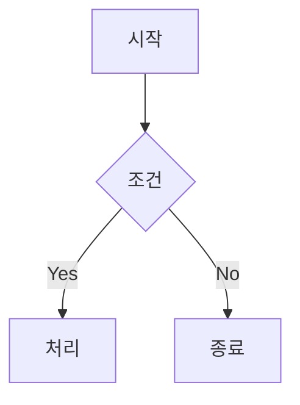
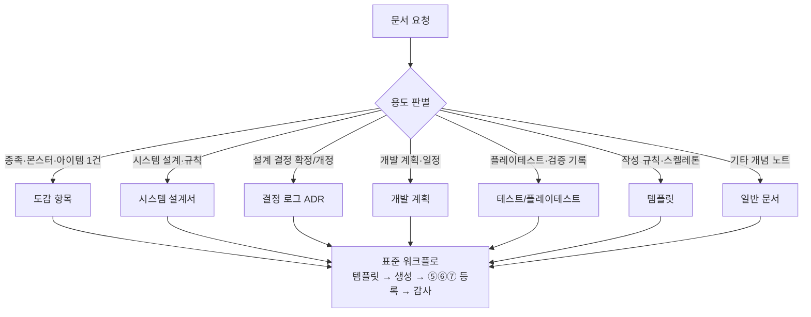

# 📝 문서 작업 규칙 (Obsidian 표준 템플릿)

> [!info] v2.0 개정 (2026-08-10)
> 옵시디언 최상 활용 컨벤션 도입: **볼트 폴더 구조(§1)** · **원자적 노트(§3)** · **결정 로그 ADR(§7)** · **세션 로그(§8)** · **태그 체계(§9)** · **마일스톤 5요소(§10)** · **템플릿(§11)**.

> [!info] ★v2.1 개정 (2026-08-11)
> **GDD_홈 등록(⑤)·결정로그 등록(⑥)을 4대 표준 외 제5·6 표준으로 승격** — 표준 9종 체계.
> 감사 도구 `art/tools/audit_docs_compliance.py`가 ①~⑨ 전부 자동 점검 (이전엔 ⑤⑥이 '부가·체크리스트' 수준이었음).

> [!info] ★v2.2 개정 (2026-08-11)
> **템플릿(_템플릿/)도 상태 태그를 기본값으로 포함** — status 필드와 정합되는 '생성 문서의 시작 상태'
> (로그류 `상태/작업중` · 설계서/도감 `상태/초안`). 템플릿은 작성용 스켈레톤이라 **감사 기본 범위 밖**
> (`--all` 참고 — '템플릿 자체 점검' 비차단: 상태 태그·감사 체크리스트). 생성된 문서는 본문 범위에서 ⑦ 검사.
> ★후속 (D-30 실습): **§1️⃣-1 '본문 폴더 생성 = 감사 자동 포함'** 문서화 — 본문 폴더(00~04)에 만들면
> 감사·대시보드에 자동 포함, 템플릿 3종에 ②'🔗 관련 문서'·④머메이드 기본 포함.

> [!note] 역할 정의
> 문서 작성은 **게임 기획자 + 옵시디언 지식 관리 전문가**의 역할로 진행합니다.
> 이 문서는 모든 기획 문서·계획서·세션 작업에 **항상** 적용되는 표준입니다 (v2.2 — 옵시디언 최상 활용 기준).

> [!tip] 문서 수명주기 (표준 9종 적용)
> 모든 문서는 아래 흐름으로 작성·검증·등록됩니다 — 준수 여부는 **감사 도구** `art/tools/audit_docs_compliance.py`가
> 자동 점검해 `art/out/docs_compliance.md` 리포트를 산출합니다.
>
> **자동 실행:** `scripts/audit_docs.sh` 공용 래퍼 — git pre-commit/pre-push 훅 (`scripts/install_git_hooks.sh` 설치) ·
> GitHub Actions CI (`.github/workflows/docs-audit.yml`) · `.freebuff/settings.json` startupScript (격리 워크스페이스).
> 로컬 세션에서는 **문서 편집 후 반드시** `bash scripts/audit_docs.sh --quiet` 실행.


---

## 🧭 표준 체계 (v2.2 — 표준 9종)

> [!tip] 4대 표준 + 제5·6 표준 (등록 표준) + ⑦~⑨
> **제5·6 표준(⑤⑥)은 '문서가 볼트에 제대로 등록·추적되는가'를 강제**합니다 —
> 신규 문서는 홈 목록에 등록하고, 결정·개정은 결정로그에 기록하고 문서에서 참조해야 합니다.

| # | 표준 | 내용 | 정의 위치 |
|---|---|---|---|
| ① | 프론트매터 | 필수 필드 · ISO updated · up 계층 | §2️⃣ |
| ② | 위키링크 | 파일명 기반 · 🔗 관련 문서 표 · 미존재 링크 0 | §4️⃣ |
| ③ | 콜아웃 | 중요/주의/팁 강조 (≥1) | §5️⃣ |
| ④ | 머메이드 | 로직 흐름 시각화 (≥1) | §6️⃣ |
| ⑤ | **GDD_홈 등록** | 신규 문서는 홈 문서 목록에 `[[위키링크]]` 등록 (MOC 제외) | §7️⃣-1 |
| ⑥ | **결정로그 등록** | 결정·개정은 결정로그 등록 + 문서에서 참조 | §7️⃣-2 |
| ⑦ | 태그 체계 | 분야·성격·상태 태그 (status 필드와 정합) | §9️⃣ |
| ⑧ | 삭제 문서 참조 | D-10 통합 문서(8종) 위키링크 금지 | 감사 도구 |
| ⑨ | 구수치 잔존 | 구수치(120AP·45°·100×1.15 등) 잔존 금지 | 감사 도구 |

> [!note] ⑧⑨는 본 문서 외 **감사 도구 전용 표준** — D-10 문서 통합·구수치 재발 방지 목적 (실제 사례: 45° 카메라 9곳 잔존).

---

## 1️⃣ 볼트 구조 (폴더 분류)

> [!tip] 왜 폴더를 분류하나
> 옵시디언은 **링크·태그·MOC**가 주된 조직 도구이지만, 파일 탐색기(File Explorer)에서도
> 분야별로 바로 찾아갈 수 있도록 **번호 붙은 분류 폴더**를 사용합니다.
> 위키링크는 **파일명 기반**이므로 폴더를 옮겨도 링크가 깨지지 않습니다.

```text
docs/GDD/                          ← 옵시디언 볼트 (루트: docs/)
├── 00_허브/                        ← MOC·허브 문서 (GDD_홈)
├── 01_기획/                        ← GDD 본문·밸런스 등 핵심 기획
├── 02_시스템/                      ← 시스템 설계서 (전투·소환·도감·이름)
├── 03_아트/                        ← 아트 규칙·파이프라인
├── 04_프로세스/                    ← 개발 플랜·결정 로그·문서 규칙 (작업 프로세스)
├── (구 05_아카이브 → docs/archive/gdd/)           ← 구버전 GDD·검토 의견서 (수정 금지)
├── _템플릿/                        ← Obsidian Templates 폴더 (새 문서는 여기서 생성)
└── *.canvas                        ← 캔버스 (로드맵·시퀀스 시각화)
```

**새 문서 분류 규칙:**
| 콘텐츠 | 폴더 |
|---|---|
| MOC·허브·인덱스 | `00_허브/` |
| 게임 본문·장르·밸런스·스토리 | `01_기획/` |
| 시스템 설계 (전투·소환·성장·도감·이름) | `02_시스템/` |
| 아트·사운드·UI 규칙 | `03_아트/` |
| 플랜·결정 로그·세션 로그·표준 | `04_프로세스/` |
| 폐기·이전 버전 | `archive/gdd/ (구 05_아카이브)` |

### 1️⃣-1 본문 폴더 생성 = 감사 자동 포함 (★D-30 실습 확정)

> [!important] 본문 폴더(00_허브~04_프로세스)에 생성하면 **감사 대상에 자동 포함**됩니다
> `art/tools/audit_docs_compliance.py`(감사) · `art/tools/gen_home_dashboard.py`(대시보드)는 `docs/GDD/`의 모든 `.md`를
> **자동 스캔**하며, **`_템플릿/`·`archive/gdd/ (구 05_아카이브)`만 제외**합니다. 따라서 새 문서를 본문 폴더에 만들면
> 재설정 없이 표준 9종 감사·태그 대시보드에 바로 잡힙니다 (별도 등록·설정 불필요).

**본문 폴더에 새 문서를 생성할 때의 필수 흐름:**

1. `_템플릿/`에서 템플릿 선택 → 분류 폴더(`00_허브~04_프로세스`)에 생성 (템플릿은 ②'🔗 관련 문서'·④머메이드 기본 포함 — 생성 직후 ①~⑨ 통과)
2. **⑤ GDD_홈 등록** — `[[GDD_홈]]` 문서 목록 표에 위키링크 추가 (제5 표준 — MOC·템플릿·아카이브 제외). **★D-34 3중 정합:** 감사 도구가 ① 문서 목록 표 ② 태그 대시보드(프론트매터 tags → 생성기 기대치) ③ 대시보드·프론트매터 drift 를 **한 번에 전수 대조** — 어느 하나라도 어긋나면 ⑤ 실패 (대시보드 drift 시 `python3 art/tools/gen_home_dashboard.py` 재생성 안내)
3. **⑥ 결정로그 등록** — 결정·개정 마커(확정/개정/★vN/D-N/결정)가 있으면 `[[결정로그_DecisionLog]]` 참조 필수 (제6 표준 — Log 문서는 예외)
4. **감사 도구 실행** — `bash scripts/audit_docs.sh --quiet` → **본문 N건이 자동 +1** 되어 ①~⑨ 전체 검사. **★D-44: 리포트 첫 섹션 '🔎 본문 자동 포함 스캔'**이 ① 문서 수(전체=본문+제외) ② 제외 폴더(`_템플릿/`·`archive/gdd/ (구 05_아카이브)` + 파일명) ③ **신규 감지(미등록)** — 본문에 있으나 GDD_홈 문서 목록 미등록 문서를 명시 (새 문서를 만들면 '신규 감지 1건'으로 즉시 확인 — `--new <경로>` 집중 감사 안내)
5. **대시보드 재생성** — 태그가 바뀌면 `python3 art/tools/gen_home_dashboard.py` (감사 래퍼가 동기화 불일치를 잡아 exit 1 → 재생성으로 해소). **★D-33: '할 일/진행 중' 뷰(<!-- TODO:START/END -->)도 같은 도구가 자동 생성** — 결정로그 ⬜미결정 + 개발플랜 VS-1~3 미완료 항목·게이트를 상태 태그와 함께 표시하므로, 새 결정·체크리스트 변경 시 재생성으로 즉시 반영 (수동 '할 일' 목록 작성 금지). **★D-43: '폴더별 감사 커버리지'(표준 9종 집계 표 + Mermaid 통과율 바)도 대시보드에 자동 포함** — `art/out/docs_compliance.json`(감사 산출)을 읽으므로 **감사 실행 → 재생성 순서**를 지켜야 최신 커버리지가 반영됨 (순서 어긋나면 스테일 데이터로 재생성됨 — 실증 발견)

> [!note] 제외 폴더의 의미
> - `_템플릿/` — 스켈레톤이라 ①~⑨ 전부 강제하면 거짓 실패 → 대신 **템플릿 자체 점검(★D-46)**: status·상태 태그·감사 체크리스트 + **'🔗 관련 문서'(②) + 머메이드 ≥1(④) + 미해결 위키링크 0(자리표시자 금지)** — 템플릿 결함이 생성 문서로 전파되는 것을 **차단(exit 1)** (기존 참고 → 차단 승격)
> - `archive/gdd/ (구 05_아카이브)` — 동결 원칙(수정 금지) → 감사 대상에서 제외
> - 즉 **본문 폴더 생성 여부 = 감사 포함 여부** — 템플릿에서 새 문서를 만들면 감사는 자동으로 따라옵니다.

---

## 2️⃣ 프론트매터 (YAML Frontmatter) — ★v2.0 개정

### 필수 필드 (전 문서 공통)

```yaml
---
title: 문서 제목 (버전 포함 가능)
type: MOC | GDD | System | Guide | Character | Item | Quest | Log
status: Idea | Draft | In Progress | Complete
version: v1.0            # ★필수 — 모든 문서에 버전 명시 (Dataview 정렬용)
tags: [gdd, 분야, 상태태그]
aliases: [별칭1, 별칭2]   # 구문서명·영문명 포함 (구링크 해석용)
up: "[[상위문서]]"          # 계층: 부속 문서 → v7.11, v7.11 → GDD_홈
created: YYYY-MM-DD
updated: YYYY-MM-DD       # ★ISO 날짜만 — 설명/사유는 본문 첫머리에
---
```

> [!note] MOC 예외
> `GDD_홈`(MOC)은 최상위 허브이므로 `up` 필드를 생략합니다 (나머지 문서는 필수).

> [!warning] updated 필드 규칙 (★v2.0)
> - `updated`는 **ISO 날짜(YYYY-MM-DD)만** 입력합니다. **변경 사유·이력을 넣지 마세요** (Dataview 정렬·검색이 깨짐).
> - 변경 이력은 본문 첫머리 `> [!info] vX.Y 변경 이력` 콜아웃에 기록하거나 [[결정로그_DecisionLog]]에 등록합니다.
> - 문서를 실제로 편집한 날짜로 갱신합니다 (링크만 고친 것도 갱신 대상).

> [!tip] status 자동 관리
> - **Idea** — 구체화 전 아이디어
> - **Draft** — 초안 작성 중
> - **In Progress** — 확정 작업 중 (부분 반영)
> - **Complete** — 확정 완료 (기준 문서로 참조 가능)

### type 분류 표준

| type | 용도 | 예시 |
|---|---|---|
| `MOC` | 문서 맵·허브 | [[GDD_홈]] |
| `GDD` | 게임 본문 (확정 기준) | [[SoulCommander_GDD_v7.11]] |
| `System` | 시스템 설계서 | [[전투시스템_BattleSystem]] · [[소환카탈로그_설계영웅]] |
| `Guide` | 표준·규칙·가이드 | 본 문서 · [[개발플랜_DevPlan]] |
| `Log` | 결정·세션 기록 | [[결정로그_DecisionLog]] |

---

## 3️⃣ 원자적 노트 규칙 (1개념 = 1노트) — ★v2.0 신설

> [!tip] 옵시디언의 힘은 '연결'입니다
> **새로 작성하는 콘텐츠**는 큰 문서 하나에 몰아넣지 말고 **개념 단위로 쪼개** 작성합니다:
> - 종족 1종 = 1노트 / 몬스터 1종 = 1노트 / 스킬 1종 = 1노트 / 시스템 1개 = 1노트
> - 각 노트는 `_템플릿/도감_항목.md` · `_템플릿/시스템_설계서.md` 템플릿으로 생성
> - 노트 간 연결은 위키링크 — [[SoulCommander_GDD_v7.11]]처럼 본문 문서가 인덱스 역할

> [!warning] 기존 통합 문서는 유지
> 2026-08-09 통합으로 완성된 **10개 문서 체계**(종족몬스터사전·전투시스템 등)는
> '도감·레퍼런스' 성격의 **기준 문서**이므로 그대로 유지합니다.
> 원자적 노트 규칙은 **앞으로 새로 추가되는 콘텐츠**에 적용합니다.

---

## 4️⃣ 위키링크

기획서 내에서 참조가 필요한 핵심 개념·시스템·타 기획서·캐릭터·아이템은 반드시 위키링크로 연결합니다.

```text
예: [[기본 이동 시스템]], [[플레이어 스탯]], [[검 아이템]], [[SoulCommander_GDD_v7.11]]
```

> [!warning] 링크 규칙 (★v2.0 — 파일명 기반 권장)
> - **파일명 기반 링크 권장**: `[[이름생성시스템_NameGenerator]]` — 폴더 이동에 강건 (경로 기반 `[[폴더/파일]]` 금지 권장)
> - 섹션 앵커: `[[문서#섹션 제목]]` 형태로 섹션 단위 연결 (예: [[종족몬스터사전_Bestiary#13. DB & JSON 스키마]])
> - 최초 등장 시 1회만 링크 (반복 불필요)
> - 미존재 문서에 링크 금지 — 그래프 뷰에 빈(unresolved) 노드로 표시됩니다 (예시용 `[[링크]]` 주의)

---

## 5️⃣ 콜아웃 (Callout)

중요 사항·예시·개발자 노트·주의사항은 콜아웃으로 강조합니다.

| 종류 | 용도 | 예시 |
|---|---|---|
| `> [!NOTE]` | 일반 정보 | `> [!note] 이 시스템은 전투 중에만 적용됩니다` |
| `> [!WARNING]` | 주의·리스크 | `> [!warning] 퍼머데스 부활권 판매 금지` |
| `> [!TIP]` | 권장사항·팁 | `> [!tip] Pre-Alpha에서 ±20% 보정 권장` |
| `> [!EXAMPLE]` | 예시 | `> [!example] 전사 피격 시 😠 + "육탄!"` |
| `> [!INFO]` | 변경 이력·버전 메모 | `> [!info] v1.2 변경: ...` |
| `> [!QUESTION]` | 결정 필요 | `> [!question] P0-① 미결정 — 2지선다 필요` |

> [!tip] 접기 사용
> 긴 보충 설명은 `> [!note]+ 제목` (펼침 기본) 또는 `> [!note]- 제목` (접힘 기본)을 사용합니다.

---

## 6️⃣ 구조화 및 시각화

### 제목 구조
- `#` 문서 제목 (1개) → `##` 대주제 → `###` 소주제 계층 유지
- 목차가 필요하면 맨 위에 `## 목차` + 앵커 링크

### 표 (Table) — 수치·데이터 비교
```markdown
| 항목 | 수치 A | 수치 B | 비고 |
|---|---|---|---|
| 공명 3명 | HP/ATK +5% | 보유 기준 | 5.4 |
```

### Mermaid — 로직 흐름·상태 변화
````markdown

````

### 캔버스 (Canvas) — 시퀀스·로드맵·공간 구조
- **시퀀스/단계 흐름** (게임 진행 순서·개발 로드맵) → `.canvas` 파일로 시각화
- 예: `04_프로세스/개발로드맵.canvas` (파이프라인 단계 노드 + 화살표)
- 캔버스 노드는 `[[문서]]` 파일 노드로 연결 가능 (그래프 뷰와 동기화)

---

## 7️⃣ 결정 로그 (ADR — Architecture Decision Record) — ★v2.0 신설 · ★v2.1 제6 표준

> [!important] ★v2.1 — 제6 표준 승격
> 결정·개정 마커(확정/개정/정정/보류/대체/★vN/D-N/결정)를 포함하는 문서는
> 감사 도구가 [[결정로그_DecisionLog]] 참조 여부를 **자동 검사**합니다 (미참조 = 실패).

> [!warning] 결정은 반드시 기록
> **확정된 설계 결정**은 그때그때 [[결정로그_DecisionLog]]에 등록합니다.
> - 기록 안 하면 다음 세션에서 '구수치/구설계 잔존' 문제가 반복됩니다 (실제 사례: 45° 카메라 9곳 잔존).
> - 결정 로그 항목 형식: **날짜 · 결정 · 근거 · 대안 · 상태(확정/보류/대체) · 출처**

```markdown
| 날짜 | 결정 | 근거 | 상태 | 출처 |
|---|---|---|---|---|
| 2026-08-08 | 카메라 45°→60° (0,11.5,-6.6) | 돈스타브식 상향 탑다운 | ✅ 확정 | 아트규칙 v3.10 |
```

**규칙:**
1. 결정을 내리면 (또는 사용자가 승인하면) 같은 세션에서 [[결정로그_DecisionLog]]에 추가
2. 대체/폐기된 결정은 상태를 `❌ 대체`로 변경하고 새 결정을 연결
3. 미결정 사항은 `⬜ 미결정` 상태로 등록해 다음 세션에 이월

### 7️⃣-1 제5 표준 — GDD_홈 등록 (★v2.1 승격)

> [!warning] 신규 문서는 반드시 홈 등록
> **모든 본문 문서**(MOC 제외)는 [[GDD_홈]] 문서 목록 표에 `[[위키링크]]`로 등록해야 합니다.
> 감사 도구 ⑤ 표준 — 미등록 시 실패.
>
> - 등록 위치: `docs/GDD/00_허브/GDD_홈.md`의 "📄 문서 목록" 표
> - 등록 시 **버전·상태·설명**도 함께 갱신 (통합·승격 시 ★표기)
> - 결정 로그·템플릿·아카이브는 등록 대상에서 제외 (아카이브는 동결 원칙)

### 7️⃣-2 제6 표준 — 결정로그 등록 (★v2.1 승격)

> [!warning] 결정·개정은 결정로그 등록 + 문서에서 참조
> 설계 결정·개정(확정/개정/정정/보류/대체/★vN/D-N)을 포함하는 문서는
> [[결정로그_DecisionLog]]를 **본문 또는 🔗 관련 문서 표에서 참조**해야 합니다.
> 감사 도구 ⑥ 표준 — 결정·개정 마커가 있는데 참조가 없으면 실패.
>
> - **결정/승인 시:** 같은 세션에서 결정로그에 등록 (날짜·결정·근거·대안·상태·출처)
> - **미결정:** ⬜ 상태로 등록해 다음 세션에 이월 (P0-①/② 사례)
> - **문서 쪽:** 🔗 관련 문서 표에 `📌 결정 기록 | [[결정로그_DecisionLog]]` 행 추가

---

## 8️⃣ 세션 로그 규칙 — ★v2.0 신설

> [!tip] 세션 간 항법
> 매 작업 세션은 [[개발플랜_DevPlan]]이 **항법 문서**입니다:
> 1. 세션 시작: 개발플랜 §1(상태) → §3(마일스톤) → §4(다음 세션) 읽기
> 2. 작업 중: 완료/결정/발견은 **그때그때** 개발플랜 §1 갱신 + [[결정로그_DecisionLog]] 등록
> 3. 세션 종료: 개발플랜 §1.3 '다음 세션 시작 방법' 갱신 (중단 지점 명확화)
> 4. 장기 작업(수치·설계)은 `_템플릿/세션_로그.md` 템플릿으로 개별 기록 후 요약을 개발플랜에 반영

---

## 9️⃣ 태그 분류 체계 — ★v2.0 신설

| 태그 그룹 | 태그 | 용도 |
|---|---|---|
| 분야 | `#기획` `#시스템` `#아트` `#밸런스` `#데이터` `#프로세스` | 콘텐츠 분야 |
| 상태 | `#상태/아이디어` `#상태/초안` `#상태/작업중` `#상태/확정` | 진행 상태 필터 |
| 성격 | `#gdd` `#부속문서` `#MOC` `#가이드` | 문서 유형 |
| 검토 | `#검토` `#이전버전` | 리뷰·아카이브 |

> [!tip] 태그 vs status 필드
> `status` 프론트매터는 문서 전체 상태, `상태/xxx` 태그(bare)는 필터링 용도입니다.
> 신규 문서는 **분야 태그 1개 이상 + 성격 태그**를 기본으로 붙입니다.
> **템플릿(_템플릿/)도 상태 태그를 기본값으로 포함**합니다 — status 필드와 정합되는 '생성 문서의 시작 상태'
> (로그류 In Progress → `상태/작업중` · 설계서/도감 Draft → `상태/초안`). 템플릿은 '작성용 스켈레톤'이라
> **감사 기본 범위 밖**이고, `--all` 참고 모드의 **템플릿 자체 점검**(비차단)이 상태 태그·감사 체크리스트를 확인합니다.

---

## 🔟 마일스톤 작성 표준 (산업 표준 — Rami Ismail) — ★v2.0 신설

> [!tip] 마일스톤마다 5요소
> 개발플랜의 각 마일스톤은 다음 5요소를 갖춥니다 (게임 산업 표준, Rami Ismail *Milestones*):
>
> 1. **목표 (Goal)** — 이 단계가 증명하는 것
> 2. **범위 (Scope)** — 만들 것 / 안 만들 것
> 3. **완료 기준 (Exit Criteria)** — '끝났다'고 판정하는 체크리스트
> 4. **산출물 (Deliverable)** — 빌드·시트·문서
> 5. **게이트 (Gate)** — 다음 단계 전 검증 (플레이테스트 등)

```markdown
### VS-1 — 코어 루프 버티컬 슬라이스
- **목표:** 소환→전투→보상→성장 코어 루프의 재미 검증
- **범위:** 1~3개 층 · 5인 파티 · 로컬 플레이 (서버 mock)
- **완료 기준:** [ ] 소환 → [ ] 파티 구성 → [ ] 행동력 게이트 → [ ] 보스 1종
- **산출물:** 플레이 가능 데모 + 플레이테스트 기록
- **게이트:** 3~5인 외부 플레이테스트 통과
```

---

## 1️⃣1️⃣ 새 문서 생성 워크플로 — 템플릿 → 등록 → 감사 (★D-36 신설)

> [!important] 새 문서는 **항상 이 순서**로 생성합니다 — 템플릿이 상태 태그 기본값을 넣어주고,
> ⑤⑥⑦ 등록 → 감사 도구까지 한 흐름으로 검증됩니다 (1️⃣-1 '본문 폴더 = 감사 자동 포함'의 절차판).

### 1️⃣1️⃣-0 용도 판별 → 서브워크플로 선택 (★D-51)

새 문서 요청이 들어오면 **용도부터 판별**해 서브워크플로를 고른 뒤 아래 표준 워크플로로 진행합니다.



| 서브워크플로 | 템플릿 | 용도 예시 |
|---|---|---|
| 도감 항목 | `_템플릿/도감_항목.md` | 종족/몬스터/아이템 1건 (1개념=1노트 §3) |
| 시스템 설계서 | `_템플릿/시스템_설계서.md` | 시스템 규칙·수치 설계 (상위 기준 GDD §절) |
| 결정 로그 ADR | `_템플릿/결정_로그.md` | 설계 결정 확정/개정 → [[결정로그_DecisionLog]] D-N |
| 개발 계획 | `_템플릿/세션_로그.md` | 개발 계획·일정 (상태/작업중) |
| 테스트/플레이테스트 | `_템플릿/플레이테스트_체크리스트.md` · `플레이테스트_기록.md` | 플레이테스트 진행 체크리스트(게이트 기준 §4) · 테스터별 기록 (D-56) |
| 일반 문서 | 수동 | 위 분류에 없는 개념 노트 |

> [!tip] 1명령 생성 (★D-51)
> `bash scripts/new_doc.sh 02_시스템/문서명.md 시스템_설계서 "설명"` — 템플릿 선택 → 생성(프론트매터 기본값 치환) →
> ⑤ GDD_홈 문서 목록 등록 → 대시보드 재생성(3중 정합) → `--new` 감사 → 전체 감사까지 **한 번의 명령**으로 수행.

```mermaid
flowchart TD
    A[새 문서 필요<br/>1개념 = 1노트 §3] -->    B{템플릿 선택}<br/>결정_로그 · 세션_로그 · 플레이테스트_기록<br/>시스템_설계서 · 도감_항목 · 플레이테스트_체크리스트
    B --> C[분류 폴더에 생성<br/>00_허브 ~ 04_프로세스 §1]
    C --> D[프론트매터 작성<br/>템플릿 상태 태그 기본값 §9<br/>로그류 In Progress → 상태/작업중<br/>설계서·도감 Draft → 상태/초안]
    D --> E[본문 작성<br/>②위키링크 · ③콜아웃 · ④머메이드]<br/>🔗 관련 문서 표 포함
    E --> F[⑤ GDD_홈 등록<br/>문서 목록 표 + 대시보드 재생성<br/>3중 정합 ★D-34]
    F --> G{결정·개정 마커?}
    G -->|있음| H[⑥ 결정로그 등록<br/>D-N 등록 + 문서에서 참조]
    G -->|없음| I
    H --> I[⑦ 상태 태그 = status 필드 정합<br/>분야 1개 + 성격 태그 §9]
    I --> J[감사 도구 실행<br/>bash scripts/audit_docs.sh --quiet]<br/>표준 9종 + 대시보드 동기화 --check
    J --> K{exit 0?}
    K -->|아니오| E2[리포트 art/out/docs_compliance.md<br/>미준수 항목 수정]
    E2 --> J
    K -->|예| L[✅ 완료<br/>문서 목록·대시보드·할 일 뷰 반영]
```

### 단계별 상세

| 단계 | 작업 | 참조 |
|---|---|---|
| **① 템플릿 선택** | 용도에 맞는 템플릿 4종 중 선택 — 결정_로그(ADR) · 세션_로그 · 시스템_설계서 · 도감_항목 | §7 · §8 · _템플릿/ |
| **② 폴더·프론트매터** | 분류 폴더(00~04)에 생성 — 템플릿이 **상태 태그 기본값**을 포함 (로그류 `상태/작업중` · 설계서/도감 `상태/초안`), `#분야`는 실제 분야로 교체 | §1 · §2 · §9 |
| **③ 본문 작성** | 파일명 기반 위키링크 · 콜아웃 · 표/Mermaid — '🔗 관련 문서' 표 포함 (템플릿 기본 내장) | §4 · §5 · §6 |
| **④ ⑤ GDD_홈 등록** | 문서 목록 표에 행 추가 → `python3 art/tools/gen_home_dashboard.py`로 대시보드·할 일 뷰 재생성 (**3중 정합** — 목록·대시보드·프론트매터 일치) | §7️⃣-1 · 1️⃣-1 |
| **⑤ ⑥ 결정로그 등록** | 결정/개정 마커가 있으면 [[결정로그_DecisionLog]]에 D-N 등록 + 문서에서 참조 (없으면 생략) | §7️⃣-2 |
| **⑥ ⑦ 상태 태그 정합** | status 필드와 `상태/xxx` 태그 일치 + 분야 1개·성격 태그 확인 | §9 |
| **⑦ 감사 실행** | `bash scripts/audit_docs.sh --quiet` — 표준 9종 + 대시보드 `--check` 동기화, exit 0 = 준수 (실패 시 리포트 수정 → 재실행) | §1️⃣-1 · 감사 도구 |

> [!tip] 감사 실패 시
> `art/out/docs_compliance.md` 리포트의 '미준수 상세'를 보고 해당 항목을 수정한 뒤 재실행합니다.
> **대시보드 drift**(⑤)는 `python3 art/tools/gen_home_dashboard.py` 재생성으로 해소 — 수동 편집 금지.
> **신규 문서 1건 바로 감사 (★D-37):** `python3 art/tools/audit_docs_compliance.py --new docs/GDD/02_시스템/새문서.md` —
> 표준 9종 + ⑤ 3중 정합(홈 목록·대시보드 등록)을 **대상 1건에 집중**해 즉시 확인 (exit 0 = 등록 완료).
> **신규 문서 감지 시각 (★D-51):** 감사 리포트 🔎 스캔 섹션의 `감지 시각`(ISO)으로 미등록 문서가 언제 감지됐는지 추적 — JSON `scan.scanned_at`.

### 템플릿별 검증 기록 (생성 → 등록 → 감사 → 통과) (★D-51)

| 템플릿 | 생성 | ⑤ 등록 | 감사 | 통과 | 실증 |
|---|---|---|---|---|---|
| 시스템_설계서 | ✅ | ✅ | ①~⑨ | ✅ | D-45 — `테스트_설계서_임시` (15/15) |
| 도감_항목 | ✅ | ✅ | ①~⑨ | ✅ | D-45 — `테스트_도감_임시` (15/15) |
| 결정_로그 | ✅ | ✅ | ①~⑨ | ✅ | D-30 — 템플릿 3종 기본 포함 |
| 세션_로그 | ✅ | ✅ | ①~⑨ | ✅ | D-30 — 템플릿 3종 기본 포함 |

> 4종 모두 **생성 직후 ①~⑨ 통과** — 템플릿 자체 점검(D-46)이 ②④·미해결 링크를 차단하므로 결함이 생성 문서로 전파되지 않음.

---

## ✅ 작성 완료 전 체크리스트 (★v2.0)

- [ ] 프론트매터 필수 필드 입력 — type/status/**version**/tags/created/updated(ISO)/up/aliases
- [ ] 분류 폴더에 저장 (`00_허브`~`05_아카이브` · `_템플릿`에서 생성)
- [ ] **⑤ GDD_홈 등록** — [[GDD_홈]] 문서 목록에 등록 (신규 문서 필수 — **3중 정합**: 목록 표 + 태그 대시보드 + 프론트매터 일치, drift 시 대시보드 재생성)
- [ ] **⑥ 결정로그 등록** — 결정/개정 사항이 있으면 [[결정로그_DecisionLog]] 등록 + 문서에서 참조
- [ ] 핵심 개념·문서에 **파일명 기반** 위키링크 연결 (경로 기반 금지)
- [ ] 중요/주의사항은 콜아웃, 수치는 표, 로직은 Mermaid/캔버스
- [ ] 관련 문서들의 "🔗 관련 문서" 표에 상호 링크 추가
- [ ] **§1️⃣1️⃣ 새 문서 생성 워크플로** 순서대로 진행 — 템플릿 → 상태 태그 → ⑤⑥⑦ 등록 → 감사 도구

---

## 🔗 관련 문서

| 관계 | 문서 |
|---|---|
| 🏛 홈 | [[GDD_홈]] |
| 🛤 세션 항법 | [[개발플랜_DevPlan]] |
| 📌 결정 기록 | [[결정로그_DecisionLog]] |
| 📖 적용 대상 | [[SoulCommander_GDD_v7.11]] |
| 📝 작성된 문서 예시 | [[이름생성시스템_NameGenerator]] · [[종족몬스터사전_Bestiary]] |

---

*이 템플릿은 Freebuff(버피)가 GDD 프로젝트 문서 작성 시 적용하는 표준입니다. v2.2 — 옵시디언 최상 활용 기준 (2026-08-11, ★v2.2: 템플릿 상태 태그 기본값 + 템플릿 자체 점검).*
