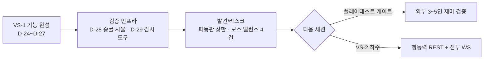

# 세션 로그 2026-08-11

> [!info] 세션 목표
> **VS-1 버티컬 슬라이스 기능 완성** — 파티 구성 → 층 진입 → 보스 → 영웅 스킬 → 보상·성장 → 명령 수용률·위협도 → 2.5D P7~P9 전 항목 완료 후 **외부 플레이테스트 게이트 진입** + 검증 인프라 강화.

---

## ✅ 완료

| 항목 | 상세 | 마일스톤 |
|---|---|---|
| **★AI 파일럿 스펙·폴더 준비 (D-169 후속)** | 사용자 지시('AI 생성 준비 — 몹 1종(오크)+종족 1종(하이 엘프) 생성 스펙 정리 + 결과물 폴더 준비') — 실측 규격: 몹 = mon_<slug>.png 32×32 원본색 + idle 4프레임 + hit 1 (현재 파일 체계) · 종족 = race_lpc_color_<slug>.png 64×64 + walk 9 + slash 6 — **① 스펙 문서**: art/_source/ai_pilot/README.md — 공통(정면 필수 · 32/64 셀 · 16×16 금지 · 원본색·명암 대비 · 프레임 홀드 D-156 · 외곽선 1px) + 오크 6장/하이 엘프 16장 파일 구성 + AI 프롬프트 한/영 + 수용 기준 **② 폴더**: reference/(기존 자산 참고 2장) · mon_orc/ · race_highelf/ (결과물 수납) **③ 검증 도구**: art/verify_ai_pilot.py — 파일 수·이름·셀 크기·모서리 투명·프레임 홀드(중심 ≤2px · 크기 ≤20%) 자동 검증 · 정면은 육안 판정 표시 — 빈 폴더 기준 22건 실패(기대값)로 동작 확인 — **다음: AI 결과 수령 → verify_ai_pilot → 기존 vs AI 비교 프리뷰 → 통과 시 파일럿 교체 + Play 확인 (게이트 방식)** | L8 트랙 B |
| **★GIMP 배치 제작 파일럿 (D-171 — 생산 스펙 적응판)** | 사용자 지시('DeepSeek 생산 스펙에 맞게 우리 게임에 맞게 제작' — GIMP 활용 요청) — **① GIMP 3 API 실측**(번들 플러그인 + GIR): lookup_procedure→create_config→set_property→run(config) · 색 = **Gegl.Color** + Gimp.context_set_foreground(Gimp.RGB 없음) · 채우기 = 선택 영역 + layer.edit_fill(0)(drawable 메서드) · 이미지/레이어 타입 = 0(RGB)/1(RGBA) — 1/1 회색조 실측 수정 · 인자명 operation/mode 실측 · **종료 = 끝 --quit**(os._exit 플러그인만 죽임) **② 레이어 구조화**: 오크 SHADOW/BODY/HEAD/FACE/WEAPON · 엘프 SHADOW/BODY/CLOTHES/HEAD/HAIR/FACE/WEAPON — 마스터 .xcf 2장 **③ 그림자**: 게임 자체 그림자(CombatUnit.BuildShadow) → export 제외 · 마스터만 포함 **④ 산출물**: PNG 22장 RGBA + 마스터 2장 — verify_ai_pilot **전수 통과**(오크 1px/0% · 엘프 1px/3% · slash 5.5px/28%) **⑤ 생산 스펙 5요소 적응**: Grid 시트 · 프레임 메타(IDLE 4 · HIT 1 · WALK 9 · SLASH 6 — 게임 체계) · Unity import(Point · RGBA32 · MipMap off — 게임 실측) · **프리뷰 등록**: gimp_pilot_preview.html (5섹션 — 렌더 실측) — **다음: 사용자 육안 판정(정면·형질·색감) → 실제 교체 + Play 확인 → 68종 확장 (게이트 방식)** | L8 트랙 B |
| **★AI 파일럿 코드 생성 (D-170)** | 사용자 지시('너가 만들어서 해볼래?' — 외부 AI 대신 코드로 직접 생성) — **① 팔레트 실측**: Anokolisa 팩 PNG 양자화 추출 (오크 그린 #507b30 · 가죽 #6d553b · 아웃라인 #2a2416) **② art/gen_ai_pilot.py**: 오크 32×32 6장(정적+idle 4+hit) · 하이 엘프 64×64 16장(정적+walk 9+slash 6) — 정면 · 형질(상아/도끼 · 롱 이어+로브 후드) · 원본색 **③ 검증 통과**: verify_ai_pilot 그룹별 홀드 분리 — 오크 1px/0% · 엘프 1px/3% · slash 5.5px/28% **④ 디버깅**: 후드↔로브 6px 공백 → 목 연결 · hit 4px → 67px 강화 · 눈/상아 픽셀 프로브 **⑤ 비교 프리뷰 등록**: art/out/pilot_compare.html (기존 DCSS/LPC vs 생성 — 8x · 체커보드) — **다음: 사용자 육안 판정 → 실제 교체 + Play 확인 → 68종 확장 결정 (게이트 방식)** | L8 트랙 B |
| **★Anokolisa 팩 수신·라이선스 확정·추가 후보 비교 (D-169)** | 사용자 지시('여기' — 팩 제공) — **① 수신**: `art/_source/anokolisa_pixel_crawler/` 보관 (3.7MB · 181 PNG · 몹 8종 · 스테이션 9종 · 프롭/건물/무기/타일셋) **② 라이선스 확정**: Terms.txt 원문 — 출처 표기 불필요 · 변형 자유 · 팩 단독 판매만 금지 · **상업 무료** — ASSET_IMPORT_POLICY §5 통과 (이전 보류 해소) **③ 대체 불가 재확인**: 몬스터 8종 vs DCSS 38종 · 종족 탑다운 vs LPC 정면 — D-152/D-148 결론 유지 **④ 비교 프리뷰 등록**: art/out/anokolisa_add_preview.html (4섹션 · 34카드) — Workbench·Alchemy·Sawmill·Bonfire·Cooking = 신규 추가 ⭐ (미보유 · Kenney 원근 정합 · Bonfire 불/연기 10프레임 애니) · Furnace/Anvil = 대체 후보 🔶 · 무기 3종 = 신규 🔶 (탑다운 — 전리품 데코) · 프롭 가구/도구/던전 소품/팬 = 신규 ⭐ · 몹 = 대체 불가 ❌ — Preview 탭 렌더 실측 (전 카드 이미지 표시) | L8 트랙 B |
| **★전투 우선 UI 전/후 스크린샷 배치 도구 (D-168)** | 사용자 지시('전투 우선 UI 전/후 스크린샷을 자동으로 찍어 비교하는 배치 도구') — **① UiScreenshotTool.cs**: `-executeMethod UiScreenshotTool.Run -floor N` — Main.unity 열고 Play 진입 → Poll → 배치 exit 0/1 · -nographics 금지 · 에디터 메뉴 지원 **② UiScreenshotRunner.cs**: ① 전 = 파티 구성 화면 캡처 → 5인 프리셋 검증 → panel 숨김+DeploySelectedParty+BeginCombat(floor) ②③④ 후 = 전투 시작/몬스터·보스 스폰(보스 층=HP바)/전투 중반 캡처 + 파일 존재 검증 + sentinel **③ gen_ui_compare.py**: floor별 ①전/②③④후 나란히 — base64 단일 HTML **④ capture_ui_screenshots.sh**: 층 1+층 5 순차 캡처 → HTML 생성 · 검증: 괄호 균형 2파일 0 · 더미 캡처로 생성기 테스트(2층 섹션·8장) · **batchmode ⏸ 에디터(52233) 아직 실행 중** — 에디터 종료 후 `bash scripts/capture_ui_screenshots.sh` 실행 → ui_before_after.html 육안 비교 | L8 트랙 B |
| **★미니 파티 궁극기 게이지 표시 (D-167)** | 사용자 지시('미니 파티 상태에 궁극기 게이지(준비 시 점멸)를 함께 표시') — **① BattleFieldHUD**: 슬롯당 `partyUltFills` 추가 · SetRefs 확장(마지막 파라미터 — null=하위호환) · 매 프레임 `hc.UltGauge / HeroCombat.UltMax` — 충전 중 노을색(0.9/0.75/0.3) · **준비 시(UltReady) 금색 + 알파 펄스 점멸(0.4~1.0 · 6Hz)** · HeroCombat 아님 = 비움 **② SceneBuilder**: 슬롯 44→60 + 궁극기 스트립(y28 · 180×4) — y=하단 엣지 좌표 실측으로 겹침 0(이름 162-178 · 궁극 156-160 · HP 142-156 · 상태 128-142) · 기본 숨김 · 5건 배열 → SetRefs 전달 · 검증: 괄호 균형 2파일 전부 0 · **batchmode ⏸ 에디터(52233) 아직 실행 중** — 씬 재빌드 후 Play 육안(충전 노을색 → 준비 금색 점멸) 필요 | L8 트랙 B |
| **★AUTO 명령 우선순위 보강 (D-166)** | 사용자 지시('AUTO 모드 명령 우선순위 보강 — 집중 공격을 최저 체력 적에 지정 + 후퇴/측면 기동 조건부 자동') — **① 우선순위 5단계**: ① 회복(<60% · 25) → ② 후퇴(<35% & 적 2+ · 15) → ③ 방어 태세(적 2+ & <70% & 미방어) → ④ 측면 기동(적 2+ & ≥60% & 미버프 · 25) → ⑤ 집중 공격(최저 체력 · 10) — '위기 대응 순' 사다리 **② `LowestHpEnemy()`**: 첫 발견 → **HP 비율 최저 적**(처치 우선 · 보스/일반 크기 무관) **③ 재시전 가드**: AnyAllyDefending/AnyAllyFlankBuffed — 방어 3초·버프 5초 중 재시전 방지(게이지 낭비 해소) **④ 테스트 확장**: Step4 3시나리오 + 로그 캡처(Application.logMessageReceived — 후퇴/측면은 회복/방어와 게이지 델타 동일 → 로그 판별) · ① 80%/30% 적 → 30% 타겟 ② 위기 아군+게이지 20 → 「후퇴」 ③ 풀피 아군+게이지 50 → 「측면 기동」 **⑤ 잠복 컴파일 에러 수정**: `case 4: Step4_DeathAnimEnd`(미정의) → `Step4_AutoCast` — D-161 이후 batchmode 미실행으로 미발견 · 검증: 괄호 균형 2파일 전부 0 · **batchmode ⏸ 에디터(52233) 아직 실행 중** — 에디터 종료 후 CombatFxTest.Run(Step4 3시나리오 포함) PASS 확인 + Play 육안(위기→후퇴 · 안정→측면 · 최저 체력 집중) 필요 | L8 트랙 B |
| **★궁극기 클로즈업 줌인 펄스 (D-165)** | 사용자 지시('궁극기 발동 순간 연출 강화 — 시전자 포커스에 줌인(클로즈업) 펄스 + 인스펙터 튜닝') — **① `TriggerUltimateZoomPulse()` 신규**: 카메라 거리 감소(줌인) 후 감쇠 복귀 · Max 병합(재진입 시 지속 연장) **② UltimateCameraFx 연쇄 확장**: FocusOn(시전자) → 줌인 펄스 → HitStop → Shake(약) — 프리즈 중엔 Time.deltaTime=0 → 클로즈업 유지 후 복귀 **③ 인스펙터 3필드**: ultimateZoomPulse 3.5 · dur 0.9s · ease 1.5(감쇠 곡선) **④ 구현**: LateUpdate 동적 줌(dist) 위에 **가산만** — 기존 추적/프레이밍 골격 비수정(셰이크와 동일 패턴) · minDist(10) 미만 진입 = 클로즈업 의도 **⑤ 테스트**: CameraFxTestRunner Step3(활성 + 크기 3.5±0.01) · Step5(만료 후 복귀) · 검증: 괄호 균형 2파일 전부 0 · **batchmode ⏸ 에디터(52233) 아직 실행 중** — 에디터 종료 후 CameraFxTest.Run PASS 확인 + Play 육안(궁극기 발동 → 클로즈업 → 복귀) 필요 | L8 트랙 B |
| **★Heavy Hit 카메라 연출 (D-164 — PROMPT 2 §9 완결)** | 사용자 지시('Heavy Hit(몬스터 강타·보스 광역) 시 GameplayCamera.Shake를 피해 규모별로 연결') — **① `GameplayCamera.HeavyHitShake(hpRatio)` 신규 API**: 받은 피해를 **MaxHP 비율로 정규화**해 규모별 강도/지속 비례 · 인스펙터 7필드(임계 0.06 — 미만 무셰이크 · 포화 0.30 · amp 0.08→0.22 · dur 0.15→0.45 — 튜닝) · 기존 Shake() 재사용 — 추적/프레이밍 비수정 **② `CombatUnit.TakeDamage` 수신자(영웅) 측 연결**: actual>0 && !IsEnemy → HeavyHitShake(actual/MaxHP) — 몬스터 강타(돌진 1.8×ATK) · 보스 광역(포효 2.0×ATK · 충격파 1.5×ATK · 용암 2.5×MAG) 전 경로 단일 커버 · 다수 피격 = Max 병합(지속 연장) · 임계 미만 무셰이크(노이즈 차단) **③ CameraFxTestRunner ⑦스텝 추가**: 임계 미만 무셰이크 · 중간(12% HP → amp 0.115±0.01 · dur 0.225±0.05) · 포화(30% HP → amp 0.22) · 검증: 괄호 균형 3파일 전부 0 · **batchmode ⏸ 에디터(52233) 아직 실행 중** — 에디터 종료 후 CameraFxTest.Run(⑦ 포함) PASS 확인 + Play 육안(강타/광역 풀히트 진동 · 인스펙터 튜닝) 필요 | L8 트랙 B |
| **★게이트키퍼 층별 보스 포커스 프리셋 등록 (D-163)** | 사용자 지시('숲의 수호자·대제사장·철퇴 거인·불의 정령왕에 맞는 포커스 프리셋을 SceneBuilder에서 기본 등록') — 보스 이름 확정(WaveManager.BossConfigFor: 5층 숲의 수호자 · 10층 광신도 대제사장 · 15층 철퇴 거인 · 20층 불의 정령왕) → SceneBuilder에 `bossFocusPresets` 4건 등록(SerializedObject 경유 · CameraFxTest와 동일 패턴): 숲의 수호자 2.8s·0.85 · 대제사장 2.5s·0.8 · 철퇴 거인 3.2s·0.9 · 불의 정령왕 3.5s·0.95 — 층 상승 따라 강조 강화(보스 위압감 §9) · 미등록 보스 = 전역 기본 2.5s·0.8 폴백 유지 · 검증: 괄호 균형 0(주석/문자열 제외) · **batchmode ⏸ 에디터 열려 있어 잠김** — 재빌드 후 Main.unity 직렬화 검증 + Play 육안(층별 포커스 강도 차이) 확인 필요 | L8 트랙 B |
| **★역할 파츠 & 종족 형질 애니메이션 검증 (D-162 — PROMPT 4)** | 사용자 지시('역할 파츠·형질이 walk/slash에서 어긋나거나 384px에서 안 보이는 문제 검증 — 자동 보정 신중 · manual_review 분류') — **① 역할 파츠 트레이스 26검사(실패 0 · manual_review 3)**: 🔴 **활 슬라이싱 버그 발견·수정** — LPC 활 시트(1664×512)는 오버사이즈(128px 셀 · walk_128)인데 64px 셀로 잘라 **발밑 잔해 조각**(프레임마다 좌우 60px 텔레포트) → LPC 제너레이터 원문(custom-animations.ts · draw-frames.ts · sheet_definitions) 실측으로 128px 셀 슬라이스+중앙 64×64 크롭+행 매핑(n/w/s/e→d3/d1/d0/d2)+**bg/fg 2레이어 분리**(weapon_bg 몸뒤 · weapon_fg 쥔 손) 구현 — bow walk 9프레임 전부 정상(bg x37-58 y26-49 · fg x19-42 y37-52) · 견갑 slash f3 = 슬래시 어깨 이동(자연 동작 — manual_review) **② 마법사 로브색**: role_for 신규 — genasi/darkelf/highelf 후드·망토 = 로브 전용색(의복 계열 어두운색) · anims도 role_for 승격 · 마법사 3종만 변화(767/832/494px) · role_of dead code 버그 수정(뿔/지느러미/꼬리 피부색 오염 방지) **③ 형질 홀드 CI 훅**: verify_lpc_anim_hold.py 신규 + compose_lpc_anims 자동 실행(재생성 시마다 · 실패 시 중단) — 10검사 통과 · manual_review 2(dwarf 수염 헤드틸트 · lizardman 꼬리 런지) **④ 형질 영역 오버레이**: trait_overlay_preview.html — 384px 스트립 + 형질 bbox 컬러 테두리 **⑤ 384px 시인성 10종 전부 ✅(강화 불필요)** — 최소 seaelve 지느러미 36×78px · 3/4 원근 = 정면(d0)이 곧 게임 뷰(카메라 Z축 정면 · Y+180 고정 · 피치 35° — SceneBuilder L47 실측) **⑥ race_trait_compare 재생성 + verify_race_rescore 0/13(재채점 대기) ⑦ Unity batchmode 씬 재빌드 exit 0 · error CS 0**(에디터 닫힘 — 새 풀 자동 반영) · Preview: trait_overlay_preview.html 등록(5카드 · 10스트립 · 시인성 표) — **Play 육안 확인 필요**: 우드엘프/하프링이 손에 활을 쥔 채 걷기/베기 · 마법사 3종 로브색 후드/망토 | L8 트랙 B |
| **★전투 필드 우선 UI + 배속/AUTO (D-161 — PROMPT 3: MVP3/MVP4)** | 사용자 지시('전투 필드를 주인공으로 하는 UI 재구성 + 배속/AUTO + DeathAnim-WaveManager 정합 검증') — **① MVP4 전투 우선 UI**: `BattleFieldHUD.cs` 신규 — 상단 층/웨이브 진행도 + **보스 HP바**(보스 시) · 하단 **미니 파티 상태 5**(이름+슬림 HP바+출혈/화상/방어 요약 — SlotIndex 순) · SceneBuilder — 명령 버튼 6개 **2열 200×88 → 1열 100×56 컴팩트**(기능 유지) · 게이지 y60 · 웨이브 y1870 · 보스바 y1830 · Lv 라벨 제거 **② 타이밍 정합**: IsDead=HP≤0 계산식 — 전멸 판정 애니 중에도 즉시 정상 · 사망 애니 0.45s < 웨이브 지연 2.0s(BetweenWavesDelay) < 승리 배너 1.5s — **구조상 어긋남 없음**(WaveManager 보정 불필요 · DeathAnim 길이 비수정) — CombatFxTestRunner가 타임스탬프+assert로 고정 **③ 배속/AUTO**: 1x/2x/3x/AUTO 유지(D-154) · **AUTO 전술 게이지 자동 소모** — `CombatHUD.AutoCastCommand()` ①회복(저체력) ②방어 태세(적2+) ③집중 공격(**자동 타겟** — FocusTarget.Begin · 탭 대기 생략) · SpeedControl 2초 주기 호출 · HitStop 지속 고정 **④ 통합 검증**: `CombatFxTest`+`CombatFxTestRunner`(6단계 — HitStop 프리즈/복원 · 피해 숫자 생성/소멸 · 사망 애니 0.45s 실측 · AUTO 자동 명령) · 아트 파일 직접 수정 없음 실측 · **batchmode ⏸ 에디터 잠금** — Play 육안 확인 필요(레이아웃·AUTO·보스바) | L8 트랙 B |
| **★전투 카메라 연출 시스템 (D-160 — PROMPT 2: 궁극기 Push-In / Shake / Focus)** | 사용자 지시('GameplayCamera FocusOn/Shake로 궁극기·보스 스폰·Heavy Hit 연출 — 인스펙터 튜닝') — **① API 확장**(GameplayCamera 내부만 — 기존 추적 로직 비수정): FocusOn(target, duration, blend) 하위호환 · **FocusOnBoss + BossFocusPreset[] 보스별 프리셋**(미등록=전역 폴백) · **UltimateCameraFx**(FocusOn→HitStop.Burst→Shake 약 — HitStop은 연결만 · 타이밍 비수정) · **BossSpawnPulse**(경량 셰이크 — 줌아웃은 기존 동적 프레이밍 담당) · 인스펙터 필드 9종 + 테스트 훅 3종 **② 연결**: HeroCombat.CastUltimate→UltimateCameraFx · WaveManager.SpawnBoss→BossSpawnPulse · BossAI 진입 완료→FocusOnBoss(층별 보스 이름 — 프리셋 튜닝 가능) **③ 자동 테스트**: CameraFxTest(에디터 — 씬+프리셋 등록+Play 진입+batchmode exit 0/1) + CameraFxTestRunner(런타임 6단계 — FocusOn 설정/만료 · 프리셋/폴백 · Shake 강도/복귀 · 궁극기 연쇄 · HitStop 프리즈/복원 무충돌 — unscaled 타이머) **④ 검증**: 괄호/중괄호 균형 6파일 +0 · **batchmode ⏸ 에디터 열려 있어 잠김**(자동 임포트 예정 · 에디터 종료 후 `-executeMethod CameraFxTest.Run`으로 Play 검증) — **Play 육안 확인 필요**: 궁극기 키(1~5) → 시전자 Push-In+찰나 정지+약한 진동 · 보스 스폰 → 경량 진동 | L8 트랙 B |
| **★전환 + 재채점 파이프라인 정비 (D-159 — PROMPT 1)** | 사용자 지시('몬스터/종족 DCSS 전환 + Tier 재채점 파이프라인 — 전환→재채점 게이트→다음 전환') — **① 표준화**: `l8_scoring.json` 단일 진실 소스(루트 — D-145+11→1 보정) · `progress/tier_conversion_progress.md` 신규 · 분류 실측(DCSS 원본색 38 · 0x72 12 · 흰 실루엣 5) **② Phase 1**: Tier 2 8종 전환 D-147 완료 확인 · `tier2_tone_contrast_preview.html`(DCSS 8 vs 0x72 12 — S/V 수치화) · verify_tier2 **0/8(재채점 대기)** **③ Phase 2**: **에틴 몸통1+머리2 재합성(④) 제작**(머리 0.5×2 — ASCII: 몸1+머리2+눈2쌍) · `ettin_recompose_compare.html` 4안+리자드맨 비교 — **사람 선택 대기** **④ Phase 3**: 0x72 12종 우선순위 + `ox72_conversion_scenario.json` — **전환만으론 §51 1/12 달성** · 실행 범위 밖 **⑤ Phase 4**: `verify_tier1_rescore.py`(0/30) · 채점 프리뷰 **전환 전/후 토글 뷰**(38종 — 0x72 소스 9종/흰실루엣 21종) · Tier1 스펙 30종 완료+§4 재정리 **⑥ Phase 5**: LPC nose/beak **부재 확정**(GitHub 실측) · `verify_race_rescore.py`(0/13) **⑦ Phase 6**: 잔여 16종 타일 **16/16 확보** **⑧ Phase 7**: `ConversionShowcaseBuilder.cs`(38+13 그리드 씬) — batchmode 에디터 잠김 | L8 트랙 B |
| **★종족 비율 문제 인식 + 대안(서큐스 인간형) 비교 프리뷰 (D-157)** | 사용자 지적('인간형 캐릭터 비율 이상 · 대가리 큼 · 다른 에셋 없나 · 너무 못생김') — **① 원인 실측**: LPC 64×64 = 머리 y18~37(20px)/몸통 y18~63(46px) → **머리 43%** (chibi 스타일 — LPC 고유 비율) · DCSS player/base 32×32 = 머리 5행/몸 12행 → **머리 ~30%** (실제 인간 비율 — ASCII 실측) — 사용자 지적 타당 **② 대안 조사**: DCSS(CC0 · D-06 채택) player/base에 인간형 타일 **완비 실측** — human_male · elf_male · deep_elf_male(다크엘프) · dwarf_male · gnome_male · halfling_male · merfolk_male(시엘프) · demonspawn_red_male(제나시 — 원소 뿔 유사) · tengu_wingless_brown_male(조인족) · orc_male · kenku_winged_male 등 — **felid/houndkin은 인간형 타일 부재 실측**(cat/dog 계열 검색 0건) → LPC 유지 **③ `art/gen_race_proportion_compare.py` 신규** → `art/out/race_proportion_compare.html` (94KB · 13카드 · 24이미지): 종족별 **LPC(현재 — 머리 43%) vs DCSS(대안 — 머리 30%)** 실제 전투 크기(384px) 나란한 비교 · 대안 경로 명시 · felid/houndkin='대안 없음 — LPC 유지' · 판정 라벨('머리 비율 개선: 43% → 30%') **④ 검증**: 13카드 · 카드당 2이미지 · 판정 표시 DOM 실측 · Preview 등록 — **판단 필요: DCSS 전환 시 형질(뿔·지느러미·샌들·땋은머리 — D-148/151) 소실 트레이드오프 — 사용자 결정 대기** | L8 트랙 B |
| **★종족 신규 형질 스프라이트 시트 비교 프리뷰 (D-156 후속)** | 사용자 지시('종족별 신규 형질(뿔·지느러미·롱이어·샌들·땋은머리)이 실제 전투 화면 크기에서 어떻게 보이는지 스프라이트 시트 비교 프리뷰') — **① 실제 렌더 규모 실측**: 종족 스프라이트 64×64 · PPU 32 → 2유닛 · 영웅 스케일 0.8(SceneBuilder L955) = **1.6유닛** · 카메라 FOV 40·거리 11 → 세로 시야 ≈ 8유닛 · 화면 1920px ÷ 8 × 1.6 ≈ **384px 세로** (실제 전투 크기 산출) **② `art/gen_race_trait_compare.py` 신규** → `art/out/race_trait_compare.html` (235KB · base64 56장): 5카드(제나시 뿔 · 시엘프 지느러미+롱이어 · 하프링 샌들 · 드워프 땋은머리 · 하이엘프 롱헤어) — **실제 전투 크기(384px) walk 9프레임 스트립 + 형질 영역 컬러 테두리 하이라이트** · 2배 확대(f3 — 디테일 확인용) · **형질 파츠 단독 미리보기**(LPC 슬라이스 — 합성 위치 확인) · 형질 요약(■ 뿔(horns/curled) 등) **③ 검증**: 5카드 · 스트립 5(9프레임씩) · 줌 5 DOM 실측 · Preview 탭 등록 — **다음: 프리뷰 육안 확인 → 형질 시인성(384px에서 뿔/지느러미가 보이는지) 판단 → 필요 시 형질 강화** | L8 트랙 B |
| **★애니메이션 풀 형질 프레임 검증 + 홀드 버그 수정 (뿔·지느러미·수염)** | 사용자 지시('walk/slash 애니메이션에서 신규 형질(뿔·지느러미·수염)이 프레임 간 어긋나거나 떨리지 않는지 애니메이션 풀 검증') — **① 프레임 수 실측 — 버그 발견**: 형질 파츠 anim 프레임 수 ≪ 종족 walk 프레임 수 (horns walk=4 · fins=3 · beard=2 vs walk=9) — `compose_lpc_anims.load_anim_frame`이 **부족한 프레임을 생략**(빈 목록 반환) — 주석엔 '홀드(min(f, 보유-1))'라 적혀 있으나 실제 구현이 달랐음 → **실측: genasi walk_7/8 뿔 0픽셀 · seaelve walk_3~8 지느러미 0픽셀 (통째로 소실)** **② 수정**: `load_anim_frame`에 **프레임 클램프 추가** — `n = part_anim_count(...)` → `frame = min(frame, n-1)` (마지막 보유 프레임 홀드 · FRONT_FALLBACK d1/d2도 동일) — 주석 규칙을 실제 구현으로 정합 → 애니메이션 풀 재생성(394 PNG) **③ 재검증 전수 통과**: 형질 영역 픽셀 전 프레임 유지(genasi 뿔 68~98 · seaelve 지느러미 60~74 · dwarf 수염 270~278 · felid/houndkin 귀 144~200 · felid/lizardman 꼬리 146~179 · slash 전부) · **프레임 간 중심 이동 0.5픽셀 이내(점프 없음)** — 걷기 바운스는 발 정렬 63 고정으로 자연스러움 · ASCII 스트립에서 뿔 9프레임 일관 **④ Unity 반영**: PNG meta/GUID 불변(씬 참조 무손실) · **batchmode는 Unity 에디터가 열려 있어 접근 불가**(Fatal Error — 다른 인스턴스) → 에디터가 새 PNG 자동 임포트 예정(Resources 런타임 로드라 씬 YAML 무관) — 감사 exit 0 | **검증**: 픽셀/중심/발정렬 전수 · 감사 exit 0 — **다음: 에디터 닫힌 후 batchmode 재빌드 확인 + 게임에서 형질 애니메이션 육안 확인** | L8 트랙 B |
| **★MVP 1 후속 — 보스 스폰 시 GameplayCamera.FocusOn 연결 (전투 프레이밍 §9 Boss Focus)** | 사용자 지시('GameplayCamera의 동적 프레이밍을 실제 전투에서 검증 — 보스 스폰 시 FocusOn을 연결해 카메라가 보스를 강조') — **① 연결 지점 결정**: 스폰 즉시(맵 밖 z=6.5)가 아니라 **보스 진입 완료(HoldZ 도달) 시점** — 맵 밖에서 포커스하면 카메라가 전투 공간을 놓쳐 안전하지 않음(실측: 5층=-7.2 · 그 외=6.5 스폰) · 진입 완료 시점이면 보스가 전투 공간에 도착해 강조 안전 + 동적 프레이밍(파티↔보스 스프레드 → 자동 줌아웃)과 조합 시 §9 'Camera Zoom Out + Boss Focus' 충족 **② 구현**: `BossAI.Update()` 진입 이동 분기 — `Mathf.Abs(zDiff) > 0.02f`(전진 중) → `else if (!_entryAnnounced)`에 **`GameplayCamera.Instance.FocusOn(transform, 2.5f)`** 1회 + `_entryAnnounced` 가드(재진입 방지) + Debug.Log('🎥 보스 진입 완료 — GameplayCamera.FocusOn 보스 강조') — 기존 GameplayCamera.FocusOn(target, duration=0→2.5s 기본값) 시그니처 그대로 사용 · focusBlend 0.8로 보스 위치로 프레이밍 중심 치우침 · focusTimer 만료 시 자동 해제 → 파티↔적 동적 프레이밍 복귀 **③ 검증**: Unity batchmode BuildBaseScene **exit 0 · error CS 0** · 코드 경로 실측(_entryAnnounced → FocusOn → _focusTimer → 해제) · **실제 전투 확인 절차**: 에디터 Play → 층 5/10/15/20 선택 → 보스 진입 완료 시 로그 '🎥 보스 진입 완료' + 카메라가 보스 중심으로 이동(2.5s) 후 파티↔적 중앙으로 복귀 — 사용자 Play 확인 필요 (batchmode는 Play 모드 미지원) | **검증**: 컴파일 exit 0 · 감사 예정 — **다음: 사용자 Play 검증(보스 층 진입 시 카메라 강조 확인) → 궁극기 Camera Push-In(§9 Ultimate) 연결** | 2.5D 전환 |
| **★2.5D 전환 MVP 3 — 전투 배속 시스템: 1x/2x/3x/AUTO + Time Scale 비의존 연출 (D-154)** | 사용자 지시('배속 시스템 MVP 3 — 1x/2x/3x/AUTO 버튼과 Time Scale 비의존 연출') — **① `SpeedControl.cs` 신규** — 배속 상태(1x/2x/3x) + AUTO 토글: `SetSpeed(mult)` → `Time.timeScale` 적용(HitStop 프리즈 중이면 복원 시점 반영 — timeScale>0일 때만 즉시 적용) · **AUTO = 자동 전투 모드**(명령 버튼 잠금 + 3x — HeroCombat 자율 행동 기반이라 '수동 개입 없이 관전·속행' 정의) · 버튼 하이라이트(활성=파랑) · 라벨("배속 Nx"/"AUTO — 3x 자동 전투") **② Time Scale 비의존 연출 (프롬프트 §13)** — `DamageNumber.Update` `Time.deltaTime` → **`Time.unscaledDeltaTime`** (배속·HitStop 프리즈 중에도 피해 숫자 연출 일정) · `CombatUnit.DeathAnim` `Time.deltaTime` → **`Time.unscaledDeltaTime`** (사망 연출 일정 — 수축·가라앉음 포함) — HitStop은 기존 unscaledDeltaTime + timeScale 저장/복원 설계로 **배속과 무충돌**(프리즈 후 배속 복원) **③ `CombatHUD.SetCommandsLocked(bool)` 추가** — AUTO 시 명령 버튼 6개 interactable 잠금 **④ SceneBuilder** — 상단(1810/1740) 속도 컨트롤 UI: 라벨 + 버튼 3개(1x/2x/3x · 110×58) + AUTO 토글 + `Speed Control` 오브젝트에 컴포넌트 부착 → `SetRefs` 연동 | **근거·정합**: ① 2.5D 전환 프롬프트 §13(배속 1x/2x/3x/AUTO — 속도가 올라가도 애니메이션/이펙트가 깨지지 않도록 Time Scale 의존 구조 회피) ② 기존 자동 전투 로직 유지 — AUTO는 전투 로직 변경이 아니라 배속+명령 잠금만(폐기 없음) ③ HitStop의 복원 안전 설계(MVP 2)가 여기서 직접 활용 — 배속 중 프리즈 → 원 배속 복원 | **검증**: Unity batchmode BuildBaseScene **exit 0 · error CS 0** · SpeedControl 씬 GUID 1건 · 속도 UI 오브젝트 10건 실측 · DamageNumber/DeathAnim unscaled 전환 확인 — **다음(MVP 4)**: 전투 우선 UI 재구성(상단 층/웨이브 HUD + 하단 미니 파티 — 프롬프트 §12) | 2.5D 전환 |
| **★Tier 1 재설계 프리뷰 재생성 + 교체 스프라이트 반영 검증 (D-152/153 후속)** | 사용자 지시('Tier 1 재설계 결과를 프리뷰에 반영하고 재채점할 수 있도록 scoring_preview.html 재생성') — **① 재생성**: `art/gen_scoring_preview.py` 실행 → 715KB · 68카드(몬스터 55+종족 13) · 배지 분포 실측(DCSS_COLOR 38 · 0x72 12 · dcss 5) **② 반영 검증 — HTML 내장 base64 ↔ 디스크 PNG 전수 대조**: 렌더 로직이 `mon_<slug>.png`/`race_lpc_color_<slug>.png`를 직접 읽어 base64 내장(교체 자동 반영) — 몬스터 12종(리치·드래곤·키메라·미노타우로스·골렘·미믹·좀비·구울·와이번·히드라·세이렌·스핑크스) **NEAREST 4배 역변환 후 픽셀 일치 12/12** · 종족 13종 **2배 역변환 후 픽셀 일치 13/13** — **교체된 Tier 1 DCSS 원본색 30종 + 형질 반영 종족 전부 프리뷰 반영 실증** **③ Preview 탭 등록**: DOM 검증 68카드 전부 렌더(리치/드래곤=원본색+트윈 4이미지 · 드워프=형질 2이미지) · 스크린샷은 webview compositing 미가동으로 미캠처(비차단) — **다음: 프리뷰에서 Tier 1 전환 30종 + 종족 13종 재채점 → §51 Tier 1 해제 확정** | L8 트랙 B |
| **★종족 13종 LPC 형질 파츠(귀/수염/꼬리) 합성 실행 — RACES 맵 반영 검증 (D-148 경로 A 후속)** | 사용자 지시('compose_lpc_races.py에 종족 형질 파츠(귀/수염/꼬리)를 반영한 합성 스크립트 작성') — **① 반영 상태 실측**: RACES 맵에 형질 파츠 **이미 반영** (D-148 실행분 유지) — 귀 4종(felid=cat · houndkin=wolf · 엘프3=elven · 시엘프=long) · 수염 1종(dwarf=basic) · 꼬리 3종(felid=cat · houndkin=wolf · 리자드맨=lizard) + 뿔(제나시) · 지느러미(시엘프) — 스펙(종족_재설계_소스조사 §2.2) 대조: **노움 big nose/pointed hat · 조인족 beak는 LPC에 미슬라이스** (facial=earrings/glasses/masks/monocle/patches만 실측 — nose/beak 파츠 부재 · hat=hood만) → 현재 파츠로는 한계 (노움=balding 유지) **② 합성 로직 확인**: FRONT_FALLBACK 형질 처리 검증 — beard(d0 없음 → d1+반전 — 턱 양쪽) · tail(d1 — 좌측 꼬리) · ears(d1+반전 — cat/wolf/elven · **long은 d0 보유 실측**) · wings(d1+d2 좌우) — LAYER_ORDER 형질 파츠 위치(tail 최후면 · ears/horns/fins/beard 최전면) 정합 **③ 재실행**: `compose_lpc_races.py`(13종 흰 실루엣) + `compose_lpc_color.py`(13종 원본색) + `compose_lpc_anims.py`(394 PNG) 전체 통과 — 합성 기록(lpc_race_compose.json)에 형질 파츠 전수 반영 실측(felid=['tail/cat','ears/cat','ears/cat'] · houndkin=['tail/wolf','ears/wolf','ears/wolf'] · seaelve=['fins/fin','ears/long'] · highelf=['ears/elven'] · dwarf=['beard/basic','beard/basic'] · lizardman=['tail/lizard']) **④ 검증**: 흰 실루엣 RGB diff 실측 — dwarf(human 대비 429픽셀 · bbox y17~40 = braid+수염) · felid(134 · 귀 y15~23+꼬리 y28~59) · seaelve(138 · 귀/지느러미 y17~40) · lizardman(470 · 머리+꼬리 y18~61) — **드워프 수염 ASCII 실측**(턱 양쪽 y18~23 — human과 구분) — 알파 diff 0은 head와 겹친 beard를 놓치는 오검증이었음(색상/명도 기준이 정확) · 채점 프리뷰 재생성(715KB · 종족 13장 렌더) · **Unity batchmode BuildBaseScene exit 0 · error CS 0** · 종족 13종 전부 🎨 컬러 로드(64×64 · PPU 32) | **검증**: 파츠 120종 · 애니 풀 394 PNG · 감사 예정 — **다음: 종족 13종 재채점(25+ 목표 — 종족성/실루엣 축 상향 확인) → Tier 1 해제 · 노움/조인족 형질은 신규 파츠 fetch로 후속 보강 검토** | L8 트랙 B |
| **★Tier 1 §1.2~1.5 DCSS 원본색 전환 30종 실행 (언데드 9 · 용족 7 · 신화 7 · 정령 7)** | 사용자 지시('Tier 1 스펙 중 DCSS 원본색 전환 대상부터 gen_ox72_monsters.py 패턴으로 원본색 추출 파이프라인을 만들어 실제 스프라이트 교체') — **① 타일 전수 실측**: DCSS 풀팩 실제 경로 `Dungeon Crawl Stone Soup Full/monster/` 확인 — 키메라=`demons/abomination_large.png` · 미믹=`item/misc/misc_box.png`(모두 실측) · **30종 전부 존재** → `gen_dcss_color_monsters.py` MAPPING 확장(8종 → **38종**: D-147 8종 + 언데드 9(lich·bone_dragon·vampire·mummy·dullahan·wraith·revenant·zombie·ghoul) + 용족 7(dragon·wyvern·drake·hydra·basilisk·naga·draconian) + 신화 7(chimera·griffon·minotaur·centaur·harpy·siren·sphinx) + 정령 7(air/water/earth/fire_elemental·golem·gargoyle·mimic)) — **스펙 §1.2~1.5 표가 정본** (후보 소스 30종 — §3 '26종'은 옛 계산) **② 0x72 → DCSS 전환 9종**(zombie·ghoul·lich·vampire·wraith·revenant·draconian·golem·earth_elemental — `gen_ox72_monsters.py` None 처리 + DCSS_COLOR_SWAP 38종) · 흰 실루엣 → DCSS 원본색 21종 · **0x72 애니 프레임 150장 삭제** (전환 9종 idle/run/hit) · **③ SceneBuilder** — Ox72MonsterIds 22종→13종(9종 제거) · DcssColorMonsterIds 8종→**38종**(컬러+흰 트윈 로드 · 애니 풀 제외 — 정적+숨쉬기 D-135) **④ 검증**: 30종 전부 32×32 · 프레임 잔존 0 · ASCII 렌더(리치=해골+지팡이 · 드래곤=날개 · 미노타우로스=황소머리+도끼 · 히드라=다두 · 미믹=상자) · **⑤ 프리뷰 재생성** — 30종 src `dcss_color` 갱신 → 715KB · 카드 55장 배지 전수 실측(DCSS_COLOR 38 · 0x72 12 · dcss 5) · **⑥ Unity batchmode BuildBaseScene exit 0 · error CS 0** · 30종 전부 🎨 컬러 로드(32×32 · PPU 16) · stale Generated .asset 600개 정리(미참조 실측 0) · 감사 exit 0 — **다음: Tier 1 재채점(원본색 전환 30종 — 실루엣/위협도/세계관 축 상향 확인) → §51 Tier 1 해제 + Tier 1 재설계 스펙 갱신(전환 완료 반영)** | L8 트랙 B |
| **에틴 세계관 일관성 해결안 비교 프리뷰 (D-147 §3.7 후속)** | 사용자 지시('DCSS 타일을 흰 실루엣×틴트로 통일 vs 0x72 재합성 비교 프리뷰') — `art/gen_ettin_compare.py` 신규 → `art/out/ettin_worldview_compare.html` (34KB · base64 내장): **에틴 3안 대형 비교** — ① 현재(DCSS 원본색 — two_headed_ogre_new · 현재 게임 렌더) ② 흰 실루엣 × T2 틴트(LoadWhiteSprite 공식 luma→0.62+0.38·luma × MonsterTints[T2] #de702a — DCSS 26종 파이프라인 통일) ③ 0x72 재합성(0x72 ogre_idle 프레임 2개 병치 — 16×16 원본색 · 0x72 21종 계열) + **세계관 컨텍스트 3행**(①안+DCSS 흰실루엣 이웃 미라·듀라한·미노타우로스·켄타우로스 · ②안+0x72 원본색 이웃 트롤·사이클롭스·버그베어·임프 · 현재안+DCSS 원본색 이웃 오거·홉고블린·코볼드 — 17카드 · 17이미지 렌더 실측) · **판단 포인트**: ①=DCSS 26종 톤 정합(단 0x72와 이질) · ②=0x72 정합(단 '쌍두'가 '오거 2마리'로 읽힘) · 현재안=전환 8종 정합 — **권장: 현재안 유지(DCSS 원본색 계열 주류화로 자연 해소)** · 세계관 최종 판정은 사용자 결정 대기 — 세션로그 기록만 (결정값 변경 없음) | L8 트랙 B |
| **★Tier 2 8종 보정 전수 실행 + 재채점 검증 절차 (D-147 실행 완료)** | 사용자 지시('Tier 2 8종 보정 후 프리뷰 재생성 + 예상 점수가 실제 재채점에서 나오는지 검증 절차') — **① 8종 전수 DCSS 원본색 전환** — `gen_dcss_color_monsters.py` MAPPING 확장: 고블린·오크(기존) + **코볼드(kobold_new) · 오거(ogre_new) · 홉고블린(hobgoblin_new) · 스켈레톤(skeleton_humanoid_small_new) · 에틴(two_headed_ogre_new — 쌍두 타일 실측 · 역할 인식 '쌍두') · 리자드맨(giant_lizard — 가이드 §3.8 실루엣 변형)** → 0x72 프레임 82장 삭제 · `gen_ox72_monsters.py` 6종 None 처리(ox72_map 22종) · SceneBuilder `DcssColorMonsterIds` 8종 확장(컬러+트윈 · 애니 풀 제외 — 정적+숨쉬기) · stale Generated .asset 358개 정리 · ASCII 검증(에틴 쌍두 · 스켈레톤 두개골/늑골) **② 프리뷰 재생성** — 6종 src `dcss_color` 갱신(에틴 dcss→dcss_color 포함) → 673KB · 8종 전부 DCSS_COLOR 배지 실측 **③ 검증 절차** — `art/verify_tier2_rescore.py` 신규: 재채점 JSON을 가이드 예상(목표 총점 · 축별 기대값 · Tier 2 해제 ≥25 · 회귀 방지)과 대조 → `art/out/tier2_rescore_report.md` · **exit 0 = 전수 달성** — 도구 검증: D-145 원본 → 0/8 미달(exit 1) · 가이드 예상 모의 → **8/8 · 축 24/24**(exit 0) · 가이드 §5 '재채점 검증 절차' 섹션 추가(예상→기준 표 · 4단계) — **검증**: Unity batchmode BuildBaseScene **exit 0 · error CS 0** · 8종 🎨 컬러 로드(32×32 · PPU 16) · 감사 exit 0 — **다음: 사용자 재채점 → verify_tier2_rescore.py 실행 → 전수 통과 시 Tier 2 해제 + 결정로그 확정** | L8 트랙 B |
| **★L8 트랙 B 6단계 — 역할 인식 파츠 슬라이스 + 종족 합성 반영 (D-151) · Tier 2 1순위 DCSS 원본색 전환 실행 (D-147 실행)** | 사용자 지시('shoulders/cape/hat/weapon 파츠 슬라이스 + 종족 구성 반영') — **① GitHub 구조 실측** — shoulders={variant}/male/{anim} · cape={variant}/bg|fg/{anim}(이중 레이어) · hat=cloth/hood/adult · weapon=ranged/bow/normal/{anim}/{color}(tail과 동일 패턴) · LPC wizard hat 부재 실측(accessory/cloth/formal 전수) → **후드(hood) 채택** · bow walk = 4방향×2카피 8행(행4~7=복제 실측) → **② fetch GROUPS +5** (shoulders_pauldrons · cape_solid_bg/fg · hat_hood · weapon_bow — 17장 신규) · slice `part_variant` 분기 4종 + **8행 시트 DIRS 초과 행 스킵** → **파츠 120종 · 1466 프레임** · **③ 역할 파츠 종족 반영** (소환카탈로그 v1.1 클래스 기준) — 마법사(제나시·다크엘프)=후드+망토 · 하이엘프=후드 · 전사/수호자(드워프·견인족·시엘프)=견갑 · 암살자(조인족)=망토 · 원거리(우드엘프·하프링)=활 — LAYER_ORDER 확장(cape_bg 제외 — d0 없음 실측: 정면에서 몸에 가려짐 · cape_fg만) · parse_lpc_palette role +5(clothing) · **anims 무한 재귀 버그 수정**(walk 폴백 종료 가드 — cape_bg d0 부재가 원인) → 13종 재합성 · 애니 풀 394 PNG · 실루엣 ASCII 검증(genasi 후드+뿔+망토 · dwarf 견갑 · woodelf 활 · tengu 날개+망토) **④ D-147 실행(고블린·오크)** — `art/gen_dcss_color_monsters.py` 신규: DCSS 32×32 원본색(goblin_new·orc_new) → `mon_goblin/orc.png` 교체(0x72 프레임 32장 삭제 · .meta GUID 불변) · `gen_ox72_monsters.py` goblin/orc=None 처리(재실행 덮어쓰기 방지 · ox72_map 27종) · SceneBuilder `DcssColorMonsterIds` 추가(컬러 로드 포함 · 애니 풀 제외 — 정적+숨쉬기) · **⑤ 채점 프리뷰** — goblin/orc src `dcss_color` 분류 + 렌더 규칙 갱신(게임 렌더=원본색+흰 트윈) → 재생성(653KB · DCSS_COLOR 배지 실측) — **검증**: Unity batchmode BuildBaseScene **exit 0 · error CS 0** · 역할 파츠 종족 13종 전부 🎨 컬러 로드(64×64 · PPU 32) · mon_goblin/orc 🎨+🤍 로드(32×32 · PPU 16) · 감사 exit 0 — **다음: 종족 13종 + 고블린/오크 재채점(25+ 목표 — 종족성/역할 인식 축 상향 확인) → Tier 해제** | L8 트랙 B |
| **★2.5D 전환 MVP 2 — 전투 피드백: 피해 숫자 + Hit Stop + 사망 애니메이션 (D-150)** | 사용자 지시('피해 숫자와 Hit Stop, 사망 애니메이션 추가') — **① `DamageNumber.cs` 신규** — 세계 공간 피해/회복 숫자: **절차 5×7 픽셀 글리프**(0-9·+·− 결정적 텍스처 — 에셋 의존 0 · FilterMode.Point) → SpriteRenderer 조립(sortingOrder 54 — 이펙트 53 위 월드 최상위) · 연출: 위 상승 + 등장 팝(0.85→1.15) + 후반 페이드 → 0.8초 소멸 · **카메라 빌보드 매 프레임**(3/4 Perspective에서 항상 정면) · 색: 피해=노랑 · 크리=주황(2.0 크게 — TakeDamage crit 매개변수) · 회복=초록 +N · x 지터(겹침 방지) — 호출: `CombatUnit.TakeDamage` · `HealAmount` 중앙 후킹 **② `HitStop.cs` 신규** — 타격 찰나 프레임 정지: `Burst(duration)` 정적 API(쿨다운 0.12s — 자동공격 스팸 연속 프리즈 방지) · **timeScale 복원 안전**(프리즈 시작 시점 저장 → 복원 — 향후 배속 1x/2x/3x와 무충돌) · Update는 unscaledDeltaTime(프리즈 중 타이머 진행) · 씬 빌더가 카메라에 부착(싱글턴) **③ `CombatUnit` 연동** — TakeDamage: 실제 피해(>0 — 가드/무효 생략) 시 `DamageNumber.Spawn` + `HitStop.Burst`(보스 0.08s · 일반 0.045s) · HealAmount: `SpawnHeal`(초록 +N) · **Die() 사망 애니메이션 재구성** — `_deathStarted` 1회 가드(중복 Die — DoT+피해 동일 프레임 방지) → 부활(ReviveCharges) 기존 로직 유지 후 **`DeathAnim()` 코루틴**: 애니메이터 정지 + 그림자/HP바/가드아이콘/상태HUD 숨김 → 흰 플래시(0.2) → 페이드+수축(ease-out 0.6)+가라앉음 → 0.45초 후 Destroy — MonsterAI(돌진 마커 정리)/BossAI(보스 HUD 해제·포박 해제) 오버라이드는 base.Die() 유지(즉시 파괴 없음 확인) · IsDead = HP<=0 계산식이라 타겟팅/전멸 판정 자동 제외 — **검증**: Unity batchmode BuildBaseScene **exit 0 · error CS 0** · 씬 HitStop GUID 1건(카메라) · 감사 exit 0 · 결정로그 D-150 ✅ — **다음(MVP 3)**: 배속 1x/2x/3x + AUTO → 전투 우선 UI 재구성 | 2.5D 전환 | 사용자 지시('MVP 1부터 구현 — Main.unity 카메라 Perspective 전환 · CameraFollow/동적 프레이밍 · 3D 던전 바닥·벽') — **① 카메라 전환**: `Main.unity` ortho 6.2·60°탑다운 → **Perspective FOV 40 · pitch 35° · (0,8,−11)** (씬 직렬화 실측: field of view 40 · orthographic 0 · 회전 x 0.3007/Euler X 35° — 2.5D 가독성 유지 + 벽/기둥 보이는 3/4 뷰) **② `GameplayCamera.cs` 신규** — 파티 중심 추적(smooth Lerp · 피치 고정) + **동적 프레이밍**(파티↔적 사이 중심 · 스프레드→거리 10~14 자동 줌아웃 — 등장/보스 대응 §9) + **Shake/FocusOn API**(후속 연출용) · 전투 전 정지 프레이밍 **③ 의존 정합** — CameraZoom ortho→**FOV 30~60** · VignetteOverlay perspective frustum(근평면+1 · FOV·aspect 스케일) — FocusTarget/MoveDirector/VisibilityCuller/Parallax는 ScreenPoint/Ray/Viewport API라 무수정 확인 **④ 3D 던전 `CreateDungeon()`** — 후벽 z 6.8(13×2.2) · 측벽 x ±6.5(높이 2.4) · 전방 낮은 단 0.5 · 기둥 6(0.7×3.2) · **절차 석재 텍스처**(64×64 블록 격자 · 결정적 — dungeon_stone 에셋 Generated) · 벽별 재질 인스턴스(타일링) · 콜라이더 제거(전투=트랜스폼) · 2D parallax 원경 유지 | **검증**: Unity batchmode BuildBaseScene **exit 0 · error CS 0** · 씬 직렬화 실측(카메라 · GameplayCamera/CameraZoom GUID · 벽/기둥 10개 pos·scale · 재질 에셋) · 감사 exit 0 · 결정로그 D-149 ✅ — **다음(MVP 1 완성)**: 피해 숫자 · Hit Stop · 사망 애니메이션 → 배속/AUTO → 전투 우선 UI | 2.5D 전환 |
| **★L8 트랙 B 5단계 — D-148 경로 A 실행: 종족 13종 재합성 + 재채점 프리뷰 (D-148 실행)** | 사용자 지적('애들 앞모습이 전혀 없던데') 반영 — **원인 실측**: LPC 원본색 합성은 앞모습 정상(얼굴·머리 bbox 확인) · **DCSS 틴트 타일(`race_*_tinted`)이 탑다운 시점**(앞모습 없음 — race_human_tinted 22×30 ASCII 실측) = 채점 프리뷰 종족 카드의 '기존' 컬럼이 앞모습 없는 원인 → **재채점 프리뷰에서 DCSS 탑다운 비교 제거 · LPC 앞모습 단독 표시** · **신규 파츠 반영 재합성** — `parse_lpc_palette.py` PARTS +7(ears/long · horns/curled · fins/fin · feet/sandals · hair/long · hair/braid_fg · hair/braid — 매핑 100% · 장식색 0) · `compose_lpc_races.py` RACES/LAYER_ORDER 확장(feet·horns·fins 레이어 추가) → **제나시=horns/curled(뿔) · 하이엘프=hair/long · 시엘프=ears/long+fins/fin(롱이어+지느러미) · 드워프=hair/braid_fg+beard(땋은머리+수염) · 하프링=feet/sandals** · `compose_lpc_color.py` role_of(ears long=skin · feet=clothing · horns/fins=scales) + RACE_BASE(genasi/seaelve scales 추가) → **13종 원본색 재합성** · 애니메이션 풀 390 PNG 동기화 · 새 실루엣 검증(genasi 뿔 돌출 · seaelve 지느러미/롱이어 · dwarf 수염 — ASCII 렌더 실측) · `gen_scoring_preview.py` 종족 카드 앞모습 우선 수정 + 재생성(644 KB · 종족 카드 DCSS 0건 · LPC 앞모습 13건) · 프리뷰 등록 렌더 확인 · 감사 exit 0 — **다음: 재채점(25+ 목표 — 종족 13종) → Tier 해제 확정** | L8 트랙 B |
| **★L8 트랙 B 4단계 — D-148 경로 A 실행: LPC 파츠 수급 + 슬라이스 (D-148 실행)** | `art/fetch_lpc.py` GROUPS 확장 — **신규 7종 28장 GitHub raw 수급**(구조 API 실측 후): `head/ears/long`(시 엘프 롱이어 · 4방향 9프레임) · `head/horns/curled`(제나시 뿔 · 10프레임) · `head/fins/fin`(시 엘프 지느러미 · 9프레임) · `hair/braid` **bg/fg 이중 레이어 분리**(bg=뒷면 d3 전용 · fg=4방향 — 로컬 접두사 재정의 기능 추가로 슬라이스 충돌 방지) · `hair/long`(엘프 롱헤어 · 8프레임) · `feet/sandals/male`(하프링 샌들 · 4방향 8~9프레임) — 같은 LPC 소스라 **라이선스 부담 0**(D-117/D-141 승인 유지 · credits lookup 신규 16건 전부 found) · `art/slice_lpc.py` — **`part_variant`에 head/horns·head/fins 분기 추가**(파츠명 보존) + **프리뷰 d0 없는 파츠 첫 가용 프레임 표시**(braid bg 대응) → **1168 프레임 · 파츠 102종**(기존 98 + 신규 4파츠군) · 검증: lpc_meta.json 신규 7파츠 전부 walk 프레임+d0/d3 PNG 실측 · 슬라이스 프리뷰 26카드 전부 이미지 렌더링 확인 · 감사 exit 0 — **다음: compose_lpc_races/color에 신규 파츠 반영(시 엘프=long ears+fins · 제나시=horns · 하프링=sandals · 드워프=braid+beard) → 프리뷰 재채점(25+ 목표)** | L8 트랙 B |
| **★L8 트랙 B 3단계 — 종족 재설계 소스 조사 (D-148)** | `docs/GDD/03_아트/종족_재설계_소스조사.md` 신규 — **원인 진단**: lpc_race_compose.json 실측 — human=genasi=halfling 완전 동일 · 엘프 4종 동일(ears/elven만) · dwarf/gnome 수염 유무만 = 종족성 1점의 구조적 원인 → **경로 A 채택: LPC 미사용 파츠 재합성** (GitHub 실측 — hair 70+ · ears long/dragon/lykon · horns · fins · feet hoofs/sandals · facial · shoulders/cape/hat/weapon — 같은 소스라 라이선스 부담 0 · 기존 파이프라인 확장만) vs **경로 B 보류** (신규 CC0 전투 스프라이트 13종 팩 부재 실측) — 종족별 재합성 계획(시 엘프=long ears+fins · 제나시=horns · 하프링=sandals · 드워프=beard 다양화 등) · GDD_홈 등록(본문 19건) · 결정로그 D-148 ✅ 확정 — **다음: fetch_lpc.py → slice_lpc.py → compose_lpc_races/color 재실행 → 프리뷰 재채점(25+ 목표)** | L8 트랙 B |
| **★L8 트랙 B 3단계 — Tier 2 보정 가이드 작성 (D-147)** | `docs/GDD/03_아트/몬스터_보정_가이드_Tier2.md` 신규 — **Tier 2 8종 저점 축 분석**: 공통 패턴(위협도 저점 7/8 · 이름/실루엣 저점 6/8 — 0x72 16×16 단순 프레임 원인) · 예외(에틴=세계관만 · 리자드맨=위협도만) → **몬스터별 항목별 개선 가이드**(보정 항목 → 실행 → 예상 점수: 고블린/오크 25~26→30 유지 · 코볼드~스켈레톤 18~24→25~28 부분 수정 — 전원 Tier 2 해제) · 공통 원칙 5개(교체 금지 · DCSS 원본색 전환 최소 비용 · 위협도=덩치+무기+자세 · 팔레트 보정 · 톤 정합) · 우선순위(고블린→오크→에틴→리자드맨→코볼드→오거→홉고블린→스켈레톤) · GDD_홈 등록(본문 18건) · 결정로그 D-147 ✅ 확정 — **다음: DCSS 원본색 전환 실행(gen_ox72_monsters 패턴) → 프리뷰 재채점 25+ 확인** | L8 트랙 B |
| **★L8 트랙 B 3단계 — Tier 1 재설계 스펙 작성 (D-146)** | `docs/GDD/03_아트/몬스터_재설계_스펙_Tier1.md` 신규 — **Tier 1 59종(몬스터 46 + 종족 13) 전수 개별 스펙**: 목표 실루엣(현재 결함→목표 — 사이클롭스 외눈 · 히드라 5머리 · 와이번 vs 드래곤 구분 등) · 목표 색상 · 역할 표현 · 후보 소스(DCSS 원본색 전환 · LPC 파츠 재조합 · 0x72 v1.7 조건부 · NA/Kenney 판정 유지) — 종족 13종은 LPC 파츠 형질(귀/수염/꼬리/비늘) 강화 · 우선순위: ⭐T5/보스 9종 → 종족 → T3~T4 → 나머지 · GDD_홈 등록(본문 17건) · 결정로그 D-146 ✅ 확정 — **다음: Tier 1 재설계 실행은 트랙 C(애니메이션)보다 먼저 외형 확정 — 소싱은 ASSET_IMPORT_POLICY §5 5단계** | L8 트랙 B |
| **★L8 트랙 B 2단계 — 전수 채점 + §51 Tier 분류 확정 (D-145)** | 사용자 '다 맞게 채점' 확인 — **68종 전수 채점(몬스터 55 + 종족 13 · 7축 /35)** → 데이터 정제(범위 밖 2건: chimera 실루엣 11→1 · siren 위협도 11→1) → **검증 이슈 0** · **판정: 유지 0 · 부분 수정 3 · 대규모 수정 6 · 전면 교체 59** → **§51 Tier 확정: Tier 1 즉시 재설계 59종**(보스/T5 ⭐ 리치·드래곤·본 드래곤·비홀더·스톰 자이언트·뱀파이어·아아시마르·기스양키·마인드 플레이어 우선) · **Tier 2 외형 보정 8종**(고블린/오크/코볼드/스켈레톤/오거/홉고블린/에틴/리자드맨) · **Tier 3 애니메이션·색상만 1종**(트롤) — 종족 13종 전수 Tier 1(LPC 원본색 전면 재검토) · 도구: `art/classify_l8_scoring.py` 신규 + `art/out/l8_scoring_classification.{md,json}` · 결정로그 D-145 등록 — **다음: Tier 1 재설계 스펙 작성(§52) · 트랙 A 절차 재사용** | L8 트랙 B |
| **★L8 트랙 B 1단계 — 몬스터/종족 채점용 프리뷰 생성 (L8 §50~53)** | `art/gen_scoring_preview.py` 신규 → `art/out/scoring_preview.html` (단일 HTML · base64 내장) — **몬스터 전수 55종**(종족몬스터사전 §1.2 단일 소스 · 카테고리 6분류: 인류형 16 · 언데드 10 · 용족 7 · 신화 8 · 정령 7 · 외계 7) + **종족 전수 13종**(매니페스트 틴트/스케일) 정적 이미지 나열 — **게임과 동일 렌더 규칙 1:1 재현**: 0x72 29종 = `mon_<slug>.png` 원본색(D-120 LoadColorSprite) · DCSS 26종 = 원본 아트(채점 기준) + **흰 실루엣 × 틴트**(LoadWhiteSprite 공식 `luma→0.62+0.38·luma` × MonsterTints[티어] 실측 재현) · 종족 = LPC 원본색(D-127 현재 게임) + DCSS 흰 실루엣 비교 · **53번 점수표 7축 입력**(이름 인식/판타지/실루엣/종족성/역할/위협도/세계관 — 각 /5) + **총점/35 + 판정 자동 계산**(30~35 유지 · 25~29 부분 수정 · 18~24 대규모 수정 · ≤17 전면 교체) · **localStorage 저장 · 미채점/이슈 필터 · 판정 요약 표 · 점수 JSON 내보내기**(결정로그 등록용) — **검증**: 카드 68/68(몬스터 55 + 종족 13) · 점수 입력 476(68×7) · 이미지 272 내장 · 채점→총점/판정/요약/저장/복원 실측 OK · 미누락(모든 PNG 존재) | L8 트랙 B |
| **L8 트랙 A — 에셋·라이선스 감사 전면 실행 (D-140~D-144)** | L8 작업지시서 트랙 A(자동화 가능 — 무인 실행 적합) 8개 섹션 완료: ① **§3 고아 에셋 감사(D-144)** — `art/audit_assets.py` 신규(참조 5축: 코드/매니페스트/Generated/씬 GUID/소스) → **Cainos 파생 미사용 소품 6장 삭제**(env_pot 2 · prop_grave 3 · prop_well 1 — 재배포 금지 파생물) · **stale Generated .asset 14건 삭제**(env_grass/env_rock/env_tree_canopy/env_tree_trunk/ground_tile/prop_fountain/slot_marker sprite+tex — PNG·코드·씬 미참조 실측) · race_*_tinted 13건 = 삭제 가능(재생성·비차단) · LPC 흰 폴백 195건 = 조사 필요(폴백 체인) ② **§4 0x72 v1.3→v1.7 검토(D-140)** — itch.io 원문 실측(changelog: v1.4 bow · v1.5 dwarfs · v1.6 slugs · v1.7 autotiles) → **보류(조건부)** — migration 비용 > 가치 · 부분 병합 트리거 명시 ③ **§5 라이선스 원문 대조(D-141)** — LPC/DCSS/Kenney/0x72 4종 원문 인용 + 대조일 + Reviewer → ASSET_IMPORT_POLICY §2 표 ④ **§6 THIRD_PARTY_NOTICES 표준화(D-142)** — 표준 필드 14종 강제 + `art/audit_external_assets.py` 신규(`THIRD_PARTY_NOTICES_AUDIT_FAILED` · `UNREGISTERED_EXTERNAL_ASSET`) ⑤ **§7 교차 대조** — `_source/` 6팩 ↔ THIRD_PARTY_NOTICES ↔ 결정로그 ↔ 정책 후보 표 — 전부 등록 확인(cc0_props = 후보 등록 인정) ⑥ **§8 ASSET_IMPORT_POLICY 분리(D-143)** — 후보 표 13행·정책·5단계 절차 이관 + dashboard 파서 갱신 + GDD_홈 등록(본문 16건) ⑦ **§9 외부 에셋 검토 기록 템플릿** — `_템플릿/외부_에셋_검토_기록.md` (5단계 서식) ⑧ **§1 0x72 유지 근거 재검증** — D-137/138 기준 유지 · 검증 완료 — **검증: 감사 16/16 · 템플릿 7종 통과 · dashboard --check OK · audit_external exit 0 · audit_assets 하드 오류 0** (D-140~D-144) | L8 트랙 A |
| **★버섯 갓 색 계절/층별 시스템 설계 (D-139)** | 사용자 지시('층 1~3 진홍·보라, 5층 보스방 갈색 등 D-123 6종 팔레트 활용') — 아트규칙 §4.6 설계 섹션 추가: **① 층 축** — 1~3층(입문의 장) = 진홍·보라 · 4~9층 = 주황 · **5층 보스방 = 갈색**(★사용자 지정) · 10층(어둠) = 어두운 빨강 · 11~19층 = 연한 빨강 · 15층(대지) = 갈색 우세 · 20층(화염) = 주황+진홍 — **6종 팔레트(Red/Orange/Maroon/Purple/Light Red/Dark Red)가 v7.11 §9.1 존·보스 속성(5.3)과 정합** **② 계절(시즌) 축** — §11.1 시즌 6주 테마로 팔레트 이동(후속) · **구현 경로 2축 ⬜**: ① 재채택(32×32 팩 — §6.1 판정 전환) vs ② 현행 유지 + 절차 팔레트 5색→6색 확장 · §6.1 Mushroom 행에 D-139 용도 명시 · 순수 장식(게임플레이 영향 0) — 구현 대기 · 감사 (D-139) | 아트/설계 |
| **★후보 소스 표 5단계 검토 절차 재점검 + 자동 집계 버그 수정 (D-138)** | 사용자 지시('0x72 유지 결정 기준 5단계 재점검') — **① 13행 전수 커버리지 점검**(부적합 2행은 ①라이선스 조기 탈락 — 정상) **② 절차 축 누락 보강**: 2단계에 **애니메이션/생동감 축 추가**(32×32 정적 < 16×16 프레임/숨쉬기 — D-137 판정 축) · 4단계 실측에 **애니메이션 프레임 유무 실측** 명시 **③ 자동 집계 버그 2건 수정(gen_home_dashboard.py)**: (a) 후보 3종(Mage City/Zelda/SpiderDave — D-136) 부적합 오집계 (b) Mushroom('채택→철회') 채택 오집계 — **판정 첫 키워드 순서 판정**(부적합>후보>철회>채택>보류 · 괄호 앞 head만 — Ninja '부분 활용 후보' 차단) → **정정 집계: 채택 3 · 보류 8 · 부적합 2 · 후보 3 = 13행 정합** **④ 아트규칙 §6.1 판정 요약 재계산 정정**(수기 채택 4 → 자동 집계와 동일 채택 3 · Kenney 캐릭터 보류/타일·환경 별도 명시) · **검증**: GDD_홈 재생성(판정 요약·5단계 절차 갱신) · 감사 15/15 (D-138) | 아트/도구 |
| **★환경 버섯 0x72 유지 재결정 — D-123 철회·원복 (D-137)** | 사용자 지시('환경 버섯도 0x72로 되돌려') — **32×32 팩(D-123) 채택 철회**: ① PNG 원복 — `env_mushroom_03~06`(+.meta) 삭제 · `01/02` = **0x72 16×16 원복**(D-121) + **idle f1~f7(01)/f1~f6(02) 복원**(D-125 — 프레임 diff 실측 01 **55px** · 02 **76px** = 숨쉬기 왕복) ② SceneBuilder 원복 — `CreateEnvironmentObjects` 시그니처 복원(Sprite[2] + mushroomIdle Sprite[2][] · PPU 16) · `WorldObject.Create(…, idleFrames)` 호출 복원(0.95/0.6 변주 · IdleAnimator 0.33s/장) · 배치 로그 'D-137 0x72 + idle 숨쉬기' ③ 고아 정리 — 32×32 잔존 .asset 참조 확인 후 제거 · 절차 폴백 유지 ④ **문서 정정** — 결정로그 D-123 행 ★정정 주석 + D-137 등록 · THIRD_PARTY_NOTICES 32×32 '사용 안 함' · 아트규칙 §6.1(행 ⬜ 전환 + 판정 요약 '0x72 유지 환경 축 확정')/§4.6/P4 로드맵 · `art/_source/mushroom_pixel_art/README.md` (재채택 후보 표기) · **Unity 배치 검증 EXIT=0 · error CS 0 · 씬 IdleAnimator 5개 직렬화 실측 = 버섯 2(8/7프레임 0.33s) + 덫 2(4프레임) + 분수 1(3프레임 0.15s)** (D-137) | 시각 품질/결정 |
| **★Cainos 대체 CC0 팩 조사 — 화분·우물·묘비 (D-136 — ⬜ 후보)** | Cainos(재배포 금지 — D-124 소스 미보관) 대체 CC0 팩 4종 다운로드 + 픽셀 전수 실측: **Mage City Arcanos(CC0)** — 화분 ✅(나무/돌 urn · 통에 심은 나무) · **우물 ✅(원형 나무 통+파란 물 — 유일한 CC0 우물 후보)** · 묘비 ❌ · **Zelda-like(ArMM1998 · CC0 · 16×16)** — 클래식 갈색 화분 ✅(6종) · 묘비 ❌(Overworld 후보 전부 나무/등불) · **Adventure Tileset(CC0)** — 화분/우물/묘비 부재 · **SpiderDave Tombstones(CC0)** — **묘비 실루엣 1024종(16×48 · 유일한 CC0 묘비 전용 소스 · 단색 → 흰 실루엣+틴트 파이프라인으로 색 입힘)** — **결론: 단일 CC0 팩으로 3종 전부 충족 없음 → 조합 후보(① Mage City 우물/화분 + ② 0x72 화분 기존 채택 + ③ SpiderDave 묘비)** · 아트규칙 §6.1 후보 표 3행 추가 + 판정 요약 노트 · 프리뷰 `art/out/cc0_pot_well_tomb_final.html` · **구현 대기 — ⬜ PENDING (D-136)** | 아트/리서치 |
| **★IdleAnimator 일반화 — 몬스터 등장 페이드 + 숨쉬기 (D-135)** | 프레임 순환 전용(D-125) → **3능력 합성**: ① FrameCycle(기존) ② SpawnFade(알파 0→기준 + 스케일 팝 0.6→1 · ease-out cubic · 1회) ③ Breath(트랜스폼 스케일 ±2.5% · 한 호흡 2.6s — 부피 보존 x/y 반대상) — `SetSpawnAnim` · `WaveManager.AttachSpawnAnim` **일반/보스/소환물 3개 스폰 지점** 부착(스프라이트는 UnitAnimator 소유 — Frames 미사용) · **타이밍 안전 실측**(틴트/위계 선설정 → CombatUnit.Awake BodyBaseColor 캡처 먼저 → 페이드 후 정확 복구 · ApplyWaveScale 스케일 불변) · 정적 몬스터(DCSS 26종 — L8-2 갭) 트랜스폼 숨쉬기 + 0x72 29종 병행 무충돌 · 환경 오브젝트 하위 호환 불변 · **Unity 배치 검증 EXIT=0 · error CS 0 · 씬 IdleAnimator 3(환경) 유지 실측** (D-135) | 시각 품질 |
| **전투 구역 맥락 소품 배치 프리뷰 (D-126 재검증)** | `art/gen_battle_props_preview.py` 신규 → `art/out/battle_props_context.html` — SceneBuilder.CreateEnvProps **실제 배치값**을 게임 2.5D 카메라(60° ortho) 투영으로 렌더: 절차 지면 · 전투 구역 경계(x±2.8 · z−5.5~+2.5 — dashed) · 몬스터 스폰 라인(z=9.5) · 영웅 진형 5인(전열 2·후열 3 — FormationSlots · LPC 2유닛) · 몬스터 샘플(T1 0.8 = 1.6유닛 — 덫 통과 경로 화살) · 소품 7개(기둥 ±4.6/6.6 0.9배=2.7유닛 · 분수 4.6/−4.8 0.85배 3프레임 물 0.15s · 덫 ±2.2/5.4 1.1배 4프레임 스파이크 0.33s · 해골 −3.4/−5.2 25° · 구멍 3.2/−5.0) — 발 기준 + 그림자 타원 + z 오름차순 페인터(WorldObject.CreateCore와 동일 규칙) · **검증**: JS 문법 node --check OK · 렌더 실측(지면·경계·기둥·덫 스파이크·영웅) · 애니메이션 순환 실측(분수·덫 src 변경) · 콘솔 오류 0 — 배치 맥락(유닛 규모 대비) 확인용 · 결정값 변경 없음 (D-126 재검증 · D-134 ⬜ 유지) | 시각/검증 |
| **★덫 실질 위험 지형 설계 검토 (D-134 — ⬜ 결정 후보)** | 밸런스 §7-1-6 신규 — **트랩 등가 시뮬레이션 실측(bossWinrateSim ⑩-8 — 10층 조건 동일)**: 소환물 HP× 0.97(3% 감소) = **승률 +20.0%p**(43.3→63.3%) · 0.90 = 93.3% — **돌진(0.0%p)과 달리 실질 하향 레버** · 커버리지 실측: 스폰 등간격(±2.8/±1.4/0)이 트랩 x=±2.2와 미정렬 → 우연 통과 0~2마리 · 최근접 영웅 호밍 재사용으로 **「이동」 유인 축** 가능 · 하프링 '함정 회피'(휴면)·코볼드 함정 연계(별개 축) 연계 · 2지선다(① 승격 — 데모 정의 후보 MaxHP ≤5% 1회 vs ② 현행 유지) + 권장 ① '유인 축' 설계 · 리스크 4건(공짜 하향 · 커버리지 불공정 · 판정 미지정 · 상성 중첩) · **피해 %·커버리지는 시뮬레이션+플레이테스트 검증 후 확정 — ⬜ PENDING (D-134)** | 밸런스/설계 |
| **★히트 플래시 트윈 스왑 검증 스크립트 (D-133)** | VerifyTintPreview 패턴 5축 자동 검증 — `art/verify_hit_flash.py` 신규: ① 트윈 생성식 재현(WhitePixels 공식 정확 복제) ② **플래시 가시성 — 129 대상 전부 Δ≥0.15 💥 강한 플래시 · 약함 0** ③ 실루엣 불변 — 트윈 알파 = 원본 알파 전수 통과 ④ 스왑 규격 불변 — Generated .asset PPU·pivot 실측(몬스터 14vs14 · 영웅 32vs32 · pivot 동일) ⑤ **씬 직렬화 무결성 — monsterAnimList 29풀 트윈 누락 0건** ⑥ 코드 경로(MonsterAI/HeroCombat FlashHit → UnitAnimator.Flash · Hit 풀 우선 · 흰 트윈 폴백 · Hit 복귀) — **★파서 버그 2건 발견·수정**: 첫 풀 미분할로 풀 29→28 밀림(뱀파이어=위습 오판정) · WHit trailing \n 정규식 불일치 → 줄 단위 순회로 교체 — 실제 씬엔 Hit+WHit 정상(D-132 GUID 검증과 일치) · 리포트 생성부 TypeError 수정 · 리포트 `art/out/hit_flash_verify.md` · 재현 `python3 art/verify_hit_flash.py` EXIT=0 (D-133) | 검증 |
| **★0x72 hit 프레임 연동 (D-132)** | D-128(L8) 완료분 확정 + **hit 축 추가** — 0x72 hit 애니 실측(elf/knight/lizard/wizzard 8타일 · 1프레임) → **6종 추출**(aasimar/githyanki · lizardman/draconian · wraith/revenant — necromancer는 hit 없어 lich/vampire 계열은 흰 트윈 유지) · `UnitAnimator` **State.Hit** + Hit/WHit 풀 + `Flash()` 확장(반동 포즈 0.1s → 이전 상태 복귀 · 이동 감지 락) · `SetPools` 8파라미터(기본값 — 영웅 하위 호환) · UnitAnimPool Hit/WHit · SceneBuilder hit 로드 · **Unity 배치 검증 EXIT=0 · error CS 0 · 씬 직렬화 6풀 Hit/WHit 참조 실측(Generated 에셋)** · diff 181~204px · 프리뷰 `art/out/hit_frames_preview.html` (D-132) | 시각 품질 |
| **★분수 물 흐름 3프레임 애니메이션 (D-131)** | 정적 합성 → **물 흐름 3프레임** — `extract_env_props()` 분수: top + `mid/basin_blue_anim_f0~f2` 합성 → `prop_fountain_f0/f1/f2` (기존 prop_fountain.png 고아 삭제) · WorldObject.Create **frameDuration 파라미터 추가**(D-125 하위 호환) · SceneBuilder `CreateEnvProps` Sprite[]화 — **IdleAnimator 0.15s/장**(물 리듬 — 숨쉬기 0.33s보다 빠름) · f0만 있으면 정적 폴백 · 프레임 diff 실측 32/21px · **Unity 배치 검증 EXIT=0 · error CS 0 · 씬 IdleAnimator 3개(덫 2×4프레임 0.33s + 분수 1×3프레임 0.15s — 직렬화 실측)** · 프리뷰 `art/out/fountain_flow_preview.html` (D-131) | 시각 품질 |
| **★나무 캐노피 바람 흔들림 (D-130)** | `WindSway.cs` 신규 — 캐노피 **트랜스폼 절차 흔들림**(localRotation Z 사인 ±2.5° — pivot=밑동이라 캐노피가 휘는 연출 · 수평 밀림 ±0.02 · **돌풍 게인 0.13Hz — 전 나무 같은 '바람' 공유**) · **위치 기반 결정적 위상**(나무별 상이 — 일제 흔들림 없음 · 씬 재생성 재현성) · WorldObject.CreateTree에 부착(Target=Canopy) — **전 나무 4그루 자동 적용**(Kenney+절차 폴백) · 순수 장식 — D-125 버섯 숨쉬기(프레임)와 병행되는 트랜스폼 방식 · **Unity 배치 검증 EXIT=0 · error CS 0 · 씬 직렬화 WindSway 4 = Canopy 4 타겟 참조 일치** (D-130) | 시각 품질 |
| **L8 확장 설계 — 정적 몬스터 걷기 연동 (착수 준비)** | 아트규칙 §8-1 신설 — **DCSS 유지 26종(단일 스프라이트)에 걷기 프레임을 연결할 설계 정리 (결정 없음)**: ① 현황 실측 — D-128로 0x72 29종만 idle/run 풀 보유 · Body Bob(P7)은 transform 흔들림뿐 스프라이트 불변 · **데모 실제 등장 정적 종 16종**(T2 mummy/werewolf/harpy · T3 minotaur/centaur/wyvern/lycanthrope/merfolk · T4 griffon/sphinx/naga · T5 dragon/bone_dragon/hydra/beholder · **20F 보스 fire_elemental = 유일한 정적 보스**) · 예비 10종(후속 층) ② 소스 옵션 실측 비교 — **A 절차 걷기**(`gen_monster_proc_walk.py` — 정적 스프라이트→4프레임 squash/stretch·오프셋 — 자산 0 · 26종 일괄) **권장(1단계)** · B 0x72 미사용 2종(big_demon/swampy — 326 프레임 전수 확인) 2단계 매핑 · C NA 14종 4방향(16×16 < DCSS 32×32 · 시각 매칭 어려움) = **파라미터 참고만** · D DCSS 자체 walk 없음 ③ 단계별 L8-2-A/B/C (재구축 원칙 4) ④ 구현 시나리오(4프레임 · y-squash [0.97,1.03] · ±1px 오프셋 · 0.15s/프레임 · 흰 트윈 동일 변형 — 데모 정의 후보 · **Unity 코드 수정 0** — D-128 풀 파이프라인 재사용) ⑤ 검증 계획(배치모드 EXIT=0 · 16종 Walk 풀 직렬화 · 프리뷰 · 감사 15/15) | 아트/문서 | | 파티 구성 → 층 선택(AP) → 게이트키퍼 5층 보스 → 영웅 스킬·궁극기 → 승리 보상·성장 → 명령 수용률·위협도 → 2.5D P7~P9 (D-24~D-26) | VS-1 |
| MAG 분리 + 속성 상성 | ElementSystem 6×6 (5.3) + Mag 스탯 (6.4) + 몬스터 id별 속성 배정 (D-27) | VS-1 |
| 보스 승률 시뮬레이션 | `bossWinrateSim.py` — 19.4-1 패턴·보호막 90%·격노 모델, 밸런스 문서 대조 발견 4건 (D-28) | 검증 |
| watch_docs 위반 피드백 | 경고음(기본 ON)·`--open` 리포트 자동 열기 (D-29) + 개발플랜 §1.3 세션 시작 안내 | 프로세스 |
| 파동판 경제 선제 분석 | P0-① 일일 적립 2배의 시즌 패스(§11.1) 영향 — 상한 480 병목 발견 (상한 960 검토안) | 기획 |
| 로그인 주기 시나리오 + P0 재검토 재현 | `staminaSim.ts` 섹션 3 — 1/2/3/4/5/7일 × ①/②/②+960 365일 시뮬레이션 — **회계차 0 · 장기 수렴(2~4일) · ②+960 전구간 우월** 실측 (D-54) | 프로세스 |
| 상태이상 시스템 (화상/출혈/흡혈/부활) | `CombatUnit`·`HeroCombat` — 화상 스택 DoT · 출혈 실전투 연결(미로 궁극기) · 흡혈(실피해×%) · 부활(HP 30% 전역 처리) (D-55) | Phase 4 |
| VS-1 플레이테스트 템플릿 2종 | `_템플릿/플레이테스트_체크리스트`·`플레이테스트_기록` + 게이트 기준 임시 제안 (⬜ 미확정) — §11 분기 연결 + new_doc.sh 지원 (D-56) | Phase 5 |
| **자율 스킬 + 전투 학습 시스템** | 액티브 2종 파싱 → 상황 판단 자동 사용(버튼 없음) + 학습 포인트(써서/맞아서/보고/레벨업) → 합성 스킬 창작 + 전투 중 레벨업 (D-57) | VS-1 확장 |
| **보스 패턴 예고 HUD** | 화면 상단 경고 배너 — 패턴명 + 카운터 힌트 + ⏳ 카운트다운 + 위급 점멸 (BossAI 19곳 연결) (D-58) | VS-1 확장 |
| **15층 즉사기 회피 숙련도 승률 곡선** | dodge_success 파라미터(회피 타이밍 실패율) 스윕 — 성공률 95% 미만 전멸 · 98%+ 급상승 · 100% 100% (D-59) | 검증 |
| **5층 A-2 기하 확정 + 구현** | D-52 미결정 ① 해소 — HoldZ -5.5 · 포효/덩굴 판정·경고 방향 반전 · 넉백 반전 → 포효가 후열까지 판정 (D-60) | 밸런스 |
| **모델 가정 6건 확정 승격 + drift 3건 수정** | 밸런스 §7-1-2 '모델 가정'→'확정값' (출혈/MAG/진형/신도/불사조/잡기) · Unity drift — 신도 5.28/3.3 · 출혈 심화 +2 · 잡기 구조물 HP 90 (D-61) | 밸런스 |
| **miro '묘인 발톱' + rag '군단 사냥' 패시브 전투 연결** | skills.json `passive` 파싱(PassiveFor) + 자동 공격 — 군단 사냥 ×1.15 · 묘인 발톱 치명타 +10%(출혈 대상) + 궁극기/연타 — BleedHuntDamage ×1.15 (D-66) | Phase 4 |
| **위협도 데모 정의값 검증 + 대상 선택 시뮬레이션** | `threatSim.py` — §1 공식 정합 5/5 · S1 저체력 마무리(22%→33틱 유지→사망) · S2 지원가 우선(힐러 25회 vs 탱커 2회) · S3 감쇠 이전 · S4 115% 급변 방지(3 vs 7회) · 몬테카를로 저체력 집중 100% — 감쇠/재평가/전환 3종 = 문서 미지정 데모 정의(D-25)로 대조 확정 (D-67) | 검증 |
| **최종 VS 게이트 판정 보고서** | `게이트판정_GateReport.md` — **VS-1 기능 PASS · 게이트 ⬜ PENDING**(완료 기준 7/7 · 플레이테스트 3~5인 대기) · **VS-2 READY**(선행 결정 완료 · 미구현 3건) · 축별 6종 보고 + 블로커 3건 (D-68) | Phase 8.11 |
| **ATK 배율 차이 구간 실측 (⑤-3)** | 문서 HP(2,624) × 데모 ATK(24/32) — **둘 다 97.5% 동일** · ATK 절벽 = **34→36 사이(≈35)**: 24~34 생존 96.7% · 36+ 전멸 0% — 차이 구간의 실체는 상대 배율이 아니라 **절대 ATK가 전열 생존 임계를 넘는가** (D-69) | 밸런스 |
| **자율 스킬 + 합성 규칙 시뮬레이터 검증** | `skillLearnSim.py` — 학습 속도: 템플릿 1=웨이브 1 · **템플릿 2종+첫 합성=웨이브 2** · 10웨이브 후 합성 평균 6.0개 · 합성 계수(1.5~1.8·DPS 0.167~0.30) = 템플릿 액티브 범위 내 ✅ — 밸런스 플래그 3건(학습 과급속·합성 상위권·레벨업 중첩 — 조정 후보만 등록) (D-70) | 검증 |
| **전투 결과 화면 '이번 전투 학습' + 합성 숙련도** | ResultUI 학습 섹션 — 파티별 📖 이번 전투에서 배운 스킬(템플릿/합성 ✨ 구분) + ✨ 합성 스킬 숙련도(사용 횟수 → Lv.1~5) — 전투 시작 시 기록 초기화(WaveManager.BeginCombat) · 숙련도는 세션 누적 (D-71) | VS-1 확장 |
| **자율 스킬 판단에 성격 코드 연동** | SkillPriority 성격 편향 — 힐 임계(완고 0.35 ~ 소심 0.70) · 스킬 유형 편향(오만 딜 +15·힐 -20 · 완고 힐 -25) · 공격 지터(오만 1.0 · 소심 0.7) — 캐릭터별 플레이 스타일 (D-72) | VS-1 확장 |
| **스킬 마스터리(진화) 시스템** | 전 스킬 사용 시 마스터리 +1 → Lv(3회/1)마다 계수 ×1.05 진화 (Lv5 ×1.20 + 쿨 -10% 완성) — ResultUI에 템플릿/합성 전 스킬 Lv·진화 표식 (D-73) | VS-1 확장 |
| **15층 회피 숙련도 곡선 밸런스 문서화 + 플레이테스트 연동** | 밸런스 §7-1-3 숙련도 축 표 (D-59 — dodge_success 스윕: 98% 기준값 50%/61.7~66.7% · '실패 1회 = 전멸') + 플레이테스트 §3 '예고→이동 성공 여부' 수집 + §4-1 회피 성공률 ≥98% 게이트 기준 (D-74) | 검증/문서화 |
| **보스 상태 HUD (체력바 + 페이즈/상태 칩)** | 예고 배너 아래 보스 스트립 — 체력바(이름+% · 초록/노랑/빨강) · 페이즈 칩(P1→P2→파이널) · 상태 칩(격노·보호막·축복·불사조 — 활성 시만) — BossAI.ConfigureFloor 등록 · Die 해제 · 매 프레임 갱신 (D-75) | VS-1 확장 |
| **보스 예고 위급도별 경고음** | 일반 = 짧은 비프(0.15s · 880Hz) · 즉사기/대재앙 = 긴 경보음(1.2s 사이렌 980↔620Hz) — 절차 생성(AudioClip.Create) · manifest에 audio 모듈 추가 (D-76) | VS-1 확장 |
| **예고 HUD 승률 영향 실측** | bossWinrateSim telegraph 토글 — HUD OFF: 15층 즉사기 전 구간 0%(예고 필수 · 숙련도 100%도 ×0.70) · 10층 대재앙 +40%p 저하 — 카운터 학습률 환산 (D-77) | 검증 |
| **일반 몬스터 강력 패턴 예고 배너 확장** | MonsterAI — 광폭화 예고(5초 스팸 방지) + **돌진 패턴 신설**(쿨 9s · 예고 1.2s + 도착 지점 붉은 마커 · 「이동」 회피 카운터 · 1.8×ATK 반경 1.5m 강타) — BossWarnHUD 배너 연동 (D-78) | VS-1 확장 |
| **즉사기 회피 성공/실패 계측** | BattleMetrics.cs — 시전별 영웅별 회피 성공/실패 기록(Debug.Log + CSV `instant_death_metrics.csv`) · 전투별 회피 성공률 + D-59 곡선 예측 대조 주석 — 실전 데이터로 D-59 승률 대조 검증 (D-79) | 검증 인프라 |
| **즉사기 회피 실패율 학습 모델** | bossWinrateSim learning 토글 — 첫 시전만 70% 저하 · 이후 95% 복귀 — 플레이 경험 승률 곡선: 미학습 0% → **학습 16.7~22.5%** → 숙련 22.5~28.3% (⑥ 정합) · 첫 시전 전멸 33.3% 병목 (D-80) | 검증 |
| **10층 대재앙 차단 숙련도 승률 곡선** | bossWinrateSim interrupt_success 파라미터 — 차단 실패 = 전멸급 클리프(70% 1.7% → 80% 14.2% → 98%+ 급상승) · 상한 47.5%(⑦ HUD ON 44~47% 교차 정합) · 성장 게이트 대조 0% (D-81) | 검증 |
| **5층 A-2 재검증** | bossWinrateSim ⑤-5 — Unity 판정(Roar 전체·Vine 전열)과 a2 모델 1:1 일치 · A-2 auto 0% · focus+dodge 100% 4구성 재현 (D-52 53.1s 클리어 정확 일치 · 사망 2.0) · Unity 실제 2,624/19에서도 동일 — HoldZ -5.5 정합 (D-82) | 검증 |
| **미결정 ② 결정 가능 검토** | bossWinrateSim ⑤-6 — A-2 기하에서 후보 전 배율(16~38) 승률·사망 전부 동일 · 절벽(ATK 35)은 구 익스플로잇 축 전용(D-60 소멸) → 결정 축 = 문서 정합+최소 변경으로 확정 — **① 현재 유지(19) 추천 · 2지선다 재정리 · 사용자 선택 대기** (D-83) | 밸런스 |
| **5층 A-2 진입 연출 보정** | WaveManager 5층 스폰 분기 — **맵 뒤(z=-7.2)·정면(+Z) 스폰 → 1.9초 접근**(HoldZ -5.5) · BossAI 진입 이동 방향 무관(Mathf.Sign) — 기존 맵 위(6.5)에서 파티 관통 13초 진입 제거 · 판정 기하(Roar dz∈[-5,0] · VineWhip dz∈[-3,0]) 불변 — 컴파일 0 오류 + 씬 재생성 (D-84) | VS-1 확장 |
| **⑤-4 ATK 절벽 정식 스윕** | bossWinrateSim ⑤-4를 **ATK 24~38 전 구간**으로 정식화 — **임계 35 교차 재현**: 현행·auto 24~34 96.7% → **35 0.0%** → 36+ 0% · A-2·focus+dodge 100% 전 구간(절벽 소멸 — D-83 정합) (D-85) | 검증 |
| **초기 프로젝트 전수 감사 (마스터 프롬프트 STEP 1~2)** | `art/out/INITIAL_PROJECT_AUDIT.md` 작성 — 구조/문서/코드/시뮬레이터 6종/DDL/CI 전수 조사 (코드 수정 없음) · 구현·부분·미구현·중복·불일치·테스트·플레이테스트·VS/P0-P1/D-xx/블로커/리스크 19개 섹션 + **실제 상태 기준 실행 순서 24단계 확정** — 결정 2건(P1-⑪·D-52-②)은 사용자 선택 대기로 명시 · 감사 14/14 확인 | 조사/계획 |
| **staminaSim 소수 주기·분할 로그인 시나리오 확장** | 2.5일·3.5일·4일 하루 2회 분할(반나절 틱 모델) 추가 — **9조합 회계차 0** · ②+960 3종 전부 무손실 · **★무손실 경계 확장: 4일 1회 10,560 손실(D-54 재현) → 4일 분할 0** — 로그인 빈도 축 = P1-⑪ ②와 직교 대안 · **package.json JSON 주석 제거 복구**(npm run 전 명령 EJSONPARSE — D-63 단일 명령 재현성 회복) · 체크 2,022,800건 실패 0 (D-86) | 검증 |
| **남은 영웅 패시브 14종 전수 연결 + 단위 테스트** | HeroCombat Phase 4.9 — PassiveAtkMult(전사의 투지·용혈·군단 사냥) · PassiveMagMult(불사·마법 주조) · 자동 공격(숲의 눈 측면 +20% · 행운 치명타 +5%p · 그림자 살육 치명타 피해 +20% — 1.5→1.8) · 힐(성스러운 손길 +15%) · 쿨타임(금단의 지식 -10%) · 피격 위협(철벽 수호 +30% · 전장의 몸빵 +20%) · 수해 적응(PassiveDefenseMult 훅) — **휴면 3종**(연금술사·수해 적응·군단 — 시스템/조건 미구현) · **단위 테스트 `passiveCheck.py`** — 16종 소스/훅/수치/시뮬레이션 전수 통과 · `npm run passive:check` 등록 · 컴파일 0 오류 + 씬 재생성 (D-87) | Phase 4 |
| **bossWinrateSim — 돌진·즉사기 쿨타임 스윕·잡기 구조물 모델** | Sim charge 토글(D-78 — 소환물 쿨 9초·1.8×ATK 강타 · 「이동」 회피) + instakill_cd(스윕) + 잡기 계측(grab_events/broken/drain_total) · **⑩ 섹션** — ⑩-1 돌진 웨이브 영향: **10층 최적 -1.1%p — 카운터 상쇄(주 축 아님)** · ⑩-2 즉사기 쿨타임 스윕: **cd 10 → 12.01회/13.3% · 20(현행) → 7.88회/27.5% · 25~40 → 27.5% 플래토** (D-80 5.97회 정합) · ⑩-3 잡기 검증: **focus 파괴율 98% · 드레인 16.2→9.5 HP/시전** — 'HP 90 집중공격 해제'(D-61) 정상 작동 (드레인 승률 영향 미미) · **모델링 버그 수정: 잡기 자연 해제 시 root 정리 — 무한 드레인 제거** · `--runs 90` EXIT=0 (D-88) | 검증 |
| **★VS-2 착수 — 행동력 REST 4종 + tb_stamina DDL + 트랜잭션·락·동시성 검증** | `server/`(신규, zero-dep — Node 22.23 타입 스트리핑) — constants 단일 소스 · store(배타 락 + version CAS) · staminaService(Lazy 회복 · 소모/충전/교환 — 단일 트랜잭션) · REST 4종 http 서버 · **schema.sql tb_stamina에 spend_date/spent_today + chk_spend(0~1200) 추가(D-89)** · **검증 3종 30/30**(core 결정적 · concurrency 100 병렬 불변식 · rest HTTP) · ddl:check 17/17 · tsc strict 0 · 실기동 스모크 정상 · **실버그 발견·수정 — Lazy 회복 오버캡 역흡수**(AP 240 초과 시 회복이 AP를 역으로 깎던 버그 → room 클램프) · **StaminaWallet.cs 상수 정합**(960/1,200/300/충전) (D-99) | VS-2 |
| **★배경 PNG 품질 업그레이드 + 2.5D 조명·비네트** | `gen_placeholder_bg.py` — L1 달빛 3중 능선 그라데이션·창문 광(고유색 4→50) · L2 캐노피 그라데이션(70) · 달 글로우·크레이터(73) · **바닥 타일 3종**(tile_ground_01/02/03 — 12~16색) + **variant 언패킹 버그 수정**(생성 시 ValueError → 정상) · SceneBuilder — 소프트 그림자 ON · **달빛 필라이트**(반대 방향 0.38) · **Trilight 앰비언트 그라데이션**(sky/equator/ground) · 은은한 Linear 안개 · **비네트**(`VignetteOverlay.cs` 신규 — 카메라 자식 풀스크린 방사형 쿼드 · LateUpdate frustum 맞춤 → 줌(P6) 무관 · sortingOrder 30000 — Overlay UI 무영향) — 재생성 EXIT=0 · 고유색 실측 확인 (D-113) | 시각 품질 |
| **★Kenney CC0 배경 타일 교체 (D-115)** | `art/gen_kenney_tiles.py`(신규) — Kenney Roguelike pack(CC0)에서 **시임리스 바닥 타일 3종 추출**(잔디/흙/돌 — 경계차 0 실측 · 오프셋 버그 수정) → `Resources/Art/Backgrounds/Tiles/` (SceneBuilder 자동 로드 — 코드 0) · 소스 `art/_source/kenney_roguelike/` 복사 · `gen_placeholder_bg.py` Kenney 우선 가드(절차 타일 스킵 — 재실행 안전) · THIRD_PARTY_NOTICES.md + 아트규칙 §6.1 갱신 (D-115) | 시각 품질 |
| **★Kenney CC0 환경 오브젝트 교체 (D-116)** | `art/gen_kenney_tiles.py` 확장 — **환경 오브젝트 10장 추출** → `Resources/Art/Sprites/Environment/`: **나무 3변형(초록/가을/청록 — ★P5 캐노피 11행+트렁크 5행 분리 · 재합성 무손실 검증) · 돌 2종(이끼 돌·돔) · 관목 2종** · ★발견: 시트에 **버섯 타일 없음** → 절차 유지 · SceneBuilder `LoadEnvSprite`(원본 색 · pivot 밑동 · 드롭인 — PNG 우선 · 절차 폴백) + CreateEnvironmentObjects 배열화(변형 순환 배치) · 아트규칙 §6.1/§4.6·P4 갱신 · env_preview.html (D-116) | 시각 품질 |
| **★L6(M4) LPC 64×64 파츠 연동 (D-117)** | `art/compose_lpc_races.py`(신규) — **종족 13종 × 파츠 합성**(엘프 귀 · 묘인/견인 귀+꼬리 · 조인족 날개 · 드워프 수염+빡빡 · 리자드맨 머리+꼬리) → `race_lpc_<slug>.png` 64×64 **흰 실루엣** (티nt·히트 플래시 불변) · ★전방(d0) 미제공 파츠 폴백(귀/수염/꼬리/날개 — d1/d2+반전) · SceneBuilder `CreateHero` 폴백 체인 **①race_lpc_(PPU 32) ②race_(DCSS) ③절차** · 아트규칙 §8 L6 완료 · lpc_race_preview.html (D-117) | 아트/영웅 |
| **★Kenney 가구/구조물 (D-118)** | `art/gen_kenney_tiles.py` 확장 — **가구 12장 추출** → `prop_*.png`(문 3 — 아치/아치+창/사각 · 화로 2 · 모루 · 상자 · 토치 · 배너 2 · 돌 블록 2) · WorldObject `Structure` 타입 추가(그림자+z-order+컬링 자동) · SceneBuilder `CreateProps` — **전투 구역 밖 배치**(원경 폐허 문 · 좌측 대장간 코너 · 토치/배너/상자 산개 — z 5.2~7.0 · x ±3.5~4.9) · PNG 없으면 생략(순수 장식) · prop_preview.html (D-118) | 시각 품질 |
| **★C안 L4 — LPC 팔레트 파싱 + 원본색 파츠 (D-119)** | `art/parse_lpc_palette.py`(신규 — M2) — 파츠 16종 픽셀 → **역할 인덱스**(아웃라인 luma<45 고정 · 명도 3등분 3색군 · 장식색 거리>80 고정 — base=피부 · hair/beard=머리 · torso/legs/arms=의복 · 귀=피부/털 · 꼬리=털/비늘 · 날개=깃털 · lizard 머리=비늘) → `lpc_palette.json` + 리포트 — **매핑 100% · 장식 0** (§4.2 검증) · `art/compose_lpc_color.py`(신규) — 종족 팔레트 13종(피부/머리/의복/털/깃털/비늘) + **원본 명도 비율 3색군 확장(명암 보존)** + D-117 합성 재사용 → `race_lpc_color_*.png` **13종 원본색** + lpc_color_preview.html — 픽셀 검증(darkelf 백발 보라 · felid 주황 · lizardman 초록 비늘 · tengu 청회색 · dwarf 적갈색) (D-119) | 시각 품질 |
| **★B안 — 0x72 DungeonTileset II 몬스터 (D-120)** | 0x72 팩 v1.3(CC0) **326 프레임 수급**(itch 번들 GitHub 미러) → `art/_source/ox72/` · `art/gen_ox72_monsters.py`(신규) — 55종 매핑(**29종 교체** — 고블린/슬라임/해골/좀비/오크/오거/임프/리치/리자드맨/나이트 등 · 거인 5종=ogre 재사용 · **26종 DCSS 유지**) · **원본색 렌더 연동** — SceneBuilder `LoadColorSprite`(PPU=높이/2 2유닛) + `LoadWhiteTwin`(피격 플래시 스프라이트 스왑) + `MonsterColorTints`(원본색 보존 은은한 위계) · WaveManager `TintFor()` · MonsterAI `FlashHit` 트윈 스왑(CombatUnit virtual) · THIRD_PARTY_NOTICES 0x72 항목 · **Unity 배치 검증 EXIT=0 — 🎨 컬러 29 + 🤍 트윈 29 로드** (★디버깅: slug에 `mon_` 접두 누락 → 수정) (D-120) | 시각 품질 |
| **★0x72 버섯 확인 + env_mushroom 교체 (D-121)** | 0x72 전체 시트 **형태 스캔(캡+줄기) — 버섯 2종 확정(실측)**: row3 col23~30 = **붉은 갓+흰 점+크림 기둥**(Amanita형) · row23 col23~26 = **크림 갓+파란 점** — D-116 'Kenney엔 버섯 없음(팩 전체 재검증)'의 **0x72 대안 발견** · `art/gen_ox72_monsters.py` ENV 섹션 확장 — **env_mushroom_01(붉은)/02(크림) 16×16 원본 추출** → `Resources/Art/Sprites/Environment/` · SceneBuilder — 버섯도 **PNG 우선 드롭인**(`LoadEnvSprite` · 절차 `MakeMushroomTexture` 폴백 유지) · `CreateEnvironmentObjects` Sprite[]화 · 좌측=붉은 · 우측=크림 배치 · **Unity 배치 검증 EXIT=0 · error CS 0 · 🖼 env_mushroom_01/02 로드 + 🌲 배치 로그 '버섯 2 (D-121 0x72)'** — 라이선스 기존 0x72 항목 (D-121) | 시각 품질 |
| **★환경 버섯 32×32 팩 (D-123)** | **Mushroom Pixel Art Pack (CC0 — OGA · peterfield2006) 6종 교체** — `env_mushroom_01~06.png`(32×32 · PPU 32 · Red/Purple/Orange/Maroon/Light Red/Dark Red) · **0x72 버섯(D-121)·idle 숨쉬기(D-125) 대체** (팩에 애니 없음 — 정적 전환 · 고아 프레임 삭제) · 배치: Red(01) 좌측 0.95 · Purple(02) 우측 0.6 · `art/_source/mushroom_pixel_art/` 소스 보관 + README(CC0 근거 — OGA 필드 실측) · **Unity 배치 검증 EXIT=0 · error CS 0 · 🖼 6장 로드(32×32, PPU 32)** (D-123) | 시각 품질 |
| **★절차 돌/관목 폴백 32×32 (D-129)** | 16×16 → **32×32 업그레이드** — `art/gen_env_proc_maps.py`(신규 — 2× 업스케일 + **아웃라인 K**(Lerp(본색,흑,0.6) — 32×32 Mushroom 팩 '3단 명암+아웃라인' 스타일 · D-123 실측) + 1px 디테일(돌 균열 D · 관목 잎 하이라이트 H) · `--cs` C# 리터럴/`--ascii` 프리뷰) · **MakeRockTexture/MakeBushTexture 맵 32×32 + K switch + `MakeMapTexture(map, 32)` + 폴백 PPU 32 = 1유닛**(텍스처 2배 → PPU 2배 — 월드 크기 동일 · D-123 버섯 PNG PPU 32와 규격 통일 = 환경 해상도 통일) · 프리뷰가 맵을 **import(단일 소스 — 드리프트 방지)** · C# 맵 = 생성기 전수 일치 검증(ROCK/BUSH 32행) · Kenney PNG(16×16) 우선 로드 유지 — 폴백만 32×32 · **Unity 배치 검증 EXIT=0 · error CS 0 · 🌲 배치 로그 정상** · 프리뷰 `art/out/env_proc_preview.html` (D-129) | 시각 품질 |
| **★L8 애니메이션 풀 (D-128)** | LPC 914 프레임 → **종족 13종 walk 9·slash 6 애니메이션 풀** (`art/compose_lpc_anims.py` — 390 PNG · 원본색+흰 실루엣 · 픽셀 검증 walk f0↔f4 661px) + **0x72 idle/run 29종×8** (232 PNG) · **`UnitAnimator.cs` 신규** — idle→walk→slash 상태 머신(위치 자동 감지 · Slash 1회 · 현재 프레임 흰 트윈 플래시) · CombatUnit.PulseAttack에서 Slash 공용 트리거 · SceneBuilder/WaveManager 연동(보스·소환물 포함) · **★직렬화 근본 수정**: Dictionary 미직렬화로 런타임에 비어 있던 id 연동(D-06/D-120)을 병렬 배열 + Start 복원으로 해결 · **Unity 배치 검증 EXIT=0 · error CS 0 · UnitAnimator 16 직렬화(walk 9+slash 6+트윈) · monsterAnimList 522 스프라이트 참조(29종×18)** (D-128) | 시각 품질 |
| **★A안 — LPC 원본색 영웅 (D-127)** | CreateHero 폴백 체인 확장 — **① `race_lpc_color_<slug>`(LPC 원본색 · LoadColorSprite · PPU 32) → ② `race_lpc`(흰 실루엣 D-117) → ③ DCSS → ④ 절차** · 원본색이면 `LoadWhiteTwin` 흰 트윈(피격 스왑용) + **sr.color 흰색(원본 보존)** · **HeroCombat `FlashHit` 오버라이드** — 흰 트윈 스프라이트 스왑 0.1초(D-120 몬스터 패턴) · **Unity 배치 검증 EXIT=0 · error CS 0 · 🎨 컬러 16 + 🤍 트윈 16 로드(13종 전부 매칭 · PPU 32)** (D-127) | 시각 품질 |
| **★0x72 환경 소품 (D-126)** | 0x72 프레임에서 **덫 4프레임(스파이크 상승 애니메이션) · 기둥 3파츠 합성(16×48) · 분수 3파츠 합성(16×48 · 파란 물) · 해골 · 구멍** 추출 → `prop_*.png` 8장 (상자 제외 — D-118 Kenney 중복 · **0x72에 altar 없음 — 실측**) · SceneBuilder `CreateEnvProps` — **전투 구역 데코레이션 7개**: 기둥 2(좌우 원경) · 분수 1(우측 근경) · **덫 2(전투 구역 앞 가장자리 — D-125 IdleAnimator 재사용)** · 해골 1 · 구멍 1 · **Unity 배치 검증 EXIT=0 · error CS 0 · 소품 8장 로드 + 🏺 배치 7개** (D-126) | 시각 품질 |
| **★버섯 idle 애니메이션 (D-125)** | 0x72 시트 **idle 프레임 실측 확정** — row3 col23~30(붉은)·row23 col23~29(크림) **캡 본체 이동**(흰 점 y평균 9.5→11.5 하강→7.5 상승 — 숨쉬기 왕복) · `gen_ox72_monsters.py` `ENV_ANIMS` — **`env_mushroom_0X_f1~fN` 15장 추출**(f0 정지 유지) · **`IdleAnimator.cs`(신규)** — 프레임 순환 0.33s/장 ≈ 2.6s 한 호흡 · 1장이면 정적 · WorldObject `Create` 오버로드(idleFrames) · SceneBuilder mushroomFrames 로드·전달(절차 폴백 = 정적 유지) · **Unity 배치 검증 EXIT=0 · error CS 0 · idle 13장 로드 + 🌲 'D-125 idle'** (D-125) | 시각 품질 |
| **★절차 버섯 업그레이드 (D-122)** | `MakeMushroomTexture(variant)` — **갓 색 5종 팔레트**(진홍/보라/청록/갈색/주황 · `MushroomCapColors`) + **3색군 명암**(하이라이트 H 좌상 · 본색 C · 암영 D 테두리/밑면 — §2.3 · D-119 구조) + 기둥 우측 음영(s) · 폴백 i별 변형(진홍/보라) · **크기 변주** — `WorldObject.Create` 스케일 지터 ±10%(문서 정합 · 나무 제외) + 배치 대/소(0.95/0.6) · **그림자 개선** — `AttachShadow` 파라미터화 + **버섯 전용 1.15×0.38·alpha 0.5**(갓 오버행 반영 — 더 넓고 진하게) · **Unity 배치 검증 EXIT=0 · error CS 0 · 🌲 배치 로그 정상** (D-122) | 시각 품질 |
| **★Unity 배치모드 검증 (D-116/117/118 통합)** | 에디터 프로세스(23216) 종료 승인 → `-batchmode BuildBaseScene` **EXIT=0 · error CS 0 · Warning 0 · 'Exiting batchmode successfully'** · 로드 확인: Kenney 환경 10장 + 가구 12장 + **race_lpc 13/13 종족**(64×64 · PPU 32) · 배치 로그: 🌲 나무 4(3파츠) · 돌 3 · 풀 5 · 버섯 2 · 🏰 가구 13개 — 플레이 직전 상태 정상 | 검증 |
| **★L3 LPC 소스 보강 + M1 시트 슬라이싱 (D-114)** | `art/fetch_lpc.py`(신규) — GitHub raw **52장 시도 → 50장 확보**(귀 elven/cat/wolf · 머리 lizard/wolf · 꼬리 cat/wolf/lizard · 날개 feathered · 가죽/스커트 · 수염 · 헤어 bob) → **총 71장** · **★설계서 가정 drift 실측**: elf/dwarf/gnome/halfling 체형 **실제 저장소에 없음** → 대체 매핑(엘프=human+elven 귀 · 묘인/견인={cat,wolf} 귀+꼬리 · 조인족=feathered 날개 · 드워프=수염 · 리자드맨=lizard 머리+꼬리) · `verify_lpc_sheet.py` 보정(패딩 행 제외 · 색상 변형 파일 부모 디렉토리 판정) → **71/71 게이트 통과** · `art/slice_lpc.py`(신규, M1) — **914 프레임 슬라이싱** + pivot(발 위치) 정규화 + 고유프레임 추출 + hurt 폴백(cat/wolf 귀 — walk) → `Resources/Art/Sprites/LPC/`(914 PNG + lpc_meta.json — **meta-파일 일치**) + `art/out/lpc_slice_preview.html`(렌더 확인) (D-114) | L3 |

## 🔧 변경/수정

| 파일/문서 | 내용 |
|---|---|
| `server/`(신규) | **VS-2 행동력 REST 서버 (D-99)** — src/constants.ts(단일 소스) · store.ts(계정별 배타 락 FIFO + version CAS) · staminaService.ts(Lazy 회복 1 AP/6분 · 오버플로우 파동판 1:1 D-23 · 소모/충전/교환 단일 트랜잭션 · 일일 소비 상한 1,200 D-89) · server.ts(zero-dep http REST 4종 · X-Master-UID 데모 인증) · ddlCheck.ts(schema.sql 정합 17종) · tests 3종(core 13 · concurrency 5 · rest 12) · README · package.json · tsconfig — `npm test` 30/30 · `npm run ddl:check` 17/17 · `npm run typecheck` 0 |
| `docs/db/schema.sql` | **tb_stamina D-89 일일 소비 상한 컬럼 추가** — `spend_date` DATE · `spent_today` INTEGER(0~1200) + `CONSTRAINT chk_spend CHECK (spent_today BETWEEN 0 AND 1200)` + 멱등 마이그레이션(ALTER TABLE ... ADD COLUMN IF NOT EXISTS) (D-99) |
| `client/Assets/Scripts/StaminaWallet.cs` | **VS-2 상수 정합 (D-99)** — PlateMax 960(D-41) · DailySpendCap 1,200(D-89) · ApCap 300(D-23) · RechargeMax 6/RechargeAp 60/비용 배열 추가 — Unity REST 연동은 후속 |
| `namegen-prototype/plateLossSweep.ts` | **7일+ 주기 완전 해소안 실측 (D-100 결정 후보)** — 기준=D-89 확정(960/1,200) 반영 · P=10/14 확장 · **회계차 0 불변식** — ★완전(판 1,680·소비 1,680) P≤7 전 주기 0(연간 소비 62,640→87,600 완전 수급) · **★최소 조합(판 1,440·소비 1,680) 신규 발견**(P≤7 동일 0) · P=7 잔여 24,960 재현 · 전 안·전 주기 회계차 0 — `npm run plate:loss` EXIT=0 |
| `밸런스 §7-1-2` · `게이트판정` | **D-90 조사 근거 반영** — 밸런스 §7-1-2 미결정→해소 블록에 **③ '840 = 시간 제한' 상충 검토 추가**(v7.11 본문 0건 · 설계서 §3 파생값 · 보호 기능 5종 독립 · 상충 = 이론 상한 +9회/일 파동판 보유 유저 한정 → 결정 번복 근거 아님) · 게이트판정 Economy 축 근거란(요약 표 · §5️⃣ P1-⑪ 행 · 블로커 표) 갱신 — 결정 변경 없음 (D-89 유지) |
| `client/Assets/Scripts/ResultUI.cs` · `PlayerProgress.cs` | **★P1-⑩ 최종 승격 (D-101)** — D-38 골드 권장 100/층 코드 반영: ResultUI 정산 `400 * floor` → **`100 * floor`** · PlayerProgress·ResultUI docstring 보상 명세 갱신 — 경험치 80 · 영혼석 1/3 유지 |
| `namegen-prototype/econSimFull.ts` · `art/out/econ_report.md` · `밸런스 §7-1-2` | **소비 상한 1,200 도달 비율 + 평균 부하 증가율 실측 (D-102)** — 계측 5종 추가(loginDays · loginSpendTotal · spend840Total · spend840Clears · capHitDays) + Agg 집계 + **§4 리포트 신설** — 세그먼트별 로그인일 소비: P≤3.5 840 미만(상한 무관) · **P=4 952 AP +14.2% · P=5 1,187 AP 도달율 99% +42.7%** · ★가정 분포(P≥4 = 4%) 가중 평균 **버스트 +1.45% · 연간 부하 +1.10%** — D-90 이론 상한(+43%) 재현·한정 · 밸런스 §7-1-2 ④ 등록 — `npm run econ:sim` EXIT=0 · `npm run typecheck` 0 |
| `.git/hooks/pre-commit` · `client/Assets/Scripts/HeroCombat.cs` | **★pre-commit 훅 소스-설치본 드리프트 수정 (D-103)** — `install_git_hooks.sh` 재실행으로 설치본을 D-93 최신(패시브 검사 포함)으로 정상화 · **의도적 파손 검증**: 전사의 투지 1.15→1.30f → 첫 커밋 시도 차단 없이 통과(설치본 구버전 — 드리프트 확인) → 재설치 후 동일 파손으로 **차단 실증(COMMIT_EXIT=1 · 커밋 미생성)** → 파손 원복(1.15f) · 임시 커밋(root) 제거(`git update-ref -d HEAD` — HEAD~1 불가) · 스테이징 정리(`git rm --cached -f`) · passiveCheck EXIT=0 |
| `밸런스 §7-1-5` | **돌진 '연출/전술 교란 축' 설계안 (D-112)** — D-96 근거(0.0%p 무영향)로 난이도 유지·전술 의미 설계 3종 — **A. 돌진 = 위협도 재배치**(도착 시 대상 위협도 ×0.3 리셋 → 17.2 재평가로 어그로 전환 — '회피 = 위협도 방어' 축 · 도발/측면 기동 가치 상승) · **B. 후열 진입 연출**(도착 지점 후열 연장 — 위치 보정 후열 가치 체감) · C. 현행 유지(보류) — **권장 = A+B 병행** · 검증 경로: threatSim charge-리셋 · bossWinrateSim 위협도 리셋 모델(0.0%p 유지) — ⬜ 결정 보류 (검증 후 확정) |
| `namegen-prototype/bossWinrateSim.py` · `밸런스 §7-1-5` | **소환물 수 2 고정 · 스탯(HP/ATK) 스윕 (D-111)** — ⑩-7 신설(adds_hp_mult/adds_atk_mult) · HP×ATK 2D 그리드 — **ATK = 연속 레버**(HP×1.0에서 71→58→44→16→2%) · **HP = 절벽 레버**(×1.5+ 전멸 0% — ATK 무관) · 권장 튜닝 = HP×1.0 + ATK 0.5~2.0 (급락 없이 71%~2%) — D-96 '스탯 튜닝이 더 세밀한 레버' 실측 확정 · 밸런스 §7-1-5 보강 — 결정 없음 (문서화) |
| `client/Assets/Scripts/BattleMetrics.cs` · `BossAI.cs` · `CombatUnit.cs` · `HeroCombat.cs` · `WaveManager.cs` | **잡기 CC 비용 Unity 계측 (D-110)** — RecordGrabStart/End(대상·역할·CC 초·해제 이유 4종·CC 중 사망·드레인) + CSV(grab_start/end 행) + 로그 `[SoulCommander 계측]` · BossAI 훅(_grabStartTime·_grabDrainAccum·OnBroken 람다) · **CombatUnit.IsSupport 신설**(PartyRoster.job='지원가') · WaveManager 승/패 요약 — **D-95 모델(CC 1.6×드레인 · 지원가 우선 가정) 실전 대조 데이터 수집** · 플레이테스트 체크리스트 §3 관찰 항목 자동 계측화 — Unity 배치모드 컴파일 오류 0 |
| `namegen-prototype/bossWinrateSim.py` · `밸런스 §7-1-4` | **15층 잡기 CC 비용 — 성장 × 마스터리 2축 스윕 (D-109)** — mastery 파라미터(D-73 focus 계수 ×1.05/Lv — Lv5 ×1.20) + ⑩-6 스윕 — **성장 지배** (×2.0에서 CC 1.80→0.74s -59% · CC/전투 124.7→45.9 HP) · **★CC:드레인 비 1.6× 전 구간 불변** · **마스터리 임계(양자화)** — 저성장 Lv1~2 무영향 · 성장 1.3·Lv2+에서 1.52→1.09s 급감 — **D-95 '성장 시 CC 손실 커짐' 가설 정정(실제로 급감)** · 밸런스 §7-1-4 보강 — 결정 없음 (문서화) |
| `namegen-prototype/econSimFull.ts` · `art/out/econ_report.md` | **분할 로그인 리텐션 보너스 경제 영향 (D-108 결정 후보)** — SPLIT_BONUS 30파동판/로그인일(자연 회복 3시간 · 데모 정의) + _sb 병행 세그먼트 5종 + bonusGranted/bonusLost 계측 + §5 리포트/[5] 콘솔 — **일일 세그먼트 100% 전환(+10,950 AP/년 = 12.5%) · 4일 부분 증분(+2,760) · ★5일 무효 발견**(소비 캡 1,200 병목 — 보너스가 캡 초과분 대체재로만 작동 · 소비 불변 1,551 · 손실 0→2,160) — 보너스 = 일일 로그인 강화 레버 · 불규칙 유저는 로그인 빈도 자체를 바꾸는 보상 필요(D-86 ③ 보상화 경로) — ⬜ 결정 보류 (보너스 규모·시점 사용자 결정) — `npm run econ:sim` EXIT=0 · 회계차 0 · 기준 8종 수치 불변 |
| `namegen-prototype/econSimFull.ts` · `art/out/econ_report.md` | **층 10+ 영혼석(중) 수급 vs Lv60 선후 정합 검증 (D-107 결정 후보)** — floor10Day 계측 신설(층 10 도달 = 골드 게이트 gold≥5,000×층 · 영혼석(중) 상시 수급 개시일) + 리포트 §2-3/콘솔 [2-3] — **전 세그먼트 ❌ 만렙 선행**: F2P 57 vs 87일 · 월정액 53 vs 87 · 과금 27 vs 50 · 불규칙 60~64 vs 88~91일 (23~34일 선행) — **'영혼석(중) 병목 = 페이스 제어'(§3)가 만렙 전 작동하지 않음 실측** · 원인: Lv60은 영혼석(하) 평탄 비용 경로로 층 1~5만으로 도달 vs 층 진행은 골드 게이트(15,000+ — 87~91일) · **D-106과 상호 보강(골드 게이트 완화 병행 필요)** — `npm run econ:sim` EXIT=0 · 회계차 0 — ⬜ 결정 보류 (해소 3안: 골드 게이트 완화 / Lv60 지연 병행 / 영혼석(중) 조기 개방) |
| `namegen-prototype/econSimFull.ts` · `art/out/econ_report.md` | **Lv60 조기 만렙 해소안 스윕 (D-106 결정 후보)** — §⑧-1 스윕 신설(레버 3종 — 레벨 비용 costMult · 층별 경험치 xpMult · ★영혼석 강화 비용 soulMult) + lv10Day 계측(조기 체감 브래킷 2~14일 — D-19) + 리포트 §2-2/콘솔 [2-2] — **A: 요청 2레버만으로 해소 불가 실증**(비용×4·경험치×0.3 포함 전 조합 F2P Lv60 56→59일 ≤90일) · **B: 영혼석 강화 비용 = 지배 레버**(×2 111~123일 · ×3 131~154일 · ×4 139~171일) · **C: 권장 = 비용×2+경험치×1+영혼석×4 (F2P Lv60 171일 · Lv10 9.0일 — 180일 목표 최근접 · 최소 변경)** — `npm run econ:sim` EXIT=0 · 회계차 0 유지 — ⬜ 결정 보류 (레버 조합·목표일 사용자 결정) |
| `namegen-prototype/passiveCheck.py` · `art/audit_docs_compliance.py` · `scripts/hooks/pre-commit` · `scripts/watch_docs.sh` | **skills.json 복사본 2개 동기화 검증 (D-105)** — passiveCheck **§7 신설**(docs/data 소스 ↔ client/Assets/Resources/Data 런타임 복사본 바이트 비교 — SkillDatabase.cs 로드 경로) · 감사 ⑩에 §7 줄 + **드리프트 = exit 1 차단** · pre-commit CHANGED_PASSIVE·watch_docs fingerprint에 복사본 경로 추가(패시브 소스 4→5종) · install_git_hooks.sh 재실행(D-103 교훈) — 검증: 복사본 훼손 → passiveCheck EXIT=1 · 감사 EXIT=1 '§7 복사본 ❌ 드리프트' → 원복 → 15/15 · ⑩ ✅ |
| `art/audit_docs_compliance.py` · `namegen-prototype/passiveCheck.py` · `art/out/docs_compliance.md` | **감사 도구 ⑩ 패시브 수치 정합 통합 (D-104)** — passiveCheck `collect_results()` 추출(구조적 결과 단일 소스 — main 콘솔·감사 리포트 공유) · **DORMANT 판정 보정**(훅 부재도 휴면 정상 = ✅) · audit에 `run_passive_check()` + rep['passive'] + **리포트 §⑩ 신설**(16종 표 — 패시브·상태·const·기대·훅·판정 + 드리프트 상세) + 콘솔 ⑩ 줄 + **드리프트 = exit 1 차단(--new 제외)** — pre-commit/watch_docs와 동일 단일 소스 · 검증: 파손 1.30f → EXIT=1 '⑩ 드리프트 1건' · 원복 → EXIT=0 15/15 |
| `client/Assets/Scripts/` | ElementSystem.cs(신규)·HeroCombat·CombatUnit·WaveManager·BossAI·MonsterAI·FocusTarget·CombatHUD·PartyRoster·RootBind·VisibilityCuller·SkillDatabase·PlayerProgress·ResultUI 외 |
| `namegen-prototype/bossWinrateSim.py` | 보스 승률 시뮬레이션 (신규) |
| `scripts/watch_docs.sh` | 위반 경고음·리포트 자동 열기 (--no-bell·--open) |
| `docs/GDD/_템플릿/` 3종 | ★실습 발견: 세션_로그·결정_로그·도감_항목 템플릿이 ②'🔗 관련 문서'·④머메이드 부재 → 생성 문서가 감사 위반 — 템플릿에 기본 포함 (D-30) |
| `docs/GDD/01_기획/SoulCommander_GDD_v7.11.md` | 5.3 자연 행·화염 열 100%→70% 오기 수정 |
| `docs/GDD/04_프로세스/개발플랜_DevPlan.md` | §1.3 watch_docs 안내 + 검증 인프라 등록 |
| `docs/db/schema.sql` · `staminaSim.ts` · `econSimFull.ts` | P0-①/② D-23 반영 (CHECK 0~300 · 12분당 2개) |
| `docs/db/schema.sql`(`stamina.daily_spend_cap`) · `staminaSim.ts` · `econSimFull.ts` | 소비 상한 1,200 근거 명시 (D-89 — **자연 회복 240×5일 = 1,200**: 5일 주기의 5일치 AP를 로그인일에 전량 소비 → P≤5 무손실 최소값 · plateLossSweep B1) — 주석/note 반영 (수치 변경 없음 · 재검증: staminaSim 회계차 0 · econSim 4일·5일 무손실 유지) |
| 결정로그 P1-⑪ 행 · 설계서 §5-2 · 게이트판정 | **D-86 로그인 빈도 축(③ 직교 대안) 2지선다 근거 반영** — 분할 로그인(2.5/3.5일 · 하루 2회 — 캐리오버 축적 전 파동판 교환)으로도 무손실(4일 분할 0) → ② 채택이 로그인 빈도를 강요하지 않음을 근거 열에 명시 (결정 변경 아님 · D-89 유지) |
| `namegen-prototype/econSimFull.ts` · `art/out/econ_report.md` | **세그먼트 6종→8종 확장 (D-91)** — irregular25(2.5일)·irregular35(3.5일) 추가 · 로그인 판정 누적 nextLogin 일반화(정수 주기 결과 불변) · Lv60 도달일 계측 · 리포트 §2-1 임계 재산출 — `npm run econ:sim` EXIT=0 |
| `namegen-prototype/passiveCheck.py` | **§6 파티 누적 영향 시뮬레이션 (D-92)** — 시나리오 2종(엘프 공명 +6.1% · 공격 밀집 +4.1%) · 16종 개별 기여표 · 이론 상한 +58.2% ⚠️ — `npm run passive:check` EXIT=0 |
| `scripts/hooks/pre-commit` · `scripts/watch_docs.sh` | **패시브 드리프트 자동 차단 (D-93)** — pre-commit `CHANGED_PASSIVE` 필터(HeroCombat.cs · CombatUnit.cs · docs/data/skills.json · passiveCheck.py) 신설 → 스테이징 시 passiveCheck 자동 실행·실패 시 커밋 차단 · watch_docs fingerprint에 패시브 소스 4종 추가 + 변경 시 passiveCheck 병행 + 패시브 위반 카테고리 경고음(Sosumi) · 필터 드라이런 3종 검증 · `bash -n` OK · passiveCheck EXIT=0 |
| `docs/GDD/02_시스템/수중지형_수해적응_시스템.md`(신규) | **수중 지형 시스템 설계서 (D-94)** — 휴면 패시브 3종 중 '수해 적응' 선정(크록 이미 플레이어블 · 훅 활성 · 20층 물 테마) — 지형 3종 · 물 타일 이동 -30% · 습지 층(1~4·20층) 배치 · ArenaTerrain.cs + PassiveDefenseMult 트리거 |
| `namegen-prototype/bossWinrateSim.py` · `밸런스_5인전환_재계산.md` | **15층 잡기 실질 비용 정량화 — 포박 CC (D-95)** — ⑩-4 계측(grab_cc_total/dps_loss — 4지점: 시전·파괴·자연해제·사망) · **CC 손실 26.1 HP/시전 = 드레인의 1.6배 · 전투당 212 HP = 보스 2.0%** · focus 가치의 62% = CC 단축 — 밸런스 §7-1-4 신설 · `--runs 90` EXIT=0 |
| `namegen-prototype/bossWinrateSim.py` · `밸런스_5인전환_재계산.md` | **돌진 승률 임계 스윕 (D-96)** — ⑩-5 신설 + charge_mult/charge_cd/adds_count 파라미터 · **전 조건 charge ON/OFF 차이 0.0%p = 돌진 무영향 확증** · **소환물 수 2→3 붕괴(46.7→0%)는 돌진 무관 — 소환물 자체 DPS가 실질 임계** — 밸런스 §7-1-5 신설 · `--runs 60` EXIT=0 |
| `namegen-prototype/metricsAnalyze.py`(신규) · `package.json` | **D-79 CSV ↔ 이론 곡선 대조 분석기 (D-97)** — instant_death_metrics.csv 파싱 → 실전 dodge_rate·시전 횟수 → **D-59 숙련도 곡선 + ⑩-2 쿨타임 스윕 재현 대조** → art/out/battle_metrics_report.md · --demo 드라이런(23전투 합성) EXIT=0 · `npm run metrics:analyze` |
| `client/Assets/Scripts/PartySelectUI.cs` | **★파티 구성 화면 항상 생략 버그 수정 (D-98)** — RegisterHero가 빌드 타임(에디터) 전용 + `_heroes` 비직렬화 → 런타임 항상 빈 리스트 → Start()가 파티 화면 생략 · **런타임 로스터 자동 등록(FindObjectsOfType<PartyHero>)** 추가 — 씬 재빌드 불필요 · 컴파일 에러 0 · **★D-98 후속: `FindObjectsOfType<PartyHero>(true)`(includeInactive)로 변경** — 씬의 영웅 16명이 비활성 GameObject(m_IsActive: 0)라 기본 오버로드로는 0명 → 파티 화면 생략 반복 (사용자 재플레이 '여전히 안 됨' → 씬 YAML로 원인 재확정) |
| `namegen-prototype/staminaSim.ts` | 로그인 주기 시나리오(섹션 3) — P0-①/② 재검토 3건 재현 (D-54) |
| `client/Assets/Scripts/CombatUnit.cs` · `HeroCombat.cs` | 상태이상 시스템 — BurnStacks(화상) · ApplyRevive(부활·Die() 전역) · TakeDamage 실피해 반환 · ApplyLifesteal(흡혈) · ApplyUltStatus 출혈/화상 연결 (D-55) |
| `docs/GDD/_템플릿/` 2종 · `문서작업규칙 §11` · `scripts/new_doc.sh` | 플레이테스트 체크리스트·기록 템플릿 신설 + §11 '테스트/플레이테스트' 분기 연결 + 1명령 생성 지원 (D-56) |
| `client/Assets/Scripts/SkillLearning.cs`(신규) · `SkillDatabase.cs` · `CombatUnit.cs` · `HeroCombat.cs` | 자율 스킬 + 전투 학습 — 액티브 스킬 파싱 · 상황 판단 자동 사용(SkillPriority) · 학습 포인트/합성 생성 · 전투 중 레벨업 (D-57) |
| `client/Assets/Scripts/BossWarnHUD.cs`(신규) · `BossAI.cs` | 보스 패턴 예고 HUD — 런타임 자가 생성 배너 + 19.4 예고 패턴 19곳 Announce 연결 (D-58) |
| `namegen-prototype/bossWinrateSim.py` | ⑥ 섹션 — 15층 즉사기 회피 성공률 스윕(dodge_success 파라미터 · demo15 cfg) (D-59) |
| `client/Assets/Scripts/BossAI.cs` | 5층 A-2 기하 — HoldZ -5.5 · Roar/VineWhip 판정·경고 flipZ 반전 · EnterP2 넉백 반전 (D-60) · D-61 drift 수정 — 신도 5.28/3.3 · 출혈 심화 +2 · 잡기 구조물(HP 90·집중공격 파괴) |
| `docs/GDD/01_기획/밸런스_5인전환_재계산.md` · `SoulCommander_GDD_v7.11.md` · `bossWinrateSim.py` | 모델 가정 6건 확정값 승격 + 표기 오류 3건 정정 (출혈 1%→0.3% · 불사조 400/40 · 20층 내성표) (D-61) |
| `namegen-prototype/econSimFull.ts` · `art/out/econ_report.md` | 불규칙(4일) 세그먼트 추가 — D-54 P=4 손실 경계 몬테카를로 재확인 (②+960 4일 10,560 재현 · 960캡 무손실 = ≤3일) (D-62) |
| `namegen-prototype/econSimFull.ts`(Layer 1 신설) · `econSim.ts` **삭제** · `package.json` · 설계서 §5~5-2 · 개발플랜 | 마스터 Phase 2.3 — econSim/econSimFull 통합: 결정적 검증(Layer 1 · D-38 12/12) + 몬테카를로(Layer 2) 단일 파일·`npm run econ:sim` 단일 명령 (D-63) |
| `client/Assets/Scripts/UnitStatusHUD.cs`(신규) · `CombatUnit.cs` | Phase 4.4/4.5 — 몬스터 속성 라벨(6속성 색 태그) + 상태이상 아이콘(출혈 x스택 · 화상 x스택+초 · 기절 초 · 부활 x횟수 — 픽셀 맵+TextMesh) 월드 HUD (D-64) |
| `client/Assets/Scripts/PartyRoster.cs` · `PartySelectUI.cs` · `WaveManager.cs` · `CombatUnit.cs` · `BossAI.cs` | Phase 4.7/4.8 — 엘프 시너지(계열 공명 HP/ATK +5% · 분파의 갈등 MAG +5% — 캡 +15%) + 원소의 조화(제나시+시엘프+조인족 적 저항 -10% 5초) (D-65) |
| `client/Assets/Scripts/SkillDatabase.cs` · `HeroCombat.cs` | Phase 4.6 — 영웅 패시브 실제 전투 계산 연결: `PassiveFor`(skills.json passive) 파싱 + Awake 패시브명 캐시 · 자동 공격 — 군단 사냥 ×1.15 · 묘인 발톱 치명타 +10%(출혈 대상) · CastDamageUlt/CastMultiHitUlt — BleedHuntDamage ×1.15 (D-66) |
| `namegen-prototype/threatSim.py`(신규) · `art/out/threat_report.md` | Phase 8.10 — 위협도 대상 선택 시뮬레이션: 8.2 공식 정합(결정적) + S1~S4 시나리오 + 몬테카를로 400회 — 감쇠 5%/s·재평가 2.5초·전환 115% 데모 정의값 문서 대조 (D-67) |
| `docs/GDD/04_프로세스/게이트판정_GateReport.md`(신규) · `GDD_홈` 문서 목록 | Phase 8.11 — 최종 VS 게이트 판정 보고서: VS-1 기능 PASS/게이트 PENDING · VS-2 READY · Documentation/Economy/Combat/Simulation/CI/Obsidian 대시보드 축별 상태 + 블로커 3건 (D-68) |
| `namegen-prototype/bossWinrateSim.py` | ⑤-3 섹션 — 문서 HP(2,624) × 데모 ATK(24/32) 격자 실측: 둘 다 97.5% 동일 · ATK 절벽 34→36 (24~34 생존 · 36+ 전멸) — 데모 배율은 임계 아래라 문서 HP에서도 무영향 (D-69) |
| `namegen-prototype/skillLearnSim.py`(신규) · `art/out/skill_learn_report.md` | 자율 스킬 + 합성 규칙(D-57) 검증 — §1 규칙 5/5 · §2 학습 속도(템플릿 2종+첫 합성 = 웨이브 2) · §3 몬테카를로(첫 합성 중앙값 웨이브 2) · §4 합성 계수 정합(템플릿 범위 내 ✅) + 플래그 3건 (D-70) |
| `client/Assets/Scripts/SkillLearning.cs` · `HeroCombat.cs` · `WaveManager.cs` · `ResultUI.cs` | 전투 결과 화면 '이번 전투 학습' 섹션 + 합성 스킬 숙련도 — BattleLearnRecord·LearnedThisBattle·MarkBattleStart(전투 시작 리셋) · OnSkillUsed(사용 횟수 · 숙련도 Lv = 1+사용/3 상한 5 — 데모 정의) · ResultUI.BuildLearnedSection (D-71) |
| `client/Assets/Scripts/HeroCombat.cs` | 자율 스킬 판단 성격 연동 — PersonalitySkillBias(유형 편향) · PersonalityHealThreshold(힐 임계 — 완고 0.35/오만 0.45/대담 0.50/기본 0.60/충성·순종 0.65/소심 0.70) · PersonalityDamageJitter(오만 1.0/대담 0.95/소심 0.70) · 사용 로그 성격명 표기 (D-72) |
| `client/Assets/Scripts/SkillLearning.cs` · `HeroCombat.cs` · `ResultUI.cs` | 스킬 마스터리(진화) 시스템 — _synthesisUses → _mastery(전 스킬) 통합 · 사용 +1 · MasteryMult(×1.05/Lv — Lv5 ×1.20) · MasteryCdMult(Lv5 쿨 ×0.9) · 진화 알림(NotifyEvolution) · CastLearnedSkill/MaybeCastLearnedSkill 배율 적용 · ResultUI 마스터리 표시 (D-73) |
| `docs/GDD/01_기획/밸런스_5인전환_재계산.md` · `_템플릿/플레이테스트_체크리스트.md` | 15층 회피 숙련도 곡선 문서화 — §7-1-3 숙련도 축 표 신설(dodge_success 스윕 — ≤90% 전멸 · 95% ≤28% · 98% 50%/61.7~66.7% 기준값 · 100% 100%) · 플레이테스트 §3 예고→이동 수집 항목 + §4-1 ≥98% 게이트 기준 · 낡은 §7-1-3 참조(A-2 기하) → D-60 확정 참조로 수정 (D-74) |
| `client/Assets/Scripts/BossWarnHUD.cs` · `BossAI.cs` · `CombatUnit.cs` | 보스 상태 HUD — RegisterBoss/UnregisterBoss · BuildStatusStrip(체력바+페이즈/상태 칩 4종) · RefreshBossStatus(매 프레임) · BossAI 상태 접근자(PhaseLabel·IsFinalEnrage·IsShielding·IsBlessed·IsPhoenixActive) · CombatUnit DefenseActive (D-75) |
| `client/Assets/Scripts/BossWarnHUD.cs` · `client/Packages/manifest.json` | 보스 예고 위급도별 경고음 — MakeBeep(0.15s·880Hz) · MakeAlarm(1.2s 사이렌 980↔620Hz·0.4s 교대) · IsCriticalPattern(즉사기/대재앙) · ShowPattern 재생 · **manifest에 com.unity.modules.audio 추가** (Audio 모듈 누락 — CS1069 해소) (D-76) |
| `namegen-prototype/bossWinrateSim.py` | 예고 HUD 시나리오 토글 — telegraph(ON=카운터 성공률 유지 · OFF=회피 ×0.70 + 차단 0.80 · _counter_success) + ⑦ 섹션: 15층 즉사기 ON 3.3→100% vs OFF 전 구간 0% · 10층 대재앙 ON 44~47% vs OFF 5.8%(growth ×1.6) (D-77) |
| `client/Assets/Scripts/MonsterAI.cs` · `BossWarnHUD.cs` | 일반 몬스터 강력 패턴 예고 — 광폭화 예고(5초 스팸 방지) + 돌진 상태 머신(예고 1.2s·도착 지점 마커·1.8×ATK 강타) — 배너 연동 (D-78) |
| `client/Assets/Scripts/BattleMetrics.cs`(신규) · `BossAI.cs` · `WaveManager.cs` | 즉사기 회피 계측 — 시전별 영웅별 성공/실패 로그 + 전투/세션 요약 + CSV(instant_death_metrics.csv) · BeginBattle(전투 시작)·EndBattle(승/패) 훅 (D-79) |
| `namegen-prototype/bossWinrateSim.py` | ⑧ 섹션 — 회피 실패율 학습 모델: learning 토글 · _dodge success 시전별 오버라이드 · _pat_instakill 카운터(first_cast_wipe) · learning_stats(시전 횟수별 분포·승률·첫 시전 전멸) (D-80) · ⑨ 섹션 — interrupt_success 파라미터(_counter_success 일반화 — 어둠의 화살/축복/대재앙 3곳 · 데드 코드 정리) + 10층 차단 숙련도 승률 곡선 (D-81) · ⑤-5 섹션 — A-2 재검증(4구성 × 현행/A-2 플레이북 + Unity 판정 dz 정합 대조) (D-82) · ⑤-6 섹션 — 미결정 ② 결정 검토(후보 전 배율 16~38 × A-2 전수 실측 · 결정 가능 판정 · ① 현재 유지 추천) (D-83) · **⑤-4 섹션 정식화 — ATK 24~38 스윕(24/26/28/30/32/34/35/36/38) · 임계 35 교차 재현 · docstring 갱신 (D-85)** |
| `client/Assets/Scripts/WaveManager.cs` · `BossAI.cs` | 5층 A-2 진입 연출 보정 — 보스 스폰 분기(5층: 맵 뒤 z=-7.2 · rotation 0 정면 · 그 외: 6.5 · 180) · 진입 이동 방향 무관(Mathf.Sign) · 클래스 docstring·Roar 주석 정합 — 판정 기하 불변 (D-84) |
| `namegen-prototype/staminaSim.ts` · `package.json` | 소수 주기·분할 로그인 시나리오 — 섹션 3-4(2.5/3.5일·4일 하루 2회 분할 — 반나절 틱 모델 · 신규 9조합 회계차 0) · 3-5(②+960 무손실 경계 확장 — 로그인 빈도 축 · 4일 분할 = 손실 0 vs 4일 1회 10,560) · **package.json JSON 주석 제거** (npm 파서 복구 — D-63 '단일 명령' 재현성 회복) (D-86) |
| `client/Assets/Scripts/HeroCombat.cs` · `CombatUnit.cs` · `namegen-prototype/passiveCheck.py`(신규) · `package.json` | 영웅 패시브 14종 전수 연결 — 상수 14종 · PassiveAtkMult/MagMult/DamageMult(궁극기 MAG/ATK 분기 — BleedHuntDamage 일반화) · 자동 공격(숲의 눈/행운/그림자 살육) · 힐(성스러운 손길) · 쿨타임(금단의 지식) · 피격 위협(철벽 수호/전장의 몸빵/군단 효율) · CombatUnit PassiveDefenseMult virtual(수해 적응) · **passiveCheck.py** — 16종 소스/훅/수치(효과 텍스트 파싱 ↔ C# const)/시뮬레이션 단위 테스트 · npm passive:check (D-87) |
| `namegen-prototype/bossWinrateSim.py` | 마스터 §5.3~5.6 — Sim charge 토글(D-78 돌진 — 쿨 9초·1.8×ATK · 「이동」 회피 · 접근 직후 지연 1.5초) · instakill_cd 파라미터(즉사기 쿨타임 스윕 — 첫 발동 정합) · grab_events/broken/drain_total 계측 · _tick_adds 돌진 블록 · _tick_boss 쿨타임 오버라이드 · **tick_grab_drain 자연 해제(3초) 시 root 정리 — 무한 드레인 모델링 버그 수정** · instakill_sweep_stats/grab_stats 헬퍼 · ⑩ 섹션(⑩-1 돌진 · ⑩-2 쿨타임 스윕 · ⑩-3 잡기) · docstring (D-88) |

## 📌 결정 (ADR)

> 상세는 [[결정로그_DecisionLog]] — 이번 세션 등록분: **D-23(재확인+재검토 보충) · D-24 뿌리 속박 집중공격 · D-25 명령 수용률·위협도 · D-26 2.5D P7~P9 · D-27 MAG 분리·상성 · D-28 보스 승률 시뮬레이션 · D-29 watch_docs 피드백 · D-30 템플릿 ②④ 보강 · D-31 quotePath 훅 버그 · D-32 P1-⑩ A안 · D-33 할 일 뷰 · D-34 ⑤ 3중 정합 · D-35 분포 차트 · D-36 §11 워크플로 · D-37 --new 커맨드 · D-38 econSim 임계 검증 · D-39 궁극기 연타 · D-40 엘프 회의 트리오 · D-41 파동판 960 · D-42 econSimFull 전체 시뮬레이션 · D-43 폴더별 감사 커버리지 대시보드 · D-44 본문 자동 포함 스캔 리포트 · D-45 템플릿 2종 ①~⑨ 실증 · D-46 템플릿 자체 점검 ②④+차단 · D-47 watch_docs 단계적 피드백 · D-48 카테고리별 경고음 · D-49 세션 시작 체크리스트 · D-50 색상 구분 로그 · D-51 문서 시스템 Phase 1 정비(new_doc.sh·감지 시각·표준별 상세·Trend·fallback·홈 중복 정리) · D-52 bossWinrateSim v2.0 4종 게이트키퍼 검증(10층 성장 게이트 ×1.6 · 15층 스킬 게이트 · 20층 물 2인 필수) · D-53 4종 게이트키퍼 19.4 패턴 엔진 Unity 구현(BossAI 층별 엔진 — 출혈 스택 · 대재앙 기도 차단 · 즉사기 · 화염 지대 · 고유 내성 · 밸런스 §4 수치) · D-54 staminaSim 로그인 주기 시나리오 + P0-①/② 재검토 3건 재현(회계차 0 · 장기 수렴 2~4일 · ②+960 전구간 우월 — ★D-42 '≤4일 무손실' 경계 보정: 실측 무손실 = 1~3일, P=4에서 연간 10,560 손실) · D-55 상태이상 시스템 구현(화상/출혈/흡혈/부활 — 미로 궁극기 출혈 실전투 연결, TakeDamage 실피해 반환, 부활 Die() 전역) · D-56 VS-1 플레이테스트 템플릿 2종 + 게이트 기준 임시 제안(⬜ 미확정 — 정량 5건·정성 3건) · **D-57 자율 스킬 + 전투 학습 시스템(자율 상황 판단 사용 + 학습 포인트/합성 스킬 창작 + 전투 중 레벨업 — '캐릭터가 스스로 판단해 쓰고 배운다') · D-58 보스 패턴 예고 HUD(화면 상단 경고 배너 — 패턴명+카운터 힌트+카운트다운, BossAI 19곳) · **D-59 15층 즉사기 회피 숙련도 승률 곡선(dodge_success 파라미터 — 성공률 95% 미만 전멸 · 98%+ 급상승 — '실패 1회 = 전멸' 클리프, D-52 스킬 게이트의 숙련도 정량화) · D-60 5층 A-2 기하 확정 + Unity 구현(HoldZ -5.5 · 포효/덩굴 방향 반전 · 넉백 반전 — 후열 안전지대 폐쇄, D-52 미결정 ① 해소 — 미결정 ② ATK 배율 유지) · **D-61 모델 가정 6건 확정 승격 + Unity drift 3건 수정(출혈 0.3%/스택·버스트 10%·감쇠 1/5초 · MAG=ATK · 15층 진형 전체 · 신도 528/33 · 불사조 400/40 · 잡기 구조물 HP 90 — 신도 배율 5.28/3.3 · 출혈 심화 +2 · 잡기 구조물 구현) · **D-62 econSimFull 불규칙(4일) 세그먼트 추가 — P=4 손실 경계 몬테카를로 재확인(②+960 4일 10,560 — D-54 실측과 일치 · 960캡 무손실 = ≤3일 확정 · 5일 25,680 plateLossSweep 일치) · **D-63 마스터 Phase 2.3 — econSim/econSimFull 통합(결정적 검증 Layer 1 + 몬테카를로 Layer 2 단일 파일 · `npm run econ:sim` 단일 명령 · econSim.ts 흡수·삭제 · 설계서 §5~5-2·개발플랜 동기화 — Layer 1 12/12 + Layer 2 회귀 유지, tsc 0) · **D-64 Phase 4.4/4.5 — 몬스터 속성 라벨 + 상태이상 아이콘 HUD(UnitStatusHUD.cs — 6속성 색 태그 · 출혈/화상/기절/부활 아이콘 스택·지속시간, CombatUnit 자동 부착) · **D-65 Phase 4.7/4.8 — 엘프 시너지 2종(계열 공명 HP/ATK +5% · 분파의 갈등 MAG +5% — §7.1-6 캡 +15%) + 원소의 조화(제나시+시엘프+조인족 적 저항 -10% 5초 — 스폰 디버프) · **D-66 miro '묘인 발톱'(출혈 대상 치명타 +10%) + rag '군단 사냥'(출혈 대상 공격력 +15%) 패시브 실제 전투 계산 연결(SkillDatabase passive 파싱 · 자동 공격 ×1.15/치명타 +10% · 궁극기·연타 BleedHuntDamage ×1.15) · **D-67 위협도 데모 정의값 검증(threatSim.py — 8.2 공식 정합 5/5 · 저체력 마무리/지원가 우선/감쇠 이전/115% 급변 방지 실증 · 몬테카를로 저체력 집중 100% — 감쇠 5%/s·재평가 2.5초·전환 115% = 문서 미지정 데모 정의(D-25) 확정, 코드 수정 불필요) · **D-68 최종 VS 게이트 판정 보고서(게이트판정_GateReport.md 신규 — VS-1 기능 PASS · 게이트 ⬜ PENDING(완료 기준 7/7 · 플레이테스트 대기) · VS-2 READY(선행 결정 완료 · 미구현 3건) · 축별 6종 + 블로커 3건 — 분석·보고, 결정 없음) · **D-69 5층 ATK 배율 차이 구간 실측(bossWinrateSim ⑤-3 — 문서 HP 2,624 × 데모 ATK 24/32: 동일 · ⑤-4 세분 스윕: **전열 생존 임계 = ATK 35**(26~34.8 = 95.0% 생존 → 35.0 = 0% 전멸 — 사용자 추정 ~30이 아니라 35 · A-2·focus+dodge에선 36까지 100% — 절벽은 현행·auto만) — 차이 구간의 실체는 상대 배율이 아니라 절대 ATK가 임계(35)를 넘는가 · 데모 배율 2지선다는 어느 쪽을 골라도 5층 승률 동일 — 결정 보류 유지) · **D-70 자율 스킬 + 합성 규칙(D-57) 시뮬레이터 검증(skillLearnSim.py — 학습 속도: 템플릿 1=웨이브 1 · 템플릿 2종+첫 합성=웨이브 2 · 10웨이브 후 합성 평균 6.0개 · 합성 계수 DPS 0.167~0.30 = 템플릿 액티브 범위 내 ✅ — 플래그 3건(학습 과급속 — 보고 배움 +15/킬 지배 · 합성 상위권 — 1.8/6=0.30 템플릿 최상위 동급 · 레벨업 중첩) — 조정 후보만 등록, 결정 없음)** · **D-71 전투 결과 화면 '이번 전투 학습' + 합성 숙련도(BattleLearnRecord·LearnedThisBattle — 전투 시작 초기화 · 합성 사용 횟수 → 숙련도 Lv.1~5 데모 정의 · ResultUI.BuildLearnedSection — 성장 표 아래 파티별 📖 배운 스킬 + ✨ 숙련도)** · **D-72 자율 스킬 판단 성격 코드(4.3) 연동(PersonalityHealThreshold — 완고 0.35~소심 0.70 힐 임계 · PersonalitySkillBias — 오만 딜 +15·힐 -20 · 완고 힐 -25 · 소심 생존 지향 · 충성 아군 보호 · 대담 공격 지향 · 순종 지원 순응 · PersonalityDamageJitter — 오만 1.0 · 대담 0.95 · 소심 0.70 — 사용 로그 성격명 표기 — 데모 정의, 4.3 코드표와 정합)** · **D-73 전투 학습 → 스킬 마스터리(진화) 확장(_mastery 전 스킬 통합 · 사용 +1 → 마스터리 Lv = 1+사용/3 상한 5 · Lv마다 계수 ×1.05 — Lv5 ×1.20 + 쿨 -10% 완성 · 진화 알림(풍선+로그) · CastLearnedSkill mult × MasteryMultOf · MaybeCastLearnedSkill cd × MasteryCdMultOf · ResultUI 템플릿/합성 전 스킬 마스터리 표시 — 데모 정의)** · **D-74 15층 회피 숙련도 곡선 밸런스 문서화 + 플레이테스트 연동(밸런스 §7-1-3 숙련도 축 표 — dodge_success 스윕: ≤90% 전멸급 · 95% ≤28% · 98% 50%/61.7~66.7% 실전 기준값 · 100% 100% + '실패 1회 = 전멸' 클리프 · 플레이테스트 §3 '예고→이동 성공 여부' 수집 항목 + §4-1 ≥98% 게이트 기준 — 결정 없음·문서화)** · **D-75 보스 상태 HUD(예고 배너 아래 스트립 — 체력바 이름+% · 체력 비율 색상 위급 전환 · 페이즈 칩 P1→P2→파이널 · 상태 칩 4종 격노/보호막/축복/불사조 — 활성 시만 표시 · BossAI.ConfigureFloor 등록·Die 해제·매 프레임 갱신 · 칩은 한글 라벨+색상 배경 이모지 비의존 — 단일 보스 전제)** · **D-76 보스 예고 위급도별 경고음(일반 = 짧은 비프 0.15s·880Hz 감쇠 · 즉사기/대재앙 = 긴 경보음 1.2s 사이렌 980↔620Hz 0.4s 교대 — IsCriticalPattern 판정 · AudioClip 절차 생성 외부 에셋 불필요 · AudioSource 2D 전역 재생 — manifest에 com.unity.modules.audio 추가(Audio 모듈 누락 해소 · AudioManager.asset은 기존 존재) — 데모 정의, 아트규칙 21.2 '게이트키퍼 저음 경고음' 정합)** · **D-77 예고 HUD 승률 영향 실측(bossWinrateSim telegraph 토글 — ON=카운터 성공률 유지 · OFF=회피 성공률 ×0.70 + 집중공격 차단 성공률 0.80(_counter_success — 어둠의 화살/축복/대재앙 차단) · ⑦ 섹션: 15층 즉사기 HUD ON 3.3→100% vs OFF 전 구간 0%(숙련도 100%도 70% < 임계 — 1.5초 예고 절대 필수) · 10층 대재앙 growth ×1.6에서 ON 44~47% vs OFF 5.8% — HUD 가치 +38~41%p — 모델 가정 데모 정의, 숙련도 축과 직교)** · **D-78 일반 몬스터 강력 패턴 예고 배너 확장(광폭화 예고 — 17.3 발동 시 배너 + 5초 스팸 방지(정적 _lastWarnTime · WarnMonster) · 돌진 패턴 신설 — 쿨 9초(스폰 직후 방지) · 대상 근접(≤5m) 발동 → 예고 1.2초(배너 + 도착 지점 붉은 원 마커 — 방사형 그림자 스프라이트 절차 생성 · 점멸 임박 연출) → 고속 돌진(속도 ×5 · 광폭화 가속 중첩) → 도착 지점 반경 1.5m 1.8×ATK 강타 — 도착 지점은 예고 시점에 고정이라 「이동」으로 이탈 시 회피(실질 카운터 — 종족몬스터사전 '근접 돌진' 가시화) · 기절 시 취소(마커 제거+최소 대기 2초) · 사망 시 마커 정리(Die 오버라이드) — 보스 전용이던 예고 배너를 일반 몬스터 강력 패턴으로 확장 — 데모 정의 수치)** · **D-79 즉사기 회피 성공/실패 계측(BattleMetrics.cs — 시전별 영웅별 성공/실패 기록 · 전투 단위 BeginBattle/EndBattle(승패) · Debug.Log + CSV(instant_death_metrics.csv · header type,floor,battle,cast,eligible,survived,hit,dodge_rate,result) · 전투별 회피 성공률 + D-59 곡선 예측 대조 주석(<95% 전멸급 · 95~97.99% 21.7~28.3% · 98~99.99% 61.7~66.7% · 100% 100%) — 실제 플레이 데이터로 D-59 승률 대조 검증 — 회피 성공 = 전방 180도 밖(생존) · eligible = 판정 시점 생존 영웅 · 부활해도 피격 = 실패 집계)** · **D-80 회피 실패율 학습 모델(첫 즉사기만 70% 저하 → 이후 원래 숙련도 95% 복귀 — '한 번 겪으면 익힌다' · _dodge success 시전별 오버라이드 · _pat_instakill 카운터/first_cast_wipe · learning_stats — ⑧ 실측: 미학습 70% 0.0% · 학습 16.7/22.5% · 숙련 95% 22.5/28.3%(⑥ 정합) — 첫 시전 페널티가 승률 5.8%p 감소 · 즉사기 전투 33.3%가 학습 발휘 전 전멸(병목) · 평균 시전 5.97회 — 플레이 경험 승률 곡선, 데모 정의 수치, 결정 없음)** · **D-81 10층 대재앙 차단 숙련도 승률 곡선(interrupt_success 파라미터 — 「집중공격」 캐스팅 차단 성공률 1-차단 타이밍 실패율 · _counter_success 일반화: interrupt_success × telegraph OFF 0.80 — 어둠의 화살/축복/대재앙 3곳 · 데드 코드 정리 — ⑨ 실측: 30% 0.0% · 70% 1.7% · 80% 14.2% 클리프 · 95% 40.0% · 100% 47.5% 상한(⑦ 교차 정합) · growth ×1.0 대조 0% — '실패 1회 = 전멸' 클리프 · 상한은 출혈·신도 누적 피해로 결정 — 결정 없음)** · **D-82 5층 A-2 재검증(⑤-5 — Unity D-60 판정 Roar dz∈[-5,0] 전열+후열 · VineWhip dz∈[-3,0] 전열만 ↔ sim a2 모델 1:1 일치 · 4구성(1,600/16·24·32 · Unity 실제 2,624/19) × 현행/A-2 플레이북 — A-2 auto 0% 전멸 · A-2 focus+dodge 100% 전 구성 · D-52 보충 1,600/24 클리어 53.1s 정확 재현(사망 2.0) · A-2 focus(이동 없이) 0% = 「이동」 유일 카운터 — HoldZ -5.5 구현 정합 · 결정 없음 — A-2는 D-60 확정)** · **D-83 미결정 ② 결정 가능 검토(⑤-6 — 후보 전 배율 16/19/24/28.5/32/38 × HP 1,600/2,624 × A-2 플레이북 전수 실측: 승률·사망 전부 동일(auto 0% · focus 0% · fd 100% · 사망 2.0) — 절벽(ATK 35)은 구 익스플로잇 축 전용으로 D-60 소멸 → 결정 축 = 문서 정합('×1.5 상한') + 최소 변경(현재 19 유지 = 변경 0)으로 확정 · ① 현재 유지(19) 추천 · ② ×2(32) 무영향+문구 위반 · 2지선다 19 기준 재정의(D-52-② 행 갱신) — 결정 보류 · 사용자 선택 대기)** · **D-52-② 데모 보스 ATK 2지선다 결정 후보 등록(⑤-2 임계 28.5→96.7% vs 38→0% + D-69 절벽 실측 반영 — ① ×1.5 유지(추천: 최소 변경·문서 정합) vs ② ×2 채택 — 둘 다 임계(≈35) 아래로 승률·시간·사망 전부 동일 · 실제 난이도 레버는 ATK ≥ 36(2지선다 밖) — ⬜ PENDING · 결정 보류)** · **D-84 5층 A-2 진입 연출 보정(맵 뒤 z=-7.2 스폰 + 정면 +Z 1.9초 접근 — 파티 관통 13초 진입 제거 · 진입 이동 방향 무관(Mathf.Sign) · 판정 기하(Roar/VineWhip dz) 불변 · 컴파일 0 오류 + 씬 재생성) · **D-85 ⑤-4 ATK 절벽 정식 스윕(ATK 24~38 전 구간 — 임계 35 교차 재현: 현행·auto 24~34 96.7% → 35 0.0% → 36+ 0% · A-2·fd 100% 전 구간 — 결정 없음 · D-52-② PENDING 유지) · **D-86 staminaSim 소수 주기·분할 로그인 시나리오 확장(2.5/3.5일·4일 하루 2회 분할 — 반나절 틱 모델 · 신규 9조합 회계차 0 · ②+960 3종 전부 무손실 · ★무손실 경계 확장: 4일 분할 0 vs 4일 1회 10,560(D-54 재현) — 로그인 빈도 축 = P1-⑪ ②와 직교 대안 · package.json JSON 주석 제거 복구 — 체크 2,022,800건 실패 0 — 결정 없음 · P1-⑪ PENDING 유지) · **D-87 남은 영웅 패시브 14종 전수 전투 계산 연결 + 단위 테스트(HeroCombat Phase 4.9 — PassiveAtkMult(전사의 투지·용혈·군단 사냥) · PassiveMagMult(불사·마법 주조) · PassiveDamageMult(궁극기 MAG/ATK 분기 — BleedHuntDamage 일반화) · 자동 공격 숲의 눈(+20%)·행운(+5%p)·그림자 살육(치명타 1.5→1.8) · 힐 성스러운 손길(+15%) · 쿨타임 금단의 지식(-10%) · 피격 위협 철벽 수호(+30%)·전장의 몸빵(+20%)·군단 효율 · CombatUnit PassiveDefenseMult(수해 적응 — DEF 미적용 모델에서 ÷1.2) — 휴면 3종(연금술사·수해 적응·군단 — 시스템/조건 미구현 · 상수+훅 선언) · passiveCheck.py 16종 단위 테스트(소스/훅/수치 교차검증+시뮬레이션) 전수 통과 · npm run passive:check 등록 — 컴파일 0 오류 + 씬 재생성 — 데모 정의, 수치 후속 조정 대상) · **D-88 bossWinrateSim 돌진·즉사기 쿨타임 스윕·잡기 구조물 모델(Sim charge 토글(D-78 — 소환물 쿨 9초·1.8×ATK 강타 · 「이동」 회피) + instakill_cd(스윕 — 첫 발동 정합) + grab 계측 · ⑩ 섹션 — ⑩-1 돌진 웨이브 영향: 10층 최적 -1.1%p = 「이동」 카운터가 실질 상쇄(주 축 아님 · D-78 검증) · ⑩-2 즉사기 쿨타임 스윕: cd 10 → 12.01회/13.3% · cd 20(현행) → 7.88회/27.5% · cd 25~40 → 27.5% 플래토(6.33→4.20회) — 쿨 ↓ = 시전 ↑ = 회피 실패 기회 ↑(실패 1회 = 전멸) · D-80 5.97회(학습 — 첫 시전 전멸 조기 종료)와 시전 축 정합 · ⑩-3 잡기 구조물: focus 파괴율 98% · 드레인 16.2→9.5 HP/시전 · 보스 회복 131.6→77.4 HP/전투 — 'HP 90 집중공격 해제'(D-61) 정상 작동 · 드레인 승률 영향 미미(절약 54 HP = 0.5% 미만) — **모델링 버그 수정: 잡기 자연 해제(3초) 시 root 정리 — focus 없는 플레이북에서 무한 드레인으로 파티 서서히 전멸하던 왜곡 제거 · 5층 속박도 정리(기존 검증 섹션은 focus가 조기 파괴해 영향 없음 확인) — 결정 없음 · D-78 수치 데모 정의 유지)** · **D-89 P1-⑪ ②(소비 상한 1,200) + D-52-② ①(ATK 19 유지) 확정 + 6중 동기화(결정로그·v7.11·DDL·staminaSim·econSimFull·GDD_홈 — D-89: 자연 회복 240×5일 = 1,200 근거) · D-90 '840 = 플레이 시간 제한' 상충 조사(문구 0건 · 설계서 §3 파생값 · 보호 기능 5종 독립 · 이론 상한 +43% = 파동판 보유 유저 한정 — 결정 유지 보강) · D-91 econSimFull 세그먼트 6→8종 확장(2.5/3.5일) + Lv60 조기 도달 임계 재산출 · D-92 패시브 16종 파티 누적 영향 시뮬레이션(passiveCheck §6 — 이론 상한 +58.2%) · D-93 passiveCheck pre-commit + watch_docs 연동(패시브 드리프트 자동 차단) · D-94 휴면 패시브 중 '수해 적응' 선정 + 수중지형 시스템 설계서 · D-95 15층 잡기 실질 비용 = 포박 CC 정량화(드레인의 1.6배 · focus 가치 62% = CC 단축 · 밸런스 §7-1-4) · D-96 돌진 승률 임계 3축 스윕(전 조건 ON/OFF 0.0%p = 돌진 무영향 · 소환물 수 2→3 붕괴는 돌진 무관 · 밸런스 §7-1-5) · D-97 D-79 CSV ↔ D-59/⑩-2 이론 곡선 대조 분석기(metricsAnalyze.py) · D-98 파티 구성 화면 항상 생략 버그 수정(런타임 로스터 자동 등록 + includeInactive 후속) · D-99 VS-2 착수 — 행동력 REST 4종 + tb_stamina DDL(일일 소비 상한 1,200) + 트랜잭션·락·동시성 검증(server/ 신규 · 테스트 30/30 · ddl:check 17/17) · D-100 7일+ 주기 완전 해소안 실측(판 1,680·소비 1,680 병행 = P≤7 전 주기 0 · 최소 조합 1,440/1,680 신규 발견 — ⬜ 결정 후보) · D-101 P1-⑩ 최종 승격 — D-38 골드 400→100/층 데모 보상 반영(ResultUI.cs) · **D-102 소비 상한 1,200 도달 유저 비율 + 평균 부하 증가율 정량화(econSimFull §4 계측 — P=4 로그인일 952 AP +14.2% · P=5 1,187 AP 도달율 99% +42.7% · 가정 분포 P≥4=4% 기준 가중 평균 버스트 +1.45% · 연간 +1.10% — D-90 '평균 부하 영향 미미' 정성 → 정량 · 결정 없음 · 밸런스 §7-1-2 ④) · **D-103 pre-commit 훅 소스-설치본 드리프트 발견·수정 + 차단 실증(의도적 파손 1.30f → 첫 시도 차단 없이 통과 = D-93 게이트 비활성 확인 → install_git_hooks.sh 재실행 → 재검증 COMMIT_EXIT=1 차단 · 원복 1.15f · 임시 커밋/스테이징 정리 — 결정값 변경 없음 · session_start.sh 훅 스테일니스 검사 후보) · **D-104 감사 도구 ⑩ 패시브 수치 정합 통합(passiveCheck collect_results() 단일 소스 — 리포트 §⑩ 16종 표 + 드리프트 상세 + exit 1 차단(--new 제외) · DORMANT 판정 보정 · 파손 1.30f EXIT=1 → 원복 15/15 — pre-commit/watch_docs/감사 3경로 동일 검증기 · 결정값 변경 없음) · **D-105 skills.json 복사본 2개 동기화 검증(passiveCheck §7 바이트 비교 — docs 소스 ↔ client 런타임 · 감사 ⑩ §7 줄 + exit 1 차단 · pre-commit 필터·watch_docs fingerprint에 복사본 경로 · install_git_hooks 재실행 · 훼손 EXIT=1 → 원복 15/15 — 결정값 변경 없음) · **D-106 Lv60 조기 만렙 해소안 스윕(레버 3종 — 요청 2레버(비용 곡선·경험치) 단독 해소 불가 실증 · 영혼석 강화 비용 = 지배 레버 · 권장 비용×2+영혼석×4 = F2P Lv60 171일 — ⬜ 결정 후보, 레버 조합·목표일 사용자 결정) · **D-107 층 10+ 영혼석(중) 수급 vs Lv60 선후 정합(floor10Day 계측 — 전 세그먼트 만렙 선행 23~34일 · '영혼석(중) 병목 = 페이스 제어' 만렙 전 미작동 실측 — ⬜ 결정 후보, 해소 3안) · **D-108 분할 로그인 리텐션 보너스 경제 영향(② 하 증분 — 일일 세그먼트 +10,950 AP/년 = 12.5% · ★5일 주기 무효 발견: 소비 캡 1,200 병목으로 보너스가 소비 증가로 이어지지 않음 — ⬜ 결정 후보, 보너스 규모·시점 사용자 결정) · **D-109 15층 잡기 CC 비용 성장×마스터리 스윕(⑩-6 — 성장 지배: ×2.0에서 CC 1.80→0.74s · ★CC:드레인 비 1.6× 불변 · 마스터리 임계 양자화 — D-95 가설 정정 · 밸런스 §7-1-4 보강 · 결정 없음) · **D-110 잡기 CC 비용 Unity 계측(RecordGrabStart/End — 대상·역할·CC 초·해제 이유 4종·CC 중 사망·드레인 · CSV+로그 · CombatUnit.IsSupport — D-95 모델 실전 대조 데이터 수집 · 컴파일 0 오류) · **D-111 소환물 수 2 고정 · 스탯 스윕(⑩-7 — ATK 연속 레버 71→2% · HP 절벽 레버 ×1.5+ 전멸 — 10층 웨이브 난이도 세밀화 · 밸런스 §7-1-5 보강 · 결정 없음) · **D-112 돌진 '연출/전술 교란 축' 설계안(위협도 재배치 × 후열 진입 연출 — '회피 = 위협도 방어' 축 · 도발/측면 기동 가치 상승 · 난이도 무영향 유지 — ⬜ 결정 보류, 시뮬레이션·플레이테스트 검증 후 확정) · **D-113 배경 PNG 품질 업그레이드 + 2.5D 조명·비네트(배경 '못생김'의 실체 = 고유색 5~6색 단색 실루엣 + 타일 1종 + variant 언패킹 버그 해소 — L1 달빛 3중 능선 그라데이션·창문 광 · 바닥 타일 3종 · SceneBuilder 소프트 그림자 + 달빛 필라이트 + Trilight 앰비언트 + 은은한 안개 + 비네트(VignetteOverlay.cs — 카메라 자식 · 줌 무관 · UI 무영향) — 시각 품질 · 결정값 변경 없음) · **D-115 Kenney CC0 배경 타일 교체 A안(gen_kenney_tiles.py — 시임리스 바닥 3종 잔디/흙/돌 추출 경계차 0 · 절차 타일 대체 · 소스 art/_source/kenney_roguelike/ 복사 · gen_placeholder_bg.py Kenney 우선 가드 · THIRD_PARTY_NOTICES + 아트규칙 §6.1 갱신 — 캐릭터 부적합 실측으로 배경 전용 · 코드 수정 0 — 시각 품질 · 결정값 변경 없음) · **D-114 L3 LPC 소스 보강 + M1 시트 슬라이싱(fetch_lpc.py 50장 확보 → 총 71장 · ★설계서 가정 drift 실측: elf/dwarf/gnome/halfling 체형 미존재 → 대체 매핑(엘프=human+elven 귀 · 수인={cat,wolf} 귀+꼬리 · 조인족=feathered 날개 · 드워프=수염 · 리자드맨=lizard 머리+꼬리) · verify 보정 71/71 · slice_lpc.py 914 프레임 + pivot 정규화 + hurt 폴백 → Resources/Art/Sprites/LPC/ + lpc_meta.json(914 일치) + 슬라이스 프리뷰 — L3 완료 · 아트규칙 §4.3.1③·§8 갱신 · 결정값 변경 없음) · **D-116 Kenney CC0 환경 오브젝트 교체(나무 3변형 캐노피/트렁크 P5 분리 무손실 · 돌 2종 · 관목 2종 → Resources/Art/Sprites/Environment/ 10장 · SceneBuilder LoadEnvSprite 드롭인 + 배열화 · ★버섯 타일 시트에 없음 → 절차 유지 · 아트규칙 §6.1/§4.6 갱신 — 시각 품질 · 결정값 변경 없음) · **D-117 L6(M4) LPC 64×64 파츠 SceneBuilder 연동(compose_lpc_races.py — 종족 13종 파츠 합성 → race_lpc_*.png 64×64 흰 실루엣 · 전방 미제공 파츠 d1/d2+반전 폴백(귀/수염/꼬리/날개) · CreateHero 폴백 체인 ①LPC(PPU 32) ②DCSS ③절차 · 아트규칙 §8 L6 완료 — 결정값 변경 없음) · **D-118 Kenney 가구/구조물(문 3·화로 2·모루·상자·토치·배너 2·돌 2 → prop_*.png 12장 · WorldObject.Structure 타입 · CreateProps 전투 구역 밖 배치 — 원경 폐허 문·대장간 코너·토치/배너 산개 · PNG 없으면 생략 — 시각 품질 · 결정값 변경 없음) · **D-119 C안 L4 LPC 팔레트 파싱 + 원본색 파츠(parse_lpc_palette.py — 파츠 16종 역할 인덱스(아웃라인 고정 · 명도 3등분 3색군 · 장식색 고정) 매핑 100% · compose_lpc_color.py — 종족 팔레트 13종 + 원본 명도 비율 3색군 확장 → race_lpc_color_*.png 13종 원본색 · lpc_palette.json/리포트 — '무한 변형' 원본색 기반 · 결정값 변경 없음) · **D-120 B안 0x72 DungeonTileset II 몬스터(326 프레임 수급 · gen_ox72_monsters.py — 55종 매핑 29종 교체/26종 DCSS 유지 · **원본색 렌더 연동**: LoadColorSprite(PPU=높이/2) + LoadWhiteTwin(피격 스프라이트 스왑 플래시) + MonsterColorTints + WaveManager TintFor + MonsterAI FlashHit 트윈 스왑 · **Unity 배치 검증 EXIT=0 · 🎨 29 + 🤍 트윈 29 로드 · error CS 0** — ★디버깅: slug에 mon_ 접두 누락 → color NULL — 수정 — 시각 품질 · 결정값 변경 없음 · THIRD_PARTY_NOTICES 0x72 항목) · **D-121 0x72 버섯 타일 확인 + env_mushroom 교체(0x72 전체 시트 형태 스캔 — row3 붉은 갓+흰 점 · row23 크림 갓+파란 점 2종 확정(캡+줄기) · gen_ox72_monsters.py ENV 섹션 — env_mushroom_01/02 16×16 추출 · SceneBuilder 버섯 PNG 우선 드롭인(LoadEnvSprite · 절차 폴백 유지 · Sprite[]화) · **Unity 배치 검증 EXIT=0 · 🖼 버섯 2 로드 + 배치 확인 · error CS 0** — D-116 '절차 유지' 제약 해소 — 시각 품질 · 결정값 변경 없음 · 라이선스 기존 0x72 항목) · **D-122 절차 버섯 업그레이드(MakeMushroomTexture(variant) — 갓 색 5종 팔레트(진홍/보라/청록/갈색/주황) + 3색군 명암(하이라이트/본색/암영 — §2.3 · D-119 구조) + 기둥 음영 · WorldObject.Create 스케일 지터 ±10%(문서 정합) + 배치 대/소 변주 · AttachShadow 파라미터화 + 버섯 전용 그림자 1.15×0.38·alpha 0.5(갓 오버행) · **Unity 배치 검증 EXIT=0 · error CS 0** — 0x72 PNG 우선 유지 · 폴백 품질 + 실제 배치 개선 — 시각 품질 · 결정값 변경 없음) · ★Unity 배치모드 통합 검증(D-116/117/118 — EXIT=0 · error CS 0 · Warning 0 · Kenney 환경 10 + 가구 12 + race_lpc 13/13 로드 · 🌲/🏰 배치 확인 — 플레이 직전 상태 정상) · **D-123 환경 버섯 32×32 팩 교체(Mushroom Pixel Art Pack CC0 — OGA · peterfield2006 · 6종 env_mushroom_01~06(Red/Purple/Orange/Maroon/Light Red/Dark Red) 32×32 PPU 32 = 1유닛 · 0x72(D-121)·idle(D-125) 대체 — 팩에 애니 없음 정적 전환 · 고아 프레임 삭제 · 배치 Red(01) 좌측 0.95·Purple(02) 우측 0.6 · art/_source/mushroom_pixel_art/ 소스 보관 + README(CC0 근거 OGA 필드 실측) · THIRD_PARTY_NOTICES 신규 CC0 항목 · Unity 배치 검증 EXIT=0 · 🖼 6장 로드 32×32 PPU 32) · **D-128 L8 애니메이션 풀(LPC 914 프레임 → 종족 13종 walk 9·slash 6 애니메이션 풀 — art/compose_lpc_anims.py · 390 PNG(원본색+흰 실루엣) · 픽셀 검증 walk f0↔f4 661px · slash f0↔f5 563px + 0x72 idle/run 29종×8 232 PNG · UnitAnimator.cs 상태 머신(idle→walk→slash 자동 전환 — 위치 감지 · Slash 1회 · 현재 프레임 흰 트윈 플래시) · CombatUnit.PulseAttack Slash 공용 트리거 · SceneBuilder/WaveManager 연동(보스·소환물 포함) · ★직렬화 근본 수정: Dictionary·string[][] 미직렬화로 런타임에 비어 있던 id 연동(D-06/D-120)을 병렬 배열 + Start 복원으로 해결 · Unity 배치 검증 EXIT=0 · error CS 0 · UnitAnimator 16 직렬화 · monsterAnimList 522 스프라이트 참조(29종×18)) · **D-129 절차 돌/관목 폴백 32×32 업그레이드(16×16 → 32×32 — art/gen_env_proc_maps.py 신규(2× 업스케일 + 아웃라인 K(Lerp(본색,흑,0.6) — 32×32 팩 '3단 명암+아웃라인' 스타일 · D-123 실측) + 1px 디테일(돌 균열·관목 잎 하이라이트) · --cs C# 리터럴/--ascii 프리뷰) · MakeRockTexture/MakeBushTexture 32×32 맵 + K switch + MakeMapTexture(map, 32) + 폴백 PPU 32 = 1유닛(텍스처 2배 → PPU 2배 — 월드 크기 동일 · D-123 버섯 PNG PPU 32와 규격 통일 = 환경 해상도 통일) · 프리뷰가 맵 import(단일 소스 — 드리프트 방지) · C# 맵 = 생성기 전수 일치(ROCK/BUSH 32행) · Kenney PNG 우선 유지 — 폴백만 32×32 · Unity 배치 검증 EXIT=0 · error CS 0 · 🌲 배치 로그 정상) · **D-133 히트 플래시 트윈 스왑 검증 스크립트(VerifyTintPreview 패턴 5축 — art/verify_hit_flash.py 신규 · 트윈 공식 재현 + 129 대상 플래시 가시성 전부 💥 · 실루엣 불변 전수 통과 · 스왑 규격 PPU/pivot 동일 · monsterAnimList 29풀 트윈 누락 0 · 코드 경로 6종 · 리포트 art/out/hit_flash_verify.md — ★파서 버그 2건 수정(첫 풀 미분할 밀림 · WHit trailing \n) — 결정값 변경 없음) · **D-134 덫 실질 위험 지형 설계 검토(밸런스 §7-1-6 — 트랩 등가 실측: 소환물 HP 3% 감소 = 승률 +20.0%p · 커버리지 실측(등간격 스폰 vs 트랩 ±2.2 미정렬 · 최근접 호밍 유인 축) · 2지선다 ① 승격(데모 정의 MaxHP ≤5% 1회) vs ② 유지 + 권장 ① '유인 축' · 하프링 함정 회피 휴면 연계 — ⬜ 결정 후보 · 임의 구현 금지) · **D-135 IdleAnimator 일반화(프레임 순환 + 등장 페이드 + 숨쉬기 3능력 — SetSpawnAnim · AttachSpawnAnim 일반/보스/소환물 3지점 · 타이밍 안전 실측 · 정적 몬스터 트랜스폼 숨쉬기 + 0x72 병행 무충돌 · 환경 하위 호환 · 배치 EXIT=0 · error CS 0 — 결정값 변경 없음) · **D-137 환경 버섯 0x72 유지 재결정 — D-123 철회·원복(사용자 지시 — 32×32 팩(D-123) 정정: env_mushroom_03~06 삭제 · 01/02 = 0x72 16×16 + idle f1~f7/f1~f6 숨쉬기 복원(프레임 diff 55/76px) · SceneBuilder CreateEnvironmentObjects 시그니처 복원 + idleFrames 호출 · 결정로그 D-123 ★정정 주석 + D-137 등록 · THIRD_PARTY_NOTICES 32×32 '사용 안 함' · 아트규칙 §6.1/§4.6/P4 갱신 · 배치 EXIT=0 · error CS 0 · 씬 IdleAnimator 5(버섯 2 + 덫 2 + 분수 1)) · **D-138 후보 소스 표 5단계 검토 절차 재점검 + 자동 집계 버그 수정(13행 전수 커버리지 점검 · 2단계 애니메이션/생동감 축 추가(D-137 판정 축 명문화) · 4단계 애니메이션 프레임 실측 명시 · 집계 버그 2건 수정 — 판정 첫 키워드 순서(부적합>후보>철회>채택>보류 · 괄호 앞 head만 — Ninja '부분 활용 후보' 차단) → 정정 집계 채택 3 · 보류 8 · 부적합 2 · 후보 3 = 13행 정합 · 아트규칙 §6.1 판정 요약 재계산 정정 · GDD_홈 재생성 · 감사 15/15) · **D-139 버섯 갓 색 계절/층별 시스템 설계(아트규칙 §4.6 — 층 축 1~3 진홍·보라 · 5층 보스방 갈색(★사용자 지정) · 10층 어두운 빨강 · 15층 갈색 우세 · 20층 주황+진홍 — v7.11 §9.1 존·보스 속성 정합 · 계절(시즌 6주) 축 후속 · 구현 경로 2축 ⬜(① 재채택 vs ② 절차 팔레트 5→6색 확장) · §6.1 Mushroom 행 용도 명시 · 순수 장식)**

## ⚠️ 발견/리스크

| 발견 | 영향 | 처리 |
|---|---|---|
| **★돌진의 '무의미한 연출' 문제 — 전술 의미 부재 (D-112 설계안)** | D-96 실측(0.0%p 무영향)으로 돌진이 **승률·전술 어디에도 영향을 주지 않는 순수 연출** — 예고→이동 리듬이 플레이어 판단과 분리됨 (회피하나 안 하나 결과 동일) — 시스템 존재 이유 약화 · 몰입 리듬 낭비 | **D-112 설계안 등록 (⬜ 결정 보류)** — 돌진 = **위협도 재배치 수단**으로 승격 (도착 시 대상 위협도 ×0.3 → 17.2 재평가로 어그로 전환 — '회피 = 위협도 방어' 판단 축) + 후열 진입 연출 병행 · 난이도(승률) 축은 D-96/D-111 레버(소환물 수/스탯)로 유지 · 검증: threatSim charge-리셋 · bossWinrateSim 위협도 리셋 모델(0.0%p 유지) · 플레이테스트(돌진 예고→이동 — D-96 연동) |
| **★소환물 HP가 ATK보다 강한 난이도 축 — 절벽 레버 (D-111)** | 10층 소환물 2마리 고정 스윕 실측 — **HP×1.5부터 ATK 무관 전멸 0%** (소환물 처치 시간이 집중공격 우선순위를 압도 — 3마리 붕괴(2→3)와 같은 축) · 반면 **ATK는 연속 레버**(HP×1.0에서 71→58→44→16→2% — 사망 2.2→4.9) — D-96이 '수 3마리는 과한 점프'로 본 것의 실체 = **HP(처치 시간) 축의 임계** | **D-111 등록 (✅ 확정 — 분석 · 결정값 변경 없음)** — 권장 튜닝 구간 = **HP×1.0(시트 유지) + ATK 0.5~2.0** (급락 없는 71%~2% 조절) · HP는 2마리 유지에서는 건드리지 않음(×1.5 임계) · Unity 레버 = 10층 소환물 스탯 배율(HP/ATK) — 플레이테스트 후 확정 · 재현: `python3 namegen-prototype/bossWinrateSim.py --runs 100` ⑩-7 |
| **★잡기 CC 실전 대조 데이터 부재 (D-110 해소)** | D-95 모델(밸런스 §7-1-4 — CC 손실 1.6×드레인 · '전열 첫 수호자' 우선 가정)이 시뮬레이션 검증뿐이라 **실제 플레이의 CC 시간·해제 이유·지원가 표적 여부를 대조할 데이터가 없었음** — D-79 즉사기 계측처럼 자동 수집돼야 함 | **D-110 해소** — Unity 잡기 CC 계측: grab_start/end CSV 행 + `[SoulCommander 계측]` 로그 (CC 초 · 해제 이유 focus_break/natural/victim_death/boss_death · CC 중 사망 · 드레인 · 지원가 여부) · 전투/세션 누적 요약 — 플레이테스트 체크리스트 §3 관찰 항목(잡기 대상·해제 시간·CC 중 사망) 자동 대체 · 회수 데이터를 metricsAnalyze 패턴으로 D-95/§7-1-4 대조 예정 |
| **★'성장 시 잡기 CC 손실이 커진다' 가설 정정 (D-109)** | D-95 문서에 '성장/마스터리 반영 시 CC 손실이 커짐(성장 후 재검증)'으로 기록 — ⑩-6 스윕 결과 **반대 실측**: 성장 ×2.0에서 CC **1.80→0.74초(-59%)** · CC/전투 124.7→45.9 HP (보스 HP 1.17%→0.43%) · 마스터리 Lv5 추가 -13~23% · **CC:드레인 비 = 1.6× 전 구간 불변**(두 비용 모두 파티 DPS 비례) · 마스터리는 **임계 돌파형**(focus 타격 간격 배수 — 저성장 Lv1~2 무영향 · 성장 1.3·Lv2+ 1.52→1.09s 급감) | **D-109 등록 (✅ 확정 — 분석 · 결정값 변경 없음)** — 밸런스 §7-1-4에 2축 표 + 발견 3건 보강 · 결론: **성장 반영 후 잡기 CC는 난이도 축이 아니라 전술 교란 축으로만 남음** (D-95 결론 강화 — 탱킹 공백·집중공격 자원만 유효) · 마스터리 설계 시 성장 구간별 임계 돌파 고려 · 재현: `python3 namegen-prototype/bossWinrateSim.py --runs 120` ⑩-6 |
| **★보너스가 소비 캡에 무력화되는 구간 — 5일 주기 (D-108)** | 분할 로그인 보너스(+30파동판/로그인일) 실측 — **불규칙 5일 주기는 보너스 +2,190 AP/년이 전부 캡 초과분 대체재로 소진**(소비 1,551 AP 불변 · 손실 0→2,160) — 로그인일 **소비 캡 1,200(D-89)이 이미 병목**이라 보너스가 수급 증가를 만들지 못함 · 반면 일일 세그먼트(소비 캡 미달)는 100% 전환 (+10,950 AP/년 = 12.5%) | **D-108 등록 (⬜ 결정 보류)** — **보너스 = 일일 로그인 강화(D1 리텐션) 레버로 한정** · 불규칙 유저는 보너스가 아니라 **로그인 빈도 자체를 바꾸는 보상**(연속 출석·주간 미션 — 5일→2.5일 분할 = D-86 ③의 보상화 경로) 필요 · 보너스 규모(30)·적립 시점(2회차 로그인 — 판 전량 교환 후 AP 즉시 전환) = 데모 정의 — 플레이테스트 로그인 빈도 실측 후 확정 · 실측 재현: `npm run econ:sim` §5 |
| **★'영혼석(중) 병목 = 페이스 제어'(§3/§10)가 만렙 전 미작동 (D-107)** | econSimFull floor10Day 실측 — **전 세그먼트 Lv60이 층 10보다 23~34일 선행** (F2P 57 vs 87일 · 과금 27 vs 50일 · 불규칙 60~64 vs 88~91일) — 영혼석(중) 등급 강화(20/회 · 10층+) 수급이 **Lv60 도달 후에야 열림** · 원인: Lv60 = 영혼석(하) 평탄 비용 경로(층 1~5 클리어만) vs 층 진행 = 골드 게이트 15,000+(87~91일) — **'등급 강화 병목이 성장 페이스를 제어'한다는 설계 가정이 실질적으로 성립하지 않음** (등급 강화는 만렙 후 콘텐츠 게이트로 전락) | **D-107 등록 (⬜ 결정 보류)** — 해소 3안: ① 골드 게이트 완화(층 10 가속 — 등급 강화 병목을 만렙 전으로) ② Lv60 지연(D-106 영혼석 상향과 병행 — 상호 보강) ③ 영혼석(중) 일부 수급을 층 5~9로 조기 개방 · 세그먼트별 규모·방향은 사용자 결정 · 실측 재현: `npm run econ:sim` §2-3 |
| **★'영혼석(하) 병목 = 페이스 제어' 가정과 실측 괴리 (D-106)** | 경제밸런스 설계서는 영혼석(하) 1/3 수급을 병목으로 보고 페이스를 제어한다고 가정했으나, 시뮬레이터 실측은 **영혼석(하) 레벨 강화 경로(5/회+골드 200 — F2P 일일 6클리어 = 6영혼석 → ~1.2레벨/일)가 Lv60 페이스를 지배** — 레벨 비용 곡선(Lv²×10+20) 상향·층별 경험치 감소 레버는 만렙 시점에 미미(56→59일) · **요청 2레버만으로는 조기 만렙 해소 불가** | **D-106 결정 후보 등록 (⬜ 보류)** — 영혼석 강화 비용 상향(×2~4)만이 유효 레버(111~171일) · **Lv10은 XP 경로가 지배해 2~14일 브래킷 유지 = 후반만 늦추는 비대칭** · 권장 = 비용×2+경험치×1+영혼석×4 (F2P Lv60 171일 — 180일 목표 근접) · 레버 조합·목표일(90 vs 180 vs 365)은 **사용자 결정 대기** — 확정 시 설계서 §6.2/§10 + v7.11 + DDL 동기화 |
| **★skills.json 복사본 2개 드리프트 가드 부재 (D-105)** | docs/data/skills.json(문서 소스)과 client/Assets/Resources/Data/skills.json(런타임 — SkillDatabase.cs)이 **복사본이라 소스 수정 후 복사 누락 시 Unity가 구버전 수치로 동작** — 동기화 검사가 없어 드리프트가 눈에 안 보임 (현재 md5 동일 — 실측 드리프트 0) · 복사본만 수정해도 pre-commit/watch_docs가 감지 못함 | **D-105 해소** — passiveCheck **§7 바이트 비교** 신설(불일치 = exit 1) → 감사 ⑩ §7 줄 + 차단 · pre-commit 필터·watch_docs fingerprint에 복사본 경로 추가 · 검증: 복사본 훼손 → passiveCheck/감사 EXIT=1 '§7 드리프트' → 원복 EXIT=0 · 복원 명령 안내 포함(`cp docs/data/skills.json client/Assets/Resources/Data/`) |
| **★LPC 설계서 가정 vs 실제 저장소 drift — elf/dwarf/gnome/halfling 체형 미존재 (D-114 해소)** | 설계서 §4.3.1③이 추가 다운로드로 가정한 **체형 5종(elf/dwarf/gnome/halfling/lizard)이 실제 Universal-LPC 저장소에 없음** — `head/heads/` = human/lizard/wolf/... 만 존재 (엘프 귀는 `head/ears/elven` · 수인 귀/꼬리는 `{cat,wolf}` · 조인족 부리(beak)는 저장소에 아예 없음) — 설계서대로 구현하면 다운로드 실패 | **D-114 해소 (실측 반영 매핑)** — 엘프 4종 = human 머리 + elven 귀 · 묘인/견인 = {cat,wolf} 귀+꼬리 · 조인족 = feathered 날개(부리 자체 제작 후속) · 드워프 = 수염 · 리자드맨 = lizard 머리+꼬리 · 소형종 = human+스케일 · **50장 확보 → 총 71장** (설계서 예상 69~77 정합) · 아트규칙 §4.3.1③ 표를 실측 기준으로 갱신 — L6 연동 시 매핑은 D-114 기준 사용 |
| **★배경 '못생김'의 실체 = 고유색 5~6개짜리 초단순 실루엣 (D-113 해소)** | 배경 PNG 로더는 이미 연결돼 있었지만 **bg_far 4색 · bg_mid 6색 단색 실루엣 + 바닥 타일 1종** — 절차 생성 자체가 '배경이 못생긴' 주범이었음 (2.5D 조명·그림자는 스프라이트 무조명이라 화면 품질의 실질 레버가 아니었음) · 또한 타일 variant 언패킹 버그로 tile_ground_02/03이 **생성 시마다 ValueError 크래시** (기존 6색 문서 수치와 달리 실생성은 1종뿐) | **D-113 해소 (시각 품질 — 결정값 변경 없음)** — `gen_placeholder_bg.py` 품질 업그레이드: L1 **달빛 3중 능선 그라데이션 + 창문 광**(고유색 4→50) · L2 캐노피 3색 그라데이션(70) · 달 글로우·크레이터(73) · **바닥 타일 3종**(12~16색) + 언패킹 버그 수정 → 재생성 EXIT=0 · **SceneBuilder 조명**: 소프트 그림자 ON + 달빛 필라이트 + Trilight 앰비언트 그라데이션 + 은은한 안개 · **비네트**(`VignetteOverlay.cs` 신규 — 카메라 자식 풀스크린 · 줌(P6) 무관 · UI 무영향) |
| **★패시브 드리프트가 문서 감사 리포트에 안 보이던 간극 (D-104)** | 패시브 정합은 pre-commit/watch_docs 전용이었고 **문서 감사 리포트(art/out/docs_compliance.md)에는 없어** 패시브 수치가 어긋나도 감사가 통과(exit 0) — D-93 게이트가 있다고 해도 리포트 기반 리뷰에서 놓칠 수 있었음 · 또한 DORMANT 패시브(훅 부재)가 콘솔에서 ❌로 오표기 (연금술사 — 휴면의 정상 상태) | **D-104 해소** — passiveCheck `collect_results()` 단일 소스로 **감사 도구 ⑩ 검사 통합**(16종 표 + 드리프트 상세 + **exit 1 차단** · --new 제외) · DORMANT 판정 ✅ 보정 · pre-commit/watch_docs/감사 3경로 동일 검증기 — D-103 교훈(게이트 실활성) 재발 방지: 감사 실행마다 전역 패시브 상태 강제 점검 · 파손 실증: EXIT=1 → 원복 EXIT=0 |
| **★pre-commit 훅 소스-설치본 드리프트 (D-103)** | `.git/hooks/pre-commit`(실행본)이 `scripts/hooks/pre-commit`(소스)과 드리프트 — **D-93이 소스만 갱신하고 install_git_hooks.sh를 재실행하지 않아 설치본은 D-31 시절(docs 감사 전용)** — 의도적 파손 검증에서 첫 커밋 시도가 **차단 없이 통과**(root commit 생성) — **D-93 '커밋 차단'이 실제로는 비활성이었음** (D-31 quotePath와 같은 부류) | **D-103 해소 (수정 + 실증)** — `install_git_hooks.sh` 재실행으로 설치본 정상화(패시브 검사 9건 포함) → 동일 파손(1.30f)으로 재검증: **패시브 드리프트 검사 발동 → COMMIT_EXIT=1 차단 · 커밋 미생성** → 파손 원복(1.15f) · 임시 커밋/스테이징 정리(저장소 = 커밋 0 · 인덱스 0) · **교훈: 훅 수정 시 install_git_hooks.sh 재실행 필수 — session_start.sh에 훅 스테일니스 검사 추가 후보 등록** |
| **★소비 상한 1,200 도달 유저 = 4일+ 미접속 한정 (D-102)** | econSimFull §4 실측 — P≤3.5 세그먼트는 로그인일 834 AP 미만으로 상한 무관 · **P=4만 952 AP(+14.2%) · P=5만 1,200 도달율 99%(+42.7%)** — D-90 '파동판 600 보유(4일+ 미접속) 유저만 도달' 가설 실증 · **유저 분포(텔레메트리 부재) = 가정값** — 가중 평균이 가정에 비례 | **D-102 등록 (분석 · 결정 없음)** — ★가정 분포(P≥4 = 4% — F2P 40 · 월정액 35 · 과금 5 · 불규칙 6/6/4 · 4/5일 2/2%) 기준 **가중 평균 버스트 +1.45% · 연간 부하 +1.10%** = 서버 부하 영향 미미 실증(D-90 정성 → 정량) · 연간 소비 87,600 AP 보존(회계차 0 — 상한은 총량이 아니라 로그인일 버스트만 변경) · **텔레메트리/플레이테스트로 유저 분포 실측 시 §4 재계산 재현 가능** (`npm run econ:sim`) · 밸런스 §7-1-2 ④ 등록 |
| 파동판 상한 480 vs 적립 2배 | 3일+ 미접속 유저가 초과분 손실 — '손실 0' 원칙과 부분 상충 | **★D-41 확정 — 상한 960 상향** (DDL·v7.11·시뮬레이터 3계층 동기화, staminaSim 실패 0) |
| **★P0-①/② 재검토 3건** | ① **회계차 0** — 시뮬레이션 불변식이 ①·② 모두 통과 (시스템 정합은 결정 무관) ② **장기 수렴** — 상한 480에서 3일+ 미접속 시 실수급 동일(480) → 영향 구간은 1~2일뿐 ③ **②+960 전구간 우월** — D-41 상향으로 ①이 전 구간 열등 | **D-23 보충 등록** — '적립률 선택'만 설계 원칙('손실 0')이 닫는 진짜 결정임을 재확인, D-23 ② 채택 정당성 입증 |
| **★D-42 파동판 960캡 잔여 손실 (5일+ 주기)** | econSimFull 실증 — ②+960도 5일 주기에서 연간 25,680 손실 · 원인은 **일일 소비 상한 840 병목**(5일치 AP 1,200 > 로그인 1일 소비 840 + 파동판 960캡) → **960캡 = ≤4일 주기 무손실** (D-41 '전구간 무손실'의 정확한 경계) | **D-42 등록** — 후속 결정 후보: 파동판 상한 1,200+ 재상향 또는 일일 소비 상한 완화 · 현재는 D-41 960 유지 |
| 데모 보스가 밸런스 문서 대비 약함 (HP -39%·ATK -3.6배) | 5인 재튜닝(9.7) 미반영 — 승률 100%의 원인 | D-28 — 성장/장비 도입 후 재검증 |
| 합성 스킬 숙련도 공식 미지정 | ResultUI에 표시할 숙련도 Lv(1+사용/3 · 상한 5)가 문서에 없음 | **D-71 데모 정의로 등록** — D-57 합성 계수 후속 조정(다중 1.3~1.6 후보)과 함께 재검토 대상 |
| 자율 스킬 판단 성격 편향 수치 미지정 | 4.3 코드표는 명령 수용률 보정만 명시 — 자율 판단 편향(힐 임계·유형 편향·지터)은 문서에 없음 | **D-72 데모 정의로 등록** — 4.3 코드표(충성/순종/대담/소심/오만/완고)와 정합 · D-57 합성 계수 조정과 함께 재검토 대상 |
| 스킬 마스터리 수치 미지정 | 사용 +1 · Lv당 계수 +5% · Lv5 쿨 -10% · 상한 5 — 문서에 없음 | **D-73 데모 정의로 등록** — D-71 숙련도 공식의 일반화 + 강화 축 · D-57 합성 계수 후속 조정(다중 1.3~1.6 후보)과 함께 재검토 — 마스터리 최대 ×1.20이 합성 계수 상한(1.8)과 중첩 시 2.16까지 가능 (상한 검토 필요) |
| 15층 회피 성공률 실전 데이터 부재 | 숙련도 곡선은 시뮬레이션 파라미터(dodge_success) 기반 — Unity 실전값 미검증 | **D-74 연동** — 플레이테스트 §3 '예고→이동 성공 여부' 수집 항목으로 실전 데이터 확보 → §4-1 ≥98% 게이트 판정에 사용 (곡선의 어느 지점인지가 15층 난이도 판정 근거) |
| 보스 상태 HUD 단일 보스 전제 | 게이트키퍼는 1마리(WaveInProgress)로 ActiveBoss 정적 참조 — 다중 보스 스폰 시 마지막 등록이 덮어씀 | **D-75 구현 시 기록** — 현재 설계(단일 보스)에서는 문제 없음 · VS-2 다중 보스/동시 스폰 시 배열로 확장 필요 |
| 경고음 볼륨/설정 UI 부재 | 경고음은 고정 볼륨(0.7/0.9) · 끄기/볼륨 조절 수단 없음 | **D-76 데모 정의로 기록** — 사운드 설정 UI(마스터 볼륨·경고음 토글)는 VS-2 사운드 세팅 후속 · 아트규칙 21.2 사운드 방향과 함께 확장 |
| 예고 HUD OFF 모델 배율 미확정 | telegraph OFF 회피 ×0.70 · 차단 0.80 — 반응 시간 실측 데이터 없음 | **D-77 모델 가정으로 기록** — 플레이테스트 '지시 없이 카운터 사용'(D-56) + D-59 숙련도 축과 교차 검증 · 실전 반응 시간 측정(예고 유무 × 회피 성공률)은 VS-2 후속 |
| **일반 몬스터 강력 패턴 데모 정의 수치 (D-78)** | 광폭화 예고 스팸 방지(5초) · 돌진 규격(쿨 9s · 예고 1.2s · 속도 ×5 · 피해 1.8×ATK · 반경 1.5m · 발동 거리 5m · 기절 취소 최소 대기 2s) — 17.1/17.3에 돌진 규격 없음 (종족몬스터사전 '근접 돌진' 전투 패턴만 존재) | **D-78 데모 정의로 등록** — 돌진 피해/주기가 웨이브 난이도에 미치는 영향은 밸런스 재검증 대상(시뮬레이터 확장 후보 — bossWinrateSim 몬스터 웨이브 모델) · 예고 배너 다수 동시 발동은 최신 우선 교체로 처리(기존 D-58 정책) |
| **즉사기 회피 실전 데이터 수집 채널 (D-79)** | D-59 곡선의 dodge_success는 시뮬레이션 가정 — 실전값 미검증 (밸런스 §7-1-3 'Unity는 확률 파라미터 없음') · 플레이테스트 §3 '예고→이동 성공 여부'는 수동 기록 | **D-79 해소 — 자동 계측 도입** — BattleMetrics가 즉사기 시전마다 영웅별 성공/실패를 로그+CSV로 기록(수동 관찰 대체/보강) · 전투별 dodge_rate → 승률 실측 좌표 → D-59 곡선 대조 → 15층 난이도 판정 근거 · 후속: CSV → 분석 리포트 스크립트(art/) |
| **첫 시전 페널티 병목 (D-80)** | 학습 모델 실측 — 즉사기 전투의 **33.3%가 첫 시전(70%)에서 전멸** — '첫 경험 페널티'가 승률 상한 결정 (학습 16.7~22.5% vs 숙련 22.5~28.3% — 약 5.8%p 손실) · 평균 즉사기 시전 5.97회 (D-59 '전투당 2~4회'보다 많음 — demo 장기전 · ⑥과 동일 스케줄러) | **D-80 등록 (분석)** — 데모 정의 수치(첫 70% · 이후 95%)는 D-79 계측 CSV dodge_rate로 실전 대조 — 실전 첫 시전 실패율이 30%보다 높으면 학습 페널티 가중(난이도 상향 신호), 낮으면 과소평가 |
| **10층 차단 실패 전멸 클리프 + 실전 차단 계측 부재 (D-81)** | interrupt_success 스윕 실측 — 차단 70% 이하 = 전멸급(≤1.7%) · 80% 14.2% 클리프 · **상한 ~47%는 차단 완벽해도 출혈·신도·출혈 심화 누적 피해로 결정** (10층 = 성장 게이트 + 차단 + 누적 관리 복합) · 실전 차단 성공률 계측 수단 부재 | **D-81 등록 (분석)** — interrupt_success는 파라미터(실측 아님) · 실전값은 플레이테스트 '대재앙 차단 성공 여부' 관찰 + **D-79 계측 확장 후보(10층 차단 성공/실패 CSV)** — 실전 차단율이 곡선의 어느 지점인지가 10층 난이도 판정 근거 |
| **5층 A-2 재검증 회귀 확인 (D-82)** | D-77/80/81 모델 추가 후 5층 승률에 회귀 없는지 미확인 · Unity 보스 실제 스탯(2,624/19 — 밸런스 §4)에서 A-2 판정이 D-52 실측(데모 1,600)과 동일한지 미확인 | **D-82 해소** — ⑤-5 재검증: A-2 auto 0% · focus+dodge 100% 4구성 전부 동일(53.1s 클리어 정확 재현) — **모델 추가 회귀 없음 · Unity 실제 스탯에서도 HoldZ -5.5 구현 정합** · 현행 기하 auto 100% 익스플로잇도 2,624/19에서 유지(A-2 전환의 폐쇄 효과 유효) |
| **미결정 ② 결정 가능 판정 (D-83)** | D-52-②가 'ATK ≥ 35 레버 검토'로 미뤄진 이유 = 절벽이 구 익스플로잇 축(현행 auto)에 존재했기 때문 — D-60으로 그 축이 소멸했는지 미확인 · Unity 현재 값(19)이 2지선다 후보(24/32)와 어긋난 상태 | **D-83 해소 (분석)** — ⑤-6 전수 실측: A-2 기하에서 전 배율(16~38) 무영향 → 'ATK ≥ 35' 근거 무효화 확인 · 결정 축 = 문서 정합+최소 변경으로 확정 · **① 현재 유지(19) 추천 — 2지선다 19 기준 재정의 · D-52-② ⬜ PENDING 유지, 사용자 선택 대기** (재구축 원칙 3) |
| **package.json JSON 주석 (D-86 발견)** | `// 주석`이 JSON에 비허용이라 `npm run econ:sim`·`stamina:sim`·`plate:loss` 전부 EJSONPARSE로 실행 불가 — D-63 'npm run econ:sim 단일 명령' 재현성 미보장 상태였음 | **D-86 복구** — 주석 제거(정보는 파일 docstring·설계서 §5에 존재) → `npm run stamina:sim` 정상 (체크 2,022,800 실패 0) · `econ:sim`·`plate:loss`도 동일 복구 — 시뮬레이터 CI(마스터 37) 도입 시 npm run 명령 사용 가능 |
| **무손실 경계 = 로그인 빈도에도 의존 (D-86 발견)** | 정수 주기 ≤3일 무손실이지만, **로그인 빈도를 올리면(2.5/3.5일·하루 2회 분할) 4일+ 구간도 무손실** — 4일 분할 = 연간 0 손실 vs 4일 1회 10,560 (D-54 재현) — 분할 로그인이 캐리오버 축적 전에 파동판 교환 | **D-86 등록 (분석·결정 없음)** — 로그인 빈도 축은 P1-⑪ ②(소비 상한 완화)와 **직교하는 대안** — '손실 0'을 유저 행동(빈도)으로도 달성 가능함을 실측 · 시스템 변경(상한/소비)과 제품 정책(로그인 리워드)의 선택지로 2지선다 근거 보강 — 결정은 사용자 |
| **5층 보스 정면(+Z) 진입 회전 (D-84)** | rotation 0(정면) 도입이 기존 180과 달리 판정·경고선·넉백 방향에 영향이 없는지 확인 필요 | **D-84 검증** — 판정(Roar/VineWhip dz)과 경고선(SpawnWarningQuad flipZ)은 전부 **월드 좌표(회전 독립)** — 회전 변경이 판정에 무영향 · 컴파일 0 오류 + 씬 재생성으로 기하 불변 확인 · A-2 모델(⑤-5 D-82) 판정 대조 그대로 유지 |
| **⑤-4 절벽 재현 수단 미고정 (D-85)** | ⑤-4가 26~36 부분 스윕이라 '임계 35 교차'를 단일 실행으로 재현하는 표준 실측이 고정돼 있지 않음 | **D-85 해소** — ⑤-4를 **ATK 24~38 정식 스윕**으로 승격 — `python3 namegen-prototype/bossWinrateSim.py --runs 120` 단일 실행으로 35 교차 재현 (24~34 96.7% → 35 0.0% → 36+ 0%) · 결정 보류(D-52-② PENDING) 유지 |
| 후열 안전지대 익스플로잇 | 보스 전방 패턴(dz>0)이 후열에 불가 — 승률이 기하에 좌우 | 5층 난이도 조정 시 함께 해소 |
| 데모 P1이 20초 전 종료 | 수풀 은신 기믹 미발동 (데드 코드) | 난이도 조정 시 재확인 |
| **GDD_홈 대시보드 중복 블록** | 고아 `DASHBOARD:END` + 구버전 대시보드 섹션 1,583자가 잔존 — 감사 drift 오탐의 잠재 원인 | **D-51 — 중복 제거 + 마커 각 1개 정리** (실증 중 발견) |
| **대시보드 결정성 위험** | 감사 이력(Trend) 기록을 drift 검사 호출에서도 수행하면 기대 블록이 실행마다 달라져 drift 오탐 | **D-51 — 이력 기록은 실제 재생성(main)에서만** (--check·drift 검사는 비기록) |
| **★bossWinrateSim 4종 검증 (D-52)** | 10층 **성장 게이트 ×1.6**(출혈+방어 태세 필요) · 15층 **순수 스킬 게이트**(「이동」만으로 100%·0사망) · 20층 **물 속성 2인 필수**(0~1명 0% · 2명+ 100%) — 19.4 패턴 시트의 난이도 축 실증 | **D-52 등록** + 밸런스 §7-1 문서화 (모델 가정: 출혈 0.3%/스택·MAG=ATK·불사조 400/40 등 — 확정 전 데모 정의) · **미결정 유지**: 5층 A-2 기하 · ATK 24 vs 32 |
| **5층 후열 익스플로잇 재확인 (D-52)** | 데모 auto 100% — 보스가 진형 사이(HoldZ -1.5)에 서 후열 dz<0 면역 → A-2 기하(보스 위치 -5.5) 검토 대상 | 기하 수정 검토 완료(2안 비교) — D-51~52 후보로 유지, 결정 전 확정 금지 |
| **★5층 A-2+ATK 비교 실측 (D-52 보충)** | bossWinrateSim에 `a2` 토글(포효 후열 판정) + demoA15(ATK 24)/demoA2(ATK 32) 추가 — **ATK 24/32 모두**: 현행 기하 auto 100%(익스플로잇) · A-2 auto 0%(전멸) · A-2 focus+dodge 100%(53.1s·사망 2.0) — **데모 HP 1,600에선 ATK 배율이 승률에 영향 없음** (포효 회피·덩굴 비치명) | **결정 보류 유지 (D-52 후보)** — 시뮬레이션 비교까지만 산출, 확정 금지. ATK 배율 차이는 문서 수치(2,624)에서만 유의할 것으로 추정 — 추가 시뮬레이션 후보 |
| **★문서 수치 ATK 배율 실측 (D-52 ⑤-2 보충)** | `docA15`(HP 2,624·ATK 28.5)/`docA2`(38) 추가 — **현행 기하 auto 96.7% vs 0%** → **배율이 승률을 가르는 구간 확인** (전열이 덩굴 누적에 버티는가가 승부 — D-52 가설 실증) · A-2 auto 0%/0% · **A-2 focus+dodge 100% 둘 다 (101.8s vs 116.4s — 배율이 클리어 시간으로 반영)** | **결정 보류 유지** — D-52 행 보충 등록 + 밸런스 §7-1 미결정 표 갱신 (확정 금지) |
| **★4종 게이트키퍼 구현 (D-53)** | D-52 검증 시트를 BossAI 층별 엔진으로 — 10층 출혈/대재앙 기도(집중공격 차단) · 15층 즉사기(「이동」 유일 카운터 — HoldZ -0.5로 후열 안전지대 차단) · 20층 화염 지대/불사조/고유 내성(물100·화염50·기타70) — **컴파일 성공 + 씬 재생성(스프라이트 4종 로드 확인)** | D-53 등록 — **기존 컴파일 오류 6건 동시 수정**: Template struct null 비교 · OnAnyMonsterEnraged 미정의 · RefreshHpBar 접근 제한 · **JSONSerialize 모듈 누락(manifest.json)** · LoadWhiteSprite 중복 · RectTransform.SetActive. **미결정 유지**: 5층 A-2 기하 · 데모 보스 ATK ×1.5 vs ×2 |
| **★P0-①/② 재검토 3건 실측 재현 (D-54)** | `staminaSim.ts` 섹션 3 — ① **회계차 0**: 전 18조합 항등식 성립(최대 차 0.00 AP) ② **장기 수렴**: ②/① 비율 P1 1.000 · P2 1.332 · P3 1.498 · P4 1.199 · **P5+ 1.000** — 실측 영향 구간 **2~4일**(D-23 요약 '1~2일'보다 넓음) ③ **②+960 우월**: 전 주기 성립 | **D-54 등록** — **★D-42 경계 보정**: '960캡 ≤4일 무손실' 실측 반박 — **무손실 = 1~3일, P=4에서 연간 10,560 손실**(소비 상한 840 캐리오버가 로그인일 오버플로우 재발생). 상한 1,200+/소비 상한 완화 후보의 판단 근거 명확화 · 현재 D-41 960 유지 |
| **★상태이상 데모 정의 수치 (D-55)** | 화상 0.5%/스택/s × 5초·상한 3 (skills.json '화상 3중첩') · 부활 상한 3 — 문서 미지정 — **확정 전 데모 정의** (D-52 §7-1-2 모델 가정 스타일) — 출혈은 D-52 확정 값(0.3%/스택·5스택 버스트 10%·감쇠 1/5초) 재사용 · 흡혈/부활 %는 skills.json effect 텍스트 | **D-55 등록** — 밸런스 문서 §7-1-2 승격 후보로 유지 (D-52 모델 가정과 동일 처리) |
| **★파동판 2지선다 실측 (P1-⑪ 후보 등록)** | `plateLossSweep.ts` — **①상한 재상향은 2%만 개선**(P=4 10,560→10,320 — 캐리오버가 캡까지 성장해 재병목) · **②소비 상한 완화가 P≤5 완전 무손실**(P=4·5 = 0) · P=7은 판캡 960 재병목(24,960 — 판 1,680·소비 1,680 병행 시 0) → **근본 원인 = 소비 상한 840의 캐리오버, 판캡 아님** | **P1-⑪ ⬜ PENDING 등록** — 결정 전 — ②가 정답 축 (v7.11 '일일 소비 상한 840' 플레이 시간 제한 의도와 상충 검토 필요) |
| **★VS-1 플레이테스트 게이트 기준 제안 (D-56)** | 기존 Gate 기준 없음 — 임시 제안 등록 (정량: 루프 완료 ≥80% · 첫 사이클 ≤15분 · 재플레이 ≥4.0/5 · 치명적 버그 0 · 혼란 ≤3건/인 / 정성: 지시 없이 궁극기+명령 ≥60% · 공통 재미 ≥3인 · 혼란 반복 0) | **⬜ 미확정 — 테스터 3~5인 데이터 수집 후 확정 등록** (D-56) |
| **★자율 스킬 + 전투 학습 데모 정의 수치 (D-57)** | 스킬 사용 게이지 +2 · 처치 XP 6 · 학습 계수 0.02(써서)/0.03(맞아서)/15(보고) · 임계 30+30×n · 합성 스킬 계수(1.5~1.8·쿨 6~9s) — 문서 미지정 · 은신 = 치명타 100% 버프 근사(실은신 미구현) | **D-57 등록** — 밸런스 재검증 대상 (D-52 §7-1-2 모델 가정 스타일 — 확정 전 데모 정의) |
| **★보스 패턴 예고 HUD (D-58)** | 19.4 예고 패턴(대재앙 기도 3초 캐스팅 · 즉사기 1.5초 · 불기둥 1초 등 19곳)이 월드 경고선만으론 위급도/카운터 미구분 — 화면 상단 배너로 가시화 | **D-58 등록** — 플레이테스트 '전투 이해도' 관찰 축(지시 없이 카운터 사용 ≥60% — D-56 게이트 기준) 직접 지원 |
| **★15층 즉사기 회피 숙련도 곡선 (D-59)** | 회피 성공률 스윕 — **문서**: ≤90% 전멸급(≤0.8%) · 95% 14.2% · 98% 50% · 100% 100% / **데모**: 95% 21.7~28.3% · 98% 61.7~66.7% · 100% 100% — '실패 1회 = 전멸' 클리프 (즉사기 쿨 20초 · 전투당 2~4회) | **D-59 등록** — D-52 '순수 스킬 게이트'를 숙련도 축으로 정량화 · 플레이테스트 '전투 이해도'의 실전 성공률 기준값(98%+) 제시 |
| **★5층 A-2 기하 확정 (D-60)** | D-52 미결정 ① 해소 — 사용자 지시로 확정 + Unity 구현: HoldZ -5.5 · 포효/덩굴 dz<0 파티 쪽 반전 · 넉백 +z 반전 — **포효가 후열까지 판정** (기존 '자리만 지키면 무피해' 익스플로잇 폐쇄) | **D-60 등록** — D-52 실측(A-2 auto 0% 전멸 · focus+dodge 100%) + D-59 숙련도 곡선(98%+ 숙련 = 100%)과 연동 — 5층 '회피 학습 게이트' 재설계 · **미결정 ②(데모 보스 ATK 배율)는 유지** |
| **★모델 가정 확정 승격 (D-61)** | 4중 대조 일치로 §7-1-2 6건 확정값 승격 — **Unity drift 3건 선행 수정**: 신도 0.8×→5.28/3.3(80/8≠528/33) · 출혈 심화 +1→+2(문서 위반) · 잡기 구조물 HP 90 구현(집중공격 파괴→조기 해제) · **표기 오류 3건**: 출혈 1%→0.3% · 불사조 400/40 · v7.11 내성표 정합 | **D-61 등록** — '모델 가정' 보류 근거 소멸(3중 소스 일치) → 확정값 승격 — 결정 전 확정 금지 항목에서 제외 |
| **★P=4 손실 경계 몬테카를로 재확인 (D-62)** | econSimFull에 불규칙(4일) 세그먼트 추가 — **②+960 4일 연간 10,560 손실 재현**(② 21,840 · ① 0) — D-54 실측(10,560)과 정확히 일치 · 5일 25,680(plateLossSweep와 일치) — econSimFull이 3/5일만 시뮬레이션해 건너뛴 4일 경계 보강 | **D-62 등록(분석)** — **960캡 무손실 경계 = ≤3일 주기 확정**(staminaSim 섹션 3과 이중 소스 일치) — P1-⑪ 2지선다(①상한 재상향 2%만 개선 · ②소비 상한 완화 P≤5 무손실)의 실측 근거 강화 — 결정 없음 |
| **★econSim/econSimFull 중복 통합 (D-63)** | 두 파일의 검증 기능 중복(상수·파동판 공식·소프트천장 기대치·성장 병목) — 단일 소스 원칙 위반 · 실행 명령 2개 | **D-63 등록(분석)** — econSimFull.ts가 통합 시뮬레이터(Layer 1 결정적 + Layer 2 몬테카를로) · `npm run econ:sim` 단일 명령 · econSim.ts 삭제 · 설계서 §5~5-2·개발플랜 동기화 — **Layer 1 12/12 재현 + Layer 2 회귀 유지(4일 10,560)** · tsc 0 |
| **★속성/상태이상 HUD (D-64)** | 상태이상 시스템(D-55)의 시각화 부재 — 플레이어가 화상/출혈/기절/부활 상태를 로그로만 인지 · 몬스터 속성(5.3 상성 대상) 미표시 | **D-64 등록** — UnitStatusHUD.cs: 몬스터 6속성 색 태그(무속성 생략) + 상태이상 아이콘 4종(출혈 x스택 · 화상 x스택+남은초 · 기절 초 · 부활 x횟수) · 컴파일 0 오류 + 씬 재생성 |
| **★엘프 시너지 + 원소의 조화 (D-65)** | D-40이 '미구현 — 캡 산정 필요'로 남긴 스탯 보너스(계열 공명 HP/ATK +5% · 분파의 갈등 MAG +5%) + 4.8 원소의 조화 — 시너지가 파티 전략의 핵심인데 발동이 궁충전(+15%)뿐 | **D-65 등록** — PartyRoster.EvaluateSynergies(캡 +15% 적용) · PartySelectUI 배치 시 스탯 보너스 · WaveManager 스폰 시 원소의 조화 디버프(5초 — 적 전체 속성 피해 +10%) · CombatUnit/BossAI 내성 훅 ×1.1 — 컴파일 0 오류 + 씬 재생성 |
| **★영웅 패시브 2종 전투 계산 연결 (D-66)** | skills.json `passive`가 파싱되지 않아 miro '묘인 발톱'(출혈 대상 치명타 +10%)·rag '군단 사냥'(출혈 대상 공격력 +15%)이 **데이터로만 존재** — 치명타는 측면 기동 100%(binary) · 출혈 대상 보너스 미적용 | **D-66 등록** — SkillDatabase.PassiveFor + HeroCombat Awake 캐시 · 자동 공격(군단 사냥 ×1.15 — 집중공격 보정 후 · 묘인 발톱 치명타 +10% — Flank 100%에 가산 · Random.value 판정) · 궁극기/액티브/연타(BleedHuntDamage ×1.15 — line/aoe/single 전 분기) — 컴파일 0 오류 + 씬 재생성 · **데모 정의**: 궁극기 치명타 미판정(기존 아키텍처 — 자동 공격만) · 위협도는 보정 전 baseDmg 기준 · 패시브 템플릿 고정(시드 변량 후속) |
| **★남은 영웅 패시브 14종 전투 계산 미연결 (D-87)** | D-66이 2종(묘인 발톱·군단 사냥)만 연결 — 나머지 14종이 skills.json에 **데이터로만 존재** (전사의 투지 ATK +15% · 성스러운 손길 힐 +15% · 마법 주조 화상 대상 MAG +10% 등이 실제 피해/힐/쿨타임/위협도 계산에 미반영) | **D-87 등록** — HeroCombat Phase 4.9 — **11종 실전 연결**(PassiveAtkMult — 전사의 투지/용혈/군단 사냥 · PassiveMagMult — 불사/마법 주조 · 자동 공격 — 숲의 눈 +20%·행운 +5%p·그림자 살육 치명타 1.5→1.8 · 힐 — 성스러운 손길 +15% · 쿨타임 — 금단의 지식 -10% · 피격 위협 — 철벽 수호 +30%·전장의 몸빵 +20% · 수해 적응 — PassiveDefenseMult 훅) + **휴면 3종**(연금술사 — 아이템 시스템 없음 · 수해 적응 — 수중 타일 없음 · 군단 — 로스터 고블린노이드 0명 §5 실증) — **단위 테스트 `passiveCheck.py`** 16종 전수 통과(소스/훅/수치 교차검증+시뮬레이션) · `npm run passive:check` · 컴파일 0 오류 + 씬 재생성 — 수치 전부 **데모 정의**(후속 조정 대상) |
| **★파티 구성 화면 생략 버그 (D-98)** | 사용자 플레이 중 '파티 구성 안 보임' — Start()의 `_heroes.Count == 0` 방어가 항상 참: SceneBuilder RegisterHero(빌드 타임) + `private readonly List<PartyHero>`(비직렬화) → 씬 저장→로드 후 런타임에 항상 빈 로스터 → 파티 구성 없이 전투 진행 (씬 YAML 배선은 정상 — panel/slotLabels/rosterGrid/floorSelect 전부 확인) | **D-98 등록(버그 수정)** — Start()에 런타임 로스터 자동 등록(FindObjectsOfType<PartyHero>) — 씬 재빌드 불필요 · 컴파일 에러 0 · 도메인 리로드 완료 — **'빌드 타임 주입 + 비직렬화 리스트' 패턴이 다른 UI(FloorSelect/ResultUI)에 있는지 후속 점검 대상** (FloorSelect는 하드코딩 FloorInfo라 무영향 추정) |
| **★D-79 CSV 대조 분석기 (D-97)** | D-79 계측(시전별 dodge_rate · 전투 승패)이 수집돼도 **이론 곡선(D-59/⑩-2)과 대조할 도구 부재** — CSV를 수동으로 읽어 좌표를 판정해야 했음 | **D-97 등록(도구)** — metricsAnalyze.py: CSV 자동 탐색/파싱 → 실전 집계 → **D-59 구간 매핑(≤90/95/98/100% → 이론 승률 + 격차 %p)** + **⑩-2 곡선 재현(instakill_sweep_stats — 시전 횟수 최근접 지점 · D-80 5.97회 교차)** → 복합 판정 → battle_metrics_report.md · --demo 샘플 드라이런 동작 확인(23전투 · 95/98/100% 구간 합성 — 승률 56.5% · dodge_rate 97.4% · 시전 5.00회 대조 정상) · **실전 데이터 대기 — 플레이테스트 후 회수 경로 확보** — 결정 없음 |
| **★돌진 승률 임계 스윕 (D-96)** | D-88 ⑩-1이 '돌진 = 주 축 아님(-1.1%p)'만 확인 — 어느 조건에서 돌진이 승률을 가르는지 미검증 (배율·소환물 수·쿨타임) | **D-96 등록(분석)** — ⑩-5 스윕: **전 조건 charge ON/OFF 차이 0.0%p** (① 배율 1.8~4.0 ② 소환 1~4 ③ 쿨 5~15초 ④ 숙련 0.80~0.95·예고 OFF) — **돌진은 승률 축에 없음** (유일 비용 = 회피당 0.5초 DPS + 실패 시 강타 — 미도달) · **★소환물 수 2→3 붕괴(46.7→0%)는 charge OFF에서도 동일 = 소환물 자체 DPS(일반 공격+신도 출혈)가 웨이브 난이도의 실질 임계** — 난이도 레버는 소환물 수/스탯 (3+는 0% 과점프 → 2마리 유지+스탯 튜닝) — 결정 없음 · 밸런스 §7-1-5 + 플레이테스트 관찰 항목 연동 |
| **★15층 잡기 실질 비용 정량화 (D-95)** | D-88 ⑩-3이 '드레인 무의미 · CC가 실질 비용'을 관찰했으나 수치화 부재 — '잡기 = HP 90 파괴'(D-61)의 가치 축이 불명확 | **D-95 등록(분석)** — ⑩-4 CC 계측으로 정량화: **CC 손실 26.1 HP/시전(자연 해제) = 드레인 16.2의 1.6배 · 전투당 212 HP ≈ 보스 2.0%** · focus 가치 17.6 HP/시전 중 **CC 단축 10.9(62%) > 드레인 절약 6.7(38%)** — '잡기 구조물 파괴'의 진짜 의미 = CC 조기 종료 · 잡기는 난이도 축이 아닌 **전술 교란 축**(승률은 즉사기 §7-1-3이 지배 — 66.7 vs 69.2 무차이) — 결정 없음 · 밸런스 §7-1-4 + 플레이테스트 관찰 항목 연동 |
| **★수중 지형 시스템 설계서 (D-94)** | 휴면 패시브 3종(연금술사·수해 적응·군단) — '수해 적응'만 훅 활성(수중 타일 부재)이라 선택지가 있었음: ① 군단 = AGENTS.md 13종 한정과 충돌 ② 연금술사 = 신규 아이템 시스템(대형) ③ 수해 적응 = 최소 변경 | **D-94 등록(설계서 Draft)** — ③ 선정 — 설계서 작성(지형 3종 · 물 타일 -30% · 습지 층 ~20~25% · 20층 연동 · 늪지 리자드맨 '수중 잠복' 시드) — 수치 데모 정의 · 구현 후 passiveCheck '수해 적응' LIVE 전환 + bossWinrateSim 20층 재검증 예정 |
| **★패시브 드리프트 자동 차단 (D-93)** | passiveCheck가 커밋/편집 시점에 실행되지 않아 수동 편집 시 skills.json ↔ HeroCombat.cs 수치 드리프트 재발 위험 (D-87/D-92 정합이 휘발성) | **D-93 등록(자동화)** — pre-commit 훅 `CHANGED_PASSIVE` 분기(패시브 소스 4종 스테이징 시 passiveCheck 실행·실패 시 커밋 차단 — `--no-verify` 우회 명시) · watch_docs fingerprint 확장 + passiveCheck 병행 실행(위반 시 패시브 카테고리 경고음 · 스트릭 공유) — 필터 드라이런 3종(혼합/단독/무관) 정상 · `bash -n` 구문 검사 OK · passiveCheck 16종 전수 통과 — 결정값 변경 없음 |
| **★패시브 16종 파티 누적 영향 검증 (D-92)** | 사용자 지시 — passiveCheck.py §6 신설(파티 DPS/힐/위협 모델 · 시나리오 2종 · 개별 기여표 · 이론 상한) | **D-92 등록(분석)** — ① 엘프 공명 딜러 합 +6.1% · ② 공격 밀집 +4.1% (실전 조합 ✅ 보수적) · **★이론 상한 +58.2% = 몬스터 HP ×1.5 가정 초과 ⚠️** (조건 동시 충족 시 — 5인 HP 튜닝에 패시브 미반영 리스크) · 위협 상쇄 여유 27.6%p · 조건부 비중은 데모 정의(D-79 실전 대조 대상) — 결정 없음 |
| **★econSimFull 6종→8종 + Lv60 임계 재산출 (D-91)** | 사용자 지시(마스터 §4) — 2.5/3.5일 소수 주기 세그먼트 추가(누적 nextLogin 판정 — 기존 정수 주기 결과 불변) · Lv60 도달일 계측 신설 | **D-91 등록(분석)** — **전 세그먼트 ⚠️ 3개월 내 조기 만렙** (과금 27 · 월정액 53 · F2P 57 · 2.5일 60 · 3일 62 · 3.5일 62 · 4일 63 · 5일 64일) — 로그인 빈도 ↑ = Lv60 가속(2.5일이 5일보다 4일 빠름 — 조기 만렙 악화 축) · 회귀: 4/5일 무손실(D-89)·월정액 6.0 ✅ 유지 · 성장 재화 조정은 D-38 후속 |
| **★'840 = 플레이 시간 제한' 상충 정량화 (D-90)** | 사용자 지시(확정 전 조사) — v7.11 전수 검색: **'840'·'플레이 시간 제한'·'과몰입'·'서버 부하' 문구 0건** · 840의 유일 출처 = 설계서 §3 파생값(240+360+240) · 10.1 실제 근거 = '완충 24시간 = 하루 1회 로그인' + '불규칙 유저 손실 방지'(파동판 tip) · **실제 보호 기능 5종은 소비 상한과 독립**(자연 회복 1AP/6분 · 충전 6회+점진 비용 · 골드 100,000 캡 · 판 960 캡 · CCU 3,000 오토스케일링 20.9) | **D-90 등록(분석)** — 상충 정량화: 840 = 전투 21회/11분 · 1,200 = 30회/16분 (이론 상한 +9회/+43% — **파동판 600 보유(4일+ 미접속) 유저 한정**) · 일일 리듬 불변 → **'시간 제한'은 파생 오인, 보호 기능 전부 독립 유지 — D-89 ② 결정 유지 근거 보강 · 결정 번복 근거 아님** |
| **★P1-⑪ ② + D-52-② ① 확정 — 6중 동기화 (D-89)** | 사용자 결정 2건 — ① **P1-⑪ ② 일일 소비 상한 840→1,200 완화** (판 960 유지 — plateLossSweep B1 최소값) · ② **D-52-② ① 현재 유지 (ATK 19, 변경 0)** — v7.11 10.1 '일일 소비 상한 1,200' 행 추가(단일 소스 — 840은 본문에 없었던 시뮬레이터 모델값) · DDL `stamina.daily_spend_cap=1200` 게임 상수 · staminaSim `DAILY_SPEND_CAP` · econSimFull `dailySpendCap` · GDD_홈 재생성(미결정 뷰에서 자동 제거) · 게이트판정 Economy 🟢 · 설계서 §3/§5-2 · 밸런스 §7-1-2 ② ✅ · bossWinrateSim ⑤-6 확정 반영 | **D-89 등록** — **재검증**: staminaSim **②+960 무손실 주기 1~5일 · 최초 손실 7일(24,960 — 판캡 960 재병목)** — D-54 4일 10,560 · 5일 25,680 **→ 0 해소** · 회계차 0 (체크 2,022,800건 실패 0) · econSimFull 동일 (4일·5일 0) · bossWinrateSim --runs 120 EXIT=0 — ⑤-6 전 배율 무영향 재확인 · ⑤-4 임계 35 교차 재현 — **'840 = 플레이 시간 제한' 의도는 자발적 소비 상한으로 완화** (실제 소모는 플레이어 선택) |
| **★bossWinrateSim 돌진·즉사기 쿨타임·잡기 구조물 (D-88)** | 마스터 §5.3~5.6 — ① 돌진(D-78)이 웨이브 난이도에 미치는 영향 미검증 ② 즉사기 쿨타임 → 시전 횟수 → 승률 관계 미산출(D-59 기대 2~4회 vs D-80 실측 5.97회) ③ 잡기 구조물 HP 90 집중공격 조기 해제 모델 검증 부재 | **D-88 등록(분석)** — ⑩-1 돌진: **10층 최적 -1.1%p (53.3 vs 54.4) — 「이동」 카운터가 실질 상쇄 · 웨이브 난이도의 주 축 아님** (auto는 5층 100%/10층 0%로 무차이 — 성장 게이트·보스 DPS 우세) · ⑩-2 쿨타임 스윕: **cd 10 → 12.01회/13.3% · 20(현행) → 7.88회/27.5% · 25~40 → 27.5% 플래토** — 쿨타임 축은 15초 이하에서만 승률을 가름 · D-80 5.97회와 시전 축 정합 · ⑩-3 잡기: **focus 파괴율 98% · 드레인 16.2→9.5 HP/시전 · 보스 회복 131.6→77.4 HP/전투** — D-61 '잡기 집중공격 해제' 모델 정상 · **드레인은 승률 무의미**(절약 54 HP = 보스 0.5% 미만 — focus 승률 66.7 vs 69.2 = 노이즈) · **모델링 버그 수정**: 잡기 자연 해제(3초) 시 root 영구 유지 → 드레인 무한 지속(파티 서서히 전멸 왜곡) — tick_grab_drain이 만료/사망 시 root 정리로 수정 · 5층 속박도 동일 정리(기존 검증 섹션 영향 없음 확인) |
| **★위협도 데모 정의값 검증 (D-67)** | 데모 정의값 3종(감쇠 5%/s · 재평가 2.5초 · 전환 115% — D-25)이 전투시스템 8.2/17.2에 수치가 명시돼 있지 않아 '데모 정의' 지위만 가짐 — 문서 대조 + 시뮬레이션 검증 필요 | **D-67 등록(분석)** — threatSim.py: **8.2 공식 4항 전부 정확 일치**(피해×0.4 · 치유×0.3 · 저체력×0.3 · 감쇠는 명목 5%/s 지수 = Unity 프레임 단위와 동일 모델, 실효 ≈4.88%/s) · **S1 저체력 마무리**(힐러 22%→33틱 유지→사망 — 17.2 '마무리 감성') · **S2 지원가 우선**(치유 18/s > 딜 12/s → 힐러 피격 25회 vs 탱커 2회) · **S3 감쇠 어그로 이전**(기절 탱커 위협 208→59 → 딜러로 이전) · **S4 115% 급변 방지**(전환 3회 vs 미적용 7회) · **몬테카를로 400회 저체력 집중 100%(37/37)** — 17.1 '현 타겟 유지'·17.2 의도와 정합, **코드 수정 불필요** · 위치 보정/가족 ×1.2 미구현(D-25 근사)은 후속 |
| **★최종 VS 게이트 판정 (D-68)** | VS-1 기능 완성 후 게이트(플레이테스트 3~5인) 미실시로 통과/실패 판정이 없음 — 결정·세션로그·개발플랜에 분산된 상태 | **D-68 등록(분석·보고)** — 게이트판정_GateReport.md: VS-1 완료 기준 7/7 → **기능 PASS · 게이트 ⬜ PENDING**(D-56 임시 기준 + D-59 회피 98%+ 보강 — 테스터 데이터 후 확정) · **VS-2 READY**(P0-①/②·960·경제 시뮬 선행 완료 — 미구현 3건) · 축별 6종(문서 13/13 · 경제 P1-⑪ PENDING · 전투 보스 ATK 미결정 · 시뮬 5종 · CI 훅 · 대시보드 5종) + **블로커 3건** 해소 조건 — 결정 없음 |
| **★ATK 배율 차이 구간 실측 (D-69 + ⑤-4 보충)** | D-52 미결정 ②(데모 보스 ATK ×1.5 vs ×2)가 ⑤(HP 1,600)에선 무영향 · ⑤-2(HP 2,624, 28.5/38)에선 유의 — **데모 배율 24/32가 문서 HP에서도 차이를 보이는지 미확인 구간** | **D-69 등록(분석)** — ⑤-3 격자: **HP 2,624 × 24/32 = 동일**(클리어 동일) · **★⑤-4 세분 스윕 핀포인트 (runs 200): 26~34.8 = 95.0% 생존 → 35.0 = 0% 전멸 — 전열 생존 임계 = ATK 35** (사용자 추정 ~30이 아니라 35) · **A-2·focus+dodge에선 26~36 전부 100%** (클리어 101.9→116.4s만 증가 — 절벽은 현행·auto에서만) — '차이 구간'의 실체 = **절대 ATK가 임계(35)를 넘는가** (상대 배율 아님) → 데모 24/32는 임계 아래라 어느 쪽을 골라도 5층 승률 동일 · **★최종 2지선다 결정 후보 등록 (D-52-② ⬜ PENDING — 밸런스 §7-1 미결정 ② 갱신 · 실제 레버는 ATK ≥ 35 — 2지선다 밖)** · **결정 보류 유지** |
| **★자율 스킬 학습 속도 + 합성 계수 검증 (D-70)** | D-57 '합성 계수 밸런스 재검증 대상' — 학습 속도(몇 웨이브에 몇 스킬)·합성 계수가 문서와 정합하는지 미검증 | **D-70 등록(분석)** — skillLearnSim.py: **학습 속도 = 킬 기반 과급속** — 템플릿 1 = 웨이브 1 · 템플릿 2종+첫 합성 = **웨이브 2**(층 1 2번째 웨이브) · 10웨이브 후 합성 평균 6.0개 (몬테카를로 첫 합성 중앙값 2 · 3개+ 100%) · **합성 계수 = 템플릿 범위 내 ✅** (DPS 0.167~0.30 vs 0.133~0.340 — 1.8/6=0.30 최상위 동급 · 회복 1.6<1.8 하한) · **플래그 3건**: ① 보고 배움(+15/킬)이 피해·피격 학습을 압도 — '처치 목격만으로 습득' (의도와 괴리 — 조정 후보: PointPerKill 15→5~8) ② 합성 상위권 (직업 스킬 고유성 — mult 1.3~1.6 후보) ③ 레벨업 중첩 — **조정은 결정 없이 후보만 등록** |
| 템플릿 생성 문서의 ②④ 위반 | 세션_로그·결정_로그·도감_항목 템플릿에 '🔗 관련 문서'·머메이드 부재 — 생성 즉시 감사 실패 | 템플릿 3종 기본 포함으로 해소 (D-30) — 본 문서 생성 실습에서 발견 |
| 데모 보상 골드 400×층 과잉 | 일일 리듬 기준 등급 강화 5,000이 0.5일 — 골드 소모처 부족 | D-38 — 골드 100/층 권장 → **★D-101 (2026-08-12) 최종 승격 반영 완료** (ResultUI.cs 400→100×층) |

## 🔜 다음 세션

> 세션이 끝나면 [[개발플랜_DevPlan]] §1.3을 이 내용으로 갱신하세요.

- [ ] 중단 지점: 없음 (VS-1 기능 완성 — 플레이테스트 게이트 대기 · D-79 계측으로 실전 데이터 수집 준비 완료)
- [ ] 우선순위 1: **외부 플레이테스트** (소환→전투→성장 1사이클 재미 검증, 3~5인 — `_템플릿/플레이테스트_체크리스트`·`플레이테스트_기록` 사용, 게이트 기준 D-56 임시 제안) 또는 VS-2 착수
- [ ] 후보: P1-⑩ 최종 승격(D-38 골드 100/층 반영) · 5층 난이도 조정안(D-28 발견 반영) · 엘프 시너지 잔여 2종(계열 공명·분파의 갈등 — 캡 산정) · ~~P1-⑪ 파동판 4일+ 손실 해소~~ → **✅ 확정 (D-89 — ② 일일 소비 상한 1,200 완화 · 4일·5일 무손실 재검증 완료 · 7일+ 판캡 960 재병목은 기록 — 완전 해소(판 1,680·소비 1,680 병행) 후속 후보)** · ~~D-52-② 5층 데모 보스 ATK~~ → **✅ 확정 (D-89 — ① 현재 유지 ATK 19 · 변경 0)** · **Phase 4 잔여**: 영웅 액티브 스킬 2종(4.3 — 자율 스킬 D-57과 병존 설계 검토) · 연타 데미지 폰트(4.9) · 연타 리타겟(4.10) · **패시브 후속**(D-87 — 전부 연결 완료 · 휴면 3종 활성화는 해당 시스템(아이템·수중 환경·고블린노이드 로스터) 도입 시) · **위협도 후속**(D-67): 위치 보정(측면 +15%/배후 +30% — 8.9) · 가족 관계 위협도 ×1.2(6.5) · 17.3 AI 의사결정 트리(밀집 광역 — 돌진·예고는 D-78 구현 · 광역 패턴은 후속) · **돌진 데모 정의 수치 밸런스 재검증**(D-78 — 쿨 9s·1.8×ATK가 웨이브 난이도에 미치는 영향, bossWinrateSim 웨이브 모델 확장 후보) · **즉사기 계측 CSV → D-59/D-80 대조 분석 스크립트**(D-79/D-80 — instant_death_metrics.csv를 읽어 dodge_rate별 승률을 **고정 숙련도 곡선(D-59) + 학습 모델 곡선(D-80 — 첫 시전 페널티)** 과 대조하는 리포트 · art/ 산출) · **10층 차단 계측 확장**(D-81 후보 — BattleMetrics에 대재앙 차단 성공/실패 기록 추가 → D-81 차단 곡선과 대조)

---

## ✅ 세션 종료 체크리스트 (표준 9종 — 문서작업규칙 v2.2)

- [x] **⑤ GDD_홈 등록** — 본 문서를 [[GDD_홈]] 문서 목록에 등록 (실습 2026-08-11)
- [x] **⑥ 결정로그 등록** — 이번 세션 결정 D-23~D-29 전부 [[결정로그_DecisionLog]] 등록 + 본 문서에서 참조
- [x] **⑦ 상태 태그 = status 필드와 정합** — In Progress ↔ `상태/작업중` (§9)
- [x] **감사 도구 실행** — `bash scripts/audit_docs.sh --quiet` (exit 0 = 준수 — 본 문서 생성 실습에서 확인)
- [ ] [[개발플랜_DevPlan]] §1.3 '다음 세션' 갱신 (세션 종료 시)

---

## 🔗 관련 문서

| 문서 | 관계 |
|---|---|
| 🛤 [[개발플랜_DevPlan]] | 상위 — 세션 간 항법 (§1.3 세션 시작 방법) |
| 📌 [[결정로그_DecisionLog]] | 결정 기록 (D-23~D-29) |
| 🏛 [[GDD_홈]] | 허브 — 문서 목록 |
| ⚔️ [[전투시스템_BattleSystem]] | VS-1 전투 구현 근거 (19.4-1) |

---

*템플릿: `_템플릿/세션_로그.md` — 문서작업규칙 v2.2 표준 적용 (표준 9종 — ⑤GDD_홈 등록 · ⑥결정로그 등록)*
